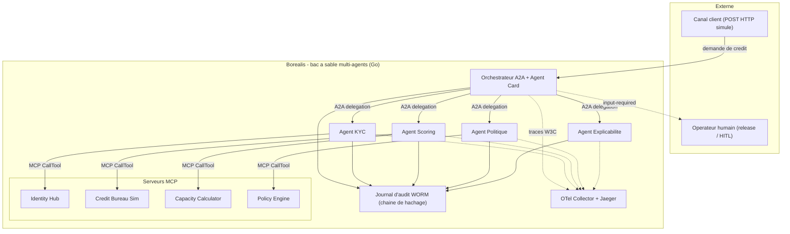
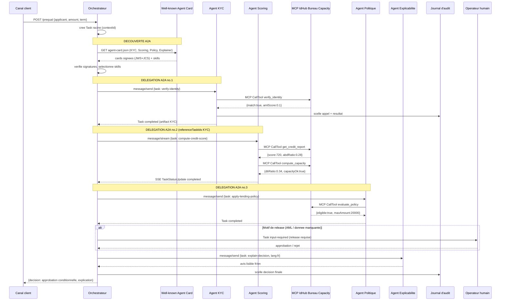
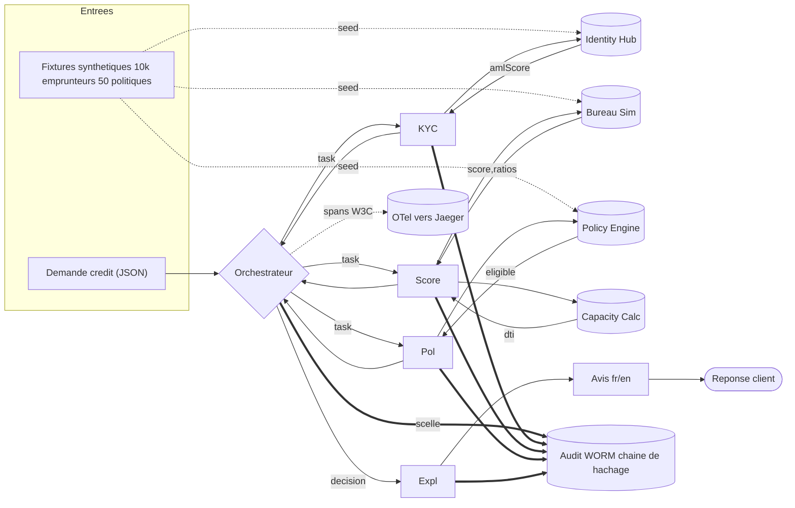
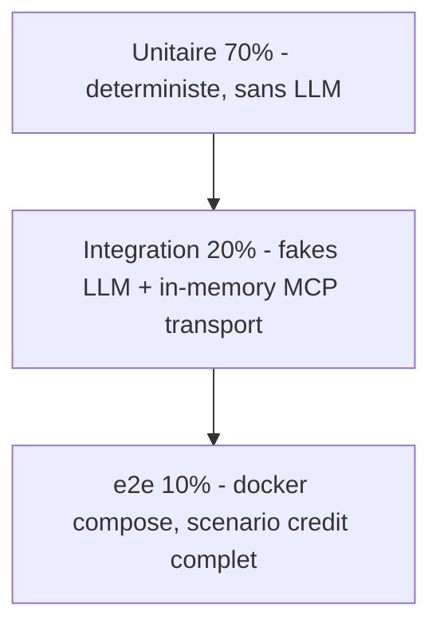
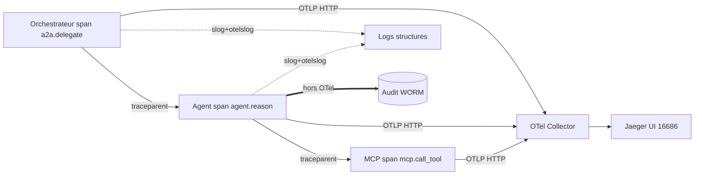

# PRD — Borealis : Implémentation de référence exécutable de l'interopérabilité agentique MCP + A2A

| | |
|---|---|
| **Titre** | Borealis — Bac à sable multi-agents (MCP + A2A) pour la pré-qualification de crédit |
| **Sous-titre** | Implémentation de référence open-source matérialisant l'Annexe B de la monographie *InteroperabiliteAgentique* |
| **Auteur / Commanditaire** | André-Guy Bruneau, M.Sc. informatique — architecte, services financiers coopératifs |
| **Version** | 2.0 |
| **Date** | 2026-07-07 |
| **Statut** | Version finale — prête pour revue par les personae |
| **Historique** | v1.0 (2026-07-04) : rédaction initiale. v2.0 (2026-07-07) : alignement vérifié sur la monographie (ch. 3, 5, 6, 7) et l'Annexe B ; correction des renvois, des dates et du mapping ArchiMate. |
| **Langue** | Français (Québec), interface bilingue fr/en |
| **Licence pressentie** | Apache 2.0 (code), CC BY 4.0 (documentation et jeux de données fictifs) |

> **Avertissement de fiction.** « Coopérative financière Boréalis » est une entité **entièrement fictive**. Toutes les données (emprunteurs, cotes, historiques) sont **synthétiques**. Borealis n'est **pas** un système de production, n'est relié à aucun système réel, et ne doit jamais l'être. Aucune donnée personnelle réelle ne transite par ce dépôt.

---

## Table des matières

0. En-tête *(ci-dessus)*
1. [Résumé exécutif / Vision](#1-résumé-exécutif--vision)
2. [Contexte et énoncé du problème](#2-contexte-et-énoncé-du-problème)
3. [Buts et non-buts](#3-buts-et-non-buts)
4. [Personae et parties prenantes](#4-personae-et-parties-prenantes)
5. [Cas d'usage métier : pré-qualification de crédit](#5-cas-dusage-métier--pré-qualification-de-crédit)
6. [Architecture cible](#6-architecture-cible)
7. [Choix technologiques et justification](#7-choix-technologiques-et-justification)
8. [Exigences fonctionnelles (MoSCoW)](#8-exigences-fonctionnelles-moscow)
9. [Contrats et modèle de données](#9-contrats-et-modèle-de-données)
10. [Exigences non fonctionnelles (NFR)](#10-exigences-non-fonctionnelles-nfr)
11. [Sécurité, identité et conformité](#11-sécurité-identité-et-conformité)
12. [Stratégie de test et qualité](#12-stratégie-de-test-et-qualité)
13. [Observabilité](#13-observabilité)
14. [Arborescence du dépôt et conventions](#14-arborescence-du-dépôt-et-conventions)
15. [Feuille de route et jalons](#15-feuille-de-route-et-jalons)
16. [Critères d'acceptation globaux / Definition of Done](#16-critères-dacceptation-globaux--definition-of-done)
17. [Métriques de succès / KPI](#17-métriques-de-succès--kpi)
18. [Risques et mitigations](#18-risques-et-mitigations)
19. [Décisions d'architecture initiales (ADR seeds)](#19-décisions-darchitecture-initiales-adr-seeds)
20. [Dépendances et hypothèses](#20-dépendances-et-hypothèses)
21. [Évolution future / alignement prospectif 2027-2032](#21-évolution-future--alignement-prospectif-2027-2032)
22. [Glossaire et références](#22-glossaire-et-références)
23. [Audit du code livré (2026-07-08)](#23-audit-du-code-livré-2026-07-08)

---

## 1. Résumé exécutif / Vision

**En une phrase.** Borealis transforme le plan directeur écrit de l'Annexe B de la monographie *InteroperabiliteAgentique* en un **démonstrateur Go exécutable** : cinq agents spécialisés se découvrent par **Agent Card (A2A)**, se délèguent des tâches, et consomment outils et données par **serveurs MCP**, sur un cas d'usage unique et concret — la **pré-qualification d'une demande de prêt personnel**.

**L'argument.** La monographie a démontré, sur 566 pages, *comment* l'interopérabilité agentique devrait fonctionner en services financiers d'entreprise : découplage par contrat, isolation, évolution non disruptive. Ce qu'il manque, c'est la preuve exécutable — l'écart entre « la théorie écrite » et « le code qui tourne ». En 2026, les SDK Go officiels sont matures (`github.com/modelcontextprotocol/go-sdk` v1.6.1 ⚠, protocole A2A v1.0 GA depuis mars 2026 sous la Linux Foundation, `a2a-go`, ADK Go), ce qui rend cette preuve **réalisable à faible coût**. Borealis comble l'écart au niveau de rigueur d'ingénierie de **FibGo** (clean architecture, plancher de couverture ≥ 80 %, tests golden immuables, ADR documentées, détection de course, gate local sans CI distante).

**La thèse à incarner.** Chaque agent est un **C**ontrat (Agent Card signée, découvrable), **I**solé (aucun état partagé, communication par tâche typée), qui **É**volue (ajout de compétences sans casser les consommateurs, découverte dynamique de nouveaux pairs). Borealis rend cette thèse *tangible* : on peut arrêter un agent, en substituer un autre au contrat compatible, et le workflow continue.

**Ce que ce n'est pas.** Pas un système de production. Pas de vraies données. Pas d'entraînement de modèle. Pas la pile IBM complète de l'Annexe B (watsonx Orchestrate, DataPower, MQ z/OS, Confluent managé) — ces éléments sont **remplacés par des équivalents locaux minimaux** ou explicitement **hors-scope**. Le module d'identité complet (NHI, HSM matériel, WORM matériel) est un **candidat #2** distinct ; Borealis en pose seulement les **coutures**.

**Résultat attendu.** Un dépôt clonable où `docker compose up` démarre l'orchestrateur, 4 agents et 4 serveurs MCP ; où `make e2e` exécute le scénario de crédit de bout en bout de façon déterministe ; et où un lecteur de la monographie retrouve, ligne à ligne, les concepts du chapitre 6 (ArchiMate) et de l'Annexe B (invariants 1, 3, 5, 6 et 7).

---

## 2. Contexte et énoncé du problème

### 2.1 L'écart théorie → code

La monographie *InteroperabiliteAgentique* (7 chapitres, 566 pages) couvre l'état de l'art de l'interopérabilité agentique en services financiers : les protocoles **MCP** (agent↔outil), **A2A** (agent↔agent) et **ANP** ; la modélisation **ArchiMate** (chapitre 6) ; une pile d'entreprise IBM (watsonx Orchestrate, API Connect, Confluent, MQ, z/OS Connect) ; et un horizon prospectif 2027-2032 (chapitre 7). L'**Annexe B** (~17 100 mots, 28 figures) décrit une **architecture de solution appliquée** pour une coopérative financière fictive, « Boréalis ».

Cette Annexe B est un **blueprint** — riche, cohérent, mais **non exécutable**. Un architecte qui la lit ne peut pas *lancer* le système, *casser* un contrat pour voir ce qui échoue, ni *mesurer* la latence d'une délégation A2A. La valeur pédagogique et la crédibilité de la thèse plafonnent tant qu'il n'existe pas d'artefact **exécutable**.

### 2.2 Pourquoi maintenant

Trois maturités convergent au T2/T3 2026 et rendent la démonstration réalisable **sans sur-ingénierie** :

| Brique | État mi-2026 | Conséquence pour Borealis |
|---|---|---|
| **SDK MCP Go officiel** | `github.com/modelcontextprotocol/go-sdk` — v1.0.0 (mi-2025, gel d'API et garantie de compatibilité), v1.6.1 (mi-2026), maintenu conjointement avec Google, support complet de la spec. Licence MIT (code legacy) + Apache 2.0 (nouvelles contributions). ⚠ *Versions, dates et licence à re-vérifier au dépôt officiel avant publication (non couvertes par la validation adverse des sources de la monographie).* | Serveurs et clients MCP en Go idiomatique ; schémas JSON **inférés** des struct tags via `AddTool[In, Out]` (jamais construits à la main). Pas de SDK maison. |
| **A2A + `a2a-go`** | Protocole annoncé par Google (avril 2025), donné à la **Linux Foundation** le 23 juin 2025 ; **v1.0.0 GA le 12 mars 2026** (v1.0.1 courante, 28 mai 2026) ; jalon **150+ organisations impliquées** le 9 avril 2026 (déclaration de la Linux Foundation ; premiers usages en production documentés — Google, Microsoft, AWS, Salesforce, IBM…) ; Agent Cards signées (JWS + JCS). SDK Go `a2a-go` (Apache 2.0) ⚠. | Découverte par `/.well-known/agent-card.json`, délégation par JSON-RPC 2.0 sur HTTP, cycle de vie de Task à 8 états. |
| **ADK Go (optionnel)** | `google/adk-go`, Apache 2.0, intégration native A2A + MCP (`mcptoolset`). API v2 encore jeune ⚠. | Utilisable pour une boucle d'agent si nécessaire, mais **derrière une interface** — Borealis n'en dépend pas structurellement (voir §7). |

### 2.3 Le problème en une formulation vérifiable

> *Il n'existe aujourd'hui aucun artefact open-source, exécutable, en Go, au calibre d'ingénierie de FibGo, qui démontre concrètement — sur un cas d'usage financier — le triptyque MCP + A2A + Agent Card et la thèse « découplage, contrat, évolution » de l'Annexe B.*

**Critère de résolution.** Un tiers clone le dépôt, exécute `docker compose up` puis `make e2e`, observe le scénario de crédit se dérouler de bout en bout avec traces distribuées corrélées, et peut arrêter/substituer un agent pour vérifier le découplage — le tout en moins de 15 minutes de mise en route.

---

## 3. Buts et non-buts

### 3.1 Objectifs mesurables (buts)

| ID | Objectif | Critère vérifiable |
|---|---|---|
| **G-1** | Démontrer la **découverte A2A par Agent Card**. | L'orchestrateur découvre ≥ 4 agents pairs via `GET /.well-known/agent-card.json`, sans registre central codé en dur ; test d'intégration vert. |
| **G-2** | Démontrer la **délégation A2A** avec cycle de vie de Task. | Une demande de crédit traverse ≥ 3 délégations chaînées (`referenceTaskIds`) ; les états de Task observés couvrent au moins `submitted → working → completed` et un chemin `input-required`. |
| **G-3** | Démontrer l'**accès aux outils/données par MCP**. | ≥ 4 serveurs MCP exposent des outils appelés via le SDK officiel ; schémas d'E/S validés automatiquement. |
| **G-4** | Incarner la thèse **découplage / contrat / évolution**. | On substitue un agent (ex. Scoring v1 → v2 au contrat compatible) sans modifier l'orchestrateur ; le test e2e reste vert (ancrage : ch.6 §6.10 — chaque palier formalise un contrat de capacité atteint ; le test e2e vert après substitution est l'indicateur de franchissement *mesuré*, dans l'esprit de §6.10.3). |
| **G-5** | Fournir l'**explicabilité** de la décision de crédit (illustrative Loi 25 art. 12.1). | Chaque décision produit un texte lisible fr/en listant critères, seuils et motif ; couverture 100 % des décisions. |
| **G-6** | Atteindre le **calibre d'ingénierie FibGo**. | Couverture ≥ 80 %, `go test -race` vert, `golangci-lint` vert, `govulncheck` vert, tests golden immuables, ADR à jour, gate local (`scripts/check.{sh,ps1}`). |
| **G-7** | Fournir un **journal d'audit** distinct de l'observabilité. | Journal append-only horodaté et haché (chaîne de hachage), séparé des logs SRE ; test vérifiant l'immuabilité et la chaîne de hachage. |
| **G-8** | Rester **déterministe et reproductible**. | LLM derrière une interface avec fake déterministe ; `make e2e` produit un résultat identique à chaque exécution ; build Docker reproductible (double build, SHA256 identiques). |

### 3.2 Non-buts (hors-scope explicite)

| ID | Hors-scope | Raison / renvoi |
|---|---|---|
| **NG-1** | Système de production de la coopérative réelle. | Démonstrateur uniquement. Confidentialité. |
| **NG-2** | Vraies données personnelles / financières. | 100 % synthétique. Loi 25 / éthique. |
| **NG-3** | Entraînement ou fine-tuning de modèle. | Le scoring utilise soit un fake déterministe, soit un LLM réel **appelé** derrière une interface — jamais entraîné ici. |
| **NG-4** | Module d'identité complet (NHI JIT réel, HSM matériel, WORM matériel, OAuth2 token-exchange multi-hop atténué RFC 8693 complet). | **Candidat #2.** Borealis pose les **coutures** (`securitySchemes`, journal WORM logiciel, PEP minimal) sans les industrialiser. |
| **NG-5** | Pile IBM d'entreprise (watsonx Orchestrate/governance, DataPower, MQ z/OS, API Connect, Confluent managé). | Remplacée par équivalents locaux minimaux (fichiers, HTTP, file en mémoire — pas de Kafka sauf démonstration multi-instance strictement requise). |
| **NG-6** | Haute disponibilité réelle, failover multi-zone, résilience DORA opérationnelle, Kubernetes. | Illustré par des timeouts/retries/circuit-breaker en code ; **pas** de cluster HA. |
| **NG-7** | Conformité réglementaire *réelle* (E-23, AMF, DORA, FINTRAC). | Conformité **illustrative** : les contrôles montrent le *pattern*, ils ne certifient rien. |
| **NG-8** | Passage à l'échelle du parc cible 40-80 agents gouvernés (Annexe B §1.1 et §9.4). | Borealis démontre le **pattern réutilisable** sur 5 agents. L'échelle est un travail ultérieur. |
| **NG-9** | Cryptographie post-quantique opérationnelle (ML-DSA/ML-KEM). | **Placeholder** de crypto-agilité seulement (suite d'algorithmes encodée dans le contrat). Migration réelle = 2027+. |

> **Principe directeur (simplicité délibérée).** À chaque exigence, la question posée est : *un pair expérimenté jugerait-il ceci surdimensionné pour un démonstrateur ?* Si oui, on marque le raccourci d'un commentaire `// ponytail:` nommant le plafond et le chemin de montée, et on reste minimal. (Convention propre à ce projet, sans lien avec l'Annexe B.)

---

## 4. Personae et parties prenantes

| Persona | Description | Ce qu'il attend de Borealis | Critère de satisfaction |
|---|---|---|---|
| **Aline — Architecte d'entreprise** (proxy de l'auteur) | Conçoit l'interopérabilité agentique, écrit ArchiMate. | Retrouver les concepts de la monographie dans du code exécutable ; valider la thèse. | Peut mapper chaque composant Go à un élément ArchiMate / une section de l'Annexe B (§6.6). |
| **David — Développeur évaluateur MCP/A2A** | Doit implémenter MCP/A2A dans son organisation ; cherche un exemple de référence Go. | Des patterns copiables : serveur MCP, client A2A, Agent Card, tests. | Peut extraire un serveur MCP et un handler A2A fonctionnels en < 1 h. |
| **Carmen — Auditrice / Conformité** | Vérifie explicabilité, audit, séparation des tâches. | Journal d'audit infalsifiable, explication lisible, maker-checker structurel. | Peut rejouer le journal d'audit d'une décision et lire l'explication fr/en correspondante. |
| **Marc — Lecteur de la monographie** | A lu l'Annexe B ; veut voir « comment ça tourne ». | Un pont clair *blueprint* → code ; README qui cite les sections. | Lance le scénario e2e et suit le récit §5.1 et le diagramme de séquence §6.4 dans les traces réelles. |
| **Priya — Future contributrice** | Veut étendre Borealis (nouvel agent, nouveau protocole). | Arborescence lisible, ADR, conventions, gate local. | Ajoute un agent au contrat compatible ; `scripts/check` reste vert. |

**Autres parties prenantes.** Communauté open-source (validation tierce des specs MCP/A2A), comités de standards (Borealis comme cas de test de convergence — voir §21), formateurs (support pédagogique).

---

## 5. Cas d'usage métier : pré-qualification de crédit

### 5.1 Récit de bout en bout

> **Alix**, cliente de la coopérative fictive Boréalis, soumet une **demande de prêt personnel** de 15 000 $ via un canal (simulé par un `POST` HTTP à l'orchestrateur). Le système doit rendre une **pré-évaluation** : approbation conditionnelle, refus, ou demande d'information complémentaire — **jamais un octroi ferme irréversible** (celui-ci reste sous mandat humain, invariant 1 de l'Annexe B ; même posture au ch.6 §6.4.3 : sur le crédit, l'agent assiste l'évaluation sans porter seul la décision d'octroi).

1. **Réception.** L'**Orchestrateur** reçoit la demande, crée une **Task A2A racine** (`contextId` groupant le dossier).
2. **Découverte.** Il lit les **Agent Cards** des pairs disponibles (`/.well-known/agent-card.json`), vérifie leurs signatures (JWS + JCS), et choisit les compétences pertinentes (`skills`).
3. **KYC (vérification identité).** Délégation A2A à l'**Agent KYC**, qui appelle le serveur MCP **Identity Hub** (vérification NAS/SIN synthétique, correspondance, listes OFAC / personnes politiquement exposées (PPE) simulées).
4. **Scoring (solvabilité).** Délégation à l'**Agent Scoring**, qui consomme le MCP **Credit Bureau Sim** (cote synthétique, ratios ABD/ATD) et le MCP **Capacity Calculator** (calcul de versement PMT, ratio charges/revenu). Le raisonnement passe par un LLM **derrière une interface** (fake déterministe en test).
5. **Politique.** Délégation à l'**Agent Politique**, qui appelle le MCP **Policy Engine** (tables d'octroi par segment : âge, ratios max, plafonds).
6. **Agrégation.** L'orchestrateur agrège les artefacts des trois délégations (KYC, scoring, politique).
7. **Human-in-the-loop.** Si un motif l'exige (ex. AML élevé, données manquantes), la Task passe à `input-required` / `auth-required` : release humaine requise avant tout pas irréversible.
8. **Décision + explicabilité.** L'**Agent Explicabilité** produit l'avis lisible fr/en (approbation conditionnelle / refus motivé).
9. **Audit.** Chaque appel d'outil, chaque décision, chaque donnée traitée est scellé dans le **journal d'audit WORM** (chaîne de hachage), distinct des traces SRE.

### 5.2 User stories (format « En tant que… »)

| ID | User story | Priorité |
|---|---|---|
| US-1 | En tant qu'**orchestrateur**, je veux **découvrir les agents pairs par Agent Card**, afin de router les tâches sans registre codé en dur. | Must |
| US-2 | En tant qu'**Agent KYC**, je veux **appeler l'outil MCP Identity Hub**, afin de vérifier l'identité synthétique de la demandeuse. | Must |
| US-3 | En tant qu'**Agent Scoring**, je veux **consommer Credit Bureau Sim + Capacity Calculator par MCP**, afin de calculer un score de solvabilité. | Must |
| US-4 | En tant qu'**orchestrateur**, je veux **chaîner les délégations par `referenceTaskIds`**, afin de composer un workflow multi-agents traçable. | Must |
| US-5 | En tant qu'**Agent Explicabilité**, je veux **produire un avis lisible fr/en**, afin de satisfaire le droit à l'explication (illustratif Loi 25 art. 12.1). | Must |
| US-6 | En tant qu'**auditrice**, je veux **un journal d'audit infalsifiable et rejouable**, afin de reconstituer toute décision. | Must |
| US-7 | En tant qu'**opérateur humain**, je veux **une release sur l'irréversible** (état `input-required`), afin qu'aucune action ferme ne parte sans validation. | Must |
| US-8 | En tant que **développeur**, je veux **suivre le workflow en streaming (SSE)**, afin d'observer l'avancement en temps réel. | Must |
| US-9 | En tant qu'**architecte**, je veux **substituer un agent au contrat compatible**, afin de prouver le découplage. | Must |
| US-10 | En tant qu'**opérateur**, je veux **une notification push webhook** en fin de tâche longue, afin de ne pas sonder. | Could |
| US-11 | En tant qu'**utilisateur**, je veux **choisir la langue de l'avis (fr/en)**, afin d'être servi dans ma langue. | Should |
| US-12 | En tant que **système**, réaliser un **octroi ferme automatisé** — fonctionnalité explicitement exclue du périmètre ; la garde correspondante (arrêt à la pré-évaluation, invariant 1) est, elle, exigée et testée via FR-25. | Won't |

---

## 6. Architecture cible

### 6.1 Inventaire des agents (A2A)

| Agent | Rôle | Niveau d'autonomie | `skills` (Agent Card) | Consomme (MCP) |
|---|---|---|---|---|
| **Orchestrateur** (`cmd/borealis-orchestrator`) | Chef d'orchestre : reçoit la demande, découvre, délègue, agrège, gère la release. | L1 (préparateur) | `orchestrate-prequal` | — (délègue en A2A) |
| **Agent KYC** (`cmd/agent-kyc`) | Vérification identité synthétique, listes PPE/OFAC simulées. | L1 | `verify-identity` | Identity Hub |
| **Agent Scoring** (`cmd/agent-scoring`) | Évaluation de solvabilité (score, ratios). | L1 | `compute-credit-score` | Credit Bureau Sim, Capacity Calculator |
| **Agent Politique** (`cmd/agent-policy`) | Application des règles d'octroi par segment. | L1 | `apply-lending-policy` | Policy Engine |
| **Agent Explicabilité** (`cmd/agent-explainer`) | Génération de l'avis lisible fr/en. | L0 (copilote) | `explain-decision` | — (règles + prose) |

> **Calibrage d'autonomie.** Niveaux repris de l'échelle L0-L3 de l'Annexe B §1.3 (L0 copilote, L1 préparateur) ; le placement du cas crédit en L1 est conforme au parc de l'Annexe B §12.1 (« Origination crédit (préparation) → L1, release humaine »).
>
> **Simplicité.** 5 agents suffisent à démontrer découverte + délégation + chaînage + substitution. `// ponytail: 5 agents = pattern; montée à N agents = ajout de cmd/agent-*, aucun changement d'orchestrateur.`

### 6.2 Inventaire des serveurs MCP et outils

| Serveur MCP | Outils exposés (`AddTool`) | Entrée (schéma inféré) | Sortie |
|---|---|---|---|
| **Identity Hub** (`cmd/mcp-identity`) | `verify_identity`, `check_watchlists` | `{applicantId, sin, name}` | `{match: bool, watchlistHit: bool, amlScore: float}` |
| **Credit Bureau Sim** (`cmd/mcp-bureau`) | `get_credit_report` | `{applicantId}` | `{score int, abdRatio, atdRatio, defaults int}` |
| **Capacity Calculator** (`cmd/mcp-capacity`) | `compute_capacity` | `{income, debts, requestedAmount, termMonths}` | `{monthlyPayment, dtiRatio, capacityOk bool}` |
| **Policy Engine** (`cmd/mcp-policy`) | `evaluate_policy` | `{segment, age, abdRatio, atdRatio, amount}` | `{eligible bool, maxAmount, reasons []}` |

> Chaque serveur expose un contrat de service : E/S en JSON-Schema (inféré), SLO de latence (~100-500 ms P95), énum d'erreurs (`InvalidInput`, `ServiceUnavailable`, `Unauthorized`, `NotFound`). Au moins un serveur expose aussi **une ressource** (FR-12) et **un prompt** (FR-13) MCP.

### 6.3 Diagramme de contexte / composants (C4 niveau 1-2)



### 6.4 Diagramme de séquence — scénario de crédit (découverte → délégation → MCP → réponse)



### 6.5 Diagramme de flux de données



### 6.6 Mapping ArchiMate / C4 / couches de la monographie

| Élément Borealis | C4 | ArchiMate 4 (ch.6 ; convention §6.0.8 : « écrire en v4, noter l'équivalent 3.2 ») | Annexe B |
|---|---|---|---|
| Agent (Orchestrateur, KYC…) | Container | Application Component `<<Agent>>` + Role assigné (patron hybride, §6.1.2) | Agents spécialisés, calibrage d'autonomie L0-L3 (§1.3, ADR-005) |
| Boucle de raisonnement | Component | Application Process `<<reasoning loop>>` (§6.1.2, §6.5.1) | « reasoning loop » |
| Appel d'outil atomique (`CallTool`) | — | Application Function (comportement non séquentiel, §6.5.1) | Appel gouverné par le PEP |
| Serveur MCP | Container | Application Component `<<MCP Server>>` (§6.1.3) | Serveurs d'outils (plan MCP superposé à la dorsale tri-plan, §4.0) |
| Outil MCP | Component | Application Service (une par outil) + Application Interface + Serving vers l'agent ; ressource lue = Data Object via Access (§6.1.3) | Contrat de service (input/output/SLO) |
| Agent Card | Artefact | Data Object « Agent Cards » associé à l'Application Component registre/catalogue (§6.1.6, §6.5.2) ; la découverte au runtime n'est pas représentable nativement (limite §6.1.6) | Fig. F — registre MCP + Data Object « Agent Cards » (la signature JWS+JCS relève de la spec A2A) |
| Délégation A2A | Flux | Flow (transfert) et/ou Triggering (déclenchement) ; Application Collaboration si coopération durable ; message = Data Object (§6.1.4) | Orchestration agent↔agent |
| Journal d'audit WORM | Container | Data Object append-only (Profile dédié) ; deux Data Objects distincts SRE vs audit (§6.6.4) | §3.5 et §3.7 (invariant 5, audit ≠ observabilité) |
| PEP minimal | Component | Application Service de traversée obligatoire (§6.6.2) ; plan de contrôle = Application Collaboration `<<Control Plane>>` (§6.1.6) | Invariant 3 (PEP obligatoire) |
| Release humaine | Interaction | Business Collaboration + comportement unifié ; point HITL = Assignment d'un Role humain à l'étape irréversible (§6.1.7, §6.4.2 ; équiv. 3.2 : Business Interaction) | Invariant 1 (release sur l'irréversible) |
| Confinement réseau (NFR-06, 0 egress) | Déploiement | Résidence portée par la couche Technology (§6.5.8) | Invariant 6 (résidence = absence de chemin sortant ; §6.5, §7.2) |

> **Registre des stéréotypes.** Les stéréotypes employés (`<<Agent>>`, `<<MCP Server>>`, `<<NHI>>`, `<<Control Plane>>`, `<<reasoning loop>>`) sont ceux du registre normatif du ch.6 §6.1.9 ; `docs/ARCHITECTURE.md` les reprend verbatim. Le champ `kya` du journal (§9.4) instancie le patron `<<NHI>>` (§6.1.5).
>
> **Anti-patrons évités par conception** (ch.6 §6.9.2) : nᵒ 1 — agent « boîte magique » (le triplet composant/boucle/rôle du patron hybride sépare structure, comportement et imputabilité) ; nᵒ 2 — interaction A2A modélisée en Serving (les délégations sont des Flow/Triggering) ; nᵒ 4 — inventaire fantôme (découverte par Agent Card réelle + matrice de traçabilité M5) ; nᵒ 5 — HITL décoratif (release exactement sur l'étape irréversible, FR-16).

---

## 7. Choix technologiques et justification

### 7.1 Tableau de décision

| Domaine | Choix | Alternatives écartées | Justification |
|---|---|---|---|
| **Langage** | Go 1.22+ | Python, Java, TypeScript | Concurrence idiomatique, binaire unique, `slog` stdlib, SDK MCP/A2A officiels en Go, aligne le calibre FibGo. |
| **MCP** | `github.com/modelcontextprotocol/go-sdk` v1.6.x ⚠ | `mark3labs/mcp-go`, `metoro/mcp-golang` | SDK **officiel**, gel d'API depuis v1.0.0, schémas inférés (`google/jsonschema-go`), maintenu avec Google. `mark3labs` a influencé le design mais a une API divergente et n'est plus la référence. |
| **A2A** | `a2a-go` (a2aproject / a2aserver) ⚠ | HTTP inter-agents maison, gRPC direct | Contrat découplé, Agent Cards signées, cycle de vie de Task normalisé, écosystème de 150+ organisations impliquées (déclaration de la Linux Foundation). Un HTTP maison réinvente le protocole. |
| **ADK Go** | **Optionnel, derrière interface** | Dépendance structurelle à ADK | ADK Go intègre A2A+MCP mais est jeune (~8,4 k étoiles, risque de *breaking changes* v2.x). Borealis l'isole derrière `internal/agent.Reasoner` → substituable. |
| **Transport MCP** | `stdio` (dév/test) → `StreamableHTTP` (multi-client) | HTTP+SSE legacy (déprécié mars 2025) | `stdio` = zéro infra pour tests unitaires ; Streamable HTTP = transport MCP standard depuis la révision 2025-03-26, pour le déploiement multi-client. SSE legacy exclu. |
| **Transport A2A** | JSON-RPC 2.0 / HTTP + **SSE** (streaming) | Polling seul, webhooks d'abord | JSON-RPC simple pour le happy path ; SSE (`text/event-stream`) pour le streaming temps réel (US-8). Webhooks push = `Could` (US-10). |
| **LLM** | **Interface `Reasoner`** : fake déterministe (défaut) + adaptateur LLM réel optionnel | LLM réel obligatoire | Déterminisme des tests (G-8). Le fake retourne des réponses préconfigurées par scénario (`approved`, `denied`, `escalate`). |
| **Orchestration locale** | `docker compose` | Kubernetes, k3d | Repro locale, zéro cluster. K8s = hors-scope (NG-6). |
| **Observabilité** | OpenTelemetry (OTLP HTTP) + Jaeger + `otelslog` | Logs bruts, Datadog | Traces distribuées W3C à travers A2A/MCP ; corrélation par `task id`. Gratuit, local. |
| **Logs** | `slog` (stdlib) + pont `otelslog` | `zap`, `logrus` | Stdlib, `trace_id`/`span_id` injectés. Pas de dépendance de logging. |
| **File d'attente release** | File en mémoire (défaut) ; Kafka local seulement si démontré nécessaire | Confluent managé, MQ z/OS | Simplicité. La sémantique « exactly-once » de MQ est **simulée** par idempotence + dédup. `// ponytail: file mémoire; Kafka local si démo multi-instance requise.` |
| **Crypto Agent Card** | `crypto/ecdsa` + `crypto/rsa` (JWS RS256 (RSA) ou ES256 (ECDSA) + canonicalisation JCS) stdlib | Bibliothèque JOSE tierce | Signature/vérification JWS suffisante en stdlib. Post-quantique = placeholder (NG-9). |
| **Audit WORM** | Fichier append-only + `crypto/sha256` (chaîne de hachage) | HSM matériel, Db2 immuable | Démontre le *pattern* WORM en pur Go. HSM réel = candidat #2 (NG-4). |

### 7.2 Interface d'isolation du LLM (exemple Go)

```go
// internal/agent/reasoner.go
package agent

import "context"

// Reasoner isole toute inférence LLM derrière un contrat étroit.
// Le fake déterministe (tests) et l'adaptateur LLM réel l'implémentent tous deux.
type Reasoner interface {
    // Decide prend un contexte de dossier et retourne une décision structurée.
    Decide(ctx context.Context, in DecisionInput) (DecisionOutput, error)
}

// ponytail: interface à une méthode; on l'élargit seulement si un 2e usage réel apparaît.
```

### 7.3 Note sur l'authentification inter-agents (état mi-2026)

Le côté **client** OAuth du SDK MCP Go n'est pas entièrement stabilisé mi-2026 (les primitives **serveur** existent via les packages `auth`/`oauthex`) ⚠ — statut à re-vérifier au dépôt officiel avant publication. Conséquence de conception : la couture d'auth A2A de Borealis s'appuie sur un **jeton porteur (bearer JWT) via un IdP mock local** (FR-26) plutôt que sur un flux OAuth complet côté client. `// ponytail: bearer + IdP mock; OAuth client complet et token-exchange RFC 8693 = candidat #2 quand le SDK stabilise le côté client.`

### 7.4 Aiguillage des interactions (transposition de la règle de substrat, Annexe B §4.5)

| Type d'interaction Borealis | Substrat local | Équivalent Annexe B (§4.5) | Garantie clé |
|---|---|---|---|
| Lecture / interrogation (agent → outil) | Appel MCP synchrone (`CallTool`) | Plan synchrone — API Connect / DataPower | Réponse bornée par timeout, idempotente |
| Engagement post-release (proposition → commande) | File de commande en mémoire, distincte de la file de proposition (§14, `internal/hitl`) | Plan commande — IBM MQ (*exactly-once*) | Aucune entrée sans release journalisée (FR-16) |
| Suivi temps réel d'une tâche longue | SSE (`message/stream`) | Plan événement — Confluent | Flux d'événements, purgeable |
| Notification de fin | Webhook signé (`PushNotificationConfig`) | Plan événement | Anti-rejeu (token + timestamp) |

> Transposition locale de la règle de décision de substrat (Annexe B §4.5, fig. 5) : ne jamais router une commande irréversible sur le substrat événementiel, ni un fan-out sur le rail de commande.

---

## 8. Exigences fonctionnelles (MoSCoW)

Chaque exigence porte un ID `FR-xx`, une priorité MoSCoW et un **critère d'acceptation vérifiable**.

### 8.1 Découverte & Agent Card

| ID | Priorité | Exigence | Critère d'acceptation |
|---|---|---|---|
| **FR-01** | Must | Chaque agent publie une Agent Card à `/.well-known/agent-card.json`, **conforme au schéma AgentCard A2A v1.0** (champs requis du schéma, dont `name`, `description`, `version`, `url`, `skills`). | `GET` sans auth retourne un JSON valide contre le schéma officiel A2A ; test de contrat vert. |
| **FR-02** | Must | L'orchestrateur découvre les pairs via leur card et sélectionne les `skills` requis (aucun endpoint codé en dur autre que les URL de base configurées). | Test : retirer un agent de la config → l'orchestrateur ne le route plus, sans modif de code. |
| **FR-03** | Must | Les Agent Cards sont **signées (JWS + JCS)** et vérifiées avant routage. | Card à signature invalide → rejet + entrée d'audit ; test négatif vert. |
| **FR-04** | Could | Les cards déclarent `capabilities.streaming` et `pushNotifications`. | L'orchestrateur choisit le mode de transport selon la capability annoncée. |

### 8.2 Délégation A2A & cycle de vie de Task

| ID | Priorité | Exigence | Critère d'acceptation |
|---|---|---|---|
| **FR-05** | Must | L'orchestrateur délègue par `message/send` (JSON-RPC 2.0) et suit le cycle de vie de Task. | États observés couvrent `submitted → working → completed` ; test d'intégration vert. |
| **FR-06** | Must | Les tâches se chaînent par `referenceTaskIds` (contextId partagé). | Le dossier KYC est référencé par la tâche Scoring ; assertion sur les IDs chaînés. |
| **FR-07** | Must | Gestion des états terminaux (`completed`, `failed`, `canceled`, `rejected`) irréversibles. | Un `failed` ne peut pas transiter vers `completed` ; test de machine à états. |
| **FR-08** | Must | Streaming SSE (`message/stream`) pour les tâches longues (employé par la séquence nominale §6.4). | Le client reçoit ≥ 2 `TaskStatusUpdateEvent` en `text/event-stream` ; test SSE vert. |
| **FR-09** | Could | Notification push webhook (`PushNotificationConfig`) en fin de tâche. | Le webhook reçoit un `POST` signé ; vérification token + timestamp (anti-rejeu). |

### 8.3 Outils, ressources et prompts MCP

| ID | Priorité | Exigence | Critère d'acceptation |
|---|---|---|---|
| **FR-10** | Must | Chaque serveur MCP expose ses outils via `AddTool[In, Out]` (schémas inférés des struct tags). | `session.CallTool` retourne un résultat validé ; schéma d'entrée rejette un input invalide (JSON-RPC -32602). |
| **FR-11** | Must | Les agents appellent les outils MCP via le SDK officiel (client `NewClient` + `Connect`). | Test d'intégration : chaque agent appelle ≥ 1 outil et consomme le résultat. |
| **FR-12** | Must | Exposer ≥ 1 **ressource** MCP (ex. `credit:///application/{id}/assessment`) via `AddResourceTemplate`. | `ReadResource` retourne l'évaluation ; `ResourceNotFoundError` sur URI inconnue. |
| **FR-13** | Must | Exposer ≥ 1 **prompt** MCP (ex. gabarit d'avis d'explicabilité) via `AddPrompt`. | `GetPrompt` retourne un `GetPromptResult` avec messages ; test vert. |
| **FR-14** | Must | Notification de progression pour les évaluations longues (`NotifyProgress`). | Le token de progression déclenche ≥ 1 `ProgressNotification` ; assertion. |

### 8.4 Erreurs, compensation, HITL

| ID | Priorité | Exigence | Critère d'acceptation |
|---|---|---|---|
| **FR-15** | Must | Distinguer erreurs protocole (JSON-RPC -32602) des erreurs métier (`isError: true` dans `CallToolResult`). | Deux tests : outil inconnu → -32602 ; entrée métier invalide → `isError`. Aucun `panic`. |
| **FR-16** | Must | **Human-in-the-loop** : sur motif de release, la Task passe `input-required` et attend l'approbation (point HITL sur l'irréversible : ch.6 §6.1.7, §6.8.3). Deux files distinctes proposition/commande (Annexe B §4.6-4.7d). | Scénario AML élevé → `input-required` ; sans approbation, aucune suite ; **aucun message n'atteint la file de commande sans événement de release journalisé** ; test vert. |
| **FR-17** | Should | Timeouts + retries avec backoff exponentiel + circuit-breaker sur appels MCP/A2A. | Serveur MCP indisponible → retry borné puis échec propre ; test d'injection de panne. |
| **FR-18** | Should | Idempotence des délégations (même `contextId` + mêmes params rejoués = pas de double effet). | Rejeu identique → un seul effet ; entrée d'audit signale le doublon. |

### 8.5 Audit & explicabilité

| ID | Priorité | Exigence | Critère d'acceptation |
|---|---|---|---|
| **FR-19** | Must | Journal d'audit **append-only**, horodaté, chaîné par hachage, distinct des logs SRE. | Toute tentative de réécriture rompt la chaîne ; test de vérification de la chaîne vert. |
| **FR-20** | Must | Chaque entrée d'audit trace : identité agent (KYA), propriétaire humain (KYH), identité demandeur (KYC), timestamp, action, résultat, version de modèle/contrat. | Assertion sur la présence des 7 champs par entrée. |
| **FR-21** | Must | **Explicabilité** : chaque décision produit un avis lisible fr/en (critères, seuils, motif). | Couverture 100 % des décisions ; latence < 500 ms ; snapshot golden fr et en. |
| **FR-22** | Should | Explication **hybride** : règles codées + importance de features + 1-2 phrases de contexte (jamais gabarit LLM seul). | Sur refus `score<300`, l'avis contient un motif codé déterministe ; test golden. |
| **FR-23** | Could | Export du journal d'audit dans un format rejouable (JSONL) pour l'auditrice. | `make audit-export` produit un JSONL ; rejeu reconstitue la décision. |

### 8.6 Séparation des tâches (maker-checker)

| ID | Priorité | Exigence | Critère d'acceptation |
|---|---|---|---|
| **FR-24** | Should | Aucun flux direct entre l'agent qui prépare (maker) et celui qui approuve (checker) ; passage par l'orchestrateur/journal. | Test topologique : le préparateur ne peut appeler directement l'approbateur (vérification exécutable de la preuve structurelle de non-collusion — aucune relation Flow directe proposeur→approbateur, ch.6 §6.1.7 et §6.6.4). |
| **FR-25** | Won't | Octroi ferme irréversible automatisé. | **Explicitement absent.** Le système s'arrête à la pré-évaluation ; toute action ferme = release humaine hors-scope. Test négatif : aucun chemin de code d'octroi ; le test e2e s'arrête à la pré-évaluation. |

### 8.7 Authentification inter-agents

| ID | Priorité | Exigence | Critère d'acceptation |
|---|---|---|---|
| **FR-26** | Should | Chaque appel A2A porte un jeton bearer JWT court émis par l'IdP mock local, à **audience restreinte** (claim `aud` propre au destinataire — pattern Resource Indicators RFC 8707, cf. Monographie ch.3 §3.2.5), vérifié par l'agent appelé. | Appel sans jeton, jeton invalide ou `aud` non conforme → rejet 401 + entrée d'audit ; test négatif vert. |

---

## 9. Contrats et modèle de données

### 9.1 Agent Card — exemple (Agent Scoring)

```json
{
  "name": "borealis-agent-scoring",
  "description": "Évalue la solvabilité d'une demande de prêt personnel (score, ratios, capacité).",
  "version": "1.0.0",
  "url": "http://agent-scoring:8003/a2a",
  "provider": { "organization": "Coopérative financière Boréalis (fictive)", "url": "https://example.invalid/borealis" },
  "capabilities": { "streaming": true, "pushNotifications": false, "extendedAgentCard": false },
  "defaultInputModes": ["application/json"],
  "defaultOutputModes": ["application/json"],
  "skills": [
    {
      "id": "compute-credit-score",
      "name": "Évaluation de solvabilité",
      "description": "Calcule un score de crédit et les ratios à partir de données bureau + capacité.",
      "tags": ["credit", "scoring", "prequalification"],
      "examples": [
        { "input": "{\"applicantId\":\"A123\",\"income\":72000,\"amount\":15000,\"termMonths\":48}",
          "output": "{\"score\":720,\"tier\":\"bon\",\"dtiRatio\":0.34,\"capacityOk\":true}" }
      ]
    }
  ],
  "securitySchemes": {
    "bearerAuth": { "type": "http", "scheme": "bearer", "bearerFormat": "JWT" }
  },
  "security": [ { "bearerAuth": [] } ],
  "signatures": [ { "protected": "…", "signature": "…" } ]
}
```

> Schémas de sécurité A2A supportés par la spec : `apiKey`, `http` (bearer), `oauth2`, `openIdConnect`, `mtls`. Borealis implémente `bearerAuth` (JWT) comme cas minimal ; les autres restent déclaratifs.

### 9.2 Schéma d'outil MCP — exemple Go (schéma inféré)

```go
// cmd/mcp-capacity/main.go
package main

import (
    "context"
    "math"

    "github.com/modelcontextprotocol/go-sdk/mcp"
)

type CapacityIn struct {
    Income          float64 `json:"income" jsonschema:"revenu annuel brut de la demandeuse"`
    Debts           float64 `json:"debts" jsonschema:"total des autres dettes mensuelles"`
    RequestedAmount float64 `json:"requestedAmount" jsonschema:"montant demandé"`
    TermMonths      int     `json:"termMonths" jsonschema:"durée du prêt en mois"`
}

type CapacityOut struct {
    MonthlyPayment float64 `json:"monthlyPayment"`
    DTIRatio       float64 `json:"dtiRatio"`
    CapacityOk     bool    `json:"capacityOk"`
}

// Signature ToolHandlerFor[In, Out] : args In déjà déballés et validés par le SDK.
func computeCapacity(ctx context.Context, req *mcp.CallToolRequest, in CapacityIn) (*mcp.CallToolResult, CapacityOut, error) {
    // ponytail: PMT standard, pas d'amortissement fiscal — démonstrateur.
    r := 0.09 / 12.0
    n := float64(in.TermMonths)
    pmt := in.RequestedAmount * r / (1 - math.Pow(1+r, -n))
    dti := (pmt + in.Debts) / (in.Income / 12.0)
    return nil, CapacityOut{
        MonthlyPayment: round2(pmt),
        DTIRatio:       round2(dti),
        CapacityOk:     dti <= 0.40,
    }, nil
}

func round2(x float64) float64 { return math.Round(x*100) / 100 }

func main() {
    s := mcp.NewServer(&mcp.Implementation{Name: "capacity-calculator", Version: "v1.0.0"}, nil)
    mcp.AddTool(s, &mcp.Tool{Name: "compute_capacity", Description: "calcule le versement et le ratio DTI"}, computeCapacity)
    _ = s.Run(context.Background(), &mcp.StdioTransport{})
}
```

### 9.3 Structure de la Task A2A et des artefacts (illustratif)

```json
{
  "id": "task-7f3a…",
  "contextId": "ctx-alix-15000",
  "status": { "state": "completed", "timestamp": "2026-07-04T14:22:11Z" },
  "history": [
    { "role": "user", "parts": [{ "kind": "text", "text": "évaluer solvabilité A123" }],
      "referenceTaskIds": ["task-kyc-1a2b…"] },
    { "role": "agent", "parts": [{ "kind": "text", "text": "score calculé" }] }
  ],
  "artifacts": [
    { "name": "credit-score",
      "parts": [{ "kind": "data",
        "data": { "score": 720, "tier": "bon", "dtiRatio": 0.34, "capacityOk": true } }] }
  ]
}
```

> Structure alignée sur le schéma A2A v1.0 (`Task{id, contextId, status{state}, history[], artifacts[]}` ; `referenceTaskIds` porté par le `Message`, non par la Task). L'exemple reste illustratif : le schéma officiel fait foi.

### 9.4 Format du journal d'audit (JSONL, une entrée)

```json
{
  "seq": 42,
  "ts": "2026-07-04T14:22:11.331Z",
  "kya": "nhi:agent:scoring@borealis",
  "owner_kyh": "human:credit-lead@borealis.example",
  "kyc": "applicant:A123",
  "action": "mcp.CallTool:compute_capacity",
  "input_hash": "sha256:9af1…",
  "result": "capacityOk=true dti=0.34",
  "model_version": "reasoner-fake:v1 | policy-contract:1.0.0",
  "prev_hash": "sha256:be22…",
  "entry_hash": "sha256:41cd…"
}
```

> `entry_hash = sha256(seq || ts || kya || owner_kyh || kyc || action || input_hash || result || prev_hash)`. La chaîne de `prev_hash` forme une **chaîne de hachage** vérifiable de bout en bout (dispositif désigné « chaînage Merkle » dans l'Annexe B §3.7 ; un arbre de Merkle complet, avec preuves d'inclusion, relève du candidat #2). Le champ `owner_kyh` restaure l'imputabilité humaine exigée par l'Annexe B §3.6 (toute action porte l'empreinte du propriétaire humain).

### 9.5 Jeux de données fictifs (seeding)

| Fichier | Contenu | Volume |
|---|---|---|
| `test/fixtures/borrowers.json` | Emprunteurs synthétiques `{id, prénom, nom, sin(fictif), revenu, dettes, cote, defaults}` | 10 000 |
| `test/fixtures/policies.csv` | Tables d'octroi `{segment, âge_min, âge_max, abd_max, atd_max, plafond}` | 50 |
| `test/fixtures/history.jsonl` | Historiques de crédit synthétiques | ~100 000 (Git LFS si > 100 Mo) |
| `test/golden/decision_matrix.json` | Matrice décision attendue par cas de test (immuable) | ~30 cas |

> **Réalisme.** Fictif mais crédible : plages de scores et ratios plausibles pour une coopérative canadienne, avec cas riches (refus AML, refus scoring, approbation conditionnelle, données manquantes). Le générateur est **seedé et déterministe** ; aucun PII réel. `// ponytail: générateur seedé déterministe; aucun PII réel.`

---

## 10. Exigences non fonctionnelles (NFR)

| ID | Domaine | Cible / SLO | Critère vérifiable |
|---|---|---|---|
| **NFR-01** | Latence (boucle agent) | P99 boucle complète < 2 s (nominal, fake LLM) | Benchmark `make bench` ; régression > 5 % = blocage. |
| **NFR-02** | Latence (MCP) | P95 appel outil < 500 ms | Métrique OTel `mcp_tool_latency` ; assertion sur histogramme. |
| **NFR-03** | Audit | Écriture audit < 200 ms P99 ; ≥ 1000 écritures/s | Micro-benchmark du logger WORM. Le seuil 200 ms P99 reprend l'Annexe B §1.4/§9.3 ; le débit est une cible propre au démonstrateur (les valeurs §9 de l'Annexe B sont des hypothèses à calibrer, §17). |
| **NFR-04** | Résilience | Détection panne MCP/A2A < 30 s ; retries bornés | Test d'injection de panne ; circuit-breaker s'ouvre. |
| **NFR-05** | Idempotence | Rejeu identique → aucun double effet | Test FR-18. |
| **NFR-06** | Sécurité réseau | 0 egress hors zone (illustratif Loi 25 — résidence des données) | `docker compose` sans réseau externe ; test que les agents ne joignent que les hôtes déclarés. |
| **NFR-07** | Observabilité | Trace ininterrompue à travers A2A + MCP | Un `trace_id` unique corrèle toutes les spans d'un dossier dans Jaeger. |
| **NFR-08** | Portabilité | Build et exécution Linux/macOS/Windows ; binaire unique | `make build` sur 3 OS ; images Docker `linux/amd64` + `arm64`. |
| **NFR-09** | Reproductibilité | Build Docker reproductible (SHA256 identiques) | `deploy/scripts/docker-build-verify.sh` : 2 builds → SHA256 égaux (base épinglée, `SOURCE_DATE_EPOCH`). |
| **NFR-10** | Testabilité / déterminisme | e2e déterministe (fake LLM, golden immuables) | `make e2e` × 3 → sorties identiques. |
| **NFR-11** | Couverture | ≥ 80 % global ; unitaire ≥ 95 % ; intégration 60-70 % | `make coverage` échoue sous 80 %. |
| **NFR-12** | i18n | Avis d'explicabilité fr/en complet | Golden fr et en ; sélection par `lang`. |
| **NFR-13** | Licence | Apache 2.0 (code), CC BY 4.0 (docs/données) | Fichiers `LICENSE` + en-têtes ; `go-licenses` vert. |
| **NFR-14** | Sécurité dépendances | 0 vulnérabilité connue haute/critique | `govulncheck` vert dans le gate. |

---

## 11. Sécurité, identité et conformité

### 11.1 Couture d'identité d'agent (posture minimale, coutures pour candidat #2)

- **Agent Card `securitySchemes`.** Chaque agent déclare un schéma (`bearerAuth` JWT au minimum ; `oauth2`, `mtls` déclaratifs). Borealis implémente le **cas simple** : jeton porteur signé, injecté par le transport `a2a-go`.
- **Bearer JWT à audience restreinte via IdP mock (FR-26, Should).** L'orchestrateur obtient un jeton court auprès d'un IdP **simulé local**, l'injecte dans l'appel A2A ; chaque destinataire valide le claim `aud` de son jeton (pattern Resource Indicators RFC 8707, cf. Monographie ch.3 §3.2.5) — un jeton volé pour l'Identity Hub est inutilisable contre le Policy Engine. Le flux OAuth2 client-credentials complet est reporté car le **côté client OAuth du SDK MCP n'est pas stabilisé mi-2026** (voir §7.3). `// ponytail: IdP mock + bearer en dev; OAuth client-credentials + RFC 8693 token-exchange multi-hop = candidat #2.`
- **Moindre privilège.** Chaque agent ne déclare que les `skills` et scopes strictement requis ; l'orchestrateur consomme les scopes depuis la card, jamais en dur.
- **Secrets.** Aucune clé longue durée dans les agents. Clés de signature de card dans `.env` local (dev) — **jamais** de secret réel. Posture *secretless* réelle (JIT, HSM) = candidat #2 (NG-4).
- **Journal d'audit.** WORM logiciel (§9.4), maker-checker structurel (FR-24).
- **Human-in-the-loop.** Release sur l'irréversible (FR-16, invariant 1).

### 11.2 Ce qui est reporté au candidat #2 (identité complète)

| Élément | Statut Borealis | Candidat #2 |
|---|---|---|
| NHI composite (modèle + instance + owner KYH) | Champs présents dans l'audit | Émission JIT réelle via IdP + HSM |
| PEP non-contournable unique | PEP minimal en code (garde avant appel outil) | Gateway de contrôle (type DataPower/Verify) |
| WORM + HSM matériel + rétention pluriannuelle | Fichier append-only + `sha256` | HSM FIPS 140-2 L3, WORM matériel |
| OAuth2 multi-hop atténué (RFC 8693) | Premier hop simple (bearer) | Atténuation transitive A→B→C |
| Post-quantique (ML-DSA/ML-KEM) | Placeholder crypto-agilité | Dual-crypto opérationnel |

### 11.3 Modèle de menace (STRIDE minimal)

| Menace (STRIDE) | Scénario Borealis | Contrôle démontré |
|---|---|---|
| **Spoofing** | Card malveillante substituée à un agent légitime | Vérification signature JWS+JCS avant routage (FR-03) |
| **Tampering** | Réécriture d'une entrée d'audit | Chaîne de hachage rompue → détection (FR-19) |
| **Repudiation** | Agent nie une action | Attribution KYA + KYH + KYC dans chaque entrée (FR-20) |
| **Information disclosure** | Fuite de données hors zone | 0 egress hors hôtes déclarés (NFR-06) |
| **Denial of service** | Serveur MCP saturé/lent | Timeout + circuit-breaker (FR-17) |
| **Elevation of privilege** | Orchestrateur compromis émet une requête falsifiée | Bearer JWT à audience restreinte (claim `aud`, RFC 8707 — bloque le *confused deputy*) + détection de rejeu dans l'audit (même KYA+params → alerte) |

> `// ponytail: STRIDE illustratif sur le périmètre démonstrateur; red-team autonome = travail ultérieur (§21 tendance 5).`

### 11.4 Conformité **illustrative** (démontre le pattern, ne certifie rien)

| Cadre | Illustration dans Borealis | Contrôle exécutable |
|---|---|---|
| **Loi 25 art. 12.1** (décision automatisée, en vigueur 22 sept. 2023) | Trois obligations, trois contrôles : information → avis fr/en (FR-21) ; facteurs principaux → explication hybride (FR-22) ; révision humaine → HITL (FR-16) | FR-16, FR-21, FR-22 ; latence < 500 ms, couverture 100 % |
| **AMF** (transparence IA, non-discrimination) | Détecteur de biais build-time (divergence Gini par groupe) | Rapport CSV ; alerte si écart > 15 % |
| **OSFI E-23** (gestion du risque lié aux modèles) | Champ `model_version` dans l'audit ; « factsheet » minimale du reasoner | Entrée d'audit + fiche modèle |
| **FINTRAC** (AML) | `amlScore` du MCP Identity Hub ; `> 0.7` → refus motivé automatique ; `> 0.8` → refus **et** escalade HITL (`input-required`) avant scellement | FR-16 ; test scénario AML |
| **OSFI B-10 / DORA** (tiers TIC) | Chaque serveur MCP = « tiers » avec contrat (SLO, énum d'erreurs) | Registre YAML des serveurs ; ADR-0009 |

> **Rappel.** Ces contrôles sont **pédagogiques**. Borealis montre *où* et *comment* brancher la conformité, pas une conformité opposable.

---

## 12. Stratégie de test et qualité

### 12.1 Pyramide de tests (miroir FibGo)



| Niveau | % cible | Outillage | Détermination |
|---|---|---|---|
| Unitaire | ~70 % | `go test`, `mcp.NewInMemoryTransports()` | Aucun appel LLM ; pur. |
| Intégration | ~20 % | Fakes LLM (`internal/testfakes/reasoner_stub.go`), serveurs MCP réels en mémoire | Réponses préconfigurées par scénario. |
| e2e | ~10 % | `docker compose`, orchestration complète | Fake LLM + golden. |

### 12.2 Tests de contrat

- **Agent Card.** `pkg/a2a` : `AgentCard.Validate()` ; test rejette une card mal formée ou à signature invalide (FR-01, FR-03).
- **Outil MCP.** `pkg/mcpcontract` : le schéma d'entrée rejette un input invalide (JSON-RPC -32602) ; le schéma est bien formé.
- **Compatibilité BACKWARD.** `pkg/mcpcontract` vérifie qu'un schéma d'outil v2 reste rétro-compatible avec v1 (toute entrée valide v1 est acceptée ; les sorties v1 restent lisibles) — transposition du contrat de données à politique `compatibility: BACKWARD` de l'Annexe B §5.2 ; exécuté par le gate, il ancre la substitution G-4 sur le dispositif de la source.
- **Propagation de trace.** Test vérifiant que les en-têtes `traceparent` sont injectés dans les appels A2A et MCP (`otelhttp.NewTransport()`) — une couture manquante casse la chaîne (§13).

### 12.3 Golden tests immuables

- `test/golden/trace-approved.json`, `decision_matrix.json`, avis fr/en.
- **Immuables** : toute modification exige un ADR justificatif (comme `fibonacci_golden.json` de FibGo).

### 12.4 Scénarios e2e (1 test Go par scénario, fixtures isolées)

| Scénario | Attendu |
|---|---|
| Happy path (KYC + Score + Politique + Approbation conditionnelle) | Décision positive, avis fr/en, audit scellé. |
| Refus AML (NAS synthétique en liste OFAC) | `amlScore` élevé → refus + escalade HITL. |
| Timeout modèle (Scoring > seuil) | Fallback propre, circuit-breaker, échec sans panic. |
| Signaux conflictuels (KYC ok, score < 300, politique conditionnelle) | Refus motivé, explication cohérente. |
| Échec Explicabilité (agent down) | Escalade HITL, aucune décision silencieuse. |
| Fail-closed (PEP/orchestrateur indisponible) | Aucun agent n'émet d'action ; retombée L1→L0 journalisée dans l'audit (règle fail-closed : Annexe B §9.1 ; rétrogradation automatique : §12.2, fig. 12). |

### 12.5 Porte de qualité (chiffrée)

| Cible `make` | Contrôle | Blocage si |
|---|---|---|
| `make lint` | `golangci-lint` (vet, errcheck, staticcheck, contextcheck) | Toute alerte. |
| `make race` | `go test -race -short` | Course détectée. |
| `make vuln` | `govulncheck` | Vulnérabilité haute/critique. |
| `make coverage` | Couverture ≥ 80 % | Sous le plancher. |
| `make bench` | `benchstat` avant/après | Régression perf > 5 %. |
| `scripts/check.{sh,ps1}` | Gate agrégé **local** (pas de CI distante) | N'importe lequel ci-dessus rouge. |

> Note perf : le détecteur de course coûte typiquement 2-20× en temps d'exécution et 5-10× en mémoire (documentation officielle Go) ; le gate local exécute `-race -short` pour garder la boucle rapide ; la suite `-race` complète peut être exécutée en mode nightly local.
>
> Le plancher de couverture du gate est paramétré par jalon : 60 % à M0, 80 % dès M1 (cf. §15).

---

## 13. Observabilité

- **Tracing distribué.** OpenTelemetry (OTLP HTTP) ; propagateur **W3C TraceContext** (`traceparent`/`tracestate`) injecté dans **tous** les appels A2A et MCP. Une seule couture manquante casse la chaîne → **test de contrat** vérifie l'injection d'en-têtes (`otelhttp.NewTransport()`).
- **Corrélation.** Un `trace_id` par dossier (`contextId`) ; `task id` propagé en attribut de span. Dans Jaeger, une requête = une trace continue à travers orchestrateur → agents → serveurs MCP.
- **Logs structurés.** `slog` + pont `otelslog` : chaque enregistrement porte `trace_id`, `span_id`, `agent_id`, `task_id`.
- **Spans nommés (convention).** `a2a.delegate/{skill}`, `mcp.call_tool/{tool}`, `agent.reason`, `audit.seal`, `hitl.await_release`.
- **Séparation audit / SRE.** OTel/Jaeger = **observabilité purgeable** (courte rétention). Journal WORM = **audit réglementaire** (immuable). Purger l'un ne touche jamais l'autre (§9.4, FR-19 ; ch.6 §6.6.4 : deux Data Objects distincts).
- **Métriques.** Prometheus optionnel : `mcp_tool_latency` (P95, appels d'outil, NFR-02), `inference_latency` (P99, span `agent.reason`), `audit_write_latency`, `delegation_count`, `hitl_pending`.



---

## 14. Arborescence du dépôt et conventions

```text
borealis/
├── cmd/                              # Points d'entrée (un binaire par service)
│   ├── borealis-orchestrator/        # Orchestrateur A2A (découverte, délégation, release)
│   ├── agent-kyc/                    # Agent KYC (A2A serveur + client MCP)
│   ├── agent-scoring/                # Agent Scoring
│   ├── agent-policy/                 # Agent Politique
│   ├── agent-explainer/              # Agent Explicabilité
│   ├── mcp-identity/                 # Serveur MCP Identity Hub
│   ├── mcp-bureau/                   # Serveur MCP Credit Bureau Sim
│   ├── mcp-capacity/                 # Serveur MCP Capacity Calculator
│   └── mcp-policy/                   # Serveur MCP Policy Engine
├── internal/                         # Logique privée
│   ├── agent/                        # Base commune d'agent : reasoning loop, Reasoner iface, état L0/L1
│   ├── a2aserver/                    # Helpers A2A (handler, Agent Card, cycle de vie Task)
│   ├── mcpserver/                    # Helpers MCP (enregistrement outils, ressources, prompts)
│   ├── audit/                        # Logger WORM append-only + chaîne de hachage (sha256)
│   ├── observability/                # Bootstrap slog + OTel + otelslog
│   ├── creditdomain/                 # Modèle métier (Applicant, Decision, ratios) — sans I/O
│   ├── conformance/                  # Explicabilité fr/en, détecteur de biais, factsheet E-23
│   ├── hitl/                         # Deux files distinctes proposition/commande (Annexe B §4.6-4.7d) + attente input-required
│   └── testfakes/                    # reasoner_stub.go (fake LLM déterministe), stubs A2A
├── pkg/                              # Contrats publics sérialisables
│   ├── a2a/                          # AgentCard + Validate(), types de Task
│   └── mcpcontract/                  # ToolSchema + validation
├── api/                              # Schémas JSON exportés (agent-card, tool I/O)
├── deploy/
│   ├── docker-compose.yml            # orchestrateur + agents + MCP + otel-collector + jaeger
│   ├── Dockerfile.multi              # multi-stage, base épinglée, SOURCE_DATE_EPOCH
│   └── scripts/docker-build-verify.sh
├── docs/
│   ├── adr/                          # 0001-*.md … (append-only, versionné)
│   ├── ARCHITECTURE.md               # Schéma maître calqué sur la vue B (Annexe B §0.1) + table « vue A-L → paquet Go » + mapping ArchiMate (registre ch.6 §6.1.9)
│   └── REPRODUCIBILITY.md
├── test/
│   ├── e2e/                          # 1 test Go par scénario
│   ├── fixtures/                     # borrowers.json, policies.csv, history.jsonl
│   └── golden/                       # decision_matrix.json, avis fr/en, trace-approved.json
├── scripts/check.sh                  # Gate local (Unix)
├── scripts/check.ps1                 # Gate local (Windows) — l'auteur est sur Windows 11
├── Makefile                          # build, test, race, vuln, coverage, bench, lint, e2e, audit-export, docker-*
├── .golangci.yml                     # Lint strict (+ linters custom conformité si faisable)
├── go.mod / go.sum                   # Dépendances épinglées
├── CLAUDE.md                         # Guide pour agents de code (aligné directives globales)
└── README.md                         # Démarrage + pont vers la monographie / Annexe B
```

**Conventions.**
- **Commits** conventionnels, **message en français**.
- **Clean architecture** : `internal/creditdomain` sans I/O ; les serveurs (`cmd/`) branchent l'infra.
- **ADR** : un par décision significative (`docs/adr/NNNN-titre.md`), format Status | Context | Decision | Rationale | Consequences | Reversal condition | References — la « condition de renversement » reprend le format du registre ADR de l'Annexe B §15. Superseded → lien vers le remplaçant, jamais supprimé.
- **Zéro CI distante** : rigueur **locale** via `scripts/check.{sh,ps1}` (comme FibGo).

---

## 15. Feuille de route et jalons

**Approche incrémentale : *walking skeleton* d'abord.** On exécute d'abord un chemin de bout en bout minimal (1 agent, 1 outil MCP) avant d'ajouter la richesse.

| Jalon | Fenêtre | Livrables | Critères vérifiables |
|---|---|---|---|
| **M0 — Walking skeleton** | Fondations (+2 sem) | Orchestrateur + 1 agent + 1 serveur MCP (stdio) ; boucle L0 ; `slog`+OTel branchés ; ADR-0001..0003. | `go test` vert ; 1 appel MCP réel de bout en bout ; trace visible dans Jaeger ; couverture ≥ 60 %. |
| **M1 — MCP production-grade** | +2 sem | 4 serveurs MCP (schémas inférés, ressources, prompts, `NotifyProgress`) ; découverte des serveurs MCP par registre local (YAML, §11.4) — la découverte A2A par Agent Card, sans registre, arrive en M2 ; circuit-breaker. | Chaque outil validé par test de contrat ; P95 MCP < 500 ms ; couverture ≥ 80 %. |
| **M2 — A2A + délégation** | +2 sem | 5 agents ; Agent Cards signées + découverte ; délégation chaînée (`referenceTaskIds`) ; streaming SSE ; NHI placeholder dans l'audit. | Découverte de ≥ 4 pairs ; scénario happy path e2e vert ; états de Task couverts ; couverture ≥ 80 %. |
| **M3 — Gouvernance & audit** | +2 sem | Journal WORM + chaîne de hachage ; PEP minimal ; HITL (`input-required`) ; explicabilité fr/en ; détecteur de biais ; conformité illustrative ; STRIDE. | Vérification de la chaîne de hachage verte ; couverture 100 % des décisions expliquées ; scénario AML → HITL vert ; maker-checker testé. |
| **M4 — Robustesse & repro** | +2 sem | Timeouts/retries/idempotence ; build Docker reproductible ; `docker compose` complet ; `govulncheck` ; substitution d'agent. | `docker compose up` + `make e2e` < 15 min ; double build SHA256 identiques ; substitution Scoring v1→v2 sans casse ; gate local vert. |
| **M5 — Finition & doc** | +2 sem | README pont-monographie ; les 6 scénarios e2e ; 9 ADR ; placeholder post-quantique ; audit final style FibGo. | Les 6 scénarios verts ; `scripts/check` vert ; ADR complets ; 0 orphelin (matrice de traçabilité). |

> **Contrainte d'équipe.** ≤ 3 personnes non dédiées ; les fenêtres « +2 sem » sont des fenêtres d'effort nominal (~12 semaines cumulées) ; la borne calendaire dure est de 12 mois (M0→M5), pour absorber la disponibilité partielle de l'équipe. Dépendances explicites en §20.

---

## 16. Critères d'acceptation globaux / Definition of Done

**DoD par exigence (10 items) :**

1. Exigence mappée à une user story + test d'acceptation écrit.
2. `go test -v -race -cover` passe **localement**.
3. Couverture ajoutée ≥ 80 %.
4. Golden test actualisé (immuable sans ADR).
5. Benchmark avant/après si perf-sensible (régression > 5 % = blocage).
6. ADR rédigée si décision technique (pourquoi + alternatives).
7. Doc utilisateur/opérateur mise à jour.
8. Piste d'audit réglementaire présente pour l'action.
9. Renvois à la monographie / Annexe B validés.
10. Commit conventionnel, **message en français**.

**DoD du projet :**

- [ ] `docker compose up` démarre tout ; `make e2e` déroule le scénario de crédit de bout en bout, de façon déterministe.
- [ ] Découverte A2A par Agent Card (≥ 4 pairs) **sans** registre codé en dur.
- [ ] ≥ 3 délégations A2A chaînées ; états de Task couverts ; ≥ 1 chemin `input-required`.
- [ ] ≥ 4 serveurs MCP avec outils validés ; ≥ 1 ressource + ≥ 1 prompt.
- [ ] Substitution d'un agent au contrat compatible → e2e reste vert (thèse démontrée).
- [ ] Explicabilité fr/en, couverture 100 %, < 500 ms.
- [ ] Journal WORM vérifiable (chaîne de hachage) distinct des logs SRE.
- [ ] Trace OTel ininterrompue A2A + MCP corrélée par `task id`.
- [ ] Gate local vert : lint, race, vuln, couverture ≥ 80 %, bench sans régression.
- [ ] Build Docker reproductible (SHA256 identiques).
- [ ] 9 ADR rédigées ; README pont-monographie ; matrice de traçabilité sans orphelin.

---

## 17. Métriques de succès / KPI

| Catégorie | KPI | Cible |
|---|---|---|
| **Technique** | Couverture de test | ≥ 80 % global, ≥ 95 % unitaire |
| Technique | Course détectée (`-race`) | 0 |
| Technique | Vulnérabilités hautes/critiques | 0 |
| Technique | Déterminisme e2e (3 exécutions) | 100 % identiques |
| Technique | Repro Docker (2 builds) | SHA256 identiques |
| Technique | Latence boucle P99 | < 2 s (fake LLM) |
| **Démonstration** | Temps de mise en route (clone → e2e vert) | < 15 min |
| Démonstration | Substitution d'agent sans casse | vérifiée |
| Démonstration | Trace corrélée bout-en-bout dans Jaeger | 1 trace / dossier |
| **Pédagogique** | Concepts de l'Annexe B retrouvables dans le code | ≥ 90 % (matrice §6.6) |
| Pédagogique | ADR documentées | ≥ 9 |
| Pédagogique | Serveur MCP + handler A2A extractibles par un tiers | < 1 h |

---

## 18. Risques et mitigations

La colonne « Déclencheur de renversement » reprend le dispositif du registre des risques de l'Annexe B (§16.2) : la condition observable qui impose de rouvrir la décision associée.

| Risque | Prob. | Impact | Mitigation | Déclencheur de renversement |
|---|---|---|---|---|
| **Non-déterminisme LLM** casse les tests | Élevée | Élevé | LLM derrière `Reasoner` ; fake déterministe par défaut ; golden immuables. LLM réel = adaptateur optionnel hors gate. | Un golden diverge entre deux exécutions identiques → geler l'adaptateur LLM réel, revenir au fake (ADR-0002). |
| **Dérive des specs de protocole** (SDK jeunes, `a2a-go`/ADK v2.x) | Moyenne | Moyen | Épingler les versions ; abstraction protocole (l'orchestrateur ne code jamais « MCP »/« A2A » en dur) ; surveiller releases ; ADR-0001. | Breaking change non absorbable par l'abstraction protocole → ré-évaluer ADR-0005. |
| **Dépréciations MCP** (la révision candidate 2026-07-28 — RC du 21 mai 2026, version finale visée le 28 juillet 2026 ⚠ — fait passer Roots/Sampling/Logging au statut *Deprecated* ; HTTP+SSE legacy déjà déprécié) | Moyenne | Faible | Borealis n'utilise **ni** Roots **ni** Sampling ; transport `stdio`/`StreamableHTTP` uniquement. Retrait à planifier au sein de la fenêtre de dépréciation publiée, si jamais introduits. | La révision finale élargit les dépréciations à une primitive utilisée (ex. ressources, prompts) → migration dans la fenêtre publiée (ADR-0004). |
| **OAuth client MCP non stabilisé mi-2026** | Moyenne | Moyen | Couture d'auth via bearer JWT à audience restreinte + IdP mock (§7.3, §11.1, FR-26) ; OAuth complet = candidat #2 quand le SDK stabilise le côté client. | Le SDK stabilise le côté client → remplacer l'IdP mock (candidat #2 amorcé). |
| **Sur-ingénierie** (dériver vers la pile IBM complète) | Moyenne | Moyen | Non-buts explicites (§3.2) ; principe `ponytail` ; substituts locaux minimaux ; revue « surdimensionné ? ». | Un jalon glisse de > 2 sem à cause d'un composant hors non-buts → couper le composant. |
| **Latence de composition** (4 délégations en série ≈ 2 s, à la limite du NFR-01) | Moyenne | Moyen | Scoring ne consomme pas la sortie de KYC (entrée = `applicantId`) → parallélisable si `referenceTaskIds` est posé à la soumission ; sinon relever le budget NFR-01 ; circuit-breaker > 5 s ; NFR-01 mesuré. | `make bench` montre P99 > 2 s sur le happy path → paralléliser KYC ‖ Scoring ou réviser NFR-01. |
| **Signature JWS / gestion de clés** en Go | Faible | Moyen | `crypto/ecdsa`+`crypto/rsa` stdlib ; clés dev en `.env` ; rotation/HSM = candidat #2. | Une faiblesse stdlib documentée sur JWS → bibliothèque JOSE auditée (rouvrir §7.1). |
| **Streaming SSE** : fuite de ressources sur tâche longue | Faible | Moyen | `context` timeout ; graceful shutdown ; test d'annulation. | Fuite reproduite en test d'annulation → repli `message/send` + polling (FR-08 rétrogradée). |
| **Sécurité** (orchestrateur compromis → requête falsifiée) | Faible | Élevé | NHI service-account (mock) + JWT à audience restreinte (claim `aud`, RFC 8707) + détection de rejeu dans l'audit (même KYA+params → alerte). | Contournement du PEP minimal démontré → durcissement immédiat (candidat #2 avancé). |
| **Multi-hop delegation** non standardisé (RFC 8693 partiel ; OpenID AARP/COAZ encore draft mi-2026) | Moyenne | Faible (périmètre) | Premier hop seulement ; atténuation transitive explicitement hors-scope (candidat #2). | Les drafts OpenID atteignent un statut stable → planifier le multi-hop (candidat #2). |
| **Taille de payload** MCP (documents crédit volumineux ; limites Streamable HTTP non documentées) | Faible | Faible | Fixtures compactes ; pas de PDF embarqué ; test avec payload réaliste borné. | Un payload réaliste dépasse la limite observée → pagination ou ressource MCP (FR-12). |
| **Réalisme des données fictives** contesté | Faible | Faible | Générateur seedé, plages plausibles, cas riches (§9.5). | Un persona (Carmen) rejette la crédibilité d'un cas → recalibrer le générateur. |
| **Drift prospectif** (horizon 2027-2032 daté trop vite) | Moyenne | Faible | Étiquetage Programmé/Projeté/Spéculatif (§21) ; relecture des chartes standards à chaque jalon. | Un énoncé « Programmé » de §21 est démenti → requalifier et rejouer le calendrier de convergence. |

---

## 19. Décisions d'architecture initiales (ADR seeds)

| ADR | Décision pressentie | Statut |
|---|---|---|
| **ADR-0001** | Abstraction protocole : la couche d'orchestration n'encode jamais « MCP » ni « A2A » en dur — fondée sur le recouvrement documenté MCP *Tasks* (expérimental, révision 2025-11-25) ↔ délégation A2A (cf. Monographie ch.3) ; aucune spec conjointe publique à juin 2026. | Proposé |
| **ADR-0002** | LLM derrière l'interface `Reasoner` ; fake déterministe par défaut ; adaptateur LLM réel optionnel hors du gate. | Proposé |
| **ADR-0003** | Observabilité (OTel/Jaeger, purgeable) **séparée** de l'audit (WORM/chaîne de hachage, immuable) au niveau stockage. | Proposé |
| **ADR-0004** | Transport MCP : `stdio` en dév/test, `StreamableHTTP` en multi-client ; SSE legacy exclu. Évolution : la RC 2026-07-28 vise un cœur MCP **sans état** (suppression du handshake `initialize` et du `Mcp-Session-Id`) — cible architecturale, non un acquis ⚠ (cf. Monographie ch.3 §3.2.3) ; concevoir les serveurs sans état de session applicatif pour une migration transparente. | Proposé |
| **ADR-0005** | A2A via `a2a-go` plutôt que HTTP inter-agents maison (contrat, cartes signées, écosystème). | Proposé |
| **ADR-0006** | Crypto-agilité couplée au contrat : la suite d'algorithmes est encodée dans le contrat, pas codée en dur (chemin post-quantique 2027+). | Proposé |
| **ADR-0007** | Stratégie de test : golden datasets immuables + fakes LLM ; pas de régression data-driven ; oracle indépendant (style FibGo) ; contrôle de compatibilité BACKWARD des schémas d'outils (transposition d'Annexe B §5.2). | Proposé |
| **ADR-0008** | Module d'identité (NHI/HSM/WORM matériel/OAuth multi-hop) reporté au candidat #2 ; Borealis pose seulement les coutures. | Proposé |
| **ADR-0009** | Serveurs MCP traités comme tiers TIC : registre YAML par serveur (SLO, énum d'erreurs, version de contrat) — pattern OSFI B-10 / DORA, illustratif (§11.4). | Proposé |

---

## 20. Dépendances et hypothèses

**Dépendances techniques (épinglées).**

| Dépendance | Version cible | Rôle |
|---|---|---|
| Go | 1.22+ | Langage, `slog`, SDK OTel stable |
| `github.com/modelcontextprotocol/go-sdk` | v1.6.x ⚠ | MCP client/serveur |
| `a2a-go` (a2aproject / a2aserver) | v1.x (épingler la révision courante, v1.0.1) ⚠ | A2A handler/client |
| `google/adk-go` | v2.x ⚠ | **Optionnel**, derrière `Reasoner` |
| `go.opentelemetry.io/otel` + `otelslog` | courant 2026 | Tracing + logs |
| `otel/opentelemetry-collector` | 0.101.x | Collecteur OTLP |
| Jaeger | courant | Visualisation traces |
| Docker + Compose | courant | Orchestration locale |
| `golangci-lint` | 2026.x | Lint |
| `govulncheck` | courant | Vulnérabilités |

> ⚠ = version de SDK non couverte par la validation adverse des sources de la monographie ; à re-vérifier au dépôt officiel avant publication (convention du dépôt : ressource vivante).

**Hypothèses.**

1. Les SDK MCP/A2A restent stables sur l'horizon du projet (gel d'API MCP annoncé depuis v1.0.0 ⚠ ; A2A v1.0.0 GA le 12 mars 2026, v1.0.1 courante au 28 mai 2026).
2. Un LLM réel n'est **pas** requis pour la démonstration (fake suffit) ; s'il est branché, c'est via API, sans entraînement.
3. L'équipe (≤ 3) travaille en local, sans CI distante (rigueur par gate local).
4. L'environnement de dev couvre Linux/macOS/Windows (l'auteur est sur Windows 11 → `scripts/check.ps1` maintenu).
5. Aucune donnée réelle n'entre jamais dans le dépôt.
6. Le côté client OAuth du SDK MCP peut rester instable ; la couture d'auth n'en dépend pas (bearer JWT via IdP mock).

---

## 21. Évolution future / alignement prospectif 2027-2032

Borealis est conçu pour **ne pas être obsolète en 2032** : il doit servir de cas de test de référence pour valider les specs convergentes. Chaque tendance est étiquetée **Programmé** (fait daté), **Projeté** (spec 2027-2028), **Spéculatif** (pari 2028-2032).

| # | Tendance | Programmé (fait daté) | Projeté (2027-28) | Spéculatif (2028-32) | Implication Borealis |
|---|---|---|---|---|---|
| 1 | **Convergence MCP ↔ A2A** | AAIF constituée sous la Linux Foundation (9 déc. 2025) ; Community Groups W3C ; items réels ISO/IEC SC 42 (22989 Amd1, DIS 42102, DIS 42105) | Spec conjointe MCP/A2A attendue — **aucun draft public à juin 2026** ⚠ | Normalisation ISO de l'interop agentique ; marché régional du risque protocolaire | **ADR-0001** : abstraction protocole → migration sans ré-ingénierie. |
| 2 | **Passeport d'agent (VC + post-quantique)** | NIST PQ finalisé (FIPS 203/204) ; W3C VC 2.0 | VC Data Model 2.1 en Candidate Recommendation à l'horizon 2027 ; API VC en Recommandation 2028 (charte W3C VC WG) ; présentation OpenID4VP ⚠ | Multi-issuer infalsifiable (2029) | **ADR-0006** : crypto-agilité, placeholder dual-crypto en M5. |
| 3 | **Marchés P2P d'agents** | AAIF constituée (9 déc. 2025) ; AP2 annoncé par Google (16 sept. 2025), gouvernance FIDO Alliance depuis le 28 avril 2026 | Pricing dynamique, agent store ⚠ | Marché décentralisé (2028-29) | Agent Card **décentralisable** (pas décentralisée), prix encodables dans le contrat. |
| 4 | **Interop sémantique BIAN/FIBO/ISO 20022** | FIBO publié (OWL/RDF) ; BIAN ; ISO 20022 | ISO 20022 + RDF (2027-28) ⚠ | Reasoners agents (2028-29) | Contrats MCP/A2A exprimables en BIAN/ISO 20022 (sémantique légère, pas OWL). |
| 5 | **Agentic SOC** | OWASP NHI Top 10 (2025) ; OWASP Agentic Top 10 for 2026 (9 déc. 2025) ; NIST AI RMF | Red-team autonome vs défense (2027-28) | Adaptation temps réel (2028-29) | Modèle de menace STRIDE (§11.3) + PEP dès M2-M3. |
| 6 | **Certification inter-fournisseurs** | FIDO Alliance : TWG *Agentic Authentication* et *Payments* créés le 28 avril 2026 (contributions AP2/Google, Verifiable Intent/Mastercard) ; NIST CAISI | Premiers livrables des TWG FIDO (2027) ⚠ ; bancs de conformité inter-fournisseurs | Assurance d'agents (2028-29) | Golden tests **certification-ready** dès M1. |

**Ponts vers les autres candidats.**
- **Candidat #2 — Identité complète.** Borealis pose les coutures (NHI dans l'audit, PEP minimal, `securitySchemes`, placeholder PQ). Le #2 industrialise : IdP réel, HSM, WORM matériel, OAuth multi-hop atténué, dual-crypto post-quantique (2028+).
- **Candidat #3 — Passage à l'échelle / sémantique.** Contrats BIAN/ISO 20022, registre d'agents décentralisable, marché P2P.

**Calendrier de convergence.** M0-M1 lancés **avant** toute spec conjointe MCP/A2A (contrats ouverts = sûr) ; M2-M3 alignés sur les jalons VC (Candidate Recommendation à l'horizon 2027) et les premiers livrables des TWG FIDO ⚠ (migration gracieuse, aucune casse) ; post-quantique opérationnel **seulement** 2028+.

---

## 22. Glossaire et références

### 22.1 Glossaire

| Terme | Définition |
|---|---|
| **A2A** | Agent-to-Agent Protocol (Linux Foundation) — orchestration agent↔agent, JSON-RPC 2.0/HTTP, cartes signées. |
| **ADK Go** | Agent Development Kit de Google en Go — intègre A2A + MCP. |
| **ADR** | Architecture Decision Record — décision architecturale versionnée. |
| **Agent Card** | Manifeste JSON d'un agent (`/.well-known/agent-card.json`), conforme au schéma AgentCard A2A v1.0 : name, description, version, url, skills, capabilities, securitySchemes, signatures (JWS+JCS). |
| **AP2** | Agent Payments Protocol (Google, annoncé 16 sept. 2025 ; gouvernance FIDO Alliance depuis le 28 avril 2026) — mandats signés Intent/Cart/Payment entre agents. |
| **BIAN / FIBO** | Ontologies bancaires (Banking Industry Architecture Network / Financial Industry Business Ontology). |
| **Chaîne de hachage** | Journal où chaque entrée hache la précédente (`prev_hash`) — dispositif désigné « chaînage Merkle » dans l'Annexe B §3.7. |
| **DoD** | Definition of Done. |
| **Gate local** | Porte de qualité exécutée localement (`scripts/check.{sh,ps1}`), sans CI distante — terme hérité de l'étalon FibGo. |
| **HITL** | Human-in-the-Loop — release/validation humaine. |
| **HSM** | Hardware Security Module. |
| **ISO 20022** | Standard de messages financiers structurés. |
| **JCS** | JSON Canonicalization Scheme (RFC 8785) — base de la signature déterministe d'une Agent Card. |
| **JWS** | JSON Web Signature — signature de la carte. |
| **KYA / NHI / KYH (+ KYC)** | Triade d'identité de l'Annexe B §3.4 : Know Your Agent (quel agent agit), l'identité non humaine qui le porte, le propriétaire humain qui en répond. Borealis y ajoute KYC (Know Your Customer, identité du demandeur), propre au cas d'usage crédit. |
| **L0-L3 (autonomie)** | Échelle de calibrage de l'Annexe B §1.3 : L0 copilote, L1 préparateur, L2 exécuteur borné, L3 transactionnel encadré. Borealis emploie L0 et L1. |
| **MCP** | Model Context Protocol — agent↔outil/données, gouverné via l'Agentic AI Foundation (Linux Foundation). |
| **MoSCoW** | Priorisation Must / Should / Could / Won't. |
| **NHI** | Non-Human Identity — identité d'agent composite : modèle + instance + propriétaire humain (Monographie ch.3). |
| **PEP** | Policy Enforcement Point — point de contrôle non-contournable (à ne pas confondre avec PPE). |
| **PMT / DTI / ABD / ATD** | Versement / Debt-to-Income / ratio d'amortissement de la dette / ratio total. |
| **PPE (AML)** | Personne politiquement exposée — listes de filtrage AML (à ne pas confondre avec PEP = Policy Enforcement Point). |
| **Reasoner** | Interface Go isolant l'inférence LLM (fake déterministe / LLM réel). |
| **SLO** | Service Level Objective — cible chiffrée de niveau de service. |
| **SSE** | Server-Sent Events (`text/event-stream`) — flux unidirectionnel serveur→client, transport du streaming A2A. |
| **STRIDE** | Taxonomie de menaces : Spoofing, Tampering, Repudiation, Information disclosure, Denial of service, Elevation of privilege. |
| **Task (A2A)** | Unité de travail A2A à 8 états (`submitted`, `working`, `input-required`, `completed`, `canceled`, `failed`, `rejected`, `auth-required`). |
| **VC** | Verifiable Credential (W3C). |
| **WORM** | Write-Once-Read-Many — stockage append-only immuable. |

### 22.2 Références

**Monographie et portfolio de l'auteur**
- *InteroperabiliteAgentique* (monographie, 566 p., 7 ch.), chapitre 6 (blueprint ArchiMate 4, transition 3.2 ; registre des stéréotypes §6.1.9), chapitre 7 (prospectif), **Annexe B — « Coopérative financière Boréalis »** (invariants 1, 3, 5, 6 et 7, §1.3 ; §3.4-3.7 identité/audit ; §4 dorsale tri-plan ; §12 parc d'agents).
- *FibGo* — étalon d'ingénierie (clean architecture, couverture ≥ 80 %, golden immuables, ADR 0001-0009, gate local sans CI distante).

**MCP — SDK Go officiel**
- https://github.com/modelcontextprotocol/go-sdk
- https://github.com/modelcontextprotocol/go-sdk/releases/tag/v1.0.0
- https://pkg.go.dev/github.com/modelcontextprotocol/go-sdk/mcp (`#Server`, `#Tool`, `#AddTool`)
- https://github.com/modelcontextprotocol/go-sdk/tree/main/examples
- https://modelcontextprotocol.io/specification/2025-06-18/server/tools
- https://modelcontextprotocol.io/specification/2025-11-25
- https://blog.modelcontextprotocol.io/posts/2026-07-28-release-candidate/ (révision candidate — RC du 21 mai 2026, version finale visée le 28 juillet 2026 ⚠)
- https://go.sdk.modelcontextprotocol.io/quick_start/
- https://startdebugging.net/2026/07/mcp-stdio-vs-http-vs-sse-transport-which-to-choose/
- https://github.com/mark3labs/mcp-go (alternative historique, écartée)

**A2A — protocole et SDK Go**
- https://a2a-protocol.org/latest/specification/
- https://agent2agent.info/docs/concepts/agentcard/
- https://agent2agent.info/docs/concepts/task/
- https://a2a-protocol.org/latest/topics/life-of-a-task/
- https://a2a-protocol.org/latest/topics/streaming-and-async/
- https://stacka2a.dev/blog/a2a-agent-card-json-schema
- https://github.com/a2aproject/a2a-go , https://github.com/a2aserver/a2a-go
- https://www.linuxfoundation.org/press/a2a-protocol-surpasses-150-organizations-lands-in-major-cloud-platforms-and-sees-enterprise-production-use-in-first-year
- https://www.hpcwire.com/aiwire/2026/04/09/linux-foundation-a2a-protocol-marks-one-year-with-broad-enterprise-and-cloud-adoption/

**ADK Go**
- https://github.com/google/adk-go , https://adk.dev/ , https://pkg.go.dev/google.golang.org/adk
- https://adk.dev/tools-custom/mcp-tools/
- https://codelabs.developers.google.com/codelabs/currency-agent

**MCP + A2A (interopérabilité)**
- https://dev.to/pockit_tools/mcp-vs-a2a-the-complete-guide-to-ai-agent-protocols-in-2026-30li
- https://zylos.ai/research/2026-03-26-agent-interoperability-protocols-mcp-a2a-acp-convergence/

**Identité, sécurité, gouvernance**
- OWASP Non-Human Identities Top 10 (2024-2025)
- NIST AI RMF 1.0 ; NIST SP 800-207 (zero-trust) ; NIST IR 8547 (post-quantique) ; FIPS 203 (ML-KEM), FIPS 204 (ML-DSA)
- OAuth 2.0 Token Exchange (RFC 8693) ; JSON Canonicalization Scheme (RFC 8785)
- OpenID Foundation — Identity for Agents / AARP/COAZ (drafts 2026)

**Conformité (illustrative)**
- Loi 25 (Québec), art. 12.1 — décision automatisée : information, facteurs principaux, révision humaine (en vigueur 22 sept. 2023)
- OSFI Ligne directrice E-23 — Gestion du risque lié aux modèles (finale 11 septembre 2025, en vigueur 1ᵉʳ mai 2027) ; B-10 (gestion du risque lié aux tiers) ; B-13 (technologie et cyberrésilience)
- AMF — Ligne directrice sur l'utilisation de l'IA (finale 7 avril 2026, en vigueur 1ᵉʳ mai 2027)
- DORA (UE 2022/2554) ; FINTRAC — conformité AML/CFT

**Ingénierie Go multi-services / observabilité / tests**
- https://earthly.dev/blog/golang-monorepo/ , https://jamescun.com/posts/golang-monorepo-structure/
- https://pkg.go.dev/go.opentelemetry.io/otel/propagation
- https://uptrace.dev/opentelemetry/context-propagation , https://uptrace.dev/guides/opentelemetry-slog
- https://virtuslab.com/blog/ai/testing-evaluating-agentic-systems
- https://callsphere.ai/blog/unit-testing-ai-agents-mocking-llm-calls-deterministic-tests
- https://oneuptime.com/blog/post/2026-02-08-how-to-build-reproducible-docker-images-with-locked-dependencies/view , https://go.dev/rebuild
- https://martinfowler.com/bliki/ArchitectureDecisionRecord.html
- https://docs.aws.amazon.com/prescriptive-guidance/latest/architectural-decision-records/adr-process.html

---

## 23. Audit du code livré (2026-07-08)

**Date :** 2026-07-08 · **Périmètre :** dépôt entier (99 fichiers Go, ~8 900 lignes ; `cmd/`, `internal/`, `pkg/`, `test/`) · **Méthode :** trois passes parallèles indépendantes (correction/sécurité/concurrence ; sur-ingénierie ; performance/qualité des tests), constats majeurs re-vérifiés contre la source avant publication.

**Plan d'exécution associé :** [PRDPlan §8 — Plan d'exécution de l'audit](PRDPlan-Borealis.md#8-plan-dexécution-de-laudit-2026-07-08).

### 23.1 Synthèse

Le code est globalement propre pour un démonstrateur : déterminisme des golden vérifié (horloges/RNG injectés, sorties triées), chaîne d'audit WORM correcte, JWS des cards robuste (confusion d'algorithme fermée), webhook anti-rejeu correct, aucun chemin d'octroi ferme. Les problèmes réels se concentrent sur :

1. **3 défauts majeurs de correction** (validation `stressRate`, signaux avalés en stdio, index de découverte non purgé + course de données) ;
2. **9 défauts mineurs** surtout côté frontières de confiance (limites de corps HTTP, secret par défaut, `WatchlistHit` ignoré, rétrogradation de schéma) ;
3. **2 incohérences de gate** (plancher 95 % par paquet non appliqué et violé par 8 paquets ; e2e/golden hors gate) ;
4. **~440 lignes et 4 dépendances supprimables** (code sans appelant hors tests, canonicalisation JSON réinventée, boilerplate d'options à une seule option).

Aucun goulot de performance réel ; les points relevés sont des plafonds de croissance mémoire à documenter ou borner.

---

### 23.2 Correction, concurrence, sécurité

#### Majeurs

| # | Localisation | Défaut | Scénario d'échec |
|---|---|---|---|
| **M1** | `internal/mcpserver/capacity_v2.go:35` (+ `capacity.go:37`) | `computeCapacityV2` calcule au taux `0.09 + stressRate` sans borne ; `capacityAt` ne valide jamais le taux. | `stressRate = -0.09` → taux 0 → division `1-1` → **NaN** → `json.Marshal` échoue, erreur protocole au lieu d'un `IsError` propre. Tout `stressRate` négatif sous-évalue la mensualité et peut rendre `capacityOk=true` sur un dossier qui échouerait en v1. Frontière de confiance : validation obligatoire. |
| **M2** | `internal/servercmd/servercmd.go:27,56` | La branche stdio de `RunMCP` ignore `ctx` : `Main` fait `Run(context.Background(), t)`. | Les binaires `cmd/mcp-*` capturent SIGINT/SIGTERM via `signal.NotifyContext` mais rien n'observe l'annulation → le processus ne se termine qu'au SIGKILL ou à la fermeture de stdin ; pas d'arrêt gracieux. |
| **M3** | `internal/orchestrator/orchestrator.go:96-112,154` | `index()` n'efface jamais `bySkill`/`collisions`, le comptage de collisions est local à un appel, et `Route`/`Delegate` lisent les maps sans verrou pendant que `Discover` écrit. | (a) Un agent retiré de la configuration reste routé après re-`Discover` (contredit le commentaire du code) ; (b) un agent introduit à un 2ᵉ `Discover` revendiquant un skill déjà indexé **écrase** l'entrée au lieu d'être marqué en collision — exactement le détournement que la défense prétend bloquer ; (c) `Discover` concurrent d'un `Delegate` = data race (non détectée : `-race` sauté sur cet hôte). |

#### Mineurs

| # | Localisation | Défaut | Correctif suggéré |
|---|---|---|---|
| m4 | `internal/orchestrator/orchestrator.go:201` + `idempotency.go:77` | Un flux SSE vide fait retourner `(nil, nil)` à `deliver`, et ce nil est mémorisé par le cache d'idempotence : tous les rejeux du dossier retournent `nil` définitivement. | Traiter `last == nil` comme une erreur, non mémorisée. |
| m5 | `internal/resilience/resilience.go:132,147` | `ctx.Err()` compte comme échec du disjoncteur : 5 annulations côté client ouvrent le circuit d'un service sain pour 30 s. | Exclure `context.Canceled`/`DeadlineExceeded` de `onResult`. |
| m6 | `internal/orchestrator/orchestrator.go:61` | Client HTTP A2A sortant sans `Timeout` : un pair muet bloque `Delegate` indéfiniment si le ctx appelant est sans échéance. | Deadline par défaut sur le chemin non-streaming. |
| m7 | `internal/agentcmd/agentcmd.go:79` ; `internal/servercmd/servercmd.go:36` | Aucun `http.MaxBytesHandler` dans le dépôt : corps JSON arbitraire lu en mémoire — DoS trivial sur service exposé. | Envelopper les handlers (`1<<20`). |
| m8 | `internal/servercmd/servercmd.go:44` | Mode MCP HTTP (`MCP_HTTP_ADDR`) sans aucune authentification, contrairement aux agents A2A (FR-26) ; expose les outils (dossiers, `sin`) à quiconque atteint le port. | Même garde bearer, ou documenter la frontière réseau supposée. |
| m9 | `internal/agentcmd/agentcmd.go:42` | Secret IdP par défaut committé (`borealis-dev-idp-secret-32-bytes!`) : tout déploiement oubliant `IDP_SECRET` accepte des jetons forgeables (l'audience ne protège pas — l'attaquant forge l'`aud`). | Refuser de démarrer en mode réseau sans `IDP_SECRET` explicite. |
| m10 | `internal/orchestrator/orchestrator.go:136` | Anti-SSRF par `Host` seulement : une card peut rétrograder `https://` → `http://` (même hôte) — délégation en clair sous une base TLS. | Comparer aussi `Scheme`. |
| m11 | `internal/hitl/hitl.go:63` | `Release` accepte une décision arbitraire (« aprove ») qui entre au journal comme release valide. | Valider l'énumération `approve|reject`. |
| m12 | `internal/agent/orchestrator.go:121` (cf. `kyc.go:51`) | `amlGate` ignore `WatchlistHit` ; l'invariant « hit ⇒ refus » ne tient que parce que le serveur simulé couple hit→score ≥ 0,85. Un serveur substitué (v2) renvoyant `watchlistHit=true` avec un score bas passerait à l'évaluation métier. | `if scr.WatchlistHit || scr.AMLScore > amlDeclineThreshold`. |

#### Pistes écartées (vérifiées saines)

Octroi ferme (aucun chemin ; `Outcome` sans valeur « granted », reasoner plafonné à `pre_qualify`) · déterminisme des golden (horloges injectées, RNG seedé, itérations triées) · JWS des cards (`alg` authentifié, `crit` rejeté) · idpmock (MAC couvre l'en-tête ; absence d'anti-rejeu documentée) · webhook (MAC avant mémorisation, purge alignée sur la fenêtre) · audit WORM (chaîne de hachage + `VerifyExport`, mutex correct).

---

### 23.3 Sur-ingénierie (grille ponytail : delete / stdlib / yagni / shrink)

Exclusions respectées : interfaces adossées à `internal/testfakes`, raccourcis `// ponytail:`, artefacts exigés par le PRD (capacity_v2, LifecycleExecutor, mains minces ×9, dépendances a2a-go/mcp).

1. `stdlib:` canonicalisation JSON manuelle (~66 l.) — après le décodage `UseNumber` existant, `json.Marshal` produit exactement la même forme canonique ; `Canonicalize` se réduit à un second `Marshal`. [pkg/a2a/card.go:51]
2. `yagni:` `observability.Provider` (~85 l., tracer+meter+histogram+Shutdown) — aucun binaire ne l'instancie (« ⚠ Reliquat » documenté), seuls les tests. Supprimer aussi le plombage `WithLatency` → **−3 dépendances** (`otel/sdk`, `otel/sdk/metric`, `otel/metric`). [internal/observability/observability.go:42]
3. `delete:` registre mcpserver (74 l. + registry.yaml) — zéro appelant hors test ; si l'artefact ADR-0009 doit rester, l'incruster en JSON → **−1 dépendance** (`gopkg.in/yaml.v3`, seul utilisateur). [internal/mcpserver/registry.go:43]
4. `delete:` `fixtures.WriteAll` + writers (53 l.) — aucun appelant hors test ; les serveurs consomment `Generate` en mémoire. [internal/fixtures/write.go:12]
5. `yagni:` `conformance.Factsheet` + `WriteMarkdown` (51 l.) — struct statique de chaînes en dur rendue en Markdown, produite et consommée par son seul test ; un `.md` committé dit la même chose. [internal/conformance/factsheet.go:18]
6. `shrink:` marshal/unmarshal dupliqué dans `VerifyIdentity`/`ScreenWatchlists` (~30 l.) → un `decode[T any](res, tool)` générique partagé. [internal/agent/mcpcall.go:57]
7. `shrink:` `servercmd.Main` duplique la branche `--version` de `RunMCP` (inatteignable) → replier dans le bras stdio (~12 l.). [internal/servercmd/servercmd.go:22]
8. `shrink:` options fonctionnelles à option unique (`audit.WithClock`, `resilience.WithClock`, `webhook.SignerOption`/`VerifierOption`, ~30 l.) → champ `Now func() time.Time` ou paramètre de constructeur. [internal/audit/audit.go:54]
9. `yagni:` `BiasReport.WriteCSV` (16 l.) — aucun appelant de production. [internal/conformance/bias.go:100]
10. `yagni:` `Orchestrator.Skills()`/`Collisions()` + bookkeeping (~20 l.) — lus par les seuls tests. [internal/orchestrator/orchestrator.go:160] *(à réévaluer après M3 : le mutex partagé peut les rendre utiles)*
11. `yagni:` `SupportedSigAlgs()`/`ReservedSigAlgs()` (10 l.) — appelées par leur seul test ; les consts suffisent. [pkg/a2a/cryptosuite.go:20]
12. `yagni:` `creditdomain.DTI()` wrapper exporté (8 l.) — surface publique test-only. [internal/creditdomain/creditdomain.go:127]
13. `stdlib:` `env()` → `cmp.Or(os.Getenv(key), def)`. [internal/agentcmd/agentcmd.go:23]
14. `stdlib:` `fixtures.round2` manuel → `math.Round(x*100)/100` (aligne sur mcpserver et corrige les cas limites). [internal/fixtures/fixtures.go:121]

**Net : −440 lignes, −4 dépendances possibles.**

---

### 23.4 Performance

Aucun goulot réel (pas de regex par appel, pas de client HTTP par requête, pas d'O(n²) sur chemin de données, connexions réutilisées). Points de vigilance :

| # | Localisation | Constat | Impact |
|---|---|---|---|
| P1 | `internal/audit/audit.go:50` | Journal WORM = slice mémoire non bornée, alimentée à chaque étape *et* chaque décision PEP ; les binaires tournent désormais en services HTTP longue durée. | moyen |
| P2 | `internal/pep/pep.go:44,49` | `SetAvailable`/`Guard` sans synchronisation — data race sous handlers concurrents (recoupe M3 en gravité ; `-race` sauté sur cet hôte). | moyen |
| P3 | `internal/orchestrator/idempotency.go:18` | Cache d'idempotence à croissance infinie (résultat complet retenu) ; plafond `ponytail:` noté pour la concurrence mais pas la croissance. | faible |
| P4 | `internal/webhook/webhook.go:126` | Purge des nonces O(n) par `Verify` sous mutex — acceptable à l'échelle démo, documenter le plafond. | faible |
| P5 | `pkg/a2a/card.go:33` | `verify` re-canonicalise par signature candidate — borné (découverte), hisser hors boucle si le nombre de signatures croît. | faible |

---

### 23.5 Tests et gate

| # | Constat | Impact |
|---|---|---|
| T1 | Le gate (`scripts/check.sh:70`) n'applique que le plancher global 90 % ; la directive « unitaire ≥ 95 % sur `internal/*` » n'est vérifiée nulle part et **8 paquets la violent** (observability 79,2 %, agentcmd 82,9 %, servercmd 85,0 %, auditexport 85,0 %, a2aserver 85,2 %, orchestrator 93,5 %, conformance 93,9 %, fixtures 94,3 % ; global 90,3 %, soit 0,3 pt au-dessus du plancher). | haut |
| T2 | `make check` n'exécute jamais les scénarios e2e (tag `e2e` hors gate) : la règle « `make e2e` ×3 → sorties canoniques identiques » et l'immuabilité des golden ne sont appliquées par rien ; `test/golden/trace-approved.json` peut dériver silencieusement. | haut |
| T3 | 8 copies du même helper de connexion MCP in-memory (~15 l. chacune : `helpers_test.go`, `orchestrator_test.go`, `fault_test.go`, `mcpcall_test.go`, `servercmd_test.go` ×2, `resources_test.go`, `scenarios_test.go`) + `fixedClock`/`goodApplicant`/`testPolicy` dupliqués → mutualiser dans `internal/testfakes`. | moyen |
| T4 | Tests SLO théâtraux : P99 < 2 s et P95 < 500 ms mesurés sur transport in-memory (~dizaines de µs) — infalsifiables, ~550 appels d'outil par exécution (paquet `agent` le plus lent, 2,4 s). Garder le benchmark, ramener les `Test*P9x` à un appel de fumée. | moyen |
| T5 | Seams à 0 % de couverture : `observability.InjectTraceparent`, `a2aserver.SpecByName`, les deux `Cancel` d'exécuteurs, et tous les `run()` de `cmd/*` (la règle « main() minces, run(ctx) testable » n'est pas honorée côté test). | moyen |
| T6 | Restes de débogage : `internal/conformance/zz_repro_test.go` (duplique bias_test) et `internal/fixtures/zz_probe_test.go` (précieux mais mal nommé → `dataset_invariants_test.go`). | faible |
| T7 | Golden comparé en égalité de chaîne stricte (`MarshalIndent`), `UPDATE_GOLDEN=1` réécrit sans aide au diff. L'égalité byte-à-byte **est** l'exigence de déterminisme — le dire en commentaire plutôt que changer. | faible |

**Chemins risqués bien testés (aucun trou)** : half-open du disjoncteur, annulation retry/backoff, matrice de falsification WORM, rejets SSRF/collision/signature non fiable, confusion d'audience JWT, confusion d'algorithme, PEP fail-closed, garde d'état terminal streaming, maker-checker.

---

*Fin du PRD v2.0 (révision alignée sur la monographie — ch. 3, 5, 6, 7 — et l'Annexe B). Prochaine étape : revue par les personae (§4), puis rédaction des ADR-0001 à ADR-0009 et démarrage du walking skeleton (M0).*
