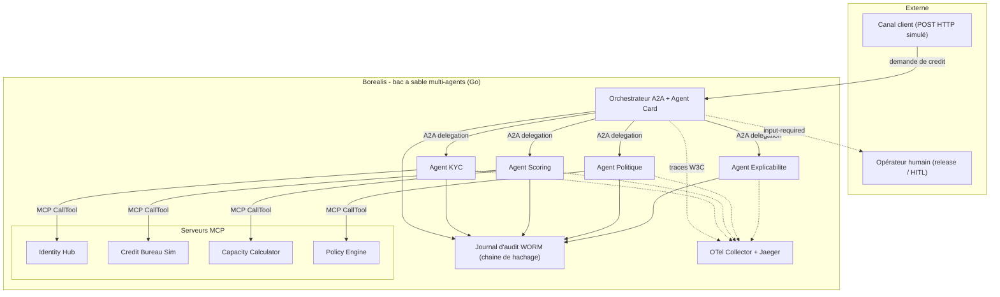
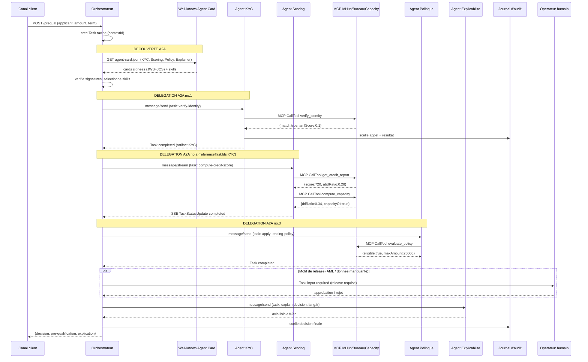
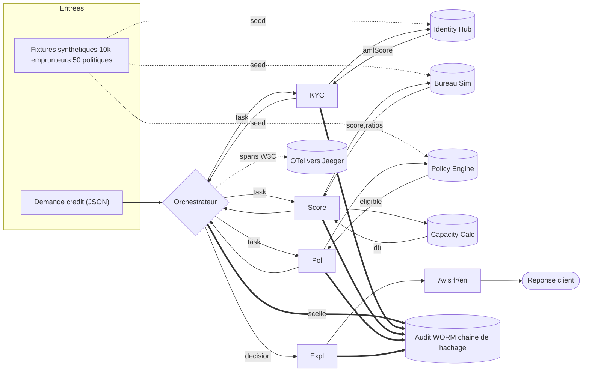

# Architecture de Borealis — dossier détaillé

> ⚠ **Fiction pédagogique.** *Coopérative financière Boréalis* est fictive ;
> données 100 % synthétiques, aucun système réel, jamais de PII.

Ce document est le dossier d'architecture de référence du dépôt. Il complète,
sans les dupliquer, [`docs/TRACEABILITY.md`](TRACEABILITY.md) (preuve exigence
→ code → test) et [`docs/RAPPORT-FINAL.md`](RAPPORT-FINAL.md) (bilan de
clôture, KPI). Il décrit **ce que fait chaque paquet**, **comment les données
circulent**, **quels invariants sont appliqués dans le code** (pas seulement
documentés) et **ce que chaque suite de tests prouve réellement**. Il
matérialise l'invariant transversal de la monographie — *découplage, contrat,
évolution* — et le principe directeur du PRD : « un pair expérimenté
jugerait-il ceci surdimensionné pour un démonstrateur ? ».

## Sommaire

1. [Vue d'ensemble](#1-vue-densemble)
2. [Architecture applicative](#2-architecture-applicative)
3. [Domaine métier et orchestration](#3-domaine-métier-et-orchestration)
4. [Protocole A2A](#4-protocole-a2a)
5. [Protocole MCP](#5-protocole-mcp)
6. [Gouvernance et conformité](#6-gouvernance-et-conformité)
7. [Sécurité, résilience, observabilité](#7-sécurité-résilience-observabilité)
8. [Données synthétiques et doublures de test](#8-données-synthétiques-et-doublures-de-test)
9. [Binaires et déploiement](#9-binaires-et-déploiement)
10. [Stratégie de test et preuves](#10-stratégie-de-test-et-preuves)
11. [Décisions d'architecture (ADR)](#11-décisions-darchitecture-adr)
12. [Traçabilité](#12-traçabilité)
13. [État, limites connues et raccourcis assumés](#13-état-limites-connues-et-raccourcis-assumés)
14. [Pour aller plus loin](#14-pour-aller-plus-loin)

---

## 1. Vue d'ensemble

### 1.1 Cas d'usage

Borealis démontre l'interopérabilité agentique (**MCP + A2A**) sur un cas de
**pré-qualification de crédit** : 5 agents A2A orchestrent 4 serveurs MCP pour
produire un avis de pré-qualification. **Invariant 1, non négociable : jamais
d'octroi ferme** — le pipeline s'arrête toujours à la pré-évaluation. Cet
invariant n'est pas qu'une règle documentée : il est structurel (§3.1).

### 1.2 Objectifs (PRD §3.1) et non-buts (PRD §3.2)

| But | Critère vérifiable | Statut |
|---|---|---|
| **G-1** découverte A2A par Agent Card | ≥ 4 pairs découverts sans registre en dur | ✅ |
| **G-2** délégation A2A + cycle de vie de Task | ≥ 3 délégations chaînées ; états couverts + `input-required` | ✅ |
| **G-3** accès outils/données par MCP | ≥ 4 serveurs MCP, E/S validées | ✅ |
| **G-4** découplage/contrat/évolution | substitution Capacity v1→v2 sans casse | ✅ |
| **G-5** explicabilité fr/en | 100 % des décisions, texte lisible | ✅ |
| **G-6** calibre d'ingénierie FibGo | couverture, race, lint, vuln, golden, ADR, gate local | ✅ (couverture 96,2 %, plancher relevé à 90 % par directive utilisateur) |
| **G-7** journal d'audit distinct de l'observabilité | WORM haché, séparé des logs SRE | ✅ |
| **G-8** déterminisme et reproductibilité | fake par défaut, `make e2e` stable | ✅ |

Non-buts explicites (PRD §3.2, NG-1 à NG-9) : pas de système réel (NG-1), pas
de PII réelles (NG-2), pas d'entraînement de modèle (NG-3), **module
d'identité complet reporté au candidat #2** (NG-4, [ADR-0008](adr/0008-report-module-identite.md)),
pas de pile IBM d'entreprise réelle (NG-5), pas de HA/K8s réels (NG-6),
conformité **illustrative** seulement (NG-7), pas de passage à l'échelle
40-80 agents (NG-8), **cryptographie post-quantique = placeholder** (NG-9,
[ADR-0006](adr/0006-crypto-agilite.md)). Principe directeur du PRD, repris
tel quel : *« un pair expérimenté jugerait-il ceci surdimensionné pour un
démonstrateur ? »* — chaque raccourci assumé est marqué `// ponytail:` dans
le code, nommant le plafond et le chemin de montée (inventaire en §13.2).

### 1.3 Personae (PRD §4)

| Persona | Ce qui compte pour elle/lui |
|---|---|
| **Aline** — architecte d'entreprise | Reconnaître les concepts de la monographie dans le code exécutable (mapping ArchiMate, §2.3). |
| **David** — développeur évaluateur MCP/A2A | Extraire un patron MCP/A2A réutilisable en < 1 h (serveur `internal/mcpserver/*.go` + `cmd/mcp-*` ; agent `internal/a2aserver` + `cmd/agent-*`). |
| **Carmen** — auditrice/conformité | Rejouer le journal d'audit d'une décision et lire l'explication fr/en correspondante (§6). |
| **Marc** — lecteur de la monographie | Faire tourner le scénario e2e et retrouver le récit du blueprint dans les traces réelles. |
| **Priya** — future contributrice | Étendre Borealis (nouvel agent, nouveau protocole) sans casser `scripts/check`. |

---

## 2. Architecture applicative

### 2.1 Composant PRD §6 → paquet Go

| Composant (PRD §6) | Rôle | Binaire | Paquet(s) Go |
|---|---|---|---|
| **Orchestrateur** | Découverte A2A, routage par compétence, boucle L0/L1 | `cmd/orchestrator` | `internal/orchestrator` (découverte/routage anti-SSRF/collision, idempotence), `internal/agent` (boucle `Prequalify`) |
| **Agent KYC** | Vérification d'identité + criblage AML | `cmd/agent-kyc` | `internal/agent` (`VerifyIdentity`, `ScreenWatchlists`), `internal/a2aserver` |
| **Agent Scoring** | Solvabilité (score, ratios) | `cmd/agent-scoring` | `internal/a2aserver` ; consomme MCP Bureau + Capacity |
| **Agent Politique** | Règles d'octroi par segment | `cmd/agent-policy` | `internal/a2aserver` ; consomme MCP Policy |
| **Agent Explicabilité** | Avis lisible fr/en | `cmd/agent-explain` | `internal/conformance` (`Explain`, golden fr/en), `internal/a2aserver` |
| **MCP Identity Hub** | `verify_identity`, `check_watchlists` (OFAC/PPE simulées) | `cmd/mcp-identity` | `internal/mcpserver/identity.go` |
| **MCP Credit Bureau Sim** | `get_credit_report` (cote, ratios) | `cmd/mcp-bureau` | `internal/mcpserver/bureau.go` |
| **MCP Capacity Calculator** | `compute_capacity` (PMT, DTI), v2 substituable | `cmd/mcp-capacity` | `internal/mcpserver/capacity.go`, `capacity_v2.go` |
| **MCP Policy Engine** | `evaluate_policy` | `cmd/mcp-policy` | `internal/mcpserver/policy.go` |

Préoccupations transverses :

| Préoccupation | Paquet Go |
|---|---|
| Agent Card signée (JWS ES256 + JCS), crypto-agilité PQ | `pkg/a2a` |
| Évolution de contrat (compat BACKWARD) | `pkg/mcpcontract` |
| Journal WORM (chaîne de hachage, ancrage d'export) | `internal/audit`, `internal/auditexport` |
| PEP (garde non contournable, fail-closed L1→L0) | `internal/pep` |
| HITL (deux files proposition/commande) | `internal/hitl` |
| Conformité (explicabilité, biais Gini, factsheet) | `internal/conformance` |
| Résilience (disjoncteur, retry, timeout) | `internal/resilience`, `internal/agent` |
| Observabilité (OTel, slog) — export à câbler ⛔ | `internal/observability` |
| IdP mock (bearer JWT, audience RFC 8707) | `internal/idpmock` |
| Webhook signé anti-rejeu | `internal/webhook` |
| STRIDE (spoofing/tampering/elevation) | `internal/security` |
| Domaine métier pur | `internal/creditdomain` |
| Registre tiers TIC (SLO, contrats) | `internal/mcpserver/registry.go` |
| Données synthétiques seedées | `internal/fixtures` |
| Bootstrap des binaires (`main()` minces) | `internal/agentcmd`, `internal/servercmd` |

### 2.2 Vue de contexte (C4, PRD §6.3)



**Figure 1 — Contexte.** Le journal d'audit et l'observabilité sont deux
puits distincts (invariant 5, [ADR-0003](adr/0003-audit-distinct-observabilite.md)) ;
l'export OTLP vers le collecteur n'est **pas câblé** dans les binaires
(⛔ reliquat, §13.1).

### 2.3 Séquence — scénario de crédit (happy path, PRD §6.4)



**Figure 2 — Séquence happy path.** Chaque agent scelle son propre appel
dans le journal ; l'escalade HITL (branche `alt`) précède toujours le
scellement final (§6.2). Dans le code réel, l'orchestrateur `internal/agent`
exécute cette séquence **en mémoire** (appel direct, pas de délégation A2A
réseau) pour la boucle L0 de pré-qualification — la délégation A2A illustrée
ici correspond à la couche `internal/orchestrator` (découverte/routage entre
binaires `cmd/agent-*` réels), démontrée séparément (§3.3).

### 2.4 Flux de données (PRD §6.5)



**Figure 3 — Flux de données.** Les fixtures alimentent les 3 serveurs MCP
consommateurs de données (Identity, Bureau, Policy) ; Capacity est un calcul
pur, sans fixture.

### 2.5 Correspondance ArchiMate (vue conceptuelle, PRD §6.6)

| Élément Borealis | C4 | ArchiMate 4 | Renvoi Annexe B |
|---|---|---|---|
| Agent (Orchestrateur, KYC…) | Container | Application Component `«Agent»` + Role assigné | Calibrage d'autonomie L0-L3 (§1.3) |
| Boucle de raisonnement | Component | Application Process `«reasoning loop»` | idem |
| Appel d'outil (`CallTool`) | — | Application Function (non séquentiel) | Appel gouverné par le PEP |
| Serveur MCP | Container | Application Component `«MCP Server»` | Plan MCP superposé à la dorsale tri-plan |
| Outil MCP | Component | Application Service + Interface ; ressource lue = Data Object | Contrat de service (E/S, SLO) |
| Agent Card | Artefact | Data Object « Agent Cards » | Registre MCP (la signature JWS+JCS relève de la spec A2A) |
| Délégation A2A | Flux | Flow / Triggering ; message = Data Object | Orchestration agent↔agent |
| Journal d'audit WORM | Container | Data Object append-only, **distinct** du Data Object SRE | Invariant 5 (audit ≠ observabilité) |
| PEP minimal | Component | Application Service de traversée obligatoire | Invariant 3 (PEP obligatoire) |
| Release humaine | Interaction | Business Collaboration ; release = Assignment d'un Role humain | Invariant 1 (release sur l'irréversible) |
| Confinement réseau (0 egress) | Déploiement | Résidence portée par la couche Technology | Invariant 6 |

> **Écart consigné.** L'exécutant qui a bâti ce dépôt n'avait pas accès au
> registre normatif de stéréotypes de l'Annexe B/ch.6 §6.1.9 *verbatim*. La
> table ci-dessus reprend les stéréotypes **ArchiMate 3.2/4 génériques**
> (`«application component»`, `«application service»`, `«application
> interface»`, `«data object»`) plutôt que le registre exact. Écart consigné
> en [ADR-0010](adr/0010-ecart-architecture.md).

---

## 3. Domaine métier et orchestration

### 3.1 `internal/creditdomain` — modèle métier pur, sans I/O

Types clés : `Money int64` (cents), `Outcome` (`OutcomeDeclined`,
`OutcomeRefer`, `OutcomePreQualified` — **aucune valeur « octroi »
n'existe dans l'énumération**), `Applicant`, `Policy`, `Decision`.

```go
func MonthlyPayment(principal Money, annualRate float64, termMonths int) Money
func (a Applicant) Validate() error
func DTI(a Applicant) (float64, error)
func Assess(a Applicant, p Policy) (Decision, error)
```

`Assess` applique une cascade de portes, dans cet ordre : score < `MinScore`
→ `OutcomeDeclined` ; DTI > `MaxDTI` → `OutcomeDeclined` ; score <
`ReferScore` **ou** DTI > `ReferDTI` → `OutcomeRefer` ; sinon
`OutcomePreQualified`. **Aucune branche ne produit autre chose qu'une de ces
trois valeurs** — l'invariant « jamais d'octroi ferme » (FR-25) est donc
appliqué par le système de types autant que par la logique.
`Validate` rejette dette négative et taux négatif *spécifiquement* parce
qu'ils déjoueraient silencieusement les portes de refus (ancienne classe
d'attaque, désormais bloquée à la validation).

Le test `TestPreQualificationCeiling` construit le meilleur dossier possible
(revenu 5 000 000, dette 0, cote 900) et vérifie que son issue plafonne à
`OutcomePreQualified` — preuve comportementale du plafond, pas une simple
énumération des valeurs possibles.

### 3.2 `internal/agent` — appels KYC, transport MCP résilient, boucle de pré-qualification

- **`reasoner.go`** — le raisonneur est isolé derrière l'interface
  `Reasoner{ Reason(ctx, ReasonRequest) (ReasonResult, error) }`. `Recommendation`
  n'a, comme `Outcome`, **aucune valeur de type « approbation »** — seulement
  `RecommendPreQualify`, `RecommendDecline`, `RecommendEscalate`. Un LLM réel
  n'entre jamais dans le gate (G-8) ; le fake par défaut est
  `internal/testfakes.StubReasoner`.
- **`mcpcall.go` — `ResilientCaller`** : disjoncteur (seuil 5 échecs / 30 s de
  répit), retry (3 tentatives, 10 ms de backoff), timeout par tentative
  (500 ms). `CallTool` interroge le PEP **en tout premier**, avant même le
  disjoncteur — garde non contournable (§7.2). Injecte le `traceparent` W3C
  dans `_meta` pour une trace ininterrompue A2A→MCP.
- **`kyc.go`** : `VerifyIdentity`/`ScreenWatchlists` appellent les outils MCP
  correspondants et distinguent une erreur `IsError` d'un `error` protocole.
- **`orchestrator.go` — `Orchestrator.Prequalify`**, la boucle L0/L1 :
  1. `subjectRef(applicantID)` — pseudonymisation (SHA-256 tronqué, préfixe
     `cust:`) **appliquée au point d'écriture du journal**, pas seulement
     documentée.
  2. `VerifyIdentity` → si non vérifiée, scellement immédiat en
     `OutcomeDeclined` (court-circuit : ni AML, ni évaluation métier, ni
     raisonneur ne sont exécutés).
  3. `ScreenWatchlists` → `amlGate` : `AMLScore > 0.7` refuse ; `> 0.8`
     refuse **et** escalade au HITL *avant* le scellement de la décision
     (FR-16) — c'est un **arrêt de conformité qui court-circuite
     l'évaluation métier**, pas une simple règle métier de plus.
  4. `creditdomain.Assess` (évaluation métier autoritative).
  5. `Reasoner.Reason` (avis **consultatif seulement** — ne peut jamais
     renverser `Decision.Outcome`).
  6. Scellement terminal `"decision"`.

  Toute erreur en cours de route referme la piste d'audit via `fail()`
  (jamais de trace tronquée) ; le PEP indisponible produit un scellement
  `"pep.fail_closed"` observable, pas un échec silencieux.

  Marqué `// ponytail:` (`orchestrator.go:134`) : l'ID de proposition HITL
  dérive du sujet (`"aml-"+kyc`), suffisant pour une `Prequalify` mono-passe ;
  un rejeu du même dossier *après* release réutiliserait le même ID et
  serait avalé — correctif nommé : nonce de requête dans l'ID.

### 3.3 `internal/orchestrator` — découverte et délégation A2A

Découvre les pairs par Agent Card à des URL **configurées** (FR-02, aucun
endpoint en dur) et applique trois défenses avant de router :

1. **Vérification de signature** (`Verify`, §4.1) — carte non fiable rejetée.
2. **Validation de schéma** (`Validate`).
3. **Anti-SSRF** (`interfacesMatchBase`) — l'hôte **et** le schéma déclarés
   par la carte doivent correspondre à l'URL de base configurée ; le
   contrôle du *schéma* (pas seulement l'hôte) bloque spécifiquement un
   pair qui déclarerait `http://` sous une base `https://` (rétrogradation
   silencieuse vers du trafic en clair).

`index()` reconstruit `bySkill`/`collisions` **entièrement à chaque
`Discover`** (pas de fusion incrémentale) : une compétence revendiquée par
exactement un pair est routée, par ≥ 2 pairs elle devient une collision
**non routée**. Retirer un agent de la configuration suffit donc à ne plus
le router (FR-02), et une collision nouvellement introduite n'écrase jamais
silencieusement le mapping existant.

**Idempotence des délégations** (`idempotency.go`, FR-18) : clé =
SHA-256(`contextId`, `skill`, JSON des `Parts` du message) — exclut
volontairement l'ID de message (aléatoire par appel). Un rejeu identique
renvoie le résultat mis en cache sans réexécuter `deliver` ; un échec n'est
**jamais** mis en cache (un retry peut encore réussir). Plafond assumé
(`// ponytail:`, `idempotency.go:57`) : la déduplication protège contre le
rejeu *séquentiel*, pas contre deux délégations identiques *concurrentes*,
qui peuvent toutes deux s'exécuter — correctif nommé : verrou par clé
(`singleflight`) si un pilote concurrent l'exige. Le cas « effet partiel +
erreur de transport » (garantie *au plus une fois*, pas d'effet exactement
une fois) est aussi un plafond documenté, hors périmètre du démonstrateur
(agents-stubs sans effet réel).

### 3.4 Bootstrap des binaires — `main()` minces

`internal/agentcmd.Run` (agents A2A) et `internal/servercmd.RunMCP` (serveurs
MCP) portent toute la logique de démarrage/arrêt, laissant `cmd/*/main.go` à
quelques lignes (`os.Exit(run())`), conformément à la directive couverture
≥ 90 %. Points notables :

- `agentcmd.Run` **refuse de démarrer** sans `IDP_SECRET` défini (code de
  sortie 3) — sans cette garde, un déploiement oubliant la variable
  démarrerait silencieusement avec le secret de démonstration committé.
- Les deux (`agentcmd`, `servercmd`) plafonnent le corps de requête à 1 MiB
  (`limitBody`) — défense contre un déni de service trivial sur un
  gestionnaire JSON-RPC exposé.
- Arrêt gracieux borné (`shutdownGrace`, 5 s par défaut) ; au-delà, fermeture
  forcée traitée comme un arrêt propre (pas une erreur), car déclenchée par
  annulation du contexte.
- `servercmd` bascule stdio (défaut) → HTTP streamable via `MCP_HTTP_ADDR`
  (déploiement compose) ; **aucune garde bearer** sur ce mode HTTP —
  frontière de confiance assumée = réseau compose fermé (`mesh`, sans port
  publié), consigné en [ADR-0011](adr/0011-mcp-http-sans-bearer.md).

---

## 4. Protocole A2A

### 4.1 `pkg/a2a/card.go` — Agent Card : canonicalisation JCS + signature JWS ES256

`Canonicalize` sérialise le contenu de la carte (signatures exclues) en JSON
canonique — clés triées, sans espace, nombres préservés via
`json.Number`. `Sign`/`Verify` implémentent JWS ES256 en stdlib
(`crypto/ecdsa`, encodage R‖S 64 octets, pas de DER) :

```go
func Sign(card *a2asdk.AgentCard, key *ecdsa.PrivateKey, kid string) (a2asdk.AgentCardSignature, error)
func Verify(card *a2asdk.AgentCard, sig a2asdk.AgentCardSignature, pub *ecdsa.PublicKey) error
```

`Verify` vérifie **d'abord** l'en-tête protégé (`alg == "ES256"` strictement,
`crit` vide) avant tout calcul cryptographique — ferme la confusion
d'algorithme (`"none"`, `HS256`, ou l'algorithme PQ réservé `ML-DSA-65`, tous
rejetés). Une carte altérée après signature, une mauvaise clé, ou une
signature tronquée sont toutes rejetées (`card_test.go`).

Marqué `// ponytail:` (`card.go:28`) : la canonicalisation JCS est suffisante
pour un cycle signature/vérification **interne** (Borealis signe et vérifie
avec la même fonction), mais n'implémente pas les cas limites RFC 8785
(nombres ES6, échappement HTML, normalisation Unicode NFC) — l'interopérabilité
avec un signataire A2A externe conforme RFC 8785 n'est donc pas garantie.

### 4.2 Crypto-agilité (`cryptosuite.go`, ADR-0006)

```go
const SigAlgES256 = "ES256"       // actif
const SigAlgMLDSA65 = "ML-DSA-65" // réservé, aucune implémentation (NG-9)
```

Le vérifieur lit l'algorithme dans l'en-tête JWS plutôt que de le présumer :
migrer d'algorithme n'exigerait donc pas de modifier les appelants — mais en
pratique la liste blanche dans `checkProtectedHeader` reste câblée en dur sur
`ES256` (le mécanisme d'agilité est une convention de nommage/documentation,
pas un registre pluggable). `ML-DSA-65` est explicitement testé comme
**rejeté** tant qu'il n'est pas implémenté (`TestReservedAlgRejectedBySignatureCheck`).

### 4.3 `pkg/a2a/task.go` — machine à états de Task (FR-07)

4 états terminaux (`Completed`, `Failed`, `Canceled`, `Rejected`) sont
irréversibles : `CanTransition(from, to)` renvoie `false` dès que `from` est
terminal, quel que soit `to`. Non-terminal → non-terminal reste permissif
(`working ⇄ input-required` autorisé). La garde est appliquée deux fois :
une fois en unité pure (`TaskMachine.To`) et une fois câblée dans le chemin
d'émission SSE réel (`guardedEmit` dans `a2aserver/agent.go`) — une tentative
d'émission post-terminale ne produit **aucun** évènement supplémentaire,
plutôt que d'échouer silencieusement ou de planter.

### 4.4 `internal/a2aserver` — carte, mux, exécuteurs

`Specs` liste les 5 agents (`borealis-orchestrator`, `-kyc`, `-scoring`,
`-policy`, `-explainer`) avec leur compétence unique. `BuildCard` assemble la
carte (interface JSON-RPC, `Capabilities.Streaming: true`) ; `Mux` (non
authentifié, tests seulement) sert la carte publique + l'endpoint
d'invocation. `LifecycleExecutor` émet `submitted → working → <final>` via
`guardedEmit`, prouvant l'irréversibilité même en flux SSE réel
(`TestStreamingTerminalGuard`).

### 4.5 `internal/a2aserver/auth.go` + `internal/idpmock` — bearer JWT à audience restreinte (FR-26)

`SecureMux = TraceExtract(BearerAuth(Mux(...)))` : la carte publique reste
accessible sans jeton ; l'invocation exige `Authorization: Bearer …` vérifié
par `idpmock.IdP.Verify(token, audience)`. L'IdP mock émet un JWT-shape
HS256 (5 min de TTL par défaut) et vérifie, dans l'ordre : signature HMAC
(constant-time), décodage, expiration (`now >= Exp`), puis
**audience exacte** (`aud != expectedAudience` → rejet RFC 8707) — un jeton
volé pour un agent est inutilisable contre un autre. Chaque rejet est à la
fois un HTTP 401 **et** une entrée d'audit distincte
(`"a2a.auth"` / raison).

Limite documentée dans l'en-tête du paquet : **aucune protection anti-rejeu**
(pas de `jti`, pas de nonce, pas de preuve de possession DPoP/mTLS) — un
bearer capturé reste rejouable pendant sa durée de vie ; durcissement
reporté au candidat #2 ([ADR-0008](adr/0008-report-module-identite.md)).

### 4.6 Streaming SSE et `referenceTaskIds`

`message/stream` produit ≥ 2 `TaskStatusUpdateEvent` observés côté client
(FR-08) ; `referenceTaskIds` porté par le `Message` (pas la Task) chaîne les
délégations (KYC → Scoring, FR-06) et traverse intact le transport JSON-RPC
jusqu'à l'exécuteur.

---

## 5. Protocole MCP

### 5.1 Les 4 serveurs

| Serveur | Outil(s) | Entrée | Sortie | Notes |
|---|---|---|---|---|
| **Identity Hub** | `verify_identity`, `check_watchlists` | `applicantId`, `name?`, `sin?` | `{match, reason}` / `{watchlistHit, amlScore, reason}` | Le nom criblé est résolu **côté serveur** depuis le dossier authentique, pas depuis l'entrée de l'appelant — défense contre un nom falsifié dans la requête. Score AML dérivé de façon déterministe (SHA-256), remappé ≥ 0.85 sur une correspondance de liste simulée (`ofacSimNames`). |
| **Credit Bureau Sim** | `get_credit_report` | `applicantId` | `{score, abdRatio, atdRatio, defaults}` | Revenu ≤ 0 → ratios forcés à un sentinel `999.0` (jamais 0, qui ferait passer un dossier à revenu nul pour le meilleur profil de dette). Notifications de progression câblées (FR-14). |
| **Capacity Calculator** | `compute_capacity` | `income, debts, requestedAmount, termMonths` (+ `stressRate` optionnel en v2) | `{monthlyPayment, dtiRatio, capacityOk}` (+ `riskBand` en v2) | Formule PMT/DTI en §5.3. |
| **Policy Engine** | `evaluate_policy` | `segment, age, abdRatio, atdRatio, amount` | `{eligible, maxAmount, reasons[]}` | Les trois seuils (ABD, ATD, plafond) sont évalués indépendamment ; motifs cumulables. |

Chaque serveur expose son contrat via le registre YAML tiers TIC
(`internal/mcpserver/registry.go`, [ADR-0009](adr/0009-tiers-tic.md)) : nom,
version de contrat, SLO P95 (100–300 ms, hypothèses à calibrer), outils,
énumération d'erreurs — posture DORA/Loi 25 illustrative.

### 5.2 Erreur protocole vs erreur métier (FR-15, ADR-0001)

```go
// internal/mcpserver/errors.go
func toolError(msg string) *mcp.CallToolResult {
    return &mcp.CallToolResult{IsError: true, Content: []mcp.Content{&mcp.TextContent{Text: msg}}}
}
```

Toute violation de schéma (champ requis manquant, type invalide) est
interceptée par le SDK et reportée en `CallToolResult.IsError = true` — **pas**
en erreur protocole JSON-RPC `-32602`, contrairement à l'attente initiale du
PRD (écart consigné en ADR-0001). `-32602` reste réservé aux erreurs de
protocole strict (nom d'outil inconnu). Les erreurs métier (dossier introuvable,
règle violée) empruntent le même canal `IsError` que les violations de
schéma — unification délibérée.

### 5.3 Formule PMT/DTI (`capacity.go`)

```
r   = 0.09 / 12                              // taux mensuel, 9 %/an fixe (v2 : 0.09 + stressRate)
pmt = requestedAmount * r / (1 - (1+r)^-n)   // amortissement standard, n = termMonths
dti = round2((pmt + debts) / (income/12))
capacityOk = dti <= 0.40
```

Entrée dégénérée (`termMonths<=0`, montant/revenu ≤ 0, dette < 0) → court-circuit
`{0, 0, false}`, jamais un calcul nonsensique neutralisé en faux positif.
La décision (`capacityOk`) porte sur la valeur **arrondie publiée**, pour
rester cohérente avec `dtiRatio` tel qu'observé par l'appelant.

### 5.4 Substitution Capacity v1→v2 et compatibilité BACKWARD (G-4, ADR-0006)

v2 ajoute un champ d'entrée optionnel (`stressRate`, `omitempty` → jamais
requis) et un champ de sortie additif (`riskBand`) ; les 3 champs v1 restent
inchangés. `pkg/mcpcontract.InputBackwardCompatible`/`OutputBackwardCompatible`
comparent les schémas JSON **réellement inférés** par le SDK à partir des
structs Go v1/v2 (pas des fixtures à la main) :

- Entrée : v2 ne doit exiger aucun champ absent de `v1.Required`, ni changer
  de type, ni retirer une propriété que v1 acceptait sans que v2 autorise
  les propriétés additionnelles.
- Sortie : v2 ne doit retirer, retyper, ni rendre nullable aucun champ que
  v1 exposait (un sur-ensemble en sortie est toléré).

`TestCapacitySubstitutionV1toV2` envoie les **mêmes arguments v1** aux deux
serveurs et décode la réponse v2 dans le struct Go v1 (`CapacityOut`)
inchangé — preuve **comportementale** (décisions identiques), pas seulement
schématique. Deux oracles de mutation (exiger `stressRate`, retirer
`capacityOk`) prouvent que le détecteur n'est pas un no-op.

### 5.5 Ressource, prompt, notification de progression (FR-12/13/14)

Ressource `credit:///application/{id}/assessment` (lue via `ReadResource`,
`ResourceNotFoundError` sur URI inconnue) ; prompt `credit_assessment_advice`
dont le texte fr/en rappelle explicitement « pré-qualification, jamais un
octroi ferme » — l'invariant 1 est donc appliqué jusque dans le gabarit de
prompt. `NotifyProgress` observé côté client dans un délai de 3 s.

---

## 6. Gouvernance et conformité

### 6.1 `internal/audit` — journal WORM à chaîne de hachage (FR-19/20, G-7)

```
entry_hash = SHA-256( seq ‖ ts_UTC_RFC3339Nano ‖ KYA ‖ OwnerKYH ‖ KYC ‖ Action ‖ Result ‖ Version ‖ prev_hash )
```

Séparateur `\x00` non ambigu entre champs. Chaque `Append` chaîne
`PrevHash` sur le `EntryHash` de l'entrée précédente (`"genesis"` pour la
première). `Verify()`/`VerifyEntries` détectent toute réécriture de champ ou
rupture de chaîne — mais une relecture nue **ne détecte pas une troncature
de fin ni un effacement total** (une chaîne plus courte reste valide). C'est
pourquoi `VerifyExport(entries, expectedLen, expectedTip)` ancre en plus la
**longueur** et la **tête** (hash de la dernière entrée) contre des valeurs
committées séparément (signature/registre externe au moment de l'export) —
seul ce contrôle démasque un **re-forgeage cohérent de même longueur**
(contenu différent, donc tête différente), ce qu'aucune relecture nue ni
simple compte ne peut attraper.

### 6.2 `internal/pep` — Policy Enforcement Point, fail-closed (invariant 3)

```go
func (p *PEP) Guard(kya, kyc, action string) error {
    switch {
    case !p.available.Load():
        return ErrFailClosed // retombée L1->L0, journalisée "pep.fail_closed"
    case p.level < L1:
        return ErrDenied     // "pep.deny"
    default:
        return nil           // "pep.allow:<action>"
    }
}
```

L'indisponibilité prime **toujours** sur une autorisation L1 (le contrôle
de disponibilité est évalué en premier). `ResilientCaller.CallTool` appelle
`Guard` **avant** le disjoncteur/retry/réseau — garde structurellement non
contournable : toute panne du PEP bloque tous les appels d'outil suivants
dans le flux, pas seulement le premier.

### 6.3 `internal/hitl` — deux files distinctes, maker-checker (FR-16/24)

`Propose` (agents « préparateurs ») écrit uniquement dans `proposals` ;
`Release` (le seul « vérificateur ») journalise d'abord (`"hitl.release"`)
**puis** ajoute à `commands` — aucun message n'atteint la file de commande
sans release journalisée. Sécurités : décision limitée à
`approve`/`reject`, proposition inconnue rejetée, double release rejetée
(`ErrAlreadyReleased`).

**Preuve structurelle, pas seulement comportementale** : `maker_checker_test.go`
analyse l'AST du paquet de production (hors fichiers de test) et prouve que
**seule** la fonction `Release` mute le champ `commands` — y compris via une
adresse prise (`&b.commands` passée à un helper), un vecteur de contournement
qu'une simple détection d'affectation manquerait. Un test compagnon
(`TestMakerCheckerHeuristicCatchesEscape`) valide que le détecteur lui-même
attrape ce contournement sur un exemple construit, avant de faire confiance
au verdict du test principal.

### 6.4 `internal/conformance` — explicabilité, biais, factsheet (G-5, §11.4)

- **`Explain(d, lang)`** — hybride (motifs codés traduits + facteur
  quantitatif DTI + contexte). `normLang` normalise l'étiquette de langue
  (découpe sur `-`/`_`, comparaison insensible à la casse) : tout ce qui
  n'est pas explicitement `en*` retombe en français. Golden fr/en verrouillés
  par test, en particulier le cas **pré-qualifié** — le plus sensible à
  l'invariant 1, car c'est celui où le vocabulaire pourrait dériver vers
  « octroi » avec le temps. Le disclaimer fr **et** en rappelle
  explicitement « jamais un octroi ferme ». Le test `TestExplainFast` borne
  1000 appels à < 500 ms (garde de régression de débit, pas une SLA par
  appel unique) ; la couverture 100 % des branches est assurée par le plancher
  de couverture global du dépôt, pas par une assertion locale.
- **`AnalyzeBias`** — divergence = max − min des taux d'approbation par
  groupe ; alerte si divergence **stricte** > seuil (ex. 0,15) ; l'indice de
  Gini (moyenne des écarts absolus normalisée) est calculé en parallèle mais
  ne pilote pas l'alerte. Les tests verrouillent des **valeurs numériques
  exactes** (pas seulement un booléen), pour attraper une erreur de
  dénominateur qui donnerait un résultat faux-mais-positif.
- **`ReasonerFactsheet`** — fiche modèle minimale (illustrative E-23) :
  nom, version, objet, entrées, limites (« fake déterministe », « jamais un
  octroi ferme », « données 100 % synthétiques »).

---

## 7. Sécurité, résilience, observabilité

### 7.1 `internal/security` — suite STRIDE consolidée (PRD §11.3)

Paquet **sans code de production** : il exerce, en boîte noire, les défenses
qui vivent ailleurs, sur 3 des 6 catégories STRIDE (les 3 autres sont
couvertes structurellement ailleurs — non-répudiation par l'attribution
KYA/KYH/KYC, divulgation par le confinement réseau 0 egress, déni de service
par le disjoncteur) :

| Menace | Vecteur simulé | Défense vérifiée |
|---|---|---|
| Spoofing | Carte altérée après signature | `pkg/a2a.Verify` rejette |
| Tampering | Réécriture / troncature / re-forgeage d'un export | `audit.VerifyEntries` (réécriture) + `VerifyExport` (troncature, effacement, re-forgeage cohérent) |
| Elevation of privilege | Jeton d'audience étrangère | `idpmock.Verify` rejette (RFC 8707) |

### 7.2 `internal/webhook` — signature + anti-rejeu à double garde (FR-09)

```
MAC = HMAC-SHA256( ts ‖ len(nonce) ‖ nonce ‖ body )
```

Le préfixe de **longueur du nonce** (pas un simple séparateur `\x00`) ferme
une collision de canonicalisation où un octet NUL glisserait du corps vers
le nonce sous un MAC identique. `Verify` applique, dans cet ordre : (1) MAC
valide **avant** toute mémorisation (un attaquant ne peut pas polluer le
cache de nonces avec des signatures forgées) ; (2) fenêtre de fraîcheur
symétrique (rejette passé *et* futur) ; (3) unicité du nonce **dans la
fenêtre**. Point subtil vérifié par test : la purge des nonces vus est
indexée sur l'**horodatage du message**, pas l'heure d'arrivée — sinon un
vérificateur en retard sur l'horloge de l'émetteur purgerait un nonce avant
que son message ne soit même considéré comme périmé, rouvrant une fenêtre de
rejeu.

### 7.3 `internal/resilience` — disjoncteur + retry + timeout (FR-17, NFR-04)

États `Closed → Open` (seuil d'échecs atteint) `→ HalfOpen` (après le délai
de répit, lu paresseusement) `→ Closed`/`Open` (selon l'issue d'une seule
sonde en vol à la fois). **L'annulation de contexte côté appelant ne compte
ni comme succès ni comme échec** — sans cette exception, des timeouts
purement côté appelant ouvriraient le disjoncteur d'un service par ailleurs
sain. Le retry est à délai fixe (pas de backoff exponentiel), et un cycle de
retries épuisé ne compte que pour **un seul** échec du disjoncteur, pas un
par tentative.

Le scénario **HANG** (`internal/agent/fault_test.go`) fait tourner un vrai
serveur MCP dont le gestionnaire d'outil bloque indéfiniment ; il prouve que
le timeout par tentative (500 ms, câblé dans `NewResilientCaller`) borne
l'appel — la panne est détectée sans jamais planter et sans dépendre d'une
déconnexion réseau.

### 7.4 `internal/observability` — traçage W3C, métriques, écart assumé

`Provider` construit un traceur/mètre OTel et un logger `slog` JSON ;
`TraceRoundTripper` injecte le `traceparent` W3C dans les appels HTTP
sortants (A2A), `InjectTraceparent` fait de même pour le champ `_meta` des
appels MCP. **Écart documenté en tête de paquet** : `NewProvider` n'est
**pas instancié par les binaires** (`cmd/*` → `agentcmd`/`servercmd`) — seuls
les tests le montent, toujours avec un enregistreur en mémoire, jamais un
exportateur OTLP réel. L'instrumentation existe au niveau bibliothèque ;
l'export effectif vers Jaeger reste à câbler (⛔ reliquat, §13.1).

---

## 8. Données synthétiques et doublures de test

`internal/fixtures.Generate(seed, n)` — générateur **seedé et déterministe**
(`math/rand` avec graine fixe `20260707`), aucune PII réelle (marqué
`// ponytail:`). Produit emprunteurs synthétiques (SIN factices `SYN-%09d`),
50 politiques (4 segments × 6 tranches d'âge, paddées). `WriteAll` matérialise
`borrowers.json`/`policies.csv` pour inspection golden.

`internal/testfakes` : `StubReasoner` — recommandation déterministe par mot-clé
de scénario (`approved`/`denied`/`escalate`, repli sûr vers `escalate` sur
tout signal inconnu ou absent) ; `ConnectInMemory` factorise la connexion
client/serveur MCP en mémoire utilisée dans la majorité des tests unitaires
et d'intégration (pyramide §10.1).

---

## 9. Binaires et déploiement

### 9.1 Les 9 binaires (`cmd/`)

| Binaire | Type | Transport |
|---|---|---|
| `orchestrator` | Agent A2A + export d'audit (`--audit-export`) | HTTP (`agentcmd`) |
| `agent-kyc`, `agent-scoring`, `agent-policy`, `agent-explain` | Agents A2A | HTTP (`agentcmd`) |
| `mcp-identity`, `mcp-bureau`, `mcp-policy` | Serveurs MCP (10 000 emprunteurs seedés) | stdio par défaut, HTTP si `MCP_HTTP_ADDR` (`servercmd`) |
| `mcp-capacity` | Serveur MCP (calcul pur, aucune fixture) | idem |

Tous suivent le même patron mince : `func main() { os.Exit(run()) }`, `run()`
construit un contexte annulable par `SIGINT`/`SIGTERM` et délègue tout le
reste à `agentcmd.Run`/`servercmd.RunMCP` — aucune logique métier, aucun
parsing d'argument, aucun choix de transport dans `main.go` lui-même.

### 9.2 Topologie Docker Compose (`deploy/`)

Réseau `mesh` en **`internal: true`** (0 egress, NFR-06) portant
l'orchestrateur, les 4 agents, les 4 serveurs MCP, le collecteur OTel et
Jaeger ; réseau `edge` séparé, exposant **uniquement** l'UI Jaeger (port
16686) en entrée. `Dockerfile` multi-stage reproductible (`CGO_ENABLED=0`,
`-trimpath`, `-ldflags "-s -w -buildid="`, image runtime `distroless/static
nonroot`) ; `docker-build-verify.sh` compare le SHA256 de deux builds
successifs. **Non exécuté localement** (Docker absent de l'hôte de
développement) — script et compose livrés, vérification différée (⚠, §13.1).

### 9.3 Gate local (`scripts/check.sh`/`.ps1`)

Ordre : `go build` → `go vet` → tests (`-race` si CGO/gcc disponibles, sinon
avertissement et exécution sans) → **plancher unitaire ≥ 95 %** sur
`internal/*` (exemptions documentées : `observability`, `conformance`,
`fixtures`, `auditexport`, `testfakes` — code sans appelant de production ou
branches défensives non déclenchables sans instrumentation ad hoc) → `make e2e`
×2 (compromis coût/preuve local ; le rapport final revérifie ×3) →
`govulncheck` → `golangci-lint` → **plancher global ≥ 90 %** (directive
utilisateur du 2026-07-07, relevant NFR-11 de 80 à 90 %). Aucune étape n'est
sautée silencieusement : un outil absent produit un avertissement explicite,
jamais un succès de façade.

---

## 10. Stratégie de test et preuves

### 10.1 Pyramide (PRD §12.1)

~70 % unitaire (transports MCP en mémoire, sans LLM) / ~20 % intégration
(fakes + serveurs MCP réels en mémoire) / ~10 % cible e2e — le rapport final
mesure un e2e réel ≈ 3 % (7 tests sur 210 fonctions), en deçà de la cible :
l'essentiel de la preuve est unitaire/intégration (plus rapide, déterministe),
signalé sans enjolivure dans `docs/RAPPORT-FINAL.md`.

### 10.2 Les 6 scénarios e2e (`test/e2e/scenarios_test.go`, PRD §12.4)

| Scénario | Attendu | Preuve |
|---|---|---|
| Happy path | Pré-qualifié ; trace canonique | `TestScenarioHappyPath` — seul scénario comparé au golden **byte-exact** `test/golden/trace-approved.json` |
| Refus AML | Refus + escalade HITL avant scellement | `TestScenarioAMLRefusal` (applicant A00007, surnom simulé sur liste OFAC) |
| Timeout modèle | Échec propre, piste d'audit close | `TestScenarioModelTimeout` |
| Signaux conflictuels | `OutcomeRefer` + `RecommendEscalate` | `TestScenarioConflictingSignals` |
| Échec Explicabilité | Décision intacte, explication absente signalée | `TestScenarioExplainabilityFailure` — explicabilité hors chemin de décision |
| Fail-closed | Aucune action autonome, retombée journalisée | `TestScenarioFailClosed` (PEP indisponible) |

Golden immuables dès clôture de la phase qui les couvre (PRD §12.3) — toute
modification ultérieure exige une ADR justificative.

### 10.3 KPI mesurés (`docs/RAPPORT-FINAL.md`, résumé)

| KPI | Mesure |
|---|---|
| Latence boucle P99 < 2 s | ~336 µs/op (marge ×6000) |
| MCP P95 < 500 ms | Vérifié par outil, en mémoire |
| Audit < 200 ms P99 & ≥ 1000 écr/s | Vérifié |
| Couverture globale ≥ 90 % | 96,2 % |
| Sous-cible unitaire ≥ 95 % | Cœur métier ≥ 95 % ; exemptions documentées tirent le global |

---

## 11. Décisions d'architecture (ADR)

| ADR | Décision | Condition de renversement |
|---|---|---|
| [0001](adr/0001-abstraction-protocole.md) | SDK MCP officiel v1.6.1 ; domaine isolé derrière des adaptateurs ; violations de schéma en `IsError`, pas `-32602` | Changement d'API SDK majeur ou divergence bloquante avec la spec |
| [0002](adr/0002-reasoner-fake-par-defaut.md) | `Reasoner` derrière une interface ; fake déterministe par défaut, jamais de LLM réel dans le gate | Besoin prouvé d'évaluer un LLM réel en test ciblé hors gate |
| [0003](adr/0003-audit-distinct-observabilite.md) | Journal WORM et observabilité = deux puits séparés | Exigence réglementaire faisant coïncider exactement les deux formats |
| [0004](adr/0004-transports-mcp.md) | stdio en production, mémoire en test, `CommandTransport` en e2e | Besoin d'exposer un serveur MCP en réseau multi-hôte |
| [0005](adr/0005-a2a-go.md) | `a2aproject/a2a-go/v2` v2.3.1 (le PRD visait v1) | Abandon du dépôt ou rupture v3 sans migration |
| [0006](adr/0006-crypto-agilite.md) | Suite d'algorithmes portée par le contrat (JWS `alg`, `pkg/mcpcontract`) ; placeholder PQ M5.6 | Primitive unique imposée par régulation |
| [0007](adr/0007-strategie-de-test.md) | Pyramide + déterminisme + gate local + vérification adverse + mutation ciblée | Introduction d'une CI distante de confiance |
| [0008](adr/0008-report-module-identite.md) | Module d'identité complet (NHI JIT/HSM/WORM matériel/OAuth multi-hop) reporté au candidat #2 | Exposition hors environnement de démo contenu |
| [0009](adr/0009-tiers-tic.md) | Registre YAML des serveurs MCP comme tiers TIC (SLO, contrat, erreurs) | Registre de service centralisé d'entreprise disponible |
| [0010](adr/0010-ecart-architecture.md) | Mapping ArchiMate dérivé du PRD §6, sans accès à l'Annexe B verbatim | Accès à l'Annexe B et au registre §6.6 |
| [0011](adr/0011-mcp-http-sans-bearer.md) | Pas de garde bearer sur le mode HTTP MCP ; frontière = réseau compose fermé | Un exécuteur réel appelle un MCP via `MCP_HTTP_ADDR`, ou un port est publié |

---

## 12. Traçabilité

La matrice exigence → code → test → preuve, exhaustive et sans orphelin, vit
dans [`docs/TRACEABILITY.md`](TRACEABILITY.md) — ce document ne la duplique
pas. Le bilan de clôture (Definition of Done, KPI, écarts, relecture
adverse) vit dans [`docs/RAPPORT-FINAL.md`](RAPPORT-FINAL.md).

---

## 13. État, limites connues et raccourcis assumés

### 13.1 Reliquats honnêtes (⚠ non vérifié localement / ⛔ non livré)

- **⚠ Docker absent de l'hôte** — `docker compose up` et le build reproductible
  SHA256 (`docker-build-verify.sh`) ne sont pas exécutés localement ; les
  artefacts sont livrés et prêts à vérifier sur un hôte Docker.
- **⛔ Export OTLP non câblé** — l'instrumentation (spans, `traceparent`)
  existe au niveau bibliothèque (`internal/observability`) mais aucun
  `cmd/*` ne monte un exportateur réel vers le collecteur/Jaeger.
- **`-race` sauté** quand CGO/gcc est absent de l'hôte (avertissement explicite,
  pas un échec silencieux).
- Module d'identité complet (NHI JIT/HSM/WORM matériel/OAuth multi-hop)
  reporté au candidat #2 ([ADR-0008](adr/0008-report-module-identite.md)).
- **FR-26** : l'agent déployé applique bien la garde bearer (401 sur
  invocation non authentifiée), mais la délivrance/attache du jeton côté
  appelant (orchestrateur → agent réel, IdP partagé) reste une couture non
  câblée pour des appels inter-agents vivants — les exécuteurs actuels sont
  des stubs de réponse (candidat #3, échelle/logique métier complète).

### 13.2 Raccourcis assumés (`// ponytail:`)

| Emplacement | Plafond assumé | Chemin de montée nommé |
|---|---|---|
| `internal/agent/orchestrator.go:134` | ID de proposition HITL dérivé du sujet — collision sur rejeu après release | Nonce de requête dans l'ID |
| `internal/orchestrator/idempotency.go:57` | Déduplication par map — protège le rejeu séquentiel, pas concurrent | Verrou par clé (`singleflight`) |
| `pkg/a2a/card.go:28` | JCS suffisant en interne, pas conforme RFC 8785 pour un signataire externe | Implémentation RFC 8785 complète si interopérabilité externe requise |
| `internal/fixtures/fixtures.go:6` | Générateur seedé déterministe, aucune PII réelle | Sans objet (démonstrateur uniquement) |

### 13.3 Candidats de suite (PRD §21, `RAPPORT-FINAL.md` §5)

- **Candidat #2** — module d'identité matériel complet, cryptographie
  post-quantique réelle, export OTLP effectif.
- **Candidat #3** — passage à l'échelle (40-80 agents gouvernés), agents à
  logique métier complète (au-delà des stubs de réponse actuels).

---

## 14. Pour aller plus loin

- [`README.md`](../README.md) — démarrage en < 15 min, preuves du démonstrateur.
- [`docs/TRACEABILITY.md`](TRACEABILITY.md) — matrice exigence → code → test.
- [`docs/RAPPORT-FINAL.md`](RAPPORT-FINAL.md) — Definition of Done, KPI, relecture adverse.
- [`docs/REPRODUCIBILITY.md`](REPRODUCIBILITY.md) — build Docker reproductible.
- [`docs/adr/`](adr/) — les 11 ADR (9 décisions + 2 écarts, hors gabarit).
- [`PRD-Borealis.md`](../PRD-Borealis.md) — source de vérité fonctionnelle ; [`PRDPlan-Borealis.md`](../PRDPlan-Borealis.md) — plan d'exécution par phase.
