# Annexe B — Architecture détaillée de solution (ADS) : entreprise agentique en services financiers régulés

## Épine IBM consolidée — *Coopérative financière Boréalis* (entreprise fictive)

| | |
|---|---|
| **Auteur** | André-Guy Bruneau, M.Sc. IT |
| **Version** | 2.2 — Architecture détaillée de solution (ADS), finalisée |
| **Révision** | v1.0 (architecture de référence) → v2.0 : architecture logique et physique détaillée, ≥16 modèles et diagrammes, contrats d'interface, NFR/SLO, sécurité, plan de déploiement et runbooks, ADR, registre des risques, matrice de traçabilité → **v2.1 : alignement sur la monographie v2 (Integration & Resilience) — AIOps/résilience opérationnelle (§10.5, §8.5), iPaaS webMethods et authoring agentique (§4.1), B2B/EDI agentique (§4.3.1), modernisation agentique du mainframe (§4.4), thèse de couplage Intégration+Résilience (§0, §16.1) ; faits produits IBM re-vérifiés (juin 2026)** → **v2.2 (finalisation) : audit de cohérence intégral (renvois internes et vers la monographie, catalogue des 28 figures, dates), correctifs ponctuels, réserve MCP 2026-07-28, glossaire complété** |
| **Date** | 7 juillet 2026 |
| **Socle documentaire** | Monographie *Interopérabilité agentique en entreprise dans le domaine des services financiers* (juin 2026), ch. 1-7 ; faits produits vérifiés en ligne (éditeur + date), voir *Annexe F — Sources* |
| **Statut** | Architecture engageante — décisions tranchées signalées ; statuts *preview/vivant* marqués ⚠ |
| **Fil conducteur** | Découplage · contrat · évolution — et l'**exploitation** résiliente (extension proposée par la monographie v2) — projeté sur la pile IBM |

> **Conventions de notation.** Les modèles sont écrits en **Mermaid** (rendu natif sur GitHub et dans le PDF FESP via le filtre de rendu, cf. §14.4). Les vues d'architecture d'entreprise suivent **ArchiMate 4** (The Open Group, C260, 27 avr. 2026), équivalent **3.2** noté lorsque l'outillage l'exige. Les stéréotypes `<<...>>` proviennent du registre du *blueprint* (cf. Monographie ch.6 §6.1.9). Les extraits de configuration sont **illustratifs** (valeurs représentatives à durcir avant production), jamais des secrets réels. Le marqueur ⚠ signale une *ressource vivante* (preview, spec versionnée, acquisition annoncée) à re-confirmer au moment d'engager.

> **Public et mode d'emploi.** Document à double lecture : *architecte de solution / praticien* (sections normatives, diagrammes, configs, runbooks) et *gouvernance / risque-conformité* (invariants, traçabilité, NFR, registre des risques). Lecture descendante recommandée ; chaque partie est autoportante par renvois. **Longueur : ~17 500 mots, 18 sections (dont §4.3.1 et §10.5 ajoutées en v2.1), 6 annexes, 28 figures (12 vues A–L + 16 numérotées).**


## 0. Résumé exécutif

**Insight directeur.** Cette architecture consolide *intégralement* l'exploitation de l'entreprise agentique sur la pile IBM, explicitement agentique depuis Think 2026. Le système n'est pas une plateforme d'agents à gouverner après coup, mais un **plan de contrôle obligatoire** (watsonx Orchestrate + watsonx.governance) couplé à une **dorsale d'intégration tri-plan** : trois substrats — synchrone requête/réponse, asynchrone événementiel, commande transactionnelle assurée *exactly-once* —, chacun assigné à la classe d'interaction qu'il sert et non interchangeable (produits et règle d'aiguillage en §4). Le tout est domicilié au Canada/Québec via IBM Sovereign Core et un modèle confiné, produisant la double piste d'audit (modèle + tiers TIC) que la finance régulée exige.

La logique tient en une phrase : **l'agent prépare ; un humain ou un contrôle déterministe engage l'irréversible ; toute action transite par un point d'application de politique unique ; tout actif décisionnel est un modèle inventorié.** La pile IBM fournit ces propriétés couplées plutôt que chaînées. Ce pivot — l'agent monte le dossier, un humain signe l'acte qui ne se défait pas — est le geste *préparation→release* que le reste du document décline.

La révision assume le revers du choix : la consolidation IBM maximise la cohérence et exploite le socle z/OS + MQ + Kafka existant, au prix d'un *vendor lock-in* et d'une dépendance à un fournisseur de TIC tiers critique (CTPP). Le garde-fou : **maintenir ouvertes les coutures de protocole** — MCP, A2A, ISO 20022, OpenTelemetry GenAI, poids ouverts, échange ArchiMate — pour qu'un changement de fournisseur ne soit jamais une réécriture (épine justifiée en §1.2, lock-in tranché en ADR-001).

**Ce qu'ajoute la version 2.0 (ADS).** Là où la v1.0 posait l'architecture *de référence* — le quoi et le pourquoi —, la v2.0 la rend *déployable* : (1) une architecture logique détaillée (vues C4 de contexte et de conteneurs, contrats d'interface MCP/API/événement) ; (2) une architecture physique (topologie OpenShift, MQ Native HA + réplication inter-régions, Confluent en région Canada, z/OS, HSM, zones réseau) avec extraits de configuration illustratifs ; (3) une architecture de sécurité (zones, identité non humaine, gestion des secrets, contrôle d'egress, modèle de menace) ; (4) des exigences non fonctionnelles chiffrées (disponibilité, RPO/RTO, budgets de latence, capacité) ; (5) un modèle opérationnel (observabilité, FinOps, AgentOps) et une stratégie de test ; (6) un plan de déploiement par plateaux avec critères d'entrée/sortie, runbooks et RACI ; (7) un registre de décisions (ADR) et un registre des risques. L'ensemble vise le franchissement de la **porte N2→N3** (cf. §14.3) — où l'application de politique devient systématique — sans accumuler de risque-modèle non gouverné.

**Aptitude au déploiement.** L'architecture est *déployable* en ce que chaque exigence réglementaire se rattache à un composant exécutable (Annexe B interne — matrice de traçabilité), chaque plan d'interaction a un substrat assigné et un budget de qualité (§9), et chaque plateau a une porte de franchissement vérifiable (§14). Les éléments encore *vivants* (⚠) sont isolés en §17 et ne bloquent pas les plateaux N0-N2.

**Thèse de couplage.** L'interopérabilité agentique n'est durable que couplée à l'exploitation résiliente qui la maintient : un agent qui ne sait plus à quel pair se fier, ni quel rail tient, ne décide plus rien de sûr. La pile IBM est ici projetée sur Boréalis comme un ensemble intégration-et-résilience indissociable — c'est pourquoi le fil conducteur **découplage · contrat · évolution** s'augmente d'un quatrième terme, l'**exploitation** (extension proposée par la monographie v2 ; cf. Monographie ch.4 §4.9 et §4.12.4, ch.6 §6.10).

---

## 0.1 Blueprint consolidé — vue d'ouverture

Avant le détail des dix-sept sections, deux vues de synthèse donnent à voir l'ensemble de la solution d'un seul tenant. La **figure A** projette l'architecture sur les quatre couches ArchiMate — Motivation, Stratégie/Affaires, Application, Technologie — et répond au « quoi et pourquoi » : elle matérialise le fil de traçabilité *exigence → contrôle → composant* (siège en §7.1 ; registre de stéréotypes Monographie ch.6 §6.1.9). La **figure B** fusionne la vue de contexte (figure 1) et la vue de conteneurs (figure 2), augmentées de l'overlay des zones (figure 9), en un schéma maître C4 annoté qui répond au « comment c'est câblé » : frontière de résidence, plan de contrôle obligatoire et règle d'aiguillage du parc d'agents. Les deux vues sont des résumés — chacun de leurs blocs est repris en détail dans les figures 1 à 16 et les sections correspondantes.

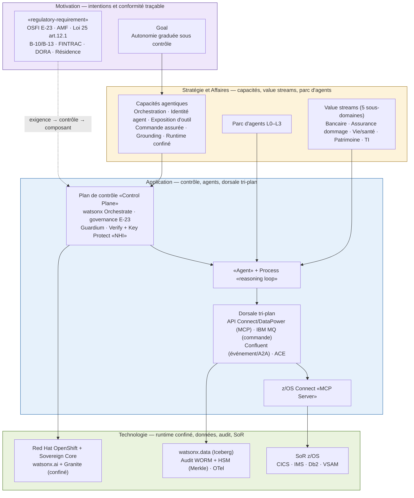
```mermaid
flowchart TB
    subgraph MOT["Motivation — intentions et conformité traçable"]
        REQ["«regulatory-requirement»<br/>OSFI E-23 · AMF · Loi 25 art.12.1<br/>B-10/B-13 · FINTRAC · DORA · Résidence"]
        GOAL["Goal<br/>Autonomie graduée sous contrôle"]
    end
    subgraph STR["Stratégie et Affaires — capacités, value streams, parc d'agents"]
        CAP["Capacités agentiques<br/>Orchestration · Identité agent · Exposition d'outil<br/>Commande assurée · Grounding · Runtime confiné"]
        VS["Value streams (5 sous-domaines)<br/>Bancaire · Assurance dommage · Vie/santé · Patrimoine · TI"]
        FLEET["Parc d'agents L0–L3"]
    end
    subgraph APP["Application — contrôle, agents, dorsale tri-plan"]
        CP["Plan de contrôle «Control Plane»<br/>watsonx Orchestrate · governance E-23<br/>Guardium · Verify + Key Protect «NHI»"]
        AG["«Agent» + Process «reasoning loop»"]
        BB["Dorsale tri-plan<br/>API Connect/DataPower (MCP) · IBM MQ (commande)<br/>Confluent (événement/A2A) · ACE"]
        MCPS["z/OS Connect «MCP Server»"]
    end
    subgraph TEC["Technologie — runtime confiné, données, audit, SoR"]
        RT["Red Hat OpenShift + Sovereign Core<br/>watsonx.ai + Granite (confiné)"]
        DATA["watsonx.data (Iceberg)<br/>Audit WORM + HSM (Merkle) · OTel"]
        SOR["SoR z/OS<br/>CICS · IMS · Db2 · VSAM"]
    end
    GOAL --> CAP
    CAP --> CP
    VS --> AG
    FLEET --> AG
    CP --> AG
    AG --> BB
    BB --> MCPS
    CP --> RT
    BB --> DATA
    MCPS --> SOR
    REQ -.->|"exigence → contrôle → composant"| CP
    classDef mot fill:#efe7fb,stroke:#5b3a9b,stroke-width:1px;
    classDef str fill:#fdf3da,stroke:#9a7016,stroke-width:1px;
    classDef app fill:#e6f1fb,stroke:#185fa5,stroke-width:1px;
    classDef tec fill:#eaf3de,stroke:#3b6d11,stroke-width:1px;
    class MOT mot;
    class STR str;
    class APP app;
    class TEC tec;
```

**Figure A — Blueprint consolidé, quatre couches ArchiMate.** Lecture verticale descendante : la Motivation (exigences réglementaires et finalité) se décline en capacités et *value streams* (Stratégie/Affaires), réalisées par le plan de contrôle, les agents et la dorsale tri-plan (Application), eux-mêmes portés par le runtime confiné, les données et l'audit (Technologie). L'arête pointillée porte le fil de traçabilité opposable ; aucune exigence n'y reste orpheline (cf. Annexe B — matrice de traçabilité). L'invariant transversal *découplage · contrat · évolution* relie les quatre couches.

Là où la figure A empile les couches d'intention, la figure B en montre le câblage et les frontières *load-bearing*.

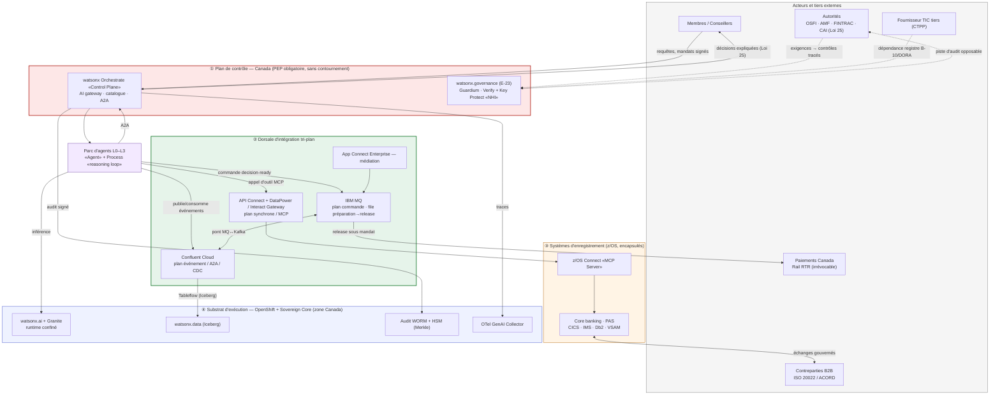
```mermaid
flowchart TB
    subgraph EXT["Acteurs et tiers externes"]
        CLIENT["Membres / Conseillers"]
        REG["Autorités<br/>OSFI · AMF · FINTRAC · CAI (Loi 25)"]
        RTR["Paiements Canada<br/>Rail RTR (irrévocable)"]
        PARTNERS["Contreparties B2B<br/>ISO 20022 / ACORD"]
        CTPP["Fournisseur TIC tiers (CTPP)"]
    end
    subgraph CP["① Plan de contrôle — Canada (PEP obligatoire, sans contournement)"]
        ORCH["watsonx Orchestrate «Control Plane»<br/>AI gateway · catalogue · A2A"]
        GOV["watsonx.governance (E-23)<br/>Guardium · Verify + Key Protect «NHI»"]
    end
    AGENTS["Parc d'agents L0–L3<br/>«Agent» + Process «reasoning loop»"]
    subgraph BB["② Dorsale d'intégration tri-plan"]
        APIC["API Connect + DataPower / Interact Gateway<br/>plan synchrone / MCP"]
        MQ["IBM MQ<br/>plan commande · file préparation→release"]
        CONF["Confluent Cloud<br/>plan événement / A2A / CDC"]
        ACE["App Connect Enterprise — médiation"]
    end
    subgraph SOR["③ Systèmes d'enregistrement (z/OS, encapsulés)"]
        ZC["z/OS Connect «MCP Server»"]
        CORE["Core banking · PAS<br/>CICS · IMS · Db2 · VSAM"]
    end
    subgraph EXEC["④ Substrat d'exécution — OpenShift + Sovereign Core (zone Canada)"]
        WXAI["watsonx.ai + Granite<br/>runtime confiné"]
        WXDATA["watsonx.data (Iceberg)"]
        AUDIT["Audit WORM + HSM (Merkle)"]
        OTEL["OTel GenAI Collector"]
    end
    CLIENT -->|"requêtes, mandats signés"| ORCH
    ORCH -->|"décisions expliquées (Loi 25)"| CLIENT
    REG -.->|"exigences → contrôles tracés"| GOV
    GOV -.->|"piste d'audit opposable"| REG
    CTPP -.->|"dépendance registre B-10/DORA"| GOV
    ORCH --> AGENTS
    AGENTS -->|"A2A"| ORCH
    AGENTS -->|"appel d'outil MCP"| APIC
    AGENTS -->|"commande decision-ready"| MQ
    AGENTS -->|"publie/consomme événements"| CONF
    APIC --> ZC
    ACE --> MQ
    ZC --> CORE
    MQ <-->|"pont MQ↔Kafka"| CONF
    CONF -->|"Tableflow (Iceberg)"| WXDATA
    AGENTS -->|"inférence"| WXAI
    ORCH -->|"audit signé"| AUDIT
    ORCH -->|"traces"| OTEL
    MQ -->|"release sous mandat"| RTR
    CORE <-->|"échanges gouvernés"| PARTNERS
    classDef cp fill:#fde7e7,stroke:#b3261e,stroke-width:2px;
    classDef bb fill:#e6f4ea,stroke:#1e7d34,stroke-width:2px;
    classDef sor fill:#fff4e5,stroke:#b06000,stroke-width:1px;
    classDef ex fill:#eef2ff,stroke:#3b4cca,stroke-width:1px;
    classDef ext fill:#f5f5f5,stroke:#777,stroke-width:1px;
    classDef ag fill:#f3e9ff,stroke:#6b3fa0,stroke-width:1px;
    class EXT ext;
    class CP cp;
    class BB bb;
    class SOR sor;
    class EXEC ex;
    class AGENTS ag;
```

**Figure B — Schéma maître C4, pile IBM consolidée sur Boréalis.** Fusion des figures 1 (contexte) et 2 (conteneurs) avec l'overlay des zones (figure 9). Le plan de contrôle (rouge) est un point d'application de politique obligatoire et sans contournement (invariant 3) ; la dorsale (vert) sépare les trois plans d'interaction (§4) ; les systèmes d'enregistrement (orange) sont encapsulés sans modification ; le substrat d'exécution (bleu) est confiné en zone Canada (egress `ca-central` uniquement, invariant 6). Règle structurante : aucun agent n'atteint un système d'enregistrement sans franchir à la fois le plan de contrôle et un point d'application de politique de la dorsale.

Ces deux vues servent de table des matières visuelle : le lecteur-architecte y situe n'importe quel composant avant d'en lire le contrat d'interface, la topologie ou le runbook dans les sections qui suivent.

---

## 0.2 Blueprint EA détaillé — jeu de vues ArchiMate

En complément de la vue d'ouverture (§0.1), cette section déroule le **blueprint d'architecture d'entreprise détaillé** : l'instanciation ArchiMate 4 (The Open Group, C260) de la solution Boréalis sur la pile IBM, vue par vue, selon la bibliothèque de points de vue du ch.6 (cf. Monographie ch.6 §6.7). Dix vues couvrent les cinq domaines — Motivation, Stratégie, Affaires, Application, Technologie —, le point de vue Implémentation & Déploiement, et les quatre points de vue transverses (Sécurité/Risque, Zéro-trust/NHI, Conformité traçable, Audit/Observabilité). Les conventions de la version 4 sont appliquées : les éléments Constraint, Contract et Gap, retirés, sont rendus par spécialisation (respectivement `<<regulatory-requirement>>`, Business Object « Contrat », spécialisation d'Assessment) ; le registre de stéréotypes du blueprint (cf. Monographie ch.6 §6.1.9) s'applique à chaque vue. Chaque figure expose les éléments typés et leurs relations canoniques (Influence, Realization, Assignment, Serving, Access, Flow, Triggering, Aggregation, Specialization, Association) ; les figures 1 à 16 en donnent la projection C4 et les contrats d'interface.

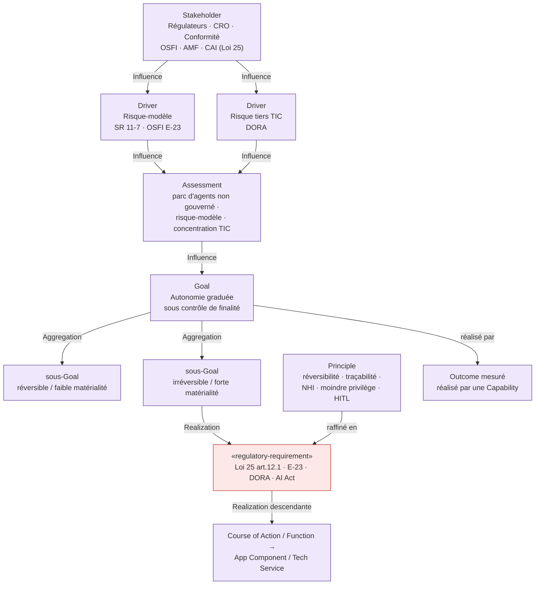
```mermaid
flowchart TB
    SH["Stakeholder<br/>Régulateurs · CRO · Conformité<br/>OSFI · AMF · CAI (Loi 25)"]
    DR1["Driver<br/>Risque-modèle<br/>SR 11-7 · OSFI E-23"]
    DR2["Driver<br/>Risque tiers TIC<br/>DORA"]
    AS["Assessment<br/>parc d'agents non gouverné ·<br/>risque-modèle · concentration TIC"]
    GO["Goal<br/>Autonomie graduée<br/>sous contrôle de finalité"]
    GO1["sous-Goal<br/>réversible / faible matérialité"]
    GO2["sous-Goal<br/>irréversible / forte matérialité"]
    PR["Principle<br/>réversibilité · traçabilité ·<br/>NHI · moindre privilège · HITL"]
    REQ["«regulatory-requirement»<br/>Loi 25 art.12.1 · E-23 · DORA · AI Act"]
    OUT["Outcome mesuré<br/>réalisé par une Capability"]
    EXE["Course of Action / Function →<br/>App Component / Tech Service"]
    SH -->|"Influence"| DR1
    SH -->|"Influence"| DR2
    DR1 -->|"Influence"| AS
    DR2 -->|"Influence"| AS
    AS -->|"Influence"| GO
    GO -->|"Aggregation"| GO1
    GO -->|"Aggregation"| GO2
    GO2 -->|"Realization"| REQ
    PR -->|"raffiné en"| REQ
    GO -->|"réalisé par"| OUT
    REQ -->|"Realization descendante"| EXE
    classDef mot fill:#efe7fb,stroke:#5b3a9b,stroke-width:1px;
    classDef reg fill:#fde7e7,stroke:#b3261e,stroke-width:1px;
    class SH,DR1,DR2,AS,GO,GO1,GO2,PR,OUT,EXE mot;
    class REQ reg;
```

**Figure C — Vue Motivation.** La chaîne d'intention : les Stakeholders (régulateurs, CRO, conformité) influencent des Drivers — dont la double-qualification *risque-modèle* (OSFI E-23) et *risque tiers TIC* (DORA), modélisée par deux Drivers distincts et non agrégés ; les Assessments (*agent sprawl*, risque-modèle, concentration TIC) justifient le Goal d'autonomie graduée, raffiné par Aggregation en sous-Goals indexés sur matérialité et réversibilité, puis réalisé en exigences. L'exigence réglementaire est une spécialisation de Requirement `<<regulatory-requirement>>` (Constraint retiré en v4) ; aucune ne doit rester orpheline (critère contrôlé en §7.1).

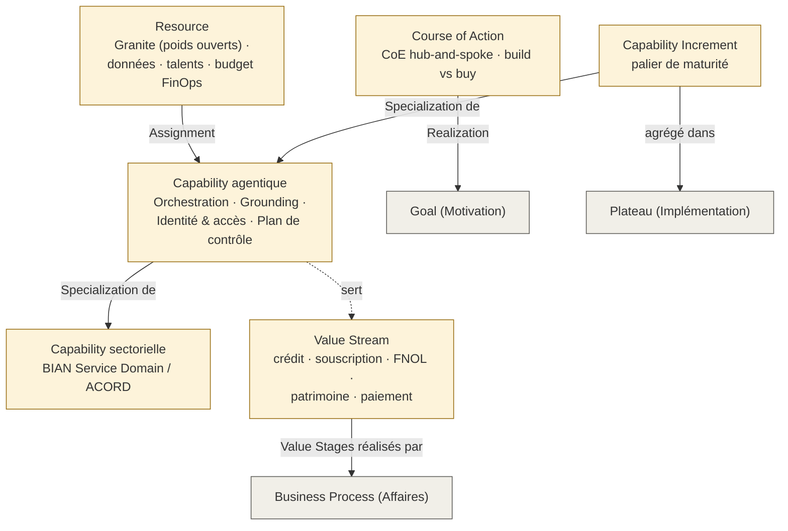
```mermaid
flowchart TB
    RES["Resource<br/>Granite (poids ouverts) ·<br/>données · talents · budget FinOps"]
    CAP["Capability agentique<br/>Orchestration · Grounding ·<br/>Identité & accès · Plan de contrôle"]
    BIAN["Capability sectorielle<br/>BIAN Service Domain / ACORD"]
    COA["Course of Action<br/>CoE hub-and-spoke · build vs buy"]
    GOAL["Goal (Motivation)"]
    VS["Value Stream<br/>crédit · souscription · FNOL ·<br/>patrimoine · paiement"]
    BP["Business Process (Affaires)"]
    INC["Capability Increment<br/>palier de maturité"]
    PLAT["Plateau (Implémentation)"]
    RES -->|"Assignment"| CAP
    CAP -->|"Specialization de"| BIAN
    COA -->|"Realization"| GOAL
    CAP -.->|"sert"| VS
    VS -->|"Value Stages réalisés par"| BP
    INC -->|"Specialization de"| CAP
    INC -->|"agrégé dans"| PLAT
    classDef str fill:#fdf3da,stroke:#9a7016,stroke-width:1px;
    classDef ext fill:#f1efe8,stroke:#5f5e5a,stroke-width:1px;
    class RES,CAP,BIAN,COA,VS,INC str;
    class GOAL,BP,PLAT ext;
```

**Figure D — Vue Stratégie.** L'unité de planification est la *capacité agentique*, non le modèle ni l'outil. Chaque Capability spécialise une capacité sectorielle (BIAN Service Domain / ACORD) ; la Resource (modèles, données, budget FinOps) lui est *assignée* ; le Course of Action réalise les Goals ; le Value Stream se décompose en Value Stages réalisés par des Business Process ; un Capability Increment spécialise la capacité et s'agrège en Plateau.

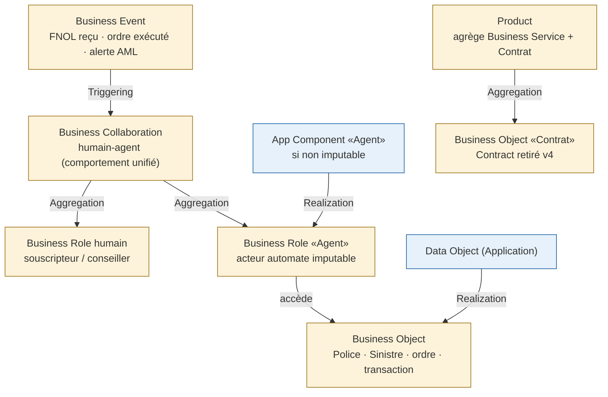
```mermaid
flowchart TB
    EV["Business Event<br/>FNOL reçu · ordre exécuté · alerte AML"]
    COL["Business Collaboration<br/>humain-agent (comportement unifié)"]
    RH["Business Role humain<br/>souscripteur / conseiller"]
    RA["Business Role «Agent»<br/>acteur automate imputable"]
    AGC["App Component «Agent»<br/>si non imputable"]
    BO["Business Object<br/>Police · Sinistre · ordre · transaction"]
    CT["Business Object «Contrat»<br/>Contract retiré v4"]
    PRD["Product<br/>agrège Business Service + Contrat"]
    DO["Data Object (Application)"]
    EV -->|"Triggering"| COL
    COL -->|"Aggregation"| RH
    COL -->|"Aggregation"| RA
    AGC -->|"Realization"| RA
    RA -->|"accède"| BO
    DO -->|"Realization"| BO
    PRD -->|"Aggregation"| CT
    classDef bus fill:#fdf3da,stroke:#9a7016,stroke-width:1px;
    classDef app fill:#e6f1fb,stroke:#185fa5,stroke-width:1px;
    class EV,COL,RH,RA,BO,CT,PRD bus;
    class AGC,DO app;
```

**Figure E — Vue Affaires.** L'altitude de l'agent est dictée par l'imputabilité : un agent imputable se remonte en Business Role `<<Agent>>` assigné à un acteur automate ; sinon il reste un Application Component qui réalise cet acteur. La Business Collaboration agrège les Roles humains et automates ; les Business Objects (Police, Sinistre, ordre) sont réalisés par des Data Objects ; le Contrat, retiré en v4, devient une spécialisation de Business Object agrégée au Produit.

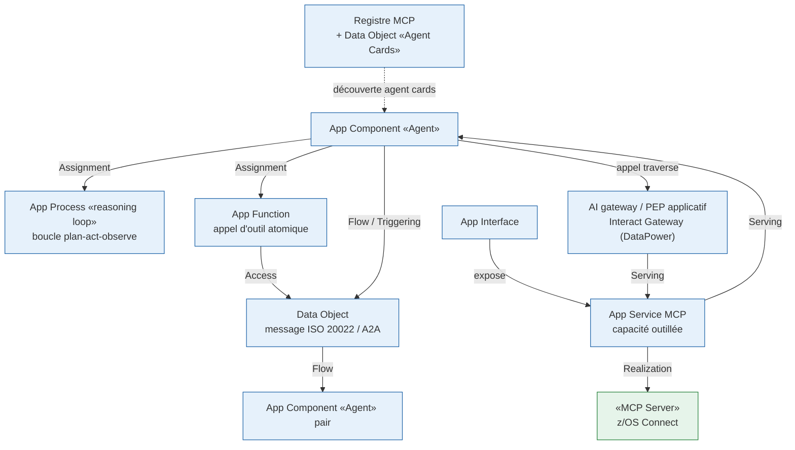
```mermaid
flowchart TB
    AG["App Component «Agent»"]
    RL["App Process «reasoning loop»<br/>boucle plan-act-observe"]
    FN["App Function<br/>appel d'outil atomique"]
    SVC["App Service MCP<br/>capacité outillée"]
    IFACE["App Interface"]
    MCPS["«MCP Server»<br/>z/OS Connect"]
    GW["AI gateway / PEP applicatif<br/>Interact Gateway (DataPower)"]
    REG["Registre MCP<br/>+ Data Object «Agent Cards»"]
    DO["Data Object<br/>message ISO 20022 / A2A"]
    AG2["App Component «Agent» pair"]
    AG -->|"Assignment"| RL
    AG -->|"Assignment"| FN
    IFACE -->|"expose"| SVC
    SVC -->|"Realization"| MCPS
    SVC -->|"Serving"| AG
    FN -->|"Access"| DO
    AG -->|"appel traverse"| GW
    GW -->|"Serving"| SVC
    REG -.->|"découverte agent cards"| AG
    AG -->|"Flow / Triggering"| DO
    DO -->|"Flow"| AG2
    classDef app fill:#e6f1fb,stroke:#185fa5,stroke-width:1px;
    classDef mcp fill:#e6f4ea,stroke:#1e7d34,stroke-width:1px;
    class AG,RL,FN,SVC,IFACE,GW,REG,DO,AG2 app;
    class MCPS mcp;
```

**Figure F — Vue Application.** L'agent est un Application Component `<<Agent>>` ; sa boucle plan-act-observe est un Application Process `<<reasoning loop>>`, l'appel d'outil une Application Function. Le triplet MCP — Application Service réalisé par le `<<MCP Server>>` (z/OS Connect), exposé par une Application Interface, *Serving* vers l'agent, *Access* sur le Data Object — passe par l'AI gateway (PEP applicatif). L'A2A est un Flow/Triggering via Data Object interposé.

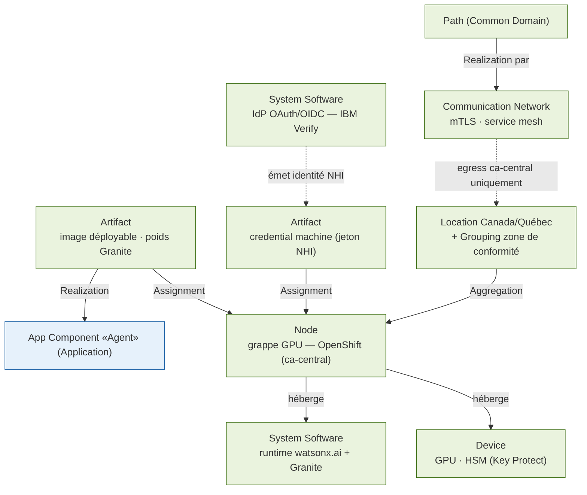
```mermaid
flowchart TB
    AG["App Component «Agent» (Application)"]
    ART["Artifact<br/>image déployable · poids Granite"]
    NODE["Node<br/>grappe GPU — OpenShift (ca-central)"]
    SS["System Software<br/>runtime watsonx.ai + Granite"]
    DEV["Device<br/>GPU · HSM (Key Protect)"]
    CRED["Artifact<br/>credential machine (jeton NHI)"]
    IDP["System Software<br/>IdP OAuth/OIDC — IBM Verify"]
    PATH["Path (Common Domain)"]
    NET["Communication Network<br/>mTLS · service mesh"]
    LOC["Location Canada/Québec<br/>+ Grouping zone de conformité"]
    ART -->|"Realization"| AG
    ART -->|"Assignment"| NODE
    NODE -->|"héberge"| SS
    NODE -->|"héberge"| DEV
    CRED -->|"Assignment"| NODE
    IDP -.->|"émet identité NHI"| CRED
    PATH -->|"Realization par"| NET
    LOC -->|"Aggregation"| NODE
    NET -.->|"egress ca-central uniquement"| LOC
    classDef tec fill:#eaf3de,stroke:#3b6d11,stroke-width:1px;
    classDef app fill:#e6f1fb,stroke:#185fa5,stroke-width:1px;
    class ART,NODE,SS,DEV,CRED,IDP,PATH,NET,LOC tec;
    class AG app;
```

**Figure G — Vue Technologie.** Le substrat d'exécution confiné : l'Artifact (image, poids Granite) réalise l'Application Component et est assigné à un Node (grappe GPU OpenShift en `ca-central`) hébergeant le System Software (runtime) et les Device (GPU, HSM). Le credential machine (jeton NHI) est un Artifact assigné au Node ; le Path (Common Domain v4) est réalisé par un Communication Network (mTLS) ; la Location et le Grouping de zone fixent la résidence — l'absence de Path sortant traduisant l'interdiction d'egress.

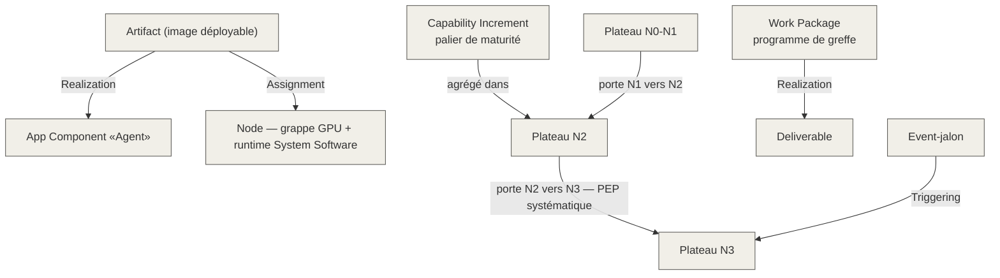
```mermaid
flowchart TB
    AG["App Component «Agent»"]
    ART["Artifact (image déployable)"]
    NODE["Node — grappe GPU + runtime System Software"]
    INC["Capability Increment<br/>palier de maturité"]
    P0["Plateau N0-N1"]
    P2["Plateau N2"]
    P3["Plateau N3"]
    WP["Work Package<br/>programme de greffe"]
    DEL["Deliverable"]
    EVT["Event-jalon"]
    ART -->|"Realization"| AG
    ART -->|"Assignment"| NODE
    INC -->|"agrégé dans"| P2
    P0 -->|"porte N1 vers N2"| P2
    P2 -->|"porte N2 vers N3 — PEP systématique"| P3
    WP -->|"Realization"| DEL
    EVT -->|"Triggering"| P3
    classDef impl fill:#f1efe8,stroke:#5f5e5a,stroke-width:1px;
    class AG,ART,NODE,INC,P0,P2,P3,WP,DEL,EVT impl;
```

**Figure H — Vue Implémentation & Déploiement.** Le gabarit de déploiement (Application Component ←Realization— Artifact —Assignment→ Node) relie l'intention applicative au lieu d'exécution. La trajectoire se fractionne en Plateaus successifs ; le Capability Increment s'agrège au Plateau ; la porte N2→N3 (PEP systématique) est le jalon critique ; Work Packages, Deliverables et Events-jalons pilotent le programme de greffe (Gap retiré en v4 → spécialisation d'Assessment).

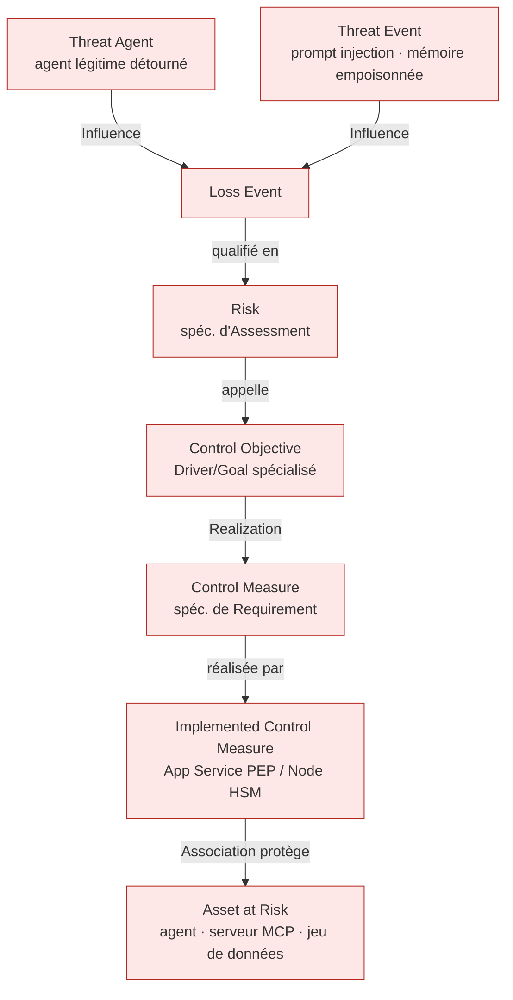
```mermaid
flowchart TB
    TA["Threat Agent<br/>agent légitime détourné"]
    TE["Threat Event<br/>prompt injection · mémoire empoisonnée"]
    LE["Loss Event"]
    RK["Risk<br/>spéc. d'Assessment"]
    CO["Control Objective<br/>Driver/Goal spécialisé"]
    CM["Control Measure<br/>spéc. de Requirement"]
    ICM["Implemented Control Measure<br/>App Service PEP / Node HSM"]
    AST["Asset at Risk<br/>agent · serveur MCP · jeu de données"]
    TA -->|"Influence"| LE
    TE -->|"Influence"| LE
    LE -->|"qualifié en"| RK
    RK -->|"appelle"| CO
    CO -->|"Realization"| CM
    CM -->|"réalisée par"| ICM
    ICM -->|"Association protège"| AST
    classDef sec fill:#fde7e7,stroke:#b3261e,stroke-width:1px;
    class TA,TE,LE,RK,CO,CM,ICM,AST sec;
```

**Figure I — Vue Sécurité/Risque (Risk & Security Overlay).** La chaîne du RSO (W172) appliquée au parc d'agents : un Threat Agent (agent légitime détourné) et un Threat Event mènent par Influence à un Loss Event qualifié en Risk (spécialisation d'Assessment) ; le Control Objective se réalise en Control Measure (spécialisation de Requirement, Constraint retiré v4), elle-même réalisée par une Implemented Control Measure (App Service PEP / Node HSM) associée à l'Asset at Risk protégé.

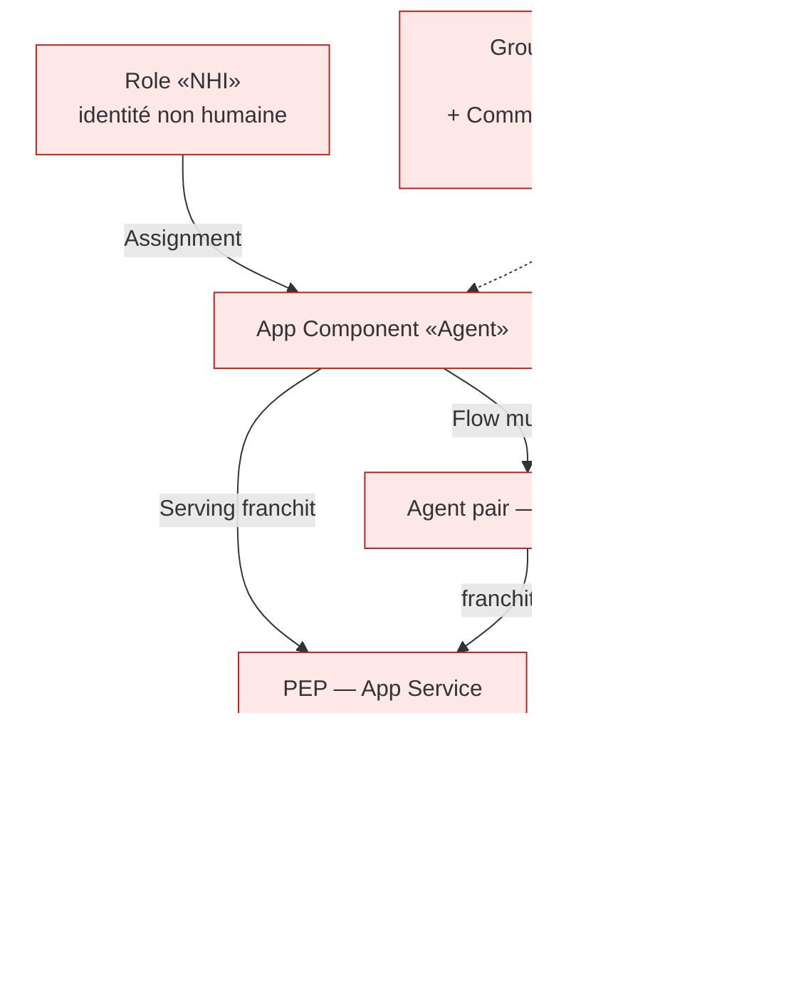
```mermaid
flowchart TB
    AG["App Component «Agent»"]
    NHI["Role «NHI»<br/>identité non humaine"]
    PEP["PEP — App Service<br/>traversée obligatoire"]
    PDP["PDP — App Component<br/>OPA / Cedar"]
    SVC["Service outillé / serveur MCP"]
    AG2["Agent pair — délégation"]
    GRP["Grouping zone de confiance<br/>+ Communication Network mTLS"]
    NHI -->|"Assignment"| AG
    AG -->|"Serving franchit"| PEP
    PEP -->|"interroge"| PDP
    PEP -->|"vers"| SVC
    AG -->|"Flow multi-saut"| AG2
    AG2 -->|"franchit aussi"| PEP
    GRP -.->|"contient"| AG
    classDef zt fill:#fde7e7,stroke:#b3261e,stroke-width:1px;
    class AG,NHI,PEP,PDP,SVC,AG2,GRP zt;
```

**Figure J — Vue Zéro-trust / NHI.** L'identité non humaine est un Role `<<NHI>>` assigné à l'agent ; tout flux franchit un PEP (Application Service de traversée obligatoire), distinct du PDP (OPA/Cedar) — la séparation décision/application étant elle-même une exigence d'architecture. La délégation multi-saut est une succession de Flow franchissant le PEP ; la zone de confiance combine Grouping et Communication Network.

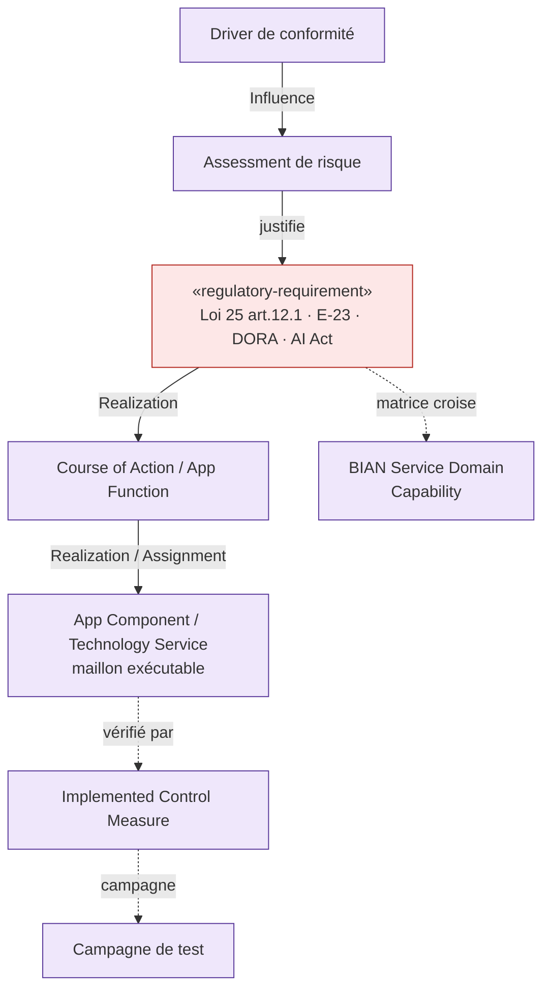
```mermaid
flowchart TB
    DR["Driver de conformité"]
    AS["Assessment de risque"]
    REQ["«regulatory-requirement»<br/>Loi 25 art.12.1 · E-23 · DORA · AI Act"]
    COA["Course of Action / App Function"]
    EXE["App Component / Technology Service<br/>maillon exécutable"]
    CAP["BIAN Service Domain<br/>Capability"]
    CTL["Implemented Control Measure"]
    TST["Campagne de test"]
    DR -->|"Influence"| AS
    AS -->|"justifie"| REQ
    REQ -->|"Realization"| COA
    COA -->|"Realization / Assignment"| EXE
    REQ -.->|"matrice croise"| CAP
    EXE -.->|"vérifié par"| CTL
    CTL -.->|"campagne"| TST
    classDef conf fill:#efe7fb,stroke:#5b3a9b,stroke-width:1px;
    classDef reg fill:#fde7e7,stroke:#b3261e,stroke-width:1px;
    class DR,AS,COA,EXE,CAP,CTL,TST conf;
    class REQ reg;
```

**Figure K — Vue Conformité traçable (siège).** La chaîne verticale de bout en bout : Driver de conformité → Assessment → `<<regulatory-requirement>>` → Course of Action / Application Function → Application Component / Technology Service exécutable. La matrice d'auditabilité croise l'exigence, le contrôle (Implemented Control Measure), le BIAN Service Domain (Capability) et l'élément porteur ; le critère vérifiable est qu'aucun `<<regulatory-requirement>>` ne demeure orphelin.

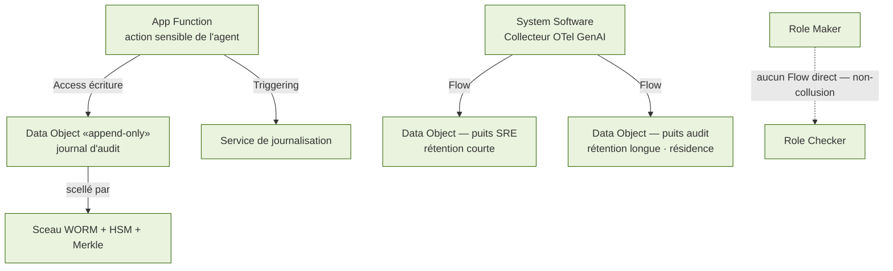
```mermaid
flowchart TB
    ACT["App Function<br/>action sensible de l'agent"]
    LOG["Data Object «append-only»<br/>journal d'audit"]
    SEAL["Sceau WORM + HSM + Merkle"]
    JSVC["Service de journalisation"]
    OT["System Software<br/>Collecteur OTel GenAI"]
    SRE["Data Object — puits SRE<br/>rétention courte"]
    AUD["Data Object — puits audit<br/>rétention longue · résidence"]
    MK["Role Maker"]
    CK["Role Checker"]
    ACT -->|"Access écriture"| LOG
    ACT -->|"Triggering"| JSVC
    LOG -->|"scellé par"| SEAL
    OT -->|"Flow"| SRE
    OT -->|"Flow"| AUD
    MK -.->|"aucun Flow direct — non-collusion"| CK
    classDef aud fill:#eaf3de,stroke:#3b6d11,stroke-width:1px;
    class ACT,LOG,SEAL,JSVC,OT,SRE,AUD,MK,CK aud;
```

**Figure L — Vue Audit/Observabilité.** La preuve structurelle : toute action sensible (Application Function) écrit (*Access*) dans un Data Object `<<append-only>>` scellé (WORM + HSM + Merkle) et déclenche (*Triggering*) la journalisation. L'observabilité SRE et l'audit réglementaire sont séparés en deux Data Objects (rétentions et résidences distinctes) alimentés par le Collector OTel ; la ségrégation maker-checker se lit dans l'absence délibérée de Flow direct entre les deux Roles.

Ensemble, ces dix vues constituent le blueprint exploitable : chaque élément y est typé, stéréotypé et relié, et chaque `<<regulatory-requirement>>` se rattache à un élément exécutable — condition d'auditabilité posée en Monographie ch.6 §6.6.3. Les statuts vivants (⚠) et les valeurs chiffrées restent ceux de l'Annexe B.

---

## 1. Périmètre, hypothèses et invariants

### 1.1 Entreprise fictive — Coopérative financière Boréalis

| Attribut | Valeur |
|---|---|
| Nature | Coopérative de services financiers, Québec ; FRFI sous OSFI + assujettie AMF |
| Sous-domaines | Bancaire détail/PME · Assurance dommage (IARD) · Assurance vie & santé · Gestion de patrimoine · Services TI internes |
| Substrat hérité | Core banking + PAS assurance sur z/OS ; IBM MQ pour la messagerie ; Kafka pour l'EDA |
| Contraintes-pivots | Loi 25 art. 12.1 · résidence des renseignements personnels au Canada · OSFI E-23/B-10/B-13 · ligne directrice IA de l'AMF |
| Posture agentique | Copilotes à l'échelle + autonomie transactionnelle *bornée* aux cas à faible irréversibilité |
| Ordre de grandeur (hypothèse de dimensionnement) | ~1,2 M de membres ; ~3 500 employés ; pics de ~2 500 transactions/s sur le rail de paiement ; parc cible de 40-80 agents gouvernés à 24 mois |

### 1.2 Décision d'architecture — épine IBM consolidée

Consolider sur IBM n'est pas un parti pris de fournisseur ; le choix découle de trois propriétés que la pile offre *couplées* et que la finance régulée exige indissociables :

1. **Plan de contrôle et registre de modèles fusionnés.** watsonx Orchestrate (control plane) et watsonx.governance (registre de modèles E-23) partagent un même graphe de gouvernance — la double-qualification *modèle + tiers TIC* y est native, inscrite au même endroit plutôt que reconstituée par rapprochement manuel.
2. **Résidence native par le substrat.** IBM-sur-Z + Sovereign Core ramènent la résidence à une propriété d'infrastructure, non à une consigne contractuelle : on la prouve en testant l'absence de chemin sortant, plutôt qu'en lisant une clause.
3. **Encapsulation non disruptive du legacy.** z/OS Connect, App Connect (ACE) et API Connect exposent le cœur z/OS en MCP/API *sans le toucher* — le socle existant de Boréalis devient l'actif différenciant plutôt que la dette à résorber.

Le revers — lock-in et dépendance CTPP — est traité en §16 et tranché en ADR-001 (§15).

### 1.3 Invariants directeurs

Sept invariants non négociables gouvernent toutes les décisions ; une décision qui en viole un est, par construction, non défendable devant l'AMF ou l'OSFI. Ils se projettent en principes d'architecture vérifiables (§2.2) et en contrôles tracés (Annexe B interne — matrice de traçabilité).

1. **Irréversibilité → préparation par l'agent, release humaine sur l'irréversible.** Pas de saga compensatoire déterministe sur un rail à finalité immédiate.
2. **Double-qualification.** Un agent décisionnel est un *modèle* (E-23) *et* un *tiers TIC* (B-10/B-13, DORA) ; les deux pistes d'audit coexistent.
3. **Plan de contrôle unique, sans contournement.** Un PEP (point d'application de politique) obligatoire identifie (KYA/NHI), autorise (matérialité × réversibilité), ségrègue (four-eyes anti-collusion), journalise (infalsifiable).
4. **Grounding sur standard sectoriel.** ISO 20022 / BIAN / FIBO / ACORD / CDM / FHIR ; ontologie en validation, jamais en génération.
5. **Audit infalsifiable ≠ observabilité SRE.** Deux objets, deux rétentions, deux finalités.
6. **Résidence = contrat d'architecture vérifiable.** Exprimée par l'absence de chemin sortant + zone de conformité.
7. **Standards ouverts aux coutures.** MCP, A2A, ISO 20022, OTel GenAI, poids ouverts, échange ArchiMate — pour préserver l'*exit-by-design*.

Le premier — l'irréversibilité — commande le calibrage de l'autonomie ci-dessous : l'action est d'autant plus libre qu'elle se défait sans dommage.

**Calibrage de l'autonomie (porté par un *Profile* ArchiMate).** L'autonomie n'est pas un attribut produit ; c'est une fonction de la réversibilité et de la matérialité de l'action.

| Niveau | Régime | Domaine d'application | Garde-fou |
|---|---|---|---|
| **L0 — Copilote** | Assiste un humain, ne touche aucun système d'enregistrement | tout | Supervision humaine implicite |
| **L1 — Préparateur** | Produit une transaction *decision-ready*, ne l'émet pas | matérialité haute, réversibilité faible | Release humaine (HITL) sur l'étape irréversible |
| **L2 — Exécuteur borné** | Exécute seul des actions réversibles à faible matérialité | réversible + faible matérialité | Contrôle déterministe + four-eyes inter-agents |
| **L3 — Transactionnel encadré** | Exécute une action engageante via mandat vérifiable signé | borné par scope du mandat | KYA + mandat opposable journalisé + réconciliation continue |

Règle de placement : **toute action irréversible reste ≤ L1 par défaut** ; le franchissement L1→L2/L3 exige la réversibilité native ou un mandat cryptographique borné. La machine à états de transition d'autonomie est posée en §12.2.

### 1.4 Des pilotes (*drivers*) aux exigences non fonctionnelles

Un *driver* sans NFR mesurable est une intention, pas une exigence : c'est le test qui sépare ce qui s'audite de ce qui se proclame. Invariants et *drivers* réglementaires (§7) se traduisent donc en exigences non fonctionnelles mesurables, chiffrées en §9 ; chaque ligne du tableau ci-dessous noue un *driver* à la grandeur qui le rend vérifiable.

| Driver (origine) | Qualité d'architecture visée | NFR mesurable (siège §9) |
|---|---|---|
| Irréversibilité (invariant 1) | Intégrité transactionnelle | Livraison *exactly-once* MQ ; 0 double-engagement ; RPO=0 sur le rail de commande |
| Audit infalsifiable (E-23, AMF) | Non-répudiation, rétention | Signature HSM + WORM ; rétention pluriannuelle ; latence d'écriture d'audit < 200 ms p99 |
| Résidence (Loi 25, OSFI B-10) | Confinement géographique | 0 chemin d'egress hors zone Canada (vérifié par NetworkPolicy + DLP) |
| Continuité (OSFI B-10, DORA) | Disponibilité, reprise | SLO 99,95 % plan de commande ; RTO ≤ 15 min ; bascule HA automatique |
| Maîtrise des coûts (FinOps) | Efficience d'inférence | Coût/jeton suivi par agent ; budget d'inférence borné par plafond (§10.4) |
| Lutte fraude/AML (FINTRAC) | Détection temps réel | Réconciliation continue < 5 s bout-en-bout (Flink) ; couverture 100 % des flux à risque |

### 1.5 Parties prenantes et imputabilité (RACI sommaire)

L'imputabilité humaine est restaurée par construction (KYH, §3.4). Le RACI ci-dessous fixe qui répond de quoi ; il est opérationnalisé par plateau dans le runbook de cutover §14.5.

| Activité / décision | Métier | Risque-modèle (E-23) | Conformité | Architecture/TI | Sécurité |
|---|---|---|---|---|---|
| Mise en service d'un agent | A | R | C | R | C |
| Validation pré-déploiement du modèle | C | A/R | C | C | I |
| Release humaine sur l'irréversible | A/R | I | C | I | I |
| Octroi d'identité NHI + scope | I | I | C | R | A/R |
| Inscription au registre des tiers TIC | I | C | A/R | C | C |
| Franchissement de porte de plateau | A | R | A | R | R |

*(R = réalise, A = approuve/imputable, C = consulté, I = informé.)*

### 1.6 Vue de contexte (C4 — niveau 1)

La figure 1 situe le système agentique de Boréalis dans son écosystème : acteurs humains, autorités, systèmes d'enregistrement hérités et tiers externes. Deux frontières *load-bearing* la structurent : la **frontière de résidence**, qui maintient tout le traitement décisionnel en zone Canada, et la **frontière d'imputabilité**, qui contraint toute action engageante à traverser le plan de contrôle. Le diagramme matérialise l'une et l'autre.

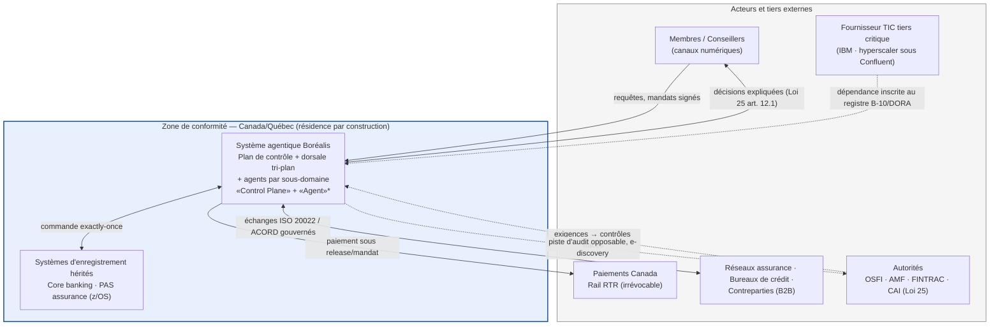
```mermaid
flowchart TB
    subgraph EXT["Acteurs et tiers externes"]
        CLIENT["Membres / Conseillers<br/>(canaux numériques)"]
        REG["Autorités<br/>OSFI · AMF · FINTRAC · CAI (Loi 25)"]
        RTR["Paiements Canada<br/>Rail RTR (irrévocable)"]
        PARTNERS["Réseaux assurance · Bureaux de crédit ·<br/>Contreparties (B2B)"]
        CTPP["Fournisseur TIC tiers critique<br/>(IBM · hyperscaler sous Confluent)"]
    end

    subgraph BOREALIS["Zone de conformité — Canada/Québec (résidence par construction)"]
        SYS["Système agentique Boréalis<br/>Plan de contrôle + dorsale tri-plan<br/>+ agents par sous-domaine<br/>«Control Plane» + «Agent»*"]
        LEGACY["Systèmes d'enregistrement hérités<br/>Core banking · PAS assurance (z/OS)"]
    end

    CLIENT -->|"requêtes, mandats signés"| SYS
    SYS -->|"décisions expliquées (Loi 25 art. 12.1)"| CLIENT
    SYS <-->|"commande exactly-once"| LEGACY
    SYS -->|"paiement sous release/mandat"| RTR
    SYS <-->|"échanges ISO 20022 / ACORD gouvernés"| PARTNERS
    REG -.->|"exigences → contrôles tracés"| SYS
    SYS -.->|"piste d'audit opposable, e-discovery"| REG
    CTPP -.->|"dépendance inscrite au registre B-10/DORA"| SYS

    classDef zone fill:#e8f0fe,stroke:#1a4d8f,stroke-width:2px;
    classDef ext fill:#f5f5f5,stroke:#777,stroke-width:1px;
    class BOREALIS zone;
    class EXT ext;
```

**Figure 1 — Vue de contexte (C4-L1).** Le système central est traité en boîte noire ; les flèches pleines sont des flux opérationnels, les pointillées des flux de gouvernance/audit. La boîte « Zone de conformité » est la frontière de résidence vérifiable (invariant 6).

---

## 2. Vue d'ensemble — la pile IBM consolidée

Le socle d'intégration est **IBM Cloud Pak for Integration (CP4I) 16.2.0 LTS** : il réunit sous une gestion unifiée ce que la finance régulée exige indissociable — MQ, App Connect, DataPower, API Connect et la messagerie événementielle —, enrichis d'assistance agentique et du support des passerelles d'API fédérées (IBM, mai 2026). Cette consolidation prolonge la justification de l'épine IBM (cf. §1.2) : un seul plan de gestion plutôt qu'une mosaïque à recoudre. Les couches agentiques (watsonx) et l'Event Mesh (Confluent Cloud) s'y articulent sans le contourner.

| Domaine d'architecture | Produit / service IBM (ou stratégique IBM) |
|---|---|
| Plan de contrôle agentique / AI gateway | IBM watsonx Orchestrate (next-gen control plane) ⚠ private preview |
| Registre de modèles & gouvernance IA (E-23) | IBM watsonx.governance (Factsheets, Governance Graph) |
| Sécurité de l'IA / découverte shadow-AI | IBM Guardium AI Security |
| Identité (humaine, NHI/agent) | IBM Verify + Key Protect (HSM FIPS 140-2 niveau 3) |
| **API Management** | **IBM API Connect 12.1 + DataPower Gateway / Nano / Interact Gateway** |
| **Event Mesh** | **Confluent Cloud (KORA, Flink, Tableflow, Stream Governance)** |
| **Messagerie transactionnelle** | **IBM MQ 9.4.5 (Multiplatforms + z/OS)** |
| Intégration applicative (ESB/flux) | IBM App Connect Enterprise (ACE) |
| Encapsulation mainframe | IBM z/OS Connect 3.0.98 (REST + MCP) |
| Runtime LLM confiné | IBM watsonx.ai + modèles Granite (poids ouverts) sur Red Hat AI |
| Lakehouse / contexte gouverné | IBM watsonx.data (+ Context on watsonx.data) ⚠ |
| Souveraineté / résidence | IBM Sovereign Core (policy-at-runtime, Red Hat OpenShift/AI) |
| Opérations intelligentes | IBM Concert |
| Orchestration de conteneurs | Red Hat OpenShift Container Platform |

### 2.1 Vue de conteneurs (C4 — niveau 2)

**Lecture clé.** *Aucun* agent n'atteint un système d'enregistrement sans traverser à la fois le plan de contrôle (couche agent/A2A) et un point d'application de politique de la dorsale (couche API/MCP ou file de commande). La figure 2 ouvre la boîte noire de la figure 1 et décline cette règle en quatre bandes : **plan de contrôle** (gouvernance obligatoire), **dorsale tri-plan** (trois substrats d'interaction), **systèmes d'enregistrement** (legacy encapsulé) et **substrat d'exécution** (runtime confiné, données, identité).

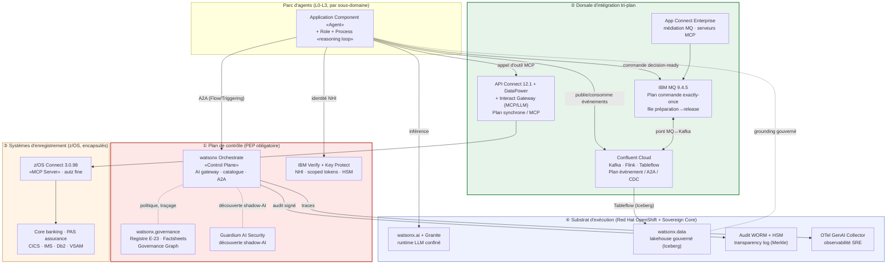
```mermaid
flowchart TB
    subgraph CP["① Plan de contrôle (PEP obligatoire)"]
        ORCH["watsonx Orchestrate<br/>«Control Plane»<br/>AI gateway · catalogue · A2A"]
        GOV["watsonx.governance<br/>Registre E-23 · Factsheets<br/>Governance Graph"]
        GUARD["Guardium AI Security<br/>découverte shadow-AI"]
        IDP["IBM Verify + Key Protect<br/>NHI · scoped tokens · HSM"]
    end

    subgraph AGENTS["Parc d'agents (L0-L3, par sous-domaine)"]
        AG["Application Component «Agent»<br/>+ Role + Process «reasoning loop»"]
    end

    subgraph BACKBONE["② Dorsale d'intégration tri-plan"]
        APIC["API Connect 12.1 + DataPower<br/>+ Interact Gateway (MCP/LLM)<br/>Plan synchrone / MCP"]
        MQ["IBM MQ 9.4.5<br/>Plan commande exactly-once<br/>file préparation→release"]
        CONF["Confluent Cloud<br/>Kafka · Flink · Tableflow<br/>Plan événement / A2A / CDC"]
        ACE["App Connect Enterprise<br/>médiation MQ · serveurs MCP"]
    end

    subgraph SOR["③ Systèmes d'enregistrement (z/OS, encapsulés)"]
        ZCONN["z/OS Connect 3.0.98<br/>«MCP Server» · autz fine"]
        CORE["Core banking · PAS assurance<br/>CICS · IMS · Db2 · VSAM"]
    end

    subgraph EXEC["④ Substrat d'exécution (Red Hat OpenShift + Sovereign Core)"]
        WXAI["watsonx.ai + Granite<br/>runtime LLM confiné"]
        WXDATA["watsonx.data<br/>lakehouse gouverné (Iceberg)"]
        AUDIT["Audit WORM + HSM<br/>transparency log (Merkle)"]
        OTEL["OTel GenAI Collector<br/>observabilité SRE"]
    end

    AG -->|"A2A (Flow/Triggering)"| ORCH
    ORCH -. "politique, traçage" .- GOV
    ORCH -. "découverte shadow-AI" .- GUARD
    AG -->|"appel d'outil MCP"| APIC
    AG -->|"commande decision-ready"| MQ
    AG -->|"publie/consomme événements"| CONF
    AG -->|"identité NHI"| IDP
    APIC --> ZCONN
    ACE --> MQ
    ZCONN --> CORE
    MQ <-->|"pont MQ↔Kafka"| CONF
    CONF -->|"Tableflow (Iceberg)"| WXDATA
    AG -->|"inférence"| WXAI
    AG -. "grounding gouverné" .- WXDATA
    ORCH -->|"traces"| OTEL
    ORCH -->|"audit signé"| AUDIT

    classDef cp fill:#fde7e7,stroke:#b3261e,stroke-width:2px;
    classDef bb fill:#e6f4ea,stroke:#1e7d34,stroke-width:2px;
    classDef sor fill:#fff4e5,stroke:#b06000,stroke-width:1px;
    classDef ex fill:#eef2ff,stroke:#3b4cca,stroke-width:1px;
    class CP cp;
    class BACKBONE bb;
    class SOR sor;
    class EXEC ex;
```

**Figure 2 — Vue de conteneurs (C4-L2).** Le plan de contrôle (rouge) est obligatoire et sans contournement (invariant 3) ; la dorsale (vert) sépare les trois plans d'interaction (§4) ; le legacy (orange) est encapsulé sans modification ; l'exécution (bleu) est confinée en zone Canada.

### 2.2 Principes d'architecture (invariants → règles vérifiables)

Les sept invariants (§1.3) se déclinent en principes d'architecture opposables, chacun assorti d'un test de conformité automatisable. Le tableau ci-dessous fixe la correspondance : l'invariant nomme le « pourquoi », le principe le « comment », le test la preuve.

| # | Principe | Test de conformité (automatisable) |
|---|---|---|
| P1 | Préparation/engagement séparés sur l'irréversible | Tout flux vers un rail à finalité immédiate passe par une file de proposition MQ avec release distincte ; analyse de couverture sur les *value streams* irréversibles |
| P2 | Double inscription des agents décisionnels | Tout `<<Agent>>` du registre Orchestrate possède une *Factsheet* E-23 ET une entrée au registre des tiers TIC ; jointure de réconciliation quotidienne |
| P3 | PEP sans contournement | Aucune route réseau agent→système d'enregistrement ne court-circuite Interact Gateway/API Connect ou MQ ; vérifié par NetworkPolicy + Guardium |
| P4 | Grounding sur schéma versionné | Tout message métier valide contre un schéma au Schema Registry/Data Contract ; rejet sur non-conformité |
| P5 | Séparation audit/observabilité | Deux puits distincts (WORM/HSM vs OTel) ; aucune purge sur le puits d'audit |
| P6 | Egress nul hors zone | DLP + filtrage egress ; 0 destination hors région Canada ; test périodique de fuite |
| P7 | Coutures ouvertes | Chaque couture (MCP, A2A, ISO 20022, OTel, poids, ArchiMate) a un export portable testé (cf. stratégie de sortie §16) |

### 2.3 Cartographie capacité → composant

Le découplage capacité/composant (Monographie ch.6 §6.3) garantit qu'un changement de produit ne déstabilise pas la capacité métier : c'est l'invariant *découplage* projeté sur le parc. Chaque capacité agentique transverse se réalise par un composant nommé, remplaçable par sa couture — l'évolution est inscrite dans la cartographie.

| Capacité agentique (Strategy) | Composant réalisant (Application/Technology) | Couture de remplacement |
|---|---|---|
| Orchestration gouvernée | watsonx Orchestrate | A2A 1.0 (Linux Foundation) |
| Registre & validation de modèle | watsonx.governance | FINOS AIGF v2.0 ; export Factsheet |
| Identité & accès agent | IBM Verify + Key Protect | OIDC/OAuth, RFC 8693 ; brokers tiers (Aembit/Astrix) |
| Exposition d'outil gouvernée | API Connect + Interact Gateway | MCP 2025-11-25 ; serveurs MCP portables |
| Commande assurée | IBM MQ | JMS/AMQP ; AMS |
| Coordination & réconciliation | Confluent (Kafka/Flink) | Apache Kafka/Flink ; USM |
| Grounding gouverné | watsonx.data + Schema Registry | Iceberg ; FIBO/ISO 20022 ouverts |
| Runtime d'inférence confiné | watsonx.ai + Granite | poids ouverts (portables hors IBM) |

---

## 3. Plan de contrôle agentique

**Principe.** Les quatre piliers du plan de contrôle — contrôle d'accès, registre de modèles, identité, audit — sont indissociables : les approvisionner en silos reproduit l'anti-patron de la « passerelle de coût » découplée du contrôle-modèle, interdit en finance. Les sous-sections décrivent chaque pilier sans re-justifier cette indissociabilité.

### 3.1 watsonx Orchestrate — control plane et AI gateway

À Think 2026 (5 mai 2026), IBM a reformulé watsonx Orchestrate en *agentic control plane* : déployer, gouverner et auditer des milliers d'agents de toute provenance sous politique cohérente (IBM, mai 2026). Trois rôles pour Boréalis :

- **AI gateway unifié** — point d'application de politique au niveau agent/LLM/A2A ; supervision, application des politiques, suivi de performance.
- **Catalogue gouverné** d'agents et d'outils, avec métriques — siège de la découverte gouvernée (*agent cards*).
- **Interopérabilité ouverte** — agents IBM natifs et agents de sources tierces, via les standards ouverts A2A (agent-à-agent) et l'import d'outils MCP ; l'interopérabilité avec des cadres comme Langflow/LangGraph est annoncée, à reconfirmer ⚠ (IBM, mai 2026). ⚠ Nuance de version : le support A2A du produit Orchestrate est documenté en **0.3.0**, alors que la spécification A2A est en 1.0 (Linux Foundation) — l'écart est à surveiller au moment d'engager l'interopérabilité inter-fournisseurs.

Capacités opérationnelles : observabilité et traçage des interactions, évaluation *build-time* et *runtime*, optimisation coût/performance. *Statut : next-gen en private preview ⚠ ; les fonctions agentiques de CP4I (AI Agents for CP4I) sont passées de la *technical preview* (16.1.3, jusqu'au 31 mars 2026) à la GA avec CP4I 16.2.0 LTS le 30 juin 2026.*

### 3.2 watsonx.governance — registre de modèles (E-23)

Deuxième pilier, celui de la qualification *modèle*. watsonx.governance fournit le registre de modèles, les *Factsheets* (« étiquettes nutritionnelles » des modèles), l'évaluation pré-déploiement, le monitoring de dérive/biais et les workflows d'approbation (IBM). Trois capacités décisives :

- **Governance Graph** : carte vivante du parc IA reliant actifs → politiques → risques → exigences réglementaires — la matérialisation de la chaîne de traçabilité verticale exigence→contrôle→élément (IBM, 2026).
- **Agent Monitoring and Insights** (⚠ *technical preview*, Q1 2026) : suivi temps réel des décisions, comportements et performances d'agents en production, avec alertes de seuil ; types d'objet *AI Agent* et risques agentiques au *Risk Atlas* depuis juillet 2025 (IBM).
- **Bibliothèque réglementaire** (200+ cadres) avec accélérateurs EU AI Act, ISO/IEC 42001, NIST AI RMF ; gouvernance des modèles tiers (Bedrock, Azure, OpenAI) ; déploiement sur site ou en nuage (IBM). IBM est nommé *Leader* au Gartner Magic Quadrant des plateformes de gouvernance IA (publié le 17 juin 2026).

Couplage obligatoire : *si l'agent décide, c'est un modèle* — inscrit au registre dès sa conception, avec dossier de validation, tests d'injection de prompt, mesure de variance et suivi de dérive quasi quotidien.

### 3.3 Guardium AI Security — découverte et sécurité

Intégré à watsonx.governance, IBM Guardium AI Security découvre les déploiements IA (modèles, données, applications), identifie les agents/MCP non déclarés (*shadow AI*) et fournit la posture de sécurité pour la gouvernance du risque-modèle (IBM ; GA mai 2025) — le filet anti-prolifération contre l'*agent sprawl* (cf. Monographie ch.4 §4.1).

### 3.4 Identité d'agent — KYA / NHI / KYH

Quatrième pilier — l'identité — par ses trois questions liées : KYA (quel agent agit), NHI (l'identité non humaine qui le porte), KYH (le propriétaire humain qui en répond). L'identité sous laquelle un agent agit est une NHI, portée par le composant qui l'incarne et rattachée à un propriétaire humain responsable qui restaure l'imputabilité. Trois mécanismes :

- **IdP & jetons** : IBM Verify (OAuth/OIDC) émet des identités d'agent ; jetons à portée restreinte (*scoped tokens*), courts, émis par session ; délégation bornée et révocable (RFC 8693).
- **Secrets & cryptographie** : IBM Key Protect, adossé à un HSM FIPS 140-2 niveau 3 ; signature de la piste d'audit.
- **Attribution** : chaque action distingue dans le journal l'origine humaine de l'origine agent.

*Alternative best-of-breed (à la marge, si la maturité l'exige) :* Aembit (broker *secretless*, jetons par session, identité mixte agent+humain), Astrix (Agent Control Plane, découverte multi-méthode), Silverfort (passerelle MCP en ligne, corrélation session-agent→humain). L'OWASP Non-Human Identity Top 10 (éd. 2025, publié déc. 2024) fournit le référentiel de risques (mappé en §6.4).

### 3.5 Audit infalsifiable vs observabilité — deux piliers distincts

| Dimension | Audit réglementaire (opposable) | Observabilité d'exploitation (SRE) |
|---|---|---|
| Finalité | Examen prudentiel, e-discovery | Latence, coût/jeton, dérive, débogage |
| Mécanisme | Signature HSM, WORM, transparency log *append-only*, chaînage Merkle | OpenTelemetry GenAI, tableaux de bord |
| Rétention | Pluriannuelle, infalsifiable | Courte, purgeable |
| Outil IBM | Db2/objet WORM + Key Protect/HSM | watsonx Orchestrate observability + OTel GenAI |

⚠ Les conventions sémantiques OTel GenAI restent expérimentales (GenAI SIG, depuis avr. 2024). Un journal d'exploitation purgé ne tient jamais lieu de piste d'audit réglementaire : objets, rétentions et zones séparés.

### 3.6 Architecture d'identité non humaine (NHI) — vue détaillée

Cette séparation des puits suppose des actions imputables à une identité ; c'est l'objet du pivot NHI, dont la figure 3 détaille la mécanique (invariant 3) : l'émission et l'usage d'un jeton à portée restreinte — un laissez-passer temporaire qui n'ouvre que les portes prévues et expire vite —, avec délégation RFC 8693 et restauration KYH. Trois propriétés sont load-bearing : (a) le jeton est **éphémère et par session** (révocable, non rejouable) ; (b) son *scope* est **borné à la surface d'outils déclarée** (moindre privilège) ; (c) toute action porte l'**empreinte du propriétaire humain** (KYH) en plus de l'identité agent.

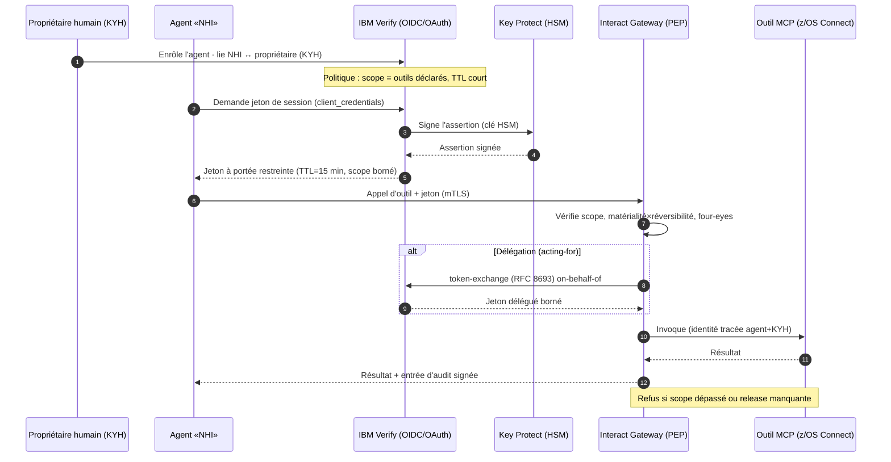
```mermaid
sequenceDiagram
    autonumber
    participant H as Propriétaire humain (KYH)
    participant AG as Agent «NHI»
    participant V as IBM Verify (OIDC/OAuth)
    participant KP as Key Protect (HSM)
    participant PEP as Interact Gateway (PEP)
    participant TOOL as Outil MCP (z/OS Connect)

    H->>V: Enrôle l'agent · lie NHI ↔ propriétaire (KYH)
    Note over V: Politique : scope = outils déclarés, TTL court
    AG->>V: Demande jeton de session (client_credentials)
    V->>KP: Signe l'assertion (clé HSM)
    KP-->>V: Assertion signée
    V-->>AG: Jeton à portée restreinte (TTL=15 min, scope borné)
    AG->>PEP: Appel d'outil + jeton (mTLS)
    PEP->>PEP: Vérifie scope, matérialité×réversibilité, four-eyes
    alt Délégation (acting-for)
        PEP->>V: token-exchange (RFC 8693) on-behalf-of
        V-->>PEP: Jeton délégué borné
    end
    PEP->>TOOL: Invoque (identité tracée agent+KYH)
    TOOL-->>PEP: Résultat
    PEP-->>AG: Résultat + entrée d'audit signée
    Note over PEP,TOOL: Refus si scope dépassé ou release manquante
```

**Figure 3 — Émission et usage d'un jeton NHI (KYA/NHI/KYH).** La délégation passe exclusivement par *token-exchange* (RFC 8693) ; aucun secret long terme n'est porté par l'agent (posture *secretless*).

Extrait illustratif — politique de jeton à portée restreinte (revendications à durcir) :

```json
{
  "sub": "nhi:agent:souscription-vie-01",
  "owner_kyh": "human:underwriting-lead:jtremblay@borealis.ca",
  "scope": ["mcp:pas.quote.read", "mcp:pas.proposal.prepare"],
  "deny": ["mcp:pas.proposal.commit"],
  "autonomy_level": "L1",
  "materiality": "high",
  "reversibility": "low",
  "exp": 900,
  "aud": "interact-gateway.borealis.ca-central",
  "cnf": { "x5t#S256": "<empreinte cert mTLS>" }
}
```

> Lecture : l'agent de souscription (L1) peut *préparer* une proposition mais le *commit* est refusé (`deny`) — la release reste humaine (invariant 1). Les attributs `autonomy_level/materiality/reversibility` sont la projection runtime des *Profiles* ArchiMate (§13).

### 3.7 Pipeline d'audit infalsifiable

Le *pourquoi* de la séparation des deux puits est acquis (§3.5) ; la figure 4 en montre le *comment* structurel (invariant 5). Le collecteur OTel diffuse vers l'observabilité SRE (purgeable) ; en parallèle, chaque événement engageant est **signé HSM**, chaîné par *Merkle* et scellé en WORM — sur un support qu'on ne peut ni modifier ni effacer —, produisant une piste opposable à rétention pluriannuelle, indépendante du puits.

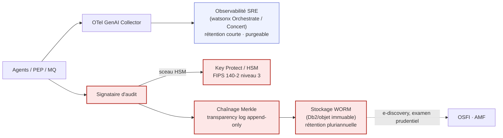
```mermaid
flowchart LR
    AG["Agents / PEP / MQ"] --> COL["OTel GenAI Collector"]
    COL --> SRE["Observabilité SRE<br/>(watsonx Orchestrate / Concert)<br/>rétention courte · purgeable"]
    AG --> SIGN["Signataire d'audit"]
    SIGN -->|"sceau HSM"| KP["Key Protect / HSM<br/>FIPS 140-2 niveau 3"]
    SIGN --> MERK["Chaînage Merkle<br/>transparency log append-only"]
    MERK --> WORM["Stockage WORM<br/>(Db2/objet immuable)<br/>rétention pluriannuelle"]
    WORM -.->|"e-discovery, examen prudentiel"| REG["OSFI · AMF"]

    classDef sre fill:#eef2ff,stroke:#3b4cca;
    classDef aud fill:#fde7e7,stroke:#b3261e,stroke-width:2px;
    class SRE sre;
    class SIGN,KP,MERK,WORM aud;
```

**Figure 4 — Double puits audit/observabilité.** Le chemin rouge (audit opposable) ne partage ni stockage ni rétention avec le chemin bleu (SRE) ; une purge SRE n'altère jamais la piste réglementaire.

---

## 4. Dorsale d'intégration tri-plan (cœur de l'architecture)

### 4.0 Principe directeur — trois plans d'interaction

L'erreur de conception la plus coûteuse en intégration agentique régulée est de router toutes les interactions sur un même substrat. La discipline : **séparer trois plans** et affecter chaque interaction au substrat dont les garanties répondent à sa criticité :

- **Plan synchrone / requête-réponse** : interroger ou lire un système d'enregistrement → **API Connect / DataPower** (REST, GraphQL, gRPC) ; **z/OS Connect** pour le mainframe.
- **Plan commande / transaction assurée** : engagement fiable, livraison *exactly-once*, handoff préparation→release sur l'irréversible → **IBM MQ**.
- **Plan événement / coordination / analytique** : pub/sub, fan-out, traitement de flux, réconciliation continue, CDC → **Confluent Cloud (Kafka/Flink)**.

Deux plans agentiques se superposent : **MCP** (agent→outil) gouverné par DataPower Interact Gateway / API Connect, et **A2A** (agent→agent) gouverné par watsonx Orchestrate et transporté sur les topics Confluent.

### 4.1 API Management — IBM API Connect 12.1 + DataPower

API Connect est le **point d'application de politique de la couche API** : toute capacité exposée à un agent comme outil est d'abord une API gérée, productisée et gouvernée. La **v12.1 (12.1.0)** converge l'expertise IBM et le portefeuille de gestion d'API de Software AG (webMethods) en une fondation hybride unique (IBM, déc. 2025 ; correctif 12.1.0.3 le 8 mai 2026) ; IBM est *Leader* du Gartner Magic Quadrant Gestion d'API pour la 10e fois.

**Composants déployés pour Boréalis.**

- **API Manager** — cycle de vie complet : productiser les API en produits avec plans, abonnements et identifiants d'application (le pendant des *scoped credentials* d'agent), versionnage, contrôle d'accès, promotion entre environnements. Publie aussi les *actifs IA* : outils et serveurs MCP, fournisseurs LLM enregistrés (IBM, mai 2026).
- **DataPower Gateway** — passerelle de sécurité d'entreprise : OAuth 2.0/OIDC, JWT, mTLS, validation de schéma, rate limiting, quotas, sécurité de la charge utile, DLP et filtrage egress. Le renouvellement **DataPower Gateway X4 + firmware v11.0** est sorti le 26 mars 2026 (IBM).
- **DataPower Nano Gateway** — passerelle ultra-légère au niveau du produit d'API, démarrage rapide, isolation de panne, mise à l'échelle fine ; enforcement au plus près du service (IBM, nov. 2025).
- **DataPower Interact Gateway** (bâti sur la Nano Gateway) — la pièce agentique décisive : gouvernance centralisée des interactions entre applications, agents, modèles et services IA. Il fournit (IBM, mai 2026) :
    - une **MCP Gateway** convertissant les API d'entreprise en outils MCP-conformes que les agents découvrent et invoquent ;
    - une **LLM Gateway** enregistrant les fournisseurs LLM pour un accès gouverné ;
    - un **tableau de bord d'usage IA** (Analytics) pour suivre la consommation MCP/LLM et les coûts.
- **Developer Portal** — rend les actifs IA publiés (outils/serveurs MCP, fournisseurs LLM) découvrables et souscriptibles par les développeurs *et les agents*.
- **API Studio + API Agent** — authoring assisté par IA (serveurs MCP générés à partir d'API publiées, génération de politiques, tests), tout-en-code, CI/CD et traçabilité Git ; s'appuie sur un modèle Granite sur watsonx (Granite 3 à l'annonce de nov.-déc. 2025 ; génération courante **Granite 4.1**, poids ouverts Apache 2.0) (IBM, 2025-2026).
- **Federated API Gateway** — visibilité et gouvernance cohérentes des API où qu'elles tournent (hybride/multi-cloud).

**Rôle dans le patron agentique.** API Connect + DataPower Interact Gateway forment le **PEP de la couche API/MCP/LLM**, complémentaire du PEP de la couche agent/A2A (watsonx Orchestrate). Tout appel d'outil MCP traverse une API gérée — héritant authentification, quotas, DLP et audit. Le périmètre d'exposition est *explicite* (une API/outil par capacité bornée), matérialisant la surface de délégation (cf. Monographie ch.6 §6.1.3).

**Protocoles** : HTTP, REST, GraphQL, gRPC, WebSockets, MQTT et MCP (IBM/AWS Marketplace, 2026).

⚠ **Limite d'architecture à tenir.** API Connect **ne se connecte pas nativement à IBM MQ** ; toute médiation MQ passe par App Connect (ACE), non par une extension custom (retour praticien documenté, 2026). La résidence du SaaS API Connect est offerte en US/EU ; pour Boréalis, déployer **on-prem via CP4I** pour domicilier au Canada (décision en ADR-003/004 ; mécanisme en §7.2).

**Posture iPaaS hybride.** Aucune plateforme d'intégration distincte n'est introduite pour aligner l'ADS sur la monographie v2 : la fondation d'intégration hybride de Boréalis demeure la posture **webMethods Hybrid Integration** (iPaaS issu de l'acquisition de Software AG par IBM, clôturée le 1ᵉʳ juillet 2024), dont les deux facettes sont déjà matérialisées dans la pile — la **gestion d'API** par la convergence consolidée sur API Connect (cf. début de §4.1) et les **flux d'intégration** par App Connect Enterprise (ACE), seul moteur de médiation du site (cf. §4.4). Au-dessus de l'authoring d'API (API Studio + API Agent, cf. §4.1), l'authoring d'intégration *par intention* s'appuie sur un **Integration Agent** — assistant d'authoring assisté par IA qui synthétise flux et connecteurs à partir d'une intention déclarée, plutôt que par câblage manuel. Livré dans webMethods Hybrid Integration (juin 2026), il expose désormais les workflows d'intégration en GA comme outils MCP ; l'authoring par intention le plus récent reste à confirmer ⚠ (IBM, 2026). L'invariant tient sans exception : tout artefact ainsi généré demeure un objet gouverné, soumis au PEP de la couche API/MCP/LLM et promu exclusivement par le pipeline GitOps (§14.2) — aucun chemin d'application hors politique, aucune promotion hors Git (cf. Monographie ch.4 §4.2.2).

### 4.2 Event Mesh — Confluent Cloud

Confluent Cloud est le **maillage d'événements** : bus A2A asynchrone, moteur de réconciliation continue et pont temps réel entre événements du mainframe et agents. Le moteur cloud-native KORA porte les topics Kafka (mise à l'échelle élastique, sécurité, traitement de flux, gouvernance) (Confluent, 2026). IBM a finalisé l'acquisition de Confluent (annoncée déc. 2025, clôturée 17 mars 2026) et présenté à Think 2026 **IBM Data Gate for Confluent**, qui diffuse les données transactionnelles d'IBM Z vers Confluent (IBM, mai 2026) ⚠.

**Composants déployés pour Boréalis.**

- **Topics Kafka (KORA)** — substrat des échanges A2A (Flow/Triggering), des événements métier et de la diffusion pub/sub vers de multiples consommateurs (analytique, fraude, conformité).
- **Confluent Cloud for Apache Flink** (serverless, GA) — traitement de flux : filtrer, joindre, enrichir ; réconciliation quasi-temps réel sur des rails qui règlent en continu, signaux de fraude, agrégats glissants en SQL (Confluent, 2026).
- **Stream Governance** — Schema Registry, **Data Contracts**, Stream Catalog, Stream Lineage, Data Portal : le pilier *contrat* — les schémas (ISO 20022, ACORD) deviennent des contrats de données opposables ; la lignée alimente la traçabilité (Confluent, 2026).
- **Tableflow** — matérialise les topics Kafka en tables Apache Iceberg/Delta d'un clic, alimentant le lakehouse (watsonx.data) ; DLQ, CSFLE, espaces de noms métier (Confluent, 2026).
- **Connecteurs** — **IBM MQ Source connector** entièrement managé (lit MQ → topic Kafka, livraison au moins une fois) ; connecteurs CDC Debezium (Db2, PostgreSQL, etc.) pour capter les changements du système d'enregistrement (Confluent, 2026).
- **Real-Time Context Engine** — expose des topics Kafka gouvernés *comme outils* via un serveur MCP entièrement managé : les agents/LLM interrogent les données fraîches en faible latence, sans duplication ni ETL (Confluent, GA mai 2026) — le grounding agentique sur l'Event Mesh.
- **Streaming Agents** (GA, lancement Q2 2026 ; support A2A plus récent) — agents définis avec modèles/prompts/outils dans Flink, les outils étant des UDF ou des outils de serveur MCP (Confluent, mai 2026).
- **Unified Stream Manager (USM)** — relie des grappes Confluent Platform auto-gérées à Confluent Cloud pour une gouvernance, observabilité et lignée unifiées où qu'elles résident (Confluent, 2026) — clé pour un déploiement hybride/résident.
- **Snapshot Queries** — vue point-dans-le-temps combinant Tableflow (Iceberg) et Kafka temps réel pour les audits de conformité à la demande (Confluent, 2026).

**Rôle dans le patron agentique.** Le message A2A reste un *Flow* applicatif gouverné par watsonx Orchestrate ; Confluent le transporte sans s'y substituer. Le CDC mainframe (CICS/IMS/Db2/VSAM/MQ) alimente les agents en événements frais — IBM Data Gate for Confluent diffuse les données d'IBM Z par capture *log-based* sur Db2 for z/OS (~96 % éligible zIIP, faible surcoût CPU) (IBM, mai 2026).

⚠ **Résidence.** Confluent Cloud est un SaaS opéré sur des régions d'hyperscalers. Pour Boréalis : grappe dédiée en région **Canada (ca-central)**, réseau privé (PrivateLink), chiffrement BYOK et CSFLE ; ou Confluent Platform on-prem/Z gouverné via USM (décision en ADR-003/004 ; mécanisme en §7.2). La dépendance à un CTPP supervisé (l'hyperscaler sous-jacent) s'inscrit au registre des tiers TIC.

### 4.3 Messagerie — IBM MQ 9.4.5

IBM MQ est le **plan de commande transactionnelle** : la dorsale de livraison assurée *exactly-once* pour les opérations qui touchent les systèmes d'enregistrement. Là où Confluent porte coordination et analytique, MQ porte l'intégrité transactionnelle et le handoff préparation→release. Version courante **9.4.5** (Continuous Delivery, GA 5 février 2026 ; LTS 9.4.0 depuis le 18 juin 2024) (IBM, 2026).

**Pourquoi MQ et non Kafka pour ce plan.** MQ délivre une livraison assurée *exactly-once* — le message passe une fois et une seule, jamais zéro, jamais deux —, point-à-point/requête-réponse, ordonnée et transactionnelle (XA), consommé puis retiré ; selon IBM, il serait le seul fournisseur à offrir un chiffrement de bout en bout vrai pour la confidentialité et l'intégrité des messages (IBM, 2024). Kafka, lui, est un journal d'événements rejouable et retenu, multi-consommateurs, optimisé pour le fan-out et le traitement de flux. Règle de Boréalis : **commande engageante vers un système d'enregistrement → MQ ; événement de coordination/analytique → Confluent.**

**Capacités déployées pour Boréalis.**

- **Queue managers** sur IBM MQ for z/OS (intégration native CICS/IMS/Db2) et sur conteneurs via l'**IBM MQ Operator** (Red Hat OpenShift) (IBM, 2026).
- **Native HA** (trois nœuds, réplication synchrone, RPO zéro, bascule automatique) et **Cross-Region Replication** (CRR, réplication asynchrone, RPO proche de zéro, bascule régionale manuelle) pour la reprise après sinistre (IBM, 2025-2026).
- **Uniform Clusters** — équilibrage intelligent de charge, rééquilibrage multi-connexion JMS sans interruption (IBM, 2026).
- **Sécurité** — authentification par jeton (sans mot de passe), chiffrement de bout en bout, Advanced Message Security (AMS) ; chiffrement du heartbeat HA/DR (RDQM) en 9.4.5 (IBM, 2026).
- **Pont MQ ↔ Kafka** — connecteurs Kafka Connect source/sink pour MQ, à livraison assurée *once-and-only-once / exactly-once* (depuis 9.3.4) ; MQ on z/OS peut exposer des événements vers Kafka (IBM, 2023-2026). Combiné au connecteur IBM MQ Source de Confluent, il noue les plans transaction et événement.
- **Serveur MCP pour MQ** — expose la santé des queue managers et les commandes MQSC aux clients MCP (dépôt IBM/mcp, 2026), pour l'observabilité agentique de la messagerie.
- **MFT (Managed File Transfer)** pour les transferts de fichiers gouvernés (batch assurance, échanges inter-organisations).

**Rôle dans le patron irréversibilité (§1.3, invariant 1).** L'agent prépare une transaction « decision-ready » et la dépose sur une file ; un humain (ou un contrôle déterministe calibré) la *release* ; MQ garantit la livraison *exactly-once* au système d'enregistrement, avec piste d'audit reliant proposition et autorisation. La file est le point structurel de la séparation préparation/engagement.

#### 4.3.1 Échanges inter-organisations B2B/EDI (gouvernés)

Boréalis est une institution financière multi-sous-domaines : ses flux ne s'arrêtent pas à la frontière de l'entreprise, mais s'étendent aux réseaux d'assurance, aux bureaux de crédit et aux contreparties B2B — les `PARTNERS` de la figure 1 (§1.6, vue de contexte). Ces échanges relèvent d'un protocole d'entreprise distinct du transit interne MQ : **IBM webMethods B2B Integration** porte l'EDI (EDIFACT, X12), l'AS2 et le SFTP gouvernés vers les partenaires externes, là où le MFT cité en §4.3 reste la capacité de transfert de fichiers *intra-zone* adossée à MQ. Les deux s'articulent — webMethods B2B expose le pont externe, MFT achemine en interne — sans se dupliquer. Ce choix prolonge la lignée webMethods déjà retenue pour la couche API (convergence de la gestion d'API dans API Connect 12.1, §4.1), plutôt que d'introduire un produit B2B distinct.

Le **B2B Agent** (assistant d'onboarding et de mappage de partenaires assisté par IA, intégré à webMethods B2B Integration) accélère l'enrôlement d'une contrepartie : à partir de l'intention exprimée, il interprète l'objectif, construit un plan, puis propose le mappage des documents et la configuration d'échange. Son périmètre, dans l'architecture de Boréalis, s'arrête à la *préparation*. ⚠ Le B2B Agent relève des fonctions récentes de la lignée webMethods Hybrid Integration (authoring par intention ; gestion d'actifs et trace de raisonnement ajoutées en avr. 2026) ; version et statut à fixer au moment du déploiement, à ne pas présenter comme acquis pour l'engagement inter-organisation.

Deux invariants encadrent ces flux. **Résidence** : tout échange B2B entrant ou sortant demeure sous frontière de résidence, à egress nul hors zone Canada (§6.5) — le pont avec un partenaire externe n'ouvre aucun chemin sortant non gouverné. **Imputabilité** : toute contrepartie est inscrite au registre des tiers TIC (B-10) ; l'agent prépare le mappage, mais l'engagement inter-organisation irréversible reste soumis à *release* (§1.3, invariant 1). L'EDI et le B2B agentiques sont traités dans la monographie (cf. Monographie ch.4 §4.2.5) ; la séparation préparation/engagement appliquée aux engagements agentiques inter-organisations — mandats signés, non-répudiation — relève de la monographie ch.4 §4.10.2.

### 4.4 Encapsulation héritée — z/OS Connect + App Connect (ACE)

- **z/OS Connect 3.0.98** expose les opérations OpenAPI 3 du cœur z/OS (CICS, IMS, batch, Db2) comme **outils MCP**, avec **autorisation fine au niveau opération** et observabilité OpenTelemetry (IBM, oct. 2025). Le patron : *l'IA interprète l'intention, z/OS Connect gouverne l'accès, MCP standardise la découverte, IBM Z exécute la logique de confiance, sans nouveau chemin d'accès* (IBM, 2026). L'adaptateur MCP se déploie sur le nœud légataire sans toucher au matériel d'origine.
- **App Connect Enterprise (ACE)** — flux d'intégration et médiation (dont la médiation MQ qu'API Connect ne fait pas nativement) ; crée des serveurs MCP à partir d'instances App Connect Dashboard (13.0.6.1+) (IBM, 2026).

**Encapsuler n'est pas moderniser.** Les deux puces ci-dessus *encapsulent* : z/OS Connect et ACE exposent le cœur z/OS en MCP/API sans en altérer une ligne — c'est le principe d'encapsulation non disruptive (§1.2) et le périmètre propre de cette section. *Moderniser* est une opération distincte : transformer le code COBOL/PL-I lui-même (explication, refactorisation, génération assistée). Cette voie relève d'**IBM watsonx Code Assistant for Z** (v2.8 de base en déc. 2025 ; expérience agentique — outils MCP — officialisée par l'annonce du 2 mars 2026), sur une trajectoire z/OS 3.2 (GA 30 sept. 2025 ; z/OS Data Gatherer émetteur OpenTelemetry). La règle de gouvernance reste inchangée : la modernisation du code est un changement gouverné dont l'irréversible — la mise en production d'un module transformé — préserve la **release humaine** au titre de l'invariant 1 (§1.3). L'agent *prépare* la transformation (analyse, proposition de refactorisation, tests générés) ; un humain *l'engage*. On encapsule en continu et sans arrêt ; on modernise par paliers gouvernés (cf. Monographie ch.4 §4.2.4).

### 4.5 Règle de décision de substrat (synthèse)

| Type d'interaction | Substrat | Produit IBM / stratégique | Garantie clé |
|---|---|---|---|
| Lecture/requête synchrone système d'enregistrement | API | API Connect / DataPower ; z/OS Connect (mainframe) | OAuth/mTLS, quotas, schéma |
| Commande transactionnelle engageante | Messagerie | IBM MQ | Livraison assurée *exactly-once*, ordonnée |
| Handoff préparation → release sur l'irréversible | Messagerie | IBM MQ (file de proposition) | Séparation structurelle, audit |
| Événement, pub/sub, fan-out, coordination | Event Mesh | Confluent Cloud (Kafka) | Rejouable, multi-consommateurs |
| Traitement de flux, réconciliation continue, CDC | Event Mesh | Confluent Cloud (Flink, connecteurs) | Faible latence, *stateful* |
| Invocation d'outil par agent | MCP | DataPower Interact Gateway / API Connect ; z/OS Connect ; Confluent Context Engine | Identité, permissions, audit, metering |
| Collaboration agent ↔ agent | A2A | watsonx Orchestrate (transport Confluent) | Politique cohérente, traçage |

### 4.6 Vue de la dorsale tri-plan

La figure 5 superpose les trois plans de substrat et les deux plans agentiques. L'arbre de décision encadré (à droite) est la règle d'aiguillage opposable : il interdit de router une commande irréversible sur Kafka ou un fan-out analytique sur MQ.

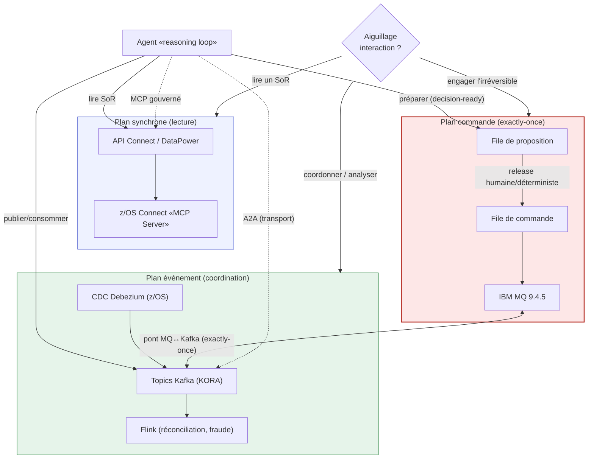
```mermaid
flowchart TB
    AG["Agent «reasoning loop»"]

    subgraph SYNC["Plan synchrone (lecture)"]
        APIC["API Connect / DataPower"]
        ZC["z/OS Connect «MCP Server»"]
    end
    subgraph CMD["Plan commande (exactly-once)"]
        QPROP["File de proposition"]
        QCMD["File de commande"]
        MQ["IBM MQ 9.4.5"]
    end
    subgraph EVT["Plan événement (coordination)"]
        TOPIC["Topics Kafka (KORA)"]
        FLINK["Flink (réconciliation, fraude)"]
        CDC["CDC Debezium (z/OS)"]
    end

    AG -->|"lire SoR"| APIC --> ZC
    AG -->|"préparer (decision-ready)"| QPROP
    QPROP -->|"release humaine/déterministe"| QCMD --> MQ
    AG -->|"publier/consommer"| TOPIC
    TOPIC --> FLINK
    CDC --> TOPIC
    MQ <-->|"pont MQ↔Kafka (exactly-once)"| TOPIC
    AG -.->|"MCP gouverné"| APIC
    AG -.->|"A2A (transport)"| TOPIC

    DEC{"Aiguillage<br/>interaction ?"}
    DEC -->|"lire un SoR"| SYNC
    DEC -->|"engager l'irréversible"| CMD
    DEC -->|"coordonner / analyser"| EVT

    classDef s fill:#eef2ff,stroke:#3b4cca;
    classDef c fill:#fde7e7,stroke:#b3261e,stroke-width:2px;
    classDef e fill:#e6f4ea,stroke:#1e7d34;
    class SYNC s;
    class CMD c;
    class EVT e;
```

**Figure 5 — Dorsale tri-plan et arbre d'aiguillage.** Le pont MQ↔Kafka relie commande et événement sans les confondre (ADR-002). La file de proposition (rouge) est le point structurel de la séparation préparation/engagement.

### 4.7 Contrats d'interface (extraits illustratifs)

Le découplage par contrat (fil conducteur) impose que chaque couture soit une *spec versionnée*. Les extraits ci-dessous fixent la forme des contrats, non des valeurs de production.

**(a) Manifeste d'outil MCP** — une capacité z/OS exposée comme outil gouverné (une opération = un outil borné, cf. §4.1) :

```json
{
  "name": "pas.quote.read",
  "version": "1.3.0",
  "description": "Lecture d'une cotation d'assurance vie (lecture seule, sans effet).",
  "server": "zos-connect.borealis.ca-central",
  "annotations": { "readOnlyHint": true, "destructiveHint": false },
  "inputSchema": {
    "type": "object",
    "required": ["policyId"],
    "properties": { "policyId": { "type": "string", "pattern": "^PV[0-9]{10}$" } }
  },
  "x-governance": {
    "owner_capability": "Évaluer le risque de souscription",
    "classification": "PII-restricted",
    "residency": "ca-central-only",
    "scopes_required": ["mcp:pas.quote.read"]
  }
}
```

**(b) Produit API Connect** — le plan d'abonnement porte quotas et *scope* (extrait OpenAPI + extension de produit) :

```yaml
product: 1.0.0
info: { name: pas-souscription, version: 1.3.0 }
plans:
  agent-l1-preparateur:
    rate-limits: { default: { value: 50, period: 1, unit: second } }
    quotas:      { default: { value: 50000, period: 1, unit: day } }
    approval: true            # souscription d'agent approuvée (gouvernance)
    scopes: [ "mcp:pas.quote.read", "mcp:pas.proposal.prepare" ]
apis:
  pas-souscription-1.3.0: { $ref: pas-souscription.yaml }
gateways: [ datapower-interact-gateway ]   # PEP : OAuth, mTLS, DLP, schéma
```

**(c) Contrat d'événement (AsyncAPI, ancré ISO 20022)** — un événement de paiement publié sur Confluent, dont le *payload* valide contre un schéma enregistré :

```yaml
asyncapi: 3.0.0
info: { title: borealis.payments, version: 2.1.0 }
channels:
  payment.instruction.prepared:
    address: borealis.payments.instruction.prepared
    messages:
      pain001Prepared:
        contentType: application/json
        payload:
          schemaFormat: application/vnd.apache.avro+json
          schema: { $ref: "schema-registry://iso20022.pain001.v9" }   # Data Contract
operations:
  publishPrepared:
    action: send
    channel: { $ref: '#/channels/payment.instruction.prepared' }
    bindings: { kafka: { groupId: agent-paiement, acks: all } }
```

**(d) Files MQ (MQSC)** — la séparation préparation/engagement matérialisée par deux files + AMS :

```mqsc
DEFINE QLOCAL('PAY.PROPOSAL.Q')  DESCR('Propositions decision-ready (L1)') +
       DEFPSIST(YES) MAXDEPTH(50000) BOTHRESH(3) BOQNAME('PAY.PROPOSAL.BOQ')
DEFINE QLOCAL('PAY.COMMAND.Q')   DESCR('Commandes released (exactly-once)') +
       DEFPSIST(YES) MAXDEPTH(50000)
* Advanced Message Security : confidentialité + intégrité de bout en bout
SET POLICY('PAY.COMMAND.Q') SIGNALG(SHA256) ENCALG(AES256) +
       RECIP('CN=core-banking,O=Borealis') ENFORCE(YES)
```

**(e) Connecteur Confluent — IBM MQ Source** (pont MQ→Kafka, lecture des événements de commande pour réconciliation) :

```json
{
  "name": "mq-source-payments",
  "config": {
    "connector.class": "io.confluent.connect.ibm.mq.IbmMQSourceConnector",
    "kafka.topic": "borealis.payments.command.committed",
    "mq.queue.manager": "QMHA", "mq.queue": "PAY.COMMAND.AUDIT.Q",
    "mq.transport.type": "client", "mq.ssl.cipher.suite": "TLS_AES_256_GCM_SHA384",
    "value.converter": "io.confluent.connect.avro.AvroConverter",
    "confluent.topic.replication.factor": "3"
  }
}
```

### 4.8 Flux d'interaction — séquences canoniques

Les contrats fixent la forme statique des coutures ; les séquences montrent leur enchaînement à l'exécution.

**Appel d'outil MCP gouverné (figure 6).** Tout appel hérite, en un seul passage, de l'authentification NHI, de l'autorisation matérialité×réversibilité, du DLP/egress et de l'audit signé. Le refus est la voie par défaut si une garantie manque.

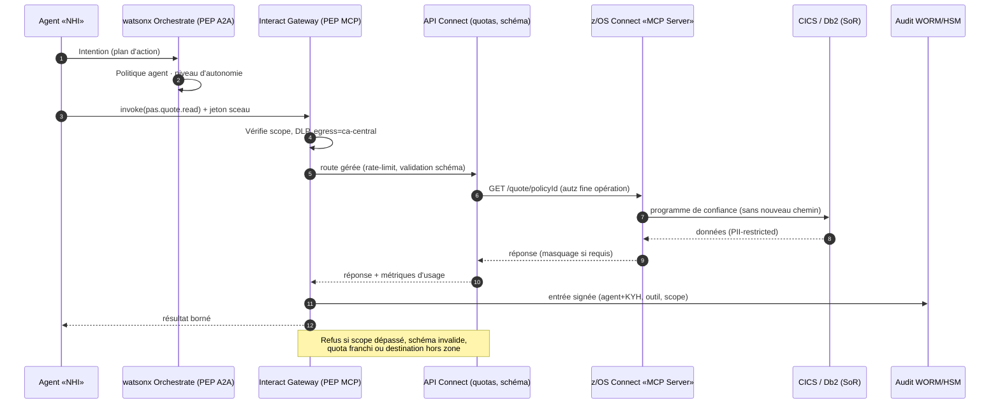
```mermaid
sequenceDiagram
    autonumber
    participant AG as Agent «NHI»
    participant ORCH as watsonx Orchestrate (PEP A2A)
    participant IGW as Interact Gateway (PEP MCP)
    participant APIC as API Connect (quotas, schéma)
    participant ZC as z/OS Connect «MCP Server»
    participant CICS as CICS / Db2 (SoR)
    participant AUD as Audit WORM/HSM

    AG->>ORCH: Intention (plan d'action)
    ORCH->>ORCH: Politique agent · niveau d'autonomie
    AG->>IGW: invoke(pas.quote.read) + jeton sceau
    IGW->>IGW: Vérifie scope, DLP, egress=ca-central
    IGW->>APIC: route gérée (rate-limit, validation schéma)
    APIC->>ZC: GET /quote/policyId (autz fine opération)
    ZC->>CICS: programme de confiance (sans nouveau chemin)
    CICS-->>ZC: données (PII-restricted)
    ZC-->>APIC: réponse (masquage si requis)
    APIC-->>IGW: réponse + métriques d'usage
    IGW->>AUD: entrée signée (agent+KYH, outil, scope)
    IGW-->>AG: résultat borné
    Note over IGW,APIC: Refus si scope dépassé, schéma invalide,<br/>quota franchi ou destination hors zone
```

**Figure 6 — Appel d'outil MCP gouverné.** Deux PEP en série : couche agent/A2A (Orchestrate) puis couche API/MCP (Interact Gateway + API Connect). L'audit est écrit *avant* le retour à l'agent.

**Coordination A2A avec ségrégation (figure 7).** L'échange agent→agent est un *Flow* applicatif gouverné, transporté sur Confluent. La preuve de non-collusion (four-eyes) — celui qui prépare et celui qui valide ne se parlent jamais directement — est l'**absence de flux direct** maker→checker : tout transite par l'objet de travail et le contrôle (cf. Monographie ch.6 §6.1.7).

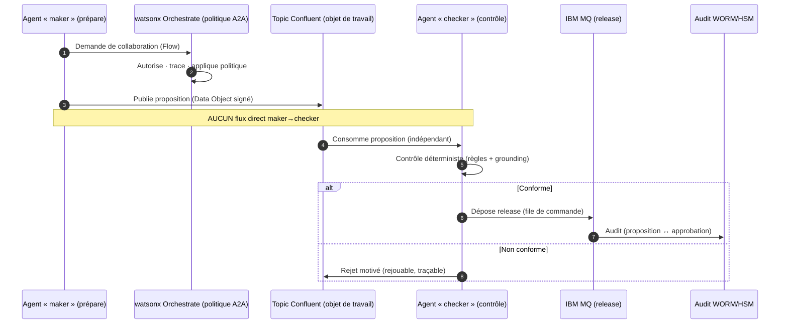
```mermaid
sequenceDiagram
    autonumber
    participant MK as Agent « maker » (prépare)
    participant ORCH as watsonx Orchestrate (politique A2A)
    participant T as Topic Confluent (objet de travail)
    participant CK as Agent « checker » (contrôle)
    participant MQ as IBM MQ (release)
    participant AUD as Audit WORM/HSM

    MK->>ORCH: Demande de collaboration (Flow)
    ORCH->>ORCH: Autorise · trace · applique politique
    MK->>T: Publie proposition (Data Object signé)
    Note over MK,CK: AUCUN flux direct maker→checker
    T->>CK: Consomme proposition (indépendant)
    CK->>CK: Contrôle déterministe (règles + grounding)
    alt Conforme
        CK->>MQ: Dépose release (file de commande)
        MQ->>AUD: Audit (proposition ↔ approbation)
    else Non conforme
        CK->>T: Rejet motivé (rejouable, traçable)
    end
```

**Figure 7 — A2A maker-checker anti-collusion.** Le topic Confluent joue l'objet de travail interposé ; la release n'est émise que par le checker, sur MQ, avec audit reliant proposition et approbation.

---

## 5. Architecture de données et grounding sémantique

**Principe.** Grounder l'agent sur un standard sectoriel versionné — jamais sur du texte libre — réduit l'hallucination et rend l'action auditable. La donnée fraîche atteint l'agent *par un contrat*, jamais par un accès direct, à travers trois couches (cf. Monographie ch.5 §5.2.1) :

| Couche | Standard | Réalisation IBM/Confluent |
|---|---|---|
| Messagerie/syntaxe | ISO 20022, FIX, AL3, FHIR | Data Object ; Schema Registry (Confluent) ; ACE ; z/OS Connect |
| Modèle/capacité | BIAN, ACORD, CDM/DRR | Capacités spécialisées ; Application Function (CDM exécutable) |
| Ontologie/sémantique | FIBO | Service de **validation** (l'agent propose, le raisonneur confronte), pas de génération |

- **watsonx.data (+ Context on watsonx.data ⚠)** — lakehouse gouverné alimenté par Tableflow (Iceberg) ; il fédère le contexte en temps réel sous gouvernance d'exécution pour le grounding agentique (IBM, mai 2026).
- **Confluent Schema Registry / Data Contracts** — gouvernent les contrats d'événement, ce qui rend opposables les schémas ISO 20022/ACORD.
- **Décomposition mémoire/contexte/sémantique explicite** — elle ancre les contrôles DLP et egress (cf. Monographie ch.6 §6.1.8) : la mémoire d'agent et la base vectorielle sont des Data Objects accédés sous contrôle.

### 5.1 Vue de l'architecture de données et de la lignée

La figure 8 trace le parcours d'une donnée, du système d'enregistrement au grounding de l'agent, en faisant ressortir les points où s'appliquent gouvernance, contrats et DLP. Le principe directeur s'y lit : la fraîcheur transite *par un contrat* — Schema Registry, Context Engine ou watsonx.data — non par un accès direct non gouverné.

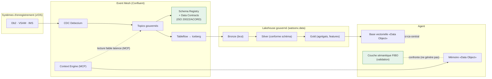
```mermaid
flowchart LR
    subgraph SOR["Systèmes d'enregistrement (z/OS)"]
        DB2["Db2 · VSAM · IMS"]
    end
    subgraph STREAM["Event Mesh (Confluent)"]
        CDC["CDC Debezium"]
        SR["Schema Registry<br/>+ Data Contracts<br/>(ISO 20022/ACORD)"]
        TOPIC["Topics gouvernés"]
        TF["Tableflow → Iceberg"]
        CE["Context Engine (MCP)"]
    end
    subgraph LAKE["Lakehouse gouverné (watsonx.data)"]
        BRONZE["Bronze (brut)"]
        SILVER["Silver (conforme schéma)"]
        GOLD["Gold (agrégats, features)"]
    end
    subgraph AGENT["Agent"]
        MEM["Mémoire «Data Object»"]
        VEC["Base vectorielle «Data Object»"]
        SEM["Couche sémantique FIBO<br/>(validation)"]
    end

    DB2 --> CDC --> TOPIC
    TOPIC --> SR
    TOPIC --> TF --> BRONZE --> SILVER --> GOLD
    CE -. "lecture faible latence (MCP)" .-> TOPIC
    GOLD --> VEC
    CE --> MEM
    SEM -. "confronte (ne génère pas)" .- MEM
    VEC -. "DLP + egress=ca-central" .- AGENT

    classDef gov fill:#e6f4ea,stroke:#1e7d34;
    class SR,SEM gov;
```

**Figure 8 — Architecture de données et lignée.** Le grounding « frais » passe par le Context Engine (MCP) sans ETL ; le grounding « historique » passe par le lakehouse zoné. La couche FIBO valide, elle ne génère jamais (invariant 4).

### 5.2 Zonage du lakehouse et contrats de données

Le lakehouse est zoné — bronze/silver/gold — et la promotion d'une zone à la suivante reste conditionnée à la conformité au contrat de données. Un schéma n'est pas qu'une forme : c'est un contrat opposable, porteur de règles de qualité et de classification.

```yaml
# Data Contract (Confluent Stream Governance) — extrait illustratif
schema: iso20022.pain001.v9
compatibility: BACKWARD                 # évolution gouvernée (couture)
rules:
  - name: montant-positif
    expr: "Document.CdtTrfTxInf.Amt.InstdAmt > 0"
    on_violation: DLQ                    # dead-letter, pas de propagation
metadata:
  classification: PII-restricted
  residency: ca-central-only
  retention: P7Y                        # rétention 7 ans
  owner: capability:Exécuter-un-paiement
```

### 5.3 Ancrage des contrôles DLP/egress sur la mémoire

La décomposition explicite mémoire / contexte récupéré / objet sémantique (cf. Monographie ch.6 §6.1.8) n'a rien de cosmétique : sans elle, la mémoire d'agent reste une boîte opaque où aucun contrôle ne s'ancre. Chaque Data Object de mémoire porte donc une classification et une politique d'egress ; le filtrage de sortie (DLP) s'applique au franchissement de la frontière de zone, et toute base vectorielle contenant du PII est confinée (BYOK, ca-central). Le modèle de menace reprend ce point (§6.4).

---

## 6. Architecture de sécurité (zones, identité, secrets, egress)

**Principe.** La sécurité applique la défense en profondeur sur quatre axes indissociables : **segmentation** (zones réseau), **identité** (humaine et NHI), **secrets/cryptographie** et **contrôle d'egress/DLP**. La posture est *zero-trust* : aucune confiance implicite de zone à zone ; toute traversée est authentifiée (mTLS), autorisée (scope) et journalisée.

### 6.1 Zones réseau et segmentation

La figure 9 pose cinq zones de confiance croissante, séparées par des points d'application de politique. La frontière de résidence (invariant 6) englobe l'ensemble : aucune route ne sort hors région Canada.

```mermaid
flowchart TB
    subgraph EDGE["Zone Edge / DMZ"]
        WAF["WAF + DataPower (entrée)"]
    end
    subgraph APP["Zone Application (OpenShift)"]
        AGZONE["Agents + control plane"]
        IGW["Interact Gateway (PEP MCP)"]
    end
    subgraph DATA["Zone Données"]
        LAKE["watsonx.data · vecteurs"]
        MQZ["MQ (Native HA)"]
        CONFZ["Confluent (PrivateLink)"]
    end
    subgraph MF["Zone Mainframe"]
        ZC["z/OS Connect"]
        CORE["Core / PAS (z/OS)"]
    end
    subgraph MGMT["Zone Management / Sécurité"]
        VERIFY["IBM Verify"]
        KP["Key Protect / HSM"]
        GUARD["Guardium AI Security"]
        AUD["Audit WORM"]
    end

    INET(("Internet / canaux")) --> WAF --> AGZONE
    AGZONE --> IGW --> ZC --> CORE
    AGZONE --> MQZ
    AGZONE --> CONFZ
    AGZONE --> LAKE
    AGZONE -. "auth NHI (mTLS)" .- VERIFY
    IGW -. "secrets, scellés" .- KP
    AGZONE -. "découverte shadow-AI" .- GUARD
    IGW --> AUD

    EGRESS{{"Filtre egress<br/>ca-central uniquement"}}
    AGZONE --> EGRESS
    EGRESS -.->|"refus hors zone"| BLOCK["⛔ Bloqué"]

    classDef mgmt fill:#fde7e7,stroke:#b3261e,stroke-width:2px;
    classDef mf fill:#fff4e5,stroke:#b06000;
    class MGMT mgmt;
    class MF mf;
```

**Figure 9 — Zones de sécurité et frontière de résidence.** Chaque flèche traverse un PEP ; le filtre egress bloque par défaut toute destination hors `ca-central` (test périodique de fuite, §11.4). La zone Mainframe n'expose que z/OS Connect — aucun nouveau chemin d'accès au cœur.

### 6.2 Identité et accès

Deux populations d'identités coexistent sous IBM Verify : **identités humaines** (employés, conseillers, approbateurs four-eyes ; MFA, RBAC/ABAC) et **identités non humaines** (agents, services ; détail en §3.6). Au niveau réseau, le maillage interservices impose **mTLS** — certificats à courte durée, rotation automatique ; l'autorisation est *scoped* (moindre privilège) et la délégation passe par *token-exchange* (RFC 8693). La décision d'autorisation elle-même est déléguée à un **PDP** (Policy Decision Point) — moteur de politiques OPA/Rego ou Cedar (cf. figure J, §0.2) — distinct du PEP qui l'applique : la séparation décision/application est une exigence d'architecture. Le lien KYH, qui rattache chaque NHI à un propriétaire humain, restaure l'imputabilité exigée par l'AMF et l'OSFI.

### 6.3 Secrets et cryptographie

| Préoccupation | Mécanisme | Note |
|---|---|---|
| Stockage de clés | IBM Key Protect adossé à un HSM **FIPS 140-2 niveau 3** | racine de confiance matérielle |
| Chiffrement au repos | BYOK (clés gérées par Boréalis), CSFLE côté Confluent | la clé ne quitte jamais la zone |
| Chiffrement en transit | mTLS partout ; AMS pour MQ (bout-en-bout) | confidentialité + intégrité des messages |
| Rotation | jetons NHI courts (≤15 min) ; certificats rotés ; secrets *secretless* (broker) | pas de secret long terme chez l'agent |
| Signature d'audit | sceau HSM + chaînage Merkle | non-répudiation (§3.7) |
| Posture post-quantique (PQC) | inventaire cryptographique ; agilité des algorithmes | ⚠ trajectoire 2027+ (cf. Monographie ch.7 §7.4) ; à planifier, non bloquant |

### 6.4 Modèle de menace (STRIDE × référentiels agentiques)

**Insight directeur.** Le modèle de menace croise STRIDE avec les référentiels datés propres à l'agentique — OWASP Non-Human Identity Top 10 (éd. 2025) et OWASP Top 10 for LLM Applications. À chaque menace répond un contrôle réalisé par un composant nommé : c'est la paire risque/contrôle du Risk & Security Overlay (cf. Monographie ch.6 §6.6), que le tableau ci-dessous instancie.

| Menace (STRIDE) | Vecteur agentique | Réf. | Contrôle (composant) |
|---|---|---|---|
| **S**poofing | Usurpation d'identité d'agent | NHI | mTLS + jeton scellé HSM (Verify/Key Protect) |
| **T**ampering | Altération de la piste d'audit | — | WORM + Merkle + sceau HSM (§3.7) |
| **R**epudiation | Action non imputable | NHI | Attribution agent+KYH dans chaque entrée |
| **I**nfo disclosure | Fuite PII via mémoire/contexte | LLM06 | DLP + egress + classification (§5.3, §6.5) |
| **D**oS | Épuisement par appels d'outils | — | Quotas/rate-limit API Connect ; budget d'inférence |
| **E**levation | Dépassement de scope / confused deputy | NHI/LLM | Scope borné + `deny` explicite + four-eyes (§3.6) |
| Injection | Prompt injection (direct/indirect) | LLM01 | Validation grounding, isolation outils, tests red-team (§11.2) |
| Shadow AI | Agent/MCP non déclaré | NHI | Découverte Guardium ; inscription obligatoire au registre |

### 6.5 Contrôle d'egress et DLP

Le confinement (invariant 6) se prouve par l'**absence de chemin sortant** doublée d'une **zone de conformité** — non par une clause contractuelle. Concrètement : NetworkPolicy OpenShift restreignant les destinations à `ca-central` ; filtrage egress DataPower avec liste d'autorisation ; DLP sur les charges utiles franchissant une frontière de zone ; refus par défaut. Un test de fuite périodique — tentative d'egress hors zone — valide le contrôle en continu (§11.4).

```yaml
# NetworkPolicy OpenShift — refus egress par défaut (extrait illustratif)
apiVersion: networking.k8s.io/v1
kind: NetworkPolicy
metadata: { name: deny-egress-hors-zone, namespace: agents-prod }
spec:
  podSelector: {}
  policyTypes: [Egress]
  egress:
    - to:
        - ipBlock: { cidr: 10.20.0.0/16 }      # zone Données ca-central
        - namespaceSelector: { matchLabels: { zone: mainframe-ca } }
      # toute autre destination (hors zone) : implicitement refusée
```

---

## 7. Traçabilité réglementaire et résidence

**Principe (cf. Monographie ch.6 §6.6.3).** Aucun `Requirement` réglementaire n'est orphelin : la chaîne `Driver → Requirement <<regulatory-requirement>> → Control → élément exécutable` aboutit toujours à un composant concret. Le **Governance Graph** de watsonx.governance porte cette chaîne dans l'outil ; la matrice complète figure en Annexe B interne — matrice de traçabilité.

| Régime (Canada/Québec prioritaire) | Date-pivot | Qualification | Élément exécutable |
|---|---|---|---|
| OSFI E-23 (risque-modèle) | en vigueur 1ᵉʳ mai 2027 | Modèle | watsonx.governance (registre + Factsheets) |
| OSFI B-10 / B-13 (tiers TIC) | en vigueur 2024 | Système TIC | Registre des dépendances + stratégie de sortie testée |
| AMF — ligne directrice IA | en vigueur 1ᵉʳ mai 2027 | Modèle + décision | Responsable senior unique, répertoire centralisé, cote de risque |
| Loi 25 art. 12.1 | en vigueur 22 sept. 2023 | Décision automatisée | HITL + explication « claire et simple » + révision humaine |
| FINTRAC/CANAFE | obligations dès oct. 2025 | Programme AML *non délégable* | Agent prépare ; responsabilité humaine portée |
| DORA + AI Act Annexe III (si périmètre UE) | 2025 ; report adopté (Conseil 29 juin 2026) : Annexe III → 2 déc. 2027 (publication au JOUE à suivre) | Tiers TIC + haut-risque ciblé | Registre tiers TIC ; transparence décision automatisée |

### 7.1 Chaîne de traçabilité (vue)

La figure 10 instancie la chaîne sur un cas exemplaire — Loi 25 art. 12.1 sur la décision exclusivement automatisée. Le critère est vérifiable : tout `<<regulatory-requirement>>` se termine sur un composant exécutable, et un nœud orphelin signale un défaut de conformité que l'analyse de couverture détecte. La résidence fait l'objet d'une garantie d'un autre ordre, traitée ci-dessous.

```mermaid
flowchart LR
    ST["Stakeholder<br/>CAI (Loi 25)"] -->|Influence| DR["Driver<br/>Protection RP"]
    DR --> AS["Assessment<br/>Décision auto. non encadrée"]
    AS -->|Realization| RQ["Requirement<br/>«regulatory-requirement»<br/>Art. 12.1 : HITL + explication"]
    RQ -->|Realization| CT["Control<br/>Release humaine + message d'explication"]
    CT -->|réalisé par| EX1["MQ file de proposition<br/>(release)"]
    CT -->|réalisé par| EX2["Service d'explication<br/>(Loi 25 « clair et simple »)"]
    CT -->|tracé dans| GG["Governance Graph<br/>(watsonx.governance)"]

    classDef reg fill:#fde7e7,stroke:#b3261e,stroke-width:2px;
    class RQ reg;
```

**Figure 10 — Chaîne de traçabilité verticale (exemple Loi 25 art. 12.1).** Le `<<regulatory-requirement>>` se réalise jusqu'aux composants MQ (release) et au service d'explication — aucun maillon orphelin.

### 7.2 Résidence par construction

**IBM Sovereign Core** (GA, Think 2026) embarque la politique au niveau du *runtime* d'infrastructure : la gouvernance est traitée à mesure que les exigences évoluent, en priorisant la portabilité, sur Red Hat OpenShift/AI (IBM, mai 2026). Conjugué à z/OS Connect on-prem, à un modèle Granite confiné et à Confluent en région Canada — ou Platform on-prem via USM — il matérialise l'interdiction d'egress (absence de chemin sortant), traces *et* inférence comprises. La vérification reste continue (test de fuite, §11.4), non déclarative.

⚠ **Réserve CTPP.** IBM est une société américaine ; un agent sur watsonx-SaaS hors Canada hériterait d'une dépendance CTPP (DORA) et heurterait la résidence (Loi 25). La réponse déployable est **IBM logiciel on-prem/Z + Sovereign Core**, et non IBM SaaS sur région US/EU. Cette dépendance est inscrite au registre des tiers TIC ; elle conditionne ADR-003 (§15) et le risque R-02 (§16.2).

---

## 8. Architecture physique et topologie de déploiement

L'architecture physique réalise l'architecture logique sur un substrat **Red Hat OpenShift Container Platform** gouverné par **Sovereign Core**, adossé au mainframe z/OS et à une grappe Confluent en région Canada. Principe directeur : la *résidence par construction* — tout est domicilié en `ca-central`, la haute disponibilité reste intra-région (multi-AZ) et la reprise après sinistre inter-région demeure *à l'intérieur du Canada*.

### 8.1 Substrat d'exécution (rappel logique → physique)

Cette section ne réintroduit pas les composants (cf. §2) ; elle fixe leur projection physique sur le substrat.

- **Runtime LLM confiné** — modèles **Granite** (poids ouverts) servis par watsonx.ai sur **Red Hat AI / OpenShift**, déployés *on-prem* pour la résidence ; un modèle à poids ouverts tiers s'inscrit lui-même au registre DORA/B-10 — il ne supprime pas la dépendance, il la rend traçable.
- **Accélération** — nœuds GPU sur OpenShift ; HSM pour la signature d'audit et les secrets.
- **Conteneurs** — OpenShift porte MQ (Operator, Native HA), ACE, DataPower Nano/Interact, API Connect, les serveurs MCP et le runtime d'inférence.
- **EDA** — Confluent (Cloud région Canada ou Platform on-prem via USM) ; pont MQ↔Kafka pour relier transaction et événement.
- **Observabilité** — OpenTelemetry GenAI (Collector → flux d'export) alimente deux destinations séparées en objets et rétentions (§3.7).

### 8.2 Topologie de déploiement

La figure 11 pose la topologie physique : un cluster OpenShift multi-AZ en `ca-central`, segmenté en *namespaces* alignés sur les zones de sécurité (§6.1), relié au mainframe z/OS et à la grappe Confluent dédiée par liaison privée.

```mermaid
flowchart TB
    subgraph REGION["Région Canada — ca-central"]
        subgraph OCP["Cluster OpenShift (multi-AZ)"]
            direction TB
            subgraph NS1["ns: control-plane"]
                ORCH["watsonx Orchestrate"]
                GOV["watsonx.governance"]
            end
            subgraph NS2["ns: agents-prod"]
                AGP["Agents (L0-L3)"]
                WXAI["watsonx.ai + Granite (GPU)"]
            end
            subgraph NS3["ns: integration"]
                APIC["API Connect + DataPower Interact"]
                ACE["App Connect (ACE)"]
                MQ["MQ Native HA (3 nœuds)"]
            end
            subgraph NS4["ns: data"]
                WXD["watsonx.data (Iceberg)"]
            end
            subgraph NS5["ns: security"]
                KP["Key Protect / HSM"]
                AUD["Audit WORM"]
            end
        end
        subgraph ZOS["IBM Z (z/OS)"]
            ZC["z/OS Connect 3.0.98"]
            CORE["Core banking · PAS"]
            MQZOS["MQ for z/OS"]
        end
        subgraph CONF["Confluent (grappe dédiée, PrivateLink)"]
            KORA["Kafka (KORA, RF=3)"]
            FLINK["Flink"]
            TF["Tableflow"]
        end
    end
    subgraph DR["Région Canada secondaire — DR"]
        MQDR["MQ CRR (RPO ~0)"]
        OCPDR["OpenShift (pilote)"]
    end

    NS2 --> NS3
    APIC -->|"liaison privée"| ZC --> CORE
    MQ <-->|"pont"| KORA
    MQZOS <--> MQ
    TF --> WXD
    MQ -. "CRR (réplication chiffrée)" .-> MQDR
    OCP -. "GitOps (réplique config)" .-> OCPDR

    classDef sec fill:#fde7e7,stroke:#b3261e,stroke-width:2px;
    classDef mf fill:#fff4e5,stroke:#b06000;
    class NS5 sec;
    class ZOS mf;
```

**Figure 11 — Topologie physique de déploiement.** Le cluster OpenShift est segmenté par *namespace* = zone de sécurité ; le mainframe et Confluent sont reliés par liaison privée ; la DR est une seconde région *canadienne* (MQ CRR RPO ~0, OpenShift répliqué par GitOps).

### 8.3 Haute disponibilité de la messagerie (MQ Native HA)

Le plan de commande est le substrat le plus critique : il porte l'irréversible et n'admet aucune perte (RPO=0). MQ Native HA déploie donc un *queue manager* sur trois pods répartis sur trois zones de disponibilité, réplication synchrone et bascule automatique (RPO zéro) ; la CRR ajoute une copie inter-région asynchrone (RPO proche de zéro, bascule régionale manuelle) pour la DR.

```yaml
# IBM MQ Operator — QueueManager Native HA (extrait illustratif)
apiVersion: mq.ibm.com/v1beta1
kind: QueueManager
metadata: { name: qmha, namespace: integration }
spec:
  license: { accept: true, license: L-..., use: Production }
  queueManager:
    name: QMHA
    availability: { type: NativeHA }      # 3 réplicas, bascule auto
    storage: { defaultClass: ocs-ceph-block, persistedData: { enabled: true } }
  securityContext: { fsGroup: 0 }
  template:                                # anti-affinité multi-AZ
    pod: { containers: [{ name: qmgr, resources: { limits: { cpu: "2", memory: 2Gi }}}]}
  web: { enabled: true }
```

### 8.4 Event Mesh et liaison privée

L'*Event Mesh* porte la même exigence de résidence au transport événementiel. La grappe Confluent est **dédiée** (non partagée), en région `ca-central`, accessible uniquement par **PrivateLink** (pas d'exposition publique), avec **BYOK** et **CSFLE**. Le facteur de réplication des topics est 3 (tolérance à la perte d'une AZ). En souveraineté renforcée, Confluent Platform on-prem/Z gouverné via USM préserve la même gouvernance ; l'arbitrage SaaS vs on-prem est renvoyé à l'ADR-004 (§15).

```hcl
# Terraform — grappe Confluent dédiée (extrait illustratif)
resource "confluent_kafka_cluster" "borealis" {
  display_name = "borealis-prod"
  availability = "MULTI_ZONE"
  cloud        = "AWS"
  region       = "ca-central-1"
  dedicated    { cku = 4 }
}
resource "confluent_private_link_access" "pl" {
  display_name = "borealis-privatelink"
  aws { account = var.aws_account }
  environment { id = var.env_id }
}
```

### 8.5 Posture de continuité (multi-AZ + DR intra-Canada)

La continuité combine deux échelles : la haute disponibilité absorbe la perte d'une AZ, la DR la perte d'une région — toujours sans sortir du Canada.

| Plan | HA intra-région | DR inter-région (Canada) | Mécanisme |
|---|---|---|---|
| Commande (MQ) | Native HA 3 nœuds (synchrone, RPO 0), bascule auto | CRR (asynchrone, RPO proche de 0), bascule manuelle | Réplication synchrone (HA) + asynchrone chiffrée (CRR) |
| Événement (Confluent) | RF=3 multi-AZ | Cluster Linking (option) | Réplication topic |
| Synchrone (API/z/OS) | Réplicas OpenShift multi-AZ ; z/OS Sysplex | Bascule applicative | GitOps + Sysplex |
| Données (watsonx.data) | Stockage objet répliqué | Snapshot Iceberg | Versionnement de table |
| Contrôle/gouvernance | Réplicas multi-AZ | Restauration GitOps | Config-as-code |

Les cibles RTO/RPO chiffrées et leur test (DR drill) sont en §9.2 et §11.5.

Cette posture reste réactive : HA et DR absorbent une panne survenue. La résilience opérationnelle la complète d'un volet proactif, porté par l'AIOps agentique (IBM Concert et son module Concert Resilience, Instana, Turbonomic, SevOne ; détaillé en §10.5). La détection précoce d'anomalies — dérive de latence, saturation d'une file MQ, retard de réconciliation Flink — par la boucle *observer → corréler → décider → agir* (détaillée dans la Monographie ch.2 §2.11.5) permet d'anticiper la bascule plutôt que de seulement y répondre : une file qui sature ou une latence qui dérive est traitée avant l'incident, non après. L'auto-remédiation demeure cependant bornée *fail-closed* — elle agit sur le réversible (rééquilibrage, mise à l'échelle, drainage) et n'engage jamais l'irréversible sans release humaine (cf. Monographie ch.2 §2.11.5).

---

## 9. Exigences non fonctionnelles et SLO

Un *driver* sans NFR mesurable est une intention, pas une exigence. Les NFR traduisent donc les *drivers* (§1.4) en cibles mesurables et testables, contractualisées **par plan d'interaction** : les garanties diffèrent par substrat, et un SLO global unique masquerait des criticités hétérogènes.

### 9.1 Disponibilité (SLO par plan)

La disponibilité se lit par plan, mais une règle prime sur toutes les cibles chiffrées : la dégradation est sûre par défaut.

| Service / plan | SLO disponibilité | Fenêtre d'erreur | Justification |
|---|---|---|---|
| Plan de commande (MQ) | 99,95 % | ~22 min/mois | Intégrité transactionnelle critique (irréversible) |
| Plan synchrone (API/z/OS) | 99,9 % | ~43 min/mois | Lecture ; dégradation tolérable |
| Plan événement (Confluent) | 99,9 % | ~43 min/mois | Rejouable ; rattrapage possible |
| Plan de contrôle (Orchestrate/PEP) | 99,95 % | ~22 min/mois | Sans PEP, pas d'action engageante (fail-closed) |
| Audit (WORM/HSM) | 99,99 % | ~4 min/mois | Non-répudiation ; aucune perte tolérée |

> Règle *fail-closed* : si le plan de contrôle est indisponible, les agents retombent en L0 (copilote) — ils cessent d'agir ; aucune action engageante n'est émise sans PEP.

### 9.2 Reprise (RPO/RTO)

| Plan | RPO (perte max) | RTO (reprise max) | Mécanisme vérifié |
|---|---|---|---|
| Commande (MQ) | 0 (Native HA) ; ~0 (CRR) | ≤ 15 min | Native HA synchrone (auto) + CRR asynchrone (DR, bascule manuelle) |
| Événement (Confluent) | < 5 s | ≤ 30 min | RF=3 + Cluster Linking |
| Synchrone (z/OS) | 0 | ≤ 15 min | Sysplex + bascule applicative |
| Données (lakehouse) | ≤ 15 min | ≤ 60 min | Snapshot Iceberg |
| Audit | 0 | ≤ 5 min | WORM répliqué |

### 9.3 Budgets de latence (cibles p99)

| Interaction | Budget p99 | Composition |
|---|---|---|
| Appel d'outil MCP (lecture z/OS) | ≤ 800 ms | PEP + API Connect + z/OS Connect + CICS |
| Décision d'agent L1 (préparation) | ≤ 3 s | inférence Granite + grounding + validation |
| Écriture d'audit signée | ≤ 200 ms | sceau HSM + WORM |
| Réconciliation continue (Flink) | ≤ 5 s bout-en-bout | CDC → topic → Flink → signal |
| Release humaine → commit MQ | ≤ 1 s | file de commande → SoR |

### 9.4 Débit, capacité et dimensionnement (hypothèses)

| Dimension | Cible / hypothèse | Note de dimensionnement |
|---|---|---|
| Débit rail de paiement (pic) | ~2 500 txn/s | MQ Native HA + Uniform Clusters |
| Débit événements (pic) | ~50 000 msg/s | Confluent 4 CKU, RF=3 |
| Appels d'outils MCP | ~5 000 req/s | DataPower Interact (Nano, scale fin) |
| Parc d'agents (24 mois) | 40-80 agents gouvernés | dominé par L1-L2 (§12) |
| Nœuds GPU d'inférence | dimensionnés au p95 de concurrence | autoscaling borné par budget FinOps |
| Rétention audit | pluriannuelle (≥ 7 ans) | WORM ; coût de stockage planifié |

### 9.5 Scalabilité et élasticité

L'élasticité est *bornée* par construction : croître sans plafond laisserait coût et risque dériver avec la charge. L'autoscaling horizontal (HPA OpenShift) des agents et passerelles est plafonné par un budget d'inférence (§10.4). Le plan de commande (MQ) scale par Uniform Clusters (rééquilibrage JMS sans interruption), le plan événement par CKU Confluent. Le dimensionnement GPU suit le p95 de concurrence d'inférence, pas le pic — l'attente bornée prime sur le surprovisionnement, le plan de commande absorbant les rafales par mise en file.

---

## 10. Modèle opérationnel, observabilité et FinOps

### 10.1 Modèle opérationnel et AgentOps

L'exploitation suit un modèle *hub-and-spoke* (cf. Monographie ch.4 §4.11) : un Centre d'expertise agentique (CoE) gouverne politiques, registre et plateaux ; les équipes métier opèrent leurs agents dans ce cadre. Le cycle de vie d'un agent (AgentOps) est explicite : *conception → inscription au registre (E-23 + tiers TIC) → validation pré-déploiement → mise en service gouvernée (plateau) → monitoring runtime → ré-évaluation/retrait*. Chaque transition est journalisée dans le Governance Graph.

### 10.2 Observabilité (OTel GenAI)

L'observabilité SRE est distincte de l'audit (invariant 5, séparation établie en §3.7) : elle ne rejuge pas la trace de gouvernance, elle mesure le comportement runtime du parc. Elle instrumente quatre familles de signaux : **qualité** (taux d'override humain, taux d'hallucination détectée, dérive), **performance** (latence p50/p99 par plan, débit), **coût** (jetons/inférence par agent, coût/décision) et **fiabilité** (taux d'erreur, disponibilité PEP). Les seuils alimentent les alertes (Agent Monitoring de watsonx.governance + Concert).

```yaml
# OpenTelemetry Collector — double export (extrait illustratif)
receivers: { otlp: { protocols: { grpc: {}, http: {} } } }
processors:
  attributes/genai: { actions: [ { key: gen_ai.system, action: insert, value: granite } ] }
exporters:
  otlphttp/sre:   { endpoint: "https://concert.borealis.ca-central/otlp" }   # purgeable
  # NB : la piste d'audit opposable NE transite PAS par ce collecteur (§3.7)
service:
  pipelines:
    traces: { receivers: [otlp], processors: [attributes/genai], exporters: [otlphttp/sre] }
```

⚠ Conventions OTel GenAI expérimentales (GenAI SIG) — les noms d'attributs (`gen_ai.*`) restent susceptibles d'évoluer ; couture à re-confirmer.

### 10.3 Gestion des incidents et des changements

Les incidents agentiques ajoutent deux catégories aux runbooks classiques : **dérive/hallucination** (seuil franchi → rétrogradation automatique en L0, ré-évaluation) et **dépassement de scope/anomalie d'identité** (Guardium/PEP → révocation du jeton NHI, gel de l'agent). Tout changement de modèle, de prompt système ou de scope d'outil est un *changement gouverné* : il rouvre le dossier de validation (§11.1) et passe une porte d'approbation. L'autre dimension quotidienne de l'exploitation est le pilotage du coût.

### 10.4 FinOps et budget d'inférence

Le coût d'inférence est piloté comme une Resource stratégique (cf. Monographie ch.6 §6.3.2). Chaque agent porte un **budget d'inférence** (plafond jetons/jour) ; le tableau de bord d'usage IA (DataPower Interact + Confluent metering) suit la consommation MCP/LLM par agent et par capacité. Le dépassement déclenche d'abord une alerte, puis un *throttling* (rate-limit), jamais un contournement de contrôle. L'arbitrage modèle (Granite local vs modèle plus large) est une décision FinOps tracée, bornée par la résidence — pas d'appel hors zone.

### 10.5 Résilience opérationnelle et AIOps agentique

Deux disciplines distinctes encadrent le parc. **AgentOps** gouverne *ce qui* tourne — cycle de vie, registre, calibrage d'autonomie, déjà posé en §10.1. **AIOps** maintient *que ça tourne* : la santé d'exploitation du parc agentique pris comme système. La boucle est explicite : **observer → corréler → décider → agir**. *Observer* repose sur les traces OTel GenAI de §10.2, qui demeurent le socle de signaux, étendues à l'observabilité *full-stack* via **IBM Instana** (APM, dépendances applicatives, santé d'infrastructure). *Corréler* rapproche les signaux pour distinguer une dérive de modèle d'une défaillance d'infrastructure sous-jacente. *Décider* et *agir* déclenchent la remédiation, sous bornes strictes.

L'optimisation ressources et coût relève d'**IBM Turbonomic** (Application Resource Management) : il est le pendant *infrastructure* du budget d'inférence FinOps de §10.4 — l'un arbitre le coût des jetons, l'autre celui de la capacité de calcul qui les sert. L'observabilité *réseau* du parc est portée par **IBM SevOne** (performance et disponibilité réseau), qui complète l'APM Instana côté transport. La plateforme d'opérations agentiques repose sur **IBM Concert** (déjà nommé en §3.7 et §10.2), étendu ici par son module **Concert Resilience** ⚠, le tout assis sur **IBM Cloud Pak for AIOps** ⚠ comme socle de corrélation d'événements. La résilience se mesure par les **MTTD/MTTR du parc** (valeurs = hypothèses à calibrer, non figées ici).

L'auto-remédiation est bornée par le calibrage d'autonomie (§1.3, invariant d'irréversibilité) et la règle *fail-closed* L0 (§9.1) : aucune action correctrice irréversible — bascule de trafic vers une zone non conforme, modification de scope, redéploiement de modèle — sans *release* humaine. Le redémarrage d'un *pod*, le *throttling* ou la rétrogradation en L0 restent automatisables ; la correction structurelle ne l'est pas. Enfin, la récursivité est assumée : **les agents d'AIOps sont eux-mêmes des agents**, donc inscrits au registre (§10.1) et soumis aux mêmes contrôles KYA/scope/audit (§3.4, §3.6) que le parc qu'ils surveillent. L'exploitation prolonge ainsi le fil conducteur *découplage · contrat · évolution* d'un quatrième temps — l'*exploitation* —, conformément à l'extension proposée par la monographie v2 : un parc n'est conforme que s'il demeure observable et remédiable sans rompre ses propres invariants. (cf. Monographie ch.2 §2.11.5)

---

## 11. Stratégie de test et de validation

La validation conditionne le franchissement des plateaux (§14.3) : rien n'est promu sans preuve. Sept campagnes, chacune à critère de succès mesurable.

| # | Campagne | Objet | Critère de succès |
|---|---|---|---|
| T1 | **Validation de modèle (E-23)** | Qualité, biais, dérive, dossier de validation | Factsheet complète ; dérive < seuil ; variance bornée ; approbation risque-modèle |
| T2 | **Sécurité / red-team** | Injection de prompt (directe/indirecte), exfiltration, *confused deputy* | 0 contournement de scope ; 0 fuite PII ; OWASP LLM Top 10 couvert |
| T3 | **Conformité protocolaire** | MCP 2025-11-25, A2A 1.0, ISO 20022 | 100 % messages conformes au schéma ; rejet des non-conformes |
| T4 | **Four-eyes / non-collusion** | Absence de flux direct maker→checker | Aucune route directe ; ségrégation prouvée par analyse de modèle |
| T5 | **Résidence / egress** | Tentative de fuite hors `ca-central` | 100 % des tentatives bloquées ; 0 destination hors zone |
| T6 | **Continuité (DR/chaos)** | Bascule HA, CRR, RTO/RPO | RPO/RTO atteints (§9.2) ; bascule MQ automatique vérifiée |
| T7 | **Performance / charge** | Budgets de latence et débit | p99 dans budget (§9.3) au débit cible (§9.4) |

### 11.1 Validation de modèle (T1)

Tout agent décisionnel est un modèle inventorié (invariant 2). La validation pré-déploiement produit la *Factsheet* : données d'entraînement/grounding, métriques de qualité, tests de biais, mesure de variance (reproductibilité), tests d'injection. Le suivi runtime (dérive quasi quotidienne) rouvre la validation au franchissement d'un seuil. Aucun agent ne franchit N2 sans dossier de validation approuvé.

### 11.2 Sécurité agentique (T2)

Le red-team cible les vecteurs agentiques (§6.4) : injection indirecte via contenu récupéré (RAG empoisonné), exfiltration par la mémoire, abus de délégation (RFC 8693), *tool poisoning*. La couverture suit l'OWASP Top 10 for LLM Applications. Les résultats alimentent les contrôles d'isolation d'outils et de validation du grounding.

### 11.3 Bac à sable réglementaire (T1-T7 en conditions réelles)

Le passage en L3 (transactionnel, p. ex. paiement initié par agent) est validé dans le **bac à sable de l'AMF** avant production — condition explicite du plateau N4 (§14.3). Il y confronte les sept campagnes à un scénario réel borné, sous supervision du régulateur.

### 11.4 Résidence et egress (T5)

Ce test se distingue non par le mécanisme d'*egress nul* (établi en §6.5/§7.2) mais par son caractère *adverse et continu* : depuis chaque zone, on tente activement une sortie hors `ca-central` (DNS, IP publique, service tiers). Le critère est binaire — toute tentative doit être bloquée (egress nul, invariant 6). Il s'exécute en continu (sonde planifiée) et à chaque promotion ; un seul succès d'egress hors zone est un échec de plateau (déclencheur R-06, §16.2).

### 11.5 Continuité (DR drill, T6)

Le *DR drill* rejoue les scénarios de panne : perte d'une AZ (bascule MQ Native HA automatique), perte de région (CRR, RPO ~0), indisponibilité du PEP (retombée *fail-closed* en L0). Le critère est l'atteinte des cibles RTO/RPO (§9.2) ; le drill est exécuté en staging avant chaque franchissement de plateau N3/N4 et périodiquement en production.

---

## 12. Parc d'agents par sous-domaine (autonomie calibrée)

### 12.1 Affectation des agents par sous-domaine

| Sous-domaine | Cas d'usage | Niveau | Justification |
|---|---|---|---|
| Bancaire | Réconciliation, triage AML, résumé de dossier | **L2** | Réversible, faible matérialité — cas N2→N3 par excellence |
| Bancaire | Origination crédit (préparation) | **L1** | Modèle (E-23) + Annexe III AI Act (scoring perso.) → release humaine |
| Bancaire | Paiement initié par agent (RTR irrévocable) | **L1→L3** | RTR final → L1 par défaut ; L3 *uniquement* sous mandat AP2 borné |
| Assurance dommage | FNOL, triage sinistre, détection fraude | **L2** | Fraude = *carve-out* Annexe III ; triage réversible |
| Assurance vie/santé | Souscription augmentée (préparation) | **L1** | Annexe III 5(c) haut-risque + E-23 → émission humaine |
| Patrimoine | Conseil / suitability (préparation) | **L1** | Responsabilité du résultat imputable (MiFID II ; précédent Moffatt) |
| Patrimoine | Réconciliation buy-side, reporting CDM/DRR | **L2** | Logique exécutable codifiée → variance bornée |
| Services TI | Audit de conformité, génération de vues d'archi | **L1/L2** | Interne, réversible ; sortie vérifiée contre le registre de stéréotypes |

Lecture transversale : le parc est dominé par L1–L2, le L3 restant rare, borné, conditionné à un mandat vérifiable — distribution qui suit le tri du marché, où les cas matures sont des copilotes et des opérations internes, non un « OS d'agents » autonome.

### 12.2 Machine à états du calibrage d'autonomie

La figure 12 formalise le *gating* d'autonomie déjà posé en §1.3, sans en redéfinir les niveaux. La règle invariante — *toute action irréversible reste ≤ L1 par défaut* — y garde la transition L1→L2/L3 : franchir le seuil exige une condition explicite. La rétrogradation en L0 sur incident — dérive, anomalie d'identité — est automatique (§10.3).

```mermaid
stateDiagram-v2
    [*] --> L0
    L0: L0 Copilote
    L1: L1 Préparateur
    L2: L2 Exécuteur borné
    L3: L3 Transactionnel encadré
    L0 --> L1: inscrit au registre (E-23 + tiers TIC) · + grounding standard
    L1 --> L2: réversibilité native · + PEP systématique (porte N2→N3) · + four-eyes
    L2 --> L3: mandat cryptographique borné (AP2) · + réconciliation continue · + bac à sable AMF validé
    L1 --> L1: action irréversible (garde : reste ≤ L1)
    L2 --> L0: dérive/incident (rétrogradation auto)
    L3 --> L0: anomalie d'identité/scope (gel)
    L3 --> L2: révocation de mandat
```

**Figure 12 — Gating du calibrage d'autonomie.** Chaque montée de niveau franchit une porte vérifiable ; toute descente d'incident est automatique et journalisée.

---

## 13. Projection ArchiMate (vues)

Ces étiquettes formelles disent qui rend quel service à qui, vérifiable par outil. Le registre de stéréotypes (cf. Monographie ch.6 §6.1.9) s'applique à la pile IBM : `<<Agent>>`, `<<MCP Server>>`, `<<NHI>>`, `<<Control Plane>>`, `<<reasoning loop>>`, `<<regulatory-requirement>>`, plus les Profiles (autonomie, matérialité, réversibilité) exploités en *heat maps*.

| Élément IBM | Patron ArchiMate |
|---|---|
| watsonx Orchestrate (control plane) | Application Collaboration `<<Control Plane>>` réalisant des Application Services de gouvernance |
| Agent de souscription/AML/… | Application Component `<<Agent>>` + Role + Application Process `<<reasoning loop>>` |
| z/OS Connect / Interact Gateway / Context Engine (MCP) | Application Component `<<MCP Server>>` + Application Service + Application Interface + Serving |
| Topic Confluent (échange A2A) | Flow / Triggering entre Application Components ; message en Data Object |
| Identité d'agent (IBM Verify + Key Protect) | Role `<<NHI>>` + Assignment + credential (Artifact) + Business Actor propriétaire |
| Exigence E-23/AMF/Loi 25 | Specialization de Requirement `<<regulatory-requirement>>` |
| Modèle Granite confiné | Resource (Strategy) ; Artifact (poids) sur Node, domicilié (Location) |

Cinq vues structurent la projection — Autorité/délégation, Plan de contrôle, Interop agentique, Conformité/auditabilité, Grounding gouverné — dont deux rendues ici. La modélisation est en ArchiMate 4, équivalent 3.2 noté, l'outillage restant ancré 3.x à la mi-2026.

### 13.1 Vue « Plan de contrôle » (rendue)

```mermaid
flowchart TB
    CAP["Capability (Strategy)<br/>Orchestration gouvernée"] -.->|réalise| CP
    CP["Application Collaboration<br/>«Control Plane»<br/>(watsonx Orchestrate)"]
    CP -->|Realization| S1["App Service : Autorisation"]
    CP -->|Realization| S2["App Service : Journalisation"]
    CP -->|Realization| S3["App Service : Application des politiques"]
    S1 -->|Serving| AG["App Component «Agent»"]
    S2 -->|Serving| AG
    S3 -->|Serving| AG
    REQ["Requirement «regulatory-requirement»"] -.->|influence| S3
    classDef reg fill:#fde7e7,stroke:#b3261e,stroke-width:2px;
    class REQ reg;
```

**Figure 13 — Vue ArchiMate « Plan de contrôle ».** La collaboration `<<Control Plane>>` réalise des services de gouvernance qui *desservent* (Serving) chaque agent ; les politiques descendent des `<<regulatory-requirement>>`.

### 13.2 Vue « Interopérabilité agentique » (rendue)

```mermaid
flowchart LR
    AG1["«Agent» Maker<br/>+ Process «reasoning loop»"]
    AG2["«Agent» Checker"]
    MCP["«MCP Server»<br/>(z/OS Connect)"]
    SVC["App Service : capacité outillée"]
    DO["Data Object (message A2A)"]
    AG1 -->|Serving : appel d'outil| SVC
    SVC -->|Realization| MCP
    AG1 -->|Flow / Triggering| DO
    DO -->|Flow| AG2
    AG1 -. "AUCUN Serving direct maker→checker" .- AG2
    classDef mcp fill:#e6f4ea,stroke:#1e7d34;
    class MCP,SVC mcp;
```

**Figure 14 — Vue ArchiMate « Interop agentique ».** L'appel d'outil est un Serving vers une Application Service réalisée par le `<<MCP Server>>` ; l'A2A est un Flow/Triggering via Data Object ; l'absence de Serving direct maker→checker est la preuve de non-collusion.

---

## 14. Plan de déploiement par plateaux et runbooks

La porte décisive est **N2→N3** : l'enforcement de politique et les contrôles d'accès y deviennent systématiques. Pousser l'autonomie avant elle accumule du risque-modèle non gouverné ; la séquence de plateaux qui suit s'organise autour de ce franchissement.

### 14.1 Stratégie d'environnements

| Environnement | Finalité | Résidence | Données |
|---|---|---|---|
| Dev | Développement d'agents, prototypage | ca-central | synthétiques |
| Test/Intégration | Tests T1-T4, conformité protocolaire | ca-central | masquées |
| Staging (pré-prod) | Tests T5-T7, DR drill, charge | ca-central | masquées, volume réel |
| Bac à sable AMF | Validation L3 sous régulateur | ca-central | réelles bornées |
| Production | Exploitation gouvernée | ca-central | réelles |

### 14.2 Livraison continue (GitOps)

Toute configuration est *as-code* sous OpenShift GitOps/Argo CD : manifestes d'agents, politiques PEP, contrats de schéma, files MQ. La promotion franchit une porte d'approbation de gouvernance, et rien ne s'applique hors Git — d'où auditabilité, reproductibilité, rollback par révision.

```mermaid
flowchart LR
    GIT["Dépôt Git<br/>(manifestes, politiques, schémas)"] --> CI["CI<br/>lint · tests T1-T4 · scan sécurité"]
    CI --> REG["Registre d'images signées"]
    REG --> ARGO["Argo CD (GitOps)"]
    ARGO -->|sync| DEV["Dev"]
    ARGO -->|promotion approuvée| STG["Staging"]
    STG -->|porte de plateau| PROD["Production"]
    GOV["Gouvernance<br/>(approbation, Factsheet)"] -. "porte" .- STG
    GOV -. "porte" .- PROD
    classDef gate fill:#fde7e7,stroke:#b3261e,stroke-width:2px;
    class GOV gate;
```

**Figure 15 — Pipeline GitOps avec portes de gouvernance.** Aucune application hors Git ; la promotion vers staging/prod franchit une porte (Factsheet, approbation).

### 14.3 Plateaux avec critères d'entrée/sortie

| Plateau | Capacité débloquée | Produits installés | Critère d'entrée | Critère de sortie (porte) |
|---|---|---|---|---|
| N0-N1 (copilotes/préparateurs L0-L1) | Exposer le legacy, premiers copilotes | z/OS Connect MCP, ACE/API Connect MCP, watsonx.governance, OTel GenAI | Registre des modèles en place | Inventaire des agents matériels au registre ; T1 amorcé |
| N2 (préparateurs L1) | Grounding standard, four-eyes | API Connect/DataPower, MQ, Confluent Schema Registry | Four-eyes conçu (T4) | Four-eyes sur l'irréversible ; piste d'audit complète ; T1-T4 verts |
| **N2→N3 (porte)** | **Enforcement systématique** | **watsonx Orchestrate (PEP), Interact Gateway, identité KYA, audit HSM/WORM, Guardium** | **PEP déployé sans contournement (P3)** | **KYA + PEP obligatoire + ségrégation anti-collusion ; T5 vert** |
| N3 (exécuteurs L2) | Réconciliation continue | Confluent Flink, FINOS AIGF v2.0, Sovereign Core | Réconciliation < 5 s (T7) | Taux d'override, suivi dérive/hallucination sous seuils |
| N4 (transactionnel L3) | Mandat vérifiable + RTR | Mandat AP2/FIDO, insertion RTR sous release | Mandat opposable conçu | Réconciliation + bac à sable AMF validé ; T6 vert |

### 14.4 Pipeline de rendu documentaire (Mermaid → PDF)

Note de production documentaire, distincte du corps d'architecture. Le document intègre ses diagrammes en Mermaid ; le pipeline FESP (Pandoc→Typst) gagne une étape de pré-rendu où chaque bloc ` ```mermaid ` devient un SVG (mermaid-cli + Chromium *headless*) injecté comme image avant Typst. Cette ADS étant l'Annexe B de la monographie, elle est rendue avec elle : `bash build/build-pdf.sh` régénère `Monographie.pdf` (source `Monographie.md`) avec diagrammes vectoriels. **Nouveau prérequis** : Node ≥ 18 + `@mermaid-js/mermaid-cli` et un Chromium. Sans mermaid-cli, le script bascule en mode dégradé — bloc de code — sans échouer.

### 14.5 Runbook de cutover et rollback (par plateau)

1. **Pré-bascule** : geler les changements ; vérifier les portes (T-campagnes vertes, Factsheets approuvées) ; sauvegarder l'état (snapshot Iceberg, export config Git).
2. **Bascule** : promotion Argo CD vers production sur révision Git épinglée ; activation progressive (canary par capacité, jamais big-bang).
3. **Vérification** : sondes de santé (PEP, MQ Native HA, audit) ; test de fuite egress (T5) ; réconciliation (T7).
4. **Rollback** : à l'échec d'une sonde, `argocd app rollback` vers la révision précédente ; les agents retombent en L0 — sur panne du contrôle, ils cessent d'agir et redeviennent de simples assistants (fail-closed) ; aucun message de commande non *released* n'est rejoué.
5. **Déclencheurs de rollback** : franchissement de seuil de dérive ; échec de test de fuite ; indisponibilité PEP au-delà de la fenêtre d'erreur ; anomalie d'identité NHI.

### 14.6 Feuille de route (indicative)

```mermaid
gantt
    title Trajectoire de déploiement par plateaux (indicative)
    dateFormat YYYY-MM
    axisFormat %Y-%m
    section Fondations
    N0-N1 Exposer legacy + copilotes      :n01, 2026-07, 4M
    section Préparateurs
    N2 Grounding + four-eyes              :n2, after n01, 4M
    section Porte d'enforcement
    N2 to N3 PEP + KYA + audit (porte)    :crit, gate, after n2, 3M
    section Exécution bornée
    N3 Réconciliation continue (L2)       :n3, after gate, 4M
    section Transactionnel
    N4 Mandat + RTR + bac à sable AMF     :n4, after n3, 5M
```

**Figure 16 — Feuille de route par plateaux.** La porte N2→N3 (en rouge) est le jalon critique ; aucun plateau aval n'ouvre tant qu'elle n'est pas franchie. Les durées sont indicatives (hypothèses de planification, à calibrer).

---

## 15. Registre des décisions d'architecture (ADR)

Format court : *Contexte → Décision → Statut → Conséquences → Alternative → Condition de renversement*. Chaque ADR porte son compromis principal, au moins une alternative et la condition qui en renverse la recommandation.

**ADR-001 — Épine IBM consolidée.** *Contexte* : double-qualification modèle+tiers TIC sur un socle z/OS+MQ+Kafka existant. *Décision* : consolider sur la pile IBM (control plane + governance + Z + Confluent + MQ couplés). *Statut* : **acceptée**. *Conséquences* : cohérence maximale, audit E-23/B-10 natif, résidence par Sovereign Core ; en contrepartie *vendor lock-in* et dépendance CTPP (IBM = société US). *Alternative* : pile ouverte aux coutures (Kong/agentgateway, Aembit/Astrix, Langfuse, OPA, poids ouverts). *Renversement* : basculer vers l'ouvert si l'évaluation de concentration (B-10/DORA Art. 29) classe IBM en dépendance critique non substituable, ou si l'exit testé échoue.

**ADR-002 — MQ pour la commande, Kafka pour l'événement.** *Contexte* : un substrat unique masque des criticités hétérogènes. *Décision* : commande engageante irréversible → IBM MQ (*exactly-once*) ; événement/fan-out/analytique → Confluent ; pont MQ↔Kafka pour relier sans confondre. *Statut* : **acceptée**. *Conséquences* : intégrité transactionnelle garantie ; deux substrats à exploiter. *Alternative* : tout-Kafka avec patrons transactionnels applicatifs. *Renversement* : jamais une commande irréversible sur Kafka seul ; jamais un fan-out multi-consommateurs sur MQ.

**ADR-003 — IBM logiciel on-prem/Z vs SaaS.** *Contexte* : résidence Loi 25 + B-10. *Décision* : déployer IBM logiciel on-prem/Z + Sovereign Core, non IBM SaaS US/EU. *Statut* : **acceptée**. *Conséquences* : résidence et indépendance garanties, au prix du coût et de l'exploitation. *Alternative* : SaaS managé. *Renversement* : SaaS acceptable *seulement si* résidence des traces ET de l'inférence garantie en région Canada sans cross-region, et exit testé.

**ADR-004 — Confluent Cloud (région Canada) vs Platform on-prem.** *Contexte* : opération managée vs souveraineté maximale. *Décision* : Confluent Cloud dédié ca-central + PrivateLink + BYOK/CSFLE. *Statut* : **acceptée, réversible**. *Conséquences* : opération managée, au prix d'une dépendance hyperscaler CTPP inscrite au registre. *Alternative* : Confluent Platform on-prem/Z via USM. *Renversement* : passer à Platform on-prem si résidence ou concentration l'imposent ; USM préserve la gouvernance unifiée.

**ADR-005 — Calibrage d'autonomie L0-L3 par matérialité×réversibilité.** *Contexte* : l'autonomie n'est pas un attribut produit. *Décision* : porter l'autonomie par un *Profile* ArchiMate ; toute action irréversible ≤ L1 par défaut. *Statut* : **acceptée**. *Conséquences* : prudence par construction ; L3 rare et borné. *Alternative* : autonomie maximale « OS d'agents ». *Renversement* : franchir L1→L2/L3 sur réversibilité native ou mandat cryptographique borné seulement.

**ADR-006 — PEP à deux couches.** *Contexte* : un seul point de contrôle laisserait une couche non gouvernée. *Décision* : PEP couche agent/A2A (watsonx Orchestrate) + PEP couche API/MCP/LLM (Interact Gateway + API Connect), en série. *Statut* : **acceptée**. *Conséquences* : aucun appel d'outil ni A2A hors politique ; deux composants à opérer. *Alternative* : passerelle unique. *Renversement* : fusionner si un produit unifie nativement les deux couches sans angle mort.

**ADR-007 — Résidence par egress nul + zone de conformité.** *Contexte* : la résidence contractuelle est invérifiable. *Décision* : prouver la résidence par l'absence de chemin sortant (NetworkPolicy + DLP + filtrage egress) et la zone de conformité, testée en continu. *Statut* : **acceptée**. *Conséquences* : confinement vérifiable ; forte contrainte sur les intégrations externes. *Alternative* : confiance contractuelle. *Renversement* : aucun — invariant 6.

**ADR-008 — Diagrammes Mermaid intégrés, vues en ArchiMate 4.** *Contexte* : modèles versionnables, rendus sur GitHub et en PDF. *Décision* : diagrammes Mermaid *inline* (un seul document, pas de fichiers séparés) ; vues d'entreprise en ArchiMate 4 avec note d'équivalence 3.2. *Statut* : **acceptée**. *Conséquences* : portabilité et diffusabilité ; dépendance au pré-rendu mermaid-cli pour le PDF (mode dégradé prévu). *Alternative* : ArchiMate Open Exchange XML + images exportées. *Renversement* : exporter en Open Exchange si l'outillage EA d'entreprise l'exige (couture ouverte préservée).

---

## 16. Compromis, risques et conditions de renversement

### 16.1 Compromis structurants

**A. Épine IBM consolidée.** Cohérence maximale et exploitation du socle existant, au prix du *lock-in* et de la dépendance CTPP ; garde-fou permanent : tenir ouvertes les coutures (MCP, A2A, ISO 20022, OTel GenAI, poids ouverts, échange ArchiMate). Détail en ADR-001.

**B. Résidence — on-prem/Z vs SaaS.** On-prem/Z + Sovereign Core garantit résidence et indépendance, au prix du coût (ADR-003).

**C. Confluent Cloud vs Platform.** Cloud managé vs souveraineté maximale via USM (ADR-004).

**D. MQ vs Kafka.** Intégrité transactionnelle vs rejouabilité/fan-out ; le pont relie sans confondre (ADR-002).

**E. Intégration couplée à la résilience.** Coupler la couche d'intégration au plan de résilience opérationnelle (auto-remédiation bornée, observabilité full-stack applicative via Instana et réseau via SevOne, optimisation coût/ressource via Turbonomic, sous la coordination d'IBM Concert et de son module Concert Resilience) accroît la robustesse, au prix d'une surface d'exploitation élargie et d'agents d'AIOps qui deviennent eux-mêmes objets de gouvernance (récursivité KYA/scope/audit : un agent qui répare le parc doit être inscrit, scopé et tracé comme tout autre). Garde-fou : l'auto-remédiation ne franchit jamais l'irréversible sans release humaine, et les agents d'opération restent au registre. Ce compromis se rattache au modèle opérationnel (§10, dont l'AIOps en §10.5 et les incidents en §10.3) ; cf. Monographie ch.4 §4.12.

### 16.2 Registre des risques

| ID | Risque | Prob. | Impact | Mitigation | Propriétaire | Déclencheur de renversement |
|---|---|---|---|---|---|---|
| R-01 | *Vendor lock-in* IBM | Moyenne | Élevé | Coutures ouvertes + stratégie de sortie testée | Architecture | Échec du test de sortie |
| R-02 | Concentration CTPP (IBM/hyperscaler) | Moyenne | Élevé | Registre tiers TIC ; éval. B-10/DORA Art. 29 | Conformité | Classement dépendance critique non substituable |
| R-03 | Statuts *preview* (Orchestrate next-gen, Context on watsonx.data, Agent Monitoring, Concert Resilience, Cloud Pak for AIOps) | Élevée | Moyen | Isoler en §17 ; ne pas bloquer N0-N2 dessus | Architecture | GA repoussée au-delà du plateau |
| R-04 | Dérive/hallucination d'agent | Moyenne | Élevé | Suivi quasi quotidien ; rétrogradation auto L0 | Risque-modèle | Seuil de dérive franchi |
| R-05 | Injection de prompt / *confused deputy* | Moyenne | Élevé | Red-team T2 ; scope borné + `deny` ; isolation outils | Sécurité | Contournement de scope détecté |
| R-06 | Fuite de résidence (egress) | Faible | Critique | Egress nul + DLP + test de fuite continu | Sécurité | Toute fuite détectée (tolérance 0) |
| R-07 | Indisponibilité du PEP | Faible | Élevé | HA 99,95 % ; *fail-closed* en L0 | SRE | RTO dépassé |
| R-08 | Report réglementaire AI Act (report adopté par le Conseil le 29 juin 2026 ; publication au JOUE à suivre ⚠) | Faible | Faible | Confirmer la publication au JOUE ; périmètre UE conditionnel | Conformité | Date-pivot Annexe III → 2 déc. 2027 |

---

## 17. Réserves de qualification (statuts vivants)

À re-confirmer avant d'engager : watsonx Orchestrate next-gen (private preview), Context on watsonx.data (statut à confirmer), IBM Data Gate for Confluent (Think 2026), API Studio/API Agent (selon la fonction), watsonx.governance Agent Monitoring (tech preview), Concert Resilience et Cloud Pak for AIOps (modules d'exploitation, §10.5), Integration Agent / B2B Agent webMethods (authoring agentique, §4.1/§4.3.1). L'acquisition de Confluent par IBM est clôturée (17 mars 2026) et Streaming Agents est GA depuis le lancement Q2 2026. La spécification MCP est épinglée à la version 2025-11-25 (couture §2.3, campagne T3) ; une version 2026-07-28 est annoncée (*release candidate* gelée le 21 mai 2026) — re-valider la conformité protocolaire T3 à sa publication. Aucun « MCP financier » sectoriel ratifié. AP2→FIDO, RTR, FINOS AIGF v2.0, OTel GenAI (expérimental) restent vivants. Les prix éditeurs ne sont pas audités. Les dates réglementaires sont arrêtées à juin 2026 (corpus monographique). Les valeurs chiffrées de §9 (SLO, RPO/RTO, débits) et les durées de §14.6 sont des **hypothèses de dimensionnement/planification** à calibrer sur les volumétries réelles de Boréalis avant engagement.

---

## Annexe A — Inventaire produit consolidé (épine IBM)

| Capacité | Produit IBM / stratégique | Statut (juin 2026) |
|---|---|---|
| Control plane / AI gateway | watsonx Orchestrate (next-gen) | private preview ⚠ ; AI Agents for CP4I : preview (jusqu'au 31 mars 2026) → GA avec CP4I 16.2.0 (30 juin 2026) |
| Registre de modèles & gouvernance IA | watsonx.governance (2.1) | annonce 19 nov. 2025, GA phasée déc. 2025 ; Agent Monitoring (⚠ tech preview, Q1 2026) |
| Sécurité IA / shadow-AI | Guardium AI Security | GA |
| Identité / secrets / HSM | IBM Verify + Key Protect (HSM FIPS 140-2 L3) | GA |
| API Management | API Connect 12.1.0 + DataPower (Gateway X4 / Nano / Interact) | 12.1.0 GA (correctifs jusqu'à 12.1.0.3, 8 mai 2026) ; X4 + firmware v11.0 (26 mars 2026) |
| Passerelle MCP / LLM | DataPower Interact Gateway (MCP Gateway, LLM Gateway) | GA / doc 2026 |
| Authoring API assisté | API Studio + API Agent (Granite 4.x) | GA (API Agent GA 19 nov. 2025 ; API Studio et Nano Gateway annoncés GA 19 nov. 2025 ; API Connect V12 GA) |
| Authoring d'intégration / B2B | webMethods Hybrid Integration — Integration Agent, B2B Agent | ⚠ fonctions récentes (statut à confirmer) |
| Modernisation mainframe | watsonx Code Assistant for Z (v2.8 déc. 2025 ; expérience agentique annoncée 2 mars 2026) ; z/OS 3.2 | GA (v2.8 déc. 2025 ; agentique mars 2026 ; z/OS 3.2 GA 30 sept. 2025) |
| Résilience / AIOps | IBM Concert (nouvelle génération) + Concert Resilience ⚠ ; Instana ; Turbonomic ; SevOne ; Cloud Pak for AIOps ⚠ | Produits sous-jacents GA (Instana — dont Intelligent Incident Investigation GA 10 déc. 2025 —, Turbonomic, SevOne) ; Concert nouvelle génération (plateforme d'opérations agentiques, consolide Instana/Turbonomic/SevOne/CP4AIOps sans les remplacer), Concert Resilience et Cloud Pak for AIOps = public preview ⚠ |
| Event Mesh | Confluent Cloud (KORA, Flink, Tableflow, Stream Governance) | GA ; acquisition IBM clôturée 17 mars 2026 ; IBM Data Gate for Confluent (Think 2026) ⚠ |
| Grounding sur événements | Confluent Real-Time Context Engine (MCP) | GA (mai 2026) |
| Messagerie transactionnelle | IBM MQ 9.4.5 (Multiplatforms + z/OS) | CD (GA 5 fév. 2026) ; LTS 9.4.0 (18 juin 2024) |
| Intégration applicative | App Connect Enterprise (ACE) | GA (CP4I 16.2.0) |
| Encapsulation mainframe | z/OS Connect 3.0.98 (REST + MCP) | GA (oct. 2025) |
| Runtime LLM confiné | watsonx.ai + Granite 4.1 (Red Hat OpenShift AI) | GA |
| Lakehouse / contexte | watsonx.data (+ Context on watsonx.data) | GA ; Context : statut à confirmer ⚠ |
| Souveraineté / résidence | IBM Sovereign Core | GA (Think 2026) |
| Opérations intelligentes | IBM Concert | GA |
| Socle d'intégration | Cloud Pak for Integration 16.2.0 LTS | GA 30 juin 2026 (LTS) |
| Conteneurs | Red Hat OpenShift Container Platform (4.21) | GA |
| Catalogue de risques (contrat partagé) | FINOS AI Governance Framework v2.0 | publié 12 nov. 2025 ⚠ |

## Annexe B — Matrice de traçabilité (exigence → contrôle → composant)

Critère de complétude : aucun `<<regulatory-requirement>>` orphelin (cf. §7.1). Chaque ligne se termine sur un composant exécutable et une campagne de test.

| Driver / exigence | `<<regulatory-requirement>>` | Contrôle | Composant exécutable | Test |
|---|---|---|---|---|
| OSFI E-23 (risque-modèle) | Validation et suivi de modèle | Dossier de validation + dérive | watsonx.governance (Factsheets, Graph) | T1 |
| AMF — ligne directrice IA | Responsable senior + répertoire + cote | Registre + Governance Graph | watsonx.governance | T1 |
| Loi 25 art. 12.1 | HITL + explication + révision | Release humaine + service d'explication | MQ file de proposition ; service explication | T4 |
| OSFI B-10/B-13 (tiers TIC) | Registre + stratégie de sortie | Inscription + exit testé | Registre tiers TIC ; couture portable | T6 |
| FINTRAC/CANAFE (AML) | Programme non délégable | Préparation agent + responsabilité humaine | Agent L2 (triage) + release humaine | T1/T4 |
| Résidence (Loi 25, B-10) | Confinement Canada | Egress nul + zone | NetworkPolicy + DLP + Sovereign Core | T5 |
| DORA (si UE) | Résilience opérationnelle TIC | HA/DR testés ; registre | MQ Native HA/CRR ; Confluent RF=3 | T6 |
| AI Act Annexe III (si périmètre UE) | Système IA à haut risque (crédit, assurance vie/santé) | Service d'explication + Factsheet (transparence décision) | watsonx.governance (Factsheets) ; service explication | T1/T3 |
| Intégrité transactionnelle (invariant 1) | Exactly-once sur l'irréversible | Préparation/release séparées | IBM MQ (2 files) + AMS | T7 |
| Non-répudiation (E-23, AMF) | Audit infalsifiable | Sceau HSM + WORM + Merkle | Key Protect/HSM + WORM | T1/T2 |
| Identité agent (KYA) | NHI + KYH + moindre privilège | Jeton scellé scope borné | IBM Verify + Key Protect | T2 |

## Annexe C — Catalogue des diagrammes

| Fig. | Titre | Type | Section |
|---|---|---|---|
| A | Blueprint consolidé — 4 couches ArchiMate | flowchart | §0.1 |
| B | Schéma maître C4 (pile IBM) | flowchart | §0.1 |
| C | Vue Motivation (ArchiMate) | flowchart | §0.2 |
| D | Vue Stratégie (ArchiMate) | flowchart | §0.2 |
| E | Vue Affaires (ArchiMate) | flowchart | §0.2 |
| F | Vue Application (ArchiMate) | flowchart | §0.2 |
| G | Vue Technologie (ArchiMate) | flowchart | §0.2 |
| H | Vue Implémentation & Déploiement | flowchart | §0.2 |
| I | Vue Sécurité/Risque (RSO) | flowchart | §0.2 |
| J | Vue Zéro-trust / NHI | flowchart | §0.2 |
| K | Vue Conformité traçable (siège) | flowchart | §0.2 |
| L | Vue Audit/Observabilité | flowchart | §0.2 |
| 1 | Vue de contexte (C4-L1) | flowchart | §1.6 |
| 2 | Vue de conteneurs (C4-L2) | flowchart | §2.1 |
| 3 | Émission/usage d'un jeton NHI | séquence | §3.6 |
| 4 | Double puits audit/observabilité | flowchart | §3.7 |
| 5 | Dorsale tri-plan et aiguillage | flowchart | §4.6 |
| 6 | Appel d'outil MCP gouverné | séquence | §4.8 |
| 7 | A2A maker-checker anti-collusion | séquence | §4.8 |
| 8 | Architecture de données et lignée | flowchart | §5.1 |
| 9 | Zones de sécurité et résidence | flowchart | §6.1 |
| 10 | Chaîne de traçabilité (Loi 25) | flowchart | §7.1 |
| 11 | Topologie physique de déploiement | flowchart | §8.2 |
| 12 | Gating du calibrage d'autonomie | état | §12.2 |
| 13 | Vue ArchiMate « Plan de contrôle » | flowchart | §13.1 |
| 14 | Vue ArchiMate « Interop agentique » | flowchart | §13.2 |
| 15 | Pipeline GitOps avec portes | flowchart | §14.2 |
| 16 | Feuille de route par plateaux | gantt | §14.6 |
| **Total** | **28 diagrammes** (12 vues A–L + 16 numérotées) | — | — |

## Annexe D — Index des configurations illustratives

Politique de jeton NHI (§3.6) · Export OTel double (§10.2) · Manifeste d'outil MCP (§4.7a) · Produit API Connect (§4.7b) · Contrat d'événement AsyncAPI/ISO 20022 (§4.7c) · Files MQ MQSC + AMS (§4.7d) · Connecteur Confluent IBM MQ Source (§4.7e) · Data Contract Stream Governance (§5.2) · NetworkPolicy egress (§6.5) · QueueManager Native HA (§8.3) · Terraform Confluent dédié (§8.4). *Toutes illustratives — valeurs à durcir, aucun secret réel.*

## Annexe E — Glossaire et abréviations

**A2A** : Agent-to-Agent (protocole). **AIGF** : AI Governance Framework (FINOS). **AML** : Anti-Money Laundering (lutte contre le blanchiment). **AMS** : Advanced Message Security (MQ). **AP2** : Agent Payments Protocol (mandat de paiement agentique). **BYOK** : Bring Your Own Key. **CDC** : Change Data Capture. **CDM** : Common Domain Model (ISDA). **CKU** : Confluent Kafka Unit (unité de capacité Confluent Cloud). **CoE** : Centre d'expertise (Center of Excellence). **CRR** : Cross-Region Replication (MQ). **CSFLE** : Client-Side Field-Level Encryption. **CTPP** : Critical Third-Party Provider (tiers TIC critique). **DLP** : Data Loss Prevention. **DLQ** : Dead-Letter Queue (file de rebut). **DRR** : Digital Regulatory Reporting. **EDA** : Event-Driven Architecture (architecture événementielle). **FNOL** : First Notice of Loss (premier avis de sinistre). **FRFI** : Federally Regulated Financial Institution. **HITL** : Human-in-the-Loop. **HPA** : Horizontal Pod Autoscaler (OpenShift/Kubernetes). **HSM** : Hardware Security Module. **IARD** : Incendie, Accidents et Risques Divers (assurance dommage). **KYA/KYH** : Know Your Agent / Know Your Human. **MCP** : Model Context Protocol. **MFT** : Managed File Transfer (IBM MQ). **NFR** : Non-Functional Requirement (exigence non fonctionnelle). **NHI** : Non-Human Identity. **PAS** : Policy Administration System (assurance). **PDP** : Policy Decision Point (moteur de décision d'autorisation, p. ex. OPA/Cedar). **PEP** : Policy Enforcement Point. **PII** : Personally Identifiable Information (renseignement personnel). **RDQM** : Replicated Data Queue Manager (MQ). **RPO/RTO** : Recovery Point/Time Objective. **RSO** : Risk & Security Overlay (surcouche risque-sécurité ArchiMate). **RTR** : Real-Time Rail (Paiements Canada). **SLO** : Service-Level Objective. **SoR** : System of Record. **STRIDE** : Spoofing, Tampering, Repudiation, Information disclosure, Denial of service, Elevation of privilege (taxonomie de modélisation de menaces). **USM** : Unified Stream Manager (Confluent). **WAF** : Web Application Firewall. **WORM** : Write Once Read Many (stockage immuable). **XA** : protocole de transaction distribuée en deux phases (X/Open).

## Annexe F — Sources (vérifiées en ligne, éditeur + date)

- IBM, *Manage all your AI agents in one place with watsonx Orchestrate* ; *Think 2026: IBM Delivers the Blueprint for the AI Operating Model* — Think 2026 (Boston, 4-7 mai ; keynote 5 mai 2026) (control plane, AI gateway unifié, catalogue gouverné, A2A/MCP ; Sovereign Core GA ; acquisition Confluent clôturée 17 mars 2026 ; IBM Data Gate for Confluent).
- IBM, watsonx.governance — page produit et documentation (Factsheets, Governance Graph, model inventory, OpenScale/OpenPages) ; *watsonx.governance 2.1* — annoncée 19 nov. 2025, GA phasée déc. 2025 ; Agent Monitoring (tech preview, Q1 2026) ; Leader au Gartner Magic Quadrant des plateformes de gouvernance IA (17 juin 2026).
- IBM, *z/OS Connect 3.0.98 now available* — 21 oct. 2025 ; documentation *Configuring MCP for z/OS Connect* ; *AI for business workflows on IBM Z* — 2026.
- IBM, *DataPower Nano Gateway and IBM API Studio…* — 19 nov. 2025 ; *IBM API Connect advances API innovation for the agentic AI future* (API Connect 12.1) — 16 déc. 2025 ; documentation *Managing AI services using IBM DataPower Interact Gateway* — 13 mai 2026 ; *DataPower Gateway X4 + firmware v11.0* — 26 mars 2026.
- IBM, dépôt `IBM/mcp` (serveurs MCP z/OS Connect, MQ, API Connect, App Connect) ; documentation App Connect *Creating an MCP server* (13.0.6.1+).
- Confluent, *Confluent Cloud Q2 2026 launch* — 19 mai 2026 ; *Release Notes for Confluent Cloud* (Context Engine MCP, Streaming Agents, USM, Snapshot Queries, CSFLE) ; documentation *Confluent Cloud for Apache Flink*, *IBM MQ Source Connector*, *Materialize CDC with Tableflow*.
- IBM, *Introducing IBM MQ version 9.4: Built for change* — juin 2024 ; *What's new in IBM MQ 9.4.0* ; *MQ 9.4.2 / 9.4.5* (Native HA, CRR, Uniform Clusters, exactly-once, Kafka Connect) — 2025-2026 ; *Downloading IBM MQ 9.4* (z/OS VUE).
- IBM, *Cloud Pak for Integration 16.2.0* (LTS, GA 30 juin 2026, agentic AI, Federated API Management) ; AI Agents for CP4I : *technical preview* (16.1.3, jusqu'au 31 mars 2026) → GA avec 16.2.0 (30 juin 2026).
- IBM, révision v2.1 (alignement monographie v2) : *IBM webMethods Hybrid Integration* (Integration Agent, B2B Agent ⚠) ; *IBM webMethods B2B Integration* (EDI/AS2/SFTP) ; *IBM watsonx Code Assistant for Z* (v2.8, décembre 2025 ; expérience agentique — outils MCP — annoncée le 2 mars 2026) et *z/OS 3.2* (GA 30 sept. 2025, z/OS Data Gatherer OTel) ; *IBM Instana*, *IBM Turbonomic*, *IBM SevOne*, *IBM Concert / Concert Resilience* ⚠, *IBM Cloud Pak for AIOps* ⚠ ; *IBM Granite 4.1* (poids ouverts Apache 2.0) ; *Context on watsonx.data*.
- Sécurité d'identité : Aembit, Astrix, Silverfort (pages produit / RSAC 2026) ; OWASP Non-Human Identity Top 10 (éd. 2025, publié déc. 2024) ; OWASP Top 10 for LLM Applications.
- Observabilité : OpenTelemetry, *GenAI Observability* — 14 mai 2026 (conventions GenAI expérimentales) ; Langfuse (MIT ; acquisition ClickHouse — janv. 2026).
- FINOS AI Governance Framework v2.0 — 12 nov. 2025.
- Modélisation : The Open Group, ArchiMate 4 (C260, 27 avr. 2026) et 3.2 (C226, 2022) ; Risk & Security Overlay (W172, 2019) ; Open Group Guide G205 (BIAN→ArchiMate, 2020).
- Cadre réglementaire (corpus monographique, arrêté juin 2026) : OSFI E-23 (final 11 sept. 2025, en vigueur 1ᵉʳ mai 2027), B-13 (1ᵉʳ jan. 2024), B-10 (1ᵉʳ mai 2024) ; AMF ligne directrice IA (7 avr. 2026, en vigueur 1ᵉʳ mai 2027) ; Loi 25 art. 12.1 (22 sept. 2023) ; DORA (17 jan. 2025) ; AI Act Annexe III (report adopté par le Conseil le 29 juin 2026 : → 2 déc. 2027, publication au JOUE à suivre) ; RTR Paiements Canada (phasé dès T4 2026).

*Note méthodologique : les faits produits datés proviennent de recherches Web (éditeur + date) ; les patrons d'architecture et le cadre réglementaire proviennent de la monographie « Interopérabilité Agentique en entreprise dans le domaine des services financiers » (juin 2026). Aucune donnée n'est inventée ; les statuts preview/vivant sont signalés ⚠. Les modèles, diagrammes, NFR chiffrées et extraits de configuration de la version 2.0 sont des productions d'architecture (conception), à valider contre les volumétries et contrats réels de Boréalis avant déploiement. **Révision du 2026-06-24** : les faits produits datés ont été re-vérifiés en contradiction (recherche Web adverse) et corrigés au besoin — acquisition Confluent clôturée (17 mars 2026), IBM Data Gate for Confluent, CRR à RPO proche de zéro (asynchrone, bascule manuelle), Streaming Agents et Real-Time Context Engine GA, dates governance/Guardium/OWASP/CP4I précisées. **Révision v2.1 (2026-06-24)** : alignement sur la monographie v2 « Integration & Resilience » via un *Dynamic Data Workflow* (cartographie → rédaction → vérification adverse, 7 blocs) — AIOps/résilience opérationnelle (§10.5, §8.5), iPaaS webMethods et authoring agentique (§4.1), B2B/EDI agentique (§4.3.1), modernisation agentique du mainframe (§4.4), thèse de couplage Intégration+Résilience (§0, §16.1.E) ; faits produits IBM re-vérifiés sur ibm.com et corrigés — AI Agents for CP4I GA 30 juin 2026 (et non 25 mars), API Connect 12.1.0, Granite 4.1, « Context on watsonx.data », IBM MQ 9.4.5 GA 5 fév. 2026, Agent Monitoring en tech preview, mention Gartner non « inaugurale », interop Orchestrate Langflow/LangGraph à reconfirmer. **Révision v2.2 (2026-07-07, finalisation)** : audit de cohérence intégral — renvois internes et vers la monographie tous vérifiés contre leurs cibles, catalogue des 28 figures contrôlé, comptes mis à jour ; correction de la date GA d'IBM MQ 9.4.5 en §4.3 (5 février 2026, alignée sur l'Annexe A) ; précision du renvoi de §4.3.1 (figure 1 en §1.6) ; réserve ajoutée en §17 sur la spécification MCP 2026-07-28 (release candidate gelée le 21 mai 2026) ; glossaire (Annexe E) complété des abréviations employées dans le corps (CDM, DLQ, DRR, EDA, HPA, MFT, RDQM, WAF, XA). Les faits de l'ADS ont été croisés avec la veille technologique du 7 juillet 2026 (116 références revérifiées) sans contradiction relevée.*
