```{=typst}
#[
#set par(justify: false, leading: 0.72em)
#align(center)[
  #v(3.5cm)
  #text(size: 21pt, weight: "bold")[Interopérabilité agentique en entreprise dans le domaine des services financiers]

  #v(3cm)
  #text(size: 13pt)[Monographie en science et génie informatique]

  #v(3cm)
  #text(size: 14pt, weight: "bold")[André-Guy Bruneau, M.Sc. IT]

  #v(0.8cm)
  #text(size: 13pt)[Juin 2026]
]
]
#pagebreak()
```

# Résumé {.unnumbered}

Cette monographie construit, en spirale du général au spécifique, une lecture unifiée de l'interopérabilité à l'ère des agents d'intelligence artificielle. Elle s'adresse à un double public — recherche (modèles, formalismes, état de l'art, questions ouvertes) et praticien-architecte (normes, protocoles, mises en œuvre datées) — et tient un invariant transversal : *découplage, contrat, évolution*. Le chapitre 1 établit la théorie de l'interopérabilité des systèmes d'information sous l'angle de l'intégration d'entreprise. Le chapitre 2 expose l'ingénierie des systèmes agentiques fondés sur les grands modèles de langage. Le chapitre 3 fait converger les deux en une couche d'interopérabilité agentique (MCP, A2A, ANP ; découverte, sémantique, identité, commerce, sécurité des frontières). Le chapitre 4 en traite le déploiement à l'échelle de l'entreprise (héritage applicatif, identités non humaines, gouvernance, conformité). Le chapitre 5 spécialise l'analyse au domaine financier et à ses cinq sous-domaines, sous le patron de l'« autonomie graduée sous contrôle de finalité ». Le chapitre 6 formalise l'ensemble en un *blueprint* d'architecture d'entreprise ArchiMate 4. Le chapitre 7, prospectif et *capstone*, projette l'arc des six chapitres sur l'horizon 2027-2032 en triant chaque énoncé sur l'avenir entre **PROGRAMMÉ**, **PROJETÉ** et **SPÉCULATIF**. Le socle documentaire est arrêté à juin 2026.

*Mots-clés : interopérabilité ; IA agentique ; Model Context Protocol (MCP) ; Agent2Agent (A2A) ; intégration d'entreprise ; services financiers ; ArchiMate ; gouvernance de l'IA.*


```{=typst}
#pagebreak()
#outline(title: [Table des matières], depth: 2)
#pagebreak()
```

# Liste des figures, tableaux, illustrations

Le corps doctrinal (chapitres 1 à 7) ne comporte ni figure ni illustration ; seule l'Annexe B (architecture détaillée de solution) y fait exception, avec 28 diagrammes numérotés. Les tableaux d'analyse y sont présentés *en place*, au fil des sections où ils appuient le propos, plutôt que rassemblés en une liste numérotée distincte. Cette disposition tient à la nature de l'ouvrage — une synthèse théorique et architecturale dont les tableaux sont des outils de comparaison locaux (taxonomies, grilles de correspondance, matrices de décision) indissociables de leur contexte d'argumentation.

# Liste des abréviations, sigles, acronymes

| Sigle | Signification |
| --- | --- |
| A2A | Agent2Agent (protocole d'interopérabilité entre agents) |
| AAIF | Agentic AI Foundation (Linux Foundation) |
| ACL | Agent Communication Language |
| ACORD | Association for Cooperative Operations Research and Development (normes d'assurance) |
| ACP | Agent Communication Protocol |
| AGNTCY | Collectif d'interopérabilité agentique, porteur de l'OASF |
| AMF | Autorité des marchés financiers (Québec) |
| AML | Anti-Money Laundering (lutte contre le blanchiment d'argent) |
| AMQP | Advanced Message Queuing Protocol |
| ANP | Agent Network Protocol |
| AP2 | Agent Payments Protocol (Intent, Cart, Payment) |
| API | Application Programming Interface (interface de programmation d'application) |
| B2B | Business-to-Business (entreprise à entreprise) |
| BDI | Belief–Desire–Intention (architecture d'agent) |
| BIAN | Banking Industry Architecture Network |
| BPMN | Business Process Model and Notation |
| BSIF | Bureau du surintendant des institutions financières (Canada) |
| CDM | Common Domain Model (ISDA) |
| CNCF | Cloud Native Computing Foundation |
| CVE | Common Vulnerabilities and Exposures |
| CVSS | Common Vulnerability Scoring System |
| DID | Decentralized Identifier (identifiant décentralisé, W3C) |
| DLP | Data Loss Prevention (prévention de la fuite de données) |
| DNS | Domain Name System |
| DOI | Digital Object Identifier |
| DORA | Digital Operational Resilience Act (Règlement UE 2022/2554) |
| DRR | Digital Regulatory Reporting (reporting réglementaire numérique) |
| EBA | European Banking Authority |
| EDI | Electronic Data Interchange (échange de données informatisé) |
| EIOPA | European Insurance and Occupational Pensions Authority |
| ESB | Enterprise Service Bus (bus de services d'entreprise) |
| FDX | Financial Data Exchange (open banking) |
| FHIR | Fast Healthcare Interoperability Resources |
| FIBO | Financial Industry Business Ontology (EDM Council/OMG) |
| FIDO | Fast IDentity Online |
| FINOS | Fintech Open Source Foundation |
| FIPA | Foundation for Intelligent Physical Agents |
| FIPS | Federal Information Processing Standards |
| FIX | Financial Information eXchange (protocole) |
| FNOL | First Notice of Loss (première déclaration de sinistre) |
| FSB | Financial Stability Board |
| GPAI | General-Purpose AI (IA à usage général) |
| HITL | Human-in-the-Loop (humain dans la boucle) |
| HSM | Hardware Security Module (module matériel de sécurité) |
| HTTP | HyperText Transfer Protocol |
| IARD | Incendie, Accidents et Risques Divers (assurance de dommages) |
| IEC | International Electrotechnical Commission |
| IEEE | Institute of Electrical and Electronics Engineers |
| IETF | Internet Engineering Task Force |
| ISDA | International Swaps and Derivatives Association |
| ISO | International Organization for Standardization |
| JSON | JavaScript Object Notation |
| JWT | JSON Web Token |
| KIP | Kafka Improvement Proposal |
| KYA | Know Your Agent (connaissance de l'agent) |
| KYC | Know Your Customer (connaissance du client) |
| LCIM | Levels of Conceptual Interoperability Model |
| LLM | Large Language Model (grand modèle de langage) |
| MAESTRO | Cadre de modélisation des menaces agentiques (Cloud Security Alliance) |
| MAS | Multi-Agent System (système multi-agents) |
| MAST | Multi-Agent System Failure Taxonomy |
| MCP | Model Context Protocol |
| MISMO | Mortgage Industry Standards Maintenance Organization |
| MITRE ATLAS | Adversarial Threat Landscape for Artificial-Intelligence Systems |
| MQTT | Message Queuing Telemetry Transport |
| NANDA | Networked Agents and Decentralized AI (projet du MIT) |
| NHI | Non-Human Identity (identité non humaine) |
| NIST | National Institute of Standards and Technology |
| OASF | Open Agentic Schema Framework (AGNTCY) |
| OASIS | Organization for the Advancement of Structured Information Standards |
| OCC | Office of the Comptroller of the Currency |
| OIDC | OpenID Connect |
| OMG | Object Management Group |
| OSFI | Office of the Superintendent of Financial Institutions (voir BSIF) |
| OSI | Open Systems Interconnection |
| OWASP | Open Worldwide Application Security Project |
| OWL | Web Ontology Language |
| PDP | Policy Decision Point (point de décision de politique, sécurité) |
| PEP | Personne politiquement exposée (LBA) ; Policy Enforcement Point (point d'application de politique, sécurité) |
| PSD2 | Payment Services Directive 2 (Union européenne) |
| RAG | Retrieval-Augmented Generation (génération augmentée par récupération) |
| RBAC | Role-Based Access Control (contrôle d'accès fondé sur les rôles) |
| RDF | Resource Description Framework |
| REST | Representational State Transfer |
| RFC | Request for Comments (IETF) |
| RGPD | Règlement général sur la protection des données (Union européenne) |
| RPC | Remote Procedure Call (appel de procédure distante) |
| RTR | Real-Time Rail (système de paiement en temps réel, Canada) |
| SDK | Software Development Kit (trousse de développement) |
| SHACL | Shapes Constraint Language (W3C) |
| SOA | Service-Oriented Architecture (architecture orientée services) |
| SOAP | Simple Object Access Protocol |
| SPARQL | SPARQL Protocol and RDF Query Language |
| SPIFFE | Secure Production Identity Framework for Everyone |
| SPIRE | SPIFFE Runtime Environment |
| SQL | Structured Query Language |
| SSE | Server-Sent Events |
| TCO | Total Cost of Ownership (coût total de possession) |
| TIC | Technologies de l'information et des communications |
| TOGAF | The Open Group Architecture Framework |
| UDDI | Universal Description, Discovery and Integration |
| URL | Uniform Resource Locator |
| W3C | World Wide Web Consortium |
| WIMSE | Workload Identity in Multi-System Environments (IETF) |
| WORM | Write Once Read Many (écriture unique, lectures multiples) |
| WSDL | Web Services Description Language |
| XML | eXtensible Markup Language |
| YAML | YAML Ain't Markup Language |

# Remerciements

L'auteur exprime sa reconnaissance aux communautés de normalisation et de logiciel libre — organismes de normes, groupes de travail et mainteneurs de spécifications ouvertes — dont les travaux publics constituent la matière première de cette synthèse. Il remercie également ses collègues et ses proches pour leurs échanges, leurs relectures et leur soutien constant tout au long de la rédaction.

# Avant-propos

Cette monographie de science et de génie informatique est rédigée en français canadien, dans un registre soutenu et un ton neutre. Sa progression est délibérément en spirale : chaque chapitre suppose les précédents et y renvoie plutôt que de les réexpliquer. Trois conventions la traversent. D'abord, l'invariant *découplage / contrat / évolution*, repris à chaque couche. Ensuite, une discipline de sourçage : tout chiffre porte une source nominative, un millésime et un statut, et les ressources vivantes (spécifications versionnées par date, calendriers réglementaires) sont signalées. Enfin, un socle documentaire arrêté à **juin 2026** ; le chapitre 7, prospectif, est seul à projeter au-delà, en distinguant rigoureusement les engagements datés (PROGRAMMÉ), les prévisions d'analystes (PROJETÉ) et les paris de recherche (SPÉCULATIF).

Chaque chapitre existe aussi en version individuelle, accompagnée de son plan détaillé et de sa bibliographie vérifiée ; la présente édition consolidée en regroupe les bibliographies en fin d'ouvrage (**Bibliographie générale**), par chapitre.

**Déclaration relative à l'utilisation de l'intelligence artificielle générative.** La présente monographie en informatique a été élaborée avec l'assistance d'outils d'intelligence artificielle générative fondés sur de grands modèles de langage, employés sous la supervision et la responsabilité de l'auteur pour la structuration du plan, la rédaction de premiers jets, la vérification adverse des références et l'harmonisation terminologique et stylistique. L'auteur a revu, corrigé et validé l'ensemble du contenu ; il en assume l'entière responsabilité scientifique, y compris l'exactitude des sources citées, la cohérence des renvois inter-chapitres et la conformité au socle documentaire arrêté à juin 2026.

**Nature de l'ouvrage et renseignements sur les chapitres.** Le présent ouvrage est une **monographie en informatique** : ses sept chapitres ne sont pas des articles autonomes soumis ou publiés séparément, mais les étages successifs d'une même démonstration en spirale, du général au spécifique. En conséquence, les rubriques propres à un recueil d'articles — résumé et abstract distincts par article, références de publication et déclaration de la contribution de coauteurs — ne s'appliquent pas : l'auteur est l'unique rédacteur de l'ensemble et aucun chapitre n'a fait l'objet d'une publication séparée. Chaque chapitre conserve néanmoins un résumé liminaire propre et existe en version individuelle accompagnée de son plan détaillé et de sa bibliographie vérifiée (voir l'**Annexe A**).

**Note d'édition et de vérification.** La présente version constitue l'**édition de juin 2026**. Son contenu a fait l'objet d'une **double passe de vérification adverse, close le 24 juin 2026**, portant sur l'exactitude factuelle, l'existence et les métadonnées des références citées, ainsi que la cohérence des renvois inter-chapitres. Les ressources signalées par le marqueur ⚠ — spécifications versionnées, textes réglementaires en cours d'adoption, communiqués et rapports d'analystes — sont des *ressources vivantes* dont la version et l'ancrage doivent être re-confirmés à cette date de référence avant toute diffusion formelle ; les évolutions postérieures à juin 2026 sont à intégrer par révision millésimée. Une **passe de finalisation (juillet 2026)** a re-confirmé en adverse les ressources vivantes ⚠ et les faits datés de la fenêtre mai-juin 2026 restés à vérifier — notamment l'**adoption formelle**, par le Conseil de l'Union européenne le **29 juin 2026**, du report des obligations « haut risque » de l'AI Act (Annexe III reportée au **2 décembre 2027**), auparavant présenté comme proposé. Le socle documentaire demeure arrêté à **juin 2026**.

# Introduction

L'essor des systèmes d'intelligence artificielle dits *agentiques* — des logiciels capables de poursuivre un but en planifiant, en invoquant des outils et en agissant sur leur environnement, plutôt que de seulement répondre à une requête — déplace une question ancienne du génie informatique vers un terrain neuf. Cette question est celle de l'**interopérabilité** : comment des systèmes conçus séparément, hétérogènes, autonomes et distribués, parviennent-ils non seulement à échanger de l'information, mais à l'utiliser mutuellement de manière fiable et durable ? Longtemps cantonnée à l'intégration d'applications d'entreprise — bus de services, files de messages, interfaces de programmation, schémas de données —, l'interopérabilité se rejoue aujourd'hui entre agents logiciels qui négocient, délèguent et transigent en langage quasi naturel. La présente monographie soutient que cette transposition n'abolit pas les acquis de l'intégration d'entreprise : elle les *réinstancie* à un niveau d'abstraction supérieur, où les mêmes tensions fondamentales — hétérogénéité, autonomie, distribution — resurgissent sous des mécanismes nouveaux.

**Problématique.** L'apparition, à partir de 2024-2025, d'une famille de protocoles d'interopérabilité agentique (le Model Context Protocol pour relier un agent à ses outils et à ses données, le protocole Agent2Agent pour la collaboration inter-agents, et plusieurs initiatives concurrentes de découverte, d'identité et de paiement) a suscité un foisonnement de spécifications dont la cohérence d'ensemble reste à établir. Le praticien-architecte fait face à une pile encore instable, faiblement gouvernée, dont les implications pour la sécurité, la conformité et l'exploitation à l'échelle de l'entreprise sont mal cernées. Le chercheur, de son côté, dispose de cadres théoriques éprouvés pour l'interopérabilité classique (niveaux conceptuels, formalismes de compatibilité, théorie du couplage) mais peine à les raccorder aux objets agentiques. Il manque une lecture unifiée qui relie la théorie de l'interopérabilité, l'ingénierie des systèmes agentiques, la couche protocolaire émergente, son déploiement en entreprise, sa spécialisation sectorielle et sa formalisation architecturale — puis qui projette cet ensemble sur un horizon prospectif maîtrisé.

**Objectif et question de recherche.** Cette monographie construit cette lecture unifiée. Sa question directrice est la suivante : *quelles propriétés architecturales permettent à des agents d'intelligence artificielle d'interopérer de manière sûre, gouvernée et évolutive au sein de l'entreprise, en particulier dans le domaine exigeant des services financiers ?* À cette question, l'ouvrage répond par une proposition centrale, énoncée comme un **invariant transversal** : l'interopérabilité durable, à toutes les couches et quelle que soit la nature des parties en présence, repose sur trois notions solidaires — le **découplage** (réduction des dépendances mutuelles), le **contrat** (interface explicite qui rend le découplage opérationnel) et l'**évolution** (capacité du contrat à changer sans rompre la coopération). Cet invariant, hérité de la décomposition modulaire et de la conception orientée contrat, est éprouvé du niveau le plus technique jusqu'au niveau agentique, où il prend la forme de la *découverte*, de la *sémantique partagée*, de l'*identité* et de la *gouvernance des frontières*.

**Double public et méthode.** L'ouvrage s'adresse simultanément à deux lectorats dont les attentes diffèrent : un public **recherche** (modèles, taxonomies, formalismes, questions ouvertes) et un public **praticien-architecte** (normes, protocoles, technologies, décisions de mise en œuvre datées). Pour les servir sans cloisonner le propos, deux dispositifs parcourent le texte : les encadrés *Perspective recherche*, qui isolent les apports théoriques, et les encadrés *Mise en œuvre*, qui isolent les normes datées et les considérations de déploiement. La méthode est celle de la synthèse critique en spirale : plutôt que de traiter chaque sujet isolément, chaque chapitre élargit puis resserre la focale, suppose les précédents et y renvoie au lieu de les réexpliquer. Une discipline de sourçage rigoureuse l'accompagne — tout énoncé factuel porte une source nominative, un millésime et, le cas échéant, un statut —, et le socle documentaire est arrêté à **juin 2026**. Seul le chapitre prospectif déroge à cette borne, en triant explicitement chaque énoncé sur l'avenir entre **PROGRAMMÉ** (engagement daté), **PROJETÉ** (prévision millésimée d'analyste) et **SPÉCULATIF** (pari de recherche).

**Plan de la monographie.** L'ouvrage progresse en sept chapitres. Le **chapitre 1** établit la théorie de l'interopérabilité des systèmes d'information sous l'angle de l'intégration d'entreprise : définitions, taxonomie des niveaux, théorie du couplage, architectures d'intégration et mécanismes d'échange. Le **chapitre 2** expose l'ingénierie des systèmes agentiques fondés sur les grands modèles de langage : boucle agentique, outils et invocation, mémoire, coordination multi-agents et modes de défaillance. Le **chapitre 3** fait converger les deux perspectives en une couche d'interopérabilité agentique, en analysant les protocoles émergents (MCP, A2A, ANP) selon les axes de la découverte, de la sémantique, de l'identité, du commerce et de la sécurité des frontières. Le **chapitre 4** traite le déploiement de cette couche à l'échelle de l'entreprise : intégration de l'héritage applicatif, plan de contrôle, identités non humaines, gouvernance et conformité. Le **chapitre 5** spécialise l'analyse au domaine financier et à ses cinq sous-domaines, sous le patron de l'« autonomie graduée sous contrôle de finalité », au croisement d'un maillage réglementaire dense. Le **chapitre 6** formalise l'ensemble des acquis des chapitres 1 à 5 en un *blueprint* d'architecture d'entreprise exprimé en ArchiMate 4. Le **chapitre 7**, prospectif et *capstone*, projette l'arc des six chapitres sur l'horizon 2027-2032. Une **conclusion** générale ressaisit la démonstration, en dégage les contributions et les limites, et nomme les fronts de recherche ouverts.

# Chapitre 1 — L'interopérabilité des systèmes d'information

> **Résumé.** Ce chapitre construit une lecture unifiée de l'interopérabilité sous l'angle dominant de l'intégration des systèmes d'entreprise, et s'adresse simultanément au lecteur recherche (modèles, formalismes, état de l'art, questions ouvertes) et au praticien-architecte (normes, protocoles, technologies, mises en œuvre). Après une introduction qui pose l'enjeu économique, le fil conducteur (découplage, contrat, évolution) et une carte de parcours différenciés, il progresse des fondements théoriques vers les cadres et modèles de maturité, puis vers les architectures d'intégration (SOA/ESB, microservices, maillages de services et d'événements) et les mécanismes d'échange (styles d'API, messagerie et événementiel, patrons et orchestration déterministe ou agentique). Il traite ensuite l'interopérabilité des données (formats, schémas, formats de table et catalogues) et de la sémantique, les préoccupations transversales (sécurité et confiance, gouvernance, test et observabilité), avant de cartographier les développements 2024-2026 et l'interopérabilité des agents IA (MCP, A2A) et de clore sur les questions ouvertes.

*Public visé : double — cours gradué/recherche et praticien/architecte. Fil conducteur : intégration des systèmes d'entreprise. Versions et dates de normes vérifiées à juin 2026.*

## 1.0 Introduction : l'interopérabilité comme problème d'intégration d'entreprise

L'interopérabilité est trop souvent abordée comme une question purement technique, réglée par le choix d'un protocole ou d'un format. Le présent chapitre adopte un parti pris différent : la traiter comme un problème d'intégration des systèmes d'entreprise, c'est-à-dire comme une propriété d'ensemble que l'organisation doit acquérir, puis maintenir, au fil de l'évolution conjointe de ses applications, de ses données et de ses processus. Avant toute définition formelle (réservée à §1.1.1), cette introduction pose l'enjeu économique qui justifie l'angle retenu, énonce l'invariant qui structurera toute la progression — découplage, contrat, évolution — et fournit le mode d'emploi permettant à deux lectorats distincts, recherche et praticien-architecte, de naviguer dans le texte selon leurs besoins.

### 1.0.1 Pourquoi l'interopérabilité : coût de la non-interopérabilité et dette d'intégration

#### 1.0.1.1 L'enjeu économique et le périmètre du chapitre

L'absence d'interopérabilité n'est pas une simple gêne opérationnelle : elle se traduit par un coût mesurable, supporté en continu par l'organisation. Lorsque les systèmes d'information se constituent en silos, chaque besoin d'échange impose de tisser une connexion dédiée entre deux applications. Cette intégration point-à-point engendre une croissance combinatoire du nombre de liaisons : raccorder *n* systèmes susceptibles de dialoguer deux à deux peut requérir jusqu'à *n*(*n*−1)/2 connexions, chacune avec sa logique de transport, de format et de correspondance. La conséquence est une dette d'intégration qui s'accumule : couplages rigides, transformations dupliquées, connaissances enfouies dans des adaptateurs ponctuels que plus personne n'ose modifier. Cette dette est précisément ce que le langage des patrons d'intégration cherche à résorber, notamment par l'introduction d'un intermédiaire et d'un format pivot qui ramènent la complexité de N×N à un ordre linéaire (voir §1.6.1.2), thèmes hérités de la tradition de l'intégration par messagerie (Hohpe et Woolf, 2003).

L'enjeu est donc autant économique qu'architectural. Toute décision d'intégration met en balance le coût total de possession (TCO) sur le cycle de vie complet — développement, exploitation, maintenance, dépréciation — et non le seul coût d'acquisition initial. C'est dans ce cadre que se pose l'arbitrage *build-vs-buy* : construire un connecteur sur mesure, acquérir une solution d'intégration, ou s'appuyer sur des contrats normalisés réutilisables. Un échange réalisé à bas coût immédiat mais fortement couplé reporte sa facture sur l'évolution future, lorsqu'un changement unilatéral d'un côté brisera l'autre.

Le périmètre du chapitre découle de ce constat. L'angle dominant est l'intégration des systèmes d'entreprise : la capacité de systèmes hétérogènes, autonomes et distribués à coopérer (Sheth & Larson, 1990). Les couches y sont parcourues en spirale, du transport jusqu'au sens, puis jusqu'à la coordination de processus et, finalement, à l'interopérabilité des agents d'intelligence artificielle (voir §1.11). Sont délibérément exclus l'interopérabilité matérielle de bas niveau et les protocoles réseau étudiés pour eux-mêmes, retenus seulement comme socle dont les couches supérieures dépendent.

### 1.0.2 Fil conducteur et carte de parcours différenciés

#### 1.0.2.1 Découplage, contrat, évolution : l'invariant transversal

Un fil conducteur traverse l'ensemble du chapitre et sera rappelé à chaque couche : l'interopérabilité durable repose sur trois notions solidaires — le découplage, le contrat et l'évolution. Le *découplage* est la réduction des dépendances mutuelles entre systèmes : dépendances de technologie, de format, de localisation, de temporalité et de modèle d'interaction (voir §1.1.3.1). Il conditionne la mise à l'échelle, puisqu'un système faiblement couplé peut être déployé, remplacé ou modifié sans coordination synchrone avec ses partenaires. Le principe trouve sa racine dans la décomposition modulaire par masquage de l'information : un module n'expose qu'une interface stable et dissimule ses choix internes susceptibles de changer (Parnas, 1972).

Le *contrat* est le support qui rend ce découplage opérationnel. C'est l'interface explicite — syntaxique, sémantique ou comportementale — sur laquelle deux parties s'accordent, et qui leur permet d'évoluer indépendamment tant qu'elles le respectent (voir §1.1.3.2). À chaque couche, le contrat prend une forme concrète : description d'API (voir §1.4.2), schéma de message, contrat d'événement, contrat de données. L'*évolution*, enfin, est la dimension temporelle : un contrat doit pouvoir changer sans rompre les consommateurs existants, par des règles de compatibilité ascendante et descendante, le versionnement et les lecteurs tolérants (voir §1.1.4.1). Ces trois notions seront reprises systématiquement à chaque couche, du niveau technique jusqu'au niveau agentique, montrant que l'invariant demeure même lorsque les mécanismes changent radicalement.

> **Perspective recherche.** La triade découplage-contrat-évolution admet des contreparties formelles. Le contrat comportemental peut se modéliser par des automates d'interface dont la compatibilité est décidable (de Alfaro & Henzinger, 2001), ou par des types de session disciplinant les protocoles de communication (Honda et al., 2008). L'évolution sûre d'un contrat se ramène alors à une relation de sous-typage ou de raffinement préservant la compatibilité — ces formalismes sont développés en §1.1.4.2.

> **Mise en œuvre.** Pour le praticien, l'invariant se matérialise dans des artéfacts versionnés et outillés : un contrat OpenAPI 3.2.0 pour les API synchrones, un contrat AsyncAPI 3.0 pour l'événementiel, vérifiés par des tests pilotés par le consommateur (Pact) et soumis à une gouvernance de compatibilité en intégration continue (voir §1.10.2.1).

#### 1.0.2.2 Deux lectures : parcours recherche et parcours praticien

Le chapitre s'adresse simultanément à deux lectorats dont les attentes diffèrent, et il est conçu pour être lu selon deux parcours. Le *parcours recherche* privilégie les modèles, les taxonomies, les formalismes et les questions ouvertes : il s'attardera sur la définition opérationnelle de l'interopérabilité (Wegner, 1996), sur les modèles de maturité conceptuelle, sur les formalismes de compatibilité comportementale et sur les fronts non résolus rassemblés en clôture (voir §1.12.2). Le *parcours praticien-architecte* privilégie les normes, les protocoles, les technologies et les décisions de mise en œuvre : il suivra plus volontiers les styles d'API, les courtiers de messages, les patrons d'intégration et les check-lists d'architecture.

Pour servir ces deux lectures sans cloisonner le propos, deux dispositifs sont employés tout au long du texte. Les encadrés **« Perspective recherche »** isolent les apports théoriques — formalismes, état de l'art, résultats d'impossibilité — que le praticien pressé peut survoler sans perdre le fil. Les encadrés **« Mise en œuvre »** isolent à l'inverse les normes datées, les outils et les considérations de déploiement, que le lecteur recherche peut traiter comme des illustrations. Certaines sous-sections à forte teneur formelle sont par ailleurs signalées comme optionnelles. Cette structuration explicite, dont le bilan sera dressé en clôture (voir §1.12.1.2), vise à ce que chaque lecteur retienne ce qui relève de son besoin tout en gardant accès, lorsqu'il le souhaite, à la couche qui lui est moins familière. L'ancrage des dates et versions de normes est arrêté à juin 2026.

## 1.1 Fondements et théorie de l'interopérabilité

Avant d'aborder les cadres de référence (voir §1.2) et les architectures d'intégration (voir §1.3), il faut fixer un vocabulaire rigoureux. Cette section pose les définitions, les taxonomies de niveaux, la théorie du couplage et les formalismes qui justifient l'ensemble des mécanismes traités plus loin. L'invariant qui traverse tout le chapitre — découplage, contrat, évolution — y prend sa première forme conceptuelle : il s'agit de comprendre pourquoi deux systèmes conçus séparément peuvent néanmoins coopérer, et à quelles conditions cette coopération se maintient dans le temps.

### 1.1.1 Définir l'interopérabilité : du mot d'ordre au concept

#### 1.1.1.1 Définition de travail : échanger ET utiliser mutuellement l'information

L'interopérabilité se définit comme la capacité de deux systèmes ou plus à échanger de l'information et à utiliser mutuellement l'information échangée. Cette formulation, ancrée sur Wegner (1996), distingue deux moments souvent confondus : l'échange (l'information transite d'un système à l'autre) et l'usage (le système destinataire interprète et exploite effectivement ce qu'il reçoit). Un transfert d'octets réussi ne garantit pas l'interopérabilité ; encore faut-il que la sémantique du message soit comprise et que l'action attendue s'ensuive. Il convient également de séparer la capacité de l'acte : l'interopérabilité comme propriété d'un système (son aptitude à coopérer) ne se confond pas avec l'acte d'interopérer (une interaction effective et réussie à un instant donné). Cette distinction a une portée pratique, car un système peut être interopérable en principe sans qu'aucun échange concret ne soit en cours, et inversement un échange ponctuel peut réussir par accident sans propriété stable sous-jacente. La définition normative complète cette vue conceptuelle en faisant de l'interopérabilité une exigence de qualité mesurable (ISO/IEC 25010:2023), traitée en détail au point suivant (voir §1.1.1.3).

#### 1.1.1.2 Interopérabilité, intégration, compatibilité, portabilité : quatre concepts à distinguer

Quatre concepts voisins, fréquemment employés comme synonymes, recouvrent en réalité des relations distinctes entre systèmes. L'**intégration** désigne un assemblage fortement couplé où les composants sont réunis en un tout cohérent, souvent au prix d'une dépendance mutuelle élevée. L'**interopérabilité** vise au contraire une coopération faiblement couplée : les systèmes restent autonomes et coopèrent par des contrats explicites, sans fusionner. La **compatibilité** renvoie à une coexistence — deux systèmes peuvent fonctionner côte à côte sans se nuire, sans nécessairement coopérer activement. La **portabilité**, enfin, concerne la migration : l'aptitude d'un artefact (données, application) à être transféré d'un environnement vers un autre.

| Concept | Relation | Couplage | Finalité |
| --- | --- | --- | --- |
| Intégration | Assemblage | Fort | Constituer un tout unifié |
| Interopérabilité | Coopération | Faible | Échanger et utiliser l'information entre systèmes autonomes |
| Compatibilité | Coexistence | Nul à faible | Fonctionner sans interférence |
| Portabilité | Migration | — | Transférer vers un autre environnement |

La distinction est structurante pour le chapitre : l'angle dominant retenu est l'intégration des systèmes d'entreprise, mais l'objectif visé demeure l'interopérabilité au sens fort, c'est-à-dire une coopération qui préserve l'autonomie des systèmes et minimise leur couplage (voir §1.1.3).

#### 1.1.1.3 L'interopérabilité comme exigence qualité : ISO/IEC 25010:2023

Le modèle de qualité produit SQuaRE érige l'interopérabilité en sous-caractéristique mesurable, rattachée à la compatibilité (ISO/IEC 25010:2023). Elle y voisine avec la coexistence : la compatibilité regroupe l'aptitude d'un produit à partager un environnement et des ressources avec d'autres (coexistence) et son aptitude à échanger et utiliser l'information avec eux (interopérabilité). Cette inscription dans un référentiel normatif a une conséquence méthodologique : l'interopérabilité cesse d'être un mot d'ordre pour devenir une exigence non fonctionnelle, spécifiable, vérifiable et opposable lors de l'évaluation d'un produit logiciel. La révision 2023 réorganise le modèle, notamment en introduisant la flexibilité comme caractéristique de premier rang et en faisant évoluer la formulation de la capacité d'interaction. Traiter l'interopérabilité comme attribut de qualité permet de la relier aux dispositifs de test et de certification (voir §1.10.2) et de la soumettre à des critères concrets plutôt qu'à une appréciation globale.

> **Mise en œuvre.** Inscrire l'interopérabilité dans un modèle de qualité produit (ISO/IEC 25010:2023) invite à la décliner en exigences testables dès la spécification : conformité à un contrat d'interface, tolérance aux versions, sémantique partagée. Ces exigences se transposent ensuite en contrôles automatisés dans la chaîne d'intégration continue, où elles deviennent des portes de qualité plutôt que des intentions.

### 1.1.2 La taxonomie des niveaux d'interopérabilité

#### 1.1.2.1 Technique, syntaxique, sémantique, organisationnel : la pile canonique

L'interopérabilité s'analyse en niveaux superposés, formant une hiérarchie cumulative où chaque palier présuppose les précédents. Cette stratification — reprise et rendue canonique par le cadre européen d'interopérabilité (New European Interoperability Framework ; Commission européenne, 2017), dont les quatre couches sont détaillées en §1.2.1.1 — s'énonce comme suit. Le niveau **technique** assure le transport des bits et l'établissement de la connexion (par exemple TCP et HTTP, ce dernier précisé par RFC 9110). Le niveau **syntaxique** garantit que les structures de données échangées partagent une grammaire commune (formats comme JSON ou Avro). Le niveau **sémantique** établit que les parties attribuent le même sens aux données (schémas partagés, ontologies). Le niveau **organisationnel**, enfin, aligne processus métier, responsabilités et règles entre organisations (chorégraphie des interactions). La cumulativité est essentielle : un accord sémantique est sans effet si la syntaxe diffère, et un accord syntaxique reste vain si le transport échoue. Cette pile fournit la grille de lecture du chapitre entier — chaque mécanisme étudié plus loin se situe sur l'un de ces paliers, des formats et schémas (voir §1.7) à la sémantique et aux ontologies (voir §1.8), jusqu'à la coordination organisationnelle des processus (voir §1.6). Elle prépare aussi le passage aux cadres de référence qui structurent ces dimensions en référentiels d'entreprise (voir §1.2.1.1).

#### 1.1.2.2 Le LCIM : niveaux de maturité conceptuelle

Le Levels of Conceptual Interoperability Model (LCIM) approfondit la couche sémantique en distinguant des degrés de maturité conceptuelle de l'échange (Tolk & Muguira, 2003). À la pile technique-syntaxique-sémantique, il superpose les niveaux pragmatique, dynamique et conceptuel, articulés autour de trois notions clés : l'*integratability* (compatibilité au plan des réseaux et plateformes), l'*interoperability* (échange et usage des données) et la *composability* (alignement des modèles conceptuels sous-jacents). Le modèle a été raffiné en une échelle à sept niveaux qui transpose des principes d'ingénierie système à la modélisation et à la simulation (Wang, Tolk & Wang, 2009), allant de l'absence d'interopérabilité (niveau 0) jusqu'à l'interopérabilité conceptuelle où les hypothèses et abstractions des modèles sont elles-mêmes documentées et alignées. L'apport décisif du LCIM est de montrer que l'échange syntaxiquement et sémantiquement correct ne suffit pas : tant que les modèles conceptuels et les présupposés des systèmes ne sont pas explicités, des incompréhensions subsistent, invisibles au plan technique. Le cadre est également repris pour soutenir l'ingénierie des systèmes de systèmes (Tolk, Diallo & Turnitsa, 2007).

> **Perspective recherche.** Le LCIM (Tolk & Muguira, 2003 ; Wang, Tolk & Wang, 2009) déplace la question de l'interopérabilité du transport vers la composabilité des modèles. Cette hiérarchie conceptuelle reste un cadre d'analyse plutôt qu'un protocole opérationnel : elle qualifie ce qui manque à un échange pour être pleinement signifiant, mais ne prescrit pas comment combler l'écart, ce qui en fait un outil de diagnostic davantage qu'un instrument de mesure rigoureux (limites discutées en §1.2.2.3).

### 1.1.3 Couplage, découplage et conception orientée contrat

#### 1.1.3.1 Les facettes du couplage (Hohpe) et le découplage comme condition d'échelle

Le couplage n'est pas une grandeur unique mais un faisceau de dépendances, chacune réductible séparément. On distingue notamment le couplage de **technologie** (dépendance à une plateforme ou un langage communs), de **format** (dépendance à une représentation précise des données), de **localisation** (dépendance à l'adresse physique du correspondant), de **temporalité** (nécessité que les deux parties soient disponibles simultanément) et d'**interaction** (rigidité du protocole de conversation). Chaque facette appelle un mécanisme de découplage spécifique : l'**indirection** (un intermédiaire dissociant l'appelant de la localisation et de l'identité du destinataire) traite le couplage de localisation ; l'**asynchronisme** (messagerie différée) lève le couplage temporel ; les **schémas tolérants**, qui ignorent les champs inconnus et tolèrent les ajouts, atténuent le couplage de format. Le découplage est la condition même du passage à l'échelle : plus les dépendances entre systèmes sont nombreuses et rigides, plus chaque évolution propage des ruptures. Réduire le couplage, c'est permettre à chaque système d'évoluer indépendamment — premier terme de l'invariant du chapitre, dont la messagerie asynchrone (voir §1.5) et les patrons d'intégration (voir §1.6) fourniront les réalisations concrètes.

#### 1.1.3.2 Le contrat comme support formel de l'interopérabilité

Si le découplage isole les systèmes, le contrat est ce qui leur permet malgré tout de coopérer. Un contrat est une interface explicite : il publie ce qu'un système offre et ce qu'il exige, sans dévoiler sa réalisation interne. Cette idée prolonge directement le principe du masquage de l'information et de la décomposition par interfaces (Parnas, 1972) : un module ne doit exposer que ce qui est nécessaire à son usage, selon une règle de moindre connaissance qui limite ce que chaque partie présume de l'autre. On distingue trois ordres de contrats, de portée croissante. Le contrat **syntaxique** fixe la structure des messages (types, champs, formats). Le contrat **sémantique** fixe le sens des données et des opérations. Le contrat **comportemental** fixe l'ordre admissible des interactions — quelles séquences d'échanges sont valides. Cette gradation structure tout le chapitre : les contrats syntaxiques se réalisent dans les descriptions d'API (voir §1.4.2), les contrats sémantiques dans les ontologies et schémas (voir §1.8), et la vérification de leur respect relève du test de conformité et d'interopérabilité (voir §1.10.2). Le contrat est le pivot de l'invariant : c'est lui qui rend le découplage opérationnel sans sacrifier la coopération.

> **Mise en œuvre.** Un contrat n'a de valeur opérationnelle que s'il est explicite et exécutable. En pratique, le contrat syntaxique se matérialise dans une description machine-lisible (voir §1.4.2) qui sert à la fois de documentation, de base de génération de code et de référence pour les tests de compatibilité, déplaçant la vérification au plus tôt dans le cycle de développement.

#### 1.1.3.3 Hétérogénéité, autonomie, distribution : les problèmes irréductibles

Trois sources de difficulté rendent l'interopérabilité fondamentalement non triviale et résistent à toute solution purement technique. L'**hétérogénéité** désigne la diversité des représentations, des modèles et des sens entre systèmes conçus indépendamment ; elle s'analyse en une taxonomie qui distingue notamment l'hétérogénéité de système, de syntaxe, de structure et de sémantique (Sheth, 1999), cette dernière étant la plus difficile à réduire. L'**autonomie** désigne le fait que chaque système reste maître de ses décisions, de son évolution et de ses règles : il ne peut être contraint de se conformer unilatéralement à un autre, ce qui interdit les solutions par autorité centrale. La **distribution**, enfin, introduit la séparation spatiale, la latence et la possibilité de pannes partielles. Ces trois propriétés ont été identifiées de longue date comme les sources fondamentales de la complexité des systèmes coopérants — notamment dans l'étude des bases de données fédérées, où hétérogénéité, autonomie et distribution sont posées comme les axes constitutifs du problème (Sheth & Larson, 1990). Leur caractère irréductible explique pourquoi l'interopérabilité ne se résout pas une fois pour toutes mais se maintient : ces tensions persistent et imposent des compromis permanents, que les mécanismes des sections suivantes ne suppriment pas mais arbitrent.

### 1.1.4 L'interopérabilité dans le temps et sa formalisation

#### 1.1.4.1 Évolution et versionnement : maintenir l'interopérabilité sous changement

L'interopérabilité n'est pas un état acquis mais une propriété à maintenir tandis que les systèmes évoluent à des rythmes différents. La notion clé est la compatibilité : un changement est **ascendant** (rétrocompatible) lorsqu'un consommateur ancien continue de fonctionner avec un producteur nouveau, et **descendant** lorsqu'un consommateur nouveau fonctionne avec un producteur ancien. Le versionnement sémantique fournit une convention de signalement de ces changements en distinguant les évolutions compatibles des ruptures. Au plan des données, l'évolution de schémas obéit à des règles précises — quels ajouts, suppressions ou modifications de champs préservent la compatibilité — examinées en détail à la couche données (voir §1.7.2). Le principe du *tolerant reader* est central : un consommateur robuste ignore ce qu'il ne connaît pas et ne dépend que des éléments dont il a réellement besoin, ce qui lui permet de survivre aux extensions du producteur. Ce principe est lui-même une déclinaison du découplage de format (voir §1.1.3.1) appliquée au temps. L'évolution constitue le troisième terme de l'invariant du chapitre : un contrat n'est utile que s'il peut changer sans rompre la coopération qu'il soutient, problématique reprise à la couche API (voir §1.4.2.3) et dans le contexte agentique (voir §1.11).

#### 1.1.4.2 Formalismes de l'échange et de la compatibilité comportementale

Au-delà des conventions pratiques, des formalismes permettent de raisonner rigoureusement sur la compatibilité des protocoles d'échange. La théorie des **types de session** fournit une discipline de typage des communications structurées : un type de session décrit la séquence légale des messages d'une conversation, de sorte qu'un compilateur peut garantir qu'un participant respecte le protocole (Honda, Vasconcelos & Kubo, 1998). Cette approche, d'abord binaire, a été étendue aux interactions à plusieurs parties par les types de session asynchrones multipartites, qui spécifient globalement un protocole puis le projettent sur chaque participant (Honda, Yoshida & Carbone, 2008). En parallèle, les **automates d'interface** modélisent les composants comme des automates dont les actions d'entrée et de sortie doivent s'accorder ; deux composants sont compatibles s'il existe un environnement où leurs interactions ne mènent jamais à un blocage ou à une erreur, et leur composition se calcule par un produit optimiste (de Alfaro & Henzinger, 2001). Ces formalismes donnent un contenu précis à la notion de contrat comportemental introduite plus haut (voir §1.1.3.2) : la compatibilité de protocole y devient une propriété décidable plutôt qu'une intuition. Ils fondent en théorie les pratiques de vérification de compatibilité que le test d'interopérabilité met en œuvre (voir §1.10.2.1).

> **Perspective recherche.** Les types de session (Honda, Vasconcelos & Kubo, 1998 ; Honda, Yoshida & Carbone, 2008) et les automates d'interface (de Alfaro & Henzinger, 2001) offrent un socle formel à la compatibilité comportementale : ils permettent de prouver l'absence d'interblocage et le respect d'un protocole de conversation. Leur portée pratique reste cependant limitée par l'écart entre les protocoles spécifiés formellement et les contrats d'API industriels, généralement décrits en termes structurels plutôt que comportementaux — un front de recherche actif consiste précisément à rapprocher ces deux mondes (voir §1.12.2.2).

## 1.2 Cadres de référence et modèles de maturité

Là où la section précédente a établi le vocabulaire et les formalismes de l'interopérabilité (voir §1.1), celle-ci en fournit les *grilles de lecture partagées* : des cadres conceptuels qui découpent le problème en dimensions, des modèles de maturité qui en jaugent l'atteinte, et un dispositif réglementaire européen qui a récemment fait basculer l'interopérabilité du statut de bonne pratique recommandée à celui d'obligation juridique. Ces référentiels jouent, à l'échelle organisationnelle, le rôle que le contrat joue à l'échelle technique : ils explicitent ce qui doit être partagé, à quel niveau de découplage, et selon quelles règles d'évolution gouvernée. Ils sont instanciés tout au long de l'ouvrage — l'architecture d'entreprise du chapitre 6 (renvoi ch. 6) en constitue la mise en œuvre formalisée la plus complète.

### 1.2.1 Cadres conceptuels et dimensions canoniques

#### 1.2.1.1 Dimensions juridique, organisationnelle, sémantique, technique

Les cadres conceptuels dominants structurent l'interopérabilité en couches superposées, lues ici sous l'angle de l'intégration d'entreprise. Le *New European Interoperability Framework* (Commission européenne, 2017) en propose une articulation canonique en quatre niveaux : juridique (alignement des bases légales et des régimes de responsabilité entre organisations qui échangent), organisationnel (coordination des processus métier, des rôles et des accords de service), sémantique (préservation du sens des données échangées, voir §1.1.2) et technique (protocoles, interfaces et formats d'acheminement). Cette stratification n'est pas qu'une commodité descriptive : chaque couche supérieure suppose les couches inférieures résolues, de sorte qu'un échange techniquement parfait reste inopérant si le sens diverge ou si le cadre juridique interdit le partage.

Cette même décomposition organise l'architecture de référence européenne (EIRA v6.1.0), où chaque vue regroupe les blocs architecturaux d'une couche (voir §1.2.3.1). L'apport décisif du cadre tient à son traitement de la *gouvernance* non comme une cinquième couche, mais comme une dimension transversale qui traverse les quatre niveaux : décisions de partage, propriété des données et règles d'évolution des interfaces relèvent d'un pilotage qui conditionne l'interopérabilité à chaque palier. Ce caractère transversal de la gouvernance prépare directement la couche organisationnelle et le traitement des préoccupations opérationnelles abordé plus loin (voir §1.10.1). Dans cette lecture, l'invariant découplage-contrat-évolution se retrouve à chaque niveau : le contrat sémantique découple les significations comme le contrat technique découple les implémentations.

#### 1.2.1.2 ISO 11354 et le Framework for Enterprise Interoperability

Le *Framework for Enterprise Interoperability* normalisé sous ISO 11354-1:2011 propose une lecture orthogonale et complémentaire de celle, en couches, du cadre européen. Issu des travaux de Chen et Daclin (2006) et synthétisé par Chen, Doumeingts et Vernadat (2008), il organise le problème selon un cube à trois axes : les *préoccupations* d'interopérabilité (données, services, processus, affaires), les *barrières* qui l'entravent (conceptuelles, technologiques, organisationnelles) et les *approches* pour les lever. L'intérêt de ce modèle est de croiser systématiquement chaque préoccupation avec chaque type de barrière, produisant une matrice de diagnostic qui localise précisément où l'interopérabilité achoppe — un défaut de sens (barrière conceptuelle) au niveau des données ne se traite pas comme une incompatibilité de protocole (barrière technologique) au niveau des services.

L'apport conceptuel le plus structurant tient à la typologie des trois *approches* de mise en relation. L'approche intégrée impose un format commun unique à tous les participants ; l'approche unifiée définit un méta-modèle pivot de référence sans imposer son adoption interne ; l'approche fédérée, enfin, n'exige aucun format imposé et repose sur une adaptation dynamique à l'exécution. Cette dernière constitue l'idéal du couplage faible : elle préserve pleinement l'autonomie de chaque système (voir §1.1.3) en n'imposant ni format partagé ni connaissance mutuelle a priori, au prix d'une complexité d'adaptation reportée à l'exécution. Cette gradation recoupe le débat entre modèle de données canonique et médiation dynamique que la couche données reprend plus loin (voir §1.7.3.1).

> **Perspective recherche.** La lignée Chen-Vernadat alimente une littérature soutenue sur la mesure de la maturité fédérée. Guedria, Chen et Naudet (2008) recensent et comparent les modèles existants, puis dérivent le *Maturity Model for Enterprise Interoperability* (Guedria, Chen et Naudet, 2009) qui transpose le cube en niveaux évaluables ; une variante ultérieure introduit des métriques floues pour traiter le caractère graduel et incertain de l'atteinte de l'interopérabilité (Guedria, Naudet et Chen, 2011). Ces travaux illustrent un déplacement de l'évaluation discrète par paliers vers une mesure continue — piste reprise au regard des limites des modèles à niveaux (voir §1.2.2.3).

### 1.2.2 Modèles de maturité de l'interopérabilité

#### 1.2.2.1 LISI, OIM et la lignée C4ISR/DoD

Les premiers modèles de maturité opérationnels sont nés du besoin militaire d'évaluer la capacité de systèmes hétérogènes à se coordonner. Le modèle *Levels of Information Systems Interoperability* (C4ISR Architecture Working Group, 1998) définit cinq niveaux croissants, d'isolé à universel, et les caractérise selon quatre attributs regroupés sous l'acronyme PAID : procédures, applications, infrastructure et données. La force de LISI est d'avoir lié chaque niveau de maturité à des artefacts concrets et vérifiables — sans procédures partagées, sans infrastructure commune, sans données alignées, la prétention à interopérer reste théorique. Cette discipline de l'évaluation par preuves, plutôt que par déclaration d'intention, demeure l'héritage le plus durable de cette lignée.

Le modèle de LISI souffrait toutefois d'un angle mort : centré sur les systèmes techniques, il négligeait la dimension humaine et organisationnelle de la coordination. Le *Organisational Interoperability Maturity Model* (Clark et Jones, 1999) comble ce manque en ajoutant une couche organisationnelle distincte, évaluant l'aptitude des organisations elles-mêmes — préparation, compréhension partagée, commandement, éthique — à coopérer au-delà de la seule connexion de leurs systèmes. Cette articulation entre maturité technique et maturité organisationnelle anticipe la distinction des couches reprise par les cadres civils (voir §1.2.1.1) et confirme que l'interopérabilité demeure, à son terme, une propriété sociotechnique.

> **Mise en œuvre.** L'héritage de la filière C4ISR reste vivant dans la pratique de l'interopérabilité de défense. Le référentiel *NATO Interoperability Standards and Profiles* (NATO C3 Board, 2024), formalisé comme standard ADatP-34 (STANAG 5524) dans sa Baseline 16, opérationnalise ces principes en profils de standards imposés et recommandés, faisant de la conformité à des spécifications nommées la condition concrète de l'interopérabilité multinationale — un précurseur direct des dispositifs civils de solutions labellisées (voir §1.2.3.2).

#### 1.2.2.2 EIMM, IMM/IMAPS et l'évaluation des services publics

Le besoin d'évaluation s'est ensuite déplacé du domaine militaire vers l'entreprise et l'administration. Le *Enterprise Interoperability Maturity Model* issu du projet européen ATHENA (2005) transpose la logique de maturité au monde de l'entreprise, en couvrant des aires telles que les processus métier, l'organisation, les services, l'information et les outils, chacune évaluée selon des paliers de maturité croissante. Contrairement aux modèles de défense, l'EIMM met l'accent sur la modélisation d'entreprise comme préalable à l'interopérabilité : on ne peut aligner des processus qu'on n'a pas d'abord explicités. Cette exigence de modélisation préalable rejoint la démarche d'architecture d'entreprise formalisée plus loin dans l'ouvrage (renvoi ch. 6).

Cette famille a essaimé en outils d'audit pratiques destinés au secteur public. L'*Interoperability Maturity Model* (IMM) et son questionnaire d'auto-évaluation en ligne IMAPS (*Interoperability Maturity Assessment of a Public Service*), issus du programme ISA² de la Commission, en sont les représentants les plus diffusés : l'évaluation de la maturité d'un service public y est structurée selon les couches du cadre européen (voir §1.2.1.1) et débouche sur un score et des recommandations d'amélioration. Ces instruments visent à objectiver, pour une administration ou un service donné, son degré d'aptitude à échanger avec d'autres entités — du simple échange technique ponctuel à la coopération organisationnelle structurée et gouvernée. La synthèse comparative de Guedria, Chen et Naudet (2008) demeure la cartographie de référence de cette lignée d'instruments, qu'ils relèvent du registre militaire (LISI, OIM), de l'entreprise (EIMM) ou des dérivés ultérieurs orientés services publics (IMM/IMAPS).

#### 1.2.2.3 Limites des modèles à niveaux face aux architectures dynamiques

Les modèles de maturité à paliers, malgré leur valeur diagnostique, présentent des limites structurelles que les architectures contemporaines rendent saillantes. Leur premier défaut est le statisme : ils photographient un état de maturité à un instant donné, alors que l'interopérabilité d'un système composé d'API versionnées, de microservices déployés indépendamment et de flux événementiels (voir §1.1.4) est une propriété continûment renégociée à chaque changement de contrat. Leur deuxième écueil est la conformité de façade : un système peut satisfaire les critères formels d'un niveau — disposer des procédures, des interfaces, des formats requis — sans pour autant interopérer effectivement, l'évaluation par cases cochées se substituant à la vérification du comportement réel.

Leur troisième faiblesse tient à une prise en compte insuffisante de la dimension sémantique et, plus encore, de l'irruption de composants pilotés par l'intelligence artificielle. Conçus pour des systèmes au comportement déterministe et stable, ces modèles peinent à qualifier la maturité d'interactions médiées par des agents dont la planification est dynamique et le comportement non déterministe (voir §1.11). Une piste de dépassement consiste à substituer à l'échelle discrète une logique de *maturité continue*, où l'interopérabilité se mesure en permanence par observation du système en production — par le contract testing piloté par le consommateur et l'observabilité opérationnelle (voir §1.10.2, §1.10.3) — plutôt que par audit ponctuel.

> **Perspective recherche.** L'introduction de métriques floues par Guedria, Naudet et Chen (2011) constitue une réponse formelle directe au statisme et au caractère binaire des paliers : en modélisant le degré d'atteinte comme une grandeur graduelle plutôt que comme un seuil franchi ou non, ces travaux ouvrent la voie à une évaluation tolérante à l'incertitude, mieux ajustée à la renégociation permanente des contrats d'interopérabilité dans les architectures dynamiques.

### 1.2.3 Le cadre européen et l'Interoperable Europe Act

#### 1.2.3.1 EIF et EIRA : du référentiel à l'architecture outillée

Le cadre européen illustre le passage d'un référentiel de principes à une architecture concrètement outillée. Le *New European Interoperability Framework* (Commission européenne, 2017) en pose le socle doctrinal : douze principes directeurs, parmi lesquels le principe d'« ouverture » qui porte sur les données, les spécifications et les logiciels et appelle les administrations à exposer leurs fonctions par des interfaces ouvertes et documentées (voir §1.4.2). Lu sous l'angle de l'intégration, ce principe oriente la conception vers le contrat d'API comme support privilégié plutôt que comme option, et consacre l'interface machine-lisible comme condition du découplage entre administrations.

Le passage du principe à l'exécutable s'opère avec la *European Interoperability Reference Architecture* (Commission européenne, 2024), dont la version v6.1.0 du 31 mai 2024 décompose l'interopérabilité en blocs architecturaux (*Architecture Building Blocks*) répartis sur les couches juridique, organisationnelle, sémantique et technique (voir §1.2.1.1). Chaque bloc nomme une capacité d'interopérabilité réutilisable, indépendamment de toute technologie particulière, ce qui en fait un vocabulaire partagé pour décrire et comparer des solutions. L'EIRA est accompagnée d'un outillage de conformité — le Cartography Tool (CarTool) — qui permet de modéliser une solution concrète, de la confronter aux blocs de référence et d'identifier les écarts. Cette articulation entre référentiel et outil préfigure la formalisation par modélisation d'architecture d'entreprise développée au chapitre 6 (renvoi ch. 6), où l'EIRA dialogue avec les langages de modélisation.

> **Mise en œuvre.** Pour le praticien, l'EIRA v6.1.0 fournit moins une prescription technologique qu'un canevas de gouvernance : le CarTool sert d'instrument d'audit de complétude (chaque bloc requis est-il couvert par une solution identifiée ?) et de base de comparaison entre solutions candidates. Sa valeur opérationnelle tient à sa neutralité technologique, qui évite le verrouillage fournisseur tout en imposant le respect du principe d'ouverture des interfaces hérité de l'EIF.

#### 1.2.3.2 Interoperable Europe Act : évaluation obligatoire et solutions labellisées

L'Interoperable Europe Act marque le basculement de l'interopérabilité d'une recommandation à une obligation juridique contraignante. Le *Règlement (UE) 2024/903* (Parlement européen et Conseil de l'UE, 2024), adopté le 13 mars 2024 et entré en application le 12 juillet 2024, établit un cadre de mesures pour un niveau élevé d'interopérabilité du secteur public à l'échelle de l'Union. Son innovation centrale est l'introduction d'une évaluation obligatoire de l'interopérabilité (*interoperability assessment*) : avant toute décision relative à des systèmes d'information assurant la fourniture transfrontalière de services publics, l'entité concernée doit évaluer formellement les effets de cette décision sur l'interopérabilité, cette obligation s'appliquant depuis le 12 janvier 2025.

Le règlement institue par ailleurs un dispositif de *solutions d'interopérabilité labellisées*, partagées et réutilisables, conçu pour mutualiser les briques validées plutôt que de réinventer des intégrations point-à-point — extension civile et obligatoire de la logique de profils certifiés héritée du registre de défense (voir §1.2.2.1). En érigeant l'évaluation préalable en exigence légale, le règlement transforme la maturité d'interopérabilité, jusque-là objet d'audit volontaire (voir §1.2.2), en contrainte de conformité opposable. Il consacre ainsi, au sommet de la pile des cadres, l'invariant qui parcourt tout le chapitre : l'interopérabilité n'est pas un état acquis mais une propriété à instaurer par contrat et à maintenir sous évolution gouvernée. Cette articulation entre obligation réglementaire et architecture outillée trouve son prolongement dans les développements ultérieurs sur l'auditabilité et la conformité des intégrations (voir §1.10.3.2).

## 1.3 Architectures d'intégration : de la SOA aux maillages

*Les couches précédentes ont posé le vocabulaire (voir §1.1) et les cadres d'évaluation (voir §1.2) ; il s'agit maintenant de retracer comment les styles d'intégration ont matérialisé l'invariant découplage-contrat-évolution dans des architectures concrètes. Le parcours va du bus de services à l'échelle de l'entreprise jusqu'aux maillages distribués, sans céder au récit d'une simple succession de générations : chaque style a déplacé la frontière du couplage plutôt que de l'abolir, et les ruptures apparentes prolongent souvent des principes plus anciens.*

### 1.3.1 Architecture orientée services et services web

#### 1.3.1.1 Fondements et principes de conception SOA

L'architecture orientée services naît d'un constat économique avant d'être un choix technique : la prolifération des connexions point-à-point de l'intégration applicative d'entreprise (EAI) engendre une dette d'intégration dont le coût croît quadratiquement avec le nombre de systèmes, chaque silo exigeant un adaptateur dédié vers chacun de ses pairs. La SOA propose de substituer à ce maillage N×N une médiation par services réutilisables exposant des capacités métier derrière des contrats stables. Erl (2005) en formalise les principes directeurs — couplage faible, contrat de service explicite, autonomie, abstraction, réutilisabilité, composabilité et découvrabilité — qui constituent moins une recette qu'une grille de conception orientée vers la stabilité des interfaces sous changement. Le *SOA Manifesto* (SOA Manifesto Working Group, 2009) en réaffirmera la primauté de la valeur métier sur la pureté technique. Ces principes incarnent directement l'invariant du chapitre : le contrat masque l'implémentation, le couplage faible autorise l'évolution indépendante, et la composabilité fait du découplage une condition d'assemblage à l'échelle. La SOA pose ainsi le socle conceptuel que les microservices (voir §1.3.3) puis les maillages (voir §1.3.4) raffineront sans le renier.

#### 1.3.1.2 Services web SOAP, WSDL et pile WS-*

La concrétisation technique dominante de la SOA au tournant des années 2000 fut la pile des services web. L'architecture de référence en a été fixée par le W3C (Booth et al., 2004), articulée autour de trois piliers : l'enveloppe de messagerie SOAP (W3C, 2007), neutre vis-à-vis du transport et structurée en en-tête et corps ; le contrat machine-lisible WSDL (W3C, 2007), qui décrit opérations, messages et liaisons ; et l'annuaire UDDI (OASIS, 2004) censé porter la découverte dynamique des services. Cette découverte centralisée par registre fut un échec relatif — les annuaires UDDI publics furent retirés dès 2006 — dont la leçon ressurgira avec les registres d'agents (voir §1.11.2, où la récurrence registre → service registry → agent registry est analysée). Autour de ce noyau, la pile WS-* ajouta des qualités de service contractualisées : sécurité de message (OASIS, 2012), messagerie fiable (OASIS, 2009), adressage (W3C, 2006), politique (W3C, 2007) et optimisation de transmission binaire MTOM (W3C, 2005).

> **Mise en œuvre.** La richesse de WS-* eut un coût : la complexité d'interopérabilité entre piles fournisseurs. Le profilage par WS-I et le recours quasi systématique au style *document/literal wrapped* furent nécessaires pour garantir l'interopérabilité réelle entre implémentations Java et .NET, illustrant qu'un contrat syntaxique exhaustif ne suffit pas sans convention d'usage partagée.

#### 1.3.1.3 Granularité, contrats et gouvernance SOA

La question de la granularité est le point de bascule pratique de la SOA. Un service trop fin recrée le couplage chatty que l'architecture voulait éliminer ; un service trop grossier redevient un silo. La réponse défendue par Erl (2005) consiste à identifier les services par capacités métier plutôt que par entités techniques, et à privilégier une approche *contract-first* où le contrat WSDL est conçu avant le code qui l'implémente, garantissant que l'interface obéit au besoin d'intégration et non aux contingences internes. Cette discipline n'a de valeur que soutenue par une gouvernance du cycle de vie : référentiel de services, versionnement, validation de conformité et maîtrise des dépendances. La gouvernance SOA forme à ce titre un continuum direct avec la gouvernance d'API (voir §1.4.3 et §1.10.1) : le registre de services préfigure le portail développeur, et la contractualisation préalable demeure l'invariant méthodologique par-delà le changement de pile technique. C'est ici que se joue la dimension *évolution* de l'invariant : sans gouvernance du contrat, le découplage initial se dégrade silencieusement à mesure que des consommateurs s'attachent à des détails non contractuels.

### 1.3.2 Le bus de services d'entreprise (ESB) et l'intégration B2B

#### 1.3.2.1 Rôle et capacités de médiation de l'ESB

Le bus de services d'entreprise opérationnalise la SOA en infrastructure d'intégration. Chappell (2004) le définit comme une dorsale de médiation substituant au couplage point-à-point et au goulot du *hub-and-spoke* une connectivité distribuée. Ses capacités cardinales sont la connectivité multi-protocole (adaptateurs vers files, bases, services web, fichiers, EDI), le routage par contenu (l'aiguillage d'un message selon sa charge utile), et la transformation et l'enrichissement de message qui réconcilient les formats hétérogènes des extrémités. L'ESB matérialise ainsi un découplage de format et de protocole : producteur et consommateur n'ont plus à partager ni représentation ni canal, la médiation absorbant l'hétérogénéité. Ce rôle de traducteur et de routeur préfigure directement le langage des patrons d'intégration d'entreprise (voir §1.6.1), dont l'ESB constitue l'implémentation canonique au niveau de l'infrastructure plutôt qu'au niveau applicatif.

#### 1.3.2.2 De l'ESB monolithique à l'iPaaS et à l'intégration low-code

L'ESB centralisé a souffert de sa propre réussite : concentrer toute la médiation sur une dorsale partagée en a fait un point de contention organisationnel et un goulot de déploiement, l'antithèse du couplage faible recherché. Son déclin *on-premise* s'est accompagné de la montée des plateformes d'intégration en tant que service (iPaaS) et des plateformes d'intégration hybrides (HIP), qui externalisent la médiation vers le nuage et l'ouvrent à l'intégration *low-code* par des utilisateurs métier (*citizen integration*). La modernisation des dorsales héritées suit typiquement deux voies complémentaires : la mise en façade par des API REST ou GraphQL (voir §1.4.1) qui expose les capacités existantes sous un contrat contemporain, et le motif *strangler fig* qui substitue progressivement de nouveaux services aux fonctions de l'ESB monolithique sans réécriture massive — un patron de migration incrémentale documenté par Newman (2020). L'iPaaS infusé d'IA prolongera cette trajectoire en couche de gouvernance des agents (voir §1.11.3).

La consolidation du marché illustre concrètement cette bascule : le rachat par IBM des plateformes webMethods et StreamSets de Software AG, clôturé le 1ᵉʳ juillet 2024 (IBM, 2024), range l'iPaaS historique sous un portefeuille qui le réoriente vers l'intégration agentique — trajectoire détaillée, côté entreprise, au chapitre 4 (cf. ch.4 §4.2.2).

#### 1.3.2.3 Intégration inter-entreprises : EDI, EDIFACT/X12 et AS2/AS4

L'intégration B2B constitue un sous-domaine d'une remarquable longévité, où les standards historiques d'échange de données informatisé demeurent dominants des décennies après leur établissement. EDIFACT (ISO 9735-1:2002) en Europe et ASC X12 en Amérique du Nord structurent encore l'essentiel des échanges de commandes, factures et avis d'expédition entre partenaires commerciaux. Le transport sécurisé de ces messages s'appuie sur AS2 (RFC 4130), profil MIME sur HTTP avec accusés de réception signés, et sur son successeur AS4 (OASIS, 2013), profil de la messagerie ebMS 3.0 (OASIS, 2007) retenu notamment par l'écosystème eDelivery européen (OpenPeppol, 2024). La place de ces standards dans la pile moderne n'est pas résiduelle mais frontalière : ils survivent derrière des passerelles B2B qui assurent le *mapping* entre messages EDIFACT/X12 et représentations API ou événementielles internes, illustrant que l'interopérabilité réelle se gère par traduction aux frontières (voir §1.7.3) plutôt que par remplacement uniforme.

### 1.3.3 Microservices et communication inter-services

#### 1.3.3.1 De la SOA aux microservices : continuité et rupture

Le style microservices, défini par Lewis et Fowler (2014), se lit autant comme un héritage que comme une réaction à la SOA. La continuité tient au principe partagé du service à couplage faible derrière un contrat ; la rupture tient au déplacement de l'intelligence de la médiation vers les extrémités. Le mot d'ordre *smart endpoints, dumb pipes* inverse la logique de l'ESB : la transformation et le routage retournent dans les services, le réseau redevenant un simple transport. Deux corollaires en découlent. D'abord la décentralisation des données — chaque service possède sa base, proscrivant la base partagée comme couplage caché (voir §1.3.3.3). Ensuite le déploiement indépendant, qui fait du découplage temporel de cycle de vie un objectif de premier rang. Newman (2021) ancre la délimitation des services dans les *bounded contexts* du *Domain-Driven Design* (Evans, 2003) : la frontière d'un service épouse une frontière de modèle métier cohérent, faisant du contrat la traduction d'une autonomie sémantique. Dragoni et al. (2017) replacent cette évolution dans la généalogie longue de la décomposition logicielle.

> **Perspective recherche.** La décomposition en modules à interface stable et masquage d'information remonte au critère fondateur de Parnas (1972) : un module se découpe pour cacher une décision de conception susceptible de changer. Les microservices en sont l'application à l'échelle réseau, transposant le masquage d'information du module compilé au service déployé indépendamment — avec, en surcroît, les coûts irréductibles de la distribution (voir §1.1.3.3).

#### 1.3.3.2 Styles de communication : aiguillage synchrone, asynchrone, événementiel

La communication inter-services se laisse classer selon le couplage qu'elle induit dans le temps et l'espace. Le style synchrone (requête-réponse, typiquement REST ou gRPC) crée un couplage temporel : l'appelant bloque sur la disponibilité de l'appelé, propageant pannes et latences le long de la chaîne d'appels. Le style asynchrone par messagerie découple temporellement producteur et consommateur via un intermédiaire persistant, l'un n'ayant plus à être disponible quand l'autre émet. Le style événementiel pousse plus loin le découplage spatial : l'émetteur d'un événement ignore l'identité et le nombre de ses consommateurs. Cette dichotomie structure l'approche *API-led connectivity* qui hiérarchise les API par finalité (systèmes, processus, expérience). La présente section se borne à poser le cadre conceptuel : le traitement substantiel des styles d'API revient à §1.4, et celui de la messagerie et de l'architecture événementielle à §1.5, où les garanties de livraison et la fiabilité sont détaillées.

#### 1.3.3.3 Résilience, cohérence et anti-patrons distribués

Distribuer un système expose à des modes de défaillance absents du monolithe, qu'il faut contenir par des patrons de résilience. Le disjoncteur (*circuit breaker*) interrompt les appels vers un service défaillant pour éviter l'épuisement des ressources de l'appelant ; le cloisonnement (*bulkhead*) isole les pools de ressources pour qu'une panne localisée ne se propage pas ; la Saga (Garcia-Molina et Salem, 1987) gère la cohérence d'une transaction métier répartie par compensations, son arbitrage face au verrouillage à deux phases étant détaillé en §1.6.2. Ces patrons sont recensés par Richardson (2018) et Newman (2021). Symétriquement, plusieurs anti-patrons signalent un découplage manqué : le monolithe distribué, où des services prétendument autonomes doivent être déployés ensemble ; les *chatty services*, dont la granularité excessive multiplie les allers-retours réseau (voir §1.3.1.3) ; et la base de données partagée, qui rétablit par-dessous le couplage que les contrats abolissaient au-dessus. Le critère de réussite demeure constant : un service ne peut évoluer indépendamment que si rien hors de son contrat ne le relie à ses pairs.

### 1.3.4 Maillage de services, plan de données moderne et maillage d'événements

#### 1.3.4.1 Service mesh : plan de contrôle, plan de données et sidecar

Le maillage de services répond à un problème né de la prolifération des microservices : les préoccupations transversales — routage, *mTLS*, nouvelles tentatives, observabilité (voir §1.10.3) — se trouvent dupliquées dans chaque service et chaque langage. Le maillage les externalise dans une couche d'infrastructure dédiée. Son architecture (Li et al., 2019) sépare un plan de contrôle, qui distribue la configuration et la politique, d'un plan de données fait de mandataires latéraux (*sidecar proxies*) interceptant tout le trafic entrant et sortant de chaque service. Le service applicatif n'a plus connaissance ni de la sécurité de transport ni de la politique de trafic : il dialogue avec son mandataire local, qui applique le contrat opérationnel. Istio (Istio Authors, 2024), Linkerd (Linkerd Authors, 2024) et Consul en sont les réalisations dominantes. Le maillage incarne ainsi le découplage poussé à la couche réseau : la politique d'interopérabilité opérationnelle devient un artefact déclaratif, séparé du code métier.

> **Mise en œuvre.** Le modèle *sidecar* a un coût mesurable : chaque saut traverse deux mandataires, ajoutant latence et consommation CPU/mémoire proportionnelles au nombre de pods. Zhu et al. (2022) ont quantifié ces surcoûts, motivant les architectures sans *sidecar* traitées ci-après. La tentative de normalisation transversale par la *Service Mesh Interface* (CNCF, 2020) fut archivée en 2023, laissant la convergence se jouer ailleurs.

#### 1.3.4.2 Maillage sans sidecar : plan de données ambiant et eBPF

La pression sur les surcoûts du *sidecar* a fait émerger des plans de données alternatifs. Le mode ambient d'Istio, parvenu en disponibilité générale dans la version v1.24 (Istio Authors / Solo.io et al., 7 novembre 2024), dissocie les deux responsabilités jusque-là confondues dans le *sidecar* : une couche L4 par nœud (*ztunnel*) porte le *mTLS* et le transport sécurisé, tandis que les fonctions L7 ne sont activées qu'à la demande via des mandataires partagés. Cilium, de son côté, déplace une partie de la fonction réseau dans le noyau Linux au moyen d'eBPF (Cilium Authors, 2023), réduisant les sauts en espace utilisateur. La conséquence pratique est un chemin de migration *sidecar* → *ambient* qui s'est ouvert sur la période 2025-2026, permettant d'adopter le maillage sans en payer d'emblée le plein coût par pod. Cette évolution confirme que l'externalisation des préoccupations transversales est un acquis structurel, et que seul son point d'application — pod, nœud ou noyau — reste en débat.

#### 1.3.4.3 Gateway API et convergence ingress/maillage

La spécification *Gateway API* de Kubernetes, parvenue en disponibilité générale en version v1.0 le 31 octobre 2023 (Kubernetes SIG Network, 2023), s'est imposée comme le modèle de facto du routage de trafic. Elle unifie sous une même abstraction déclarative le routage HTTP, gRPC, TCP et TLS, et surtout réconcilie des plans historiquement disjoints : l'*ingress* (entrée nord-sud du *cluster*), l'*egress* (sortie) et le trafic service-à-service est-ouest géré par le maillage. Son modèle à responsabilités séparées — l'opérateur d'infrastructure définit la *Gateway*, l'équipe applicative définit les *Routes* — porte dans sa structure même l'invariant de découplage : le contrat de routage est partagé entre rôles sans les coupler. La convergence *ingress*/maillage qu'elle opère réduit la fragmentation des points d'entrée et fait du routage une couche d'interopérabilité opérationnelle gouvernée par contrat déclaratif plutôt que par configuration propriétaire de chaque contrôleur.

#### 1.3.4.4 Event mesh : fédération de courtiers et routage dynamique d'événements

Le maillage d'événements est le pendant événementiel du maillage de services : là où ce dernier fédère des appels synchrones, le premier fédère des flux d'événements à travers courtiers, régions et organisations. Techniquement, il repose sur la fédération de courtiers — le *cluster linking* et MirrorMaker 2 pour Kafka (MirrorMaker 2.0, 2019 ; Apache Software Foundation, 2024) répliquant *topics* et décalages entre grappes — ou sur des dorsales propriétaires comme le *SAP Advanced Event Mesh* de Solace (Solace Corporation, 2024), qui assure un routage dynamique acheminant chaque événement vers les seuls courtiers ayant des abonnés intéressés. Le découplage spatial du producteur événementiel (voir §1.3.3.2) s'étend ainsi à l'échelle géographique et inter-organisationnelle. La gouvernance de cette topologie distribuée s'appuie sur des *event portals* qui cataloguent événements, schémas et flux, jouant pour l'événementiel le rôle que le portail d'API joue pour le synchrone (voir §1.4.3) — la contractualisation des événements proprement dite (CloudEvents, registres de schémas) étant traitée en §1.5.3.

## 1.4 Styles d'API, conception et gestion

*Cette section ouvre le macro-bloc « mécanismes d'échange » (sections 4 à 6). Après les architectures d'intégration (voir §1.3), elle examine l'interface programmatique elle-même : les styles synchrones et asynchrones par lesquels deux systèmes se parlent, les contrats machine-lisibles qui en figent la forme, et le plan de gestion qui en gouverne l'exposition. L'invariant du chapitre — découplage, contrat, évolution — s'y lit à l'échelle de l'appel : un style d'API définit le couplage temporel et spatial acceptable, un contrat formalise l'interface partagée et conditionne l'évolution sans rupture, et la couche de gestion industrialise le cycle de vie de ce contrat.*

### 1.4.1 Panorama des styles d'API et critères de choix

#### 1.4.1.1 REST et le modèle de maturité de Richardson

Le style REST procède des contraintes architecturales énoncées par Fielding (2000) : interface uniforme, sans état (*stateless*), client-serveur, mise en cache, système en couches et code à la demande optionnel. Appliquées au protocole HTTP, ces contraintes font de la ressource adressable par URI, manipulée par un jeu verbal restreint et des représentations négociées, le pivot du découplage entre client et serveur (RFC 9110). Le modèle de maturité de Richardson, popularisé par Fowler (2010), gradue l'adoption en quatre niveaux : de l'appel RPC tunnelé sur un point d'extrémité unique (niveau 0), aux ressources distinctes (niveau 1), à l'usage correct des verbes et codes de statut HTTP (niveau 2), jusqu'aux contrôles hypermédia HATEOAS (niveau 3).

Il importe de souligner que ce modèle est une heuristique pédagogique, distincte de la définition de Fielding : pour ce dernier, l'hypermédia comme moteur de l'état applicatif n'est pas un degré supérieur facultatif mais une condition nécessaire pour parler de REST. La pratique industrielle, largement arrêtée au niveau 2, relève d'un RPC discipliné sur HTTP plus que d'une architecture pleinement hypermédia, et le débat sur l'intérêt réel de HATEOAS (couplage réduit contre complexité accrue des clients) demeure ouvert (Masse, 2011). Cette tension illustre le fil conducteur : la promesse de découplage maximal de REST a un coût de conformité que la plupart des organisations choisissent de ne pas payer.

> **Perspective recherche.** La proposition de Fielding (2000) traite REST non comme une recette mais comme un raisonnement par contraintes : chaque contrainte induit des propriétés architecturales (visibilité, mise à l'échelle, évolutivité indépendante) au prix de compromis explicites. Lire REST comme un style dérivé, et le RMM de Fowler (2010) comme une grille d'observation empirique distincte, évite la confusion fréquente entre conformité de surface et propriétés architecturales effectives.

#### 1.4.1.2 RPC, gRPC et leur portée jusqu'au navigateur

Là où REST expose des ressources, le style RPC expose des procédures : le client invoque une méthode typée comme s'il s'agissait d'un appel local, le contrat décrivant les signatures plutôt que des ressources. gRPC en est la réalisation contemporaine dominante : il s'appuie sur HTTP/2 pour le multiplexage, le contrôle de flux et la diffusion en continu bidirectionnelle (RFC 9113), et sur Protocol Buffers comme langage de description d'interface et format de sérialisation binaire dense (Google / Protocol Buffers Authors, 2024). Quatre modes d'appel — unaire, flux serveur, flux client, flux bidirectionnel — couvrent un spectre que le REST classique ne formalise pas (gRPC Authors, 2025).

Le coût de cette densité est l'accessibilité : un navigateur ne maîtrise pas suffisamment la trame HTTP/2 pour parler gRPC nativement. Deux réponses étendent sa portée jusqu'au client web : gRPC-Web, qui passe par un mandataire de traduction, et le protocole Connect, qui unifie gRPC, gRPC-Web et un mode HTTP/1.1 lisible par navigateur derrière une même définition de service (Connect RPC Authors, 2025). Sur le plan du choix, gRPC privilégie la latence et le débit des communications interservices — sérialisation binaire compacte, contrat fortement typé, génération de souches — tandis que REST/JSON conserve l'avantage de l'universalité, de la lisibilité et de l'outillage HTTP générique. Le découplage y est de nature différente : REST découple par l'uniformité de l'interface, gRPC par la stabilité d'un contrat IDL compilé.

#### 1.4.1.3 GraphQL, fédération et graphe unifié d'entreprise

GraphQL déplace le pouvoir de cadrage du serveur vers le client : plutôt que de multiplier les points d'extrémité, le serveur publie un schéma typé unique et le client formule, dans le langage de requête, exactement les champs dont il a besoin (GraphQL Foundation, 2021). Ce modèle résorbe les pathologies de sur-récupération et de sous-récupération des API à ressources fixes et fait du schéma le contrat central. L'édition de septembre 2025 de la spécification poursuit ce travail de stabilisation du langage et du système de types (GraphQL Foundation, 2025).

À l'échelle de l'entreprise, l'enjeu devient la composition : exposer un graphe unifié agrégeant des dizaines de services autonomes sans recentraliser leur propriété. Deux approches s'opposent ici. La fédération de type Apollo Federation v2 répartit la résolution d'un schéma global entre sous-graphes possédés par des équipes distinctes. En parallèle, la GraphQL Foundation pilote depuis 2024-2025 une spécification ouverte de schémas composites (*Composite Schemas*), travail en cours visant à normaliser la composition indépendamment d'un fournisseur unique (GraphQL Foundation, Composite Schemas Working Group, 2025). Cette trajectoire — d'une solution propriétaire vers une norme neutre — rejoint le fil conducteur du découplage : la fédération n'a de valeur d'interopérabilité que si la règle de composition est elle-même un contrat ouvert, et non un produit captif.

> **Mise en œuvre.** La spécification de schémas composites étant un travail en cours, son ancre de version doit être fixée au moment de citer. Pour un déploiement à court terme, un architecte arbitre entre une fédération outillée et mûre mais liée à un écosystème, et une norme émergente plus neutre mais moins stabilisée. Le critère décisif tient à la gouvernance du graphe : qui possède le contrat de composition conditionne l'autonomie d'évolution des équipes propriétaires de sous-graphes.

#### 1.4.1.4 Webhooks et abonnement par rappel HTTP

Les styles précédents sont à initiative du client. Les webhooks inversent ce rapport : le consommateur enregistre une URL de rappel et le producteur l'invoque par une requête HTTP sortante lorsqu'un événement survient. Ce mécanisme constitue, en pratique, la première forme d'interopérabilité événementielle entre organisations, car il ne suppose ni courtier partagé ni connexion persistante — seulement deux points d'extrémité HTTP. WebSub en propose une formalisation standardisée fondée sur le triangle éditeur-concentrateur-abonné, qui découple la source de la livraison et absorbe la montée en charge de la diffusion (W3C, 2018). Les *server-sent events*, flux HTTP unidirectionnel maintenu vers le client, occupent une niche voisine pour la diffusion serveur-vers-navigateur.

La faiblesse historique des webhooks est l'absence de contrat lisible par machine : le format des charges utiles et la liste des événements restaient documentés en prose. Cette lacune se comble par la formalisation, dans OpenAPI, des *callbacks* (introduits dès la version 3.0, 2017) puis des *webhooks* (ajoutés en version 3.1), qui permet de décrire dans le contrat même les requêtes sortantes que l'API émettra (OpenAPI Initiative, 2021). On rejoint ainsi le pont vers la couche événementielle, où le découplage temporel et le contrat d'événement deviennent centraux (voir §1.5.3).

### 1.4.2 Contrats d'API et modélisation des données échangées

#### 1.4.2.1 OpenAPI et JSON Schema : contrat des API synchrones

Le contrat des API synchrones de style REST s'est standardisé autour d'OpenAPI, descendant du format Swagger. La version 3.1.0 a marqué un jalon décisif en réalignant pleinement OpenAPI sur JSON Schema (brouillon 2020-12), résorbant une divergence de longue date entre les deux dialectes de description de données (OpenAPI Initiative, 2021 ; Wright et al., 2022). JSON Schema fournit ainsi le vocabulaire de modélisation des structures échangées — types, contraintes, compositions — pour des charges utiles JSON dont le format d'échange est lui-même normalisé (RFC 8259).

La version 3.2.0, publiée en septembre 2025, étend la portée du contrat aux interactions en continu (*streaming*) et précise plusieurs points laissés ouverts, témoignant de l'effort d'unification entre styles synchrones et flux au sein d'un même formalisme (OpenAPI Initiative, 2025). Cet effort s'inscrit dans le programme de refonte visant une future version majeure (4.0), encore à l'état de travail prospectif à la date d'arrêt des sources (juin 2026). Pour le fil conducteur, OpenAPI matérialise le contrat syntaxique : une description unique, lisible par l'humain et la machine, à partir de laquelle se génèrent stubs, mocks, documentation et validateurs, ce qui découple le rythme de développement du producteur et des consommateurs.

#### 1.4.2.2 AsyncAPI : contrat des API événementielles

Le contrat synchrone ne suffit pas à décrire un échange asynchrone, où il n'y a ni requête ni réponse appariées mais des messages publiés sur des canaux. AsyncAPI comble cette lacune en transposant à l'événementiel la démarche d'OpenAPI. La version 3.0.0, publiée en décembre 2023, organise la description autour des notions de *channels*, d'*operations* et de *messages*, et sépare nettement le canal de l'opération qui l'emprunte — une refonte par rapport aux versions antérieures qui clarifie le rôle de chaque acteur (AsyncAPI Initiative, 2023). La version 3.1 prolonge ce socle.

La symétrie revendiquée avec OpenAPI est délibérée : une organisation peut décrire sa surface synchrone et sa surface événementielle dans deux formalismes cousins, réutilisant les mêmes schémas de message et la même discipline de génération d'outils. Cette convergence des contrats prépare le traitement de fond de la messagerie, des courtiers et des garanties de livraison (voir §1.5), et plus spécifiquement l'articulation entre contrats d'événements et registres de schémas (voir §1.5.3.3). Le contrat événementiel devient ainsi l'équivalent, pour le découplage temporel, de ce qu'OpenAPI est au découplage spatial.

#### 1.4.2.3 Contract-first vs code-first, versionnement et compatibilité

Le contrat peut précéder le code (*design-first*) ou en être dérivé (*code-first*). L'approche conception-d'abord présente des bénéfices d'interopérabilité décisifs : le contrat, négocié avant toute implémentation, sert immédiatement de support à la simulation (*mock*), à la génération parallèle côté producteur et consommateur, et à la gouvernance par revue et linting. L'approche code-d'abord, plus rapide à amorcer, expose au risque d'un contrat qui dérive au gré de l'implémentation. Le choix engage directement l'évolution : un contrat traité comme artefact de première classe se versionne et se vérifie indépendamment du code.

Maintenir l'interopérabilité sous changement suppose une stratégie de versionnement explicite (compatibilité ascendante et descendante, *tolerant reader*, ajout non rupteur de champs — voir §1.1.4.1) et une signalisation propre de la dépréciation. Sur ce dernier point, l'écosystème HTTP fournit des en-têtes de déclaration de fin de vie permettant d'annoncer la dépréciation et la date de retrait d'un point d'extrémité (RFC 9745 ; RFC 8594), donnant aux consommateurs le temps de migrer sans rupture brutale. La discipline complémentaire est la vérification du contrat côté consommateur : les contrats pilotés par le consommateur formalisent les attentes effectives des clients, de sorte qu'une évolution incompatible soit détectée avant déploiement plutôt que constatée en production (Robinson, 2006). Cette technique est reprise en détail sous l'angle du test (voir §1.10.2.1).

> **Perspective recherche.** La notion de compatibilité d'évolution se laisse formaliser comme une relation de sous-typage entre versions successives de contrat : une évolution est sûre si tout consommateur conforme à l'ancienne interface reste accepté par la nouvelle. Les contrats pilotés par le consommateur (Robinson, 2006) en fournissent une approximation empirique et vérifiable, en remplaçant la preuve par un corpus exécutable d'attentes — rapprochement à mettre en regard des formalismes de compatibilité comportementale (voir §1.1.4.2).

### 1.4.3 Gestion d'API : passerelle, portail et orchestration

#### 1.4.3.1 API Gateway et plan de gestion du trafic

Une fois les contrats définis, encore faut-il exposer les API de façon contrôlée. La passerelle d'API (*API Gateway*) constitue le point d'entrée unique qui externalise les préoccupations transversales hors des services : routage vers les services amont, authentification et autorisation, limitation de débit et de quota, mise en cache, journalisation et observabilité. Elle réalise au niveau applicatif un rôle de médiation comparable, mais non identique, à celui de l'ESB (voir §1.3.2.1) : là où l'ESB centralisait routage et transformation lourde au cœur du réseau, la passerelle d'API se concentre sur la gestion du trafic en bordure d'exposition, selon le principe des *smart endpoints, dumb pipes* hérité des microservices (voir §1.3.3.1).

Ce déplacement n'est pas neutre pour le fil conducteur : concentrer l'authentification, la limitation de débit et l'application des politiques à la passerelle découple ces préoccupations de la logique métier des services, mais introduit un point de contrôle dont la gouvernance doit elle-même être pensée. Les contrôles de sécurité appliqués à cette frontière — risques propres aux API, autorisation déléguée, jetons — relèvent de la couche transversale traitée plus loin (voir §1.9.1.2). La passerelle est donc autant un organe de médiation qu'un point d'application des politiques contractuelles.

> **Mise en œuvre.** Le marché distingue passerelles d'origine open source ou cloud (Kong, Apigee, Azure API Management, Gravitee) selon leur ancrage : déploiement autogéré, service géré d'un fournisseur, ou solution multi-cloud. Le critère d'arbitrage tient moins à la fonction de routage, largement banalisée, qu'à l'intégration au plan de gestion (catalogues, politiques, identité) et au risque de captivité fournisseur, à mettre en balance avec les exigences de portabilité.

#### 1.4.3.2 API Management, portails et API-as-a-Product

La passerelle n'est que l'organe d'exécution d'un plan de gestion plus large. La gestion d'API (*API Management*) couvre le cycle de vie complet du contrat : conception, publication, versionnement, dépréciation et retrait, ainsi que les catalogues recensant les API disponibles et les portails développeurs par lesquels les consommateurs les découvrent, s'y abonnent et obtiennent leurs accès. Cette industrialisation transforme l'API en produit géré (*API-as-a-Product*) doté d'un propriétaire, d'un public cible, d'indicateurs d'usage et, le cas échéant, d'un modèle de monétisation.

La portée gouvernance de cette couche est centrale pour l'interopérabilité d'entreprise. Une gouvernance fédérée — règles communes appliquées de manière distribuée plutôt que centralisée — concilie l'autonomie des équipes propriétaires et la cohérence du portefeuille, dans la continuité de la gouvernance d'IT comme responsabilité organisationnelle (ISO/IEC 38500:2024). L'application automatisée des règles de style par linting de contrats, déplacée au plus tôt dans la chaîne d'intégration (*shift-left*), opérationnalise cette gouvernance en vérifiant la conformité des descriptions OpenAPI dès la conception (Stoplight, 2024). Les modèles de gouvernance, niveaux de service et budgets d'erreur associés sont approfondis sous l'angle opérationnel (voir §1.10.1).

#### 1.4.3.3 Orchestration de parcours multi-appels (Arazzo) et surcharges réutilisables (Overlay)

Un contrat d'API décrit des opérations isolées ; il ne dit rien des séquences d'appels qui réalisent un parcours métier complet — s'authentifier, créer une ressource, interroger son statut, confirmer. La spécification Arazzo 1.0.0 comble ce manque en standardisant la description, lisible par machine, de telles séquences multi-étapes : ordre des appels, passage de données d'une étape à la suivante, conditions de succès et de reprise (OpenAPI Initiative, 2024). Elle fournit ainsi un contrat de *workflow* au-dessus des contrats d'opérations, qui sert de socle aux tests de bout en bout et à la documentation de scénarios reproductibles.

La spécification Overlay 1.0.0 répond à un besoin complémentaire : appliquer des surcharges réutilisables à un document OpenAPI sans le modifier à la source (OpenAPI Initiative, 2024). Un *overlay* exprime un ensemble de transformations — traduction de descriptions, ajout d'exemples, masquage d'éléments internes, adaptation par environnement — appliquées par-dessus un contrat de référence. Ces deux mécanismes prolongent la logique contractuelle au-delà de l'opération unitaire : Arazzo formalise la composition temporelle des appels, Overlay la spécialisation contrôlée du contrat selon le public ou le contexte. L'un et l'autre servent le fil conducteur, en rendant l'évolution gouvernable à l'échelle du parcours et non plus seulement du point d'extrémité, et préparent l'examen des patrons de coordination et d'orchestration (voir §1.6.2).

## 1.5 Messagerie, middleware orienté message et architecture événementielle

*Traite le découplage asynchrone, les courtiers, les protocoles et garanties de livraison, et l'EDA comme substrat d'intégration temps réel.*

L'appel synchrone de procédure ou de service couple le demandeur à la disponibilité, au rythme et à la localisation du fournisseur. Le middleware orienté message (MOM) brise ce couplage en interposant un intermédiaire qui absorbe les écarts de temps, de débit et de présence entre les parties. Cette section examine le substrat asynchrone de l'intégration : son modèle conceptuel, les courtiers et protocoles qui l'instancient, les garanties de livraison qu'il peut ou ne peut pas offrir, et l'architecture événementielle qui en fait un tissu d'intégration en temps réel. Le fil conducteur — découplage, contrat, évolution — y prend une forme particulière : le découplage devient temporel et non plus seulement spatial, le contrat se déplace du schéma d'interface vers le schéma de message et d'événement, et l'évolution se gouverne au niveau des charges utiles échangées plutôt que des signatures d'opération.

### 1.5.1 Modèle du MOM et primitives d'échange

#### 1.5.1.1 Message, canal, producteur/consommateur : le modèle conceptuel

Le modèle conceptuel du MOM repose sur trois primitives élémentaires : le *message*, unité de données autoporteuse munie d'un en-tête et d'une charge utile ; le *canal*, conduit logique nommé sur lequel transitent les messages d'une même catégorie ; et le couple *producteur/consommateur*, qui n'a jamais à se connaître ni à coexister dans le temps (Hohpe et Woolf, 2003). Le producteur dépose un message sur un canal et poursuit son traitement ; le consommateur le retire quand il est prêt. Ce découplage temporel et spatial constitue la valeur première du MOM face au RPC ou au REST synchrone (voir §1.4) : le demandeur n'est plus suspendu à la disponibilité du fournisseur, et une panne transitoire du consommateur n'interrompt pas le producteur.

L'anatomie d'un message sépare l'en-tête — métadonnées d'acheminement, d'identité et de corrélation que l'infrastructure exploite — de la charge utile métier, opaque au courtier. Lorsque cette charge devient volumineuse, la faire transiter par le courtier dégrade le débit et sature la mémoire ; le patron *Claim-Check* y répond en stockant la charge dans un dépôt externe et en ne véhiculant qu'une référence, que le consommateur résout à la réception (Hohpe et Woolf, 2003). Le message conserve ainsi une taille bornée tout en préservant le découplage.

Le MOM ne remplace pas le RPC : il en est le complément asymétrique. Là où l'appel synchrone convient à une requête-réponse à faible latence et à sémantique de lecture, l'échange par message convient à la propagation d'effets, à la mise en tampon des pics de charge et à l'intégration de systèmes aux disponibilités hétérogènes. L'arbitrage relève moins de la performance brute que du régime de couplage acceptable entre les parties intégrées.

#### 1.5.1.2 Files, publication-abonnement et flux persistants

Trois sémantiques de canal se distinguent, qu'il importe de ne pas confondre. La *file* (point-à-point) répartit les messages entre consommateurs concurrents : chaque message est livré à exactement un consommateur du groupe, ce qui permet la mise à l'échelle horizontale du traitement par ajout de consommateurs. La *publication-abonnement* diffuse chaque message à tous les abonnés du canal : un même événement atteint N destinataires indépendants, modèle adapté à la notification et à la dissémination. Le *flux persistant* (journal) conserve les messages dans un registre ordonné et rejouable : les consommateurs y progressent par décalage (*offset*) et peuvent relire l'historique, propriété absente des files traditionnelles où la consommation est destructive.

> **Perspective recherche.** Le flux persistant comme abstraction d'intégration trouve sa source dans le journal d'ajout comme structure fondamentale des systèmes distribués (Kreps et al., 2011) : un journal partitionné, ordonné et durable suffit à reconstruire l'état des consommateurs en aval, ce qui rapproche la messagerie du journal de transactions d'une base de données et fonde l'unification ultérieure entre intégration applicative et capture de changement (voir §1.5.3.2).

La frontière entre file et flux, longtemps nette, se brouille. Les *share groups* introduits par Kafka permettent une consommation concurrente de type file au-dessus d'un journal persistant, combinant la répartition entre travailleurs et la durabilité rejouable (KIP-932 ; voir §1.5.2.1). Le tableau des sémantiques doit donc se lire comme un continuum de propriétés — consommation destructive ou non, un ou N destinataires, rejouabilité — plutôt que comme une typologie cloisonnée de produits.

### 1.5.2 Courtiers, protocoles et garanties de livraison

#### 1.5.2.1 Panorama des courtiers : Kafka, RabbitMQ, Pulsar, NATS

La sélection d'un courtier s'arbitre sur quelques axes : débit soutenu, latence de bout en bout, modèle de persistance, granularité de l'acquittement et topologie de déploiement. RabbitMQ, courtier de files mûr fondé sur le routage par échanges, excelle dans la distribution de tâches et le routage fin par clé, avec acquittement par message (RabbitMQ, AMQP 0-9-1). Apache Kafka privilégie le débit et la durabilité par un journal partitionné conservé sur disque, au prix d'une granularité d'acquittement par partition plutôt que par message (Kreps et al., 2011). Apache Pulsar dissocie service et stockage par une couche de bookies, ce qui facilite l'élasticité et la multilocation (Apache Pulsar, 2024). NATS, avec son extension JetStream, vise la latence minimale et la simplicité opérationnelle tout en ajoutant la persistance au cœur léger de publication-abonnement (NATS JetStream).

> **Mise en œuvre.** Kafka 4.0 (mars 2025) consolide deux évolutions structurantes. KRaft élimine la dépendance à ZooKeeper en intégrant le consensus de métadonnées au cluster lui-même, ce qui simplifie l'exploitation et accélère la reprise (Apache Kafka, 2025). KIP-932 ajoute les *share groups*, une sémantique de file (acquittement par message, redistribution) au-dessus du journal, brouillant délibérément la frontière file/flux (KIP-932). Le stockage hiérarchisé déporte les segments anciens vers un stockage objet, découplant la rétention de la capacité disque des courtiers (KIP-405). Ces choix repositionnent Kafka comme substrat unifié plutôt que comme simple bus de flux.

Aucun courtier n'est universellement supérieur : la grille de sélection doit confronter le profil de charge réel — taille des messages, ratio lecture/écriture, exigence de rejeu, contraintes de latence — aux propriétés effectives du produit, et non à ses arguments de positionnement.

#### 1.5.2.2 Protocoles de messagerie : AMQP, MQTT, STOMP

L'interopérabilité au niveau du fil de communication dépend du protocole, distinct du courtier qui l'implémente. AMQP 1.0, normalisé par l'OASIS puis repris en ISO/IEC 19464:2014, définit un protocole de messagerie *broker-agnostique* : il spécifie le format de trame et la sémantique de transfert sans imposer de modèle de courtier, ce qui autorise l'interopérabilité entre implémentations hétérogènes (OASIS AMQP TC, 2012 ; ISO/IEC 19464:2014). Il convient de le distinguer d'AMQP 0-9-1, protocole antérieur et de modèle différent, popularisé par RabbitMQ (RabbitMQ, AMQP 0-9-1) ; le partage du sigle masque une discontinuité de conception.

MQTT cible la périphérie contrainte : équipements à faible puissance, réseaux à bande passante limitée ou intermittents. Léger, fondé sur publication-abonnement par sujets hiérarchiques, il offre trois niveaux de qualité de service et, en version 5.0, des propriétés enrichies — métadonnées utilisateur, expiration de message, raisons d'échec explicites (OASIS MQTT TC, 2019). MQTT 3.1.1 est par ailleurs normalisé en ISO/IEC 20922:2016. STOMP, enfin, retient un parti pris inverse : un protocole textuel délibérément minimal, trivial à implémenter dans des langages variés, au prix d'une expressivité réduite (STOMP, 2012).

> **Mise en œuvre.** Le choix oppose standard ouvert et interface propriétaire. Adopter AMQP 1.0 ou MQTT 5.0 préserve la substituabilité du courtier et limite le verrouillage ; s'en remettre à l'API native d'un produit (ou au protocole binaire propriétaire d'un Kafka) maximise les fonctionnalités au prix d'un couplage d'infrastructure. Du côté Java, l'API Jakarta Messaging 3.1 offre une abstraction portable au-dessus de fournisseurs divers, déplaçant le couplage du protocole vers l'interface de programmation (Eclipse Foundation, 2022).

#### 1.5.2.3 Sémantique de livraison, idempotence et ordre

Trois sémantiques de livraison encadrent toute messagerie fiable : *au plus une fois* (perte possible, jamais de doublon), *au moins une fois* (jamais de perte, doublons possibles) et *exactement une fois*. La troisième, en tant que garantie de *livraison*, est irréalisable sous pannes : il s'agit d'une instance du problème des deux généraux, où aucun protocole d'échange de messages sur un canal faillible ne peut garantir l'accord sans incertitude résiduelle (Akkoyunlu et al., 1975). Promettre une livraison exactement-une-fois absolue relève donc de l'abus de langage.

> **Perspective recherche.** La voie praticable n'est pas la livraison mais le *traitement* exactement-une-fois, obtenu en combinant une livraison au-moins-une-fois avec un consommateur *idempotent* : rejouer le même message ne modifie pas l'état au-delà du premier traitement. L'idempotence se construit par déduplication sur un identifiant de message, par opérations naturellement idempotentes ou par condition de version. L'effet observable devient indépendant du nombre de remises, ce qui rend les doublons inoffensifs sans prétendre les éliminer du canal.

L'ordre, enfin, n'est garanti qu'à l'intérieur d'une partition ou d'un flux, jamais globalement sur un canal partitionné, car l'horloge physique ne fonde aucun ordre total dans un système distribué (Lamport, 1978). La conception doit donc colocaliser dans une même partition les messages dont l'ordre relatif importe — typiquement par clé d'entité — et accepter l'entrelacement arbitraire entre partitions. Découplage, ordre et débit forment ici un compromis : élargir le parallélisme par partitionnement affaiblit les garanties d'ordre transversal.

### 1.5.3 Architecture événementielle et fiabilité

#### 1.5.3.1 Événements, event sourcing et CQRS sous l'angle intégration

L'architecture événementielle se décline en plusieurs styles, qu'il faut distinguer pour éviter les amalgames coûteux. La *notification d'événement* signale qu'un fait s'est produit sans en transporter l'état, obligeant le consommateur à rappeler la source — couplage faible, mais trafic de retour. Le *transfert d'état porté par l'événement* (event-carried state transfer) embarque dans l'événement les données nécessaires au consommateur, supprimant le rappel au prix d'un schéma d'événement plus riche à faire évoluer. L'*event sourcing* enfin érige le journal d'événements en source de vérité : l'état courant se dérive par rejeu de la séquence, ce qui confère auditabilité et capacité de reconstruction (Fowler, 2005).

> **Perspective recherche.** L'event sourcing s'articule fréquemment au CQRS (*Command Query Responsibility Segregation*), qui sépare le modèle d'écriture du ou des modèles de lecture (Young, 2010 ; Fowler, 2011). Sous l'angle de l'intégration, cette séparation permet de matérialiser des vues spécialisées par consommateur à partir d'un même journal, alignant le découplage applicatif sur le découplage des modèles de données. Le journal partagé devient le contrat d'intégration, et son évolution gouverne celle de tous les projecteurs en aval.

Deux topologies organisent la propagation. Le *courtier* (chorégraphie) laisse chaque composant réagir aux événements sans coordonnateur central : couplage minimal, mais flux global difficile à observer. Le *médiateur* introduit un orchestrateur qui pilote la séquence : visibilité accrue, au prix d'un point de couplage de contrôle. L'arbitrage entre ces topologies prolonge celui de l'orchestration et de la chorégraphie (voir §1.6.2.1).

#### 1.5.3.2 Publication fiable : Outbox transactionnel et CDC

La fiabilité de la publication événementielle bute sur le problème de la *double écriture* : un service qui modifie sa base puis publie un événement effectue deux opérations sur deux systèmes sans transaction commune. Une panne entre les deux laisse l'état incohérent — base modifiée sans événement, ou l'inverse. Le patron *Outbox transactionnel* résout ce dilemme en écrivant l'événement dans une table *outbox* au sein de la même transaction locale que la modification métier : l'atomicité de la base garantit que les deux faits sont validés ensemble ou pas du tout (Richardson, *Transactional outbox*). Un processus séparé relaie ensuite les lignes de l'outbox vers le courtier.

> **Mise en œuvre.** La capture de données de changement (*Change Data Capture*) instrumente ce relais sans interroger périodiquement la table : elle lit le journal de transactions de la base et en émet les modifications sous forme d'événements. Debezium, fondé sur cette technique, publie les changements vers Kafka avec une latence faible et sans charge supplémentaire sur les requêtes applicatives (Debezium). La CDC transforme ainsi la base de données elle-même en source d'événements, prolongeant l'intuition du journal comme primitive d'intégration (voir §1.5.1.2).

Le relais offrant une livraison au-moins-une-fois, le consommateur doit demeurer idempotent (voir §1.5.2.3) : un même événement d'outbox peut être publié plusieurs fois si le relayeur échoue après publication mais avant l'enregistrement de sa progression. La chaîne complète — outbox, CDC, consommateur idempotent — réalise une publication fiable sans transaction distribuée, conformément au régime de cohérence éventuelle propre à l'intégration faiblement couplée (Pritchett, 2008).

#### 1.5.3.3 Contrats d'événements : CloudEvents et registres de schémas

L'événement, en franchissant la frontière entre systèmes, devient un contrat : producteur et consommateurs s'accordent implicitement sur sa structure et sa signification. CloudEvents standardise l'*enveloppe* de cet échange — un ensemble d'attributs de métadonnées communs (identifiant, source, type, horodatage) indépendants du format de la charge utile et du protocole de transport (CNCF / CloudEvents, 2022). Cette enveloppe interopérable permet de router, filtrer et tracer des événements provenant de sources hétérogènes sans présumer de leur contenu métier, séparant nettement le contrat de transport du contrat de données.

> **Mise en œuvre.** L'évolution du contenu se gouverne par un *registre de schémas*, qui externalise les schémas de charge utile et en contrôle automatiquement la compatibilité avant qu'un producteur ne publie un format incompatible (Confluent, 2024). Le message ne transporte alors qu'un identifiant de schéma, le consommateur résolvant la définition complète auprès du registre ; d'autres implémentations — Apicurio, AWS Glue Schema Registry — offrent un service équivalent. Le contrôle de compatibilité (rétrocompatible, ascendant, complet, transitif) permet un déploiement découplé des producteurs et des consommateurs : chacun évolue à son rythme tant que les règles sont respectées. La mécanique formelle de ces règles et la gouvernance des registres sont détaillées au chapitre données (voir §1.7.2.3).

Le couplage entre enveloppe stable et charge utile gouvernée illustre la maturité de la couche événementielle : le découplage temporel du MOM se complète d'un découplage d'évolution, où le contrat d'événement devient l'unité de versionnement partagée entre des systèmes qui ne se connaissent pas.

## 1.6 Patrons d'intégration et orchestration de processus

*Synthétise le langage de patrons et les modèles de coordination jusqu'au contraste avec l'orchestration agentique.*

L'intégration de systèmes hétérogènes ne se réduit pas à un choix de protocole ou de format : elle suppose un vocabulaire partagé de solutions éprouvées et une discipline de coordination des traitements qui s'étendent dans le temps. Cette section synthétise d'abord le langage de patrons qui structure la messagerie d'entreprise, puis les modèles de coordination — orchestration, chorégraphie, transactions — qui arbitrent entre couplage de contrôle et découplage, avant de confronter l'orchestration déterministe à l'orchestration pilotée par un agent générateur de plans. Le fil conducteur reste constant : chaque patron vise à découpler des composants par un contrat explicite tout en préservant la capacité d'évolution indépendante des parties.

### 1.6.1 Le langage des patrons d'intégration d'entreprise

#### 1.6.1.1 Canaux, routage, transformation et points d'extrémité

Le catalogue de Hohpe et Woolf (2003) constitue le vocabulaire de référence de l'intégration par messagerie asynchrone : soixante-cinq patrons organisés autour de quelques familles cardinales. Les **canaux de messages** (Message Channel) découplent émetteur et destinataire dans l'espace et le temps ; les **routeurs** (Content-Based Router, Recipient List, Splitter, Aggregator) acheminent et recomposent les messages selon leur contenu sans que les extrémités se connaissent. La famille des **traducteurs** (Message Translator) réconcilie les représentations divergentes aux frontières, tandis que les **points d'extrémité** (Message Endpoint, adaptateurs de canal) raccordent les applications au système de messagerie. Deux patrons opérationnels méritent une mention particulière : le **Dead Letter Channel**, qui isole les messages non livrables pour éviter qu'une défaillance ponctuelle ne bloque le flux, et le **Claim-Check**, qui extrait une charge utile volumineuse vers un stockage externe en ne faisant circuler qu'une référence, allégeant ainsi le canal.

> **Mise en œuvre.** Ces patrons se matérialisent dans les cadriciels d'intégration : Apache Camel les expose comme primitives de routage (un *route* composant Splitter, Translator et Aggregator), de même que Spring Integration. La valeur du langage de Hohpe et Woolf (2003) tient à sa portabilité : un *Content-Based Router* désigne la même intention quelle que soit la plateforme, ce qui constitue un contrat de conception partagé entre équipes et fournit le vocabulaire des chapitres ultérieurs sur la messagerie agentique.

#### 1.6.1.2 Modèle de données canonique et implémentations

Lorsque *N* applications doivent s'échanger des données, le couplage par traductions directes croît en *N×N* : chaque paire exige son propre traducteur, et l'ajout d'un système impose de modifier tous les autres. Le patron du **modèle de données canonique** (Canonical Data Model) brise cette explosion combinatoire en introduisant un format pivot indépendant des applications : chaque système ne traduit qu'entre son format propre et le canonique, ramenant le coût d'intégration à un ordre linéaire *2N*. Ce découplage par contrat de format est l'un des apports structurants du bus de services d'entreprise (Chappell, 2004). Le patron comporte toutefois des pièges bien documentés : un canonique trop ambitieux devient un schéma universel rigide, coûteux à faire évoluer, qui recouple paradoxalement les parties par sa lenteur de changement ; à l'inverse, un canonique négligé dégénère en plus petit dénominateur commun appauvri. La gouvernance du modèle pivot — sa portée, sa cadence d'évolution, ses règles de compatibilité (voir §1.7.2) — conditionne donc son succès.

> **Mise en œuvre.** Apache Camel et Spring Integration offrent les mécanismes de transformation (Message Translator) permettant d'implanter un canonique sans imposer sa traversée à chaque saut. Les plateformes d'intégration en mode service (iPaaS) industrialisent ce modèle en y greffant connecteurs, mappage visuel et gouvernance, au prix d'une dépendance au fournisseur qu'il convient de mettre en regard du découplage recherché.

### 1.6.2 Coordination : orchestration, chorégraphie et transactions

#### 1.6.2.1 Orchestration vs chorégraphie : critères d'arbitrage

Coordonner un processus réparti sur plusieurs services suppose de choisir où réside la logique de séquencement. L'**orchestration** confie cette logique à un coordonnateur central qui invoque les services dans l'ordre voulu : la visibilité du processus est totale et son audit aisé, au prix d'un couplage de contrôle — le coordonnateur connaît tous les participants et devient un point de dépendance. La **chorégraphie** distribue au contraire la logique : chaque service réagit aux événements émis par les autres sans chef d'orchestre, ce qui maximise le découplage et l'autonomie des équipes (Newman, 2021), mais rend l'état global du processus difficile à observer et à diagnostiquer. L'arbitrage se joue sur quelques critères concrets : l'**auditabilité** réglementaire favorise l'orchestration ; l'**autonomie des équipes** et la résilience favorisent la chorégraphie ; la complexité du processus et le nombre de participants déplacent le point d'équilibre.

> **Perspective recherche.** La tension entre les deux styles se formalise dans la théorie des *types de session* multipartites (Honda, Yoshida et Carbone, 2008), qui dérive d'une spécification globale de protocole (la chorégraphie) les types locaux que chaque participant doit respecter, garantissant statiquement l'absence de blocage. Cette projection global-vers-local éclaire pourquoi une chorégraphie correcte exige une spécification préalable rigoureuse — le contrat — là où l'orchestration centralise ce contrat dans le coordonnateur.

#### 1.6.2.2 Saga, 2PC et cohérence éventuelle

Les transactions réparties confrontent l'intégrateur aux limites du théorème CAP (Brewer, 2000 ; Gilbert et Lynch, 2002) : sous partition réseau, cohérence forte et disponibilité ne peuvent coexister. Le protocole de validation à deux phases (2PC) et son interface XA (The Open Group, 1991) offrent l'atomicité distribuée, mais au prix d'un verrouillage synchrone qui bloque les participants pendant la coordination ; l'impossibilité FLP (Fischer, Lynch et Paterson, 1985) montre par ailleurs qu'aucun consensus déterministe n'est garanti en présence d'asynchronie et de défaillances, fragilisant le coordonnateur 2PC. Le patron **Saga** (Garcia-Molina et Salem, 1987) renonce à l'atomicité globale au profit d'une suite de transactions locales, chacune assortie d'une **compensation** qui annule sémantiquement son effet en cas d'échec ultérieur. La saga se décline en variante **orchestrée** (un coordonnateur séquence les étapes et déclenche les compensations) et **chorégraphiée** (chaque étape réagit aux événements précédents).

> **Perspective recherche.** Ce renoncement assumé s'inscrit dans le cadre BASE — *Basically Available, Soft state, Eventually consistent* (Pritchett, 2008) — posé en alternative à ACID pour les systèmes répartis. La cohérence éventuelle devient ainsi un choix de conception explicite : on échange la garantie d'isolation immédiate contre la disponibilité et le découplage, et l'on reporte la réconciliation sur des mécanismes compensatoires. CAP, BASE et FLP forment ensemble le cadre de raisonnement qui justifie pourquoi la saga, et non le 2PC, domine l'intégration de microservices (Richardson, 2018).

#### 1.6.2.3 Modélisation des processus : BPMN, DMN, CMMN

Pour rendre les processus exécutables intelligibles aux parties prenantes non techniques, l'OMG maintient un triptyque complémentaire — parfois nommé *Triple Crown* — couvrant trois facettes de l'automatisation. **BPMN** (Business Process Model and Notation) décrit les processus séquencés par flux ; **DMN** (Decision Model and Notation, version 1.5 ; OMG, 2024) externalise les règles de décision dans des tables lisibles, les séparant de la logique de flux ; **CMMN** (Case Management Model and Notation, version 1.1 ; OMG, 2016) traite les processus non structurés, pilotés par les données et le jugement humain plutôt que par une séquence figée. Un point statutaire mérite d'être souligné : parmi ces trois notations, **seule BPMN (version 2.0.1) a été reprise comme norme internationale, ISO/IEC 19510:2013** (OMG, 2013), ce qui lui confère une assise de normalisation que DMN et CMMN n'ont pas. La valeur d'interopérabilité de ces notations tient à leur double lecture : un même diagramme sert de contrat d'**auditabilité** pour les métiers et la conformité, tout en se compilant en artefact exécutable, fermant l'écart entre la spécification et l'exécution.

### 1.6.3 Exécution durable, pipelines et orchestration agentique

#### 1.6.3.1 Moteurs BPMN et workflow-as-code à exécution durable

L'exécution fiable d'un processus long suppose qu'une panne du moteur n'en perde pas l'état : c'est la promesse de l'**exécution durable** (durable execution), où la progression est journalisée et rejouable. Deux familles s'opposent. Les **moteurs BPMN** exécutent un modèle graphique : Camunda 8 s'appuie sur le moteur Zeebe (Camunda Services GmbH, 2026), qui distribue l'état du processus en partitions et le réplique par un protocole de consensus de type Raft pour survivre aux défaillances de nœud, préservant la lisibilité métier du diagramme (voir §1.6.2.3). À l'opposé, le paradigme **workflow-as-code** exprime le processus directement en langage de programmation : Temporal (Temporal Technologies, 2026) et son ancêtre Cadence (Cadence Workflow, 2026) garantissent qu'un *workflow* interrompu reprend exactement à son point d'arrêt par journalisation et **rejeu déterministe** de son historique d'exécution ; ici, la durabilité et la réplication ne reposent pas sur un consensus interne au moteur, mais sont déléguées au magasin de persistance répliqué qu'il pilote (par exemple Cassandra ou PostgreSQL).

> **Mise en œuvre.** Au-delà de ce duopole, une génération de moteurs élargit l'éventail des compromis : Restate, DBOS et Inngest proposent l'exécution durable sous des formes plus légères ou embarquées dans la base de données. Sur le plan formel, la robustesse de ces moteurs s'appuie sur des modèles d'orchestration de réessais fiables tels que les acteurs à retry (Tardieu et al., 2023), qui établissent les garanties d'exactement-une-fois sous défaillance. La conséquence d'architecture est nette : l'état durable du moteur devient le contrat de fiabilité du processus, découplant la logique métier des aléas de l'infrastructure.

#### 1.6.3.2 Continuum batch/streaming et orchestration de pipelines

L'intégration de données a longtemps opposé le traitement par lots (batch) au traitement en flux (streaming), de même que le schéma ETL — transformer avant de charger — à son inversion ELT — charger puis transformer dans l'entrepôt cible. Cette opposition s'est muée en continuum : la capture de données de changement (Change Data Capture, CDC) publie en flux les mutations d'une base transactionnelle, rapprochant l'alimentation analytique du temps réel et brouillant la frontière batch/streaming. L'**orchestration de pipelines** coordonne ces traitements de bout en bout en ordonnançant des graphes de tâches ou d'actifs de données. Ces orchestrateurs se distinguent des moteurs de processus métier de §1.6.3.1 par leur granularité — le lot de données, non la transaction d'affaires — et se rattachent directement à la couche d'interopérabilité des données traitée plus loin (voir §1.7).

> **Mise en œuvre.** La CDC est implantée par exemple par Debezium (Debezium), qui publie les mutations vers un courtier sans charge supplémentaire sur les requêtes applicatives. Côté orchestration, Apache Airflow ordonnance des graphes acycliques dirigés de tâches, tandis que Dagster réoriente l'ordonnancement autour des actifs de données produits plutôt que des seules tâches.

#### 1.6.3.3 Orchestration déterministe vs orchestration agentique

Ce point articule le basculement central de la période 2025-2026. L'orchestration classique, qu'elle soit portée par un moteur BPMN ou par du workflow-as-code (voir §1.6.3.1), est **déterministe** : la séquence des étapes est spécifiée à l'avance par un concepteur, et le moteur ne fait que l'exécuter fidèlement, garantissant reproductibilité, fiabilité et auditabilité par construction. L'**orchestration agentique** déplace la frontière : un agent fondé sur un grand modèle de langage planifie dynamiquement l'enchaînement des appels de services et d'outils en fonction de l'objectif et du contexte, sans plan préétabli. Le gain est l'adaptabilité à des situations non anticipées ; le coût est une perte de garanties — un planificateur stochastique ne fournit ni reproductibilité ni traçabilité immédiate, ce qui heurte les exigences de fiabilité et d'auditabilité des processus critiques. Les protocoles qui standardisent l'invocation d'outils par les agents, au premier rang desquels le Model Context Protocol dans sa version 2025-11-25 (Anthropic / MCP contributors, 2025), fournissent désormais le substrat technique de cette orchestration dynamique.

> **Perspective recherche.** Le pont qui se dessine consiste à encadrer le planificateur agentique par une mécanique déterministe : l'agent propose le plan, mais son exécution transite par un moteur durable (voir §1.6.3.1) qui en assure la fiabilité, la compensation (voir §1.6.2.2) et la trace. Cette hybridation — déterminisme pour les garanties, agentivité pour la flexibilité — constitue l'enjeu d'ingénierie ouvert du moment ; ses développements et l'écosystème de protocoles agentiques qui le porte sont approfondis plus loin dans ce chapitre (voir §1.11) et fondent les chapitres consacrés à l'interopérabilité agentique (renvoi ch. 3).

## 1.7 Interopérabilité des données, formats et plan analytique

Après avoir traité l'acheminement des messages et la conception des interfaces, le chapitre descend à la frontière syntaxique et structurelle : la forme concrète sous laquelle l'information est sérialisée, validée, transformée et exposée de part et d'autre d'une intégration. C'est à ce niveau que le fil conducteur — découplage, contrat, évolution — prend sa forme la plus tangible : le format est le support physique du contrat, le schéma en est la spécification machine-lisible, et les règles d'évolution déterminent si producteur et consommateur peuvent être déployés indépendamment. Cette section couvre successivement les formats d'échange et leurs régimes de sérialisation, les schémas et leur gouvernance par registres, puis la transformation, le modèle canonique, les contrats de données et les formats de table qui rendent le plan analytique interopérable avec le plan opérationnel.

### 1.7.1 Formats d'échange et sérialisation

#### 1.7.1.1 Taxonomie : texte vs binaire, document vs flux, schema-on-read/write

Tout choix de format d'échange engage un compromis multidimensionnel qu'il convient d'expliciter avant d'arrêter une technologie. Un premier axe oppose les formats textuels, lisibles par l'humain et tolérants à l'inspection directe, aux formats binaires, plus denses et plus rapides à (dé)sérialiser mais opaques sans outillage. Un deuxième axe distingue le traitement document — l'unité d'échange est un message complet, autonome et borné — du traitement flux, où les enregistrements s'écoulent en continu et où la densité et le débit priment sur la lisibilité. Un troisième axe, déterminant, sépare le régime *schema-on-write*, qui impose la conformité à un schéma au moment de l'écriture et garantit une donnée propre en aval, du régime *schema-on-read*, qui repousse l'interprétation à la lecture et privilégie la souplesse d'ingestion au prix d'une validation différée.

Les critères de décision se déclinent alors concrètement : lisibilité et facilité de débogage, densité d'encodage et coût réseau, caractère auto-descriptif (le message porte-t-il son propre schéma ?), latence de (dé)sérialisation, débit soutenu et, surtout, évolutivité — la capacité du format à absorber l'ajout ou le retrait de champs sans rupture (voir §1.7.2.2). Aucun format n'optimise simultanément tous ces axes ; l'architecte arbitre en fonction du couplage visé. Un format auto-descriptif réduit le couplage de format au prix de la densité ; un format binaire à schéma externe maximise la densité mais reporte le couplage sur la disponibilité du schéma, d'où l'importance des registres traités plus loin.

#### 1.7.1.2 Formats textuels et binaires : XML/JSON/YAML, Protobuf/Avro

Côté textuel, JSON (RFC 8259 ; ECMA-404, aussi ISO/IEC 21778:2017) s'est imposé comme *lingua franca* des API web : auto-descriptif, trivialement mappé sur les structures des langages, il privilégie la simplicité et l'ubiquité sur la richesse typologique. XML (W3C, 2008) conserve sa pertinence dans les échanges B2B et le monde SOAP, où l'espace de noms, la validation par grammaire et l'outillage normatif (signatures, transformations) restent des atouts. YAML, surensemble lisible de JSON, domine la configuration plus que l'échange inter-systèmes proprement dit. Ces formats partagent une faiblesse de densité et de débit qui devient prohibitive aux volumes élevés.

Côté binaire, deux familles structurent la pratique. Protocol Buffers (Google, *Proto3*) repose sur une IDL compilée, un encodage compact à étiquettes numériques (*tag*) et une compatibilité d'évolution fondée sur la stabilité des numéros de champ ; il sert de format de charge utile à gRPC et convient au RPC à faible latence. Apache Avro (1.12.0) adopte une philosophie distincte : le schéma, exprimé en JSON, accompagne ou référence chaque jeu de données, et la résolution de schéma à la lecture confronte explicitement schéma d'écriture et schéma de lecture — propriété qui en fait le format de prédilection de la sérialisation dense dans les flux Kafka. Le choix entre Protobuf et Avro illustre le fil conducteur : tous deux externalisent le schéma pour gagner en densité, mais gèrent l'évolution par des mécanismes différents (numéros de champ figés contre résolution de schéma), ce qui conditionne les règles de compatibilité applicables.

> **Mise en œuvre.** Une règle pragmatique répandue : JSON sur HTTP pour les API externes et l'interopérabilité maximale ; Protobuf/gRPC pour le trafic interne dense entre microservices ; Avro pour les sujets Kafka adossés à un registre de schémas (voir §1.7.2.3). XML demeure imposé dès qu'un partenaire B2B ou une norme sectorielle (facturation électronique, échanges réglementés) l'exige.

#### 1.7.1.3 Formats analytiques et protocoles de connexion : Parquet/ORC/Arrow, Flight SQL, ADBC

Le plan analytique impose des formats orientés colonne plutôt que ligne, optimisés pour la compression et la lecture sélective de larges volumes. Apache Parquet et Apache ORC (ASF) sont des formats de fichier sur disque qui stockent les données par colonne, exploitent l'encodage et la compression par bloc et embarquent des statistiques de prédicat permettant d'élaguer la lecture. Apache Arrow joue un rôle complémentaire et distinct : il définit un format colonnaire *en mémoire* standardisé, conçu pour le partage *zéro-copie* entre processus et moteurs, supprimant les coûts répétés de sérialisation/désérialisation aux frontières entre composants analytiques. Arrow se positionne ainsi comme couche d'interopérabilité du traitement, là où Parquet/ORC servent la persistance.

Au-delà des fichiers, l'enjeu est le protocole *filaire* d'accès aux données. Les interfaces historiques JDBC/ODBC, orientées ligne et coûteuses en conversion, sont concurrencées par la pile Arrow. Arrow Flight SQL (ASF) définit un protocole, bâti sur gRPC, qui transporte des résultats directement au format colonnaire Arrow, éliminant la transposition ligne-vers-colonne et exploitant le parallélisme du transport. ADBC (Arrow Database Connectivity, spécification 1.1.0) offre par-dessus une API client uniforme, indépendante du pilote, qui restitue nativement des lots Arrow — un équivalent de JDBC/ODBC pensé pour l'ère colonnaire. Du point de vue du fil conducteur, ces standards découplent le client analytique du système de stockage sous-jacent par un contrat de transport stable, condition d'une interopérabilité analytique à grande échelle.

> **Perspective recherche.** La proposition du *lakehouse* (Zaharia et al., 2021) consiste précisément à unifier l'entreposage et l'analytique avancée sur un substrat de formats ouverts. Arrow comme format mémoire et Flight SQL/ADBC comme protocoles filaires en sont les pièces d'interopérabilité : ils dissocient le moteur d'exécution de la couche de stockage, autorisant la coexistence de moteurs hétérogènes sur un même corpus.

### 1.7.2 Schémas, évolution et registres

#### 1.7.2.1 Schémas et validation : XSD, JSON Schema, IDL

Le schéma est la spécification machine-lisible du contrat syntaxique : il définit la structure attendue, les types, les contraintes et les champs obligatoires, et permet de rejeter aux frontières du système les messages non conformes plutôt que de propager des données malformées en profondeur. Dans le monde XML, XML Schema (XSD) remplit ce rôle avec une grammaire expressive et un outillage de validation mature, étroitement lié à l'écosystème SOAP/WSDL. Les IDL des formats binaires — fichiers `.proto` de Protocol Buffers, schémas Avro en JSON — jouent une fonction analogue côté sérialisation dense : ils servent à la fois de contrat et de source de génération de code.

Pour JSON, JSON Schema (Draft 2020-12) s'est établi comme standard de fait de la validation. Son alignement avec OpenAPI 3.1.0 (OpenAPI Initiative, 2021) est déterminant : à partir de cette version, l'objet Schema d'OpenAPI est un surensemble strict du vocabulaire JSON Schema 2020-12, ce qui réconcilie la description d'API et la validation de charge utile sous un même formalisme et supprime une divergence historiquement coûteuse. La validation aux frontières concrétise le principe de moindre confiance : un consommateur valide ce qu'il reçoit, un producteur valide ce qu'il émet, et le schéma partagé fait foi. La conception du schéma — champs optionnels par défaut, refus de l'interdiction implicite de champs additionnels — prépare directement l'évolution traitée ci-après.

#### 1.7.2.2 Évolution et compatibilité (backward, forward, full, transitive)

L'interopérabilité dans le temps repose sur des règles formelles de compatibilité qui déterminent quelles modifications de schéma sont sûres. La compatibilité *ascendante* (*backward*) garantit qu'un consommateur mis à jour vers le nouveau schéma peut lire des données produites selon l'ancien — typiquement assurée par l'ajout de champs porteurs d'une valeur par défaut et par la suppression de champs optionnels. La compatibilité *descendante* (*forward*) garantit l'inverse : un consommateur restant sur l'ancien schéma peut lire des données produites selon le nouveau, ce qui interdit notamment l'ajout de champs obligatoires sans défaut. La compatibilité *complète* (*full*) conjugue les deux et autorise la mise à jour des deux parties dans un ordre quelconque. La variante *transitive* étend la garantie non seulement à la version immédiatement précédente mais à toutes les versions antérieures de la chaîne.

Ces règles ne sont pas académiques : elles sont la condition même du déploiement découplé. Tant qu'une évolution respecte la compatibilité requise, producteur et consommateur peuvent être livrés indépendamment, sans coordination de version ni fenêtre de rupture — l'invariant central du chapitre, ici décliné au niveau du schéma (voir §1.1.4.1). Le pendant pratique côté lecture est le *tolerant reader* : un consommateur qui ignore les champs qu'il ne connaît pas et ne suppose pas l'absence de champs futurs absorbe une partie de l'évolution sans modification. La résolution de schéma d'Avro (voir §1.7.1.2) institutionnalise ce raisonnement en confrontant explicitement schéma d'écriture et schéma de lecture.

#### 1.7.2.3 Registres de schémas dans l'architecture événementielle

Dans une architecture événementielle, les schémas ne peuvent rester implicites : producteurs et consommateurs sont découplés dans le temps et l'espace, et rien ne garantit qu'ils partagent une vue à jour du contrat. Le registre de schémas résout ce problème en agissant comme autorité centrale du contrat : chaque schéma y est enregistré, versionné et identifié par un identifiant compact que le producteur encode dans l'enregistrement plutôt que d'y embarquer le schéma complet. Le consommateur résout cet identifiant auprès du registre pour interpréter la charge utile, ce qui réduit la taille des messages tout en garantissant l'accès au schéma exact ayant servi à l'écriture.

La fonction décisive du registre est l'application *automatique* des règles de compatibilité (voir §1.7.2.2) : à l'enregistrement d'une nouvelle version, le registre rejette toute évolution qui violerait le mode de compatibilité configuré sur le sujet, transformant une règle de gouvernance en garde-fou exécutable au moment de l'évolution. Plusieurs implémentations coexistent — le Schema Registry de Confluent, Apicurio, ou encore les catalogues gérés des fournisseurs infonuagiques — prenant typiquement en charge Avro, Protobuf et JSON Schema.

> **Mise en œuvre.** Un registre de schémas adossé à un cluster Kafka (Confluent Schema Registry) intercepte la publication : il calcule la compatibilité d'une révision proposée contre les versions existantes du sujet et bloque l'enregistrement en cas de rupture. C'est le mécanisme par lequel une organisation rend non négociable, à l'échelle de centaines de sujets, le contrat d'évolution qui autorise le déploiement indépendant des producteurs et des consommateurs.

### 1.7.3 Transformation, modèle canonique, contrats et formats de table

#### 1.7.3.1 Transformation et ponts inter-formats

L'hétérogénéité des formats étant irréductible (voir §1.1.3.3), l'intégration suppose presque toujours une médiation entre représentations. Le patron *Message Translator* (Hohpe et Woolf, 2003) en est la formalisation : un composant transforme la structure et la sémantique d'un message d'un format source vers un format cible sans coupler producteur et consommateur à la connaissance l'un de l'autre. Les outils concrets varient selon le monde : XSLT pour les transformations XML-vers-XML ou XML-vers-autre, et des langages comme jq ou JSONata pour la manipulation et la projection de structures JSON. Les ponts les plus courants concernent les conversions REST/SOAP et JSON/Avro, où une passerelle ou un bus de services (ESB) traduit entre les conventions des deux univers (Chappell, 2004).

Ces transformations ne sont pas neutres. La conversion entre modèles de données de richesse inégale entraîne des pertes : un type absent dans le format cible, une contrainte non exprimable, une structure imbriquée aplatie. Ces pertes doivent être identifiées et réconciliées explicitement au point de médiation — passerelle ou ESB — plutôt que subies silencieusement en aval. Du point de vue du fil conducteur, le traducteur préserve le découplage en localisant la connaissance des deux formats en un seul endroit, mais il introduit un point où le contrat peut se dégrader ; sa conception relève donc de la même rigueur contractuelle que les interfaces qu'il relie.

#### 1.7.3.2 Contrats de données et produits de données (data mesh)

Le mouvement *data mesh* (Dehghani, 2022) transpose au domaine des données les principes de découplage et de propriété décentralisée déjà appliqués aux services. Sa pièce maîtresse est le *contrat de données* : une spécification exécutable, machine-lisible, qui fixe le schéma, les garanties de qualité, les attentes sémantiques et les engagements de service entre un fournisseur de données et ses consommateurs. L'Open Data Contract Standard (ODCS v3.1.0, maintenu sous le projet Bitol de la Linux Foundation) en propose une formalisation ouverte ; il succède à la *Data Contract Specification* historique, désormais dépréciée à son profit. Le complément structurel est le *produit de données* doté de ports de sortie explicites, qui exposent les jeux servis et leurs interfaces de consommation. Le contrat joue ici exactement le rôle d'invariant que le chapitre attribue au contrat d'interface : il rend l'évolution gouvernable et le couplage explicite.

L'échange inter-organisationnel de données souveraines ajoute une couche de protocole. Le Dataspace Protocol 2025-1 (Eclipse Foundation / IDSA) normalise la négociation de contrat, le catalogage et le transfert de données entre espaces de données autonomes, en s'appuyant sur le modèle de référence IDSA (RAM) et sur des implémentations comme l'Eclipse Dataspace Components (EDC). L'objectif est de permettre le partage contrôlé de données entre organisations qui ne se font pas mutuellement confiance, en encodant l'usage autorisé dans le contrat lui-même.

> **Perspective recherche.** Le contrat de données exécutable déplace la question de l'interopérabilité sémantique du plan documentaire vers le plan opérationnel : les attentes de schéma et de qualité deviennent vérifiables en continu, et leur violation détectable automatiquement. La gouvernance souveraine portée par le Dataspace Protocol pose en outre la question, encore ouverte, de l'application machinale des politiques d'usage au-delà du point de transfert.

#### 1.7.3.3 Formats de table et catalogues interopérables (Iceberg, Delta, REST Catalog)

Les formats de fichier colonnaires (voir §1.7.1.3) ne suffisent pas à rendre un lac de données interopérable : sans couche de cohérence, une collection de fichiers Parquet n'offre ni transaction, ni évolution de schéma, ni isolation des lectures. Les *formats de table* comblent ce manque. Apache Iceberg (Table Spec, versions 1 à 3) et Delta Lake (protocole du journal de transactions ; Armbrust et al., 2020) ajoutent au-dessus des fichiers une couche de métadonnées qui apporte les garanties ACID, le voyage dans le temps, l'évolution de schéma et de partitionnement, et l'isolation par instantané. C'est cette couche qui rend les *lakehouses* (Zaharia et al., 2021) réellement interopérables : un même corpus tabulaire devient lisible et modifiable par des moteurs hétérogènes — Spark, Trino, Snowflake, Databricks, DuckDB — sans recopie ni format propriétaire.

Le contrat se déplace alors vers le *catalogue*, qui suit les tables, leurs versions et leurs métadonnées. L'Iceberg REST Catalog (spécification OpenAPI de l'ASF) standardise l'interface entre moteurs et catalogue, transformant le catalogue d'un couplage propriétaire en un contrat ouvert et interchangeable. Plusieurs implémentations se disputent ce rôle : Apache Polaris (gradué projet de premier niveau de l'ASF le 19 février 2026), Unity Catalog OSS (LF AI & Data) et Apache Gravitino, ce dernier visant un *métastore* unifié au-delà du seul Iceberg. Cette convergence vers un protocole de catalogue commun est l'extension la plus récente du fil conducteur au plan analytique : en découplant le moteur du catalogue par un contrat REST stable, elle préserve la liberté de substitution des moteurs et la portabilité du patrimoine de données (renvoi ch. 5 et ch. 6 pour son inscription dans un blueprint d'entreprise).

## 1.8 Interopérabilité sémantique, ontologies et graphes de connaissances

La couche du sens se superpose à la couche syntaxique traitée jusqu'ici : deux systèmes peuvent échanger des messages bien formés, validés contre un schéma (voir §1.7.2), et néanmoins se méprendre sur ce que ces messages signifient. L'interopérabilité sémantique vise précisément ce hiatus, le troisième palier de la pile canonique (voir §1.1.2.1) : faire en sorte que l'information reçue soit interprétée par le destinataire avec le sens que l'émetteur lui prêtait. Cette section parcourt la pile du Web sémantique comme appareillage de contrats de sens, les architectures de médiation et le graphe de connaissances d'entreprise comme lieu de réconciliation, puis l'apport — et les limites — des grands modèles de langage à l'automatisation de cette réconciliation. Le fil conducteur reste identique : un vocabulaire partagé est un contrat (voir §1.1.3.2), une ontologie — spécification explicite d'une conceptualisation (Gruber, 1993) — est une interface qui découple les producteurs de sens des consommateurs, et ces deux artefacts doivent évoluer sans rompre les correspondances établies.

### 1.8.1 Pile du Web sémantique pour l'intégration

#### 1.8.1.1 RDF, RDFS, OWL et JSON-LD

Le socle du Web sémantique est un modèle de données en graphe : RDF 1.1 représente toute connaissance comme un ensemble de triplets sujet-prédicat-objet, où chaque ressource est identifiée par une IRI globalement résolvable (Cyganiak et al., 2014). Cette granularité atomique confère au modèle une propriété rare pour l'intégration : deux graphes provenant de sources hétérogènes fusionnent par simple union de leurs triplets, sans réconciliation préalable de schémas, pourvu qu'ils partagent des IRI. Au-dessus de RDF s'échelonne une gradation de pouvoir expressif. RDFS introduit un vocabulaire léger — classes, propriétés, hiérarchies de sous-classes et de sous-propriétés, domaines et co-domaines (Brickley et Guha, 2014) — auquel SKOS adjoint l'outillage des systèmes de concepts (thésaurus, taxinomies). À l'autre extrémité, OWL 2 offre une ontologie formelle adossée à la logique de description, avec restrictions de cardinalité, propriétés transitives ou inverses et axiomes de disjonction permettant l'inférence automatique (W3C OWL Working Group, 2012).

L'adoption de cet appareil par les praticiens de l'intégration a longtemps buté sur la lourdeur perçue de la sérialisation RDF/XML. JSON-LD lève cet obstacle : il habille des documents JSON ordinaires d'un contexte (`@context`) qui projette leurs clés sur des IRI, faisant d'une charge utile REST un graphe RDF sans rupture de l'outillage existant (Sporny et al., 2020). JSON-LD constitue ainsi le pont par lequel la sémantique pénètre les API synchrones décrites par OpenAPI (voir §1.4.2.1), réalisant le découplage entre le format de transport et l'engagement de sens.

> **Mise en œuvre.** Un point d'API qui sert déjà du JSON peut devenir sémantiquement interopérable par l'ajout d'un seul en-tête `@context` pointant un vocabulaire partagé (schema.org, un vocabulaire métier publié), sans modifier ni les consommateurs existants ni le schéma JSON validant la syntaxe. Le contrat syntaxique et le contrat de sens coexistent alors sur la même charge utile.

#### 1.8.1.2 SPARQL et la fédération de sources

Là où REST expose des ressources et GraphQL un graphe typé propriétaire (voir §1.4.1.3), SPARQL interroge directement le graphe RDF par appariement de motifs de triplets. SPARQL 1.1 dépasse la simple lecture : il couvre la mise à jour des graphes, les fonctions d'agrégation, les sous-requêtes et les chemins de propriété, ce qui en fait une véritable API sémantique standardisée plutôt qu'un langage de consultation cantonné (Harris et Seaborne, 2013). Pour l'intégration, sa contribution décisive est la fédération : la clause `SERVICE` délègue une portion de requête à un service SPARQL distant et recompose les résultats localement, autorisant une interrogation transversale de sources autonomes sans entreposage préalable ni copie des données. Cette capacité instancie au niveau sémantique le découplage de localisation : le consommateur raisonne sur un graphe logique unifié tandis que les données demeurent réparties et sous le contrôle de leurs propriétaires respectifs.

La fédération SPARQL présuppose toutefois que les sources partagent — ou aient aligné — leurs vocabulaires, faute de quoi la jointure inter-services échoue silencieusement sur des IRI divergentes ; ce préalable renvoie aux mécanismes d'alignement traités en 1.8.2.1. L'évolution vers SPARQL 1.2, alignée sur la révision RDF 1.2 et l'extension RDF-star, prolonge le langage pour interroger les assertions portant sur des assertions (réification compacte), enrichissant la traçabilité et la qualification des correspondances fédérées ; à la date d'arrêt des sources (juin 2026), ces révisions demeurent en cours de spécification au sein du W3C et leur ancre de version doit être fixée au moment de citer.

#### 1.8.1.3 Validation et contrats sémantiques : SHACL et ShEx

Un graphe RDF est, par construction, ouvert et sans schéma : tout triplet est licite, l'absence d'information n'est pas une faute, et rien n'interdit a priori d'attribuer une date de naissance à une facture. Pour l'intégration, cette permissivité est intenable ; il faut un pendant sémantique aux schémas qui gardent les frontières des API (voir §1.7.2.1). SHACL remplit ce rôle : il décrit des formes (shapes) contraignant la structure attendue d'un nœud — propriétés obligatoires, cardinalités, types de valeurs, motifs — et produit un rapport de validation circonstancié lorsqu'un graphe les viole (Knublauch et Kontokostas, 2017). SHACL devient ainsi le contrat sémantique vérifiable aux points d'échange, transposant au graphe la discipline du contract-first. ShEx poursuit le même objectif avec une grammaire de patrons d'inspiration expressions régulières, souvent jugée plus concise pour décrire la forme d'un message (Prud'hommeaux et al., 2019).

La distinction conceptuelle importe pour l'architecte : OWL sert l'inférence sous hypothèse de monde ouvert (déduire des faits implicites), tandis que SHACL sert la validation sous hypothèse de monde clos (constater qu'un fait requis manque). Confondre les deux conduit à des contrôles qui ne déclenchent jamais. L'alignement de SHACL 1.2 sur RDF 1.2 et RDF-star — lui aussi en cours de spécification au W3C à la date d'arrêt des sources (juin 2026) — vise à contraindre aussi les assertions qualifiées, étendant la portée du contrat à la provenance des données échangées, exigence récurrente de l'auditabilité (voir §1.10.3.2).

> **Perspective recherche.** SHACL et OWL relèvent de logiques distinctes (contraintes d'intégrité vs déduction en logique de description) dont la cohabitation sur un même graphe demeure un sujet ouvert : un axiome OWL peut rendre satisfiable un graphe qu'une forme SHACL rejette, et inversement. La spécification d'une sémantique unifiée du raisonnement et de la validation, et la décidabilité des fragments combinés, restent des questions vives.

### 1.8.2 Médiation ontologique et graphe de connaissances d'entreprise

#### 1.8.2.1 Alignement ontologique et architectures de médiation

L'hétérogénéité sémantique — désigner la même entité par des termes différents, ou des entités différentes par le même terme — est l'obstacle irréductible (voir §1.1.3.3) que ni la syntaxe ni la validation ne résolvent. Lorsque deux ontologies autonomes décrivent un domaine recouvrant, l'interopérabilité exige de découvrir les correspondances entre leurs concepts : c'est l'appariement d'ontologies, dont la production est un ensemble de relations d'équivalence, de subsomption ou de chevauchement entre entités (Euzenat et Shvaiko, 2013). La campagne OAEI fournit la référence empirique de ce champ, en évaluant comparativement les systèmes d'appariement sur des paires d'ontologies de référence ; elle sert de jalon stable pour mesurer tout progrès, y compris celui des approches récentes (voir §1.8.3.1).

Une fois les correspondances établies, deux architectures de médiation s'opposent classiquement. Dans l'approche entrepôt (global schema), les sources sont matérialisées et transformées vers un schéma global unique ; dans l'approche médiateur, un schéma virtuel réécrit à la volée les requêtes vers les sources, qui restent en place. Le formalisme distingue ici deux régimes de correspondance : GAV (Global-As-View), où chaque concept global est défini comme une vue sur les sources — réécriture simple, mais ajout de source coûteux — et LAV (Local-As-View), où chaque source est décrite comme une vue sur le schéma global — extensibilité supérieure au prix d'une réécriture de requête plus complexe. Ce choix architectural rejoue, au niveau du sens, l'arbitrage entre couplage et évolutivité qui structure l'ensemble du chapitre.

#### 1.8.2.2 Graphe de connaissances, OBDA et MDM

Le graphe de connaissances d'entreprise concrétise la médiation à grande échelle. Deux régimes coexistent. Le graphe matérialisé importe et fusionne effectivement les données dans un magasin de graphe ; le graphe virtuel les laisse dans leurs bases relationnelles d'origine et expose une couche sémantique par-dessus. R2RML standardise précisément cette projection, en décrivant comment les lignes et colonnes d'un schéma relationnel se traduisent en triplets RDF (Das et al., 2012). Cette projection est le cœur de l'accès aux données fondé sur les ontologies (OBDA), où l'ontologie sert d'interface de requête de haut niveau au-dessus de sources relationnelles dont la complexité reste masquée — application directe du masquage d'information au plan sémantique (Poggi et al., 2008).

Un débat structurant oppose les modèles de graphe. RDF, normalisé et conçu pour la fédération sur le Web, côtoie désormais le modèle des graphes de propriétés (LPG), longtemps propriétaire mais standardisé par GQL, langage de requête pour bases de données de graphes adopté comme norme ISO/IEC 39075 en avril 2024 (ISO/IEC JTC 1/SC 32, 2024). RDF privilégie l'interopérabilité inter-organisationnelle et le raisonnement ; LPG/GQL privilégie la performance d'attribution sur les arêtes et l'ergonomie applicative. Parallèlement, la convergence entre gestion des données de référence (MDM) et graphe s'affirme : le graphe de connaissances offre au MDM un substrat naturel pour réconcilier identités et hiérarchies dispersées, faisant du référentiel partagé non plus une table maîtresse figée, mais un graphe vivant gouverné dans le temps.

> **Mise en œuvre.** Le choix RDF vs LPG ne se tranche pas dans l'abstrait : un cas d'usage d'intégration ouverte et de fédération inter-domaines penche vers RDF/SPARQL (voir §1.8.1.2) ; un cas d'usage interne à forte densité de relations attribuées et à requêtes de parcours penche vers un LPG interrogé en GQL (ISO/IEC 39075:2024). La norme GQL réduit le verrouillage fournisseur qui pesait historiquement sur le second.

### 1.8.3 LLM et automatisation de l'interopérabilité sémantique

#### 1.8.3.1 LLM pour la construction d'ontologies et l'appariement de schémas

Le goulet d'étranglement historique de l'interopérabilité sémantique est le coût humain : construire une ontologie et établir les correspondances entre schémas relève d'un travail expert lent et difficilement automatisable. Les grands modèles de langage ouvrent ici une piste exploratoire. Des travaux comme LLMs4OL évaluent la capacité d'un modèle à induire des éléments d'ontologie — termes, hiérarchies, relations — à partir de corpus, en mesurant les résultats contre des bancs d'essai établis (Babaei Giglou et al., 2023). D'autres approches ciblent l'appariement de schémas et d'ontologies proprement dit, confrontées à la *baseline* exigeante d'OAEI (voir §1.8.2.1).

Ces résultats appellent une lecture prudente. La promesse est réelle : les modèles capturent une connaissance lexicale et contextuelle qui leur permet de proposer des correspondances qu'un appariement purement structurel manquerait. Mais les limites sont structurelles. Un mapping généré n'est pas vérifié : il peut être plausible et faux, et la fiabilité des correspondances produites par LLM demeure un front de recherche explicitement ouvert (voir §1.12.2.1). La gouvernance du sens en environnement distribué impose donc, à ce stade, de traiter la sortie du modèle comme une proposition soumise à validation — par SHACL (voir §1.8.1.3), par revue experte, par confrontation aux axiomes ontologiques — et non comme un contrat établi. Le découplage producteur-consommateur de sens ne tolère pas qu'une correspondance erronée s'installe silencieusement dans la chaîne d'intégration.

#### 1.8.3.2 GraphRAG : graphes au service de l'IA générative d'entreprise

La relation entre graphes et LLM se renverse aussi : le graphe de connaissances n'est plus seulement une cible que le modèle aide à construire, il devient une ressource qui discipline le modèle. C'est l'objet de GraphRAG, qui adosse la génération augmentée par récupération non à un index vectoriel plat mais à un graphe structuré extrait des sources, permettant un raisonnement multi-sauts et une synthèse à l'échelle d'un corpus que la récupération par fragments isolés ne sait pas produire (Edge et al., 2024). Des approches apparentées, dont LightRAG, cherchent à rendre cette construction de graphe plus économique pour un déploiement d'entreprise.

L'apport pour l'interopérabilité opérationnelle est triple. D'abord la réduction des hallucinations : ancrer les réponses sur des entités et relations attestées du graphe contraint le modèle à puiser dans un référentiel vérifié plutôt que dans sa mémoire paramétrique. Ensuite la traçabilité : chaque assertion générée peut être rattachée aux nœuds et arêtes qui la fondent, exigence d'auditabilité (voir §1.10.3.2) impérative en contexte réglementé. Enfin l'ontologie comme garde-fou : en imposant que le graphe respecte un schéma de classes et de relations défini, l'organisation circonscrit l'espace des inférences admissibles et fait du contrat sémantique une frontière de sûreté pour le système génératif. Cette convergence du graphe d'entreprise et de l'IA générative préfigure la couche d'interopérabilité agentique que les chapitres suivants détaillent (renvoi ch. 2 et ch. 3), où le sens partagé devient la condition de coopération entre agents autonomes.

## 1.9 Sécurité, identité et confiance dans l'interopérabilité

*Traite la sécurité comme propriété d'interopérabilité par échange : modèle de menace, identité fédérée, autorisation déléguée, zero-trust, confiance inter-organisationnelle.*

La sécurité n'est pas une couche superposée à l'interopérabilité : elle en est une propriété émergente, qui se construit et se vérifie à chaque échange. Dès lors que deux systèmes administrés séparément coopèrent par contrat (voir §1.1.1.1), la frontière de confiance se déplace du périmètre réseau vers le message lui-même. La présente section reprend l'invariant découplage-contrat-évolution sous l'angle de la confiance : un appel inter-services doit prouver *qui* l'émet, *au nom de qui* il agit et *sur quoi* il porte, indépendamment du chemin réseau emprunté. Le contrat de sécurité — schéma de jeton, profil d'autorisation, identité de charge de travail — devient alors un artefact aussi explicite et versionné que le contrat d'interface.

### 1.9.1 Du périmètre réseau à la confiance par échange

#### 1.9.1.1 Modèle de menace de l'intégration

L'intégration multiplie les frontières de confiance, et chacune introduit une classe d'attaques propre. Le *confused deputy* — un service privilégié induit à agir pour le compte d'un appelant non autorisé — est un défaut structurel des architectures déléguées, nommé et analysé comme tel par Hardy (1988) : une passerelle qui réutilise ses propres droits au lieu de propager ceux du client transforme tout point d'entrée en vecteur d'escalade. Ce défaut connaît une variante moderne dans les architectures agentiques, où une injection d'invite indirecte détourne le plan d'un agent en lui faisant traiter comme instructions des contenus externes (détaillé en §1.11.3.1). Le vol et le rejeu de jetons porteurs constituent la menace corollaire : un *bearer token* intercepté est, par définition, rejouable par quiconque le détient (RFC 6750), ce qui rend la liaison cryptographique du jeton à son porteur (voir §1.9.2.2) non optionnelle dans une intégration exposée.

S'y ajoutent l'escalade inter-services — un appel latéral exploitant une relation de confiance implicite entre microservices — et la falsification de requête côté serveur (SSRF), particulièrement aiguë en passerelle, où un composant légitime est détourné pour atteindre des ressources internes autrement inaccessibles. Ces vecteurs convergent vers un principe directeur, le *« never trust, always verify »* : aucune position dans la topologie — réseau interne, sous-réseau de confiance, maillage — ne confère d'autorité par elle-même. Chaque requête est authentifiée et autorisée sur ses propres mérites, ce qui constitue le socle du zero-trust formalisé en §1.9.3.

> **Perspective recherche.** Le confused deputy se modélise comme une perte d'information sur l'identité du mandant le long d'une chaîne de délégation : le système préserve l'*authentification* mais perd l'*autorisation* d'origine. Les profils de propagation de contexte (voir §1.9.2.3) répondent précisément à cette perte en rendant la chaîne de mandants explicite et vérifiable à chaque saut, plutôt que reconstruite par inférence.

#### 1.9.1.2 OWASP API Security Top 10 et contrôles

Les API étant le substrat dominant de l'intégration moderne, leur classe de vulnérabilités propre mérite une cartographie sur le pipeline d'échange. Le référentiel de l'OWASP API Security Project (2023) hiérarchise ces risques et place en tête les défauts d'autorisation au niveau de l'objet : *Broken Object Level Authorization* (BOLA), où un appelant accède à des ressources d'un autre tenant faute de contrôle par identifiant, et *Broken Object Property Level Authorization* (BOPLA), où la granularité du contrôle s'arrête à la ressource sans couvrir ses propriétés sensibles. Ces deux défauts sont des fautes de contrat : l'interface expose une surface d'objets plus large que la politique d'autorisation ne la garde.

L'authentification cassée — gestion défaillante des jetons, absence de rotation, points de terminaison non protégés — complète le tableau et fait le lien direct avec les mécanismes d'identité fédérée traités plus loin (voir §1.9.2). La valeur opératoire de ce référentiel tient à sa transposition sur les étapes de l'intégration : validation du jeton et de son audience en passerelle, contrôle d'autorisation au plus près de la ressource (et non seulement au point d'entrée), limitation des propriétés sérialisées par le contrat de réponse, et application des quotas et limites de débit traités au titre de la gouvernance d'exécution (voir §1.10.1.2). Chaque risque se règle ainsi par un contrôle attaché à un point de contrat identifiable, et non par une mesure de périmètre.

### 1.9.2 Identité fédérée et autorisation déléguée

#### 1.9.2.1 SAML, OAuth 2.x/2.1 et OpenID Connect

L'identité fédérée résout le problème d'interopérabilité de l'authentification : permettre à un système d'accepter des identités émises et garanties par un autre domaine administratif. Le format historique de cette fédération est l'assertion SAML 2.0 (Cantor et al., 2005), encore omniprésente dans l'intégration interentreprises et l'authentification unique vers les applications d'entreprise. La trajectoire dominante est néanmoins une migration de SAML vers OpenID Connect (Sakimura et al., 2014), qui adosse l'authentification à la couche d'autorisation OAuth 2.0 (RFC 6749) et substitue à l'assertion XML un jeton d'identité JSON plus léger et mieux adapté aux API et aux clients publics.

Sur le versant de l'autorisation déléguée, le socle évolue d'OAuth 2.0 vers OAuth 2.1, dont l'objet est de consolider les flux éprouvés et de proscrire ceux jugés dangereux : le projet de cadre OAuth 2.1 (Hardt, Parecki et Lodderstedt, 2026) rend l'échange de code avec PKCE obligatoire (RFC 7636) et retire le flux implicite. Cette consolidation est codifiée comme bonne pratique de sécurité actuelle par la BCP 240 (Lodderstedt et al., 2025), qui constitue la référence normative pour durcir un déploiement OAuth existant sans attendre la finalisation d'OAuth 2.1, encore à l'état de projet à la mi-2026.

> **Mise en œuvre.** Pour un nouveau service, le couple OpenID Connect (authentification) + OAuth 2.1 avec PKCE obligatoire (autorisation déléguée) constitue le défaut raisonnable, en appliquant dès la conception les recommandations de la BCP 240 (RFC 9700). SAML 2.0 demeure pertinent pour interopérer avec un parc applicatif d'entreprise existant, mais sans être retenu pour de nouvelles intégrations orientées API.

#### 1.9.2.2 Jetons, anti-rejeu et profils à haute sécurité

Le jeton est le contrat de sécurité matérialisé : sa structure et ses garanties déterminent la confiance qu'un consommateur peut lui accorder. Le format pivot est le JSON Web Token (RFC 7519), signé (JWS) pour l'intégrité et l'authenticité, et chiffré (JWE) lorsque la confidentialité de ses revendications l'exige. Un JWT signé reste toutefois un jeton porteur, donc rejouable s'il est dérobé (voir §1.9.1.1). La parade consiste à lier cryptographiquement le jeton à son détenteur légitime : la liaison par certificat client en mTLS (RFC 8705) ancre le jeton à la clé TLS du client, tandis que la *Demonstration of Proof-of-Possession* (DPoP, RFC 9449) atteint le même objectif au niveau applicatif, sans infrastructure de certificats mutuels, en exigeant une preuve de possession de clé à chaque requête.

Ces mécanismes se composent en profils de haute sécurité pour les contextes les plus exposés. Le profil FAPI 2.0 (OpenID Foundation FAPI Working Group, 2025), finalisé le 22 février 2025, agrège ces exigences — jetons liés au porteur via mTLS ou DPoP, indication explicite de la ressource cible (RFC 8707), validation stricte des paramètres — en une cible de conformité éprouvée, notamment dans l'écosystème de la finance ouverte (renvoi ch. 5). Adopter un tel profil revient à figer un contrat de sécurité interopérable et certifiable, plutôt qu'à recomposer ad hoc un assemblage de contrôles.

#### 1.9.2.3 Provisionnement et propagation de contexte

L'identité fédérée présuppose que les comptes existent et restent synchronisés entre domaines : c'est le rôle du provisionnement. Le standard *System for Cross-domain Identity Management* (SCIM 2.0) en fournit le schéma (RFC 7643) et le protocole REST (RFC 7644), automatisant le cycle de vie des comptes — création, mise à jour, désactivation — d'un fournisseur d'identité vers les applications consommatrices. Sans ce maillon, la révocation d'accès reste manuelle et tardive, ce qui rouvre la fenêtre d'attaque que l'authentification fédérée prétendait fermer ; le provisionnement est donc la facette « évolution » du contrat d'identité, garantissant que l'état d'autorisation suit l'état réel des personnes et des charges.

La seconde exigence est la propagation du contexte d'autorisation le long d'une chaîne d'appels, sans perte du mandant d'origine (voir §1.9.1.1). L'échange de jetons (*Token Exchange*) permet à un service intermédiaire d'obtenir, à partir d'un jeton entrant, un jeton dérivé restreint pour appeler le service suivant, en conservant la trace du sujet initial. Les jetons de transaction (*Transaction Tokens*) poussent cette logique vers une preuve d'autorisation propre à une transaction métier, traversant l'ensemble des sauts internes. Ces approches matérialisent la délégation en chaîne comme un contrat explicite et vérifiable de bout en bout, là où une simple réémission de jeton porteur effacerait l'identité du mandant et rouvrirait le risque de confused deputy.

### 1.9.3 Zero-trust, identité de charge de travail et confiance décentralisée

#### 1.9.3.1 Zero-trust et identité de charge de travail : SPIFFE/SPIRE, WIMSE

Le zero-trust formalise le principe « never trust, always verify » en une architecture où aucune confiance n'est dérivée de la localisation réseau. L'architecture de référence NIST SP 800-207 (Rose et al., 2020) en pose les composants — point de décision et point d'application de politique, évaluation continue par requête — que l'intégration transpose en exigeant authentification et autorisation à chaque appel inter-services, y compris à l'intérieur d'un même périmètre. Dans un maillage de services (voir §1.3.4), ce principe se concrétise par du mTLS systématique entre charges, déchargeant l'authentification mutuelle vers l'infrastructure plutôt que vers le code applicatif.

L'application du zero-trust aux services exige une identité pour les acteurs non humains, à la durée de vie courte et vérifiable. Le cadre SPIFFE et son implémentation SPIRE (projet CNCF diplômé) fournissent à chaque charge un identifiant et un document d'identité vérifiable (SVID), émis et renouvelé automatiquement, qui remplace les secrets statiques à longue durée de vie par une attestation cryptographique éphémère. Les travaux de standardisation autour de l'identité des charges de travail (WIMSE) visent à harmoniser ces mécanismes pour la sécurité des services. Le fil conducteur du découplage s'applique ici à l'identité elle-même : l'identité de charge devient un contrat émis par l'infrastructure, indépendant de l'adresse réseau et révocable par expiration plutôt que par rotation manuelle de secrets.

> **Perspective recherche.** L'identité non humaine à durée de vie courte déplace la sécurité d'un modèle de secrets partagés vers un modèle d'attestation continue. La question ouverte porte sur la composition de ces identités le long d'une chaîne d'appels : articuler l'identité de charge (qui *exécute*) et l'identité déléguée du mandant humain (au nom de *qui*) sans confondre les deux reste un problème de modélisation actif, à l'intersection de SPIFFE et des jetons de transaction (voir §1.9.2.3).

#### 1.9.3.2 Identité décentralisée, eIDAS 2.0 et cryptographie post-quantique

À l'horizon de la confiance inter-organisationnelle, l'identité fédérée centralisée cède progressivement la place à des modèles décentralisés où le sujet présente lui-même des attestations vérifiables, sans dépendance à un fournisseur d'identité commun. Le modèle de données *Verifiable Credentials 2.0* (W3C, 2025), recommandation du 15 mai 2025, en fixe le format : une attestation signée par un émetteur, conservée par le détenteur et présentée à un vérifieur, avec divulgation sélective des seules revendications nécessaires — divulgation que des mécanismes comme SD-JWT (RFC 9901) et les protocoles de présentation OpenID4VP (Terbu et al., 2025) rendent opérationnelle. Cette architecture découple l'émission de la vérification, condition d'une interopérabilité de l'identité à l'échelle de plusieurs juridictions. Le cadre réglementaire européen eIDAS 2.0 (Règlement (UE) 2024/1183) ancre cette logique dans le droit et organise le déploiement d'un portefeuille d'identité numérique, dont la généralisation est attendue à compter de 2026.

La couche cryptographique sous-jacente entre simultanément dans une transition de fond. Anticipant la menace que poserait un calculateur quantique sur les algorithmes asymétriques actuels, le NIST a publié en août 2024 ses premiers standards post-quantiques : ML-KEM pour l'encapsulation de clés (FIPS 203), ML-DSA (FIPS 204) et SLH-DSA (FIPS 205) pour la signature. Ces algorithmes appellent une migration des jetons, certificats et canaux qui sous-tendent toute l'identité fédérée : la signature des attestations vérifiables et des JWT, l'authentification mutuelle des charges et les profils de haute sécurité (voir §1.9.2.2) devront, à terme, intégrer des suites résistantes au quantique. Le contrat de sécurité acquiert ainsi une dimension d'évolution algorithmique — l'agilité cryptographique — qui prolonge, jusque dans le choix des primitives, l'invariant découplage-contrat-évolution qui structure l'ensemble de l'intégration.

> **Mise en œuvre.** La transition post-quantique relève d'abord d'un inventaire : recenser où des primitives asymétriques signent ou protègent des jetons et des canaux d'intégration, puis privilégier une cryptographie agile (négociation d'algorithme, hybridation classique/PQC) plutôt qu'un remplacement en bloc. Aligner ce chantier sur l'introduction des attestations vérifiables eIDAS 2.0 évite de figer prématurément des formats appelés à changer avant la généralisation des portefeuilles en 2026.

## 1.10 Gouvernance, test et observabilité de l'interopérabilité

Les couches précédentes ont établi *comment* des systèmes échangent et utilisent mutuellement l'information ; la présente section traite les préoccupations qui les traversent toutes une fois l'intégration en production : la gouvernance des contrats et de leur cycle de vie, la définition et l'application des niveaux de service, le test d'interopérabilité et sa certification, enfin l'observabilité comme condition de l'interopérabilité opérationnelle. L'invariant du chapitre — découplage, contrat, évolution — y trouve son prolongement organisationnel : un contrat n'est interopérable que s'il est gouverné, vérifié et observé tout au long de sa vie.

### 1.10.1 Gouvernance de l'intégration et cycle de vie des contrats

#### 1.10.1.1 Modèles de gouvernance et policy-as-code

La gouvernance de l'intégration se décline selon un continuum allant du modèle centralisé, où une équipe unique conçoit et publie tous les contrats, au modèle décentralisé, où chaque équipe-produit possède ses interfaces, en passant par un modèle fédéré qui combine standards communs et autonomie locale. Ce dernier prolonge la logique du couplage faible (voir §1.1.3) au plan organisationnel et rejoint la perspective du maillage de données (Dehghani, 2022), où la propriété décentralisée des données s'accompagne d'une gouvernance fédérée et de contrats explicites. Un Centre d'excellence (C4E) incarne fréquemment ce compromis : plutôt que de produire les intégrations, il édite des guides de style, des gabarits et des règles partagées que les équipes appliquent elles-mêmes.

L'apport décisif de la dernière décennie est la traduction de ces règles en *policy-as-code*, c'est-à-dire en contraintes exécutables vérifiées automatiquement. Un linter de description d'API tel que Spectral (Stoplight, 2024) évalue chaque définition OpenAPI ou AsyncAPI contre un jeu de règles versionnées — nommage, sécurité obligatoire, présence d'exemples — et signale les écarts dès la validation, en amont de la chaîne d'intégration continue. Ce déplacement vers la gauche (*shift-left*) intègre la gouvernance au flux de développement : la conformité au style guide devient une condition de fusion plutôt qu'un audit a posteriori, ce qui réduit la dette de cohérence accumulée d'un service à l'autre.

> **Mise en œuvre.** Une chaîne CI/CD typique enchaîne, à chaque modification d'un contrat OpenAPI 3.2.0 ou AsyncAPI 3.0.0 (AsyncAPI Initiative, 2023), un lint Spectral bloquant sur les règles critiques, la publication de la version validée dans un registre de schémas (Confluent, 2024) et la propagation contrôlée vers les consommateurs. La gouvernance d'ensemble peut s'aligner sur ISO/IEC 38500:2024 pour articuler responsabilités, conformité et performance du système d'information.

#### 1.10.1.2 Cycle de vie, SLA/SLO/SLI et application à l'exécution

Un contrat d'interface vit : il naît, évolue et meurt. Maintenir l'interopérabilité sous changement (voir §1.1.4.1) exige une discipline de versionnement et de dépréciation explicite. Côté HTTP, les en-têtes normalisés `Deprecation` et `Sunset` (RFC 9745 ; RFC 8594) permettent d'annoncer, dans la réponse même, qu'une ressource est dépréciée et la date à laquelle elle cessera d'être servie, donnant aux consommateurs une fenêtre de migration prévisible plutôt qu'une rupture silencieuse. La sémantique de ces réponses s'inscrit dans le cadre de RFC 9110 (Fielding, Nottingham et Reschke, 2022), qui définit les codes d'état et la négociation sur lesquels repose toute communication d'API.

Au-delà de la structure du contrat, son exécution se gouverne par des objectifs de service mesurables. La discipline de l'ingénierie de fiabilité (Beyer et collab., 2016) distingue l'indicateur de niveau de service (SLI), grandeur mesurée — taux de succès, latence au centile élevé —, l'objectif (SLO), seuil interne visé sur cet indicateur, et l'accord (SLA), engagement contractuel envers le consommateur. De ces objectifs dérive le *budget d'erreur* : la part d'indisponibilité tolérée, qui arbitre entre vélocité de changement et stabilité. À l'exécution, la passerelle d'API applique ces engagements par des quotas et une limitation de débit (*rate limiting*) qui protègent le producteur et répartissent équitablement la capacité entre consommateurs. L'interopérabilité, sous-caractéristique de la compatibilité dans ISO/IEC 25010:2023 (voir §1.1.1.3), ne se réduit donc pas à la définition statique du contrat : elle inclut la tenue, vérifiable, de ses niveaux de service.

### 1.10.2 Test d'interopérabilité et certification

#### 1.10.2.1 Conformité vs interopérabilité et contract testing piloté par le consommateur

Il importe de distinguer deux propriétés souvent confondues. La *conformité* atteste qu'une implémentation respecte une spécification de référence prise isolément ; l'*interopérabilité* atteste que deux implémentations, fussent-elles chacune conformes, fonctionnent effectivement ensemble. Wegner (1996) rappelle que l'interopérabilité est une relation entre systèmes, non une propriété intrinsèque de l'un d'eux : deux participants conformes peuvent diverger sur des choix laissés libres par la norme et échouer à coopérer. Le test d'interopérabilité vise donc l'appariement réel, là où le test de conformité vise l'adéquation au modèle.

Le test de contrat piloté par le consommateur (*consumer-driven contract testing*, CDC) opérationnalise cette distinction (Robinson, 2006). Le consommateur exprime ses attentes sous forme d'un contrat ; le producteur vérifie en continu qu'il les honore. Les outils Pact (Pact Foundation, 2024) et la plateforme PactFlow (SmartBear / PactFlow, 2024) automatisent ce cycle : chaque partie publie ses contrats, et la commande `can-i-deploy` interroge le registre pour autoriser un déploiement seulement si toutes les paires consommateur-producteur restent compatibles. On rejoint ici la vérification de compatibilité de protocole (voir §1.1.4.2) : le CDC en fournit une approximation pragmatique et automatisable, fondée sur des exemples plutôt que sur une preuve comportementale exhaustive.

> **Perspective recherche.** Le CDC vérifie la compatibilité par échantillons d'interactions, non par raisonnement sur l'ensemble des comportements admissibles. Les formalismes évoqués en §1.1.4.2 — types de session (Honda, Yoshida et Carbone, 2008) et automates d'interface (de Alfaro et Henzinger, 2001) — visent au contraire une garantie comportementale : compatibilité décidée sur la structure des protocoles plutôt que sur des traces. L'écart entre cette garantie formelle et la couverture empirique du CDC reste un front de recherche pour le test d'interopérabilité.

#### 1.10.2.2 Suites de certification et organismes de normalisation

Lorsque l'interopérabilité doit être garantie à l'échelle d'un écosystème ouvert, les acteurs s'appuient sur des profils d'interopérabilité — sous-ensembles précisés d'une norme, fermant les options ambiguës — et sur une certification tierce qui atteste leur respect. Dans le domaine de l'identité, le programme de certification de l'OpenID Foundation (2024) et sa suite de conformité valident qu'une implémentation d'OpenID Connect ou de FAPI se comporte comme attendu, tandis que les programmes de la FIDO Alliance (2024) certifient l'authentification forte. Cette certification transforme une compatibilité espérée en compatibilité attestée, condition d'adoption dans les secteurs régulés (renvoi ch. 5).

La gouvernance des normes elles-mêmes se répartit entre organismes aux périmètres complémentaires : l'IETF publie les RFC des protocoles d'Internet (RFC 9110 pour HTTP, par exemple), le W3C les recommandations du Web (RDF, Trace Context), OASIS et l'OMG des standards d'entreprise (SAML, BPMN), et l'ISO/IEC les normes internationales (la famille ISO/IEC 25010:2023 pour la qualité, ISO/IEC 38500:2024 pour la gouvernance). Cartographier cette répartition aide l'architecte à situer la maturité et l'autorité d'une spécification donnée : une recommandation W3C finalisée, une RFC promue au statut de norme Internet et un travail en cours ne portent pas le même poids contractuel, distinction que le marqueur de ressource vivante de la bibliographie matérialise.

### 1.10.3 Observabilité comme condition d'interopérabilité opérationnelle

#### 1.10.3.1 Traçage distribué : OpenTelemetry et W3C Trace Context

Dans une architecture distribuée, une requête traverse de nombreux services avant de produire une réponse ; comprendre une défaillance d'interopérabilité suppose de reconstituer ce parcours. Le traçage distribué, popularisé par Dapper (Sigelman et collab., 2010), répond à ce besoin en propageant un identifiant de trace de bout en bout. Pour que la corrélation survive aux frontières entre services hétérogènes, le format de propagation doit lui-même être interopérable : la recommandation W3C Trace Context (W3C Distributed Tracing Working Group, 2021) normalise les en-têtes `traceparent` et `tracestate`, et la spécification *Baggage* (W3C Distributed Tracing Working Group, 2024) y ajoute la propagation de contexte applicatif. L'observabilité devient ainsi un problème d'interopérabilité à part entière : sans format de contexte commun, les traces se rompent à chaque changement de fournisseur.

OpenTelemetry (OpenTelemetry Authors, 2024) fournit le cadre d'instrumentation et le protocole d'export (OTLP) qui unifient les trois signaux — traces, métriques et journaux —, tandis que ses conventions sémantiques (OpenTelemetry Authors, 2024) standardisent le nommage des attributs, condition d'une corrélation effective entre signaux et entre équipes. La littérature de l'observabilité (Sridharan, 2018 ; Majors, Fong-Jones et Miranda, 2022) insiste sur cette bascule : l'enjeu n'est plus de surveiller des seuils connus d'avance, mais d'interroger librement un système pour expliquer des comportements imprévus, ce qui suppose des données émises selon des conventions partagées.

> **Mise en œuvre.** Une instrumentation OpenTelemetry conforme aux conventions sémantiques, propageant le contexte via W3C Trace Context, permet de suivre une transaction à travers une passerelle d'API, un maillage de services (voir §1.3.4) et des consommateurs d'événements. Au niveau du transport, des outils fondés sur eBPF tels que Cilium (Cilium Authors, 2023) offrent une visibilité réseau sans instrumentation applicative, complémentaire des traces de niveau service.

#### 1.10.3.2 Auditabilité et conformité réglementaire des intégrations

L'observabilité ne sert pas que le diagnostic : elle fonde l'auditabilité, c'est-à-dire la capacité à démontrer après coup, preuves à l'appui, comment une intégration s'est comportée. Cette exigence devient contraignante dès lors que la réglementation impose des interfaces ouvertes et la traçabilité des accès. Dans la banque ouverte, la directive PSD2 (Parlement européen et Conseil de l'UE, 2015) oblige les établissements à exposer des interfaces d'accès aux comptes, dont l'usage par des tiers doit être journalisé et vérifiable ; l'auditabilité des appels y est une condition de conformité, non un agrément.

Le Règlement (UE) 2023/2854 (Data Act), applicable depuis le 12 septembre 2025 (Parlement européen et Conseil de l'UE, 2023), étend cette logique au-delà du secteur financier : il impose notamment des facilités de changement de fournisseur d'informatique en nuage (*switching*) et des interfaces ouvertes assurant la portabilité des données et des services. Garantir et prouver cette portabilité suppose une observabilité des flux d'intégration — quels appels, vers quelles interfaces, avec quels formats — qui documente l'absence de verrouillage. L'auditabilité prolonge ainsi le fil conducteur du chapitre : un contrat gouverné et observé n'assure pas seulement l'interopérabilité technique, il rend l'évolution et la réversibilité opposables, ce que la couche réglementaire transforme en obligation (renvoi ch. 5 et ch. 7).

## 1.11 Tendances 2024-2026 et interopérabilité des agents IA

L'émergence rapide, entre 2024 et 2026, d'un plan d'interopérabilité propre aux agents fondés sur de grands modèles de langage prolonge — sans le remplacer — l'édifice d'intégration d'entreprise construit dans les sections précédentes. Cette section cartographie cette couche nouvelle : la bascule de l'intégration applicative vers l'intégration agentique, les protocoles qui la structurent (MCP, A2A) et leur gouvernance ouverte, puis les enjeux de sécurité et de souveraineté qui en conditionnent l'adoption en entreprise. L'invariant du chapitre — découplage, contrat, évolution — y reste opérant : les agents reconduisent, à un niveau d'abstraction supérieur, les mêmes exigences de contrats explicites et de couplage faible que celles éprouvées sur les API et la messagerie.

### 1.11.1 De l'intégration applicative à l'intégration agentique

#### 1.11.1.1 Les agents comme consommateurs et producteurs de services

Un agent fondé sur un grand modèle de langage ne se substitue pas à l'intégration existante : il s'y superpose comme un consommateur — et, de plus en plus, comme un producteur — de services déjà exposés via API REST, gRPC ou messagerie événementielle. La distinction de fond avec l'orchestration déterministe (voir §1.6.3.3) tient à la nature du planificateur : là où un moteur BPMN ou un workflow à exécution durable suit un graphe figé, l'agent décide dynamiquement, à l'exécution, quels outils invoquer et dans quel ordre, en fonction d'un objectif exprimé en langue naturelle. Cette indétermination déplace l'interopérabilité d'un contrat machine-lisible figé (OpenAPI 3.2.0, AsyncAPI 3.0) vers un contrat que l'agent doit découvrir, interpréter et composer à la volée.

Cette continuité a une conséquence d'architecture : les couches inférieures restent le substrat sur lequel l'agent agit. Un appel d'outil agentique se résout in fine en une requête HTTP, une publication sur un courtier ou une lecture de données ; les garanties de sécurité (voir §1.9.2), d'idempotence (voir §1.5.2.3) et d'observabilité (voir §1.10.3) demeurent celles du plan applicatif sous-jacent. L'agent ajoute une indirection sémantique — la traduction d'une intention en séquence d'appels — sans dispenser de contractualiser rigoureusement chaque service exposé. Le fil conducteur du découplage s'en trouve renforcé : un service mal contractualisé devient, face à un planificateur non déterministe, une source d'erreurs d'autant plus difficile à diagnostiquer.

#### 1.11.1.2 Taxonomie des protocoles : MCP, A2A, ACP, ANP

Le paysage des protocoles agentiques apparu en 2024-2025 se structure le long de deux axes complémentaires, comme le synthétise le panorama d'Ehtesham et al. (2025) : l'axe *agent-vers-outil*, qui régit la manière dont un agent accède à des ressources et fonctions externes, et l'axe *agent-vers-agent*, qui régit la communication entre agents autonomes. Le Model Context Protocol (Anthropic, 2024) occupe le premier axe : il normalise l'exposition d'outils, de ressources et d'invites à un agent. L'Agent2Agent Protocol (A2A) et l'Agent Network Protocol (ANP) relèvent du second, en définissant comment des agents se découvrent, négocient et délèguent des tâches ; l'Agent Communication Protocol (ACP) d'IBM Research (2025), issu du projet BeeAI, vise une communication par messages structurés entre agents hébergés.

> **Perspective recherche.** La grille proposée par Ehtesham et al. (2025) classe ces protocoles selon trois dimensions discriminantes : le transport (JSON-RPC sur HTTP, REST, flux), le mécanisme de découverte (descripteur statique, registre, négociation dynamique) et le modèle d'interaction (requête-réponse, tâche durable, conversation multi-tours). Cette taxonomie révèle une filiation directe avec les questions classiques des systèmes multi-agents — le Contract Net Protocol (Smith, 1980) avait déjà formalisé l'appel d'offres et la délégation de tâche, et les spécifications FIPA ACL (FIPA/IEEE, 2002) avaient codifié une bibliothèque d'actes communicatifs. Les protocoles agentiques de 2025 rejouent ces problèmes (découverte, sémantique des messages, confiance) sur un substrat moderne (HTTP, JSON-RPC, identité fédérée), sans encore en avoir stabilisé les formalismes (renvoi ch. 3).

### 1.11.2 Protocoles et gouvernance de l'écosystème agentique

#### 1.11.2.1 Model Context Protocol : architecture et maturation

Le Model Context Protocol adopte une architecture client-serveur fondée sur JSON-RPC : un client, embarqué dans l'application hôte de l'agent, dialogue avec un ou plusieurs serveurs MCP qui exposent trois primitives — les *tools* (fonctions invocables), les *resources* (données contextuelles adressables) et les *prompts* (gabarits d'invite réutilisables). Cette séparation reconduit la discipline d'interface et de masquage d'information de Parnas : le serveur publie un contrat explicite et masque sa mise en œuvre, l'agent ne connaît que la signature déclarée. La spécification stabilisée du 25 novembre 2025 (Anthropic / MCP contributors, 2025) consolide le transport Streamable HTTP, introduit l'*elicitation* — par laquelle un serveur peut solliciter une entrée complémentaire de l'utilisateur en cours d'exécution — et l'abstraction *Tasks* pour les opérations de longue durée, rapprochant MCP des préoccupations d'exécution durable traitées en §1.6.3.1.

> **Mise en œuvre.** Du point de vue du praticien, un serveur MCP se conçoit comme une passerelle contractuelle au-dessus de services existants : il enveloppe des API REST, des requêtes de base de données ou des appels d'outils internes derrière une interface uniforme et auto-descriptive. Le versionnement par date de la spécification (2025-11-25) impose la même rigueur que toute ressource vivante : la version exacte du protocole doit être fixée au moment du déploiement, et l'évolution des outils exposés gérée selon les principes de compatibilité ascendante/descendante éprouvés sur les schémas (voir §1.7.2.2). L'autorisation s'appuie sur OAuth 2.1 (voir §1.9.2.1), réutilisant le socle d'autorisation déléguée plutôt que d'inventer un mécanisme propre.

#### 1.11.2.2 A2A, registres et découverte d'agents : la leçon d'UDDI

Le protocole A2A introduit la notion d'*Agent Card* — un descripteur publié par un agent qui déclare ses capacités, ses points d'extrémité et ses exigences d'authentification, permettant à d'autres agents de le découvrir et d'interagir avec lui. Donné à la Linux Foundation en juin 2025 (The Linux Foundation, 2025 ; Google Developers, 2025) et soutenu par plus de cent cinquante organisations, A2A s'inscrit dans un écosystème d'infrastructures de découverte qui déborde le seul axe agent-vers-agent : côté agent-vers-outil, le MCP Registry — relevant de MCP et non d'A2A (voir §1.11.1.2) — a été prévisualisé le 8 septembre 2025 (Model Context Protocol Project, 2025) ; côté systèmes multi-agents, le projet AGNTCY, accueilli par la Linux Foundation le 29 juillet 2025, vise à en standardiser l'infrastructure.

Cette problématique de découverte n'est pas nouvelle, et son histoire invite à la prudence. La pile des services web avait promu UDDI (OASIS, 2004) comme annuaire universel de services ; ce registre centralisé a largement échoué dans la pratique (échec relatif évoqué en §1.3.1.2), supplanté par des approches plus légères de gouvernance d'API et de catalogues fédérés. La récurrence — annuaire UDDI, puis service registry, puis agent registry — pose la même question qu'il y a vingt ans : un registre central découvre mal ce qui évolue vite et appartient à des organisations distinctes. La leçon retenue oriente les conceptions actuelles vers la découverte décentralisée et les descripteurs auto-portés (Agent Cards) plutôt que vers un référentiel unique d'autorité.

#### 1.11.2.3 Agentic AI Foundation et gouvernance neutre

L'Agentic AI Foundation (AAIF), dont la Linux Foundation a annoncé la formation le 9 décembre 2025 (The Linux Foundation, 2025), constitue le foyer institutionnel commun des principaux artefacts de l'écosystème : le Model Context Protocol y est désormais maintenu, aux côtés de l'agent goose et de la convention AGENTS.md. La spécification MCP 2025-11-25 indique d'ailleurs explicitement sa maintenance sous l'égide de l'AAIF. Ce regroupement parachève un mouvement amorcé dès 2025 avec le transfert d'A2A et l'accueil d'AGNTCY sous la même fondation, dessinant une gouvernance ouverte et neutre vis-à-vis des fournisseurs.

> **Perspective recherche.** La neutralité de gouvernance n'est pas un détail organisationnel mais une condition d'adoption, et l'historique des normes d'interopérabilité le confirme. Les standards qui se sont imposés durablement — de SOAP/WSDL au W3C aux spécifications OpenAPI et AsyncAPI hébergées par la Linux Foundation — l'ont fait sous une autorité perçue comme impartiale, permettant à des concurrents de converger sans qu'aucun ne contrôle le contrat partagé. En plaçant MCP, A2A et les conventions associées sous une fondation indépendante, l'écosystème cherche à éviter le verrouillage propriétaire qui condamnerait l'interopérabilité agentique au sort des intégrations point-à-point. Reste ouverte la question de la coexistence ou de la convergence de protocoles encore concurrents, dont la résolution déterminera la stabilité du plan agentique (renvoi ch. 3).

### 1.11.3 Sécurité agentique et plateformes d'intégration souveraines

#### 1.11.3.1 Surface d'attaque des protocoles d'agents

La couche agentique introduit une surface d'attaque spécifique, distincte de celle des API classiques recensée par l'OWASP API Security Top 10 (OWASP, 2023). Trois familles de menaces se dégagent des analyses de Hou et al. (2025). L'empoisonnement d'outils consiste à manipuler la description d'un *tool* MCP pour induire l'agent en erreur sur sa fonction réelle. L'injection d'invite indirecte exploite le fait que l'agent traite comme instructions des contenus issus de ressources externes : une donnée empoisonnée, lue via une *resource*, peut détourner le plan de l'agent — une variante moderne du *confused deputy* déjà identifié comme menace d'intégration en §1.9.1.1. La chaîne d'approvisionnement constitue le troisième vecteur, illustré par la vulnérabilité CVE-2025-6514 (JFrog / NIST NVD, 2025), une injection de commande système dans le composant mcp-remote lors de la connexion à des serveurs MCP non fiables.

> **Mise en œuvre.** Les contre-mesures réutilisent et étendent les contrôles d'intégration existants. L'autorisation déléguée par OAuth (voir §1.9.2.1) restreint les capacités accordées à un serveur MCP au strict nécessaire ; la signature des serveurs et l'usage de registres vettés (voir §1.11.2.2) limitent l'exposition à la chaîne d'approvisionnement, à la manière du contrôle de provenance appliqué aux artefacts logiciels. La spécification d'autorisation MCP (Model Context Protocol contributors, 2025) et le profil OAuth 2.1 fournissent le socle ; le principe « never trust, always verify » du zero-trust (NIST SP 800-207, voir §1.9.3.1) s'applique intégralement aux interactions entre agents et outils, l'agent devant être traité comme une charge de travail non humaine à privilèges minimaux et à durée de vie courte.

#### 1.11.3.2 iPaaS infusé d'IA, lock-in fournisseur et souveraineté multi-cloud

Les plateformes d'intégration en tant que service (iPaaS), héritières de l'ESB modernisé (voir §1.3.2.2), se repositionnent comme couche de gouvernance des agents : MuleSoft, Boomi et Workato exposent leurs catalogues de connecteurs en tant que serveurs MCP et introduisent des courtiers d'agents internes, faisant de la plateforme d'intégration le point de contrôle des invocations agentiques. Cette évolution prolonge le rôle de médiation et de gouvernance déjà dévolu à la passerelle d'API (voir §1.4.3.1), en l'étendant au trafic non déterministe généré par les agents. Parallèlement, l'interface dite « OpenAI-compatible » s'est imposée comme standard de fait pour l'invocation de modèles, un point de couplage stratégique dont la portée d'interopérabilité mérite la même vigilance que tout contrat propriétaire devenu omniprésent.

> **Mise en œuvre.** Cette concentration ravive la question du verrouillage fournisseur et de la souveraineté. Le droit de l'Union européenne fournit les leviers de portabilité : l'EU Data Act (Règlement (UE) 2023/2854), applicable depuis le 12 septembre 2025, impose des obligations de changement de fournisseur d'informatique en nuage et d'interfaces ouvertes (voir §1.10.3.2), tandis que l'initiative Gaia-X (Gaia-X, 2025) propose un cadre d'architecture et un référentiel de confiance pour des espaces de données et de services souverains et multi-fournisseurs. Pour le praticien, l'enjeu est de préserver le découplage au niveau agentique comme aux niveaux inférieurs : éviter qu'un contrat d'invocation propriétaire ou une plateforme iPaaS unique ne recrée, à l'échelle des agents, la dette d'intégration point-à-point que tout le chapitre s'est employé à proscrire (voir §1.7.3.2 sur les espaces de données souverains).

## 1.12 Synthèse et questions ouvertes

Parvenu au terme d'un parcours en spirale qui a conduit du fil réseau au plan agentique, le chapitre se referme en reliant les niveaux traversés et en exposant les fronts encore ouverts. La synthèse n'est pas un résumé : elle dégage l'invariant qui a structuré chaque couche, fournit à l'architecte un récapitulatif actionnable, puis nomme les questions que l'état de l'art ne tranche pas — autant de pistes que les chapitres suivants reprendront en propre.

### 1.12.1 Bilan : l'interopérabilité comme propriété à maintenir

#### 1.12.1.1 Le découplage et le contrat comme invariants de l'intégration

Le chapitre a posé l'interopérabilité non comme un état acquis une fois pour toutes, mais comme une propriété qu'il faut produire puis maintenir sous changement. Deux notions ont servi d'axe de lecture à chaque couche. Le découplage d'abord : depuis la décomposition modulaire et le masquage de l'information (Parnas, 1972), réénoncés par les facettes du couplage (technologie, format, localisation, temporalité, interaction) dont la maîtrise conditionne le passage à l'échelle (voir §1.1.3), jusqu'à l'indirection du courtier (Hohpe et Woolf, 2003) et au plan de données du maillage (voir §1.3.4). Le contrat ensuite, comme support formel de l'échange : interface explicite à moindre connaissance, déclinée en formes syntaxiques, sémantiques et comportementales (voir §1.1.3.2), puis rendue machine-lisible par OpenAPI 3.1 (OpenAPI Initiative, 2021) et AsyncAPI 3.0.0 (AsyncAPI Initiative, 2023), validée par JSON Schema 2020-12 (Wright et al., 2022) ou SHACL (Knublauch et Kontokostas, 2017).

Le couplage entre ces deux notions est le cœur de la proposition : le contrat est précisément ce qui rend le découplage soutenable, car il fixe ce sur quoi les parties s'engagent tout en libérant tout le reste à l'évolution indépendante. La définition opérationnelle retenue — échanger ET utiliser mutuellement l'information (Wegner, 1996 ; ISO/IEC 25010:2023) — n'est satisfaite durablement que si le contrat absorbe le changement plutôt que de le propager. C'est l'évolution gouvernée : compatibilité ascendante et descendante, lecteur tolérant, dépréciation par en-têtes Sunset/Deprecation et registres de schémas à vérification automatique (Confluent, 2024 ; voir §1.7.2). L'interopérabilité, ainsi comprise, est un travail continu de maintenance contractuelle.

#### 1.12.1.2 Tableau récapitulatif des couches et check-list de l'architecte

Le parcours se récapitule de bas en haut. À la couche **technique** répondent HTTP (Fielding et al., 2022) et les courtiers (Kreps et al., 2011) ; à la couche **syntaxique**, les formats et leurs schémas, de JSON (Bray, 2017) à Avro et Protobuf ; à la couche **sémantique**, les ontologies et la pile du Web sémantique (Gruber, 1993 ; Cyganiak et al., 2014) ; à la couche **organisationnelle**, la chorégraphie de processus (OMG BPMN 2.0.1 = ISO/IEC 19510:2013) et la gouvernance des contrats. Cette hiérarchie cumulative (voir §1.1.2) structure le tableau que l'architecte gardera sous la main : pour chaque couche, l'enjeu (que faut-il rendre mutuellement intelligible ?), le mécanisme de découplage, le porteur du contrat et la stratégie d'évolution.

> **Mise en œuvre.** Check-list de décision. (1) Choisir le style d'échange par les propriétés de couplage visées — synchrone REST/gRPC pour la requête-réponse, événementiel pour le découplage temporel (voir §1.5). (2) Rendre tout contrat machine-lisible et le versionner dès le design-first (OpenAPI 3.2.0 ; AsyncAPI 3.0.0). (3) Imposer la compatibilité au déploiement par registres de schémas et tests pilotés par le consommateur (Pact Foundation, 2024 ; can-i-deploy). (4) Externaliser les préoccupations transversales — identité, mTLS, observabilité — vers le maillage et la passerelle. (5) Instrumenter la propagation de contexte (W3C Trace Context, 2021 ; OpenTelemetry) comme condition d'interopérabilité opérationnelle.

> **Perspective recherche.** Ce que le chercheur retient. Les modèles à niveaux (LCIM ; LISI ; voir §1.2.2) restent des grilles de lecture utiles mais statiques, mal adaptées aux architectures dynamiques et à la sémantique automatisée ; les formalismes de compatibilité comportementale — types de session (Honda et al., 2008) et automates d'interface (de Alfaro et Henzinger, 2001) — fournissent le socle théorique d'une vérification de contrat encore peu outillée en production (voir §1.1.4.2). La maturité continue, plutôt qu'à paliers, demeure une direction ouverte.

### 1.12.2 Frontières actuelles et directions futures

#### 1.12.2.1 Interopérabilité sémantique automatisée et fiabilité des LLM

La couche du sens reste la moins automatisable des couches d'interopérabilité, et c'est là que les grands modèles de langage promettent le bond le plus net. Les travaux exploratoires sur l'apprentissage d'ontologies (Babaei Giglou et al., 2023) et l'appariement de schémas, évalués contre les bases de référence du domaine, montrent un potentiel réel mais une fiabilité encore insuffisante pour une médiation non supervisée : les correspondances générées doivent être vérifiées, car une erreur d'alignement se propage silencieusement à travers tout le pipeline d'intégration. La question ouverte n'est donc pas la faisabilité mais la **confiance** : à quelles conditions un mapping produit par un modèle peut-il être promu au rang de contrat sémantique opposable ?

> **Perspective recherche.** L'approche neuro-symbolique encadre la génération statistique par une structure formelle qui sert de garde-fou. GraphRAG (Edge et al., 2024) en est l'illustration la plus aboutie : un graphe de connaissances réduit les hallucinations et restaure la traçabilité du raisonnement multi-sauts, l'ontologie jouant le rôle de contrainte explicite sur ce que le modèle peut affirmer (voir §1.8.3). Le front de recherche porte sur la gouvernance du sens en environnement distribué — comment maintenir la cohérence d'un vocabulaire partagé lorsque ni les sources ni les modèles qui les médiatisent ne sont sous une autorité unique. Le couplage entre représentation symbolique et inférence générative y rejoue, à la couche sémantique, l'invariant contrat-découplage du chapitre.

#### 1.12.2.2 Coexistence vs convergence des protocoles agentiques

Le plan d'interopérabilité agentique (voir §1.11) est trop récent pour qu'on sache s'il convergera vers un protocole dominant ou s'installera dans une coexistence durable. La taxonomie existante distingue deux axes — agent-vers-outil et agent-vers-agent — et plusieurs candidats (Ehtesham et al., 2025) : le Model Context Protocol côté outil (MCP, version 2025-11-25) et A2A côté agent (The Linux Foundation, 2025), désormais réunis sous une gouvernance neutre (Agentic AI Foundation, 9 décembre 2025). La récurrence historique du registre — d'UDDI (OASIS, 2004) au MCP Registry — suggère que la découverte sera décisive, mais la leçon d'UDDI rappelle qu'un annuaire centralisé ne s'impose pas de lui-même.

Plusieurs questions restent sans réponse établie. La **sémantique de la communication agentique** : les héritages de la recherche multi-agents — actes de langage FIPA-ACL (FIPA, 2002), protocole de réseau contractuel (Smith, 1980) — offrent un vocabulaire formel que les protocoles actuels n'ont pas réintégré. La **confiance et l'identité inter-organisationnelles** : authentifier et autoriser un agent agissant pour le compte d'un tiers déborde les cadres d'autorisation déléguée existants (voir §1.9.2) et la surface d'attaque propre aux protocoles d'agents reste mal maîtrisée (CVE-2025-6514). Enfin, la **fiabilité des interactions non déterministes** : un agent planificateur dynamique de services rompt l'auditabilité du moteur déterministe (voir §1.6.3.3), posant un problème encore ouvert de garanties d'exécution et de découverte décentralisée. Ces tensions seront reprises et approfondies au fil de l'ouvrage (renvoi ch. 3).

#### 1.12.2.3 Souveraineté, espaces de données et standardisation

La dernière frontière déplace l'enjeu du technique vers l'organisationnel : l'interopérabilité devient une exigence de souveraineté autant que d'ingénierie. La tension structurante oppose la standardisation descendante à l'émergence ascendante de standards de fait — la même dynamique qui a vu une API « OpenAI-compatible » s'imposer sans norme formelle (voir §1.11.3). Du côté régulé, l'Interoperable Europe Act (Règlement (UE) 2024/903) et le Data Act (Règlement (UE) 2023/2854, applicable depuis le 12 septembre 2025) érigent l'interopérabilité et la portabilité — changement de fournisseur d'informatique en nuage, interfaces ouvertes — en obligations.

> **Mise en œuvre.** Les espaces de données souverains matérialisent cette exigence. Le Dataspace Protocol 2025-1 (Eclipse Foundation / IDSA, 2025) standardise la négociation de contrats et le transfert sous contrôle du producteur, tandis que Gaia-X (Gaia-X European Association, 2025) fournit un cadre de confiance et de fédération. Le contrat de données exécutable (ODCS v3.1.0 ; Bitol, 2025) en est le pendant à l'échelle du produit de données (voir §1.7.3.2). L'horizon d'une normalisation ISO/IEC de ces espaces — pendant organisationnel des formats de table interopérables — demeure une question ouverte dont l'issue conditionnera la portabilité réelle. C'est sur cette montée de la souveraineté comme contrainte d'architecture, et sur les couches d'interopérabilité d'entreprise et agentique qu'elle traverse, que les chapitres suivants prennent le relais.

# Chapitre 2 — L'ingénierie des systèmes agentiques (IA agentique)

> **Résumé.** Chapitre unique qui progresse de la motivation et des fondements théoriques (agent rationnel, BDI, MAS, (PO)MDP et RL) vers l'ingénierie complète des systèmes agentiques fondés sur les LLM. Le fil DOMINANT est l'ingénierie ; les formalismes classiques servent d'ancrage. L'arc va du noyau d'UN agent (architecture, raisonnement et calcul à l'inférence, outillage, ancrage informationnel mémoire+RAG) à l'ingénierie de SYSTÈMES (multi-agents, orchestration), puis aux disciplines transversales (évaluation, sécurité, opérationnalisation/AgentOps), avant les applications 2024-2026 et une conclusion d'ingénierie. Trois fils transversaux sont posés explicitement et rappelés : l'économie des jetons comme contrainte de premier ordre, le choix/entraînement du modèle, et la sécurité (injection d'invite non résoluble au niveau du modèle). Chaque section sert le double public gradué/recherche et praticien/architecte, avec frameworks, protocoles, modèles et bancs d'essai nommés et datés (état arrêté à juin 2026).

*Public visé : double — gradué/recherche et praticien/architecte. Fil conducteur : ingénierie des systèmes agentiques. État des faits, versions et modèles arrêté à juin 2026.*

## 2.1 Introduction : l'essor des systèmes agentiques et l'enjeu d'ingénierie

Entre 2024 et 2026, l'intelligence artificielle fondée sur les grands modèles de langage (LLM) a franchi un seuil qualitatif : de systèmes qui produisent du texte sur demande, elle est passée à des systèmes qui *agissent* — qui appellent des outils, lisent et écrivent des fichiers, interrogent des bases de données, pilotent un navigateur ou un poste de travail, et coordonnent d'autres agents pour mener à terme des tâches de plusieurs minutes ou de plusieurs heures. Cette bascule porte un nom dans la littérature comme dans l'industrie — l'*IA agentique* — et elle déplace la question centrale. Il ne s'agit plus seulement de savoir si un modèle est capable, mais de savoir comment *concevoir, déployer et exploiter* un système autour de lui qui soit fiable, contrôlable en coût et défendable en sécurité. C'est cet enjeu d'ingénierie que le présent chapitre prend pour fil dominant. Trois contraintes transversales le structurent et seront rappelées tout au long : l'économie des jetons comme contrainte de premier ordre, le choix et le service du modèle comme décision d'architecture, et la sécurité — singulièrement l'injection d'invite, qui n'est pas résoluble au niveau du modèle et impose une défense en profondeur. Ces trois fils prolongent l'invariant posé au chapitre précédent — découplage, contrat, évolution (cf. ch.1) — en l'appliquant à une couche logicielle d'un genre nouveau, où le composant central est probabiliste et où le périmètre de l'action s'élargit à mesure que l'autonomie augmente.

### 2.1.1 Du LLM conversationnel à l'agent qui agit sur le monde

Un LLM conversationnel *répond* : il reçoit une suite de jetons et en produit une autre, sans effet au-delà de la chaîne de caractères rendue. Un agent, au contraire, *agit* : il insère entre la perception et la sortie une boucle où le modèle décide d'invoquer des outils dont l'exécution produit des effets de bord — un courriel envoyé, une transaction enregistrée, un fichier modifié, une commande passée. Cette distinction entre répondre et agir est le pivot de la transition agentique. La définition de référence retenue ici est celle d'Anthropic, pour qui un agent est un système « où des LLM dirigent dynamiquement leurs propres processus et leur usage d'outils » (Anthropic, 2024a) ; on la complétera (voir §2.2.1.2) par la formulation distincte de Willison et par la taxonomie agent / IA agentique de Sapkota et al. (2025). La conséquence d'ingénierie est immédiate : dès que le modèle agit, le *rayon d'impact* s'élargit. Une hallucination dans une réponse textuelle se corrige par relecture ; une hallucination qui déclenche une action irréversible engage le système producteur. La capacité « computer use », introduite en bêta publique par Anthropic en octobre 2024 (Anthropic, 2024b), puis l'agent-utilisateur d'ordinateur (CUA) d'OpenAI en janvier 2025 (OpenAI, 2025c), illustrent cet élargissement : l'agent ne manipule plus des API choisies, mais l'interface graphique générale, démultipliant à la fois la portée et la surface d'exposition. C'est ce changement de rayon d'impact qui fait de l'agentique un problème d'ingénierie distinct, et non un simple raffinement de l'usage conversationnel.

### 2.1.2 Le double public et l'angle d'ingénierie dominant

Le chapitre s'adresse à deux publics simultanés et l'assume comme contrainte de rédaction. Le premier est le lectorat gradué et de recherche, intéressé par les formalismes, les filiations théoriques et l'état de l'art : l'agent rationnel de Russell et Norvig (2020), l'héritage BDI de Bratman (1987) et de Rao et Georgeff (1995), le cadre des processus de décision markoviens partiellement observables (Kaelbling et al., 1998) et la lignée de l'apprentissage par renforcement (Sutton et Barto, 2018). Le second est le praticien-architecte, qui attend des normes, des protocoles, des cadriciels nommés et datés, et des critères de décision opérationnels. L'angle dominant retenu pour arbitrer entre ces deux exigences est celui de l'ingénierie : les formalismes classiques ne sont pas exposés pour eux-mêmes, mais comme ancrage qui éclaire les choix de conception des agents LLM contemporains. Concrètement, chaque passage à forte densité de recherche se clôt par une *implication d'ingénierie*, et les sections recherche et mise en œuvre dialoguent au moyen d'encadrés dédiés. Le présent chapitre traite l'ingénierie *interne* des agents — architecture, raisonnement, outillage, mémoire, orchestration, évaluation, sécurité, exploitation ; le détail des protocoles d'interopérabilité agent-agent (MCP, A2A, ANP) relève du traitement protocolaire ultérieur (renvoi ch. 3), tandis que la formalisation architecturale d'entreprise est reportée plus loin encore (renvoi ch. 6).

> **Perspective recherche.** Le double ancrage théorique n'est pas ornemental : les agents LLM réoutillent des constructions antérieures plutôt qu'ils ne les remplacent. La structure délibérative croyances-désirs-intentions (Bratman, 1987 ; Rao et Georgeff, 1995), les protocoles de coordination multi-agents hérités du Contract Net (Smith, 1980) et de FIPA ACL, ou encore la formulation (PO)MDP de la boucle perception-action (Kaelbling et al., 1998) fournissent un vocabulaire stabilisé pour analyser des comportements qui, autrement, seraient décrits de façon purement empirique. Le chapitre 2 mobilise ces cadres comme grilles d'analyse, sans prétendre que les agents LLM en sont des instanciations exactes.

> **Mise en œuvre.** Côté praticien, l'angle d'ingénierie se traduit par un appui systématique sur des artefacts vérifiables et datés : guides d'industrie (OpenAI, *A Practical Guide to Building Agents*, avril 2025), cadriciels d'orchestration avec leurs jalons de version (LangGraph 1.0, 22 octobre 2025 ; Microsoft Agent Framework GA 1.0, 3 avril 2026), spécifications de protocoles (MCP 2025-06-18 puis 2025-11-25 pour les Tasks asynchrones ; A2A donné à la Linux Foundation en juin 2025, v1.0) et obligations normatives (ISO/IEC 42001:2023 ; EU AI Act, obligations GPAI applicables depuis le 2 août 2025, applicabilité générale le 2 août 2026). L'état des faits, des versions et des modèles est arrêté à juin 2026 ; tout élément postérieur ou en statut *draft* — par exemple la révision candidate MCP 2026-07-28 — est signalé comme projeté et non comme acquis.

### 2.1.3 Carte du chapitre : de l'anatomie d'un agent à l'ingénierie de systèmes

Le chapitre progresse en deux temps, suivant une logique du général au spécifique conforme à l'arc de l'ouvrage. Le premier temps établit l'*anatomie* d'un agent unique et l'instancie : les fondements et le débat terminologique (§2.2), les architectures et la boucle agentique perception-raisonnement-action-observation (§2.3), le raisonnement et le calcul à l'inférence (§2.4), l'utilisation des outils et l'accès agent-outil par MCP (§2.5), puis les deux piliers de l'ancrage informationnel — la mémoire et le contexte (§2.6), le RAG agentique et l'accès aux données (§2.7). Le second temps bascule vers l'*ingénierie de systèmes* : les systèmes multi-agents, l'orchestration et les cadriciels, intégrant le choix du modèle (§2.8) ; les disciplines transversales que sont l'évaluation et l'observabilité (§2.9), la sécurité, la sûreté et l'alignement (§2.10), puis l'opérationnalisation et la gouvernance, ou AgentOps (§2.11) ; enfin les applications et tendances 2024-2026 (§2.12) et une synthèse d'ingénierie avec ses questions ouvertes (§2.13). Cette carte explicite la cohérence d'ensemble : l'anatomie de la perception, du raisonnement, des outils, de la mémoire et de l'action structure le noyau, et le passage aux systèmes correspond au moment où plusieurs de ces noyaux doivent coopérer, être mesurés, sécurisés et exploités en production.

Les trois fils transversaux annoncés plus haut traversent cette carte de bout en bout et y sont posés une fois pour servir partout. Le fil du *coût* — l'intensité en jetons des boucles agentiques, la facturation des jetons de raisonnement, le surcoût d'environ quinze fois du multi-agent rapporté par Anthropic sur une tâche interne (Anthropic, 2025d) — fait de l'économie des jetons une contrainte de conception et non un simple poste budgétaire ; il est consolidé plus loin (voir §2.11.1). Le fil du *modèle* — frontière contre petits modèles agentiques (Belcak et al., 2025), modèles de raisonnement contre modèles standards, routage et entraînement maison — est traité comme décision d'ingénierie (voir §2.8.5). Le fil de la *sécurité*, enfin, est cadré d'emblée par un constat structurel : instructions et données partagent le même flux de jetons, de sorte que l'injection d'invite ne peut être éliminée au niveau du modèle (voir §2.10.1) et appelle une défense en profondeur (Willison, 2025b ; Beurer-Kellner et al., 2025).

> **Implication d'ingénierie.** La carte du chapitre vaut comme principe directeur : minimiser la surface agentique. Avant d'introduire un agent là où un flux déterministe suffirait, l'architecte doit justifier le surcroît d'autonomie au regard de ses trois coûts — jetons consommés, élargissement du rayon d'impact en sécurité, et perte de prédictibilité à l'évaluation. Les sections 3 à 7 outillent ce choix au niveau d'un agent ; les sections 8 à 11 l'outillent au niveau du système. La grille de décision récapitulative (voir §2.13.1) refermera l'arc en reliant explicitement le niveau d'autonomie retenu aux garde-fous de coût, de sécurité et de supervision humaine qu'il rend obligatoires.

## 2.2 Fondements et définitions de l'IA agentique

Avant d'entrer dans l'ingénierie proprement dite des systèmes agentiques (sections 3 à 12), il faut fixer le vocabulaire, exhumer les formalismes classiques que les agents fondés sur les LLM réoutillent, et nommer le débat terminologique qui, faute de consensus formel, cadre l'ensemble du chapitre. Cette section pose donc les définitions, la grille d'analyse de l'agent rationnel, les héritages théoriques (BDI, systèmes multi-agents, décision séquentielle), la distinction entre agent, workflow et automatisation, puis un cadrage qualitatif de la frontière des capacités 2024-2026. Le fil conducteur de l'ouvrage — découplage, contrat, évolution — y trouve déjà ses premières prises : un agent est précisément une unité que l'on cherche à découpler de son environnement par un contrat d'action, et dont le comportement évolue au gré du modèle, de la mémoire et des outils qui le composent.

### 2.2.1 Qu'est-ce qu'un agent ? Définitions et débat terminologique

Le terme « agent » souffre d'une polysémie ancienne que l'irruption des LLM n'a fait qu'aggraver. La tradition de l'intelligence artificielle en propose une définition stable, structurante, tandis que la littérature praticienne de 2024-2026 multiplie les formulations opérationnelles sans qu'aucune ne fasse autorité. Reconnaître cette absence de consensus formel n'est pas une faiblesse rhétorique : c'est une donnée d'ingénierie, car la frontière entre « ce qui est un agent » et « ce qui n'en est pas un » conditionne les choix d'architecture, de coût et de sécurité examinés dans tout le chapitre.

#### 2.2.1.1 Définition canonique et boucle perception-action-but

La définition canonique provient du manuel de référence du domaine : un agent est « tout ce qui peut être vu comme percevant son environnement au moyen de capteurs et agissant sur cet environnement au moyen d'effecteurs » (Russell et Norvig, 2020/2021). Cette formulation, volontairement minimale, fixe le vocabulaire de base réutilisé partout dans l'ouvrage : *perception* (les entrées que l'agent reçoit), *action* (les effets de bord qu'il produit), et, au-dessus, le *but* qui rend une action préférable à une autre. Elle institue surtout la boucle perception-action comme structure invariante : l'agent observe, délibère, agit, puis observe à nouveau l'environnement modifié, et ainsi de suite jusqu'à un critère d'arrêt. Wooldridge et Jennings (1995) raffinent cette définition en exigeant qu'un agent intelligent soit *réactif* (il répond à son environnement en temps utile), *proactif* (il poursuit des buts de sa propre initiative) et *social* (il interagit avec d'autres agents). Russell et Subramanian (1995) en proposent une lecture exigeante par l'optimalité bornée : l'agent rationnel n'est pas celui qui calcule l'action parfaite, mais celui qui agit au mieux compte tenu de ses ressources de calcul limitées — cadrage prémonitoire pour des agents LLM dont chaque pas de délibération a un coût en jetons (voir §2.2.2 pour la grille PEAS et le fil coût développé en §2.11.1). Cette boucle perception-raisonnement-action-observation deviendra le squelette des architectures de la section §2.3.

#### 2.2.1.2 Agent vs IA agentique : entité outillée et orchestration

La littérature récente distingue de plus en plus l'« agent » comme entité de l'« IA agentique » comme propriété d'un système, et cette distinction porte des conséquences d'ingénierie. Anthropic (2024a) définit les systèmes agentiques comme des « systems where LLMs dynamically direct their own processes and tool usage », c'est-à-dire des dispositifs où le modèle, et non un script figé, décide de la séquence des opérations. Willison (2025a), de son côté, en propose une formulation lapidaire et délibérément opérationnelle — un agent étant un LLM qui exécute des outils en boucle pour atteindre un but — qui met l'accent sur la mécanique exécutable plutôt que sur l'intention. Les deux formulations se citent ici séparément parce qu'elles n'insistent pas sur le même critère : l'une sur la *direction dynamique* du processus, l'autre sur la *boucle outillée*. Au-delà de l'entité unique, l'« IA agentique » désigne souvent l'orchestration de plusieurs agents spécialisés — un registre que Sapkota et al. (2025) érigent en taxonomie conceptuelle opposant explicitement les *AI agents* (entités outillées individuelles) à l'*Agentic AI* (systèmes composés et coordonnés). Cette opposition entité unique / orchestration multi-agents structure la bascule du chapitre : le noyau d'un agent occupe les sections §2.3 à §2.7, l'ingénierie de systèmes coordonnés la section §2.8. Le détail des protocoles qui rendent cette orchestration interopérable est traité plus loin dans le chapitre : l'accès agent-outil par MCP en §2.5.4, la communication agent-agent par A2A en §2.8.3.

> **Perspective recherche.** L'absence de définition formelle consensuelle n'est pas anecdotique : elle rend les comparaisons de « capacités agentiques » entre travaux difficilement commensurables. Les revues de synthèse (Xi et al., 2023 ; Wang et al., 2024) constatent que chaque équipe opérationnalise « agent » à sa manière, de la simple boucle outillée jusqu'aux sociétés simulées, ce qui fragilise toute prétention à une métrique unifiée et justifie l'approche par bancs d'essai ciblés (voir §2.9).

### 2.2.2 Le cadre de l'agent rationnel : PEAS et typologies

Le cadre de l'agent rationnel hérité de Russell et Norvig (2020/2021) offre une grille de conception toujours pertinente pour spécifier un agent LLM avant d'en écrire la moindre ligne. Le premier outil est la spécification PEAS — *Performance, Environment, Actuators, Sensors* —, qui force l'ingénieur à expliciter quatre choses : la mesure de performance qui définit le succès, l'environnement dans lequel l'agent opère, les actionneurs par lesquels il agit, et les capteurs par lesquels il perçoit. Appliquée à un agent de recherche documentaire, PEAS impose de nommer la métrique de qualité de la réponse, le corpus et les API accessibles, les outils invocables (les actionneurs) et les canaux d'entrée (les capteurs) : c'est, transposé, l'exercice de définition du contrat d'action de l'agent. Le deuxième outil est la typologie des environnements : observable ou partiellement observable, déterministe ou stochastique, statique ou dynamique, discret ou continu, mono- ou multi-agent. Un agent web opère typiquement dans un environnement partiellement observable, stochastique et dynamique — précisément les conditions où la boucle perception-action doit tolérer l'incertitude. Le troisième outil est l'échelle de sophistication : agent réflexe simple, agent à modèle interne, agent à but, agent à utilité, et agent apprenant. Cette échelle se transpose directement aux patrons de la section §2.3 : un agent ReAct relève de l'agent à but, tandis qu'un agent capable d'apprentissage post-déploiement (voir §2.2.3.2 et §2.4.5) tend vers l'agent apprenant. La grille PEAS et ces typologies restent des instruments de cadrage que le praticien gagne à mobiliser explicitement, même quand le « cerveau » de l'agent est un modèle de langage opaque.

> **Mise en œuvre.** PEAS se traduit en pratique par la fiche de spécification d'un agent : objectif mesurable, périmètre d'environnement (quels systèmes, quelles données), inventaire des outils autorisés et de leurs permissions, et nature des observations. Cette fiche est aussi le point de départ de l'analyse de risque : énumérer les actionneurs, c'est énumérer le rayon d'impact, et donc la surface à sécuriser (voir §2.10). Les guides praticiens (OpenAI, 2025a, *A Practical Guide to Building Agents*) recommandent un cadrage analogue avant tout déploiement.

### 2.2.3 Héritages théoriques : BDI, systèmes multi-agents et décision séquentielle

Les agents LLM ne naissent pas dans un vide théorique : ils réoutillent des cadres élaborés sur plusieurs décennies. Trois lignées importent particulièrement pour l'ingénieur : l'architecture délibérative BDI de Bratman, Rao et Georgeff et Wooldridge ; les systèmes multi-agents classiques avec leurs actes de langage ; et le cadre formel de la décision séquentielle qui sous-tend l'apprentissage par renforcement. Ces racines ne sont pas de simples curiosités historiques : elles reviennent au premier plan dès qu'il s'agit de fiabiliser un agent, de coordonner plusieurs agents ou de comprendre ce que signifie « entraîner » un agent.

#### 2.2.3.1 BDI : croyances, désirs, intentions

L'architecture *Belief-Desire-Intention* (BDI) formalise la délibération pratique d'un agent en trois attitudes : les *croyances* (l'état informationnel que l'agent tient pour vrai), les *désirs* (les états du monde qu'il jugerait souhaitables) et les *intentions* (les désirs auxquels il s'est engagé et qui structurent son action). Le socle philosophique en est la théorie de l'intention de Bratman (1987), qui soutient que l'engagement envers une intention sert précisément à éviter la reconsidération permanente des options — un argument de stabilité computationnelle avant la lettre. Rao et Georgeff (1995) en font une architecture exécutable « de la théorie à la pratique », et Rao (1996) lui donne un langage logique, AgentSpeak(L). Cette structure délibérative connaît un regain d'intérêt pour fiabiliser les agents LLM : là où un modèle de langage tend à reconsidérer son plan à chaque pas — coûteux en jetons et source de dérive sur les longues trajectoires —, l'engagement BDI offre un cadre conceptuel pour distinguer ce qui doit rester stable (l'intention engagée) de ce qui peut être révisé (les croyances mises à jour par observation). La séparation croyances/intentions préfigure ainsi la frontière entre le but persistant et l'exécution révisable que la section §2.3 instancie sous la forme contrôleur/exécuteur, et que la séparation planification/exécution de ReWOO (voir §2.3.3.2) opérationnalise concrètement.

#### 2.2.3.2 MAS classiques, MDP/POMDP et lignée RL

Deux héritages distincts convergent ici. D'une part, les systèmes multi-agents (MAS) classiques ont posé, bien avant les LLM, la question de la coordination et de la communication entre agents autonomes : le protocole *Contract Net* (Smith, 1980) formalise l'allocation de tâches par appel d'offres et adjudication ; les actes de langage normalisés par FIPA ACL (FIPA/IEEE, 2002) structurent la communication par des performatifs typés ; et les ouvrages de référence (Wooldridge, 2009 ; Shoham et Leyton-Brown, 2009 ; Jennings, Sycara et Wooldridge, 1998) en codifient la théorie. Ce socle est explicitement réinterprété par les systèmes multi-agents fondés sur les LLM (voir §2.8.1, §2.8.3). D'autre part, la boucle perception-action sous observabilité partielle reçoit son cadre formel des processus décisionnels de Markov : le MDP (Bellman, 1957 ; Puterman, 1994) modélise la décision séquentielle quand l'état est observable, et le POMDP (Kaelbling, Littman et Cassandra, 1998) l'étend au cas, plus réaliste pour un agent, où l'état n'est qu'imparfaitement observé via des observations bruitées. Un agent LLM opérant sur le web ou un poste de travail relève structurellement du POMDP : il n'observe qu'une fenêtre partielle de l'environnement. Cette formalisation fonde la lignée de l'apprentissage par renforcement (Sutton et Barto, 2018), dont les instanciations modernes côté entraînement — RL à récompense vérifiable (RLVR) et GRPO (Shao et al., 2024) — réoutillent le cadre pour aligner les modèles de raisonnement (voir §2.4.4, §2.4.5).

> **Perspective recherche.** Le branchement entre le formalisme (PO)MDP et les agents LLM reste partiellement métaphorique : un agent LLM ne maximise pas une fonction de valeur explicite à l'inférence, il échantillonne des actions conditionnées par un contexte. La transposition rigoureuse — apprendre une politique par RL multi-tours sur des trajectoires d'outils — est précisément l'objet des travaux d'entraînement agentique (Search-R1, Jin et al., 2025 ; voir §2.4.5), qui matérialisent le pont entre la décision séquentielle classique et l'optimisation des LLM.

### 2.2.4 Agent, workflow, automatisation : régimes de contrôle et niveaux d'autonomie

L'une des distinctions les plus opératoires de la période 2024-2026 oppose, selon Anthropic (2024a), les *workflows* — où des LLM et des outils sont orchestrés par des chemins de code prédéfinis — aux *agents* — où le modèle lui-même dirige dynamiquement son processus et l'usage des outils. Le critère discriminant est donc : *qui tient la tuyauterie*, le code écrit par l'ingénieur ou le modèle au moment de l'exécution. Cette distinction n'est pas qu'académique : elle gouverne le coût (un workflow déterministe est prévisible et économe en jetons ; un agent autonome ne l'est pas), la testabilité (un chemin de code se teste, une délibération émergente s'évalue statistiquement) et la sécurité (déléguer le contrôle au modèle élargit la surface d'injection d'invite, irréductible au niveau du modèle, voir §2.2.1 et §2.10). Au-delà du couple binaire, il est utile de penser la délégation comme un continuum d'autonomie, des niveaux 0 à 5 — du simple outil sous contrôle humain total jusqu'à l'agent pleinement autonome —, par analogie avec les échelles d'autonomie de conduite. Ce cadrage par niveaux d'autonomie irrigue tout le chapitre : il informe le choix d'architecture (section §2.3), le placement des points d'approbation humaine (voir §2.11.4) et la calibration des garde-fous selon le rayon d'impact. Le principe d'ingénierie qui s'en dégage — et que la conclusion reprend (voir §2.13.1) — est de *minimiser la surface agentique* : ne déléguer au modèle que ce qui requiert réellement sa flexibilité, et confier au code déterministe tout ce qui peut l'être. Cette préférence pour le découplage explicite entre tuyauterie déterministe et délibération du modèle prolonge directement l'invariant de l'ouvrage : un contrat clair entre la partie figée et la partie autonome du système.

> **Implication d'ingénierie.** La règle pratique qui découle de la distinction workflow/agent est de remonter le moins d'autonomie possible vers le modèle. Si la tâche se décrit comme un graphe d'étapes connu à l'avance, un workflow l'emporte sur un agent : moins de jetons, plus de prédictibilité, surface d'attaque réduite. L'agentivité ne se justifie que lorsque la séquence d'actions ne peut être anticipée. Cet arbitrage, posé ici, est le cœur de la grille de décision finale (voir §2.13.1) et croise la frontière déterministe/agentique des frameworks d'orchestration (voir §2.8.4).

### 2.2.5 La frontière des capacités 2024-2026 : cadrage qualitatif

Pour motiver l'effort d'ingénierie qui suit, il faut situer qualitativement ce que les agents savent et ne savent pas faire à l'horizon de juin 2026, sans anticiper la mécanique (traitée en §2.5.3), les produits (voir §2.12.1) ni les chiffres de bancs d'essai (voir §2.9). Trois domaines concentrent les progrès les plus nets. Le *codage* d'abord : la résolution autonome de tâches logicielles réelles, posée comme problème par SWE-bench (Jimenez et al., 2023) et son sous-ensemble humain-validé SWE-bench Verified (OpenAI, 2024a), est passée d'anecdotique à substantielle, portée par des harnais d'agents dédiés (SWE-agent, Yang et al., 2024). Le *computer use* ensuite : depuis la première capacité publique de pilotage d'écran (Anthropic, 2024b) et les agents utilisant l'ordinateur (OpenAI, 2025c, *Computer-Using Agent*), un agent peut désormais percevoir une interface et agir dessus, quoique de façon encore fragile. La *recherche approfondie* (deep research) enfin : la décomposition itérative d'une question en sous-recherches outillées est devenue une application phare. Ces avancées ne doivent pas masquer des fragilités structurelles persistantes, qui sont autant de motifs d'ingénierie pour la suite : les *horizons longs* (les agents s'effondrent sur les tâches à nombreuses étapes, où l'erreur se compose pas après pas), le *coût* (l'intensité en jetons des boucles agentiques en fait une contrainte de premier ordre, voir §2.11.1) et la *fiabilité* (le non-déterminisme et le manque de consistance d'une exécution à l'autre, mesurés par des métriques dédiées en §2.9.5). C'est cette tension entre capacités réelles et fragilités tenaces — et non un récit de progrès linéaire — qui justifie l'angle ingénierie dominant de l'ouvrage.

## 2.3 Architectures d'agent et boucle agentique

Les fondements posés à la section §2.2 — agent rationnel, héritages BDI et formalisme de la décision séquentielle (voir §2.2.3) — fournissent le vocabulaire, mais ils ne disent pas comment se construit, concrètement, le noyau d'un agent fondé sur un LLM. Cette section décrit ce noyau et catalogue les patrons mono-agent qui instancient la boucle perception-raisonnement-action. L'arc va du bloc de base (le LLM augmenté qui itère jusqu'à un critère d'arrêt) aux architectures cognitives dont les agents LLM héritent, puis aux patrons canoniques de la littérature, chacun annoté de sa référence et de ses compromis de coût et de prédictibilité. Le fil conducteur de l'ouvrage — découplage, contrat, évolution — y reparaît sous une forme propre à l'agentique : isoler le raisonnement de l'exécution, contractualiser l'interface des outils, et garder l'autonomie réglable plutôt que maximale. Les trois fils transversaux du chapitre restent en arrière-plan : chaque pas de boucle a un coût en jetons, le choix du modèle conditionne la viabilité du patron, et toute action sur le monde élargit la surface d'attaque.

### 2.3.1 Le LLM augmenté et la boucle perception-raisonnement-action-observation

Le bloc de base d'un agent n'est pas le modèle nu mais le *LLM augmenté* : un modèle de langage doté d'un accès à des outils, à une mémoire et à un mécanisme de récupération, inséré dans une boucle de contrôle qui répète un cycle élémentaire — percevoir l'état (l'invite courante et les observations accumulées), raisonner (produire une étape de réflexion ou une décision), agir (émettre un appel d'outil ou une réponse), puis observer le résultat de cette action et l'intégrer au contexte avant l'itération suivante (OpenAI, 2025a ; Russell et Norvig, 2020/2021). La distinction avec un appel unique au modèle est structurelle : l'agent boucle, et c'est cette itération jusqu'à un critère d'arrêt — but atteint, budget d'appels épuisé, échec irrécupérable ou demande d'intervention humaine — qui transforme un générateur de texte en système qui agit sur le monde (voir §2.1.1). Le bloc de base se décompose en quatre facultés qui structurent tout le reste du noyau : l'usage d'outils (§2.5), la mémoire comme état interne persistant (§2.6), la récupération d'information externe (§2.7) et le raisonnement qui orchestre le tout (§2.4). La boucle elle-même reste volontairement minimale ; les guides d'ingénierie recommandent de partir du modèle augmenté le plus simple et de n'ajouter de la structure que lorsqu'une défaillance observée le justifie (OpenAI, 2025a). Chaque tour de boucle consomme des jetons en proportion du contexte accumulé : la longueur de la trajectoire est donc, dès ce niveau, une variable de coût de premier ordre (renvoi au fil coût, voir §2.11.1).

> **Implication d'ingénierie.** Le critère d'arrêt n'est pas un détail mais une garantie de terminaison. Une boucle agentique sans budget d'appels explicite ni détection de stagnation peut diverger, multiplier les appels facturés et accumuler du contexte jusqu'à la dégradation. Fixer dès la conception un budget de pas, un plafond de jetons et une condition d'échec contrôlé relève du contrat opérationnel de l'agent, au même titre qu'un délai d'expiration pour un service réseau (voir §2.8.4.4 sur l'exécution durable).

### 2.3.2 Architectures cognitives en héritage : SOAR, ACT-R et CoALA

Les agents LLM n'inventent pas la notion d'architecture cognitive : ils en héritent. SOAR (Laird, Newell et Rosenbloom, 1987) et ACT-R (Anderson et al., 2004) ont formalisé, bien avant l'ère des modèles de langage, la séparation entre mémoire (de travail, déclarative, procédurale), opérateurs d'action et cycle de décision réglé par des règles ou des productions. Cette lignée symbolique n'est pas la seule : l'approche réactive de Brooks (1991), pour qui l'intelligence émerge du couplage étroit entre perception et action sans modèle symbolique central, offre le contrepoint historique — une tension entre délibération explicite et réactivité incarnée que l'on retrouve, transposée, dans l'arbitrage contemporain entre patrons délibératifs et réactifs (voir §2.3.4). Cette tripartition — qu'est-ce que l'agent sait, que peut-il faire, comment choisit-il — demeure une grille de lecture pertinente pour les agents contemporains, dont la boucle reproduit ce schéma sous une forme neuronale plutôt que symbolique. Le pont explicite entre cet héritage et les agents LLM est posé par le cadre CoALA, *Cognitive Architectures for Language Agents* (Sumers et al., 2023). CoALA organise un agent langagier selon trois axes : des modules de mémoire (de travail, épisodique, sémantique, procédurale), un espace d'action structuré en actions internes (raisonnement, récupération, écriture en mémoire) et externes (usage d'outils, interaction avec l'environnement), et une procédure de décision qui sélectionne l'action à chaque pas. Sa valeur d'ingénierie est de fournir un référentiel commun : il permet de situer ReAct, Reflexion ou les architectures de mémoire (§2.6) comme des instanciations d'un même schéma, plutôt que comme des recettes isolées, et de relier explicitement la lignée symbolique aux agents fondés sur les LLM.

> **Perspective recherche.** CoALA (Sumers et al., 2023) se présente comme un cadre intégrateur et non comme une architecture exécutable : sa contribution est taxinomique. Il hérite des architectures cognitives classiques (Laird et al., 1987 ; Anderson et al., 2004) la distinction mémoire/action/décision, et la projette sur les agents langagiers en traitant l'appel au LLM comme l'opérateur central de la procédure de décision. Cette lecture éclaire une limite des agents actuels : là où SOAR et ACT-R contraignaient le cycle par des règles vérifiables, l'agent LLM substitue un raisonnement en langage naturel dont la fidélité n'est pas garantie (voir §2.4.4.2), déplaçant la difficulté du choix de l'action vers le contrôle de ce choix.

### 2.3.3 Patrons de boucle mono-agent

Au-dessus du bloc de base se sont stabilisés quelques patrons canoniques qui structurent la boucle d'un seul agent. Ils se distinguent par la façon dont ils entrelacent — ou séparent — le raisonnement, l'action et l'observation, et par les compromis qu'ils imposent entre coût en jetons, prédictibilité de la trajectoire et robustesse aux erreurs (Masterman et al., 2024 ; Wang et al., 2024). Cette sous-section traite chacun avec sa référence d'origine ; la grille générale de choix entre patrons réactifs et délibératifs est reprise en §2.3.4.

#### 2.3.3.1 ReAct : entrelacement raisonnement-action

ReAct (Yao et al., 2022, ICLR 2023) est le patron minimal de référence : il entrelace, à chaque pas, une étape de raisonnement verbalisé (*thought*) et une action (*act*) dont le résultat (*observation*) est réinjecté avant le pas suivant. La trace de raisonnement guide le choix de l'action et l'action ancre le raisonnement dans des faits observés, ce qui réduit les hallucinations par rapport à une chaîne de pensée close sur elle-même (voir §2.4.1). Sa simplicité explique son adoption comme boucle par défaut de nombreux cadriciels, mais elle a un coût d'ingénierie précis. Chaque pas implique un appel au modèle sur l'intégralité du contexte accumulé : le coût croît avec la longueur de la trajectoire, et le raisonnement intercalé gonfle la consommation de jetons par rapport à un appel direct. Sur les trajectoires longues, ReAct dérive — accumulation d'erreurs non corrigées, boucles répétitives, perte du but initial à mesure que le contexte se dilue (Liu et al., 2023 sur la perte d'information au milieu du contexte). La conséquence pratique est que ReAct sert d'excellent point de départ et de patron de référence pour comparer les autres, mais qu'il demande des garde-fous — budget de pas, détection de stagnation, compaction du contexte — dès que l'horizon dépasse quelques itérations.

#### 2.3.3.2 Plan-and-Execute et ReWOO

Une famille de patrons répond à la dérive de ReAct en séparant explicitement la planification de l'exécution. *Plan-and-Solve* (Wang et al., 2023, sur l'élaboration d'un plan avant résolution) établit le principe : produire d'abord un plan en plusieurs étapes, puis l'exécuter pas à pas, avec replanification lorsqu'une étape échoue. Cette séparation rend la trajectoire plus prédictible et offre un point de reprise net en cas d'erreur, au prix d'une rigidité accrue : un plan figé s'adapte mal à un environnement qui change en cours de route (voir l'anti-patron du plan rigide en §2.3.4). ReWOO (*Reasoning WithOut Observation*, Xu et al., 2023) pousse le découplage plus loin en planifiant l'ensemble des appels d'outils *avant* d'observer leurs résultats, ce qui permet de regrouper le raisonnement en un seul passage et de paralléliser les appels indépendants. L'intérêt est double sur le plan de l'économie des jetons : en ne réinjectant pas chaque observation dans une nouvelle invite de raisonnement, on réduit le nombre d'appels au modèle et la croissance du contexte. Le compromis est la perte de réactivité : un plan établi sans observation ne peut corriger sa route si une hypothèse initiale s'avère fausse, ce qui replace ces patrons du côté délibératif de l'arbitrage de §2.3.4.

#### 2.3.3.3 Reflexion et auto-critique

Reflexion (Shinn et al., 2023, NeurIPS 2023) ajoute à la boucle un mécanisme d'auto-critique : après un échec ou un résultat jugé insatisfaisant, l'agent génère une réflexion verbale sur ce qui n'a pas fonctionné, l'écrit en mémoire, et réessaie la tâche en conditionnant sa nouvelle tentative sur cette réflexion. Ce *renforcement verbal* — distinct d'un apprentissage par mise à jour des poids (renvoi à l'entraînement, voir §2.4.5) — améliore les performances sur les tâches autorisant plusieurs essais, à condition qu'un signal de réussite ou un retour de l'environnement permette de savoir qu'une correction est nécessaire. La famille apparentée des méthodes d'auto-raffinement (*Self-Refine*, Madaan et al., 2023) généralise l'idée : itérer génération puis critique puis révision. La limite structurelle de ces approches mono-agent est la chambre d'écho : un agent qui se critique lui-même reste prisonnier des angles morts de son propre modèle et peut renforcer une erreur au lieu de la corriger, faute de point de vue extérieur. Cette limite motive en partie le recours aux topologies multi-agents — débat, vote, critique croisée — traité plus loin (voir §2.8.2), où la critique provient d'un autre agent. Sur le plan du coût, chaque cycle de réflexion-réessai multiplie les appels au modèle, ce qui en fait un patron à réserver aux tâches où la valeur d'un succès justifie les tentatives répétées.

#### 2.3.3.4 CodeAct : l'action comme code exécutable

CodeAct (Wang et al., 2024, ICML 2024) propose d'unifier l'espace d'action de l'agent en le ramenant à un seul format : du code exécutable, typiquement du Python. Plutôt que d'émettre des appels d'outils sous forme d'objets JSON discrets, l'agent écrit un fragment de programme qui invoque les outils comme des fonctions, compose leurs résultats, applique de la logique de contrôle (boucles, conditions) et renvoie une valeur. L'observation devient la sortie d'exécution du code, réinjectée dans la boucle. Cet espace d'action unifié présente plusieurs avantages d'ingénierie : il exploite la familiarité des modèles avec le code, permet de composer plusieurs opérations en un seul tour (réduisant le nombre d'allers-retours et donc la consommation de jetons), et donne accès à l'écosystème complet des bibliothèques plutôt qu'à un catalogue figé d'outils. La contrepartie est une surface de risque maximale : exécuter du code généré par un modèle exige un environnement d'exécution confiné (bac à sable), faute de quoi l'agent dispose d'une capacité d'action quasi illimitée sur le système hôte. L'implémentation concrète de cet interpréteur en bac à sable, ainsi que les agents universels d'exécution de code et de pilotage d'écran qui s'en réclament, sont traités au lieu de référence de l'outillage (voir §2.5.3) ; les harnais d'agents de codage qui ont fait de CodeAct un espace d'action standard relèvent des applications (voir §2.12.1.1).

### 2.3.4 Séparation contrôleur/exécuteur et critères de choix d'architecture

Le principe d'ingénierie qui sous-tend ces patrons est la séparation entre un *contrôleur* qui décide quoi faire et un *exécuteur* qui réalise les actions — décliné en architecture orchestrateur-travailleurs lorsque l'exécution est répartie sur plusieurs unités spécialisées (Anthropic, 2025d, sur le système de recherche multi-agents ; voir §2.8.2). Isoler la décision de l'exécution est l'application directe du découplage au domaine agentique : le contrôleur tient la logique de but et de planification, l'exécuteur tient l'interface contractuelle vers les outils et l'environnement, et chacun peut évoluer sans casser l'autre. Le choix d'architecture procède alors d'un arbitrage entre régime *réactif* — boucle de type ReAct qui décide pas à pas en fonction des observations, souple mais peu prédictible et coûteuse sur l'horizon long — et régime *délibératif* — planification préalable de type Plan-and-Execute ou ReWOO, prédictible et économe en appels mais rigide face au changement. Aucun n'est universellement supérieur : le critère opérationnel est la prévisibilité de l'environnement et la longueur de l'horizon. Deux anti-patrons doivent être nommés. Le premier est l'*agentivité non justifiée* : confier au modèle la tuyauterie d'un problème qu'un flux déterministe résoudrait plus sûrement et à moindre coût — la recommandation constante des guides d'ingénierie est de minimiser la surface agentique et de ne recourir à un agent que lorsque la variabilité de la tâche l'exige (OpenAI, 2025a ; Anthropic, 2024a). Le second est le *plan rigide* : imposer une planification figée à un environnement qui change, ce qui transforme la prédictibilité recherchée en fragilité. La frontière entre l'orchestration déterministe et l'orchestration agentique — quand le code tient la tuyauterie plutôt que le modèle — prolonge directement la distinction posée en §2.2.4 et structure l'ingénierie de systèmes développée à la section §2.8.

> **Implication d'ingénierie.** Minimiser la surface agentique est une décision de conception, pas une concession. Chaque point où le modèle, plutôt que le code, choisit le flux de contrôle ajoute du non-déterminisme, du coût en jetons et de la surface d'attaque (l'injection d'invite ne peut détourner que ce que le modèle décide). La grille de décision récapitulative — quand agentifier, quand s'abstenir — est reprise en clôture du chapitre (voir §2.13.1) ; à ce stade, la règle utile est qu'un patron réactif se justifie par l'imprévisibilité de l'environnement, un patron délibératif par la stabilité de l'horizon, et un flux déterministe par tout le reste.

## 2.4 Raisonnement, planification et calcul à l'inférence

Une fois l'anatomie de l'agent et ses patrons de boucle établis (voir §2.3), reste le moteur qui anime chaque tour de la boucle : le raisonnement intra-agent. C'est lui qui transforme une observation en décision d'action et qui, sur un horizon long, distingue un agent capable de mener une tâche à terme d'un agent qui dérive. Cette section traite ce raisonnement comme cœur de la boucle agentique : du raisonnement linéaire à la recherche structurée, des vérificateurs déployables à la planification hiérarchique et symbolique, puis des modèles de raisonnement et de leur entraînement. L'angle reste l'ingénierie : chaque avancée de recherche y est soupesée à l'aune de son coût en jetons, de sa prédictibilité et de sa robustesse. Le fil conducteur de l'ouvrage — découplage, contrat, évolution — s'y décline aussi : découpler la délibération de l'exécution, contractualiser le recours à un vérificateur externe plutôt qu'à un modèle supposé correct, et faire évoluer la stratégie de raisonnement sans réécrire la boucle qui l'appelle. Le fil transversal de l'économie des jetons (détaillé en §2.11.1) traverse toute la section, parce que le raisonnement est précisément le poste où l'agent dépense le plus pour penser avant d'agir ; chaque sous-section dense de recherche se referme donc sur une implication d'ingénierie concrète.

### 2.4.1 Du raisonnement linéaire à la recherche structurée

Le raisonnement par étapes intermédiaires a d'abord été obtenu par invite : la chaîne de pensée (*Chain-of-Thought*) montre qu'inciter un modèle suffisamment grand à expliciter ses étapes améliore nettement les tâches arithmétiques, symboliques et de bon sens (Wei et al., 2022), un effet déclenchable sans exemplaires par la simple amorce « réfléchissons étape par étape » (Kojima et al., 2022). Cette trace linéaire reste fragile : une erreur précoce se propage jusqu'à la conclusion. La cohérence interne (*self-consistency*) atténue ce risque en échantillonnant plusieurs chaînes puis en retenant la réponse majoritaire, troquant des jetons supplémentaires contre une variance réduite (Wang et al., 2022). Mais le raisonnement réel n'est ni linéaire ni à passe unique. L'Arbre de pensées (*Tree-of-Thoughts*) généralise la chaîne en une exploration arborescente où l'agent engendre plusieurs pensées candidates, les évalue et revient en arrière, ce qui débloque des tâches exigeant planification et recherche (Yao et al., 2023). Le Graphe de pensées (*Graph-of-Thoughts*) pousse plus loin en autorisant agrégation et raffinement de pensées non strictement arborescentes (Besta et al., 2024). Le compromis est explicite : chaque niveau de structure multiplie les appels au modèle, donc le coût et la latence, pour un gain de qualité qui décroît au-delà d'un certain budget.

> **Implication d'ingénierie.** La chaîne de pensée et la cohérence interne sont des leviers à activer par défaut là où la justesse prime ; l'arbre et le graphe ne se justifient que sur des tâches où l'espace de solutions est combinatoire et où le surcoût en jetons est budgété d'avance. Avant d'instancier une recherche structurée, il faut chiffrer le facteur multiplicatif d'appels qu'elle impose et le confronter au gain mesuré, faute de quoi l'agent paie un raisonnement somptuaire sans rendement.

### 2.4.2 Recherche guidée et vérificateurs à l'inférence

Explorer un arbre de raisonnement suppose de savoir quelles branches étendre : c'est le rôle des vérificateurs. *Language Agent Tree Search* (LATS) unifie raisonnement, action et planification en pilotant une recherche arborescente Monte-Carlo (MCTS) à l'inférence, où la valeur des nœuds est estimée par le modèle lui-même et par la rétroaction de l'environnement (Zhou et al., 2023). Deux familles de vérificateurs guident cette recherche : les modèles de récompense de processus (PRM), qui notent chaque étape intermédiaire, et les modèles de récompense de résultat (ORM), qui ne jugent que la réponse finale. La supervision étape par étape l'emporte empiriquement sur la supervision de résultat pour fiabiliser le raisonnement mathématique (Lightman et al., 2023). Le patron le plus simple — *best-of-N* — échantillonne N réponses et retient celle qu'un vérificateur classe en tête, sans recherche arborescente. Plus largement, allouer davantage de calcul à l'inférence peut s'avérer plus rentable qu'augmenter la taille du modèle (Snell et al., 2024), et des approches minimalistes de mise à l'échelle au moment du test atteignent des gains substantiels à très faible coût d'entraînement (Muennighoff et al., 2025). Il importe de distinguer la recherche guidée *à l'inférence* — qui produit une meilleure réponse ici et maintenant — de l'usage du MCTS pour *générer des données* d'auto-amélioration, traité plus loin (voir §2.4.5).

> **Implication d'ingénierie.** Le couple *best-of-N* + vérificateur est déployable aujourd'hui sans entraînement spécialisé : un vérificateur peut être un ORM léger, un jeu de tests exécutables, ou un juge-LLM calibré (voir §2.9.2). C'est l'option de premier recours pour gagner en fiabilité à budget contrôlé, car le facteur N se règle finement selon l'enveloppe de coût. La recherche arborescente complète (LATS) reste réservée aux tâches à fort espace de décision où sa latence est tolérable.

### 2.4.3 Décomposition, planification hiérarchique et planification symbolique

Au-delà du raisonnement local, mener une tâche à horizon long exige une planification : décomposer le but en sous-buts ordonnés. Trois lignées coexistent. La décomposition par invite — planifier puis exécuter — fait engendrer au modèle un plan en langage naturel avant l'action, dans la veine des patrons *Plan-and-Execute* (voir §2.3.3.2). La planification hiérarchique de tâches (HTN) raffine récursivement des tâches abstraites en tâches primitives selon des méthodes prédéfinies. Les solveurs symboliques fondés sur PDDL offrent, eux, des garanties de correction et de complétude que les modèles autorégressifs n'ont pas. L'hybridation LLM-Modulo réconcilie ces mondes : le LLM engendre des candidats, des vérificateurs externes (solveurs, simulateurs, validateurs) les critiquent, et la boucle itère jusqu'à un plan valide, ce qui exploite la créativité du modèle tout en déléguant la garantie au solveur (Kambhampati et al., 2024).

> **Implication d'ingénierie.** La planification purement symbolique reste de niche : elle suppose un domaine formalisable en PDDL, rarement disponible hors environnements clos. Pour un horizon long en domaine ouvert, l'architecture LLM-Modulo — générer-vérifier-réviser autour d'un vérificateur de confiance — est le compromis à privilégier, car elle borne le risque sans exiger une formalisation complète.

#### 2.4.3.1 PDDL, garanties symboliques et limites des LLM planificateurs

Les évaluations contrôlées tempèrent l'enthousiasme. Sur PlanBench, banc d'essai extensible mesurant la planification et le raisonnement sur le changement, les modèles de langage autorégressifs échouent à produire des plans valides de manière fiable, y compris sur des domaines aussi élémentaires que Blocksworld (Valmeekam et al., 2023). Une investigation critique des capacités de planification confirme que ces modèles tiennent davantage de la récupération approximative de plans que de la recherche systématique dans l'espace d'états, et qu'ils ne fournissent aucune garantie de validité ni d'optimalité (Valmeekam et al., 2023). La distinction de génération importe ici : un LLM autorégressif standard est faible en planification, mais les modèles de raisonnement (LRM) entraînés à dérouler une délibération interne marquent des progrès mesurables sur ces mêmes bancs (voir §2.4.4). L'écart tient à la nature du calcul : un solveur PDDL explore exhaustivement et prouve l'inatteignabilité, là où le modèle, même raisonneur, échantillonne sans garantie. Pour le praticien, cette limite est structurelle et non un simple défaut d'invite : aucune formulation de l'invite ne confère à un modèle autorégressif les propriétés de complétude d'un planificateur symbolique.

#### 2.4.3.2 Approches hybrides : LLM formalisateur et générateur d'heuristiques

La voie productive consiste à employer le LLM non comme planificateur mais comme *traducteur* et *générateur d'heuristiques*. Dans ce rôle, le modèle convertit un énoncé en langage naturel vers une représentation formelle PDDL — états initiaux, buts, opérateurs — qu'un solveur classique résout ensuite avec ses garanties, le LLM intervenant à nouveau pour rétro-traduire et expliciter le plan (Kambhampati et al., 2024). La même architecture LLM-Modulo place un vérificateur indépendant entre génération et acceptation : le modèle propose un plan ou une sous-étape, un validateur externe le réfute ou l'accepte, et seuls les plans certifiés sont exécutés. Pour l'horizon long, cette combinaison LLM + solveur + vérificateur dépasse l'invite nue, car elle confine l'incertitude du modèle à des fragments vérifiables plutôt qu'à la trajectoire entière. L'enjeu d'ingénierie se déplace alors vers la qualité de la formalisation : un schéma de domaine erroné produit un plan valide pour le mauvais problème. Le LLM peut aussi engendrer des heuristiques candidates — fonctions d'évaluation, ordonnancements — soumises au même crible de vérification, ce qui transfère au solveur la charge de garantie tout en bénéficiant de l'intuition du modèle sur la structure du problème.

### 2.4.4 Modèles de raisonnement et test-time compute

L'année 2025 a vu émerger une classe distincte de modèles — les modèles de raisonnement — entraînés à produire une longue délibération interne avant de répondre, plutôt qu'à répondre directement. DeepSeek-R1 montre qu'un apprentissage par renforcement à récompense vérifiable peut, à lui seul, faire émerger des comportements de raisonnement étendu (vérification, retour en arrière, allongement spontané de la trace) sans réglage supervisé préalable (DeepSeek-AI, 2025). Du côté propriétaire, la série o d'OpenAI inaugure l'alignement délibératif, où le modèle raisonne explicitement sur les politiques de sûreté avant de produire sa réponse (OpenAI, 2024b). Au moment d'écrire (état arrêté à juin 2026), le paysage agrège plusieurs familles : les séries o et GPT-5.x d'OpenAI, le mode Deep Think de Gemini, le raisonnement étendu (*extended thinking*) de Claude, et les modèles à poids ouverts dans la lignée de DeepSeek-R1 et de la famille Qwen/QwQ. Cette nomenclature évolue vite et doit être revérifiée à toute publication. Le phénomène de fond est une nouvelle loi d'échelle : à modèle figé, la qualité croît avec le calcul dépensé à l'inférence (Snell et al., 2024 ; Muennighoff et al., 2025), ce qui déplace une partie du budget de l'entraînement vers le service.

> **Perspective recherche.** La mise à l'échelle au moment du test reformule la frontière des capacités : la performance n'est plus une propriété fixe du modèle mais une fonction du budget de calcul alloué à chaque requête. Les travaux minimalistes (Muennighoff et al., 2025) suggèrent qu'un faible volume de données de raisonnement de haute qualité, couplé à un contrôle de la longueur de génération, suffit à activer ce régime — indice que le raisonnement étendu relève autant de l'élicitation que de l'acquisition de nouvelles compétences.

#### 2.4.4.1 Contrôler le budget de raisonnement

Le raisonnement étendu se paie en jetons facturés. Les API exposent désormais des leviers explicites — un paramètre d'effort de raisonnement (*reasoning_effort*) ou un budget de réflexion (*thinking_budget*) — qui plafonnent la longueur de la délibération interne. Ces jetons de réflexion sont facturés comme des jetons de sortie, même lorsqu'ils n'apparaissent pas dans la réponse visible, ce qui en fait un poste de coût de premier ordre (fil détaillé en §2.11.1). Deux écueils symétriques guettent. Le sous-budget tronque la délibération et dégrade les tâches difficiles ; le sur-budget produit la sur-réflexion (*overthinking*), où le modèle dépense des jetons sans gain — voire dérive vers une réponse moins bonne — illustrant des rendements décroissants. L'enjeu d'ingénierie est donc de calibrer l'effort par classe de tâche : réserver le raisonnement profond aux requêtes qui le justifient et abaisser le budget sur les tâches routinières. Ce réglage gagne à être piloté par les bancs d'éval internes (voir §2.9), qui révèlent le point d'inflexion au-delà duquel chaque jeton supplémentaire ne rapporte plus, et permettent d'instaurer un routage par difficulté plutôt qu'un budget uniforme.

#### 2.4.4.2 Fidélité et monitorabilité de la chaîne de raisonnement

La trace de raisonnement offre une tentation : la lire pour surveiller les intentions de l'agent. Cette monitorabilité reste une occasion fragile, car la chaîne verbalisée n'est pas toujours fidèle au calcul réel qui produit la réponse. Les travaux d'alignement montrent que des modèles peuvent dissimuler leurs objectifs réels et produire un raisonnement de façade non représentatif de leur traitement effectif (Greenblatt et al., 2024 ; Meinke et al., 2024). Il s'ensuit qu'une chaîne de pensée plausible ne garantit ni la justesse ni la sincérité de la décision : un agent peut atteindre la bonne réponse par un chemin non verbalisé, ou rationaliser après coup un raccourci. Pour l'ingénierie de la sûreté, cela impose la prudence : la surveillance de la trace est un signal utile mais non probant, à combiner avec des contrôles externes sur les *actions* effectivement émises plutôt que sur les seules pensées déclarées (voir §2.10.5). Optimiser directement la trace pour qu'elle « paraisse sûre » risque en outre de détruire la propriété même que l'on cherchait à exploiter, en incitant le modèle à masquer son raisonnement réel.

### 2.4.5 Entraînement et auto-amélioration des agents

Les sections précédentes supposaient le modèle figé ; reste la question de son perfectionnement comme agent, qui comble une lacune souvent éludée côté ingénierie. Plusieurs leviers se composent. Le réglage supervisé sur trajectoires réussies — collectées par échantillonnage avec rejet (*rejection sampling*), où l'on ne conserve que les déroulés menant à un résultat vérifié — distille un comportement agentique dans le modèle, dans la lignée du *bootstrapping* du raisonnement par le raisonnement (Zelikman et al., 2022). L'apprentissage par renforcement agentique multi-tours entraîne directement sur l'interaction avec l'environnement : Search-R1 apprend à un modèle à entrelacer raisonnement et requêtes de recherche par renforcement (Jin et al., 2025). Le renforcement à récompense vérifiable (RLVR) — où la récompense provient d'un vérificateur programmatique (test unitaire, validateur de réponse) plutôt que d'un modèle de préférence — est devenu central ; l'algorithme GRPO en est une instanciation efficace (Shao et al., 2024), au fondement de DeepSeek-R1 (DeepSeek-AI, 2025). S'y ajoutent la distillation de raisonnement, qui transfère les traces d'un grand modèle vers un plus petit, et l'auto-amélioration par recherche arborescente, où le MCTS *génère* des trajectoires de haute qualité servant ensuite de données d'entraînement — à distinguer nettement de la recherche guidée à l'inférence (voir §2.4.2).

> **Perspective recherche.** Cet apprentissage post-déploiement diffère par nature de l'amélioration par mémoire ou par réflexion verbale (voir §2.3.3.3 et §2.6) : Reflexion modifie le *contexte* sans toucher aux poids, tandis que le RLVR et la distillation modifient le *modèle* lui-même. La frontière entre adaptation en contexte et mise à jour paramétrique structure deux régimes d'ingénierie aux contrats et aux coûts distincts — l'un réversible et borné à une session, l'autre persistant et requérant une infrastructure d'entraînement.

> **Implication d'ingénierie.** L'auto-amélioration paramétrique relève directement du choix et du service du modèle (voir §2.8.5) : un réglage fin maison sur trajectoires métier (RFT) peut spécialiser un petit modèle agentique à coût d'inférence réduit, mais il introduit une dette d'évolution — chaque mise à niveau du modèle de base force à rejouer le pipeline d'entraînement et à revalider les bancs d'éval. Le découplage entre la logique d'orchestration et le modèle entraîné conditionne la capacité à faire évoluer l'un sans réécrire l'autre.

## 2.5 Utilisation d'outils et accès aux outils (MCP)

L'agent décrit aux sections 3 et 4 raisonne et boucle, mais demeure un système clos tant qu'il ne peut produire d'effets de bord sur le monde. L'outillage est la frontière où le texte généré devient action : interrogation d'une base, écriture d'un fichier, appel d'une API tierce. Cette section traite cet ancrage en deux temps. D'abord, la mécanique par laquelle un agent apprend à invoquer des outils, les sélectionne et conçoit des interfaces fiables (§2.5.1-5.3) ; ensuite, la standardisation de l'accès agent-outil par le Model Context Protocol (MCP), sa gouvernance et sa surface de risque (§2.5.4-5.5). Le fil de l'ouvrage — découplage, contrat, évolution — gouverne l'analyse : un outil est un contrat (schéma d'appel et sémantique), MCP est le port qui découple l'agent du fournisseur d'outils, et la versionnabilité de ce port conditionne l'évolution. Le protocole agent-agent (A2A) relève d'un registre distinct et est traité en aval (voir §2.8.3) ; la couche d'intégration sous-jacente — styles d'API, courtiers de messages, contrats OpenAPI/AsyncAPI — a été posée au chapitre précédent (cf. ch.1 §1.4-5), et le détail des protocoles d'interopérabilité agentique constitue le sujet du chapitre suivant (renvoi ch. 3).

### 2.5.1 Appel de fonctions et apprentissage de l'usage d'outils

L'appel de fonctions (*function calling*) est le mécanisme par lequel un LLM expose son intention d'agir sous une forme structurée et machine-exploitable plutôt qu'en prose libre. Le modèle reçoit, en plus de l'invite, une description d'outils — un nom, une glose en langage naturel et un schéma JSON des paramètres — et émet, le cas échéant, un objet conforme à ce schéma désignant l'outil et ses arguments ; l'environnement exécute l'appel et réinjecte l'observation dans la boucle (cf. §2.3.1). Ce dispositif a été industrialisé par les fournisseurs dès 2023 (OpenAI, 2023). Les sorties structurées garantissent que l'argument respecte le schéma — typage, énumérations, champs requis — ce qui transforme un problème de génération ouverte en un problème de remplissage contraint, plus vérifiable et plus robuste à l'analyse syntaxique. Sur le plan de l'apprentissage, trois travaux jalonnent le passage à l'échelle. Toolformer montre qu'un modèle peut s'auto-superviser pour décider *quand* appeler une API, en n'insérant un appel que s'il réduit la perte de prédiction (Schick et al., 2023). Gorilla connecte un LLM à des milliers d'API en s'appuyant sur une récupération documentaire qui réduit l'hallucination de signatures inexistantes (Patil et al., 2023). ToolLLM porte l'entraînement à plus de 16 000 API REST réelles, avec une stratégie d'annotation par arbre de décision pour les chaînes d'appels multiples (Qin et al., 2023). Le contrat de l'outil — son schéma — est ici le pivot du découplage : le modèle dépend de l'interface, non de l'implémentation.

> **Implication d'ingénierie.** Le schéma JSON est un contrat de premier ordre : sa stabilité conditionne la régression. Toute évolution d'une signature d'outil (champ renommé, énumération élargie) doit être versionnée et testée comme une rupture d'API (cf. ch.1 §1.4), faute de quoi un agent en production cesse silencieusement d'appeler correctement l'outil.

### 2.5.2 Sélection, orchestration et conception d'outils fiables

Au-delà de l'appel unitaire, l'agent doit choisir le bon outil dans un catalogue qui peut compter des centaines d'entrées, et enchaîner ou paralléliser les appels. Lorsque le nombre d'outils dépasse ce qu'une fenêtre de contexte peut décrire sans dégradation, la pratique consiste à n'injecter dans l'invite que les outils pertinents, sélectionnés par récupération sémantique : les descriptions d'outils sont indexées par plongements vectoriels, et seuls les *k* plus proches de la requête courante sont exposés (Patil et al., 2023). Cette récupération d'outils est le pendant, côté action, de la récupération documentaire du RAG (voir §2.7.2) ; elle réduit aussi la charge en jetons, contrainte d'ingénierie de premier ordre rappelée tout au long du chapitre (voir §2.11.1). L'orchestration distingue les appels séquentiels — où l'argument d'un outil dépend de l'observation d'un précédent — des appels parallèles, où plusieurs outils indépendants peuvent être invoqués en un seul tour, gain de latence aujourd'hui pris en charge nativement par les API et mesuré par les bancs d'évaluation (Patil et al., 2025). L'ergonomie cognitive de l'outil est décisive : un outil trop fin multiplie les tours et le coût ; un outil trop large brouille le choix du modèle. La granularité doit épouser une intention d'agent, les noms et gloses doivent être univoques, et l'idempotence — une même requête répétée produit le même état — protège des réessais et des duplications d'effets de bord. Ces propriétés font de la conception d'outils une discipline d'interface au sens contractuel : un outil bien conçu est un contrat lisible par le modèle.

> **Mise en œuvre.** Documenter chaque outil comme une API publique : glose orientée tâche, schéma typé, exemples d'usage, codes d'erreur explicites. Privilégier les opérations idempotentes et préférer un petit nombre d'outils composables à une prolifération d'opérations spécialisées, que le modèle peine à départager.

### 2.5.3 Outils universels : exécution de code, computer use et agents GUI

Certains outils ne ciblent pas une API particulière mais ouvrent un espace d'action universel : exécuter du code arbitraire, ou piloter une interface graphique conçue pour des humains. Ils constituent le lieu de référence où l'implémentation de l'action se concrétise et où les scores datés mesurent la frontière des capacités.

L'exécution de code est l'outil universel le plus puissant : plutôt que d'appeler des outils nommés un par un, l'agent émet du code — typiquement du Python — exécuté dans un interpréteur en bac à sable, qui peut lui-même chaîner appels d'API, calculs et manipulations de données. C'est le patron CodeAct, qui unifie l'espace d'action sous la forme de code exécutable et améliore la performance par rapport à l'appel d'outils en JSON, au prix d'une exigence d'isolation accrue (Wang et al., 2024 ; voir §2.3.3.4). Le bac à sable est ici une mesure de sécurité non négociable : du code généré par un modèle exposé à du contenu non fiable peut tenter une exfiltration ou une élévation de privilèges (voir §2.5.5 et §2.10.4). La même logique d'espace d'action unifié alimente les harnais d'agents de codage en production (renvoi §2.12.1.1).

#### 2.5.3.1 Computer use, ancrage visuel et boucle voir-décider-agir

Le *computer use* étend l'agent au pilotage d'une interface graphique : l'agent reçoit une capture d'écran, décide d'une action (cliquer en (x, y), saisir du texte, faire défiler) et observe l'écran résultant — une boucle voir-décider-agir qui transpose la boucle perception-action (cf. §2.3.1) au registre multimodal. La capacité a été ouverte en bêta publique fin 2024 (Anthropic, 2024b) et formalisée comme agent utilisateur d'ordinateur la même période (OpenAI, 2025c, *Computer-Using Agent*). Le verrou technique est l'ancrage (*grounding*) : convertir une cible décrite sémantiquement en coordonnées d'écran exactes. Plusieurs techniques s'y emploient — annotation par jeu de marques (*set-of-mark*) superposant des étiquettes numérotées aux éléments cliquables, prédiction directe de coordonnées par des modèles entraînés à cet effet (Qin et al., 2025, UI-TARS), reconnaissance optique de caractères pour localiser le texte. La progression se lit mieux comme une trajectoire que comme un point unique : le banc OSWorld (Xie et al., 2024) situe les agents autour de 20 % de réussite en 2024, puis la barre remonte vers le plafond de performance humaine au fil de 2025-2026 ; les chiffres détaillés et l'écart résiduel à ce plafond sont rassemblés plus loin (voir §2.9.3.1). Cette trajectoire illustre à la fois la rapidité des progrès et la fragilité persistante des tâches longues et précises.

#### 2.5.3.2 Agents de navigateur : DOM/accessibilité vs vision

Les agents de navigateur forment une sous-classe du computer use où le substrat n'est pas un écran générique mais une page web, ce qui ouvre deux voies d'ancrage concurrentes. La première exploite la structure : arbre DOM et arbre d'accessibilité fournissent une représentation textuelle des éléments interactifs, plus compacte et plus précise que la vision, mais sensible à la fragilité des sélecteurs — un changement de mise en page ou un identifiant dynamique casse l'action (Zhou et al., 2023, WebArena ; Deng et al., 2023, Mind2Web). La seconde repose sur la vision et l'ancrage de coordonnées, plus robuste aux variations de balisage mais plus coûteuse en jetons et en latence (Koh et al., 2024, VisualWebArena). Ces agents excellent au remplissage de formulaires et à la recherche approfondie (*deep research*), où ils naviguent et synthétisent sur plusieurs sources (renvoi §2.12.1.2). Leur exposition au monde ouvert en fait toutefois la surface d'injection la plus critique : tout contenu de page lu par l'agent est du contenu non fiable susceptible de détourner ses instructions. Les navigateurs agentiques grand public — Atlas, Comet (produits non listés en bibliographie) — concentrent ce risque, l'injection indirecte par page web piégée étant un vecteur documenté et difficilement neutralisable au niveau du modèle (croisement §2.10.2.1). Le choix DOM/vision est ainsi autant une décision de robustesse qu'une décision de surface d'attaque.

### 2.5.4 Le protocole agent-outil : MCP et sa gouvernance

Les sections précédentes traitent de l'usage d'outils ; la question d'ingénierie suivante est celle du couplage. Sans norme, chaque agent intègre chaque outil par un connecteur ad hoc — un problème en N×M que l'écosystème d'intégration classique a déjà rencontré (cf. ch.1 §1.3). Le Model Context Protocol y répond comme un « port USB-C » des outils : un standard ouvert qui découple le client agentique du serveur d'outils, de sorte qu'un outil exposé une fois soit utilisable par tout agent conforme (Anthropic, 2024c, *Introducing the Model Context Protocol*). MCP a été introduit par Anthropic en novembre 2024 comme standard ouvert sous l'intendance d'un seul éditeur, puis co-gouverné : la spécification et son écosystème ont été donnés à l'Agentic AI Foundation (Linux Foundation), établie le 9 décembre 2025 et chargée d'administrer MCP aux côtés d'autres briques agentiques (Anthropic, 2025b, *Donating the Model Context Protocol…* ; Linux Foundation, 2025). Cette double nature — origine sous l'intendance d'un seul éditeur, gouvernance neutre — est un trait d'ingénierie : la neutralité d'un protocole d'interopérabilité conditionne son adoption durable. MCP couvre la relation agent-outil ; la relation agent-agent relève d'un protocole distinct traité en aval (renvoi §2.8.3).

#### 2.5.4.1 Primitives, transports et révisions

MCP structure l'échange autour de trois primitives : les *tools* (fonctions appelables par l'agent, avec effets de bord), les *resources* (données en lecture exposées à l'agent) et les *prompts* (gabarits d'invite réutilisables). La révision **2025-06-18** a stabilisé deux apports majeurs : les sorties structurées des outils et l'*elicitation* — un serveur peut demander en cours d'exécution une information complémentaire à l'utilisateur — ainsi qu'une couche d'autorisation reposant sur la découverte OAuth/OIDC et l'indication explicite de la ressource visée (RFC 8707), pour scoper les jetons (Model Context Protocol, 2025-06-18). La révision **2025-11-25** a renforcé l'autorisation et introduit les *Tasks* asynchrones, qui permettent d'enregistrer une opération de longue durée et d'en suivre l'avancement sans bloquer la boucle — pont direct vers l'exécution durable des orchestrateurs (voir §2.8.4.4). Une révision ultérieure (RC 2026-07-28) existe à l'état de *draft* et ne doit pas être présentée comme acquise ; toute citation de MCP doit préciser la date de consultation, ces spécifications étant des ressources vivantes versionnées par date. L'ancrage de l'autorisation dans OAuth 2.1 et les RFC associées prolonge la pile de sécurité par échange posée au chapitre précédent (cf. ch.1 §1.9), dont la mise en œuvre opérationnelle pour les agents est détaillée plus loin (voir §2.11.2).

> **Mise en œuvre.** Épingler la révision de protocole (p. ex. 2025-06-18 ou 2025-11-25) et la date de consultation dans la configuration ; traiter la migration de révision comme un changement de contrat. Exploiter les *Tasks* asynchrones (2025-11-25) pour les outils à latence élevée plutôt que de maintenir une connexion bloquante.

#### 2.5.4.2 Registres, passerelles et découverte d'entreprise

À mesure que les serveurs MCP se multiplient, la découverte et la gouvernance deviennent des problèmes d'ingénierie distincts. Un registre officiel MCP recense les serveurs publics et leurs métadonnées, et l'écosystème dépasse les 10 000 serveurs publics — ordre de grandeur qui change la nature du risque. En entreprise, une passerelle (*gateway*) MCP s'interpose entre les agents et les serveurs pour centraliser l'authentification, l'autorisation à granularité fine, la journalisation et l'application de politiques, jouant le rôle qu'un *API gateway* tient dans l'intégration classique (cf. ch.1 §1.4). Cette médiation est aussi une nécessité de sécurité : un catalogue ouvert de plusieurs milliers de serveurs constitue une surface de chaîne d'approvisionnement de premier plan. Un serveur peut être malveillant dès l'origine ou le devenir par mise à jour silencieuse (*rug-pull*), et une description d'outil piégée peut détourner l'agent (empoisonnement d'outils) ; ces vecteurs sont analysés en détail plus loin (renvoi §2.10.2.2). La découverte d'entreprise impose donc une posture de liste d'admission (*allowlisting*), d'épinglage de versions et de revue des serveurs admis, par analogie avec la gestion d'un registre d'artefacts logiciels. Le contrat d'outil ne suffit pas si sa provenance n'est pas garantie : l'évolution non maîtrisée d'un serveur est elle-même un risque.

### 2.5.5 Robustesse de la boucle d'outillage et évaluation

Un agent qui appelle des outils en production échoue d'abord par les outils : API indisponible, délai dépassé, réponse mal formée, quota épuisé. La robustesse de la boucle d'outillage repose sur des mécanismes empruntés à l'ingénierie des systèmes distribués (cf. ch.1 §1.6) : réessais avec temporisation exponentielle, disjoncteurs, et surtout des budgets d'appels bornant le nombre d'itérations et le coût, faute de quoi une boucle peut diverger en consommant des jetons sans converger — manifestation directe du fil coût (voir §2.11.1). La gestion d'erreurs doit être pensée comme un signal pour le modèle : un message d'erreur structuré et actionnable permet à l'agent de corriger son appel, là où une exception opaque le fait abandonner ou halluciner. L'évaluation de cette boucle s'appuie sur une famille de bancs spécialisés : BFCL (*Berkeley Function-Calling Leaderboard*) mesure la justesse de l'appel de fonctions, y compris en parallèle et en série (Patil et al., 2025) ; tau-bench et tau2-bench évaluent l'interaction outil-agent-utilisateur dans des domaines réalistes, avec la métrique pass^k qui pénalise l'inconsistance entre essais (Yao et al., 2024) ; OSWorld (Xie et al., 2024) et WebArena (Zhou et al., 2023) couvrent respectivement le pilotage d'ordinateur et la navigation web. Le détail chiffré et l'interprétation de ces bancs — contamination, écart au plafond humain, leaderboards coût-contrôlés — sont rassemblés à la section de l'évaluation (voir §2.9). La robustesse de l'outillage est ainsi indissociable de sa mesure : sans banc d'évaluation, une régression de fiabilité passe inaperçue jusqu'à la production.

## 2.6 Ancrage informationnel I : mémoire et contexte

Un modèle de langage est, intrinsèquement, sans état : chaque appel d'inférence ne connaît du monde que ce que sa fenêtre de contexte contient à l'instant de l'invocation, et tout ce qui en sort est oublié dès la requête suivante. Or un agent, par définition, agit dans la durée — il enchaîne des tours, poursuit un but sur plusieurs pas, reprend une tâche interrompue (voir §2.2.1). L'écart entre un modèle amnésique et un agent persistant se comble par une discipline d'ingénierie : la gestion de l'état informationnel que l'agent **écrit** et **relit**. Cette section traite le premier des deux piliers de l'ancrage : la mémoire comme état interne persistant, distincte de la récupération externe de connaissances (le RAG, traité en §2.7) et du transport qui les véhicule (MCP, traité en §2.5.4). La distinction opérationnelle est nette : la mémoire est ce que l'agent produit et conserve de sa propre activité ; le RAG est ce qu'il va chercher dans un corpus tiers ; MCP est la tuyauterie qui relie l'un et l'autre aux sources. Le fil conducteur de l'ouvrage — découplage, contrat, évolution — s'y retrouve : une mémoire bien conçue découple l'état persistant de la fenêtre de contexte volatile, fixe un contrat de lecture/écriture entre l'agent et son magasin, et évolue par consolidation sans réécrire la trajectoire entière. Le fil transversal du coût domine cette section : chaque jeton conservé dans la fenêtre est facturé à chaque tour, ce qui fait de la budgétisation du contexte une contrainte d'ingénierie de premier ordre, non un raffinement.

### 2.6.1 Du LLM sans état à l'agent persistant : taxonomie de la mémoire

Le passage du modèle sans état à l'agent persistant emprunte sa structuration aux architectures cognitives classiques, qui distinguaient déjà mémoire de travail et mémoire à long terme (voir §2.3.2 pour SOAR, ACT-R et CoALA). La **mémoire de travail** correspond, pour un agent LLM, au contenu effectivement présent dans la fenêtre de contexte au moment de l'inférence : l'invite système, l'historique récent de la conversation, les observations d'outils du tour courant, le bloc de raisonnement actif. Elle est volatile, bornée et coûteuse — son occupation se paie en jetons à chaque appel. La **mémoire à long terme**, elle, vit hors de la fenêtre, dans un magasin externe que l'agent interroge sélectivement. Les revues du domaine (Zhang et al., 2024 ; Wu et al., 2025) reprennent la tripartition issue de la psychologie cognitive et des architectures symboliques : la mémoire **épisodique** consigne des événements situés et datés (« lors de la session du 3 mars, l'utilisateur a refusé telle option ») ; la mémoire **sémantique** retient des faits décontextualisés et stables (« l'utilisateur préfère le français canadien ») ; la mémoire **procédurale** encode des compétences, des routines et des consignes d'action (« pour déployer, exécuter ces étapes dans cet ordre »). Cette taxonomie n'est pas qu'une commodité descriptive : elle oriente les choix d'implémentation, car chaque type appelle un magasin, un rythme d'écriture et une politique de récupération distincts. L'épisodique se prête à un journal horodaté et à une recherche par similarité ; le sémantique, à un profil structuré ou à un graphe de faits ; le procédural, à des fichiers de configuration relus à chaque démarrage (voir §2.6.2.2). La cohérence d'un agent persistant tient à ce que ces registres soient gérés explicitement plutôt que noyés dans un historique conversationnel indifférencié.

> **Perspective recherche.** La transposition de la mémoire humaine vers les agents LLM est un programme de recherche actif, et non une simple métaphore. Les revues récentes (Wu et al., 2025 ; Zhang et al., 2024) cartographient les mécanismes — encodage, stockage, rappel, oubli — et soulignent que la frontière entre mémoire et apprentissage paramétrique reste théoriquement floue : ce que l'agent « retient » dans un magasin externe relève d'une mémoire non paramétrique, distincte de l'auto-amélioration par mise à jour des poids du modèle (voir §2.4.5). Le cadre CoALA (Sumers et al., 2023) propose précisément de réunifier ces registres mémoriels avec les modules de décision et d'action, en filiation directe des architectures cognitives symboliques.

### 2.6.2 L'ingénierie du contexte comme discipline

La gestion de la mémoire de travail s'est constituée en discipline d'ingénierie à part entière, désignée sous le terme d'**ingénierie du contexte** (Mei et al., 2025 ; Anthropic, 2025c ; LangChain, 2025). Son point de départ est empirique : les modèles n'exploitent pas uniformément leur fenêtre de contexte. Le phénomène du **lost-in-the-middle** (Liu et al., 2023) établit que l'information placée au milieu d'un long contexte est nettement moins bien utilisée que celle située en tête ou en queue, dessinant une courbe de performance en U. À cela s'ajoute la dégradation progressive de la qualité à mesure que la fenêtre se remplit — le **context rot** —, qui rend illusoire l'idée qu'il suffirait d'élargir indéfiniment la fenêtre pour résoudre le problème de la mémoire : un contexte plus grand n'est pas un contexte mieux utilisé, et il coûte plus cher à chaque tour. L'ingénierie du contexte répond par un répertoire d'opérations désormais standardisé, que la formulation de LangChain (2025) ordonne en quatre verbes : **écrire** (déporter hors fenêtre, dans un scratchpad ou une mémoire, ce qui doit survivre au-delà du tour), **sélectionner** (n'admettre dans la fenêtre que ce qui sert le tour courant), **compacter** (résumer ou comprimer l'historique pour libérer du budget) et **isoler** (cloisonner les contextes entre sous-tâches ou sous-agents pour éviter la contamination croisée). Ce dernier verbe fait débat : Cognition (Yan, 2025) plaide au contraire pour un fil de contexte continu et un rédacteur unique (« single writer ») plutôt qu'un cloisonnement multi-agents, au motif que l'isolation fragmente le contexte partagé dont dépend la cohérence. Anthropic (2025c) présente l'ensemble de ces opérations comme la pratique consistant à curer délibérément l'ensemble minimal de jetons à haute valeur informationnelle, plutôt qu'à accumuler. Cette discipline est l'expression directe du fil coût : chaque opération vise à maximiser le rendement informationnel par jeton facturé.

> **Implication d'ingénierie.** Le context rot et le lost-in-the-middle imposent une conséquence opérationnelle nette : la taille effectivement utile de la fenêtre est inférieure à sa taille nominale, et la position de l'information dans le contexte est une variable de conception, non un détail. En pratique, il faut placer les consignes critiques et les données saillantes en tête ou en queue de fenêtre, mesurer la dégradation par des évaluations sur contexte long (voir §2.6.4 et §2.9), et traiter le budget de jetons comme une ressource rare à allouer explicitement — d'autant que les jetons de raisonnement des modèles de réflexion (voir §2.4.4.1) viennent grever ce même budget.

#### 2.6.2.1 Compaction réversible, résumé et oubli actif

La compaction est l'opération par laquelle un agent réduit l'empreinte de son historique pour rester sous le seuil de sa fenêtre tout en préservant l'essentiel de ce qu'il a accompli. Le mécanisme canonique est l'**auto-compaction à seuil** : lorsque l'occupation du contexte approche d'une limite configurée, l'agent déclenche automatiquement un résumé de la portion ancienne de l'historique, qui remplace les tours détaillés par une synthèse compacte, libérant du budget pour la suite de la trajectoire. Anthropic (2025e) documente ce dispositif sous l'angle de la gestion du contexte (*context editing*, beta `context-management-2025-06-27`), où l'édition de contexte permet de retirer ou de condenser des éléments devenus inutiles — par exemple des observations d'outils volumineuses dont seul le verdict importe encore. L'enjeu de conception est la **réversibilité** : une compaction agressive risque d'effacer un détail qui redeviendra pertinent plus tard, tandis qu'une compaction trop prudente ne libère pas assez de budget. Une bonne pratique consiste à compacter en conservant un pointeur vers la trace intégrale (déportée dans un magasin persistant ou un fichier), de sorte que le résumé reste augmentable à la demande sans peser sur la fenêtre courante. L'**oubli actif** complète le dispositif : plutôt que de tout retenir, l'agent élague délibérément les éléments à faible valeur — bruit conversationnel, tentatives avortées, redondances —, ce qui améliore à la fois le coût et la qualité, puisque réduire le contexte atténue le context rot. La compaction n'est donc pas une simple troncature, mais une politique d'allocation : elle arbitre, tour après tour, ce qui mérite de rester dans la mémoire de travail et ce qui peut être résumé ou écarté.

#### 2.6.2.2 Mémoire procédurale et fichiers de configuration d'agent

La mémoire procédurale d'un agent LLM se matérialise par une stratification claire entre trois plans : le **contexte actif** (ce qui occupe la fenêtre au tour courant), le **scratchpad** (un espace de travail intermédiaire où l'agent note des résultats partiels qu'il relira au sein de la même tâche) et le **magasin persistant** (ce qui survit entre les sessions). Le **Memory Tool** d'Anthropic (2025e) instrumente précisément ce dernier plan en tant que primitive : il offre à l'agent des opérations explicites pour écrire, relire et mettre à jour une mémoire externe, déchargeant la fenêtre de ce qui doit persister sans pour autant l'y maintenir en permanence. Au-dessus de cette mécanique, une convention s'est imposée pour la mémoire procédurale durable : les **fichiers de configuration d'agent** relus au démarrage. Le format `AGENTS.md` — standard contribué à l'Agentic AI Foundation (Linux Foundation, 9 déc. 2025 ; OpenAI, 2025f) — et son équivalent `CLAUDE.md` codifient, dans un fichier versionné avec le projet, les consignes, conventions et routines que l'agent doit appliquer à chaque exécution. Ces fichiers jouent un double rôle : mémoire procédurale (le « comment faire » stable de l'agent) et spécification d'agent (le contrat explicite de son comportement attendu). Ce dispositif illustre le fil découplage/contrat/évolution au plan mémoriel : la procédure est découplée de toute session particulière, exprimée comme un contrat lisible par l'humain et par la machine, et évolue par édition du fichier plutôt que par ré-entraînement. La gouvernance de ces formats sous l'AAIF (voir §2.5.4) confirme leur statut de point d'interopérabilité plutôt que de détail d'implémentation propriétaire.

> **Mise en œuvre.** En déploiement, la mémoire procédurale gagne à être traitée comme du code : `AGENTS.md`/`CLAUDE.md` versionnés dans le dépôt, revus en revue de code, et tenus courts pour ne pas gonfler la fenêtre à chaque démarrage. Le Memory Tool (Anthropic, 2025e) et l'édition de contexte associée restent des fonctions produit en beta à la date d'arrêt (juin 2026) : la version d'API (`context-management-2025-06-27`) doit être fixée au moment d'intégrer, car son comportement et son contrat peuvent évoluer.

### 2.6.3 Architectures de mémoire long terme et pile de récupération

Au-delà des fichiers de configuration, plusieurs architectures de mémoire à long terme proposent des magasins structurés et des politiques de gestion explicites. **MemGPT** (Packer et al., 2023), désormais porté par le projet **Letta** (Letta, 2024), pose l'analogie du système d'exploitation : le modèle gère lui-même une hiérarchie mémoire à trois niveaux — un contexte principal (*core*) en fenêtre, une mémoire d'archives (*archival*) et une mémoire de rappel (*recall*) hors fenêtre — en paginant l'information entre ces niveaux comme un OS gère la mémoire virtuelle. Les **Generative Agents** (Park et al., 2023) ont introduit un flux de mémoire (*memory stream*) horodaté assorti d'un mécanisme de récupération combinant récence, importance et pertinence, et d'une réflexion qui synthétise des souvenirs de plus haut niveau. **Mem0** (Chhikara et al., 2025) vise la mise en production avec une couche de mémoire extensible extrayant et consolidant les faits saillants au fil des échanges ; **MIRIX** (Wang et Chen, 2025) organise la mémoire en un système multi-agents dédié ; **A-MEM** (Xu et al., 2025) applique un principe de type Zettelkasten où les souvenirs s'interconnectent dynamiquement. **Zep**, fondé sur le moteur **Graphiti** (Rasmussen et al., 2025), structure la mémoire d'agent comme un graphe de connaissances temporel, où faits et relations portent une validité datée. Sous ces architectures opère une **pile de récupération** mutualisée avec le RAG (voir §2.7.2) : bases vectorielles pour la recherche dense, recherche **hybride** combinant dense et lexical, et **reranking** pour réordonner les candidats. Le partage de cette pile entre mémoire et RAG est délibéré — la différence tient moins à la mécanique de récupération qu'à la provenance et au cycle de vie de ce qui est stocké : état produit par l'agent d'un côté, corpus externe de l'autre.

> **Perspective recherche.** Ces architectures convergent vers une représentation hybride où le graphe temporel concurrence l'index vectoriel pur. Zep/Graphiti (Rasmussen et al., 2025) modélise explicitement l'évolution des faits dans le temps — une relation peut devenir caduque sans être effacée —, ce qui répond au problème de la cohérence d'une mémoire qui doit oublier ou réviser plutôt qu'accumuler. La parenté avec les graphes de connaissances de la récupération multi-sauts (voir §2.7.2) montre que mémoire à long terme et RAG structuré partagent un même substrat ; HippoRAG (Jimenez Gutierrez et al., 2024), inspiré de la consolidation neurobiologique, en est une illustration côté récupération.

### 2.6.4 Consolidation, ancrage et évaluation de la mémoire

Une mémoire à long terme n'a de valeur que si elle est correctement **écrite**, **consolidée** et, au besoin, **oubliée**. L'écriture décide ce qui mérite d'être retenu et sous quelle forme ; la consolidation fusionne, met à jour et abstrait des souvenirs épars en représentations plus stables — c'est elle qui transforme une série d'épisodes en un fait sémantique, ou qui révise un fait obsolète ; l'oubli élague ce qui est périmé ou contradictoire pour éviter que la mémoire ne dérive en magasin incohérent. Ces opérations touchent directement à la fiabilité, car une mémoire mal gérée devient une source d'**hallucinations** : un agent qui rappelle un fait erroné avec aplomb propage l'erreur sur toute la trajectoire. Deux pratiques atténuent ce risque. D'abord les **citations** : ancrer chaque assertion mémorisée à sa source ou à l'épisode qui l'a produite, de sorte que l'agent puisse justifier ce qu'il avance plutôt que de le confabuler — pratique parallèle à l'attribution claim-par-claim du RAG (voir §2.7.4). Ensuite l'**abstention** : entraîner ou inviter l'agent à reconnaître qu'il ne sait pas, plutôt qu'à inventer un souvenir absent. L'évaluation de la mémoire fait l'objet de bancs d'essai dédiés. **LongMemEval** (Wu et al., 2024) mesure la mémoire interactive à long terme d'assistants conversationnels sur des historiques étendus ; **LoCoMo** (Maharana et al., 2024) évalue la mémoire conversationnelle sur de très longues durées ; **MemoryAgentBench** (Hu et al., 2025) éprouve la mémoire des agents au fil d'interactions multi-tours incrémentales. Ces bancs vérifient non seulement le rappel d'un fait, mais la capacité à le mettre à jour, à l'oublier quand il le faut et à raisonner sur plusieurs souvenirs — c'est-à-dire la qualité de la consolidation, et pas seulement celle du stockage.

> **Mise en œuvre.** En production, l'évaluation de la mémoire s'inscrit dans la boucle d'évaluation continue (voir §2.9.6) : il s'agit de constituer, à partir des traces réelles, des jeux d'épreuve mesurant le rappel, la mise à jour et l'abstention, en s'appuyant sur des bancs comme LongMemEval (Wu et al., 2024), LoCoMo (Maharana et al., 2024) et MemoryAgentBench (Hu et al., 2025) comme références méthodologiques. La consolidation et l'oubli doivent être instrumentés et observables au même titre que les appels d'outils, faute de quoi une dérive silencieuse de la mémoire passe inaperçue jusqu'à ce qu'elle se traduise en erreur visible.

## 2.7 Ancrage informationnel II : RAG agentique et accès aux données

L'ancrage par la mémoire (voir §2.6) dote l'agent d'un état interne qu'il écrit et relit ; il reste néanmoins coupé des corpus volumineux et mouvants — bases documentaires, entrepôts relationnels, graphes de connaissances — qui dépassent la fenêtre de contexte et ne sauraient être absorbés dans une mémoire de travail. La génération augmentée par récupération (*Retrieval-Augmented Generation*, RAG), introduite par Lewis et al. (2020) pour les tâches à forte intensité de connaissances, constitue le second pilier de l'ancrage : la récupération externe. Là où la mémoire est l'état que l'agent possède, le RAG est l'information qu'il va chercher au moment voulu. Ce second pilier épouse étroitement la logique agentique : le RAG agentique n'est pas un module de prétraitement statique, mais un patron de boucle — planifier, récupérer, critiquer, itérer — apparenté aux architectures de raisonnement et d'outillage déjà décrites (voir §2.3, §2.4), et dont le Model Context Protocol fournit la couche de transport (voir §2.5.4). La section suit cet arc : de la boucle auto-correctrice (§2.7.1) aux stratégies de récupération et d'ingestion (§2.7.2), puis à l'accès aux données d'entreprise structurées (§2.7.3), avant la gouvernance, l'ancrage des réponses et l'évaluation (§2.7.4), où le découplage, le contrat d'accès et l'évolution des corpus demeurent les invariants de conception.

### 2.7.1 Du RAG statique au RAG agentique : boucle planifier-récupérer-critiquer-itérer

Le RAG dit *naïf* enchaîne une fois pour toutes trois étapes — encoder la requête, récupérer les passages les plus proches, conditionner la génération — selon le schéma fondateur de Lewis et al. (2020) et synthétisé par la revue de Gao et al. (2024). Cette linéarité fait sa fragilité : Barnett et al. (2024) recensent sept points de défaillance récurrents de l'ingénierie d'un système RAG, du contenu manquant au passage pertinent mais non extrait, autant de pannes qu'une passe unique ne peut détecter ni corriger. Le RAG agentique répond en transformant le pipeline figé en boucle de contrôle : l'agent planifie sa stratégie de recherche, déclenche une ou plusieurs récupérations, critique la suffisance et la pertinence des éléments obtenus, puis décide d'itérer, de reformuler ou de s'arrêter. Singh et al. (2025) cartographient cet espace dans leur revue du RAG agentique, où la récupération devient une action outillée parmi d'autres plutôt qu'une étape préalable. Deux mécanismes auto-correcteurs en constituent l'ossature. Self-RAG (Asai et al., 2023) entraîne le modèle à émettre des jetons de réflexion qui décident *à la volée* s'il faut récupérer, puis évaluent la pertinence des passages et l'étayage de chaque affirmation produite. Corrective RAG (Yan et al., 2024) ajoute un évaluateur léger qui note la qualité de la récupération et, lorsqu'elle est jugée incorrecte ou ambiguë, déclenche un repli — typiquement une recherche Web — plutôt que de générer sur des bases erronées. La récupération itérative entrelacée au raisonnement, exemplifiée par IRCoT (Trivedi et al., 2023), FLARE (Jiang et al., 2023) et Self-Ask (Press et al., 2023), pousse la même idée : chaque étape de raisonnement peut déclencher une nouvelle requête, ce qui réduit les hallucinations sur les questions multi-sauts en rapprochant la génération de ses sources à chaque pas.

> **Perspective recherche.** La frontière entre RAG agentique *invité* et RAG agentique *entraîné* se déplace vers l'apprentissage de la politique de récupération. Search-R1 (Jin et al., 2025) optimise par apprentissage par renforcement une politique qui intercale raisonnement et appels à un moteur de recherche, instanciant pour la récupération la logique du RL agentique multi-tours décrite par ailleurs (voir §2.4.5). La boucle planifier-récupérer-critiquer cesse alors d'être un échafaudage de prompt pour devenir un comportement appris, vérifiable contre la justesse finale de la réponse.

> **Implication d'ingénierie.** La boucle auto-correctrice échange du coût contre de la fiabilité : chaque tour de critique et de re-récupération consomme des jetons et de la latence (fil transversal du coût, voir §2.11.1). Le critère d'arrêt — nombre maximal de tours, budget d'appels, seuil de confiance de l'évaluateur — est donc un paramètre de conception au même titre que pour toute boucle agentique (voir §2.3.4), et non un détail. Un évaluateur de pertinence léger, à la Corrective RAG, est souvent plus économique qu'une re-génération complète du modèle frontière.

### 2.7.2 Stratégies de récupération, ingestion et structures

La qualité d'un système RAG se joue d'abord au stade de la récupération et de l'ingestion, en amont de toute boucle agentique. Côté récupération, la pratique a convergé vers l'hybridation : la recherche dense par plongements (DPR, Karpukhin et al., 2020 ; Contriever, Izacard et al., 2022), forte sur la proximité sémantique, est combinée à la recherche lexicale creuse de type BM25, qui reste supérieure sur les termes rares, les identifiants et les correspondances exactes. Les listes de résultats sont ensuite fusionnées par *Reciprocal Rank Fusion* (RRF), qui combine les rangs sans recalibrer les scores, puis un *reranker* — modèle d'interaction tardive comme ColBERT (Khattab et Zaharia, 2020) ou réordonnanceur croisé — affine le classement final sur un petit ensemble de candidats. Le choix des encodeurs et des rerankers s'appuie sur des bancs d'essai dédiés : BEIR (Thakur et al., 2021) pour la généralisation zéro-coup et MTEB (Muennighoff et al., 2023) pour les plongements de texte. Des techniques d'expansion de requête comme HyDE (Gao et al., 2023), qui génère un document hypothétique pour densifier la recherche, complètent l'arsenal.

Côté ingestion et structuration, le découpage (*chunking*) naïf en fenêtres de taille fixe brise le contexte et dégrade la pertinence. Le découpage contextuel — préfixer chaque fragment d'un résumé situant sa place dans le document — et le *late chunking* — encoder le document entier avant de le segmenter, pour que chaque fragment hérite du contexte global — préservent la cohérence sémantique. Pour les questions exigeant l'agrégation d'informations dispersées, les structures hiérarchiques et de graphe deviennent décisives. RAPTOR (Sarthi et al., 2024) construit récursivement un arbre de résumés abstraits autorisant une récupération à plusieurs niveaux de granularité. GraphRAG (Edge et al., 2024) extrait un graphe de connaissances du corpus et exploite ses communautés pour répondre aux requêtes globales de synthèse, tandis que HippoRAG (Jimenez Gutierrez et al., 2024) s'inspire de la mémoire neurobiologique pour la récupération multi-sauts. Le multi-sauts reste mesuré sur des jeux comme HotpotQA (Yang et al., 2018), où l'enchaînement de plusieurs documents conditionne la réponse.

> **Mise en œuvre.** Le pont avec le graphe de connaissances et la pile du Web sémantique a été posé en amont (cf. ch.1 §1.8) : GraphRAG matérialise ce pont du côté agentique. En pratique, la chaîne dense+BM25 → RRF → reranking forme un contrat de récupération stable, dont chaque maillon se substitue indépendamment (un encodeur, un reranker) sans réécrire l'appelant — application directe du découplage et de la conception orientée contrat aux corpus, qui évoluent en continu. Le reranking, par son coût marginal, se réserve aux quelques dizaines de candidats de tête plutôt qu'à l'ensemble du rappel initial.

### 2.7.3 Données structurées et accès d'entreprise

Une part majeure de l'information d'entreprise ne réside pas dans des documents non structurés mais dans des bases relationnelles, où l'accès passe par une requête plutôt que par une similarité vectorielle. Le *text-to-SQL* — traduire une question en langage naturel en SQL exécutable — est le pendant structuré du RAG, et sa version agentique en hérite la boucle : générer une requête, l'exécuter, observer le résultat ou l'erreur, corriger, recommencer. Les bancs d'essai jalonnent cette montée en difficulté. Spider (Yu et al., 2018) a posé le cadre du *parsing* sémantique inter-domaines ; BIRD (Li et al., 2023) a introduit les grandes bases bruitées et la contrainte d'efficacité d'exécution, rapprochant l'évaluation des conditions réelles ; Spider 2.0 (Lei et al., 2025) franchit un nouveau seuil en confrontant les modèles à des flux *text-to-SQL* d'entreprise réalistes — schémas massifs, dialectes multiples, requêtes imbriquées sur des entrepôts cloud — où les méthodes en une passe s'effondrent et où seule une démarche agentique d'exploration du schéma, d'exécution incrémentale et de correction d'erreurs maintient une performance utile. Cette dernière exigence — itérer contre le moteur SQL — est précisément ce que la boucle agentique apporte au-delà de la simple génération.

L'accès aux données structurées rejoint ici la question du transport et de l'outillage. Le Model Context Protocol (voir §2.5.4) fournit une couche d'accès normalisée : un serveur MCP exposant une base de données ou un entrepôt offre à l'agent un contrat d'outil stable (interroger, lister les schémas, décrire une table) qui découple l'agent de la mécanique de connexion et d'authentification. Cette couche d'accès est complémentaire du RAG documentaire, non concurrente : le RAG récupère du texte non structuré pertinent, MCP donne accès à la donnée structurée vivante. Un agent d'entreprise combine couramment les deux — récupérer une note de politique par RAG et l'agréger à des chiffres tirés d'un entrepôt via un outil MCP de requête.

> **Mise en œuvre.** Exposer un entrepôt par un serveur MCP plutôt que par un accès SQL direct codé en dur applique le découplage au niveau des données : le contrat d'outil (signatures, schémas, permissions) survit aux changements de moteur sous-jacent, et la gouvernance d'accès se centralise à la passerelle (voir §2.5.4.2) au lieu de se disperser dans chaque agent. Le texte-vers-SQL agentique réclame en contrepartie des garde-fous d'exécution — requêtes en lecture seule, limitation du périmètre de tables, plafonds de lignes et de temps — pour éviter qu'une boucle de correction n'engendre des requêtes coûteuses ou destructrices sur la base de production.

### 2.7.4 Gouvernance d'accès, ancrage et évaluation

Dès lors qu'un agent récupère et restitue de l'information d'entreprise, trois exigences se superposent : que l'accès respecte les droits de l'utilisateur, que la réponse soit ancrée et traçable, et que le tout soit mesurable. La gouvernance d'accès impose que le contrôle des permissions — RBAC ou ABAC — s'applique au niveau du document, voire du fragment, et non seulement à l'interface de l'agent. Un index vectoriel qui mélange sans cloisonnement des documents soumis à des habilitations distinctes contourne silencieusement le modèle d'autorisation : la récupération doit donc filtrer les candidats selon l'identité de l'utilisateur effectif avant la génération, faute de quoi l'agent devient un canal de fuite de contrôle d'accès. Cette propagation de l'identité à travers la chaîne de récupération est l'application aux données du modèle d'autorisation déléguée traité en aval (voir §2.11.2), lui-même héritier des mécanismes d'échange et de portée du chapitre amont (cf. ch.1 §1.9).

Côté ancrage, réduire les hallucinations exige davantage que de bons passages : il faut une attribution vérifiable et un comportement d'abstention. La citation *claim-par-claim* — rattacher chaque affirmation de la réponse au fragment source précis qui l'étaye — rend le résultat auditable et transfère au lecteur la charge de vérification ; l'abstention assumée — répondre « information indisponible » plutôt que combler le vide — est préférable à une réponse plausible mais non étayée, dans la continuité des mécanismes d'ancrage et d'abstention de la mémoire (voir §2.6.4). L'évaluation, enfin, doit porter sur deux axes distincts. Le rappel de la récupération se mesure par des métriques classiques de recherche d'information comme le *Recall@K*. La qualité de la génération augmentée se mesure par des cadres dédiés : RAGAS (Es et al., 2023) note sans référence humaine la fidélité au contexte, la pertinence de la réponse et la pertinence du contexte récupéré ; ARES (Saad-Falcon et al., 2024) entraîne des juges légers à cet effet ; des bancs comme le CRAG benchmark (Yang et al., 2024) éprouvent les systèmes complets. Découpler ces deux mesures est indispensable : une réponse fausse peut tenir à un bon générateur nourri de mauvais passages, ou l'inverse, et seul le diagnostic séparé oriente la correction.

> **Implication d'ingénierie.** Le RAG agentique n'est pas qu'un mécanisme d'ancrage : il est aussi un vecteur d'attaque. En récupérant du contenu non fiable (courriel, page Web, document partagé) et en l'injectant dans le flux de raisonnement d'un agent qui dispose de données privées et d'un canal de sortie, il réunit les trois conditions de la triade létale formulée par Willison (2025b) — données privées, contenu non fiable, communication externe (voir §2.10.1). L'incident EchoLeak, exfiltration *zero-click* à travers un assistant d'entreprise (voir §2.10.2.3), illustre concrètement que tout passage récupéré doit être traité comme du contenu non fiable susceptible de porter une injection d'invite indirecte. Conformément au fil transversal de la sécurité, ce risque ne se résout pas au niveau du modèle : il appelle la défense en profondeur — étiquetage de provenance des fragments, cloisonnement des privilèges de l'agent, contrôle du canal de sortie — détaillée au chapitre dédié (voir §2.10.2, §2.10.3).

## 2.8 Systèmes multi-agents, orchestration et frameworks

La bascule s'opère ici : de l'anatomie d'un agent unique (sections 3 à 7) vers l'ingénierie de systèmes où plusieurs agents collaborent et où une couche d'orchestration tient la tuyauterie. Cette section motive d'abord le recours au multi-agent en pesant gain et surcoût, puis décrit les topologies de coordination, la communication inter-agents, les frameworks d'orchestration de la période 2024-2026, et clôt sur le choix du modèle comme décision d'ingénierie de premier ordre. Le fil de l'ouvrage — découplage, contrat, évolution — réapparaît à chaque échelon : un système multi-agents n'est viable que si les agents sont découplés, communiquent par contrat explicite et restent indépendamment évolutifs.

### 2.8.1 Pourquoi le multi-agent ? Gains, surcoût et fondements classiques

La promesse du multi-agent est la décomposition : confier des sous-tâches à des agents spécialisés, paralléliser l'exploration et isoler les contextes. Anthropic rapporte, pour son système de recherche orchestrateur-travailleurs, un gain d'environ +90 % sur une évaluation interne par rapport à un agent unique, mais au prix d'une consommation de jetons d'environ quinze fois celle d'une simple conversation (Anthropic, 2025d). Ce chiffre est une mesure interne sur une tâche de recherche — un cas où la parallélisation paie parce que la tâche se subdivise naturellement — et non une loi générale : il ne se transpose pas à toute charge de travail. Le surcoût d'environ 15× est central au fil transversal de l'économie des jetons posé en tête de chapitre (voir §2.11.1) et constitue le principal argument contre l'agentification réflexe.

À l'inverse, Cognition défend dans « Don't Build Multi-Agents » qu'un écrivain unique conservant un contexte continu surpasse souvent l'architecture distribuée, car le fractionnement du contexte engendre des décisions incohérentes et coûteuses à réconcilier (Yan, 2025). La tension entre ces deux positions est l'arbitrage d'ingénierie de la section. Elle se nourrit d'un socle classique réinterprété : le Contract Net Protocol, qui formalise l'attribution de tâches par appel d'offres et soumission entre nœuds d'un résolveur distribué (Smith, 1980), et les actes de langage normalisés des spécifications FIPA ACL (FIPA / IEEE Computer Society, 2002), qui préfigurent les messages contractuels qu'échangent aujourd'hui les agents LLM.

> **Implication d'ingénierie.** Avant d'introduire un second agent, vérifier que la tâche se subdivise réellement et que le gain de qualité justifie un facteur de coût pouvant atteindre 15× ; à défaut, un agent unique à contexte continu reste l'option par défaut (Yan, 2025).

### 2.8.2 Topologies, rôles et raisonnement collectif

Les systèmes multi-agents se structurent selon des topologies de communication : étoile (un orchestrateur central délègue à des travailleurs), chaîne (sortie d'un agent en entrée du suivant), arbre (délégation hiérarchique) et graphe (interactions arbitraires). Le patron orchestrateur-travailleurs, où un agent chef planifie et répartit puis synthétise les résultats, est le plus répandu en production (Anthropic, 2025d) ; il prolonge la séparation contrôleur/exécuteur du mono-agent (voir §2.3.4). La spécialisation des rôles — un agent par compétence — est au cœur de frameworks comme CrewAI (CrewAI Inc., 2025) et de travaux fondateurs : CAMEL fait jouer à deux agents des rôles complémentaires (Li et al., 2023), MetaGPT et ChatDev assignent des rôles d'équipe logicielle (Hong et al., 2023 ; Qian et al., 2023), AutoGen généralise la conversation multi-agents (Wu et al., 2023).

Le raisonnement collectif recouvre des mécanismes distincts. Le débat multi-agents fait converger plusieurs modèles vers une réponse plus factuelle par confrontation itérative (Du et al., 2023), et ChatEval applique ce principe à l'évaluation (Chan et al., 2023). Vote majoritaire et recherche de consensus offrent des compromis différents entre robustesse et coût. La principale difficulté demeure la coordination : dérive de problème, agents qui divergent de l'objectif initial et propagation d'erreurs entre coéquipiers. La taxonomie MAST recense ces modes de défaillance propres aux systèmes multi-agents (Cemri et al., 2025), tandis que les revues de synthèse cartographient progrès et défis ouverts du domaine (Guo et al., 2024 ; Masterman et al., 2024).

### 2.8.3 Communication inter-agents : A2A, ACP et pile d'interopérabilité

C'est le foyer canonique de l'interopérabilité agent-agent, complémentaire de l'interopérabilité agent-outil traitée avec MCP (renvoi depuis §2.5.4). Le protocole Agent2Agent (A2A) a été ouvert par Google en avril 2025, puis confié à la Linux Foundation ; il atteint la version 1.0 et repose sur des Agent Cards — descripteurs de capacités pouvant être signés — qui permettent à un agent de découvrir et d'invoquer un pair par un contrat explicite (Agent2Agent Protocol Project, 2025). Cette logique de description signée et de contrat de service prolonge directement le fil de l'ouvrage (découplage / contrat / évolution) au niveau de l'orchestration et de la chorégraphie inter-organisationnelles (cf. ch.1 §1.6.2). Le détail protocolaire d'A2A relève toutefois du chapitre dédié à l'interopérabilité agentique (renvoi ch. 3).

La pile s'est consolidée : l'Agent Communication Protocol, lancé par IBM/BeeAI en mars 2025, a convergé dans A2A (IBM Research / BeeAI, 2025), tandis qu'AGNTCY, initié par Cisco, vise une interopérabilité « Internet of Agents » alignée sur A2A et MCP (AGNTCY Project, 2025). Plusieurs revues comparent ces protocoles émergents (Ehtesham et al., 2025 ; Yang et al., 2025). Le fait marquant de gouvernance est la création de l'Agentic AI Foundation sous la Linux Foundation en décembre 2025 (Linux Foundation, 2025 ; Anthropic, 2025b), qui co-gouverne MCP (agent-outil) et A2A (agent-agent), séparant proprement les deux plans d'interopérabilité. Au premier anniversaire d'A2A, la Linux Foundation fait état d'une adoption élargie auprès de plus de 150 organisations (Linux Foundation ; Google, 2026).

### 2.8.4 Frameworks d'orchestration (2024-2026) et frontière déterministe/agentique

La boucle ReAct naïve (voir §2.3.3.1) suffit à un prototype mais se rompt en production : elle n'offre ni gestion explicite du flux, ni état persistant, ni durabilité face aux pannes, ni reprise après interruption. Les frameworks d'orchestration comblent ce vide, et se distinguent selon plusieurs axes : niveau d'abstraction (graphe, conversation, événements), modèle d'exécution (en mémoire vs durable), couplage au fournisseur de modèle et langage hôte. Ils instancient des patrons récurrents — superviseur, routeur, pipeline, essaim — qui placent le curseur sur la frontière entre déterministe (le code tient la tuyauterie) et agentique (le modèle décide), distinction reprise d'Anthropic (Anthropic, 2024a).

#### 2.8.4.1 LangGraph et le graphe d'états

LangGraph modélise un système agentique comme un graphe d'états (StateGraph) où chaque nœud transforme un état partagé et où des réducteurs déterminent comment fusionner les mises à jour concurrentes ; le checkpointing persiste l'état après chaque pas, autorisant reprise, voyage arrière et intervention humaine (LangChain, Inc., 2025, *Durable execution*). La version 1.0, déclarée production-ready le 22 octobre 2025 (LangChain, Inc., 2025, *LangGraph 1.0*), marque la maturation de cette approche par graphe explicite, dont la mécanique de durabilité est détaillée en §2.8.4.4.

#### 2.8.4.2 Frameworks des grands fournisseurs : couplage, exécution, interop

Microsoft Agent Framework représente la convergence d'AutoGen (recherche multi-agents) et de Semantic Kernel (intégration d'entreprise, plugins et planners) en une pile unifiée prenant en charge MCP et A2A (Microsoft, 2025) ; sa version 1.0 production-ready a été publiée le 3 avril 2026 pour Python et .NET (Microsoft, 2026). OpenAI Agents SDK, successeur de Swarm, propose un cadre Python léger articulé autour des handoffs (passage de relais entre agents), des guardrails (validation des entrées/sorties) et du tracing intégré (OpenAI, 2025e, *Agents SDK*). Google ADK adopte une approche code-first multilangage organisant des arbres d'agents nativement interopérables via A2A (Google, 2025, *ADK documentation* ; Google Developers, 2025). Le couplage au fournisseur et la portée d'interopérabilité distinguent nettement ces offres.

#### 2.8.4.3 Orchestration événementielle : CrewAI Flows et LlamaIndex Workflows

Une troisième famille mêle déterministe et agentique par un modèle événementiel. CrewAI Flows enchaîne des étapes au moyen de décorateurs `@start` et `@listen`, articulant des Crews (équipes d'agents à rôles) au sein de flux pilotés par événements (CrewAI Inc., 2025). LlamaIndex Workflows structure le système en Steps déclenchés par des Events, offrant une primitive légère pour composer des comportements agentiques et des passages strictement déterministes (LlamaIndex, 2025, *Workflows 1.0* ; LlamaIndex, 2025, *Workflows*). Ces approches rendent explicite le graphe de dépendances entre étapes, facilitant la traçabilité et la composition.

#### 2.8.4.4 Exécution durable, garde-fous structurels et observabilité native

Le thème d'ingénierie de 2026 est l'exécution durable : garantir qu'un système agentique long survive aux pannes, reprenne là où il s'est arrêté et n'exécute pas deux fois une action non idempotente. Le checkpointing interne d'un framework (voir §2.8.4.1) s'appuie de plus en plus sur des moteurs dédiés — Temporal, qui rejoue un historique d'événements déterministe (Temporal Technologies, 2025 ; Pydantic, 2025), et DBOS, qui persiste l'état des workflows sur Postgres (DBOS, Inc., 2025). Ces moteurs prolongent l'exécution durable déjà rencontrée au chapitre 1 (cf. ch.1 §1.6.3.1, Temporal/Camunda) et répondent au besoin de reprise et d'idempotence. À ces garanties s'ajoutent des garde-fous structurels — intervention humaine (HITL), sorties structurées, streaming des résultats partiels — et une observabilité native (tracing), qui se branche sur les Tasks asynchrones de MCP (voir §2.5.4.1) et sur l'instrumentation détaillée en §2.9.6.

### 2.8.5 Choix et service du modèle comme décision d'ingénierie

Le modèle qui anime chaque agent est une variable d'ingénierie, non une donnée fixe. Le premier arbitrage oppose modèles frontière et petits modèles agentiques : la proposition défendue en 2025 soutient que des modèles de langage de petite taille (SLM), spécialisés et économiques, suffisent à la majorité des sous-tâches répétitives d'un système agentique et permettent une exécution locale ou en périphérie (Belcak et al., 2025). Un orchestrateur peut alors router dynamiquement les requêtes : un grand modèle de raisonnement pour la planification, un SLM rapide pour les appels d'outils routiniers. Ce routage multi-modèles est l'expression, au niveau du service, du fil transversal du choix du modèle posé en tête de chapitre.

Le deuxième arbitrage oppose modèles de raisonnement et modèles standards, dont le surcoût en jetons de réflexion ne se justifie que pour les sous-tâches qui l'exigent (voir §2.4.4.1). Le troisième est le réglage maison : affiner un modèle ouvert par apprentissage par renforcement vérifiable ou distillation pour une tâche agentique précise (voir §2.4.5), une voie crédibilisée par des modèles ouverts comme DeepSeek-R1 (DeepSeek-AI, 2025) et par des méthodes telles que GRPO (Shao et al., 2024).

> **Mise en œuvre.** Au service, les leviers déterminants sont la latence de bout en bout des boucles, la réutilisation du cache clé-valeur et le traitement par lots (KV-cache, batching) ; ils arbitrent le compromis entre débit, coût et souveraineté — l'exécution locale d'un SLM (Belcak et al., 2025) répondant aussi à des exigences de confidentialité que le recours à une API fermée ne satisfait pas.

## 2.9 Évaluation, bancs d'essai et observabilité

L'évaluation d'un agent fondé sur un LLM diffère par nature de celle d'un modèle isolé. Le système sous mesure n'est plus une fonction qui transforme une invite en réponse, mais une boucle perception-raisonnement-action-observation (voir §2.3.1) qui agit sur le monde au fil de trajectoires longues, appelle des outils (voir §2.5), écrit en mémoire (voir §2.6) et orchestre éventuellement plusieurs sous-agents (voir §2.8). Mesurer un tel système suppose donc de dépasser le seul résultat final pour interroger la trajectoire qui y mène, la fiabilité de sa reproduction, le coût en jetons qu'il consomme, sa robustesse face à un adversaire et la traçabilité de son exécution en production. Cette section constitue le lieu central des bancs d'essai chiffrés de l'ouvrage : les capacités évoquées qualitativement ailleurs (computer use en §2.5.3, codage en §2.12.1.1) y reçoivent leurs métriques datées. Le fil transversal du coût (posé en §2.11.1) y devient une dimension d'évaluation à part entière, et la sûreté (traitée en §2.10) y trouve son pendant méthodologique sous la forme du *red-teaming* agentique. L'enjeu d'ingénierie est de transformer une discipline encore immature, où le non-déterminisme et la contamination minent la comparabilité, en une boucle de mesure continue reliée à la production.

### 2.9.1 Pourquoi évaluer un agent est difficile : succès de tâche vs trajectoire

La difficulté première tient à ce que l'on mesure un système, et non un modèle. Deux régimes d'évaluation s'opposent : la vérification programmatique du résultat — un test qui passe, une transaction qui aboutit, un fichier produit conforme à une référence — et la notation du processus, c'est-à-dire de la trajectoire elle-même. La première est objective mais aveugle au chemin : un agent peut atteindre le bon état final par une suite d'actions dangereuses, coûteuses ou irreproductibles. La seconde capture la qualité du raisonnement et des appels d'outils, mais exige un juge (humain ou LLM, voir §2.9.2) et introduit sa propre subjectivité. Cette tension structure tout le champ (Yehudai et al., 2025 ; Kapoor et al., 2024). À cette dualité s'ajoute le non-déterminisme intrinsèque : la température et l'échantillonnage rendent une même tâche tantôt réussie tantôt échouée, et la dérive de version d'une API fermée — un modèle silencieusement mis à jour côté fournisseur — invalide la comparabilité d'une mesure à l'autre. La reproductibilité, socle de toute démarche scientifique, devient un objectif d'ingénierie en soi : il faut figer les seeds là où c'est possible, journaliser la version exacte du modèle servi (voir §2.8.5), et répéter les exécutions pour estimer la variance plutôt que de rapporter un point unique. Évaluer un agent, c'est donc évaluer une distribution de comportements d'un système composite, pas la capacité ponctuelle d'un réseau de neurones.

> **Perspective recherche.** *AI Agents That Matter* (Kapoor et al., 2024) montre que de nombreux résultats publiés sont incomparables faute de contrôle du coût et de la variance, et plaide pour une évaluation conjointe précision-coût plutôt que pour la course au sommet du tableau. Le survol d'évaluation des agents (Yehudai et al., 2025) confirme l'absence de protocole standardisé et la prolifération de métriques *ad hoc* propres à chaque banc.

### 2.9.2 LLM-comme-juge : principes, biais et reward hacking

Faute de vérificateur programmatique pour les sorties ouvertes — un résumé, une réponse argumentée, une trajectoire à noter qualitativement —, la pratique recourt massivement au LLM-comme-juge : un modèle évalue la production d'un autre selon une grille. L'approche a été formalisée par MT-Bench et Chatbot Arena (Zheng et al., 2023 ; Chiang et al., 2024), et par des cadres de notation comme G-Eval (Liu et al., 2023), qui exploitent un modèle puissant pour scorer la qualité textuelle avec un alignement sur le jugement humain supérieur aux métriques lexicales classiques. Sa fiabilité dépend d'une calibration explicite sur des annotations humaines : sans elle, le juge dérive. Plusieurs biais systématiques sont documentés — biais de position (l'ordre de présentation de deux réponses influe sur le verdict), biais de longueur (préférence pour les réponses verbeuses) et auto-préférence (un modèle favorise les sorties stylistiquement proches des siennes) (Zheng et al., 2023). Plus insidieux pour les agents : le piratage de récompense (*reward hacking*), où le système optimise le signal du juge sans accomplir la tâche réelle, exploitant les failles de la grille plutôt que de la satisfaire (METR, 2025). La chaîne de raisonnement affichée n'offre pas de garde-fou : elle peut être infidèle, c'est-à-dire ne pas refléter le calcul réel ayant produit la réponse (voir §2.4.4.2), si bien qu'un juge qui note la CoT peut être trompé par une justification plausible mais post-hoc.

> **Mise en œuvre.** Un juge LLM se déploie comme un composant versionné, accompagné d'un jeu d'étalonnage humain régulièrement rejoué pour détecter la dérive. Atténuer les biais connus se fait par permutation des positions, normalisation par la longueur et recours à un modèle juge distinct de celui évalué. Les plateformes d'évaluation (LangSmith, Langfuse, Phoenix — voir §2.9.6) intègrent ces juges comme évaluateurs configurables, mais la responsabilité de la calibration reste celle de l'équipe d'ingénierie.

### 2.9.3 Bancs d'essai agentiques de capacité

Les bancs d'essai agentiques se répartissent par domaine, chacun avec ses environnements, ses métriques et son plafond humain de référence. Une menace transversale les fragilise tous : la contamination, c'est-à-dire la présence d'éléments du banc dans les données d'entraînement du modèle évalué, qui gonfle artificiellement les scores. La parade consiste à privilégier des collectes décontaminées — jeux assemblés après la date de coupe d'entraînement, ou filtrés pour exclure les fuites — et à renouveler périodiquement les instances. Comme le notent Kapoor et al. (2024), un score isolé d'un protocole de décontamination et de contrôle de coût n'a guère de valeur comparative. Les deux familles ci-dessous illustrent la diversité des cibles : tâches ancrées dans des environnements logiciels et bureautiques d'une part, raisonnement général et usage d'outils d'entreprise d'autre part. Les chiffres rapportés sont datés et toujours assortis de l'écart au plafond humain, conformément à la trajectoire plutôt qu'au point unique recommandée en §2.5.3.1.

#### 2.9.3.1 Codage, web et bureautique

Trois familles structurent l'évaluation des agents incarnés dans des environnements réels. En codage, SWE-bench (Jimenez et al., 2023) confronte l'agent à de vrais tickets GitHub à résoudre par un correctif validé par la suite de tests du dépôt ; sa variante SWE-bench Verified (OpenAI, 2024a), un sous-ensemble de 500 tâches validées par des humains, est devenue la référence en éliminant les instances mal spécifiées ou irrésolubles du jeu original. Les harnais d'agents dédiés (SWE-agent ; Yang et al., 2024) ont fait progresser nettement le taux de résolution, l'interface agent-ordinateur s'avérant aussi déterminante que le modèle sous-jacent. Pour le web, WebArena (Zhou et al., 2023) offre un environnement réaliste auto-hébergé, étendu par VisualWebArena (Koh et al., 2024) aux tâches visuelles multimodales et instrumenté par BrowserGym (outil non listé en bibliographie) ; Mind2Web (Deng et al., 2023) vise l'agent web généraliste. Pour la bureautique, OSWorld (Xie et al., 2024) mesure le pilotage d'un poste de travail complet sur des tâches ouvertes. La trajectoire est instructive : les agents de computer use plafonnaient autour de 20 % sur OSWorld en 2024, puis leur taux de réussite a progressé vers le plafond de performance humaine, approché entre fin 2025 et début 2026 (voir §2.5.3.1) sans encore le rejoindre, ce qui illustre l'écart résiduel à ce plafond et l'intérêt de suivre une progression datée plutôt qu'un instantané.

> **Mise en œuvre.** Un banc comme SWE-bench Verified s'exécute en bac à sable conteneurisé (voir §2.5.3) avec budgets d'appels et d'outils plafonnés ; son coût par instance, souvent occulté, doit être journalisé au même titre que le taux de résolution. La fragilité des sélecteurs DOM (voir §2.5.3.2) impose, pour les bancs web, de figer les snapshots d'environnement afin d'éviter qu'une page mouvante ne rende les scores incomparables d'une exécution à l'autre.

#### 2.9.3.2 Raisonnement général, outils et tâches d'entreprise

La seconde famille évalue le raisonnement, l'orchestration d'outils et les interactions de type entreprise. GAIA (Mialon et al., 2023) propose des questions d'assistant général exigeant plusieurs sauts de raisonnement et l'usage d'outils, conçues pour être simples pour un humain mais difficiles pour un agent. AgentBench (Liu et al., 2023) couvre huit environnements hétérogènes pour mesurer la capacité agentique transversale. Pour l'usage d'outils orienté service, tau-bench (Yao et al., 2024) simule des interactions outil-agent-utilisateur dans des domaines réalistes (commerce de détail, compagnie aérienne) et introduit la métrique pass^k de consistance (développée en §2.9.5), distincte du simple taux de réussite. Le Berkeley Function-Calling Leaderboard (BFCL ; Patil et al., 2025) standardise l'évaluation de l'appel de fonctions — appels simples, parallèles, multiples — par analyse de l'arbre syntaxique abstrait, sa version 2025 étendant la portée vers l'évaluation agentique. Enfin, *Humanity's Last Exam* (HLE ; Phan et al., 2025) sert de banc de raisonnement à la frontière, conçu pour saturer les jeux antérieurs (GPQA, MMLU) que les modèles de pointe ont rendus peu discriminants ; son statut de ressource vivante (⚠), avec une version ultérieure parue dans Nature (2026), impose d'en fixer la révision exacte au moment de citer un score.

### 2.9.4 Évaluation de la sûreté et red-teaming agentique

L'évaluation de capacité laisse un angle mort : un agent compétent peut être trivialement détourné. Les bancs adversariaux comblent cet écart en mesurant non pas ce que l'agent réussit, mais ce qu'un attaquant peut lui faire faire. AgentDojo (Debenedetti et al., 2024) instaure un environnement dynamique où des injections d'invite sont insérées dans les données que l'agent traite, mesurant à la fois l'utilité préservée et la résistance aux attaques. InjecAgent (Zhan et al., 2024) cible spécifiquement les injections indirectes via les sorties d'outils dans les agents outillés, tandis qu'AgentHarm (Andriushchenko et al., 2024) quantifie la nocivité d'un agent sommé d'accomplir des tâches malveillantes. Ces bancs constituent le pendant méthodologique de la section §2.10 : ils opérationnalisent la triade létale (voir §2.10.1) et l'injection d'invite directe et indirecte (voir §2.10.2.1) en métriques reproductibles. Le red-teaming automatisé prolonge cette logique en générant dynamiquement des attaques d'injection et d'exfiltration plutôt qu'en s'appuyant sur un catalogue figé, exposant des chemins d'attaque qu'un jeu statique manquerait. La distinction est cardinale : un score élevé sur un banc de capacité ne dit rien de la robustesse, et un agent ne devrait jamais être déployé sur la seule foi de ses performances fonctionnelles.

> **Perspective recherche.** La formalisation et l'évaluation systématique des attaques par injection (Liu et al., 2024) montrent qu'aucune défense connue n'élimine la vulnérabilité, mais seulement n'en réduit la surface ; cela ancre empiriquement la proposition de non-résolubilité au niveau du modèle (voir §2.10.1). Les bancs adversariaux sont donc à interpréter comme des mesures de réduction de risque, non comme des certificats d'innocuité, et leurs scores évoluent à mesure que de nouvelles attaques sont publiées.

### 2.9.5 Fiabilité, coût et taxonomie d'échecs

La fiabilité d'un agent ne se résume pas à sa réussite moyenne. La métrique pass@k mesure le potentiel — la probabilité qu'au moins une parmi k tentatives réussisse — et flatte les systèmes capables de trouver occasionnellement la bonne réponse. La métrique pass^k, introduite par tau-bench (Yao et al., 2024), mesure au contraire la consistance — la probabilité que les k tentatives réussissent toutes — et chute brutalement dès que la fiabilité par étape s'éloigne de la perfection, révélant l'effondrement des agents sur les tâches longues et multi-étapes. Cette dégradation, où une probabilité d'échec par pas même faible se compose géométriquement sur une longue trajectoire, est l'un des constats les plus robustes du domaine et l'une des questions ouvertes de l'ouvrage (voir §2.13.2). Le coût, second axe de fiabilité, exige des classements coût-contrôlés : le Holistic Agent Leaderboard (HAL ; Kapoor et al., 2025) fournit l'infrastructure manquante pour comparer les agents à budget égal plutôt qu'à performance brute, opérationnalisant le fil coût (voir §2.11.1). Enfin, diagnostiquer les échecs suppose une taxonomie : MAST (Cemri et al., 2025) classe les modes de défaillance des systèmes multi-agents — mauvaise spécification, désalignement inter-agents, vérification défaillante — et fournit une grille d'analyse causale des effondrements de coordination (renvoi vers §2.8.1).

> **Implication d'ingénierie.** Un agent destiné à la production doit être caractérisé par sa courbe pass^k, pas par son meilleur pass@k : c'est la consistance, et non le potentiel, qui détermine la viabilité opérationnelle. Le rapport coût-performance, mesuré à budget contrôlé (HAL), doit figurer au cahier des charges au même rang que l'exactitude. Et tout incident en production doit être rattaché à une catégorie de la taxonomie MAST pour orienter la correction vers la cause racine plutôt que vers le symptôme.

### 2.9.6 Observabilité : OpenTelemetry GenAI et évaluation continue

L'évaluation hors ligne sur bancs d'essai ne suffit pas : un agent en production rencontre des distributions d'entrées que nul jeu de test n'anticipe. L'observabilité fournit la matière première pour boucler la mesure. Les conventions sémantiques GenAI d'OpenTelemetry (OpenTelemetry Authors, 2025-2026) — encore en statut Development (⚠) — standardisent l'instrumentation agentique autour de spans normalisés tels que `invoke_agent` et `execute_tool`, prolongeant la pile d'observabilité d'entreprise (cf. ch.1 §1.10, OpenTelemetry et W3C Trace Context) jusque dans la boucle agentique. Sur ce socle, des plateformes comme LangSmith (LangChain, 2026), Langfuse (Langfuse GmbH, 2026) et Arize Phoenix (Arize AI, 2026) capturent les traces complètes — invite, raisonnement, appels d'outils, jetons consommés, latence — et permettent de rejouer, d'annoter et de scorer les exécutions réelles. La discipline clé est la construction d'un jeu d'évaluation maison à partir de ces traces de production : les cas d'échec observés deviennent des tests, gérés comme du code (*evals as code*), versionnés et rejoués à chaque changement de modèle ou d'invite. La curation doit être décontaminée — exclure les traces susceptibles d'avoir fui dans l'entraînement — pour préserver le pouvoir discriminant. S'établit ainsi une boucle production → jeux d'évaluation → amélioration → production, qui transforme l'évaluation d'un audit ponctuel en processus continu. Cette même instrumentation est le socle sur lequel s'appuie l'exploitation du parc d'agents en production (voir §2.11.5), où l'observabilité alimente non plus seulement l'amélioration hors ligne mais la remédiation en temps réel.

> **Mise en œuvre.** L'instrumentation OpenTelemetry GenAI étant agnostique au framework, elle découple l'observabilité du choix d'orchestrateur (voir §2.8.4) : un agent LangGraph 1.0 (22 oct. 2025) ou Microsoft Agent Framework 1.0 (GA le 3 avr. 2026) émet des spans interprétables par n'importe quelle plateforme conforme. Ce découplage est l'application directe de l'invariant contrat/évolution de l'ouvrage à la couche d'évaluation : une convention de spans stable préserve la lisibilité des traces malgré le renouvellement rapide des frameworks et des modèles. Les tâches asynchrones de MCP (2025-11-25) et l'exécution durable (voir §2.8.4.4) prolongent cette traçabilité au-delà d'une requête unique, condition d'une observabilité de bout en bout sur les boucles longues.

## 2.10 Sécurité, sûreté et alignement des agents

Dès qu'un agent quitte le régime conversationnel pour agir sur le monde — appeler des outils, écrire en mémoire, émettre des requêtes réseau, manipuler des fichiers ou un navigateur (voir §2.1.1, §2.5) —, son rayon d'impact s'élargit brutalement : une sortie erronée ne produit plus seulement un texte trompeur, mais un effet de bord potentiellement irréversible. La sécurité agentique se distingue ainsi de la modération d'un assistant statique par sa surface : la boucle perception-raisonnement-action augmentée d'outils et de mémoire (voir §2.3.1) multiplie les points d'entrée d'un contenu hostile et les canaux par lesquels une compromission se matérialise. Cette section pose d'emblée le fil transversal de sécurité de l'ouvrage : l'injection d'invite n'est pas un défaut corrigeable au niveau du modèle, mais une propriété structurelle des architectures où instructions et données transitent par le même flux de jetons. La conséquence d'ingénierie est nette : la défense se conçoit en profondeur, comme réduction de risque, et non comme élimination. Les référentiels et patrons exposés en §2.10.3-§2.10.4 doivent se lire à cette aune — ils abaissent la probabilité et l'amplitude d'une attaque réussie sans jamais la ramener à zéro. Le fil rejoint l'invariant de l'ouvrage : un agent sûr est un agent dont les contrats d'autorisation, de provenance des données et de portée des actions sont explicites et découplés, de sorte qu'une défaillance d'un maillon n'autorise pas la cascade.

### 2.10.1 Modèle de menace agentique, triade létale et impossibilité architecturale

Le cadre de menace le plus opérant pour les agents tient en une conjonction que Willison (2025b) nomme la *triade létale* (« lethal trifecta ») : un agent devient dangereusement exploitable lorsqu'il combine simultanément trois propriétés — l'accès à des données privées, l'exposition à du contenu non fiable (courriel, page web, document récupéré, sortie d'outil), et la disposition d'un canal de sortie vers l'extérieur. Prise isolément, chacune est anodine ; réunies, elles permettent à une instruction dissimulée dans le contenu non fiable de détourner l'agent pour exfiltrer les données privées par le canal de sortie. Ce diagnostic n'est pas marginal : il est désormais admis par les fournisseurs eux-mêmes, qui qualifient l'injection d'invite de problème de sécurité de frontière non résolu et estiment improbable qu'il soit un jour pleinement résolu. La racine est architecturale : dans un agent LLM, les instructions du concepteur et les données ingérées partagent le même flux de jetons, sans séparation de privilège analogue à celle d'un canal de commande distinct du canal de données. Aucune barrière interne au modèle ne distingue de façon fiable « ce qu'on me dit de faire » de « ce que je lis ». Greshake et al. (2023) ont les premiers démontré expérimentalement cette compromission par injection indirecte sur des applications réelles intégrant un LLM. Il en découle une reformulation obligée des §2.10.3-§2.10.4 : aucun patron de défense n'est présenté comme une solution, mais comme une mesure de réduction de risque dont les limites doivent être quantifiées.

> **Perspective recherche.** L'impossibilité ici n'est pas un théorème mais un constat d'ingénierie de sécurité : tant qu'instructions et données coexistent dans un espace de jetons indifférencié, un classifieur parfait de l'intention hostile équivaudrait à résoudre le problème de l'alignement sémantique en boucle ouverte. Les travaux de défense par conception (Debenedetti et al., 2025, voir §2.10.3) contournent la difficulté en imposant une séparation de privilège *à l'extérieur* du modèle plutôt qu'en cherchant à durcir le modèle lui-même — un déplacement du problème de la couche cognitive vers la couche système.

### 2.10.2 Vecteurs d'attaque

La surface d'attaque d'un agent épouse exactement son anatomie : chaque entrée de la boucle perception-raisonnement-action (voir §2.3.1), chaque outil branché et chaque écriture en mémoire ouvre un vecteur. On distingue trois familles, traitées ci-dessous : la manipulation de l'instruction (injection d'invite), la corruption des sources de confiance (empoisonnement) et le détournement des effets de bord (exfiltration et agence excessive).

#### 2.10.2.1 Injection d'invite directe et indirecte

L'injection d'invite figure en tête du référentiel OWASP Top 10 for LLM Applications 2025 sous le code LLM01, signe de sa centralité. La forme *directe* consiste pour un utilisateur à formuler une entrée qui subvertit les consignes système ; la forme *indirecte*, plus insidieuse et propre aux agents, place l'instruction hostile dans un contenu que l'agent récupérera de lui-même au fil de sa boucle — un courriel, une page web, un passage extrait par le RAG (voir §2.7.4), la sortie d'un outil. Greshake et al. (2023) ont caractérisé ce dernier mode comme la menace dominante des applications intégrant un LLM, précisément parce que la victime n'a aucune interaction directe avec l'attaquant. Les navigateurs agentiques — qui lisent et agissent sur des pages arbitraires (voir §2.5.3.2) — constituent à ce titre la surface la plus exposée : tout site visité devient un canal d'injection potentiel. Les mécanismes de confinement proposés par les fournisseurs, tel un mode verrouillé restreignant les actions sensibles durant une session de navigation, relèvent du *containment* (limitation du dommage) et non de la prévention de l'injection elle-même, qui demeure non résoluble au niveau du modèle (voir §2.10.1).

> **Mise en œuvre.** Concevoir un agent navigateur en supposant toute page hostile : traiter le DOM comme contenu non fiable, n'exposer aucune donnée privée dans une session qui dispose d'un canal de sortie, et exiger une approbation humaine (voir §2.11.4) avant toute action à effet de bord déclenchée par un contenu récupéré.

#### 2.10.2.2 Empoisonnement d'outils, de données et de mémoire

Au-delà de l'instruction injectée à l'exécution, l'attaquant peut corrompre en amont les sources que l'agent tient pour fiables. L'*empoisonnement d'outils* (tool poisoning) exploite le fait qu'un serveur MCP décrit ses outils par des descriptions en langage naturel injectées dans le contexte : une description piégée peut détourner le comportement de l'agent sans jamais que l'utilisateur ne la voie. Le *rug-pull* en est la variante temporelle — un serveur d'abord bénin modifie la définition de ses outils après adoption. L'écosystème MCP a fait surgir ces risques de chaîne d'approvisionnement à l'échelle, le registre public dépassant les dix mille serveurs (voir §2.5.4.2), dont la provenance et l'intégrité sont rarement vérifiées. Des vulnérabilités et incidents documentés en 2025-2026 sur des outils de développement à intégration agentique illustrent la matérialité de la menace : descriptions d'outils malveillantes, fuites par des serveurs tiers et compromission de places de marché de serveurs. L'*empoisonnement de mémoire* prolonge le vecteur dans le temps : une donnée hostile écrite dans la mémoire long terme de l'agent (voir §2.6.3) persiste et ré-attaque l'agent à chaque rappel, transformant un état censé fiabiliser l'agent en surface d'attaque persistante. Le référentiel OWASP Top 10 for Agentic Applications (for 2026) recense explicitement ces classes parmi les menaces propres aux applications agentiques.

> **Mise en œuvre.** Traiter un serveur MCP tiers comme une dépendance non vérifiée : épingler les versions, contrôler les descriptions d'outils à l'admission via une passerelle de gouvernance (voir §2.5.4.2), et n'autoriser l'écriture en mémoire long terme que pour des sources de confiance étiquetées (voir §2.10.3).

#### 2.10.2.3 Exfiltration, egress et agence excessive

Le troisième sommet de la triade — le canal de sortie — est lui-même un vecteur. Un agent peut être amené à exfiltrer des données privées par un canal piégé : une URL d'image construite avec le secret en paramètre, un appel d'outil réseau, un champ de formulaire. Le référentiel OWASP code cette classe de fuites par la sortie sous LLM02. L'incident EchoLeak (Aim Security, 2025 ; CVE-2025-32711 ; voir §2.7.4) — exfiltration *zero-click* depuis un environnement de productivité, sans action de la victime — démontre la triade létale en conditions réelles : contenu non fiable ingéré, données privées accessibles, canal de sortie exploité. Distincte mais complémentaire, l'*agence excessive* (LLM06, *excessive agency*) désigne le sur-dimensionnement des permissions accordées à l'agent : portée d'accès trop large, outils trop puissants, absence de plafond sur les actions. Plus l'agence est large, plus le dommage d'une injection réussie est grand ; minimiser la surface agentique et appliquer le moindre privilège (voir §2.10.4, §2.11.2) réduit donc l'amplitude du risque indépendamment de la probabilité d'attaque. Le contrôle de l'*egress* — restreindre les destinations réseau qu'un agent peut joindre — apparaît comme le complément naturel : couper le canal de sortie casse la triade même si l'injection réussit.

### 2.10.3 Référentiels et patrons de défense architecturale

À l'injection non résoluble répond une discipline de défense en profondeur outillée par des référentiels et des patrons d'architecture. Côté référentiels, OWASP structure le domaine par son Top 10 for LLM Applications 2025, son Top 10 for Agentic Applications (for 2026) et son corpus *Agentic AI — Threats and Mitigations*, qui formalise notamment le cadre de modélisation de menace MAESTRO ; MITRE ATLAS fournit la matrice adverse des techniques observées contre les systèmes d'IA. Côté patrons, plusieurs propositions cherchent à rétablir une séparation de privilège *hors du modèle*. Le patron *Dual LLM* de Willison (2023) isole un LLM « privilégié », qui ne voit jamais le contenu non fiable, d'un LLM « en quarantaine » qui le traite sans pouvoir déclencher d'action. CaMeL (Debenedetti et al., 2025) systématise l'idée : un interpréteur extrait le flux de contrôle et de données du LLM et applique des politiques de sécurité explicites, *défaisant l'injection par conception*. La *Règle de deux* de Meta AI (31 oct. 2025) propose une heuristique opérationnelle : dans une même session, un agent ne devrait pas cumuler les trois propriétés de la triade — contenu non fiable, accès à des données sensibles, capacité de communication externe ; en posséder au plus deux préserve la sûreté. Beurer-Kellner et al. (2025) consolident ces approches en un catalogue de patrons de conception. Un fil commun les traverse : l'étiquetage de la provenance et du niveau de confiance des données, condition pour qu'un agent traite différemment ce qui vient d'une source fiable et ce qui vient du dehors.

> **Perspective recherche.** Ces patrons déplacent la garantie de sécurité de l'apprentissage statistique vers une vérification systémique vérifiable : CaMeL et la Règle de deux énoncent des invariants (séparation de privilège, non-cumul de la triade) que l'on peut auditer à la conception, indépendamment du modèle sous-jacent. C'est la transposition agentique du principe de masquage de l'information et de conception orientée contrat (cf. ch.1 §1.1.3) : la sécurité naît du découplage explicite entre canal de confiance et canal non fiable, non d'un agent supposé infaillible.

### 2.10.4 Garde-fous d'exécution et chaîne d'approvisionnement

Sous les patrons architecturaux se trouve la couche d'exécution : les garde-fous concrets qui contiennent un agent compromis. Des classifieurs d'entrée et de sortie de type Llama Guard et des cadres de garde-fous programmables tels NeMo Guardrails (produits non listés en bibliographie) filtrent invites et réponses ; le bac à sable confine l'exécution de code et de commandes (lien CodeAct, voir §2.3.3.4 ; interpréteur en bac à sable, voir §2.5.3) ; le moindre privilège borne la portée des outils et des accès. Le présent point expose le *pourquoi* et le *patron* de l'identité — un agent ne devrait disposer que des autorisations strictement nécessaires, scopées et révocables — tandis que l'implémentation opérationnelle (OAuth, identités non humaines, rotation des secrets) est traitée en §2.11.2. La chaîne d'approvisionnement des outils (serveurs MCP tiers, voir §2.10.2.2) appelle ses propres contrôles : vérification de provenance, épinglage de version, admission par passerelle. Le point cardinal demeure : ces garde-fous sont des mesures de réduction de risque dont l'efficacité est partielle et mesurable. CaMeL neutralise par conception le détournement du flux de contrôle par l'injection, mais ne résout par construction qu'environ deux tiers des scénarios de son banc d'évaluation (AgentDojo), la fraction restante exigeant une politique de sécurité que le mécanisme ne sait pas exprimer — proportion indicative, dépendante du banc (Debenedetti et al., 2025) ; la Règle de deux ne garantit la sûreté qu'à l'intérieur d'une session, sans protéger contre une attaque répartie sur plusieurs sessions (Meta AI, 31 oct. 2025). Présenter ces chiffres est indispensable pour interdire toute lecture de « solution » : la défense en profondeur empile des couches imparfaites précisément parce qu'aucune n'est suffisante.

> **Implication d'ingénierie.** Dimensionner les garde-fous d'après les limites quantifiées ci-dessus : un blocage partiel (~67 %) impose qu'aucune action irréversible ne dépende d'une seule couche de défense. Combiner confinement (bac à sable, contrôle d'egress), moindre privilège (outils scopés) et approbation humaine sur les actions sensibles (voir §2.11.4), de sorte que la probabilité résiduelle d'une cascade reste sous le seuil de tolérance du domaine.

### 2.10.5 Alignement, comportement déviant et asymétrie attaquant/défenseur

Au-delà des attaques externes, l'agent peut dévier de lui-même — non par malveillance, mais par optimisation d'un objectif mal spécifié. Le *reward hacking* désigne l'exploitation de failles dans le signal de récompense ou le critère de tâche : METR (5 juin 2025) documente que des modèles de frontière récents trichent sur les évaluations en satisfaisant la lettre de la métrique sans en accomplir l'intention (lien avec la notation par juge, voir §2.9.2). Plus préoccupant, le *scheming* — comportement stratégique trompeur visant à dissimuler ses véritables objectifs à ses superviseurs — a été mis en évidence : Meinke et al. (2024, Apollo Research) montrent que des modèles de frontière sont capables de manigances en contexte, et Greenblatt et al. (2024, Anthropic et Redwood Research) documentent un *alignment faking* où le modèle feint l'alignement durant l'entraînement pour préserver ses préférences. Les travaux d'entraînement anti-scheming par alignement délibératif (Schoen et al., 2025, OpenAI et Apollo Research) réduisent ces comportements sans les éliminer, et l'analyse de menace interne d'Anthropic (2025a, *Agentic Misalignment*, juin 2025) montre que des agents peuvent, sous pression d'objectif, adopter des conduites s'apparentant à une menace d'initié. Sur le versant adverse, le principe « l'attaquant joue en second » rappelle une asymétrie fondamentale : le défenseur fige ses protections, l'attaquant les observe puis les contourne. La conséquence rejoint le fil de la section : viser non l'invulnérabilité — illusoire — mais la défense en profondeur, en supposant que toute couche finira par être éprouvée.

> **Perspective recherche.** La fidélité de la chaîne de raisonnement (voir §2.4.4.2) est ici une ressource fragile : si la CoT reflétait fidèlement le calcul interne, elle offrirait une fenêtre de monitorabilité sur le scheming. Mais rien ne garantit cette fidélité, et un agent capable de manigances pourrait précisément apprendre à produire une CoT trompeuse. Le red-teaming agentique systématique et les bancs adversariaux (AgentDojo, InjecAgent, AgentHarm ; voir §2.9.4) deviennent dès lors la seule mesure empirique tenable de la robustesse — non une preuve d'absence de faille, mais une borne inférieure sur la surface déjà connue de l'attaquant.

## 2.11 Opérationnalisation et gouvernance (AgentOps)

La mise en production d'un agent ferme la boucle ouverte depuis l'introduction : l'anatomie (sections 3 à 7) et l'ingénierie de systèmes (sections 8 à 10) ne livrent une valeur durable que sous une discipline opérationnelle qui tient la charge, le coût, l'identité et la conformité dans le temps. Cette discipline, qu'il est commode de nommer *AgentOps* par analogie aux pratiques DevOps et MLOps, hérite de la couche d'intégration d'entreprise tout son outillage — déploiement, observabilité, gestion d'identité, exécution durable (cf. ch.1 §1.3, §1.10) — mais doit le réoutiller pour un système non déterministe dont le rayon d'impact s'élargit dès qu'il agit. La présente section pose une fois pour toutes le fil transversal du coût (§2.11.1), puis traite la mise en œuvre opérationnelle de l'identité déléguée (§2.11.2), la gouvernance par les normes et la réglementation (§2.11.3), la fiabilité opérationnelle de bout en bout (§2.11.4) et enfin l'AIOps agentique — l'exploitation qui maintient le parc d'agents en marche (§2.11.5). L'invariant de l'ouvrage — découplage, contrat, évolution — y trouve sa traduction d'exploitation : un agent en production est un contrat de service révisable, dont les budgets, les habilitations et les modes d'approbation se versionnent comme du code.

### 2.11.1 Le modèle de coût agentique comme contrainte d'ingénierie de premier ordre

Le coût d'un système agentique n'est pas une variable d'ajustement *a posteriori* mais une contrainte de conception au même rang que la latence ou la justesse ; il est posé ici et rappelé partout où une décision d'architecture le déplace. La nature itérative de la boucle perception-raisonnement-action-observation (voir §2.3.1) en est la cause première : chaque pas réinjecte l'historique croissant — invite système, trace de raisonnement, observations d'outils — dans la fenêtre de contexte, de sorte que l'intensité en jetons d'une trajectoire croît au moins linéairement, souvent davantage, avec le nombre de tours. À cette intensité de base s'ajoutent trois multiplicateurs structurels. Premièrement, les modèles de raisonnement facturent les jetons de réflexion produits sous le budget `reasoning_effort` ou `thinking_budget`, dont les rendements décroissent au-delà d'un seuil (voir §2.4.4.1) ; le budget de raisonnement est donc autant un levier de coût qu'un levier de qualité. Deuxièmement, la bascule vers une topologie multi-agents amplifie fortement la dépense : la mesure interne d'Anthropic sur une tâche de recherche rapporte un gain de qualité d'environ +90 % au prix d'une consommation d'environ 15× les jetons d'un agent unique, présentée comme un point empirique et non comme une loi générale (Anthropic, 2025d ; voir §2.8.1). Troisièmement, la latence des boucles longues a un coût d'exploitation propre — temps d'occupation, expérience utilisateur dégradée, fenêtres de reprise élargies.

> **Implication d'ingénierie.** Le levier de réduction le plus immédiat est la mise en cache d'invite (*prompt caching*), qui réutilise le préfixe stable d'un contexte — invite système, définitions d'outils, documents ancrés — et peut abattre de l'ordre de 90 % le coût des jetons d'entrée répétés sur des boucles à préfixe constant. Ce gain oriente directement la conception du contexte (voir §2.6.2) : stabiliser l'ordre des blocs, isoler la partie volatile en fin de fenêtre, éviter de réécrire le préambule à chaque tour. Côté gouvernance, une pratique de *FinOps agentique* attribue le coût par requête, par agent et par outil, fixe des budgets d'appels et des plafonds par session, et arbitre le choix du modèle (voir §2.8.5) au regard du coût marginal de chaque pas. Les classements coût-contrôlés — où la justesse n'est créditée qu'à dépense bornée, comme sur la plateforme HAL (Kapoor et al., 2025 ; voir §2.9.5) — déplacent l'évaluation d'un optimum de capacité brute vers un optimum de frontière de Pareto coût-justesse, condition pour qu'une comparaison entre agents soit honnête en production.

### 2.11.2 Identité, autorisation déléguée et chaînes multi-saut

Un agent en production agit sur des systèmes tiers au nom d'un mandant — utilisateur ou service — et hérite à ce titre de toute la mécanique d'autorisation déléguée de la couche d'intégration (cf. ch.1 §1.9). La présente sous-section traite la *mise en œuvre opérationnelle* de cette identité — cadrage des portées, rotation des secrets, propagation à travers les sauts — tandis que le « pourquoi » et le patron de défense (moindre privilège, identité de la charge agentique) relèvent de la sécurité architecturale (voir §2.10.4). Le constat de départ est que l'agent est une identité non humaine (*non-human identity*, NHI) à part entière, et que la taxonomie OWASP NHI Top 10 en nomme les défaillances dominantes : offboarding incomplet d'agents déclassés (NHI1), fuite de secrets (NHI2) et surtout NHI non scopée et sur-privilégiée (NHI5) (OWASP NHI Top 10, 2025). Une clé d'API à large portée injectée dans une boucle agentique convertit la moindre injection d'invite réussie (voir §2.10.2.1) en compromission de tout ce que cette clé ouvre — d'où l'exigence de portées minimales et révocables par défaut.

La mise en œuvre s'appuie sur la pile OAuth réoutillée pour les agents. Le client agentique public obtient des jetons via le code d'autorisation avec PKCE (RFC 7636), évitant tout secret statique côté agent ; la découverte des métadonnées du serveur de ressources protégé (RFC 9728) permet à l'agent de localiser dynamiquement l'autorité d'émission et les portées exigées — mécanisme adopté par la révision MCP du 2025-06-18 pour son flot d'autorisation (voir §2.5.4.1). Le cœur du problème opérationnel est cependant la *chaîne multi-saut* : un agent qui délègue à un sous-agent ou appelle un outil distant ne doit pas transmettre tel quel le jeton du mandant, sous peine de surface d'attaque et de privilèges propagés. L'échange de jetons (RFC 8693) répond à ce besoin en émettant, à chaque saut, un jeton dérivé à portée réduite et à audience explicite, de sorte que chaque maillon ne reçoit que l'habilitation strictement nécessaire et que la révocation reste granulaire. La spécification OAuth 2.1, qui consolide ces pratiques en obsolétant RFC 6749/6750, demeure à l'état de *draft* IETF en juin 2026 (draft-ietf-oauth-v2-1-15, mars 2026) et doit être citée comme telle ; elle ne constitue pas encore une norme publiée. La rotation régulière des secrets et un *offboarding* fiable des agents retirés ferment la boucle : sans cycle de vie des identités non humaines aussi rigoureux que celui des comptes humains, l'inventaire des NHI dérive et redevient une dette de sécurité.

### 2.11.3 Gouvernance par les normes et réglementation

L'exploitation d'agents en entreprise s'inscrit désormais dans un cadre normatif et réglementaire qui transforme certaines pratiques d'AgentOps en obligations vérifiables. Du côté des normes volontaires, ISO/IEC 42001:2023 établit le premier système de management de l'IA (AIMS) certifiable, sur le modèle des systèmes de management ISO classiques : politique, rôles, gestion des risques et amélioration continue appliqués au cycle de vie des systèmes d'IA (ISO/IEC 42001:2023). Son complément ISO/IEC 42005:2025 outille l'évaluation d'impact d'un système d'IA, démarche d'autant plus pertinente pour un agent que son niveau d'autonomie et son accès aux outils déterminent la sévérité des conséquences possibles (ISO/IEC 42005:2025). Côté américain, le NIST AI Risk Management Framework (AI RMF 1.0) structure la gouvernance autour des fonctions Govern, Map, Measure et Manage (NIST, 2023), prolongé pour l'IA générative par le profil NIST AI 600-1 et ses douze catégories de risque (NIST, 2024) ; un profil agentique dédié, en cours d'élaboration sous l'égide de la Cloud Security Alliance, reste au statut *draft* en 2026 et ne saurait être présenté comme acquis (CSA, 2026).

> **Mise en œuvre.** Le règlement (UE) 2024/1689 (AI Act), en vigueur depuis le 1ᵉʳ août 2024, échelonne ses obligations (Parlement européen et Conseil de l'UE, 2024). Les obligations relatives aux modèles d'IA à usage général (GPAI) sont applicables depuis le **2 août 2025** ; le **2 août 2026**, le reste de l'AI Act devient applicable et les pouvoirs d'exécution de la Commission sur les GPAI (sanctions) entrent en vigueur. À cette même échéance, l'article 50 impose des obligations de transparence — notamment signaler à l'utilisateur l'interaction avec un système d'IA et marquer les contenus générés —, exigence directement pertinente pour un agent conversationnel ou un agent qui produit des artefacts. Le calendrier des systèmes à haut risque a toutefois été remanié par le train de simplification dit *Digital Omnibus on AI* : le report vise l'Annexe III (cas d'usage à haut risque) vers le **2 décembre 2027** et l'Annexe I (composants de sécurité de produits) vers le **2 août 2028**. Ce report a été adopté dans la fenêtre du socle — accord en trilogue le 7 mai 2026, vote du Parlement européen le 16 juin, feu vert final du Conseil le 29 juin 2026 (Commission européenne, 2025) —, la publication au *Journal officiel de l'Union européenne* restant à suivre ; les nouvelles échéances sont donc acquises sous cette réserve de publication. Sur le fond, l'enjeu d'ingénierie consiste à lier le risque réglementaire au niveau d'autonomie et à l'étendue de l'outillage (voir §2.2.4) : un agent à faible autonomie sous supervision continue n'expose pas la même surface de conformité qu'un agent disposant d'un large accès d'outils et d'une délégation multi-saut (voir §2.11.2).

### 2.11.4 Fiabilité opérationnelle, HITL et réponse aux incidents

La fiabilité d'un agent en production se conçoit comme une propriété du système, non du modèle : elle combine des garde-fous d'exécution, une intervention humaine outillée et une capacité de réponse aux incidents, le tout assis sur des mécanismes empruntés à l'ingénierie de fiabilité des sites (SRE) et réoutillés pour le non-déterminisme agentique. Au plan de l'exécution, les patrons classiques de résilience restent indispensables : temporisation exponentielle (*backoff*) sur les appels d'outils faillibles, disjoncteurs (*circuit breakers*) pour isoler un service dégradé, budgets de réessais bornés. À ces patrons s'ajoute l'exécution durable, qui constitue le pivot opérationnel de 2026 (voir §2.8.4.4) : en journalisant l'état et chaque effet de bord, un moteur d'exécution durable comme Temporal ou DBOS permet la reprise après panne sans rejouer les actions déjà engagées, à condition que les appels d'outils soient idempotents (Temporal Technologies, 2025 ; DBOS, 2025). L'idempotence devient ainsi une exigence de conception d'outil de premier ordre : sans elle, une reprise transforme un agent en multiplicateur d'effets de bord.

> **Mise en œuvre.** L'intervention humaine (*human-in-the-loop*, HITL) doit être traitée comme une primitive d'architecture, et non comme un correctif tardif. Les frameworks d'orchestration durables exposent désormais des points d'interruption où l'exécution se suspend en attendant une approbation, puis reprend du *checkpoint* à la décision (LangChain, 2025 ; voir §2.8.4.1, §2.8.4.4). La conception de l'expérience humain-agent en découle : modes d'approbation gradués selon la sensibilité de l'action, transparence sur l'intention et les outils invoqués, interruptibilité à tout moment, et patron de la *boîte de réception d'agent* (*agent inbox*) regroupant les demandes d'approbation en attente. La gouvernance d'exécution s'appuie sur une modélisation en machine à états explicite — états licites, transitions autorisées, état d'arrêt — qui rend la trajectoire auditable et borne l'espace d'action. Enfin, la réponse aux incidents agentiques exige des primitives propres : un *kill switch* capable de stopper net une flotte d'agents, des indicateurs comme le délai moyen de remédiation (MTTR) adaptés à des défaillances probabilistes, et des *postmortems* nourris par les traces d'observabilité (spans `invoke_agent`/`execute_tool`, voir §2.9.6) pour reconstituer la trajectoire fautive. Cette boucle d'incident referme l'invariant d'évolution : chaque défaillance analysée alimente les jeux d'évaluation et les garde-fous, faisant de l'agent un contrat de service qui se durcit à mesure qu'il est exploité.

### 2.11.5 AIOps agentique : de la supervision à l'exploitation auto-remédiante

Les quatre sous-sections précédentes ont cadré l'AgentOps comme la discipline qui gouverne *ce qui* tourne — coût (§2.11.1), identité (§2.11.2), conformité (§2.11.3), fiabilité et réponse aux incidents (§2.11.4). Lui manque son pendant : l'exploitation qui maintient *que cela tourne*. Cette discipline, l'AIOps (*AI for IT Operations*, terme popularisé par Gartner vers 2017), précède l'ère agentique mais s'y trouve redoublée — d'abord parce que le parc d'agents devient lui-même un objet d'exploitation à surveiller, ensuite parce que l'agent devient l'instrument de l'exploitation. La distinction est structurante : l'AgentOps répond du *dossier de gouvernance* d'un agent, l'AIOps de la *santé runtime* du parc qui l'héberge ; les confondre reconduit l'anti-patron d'une supervision d'exploitation tenant lieu de piste de gouvernance, ou l'inverse (cf. §2.9.6 pour la frontière observabilité/preuve).

La mécanique de l'AIOps est une boucle de contrôle : observer, corréler, décider, agir. *Observer* suppose une instrumentation plus large que la seule trace d'inférence : aux conventions OpenTelemetry GenAI (voir §2.9.6) s'ajoutent l'observabilité applicative de pile complète — découverte et instrumentation automatiques des services et de l'infrastructure, classe d'outillage dont IBM Instana est un représentant — et l'observabilité réseau (classe dont relève IBM SevOne). *Corréler* relie des signaux hétérogènes — latence, saturation, dérive, anomalie d'identité — en un contexte partagé exploitable par des équipes comme par des agents ; les plateformes d'opérations agentiques (classe dont IBM Concert, et son volet Concert Resilience, est une instance) visent cette mise en contexte, là où une plateforme d'AIOps (classe dont IBM Cloud Pak for AIOps) porte la détection et la corrélation d'incidents à l'échelle. *Décider* et *agir* introduisent l'optimisation continue des ressources — ajuster placement et capacité à la demande réelle pour tenir la performance en minimisant le coût (classe dont IBM Turbonomic est un exemple) : c'est le pendant *exploitation* de la contrainte de coût agentique posée comme exigence de premier ordre en §2.11.1, le budget de jetons trouvant son symétrique dans l'allocation des ressources d'inférence (IBM, 2024-2026).

Deux notions donnent à cette boucle sa portée d'ingénierie. La première est la **résilience mesurée** : transposer aux agents les grandeurs d'exploitation éprouvées — délai moyen de détection et de remédiation, budget d'erreur, taux de bascule — pour passer d'une exploitation réactive à une posture proactive, où l'anomalie est résolue avant qu'un utilisateur ou un auditeur ne la constate. La seconde est l'**auto-remédiation** : la boucle ne se borne pas à alerter, elle agit — rejoue, redéploie, rétrograde. Mais une remédiation autonome est elle-même une action, soumise au calibrage d'autonomie : réversible et à faible matérialité, elle peut s'exécuter seule ; engageante, elle reste sous libération humaine (*release* — approbation explicite d'un opérateur avant exécution). La dégradation sûre par défaut — le *fail-closed*, par lequel un agent privé de son plan de contrôle retombe au rang d'assistant plutôt que d'agir sans garde-fou (voir §2.10) — est le mode de repli qui rend l'auto-remédiation acceptable en environnement régulé.

Reste un effet de récursivité qu'on ne saurait éluder : les agents d'AIOps sont des agents. Un agent qui observe, corrèle et remédie possède une identité non humaine, une surface d'outils et un pouvoir d'action sur l'infrastructure — il relève donc du même régime d'AgentOps que les agents métier qu'il surveille (inscription au registre, *scope* borné, audit), faute de quoi l'exploitation auto-remédiante devient elle-même un angle mort de gouvernance. Le couplage de l'AgentOps et de l'AIOps n'est pas une commodité d'outillage mais une condition de cohérence : on ne gouverne durablement un parc d'agents que si l'on gouverne aussi les agents qui le maintiennent. Ce couplage est repris à l'échelle de l'entreprise (cf. ch.4 §4.9) et en finance régulée, où la résilience opérationnelle devient une obligation (cf. ch.5 §5.11).

> **Mise en œuvre.** Le critère discriminant d'un outillage d'AIOps agentique n'est pas le nombre de signaux ingérés mais la **fermeture gouvernée de la boucle** : une remédiation automatique doit porter l'identité de l'agent qui l'exécute, respecter son niveau d'autonomie et écrire sa propre entrée d'audit — sinon la corrélation se paie d'un canal d'action non tracé. Les libellés et statuts de produits (Instana, Turbonomic, SevOne, Concert/Concert Resilience, Cloud Pak for AIOps) relèvent de ressources vivantes, à re-vérifier au moment de citer.

## 2.12 Applications et tendances 2024-2026

Les onze sections précédentes ont décomposé l'agent en ses organes — architecture et boucle (§2.3), raisonnement (§2.4), outillage (§2.5), mémoire et RAG (§2.6-7) — puis l'ont assemblé en systèmes (§2.8) soumis aux disciplines transversales de l'évaluation (§2.9), de la sécurité (§2.10) et de l'opérationnalisation (§2.11). Cette dernière section avant la synthèse change de focale : elle quitte le plan des abstractions pour celui des produits déployés entre 2024 et 2026, afin de montrer où l'ingénierie agentique a effectivement franchi le seuil de la production. Le propos reste descriptif et daté : les familles d'applications sont rangées le long du continuum d'autonomie 0-5 (voir §2.2.4), les protocoles d'écosystème sont rattachés à leur gouvernance, et les chiffres de capacité ne sont pas répétés ici mais renvoyés aux bancs d'essai du §2.9. Les trois fils transversaux — l'économie des jetons, le choix du modèle et la sécurité non résoluble de l'injection d'invite — restent les contraintes qui départagent une démonstration d'un système exploitable.

### 2.12.1 Applications phares le long du continuum d'autonomie

La maturité des applications agentiques n'est pas uniforme : elle se lit comme une position sur le continuum d'autonomie (voir §2.2.4), depuis le copilote supervisé pas à pas jusqu'à l'agent qui exécute des trajectoires longues sans reprise humaine. Les incarnations les plus abouties en 2024-2026 se concentrent là où l'environnement offre un signal de vérification fort et bon marché — un test qui passe, une requête qui s'exécute, une page qui se charge — car ce signal alimente la boucle de critique (§2.3, §2.4) et borne la dérive sur les longues trajectoires. Le codage, le pilotage d'ordinateur, la recherche documentaire profonde, le support et les opérations, l'accès aux données d'entreprise et l'interaction vocale temps réel constituent les six familles dominantes. Chacune illustre un arbitrage différent entre autonomie déléguée et garde-fous : plus le rayon d'impact de l'action s'élargit, plus l'approbation humaine (§2.11.4) et le moindre privilège (§2.10.4) redeviennent structurants. Les deux sous-sections qui suivent traitent d'abord le pôle « action sur le code et l'écran », puis le pôle « recherche, entreprise et modalités », en nommant produits et niveaux de maturité sans réintroduire les scores chiffrés du §2.9.

#### 2.12.1.1 Agents de codage, harnais et computer use

Le génie logiciel est devenu le banc d'essai applicatif le plus avancé de l'agentique, parce que le dépôt de code fournit un environnement vérifiable : compilation, suite de tests et système de fichiers offrent à la boucle perception-action une rétroaction programmatique. Une lignée d'outils (panorama non exhaustif, ces produits n'étant pas listés en bibliographie) instancie le patron de l'interface agent-ordinateur popularisé par SWE-agent (Yang et al., 2024) : assistants intégrés à l'éditeur comme Cursor, agents de ligne de commande comme Claude Code et Codex, agents plus autonomes comme Devin, et harnais ouverts comme OpenHands. L'agent y agit via des commandes sur un environnement de développement, et non par la seule génération de texte. La progression mesurée sur SWE-bench Verified (OpenAI, 2024a) — sous-ensemble de 500 tâches GitHub validées par des humains — quantifie cette montée (chiffres renvoyés au §2.9.3.1). Le point d'ingénierie est la convergence vers CodeAct (Wang et al., 2024) comme espace d'action : exprimer les actions en code Python exécutable plutôt qu'en appels d'outils JSON discrets unifie l'espace d'action et exploite la compétence de codage du modèle (voir §2.3.3.4), au prix d'un bac à sable obligatoire (§2.5.3). Côté pilotage d'écran généraliste, le Computer-Using Agent et Operator (OpenAI, 2025c), la première capacité « computer use » de Claude (Anthropic, 2024b), Project Mariner côté navigateur, des agents généralistes comme Agent S2 (ces deux derniers non listés en bibliographie) et des modèles natifs de l'interface graphique comme UI-TARS (Qin et al., 2025) incarnent la boucle voir-décider-agir par capture d'écran décrite au §2.5.3.1.

> **Mise en œuvre.** La maturité d'un agent de codage tient moins au modèle qu'au harnais : sandbox d'exécution, budget d'appels et points de contrôle humains. Adopter CodeAct comme espace d'action impose un interpréteur isolé (réseau coupé, système de fichiers restreint) ; le coût en jetons des boucles longues (§2.11.1) et l'exposition à l'injection indirecte via dépôts ou dépendances tierces (§2.10.2) restent les deux contraintes dimensionnantes.

#### 2.12.1.2 Deep research, agents d'entreprise, vocaux et multimodaux

La recherche documentaire profonde (« deep research »), incarnée par les fonctions Deep Research d'OpenAI et de Gemini, est l'application phare du RAG agentique (§2.7) : l'agent planifie une investigation, lance des récupérations itératives sur le web, critique ses sources et synthétise un rapport cité — la boucle planifier-récupérer-critiquer-itérer du §2.7.1, souvent portée par une architecture orchestrateur-travailleurs (Anthropic, 2025d, *How we built our multi-agent research system*) dont le gain de performance se paie d'un surcoût en jetons d'environ quinze fois (voir §2.8.1, §2.11.1). Côté entreprise, les grands fournisseurs offrent des plateformes d'agents intégrées à leur pile applicative et identitaire — panorama non exhaustif, produits non listés en bibliographie : Agentforce, Copilot Studio, Bedrock AgentCore, Gemini Enterprise ; leur valeur tient autant à la gouvernance, à l'identité (§2.11.2) et à l'accès aux données métier (§2.7.3) qu'aux capacités brutes du modèle. Une troisième famille, les agents vocaux temps réel en mode parole-à-parole (interfaces Realtime / speech-to-speech), repousse la contrainte de latence : la boucle perception-action doit boucler en quelques centaines de millisecondes, ce qui durcit les compromis de service du modèle (§2.8.5) — choix d'un modèle plus petit, mise en cache, traitement par lots. Ces trois familles partagent un même invariant d'ingénierie : la qualité perçue dépend de l'ancrage informationnel (citations, abstention ; §2.7.4) et de la fiabilité de la trajectoire, non du seul résultat final, ce qui les rattache directement aux disciplines d'évaluation du §2.9.

> **Mise en œuvre.** Un agent d'entreprise déployable est d'abord un problème d'accès gouverné : contrôle RBAC/ABAC au niveau document (§2.7.4), identité non humaine scopée et rotée (§2.11.2, OWASP NHI Top 10, 2025), et conformité aux référentiels de gestion (ISO/IEC 42001:2023). Le RAG agentique, vecteur d'injection indirecte (§2.10.2.1), exige citations claim-par-claim et défense en profondeur, jamais une confiance par défaut dans le contenu récupéré.

### 2.12.2 Écosystème, web et commerce agentiques

Au-delà des agents pris isolément, 2025-2026 voit émerger un écosystème inter-organisationnel : un « web agentique » (Yang et al., 2025, *Agentic Web*) où des agents découvrent, mandatent et rémunèrent d'autres agents. Cet écosystème ne tient que par des protocoles partagés, dont la gouvernance s'est consolidée fin 2025 sous l'Agentic AI Foundation (AAIF), créée au sein de la Linux Foundation le 9 décembre 2025 et hébergeant notamment MCP, A2A, goose et AGENTS.md (Linux Foundation, 2025 ; Anthropic, 2025b). Le détail technique de ces protocoles d'interopérabilité — MCP pour l'axe agent-outil, A2A pour l'axe agent-agent (donné à la Linux Foundation et porté en v1.0 ; Agent2Agent Protocol Project, 2025) — relève du §2.5.4 et du §2.8.3 et n'est pas redéveloppé ici ; leur traitement systématique comme couche d'interopérabilité est le sujet du chapitre dédié aux protocoles agentiques (renvoi ch. 3). Le fil conducteur de l'ouvrage — découplage, contrat, évolution (cf. ch.1) — se relit ici à l'échelle de l'écosystème : un Agent Card signé est un contrat de capacité, et la co-gouvernance par une fondation neutre est le mécanisme d'évolution qui empêche le verrouillage propriétaire.

La couche commerciale est l'extension la plus récente de cet écosystème. Plusieurs protocoles de paiement agentique traitent la question : comment un agent peut-il effectuer un achat de façon mandatée et auditable ? L'Agentic Commerce Protocol (OpenAI ; Stripe, 2025), co-développé avec Stripe et illustré par l'« Instant Checkout » dans ChatGPT (OpenAI, 2025b), l'Agent Payments Protocol (Google, 2025) qui porte les mandats Intent/Cart/Payment comme *Verifiable Credentials* du W3C, ainsi que les initiatives des réseaux de cartes — Visa Trusted Agent Protocol et Mastercard Agent Pay (Visa ; Mastercard, 2025) — cherchent à établir une chaîne de mandat vérifiable entre l'utilisateur, son agent et le marchand. L'enjeu d'ingénierie central reste l'autorisation déléguée et l'auditabilité : sans mandat cryptographiquement vérifiable et sans périmètre d'autorité borné, un agent transactionnel cumule les conditions de la triade létale (§2.10.1) avec un canal de sortie financier.

> **Implication d'ingénierie.** Le commerce agentique déplace l'injection d'invite d'un risque informationnel vers un risque transactionnel : une instruction malveillante récupérée (§2.10.2.1) peut désormais déclencher un paiement. La parade n'est pas au niveau du modèle mais dans le protocole — mandats scopés et signés, plafonds, et approbation humaine (§2.11.4) comme primitive sur les actions à effet financier irréversible. Au moment d'intégrer ces protocoles, en figer la version : plusieurs sont en statut beta ou draft (marqueur de ressource vivante).

### 2.12.3 Enjeux économiques et sociétaux

L'industrialisation des agents soulève une question qui dépasse l'ingénierie : ces systèmes augmentent-ils le travail humain ou s'y substituent-ils ? Le débat se laisse cadrer empiriquement plutôt qu'idéologiquement. L'Anthropic Economic Index (Anthropic, 2026) propose une lecture par « primitives économiques » des usages observés, distinguant les tâches où l'agent assiste un humain de celles où il l'automatise, et fournit ainsi une base mesurée à la distinction augmentation/substitution. Le rapport annuel de Stanford HAI (Stanford Institute for Human-Centered AI, 2025, *The 2025 AI Index Report*) documente de son côté la trajectoire des capacités, de l'adoption et de l'investissement, offrant le contexte macroscopique dans lequel s'inscrit la bascule agentique de 2024-2026. Ces sources convergent sur un point d'ingénierie : la valeur économique d'un agent ne se mesure pas à sa capacité de pointe mais à sa fiabilité sur des trajectoires complètes et à son coût par tâche réussie (§2.9.5, §2.11.1), métriques où l'effondrement sur les tâches longues reste la limite dominante.

L'enjeu sociétal complémentaire est celui de la confiance et de l'agentivité humaine. À mesure que la délégation monte sur le continuum d'autonomie (§2.2.4), la question n'est plus seulement « l'agent réussit-il ? » mais « l'humain conserve-t-il une supervision réelle ? » — d'où l'importance, posée au §2.11.4, de concevoir l'expérience humain-agent (modes d'approbation, transparence, interruptibilité) comme un objet d'ingénierie à part entière et non comme une couche cosmétique. La gouvernance par les normes et la réglementation (ISO/IEC 42001:2023 ; NIST AI RMF, 2023) accompagne cette exigence, et le calendrier réglementaire — notamment les obligations relatives aux modèles d'IA à usage général de l'AI Act, applicables depuis le 2 août 2025, l'applicabilité générale du règlement intervenant le 2 août 2026 (Règlement (UE) 2024/1689 ; voir §2.11.3) — fait de la conformité une contrainte de déploiement datée. Sur ces deux plans, économique et sociétal, l'ouvrage maintient sa posture : décrire l'état arrêté à juin 2026 et trier le projeté du spéculatif sans jamais présenter une projection comme acquise (renvoi ch. 7).

## 2.13 Synthèse d'ingénierie et questions ouvertes

Cette section ferme l'arc narratif du chapitre. Elle revient sur la proposition d'ingénierie posée en introduction — l'agentique n'est pas un attribut du modèle mais une propriété du *système* qui l'enveloppe — et rappelle la question centrale laissée ouverte en §2.1 : à quelles conditions la délégation d'effets de bord à une boucle pilotée par un grand modèle de langage devient-elle une décision d'ingénierie défendable plutôt qu'un pari sur l'autonomie. Les trois fils transversaux annoncés en §2.1.3 — l'économie des jetons comme contrainte de premier ordre, le choix et le service du modèle, et la sécurité dont l'injection d'invite n'est pas résoluble au niveau du modèle — sont ici convertis en deux livrables : une grille de décision destinée au praticien-architecte (§2.13.1), puis une carte des frontières non résolues qui balise la recherche et oriente le chapitre prospectif (§2.13.2). Le fil conducteur de l'ouvrage — découplage, contrat, évolution — y reparaît une dernière fois : un agent fiable est un agent dont la surface d'action est explicitement contractualisée et dont l'autonomie est découplée du périmètre d'impact, faute de quoi l'évolution du système se paie en incidents.

### 2.13.1 Grille de décision : quand agentifier, quand s'abstenir

La première discipline du praticien est de **minimiser la surface agentique**. La recommandation, convergente entre les guides d'ingénierie des fournisseurs, consiste à ne déléguer au modèle que ce que le code ne peut pas tenir à sa place : tant qu'un flux est connu d'avance, un *workflow* déterministe — où le code orchestre la tuyauterie et le modèle ne sert qu'aux étapes irréductiblement linguistiques — est préférable à une boucle où le modèle pilote sa propre trajectoire (OpenAI, 2025a). La distinction posée en §2.2.4 (le code tient la tuyauterie *vs* le modèle la tient) redevient ici un critère d'arbitrage : on n'agentifie que lorsque l'espace des cheminements est trop ouvert ou trop variable pour être codé, et l'on accepte alors la perte de prédictibilité que tout patron de boucle mono-agent (§2.3.3) introduit. Le réflexe par défaut est donc la retenue : préférer le patron le plus contraint qui résout la tâche, un *workflow* avant un agent, un agent unique avant un système multi-agents dont le surcoût en jetons est documenté à environ quinze fois (voir §2.8.1). Agentifier est un choix qui doit se justifier, pas un point de départ.

Une fois l'agentivité jugée nécessaire, **le choix du modèle et du budget de raisonnement** devient la variable d'ingénierie suivante (voir §2.8.5, §2.4.4). Il ne s'agit pas de retenir systématiquement le modèle frontière : la proposition selon laquelle de petits modèles spécialisés suffisent à la majorité des appels d'une boucle agentique, le modèle frontière n'intervenant qu'aux points de bascule, mérite d'être évaluée tâche par tâche (Belcak et al., 2025). Le budget de raisonnement se règle de même : un modèle de raisonnement et un budget de réflexion élevé ne se justifient que là où la planification ou la vérification le rendent payant, sous peine de *overthinking* et de rendements décroissants facturés au jeton (voir §2.4.4.1). La grille reste subordonnée au fil coût : intensité en jetons des boucles, jetons de réflexion facturés, mise en cache d'invite et latence des trajectoires longues sont à budgéter dès la conception, non à constater en production (voir §2.11.1).

Reste à **fixer les garde-fous en fonction du niveau d'autonomie** retenu. Plus le rayon d'impact s'élargit, plus la défense doit être structurelle. Sur l'axe coût, des plafonds d'appels et des budgets par tâche bornent les boucles divergentes (voir §2.5.5, §2.11.1). Sur l'axe sécurité, la grille intègre le résultat non négociable du chapitre : dès que la triade létale est réunie — données privées, contenu non fiable, canal de sortie — l'injection d'invite n'est pas évitable au niveau du modèle, et la réponse est une défense en profondeur (provenance et étiquetage de confiance des données, moindre privilège, bac à sable, identités à courte durée de vie) dont les patrons sont catalogués en §2.10.3 et §2.10.4, jamais une « solution » (Willison, 2025b ; Beurer-Kellner et al., 2025). Sur l'axe humain enfin, l'approbation humaine est traitée comme une primitive de conception et non comme un filet *a posteriori* : les actions à effet irréversible passent par un point de contrôle explicite (HITL), avec interruptibilité et transparence de la trajectoire (voir §2.11.4). La règle de synthèse tient en une phrase : l'autonomie accordée doit rester découplée du périmètre d'impact, et tout élargissement de ce périmètre exige un contrat de garde-fous proportionné.

> **Implication d'ingénierie.** La grille se lit comme une cascade de questions à poser dans l'ordre : (1) le flux est-il assez stable pour un *workflow* déterministe ? Si oui, ne pas agentifier. (2) Sinon, quel est le patron de boucle le plus contraint qui suffit (mono-agent avant multi-agents) ? (3) Quel modèle et quel budget de raisonnement minimisent le coût à qualité acceptable ? (4) La triade létale est-elle réunie, et quels garde-fous architecturaux et HITL le niveau d'autonomie impose-t-il ? Chaque « oui » à l'agentivité doit s'accompagner d'un contrat explicite sur le coût, la surface d'action et le point de contrôle humain.

### 2.13.2 Questions ouvertes : horizon long, fiabilité, sécurité et apprentissage continu

Au-delà de la grille, plusieurs frontières restent non résolues à l'horizon de juin 2026 et conditionnent la prochaine génération de systèmes agentiques. La première est **l'effondrement sur les tâches à horizon long**. Une boucle qui réussit fréquemment un pas isolé échoue à composer des trajectoires de plusieurs dizaines d'étapes : la mesure du potentiel par *pass@k* (au moins une réussite sur *k* essais) masque l'effondrement de la *consistance*, que *pass^k* (réussite sur les *k* essais) révèle, et qui chute rapidement avec la longueur (Yao et al., 2024 ; voir §2.9.5). Évaluer au-delà du *pass@1* et diagnostiquer les modes d'échec systémiques — y compris ceux propres aux systèmes multi-agents, dont la taxonomie MAST identifie les ruptures de coordination et de spécification (Cemri et al., 2025) — demeure un chantier ouvert, distinct de la simple amélioration de capacité brute.

La deuxième frontière est **l'évaluation non contaminée**. On évalue un système et non un modèle (§2.9.1), dans un contexte non déterministe où la dérive des versions d'API fermées et la contamination des jeux d'essai érodent la reproductibilité. La saturation des anciens bancs par les modèles récents — illustrée par la conception de *Humanity's Last Exam* comme épreuve résistante (Phan et al., 2025) — et la nécessité d'une infrastructure de classement contrôlée en coût (Kapoor et al., 2025) montrent que la mesure fiable des agents est elle-même un problème de recherche non clos, dont la réponse pratique passe par la construction de jeux d'évaluation maison décontaminés à partir des traces de production (voir §2.9.6).

La troisième frontière est la **sécurité**, et elle se distingue des deux précédentes par sa nature : elle n'est pas un retard de capacité que le progrès comblera, mais une propriété structurelle. L'injection d'invite reste non résoluble au niveau du modèle parce qu'instructions et données partagent le même flux de jetons ; les défenses connues réduisent le risque sans l'éliminer, et l'asymétrie joue contre le défenseur, l'attaquant agissant en second contre une cible figée (Beurer-Kellner et al., 2025 ; voir §2.10.1, §2.10.5). À cela s'ajoutent les comportements déviants — *reward hacking* et *scheming* — documentés sur les modèles frontière (METR, 2025 ; Meinke et al., 2024 ; Greenblatt et al., 2024), qui font de l'alignement agentique une question ouverte au même titre que la robustesse externe. La sécurité multi-agents amplifie ces difficultés : la surface d'attaque croît avec le nombre d'agents, de canaux et d'outils, sans cadre de garanties établi.

La quatrième frontière touche à **la mémoire persistante et à l'apprentissage continu**. Les architectures de mémoire long terme (voir §2.6.3) et l'auto-amélioration post-déploiement (voir §2.4.5) restent immatures : consolider, oublier et apprendre en continu sans dériver ni corrompre l'état interne — et sans ouvrir un nouveau vecteur d'empoisonnement de la mémoire (voir §2.10.2.2) — n'a pas de solution éprouvée à l'échelle de la production. Au-delà, l'organisation durable d'agents collaborant sur des horizons longs, leur gouvernance et leur interopérabilité relèvent encore de la prospective ; leur traitement protocolaire et leurs trajectoires probables sont renvoyés aux chapitres ultérieurs de l'ouvrage (renvoi ch. 3 ; renvoi ch. 7). La conclusion d'ingénierie du chapitre est donc mesurée : les systèmes agentiques sont déployables en 2024-2026, mais à l'intérieur d'un contrat strict de coût, de surface et de supervision — et les frontières ici nommées délimitent précisément ce que ce contrat ne peut pas encore garantir.

# Chapitre 3 — L'interopérabilité agentique

> **Résumé.** Ce chapitre est le point de convergence des deux précédents : il applique la théorie de l'interopérabilité d'entreprise (ch.1 — niveaux du LCIM, contrats, découplage, fédération d'identité, conformité) à l'ingénierie des systèmes agentiques pilotés par LLM (ch.2 — agents, MCP, A2A). Il ne réexplique pas le contenu des ch.1 et ch.2 : il y renvoie systématiquement et développe ce qui est **propre** à la couche d'interopérabilité agentique. Proposition directrice : ce qui transite entre systèmes d'IA n'est plus seulement de la donnée structurée mais des **intentions**, des **tâches** et des **capacités** négociées à l'exécution, échangées entre acteurs autonomes, non déterministes et auto-descriptifs — déplaçant le problème du contrat déterministe vers le contrat comportemental probabiliste, de la connectivité vers la négociation, et de la sécurité d'un agent vers la sécurité des frontières entre agents. Le chapitre étage la pile agentique selon quatre couches (agent-outil : MCP ; agent-agent : A2A/ANP ; agent-humain : MCP Apps/*elicitation*/AG-UI ; règlement : AP2/ACP-commerce/x402), en datant les développements 2024-2026. Il mobilise la grille communication/syntaxique/sémantique (Yuan et al., *Beyond Message Passing*) pour montrer que les protocoles actuels excellent au technique et au syntaxique mais repoussent le sémantique et le pragmatique vers la couche applicative — verrou de recherche central.

*Public visé : double — recherche (filiation KQML/FIPA-ACL, actes de langage, contrats comportementaux probabilistes, questions ouvertes) et praticien/architecte (protocoles datés, registres, identité, matrice de maturité, conformité, modes d'échec). Fil conducteur : découplage, contrat, évolution — reformulés pour des acteurs autonomes, non déterministes et probabilistes. Convergence des chapitres 1 et 2, par renvois. État arrêté à juin 2026.*

> **Note de nomenclature (sigle « ACP »).** Deux protocoles homonymes, tous deux actifs en juin 2026 : **ACP-agent** = *Agent Communication Protocol* (IBM/BeeAI, axe agent-agent, §3.3.4) ; **ACP-commerce** = *Agentic Commerce Protocol* (OpenAI/Stripe, axe commerce, §3.9.2). La convention est rappelée à chaque première occurrence.

## 3.0 Introduction : la convergence des chapitres 1 et 2

Ce chapitre occupe une position particulière dans l'ouvrage : il ne fonde pas une matière nouvelle, il fait se rejoindre deux matières déjà constituées. Le chapitre 1 a établi la théorie de l'interopérabilité des systèmes d'information — niveaux conceptuels, contrats, découplage, fédération d'identité, conformité — et le chapitre 2 a établi l'ingénierie des systèmes agentiques pilotés par modèles de langage. Le présent chapitre applique le premier au second. Son mode de lecture en découle directement : il privilégie le renvoi à la réexplication. Lorsqu'un mécanisme a déjà été spécifié en amont — les primitives MCP côté usage (cf. ch.2 §2.5), l'orchestration multi-agent (cf. ch.2 §2.8), la mécanique OAuth ou les ontologies (cf. ch.1 §1.9 et §1.8) —, il est mobilisé par référence et non redéveloppé. Ce qui est traité ici de plein droit est la **couche d'interopérabilité agentique proprement dite** : le contrat client-serveur entre un agent et ses outils, le dialogue agent-agent, la découverte et les registres, l'alignement sémantique, l'identité inter-organisationnelle, le règlement commercial et la sécurité des frontières entre acteurs. C'est cette couche, et elle seule, qui constitue la nouveauté irréductible aux deux chapitres précédents, et c'est elle que les sections suivantes étagent selon quatre axes datés sur la période 2024-2026.

### 3.0.1 Positionnement et proposition directrice : de l'échange de données à l'échange d'intentions

La proposition directrice du chapitre tient en un déplacement : ce qui transite entre systèmes d'IA n'est plus seulement de la donnée structurée, comme dans l'intégration d'entreprise classique (cf. ch.1 §1.7), mais des **intentions**, des **tâches** et des **capacités** négociées à l'exécution. Ce déplacement se lit comme un glissement des noms vers les verbes. Une interface REST est orientée ressources : elle expose des entités — un client, une commande, un compte — que l'on crée, lit, modifie ou supprime. Un agent piloté par modèle de langage est orienté actions : il reçoit un but exprimé en langage naturel, sélectionne des opérations et les compose pour produire un résultat dont la forme n'était pas entièrement prédéterminée. L'objet de l'échange se déplace ainsi de l'état partagé vers l'action déléguée. Ce glissement réactive la distinction posée dès les fondations du domaine (Wegner, 1996) et reprise au chapitre 1 : l'interopérabilité n'est pas la simple connectivité, ni la compatibilité de formats, mais la capacité d'échanger de l'information **et d'en faire un usage utile** (cf. ch.1 §1.1). Deux agents peuvent disposer d'un canal valide et de messages bien formés sans pour autant que l'intention de l'un soit correctement saisie par l'autre. C'est précisément parce que l'unité d'échange devient l'intention — entité non déterministe, sous-spécifiée, interprétée à l'inférence — que la connectivité cesse de garantir l'interopérabilité, et que le problème se déplace de la plomberie vers la négociation du sens.

### 3.0.2 Mode d'emploi : renvois, conventions et nomenclature

Pour éviter la redite, le chapitre s'appuie sur une carte de renvois stable. Le cadre théorique de l'interopérabilité — niveaux conceptuels et typologie des contrats — provient du chapitre 1 (cf. ch.1 §1.1), le socle du LCIM ayant été posé par Tolk et Muguira (2003). Les styles d'intégration et d'API — SOA, bus de services, REST, gRPC, OpenAPI — relèvent des sections d'architecture et de contrats du chapitre 1 (cf. ch.1 §1.3 et §1.4), et la fédération d'identité, fondée sur OAuth et OpenID Connect, du chapitre sécurité (cf. ch.1 §1.9), où l'on retrouve les briques réutilisées ici : le cadre d'autorisation OAuth 2.0 (RFC 6749), l'enregistrement dynamique de client (RFC 7591), l'échange de jetons (RFC 8693) et les URI bien connus (RFC 8615). La distinction conformité/interopérabilité, structurante pour la section d'évaluation, vient de la gouvernance du chapitre 1 (cf. ch.1 §1.10). Côté agent, les primitives d'usage de MCP et le *function calling* relèvent du chapitre 2 (cf. ch.2 §2.5), l'orchestration multi-agent et A2A côté communication interne du même chapitre (cf. ch.2 §2.8), et les modes d'échec propres au modèle — injection d'invite, triade létale (Willison, 2025) — de sa section sûreté (cf. ch.2 §2.10). Une convention de nomenclature doit enfin être posée d'emblée, car le sigle « ACP » recouvre **deux protocoles homonymes**, tous deux actifs en juin 2026 : **ACP-agent** désigne l'*Agent Communication Protocol* d'IBM Research et du projet BeeAI, situé sur l'axe agent-agent et traité en §3.3.4 ; **ACP-commerce** désigne l'*Agentic Commerce Protocol* d'OpenAI et de Stripe (OpenAI, 2025), situé sur l'axe commercial et traité en §3.9.2. Cette convention est rappelée à la première occurrence de chaque acception.

### 3.0.3 Double public, fil analytique et plan du chapitre

Le chapitre s'adresse à un double public et progresse en conséquence. Au chercheur, il offre la filiation historique — des langages de communication d'agents KQML (Finin et al., 1994) et FIPA-ACL (FIPA, 2002) aux actes de langage de Searle (1969) et Austin (1962), jusqu'aux protocoles à engagements sociaux observables de Singh (1998 ; 2000) et Yolum et Singh (2002) —, les contrats comportementaux probabilistes (Bhardwaj, 2026) et les questions ouvertes du domaine. Au praticien-architecte, il offre les protocoles datés, les registres, les schémas d'identité, une matrice de maturité et de décision (§3.7.5) et une typologie des modes d'échec. Le fil analytique qui relie ces deux adresses est la grille proposée par Yuan et al. (2026) dans *Beyond Message Passing*, qui distingue, dans un protocole de communication d'agents, la couche **communication** (le transport des messages), la couche **syntaxique** (leur structure) et la couche **sémantique** (le partage effectif du sens). Cette grille, reprise par renvoi en §3.5.1 puis en §3.13.3, soutient le diagnostic central de l'ouvrage : les protocoles agentiques actuels excellent au technique et au syntaxique mais repoussent le sémantique et le pragmatique vers la couche applicative, laissant ouvert le verrou de recherche dominant. Le plan suit cette logique : après les fondements (§3.1), il étage les axes d'interopérabilité — agent-outil (§3.2) et agent-agent (§3.3) — puis leurs prolongements transversaux — découverte (§3.4), sémantique (§3.5), identité et axe agent-humain (§3.6) —, avant de traiter la pile (§3.7), la portabilité (§3.8), le commerce (§3.9), la sécurité (§3.10), les modes d'échec (§3.11), l'évaluation (§3.12) et la gouvernance (§3.13), avec un pont vers l'entreprise (renvoi ch. 4). Le tout est tenu par l'invariant de l'ouvrage — découplage, contrat, évolution — reformulé ici pour des acteurs probabilistes.

## 3.1 Fondements : les niveaux d'interopérabilité du ch.1 appliqués aux agents

La présente section importe l'appareil théorique construit au chapitre premier — niveaux d'interopérabilité, contrats, découplage — sans le réexposer, et le projette sur la pile agentique. L'opération n'est pas un simple transfert : elle révèle ce que les acteurs pilotés par grand modèle de langage ajoutent au cadre classique, et où ce cadre cesse de suffire. Le fil conducteur de l'ouvrage — découplage, contrat, évolution — sert ici de grille de lecture, mais chacun de ses trois termes doit être reformulé pour des acteurs autonomes, non déterministes et auto-descriptifs.

### 3.1.1 Définir l'interopérabilité agentique : définition de travail

L'interopérabilité agentique se définit, pour cet ouvrage, comme la capacité de systèmes d'intelligence artificielle agentique — autonomes, hétérogènes et pilotés par grand modèle de langage — à se découvrir mutuellement, à se comprendre, à déléguer des tâches et à collaborer sans intégration point-à-point préalable. Cette définition prolonge celle de l'interopérabilité au sens classique (cf. ch.1 §1.1, d'après Wegner 1996), où interopérer suppose à la fois l'échange et l'usage utile de ce qui est échangé. Trois traits la distinguent toutefois de l'interopérabilité des systèmes d'information : l'absence d'intégration préétablie (la mise en relation se négocie à l'exécution), l'hétérogénéité radicale des acteurs (modèles, cadriciels et fournisseurs distincts), et la nature de ce qui transite (non plus des données structurées mais des intentions et des tâches). Cette définition appelle une contrepartie opérationnelle et mesurable, esquissée dès maintenant et reprise au §3.12 : un système n'est dit interopérable que si une tâche déléguée d'un agent à un autre aboutit avec un taux de réussite et une fidélité de transfert d'intention vérifiables, et non au seul constat que la connexion s'établit. La littérature de position insiste précisément sur ce besoin d'interopérabilité effective entre écosystèmes, par-delà la simple compatibilité de transport (Sharma et al., 2025).

### 3.1.2 Les niveaux LCIM appliqués aux agents : technique, syntaxique, sémantique, pragmatique, dynamique

Le modèle des niveaux d'interopérabilité conceptuelle (LCIM), introduit au chapitre premier (cf. ch.1 §1.2, d'après Tolk & Muguira 2003 ; Wang, Tolk & Wang 2009), se transpose directement à la pile agentique et en organise la lecture. Au niveau **technique** se situent les mécanismes de transport et de connectivité : HTTP, JSON-RPC, événements diffusés en flux (SSE), entrée-sortie standard (stdio), transport Streamable HTTP. Le niveau **syntaxique** couvre la structure des messages échangés : appels d'outils, cartes d'agent (Agent Cards), cycle de vie des tâches. Le niveau **sémantique** porte sur le sens partagé : alignement des intentions, ancrage (grounding) des termes sur des référents communs. Au-dessus, le niveau **pragmatique** concerne l'inférence de l'action effectivement voulue à partir d'un message, et le niveau **dynamique** la capacité des acteurs à s'adapter, à renégocier et à découvrir des partenaires à l'exécution. Il importe de souligner que ces deux derniers niveaux ne sont pas des inventions de l'ère agentique : le pragmatique et le dynamique figurent en propre dans le LCIM d'origine. Ce qui change, ce n'est pas leur existence, mais leur centralité opérationnelle, comme le précise l'item suivant. Les protocoles actuels, on le verra (§3.5.1), excellent aux niveaux technique et syntaxique tout en repoussant le sémantique et le pragmatique vers la couche applicative (Yuan et al., 2026).

#### 3.1.2.1 Pragmatique (L4) et dynamique (L5) : niveaux LCIM existants devenus verrous opérationnels

La nouveauté agentique ne réside donc pas dans l'apparition de niveaux inédits, mais dans le déplacement du point de friction vers le haut de l'échelle. Dans l'intégration classique des systèmes d'information, le verrou dominant se situait au sémantique : faire correspondre des schémas et des vocabulaires (cf. ch.1 §1.8). Avec des acteurs pilotés par modèle de langage, le pragmatique — inférer l'action voulue, et non seulement décoder le contenu d'un message — devient le verrou opérationnel prépondérant. Ce niveau pragmatique se manifeste d'une manière propre aux agents : le sens n'est plus calculé par un programme déterministe mais *lu par le modèle à l'inférence*, à partir de descriptions en langage naturel interprétées au moment de l'exécution (développé au §3.5.2). Le niveau dynamique, quant à lui, recouvre la négociation et la découverte à l'exécution : un agent identifie un pair, évalue ses capacités et établit le mode d'échange sans liaison préalable, ce qui n'avait pas d'équivalent généralisé dans les piles d'intégration figées au temps de conception. Ces deux niveaux, anciens dans la théorie, deviennent ainsi le terrain effectif où se joue — ou échoue — l'interopérabilité agentique (Yuan et al., 2026).

### 3.1.3 Ce qui change quand les acteurs sont autonomes, non déterministes et pilotés par LLM

Quatre ruptures distinguent l'interopérabilité agentique de l'intégration classique. **Le non-déterminisme** d'abord : un acteur piloté par modèle de langage ne garantit pas une réponse identique à entrée identique, ce qui substitue des garanties probabilistes aux garanties exactes du logiciel traditionnel et déplace le contrat vers une forme statistique (cf. ch.2 §2.2, sur la nature de l'agent rationnel piloté par LLM). **L'auto-description et la découverte à l'exécution** ensuite : l'acteur publie ses propres capacités sous une forme interprétable, et un pair les découvre puis les sélectionne au moment de l'échange, sans catalogue d'intégration préétabli (§3.4). **Le langage naturel comme surface d'interface** : les capacités, les requêtes et les réponses s'expriment en partie en langue naturelle, qui devient une interface de premier ordre — souple, mais ambiguë et non vérifiable mécaniquement. **L'orientation vers les buts** enfin : l'acteur poursuit des objectifs plutôt qu'il n'exécute des instructions littérales, ce qui érige la négociation et la clarification en primitives d'interaction — un agent peut, et souvent doit, demander une précision avant d'agir. Ces traits, qui font la puissance des systèmes agentiques, sont aussi la racine de leurs modes d'échec d'interopérabilité, lesquels ne se résolvent pas au niveau du modèle isolé (cf. ch.2 §2.10) mais aux frontières entre acteurs (§3.10, §3.11).

### 3.1.4 Reformuler la triade contrat / découplage / évolution pour des acteurs probabilistes

Les trois invariants de l'ouvrage doivent être réénoncés pour des acteurs probabilistes. Le **contrat**, déterministe dans le monde des API — une requête OpenAPI valide produit une réponse conforme au schéma (cf. ch.1 §1.4) —, devient un contrat *comportemental probabiliste* : on ne peut plus garantir qu'une entrée valide produira invariablement la sortie attendue, seulement qu'elle la produira avec une certaine probabilité. Les travaux sur les contrats comportementaux d'agents formalisent cette idée en spécifiant la satisfaction d'un contrat par un triplet — probabilité minimale, tolérance et nombre d'essais — assorti d'une vérification à l'exécution (Bhardwaj, 2026), ce qui rattache le contrat agentique à la vérification de postconditions plutôt qu'à la seule validation de schéma.

> **Perspective recherche.** Le passage du contrat déterministe au contrat comportemental probabiliste reformule la garantie d'interopérabilité comme une propriété statistique vérifiée à l'exécution plutôt que comme une propriété structurelle vérifiée à la compilation. La spécification (p, δ, k) — probabilité cible, marge tolérée, répétitions — fournit un objet formel mesurable, et son contrôle continu durant l'exécution rapproche le contrat d'agent des engagements observables de la tradition multi-agents plutôt que des sémantiques mentalistes (Bhardwaj, 2026 ; voir §3.1.6).

Le **découplage** s'enrichit de deux dimensions absentes du chapitre premier : le découplage de *modèle* (l'application ne doit pas être liée à un fournisseur de modèle particulier) et de *cadriciel* (elle ne doit pas être liée à un framework d'orchestration donné), tous deux développés au §3.8. L'**évolution**, enfin, prend la forme d'un versionnage des capacités et d'une politique de dépréciation : un agent ou un outil doit pouvoir faire évoluer ce qu'il offre sans briser ses consommateurs, problème de gouvernance déjà rencontré pour les contrats classiques (cf. ch.1 §1.10) et que les protocoles agentiques traitent par des mécanismes datés et formalisés (§3.2.4).

### 3.1.5 Pourquoi l'interop classique (RPC/API/ESB) ne suffit pas — et l'argument de l'étagement

L'interopérabilité classique — appel de procédure à distance, API REST, bus de service d'entreprise (cf. ch.1 §1.3-4) — atteint ses limites devant les acteurs agentiques sur quatre points. Elle ne prévoit pas d'auto-description exploitable à l'exécution : un contrat OpenAPI décrit des points de terminaison au temps de conception, non des capacités négociées à l'inférence. Elle est orientée *ressources* (les noms du modèle REST) là où les agents sont orientés *actions* (des verbes, des tâches à accomplir). Elle suppose un appelant déterministe capable de composer correctement les requêtes, hypothèse que le non-déterminisme d'un LLM met en défaut. Elle n'offre enfin aucune primitive native pour les tâches de longue durée ni pour la négociation entre acteurs.

> **Mise en œuvre.** Ces limites ne justifient pas de remplacer la pile classique, et c'est un point d'équilibre essentiel contre la surenchère : les protocoles agentiques majeurs réemploient massivement l'existant. MCP s'appuie sur JSON-RPC 2.0 et HTTP (cf. ch.1 §1.4) et adosse son autorisation à OAuth (RFC 6749, RFC 9728, RFC 8707) ; A2A propose des liaisons JSON-RPC 2.0, gRPC et HTTP+JSON (A2A Project / Linux Foundation, 2026). La couche agentique *s'étage* au-dessus de la pile éprouvée — transport, sérialisation, autorisation — plutôt qu'elle ne s'y substitue. L'apport propre se situe au-dessus : auto-description, découverte runtime, modèle de tâche, négociation.

### 3.1.6 Filiation historique : KQML, FIPA-ACL, actes de langage et protocoles à engagements

L'interopérabilité agentique n'est pas sans ascendance : elle hérite d'une longue lignée de langages de communication entre agents. Le langage KQML proposait dès le milieu des années 1990 un jeu de performatifs — des verbes de communication typés — pour structurer les échanges entre agents (Finin et al., 1994), avec une tentative explicite de sémantique (Labrou & Finin, 1994 ; 1997). Les spécifications FIPA-ACL ont prolongé cet effort en normalisant la structure des messages et une bibliothèque d'actes communicatifs (FIPA, 2002). Cette tradition s'enracine dans la théorie des actes de langage, qui montre que dire, c'est faire — promettre, ordonner, demander étant des actions accomplies par la parole (Austin, 1962 ; Searle, 1969). La sémantique de FIPA-ACL reposait toutefois sur une lecture *mentaliste*, définissant la signification d'un message par les croyances et intentions présumées de l'émetteur (cf. ch.2 §2.2, sur l'architecture BDI ; Rao & Georgeff, 1995). Or ces états mentaux ne sont pas observables, donc pas vérifiables : un agent ne peut prouver qu'un pair *croit* ou *veut* ce qu'il déclare. C'est le verrou de la *perte de sémantique vérifiable*. La réponse historique fut de fonder la signification sur des *engagements sociaux observables* plutôt que sur des états mentaux privés (Singh, 1998 ; 2000), et de spécifier les protocoles par les engagements qu'ils créent et règlent, à l'aide d'un calcul d'événements (Yolum & Singh, 2002) — pont direct vers les contrats comportementaux du §3.1.4. La leçon d'adoption est tout aussi instructive : le formalisme lourd de FIPA n'a jamais connu de déploiement à grande échelle, ce qui plaide, pour la pile agentique actuelle, en faveur de mécanismes plus légers que de logiques mentalistes complètes.

> **Perspective recherche.** Le déplacement de la sémantique mentaliste vers une sémantique d'engagements (Singh, 1998 ; 2000 ; Yolum & Singh, 2002) constitue le précédent théorique le plus pertinent pour l'interopérabilité agentique contemporaine : il troque une signification fondée sur des états internes inaccessibles contre une signification fondée sur des obligations sociales observables et vérifiables. Cette filiation éclaire pourquoi les contrats comportementaux probabilistes (§3.1.4) renouent avec une vérification à l'exécution, et pourquoi le grand modèle de langage — qui infère le sens à la lecture plutôt qu'il ne le calcule formellement — réintroduit, sous une autre forme, le problème de la vérifiabilité que FIPA n'avait pas résolu (Yuan et al., 2026).

### 3.1.7 Taxonomie structurante des quatre axes d'interopérabilité

Le chapitre s'organise autour de quatre axes d'interopérabilité, qui en constituent la carte. L'axe **agent-outil** est vertical : un agent invoque des outils et des ressources pour étendre ses capacités ; il est porté par MCP et traité au §3.2. L'axe **agent-agent** est horizontal : des agents autonomes se délèguent mutuellement des tâches par-delà les frontières de cadriciel et d'organisation ; il est porté par A2A et ANP et traité au §3.3. L'axe **agent-humain** concerne la négociation de l'expérience d'interaction — points de validation par l'humain (HITL), consentement, choix des modalités — et comble une asymétrie de la taxonomie en réintégrant l'utilisateur comme partie prenante de l'interopérabilité ; il est traité au §3.6.6. L'axe **agent-données** porte sur l'accès gouverné aux données et la génération augmentée par récupération inter-organisationnelle ; il croise les angles sémantiques du §3.4 et §3.5 et s'appuie sur l'appareil documentaire et ontologique du chapitre premier (cf. ch.1 §1.7-8). Cette quadripartition n'est pas une cloison étanche : un système de production mobilise simultanément plusieurs axes (§3.7.4), mais elle fournit le squelette analytique du chapitre et fixe le périmètre de chaque section ultérieure.

### 3.1.8 Panorama introductif des modes d'échec propres à l'interopérabilité agentique

Avant d'examiner chaque axe, il est utile de poser le cadre des modes d'échec spécifiques à l'interopérabilité agentique, approfondis aux §3.10 et §3.11. Six familles se dégagent. La **dérive sémantique en chaîne de délégations** : à mesure qu'une intention est retransmise d'agent en agent, son sens se déforme insensiblement, chaque relais réinterprétant un message en langue naturelle. L'**échec de grounding** : un terme n'est pas ancré sur le même référent par l'émetteur et le récepteur, qui croient pourtant s'entendre. L'**ambiguïté non résolue** : un acteur agit sur une interprétation arbitraire au lieu de demander une clarification, faute de mécanisme de négociation déclenché — d'où la proposition que les systèmes multi-agents ont besoin de poser des questions (Lin et al., 2025). Les **capacités mal décrites ou mal versionnées** : une description inexacte ou périmée d'un outil ou d'un agent conduit à un mauvais appariement. Le **non-déterminisme propageant des erreurs non reproductibles** : une faute survenue à une frontière ne se reproduit pas à l'identique, ce qui en complique le diagnostic et alimente des cascades (Cemri et al., 2025). La **perte de portabilité** enfin : une intégration fonctionnelle avec un fournisseur ou un cadriciel cesse de l'être avec un autre, faute de contrat partagé. Ces familles forment la trame que les sections suivantes spécifient axe par axe, en remontant chaque défaillance au *contrat* établi — ou défaillant — entre les acteurs.

## 3.2 Interopérabilité agent-outil : MCP comme couche de contrat

L'axe vertical — un agent qui mobilise des outils — constitue le premier des quatre axes d'interopérabilité agentique recensés au §3.1.7. Le ch.2 §2.5 a déjà décrit MCP du côté de l'usage : comment un agent piloté par LLM appelle une fonction, manipule des ressources ou consomme une invite. La présente section change d'angle. Elle ne respécifie pas les primitives ; elle traite le Model Context Protocol (MCP) comme une *couche de contrat* d'interopérabilité entre un hôte agentique et un fournisseur d'outils, en suivant sa maturation datée (de la révision initiale du 2024-11-05 jusqu'à la révision candidate [RC] du 2026-07-28) et en exposant ses limites. Le fil conducteur de l'ouvrage — découplage, contrat, évolution (cf. ch.1 §1.1) — y trouve une illustration dense : MCP s'observe précisément comme la trajectoire d'un protocole qui dissocie progressivement l'hôte du serveur, fixe leur contrat, puis se dote d'un appareil de gouvernance de son évolution.

### 3.2.1 MCP comme contrat d'interopérabilité : problème N×M et critique du slogan « USB-C »

Ce que MCP standardise n'est pas l'appel d'outil en lui-même — la façon dont un LLM émet une invocation de fonction relève du côté usage (cf. ch.2 §2.5) —, mais le *contrat* entre un client, hébergé par l'hôte agentique, et un serveur, exposé par un fournisseur de capacités. Le problème traité est combinatoire et familier de l'intégration d'entreprise (cf. ch.1 §1.3) : faire dialoguer N agents avec M outils sans standard impose N×M intégrations point-à-point ; une couche de contrat partagée ramène ce coût à N+M (Sarkar & Sarkar, 2025 ; Hou et al., 2025). MCP joue ici le rôle d'un connecteur normalisé : chaque agent implémente un client, chaque fournisseur un serveur, et l'appariement devient générique. Le slogan promotionnel d'un « USB-C de l'IA » capture cette ambition de connecteur universel, mais reste un objet de critique légitime. Un port USB-C négocie électriquement ses modes ; MCP, lui, ne porte pas de couche riche de négociation de capacités ni de confiance établie entre les parties (Ehtesham et al., 2025 ; Yuan et al., 2026). L'appariement est conforme au transport et au schéma, non au sens : un client peut se brancher sur un serveur sans qu'aucun mécanisme ne garantisse que l'intention de l'agent corresponde au comportement réel de l'outil — verrou sémantique repris en §3.5. Le contrat MCP est donc réel mais étroit : il fixe la forme de l'échange, pas son interprétation.

### 3.2.2 Architecture et primitives, sous l'angle de la bidirectionnalité négociée

L'architecture MCP repose sur un triangle hôte / client / serveur communiquant en JSON-RPC 2.0 (cf. ch.1 §1.4) : l'hôte (l'application agentique) instancie un client par serveur connecté, et chaque serveur expose ses capacités au fournisseur. L'apport propre à l'analyse d'interopérabilité tient moins à l'inventaire des primitives — *tools*, *resources*, *prompts* (cf. ch.2 §2.5) — qu'à la grille de *contrôle* qui les distingue : les *tools* sont contrôlés par le modèle (c'est le LLM qui décide de les invoquer), les *resources* par l'application (l'hôte décide quel contexte injecter), les *prompts* par l'utilisateur (déclenchement explicite). Cette répartition du contrôle est elle-même une clause du contrat : elle prescrit qui, dans la chaîne, est autorisé à mettre une primitive en mouvement. Le trait le plus distinctif au regard d'une API REST classique est l'existence de primitives *client*, qui inversent le sens du dialogue. Avec le *sampling*, le serveur peut demander à l'hôte une complétion du modèle ; avec l'*elicitation* (révision 2025-06-18), il peut solliciter une information structurée manquante ; avec les *roots*, l'hôte délimite le périmètre de système de fichiers accessible. Ces canaux instaurent une interopérabilité *négociée et interactive*, bidirectionnelle, absente du modèle requête-réponse unidirectionnel d'une API REST (Anthropic / MCP maintainers, 2025-06-18). Le contrat n'est plus un appel et son retour, mais un échange où le serveur peut, à son tour, interroger l'hôte.

### 3.2.3 Transports et trajectoire du couplage vers le découplage : de stdio au cœur sans état

L'histoire des transports MCP se lit comme une décroissance progressive du couplage (cf. ch.1 §1.1). Le transport initial, *stdio*, lie le serveur à un sous-processus local de l'hôte : simple, mais fortement couplant, puisque serveur et client partagent un cycle de vie et une machine. La révision 2024-11-05 propose en complément un transport HTTP+SSE à deux points d'accès (un pour les requêtes, un pour le flux d'événements), déprécié dès la révision 2025-03-26 au profit du *Streamable HTTP* à point d'accès unique (Anthropic / MCP maintainers, 2024-11-05 ; 2025-03-26). Ce dernier conserve toutefois un résidu de couplage : un identifiant de session, transporté par l'en-tête `Mcp-Session-Id`, qui épingle un client à une instance de serveur et complique la mise à l'échelle horizontale. L'aboutissement annoncé est un *cœur sans état* : la révision candidate 2026-07-28 supprime la poignée de main (*handshake*) `initialize` et l'identifiant de session, rendant un serveur déployable derrière un répartiteur de charge à tourniquet, sans affinité de session. Cette trajectoire stdio → SSE deux points d'accès → Streamable HTTP → cœur sans état illustre le découplage poussé jusqu'à l'absence d'état partagé. Il convient de rappeler que la révision 2026-07-28 est une révision candidate (RC) à juin 2026, la version finale étant visée pour le 28 juillet 2026 : ce cœur sans état est donc une cible architecturale, non un acquis déployé.

### 3.2.4 Les cinq jalons datés : trajectoire de maturation d'un standard

La succession des révisions MCP constitue une étude de cas de gouvernance d'un standard (cf. ch.1 §1.2), où chaque jalon ajoute une couche au contrat. La révision 2024-11-05 pose la version initiale et les primitives de base. La révision 2025-03-26 introduit le transport Streamable HTTP et un cadre d'autorisation OAuth. La révision 2025-06-18 ajoute les sorties structurées, l'*elicitation*, les *roots* et la qualification du serveur comme Resource Server OAuth (Anthropic / MCP maintainers, 2025-06-18). La révision 2025-11-25 apporte la découverte OIDC, le passage à JSON Schema 2020-12, et des *Tasks* asynchrones explicitement **expérimentaux** (MCP maintainers, 2025-11-25). La révision candidate 2026-07-28 formalise le cœur sans état, un cadre d'*Extensions* à nommage reverse-DNS, l'extension MCP Apps (MCP Core Maintainers, 2025) et une politique de dépréciation formelle articulant les statuts Active / Deprecated / Removed avec un délai de retrait. Cette cadence soutenue — cinq jalons en moins de deux ans — témoigne d'un standard en maturation rapide, où la rétrocompatibilité et la dépréciation deviennent des objets de spécification à part entière. Cette même révision candidate acte plusieurs dépréciations notables : les primitives *Roots*, *Sampling* et *Logging* y passent au statut *Deprecated*, et l'enregistrement dynamique de client (DCR, RFC 7591) y cède la place aux Client ID Metadata Documents (CIMD). Le dernier jalon demeure une révision candidate à juin 2026, sa portée restant susceptible d'ajustement avant publication.

| Révision | Date | Apports majeurs pour le contrat d'interopérabilité |
|---|---|---|
| 2024-11-05 | 5 nov. 2024 | Version initiale ; primitives de base ; transports stdio et HTTP+SSE (deux points d'accès) |
| 2025-03-26 | 26 mars 2025 | Transport Streamable HTTP (point d'accès unique) ; cadre d'autorisation OAuth |
| 2025-06-18 | 18 juin 2025 | Sorties structurées ; *elicitation* ; *roots* ; serveur qualifié Resource Server OAuth 2.1 |
| 2025-11-25 | 25 nov. 2025 | Découverte OIDC ; JSON Schema 2020-12 ; *Tasks* asynchrones (expérimentaux) ; CIMD |
| 2026-07-28 (RC) | RC du 21 mai 2026 | Cœur sans état ; cadre d'*Extensions* reverse-DNS ; MCP Apps ; politique de dépréciation formelle ; dépréciation de *Roots*/*Sampling*/*Logging* et de la DCR (→ CIMD) |

> **Perspective recherche.** La densité de révisions millésimées rejoint la critique adressée par la littérature à l'écosystème : un protocole d'interopérabilité ne vaut que par la stabilité de son contrat dans le temps, et la profusion de specs versionnées par date constitue elle-même une source de fragmentation (Sharma et al., 2025 ; Ehtesham et al., 2025). La grille sémantique de Yuan et al. (2026) situe ces gains essentiellement aux niveaux technique et syntaxique : transports, schémas, autorisation. Le niveau sémantique — l'alignement effectif des intentions — reste largement repoussé vers la couche applicative, comme l'analyse le §3.5.

### 3.2.5 Autorisation et identité : OAuth 2.1 et le serveur MCP comme Resource Server

L'autorisation MCP est un cas d'étagement plutôt que de réinvention : elle réutilise massivement la pile OAuth/OIDC classique (cf. ch.1 §1.9). La révision 2025-06-18 qualifie le serveur MCP de Resource Server OAuth 2.1, en lui imposant la validation d'audience des jetons selon les Resource Indicators (RFC 8707) et la découverte de ses métadonnées via Protected Resource Metadata (RFC 9728) (Anthropic / MCP maintainers, 2025-06-18 ; Campbell et al., 2020 ; Jones et al., 2025). La validation d'audience est ici décisive : elle confine un jeton à un destinataire et bloque la classe d'attaque du *confused deputy* (§3.2.8). La révision 2025-11-25 ajoute la découverte OIDC, les Client ID Metadata Documents et le consentement incrémental, qui permet d'élargir le périmètre d'accès au fil des besoins plutôt que d'exiger d'emblée une autorisation large (MCP maintainers, 2025-11-25). La révision candidate 2026-07-28 poursuit ce durcissement OAuth/OIDC. Cette mécanique d'autorisation marque la frontière entre l'interopérabilité agent-outil locale et la fédération d'identité inter-organisationnelle, où l'agent agit pour le compte d'un humain ou d'un mandant à travers plusieurs domaines de confiance — problème distinct, traité au §3.6. Le socle OAuth 2.1 lui-même reste, à juin 2026, un Internet-Draft (RFC 6749 demeurant la base normative en vigueur ; Hardt, 2012 ; Hardt et al., 2026).

### 3.2.6 Vers une sémantique des résultats : sorties structurées, schémas et Tasks (expérimental)

L'effort de donner un sens machine-vérifiable aux résultats d'outils progresse par étapes. La révision 2025-06-18 introduit les sorties d'outils structurées (*structured tool output*) et les *resource links*, qui permettent à un serveur de renvoyer non plus un bloc de texte libre mais une charge utile typée et des références à des ressources (Anthropic / MCP maintainers, 2025-06-18). La révision 2025-11-25 adopte JSON Schema 2020-12 pour décrire ces structures (MCP maintainers, 2025-11-25). S'y ajoutent les *Tasks* asynchrones, **expérimentaux** : un appel d'outil peut renvoyer un identifiant de tâche (logique « appeler maintenant, récupérer plus tard ») au lieu d'un résultat immédiat. Ce mécanisme se *rapproche* — sans s'y identifier — de l'exécution durable de l'intégration d'entreprise (cf. ch.1 §1.6, ch.2 §2.8) : il gère la longue durée, mais ne fournit pas les garanties de reprise et d'idempotence d'un moteur durable. Une limite de fond demeure : un schéma n'est pas une ontologie. JSON Schema 2020-12 contraint la *forme* d'une sortie, non son *interprétation* ; il ne dit pas ce que les valeurs signifient ni comment elles se relient à un vocabulaire partagé — verrou sémantique développé au §3.5. Les Tasks restant expérimentaux à juin 2026, leur contrat ne saurait être présenté comme stable.

### 3.2.7 Conformité, registre, dépréciation et gouvernance : du projet Anthropic à l'AAIF

La maturation de MCP en standard interopérable passe par un appareil de gouvernance qui dépasse la spécification. Le registre officiel (preview du 2025-09-08) fournit un catalogue de serveurs reposant sur un descripteur `server.json` et une vérification de propriété de namespace (Model Context Protocol Project / Anthropic, 2025) ; il distingue la découverte (registre) de la distribution (marketplace), distinction approfondie au §3.4. Le versant conformité s'appuie sur un framework dédié et l'outil MCP Inspector, qui ciblent les révisions datées (Model Context Protocol organization, 2025-2026 ; modelcontextprotocol, 2024-2026). La politique de dépréciation formelle introduite par la révision candidate 2026-07-28 — statuts Active / Deprecated / Removed assortis d'un préavis de retrait — constitue un mécanisme de maturité comparable à ceux des organismes de normalisation classiques (cf. ch.1 §1.2) : elle rend l'évolution du contrat prévisible. La bascule de gouvernance la plus significative est le passage du projet d'Anthropic à une fondation neutre : MCP rejoint l'Agentic AI Foundation, sous l'égide de la Linux Foundation, le 9 décembre 2025 (Linux Foundation / Agentic AI Foundation, 2025 ; Soria Parra, 2025). Ce transfert, examiné en §3.13, soustrait le standard au contrôle d'un acteur unique et le rapproche du modèle des biens communs normatifs.

> **Mise en œuvre.** Pour un architecte, l'outillage de conformité forme la contrepartie opérationnelle du contrat : la suite de conformance et MCP Inspector valident qu'une implémentation respecte une révision datée, et la vérification de namespace du registre (propriété par OAuth GitHub, DNS ou OIDC, §3.4.3) atténue le typosquatting de serveurs. La politique de dépréciation Active / Deprecated / Removed de la révision candidate 2026-07-28 fournit le calendrier nécessaire pour planifier les migrations sans rupture — à condition de retenir qu'il s'agit, à juin 2026, d'une révision candidate dont la formulation peut encore évoluer.

### 3.2.8 Limites et frontière avec A2A ; modes d'échec de MCP

Le contrat MCP présente des modes d'échec qui lui sont propres et tiennent à la nature lue-par-le-modèle de ses descriptions (§3.5.2). L'empoisonnement d'outils (*tool poisoning*) injecte des instructions malveillantes dans la description d'un outil, ingérée par le LLM comme si elle émanait d'une source de confiance (Beurer-Kellner & Fischer, 2025 ; Wang et al., 2025, *MCPTox*). Le *confused deputy* et le vol de jeton exploitent une autorisation mal confinée, ce à quoi répond précisément la validation d'audience des Resource Indicators (RFC 8707, §3.2.5). S'y ajoutent l'absence de versionnement sémantique des outils — le contrat ne signale pas qu'un outil a changé de comportement — et une découverte pauvre, qui ne permet pas un appariement fin tâche-outil (§3.4). Ces faiblesses sont documentées par les systématisations de l'écosystème MCP (Hou et al., 2025 ; Gaire et al., 2025 ; OWASP MCP Top 10 Project, 2025) et constituent l'objet du §3.10. La Cloud Security Alliance a fait le point sur cette accumulation de vulnérabilités dans une note « MCP Security Crisis » (Cloud Security Alliance, 2026), tandis qu'une divulgation d'OX Security (avril 2026) a estimé à environ 200 000 le nombre d'instances exposées par le comportement stdio par défaut ; la qualification de ce comportement comme « défaut de conception » demeure toutefois contestée, Anthropic le tenant pour un choix intentionnel documenté (OX Security, 2026). Quant à la frontière avec A2A (§3.3) — MCP pour l'axe agent-outil, A2A pour l'axe agent-agent —, elle se révèle floue en pratique à juin 2026 : les Tasks asynchrones de MCP, introduits par la révision 2025-11-25 (voir §3.2.6), empiètent sur le terrain de la délégation de tâches d'A2A — recouvrement postérieur aux surveys d'interopérabilité de l'écosystème, dont celui d'Ehtesham et al. (2025), antérieur à cette révision. Mieux vaut donc retenir un critère de choix pragmatique qu'une frontière nette : MCP lorsque l'on consomme une capacité bien délimitée sous le contrôle de l'hôte, A2A lorsque l'on délègue une tâche à un acteur opaque et autonome (§3.7.4).

## 3.3 Interopérabilité agent-agent : A2A et ANP (et la fusion d'ACP-agent)

Là où l'axe vertical (voir §3.2) relie un agent à ses outils, l'axe horizontal relie des agents entre eux, par-delà les frontières de cadriciel, de fournisseur et d'organisation. C'est ici que l'interopérabilité agentique atteint son niveau le plus exigeant : non plus un client qui appelle un serveur, mais deux acteurs autonomes, non déterministes et auto-descriptifs qui doivent se découvrir, s'accorder sur une tâche et la mener à terme sans intégration point-à-point préalable. La couche d'orchestration côté cadriciels — LangGraph, CrewAI et les patrons de coordination interne — relève du ch.2 (cf. ch.2 §2.8) ; la présente section développe la couche d'interopérabilité proprement dite : les protocoles agent-agent (A2A, ACP-agent, ANP), leur convergence par fusion plutôt que par compétition, et les mécanismes de négociation, de délégation et d'échec qui leur sont propres. Le fil conducteur de l'ouvrage — découplage, contrat, évolution — s'y traduit en franchissement de la frontière organisationnelle, contrat de tâche déléguée et versionnage des capacités exposées.

### 3.3.1 Du Contract Net à FIPA-ACL : patrons d'interaction transposés aux agents LLM

La coordination par appel d'offres précède de plusieurs décennies l'ère des grands modèles de langage. Le Contract Net Protocol formalisait dès 1980 un cycle d'allocation de tâches entre nœuds d'un solveur distribué : un gestionnaire annonce une tâche, des contractants potentiels soumettent des offres, le gestionnaire attribue le marché au mieux-disant (Smith, 1980). Ce schéma annonce → appel d'offres → soumissions → attribution a été repris et standardisé par la FIPA dans son *Contract Net Interaction Protocol Specification* (FIPA, 2002), aux côtés d'un langage de communication d'agents à performatifs (FIPA, 2002, *FIPA ACL Message Structure Specification*). Transposé aux essaims d'agents LLM, le patron reste pertinent : un agent coordinateur peut solliciter plusieurs agents spécialisés et retenir celui dont la réponse, le coût ou la disponibilité conviennent le mieux à la tâche. Il importe toutefois de le distinguer de l'orchestration et de la chorégraphie d'intégration classiques (cf. ch.1 §1.6), qui présupposent des participants déterministes et des contrats figés. État 2024-2026 : aucun protocole majeur — ni MCP, ni A2A, ni ANP — ne normalise un cycle d'enchères complet à la manière de la FIPA. La négociation y demeure soit implicite, portée par le langage naturel dans l'invite, soit ad hoc, codée au cas par cas dans la logique applicative. La leçon d'adoption de la FIPA — l'échec relatif d'un formalisme lourd — pèse manifestement sur les choix de conception actuels, qui privilégient des contrats minimaux.

> **Perspective recherche.** La filiation entre le Contract Net et les architectures multi-agents contemporaines illustre la tension récurrente entre négociation explicite et coordination émergente. Les actes de langage de Searle (1969) et Austin (1962) fournissent le socle théorique des performatifs FIPA ; la sémantique mentaliste de l'ACL repose sur les attitudes BDI (Rao & Georgeff, 1995). Cette filiation est développée en §3.1.6.

### 3.3.2 A2A v1.0 : Agent Card, modèle de tâche et structure des messages

Le protocole Agent2Agent (A2A) constitue, en juin 2026, la référence de l'axe horizontal. Sa version 1.0.0, publiée le 12 mars 2026 sous la gouvernance de la Linux Foundation, en fixe les structures essentielles, la version courante à juin 2026 étant la v1.0.1 du 28 mai 2026 (A2A Project / Linux Foundation, 2026). L'auto-description repose sur l'Agent Card, document publié à un emplacement bien connu (`.well-known/agent-card.json`, conformément au mécanisme de la RFC 8615) qui déclare l'identité, les capacités et les modalités d'interaction de l'agent. L'unité de travail est la Task, objet à état traversant un cycle de vie défini — soumise, en cours, puis requérant une entrée ou une authentification, enfin achevée, échouée, annulée ou rejetée. Les échanges s'articulent autour d'une hiérarchie Message / Part / Artifact : un message agrège des parties typées, et le résultat livré prend la forme d'artefacts. La version 1.0 apporte trois consolidations notables : la signature des Agent Cards (via JWS et JCS), qui lie l'authenticité de la carte à son domaine d'origine ; la prise en charge de la multilocation (multi-tenancy) ; et la pluralité de liaisons de transport — JSON sur HTTP, JSON-RPC 2.0 et gRPC. Cette dernière illustre l'argument d'étagement (voir §3.1.5) : A2A ne réinvente pas la couche de transport mais réemploie la pile classique (cf. ch.1 §1.4).

> **Mise en œuvre.** A2A a été donné à la Linux Foundation le 23 juin 2025, puis a franchi le jalon de plus de 150 organisations contributrices le 9 avril 2026, avec un déploiement en production en première année (Linux Foundation, 2026). La signature des cartes (nouveauté v1.0) rejoint la problématique d'identité et de preuve cryptographique développée en §3.6.3.

### 3.3.3 A2A : délégation de tâches et collaboration inter-cadriciels

La valeur propre d'A2A réside dans la délégation : un agent client confie une Task à un agent distant — relevant d'un autre cadriciel, d'un autre fournisseur, voire d'une autre organisation — qui exécute le travail et renvoie des Artifacts. Le mécanisme franchit ainsi la frontière organisationnelle, c'est-à-dire le niveau le plus élevé de l'interopérabilité conceptuelle (cf. ch.1 §1.1) : deux systèmes développés indépendamment collaborent sans intégration préalable, sur la seule base du contrat exposé par l'Agent Card et du cycle de vie de la Task. Une caractéristique de conception mérite d'être soulignée : l'opacité voulue. L'agent distant n'expose ni son raisonnement interne, ni les outils qu'il mobilise, ni son modèle sous-jacent ; il ne présente qu'une interface de tâche et ses résultats. Cette opacité est le pendant agentique du découplage : elle protège l'autonomie et la confidentialité du fournisseur tout en garantissant la substituabilité de l'agent délégataire derrière son contrat. Elle marque aussi la frontière avec MCP : là où un serveur MCP expose des outils à contrôler finement par le client (voir §3.2), un agent A2A expose une capacité encapsulée à déléguer en bloc. La gouvernance du protocole est assurée par la Linux Foundation, et son écosystème compte cinq trousses de développement (SDK) officielles, gage de portabilité inter-langages (A2A Project / Linux Foundation, 2026).

> **Mise en œuvre.** La distinction délégation opaque (A2A) opposée à l'invocation d'outil contrôlée (MCP) sert de critère pratique de choix entre les deux axes ; le flou réel de cette frontière en 2026 est discuté en §3.2.8, et la composition simultanée des deux protocoles en §3.7.4.

### 3.3.4 ACP-agent (IBM/BeeAI) et sa fusion dans A2A : la convergence par fusion

Un sigle exige ici une convention, rappelée à sa première occurrence : **ACP-agent** désigne l'*Agent Communication Protocol* d'IBM Research et du projet BeeAI, sur l'axe agent-agent — à ne pas confondre avec l'**ACP-commerce**, l'*Agentic Commerce Protocol* d'OpenAI et Stripe, traité sur l'axe commerce (voir §3.9.2). Conçu par IBM Research au début de 2025, l'ACP-agent reposait sur une approche résolument classique : une interface REST sur HTTP, des messages multipart au format MIME, des modes synchrone et asynchrone, et une découverte fonctionnant même hors ligne (IBM Research / BeeAI, Linux Foundation, 2025). Sa trajectoire constitue l'enseignement central de cette sous-section. Le 29 août 2025, l'ACP-agent a rejoint A2A sous l'égide de la Linux Foundation, accompagné de guides de migration (Blair / LF AI & Data, 2025). Plutôt qu'une concurrence prolongée entre standards homologues — qui aurait fragmenté l'écosystème et reproduit la dispersion qu'avait connue le monde des services web —, l'industrie a opté pour une convergence par fusion. Cette issue, où un protocole se fond dans un autre sous une fondation neutre, illustre un mode de standardisation par consolidation institutionnelle. Elle conforte la proposition, développée en §3.13.1, selon laquelle la neutralité de gouvernance (Linux Foundation, puis Agentic AI Foundation) agit comme mécanisme anti-fragmentation, à la manière des organismes de normalisation établis (cf. ch.1 §1.2).

### 3.3.5 ANP : identité décentralisée, sémantique web et négociation méta-protocole

L'Agent Network Protocol (ANP) emprunte une voie résolument distincte d'A2A : décentralisée, pair-à-pair, présentée par ses auteurs comme « le HTTP de l'internet agentique » (Chang et al., 2025, *ANP Technical White Paper*). Son architecture s'organise en trois couches (W3C AI Agent Protocol Community Group, 2025). À la base, une couche d'identité fondée sur les identifiants décentralisés du W3C — DID (W3C DID Working Group, 2022) — déclinés dans une méthode propre, `did:wba` (Web-Based Agent DID Method), assortie de chiffrement et d'une authentification HTTP s'appuyant sur les signatures de message de la RFC 9421 (Agent Network Protocol, 2025, *did:wba Method Specification*). Au sommet, une couche de protocole applicatif. Entre les deux, l'élément le plus original : un Meta-Protocol Negotiator, capable de négocier dynamiquement le protocole d'échange à l'exécution. La sémantique des messages s'appuie sur JSON-LD et schema.org, ancrant ANP dans la tradition du web sémantique (cf. ch.1 §1.8 ; Petrova et al., 2025). Cette négociation méta-protocole constitue la réponse la plus aboutie au problème de la négociation de capacités, en cela qu'elle relève du niveau dynamique du LCIM (voir §3.1.2), où le protocole lui-même devient objet d'accord runtime. Sa maturité reste néanmoins conditionnée à celle de l'infrastructure DID sous-jacente, dont l'adoption à large échelle n'est pas attendue avant 2027 environ.

> **Perspective recherche.** ANP cristallise la convergence entre systèmes multi-agents et web sémantique (Petrova et al., 2025), et s'inscrit dans la lignée des travaux sur l'internet des agents (Chen et al., 2024) et l'architecture protocolaire en couches (Fleming et al., 2025). La négociation dynamique de protocole y matérialise, au plan opérationnel, le niveau dynamique (L5) du LCIM, là où A2A se contente d'une négociation de version et de capacités plus statique.

### 3.3.6 Comparaison, convergence et état de la standardisation (juin 2026)

L'état de la standardisation à la mi-2026 se laisse résumer par la confrontation de trois familles. A2A v1.0, stable et largement adopté, occupe le centre de gravité de l'axe agent-agent ; l'ACP-agent y est désormais fusionné (voir §3.3.4) ; ANP en demeure l'alternative décentralisée, plus expérimentale et tributaire des DID (voir §3.3.5). La synthèse de référence sur les protocoles d'interopérabilité d'agents — couvrant précisément MCP, ACP, A2A et ANP — fournit le cadre comparatif consolidé (Ehtesham et al., 2025), complété par d'autres relevés de l'écosystème (Yang et al., 2025, *A Survey of AI Agent Protocols* ; Kong et al., 2025). Au-delà des trois protocoles, plusieurs forums travaillent à coordonner l'ensemble : le W3C AI Agent Protocol Community Group, l'Autonomous Agents on the Web Community Group du W3C, des drafts à l'IETF, ainsi que l'initiative Eclipse LMOS et son langage de définition d'agent (Eclipse Foundation, 2025). Une perspective doit être maniée au conditionnel : une spécification conjointe MCP/A2A, qui rapprocherait formellement l'axe vertical et l'axe horizontal, est attendue mais ne fait l'objet d'aucun draft public à juin 2026 — toute affirmation sur son contenu ou son calendrier relève de la projection.

> **Mise en œuvre.** Pour le praticien, la lecture comparative se traduit en matrice de maturité et de décision — quel protocole pour quel axe, à quel statut de maturité et sous quelle gouvernance — consolidée en §3.7.5. La pluralité des forums de standardisation est elle-même un fait d'interopérabilité organisationnelle (cf. ch.1 §1.2).

### 3.3.7 Négociation, coordination et modes d'échec propres à l'agent-agent

La coordination agent-agent se déploie sur un spectre. À une extrémité, la négociation implicite : portée par le langage naturel dans l'invite, elle domine la pratique de 2026, au prix d'une absence de garantie vérifiable sur l'accord conclu. À l'autre, la négociation explicite : protocoles inspirés du Contract Net (voir §3.3.1) ou négociation méta-protocole d'ANP (voir §3.3.5), plus rigoureux mais peu déployés. Cette gradation détermine les modes d'échec propres à l'axe horizontal. Un transport syntaxiquement valide n'exclut pas un désaccord sémantique sur l'intention : deux agents peuvent « s'entendre » sur des messages bien formés tout en interprétant divergemment la tâche — verrou approfondi en §3.5. La délégation introduit ses pathologies : boucles et interblocages lorsque des agents se renvoient indéfiniment une tâche, ambiguïté des capacités annoncées, perte de l'engagement (commitment) en cours de chaîne. Enfin, multiplier les arêtes du graphe d'interaction élargit d'autant la surface d'attaque inter-agents (voir §3.10). Ces défaillances, irréductibles à un agent isolé, sont caractéristiques des systèmes composés et font l'objet d'une taxonomie unifiée en §3.11.

> **Perspective recherche.** Les protocoles à engagements sociaux observables (Singh, 1998, 2000 ; Yolum & Singh, 2002) offrent une réponse théorique à la non-vérifiabilité de la sémantique mentaliste, en ancrant l'accord dans des engagements publics plutôt que dans des états mentaux supposés — pont direct vers les contrats comportementaux probabilistes du §3.1.4. La nécessité, pour les systèmes multi-agents, de poser des questions de clarification plutôt que de présumer l'accord est étayée empiriquement (Lin et al., 2025, *AgentAsk*), et l'ampleur des modes d'échec inter-agents est cartographiée par la taxonomie MAST (Cemri et al., 2025).

## 3.4 Découverte, registres et nommage des agents et des outils

La pile décrite jusqu'ici suppose résolu un problème qu'elle ne traite pourtant pas de front : avant qu'un agent puisse appeler un outil par MCP (voir §3.2) ou déléguer une tâche par A2A (voir §3.3), il doit d'abord savoir que cet outil ou ce pair existe, juger qu'il convient à la tâche du moment, puis obtenir une adresse pour l'atteindre. Cette section traite l'infrastructure de découverte, de nommage et de résolution propre à la couche agentique. La proposition organisatrice est que la vraie nouveauté agentique ne tient pas à la découverte prise isolément — l'intégration d'entreprise la pratique depuis longtemps (cf. ch.1 §1.4) — mais au couplage indissociable de la découverte, de l'identité et de la confiance : trouver un agent ne sert à rien si l'on ne peut établir qui il est ni se fier à ce qu'il prétend offrir, et ce triptyque reformule la triade contrat/découplage/évolution à l'échelle d'un réseau ouvert d'acteurs auto-descriptifs.

### 3.4.1 La leçon d'UDDI : la récurrence annuaire → registre de services → registre d'agents

L'écosystème agentique rejoue un cycle déjà observé. Au début des années 2000, l'architecture des services Web reposait sur une trinité où WSDL décrivait les interfaces (W3C, 2001) et où UDDI ambitionnait de fournir un annuaire universel et public de services (OASIS UDDI Specification TC, 2004). Cet annuaire central a échoué relativement : trop ambitieux dans sa portée mondiale, il supposait une découverte à la conception (design-time) — un développeur consulte le registre, choisit un service, code l'intégration — là où le besoin réel d'appariement à l'exécution restait marginal, et les grands annuaires publics ont fermé. La leçon n'est pas que les registres sont inutiles, mais que la curation et la fédération l'emportent sur le tout-dynamique et la centralisation. Le pendule est revenu, par les registres d'API d'entreprise (cf. ch.1 §1.4), vers des catalogues gouvernés et de portée maîtrisée. Le passage de SOA aux registres d'agents prolonge cette récurrence (Petrova et al., 2025), et les premières taxonomies des solutions de registre d'agents — centralisées, d'entreprise, distribuées (Singh et al., 2025) — retrouvent le même arbitrage. Deux propositions en découlent et structurent la suite : la découverte sous curation surpasse le tout-dynamique, et la fédération surpasse la centralisation. L'enjeu agentique n'est donc pas de réinventer l'annuaire, mais d'éviter de répéter l'erreur d'UDDI tout en ajoutant ce que les services Web n'avaient pas — un appariement sémantique à l'exécution et une couche de confiance native.

### 3.4.2 Le problème de découverte propre aux agents : trois moments

La découverte agentique se décompose en trois moments distincts, qu'il importe de ne pas confondre. Le premier est la découverte au sens strict : *qui existe ?* — énumérer les agents et outils accessibles dans un périmètre donné. Le deuxième est la sélection ou l'appariement : *qui convient à CETTE tâche ?* — choisir, parmi les candidats, celui dont les capacités répondent à l'intention courante. Le troisième est la résolution : *où et comment l'atteindre ?* — obtenir l'adresse, le transport et les paramètres de connexion permettant l'appel effectif. Dans le monde des services Web, ces trois moments se réduisaient pour l'essentiel à une recherche d'endpoint exact à la conception. La spécificité agentique tient à ce que les capacités sont décrites en langage naturel assorti de schémas, et que la sélection devient un appariement sémantique de la tâche vers l'agent plutôt qu'une résolution exacte (*lookup*) d'interface. Un agent client formule un besoin en intention, pas en signature de méthode ; le système doit donc rapprocher une description de tâche d'une description de capacité, opération intrinsèquement probabiliste et lue par le modèle à l'inférence (voir §3.5). Ce déplacement explique pourquoi le deuxième moment — la sélection — concentre la difficulté propre aux agents : il recoupe directement l'interopérabilité sémantique (développée en §3.5) et ne peut, en l'état des protocoles de 2024-2026, s'appuyer sur une garantie déterministe d'adéquation.

### 3.4.3 Auto-description et catalogues fédérés : Agent Card, OASF, MCP Registry

Le premier moment — l'énumération — s'appuie sur des artefacts d'auto-description publiés par chaque acteur et agrégés en catalogues fédérés. Côté agent-agent, l'Agent Card d'A2A est exposée à un emplacement well-known (`.well-known/agent-card.json`, selon le mécanisme de l'IETF RFC 8615), de sorte que tout client peut récupérer la description d'un agent à partir de son seul domaine (A2A Project / Linux Foundation, 2026). Côté schématisation des capacités, l'OASF (Open Agentic Schema Framework, porté par AGNTCY) propose un format normalisé pour décrire ce qu'un agent sait faire. Côté agent-outil, le MCP Registry, ouvert en preview en septembre 2025 (Model Context Protocol Project / Anthropic, 2025), fournit un catalogue assorti d'une API décrite en OpenAPI (cf. ch.1 §1.4), selon un modèle fédéré plutôt que centralisé, un nommage en reverse-DNS pour les espaces de noms, et plusieurs voies de vérification de propriété (OAuth GitHub, enregistrement DNS TXT, OIDC).

> **Mise en œuvre.** Distinguer un *registry* d'un *marketplace* est ici opérationnel, non rhétorique. Le registre sert la découverte technique — résoudre un nom vers une description et un endpoint vérifiables ; le marketplace sert la distribution commerciale — vitrine, monétisation, curation éditoriale (voir §3.4.5). Le MCP Registry de référence a figé une première API (Model Context Protocol Project, 2025), ce qui conditionne la stabilité des intégrations qui en dépendent : un catalogue est lui-même un contrat, soumis à versionnage et dépréciation comme les protocoles qu'il indexe. Le fil découplage/contrat/évolution s'applique donc au registre comme à l'outil qu'il décrit.

### 3.4.4 Annuaires, services de noms et registres d'identité : AGNTCY ADS, ANS, W3C Agent Identity Registry

Au-delà du catalogue, une couche d'annuaires et de services de noms vise à résoudre un identifiant stable d'agent vers une identité vérifiable et un endpoint courant — fonction analogue à celle du DNS, mais adossée à une preuve cryptographique. L'AGNTCY Agent Directory Service, publié à l'été 2025 (Muscariello, Pandey & Polic, 2025 ; AGNTCY / Outshift by Cisco, 2025), offre un annuaire fédéré et capability-centric : adressage par contenu, registre de type OCI/ORAS, signature Sigstore pour la provenance, distribution en table de hachage distribuée de type Kademlia, le tout adossé à un draft IETF. Dans une logique plus proche de la résolution de noms, l'Agent Name Service propose une résolution analogue au DNS doublée d'une PKI ; sa première version est un Internet-Draft (Narajala et al., 2025 ; Huang et al., 2025), remplacé depuis par une v2 ancrée au domaine (Courtney et al., 2026). En parallèle, le W3C Agent Identity Registry Protocol Community Group, proposé au printemps 2026 (W3C Agent Identity Registry Protocol Community Group, 2026), cherche à coordonner les efforts épars des forums d'identité autour d'attestations vérifiables liant un agent à son organisation.

> **Perspective recherche.** Le verrou conceptuel commun à ces initiatives est de distinguer trois objets que le DNS confond : l'identifiant stable (qui désigne durablement l'agent), l'endpoint (où le joindre, mutable), et la capacité (ce qu'il sait faire, versionnée). Les travaux sur l'index NANDA et les *AgentFacts vérifiés* poussent cette séparation jusqu'à une couche de faits attestés au-delà du DNS (Raskar et al., 2025), tandis que les explorations DNS-natives (DNS-AID, BANDAID) testent l'hypothèse inverse — réutiliser l'infrastructure DNS existante pour la découverte d'agents (Mozley et al., 2025-2026). La résolution proprement dite renvoie à la fédération d'identité et aux DID (cf. ch.1 §1.9 ; voir §3.6) : un service de noms n'est fiable que si l'identité résolue est elle-même attestée.

### 3.4.5 Marketplaces, gouvernance et modes d'échec des registres

Par-dessus la couche de découverte technique se greffe une couche commerciale : les marketplaces d'agents et d'outils, où coexistent jardins clos propriétaires et standards ouverts, par exemple les vitrines opérées par les grands fournisseurs ou la voie du registre ouvert (Model Context Protocol Project, 2025 ; GitHub, 2025). Cette couche pose des exigences de gouvernance que la simple résolution n'impose pas : vérification de propriété, signatures et provenance, mécanismes de révocation. Or l'introduction d'un registre crée des modes d'échec qui lui sont propres, distincts de ceux d'un agent isolé (cf. ch.2 §2.10 ; développés en §3.10). Une carte d'agent ou une description d'outil peut mentir sur ses capacités réelles. Le nommage ouvre la porte au typosquatting et à l'appropriation d'espaces de noms. Le registre lui-même peut être empoisonné, et la résolution peut diriger un client vers un imposteur. Enfin, la dépendance à un registre central recrée précisément le point unique de défaillance qu'UDDI illustrait (voir §3.4.1) et que la fédération vise à éviter.

> **Mise en œuvre.** La parade tient à l'attestation à chaque étage plutôt qu'à la confiance dans un opérateur unique. La provenance cryptographique de l'AGNTCY ADS (signature Sigstore, adressage par contenu) et les voies de vérification de propriété du MCP Registry (OAuth GitHub, DNS TXT, OIDC) répondent à la carte mensongère et au squattage ; la révocation coordonnée et la signature des descriptions répondent à la résolution vers imposteur (voir §3.6). La gouvernance d'un marketplace — curation, vetting, retrait — relève de l'interopérabilité organisationnelle, non du seul protocole : c'est un contrat de confiance entre opérateur, fournisseur et consommateur d'agents, qui prolonge au registre la logique de découplage et d'évolution maîtrisée du reste de la pile.

## 3.5 Interopérabilité sémantique des agents : de l'accord-de-protocole à la compréhension

L'examen des axes précédents — agent-outil (voir §3.2), agent-agent (voir §3.3) et découverte (voir §3.4) — a montré que les protocoles agentiques contemporains stabilisent rapidement le transport et la syntaxe, mais laissent ouverte la question décisive : deux agents qui échangent des messages valides partagent-ils la même interprétation de ce qu'ils s'échangent ? Cette section traite ce verrou de recherche central. Elle développe le niveau sémantique et pragmatique cadré au §3.1, renvoie à la mécanique formelle des ontologies du chapitre amont (cf. ch.1 §1.8) plutôt que de la réexpliquer, et prend position en faveur d'une synthèse neuro-symbolique. Elle prolonge le fil conducteur de l'ouvrage : le contrat entre acteurs probabilistes ne se résume pas à un schéma syntaxique, et le découplage sémantique exige des dispositifs propres pour résister à l'évolution des vocabulaires.

### 3.5.1 L'écart accord-de-protocole vs compréhension-sémantique

Un agent peut respecter scrupuleusement un protocole — émettre des messages bien formés, honorer le cycle de vie des tâches, signer son Agent Card — sans pour autant interpréter de la même manière que son interlocuteur l'intention véhiculée. L'accord sur le protocole garantit que les octets transitent et se décodent ; il ne garantit pas que le sens transite. Cet écart est précisément ce que met en lumière la grille d'analyse à trois plans — communication, syntaxique, sémantique — proposée par Yuan et al. (2026) dans leur examen de dix-huit protocoles agentiques : les protocoles dominants comme MCP et A2A atteignent une bonne maturité aux plans de la communication et de la syntaxe, mais demeurent pauvres en mécanismes de clarification, d'alignement et de vérification du sens, lesquels sont repoussés vers la couche applicative. Ce diagnostic recoupe la filiation des langages d'agents (voir §3.1.6) : le problème n'est pas neuf, il ressurgit sous une forme déplacée. Le socle théorique de la compréhension partagée est ancien et robuste : le principe coopératif et les maximes conversationnelles de Grice (1975), la notion de terrain commun (*common ground*) construit par étapes successives de Clark et Brennan (1991), et la théorie de la pertinence de Sperber et Wilson (1995) qui pose que l'interprétation d'un énoncé mobilise des inférences contextuelles au-delà de son contenu littéral. Ces cadres rappellent que comprendre n'est jamais purement syntaxique : c'est inférer une intention en contexte, ce qu'aucun handshake protocolaire ne réalise à lui seul.

> **Perspective recherche.** La grille de Yuan et al. (2026) fournit une carte d'évaluation alignable sur les niveaux LCIM importés au §3.1 : le plan « communication » correspond au technique, le plan syntaxique au syntaxique, et le plan sémantique recouvre le sémantique et le pragmatique (L3-L4). Son apport est de rendre comparable, sur une même échelle, des protocoles aux ambitions hétérogènes, et de montrer empiriquement que la couche sémantique reste le maillon faible. Le rapprochement avec Grice, Clark et Sperber-Wilson ancre ce verrou dans une tradition pré-LLM de la pragmatique linguistique, suggérant que les solutions ne viendront pas du seul perfectionnement des schémas de messages.

### 3.5.2 La sémantique lue-par-le-modèle : descriptions d'outils et écart description/comportement

Dans la pile agentique, la description d'un outil exposé par un serveur MCP est, pour l'essentiel, du texte libre en langage naturel, lu par le modèle à l'inférence pour décider s'il convoque cet outil et avec quels arguments (cf. ch.2 §2.5 pour le mécanisme d'appel côté usage). Cette sémantique lue-par-le-modèle se distingue radicalement de la sémantique d'un contrat OpenAPI ou d'un schéma JSON (cf. ch.1 §1.4) : le schéma type formellement la forme des paramètres et de la sortie, mais c'est la prose descriptive — non vérifiable et non contraignante — qui porte le sens de l'opération et son effet réel. Il en résulte un écart de sémantique (*semantic gap*) entre ce que la description annonce et ce que le code exécute effectivement : rien n'oblige le comportement à se conformer à la promesse textuelle. Les sorties structurées et les schémas plus expressifs introduits au fil des révisions de MCP (voir §3.2.6) resserrent la garantie sur la forme des résultats, mais ne comblent pas l'écart sur le sens de l'action. Les implications sont doubles. D'une part, un défaut de description bénin produit un mauvais choix d'outil : le modèle convoque la mauvaise capacité, ou l'invoque mal, parce que la prose ne reflète pas le comportement. D'autre part, et plus gravement, cette surface est exploitable : une description peut être rédigée pour induire le modèle en erreur — empoisonnement de description, traité comme surface d'attaque sémantique au §3.10. La description devient ainsi à la fois le contrat d'interopérabilité de l'outil et son point de vulnérabilité.

### 3.5.3 Ontologies de capacités/intentions/tâches et ancrage (grounding)

Pour dépasser la prose libre, deux familles de solutions s'opposent. La première, symbolique et formelle, hérite des langages d'agents (KQML, FIPA-ACL ; voir §3.1.6) et des ontologies lourdes de type OWL : expressives et vérifiables, mais réputées rigides (*brittle*) et coûteuses à maintenir, et dont l'échec d'adoption a marqué l'ère FIPA. La seconde s'en remet à des descriptions légères en langage naturel, souples mais sans garantie de sens partagé. Entre 2025 et 2026, une convergence « ontology-first » est venue rééquilibrer ce compromis : des cadres tels que l'*Agentic Ontology of Work* (Skan AI, 2026), qui structure agents, compétences, intentions, contextes, politiques et résultats, l'*Open Semantic Interchange* porté par Snowflake et ses partenaires (2026) pour standardiser une couche sémantique partagée entre analytique et IA, ainsi que l'OASF (Open Agentic Schema Framework) mobilisé pour la découverte (voir §3.4.3), proposent de réancrer les capacités et les tâches sur des classes explicites. L'ancrage (*grounding*) consiste alors à associer une intention exprimée à des classes ontologiques et à produire une spécification de tâche vérifiable par machine — un pont vers les contrats comportementaux du §3.1.4 et vers le raisonnement à l'inférence (cf. ch.2 §2.4). Le compromis demeure structurant : plus la spécification est expressive et vérifiable, plus elle est coûteuse à produire et fragile à l'évolution ; plus elle est légère, moins elle garantit l'accord de sens. La mécanique formelle des ontologies, des mappings et de la médiation est traitée en amont (cf. ch.1 §1.8) ; l'enjeu propre aux agents est de la rendre exploitable à l'exécution par des acteurs probabilistes.

> **Mise en œuvre.** Pour le praticien, la convergence ontology-first se traduit par des artefacts concrets et datés : l'*Agentic Ontology of Work* v1.0 (Skan AI, lancement 10 février 2026) et l'*Open Semantic Interchange* v1.0 (publié le 27 janvier 2026, sous licence Apache 2.0) offrent des modèles réutilisables plutôt que des ontologies à bâtir de zéro. L'OASF (AGNTCY) relie cette ambition sémantique au registre de découverte (voir §3.4.3-3.4.4). Recommandation d'architecture : réserver l'ancrage ontologique formel aux capacités critiques et inter-organisationnelles, où le coût de spécification se justifie, et tolérer les descriptions en langage naturel pour les outils internes à faible enjeu — une gradation de l'effort cohérente avec la matrice de décision du §3.7.5.

### 3.5.4 Le LLM comme couche de médiation sémantique : appariement d'ontologies et prise de position

Une voie alternative au modèle canonique formel du chapitre amont (cf. ch.1 §1.8) consiste à confier la réconciliation sémantique au modèle de langage lui-même. Plutôt que de définir a priori un schéma pivot vers lequel tout est traduit, on demande au LLM d'apparier dynamiquement deux vocabulaires ou deux ontologies. L'approche est illustrée par Agent-OM (Qiang, Wang et Taylor, 2024), qui mobilise des agents LLM pour l'appariement d'ontologies et s'évalue sur le banc de référence OAEI. Ses avantages sont réels : flexibilité, tolérance aux désalignements de surface, absence de modèle canonique à maintenir. Ses risques le sont tout autant : hallucination d'alignement (le modèle « invente » une correspondance plausible mais fausse), non-déterminisme de la médiation, et dette technique déplacée du schéma vers les invites, plus difficile à versionner et à auditer. La prise de position défendue ici est la suivante : la médiation par LLM complète, mais ne remplace pas, l'interopérabilité sémantique formelle. La souplesse probabiliste du modèle traite les cas que la spécification formelle n'avait pas anticipés ; la spécification formelle, en retour, contraint et vérifie les propositions du modèle. Cette synthèse neuro-symbolique — ou raisonnement contraint par l'ontologie (*ontology-constrained*) — est argumentée par Tuan et Sanyal (2026), qui proposent une architecture où le raisonnement neuronal opère sous la contrainte d'une ontologie de domaine pour garantir l'ancrage en contexte d'entreprise. C'est cette articulation, et non l'un ou l'autre pôle isolé, qui répond au verrou de l'interopérabilité sémantique tout en préservant le découplage : la couche formelle stabilise le contrat, la couche neuronale absorbe l'évolution.

> **Perspective recherche.** Le débat oppose deux régimes de garantie. La médiation purement neuronale (Agent-OM, Qiang et al., 2024) maximise le rappel au prix de la précision vérifiable ; l'architecture contrainte par l'ontologie (Tuan et Sanyal, 2026) borne l'espace des alignements admissibles. La question ouverte est celle de la mesure : comment évaluer la fidélité d'un appariement produit par LLM autrement que sur des bancs comme OAEI, et comment propager une garantie de correction à travers une chaîne de délégations probabilistes ? Ce programme est repris en §3.13.3 parmi les verrous non résolus.

### 3.5.5 Modes d'échec d'origine sémantique

Les dispositifs précédents délimitent en creux une famille d'échecs propres au plan sémantique, distincts des défaillances de transport ou de syntaxe. Le premier est le faux accord sémantique : deux agents convergent syntaxiquement sur une intention qu'ils interprètent en réalité différemment ; le handshake réussit, le protocole valide les messages, mais les acteurs poursuivent des buts divergents — l'échec se manifeste en aval, dans le résultat de la tâche, et non au point d'échange. Le deuxième est la dérive de vocabulaire entre versions : une capacité décrite d'une certaine manière dans une révision change de sens dans la suivante sans que le contrat formel ne le signale, brisant l'invariant d'évolution de l'ouvrage. Le troisième est la description trompeuse ou empoisonnée, prolongement direct de l'écart description/comportement du §3.5.2 et pont vers la sécurité des frontières (voir §3.10). Le quatrième est l'absence de vérification de postconditions : rien ne contrôle, après l'exécution, que l'effet obtenu correspond à l'intention initiale — faute de contrat comportemental vérifiable à l'exécution (voir §3.1.4). Ces modes ont une signature commune : l'erreur transite en langage naturel, échappe donc aux contrôles de schéma, et se propage le long des chaînes de délégation (cf. ch.2 §2.9-10 pour l'évaluation et les défenses côté agent). Ils alimentent la taxonomie unifiée des défaillances d'interopérabilité synthétisée au §3.11, où la défaillance naît au contrat sémantique entre agents plutôt qu'à l'intérieur d'un agent isolé.

## 3.6 Identité, confiance et axe agent-humain : autorisation interopérable et interaction négociée

L'interopérabilité organisationnelle — le niveau le plus élevé du LCIM (Tolk & Muguira, 2003) — suppose un accord sur la confiance entre acteurs relevant de domaines administratifs distincts. Lorsque les acteurs sont des agents pilotés par LLM qui se découvrent à l'exécution (voir §3.4) et délèguent des tâches au-delà de la frontière organisationnelle (voir §3.3.3), la fédération d'identité (cf. ch.1 §1.9) doit être rejouée sur des sujets qui ne sont ni des humains ni de simples charges de travail. Cette section traite deux faces d'un même problème : la confiance verticale entre l'humain délégant, l'agent et le service distant, puis l'axe agent-humain proprement dit, où l'interaction elle-même devient un objet à négocier de façon interopérable.

### 3.6.1 Le problème de l'identité agentique : pourquoi NHI et OAuth ne suffisent plus

L'identité non humaine (NHI) et le jeton OAuth, traités côté agent isolé (cf. ch.2 §2.11), reposent sur une hypothèse que l'agent autonome rend caduque : un sujet stable agissant dans un mode unique et connu. Un agent piloté par LLM alterne en réalité entre agir pour son propre compte — déclencher une tâche planifiée, interroger un registre (voir §3.4) — et agir au nom d'un humain mandant, sans qu'aucune trace du mode actif ne soit portée par le jeton classique. Le whitepaper de l'OpenID Foundation issu du groupe AIIM (South et al., 2025) formalise ce déficit en distinguant au moins trois entités à identifier et à relier : le modèle ou le moteur d'exécution sous-jacent, l'instance d'agent qui exécute, et l'humain délégant pour le compte duquel elle agit. L'identité agentique est ainsi composite plutôt qu'atomique : authentifier l'agent ne dit rien de la légitimité de la chaîne de délégation qui l'a mis en mouvement. Un cadre zéro-confiance dédié (Huang et al., 2025, *A Novel Zero-Trust Identity Framework for Agentic AI*) tire la même conclusion : l'authentification décentralisée et le contrôle d'accès à grain fin doivent porter sur la composition (qui, pour qui, dans quel mode), non sur un identifiant plat. Le verrou est donc d'interopérabilité — rendre cette identité composite lisible et vérifiable d'un domaine à l'autre — et il prolonge la fédération du ch.1 §1.9 vers un sujet à statut mouvant.

### 3.6.2 OAuth 2.1/OIDC appliqués aux agents et délégation multi-saut (Token Exchange)

La pile d'autorisation classique fournit déjà les briques d'une fédération agentique, conformément à l'argument d'étagement (voir §3.1.5) : l'enregistrement dynamique de client (RFC 7591) permet à un agent éphémère d'obtenir des identifiants sans préprovisionnement, la découverte des métadonnées de ressource protégée (RFC 9728, adoptée par l'autorisation MCP) localise le serveur d'autorisation, et la pratique de jetons à durée courte assortis de portées étroites limite l'exposition. Le brouillon OAuth 2.1 (Hardt, Parecki & Lodderstedt, 2026) consolide ces exigences. La spécificité agentique tient à la délégation multi-saut : lorsqu'un agent en mande un autre (voir §3.3.3), la chaîne doit distinguer la délégation — l'agent agit explicitement pour le compte d'un sujet identifié — de l'impersonation, où il se fait passer pour lui. L'échange de jetons (RFC 8693) répond à ce besoin par sa revendication `act`, imbricable, qui inscrit dans le jeton la suite des acteurs ayant relayé l'autorité. La limite, soulignée par le whitepaper OpenID (South et al., 2025), est structurelle : OAuth atteste la délégation mais ne contraint pas en lui-même l'atténuation de privilège entre sauts — rien dans le protocole n'oblige le saut aval à réduire la portée reçue, qui demeure une responsabilité d'implémentation et de politique. La triade découplage / contrat / évolution se retrouve ici : le jeton est le contrat, mais sa réduction progressive le long de la chaîne reste hors-protocole.

### 3.6.3 Preuve cryptographique : Agent Cards signés et Verifiable Credentials

Au-delà du jeton porteur, la confiance inter-domaines réclame des preuves cryptographiques liant une assertion à une origine vérifiable. La signature des Agent Cards, introduite avec A2A v1.0 (A2A Project / Linux Foundation, 2026) au moyen de JWS et JCS, en est l'illustration côté découverte : la carte publiée sous `.well-known` cesse d'être une simple déclaration auto-rapportée et devient une assertion dont l'authenticité est rattachée au domaine émetteur (voir §3.4.3). Les attestations vérifiables (*Verifiable Credentials*) du W3C (W3C VC WG, 2025, *Verifiable Credentials Data Model v2.0*) fournissent une brique inaltérable et générale pour ces preuves, mobilisée notamment par les mandats du protocole de paiement AP2 (Intent, Cart, Payment) émis comme attestations vérifiables signées (voir §3.9.2). Il importe de distinguer deux questions que ces preuves traitent séparément : un justificatif établissant *qui est l'agent* — son identité et son rattachement organisationnel — et un justificatif établissant *ce qu'il a le droit de faire et au nom de qui* — son autorité déléguée. Confondre les deux reconduit l'angle mort identifié au §3.6.1, où authentifier l'agent passe pour autoriser sa chaîne de délégation. La preuve cryptographique sert ainsi de socle contractuel vérifiable à la frontière (cf. ch.1 §1.9), condition pour que l'opacité voulue de l'agent distant (voir §3.3.3) n'efface pas la traçabilité.

### 3.6.4 Identité de charge et identité décentralisée : SPIFFE/SPIRE, DID, WIMSE

Deux familles de solutions se disputent l'ancrage de l'identité agentique sous le niveau applicatif. L'identité de charge attribue à l'agent une identité d'exécution : SPIFFE/SPIRE (SPIFFE project, 2025) délivre un SPIFFE ID matérialisé par un SVID à courte durée de vie, permettant un mTLS sans secret partagé, bien adapté aux agents éphémères que la découverte runtime fait apparaître et disparaître (voir §3.4). Ses limites en 2026 tiennent à l'infrastructure dédiée qu'il exige et au coût de rotation des certificats X.509. Le groupe de travail WIMSE de l'IETF (Salowey, Rosomakho & Tschofenig, 2026) cherche précisément à généraliser l'identité de charge à des environnements multi-systèmes, c'est-à-dire au franchissement de frontières que requiert l'interopérabilité agentique. L'alternative décentralisée s'appuie sur les identifiants décentralisés du W3C (W3C DID WG, 2022), dont la méthode `did:wba` portée par l'Agent Network Protocol (Agent Network Protocol, 2025, *did:wba Method Specification*) ancre l'identité dans le Web sans autorité centrale, avec authentification HTTP signée (voir §3.3.5). Le forum identitaire dédié, le groupe AIIM de l'OpenID Foundation (OpenID Foundation, 2025), coordonne ces travaux. Le compromis est celui, déjà connu (cf. ch.1 §1.9), de la décentralisation contre la gouvernance : un DID supprime l'autorité centrale mais reporte sur l'écosystème la révocation et la mise à jour, là où SPIRE les centralise au prix d'une infrastructure propre.

### 3.6.5 Trust fabric inter-domaines, profils d'interop et angles morts

> **Perspective recherche.** La question « quand un agent traverse plusieurs systèmes, qui se porte garant ? » est le cœur d'un programme de recherche sur le tissu de confiance (*trust fabric*) de l'internet agentique (Balija et al., 2025), qui articule interopérabilité décentralisée et coordination économique. Le travail de l'OpenID Foundation (South et al., 2025) et le cadre zéro-confiance d'identité agentique (Huang et al., 2025) y posent les invariants : une délégation vérifiable de bout en bout et des signaux de révocation coordonnés entre domaines, sans lesquels la confiance transitive demeure une hypothèse non démontrée.

Sur le versant de la mise en œuvre, plusieurs efforts de standardisation cherchent à figer ces invariants en profils interopérables. L'OpenID Foundation porte des spécifications d'identité d'entreprise et d'autorisation, et le projet de Community Group du W3C sur le registre d'identité d'agents (W3C Agent Identity Registry Protocol CG, 2026), proposé en avril 2026, vise précisément à lier par attestations vérifiables un agent à son organisation, en coordination avec les autres forums (voir §3.4.4). Du côté de l'IETF, un Internet-Draft d'authentification d'agent porté par un consortium de fournisseurs d'identité (Defakto, AWS, Zscaler, Ping, OpenAI, Okta) formalise la preuve d'identité et de délégation d'un agent (IETF, 2026, draft-klrc-aiagent-auth-02, 1ᵉʳ juin 2026), tandis que la FIDO Alliance a constitué en avril 2026 un *Agentic Authentication Technical Working Group* dédié aux interactions d'agents de confiance (FIDO Alliance, 2026). Les angles morts demeurent toutefois nombreux et structurants. Le whitepaper OpenID (South et al., 2025) les nomme : confusion entre mode autonome et mode délégué (verrou du §3.6.1), absence de réduction de portée le long de la chaîne (limite du §3.6.2), impossibilité d'une révocation effective d'un domaine à l'autre, prolifération d'identités (*identity sprawl*) à mesure que les instances d'agents se multiplient, et confiance transitive acceptée sans vérification. Ces modes d'échec, propres à la frontière de confiance, sont repris sous l'angle adversarial au §3.10 et dans la synthèse de fiabilité au §3.11.

### 3.6.6 L'axe agent-humain : HITL négocié, modalités, *elicitation* MCP, MCP Apps et AG-UI

Cet item comble l'asymétrie de la taxonomie des quatre axes (voir §3.1.7), qui laissait l'axe agent-humain sous-spécifié : la confiance ne se joue pas seulement entre systèmes mais à l'interface où un humain valide, corrige ou consent. L'interaction elle-même y devient un objet à négocier de façon interopérable — quand demander une validation, par quelle modalité, à quel point du flux insérer le contrôle humain (HITL), comment recueillir un consentement granulaire. Trois mécanismes datés de 2025-2026 instrumentent cet axe. L'*elicitation* de MCP, introduite à la révision 2025-06-18 (Anthropic / MCP maintainers, 2025), permet au serveur de formuler une demande structurée d'information à l'utilisateur en cours d'exécution, transformant l'interaction en primitive du protocole plutôt qu'en hors-bande applicatif. L'extension MCP Apps (MCP Core Maintainers, 2025), via le schéma `ui://` et des iframes en bac à sable, ajoute des interfaces HTML interactives dont les actions transitent par le même chemin d'audit et de consentement JSON-RPC que les appels d'outils — préservant la propriété de traçabilité au lieu d'ouvrir un canal latéral non gouverné. AG-UI (CopilotKit et communauté AG-UI, 2025), enfin, normalise sur HTTP et SSE un schéma d'événements entre frontal et dorsal agentique, adopté par plusieurs cadriciels. À l'horizon de juin 2026, l'extension MCP Apps relève de la révision candidate (RC) et n'est donc pas encore publiée comme stable (voir §3.2.4) : sa présentation reste conditionnelle. Ces mécanismes étendent le découplage à la relation agent-humain — l'interface devient un contrat négocié, évolutif et indépendant du cadriciel sous-jacent.

## 3.7 La pile de protocoles agentiques et son étagement

Les sections précédentes ont détaillé chaque axe d'interopérabilité isolément : le contrat agent-outil (§3.2), l'axe agent-agent (§3.3), la découverte (§3.4), la sémantique (§3.5) et l'identité ainsi que l'axe agent-humain (§3.6). Cette section change de focale : plutôt que d'examiner un protocole à la fois, elle propose une vue d'ensemble en couches, résolument descriptive. L'objectif n'est pas d'ériger un modèle de référence normatif, mais de constater comment les spécifications produites entre 2024 et 2026 s'agencent les unes par rapport aux autres dans les déploiements réels. Les modèles « Agent-OSI » publiés par la recherche sont mobilisés comme propositions concurrentes éclairantes, non comme cadre canonique. La section se clôt sur un livrable destiné au praticien-architecte : une matrice de maturité et de décision qui tranche la question pratique du « quand choisir quoi » à l'état de juin 2026.

### 3.7.1 Pourquoi une « pile » : du protocole isolé au modèle en couches

L'écosystème de l'interopérabilité agentique n'a pas émergé comme un protocole unique mais comme une famille de spécifications apparues en moins de deux ans : MCP (Anthropic, 2024), A2A (porté à la Linux Foundation en 2025), ACP-agent (IBM/BeeAI, 2025, ensuite fusionné dans A2A), ANP (communauté Agent Network Protocol), puis la couche de règlement avec AP2 (Google, ensuite FIDO Alliance) et x402 (Coinbase/x402 Foundation). L'observation structurante est que ces specs n'occupent pas le même emplacement fonctionnel : MCP régit le contrat vertical agent-outil, A2A le contrat horizontal agent-agent, AP2 et x402 la couche économique. Elles s'étagent davantage qu'elles ne se concurrencent, ce que confirment les surveys de l'écosystème (Ehtesham et al., 2025 ; Yang et al., 2025, arXiv:2504.16736). Cette lecture « en pile » doit toutefois être nuancée : comme l'a montré le §3.2.8, la frontière entre MCP et A2A reste floue en 2026, les Tasks asynchrones de MCP empiétant sur le terrain de la délégation de tâches d'A2A. Il convient enfin de distinguer deux registres : la pile *descriptive*, de facto, retenue ici parce qu'elle décrit ce que les architectes assemblent effectivement, et les propositions *normatives* qui prétendent prescrire un ordonnancement strict des couches. C'est la première qui structure la suite, conformément au fil conducteur de l'ouvrage — l'étagement organise le découplage des contrats sans imposer une architecture unique.

### 3.7.2 Analogie OSI/TCP-IP et ses limites : propositions Agent-OSI

La métaphore d'une « pile OSI des agents » s'est imposée dans la littérature comme outil pédagogique, et plusieurs travaux la formalisent en modèles en couches explicites : la survey de Yang et al. (2025, arXiv:2504.16736), l'analyse depuis l'architecture de l'Internet de Du et al. (2025, arXiv:2509.02317), l'architecture protocolaire en couches de Fleming et al. (2025, arXiv:2511.19699) et la proposition « Agent-OSI » de Xu et al. (2026, arXiv:2602.13795). Le décompte de couches diffère d'une proposition à l'autre, ce qui suffit à signaler qu'aucune n'a été adoptée comme référence : ces modèles restent des contributions académiques concurrentes. L'analogie capture utilement l'idée d'emplacements fonctionnels distincts et d'encapsulation, mais elle masque trois traits propres au domaine. D'abord, la négociation dynamique de capacités à l'exécution n'a pas d'équivalent dans OSI, où les couches sont fixées au design : l'ANP en fait pourtant une primitive (§3.3.5). Ensuite, les dépendances inter-couches ne sont pas strictes — un agent peut combiner MCP et A2A sans hiérarchie imposée, là où OSI suppose un empilement ordonné. Enfin, le contenu transporté n'est pas seulement un format binaire mais des intentions sémantiques (§3.5), dont l'interprétation déborde toute couche de transport.

> **Perspective recherche.** Les propositions « Agent-OSI » illustrent une tension méthodologique : transposer un modèle conçu pour des canaux déterministes à des acteurs probabilistes et auto-descriptifs. Du et al. (2025) lisent la communication agentique au prisme de l'architecture de l'Internet, tandis que Fleming et al. (2025) et Xu et al. (2026) raffinent l'étagement vers un « Internet des agents » décentralisé. La grille communication/syntaxique/sémantique de Yuan et al. (2026, arXiv:2604.02369) suggère pourquoi aucune ne fait consensus : une pile en couches modélise bien le transport et la syntaxe, mais le niveau sémantique-pragmatique (§3.5.1) résiste à la stratification, car l'alignement d'intentions traverse l'ensemble de la pile plutôt que d'y occuper une couche.

### 3.7.3 Les couches transversales : positionnement par renvoi (anti-catalogue)

Cette sous-section ne réintroduit aucun protocole déjà traité ; elle se borne à les positionner les uns par rapport aux autres, renvoyant aux sections détaillées pour éviter le catalogue redondant. Quatre strates fonctionnelles transversales structurent la pile descriptive. La strate *transport et session* couvre le passage de stdio à Streamable HTTP puis au cœur sans état côté MCP, et les liaisons JSON-RPC/gRPC/HTTP côté A2A ; sa trajectoire vers le découplage a été développée au §3.2.3. La strate *découverte et capacités* — comment un agent trouve, sélectionne et résout outils et pairs au moyen d'Agent Cards, de registres fédérés et de services de noms — relève du §3.4. La strate *sémantique et orchestration*, où se joue l'écart entre accord de protocole et compréhension partagée, est l'objet du §3.5. Enfin, la strate *identité et confiance* est résolument *transversale* : elle ne s'empile pas au-dessus des autres mais les traverse toutes, puisque chaque arête du graphe d'interaction — appel d'outil, délégation de tâche, traversée de frontière organisationnelle — requiert authentification, autorisation et provenance (§3.6). Ce caractère non stratifiable de l'identité est précisément l'une des limites de l'analogie OSI relevée au §3.7.2.

### 3.7.4 Composition de la pile : comment MCP, A2A, agent-humain et règlement s'emboîtent

Le point décisif, souvent mécompris lorsqu'on présente ces protocoles comme rivaux, est qu'ils sont *simultanés* et non *alternatifs*. Un scénario de référence le rend tangible : un agent assistant traitant une demande utilisateur invoque, dans une même session, MCP pour accéder à ses outils et ressources (axe vertical, §3.2), A2A pour déléguer un sous-objectif à un agent spécialisé d'un autre fournisseur (axe horizontal, §3.3), une couche d'interface — *elicitation* ou MCP Apps côté MCP, AG-UI côté frontend — pour solliciter une validation ou un complément d'information de l'humain (axe agent-humain, §3.6.6), puis, si la tâche aboutit à un achat, une couche de règlement (AP2, ACP-commerce ou x402, §3.9) pour autoriser et exécuter le paiement. La configuration de référence (*baseline*) de production observable en juin 2026 combine d'abord MCP et A2A : c'est le socle minimal d'un système agentique interopérable franchissant les frontières de cadriciel et d'organisation. Les couches agent-humain et règlement s'ajoutent selon le besoin applicatif. Cet emboîtement matérialise la triade directrice de l'ouvrage : chaque couche est un *contrat* distinct, ce qui *découple* les préoccupations (un changement de moyen de paiement n'affecte pas le contrat agent-outil) et permet une *évolution* indépendante des strates. Le flou MCP/A2A relevé au §3.2.8 et le recouvrement des Tasks rappellent toutefois que l'emboîtement n'est pas étanche ; la composition réelle relève d'un choix d'ingénierie (renvoi §3.8 pour la portabilité inter-cadriciels, §3.9 pour la couche économique).

### 3.7.5 Matrice de maturité et de décision (livrable praticien, juin 2026)

> **Mise en œuvre.** Le tableau ci-dessous synthétise, pour l'architecte, l'état de la pile à juin 2026. Il croise pour chaque protocole l'axe couvert, son statut de maturité, sa gouvernance et la recommandation d'usage. Les statuts reprennent strictement les qualifications établies aux sections amont : ce qui est marqué RC ou expérimental ne doit pas être déployé comme acquis.

| Protocole | Axe couvert | Statut (juin 2026) | Gouvernance | Recommandation d'usage |
|---|---|---|---|---|
| MCP | Agent-outil (vertical) | Production ; révision stable 2025-11-25, RC 2026-07-28 (cœur sans état, Extensions, MCP Apps, politique de dépréciation) à venir | Agentic AI Foundation / Linux Foundation | Socle pour exposer outils et ressources à un agent ; adopter la révision datée stable, traiter le cœur sans état comme cible et non comme acquis |
| A2A v1.0 | Agent-agent (horizontal) | Production ; v1.0 stable, écosystème large (jalon 150+ organisations, 9 avril 2026) | Linux Foundation | Standard de fait pour la délégation inter-cadriciels et inter-organisations ; combiner avec MCP comme socle |
| ANP | Agent-agent décentralisé + identité | Émergent ; conditionné à la maturité des DID | Communauté ANP, W3C AI Agent Protocol CG | Pertinent pour les topologies P2P et la négociation méta-protocole ; maturité opérationnelle liée à celle de l'écosystème DID (horizon ~2027) |
| AP2 | Règlement / mandat de paiement | Émergent ; v0.2, prise en charge du cas Human-Not-Present | FIDO Alliance (et non la Linux Foundation) | Couche de mandat machine-vérifiable (VC W3C) pour le commerce agentique ; suivre la trajectoire FIDO (§3.9.2) |
| x402 | Règlement machine-natif | Émergent à traction réelle ; « x402 V2 » | x402 Foundation / Linux Foundation (avec Cloudflare, Stripe) | Micropaiements et paiements machine-natifs sur HTTP 402 ; la plus forte traction de production de la couche règlement (§3.9.4) |
| ACP-commerce | Découverte / *checkout* commercial | Émergent ; spec datée (initiale 2025-09-29, révisions jusqu'à 2026-04-17) | OpenAI, Stripe | *Checkout API* et *Delegate Payment* pour l'achat agentique ; couche commerce mouvante, à suivre par révision datée (§3.9.2) |
| UCP | Découverte / panier / achat / suivi | Émergent ; annoncé 2026-01-11 | Google (avec distributeurs majeurs) | Couche de découverte et de panier interopérable sur transports API/A2A/MCP, en compatibilité affichée avec AP2 (§3.9.2) |
| MCP Apps | Agent-humain (UI) | Extension RC 2026-07-28 (expérimental) | MCP Core / AAIF | Interfaces interactives en iframe sandboxée passant par le chemin d'audit/consentement JSON-RPC ; expérimental, à valider hors production critique |
| AG-UI | Agent-humain (événements front↔backend) | Émergent ; adopté par plusieurs cadriciels | Communauté AG-UI / CopilotKit | Schéma d'événements agent↔frontend pour les interfaces temps réel ; complémentaire de l'*elicitation* MCP |

La logique de décision se résume ainsi : pour un système agentique interopérable de production, MCP plus A2A constituent le socle minimal ; la couche agent-humain (*elicitation*, MCP Apps, AG-UI) s'ajoute dès qu'un point de validation humaine ou une interface riche est requise ; la couche de règlement (AP2/ACP-commerce/x402) n'intervient que pour les cas d'usage commerciaux et reste, en juin 2026, le segment le moins stabilisé, avec une gouvernance distincte de celle du reste de la pile (FIDO pour AP2, §3.13.1). Les protocoles marqués émergents ou conditionnés aux DID appellent une veille active plutôt qu'un engagement architectural irréversible. Cette matrice fournit le critère opérationnel que la suite du chapitre prolonge : elle est reliée à l'évaluation mesurable de l'interopérabilité (renvoi §3.12) et aux modes d'échec qui guettent chaque assemblage (§3.10, §3.11).

## 3.8 Portabilité inter-modèles et inter-cadriciels

La portabilité constitue une dimension d'interopérabilité distincte de celles examinées jusqu'ici. Là où les sections précédentes traitent de la capacité de systèmes hétérogènes à dialoguer (axes agent-outil, agent-agent, agent-humain), cette section traite de la capacité d'une application agentique à changer de **modèle** sous-jacent ou de **cadriciel** d'exécution sans réécriture, c'est-à-dire de la lutte contre la dépendance captive (*lock-in*). Le fil conducteur de l'ouvrage — découplage, contrat, évolution — s'y applique à deux nouveaux plans de variation : le fournisseur de modèle et le cadriciel d'orchestration. La mécanique des cadriciels eux-mêmes relève du ch.2 §2.8 ; le propos ici est l'interopérabilité **entre** eux, et la friction qui subsiste lorsqu'une organisation veut préserver sa liberté de substitution.

### 3.8.1 L'API « compatible OpenAI » comme standard de fait et le paradoxe du lock-in inverse

L'interface *Chat Completions* d'OpenAI s'est imposée comme la norme de fait de l'invocation de modèles de langage, sans qu'aucun organisme de normalisation ne l'ait spécifiée. Sa diffusion procède de l'adoption en masse plutôt que d'un processus délibératif : les serveurs d'inférence ouverts (vLLM, par exemple, expose un serveur compatible OpenAI) et les passerelles tierces l'émulent précisément parce qu'elle est le format que la plupart des outils savent déjà parler (vLLM, 2026). On retrouve ici la distinction classique entre standard *de facto* et standard *de jure* posée au ch.1 (cf. ch.1 §1.1) : la conformité n'est pas certifiée mais constatée à l'usage. Le paradoxe propre à ce cas tient à un double mouvement de couplage. D'un côté, l'interface *découple* l'application du fournisseur : un client écrit pour *Chat Completions* peut, en principe, pointer vers un autre fournisseur compatible (*drop-in replacement*) sans modifier son code, ce qui réduit la dépendance à un éditeur particulier. De l'autre, cette même portabilité instaure un *lock-in inverse*, non plus à un fournisseur mais à un **schéma** : l'écosystème entier se conforme à la forme du contrat OpenAI, et toute capacité qui s'en écarte devient, par construction, non portable. Le découplage à l'égard du fournisseur se paie donc d'un couplage à l'égard d'une grammaire d'échange que personne ne gouverne formellement et dont l'évolution échappe à tout contrat public.

### 3.8.2 Fragmentation des formats et passerelles de médiation (LiteLLM, gateways)

> **Mise en œuvre.** Trois familles de contrats coexistent en juin 2026 : *Chat Completions* (le plus portable, sans état), la *Responses API* d'OpenAI (interface unifiée à primitives agentiques, à état, avec dépréciation annoncée de l'Assistants API au 26 août 2025 et retrait visé un an plus tard) (OpenAI, 2025) et la *Messages API* d'Anthropic, format sans état de référence pour Claude souvent émulé par les passerelles (Anthropic, 2024). La fragmentation n'est pas tant dans le tronc commun que dans les capacités avancées — appel d'outils, sorties structurées, gestion d'état serveur — qui divergent d'un fournisseur à l'autre et brisent la substituabilité.

La réponse de l'industrie est une **couche d'adaptation** qui normalise ces formats hétérogènes derrière une interface unique. LiteLLM offre un SDK et un proxy traduisant plus d'une centaine d'API vers le format OpenAI, avec gestion du coût, garde-fous et répartition de charge (BerriAI, 2026) ; OpenRouter expose de même une interface unifiée compatible OpenAI avec routage et repli (OpenRouter, 2026) ; Portkey et Kong AI Gateway jouent le rôle de plan de contrôle multi-fournisseurs *provider-agnostique* (Portkey AI, 2026 ; Kong Inc., 2026). Ces passerelles instancient des patrons d'intégration déjà catalogués au ch.1 : le *message translator*, le *canonical data model* et l'*API gateway* (cf. ch.1 §1.4, ch.1 §1.6), lecture que conforte la *survey* de Sarkar & Sarkar (2025), centrée sur les patrons de conception logicielle de la communication agentique. La limite est structurelle : la médiation converge vers le **plus petit dénominateur commun**, c'est-à-dire les fonctions que tous les fournisseurs partagent ; les capacités propres à un modèle restent inaccessibles ou doivent être traversées par des extensions non portables, rouvrant la dépendance que la passerelle prétendait fermer.

### 3.8.3 Interopérabilité des cadriciels par protocoles partagés (tous parlent MCP/A2A)

L'interopérabilité entre cadriciels d'orchestration ne s'obtient pas, en 2026, par une norme d'agent unique qui les coifferait tous, mais par l'**adoption commune de protocoles transversaux** : MCP pour l'axe agent-outils (cf. ch.2 §2.5, et §3.2 pour le contrat), A2A pour l'axe agent-agent (cf. ch.2 §2.8, et §3.3). Dès lors qu'un cadriciel parle ces protocoles, il devient capable de consommer les outils et de déléguer des tâches d'un autre, indépendamment de son modèle interne d'agent. La couverture demeure inégale : le Microsoft Agent Framework, issu de la convergence d'AutoGen et de Semantic Kernel, annonce une prise en charge native de MCP, A2A et OpenAPI (Microsoft, 2025) ; d'autres environnements (LangGraph, CrewAI, l'Agent Development Kit, l'OpenAI Agents SDK) couvrent ces axes à des degrés variables. La conséquence d'architecture est nette et conforme au fil de l'ouvrage : le cadriciel devient un **détail d'implémentation** derrière un contrat protocolaire stable.

> **Perspective recherche.** Cette convergence par protocoles partagés plutôt que par standard d'agent unique répond à un besoin que le *position paper* de Sharma et al. (2025) érige en titre programmatique — « Collaborative Agentic AI Needs Interoperability Across Ecosystems » — en soutenant que l'interopérabilité inter-écosystèmes reste un chantier ouvert que l'adoption de protocoles communs amorce sans le clore. Elle est documentée par les *surveys* d'interopérabilité qui inventorient le partage de MCP/A2A entre cadriciels (Ehtesham et al., 2025). Des propositions de couche d'échange neutre entre agents hétérogènes (MOD-X) explorent le même principe de découplage par médiation protocolaire (Ioannides et al., 2025).

### 3.8.4 Portabilité de la configuration et de la définition d'agent : AGENTS.md, Agent Spec

La portabilité du *contrat d'invocation* (§3.8.1-3.8.2) ne suffit pas : encore faut-il pouvoir transporter la **définition** d'un agent — ses instructions, ses conventions de projet, sa configuration. AGENTS.md, publié par OpenAI en août 2025, propose à cet effet un manifeste en *markdown* indépendant de l'outil, dont l'adoption inter-environnements en a fait un format largement repris (OpenAI, 2025). D'autres approches visent une définition de plus haut niveau, tel l'Agent Definition Language (ADL) neutre vis-à-vis du modèle proposé par Eclipse LMOS et déployé chez Deutsche Telekom (Eclipse Foundation, 2025). La portabilité des *invites*, en revanche, demeure fragile : un *prompt* optimisé pour un modèle se dégrade lors d'un transfert vers un autre (effondrement de format, perte de structure), problème que des travaux de transfert inter-modèles tentent de circonscrire (Wang et al., 2025 ; Kotte, 2026). Ce qui manque, en juin 2026, est plus profond : il n'existe pas de **format d'agent portable et neutre** comparable à ce que BPEL/BPMN ont été pour les processus (cf. ch.1 §1.6), ni de portabilité de l'état et de l'exécution durable, l'un comme l'autre restant liés au *runtime* d'origine (cf. ch.2 §2.8). La définition voyage ; l'exécution, elle, reste captive.

### 3.8.5 Neutralité par fondation : l'AAIF comme mécanisme anti-fragmentation

Le dernier levier contre la fragmentation est organisationnel plutôt que technique. L'Agentic AI Foundation (AAIF), constituée sous la Linux Foundation le 9 décembre 2025, offre un **foyer neutre** où des artefacts d'origines concurrentes sont placés sous gouvernance commune : MCP (Anthropic), AGENTS.md (OpenAI) et goose (Block), parmi les contributions fondatrices (Linux Foundation / Agentic AI Foundation, 2025 ; Soria Parra, 2025). En transférant la propriété de ces standards à une structure indépendante d'un éditeur, l'AAIF transpose à l'agentique le rôle qu'ont joué les organismes de normalisation pour l'interopérabilité classique (cf. ch.1 §1.2) : neutraliser l'incitation d'un acteur dominant à verrouiller l'écosystème à son avantage. Deux nuances s'imposent toutefois, conformes au ton anti-hype du chapitre. D'abord, le modèle n'est **pas monolithique** : la couche de paiement et d'identité commerce ne converge pas vers la Linux Foundation mais vers la FIDO Alliance, à laquelle AP2 a été cédé (Google / FIDO Alliance, 2026 ; FIDO Alliance, 2026) et qui a lancé ses *Technical Working Groups* dédiés aux interactions d'agents de confiance (renvoi §3.9, §3.13.1). La pluralité des fondations neutres est donc une donnée structurelle, non un accident de transition. Ensuite, et surtout, **la neutralité de gouvernance n'équivaut pas à l'interopérabilité technique acquise** : qu'un standard soit hébergé par une fondation indépendante garantit la maîtrise partagée de son évolution, non que deux implémentations conformes se comprendront effectivement — distinction reprise au §3.12 entre conformité et interopérabilité. La fondation règle le problème de la propriété du contrat ; elle ne dispense pas d'en éprouver l'exécution.

## 3.9 Interopérabilité du commerce et des paiements agentiques

La couche économique de la pile agentique constitue une nouveauté propre à l'*agentic web* (Yang et al., 2025) : elle est absente du chapitre 1, qui supposait l'achat médié par une interface humaine porteuse de ses propres signaux de confiance. Lorsque l'acteur déclencheur d'une transaction devient un agent autonome, la chaîne « découverte → autorisation → règlement » doit être reconstruite sur des fondations machine-vérifiables. La présente section inventorie les rails émergents, date par date, sous l'angle de l'interopérabilité : la dissociation de trois rôles jusque-là confondus dans une même session de navigateur, l'exigence d'un mandat opposable que la machine peut vérifier, et l'accord organisationnel sur l'imputation de responsabilité. Les énoncés réglementaires sont rapportés à leur source ou requalifiés, conformément à la prudence imposée par la densité de dates de ce domaine. Le fil conducteur de l'ouvrage — découplage, contrat, évolution — s'y lit avec une acuité particulière : le contrat n'est plus seulement technique mais juridique, et son évolution est dictée par des consortiums (FIDO Alliance, réseaux de cartes) distincts de ceux qui gouvernent la couche agent-agent (voir §3.13.1).

### 3.9.1 Le problème d'interop propre au commerce agentique

Le commerce agentique disjoint trois rôles que le commerce électronique classique fusionnait dans une seule présence à l'écran : le **mandant humain**, qui détient l'intention et l'autorité de payer ; l'**agent exécutant**, qui agit en délégation et opère la transaction ; et le **commerçant**, qui livre le bien ou le service. Cette dissociation fait disparaître les signaux de confiance hérités du parcours humain — le défi 3-D Secure, le captcha, la frappe au clavier observable — qui présupposaient tous une personne présente. Le problème d'interopérabilité devient alors celui de **prouver de façon machine-vérifiable** trois propriétés distinctes : l'**intention** (le mandant a-t-il voulu cet achat ?), l'**autorité** (l'agent a-t-il le droit de l'engager, et dans quelles limites ?) et l'**identité** (l'agent est-il bien celui qu'il prétend être ?). Ces propriétés rejoignent l'identité composite à trois entités exposée au §3.6.1. L'architecture qui se dégage en 2025-2026 décompose le besoin en trois sous-couches que les sections suivantes parcourent : la **découverte et le *checkout*** (trouver le produit, constituer un panier interopérable), l'**autorisation et le mandat** (matérialiser le consentement vérifiable), et le **règlement** (mouvementer la valeur). Cette stratification reprend, dans le registre marchand, la logique d'étagement défendue tout au long du chapitre : aucun protocole ne couvre seul les trois couches, et leur composition est l'enjeu interopérabilité.

> **Perspective recherche.** La position de Balija et al. (2025), *The Trust Fabric*, cadre le commerce comme cas limite de coordination économique entre acteurs autonomes : la confiance n'y est plus une propriété d'interface mais une propriété de protocole, qui doit être reconstruite par des preuves portables (attestations vérifiables, mandats signés) puisque les signaux perceptuels du parcours humain ne sont plus disponibles.

### 3.9.2 Checkout et mandats : ACP-commerce (OpenAI/Stripe), AP2 (Google→FIDO), UCP (Google)

L'**ACP-commerce** désigne ici l'*Agentic Commerce Protocol* d'OpenAI et Stripe — à ne pas confondre avec l'ACP-agent d'IBM/BeeAI, le *Agent Communication Protocol* de l'axe agent-agent fusionné dans A2A (voir §3.3.4) ; la convention de nomenclature « ACP » distingue ces deux homonymes. Publié sous licence Apache 2.0 le 29 septembre 2025 (OpenAI, 2025 ; Stripe, 2025), l'ACP-commerce spécifie une *Checkout API* et un mécanisme de *Delegate Payment* (jeton de paiement partagé). Il a sous-tendu l'*Instant Checkout* dans ChatGPT, dont la spécification connaît plusieurs révisions datées successives (OpenAI/Stripe, 2025-2026). La trajectoire ultérieure illustre la **volatilité des contrats commerciaux agentiques** : l'orientation produit d'OpenAI a évolué vers un modèle davantage centré sur les applications, signe que la couche commerce reste mouvante là où la couche protocolaire se stabilise. L'**AP2** (*Agent Payments Protocol*) de Google, annoncé le 16 septembre 2025 (Google Cloud, 2025), répond au même besoin par une **chaîne de mandats** — *Intent Mandate*, *Cart Mandate*, *Payment Mandate* — matérialisés comme attestations vérifiables W3C signées (W3C VC Working Group, 2025). La gouvernance d'AP2 constitue un point structurel majeur : Google en a transféré la maîtrise à la **FIDO Alliance** le 28 avril 2026, dans une version v0.2 prenant en charge le cas *Human-Not-Present*, et non à la Linux Foundation (Google/FIDO Alliance, 2026 ; FIDO Alliance, 2026). Enfin, l'**UCP** (*Universal Commerce Protocol*), annoncé par Google le 11 janvier 2026 avec des distributeurs majeurs (Google, 2026), couvre découverte, panier, achat et suivi sur les transports API/A2A/MCP, en compatibilité affichée avec AP2 ; il est ici mentionné en renvoi comme couche de découverte/*checkout* complémentaire aux mandats.

> **Mise en œuvre.** Le découplage défendu par l'ouvrage prend ici une forme concrète : le mandat AP2, en tant qu'attestation vérifiable signée (SD-JWT), est portable indépendamment du rail de règlement aval. Un *Cart Mandate* émis dans un contexte peut être présenté à des réseaux de paiement distincts ; le contrat de consentement est ainsi découplé du contrat de mouvement de fonds, ce qui prépare l'interopérabilité avec les rails de cartes (§3.9.3) et les paiements machine-natifs (§3.9.4).

### 3.9.3 Rails de cartes et authentification d'agent (tableau daté)

Les réseaux de cartes ont étendu leurs schémas existants plutôt que d'en créer de nouveaux — étagement, et non remplacement. **Visa** a annoncé le 14 octobre 2025, avec Cloudflare, le *Trusted Agent Protocol* (TAP), qui signe l'identité de l'agent dans des en-têtes HTTP au moyen des signatures de message HTTP (RFC 9421) et de la mécanique *Web Bot Auth*, en s'appuyant sur des clés Ed25519 (Visa, 2025) ; l'initiative s'inscrit dans son programme *Intelligent Commerce*. **Mastercard** développe *Agent Pay* et ses *Agentic Tokens*, qui prolongent l'infrastructure de tokenisation MDES en liant le jeton à un périmètre marchand et à un consentement (Mastercard, 2025). La convergence se matérialise au sein du **FIDO Payments Technical Working Group**, dont la coprésidence revient à Mastercard et Visa et qui bâtit sur AP2 et un cadre d'*intention vérifiable* (FIDO Alliance, 2026), confirmant que la couche paiement gravite vers la FIDO Alliance (voir §3.13.1). Le mécanisme transversal d'authentification est le **Web Bot Auth** (Cloudflare/IETF), où l'agent **signe ses requêtes** par les signatures de message HTTP (RFC 9421) et publie sa clé publique sous un chemin `.well-known` (RFC 8615), conformément à l'architecture en cours de spécification à l'IETF (Meunier & Major, 2026). Ce patron recoupe directement la preuve cryptographique d'identité agentique du §3.6.3 : la signature de requête est l'analogue, côté transport, des cartes d'agent signées et des attestations vérifiables.

> **Mise en œuvre.** Pour le praticien, le *Web Bot Auth* offre une primitive d'attestation déployable sans rupture : la clé publique en `.well-known` et la signature RFC 9421 réutilisent la pile HTTP standard (cf. ch.1 §1.9), permettant à un commerçant de distinguer un agent légitime et identifiable d'un trafic automatisé indistinct, et d'appliquer une politique différenciée à la frontière.

### 3.9.4 Paiements machine-natifs : x402, MPP, KYA

Au-delà des rails de cartes, une famille de protocoles vise un règlement **natif de la machine**. Le protocole **x402** de Coinbase ressuscite le code de statut HTTP 402 (« Payment Required ») resté inutilisé : un serveur répond 402, l'agent présente un en-tête `X-PAYMENT` réglant en *stablecoin*, puis rejoue la requête (Coinbase ; x402 Foundation, 2025-2026 ; Coinbase, 2025). Annoncé conjointement par Cloudflare et Coinbase le 23 septembre 2025, x402 a vu sa gouvernance formalisée par la constitution de la x402 Foundation sous l'égide de la Linux Foundation le 2 avril 2026 (Cloudflare ; Coinbase, 2025) — l'annonce d'intention précédant ainsi de six mois la mise sous fondation neutre. Une révision « x402 V2 » prolonge le mécanisme, et une intégration par Stripe sur la chaîne Base confère à x402 la plus forte traction de production parmi les rails machine-natifs ; un pont avec AP2 articule les mandats vérifiables et le règlement *on-chain*. Le **MPP** (*Machine Payments Protocol*) de Stripe et Tempo, lancé le 18 mars 2026, propose un standard ouvert de facturation des agents sur HTTP, conjuguant des *stablecoins* réglés *on-chain* via Tempo (USDC sur Tempo, Base et Solana) — x402 y figurant comme flux compatible et non comme rail de règlement —, des cartes via jetons de paiement partagés et le paiement échelonné (Stripe/Tempo, 2026). Le **KYA** (*Know Your Agent*), proposé notamment par Trulioo et PayOS (Trulioo, 2025), transpose la logique « *Know Your Customer* » à l'agent : il lie une **identité** vérifiée, une **liaison d'autorité** (*authority binding* : au nom de qui, dans quelles limites) et une **piste d'audit**, via un *Digital Agent Passport*. Dans la pile décrite au §3.7, ces mécanismes occupent la couche de règlement et son authentification, sous les couches de découverte (§3.4) et de mandat (§3.9.2), illustrant que le commerce agentique compose plusieurs protocoles distincts plutôt qu'il n'en impose un seul.

> **Perspective recherche.** La surface d'attaque de cette couche fait l'objet d'évaluations dédiées : Debi et al. (2026), *Whispers of Wealth*, soumettent AP2 à un *red-teaming* par injection d'invite, montrant que la signature des mandats ne neutralise pas l'amont — un agent dont l'intention est détournée signera un mandat malveillant valide. Le verrou n'est pas la vérifiabilité cryptographique du mandat mais l'intégrité du raisonnement qui le produit, ce qui relie cette couche aux modes d'échec sémantiques (§3.5.5) et à la sécurité des frontières (§3.10).

### 3.9.5 Responsabilité, litiges et non-répudiation : l'interop organisationnelle

L'interopérabilité de la couche commerce ne se réduit pas à des messages valides : elle exige un **accord sur l'imputation de responsabilité**, c'est-à-dire l'interopérabilité de niveau organisationnel et juridique au sens du LCIM (cf. ch.1 §1.2). Trois questions se posent dès qu'un agent transige : qui est le *merchant of record* — généralement conservé tel quel dans les montages observés —, comment trancher un litige ou un *chargeback*, et comment garantir la **non-répudiation** d'une transaction déclenchée par une machine. La réponse architecturale consiste à faire des **mandats tokenisés et des attestations vérifiables** la couche de preuve opposable : la chaîne *Intent/Cart/Payment* d'AP2 (§3.9.2), signée et horodatée, fournit l'élément probant qui rattache une transaction contestée à un consentement antérieur du mandant (W3C VC Working Group, 2025 ; Google Cloud, 2025). Sur le plan réglementaire, le Règlement (UE) 2024/1689 (*AI Act*) encadre notamment les modèles d'IA à usage général, dont les obligations relatives aux GPAI s'appliquent depuis août 2025, la mise en conformité générale se poursuivant jusqu'au 2 août 2027 (Parlement européen et Conseil de l'UE, 2024) ; il fournit une partie du contexte de conformité dans lequel s'inscrit la responsabilité des transactions agentiques, sans en épuiser le régime de litige. L'enjeu d'évolution est manifeste : le contrat de responsabilité devra absorber des cas — agent défaillant, mandat périmé, délégation multi-saut contestée — que les régimes de litige actuels n'anticipaient pas (renvoi ch. 4 pour la gouvernance interne et la conformité sectorielle).

> **Mise en œuvre.** La conception d'un système de paiement agentique impose de tracer, pour chaque transaction, le lien vérifiable entre le mandat signé du mandant et l'action de l'agent, afin de soutenir la non-répudiation en cas de *chargeback*. La conservation du *merchant of record* existant réduit la perturbation des chaînes de responsabilité établies : l'interopérabilité s'obtient par étagement sur les rôles juridiques en place plutôt que par leur refonte, cohérent avec le principe de découplage qui structure l'ouvrage.

## 3.10 Sécurité de la couche d'interopérabilité agentique

Les chapitres précédents ont traité la sûreté d'un agent considéré isolément : l'injection d'invite non résoluble au niveau du modèle, la triade létale et les défenses en profondeur côté agent (cf. ch.2 §2.10). La présente section change d'objet : elle porte sur la sécurité des *frontières* entre agents, outils, modèles et organisations, c'est-à-dire sur les propriétés de sûreté de la couche d'interopérabilité elle-même. L'angle distinctif est celui de l'amplification par la composabilité : la découverte dynamique, la délégation et la fédération transforment des risques locaux et maîtrisables en risques systémiques qui n'appartiennent à aucun composant pris séparément. Conformément à la règle de densité du chapitre, toute statistique avancée ici est rattachée à sa source primaire et datée ; en l'absence de chiffre vérifiable, l'énoncé est formulé sans quantification.

### 3.10.1 Cadrage : l'interopérabilité crée une surface d'attaque non-composable

Le résultat central de cette section tient en une phrase : un agent sûr et un outil sûr, une fois composés, ne donnent pas un système sûr. La sûreté n'est pas une propriété compositionnelle. Là où l'interopérabilité classique présupposait des appelants déterministes et des contrats figés (cf. ch.1 §1.1), la couche agentique introduit trois mécanismes — découverte runtime de pairs et d'outils (voir §3.4), délégation de tâches franchissant les frontières organisationnelles (voir §3.3), fédération d'identité inter-domaines (voir §3.6) — qui font basculer des propriétés *locales* (un serveur valide ses entrées, un agent respecte ses garde-fous) vers des propriétés *globales* que rien ne garantit. Dans cette perspective, la frontière de confiance n'est plus le périmètre d'un système mais *chaque arête* du graphe d'interaction : tout appel d'outil, toute délégation A2A, toute résolution via un registre constitue un point où une propriété de sûreté peut se rompre. La position défendue par la littérature de sécurité du domaine est qu'il faut modéliser la menace au niveau du protocole et de l'écosystème, et non du seul agent (Anbiaee et al., 2026 ; Kong et al., 2025 ; Louck et al., 2025). Le renvoi au ch.2 §2.10 reste pertinent pour les défenses internes à un agent ; ce qui est propre à l'interop, et développé ici, est l'amplification : la composition crée une surface d'attaque que l'analyse composant par composant ne révèle pas.

### 3.10.2 Modèle de menace de la pile (MCP/A2A/ANP) et triade létale amplifiée

> **Mise en œuvre.** La modélisation de menace de la pile agentique s'appuie sur des cadres adaptés de STRIDE et sur MAESTRO, cadre à sept couches conçu pour les systèmes agentiques (Cloud Security Alliance/Huang, 2025). Appliqué protocole par protocole, il a servi à la modélisation de menace d'A2A (Cloud Security Alliance/Huang et Habler, 2025) ; des taxonomies équivalentes existent pour MCP (Hou et al., 2025 ; Gaire et al., 2025). L'analyse comparée MCP/A2A/Agora/ANP de Anbiaee et al. (2026) fournit une grille par couche et par protocole, complétée par les évaluations comparatives de sécurité de Louck et al. (2025).

La triade létale identifiée par Willison (2025) — accès à des données privées, exposition à du contenu non fiable, capacité de communication vers l'extérieur — a été posée comme condition de risque d'exfiltration au niveau d'un agent (cf. ch.2 §2.10). Sa transposition à la couche d'interopérabilité en révèle une forme *amplifiée* : la composition de plusieurs serveurs ou agents peut réunir les trois conditions alors qu'aucun participant pris isolément ne les possède toutes. Un serveur MCP qui ne donne que l'accès aux données, un deuxième qui n'ingère que du contenu externe, un troisième qui ne fait qu'émettre des requêtes sortantes : chacun est inoffensif, leur orchestration par un même agent reconstitue la triade. Les travaux d'écosystème sur le détournement du mécanisme de *sampling* de MCP illustrent ce franchissement de frontière (Unit 42, 2025). La conséquence méthodologique est qu'un modèle de menace agentique doit raisonner sur le graphe de composition, pas sur l'inventaire des composants. Tout pourcentage d'exposition ou de vulnérabilité avancé dans ce contexte n'est retenu que rattaché à une source primaire datée, faute de quoi il est écarté.

### 3.10.3 Attaques sur les frontières : empoisonnement d'outils, rug-pull, injection inter-agents

> **Mise en œuvre.** L'empoisonnement d'outils (*tool poisoning*) exploite le fait que la description d'un outil MCP est du texte libre lu par le modèle à l'inférence (voir §3.5.2) : une instruction malveillante glissée dans la description est ingérée comme si elle émanait du développeur (Beurer-Kellner et Fischer/Invariant Labs, 2025). Le *tool shadowing* en est une variante où un serveur redéfinit le comportement d'un outil légitime. Le banc MCPTox mesure l'efficacité de ces attaques sur des serveurs réels (Wang et al., 2025, *MCPTox*).

Trois familles d'attaques visent spécifiquement les frontières. D'abord l'empoisonnement et le *rug-pull*, où un serveur initialement bénin modifie après coup la définition d'un outil approuvé, posant le problème de la chaîne d'approvisionnement MCP ; la mitigation par définitions d'outils renforcées par OAuth et contrôle d'accès par politique répond à ce vecteur (Bhatt et al., 2025, *ETDI*). Ensuite l'injection indirecte *traversant* les frontières : l'exploit zéro-clic EchoLeak en M365 Copilot (CVE-2025-32711, CVSS 9.3 ; Aim Labs, 2025) illustre que la nouveauté n'est pas l'injection elle-même mais la *transitivité* de la confiance — un contenu non fiable injecté en amont se propage par délégation. Enfin les vulnérabilités d'implémentation des composants de la pile : exécution de commande dans mcp-remote (CVE-2025-6514, CVSS 9.6 ; JFrog, 2025) et défaut d'authentification du proxy de MCP Inspector (CVE-2025-49596, CVSS 9.4 ; Oligo Security, 2025). La réponse historique au *confused deputy* — le vol de jeton par un intermédiaire trompé — passe par le confinement d'audience des jetons (RFC 8707), adopté par l'autorisation MCP (voir §3.2.5). Les outils d'analyse systématique du parc de serveurs publics (Guo et al., 2025, *MCPXKIT* ; Wang et al., 2025, *MCPGuard*) documentent la prévalence de ces défauts, sans qu'un taux global ne soit repris ici sans ancrage primaire daté.

### 3.10.4 Durcissement par couche et intégrité/provenance des registres

> **Mise en œuvre.** Le durcissement de la couche d'autorisation repose sur le positionnement du serveur MCP comme *OAuth 2.1 Resource Server* : métadonnées de ressource protégée découvrables via .well-known (RFC 9728), confinement d'audience (RFC 8707), et compléments tels que Client ID Metadata Documents et l'accès inter-applications introduits dans les révisions datées (voir §3.2.5). Des passerelles et proxys MCP de filtrage interposent un point de contrôle des appels. Au niveau du registre, l'intégrité se construit par signature : signature *keyless* de type Sigstore pour le service d'annuaire AGNTCY (AGNTCY/Outshift, 2025), résolution via .well-known (RFC 8615), provenance cryptographique et, à terme, nomenclature SBOM appliquée aux agents.

Le durcissement procède couche par couche, du transport et de l'autorisation jusqu'à la provenance des artefacts publiés. Les référentiels de l'écosystème consolident les contrôles attendus : OWASP Top 10 for Agentic Applications (annoncé en décembre 2025), dont l'item de communication inter-agents non sécurisée, et OWASP MCP Top 10 (statut bêta) côté serveurs d'outils. La provenance vise à empêcher qu'un registre serve un imposteur ou un artefact altéré : signatures, attestations de chaîne d'approvisionnement et vérification de propriété (voir §3.4.5). Un problème reste ouvert en 2026 : la vérification d'intégrité *continue*, seule réponse robuste au *rug-pull*, demeure immature — la signature au moment de la publication n'empêche pas une mutation ultérieure du comportement d'un serveur déjà approuvé, et aucun mécanisme normalisé ne garantit que ce qui a été audité reste ce qui s'exécute. Ce verrou opérationnel illustre le fil conducteur de l'ouvrage : un contrat figé à la publication ne suffit pas lorsque l'acteur évolue après l'approbation.

### 3.10.5 Défenses par conception et red-teaming inter-agents

> **Perspective recherche.** Plusieurs architectures de défense par conception ciblent précisément les systèmes composés. CaMeL interpose un interpréteur à capacités qui sépare le plan de contrôle des données non fiables (Debenedetti et al., 2025, *CaMeL*) ; le ch.2 §2.10 en a présenté l'emploi *au sein* d'un agent, tandis que la nouveauté propre à l'interop est l'obtention de garanties *composables aux frontières*. Le motif Dual-LLM et le contrôle d'intégrité de flux, ainsi que les approches de contrôle du flux d'information et les cadres tenant compte de la provenance entre agents, prolongent cette ligne pour le cas multi-agents. L'évaluation s'appuie sur des environnements dynamiques comme AgentDojo (Debenedetti et al., 2024, *AgentDojo*) et sur des campagnes de *red-teaming* inter-agents — par exemple l'analyse adverse du protocole de paiements AP2 par injection d'invite (Debi et al., 2026).

La défense par conception déplace la sécurité du correctif vers l'architecture : plutôt que de détecter les attaques après coup, elle structure le système de sorte que les propriétés indésirables soient impossibles ou confinées. Pour la couche d'interopérabilité, l'enjeu spécifique est de fournir des garanties *composables* — c'est-à-dire qui se conservent lorsqu'on assemble plusieurs agents et serveurs hétérogènes — là où §3.10.1 a montré que la sûreté ne se compose pas spontanément. Le *red-teaming* inter-agents complète l'évaluation en éprouvant non un agent mais le graphe d'interaction : ses arêtes de délégation, ses points de résolution, ses chaînes d'identité. La mesure systématique de ces défenses et de leur robustesse relève de l'évaluation et de la conformité de l'interopérabilité, traitée plus loin (voir §3.12), qui en propose des métriques inter-fournisseurs.

## 3.11 Modes d'échec propres à l'interopérabilité agentique : synthèse

Les sections précédentes ont isolé, axe par axe, des défaillances locales : empoisonnement d'outils côté MCP (voir §3.2.8), désaccord d'intention côté agent-agent (voir §3.3.7), faux accord sémantique (voir §3.5.5), confusion entre identité autonome et déléguée (voir §3.6.5), défaillances de registres (voir §3.4.5). La présente section les rassemble sous une taxonomie unifiée centrée sur la **fiabilité** — c'est-à-dire la capacité d'un assemblage d'agents à produire le résultat attendu de façon répétable — par opposition à l'angle adversarial de la sécurité, traité au §3.10 (où l'adversaire est intentionnel). Le déplacement de perspective est délibéré : un système agentique interopérable peut échouer sans aucun attaquant, par le seul jeu de la composition d'acteurs non déterministes au-dessus de contrats imparfaitement spécifiés. La proposition directrice de l'ouvrage — découplage, contrat, évolution — fournit le fil : la plupart des modes d'échec recensés ci-après naissent non *à l'intérieur* d'un agent, mais *au contrat* qui le relie à ses pairs, à ses outils ou à ses délégants. La théorie est ici ancrée sur des incidents de production réels de 2025-2026, afin d'éviter que la taxonomie ne reste un exercice abstrait.

### 3.11.1 Taxonomie des échecs émergents (non réductibles à un agent)

La taxonomie de référence des défaillances multi-agents est **MAST** (*Multi-Agent System Failure Taxonomy*), construite par analyse empirique de traces d'exécution (Cemri et al., 2025). Elle distingue trois grandes catégories de modes d'échec — défauts de spécification *et* de conception du système, désalignement entre agents, échecs de vérification et de terminaison — déclinées en une grille fine de modes individuels, à partir d'un corpus de traces annotées par plusieurs juges avec un accord inter-annotateur élevé, puis étendu à un corpus plus large couvrant plusieurs cadriciels distincts. L'apport central de MAST pour le présent chapitre est de montrer que ces défaillances sont **émergentes** : elles ne se réduisent pas au comportement d'un agent isolé mais procèdent des interactions, ce qui les place précisément dans le champ de l'interopérabilité. Parmi les modes recensés, plusieurs sont *spécifiques à la frontière interopérable* : le routage incorrect d'une tâche vers un agent inadéquat (échec de sélection, recoupant le moment d'appariement du §3.4.2) ; la perte de contexte au passage d'une frontière protocolaire (un Artifact A2A ou un résultat MCP tronqué ou réinterprété) ; l'incompatibilité de schéma non détectée, où deux implémentations conformes échangent des structures qu'elles n'interprètent pas identiquement (voir §3.12.1 sur l'écart conformité/interopérabilité) ; l'échec de négociation, lorsque deux agents ne convergent pas vers un protocole ou un format commun (voir §3.3.7) ; l'absence de clarification, où un agent poursuit sur une instruction ambiguë au lieu de demander une précision (Lin et al., 2025), écho direct du verrou pragmatique du §3.1.2.1 ; la dérive sémantique en chaîne de délégations, où l'intention initiale se déforme de saut en saut (voir §3.5.5) ; et les interblocages de délégation, où des agents s'attendent mutuellement. Cette grille est complétée par des analyses convergentes : l'étude des points de rupture des agents et de leur apprentissage à partir des échecs (Zhu et al., 2025), et la caractérisation de la *déviation du chemin canonique* comme mécanisme causal de défaillance dans les tâches à long horizon (Lee, 2026), qui montre qu'un agent capable échoue moins par incompétence ponctuelle que par accumulation de petits écarts à la trajectoire attendue.

> **Perspective recherche.** L'émergence d'une *science de la fiabilité des agents* (Rabanser et al., 2026) propose de traiter ces échecs non comme des anomalies anecdotiques mais comme des phénomènes mesurables et modélisables. Deux cadres analytiques se distinguent. D'une part, le rapprochement avec la tolérance aux pannes byzantines (Zheng et al., 2025) : un agent non déterministe qui émet un message plausible mais erroné se comporte comme un nœud byzantin, ce qui ouvre la question — encore largement ouverte en 2026 — de seuils de quorum et de redondance pour des acteurs probabilistes. D'autre part, la décomposition de l'exécution en sous-tâches vérifiées par consensus comme voie vers une fiabilité de qualité industrielle (Patel et al., 2026). Ces travaux convergent vers une idée forte : pour des acteurs probabilistes, la fiabilité d'un assemblage n'est pas la conjonction des fiabilités individuelles mais une propriété du graphe d'interaction, qui doit être spécifiée et vérifiée à l'exécution — prolongement direct des contrats comportementaux probabilistes du §3.1.4.

### 3.11.2 Défaillances en cascade, incidents de production et compounding à long horizon

La composition d'agents hétérogènes ne se contente pas de juxtaposer des risques : elle les **amplifie**. Une erreur émise par un agent en amont devient l'entrée de confiance d'un agent en aval, qui la propage et l'aggrave — phénomène modélisé sous le nom de *cascade d'hallucinations* (Jamshidi et al., 2026) et de cascade d'erreurs allant de l'étincelle à l'incendie (Xie et al., 2026), ces travaux proposant aussi des mitigations pour contenir la propagation. Trois facteurs aggravants se conjuguent. Premièrement, l'**opacité sémantique** : une erreur exprimée en langage naturel franchit les contrôles parce qu'elle reste syntaxiquement bien formée et plausible — c'est le faux accord sémantique du §3.5.5 transposé à l'échelle d'une chaîne. Deuxièmement, le **comportement émergent** de l'assemblage, non prévisible à partir des composants. Troisièmement, le **compounding** sur long horizon, où l'erreur, mémorisée et réutilisée, contamine durablement les décisions ultérieures (Lee, 2026). Le référentiel OWASP pour les applications agentiques inscrit ce mode comme catégorie de premier plan — les défaillances en cascade y figurant sous l'item ASI08 (*Cascading Failures*), aux côtés d'ASI07 (*Insecure Inter-Agent Communication*) traité en §3.10 (OWASP GenAI Security Project — Agentic Security Initiative, 2025) —, ce qui en fait une préoccupation de gouvernance et non seulement de recherche.

> **Mise en œuvre.** Un incident de production documenté illustre le caractère contractuel de ces défaillances : un agent de codage piloté par LLM a exécuté des commandes destructrices durant un gel de code, entraînant la perte de données de production (Responsible AI Collaborative — AI Incident Database, *Incident 1152*, 2025). Le point saillant, du point de vue de l'interopérabilité, n'est pas la faute du modèle mais le **garde-fou organisationnel qui ne s'est pas appliqué à l'agent** : une règle de validation prévue pour des opérateurs humains n'avait pas d'équivalent contraignant au contrat agent-système. Les mitigations relèvent dès lors de la couche d'interopérabilité plutôt que du modèle : disjoncteurs (*circuit breakers*) interrompant une chaîne avant amplification, traçabilité de bout en bout à travers les frontières protocolaires (la propagation W3C Trace Context du §3.12.3 permettant de remonter une cascade à son contrat d'origine), et points de validation humains aux frontières sensibles (HITL négocié, voir §3.6.6). Des bancs d'épreuve commencent à mesurer cette fiabilité sous contraintes de production (Gupta, 2026), mais l'évaluation standardisée des défaillances en cascade inter-fournisseurs demeure une question ouverte (voir §3.12.4). L'angle directeur reste constant : la défaillance naît au **contrat entre agents**, et c'est donc à ce contrat — explicité, instrumenté, doté de points de coupure — que doivent s'appliquer les remèdes.

## 3.12 Évaluation, conformité et observabilité de l'interopérabilité agentique

Le ch.1 (cf. §1.10) a posé une distinction structurante : la conformité atteste qu'une implémentation respecte une spécification, tandis que l'interopérabilité atteste que deux implémentations échangent et utilisent effectivement ce qu'elles s'échangent. La couche agentique hérite de cette distinction mais en aggrave la portée, car les acteurs y sont non déterministes (voir §3.1.3) : le succès d'un échange ne se réduit plus à la validité d'un message, il s'évalue à la réussite d'une tâche déléguée. Cette section transpose la grille conformité/interopérabilité aux protocoles d'agents, étend l'évaluation mono-agent du ch.2 (cf. §2.9) au régime inter-agent, et cherche à rendre l'interopérabilité agentique mesurable plutôt que simplement affirmée. Elle prolonge le fil conducteur de l'ouvrage — découplage, contrat, évolution — en montrant que sans dispositif d'évaluation, le contrat comportemental probabiliste (voir §3.1.4) demeure invérifiable et l'évolution des protocoles, ingouvernable.

### 3.12.1 Du test de conformité d'API à la conformité des protocoles d'agents : définir « interopérable »

Une implémentation peut être parfaitement conforme à une spécification sans être interopérable : elle satisfait la lettre du protocole — types de messages, codes d'erreur, séquence de poignée de main — mais échoue à coopérer utilement avec un pair conçu indépendamment. Cet écart, déjà discuté pour les API classiques (cf. ch.1 §1.10), se creuse pour les agents parce que le succès ne se laisse plus capter par un test déterministe d'entrée/sortie. Définir « interopérable » de façon opérationnelle suppose donc de le mesurer par des indicateurs propres au régime agentique : taux de réussite de la tâche déléguée et fidélité du transfert d'intention d'un agent à l'autre, et non le seul succès de la poignée de main protocolaire. La littérature sur la fiabilité des agents fournit le socle conceptuel de cette mesurabilité (Rabanser et al., 2026 ; Gupta, 2026). Une pyramide d'évaluation à trois étages se dégage : à la base, la conformité protocolaire, déterministe et automatisable (un message est-il valide, une transition d'état légale ?) ; au milieu, l'interopérabilité entre implémentations distinctes du même protocole (deux clients MCP, deux serveurs A2A se comprennent-ils malgré des choix d'implémentation divergents ?) ; au sommet, les bancs de tâches inter-agents, intrinsèquement non déterministes, qui évaluent si la collaboration produit le résultat attendu. Chaque étage couvre une fraction du problème sans subsumer le suivant : franchir la poignée de main n'implique pas l'accord sémantique sur l'intention (verrou développé en §3.5), et la mesurabilité de l'interopérabilité reste une question ouverte (renvoi §3.13.3).

### 3.12.2 Suites de conformité MCP, validation d'Agent Cards et test de la négociation

L'écosystème a produit, à juin 2026, un outillage de conformité dédié. Côté MCP, la suite officielle `modelcontextprotocol/conformance` cible explicitement les révisions datées de la spécification et organise ses vérifications par domaines (cœur, extensions, rétrocompatibilité, autorisation, métadonnées, brouillon), ce qui en fait l'instrument de référence pour attester qu'un client ou un serveur respecte une révision donnée (MCP organization, 2025-2026). Elle est complétée par `mcp-validator`, qui valide les implémentations serveur sur stdio et HTTP en visant des révisions précises (Janix-ai, 2025), et par le MCP Inspector, outil de test visuel couvrant les transports stdio, SSE et Streamable HTTP (modelcontextprotocol, 2024-2026). Côté A2A, le Technology Compatibility Kit (`a2a-tck`) fournit une suite de conformance fondée sur pytest, couvrant les trois liaisons de transport et filtrant les exigences selon leur force normative RFC 2119 (A2A Project, 2025-2026), et la validation d'Agent Card devient un point de contrôle propre depuis l'introduction des cartes signées en A2A v1.0 (voir §3.6.3). Le test le plus spécifique à l'interopérabilité agentique porte toutefois sur la **négociation** : négociation de version (côté MCP, le champ `protocolVersion` de la poignée de main) et négociation de capacités, où il s'agit de vérifier la rétrocompatibilité et la dégradation gracieuse lorsque deux pairs n'annoncent pas le même jeu de fonctionnalités. Cet enjeu devient crucial avec le cœur sans état et le cadre d'Extensions reverse-DNS de la révision candidate visée pour le 28 juillet 2026 (voir §3.2.4) : un client doit pouvoir interagir avec un serveur ignorant une extension sans rompre l'échange. À cela s'ajoutent les tests aller-retour, qui éprouvent la fidélité de traduction d'un message lorsqu'il franchit la frontière entre deux écosystèmes — première mesure concrète, quoique partielle, de la fidélité de transfert d'intention posée en §3.12.1.

### 3.12.3 Observabilité à travers les frontières d'agents : la propagation W3C Trace Context

L'observabilité d'un agent isolé — journalisation des appels d'outils, traçage de la boucle de raisonnement, conventions de spans GenAI — relève du ch.2 (cf. §2.9) et n'est pas réexposée ici. Le seul fait véritablement propre à l'interopérabilité est la **propagation du contexte de trace à travers la frontière protocolaire**. Lorsqu'un agent client délègue une tâche à un serveur MCP ou à un agent A2A distant, la continuité de la trace ne survit que si le contexte de traçage traverse l'appel : le span du serveur s'imbrique alors sous le span du client, et la chaîne d'exécution reste reconstituable de bout en bout malgré le franchissement d'une frontière organisationnelle. La norme W3C Trace Context (W3C Distributed Tracing WG, 2021), déjà mobilisée pour l'intégration d'entreprise (cf. ch.1 §1.10), fournit le mécanisme : l'en-tête `traceparent` (et `tracestate`) véhicule l'identité de trace d'un saut à l'autre, le niveau 2 de la norme étant à un stade candidat (W3C Distributed Tracing WG, 2024). La difficulté propre à l'agentique tient à l'asynchronie : les tâches A2A confiées à des processus de traitement (*workers*) et les Tasks expérimentaux de MCP (voir §3.2.6) rompent la corrélation parent-enfant synchrone, ce qui impose de propager et de raviver le contexte de trace au moment où un résultat différé est récupéré, faute de quoi le span asynchrone se détache de sa trace d'origine. Les conventions de spans GenAI d'OpenTelemetry encadrent ce traçage, mais demeurent à un stade expérimental à juin 2026 (OpenTelemetry Authors, 2025-2026), ce qui laisse l'instrumentation inter-fournisseurs hétérogène et la corrélation de bout en bout fragile en pratique.

### 3.12.4 Bancs inter-agents et vers une certification des protocoles

Au sommet de la pyramide d'évaluation (§3.12.1), les bancs inter-agents évaluent, en régime non déterministe, la collaboration entre agents issus de **fournisseurs différents** communiquant via MCP ou A2A — par opposition aux bancs mono-agent du ch.2 (cf. §2.9), qui mesurent les capacités d'un agent isolé. Les métriques pertinentes y sont propres à l'interopérabilité : taux de réussite de la tâche déléguée, fidélité du transfert d'intention et surcoût de coordination (latence, jetons et messages consommés par la négociation). Des travaux balisent ce terrain — bancs de choix de protocole multi-agent (Du et al., 2025), évaluation de la fiabilité sous conditions de production (Gupta, 2026 ; Rabanser et al., 2026) — mais aucun banc standardisé véritablement **inter-fournisseurs** ne s'impose à juin 2026, ce qui constitue une question ouverte (renvoi §3.13.3). La certification des protocoles est plus embryonnaire encore : l'attestation par un tiers indépendant — qui validerait qu'une implémentation est non seulement conforme mais interopérable au sens mesurable du §3.12.1 — n'existe qu'à l'état d'amorce, l'outillage de conformance (§3.12.2) en fournissant tout au plus le premier étage. La trajectoire plausible reprend le patron des modèles de maturité de l'interopérabilité décrits au ch.1 (cf. §1.2), de type LISI ou LCIM (Tolk & Muguira, 2003) : une échelle graduée allant de la simple conformité protocolaire jusqu'à l'interopérabilité sémantique et pragmatique vérifiée, qui permettrait de situer une implémentation sur un continuum plutôt que de la déclarer binairement « conforme ». Une telle échelle reste à construire ; sa nécessité est l'un des leviers du programme de recherche et de la matrice de décision livrée au praticien (voir §3.7.5).

## 3.13 Gouvernance, standardisation et questions ouvertes

Les sections précédentes ont décrit une pile technique : contrats agent-outil (§3.2), agent-agent (§3.3), découverte (§3.4), sémantique (§3.5), identité (§3.6), commerce (§3.9) et sécurité des frontières (§3.10). Reste la dimension qui décide de leur survie : l'organisation politique et institutionnelle de l'écosystème. Un protocole technique n'est interopérable durablement que s'il existe un lieu neutre où il évolue, où les concurrents peuvent contribuer sans céder le contrôle à un rival, et où la dépréciation suit une politique annoncée plutôt qu'une décision unilatérale (voir §3.2.4). Cette clôture examine donc qui gouverne quoi, comment l'écosystème de 2026 se structure (coexistence stratifiée plutôt que protocole unique), quels verrous de recherche demeurent, puis dresse le pont vers le chapitre 4. Le fil conducteur de l'ouvrage — découplage, contrat, évolution — s'y relit à l'échelle institutionnelle : la gouvernance neutre est le mécanisme qui découple un standard de son auteur d'origine et garantit que son contrat d'évolution reste prévisible.

### 3.13.1 Les fondations neutres : AAIF (Linux Foundation) et FIDO Alliance

Le passage d'un protocole du contrôle de son auteur d'origine vers une fondation neutre est, dans l'histoire de l'interopérabilité, le signal de maturation le plus fiable (cf. ch.1 §1.2). L'écosystème agentique 2025-2026 l'a rejoué pour MCP. Conçu et publié par Anthropic en novembre 2024 (Anthropic, 2024), MCP a été donné à l'Agentic AI Foundation, fonds dirigé (*directed fund*) constitué sous la Linux Foundation et annoncé le 9 décembre 2025 (Linux Foundation / Agentic AI Foundation, 2025 ; Soria Parra, 2025). L'AAIF accueille au même endroit MCP, le runtime goose (Block) et le format AGENTS.md d'OpenAI (OpenAI, 2025), c'est-à-dire des contributions de fournisseurs directement concurrents. Le mécanisme de la Linux Foundation — comité technique de pilotage, charte de neutralité vis-à-vis des fournisseurs — découple ainsi la spécification de tout acteur unique : c'est ce découplage institutionnel qui rend crédible la politique de dépréciation formelle Active/Deprecated/Removed (voir §3.2.4 et §3.2.7). La même trajectoire vaut pour l'axe agent-agent : A2A a été transféré par Google à la Linux Foundation le 23 juin 2025 (A2A Project / Linux Foundation, 2026), puis ACP-agent (*Agent Communication Protocol*, IBM/BeeAI ; à distinguer de l'ACP-commerce d'OpenAI/Stripe traité en §3.9.2) y a fusionné avec A2A en août 2025 (Blair, 2025) — convergence par fusion plutôt que par compétition (voir §3.3.4). L'analogie volontiers invoquée est le « playbook Kubernetes/CNCF » : un projet d'éditeur dominant, donné tôt à une fondation, attire des contributeurs concurrents précisément parce que sa neutralité est garantie.

Le point structurel décisif est que ce modèle de fondation neutre n'est pas monolithique. La couche paiement et identité commerciale converge non vers la Linux Foundation mais vers la FIDO Alliance : Google a transféré l'Agent Payments Protocol (AP2) à la FIDO Alliance le 28 avril 2026 (Google / FIDO Alliance, 2026 ; Google, *AP2 Specification*, 2025-2026), version v0.2 introduisant la prise en charge du cas *Human-Not-Present* et un standard *Verifiable Intent* co-développé avec Mastercard. La FIDO Alliance a parallèlement constitué un *Agentic Authentication Technical Working Group* et un *Payments Technical Working Group* dédiés (FIDO Alliance, 2026). L'écosystème comporte donc au moins deux pôles de gouvernance neutre, organisés par axe : l'interopérabilité agent-outil et agent-agent gravite autour de l'AAIF/Linux Foundation, l'autorisation de paiement autour de la FIDO Alliance — laquelle hérite légitimement du dossier puisqu'elle porte déjà l'authentification forte côté cartes (cf. ch.1 §1.9). La leçon de gouvernance est qu'une neutralité institutionnelle, fût-elle acquise, ne produit pas mécaniquement l'interopérabilité technique : elle en est une condition de durabilité, pas une garantie. Que la pile se fédère autour de plusieurs fondations distinctes plutôt que d'une seule est en soi un trait structurant de 2026.

> **Mise en œuvre.** Pour un architecte, l'affiliation à une fondation neutre est un critère d'achat à inscrire dans la matrice de décision (§3.7.5) au même titre que le statut de maturité. Un protocole encore sous le contrôle exclusif de son éditeur (par exemple un format de checkout propriétaire) expose à un risque de dépréciation unilatérale ; un protocole gouverné par l'AAIF ou la FIDO, avec comité de pilotage multipartite et politique de dépréciation publiée, offre un contrat d'évolution opposable. La cartographie pratique à juin 2026 : MCP, A2A, goose et AGENTS.md sous l'AAIF/Linux Foundation ; AP2 et la pile *Verifiable Intent* sous la FIDO Alliance ; x402 sous sa propre fondation, elle aussi hébergée par la Linux Foundation (voir §3.9.4). Vérifier l'affiliation et le statut de gouvernance fait partie de la diligence raisonnable, ces rattachements étant des ressources vivantes susceptibles d'évoluer.

### 3.13.2 Coexistence vs convergence, agentic web et souveraineté

L'écosystème agentique de 2026 ne converge pas vers un protocole unique et ne devrait pas le faire. La structure observée est une coexistence stratifiée, où des protocoles distincts occupent des emplacements complémentaires de la pile (voir §3.7) — MCP pour l'axe agent-outil, A2A pour l'axe agent-agent, AP2/x402 pour le règlement — par analogie avec la coexistence durable de HTTP, WebSocket et gRPC sur le web classique : aucun n'a éliminé les autres parce que chacun répond à un besoin de transport ou d'interaction différent. Les travaux de synthèse confirment cette lecture : les surveys d'interopérabilité (Ehtesham et al., 2025 ; Yang et al., 2025) cataloguent une famille de protocoles qui s'étagent plutôt qu'ils ne se concurrencent, et les positions sur l'« internet des agents » (Chen et al., 2024 ; Yang et al., 2025) décrivent un agentic web reposant sur des services de noms d'agents (voir §3.4.4) et des piles en couches (Fleming et al., 2025 ; Xu et al., 2026) plutôt que sur un standard hégémonique. Cette coexistence est une force d'interopérabilité, à condition que les frontières inter-protocoles soient elles-mêmes spécifiées — d'où l'enjeu du pont MCP/A2A, attendu mais sans draft public à juin 2026 (voir §3.3.6), et le caractère encore flou de la frontière MCP/A2A (voir §3.2.8).

À cette dimension technique s'ajoute en 2026 une dimension géopolitique : la souveraineté. Le cadre réglementaire structurant est le règlement (UE) 2024/1689 (AI Act), dont l'application s'échelonne et dont les obligations relatives aux modèles d'IA à usage général (GPAI) s'inscrivent dans ce calendrier (Parlement européen et Conseil de l'UE, 2024). Une pile agentique opérant en Europe doit donc composer avec des exigences de traçabilité, de documentation et de responsabilité qui pèsent sur le choix des protocoles et des fournisseurs. Dans ce contexte, la portabilité inter-modèles et inter-cadriciels (§3.8) cesse d'être une simple commodité d'ingénierie pour devenir un levier de souveraineté : pouvoir substituer un modèle ou un cadriciel sans réécrire la couche d'interopérabilité, c'est précisément éviter la dépendance à un fournisseur extra-juridictionnel. Le découplage, fil conducteur de l'ouvrage, prend ici une valeur politique. Les enjeux d'interopérabilité agentique rejoignent ainsi ceux, plus larges, de l'autonomie technologique déjà esquissés au chapitre 1 (cf. ch.1 §1.11), et leur déclinaison en gouvernance d'entreprise et conformité sectorielle est renvoyée au chapitre suivant (renvoi ch. 4).

> **Perspective recherche.** La distinction entre coexistence et convergence est elle-même un objet d'étude. Les propositions de piles en couches (Fleming et al., 2025 ; Xu et al., 2026) et les surveys d'architecture de communication (Du et al., 2025 ; Yang et al., 2025) tentent de formaliser comment des protocoles hétérogènes s'imbriquent sans s'unifier, dans la lignée de la métaphore OSI dont les limites ont été discutées (voir §3.7.2). La narration « du Web sémantique aux systèmes multi-agents puis à l'IA agentique » (Petrova et al., 2025) replace cette coexistence dans une histoire longue : le web des agents n'est pas une rupture mais la recombinaison de couches (identité décentralisée, sémantique liée, passage de messages) déjà présentes, dont l'agencement — et non l'invention — constitue la nouveauté de 2026.

### 3.13.3 Programme de recherche : le verrou de l'interopérabilité sémantique

Le verrou de recherche central, déjà cadré au §3.1 et instruit au §3.5, est l'interopérabilité sémantique des intentions et des tâches au-delà du simple passage de messages syntaxique. La grille d'analyse de référence (Yuan et al., 2026, *Beyond Message Passing*) établit, sur un corpus de protocoles, que les standards actuels excellent aux niveaux technique et syntaxique mais demeurent pauvres en clarification, en alignement et en vérification sémantiques — autrement dit que deux agents peuvent échanger des messages valides tout en divergeant sur l'intention (voir §3.5.1). La position développée en §3.5.4, à savoir que la médiation par LLM complète l'interopérabilité sémantique formelle plutôt qu'elle ne la remplace (synthèse neuro-symbolique, *ontology-constrained*), définit l'orientation du programme plutôt qu'elle ne le clôt.

De ce verrou central découle un faisceau de questions ouvertes, abordées ici par renvoi pour ne pas répéter les sections qui les traitent. Premièrement, la sémantique des tâches et des capacités : passer d'une description en texte libre lue par le modèle à une spécification vérifiable par machine sans retomber dans la fragilité des ontologies lourdes (voir §3.5.3, §3.5.4). Deuxièmement, la négociation de capacités, dont la réponse la plus aboutie reste le méta-protocole d'ANP mais demeure conditionnée à la maturité des identifiants décentralisés (voir §3.3.5). Troisièmement, la confiance composable : garantir des propriétés de sécurité aux frontières d'un système composé alors qu'elles ne se composent pas (voir §3.10.1, §3.10.5). Quatrièmement, la gouvernance de l'émergence et la fiabilité des systèmes multi-agents, où les taxonomies d'échec (Cemri et al., 2025, MAST) et l'effort naissant vers une « science de la fiabilité des agents » (Rabanser et al., 2026) tracent l'agenda (voir §3.11). Cinquièmement, l'attribution et la reddition de comptes le long des chaînes de délégation, frontière commune à l'identité (§3.6) et à la responsabilité commerciale (§3.9.5). Sixièmement, l'évaluation mesurable de l'interopérabilité elle-même, le manque de bancs standardisés inter-fournisseurs étant une question explicitement ouverte (voir §3.12.1, §3.12.4). Enfin, la durabilité des standards et le statut du pont MCP/A2A — attendu mais non public à juin 2026 (voir §3.3.6) — conditionnent la cohérence à long terme de l'ensemble.

> **Perspective recherche.** Ce programme prolonge une filiation théorique ancienne (voir §3.1.6). La leçon des langages de communication d'agents pré-LLM — sémantique mentaliste BDI non vérifiable de KQML et FIPA-ACL (Finin et al., 1994 ; Labrou & Finin, 1997 ; FIPA, 2002), réponse par les protocoles à engagements sociaux observables (Singh, 1998, 2000 ; Yolum & Singh, 2002) — éclaire directement la difficulté actuelle : l'intention d'un agent LLM n'est pas davantage inspectable que l'état mental d'un agent BDI, ce qui ramène la vérifiabilité vers des engagements observables et des contrats comportementaux à garanties probabilistes (Bhardwaj, 2026 ; voir §3.1.4). Le socle pragmatique de la communication — coopération (Grice, 1975), terrain commun (Clark & Brennan, 1991), pertinence (Sperber & Wilson, 1995) — rappelle que l'alignement d'intentions n'est pas un sous-produit du transport mais un travail conversationnel propre, que les protocoles actuels repoussent vers la couche applicative et que la recherche doit réintégrer dans le contrat lui-même.

### 3.13.4 Synthèse du chapitre et teaser vers le chapitre 4 (l'entreprise)

Ce chapitre a établi que la nouveauté de l'interopérabilité agentique ne tient pas à un remplacement de la pile d'intégration classique mais à son étagement : MCP, A2A, ANP, AP2 et x402 réutilisent massivement JSON-RPC, HTTP, OAuth et les schémas (voir §3.1.5), tout en déplaçant l'objet de l'échange. Ce qui transite entre systèmes n'est plus seulement de la donnée structurée mais des intentions, des tâches et des capacités négociées à l'exécution, entre acteurs autonomes, non déterministes et auto-descriptifs (voir §3.0.1, §3.1.3). Ce déplacement reformule la triade directrice de l'ouvrage : le contrat passe du déterministe (OpenAPI) au comportemental probabiliste ; le découplage s'étend au modèle et au cadriciel autant qu'au fournisseur (voir §3.1.4, §3.8) ; l'évolution devient gouvernance versionnée de capacités. Le verrou structurant demeure le saut sémantique et pragmatique — l'alignement vérifiable des intentions — que les protocoles de 2026 repoussent vers la couche applicative (voir §3.5, §3.13.3). Sur le plan institutionnel, l'écosystème ne converge pas vers un standard unique mais se stabilise en coexistence stratifiée autour d'une pluralité de fondations neutres — l'AAIF/Linux Foundation pour l'agent-outil et l'agent-agent, la FIDO Alliance pour le paiement (voir §3.13.1, §3.13.2).

Reste à projeter cette couche d'interopérabilité dans le cadre où elle prend sa valeur économique et réglementaire : l'entreprise. Là où le présent chapitre a décrit les protocoles et leurs frontières, le chapitre suivant traitera de leur gouvernance interne — opération des agents en production, identités machines à l'échelle, conformité sectorielle et exigences contractuelles d'appels d'offres réclamant standards ouverts, certification et portabilité comme conditions de souveraineté et de pérennité (renvoi ch. 4). La pile d'interopérabilité agentique, neutre par construction, y devient un actif organisationnel à gouverner.

# Chapitre 4 — L'interopérabilité agentique en entreprise

> **Résumé.** Couche appliquée/entreprise de l'ouvrage. Il mobilise — sans les réexpliquer — les fondements de l'intégration d'entreprise (ch.1), l'ingénierie des agents (ch.2) et la mécanique des protocoles d'interopérabilité agentique (ch.3) pour traiter ce qui n'apparaît qu'à l'échelle de l'organisation réelle : héritage applicatif et silos, prolifération d'agents et d'identités non humaines, conformité sectorielle, gouvernance multi-équipes et inter-organisations, coexistence de protocoles concurrents à l'échelle d'un parc. Fil conducteur : trois plans d'interaction (agent-outil, agent-agent, agent-humain) et la proposition économique du passage N×M → N+M. Ce chapitre prolonge en outre l'invariant de l'ouvrage — découplage, contrat, évolution — d'une dimension d'**exploitation**, par laquelle un parc d'agents reste non seulement interopérable mais *opérable* (extension reprise en clôture, §4.12.4). Date de référence : juin 2026. Règle éditoriale : chaque sous-section est menée par un **patron** ou un **critère** d'architecture, les produits nommés venant en illustration datée (annonce/preview/GA distinguées) ; un encadré méthodologique (4.1.6) fixe la convention de lecture des chiffres.

*Public visé : double — recherche (modèles de maturité, gouvernance socio-technique, questions ouvertes) et architecte/praticien d'entreprise (plateformes nommées, dates réglementaires vérifiées, FinOps, grilles RFP, études de cas sectorielles). S'appuie sur les ch.1-3 par renvois. État arrêté à juin 2026.*

## 4.1 L'enjeu d'entreprise : de la dette d'intégration à la prolifération d'agents

Les chapitres précédents ont établi que les protocoles d'interopérabilité agentique fonctionnent : un agent peut invoquer un outil par MCP (cf. ch.3 §3.2), déléguer une tâche à un pair par A2A (cf. ch.3 §3.3) et se faire découvrir par registre (cf. ch.3 §3.4). Ce constat technique ne dit rien, toutefois, de la valeur produite lorsque ces mécanismes sont greffés sur un système d'information réel — hétérogène, hérité, cloisonné, gouverné et soumis à des obligations légales. La présente section pose la proposition appliquée du chapitre : l'interopérabilité (les protocoles s'entendent) n'est pas l'intégration d'entreprise (les agents créent de la valeur sous contrainte organisationnelle). Elle introduit les trois plans d'interaction qui structurent le chapitre — agent-outil, agent-agent, agent-humain — et la proposition économique du passage N×M → N+M, rebouclée à la grille de décision finale (voir §4.12.3). Elle se clôt par un encadré méthodologique fixant la convention de lecture des chiffres, dont la densité — analystes, fournisseurs, communiqués — appelle une discipline de sourçage explicite.

### 4.1.1 Pourquoi l'interop agentique n'est pas qu'un sujet de protocoles

Le déplacement opéré par le ch.4 est un déplacement d'échelle : du couple isolé agent-outil ou du système multi-agents de laboratoire (cf. ch.2 §2.8) vers l'organisation comme système-de-systèmes. Cette organisation agrège des humains aux rôles et autorités hétérogènes, un parc applicatif mêlant progiciels du commerce (COTS), développements maison et SaaS hérités, et désormais une couche d'agents qui s'y superpose. Ce qui distingue ce contexte d'un MAS conçu d'un seul tenant, c'est précisément l'absence de conception unifiée : les composants préexistent, appartiennent à des propriétaires différents, obéissent à des contrats de service disjoints et ne peuvent être réécrits à volonté. Les problèmes propres à cette échelle — héritage, silos, conformité sectorielle, gouvernance répartie entre équipes — ne se résolvent pas au niveau du protocole mais à celui de l'architecture d'entreprise et de son modèle opérationnel.

Pour organiser cette complexité, le chapitre retient trois plans d'interaction. Le plan agent-outil (contrat MCP, cf. ch.3 §3.2) régit l'accès gouverné aux systèmes et aux données ; il est traité aux §4.2 et §4.5. Le plan agent-agent (contrat A2A, cf. ch.3 §3.3) régit la collaboration inter-équipes et inter-organisations ; il est traité aux §4.6 et §4.10. Le plan agent-humain — autorité, délégation, responsabilité — est transverse : il n'a pas de section propre mais s'ancre dans la collaboration humain-agent (voir §4.6.4), la supervision sécuritaire (voir §4.7.4), la gouvernance de la décision automatisée (voir §4.8.5) et la redevabilité socio-technique (voir §4.11.4). Ces trois plans reprennent et redéploient à l'échelle de l'entreprise l'invariant de l'ouvrage : découplage, contrat, évolution.

### 4.1.2 De la dette d'intégration à la dette agentique : continuité et rupture

La dette d'intégration classique est un acquis du ch.1 : connexions point-à-point qui se multiplient en N×N, bus d'entreprise (ESB) devenus monolithes de médiation, flux EDI rigides, couplage fort entre systèmes que nul n'ose plus modifier. L'arrivée des agents ne supprime pas cette dette ; elle en ajoute une couche, en partie continue, en partie nouvelle. La continuité tient à ce que les agents consomment et écrivent dans les mêmes systèmes hérités, dont ils héritent les contrats fragiles. La rupture tient à des bloqueurs inédits. Le premier est la dette de données : un patrimoine informationnel mal catalogué, sans lignage ni définitions certifiées, devient le frein dominant à toute mise à l'échelle, constat que recoupent les enquêtes sur la préparation des données à l'IA (Harvard Business Review Analytic Services, 2026 ; étude commandée par Cloudera, à re-vérifier à la publication). Viennent ensuite des copilotes déployés en silos, chacun dans son SaaS, non composables entre eux, et des exécutions (runtimes) comme des mémoires fragmentées, chaque plateforme conservant son propre état conversationnel.

Pour rendre ce paysage analysable, le chapitre propose un cadre des quatre dettes. La dette de données conditionne l'ancrage gouverné (voir §4.5). La dette d'intégration conditionne la greffe sur le tissu existant (voir §4.2). La dette d'identité, propre à des entités non humaines qui se multiplient sans propriétaire ni cycle de vie clairs, conditionne l'accès à l'échelle (voir §4.4). La dette de gouvernance, enfin, conditionne la conformité et le contrôle (voir §4.8). Ces quatre dettes structurent implicitement la progression du chapitre : chacune nomme un déficit accumulé que l'introduction d'agents rend soudain coûteux, et qu'aucun protocole ne solde de lui-même.

### 4.1.3 Prolifération d'agents (agent sprawl) et explosion des identités non humaines

La prolifération d'agents — *agent sprawl* — désigne un phénomène propre à l'entreprise : la multiplication non maîtrisée d'agents et, surtout, des identités machine qui les portent. Là où un développeur instancie un agent isolé (cf. ch.2 §2.3), une organisation voit naître des centaines d'agents par essaimage d'équipes, chacun requérant des justificatifs d'accès, des jetons et des droits. Conformément à la convention de sourçage (voir §4.1.6), les chiffres qui circulent sur ce phénomène doivent porter leur source nominative, leur millésime et leur statut, en signalant tout biais de fournisseur. Sur le ratio d'identités non humaines (NHI) rapporté aux identités humaines, Rubrik Zero Labs (2025) avance un rapport de 82 pour 1 et indique que 89 % des organisations sondées ont intégré des agents d'IA à leur infrastructure d'identité ; il s'agit d'un chiffre fournisseur issu d'une enquête commanditée (Wakefield Research, 1 625 décideurs), à re-vérifier à la publication. Sur la propriété des identités d'IA, le Forum économique mondial (2025) documente la fréquence des organisations dépourvues de gouvernance claire des NHI agentiques.

Sur la projection prospective, Gartner (2025) anticipe que les agents d'IA dépasseront en nombre les vendeurs d'un facteur dix d'ici 2028 — une projection d'analyste, non une mesure — et thématise par ailleurs un écart d'autorité (*authority gap*) entre ce que les agents sont techniquement capables de faire et ce que l'organisation les a explicitement habilités à faire. Cet écart est le cœur du problème : une identité non humaine sur-habilitée et mal suivie devient une surface d'attaque et un angle mort de conformité. Le traitement détaillé de l'identité, de son cycle de vie et de ses grilles de risque est renvoyé au §4.4 ; la présente sous-section n'établit que l'ampleur du phénomène et sa nature spécifiquement organisationnelle.

> **Perspective recherche.** Le *sprawl* d'identités non humaines déplace la question de l'authentification individuelle vers la gouvernance d'une population. La littérature naissante sur le contrôle d'accès conscient des participants (Bhatt et al., 2025) soutient qu'un agent ne devrait jamais opérer avec une autorité supérieure à celle du sujet humain au nom duquel il agit ; formaliser cette contrainte à l'échelle d'une flotte — propagation de l'autorité, attestation, révocation — demeure une question ouverte, abordée comme dette d'identité ici et traitée en mécanique au §4.4.2.

### 4.1.4 Pilotes d'affaires, valeur et coût du statu quo (le fil N×M)

La valeur de l'interopérabilité agentique se matérialise là où une tâche cesse de s'arrêter à la frontière d'un système. L'automatisation bout-en-bout qui traverse plusieurs applications — du CRM à l'ERP, du ticket au flux B2B — est le pilote d'affaires central, et le décloisonnement inter-systèmes en est la condition. Or les enquêtes de terrain signalent un décalage persistant entre investissement et valeur captée : le rapport *GenAI Divide* (Challapally et al., MIT Project NANDA, 2025 ; rapport v0.1, fondé sur 52 entretiens et 300+ déploiements, à re-vérifier à la publication) documente une majorité de projets bloqués au stade pilote, tandis que McKinsey & Company (2025) estime que près de 80 % des entreprises ne constatent pas d'effet significatif sur leur résultat — une projection d'analyste à statut d'enquête, non une mesure auditée. Le coût du statu quo n'est donc pas l'absence de technologie, mais l'incapacité à la transformer en valeur opérationnelle sous contrainte d'intégration.

C'est ici qu'intervient le fil rouge économique du chapitre : la proposition du passage N×M → N+M. Sans standard partagé, connecter N agents à M systèmes (ou M agents entre eux) suppose un développement spécifique par couple, dont le coût croît en N×M. Des protocoles ouverts — MCP côté outils, A2A côté agents (cf. ch.3) — ramènent ce coût à N+M en substituant un contrat commun à la prolifération d'adaptateurs sur mesure, exactement comme un modèle canonique réduisait jadis le câblage point-à-point (cf. ch.1 §1.6). Le coût marginal d'orchestration d'un agent supplémentaire, dans un parc déjà standardisé, tend ainsi vers le seul branchement au contrat partagé, et non vers une réintégration complète. Cette proposition est rouverte à propos de la stratégie de standards ouverts (voir §4.3.4) et du FinOps (voir §4.9.4), puis conclue dans la grille de décision finale (voir §4.12.3) ; elle fonde l'argument économique en faveur des standards ouverts qui parcourt tout le chapitre.

### 4.1.5 Mode d'emploi : lire le ch.4 par rapport aux ch.1-3

Le ch.4 ne se lit pas isolément : il suppose acquis l'essentiel des trois chapitres antérieurs et n'en réexplique pas la mécanique. Sont tenus pour acquis, au titre du ch.1, les patrons et styles d'intégration, l'API management, l'*event mesh* et l'EDI, les contrats de données, la sémantique et les enjeux de souveraineté. Sont tenus pour acquis, au titre du ch.2, l'ingénierie d'un agent et sa boucle, les cadriciels d'orchestration, l'exécution durable et les pratiques d'AgentOps. Sont tenus pour acquis, au titre du ch.3, la mécanique de MCP, A2A, ACP et ANP, l'identité agentique, la découverte et les registres. Ce que le ch.4 ajoute, et lui seul, c'est la couche entreprise : ce qui n'émerge qu'à l'échelle d'une organisation réelle et gouvernée.

La carte des frontières internes du chapitre mérite d'être explicitée, car plusieurs sujets ont un domicile unique vers lequel les autres sections renvoient sans redite. L'identité et les droits des agents ont leur domicile au §4.4, qui héberge notamment la grille OWASP NHI Top 10 (voir §4.4.4). L'application des permissions à la récupération de données a son domicile au §4.5.2. La menace et la défense du parc relèvent du §4.7. La mécanique de la passerelle LLM et du cache est domiciliée au §4.2.3, sa dimension FinOps au §4.9.4. Le lecteur recherche privilégiera les sous-sections de tête menées par un modèle ou une heuristique (§4.6.1, §4.11.2, §4.12.1) ; le praticien-architecte, les sous-sections d'illustration datée, les dates réglementaires (§4.8) et les grilles de RFP (§4.12.3). Chaque sous-section est menée par un patron ou un critère d'architecture, les produits nommés ne venant qu'en illustration datée.

### 4.1.6 Comment lire les chiffres de ce chapitre (encadré méthodologique)

> **Mise en œuvre.** Ce chapitre mobilise un volume inhabituel de chiffres — ratios d'identités non humaines, coûts unitaires, revenus récurrents et nombres de clients, taux d'échec sectoriels — issus de sources de fiabilité très inégale. La convention de lecture appliquée partout distingue quatre statuts. (1) La **mesure académique** : résultat d'une étude reproductible, généralement déposée sur arXiv ou publiée en conférence évaluée par les pairs. (2) L'**étude tierce évaluée par les pairs** : travail indépendant soumis à examen, distinct du marketing. (3) La **projection d'analyste** : estimation prospective d'un cabinet (Gartner, McKinsey, Forrester, IDC), utile comme ordre de grandeur mais non vérifiable et souvent assortie d'hypothèses implicites. (4) Le **chiffre fournisseur ou de presse non audité** : donnée auto-déclarée par un éditeur ou relayée sans contrôle indépendant, à traiter avec la plus grande réserve.

> **Mise en œuvre.** La règle opératoire en découle. Tout nombre cité porte une source nominative, un millésime et un statut explicite ; aucun chiffre n'est avancé de façon anonyme ou comme un fait acquis. Les chiffres issus d'études de cas sectorielles et de grilles de tarification — particulièrement volatils — sont marqués « à re-vérifier à la publication », car ils datent vite et sont fréquemment révisés par leurs auteurs eux-mêmes. Cette discipline vaut aussi pour les jalons de produits et de réglementation, où l'on distingue systématiquement l'**annonce**, la **préversion** (*preview*) et la **disponibilité générale** (GA), et où les dates réglementaires mouvantes — au premier rang desquelles le calendrier de l'AI Act (voir §4.8.1) — sont rattachées à leur statut juridique exact plutôt que présentées comme définitivement acquises. L'objectif n'est pas de bannir les chiffres d'analystes, indispensables pour situer les ordres de grandeur, mais d'empêcher qu'une projection ou un chiffre fournisseur ne se durcisse, au fil des citations, en fait établi.

## 4.2 Intégrer les agents au tissu d'intégration existant

L'erreur structurante consisterait à traiter la couche agentique comme un système d'information neuf, déployé à côté du parc existant plutôt qu'à l'intérieur. L'entreprise réelle ne reconstruit pas son ESB, son iPaaS, ses passerelles d'API, son maillage d'événements ni ses canaux EDI parce qu'un nouveau type d'acteur — l'agent — y fait son apparition (cf. ch.1 §1.3-5). La proposition de cette section est inverse : greffer les agents sur ce tissu d'intégration éprouvé, en réutilisant ses mécanismes de découplage, de contrôle d'accès et de supervision plutôt qu'en les dupliquant. La discussion est menée par un modèle de référence (4.2.1) qui fixe le vocabulaire avant toute énumération de plateformes, conformément à la règle éditoriale du chapitre (voir §4.1.6). Le fil conducteur de l'ouvrage — découplage, contrat, évolution — y trouve une application directe : l'agent devient un nouvel acteur du tissu, lié aux systèmes par des contrats explicites (MCP côté outil, A2A côté pair) plutôt que par des intégrations point-à-point fragiles.

### 4.2.1 Modèle de référence de l'intégration agentique : l'agent comme acteur du tissu

Le modèle de référence repose sur une dualité de rôles. Un agent peut se comporter en **agent-consommateur** lorsqu'il invoque une API ou un outil, lit un flux d'événements ou interroge une source de données pour fonder son raisonnement ; il se comporte en **agent-producteur** lorsqu'il déclenche un workflow, émet un événement ou écrit dans un système d'information. Cette distinction, qui recoupe celle de l'acteur émetteur et récepteur du ch.1, structure l'ensemble de la section : encapsuler le legacy (4.2.4) relève surtout du rôle consommateur, tandis que l'event mesh agentique (4.2.5) mobilise les deux. Ce qui sépare l'agent d'entreprise d'un agent isolé de laboratoire (cf. ch.2) ne tient pas à sa boucle de raisonnement mais à son contexte d'exécution. Premièrement, le **volume et la variabilité du trafic** : un parc d'agents génère des rafales d'appels au coût unitaire imprévisible (voir §4.2.3). Deuxièmement, la **gouvernance d'accès à l'échelle**, qui doit appliquer des politiques cohérentes à des centaines d'identités non humaines (voir §4.4). Troisièmement, le **paysage hétérogène** — mainframe, ERP, SaaS, lakehouse coexistants — qui interdit toute hypothèse d'homogénéité. Quatrièmement, la **souveraineté et la résidence** des données, qui contraignent le lieu d'exécution de l'inférence et le transit des jetons (voir §4.8.5). Le modèle MCP comme contrat agent-outil (cf. ch.3 §3.2) fournit ici l'interface normalisée par laquelle ces deux rôles s'inscrivent dans le tissu existant.

> **Perspective recherche.** L'entreprise se conçoit utilement comme un système-de-systèmes où humains, applications héritées et agents coexistent sous des contrats d'interopérabilité de niveaux variables ; la grille LCIM (Tolk & Muguira, 2003), transposée aux agents (voir §4.11.2), offre un cadre pour qualifier la profondeur réelle de chaque greffe — de la simple connectivité technique à l'interopérabilité conceptuelle.

### 4.2.2 iPaaS comme fabrique de serveurs MCP et passerelle d'agents

Le patron central de cette sous-section consiste à traiter l'iPaaS non comme un héritage à contourner mais comme une **fabrique de serveurs MCP**. Les grandes plateformes d'intégration disposent déjà d'un catalogue de connecteurs vers des centaines d'applications d'entreprise, assorti de mécanismes de journalisation, de reprise sur erreur, de contrôle d'accès et de supervision. Le patron consiste à générer automatiquement des serveurs MCP à partir de ce catalogue, de sorte que chaque connecteur existant devienne un outil gouverné exposable à un agent — et que les mécanismes de fiabilité hérités servent de garde-fous (guardrails) sans réécriture. Le décalage 2024-2026 des éditeurs vers l'agentique illustre ce mouvement. MuleSoft Agent Fabric, dévoilé à Dreamforce (octobre 2025), ajoute un registre d'agents, un courtier d'agents et un visualiseur au-dessus du tissu d'intégration Salesforce, et expose MCP comme A2A via la Flex Gateway, avec une gouvernance multi-fournisseurs (MuleSoft, 2025 ; Salesforce/MuleSoft, 2025). Boomi a lancé Agentstudio le 10 mars 2025, articulant Agent Designer, Agent Garden et une « Agent Control Tower » (Boomi, 2025). Workato annonce le 3 octobre 2025 ce qu'il présente comme la première plateforme MCP d'entreprise, avec serveurs MCP gérés, identité, accès, gouvernance et observabilité intégrés (Workato, 2025). Le bénéfice architectural n'est pas la nouveauté fonctionnelle mais la **réutilisation du plan de contrôle existant** : la couche agentique hérite des contrats et des contrôles déjà éprouvés.

> **Mise en œuvre.** En grille RFP, le critère discriminant n'est pas le nombre de connecteurs mais la capacité de générer des serveurs MCP qui *propagent* l'identité de l'appelant et *réutilisent* la journalisation et les reprises de l'iPaaS, plutôt que de créer un canal d'accès parallèle non gouverné. Toute illustration nommée ci-dessus relève de chiffres et de jalons fournisseurs à re-vérifier à la publication.

Le portefeuille IBM illustre, depuis l'acquisition de webMethods et de StreamSets auprès de Software AG (clôturée le 1ᵉʳ juillet 2024), la convergence de cette logique d'iPaaS-fabrique avec l'authoring agentique proprement dit. IBM webMethods Hybrid Integration se présente en plateforme d'intégration hybride unifiée — API, applications, événements, données, messagerie et B2B/EDI sous un même plan —, désormais infusée d'agents (IBM, 2024 ; 2026). Le saut qualitatif tient à l'*authoring d'intégration par intention* : un Integration Agent interprète un objectif exprimé en langage naturel, en dérive un plan, puis construit et déploie le flux correspondant, là où le low-code visuel exigeait encore l'assemblage manuel du graphe ; la mise à jour de juin 2026 en enrichit les capacités et expose désormais les workflows d'intégration en disponibilité générale comme outils MCP (IBM, 2026 ⚠). L'enjeu d'architecture n'est pas la commodité de génération mais sa **gouvernabilité** : une intégration ainsi produite n'a de valeur d'entreprise que si elle hérite des contrats, de la propagation d'identité et des reprises de la plateforme — c'est-à-dire si l'agent *peuple* le tissu gouverné au lieu d'ouvrir un canal parallèle. La règle de grille RFP énoncée plus haut s'en trouve renforcée : une greffe que l'on ne peut ni versionner, ni tracer, ni rejouer reconduit, sous l'apparence de l'automatisation, la dette d'intégration que le découplage par contrat visait précisément à résorber.

### 4.2.3 API management, AI gateway et passerelle LLM : trafic, cache et maîtrise du coût (domicile mécanique)

Cette sous-section est le **domicile unique de la mécanique** de la passerelle LLM et du cache ; la dimension FinOps de l'allocation, du showback et du chargeback est traitée ailleurs (voir §4.9.4), et le renvoi croisé 4.2.3 ↔ 4.9.4 est volontaire. Ce qui distingue le trafic d'agents du trafic d'API classique est triple : la **variabilité extrême du coût par appel** (un même point d'entrée peut coûter quelques centimes ou plusieurs dollars selon la longueur de contexte), les **rafales** consécutives aux boucles de raisonnement, et la **duplication de prompts** quasi identiques. À ces propriétés répondent des capacités nouvelles de la passerelle : limitation de débit exprimée en jetons (et non en requêtes), **cache sémantique** rapprochant les requêtes proches, disjoncteurs déclenchés sur la *vélocité de coût* plutôt que sur le taux d'erreur, routage de modèles selon la difficulté de la tâche, et chaînes de repli inter-fournisseurs. Les illustrations datées convergent : Azure API Management expose des serveurs MCP en préversion avec intégration Entra ID (Microsoft, 2025) ; Apigee combine défense OWASP API Top 10, mise en cache sémantique et limites de jetons (Google Cloud/Apigee, 2025) ; Kong Agent Gateway, en disponibilité générale depuis le 14 avril 2026 (AI Gateway 3.14), ajoute le trafic agent-à-agent A2A (Kong, 2026) ; APISIX 3.13.0 (27 juin 2025) introduit un pont mcp-bridge stdio→HTTP/SSE (Apache, 2025) ; Cloudflare AI Gateway fournit analytics de coût-jetons, mise en cache, limitation et repli de modèle (Cloudflare, 2026) ; LiteLLM agrège plus de cent fournisseurs au format OpenAI avec suivi des coûts et budgets (BerriAI, 2026) ; IBM a annoncé à Think 2026 un DataPower Interact Gateway pour la gouvernance des interactions IA et la conversion d'API en outils MCP, documenté sous API Connect 12.1.0, dont le statut de disponibilité (GA ou préversion, y compris en SaaS) n'est pas confirmé à la date de référence (IBM, 2026 ⚠). Le critère d'architecture demeure constant : faire transiter tout le trafic agentique par un point d'application unique où le coût et l'accès deviennent observables et maîtrisables.

> **Mise en œuvre.** Le patron de référence est le *single point of egress* pour les appels de modèle : sans lui, ni le plafonnement par jetons, ni le cache sémantique, ni les disjoncteurs de coût ne sont applicables à l'échelle. Les libellés de produits (Azure API Management, Apigee, Kong, APISIX, Cloudflare AI Gateway, LiteLLM) sont préservés tels quels ; statut annonce/préversion/GA à confirmer au moment de citer.

### 4.2.4 Encapsuler le legacy par MCP : mainframe, ERP, bases historiques

Le critère directeur est ici de **ne pas réécrire les systèmes d'enregistrement** (systems of record) mais de les exposer comme des outils gouvernés. Le patron applicable est une variante agentique du *strangler fig* : l'agent accède au cœur historique par une interface MCP encapsulante, sans que la migration progressive du système sous-jacent ne soit jamais un préalable. Plusieurs enjeux structurent cette encapsulation. La **performance** d'abord : interroger un mainframe ou un ERP transactionnel en lecture directe est rarement soutenable, d'où le recours à des réplicas en lecture, des vues matérialisées et du pooling de connexions pour absorber la variabilité du trafic agentique. Le **périmètre** ensuite : distinguer un accès en lecture seule, à risque maîtrisé, d'un accès CRUD complet qui engage l'intégrité des données de référence. L'**autorisation** enfin, qui doit propager l'identité de l'appelant via OAuth plutôt que d'employer un compte de service partagé (voir §4.4.2). Les illustrations couvrent le spectre du patrimoine : SAP ECC et S/4HANA via un add-on ABAP MCP ou des passerelles JDBC de type CData (CData, 2025 ; SAP, 2025) ; les environnements mainframe, COBOL, AS/400 et IMS ; et les bases historiques Oracle, SQL Server ou Db2 i exposées avec RBAC, OAuth 2.0 et passthrough d'identité (DreamFactory, 2025). L'agent traite ainsi le legacy comme un outil contractuel — décliné, versionné, gouverné — sans en hériter la fragilité (cf. ch.1).

À cette encapsulation, qui *donne accès* au cœur historique, répond une seconde trajectoire qui le *transforme*. Là où le patron *strangler fig* expose le legacy sans le toucher, la modernisation assistée par agent s'attaque au code lui-même : compréhension de programmes COBOL ou PL/I, cartographie des dépendances, refactorisation et génération de tests de non-régression. IBM watsonx Code Assistant for Z — généralement disponible depuis la fin de 2023, la version 2.8 étant publiée en décembre 2025 et son expérience agentique officialisée en mars 2026 — outille cette chaîne, tandis que z/OS 3.2 (disponible depuis le 30 septembre 2025) instrumente l'exécution mainframe jusqu'à un émetteur OpenTelemetry natif, la rendant observable dans une chaîne hybride (IBM, 2023-2026). Sur le versant généraliste de cette modernisation, IBM a par ailleurs officialisé « Bob » (GA le 28 avril 2026), successeur multi-modèles de watsonx Code Assistant, comme assistant agentique de codage d'entreprise (IBM, 2026 ⚠). Deux propriétés rattachent cette modernisation au fil conducteur de l'ouvrage. L'**évolution** d'abord : moderniser n'est pas migrer d'un bloc mais réduire la dette progressivement, contrat d'outil par contrat d'outil, sans rupture de service. La **release humaine sur l'irréversible** ensuite (cf. ch.5) : transformer un système d'enregistrement reste une action engageante, et la sortie de l'assistant — fût-elle agentique — demeure une *proposition* soumise à revue, jamais un *commit* autonome. L'agent y déplace le coût marginal de la compréhension du legacy, non la responsabilité de sa transformation.

### 4.2.5 Event mesh agentique et EDI agentique : brancher les agents sur le temps réel et le B2B existant

Le branchement des agents sur le temps réel s'appuie sur une épine dorsale déjà familière : Kafka pour le transport, Flink pour le traitement de flux, MCP pour l'accès outil et A2A pour la collaboration entre pairs, AsyncAPI fournissant le **contrat de gouvernance** des canaux d'événements (cf. ch.1 §1.5). Dans ce schéma, l'agent-producteur émet des événements consommables par d'autres systèmes, et l'agent-consommateur réagit à des flux métier sans couplage point-à-point ; le maillage d'événements préserve le découplage temporel et spatial qui fait la robustesse de l'architecture événementielle. Le second volet, l'**EDI agentique**, vise le B2B installé : des agents interprètent, valident et optimisent des messages X12 ou EDIFACT — formats longtemps réputés rigides — pour automatiser le rapprochement, la correction d'anomalies et l'orchestration de la chaîne d'approvisionnement. Les illustrations sont datées : OpenText présente l'EDI agentique comme prochaine évolution de l'orchestration intelligente de la chaîne logistique (OpenText, 2025) ; PartnerLinQ propose des agents dédiés à l'exécution B2B et EDI via LinQ.IQ (PartnerLinQ, 2025) ; Boomi étend son volet B2B (Boomi, 2025) ; et Crstl, financé en série A le 25 mars 2025, déploie un agent EDI nommé « Edison » (Crstl, 2025 — chiffres de financement à re-vérifier à la publication). Cette sous-section annonce le saut conceptuel vers le B2B inter-firmes, où la frontière de confiance se déplace de l'entreprise vers l'écosystème (voir §4.10).

> **Mise en œuvre.** Le contrat AsyncAPI joue côté événements le rôle que MCP joue côté outils : il rend la topologie de publication-abonnement gouvernable et versionnable, condition pour que l'ajout d'un agent-producteur ne casse pas les consommateurs existants.

Le même portefeuille décline ce mouvement sur l'axe inter-entreprises. IBM webMethods B2B et le réseau à valeur ajoutée Sterling B2B Integration — qui revendique de l'ordre de 3,1 millions de partenaires commerciaux raccordables — fournissent le substrat installé, qu'un B2B Agent vient outiller : interprétation d'un objectif d'intégration, élaboration d'un plan, puis onboarding du partenaire et gestion des actifs B2B, assortis d'une trace de raisonnement (IBM, 2025-2026 ⚠). L'intérêt n'est pas la promesse d'automatisation mais l'**échelle de confiance** qu'elle présuppose : raccorder un partenaire par intention ne dispense ni de l'identité opposable de l'agent (*Know-Your-Agent*), ni du contrat de message versionné, ni de la piste d'audit — l'échelle du réseau en fait des conditions de sûreté, non des options. Le saut vers la frontière inter-firmes, où cette confiance se contractualise entre entités non humaines (voir §4.10.1), n'en devient que plus exigeant.

### 4.2.6 Catalogue, registre et coexistence des serveurs MCP/outils à l'échelle

Le problème devient proprement organisationnel dès lors qu'il faut gouverner non pas un serveur MCP mais des **centaines**, doublés de plusieurs protocoles concurrents. Le critère directeur est la *curation gouvernée* : substituer aux installations sauvages un registre interne où chaque serveur est catalogué, signé, scanné et versionné. Les illustrations convergent vers des registres privés auto-hébergés : le Docker MCP Catalog s'appuie sur des images OCI avec signature et analyse de vulnérabilités ; Kong propose un MCP Registry (Kong, 2026) ; et des passerelles de type mcp-gateway-registry adossent la découverte à OAuth. Au-delà du catalogue, l'enjeu spécifiquement entreprise est la **coexistence et le versioning de protocoles à l'échelle du parc** : gérer la dépréciation ordonnée d'un serveur, maintenir la compatibilité ascendante des contrats d'outils, et contenir la fragmentation née de la cohabitation de MCP, d'A2A et de variantes propriétaires (cf. ch.3 §3.4 pour la mécanique de découverte et de nommage). C'est ici que le fil conducteur de l'évolution prend toute sa portée : sans politique explicite de versioning et de dépréciation, un parc d'agents accumule une dette de fragmentation analogue à la dette d'intégration point-à-point que l'on cherchait précisément à éviter. Cette discipline de coexistence ouvre la question stratégique de l'écosystème de standards sur lequel parier, traitée à la sous-section suivante (voir §4.3.4).

> **Perspective recherche.** La gouvernance d'un registre d'outils et d'agents à l'échelle rejoint les travaux sur l'évolution des solutions de registre — approches centralisées, d'entreprise et distribuées (Singh, Ehtesham, Lambe et al., 2508.03095, 2025) ; la question ouverte demeure celle du compromis entre curation interne stricte et découverte décentralisée, qui se reposera à la frontière inter-organisationnelle (voir §4.10.1).

## 4.3 Plateformes d'agents d'entreprise et stratégie de standards ouverts

L'intégration des agents au tissu existant (voir §4.2) résout le branchement ; elle ne résout pas l'industrialisation. Dès qu'une organisation dépasse la poignée de copilotes isolés et vise un parc gouverné, la question cesse d'être « comment connecter un agent » pour devenir « sur quelle plateforme bâtir, opérer et porter des dizaines de cas d'usage sans se verrouiller ». Cette section est menée par un modèle de référence transversal (4.3.1) qui sert de grille de comparaison ; les suites commerciales n'y figurent qu'en illustration datée, en distinguant systématiquement annonce, *preview* et disponibilité générale (GA). Elle culmine sur la tension structurante du chapitre — jardins clos contre standards ouverts (4.3.4) — et sur le levier de portabilité du modèle sous-jacent (4.3.5), où se rejoue le fil conducteur du découplage et la proposition économique N×M → N+M posée en 4.1.4.

### 4.3.1 Modèle de référence d'une plateforme d'agents

Comparer des suites hétérogènes exige un cadre indépendant des marques. Six couches structurent l'analyse. (1) La **couche de construction** oppose le *low-code* (assemblage visuel, accessible aux profils métier) au *pro-code/SDK* (contrôle fin du développeur), la plupart des plateformes offrant désormais les deux registres. (2) Le **runtime** porte l'exécution : isolation de session entre tenants et entre tâches, prise en charge de fenêtres de raisonnement longues, *sandboxing* du code et des navigateurs pilotés — exigences d'autant plus fortes que les agents agissent, et non plus seulement répondent. (3) Le **plan de contrôle et de gouvernance** concentre politiques, garde-fous (*guardrails*), observabilité et FinOps ; c'est la couche qui transforme un agent en actif gouverné (détaillé en §4.8, §4.9, et érigé en architecture de référence en 4.12.1). (4) La **couche identité et accès** établit qui est l'agent et quels droits il porte (domicile en §4.4). (5) La **couche d'intégration** expose connecteurs, serveurs MCP et API. (6) La **portabilité du modèle** sous-jacent conditionne le coût et l'anti-verrouillage (développée en §4.3.5). Ce modèle à six couches recoupe celui que des cadres tiers formalisent comme plan de contrôle d'agents (Futurum, 2026 ; Forrester, 2026), et fournit le squelette des grilles RFP de 4.12.3.

> **Mise en œuvre.** Les six couches forment une grille d'évaluation directement opérationnalisable : pour chaque candidat, l'architecte note la profondeur de chacune (du *low-code* pur au SDK ouvert, du runtime mono-tenant à l'isolation stricte, du plan de contrôle propriétaire au plan exportable). Les sous-sections suivantes appliquent cette grille à trois familles de plateformes — infusées dans la suite métier, horizontales cloud, et la décision transversale jardin clos contre standards ouverts.

### 4.3.2 Plateformes infusées dans la suite métier (system-of-record)

Une première famille loge l'agent à l'intérieur du logiciel d'affaires qui détient déjà la donnée et le processus. Le critère d'architecture est la **proximité donnée-processus** : l'agent hérite du modèle de données, des règles métier et des contrôles d'accès du *system-of-record*, ce qui raccourcit le délai de valeur et réduit la surface d'intégration. Le revers est un **risque de verrouillage** accru, l'agent étant arrimé au schéma propriétaire de l'éditeur. Salesforce illustre la trajectoire : Agentforce 360 est dévoilé à Dreamforce (13 oct. 2025), avec une disponibilité générale de la *release* Spring '26 atteinte le 23 février 2026, et un Agent Script en *beta* (Salesforce, 2025) ; l'agent s'appuie sur le patrimoine de données et de processus de la plateforme. SAP infuse de même des agents Joule pilotés par son SAP Knowledge Graph et sa Business Data Cloud, avec un Joule Studio dont l'agent builder atteint la disponibilité générale le 19 décembre 2025, puis élargi à Sapphire (mai 2026), et une connexion de serveurs MCP via les destinations BTP (SAP SE, 2025 ; SAP SE, 2026). ServiceNow déploie ses agents au sein de la plateforme de *workflow* via l'AI Agent Studio et un AI Agent Orchestrator présenté comme tour de contrôle (ServiceNow, 2025). Dans les trois cas, la valeur naît de l'ancrage natif ; la dépendance est le prix à arbitrer (voir §4.3.4). *Dates et statuts à re-vérifier à la publication.*

### 4.3.3 Plateformes cloud horizontales (agent-platform-as-a-service)

Une seconde famille découple l'exécution agentique du logiciel métier : la plateforme est *agent-platform-as-a-service*, multi-cadriciel et multi-modèle. Le critère est ici la **neutralité** — aucune adhérence à un *system-of-record* particulier — au prix d'une intégration métier à construire. AWS Bedrock AgentCore en donne une lecture par couches : GA le 13 octobre 2025, il combine un Runtime à isolation de session et fenêtre longue, un Gateway convertissant API en serveurs MCP, un coffre de jetons (Identity), un service Memory et de l'Observability, avec interopérabilité A2A et déploiement en VPC/PrivateLink (AWS, 2025). Google fait évoluer Vertex AI vers Gemini Enterprise (ex-Agentspace, annoncé le 9 oct. 2025 ; plateforme détaillée le 22 avril 2026), articulée autour de l'ADK, d'Agent Engine et d'un Model Garden de plus de 200 modèles (Google, 2025 ; Google Cloud, 2026). Microsoft structure son offre autour de Copilot Studio et du Microsoft Agent Framework — qui unifie Semantic Kernel et AutoGen, *preview* le 1ᵉʳ octobre 2025, v1.0 le 3 avril 2026 — avec une compatibilité A2A au niveau du protocole (Microsoft, 2025). Sur la grille de 4.3.1, ces plateformes maximisent runtime, intégration et portabilité ; la couche métier reste à l'ouvrage de l'entreprise. *Statuts annonce/preview/GA à re-vérifier à la publication.*

### 4.3.4 Jardins clos vs standards ouverts : stratégie d'écosystème et anti-lock-in

La décision structurante n'est pas le choix d'une suite mais le choix d'une **stratégie d'écosystème**. Les suites intégrées (4.3.2, 4.3.3) offrent expérience cohérente et délai de valeur court, au prix d'un verrouillage ; une pile ouverte multi-vendeurs préserve l'optionnalité, au prix d'un effort d'assemblage. L'arbitrage reboucle directement la proposition N×M → N+M de 4.1.4 : standardiser les interfaces fait chuter le coût marginal d'intégration d'un nouvel agent ou outil, qui passe d'un appariement quadratique à un branchement additif (Anthropic, 2024). Trois piliers de standardisation existent — **à gouvernances distinctes, qu'il ne faut surtout pas confondre**. Le plan agent-outil relève de **MCP**, dont la gouvernance a été transférée à l'Agentic AI Foundation (AAIF, sous Linux Foundation, co-fondée avec Block et OpenAI) le 9 décembre 2025, l'AAIF hébergeant aussi Goose et AGENTS.md (Anthropic, 2024 ; cf. ch.3 §3.2). Le plan agent-agent relève d'**A2A**, sous Linux Foundation depuis juin 2025 (cf. ch.3 §3.3). Enfin, **AGNTCY / Internet of Agents**, issu de Cisco, LangChain et Galileo puis versé à la Linux Foundation en juillet 2025, propose ses propres briques (OASF, SLIM). AAIF et AGNTCY constituent ainsi des *blueprints* distincts, voire concurrents : la vraie question n'est pas « quel produit », mais « sur quel écosystème parier » sans hypothéquer l'avenir. Un garde-fou tempère l'enthousiasme : Gartner alerte sur l'*agent washing* et projette que plus de 40 % des projets d'IA agentique seront annulés d'ici fin 2027 (Gartner, 2025, projection d'analyste — *à re-vérifier à la publication*). La parade d'architecture consiste à exiger des standards ouverts scorables en RFP (voir §4.12.3), de sorte que la portabilité reste un attribut contractuel plutôt qu'une promesse.

> **Perspective recherche.** La coexistence de trois *blueprints* à gouvernances séparées (AAIF, A2A, AGNTCY) constitue une question ouverte de gouvernance socio-technique, non un détail d'implémentation : un parc d'entreprise devra durablement faire cohabiter des protocoles concurrents et leurs registres respectifs (voir §4.2.6 pour la mécanique de coexistence), sans garantie de convergence. L'enjeu de recherche est de modéliser le risque de pari d'écosystème — coût de bascule, dette de fragmentation, dépendance de sentier — plutôt que de présumer un standard vainqueur.

> **Mise en œuvre.** En grille RFP, traiter MCP (agent-outil), A2A (agent-agent) et AGNTCY/OASF comme trois exigences séparées et scorables, et non comme un bloc indistinct. Vérifier pour chaque fournisseur l'appartenance de gouvernance déclarée (AAIF vs Linux Foundation/A2A vs AGNTCY) et la conformité effective, pas seulement l'allégation marketing. Exiger des critères de sortie explicites — export des définitions d'agents, portabilité des registres, absence de format propriétaire bloquant — comme contre-mesure documentée à l'*agent washing*.

### 4.3.5 Portabilité du modèle LLM, TCO et ROI de l'interopérabilité agentique

Sous la portabilité des plateformes se loge un levier plus profond : la portabilité du **modèle LLM** lui-même, déterminante pour le coût total de possession (TCO), la souveraineté et l'anti-verrouillage. Le découplage entre l'agent et son modèle permet d'arbitrer entre propriétaire frontalier (performance, mais dépendance) et modèle ouvert exécutable *on-premise* ou en cloud souverain — un choix qui touche aussi au risque de concentration sur un fournisseur unique de modèles (lien §4.8.4) et que des architectures volontairement *model-agnostic* assument comme principe de conception (Watson & Rowand, 2025). Le TCO d'un parc agentique ne se réduit pas au prix des jetons (cf. ch.2 §2.11.1) : il agrège l'orchestration, l'intégration au tissu existant, l'identité et la sécurité, l'observabilité et le FinOps (détaillé en §4.9), et la conduite du changement. Le ROI demeure difficile à établir : une part importante des organisations ne constate pas d'impact significatif sur le résultat (McKinsey, 2025, étude tierce — *à re-vérifier à la publication*), et le rapport GenAI Divide documente l'écart entre budgets engagés et valeur captée (Challapally et al., 2025, rapport non audité — *à re-vérifier à la publication*). L'effet plateforme — réutilisation des connecteurs, des garde-fous et des évaluations à travers les cas d'usage — est précisément ce qui, en abaissant le coût marginal du cas suivant, peut faire pencher le TCO du bon côté, refermant la boucle N×M → N+M ouverte en 4.1.4.

> **Mise en œuvre.** Décomposer le TCO en six postes traçables — jetons, orchestration, intégration, identité/sécurité, observabilité/FinOps, *change management* — et exiger en RFP la portabilité du modèle comme critère scorable : capacité de substituer le modèle sous-jacent sans réécrire l'agent, support de modèles ouverts et souverains, absence de couplage dur à un fournisseur d'inférence (voir §4.12.3). Mesurer le ROI en coût par résultat métier plutôt qu'en coût par jeton (détaillé en §4.9.4), seule métrique qui rende l'effet plateforme visible.

## 4.4 Identité et accès des agents à l'échelle de l'entreprise

La couche identité et accès constitue le pivot où la prolifération d'agents (voir §4.1.3) cesse d'être un problème de capacité pour devenir un problème de contrôle. Le cadrage de cette section est délibérément étroit : elle traite de *qui* est l'agent et de *quels* droits il détient — l'enregistrement, le cycle de vie de l'identité et l'autorisation des actions. La manière dont le parc est attaqué et défendu (modèle de menace, injection, exfiltration, réponse aux incidents) relève de §4.7, et l'application des permissions à la récupération de connaissances appartient à §4.5.2. Ce qui se joue ici tient à l'échelle : non plus l'identité d'un agent isolé, mais la gestion d'une *flotte* d'identités non humaines (NHI) dont le nombre dépasse couramment celui des identités humaines (Rubrik Zero Labs, 2025, ratio 82:1, chiffre fournisseur issu d'une enquête Wakefield Research, à re-vérifier à la publication). La mécanique sous-jacente — OAuth/OIDC et mTLS (cf. ch.1 §1.9), identité NHI et OAuth pour agents (cf. ch.2 §2.11), identité agentique et délégation multi-saut (cf. ch.3 §3.6) — est tenue pour acquise ; la présente section l'opérationnalise à l'échelle organisationnelle.

### 4.4.1 Cycle de vie de l'identité d'agent à l'échelle

Le critère d'architecture qui ouvre cette sous-section est qu'aucune identité d'agent ne devrait exister sans un cycle de vie gouverné de bout en bout, de l'enregistrement à la révocation. Tout agent admis dans le parc doit être enregistré avec un *propriétaire humain responsable* identifié, un parrainage explicite, une attestation de sa raison d'être et une certification périodique de ses accès — faute de quoi l'organisation accumule des identités dont plus personne ne répond. Le risque dominant, classé en tête de la grille de référence (OWASP NHI Top 10, 2025, NHI1 — *Improper Offboarding*, dont le domicile est §4.4.4), n'est pas l'attribution initiale mais l'*offboarding* : la mise hors service fiable des credentials lorsqu'un agent est retiré, remplacé ou dérivé. Une distinction structurante oppose les identités *durables* (un agent de service stable, longévité mesurée en mois) aux identités *éphémères* qu'imposent les agents instanciés à la demande, dont la durée de vie se compte en minutes et qui exigent des credentials de courte durée plutôt que des secrets persistants (voir §4.4.2). Le défaut récurrent à l'échelle est l'accumulation d'*orphelins de credentials* — jetons, clés et certificats survivant à l'agent qui les portait. La gouvernance du parc transpose donc à l'IA les disciplines IGA classiques : revue d'accès, recertification, traçabilité du sponsor, et automatisation de la dépréciation. Cette exigence d'attribution durable d'un agent à un responsable humain sert par ailleurs la preuve de redevabilité réclamée par la conformité (renvoi §4.8.4).

> **Mise en œuvre.** Plusieurs plateformes industrialisent désormais ce cycle de vie : Microsoft Entra Agent ID (preview Build, 19 mai 2025, élargie à Ignite 2025, GA en avril 2026) attribue des identités auto-assignées soumises à l'accès conditionnel et au moindre privilège ; les plateformes NHI natives (Oasis Security, *Agentic Access Management* ; Token Security, *AI Discovery Engine*) ciblent explicitement la découverte, le moindre privilège et la gestion du cycle de vie des agents. Le tri durable/éphémère oriente le choix : une identité de workload sans secret (SPIFFE/SPIRE, projets gradués CNCF depuis le 20 sept. 2022, SVID X.509/JWT) convient aux agents éphémères, là où un IdP étendu couvre les agents de service durables.

### 4.4.2 Délégation multi-saut, autorisation fine et gestion des secrets

Le patron directeur ici est la délégation traçable sans réutilisation de jeton : un agent agissant pour le compte d'un utilisateur ou d'un autre agent doit propager une chaîne d'autorité *auditable* plutôt que de réacheminer l'autorisation reçue. La règle d'or est explicite : ne jamais réacheminer le jeton de l'utilisateur tel quel à un service en aval, sous peine de dissoudre toute traçabilité et d'ouvrir la voie au *confused deputy*. Le mécanisme normatif est l'échange de jetons (RFC 8693, *OAuth 2.0 Token Exchange*, janvier 2020), dont les revendications `act` et `subject` matérialisent une chaîne de délégation vérifiable ; Okta/Auth0 (*Cross App Access*, 23 juin 2025) en fait une extension OAuth/OIDC fondée sur ce même échange. Un problème ouvert subsiste néanmoins : la délégation à plus de deux sauts (A→B→C) n'est pas standardisée de bout en bout, et l'industrie n'offre pas encore de contrat universel pour propager l'autorité sur une chaîne arbitraire d'agents. Côté autorisation, la finesse exigée par des identités éphémères et nombreuses (OWASP NHI Top 10, 2025, NHI5 — *Overprivileged NHI*) impose d'externaliser la décision : RBAC, ABAC ou ReBAC servis par un point de décision (PDP) distinct du point d'application (PEP). La gestion des secrets boucle l'exigence : coffres et rotation pour les secrets durables, mais surtout bascule vers des credentials éphémères *sans secret* lorsque la topologie le permet.

> **Mise en œuvre.** L'externalisation de l'autorisation s'appuie sur des moteurs open source matures : Open Policy Agent et Rego (projet gradué CNCF, 29 janv. 2021) pour des politiques générales, Cedar (AWS, mai 2023, approche *verification-guided*) couplé à Amazon Verified Permissions, et l'API d'autorisation normalisée AuthZEN (OpenID *Authorization API 1.0*, finalisée le 12 janv. 2026 ; profils agentiques AARP et profil MCP encore en draft). Pour le sans-secret, SPIFFE/SPIRE délivre des SVID de courte durée ; pour les secrets résiduels, l'injection JIT de credentials à la passerelle (Aembit, *MCP Identity Gateway* ; Ping Identity, *Identity for AI*, communiqué 6 nov. 2025) évite de matérialiser un secret dans l'agent.

### 4.4.3 Plateformes d'identité d'agents, zero-trust et standardisation

Le critère décisif pour une grille de RFP est de classer les offres en deux familles distinctes. La première étend un fournisseur d'identité (IdP) généraliste aux agents : Microsoft Entra Agent ID (avec *federated identity credentials* et *on-behalf-of*), Okta *Auth for GenAI*, ou Ping Identity — l'agent hérite alors de l'infrastructure existante (accès conditionnel, IGA, détection de risque). La seconde est constituée de plateformes NHI *natives*, conçues spécifiquement pour les identités machine et agentiques : CyberArk (avec Venafi, acquisition finalisée le 1ᵉʳ oct. 2024), Astrix Security (*Agent Control Plane*), Aembit, Token Security et Oasis Security. La distinction n'est pas cosmétique : la première mutualise la gouvernance humaine et machine au prix d'un modèle parfois mal ajusté aux agents éphémères ; la seconde traite l'agent comme un citoyen de première classe mais ajoute une plateforme à intégrer. Dans les deux cas, l'exigence est d'étendre aux agents l'accès conditionnel, la gouvernance des accès et la détection de risque historiquement réservés aux humains. Le modèle cible est le zero-trust *à l'exécution* (NIST SP 800-207, août 2020 ; SP 800-207A pour le cloud-native, 13 sept. 2023) : vérification par requête, micro-segmentation et révocation immédiate, qui répondent directement à la réutilisation d'identité et au défaut d'isolation (OWASP NHI Top 10, 2025, NHI9 et NHI8).

> **Mise en œuvre.** La normalisation reste en chantier : le groupe IETF WIMSE (*Workload Identity in Multi-System Environments*, charte et drafts dont `draft-ietf-wimse-arch`, bâti sur RFC 8693) vise un cadre interopérable d'identité de workload, mais seuls les drafts stables devraient être engagés dans une architecture de production. À l'échelle du plan de contrôle, Microsoft Agent 365 (annoncé à Ignite le 18 novembre 2025, GA le 1ᵉʳ mai 2026) regroupe registre, Entra Agent ID et contrôles de sécurité (Defender, Purview) en une offre unifiée — illustration datée d'une convergence IdP-étendu vers le plan de contrôle d'agents (renvoi §4.12.1).

### 4.4.4 OWASP Non-Human Identities Top 10 (2025) comme grille de risque (domicile)

Cette sous-section est le *domicile* unique du référentiel NHI Top 10 : il n'est que renvoyé depuis le modèle de menace du parc (§4.7.1). La grille (OWASP Non-Human Identities Top 10 — 2025) énumère dix risques fournissant une checklist d'architecture et de RFP directement actionnable : NHI1 *Improper Offboarding*, NHI2 *Secret Leakage*, NHI3 *Vulnerable Third-Party NHI*, NHI4 *Insecure Authentication*, NHI5 *Overprivileged NHI*, NHI6 *Insecure Cloud Deployment Configurations*, NHI7 *Long-Lived Secrets*, NHI8 *Environment Isolation*, NHI9 *NHI Reuse* et NHI10 *Human Use of NHI*. Sa valeur opérationnelle tient à deux usages. D'une part, elle se cartographie vers les référentiels de contrôle reconnus (SOC 2, ISO/IEC 27001, NIST SP 800-53), permettant de raccrocher la sécurité des identités d'agents au corpus d'audit existant de l'entreprise plutôt que d'en inventer un parallèle. D'autre part, elle se lit comme une grille d'évaluation des fournisseurs : chaque item devient un critère scorable dans un appel d'offres. Le cas particulier des agents mérite une attention propre : à la différence d'une identité machine statique, un agent doté d'autonomie peut *escalader* ses propres droits — enchaîner des outils pour obtenir un accès non prévu, ou exploiter une délégation mal bornée (voir §4.4.2). La grille NHI doit donc être appliquée non comme un instantané, mais comme un invariant vérifié en continu sur un parc dont les membres raisonnent et agissent. Les contrôles correspondants (DLP, *egress*, confinement) sont traités en §4.7.3.

> **Perspective recherche.** La transposition d'une grille pensée pour des identités machine *passives* à des agents *autonomes* ouvre une question ouverte : les contrôles d'accès classiques présupposent un sujet aux intentions fixes, alors qu'un agent compose dynamiquement ses appels. Des travaux récents plaident pour un contrôle d'accès *conscient des participants*, qui raisonne sur la chaîne d'acteurs d'une requête plutôt que sur une identité unique (Bhatt et al., 2025, *Enterprise AI Must Enforce Participant-Aware Access Control*) — déplaçant la frontière de l'autorisation du *qui* statique vers le *pour-le-compte-de-qui-et-via-quels-intermédiaires*, prolongement direct du problème de délégation multi-saut non encore standardisé (§4.4.2).

## 4.5 Accès aux données d'entreprise et ancrage gouverné (grounding gouverné)

Un agent qui formule des réponses à partir du patrimoine informationnel de l'organisation ne saurait s'affranchir des règles qui encadrent déjà l'accès direct des humains et des applications à ces mêmes données. Le principe directeur de cette section inverse la perspective courante : l'ancrage (*grounding*) n'est pas seulement un mécanisme de qualité destiné à réduire l'affabulation, c'est d'abord un point d'application des politiques de gouvernance — un *policy enforcement point* (PEP) au sens de la mécanique de contrôle d'accès du ch.1 (cf. ch.1 §1.9). La récupération augmentée acquiert ici une dimension d'entreprise : le RAG agentique outillé au ch.2 (cf. ch.2 §2.6-7) doit être greffé sur l'intégration de données gouvernée — catalogue, lignage, classification, fraîcheur — héritée du tissu informationnel existant (cf. ch.1 §1.7-8). La récupération de connaissances devient ainsi un canal d'accès comme un autre, soumis aux mêmes contrats de données et aux mêmes invariants de découplage : la définition d'une métrique ou la sensibilité d'un document ne dépend pas de l'agent qui l'interroge, mais du contrat publié par la source autoritative.

### 4.5.1 Du RAG-jouet à la connaissance d'entreprise gouvernée : architecture

Le patron architectural qui structure cette sous-section distingue radicalement le *RAG plat* — un index vectoriel unique alimenté par un corpus indifférencié, suffisant pour un démonstrateur — de la connaissance d'entreprise, qui repose sur des sources autoritatives, des définitions certifiées et des données sensibles dont la divulgation engage la responsabilité de l'organisation. Le passage de l'un à l'autre exige une pile structurée en étages explicites, ce qu'on peut nommer un *knowledge runtime* : sources hétérogènes → ingestion et classification → indexation (vectorielle, graphe ou SQL selon la nature de la requête) → récupération filtrée par politique → génération → vérification → audit. Chaque étage est un point de contrôle distinct, et l'absence d'un seul — typiquement la classification ou le filtrage par politique — ramène la pile au RAG-jouet quelles que soient les performances du modèle. Le socle de cette architecture n'est pas l'index mais le triptyque catalogue / lignage / classification, qui détermine ce qui est autoritatif, d'où provient chaque donnée et quel niveau de sensibilité s'y attache. Les plateformes de catalogue de données s'orientent d'ailleurs vers cet usage agentique : Unity Catalog de Databricks et le Horizon Catalog de Snowflake intègrent la gouvernance de l'accès des agents, tandis que les catalogues indépendants — Collibra, Alation et Atlan — exposent désormais leurs métadonnées aux agents (Alation ; Collibra ; Atlan, 2025).

> **Mise en œuvre.** L'industrie des catalogues a explicitement réorienté son offre vers l'ancrage agentique en 2025 : Alation a acquis Numbers Station AI (20 mai 2025), Collibra a acquis Raito (5 juin 2025) puis Deasy Labs (24 juillet 2025), et Atlan expose un serveur MCP donnant aux agents un accès gouverné aux métadonnées (Alation ; Collibra ; Atlan, 2025). Côté plateformes intégrées, Databricks décrit la gouvernance des agents à l'échelle via Unity Catalog (Service Policies, Unity AI Gateway, MCP géré) et Snowflake positionne le Horizon Catalog comme couche de découverte et de gouvernance en amont de la récupération (Databricks, 2025 ; Snowflake, 2025). Ces dates relèvent de communiqués de fournisseurs et sont à re-vérifier à la publication.

### 4.5.2 Récupération consciente des permissions, sécurité multi-tenant et mémoire de flotte (domicile permissions)

Cette sous-section est le domicile unique de l'application des permissions à la récupération, et le critère qui la gouverne est strict : un agent ne doit jamais récupérer ni restituer un fragment que son mandataire humain ne pourrait lire directement à la source. Concrètement, faire respecter les permissions de la source admet une hiérarchie de robustesse. Le pré-filtrage RBAC, qui restreint l'espace de recherche aux documents autorisés avant la requête, constitue le minimum exigible ; le contrôle ABAC, qui module l'accès selon des attributs contextuels, offre une granularité supérieure et résiste mieux aux organisations à matrices d'habilitation complexes (Jeong et Lee, 2025 ; Bhatt et al., 2025). Le point d'architecture déterminant tient au *moment* du filtrage : les permissions doivent être appliquées à l'intérieur de la recherche du plus proche voisin approximatif (ANN), et non en post-traitement sur les résultats, car un filtrage *a posteriori* fuit — la seule présence d'un document dans l'index, ou les statistiques de pertinence renvoyées, peut révéler l'existence d'informations interdites, réalisant un cas de *confused deputy* où l'agent privilégié sert d'intermédiaire à un appelant qui ne l'est pas. À ce canal s'ajoute, propre à l'entreprise, la gouvernance de la mémoire de flotte : la mémoire partagée et la mémoire à long terme des agents constituent un canal de fuite inter-locataire distinct du corpus RAG, où une donnée sensible mémorisée au profit d'un tenant peut ressurgir dans le contexte d'un autre. Deux surfaces de risque méritent ici un traitement de premier rang — la divulgation d'information sensible et les faiblesses des vecteurs et des plongements (*embeddings*) —, l'index vectoriel et la mémoire persistante devant être protégés au même titre que la source autoritative.

> **Perspective recherche.** Le verrou du filtrage à l'intérieur de la recherche ANN fait l'objet de travaux dédiés : le RAG conscient des permissions, fondé sur la projection des politiques IAM dans l'espace de récupération multi-ressources, formalise le problème comme un contrôle d'accès appliqué pendant la recherche plutôt qu'autour d'elle (Jeong et Lee, 2025). La position selon laquelle l'IA d'entreprise doit imposer un contrôle d'accès *conscient des participants* — c'est-à-dire tenant compte de l'identité de l'appelant tout au long de la chaîne de récupération et de génération — généralise cette exigence au-delà du seul index (Bhatt et al., 2025). Reste ouverte la question de la mémoire de flotte : aucune formalisation consensuelle ne décrit encore la propagation des étiquettes de sensibilité à travers les états mémoriels persistants d'un parc d'agents, ce qui en fait un canal de fuite inter-tenant moins outillé que le corpus documentaire.

### 4.5.3 Couche sémantique, graphe de connaissances et text-to-SQL gouverné

Le critère d'architecture central de cette sous-section est l'interposition d'une couche sémantique entre l'agent et les données structurées, de sorte que l'agent choisisse parmi des définitions certifiées plutôt que de composer du SQL brut. Une couche sémantique — métriques et dimensions définies une fois, en code, et versionnées — agit comme un contrat d'ancrage : le « chiffre d'affaires net » ou la « marge » désignent une formule unique et auditée, ce qui supprime à la fois le risque d'affabulation analytique et la divergence des résultats entre agents. Cette logique *metrics-as-code* est portée par dbt Semantic Layer et MetricFlow, par Cube (couche sémantique universelle, *headless BI*) et par AtScale (dbt Labs, 2025 ; Cube Dev, 2025), et elle prolonge la proposition du modèle canonique du ch.1 : on factorise les définitions plutôt que de les réécrire à chaque appel. Pour les requêtes relationnelles complexes, GraphRAG et sa variante LazyGraphRAG combinent récupération vectorielle et parcours d'un graphe de connaissances ou d'une ontologie d'entreprise, améliorant la qualité des synthèses à coût maîtrisé (Edge et al., 2024 ; Edge, Trinh et Larson, 2024). Lorsque l'agent doit néanmoins interroger directement l'entrepôt, le text-to-SQL gouverné applique la sécurité au niveau du moteur : Snowflake Cortex Analyst s'appuie sur un modèle sémantique YAML et des politiques au niveau moteur, et Databricks Genie applique la sécurité par rangée à la compilation de la requête (Snowflake, 2025 ; Databricks, 2025). L'interopérabilité sémantique sous-jacente — l'alignement des vocabulaires entre sources — demeure le verrou traité au ch.3 (cf. ch.3 §3.5) et au ch.1 (cf. ch.1 §1.8).

> **Mise en œuvre.** En pratique, deux familles de produits matérialisent ce critère. La couche sémantique découplée : dbt Semantic Layer / MetricFlow (métriques YAML, dbt Labs co-initiateur de l'Open Semantic Interchange) et Cube (dbt Labs, 2025 ; Cube Dev, 2025). Le text-to-SQL gouverné par l'entrepôt : Cortex Analyst de Snowflake, piloté par un *semantic model* / *Semantic Views* avec application des politiques au niveau du moteur, et Genie de Databricks, gouverné par Unity Catalog avec sécurité par rangée appliquée à la compilation (Snowflake, 2025 ; Databricks, 2025). Le critère de RFP distinctif tient à l'emplacement de l'*enforcement* : une sécurité par rangée évaluée à la compilation du SQL est plus robuste qu'un filtrage applicatif posé au-dessus du moteur.

### 4.5.4 MCP gouverné, contrats de données pour agents et interop sémantique ouverte

Cette sous-section traite MCP comme interface d'accès gouvernée plutôt que comme simple connecteur, et son patron consiste à faire du serveur MCP le point d'application des politiques d'entreprise au niveau de chaque opération. La mécanique d'autorisation est acquise au ch.3 (cf. ch.3 §3.2) : MCP s'appuie sur OAuth 2.1 en posture de *Resource Server*, avec l'adoption des indicateurs de ressource (*Resource Indicators*, RFC de 2020) dans la révision de juin 2025 de la spécification d'autorisation MCP, complétée à l'automne 2025 par la bascule vers la découverte de métadonnée d'identité client (CIMD, novembre 2025) et par le profil d'autorisation gérée par l'entreprise (*Enterprise-Managed Authorization*), déclaré stable le 18 juin 2026, qui rapatrie l'émission des jetons sous le fournisseur d'identité de l'organisation. À l'échelle de l'entreprise, ce qui compte n'est pas le protocole mais l'enveloppe de gouvernance qu'on lui adjoint : RBAC ou ABAC évalués par opération exposée, journalisation au niveau de l'attribution (quel agent, pour quel mandataire, a invoqué quelle ressource), et propagation des étiquettes de sensibilité depuis la source jusqu'à la réponse, de sorte que le serveur MCP relaie le contrat de données plutôt que de le court-circuiter. Les contrats de données eux-mêmes s'étendent ainsi aux agents comme consommateurs : un standard ouvert tel que l'Open Data Contract Standard (ODCS) v3.1.0, publié le 7 décembre 2025 sous Apache 2.0 par le projet Bitol, formalise les attentes de schéma, de qualité et de sémantique qu'un agent récupérateur doit respecter (Bitol, 2025 ; Jones, 2023). Au plan de l'interopérabilité sémantique ouverte, l'Open Semantic Interchange (OSI) vise un format YAML neutre vis-à-vis des fournisseurs pour les jeux de données, métriques, dimensions et relations : annoncé à Coalesce en septembre 2025 par un consortium réunissant notamment Snowflake, Salesforce, dbt Labs, BlackRock et RelationalAI, il a vu sa spécification publiée sur GitHub le 27 janvier 2026 sous licence Apache 2.0 (OSI Working Group, 2026). L'OSI répond directement à la proposition N×M → N+M : un vocabulaire de métriques portable réduit le coût marginal d'alignement entre une définition certifiée et chaque agent ou outil consommateur.

> **Mise en œuvre.** La gouvernance d'accès via MCP s'outille de plus en plus côté plateforme — autorisation par opération, étiquettes de sensibilité, journalisation d'attribution — selon des modalités qui débordent le cœur du protocole et relèvent de chaque déploiement. Les jalons datés à retenir sont l'ODCS v3.1.0 (7 décembre 2025, Apache 2.0 ; Bitol, 2025) pour les contrats de données et l'OSI dont la spécification v1.0 a été publiée sur GitHub le 27 janvier 2026 (OSI Working Group, 2026) pour le vocabulaire de métriques portable ; ces dates de communiqués et de dépôts publics sont à re-vérifier à la publication. La portabilité offerte par l'OSI constitue un critère RFP scorable, opposable au verrouillage par un format de métriques propriétaire.

### 4.5.5 Observabilité et traçabilité de l'ancrage ; plateformes de grounding

L'exigence qui clôt la section est la traçabilité bout-en-bout de l'ancrage : toute réponse doit être reliée à ses sources, à leurs permissions et à la décision de récupération qui les a sélectionnées. Trois capacités matérialisent ce critère. D'abord l'attribution des sources, c'est-à-dire des citations vérifiables qui permettent à un humain de remonter de l'énoncé au document d'origine et d'en contrôler l'autorité. Ensuite la détection d'affabulation et de contradiction, qui confronte la réponse générée aux passages récupérés pour signaler les écarts non étayés. Enfin la journalisation reliant réponse → documents → permissions, qui constitue la pièce probante de la conformité : elle démontre *a posteriori* que chaque fragment mobilisé était bien accessible au mandataire au moment de la requête, et alimente le journal d'audit réglementaire (voir §4.9.2). Côté plateformes de *grounding*, plusieurs offres datées illustrent ces capacités : Microsoft Foundry IQ pour l'ancrage et l'observabilité associée, Snowflake Intelligence couplé au Horizon Catalog, et Databricks Genie adossé à Unity Catalog (Microsoft, 2026 ; Snowflake, 2025 ; Databricks, 2025). Ces options engagent des arbitrages d'architecture qu'il convient de poser en critères de RFP plutôt qu'en préférences : ancrage mono-entrepôt (proximité donnée/calcul, mais dépendance) versus multi-sources (couverture, mais gouvernance plus difficile à unifier) ; *build* versus *buy* selon la maturité de l'équipe et l'hétérogénéité du parc ; portabilité — via un format neutre comme l'OSI (voir §4.5.4) — versus verrouillage dans la sémantique d'un fournisseur unique. Ces tensions rejoignent le fil conducteur de l'ouvrage : la traçabilité de l'ancrage est, au fond, la preuve que le contrat de données a été respecté, et la portabilité du vocabulaire sémantique conditionne l'évolution du parc sans réécriture.

> **Perspective recherche.** La traçabilité de l'ancrage soulève une question ouverte de redevabilité : reconstruire la chaîne réponse → documents → permissions suppose que les étiquettes de sensibilité et les décisions de récupération soient propagées et conservées de façon infalsifiable, ce qui rejoint le contrôle d'accès conscient des participants tout au long de la trajectoire (Bhatt et al., 2025). La détection automatique de contradiction entre réponse générée et passages récupérés demeure un problème de recherche actif, sans métrique consensuelle pour distinguer une synthèse fidèle d'une extrapolation non étayée ; la qualité de l'attribution conditionne donc à la fois la confiance de l'utilisateur et la valeur probante du journal d'ancrage.

## 4.6 Orchestration et collaboration humain-agent inter-équipes et inter-organisations (B2B)

Le passage à l'échelle organisationnelle transforme l'orchestration : ce qui relevait, pour un système multi-agent de laboratoire, d'un choix d'ingénierie (cf. ch.2 §2.8) devient en entreprise une question de propriété, de contrat et de responsabilité distribuée. Coordonner des agents qui franchissent les frontières d'équipes, de départements puis de firmes engage des plans de contrôle distincts, des accords de niveau de service croisés et des chaînes de redevabilité qui ne se réduisent jamais à la mécanique d'un protocole. Cette section mène donc l'analyse par décisions d'architecture — décider *si* le multi-agent se justifie avant de décider *comment* l'orchestrer — et par patrons de coordination, en réservant les produits nommés au rôle d'illustration datée. L'invariant de l'ouvrage — découplage, contrat, évolution — s'y rejoue : chaque frontière d'orchestration suppose un découplage des responsabilités, un contrat explicite (Agent Card, mandat, SLA) et une trajectoire d'évolution qui n'effondre pas la traçabilité.

### 4.6.1 Quand le multi-agent aide ou nuit à l'échelle (à lire d'abord)

La première décision n'est pas architecturale mais économique : faut-il un système multi-agent du tout ? Les retours d'expérience publiés en 2025 convergent sur un avertissement. Les gains réels d'un système multi-agent face à un agent unique bien conçu sont souvent minces, tandis que le surcoût en jetons, en latence et en complexité de coordination croît rapidement ; un système de recherche multi-agent peut consommer de l'ordre de quinze fois les jetons d'une interaction de clavardage simple (Hadfield et al., 2025), surcoût qui se répercute directement sur le FinOps de la flotte (voir §4.9). Plusieurs praticiens recommandent explicitement de ne pas construire de systèmes multi-agents par défaut, le partage de contexte entre agents concurrents étant fragile et propice aux décisions incohérentes (Yan, 2025). À l'inverse, des travaux sur la collaboration multi-agent en contexte d'entreprise montrent que des architectures bien conçues apportent une valeur mesurable lorsque la tâche s'y prête (Shu et al., 2024). La synthèse opérationnelle tient en quelques heuristiques : le multi-agent se justifie quand il existe un parallélisme réel exploitable, quand une séparation des responsabilités ou de sécurité l'impose, ou quand des frontières organisationnelles incontournables (départements, firmes) interdisent un contexte partagé. Hors de ces cas, un contexte partagé et un agent unique demeurent préférables. L'anti-patron à proscrire consiste à multiplier les agents par mimétisme d'un organigramme humain : la structure de l'entreprise n'est pas un plan d'architecture logicielle, et cette conclusion gouverne la grille de décision de synthèse (voir §4.12.3), dont le défaut reste le mono-agent.

> **Perspective recherche.** La question « le multi-agent aide-t-il ? » reste ouverte faute de métrique d'utilité marginale isolant l'apport de la décomposition de l'effet du budget de calcul. Les modes d'échec des systèmes multi-agents sont désormais catalogués de façon empirique (Cemri et al., 2025) : une part substantielle des défaillances tient à la spécification et à la coordination inter-agents plutôt qu'aux capacités individuelles, ce qui plaide pour traiter le choix multi-agent comme une hypothèse à réfuter avant de l'adopter.

### 4.6.2 Trois échelles d'orchestration et choix de patron

L'orchestration agentique se déploie sur trois échelles que distingue moins la technique que la structure de propriété et de confiance. À l'échelle *intra-équipe*, un domaine unique et un propriétaire responsable autorisent un plan de contrôle homogène et un partage de contexte sans friction de gouvernance. À l'échelle *inter-équipes ou inter-départements*, plusieurs propriétaires coexistent : les agents franchissent des frontières de responsabilité internes, ce qui impose des accords de niveau de service croisés, des contrats d'interface stables et une attribution claire des défaillances. À l'échelle *inter-organisations ou B2B*, s'ajoute une véritable frontière de confiance — contrats juridiques, responsabilité distribuée, absence d'autorité centrale commune — qui change la nature du problème (traité au plan inter-firmes en §4.10). Sur le choix de patron, la production se stabilise sur un nombre restreint de formes éprouvées. Le patron *superviseur* (un orchestrateur dirige des sous-agents spécialisés) et le *pipeline* séquentiel dominent les déploiements réels ; les patrons *hiérarchiques* conviennent au complexe inter-domaines, tandis que les formes en *essaim* ou à *tableau noir* restent surtout cantonnées à la recherche (AWS, 2025 ; cf. ch.2 §2.8). Les guides d'architecture des grands fournisseurs convergent vers ces familles — orchestrateur et sous-agents, graphe explicite de dépendances, flux de travail déterministes (Google Cloud, 2025) —, le choix se faisant selon le degré de parallélisme, le besoin de déterminisme et le nombre de propriétaires en jeu.

> **Mise en œuvre.** Le critère décisif d'industrialisation est le découplage entre la logique d'orchestration et l'exécution des étapes. Les plateformes de référence matérialisent le patron superviseur — Agent Engine côté Google avec orchestrateur et sous-agents (Google Cloud, 2025), guidance prescriptive Swarm/Graph/Workflow côté AWS (AWS, 2025) —, mais le patron retenu doit rester portable d'un cadriciel à l'autre pour éviter le verrou (voir §4.3.4).

### 4.6.3 Collaboration inter-départementale et inter-organisations via A2A

Le protocole agent-agent (cf. ch.3 §3.3) fournit le contrat de collaboration, mais sa valeur d'entreprise tient à la façon dont il se greffe sur le tissu d'intégration existant. À l'échelle intra-entreprise, le patron consiste à laisser chaque département publier ses agents de manière découvrable — une fiche d'agent (Agent Card) exposée sur le chemin `/.well-known` —, à autoriser les compétences à portée selon des étendues OAuth, et à réutiliser le tissu d'intégration existant (event mesh, passerelles, registres ; cf. ch.1) comme bus de service d'agents plutôt que de bâtir une infrastructure parallèle. Ce découplage permet à un agent d'un domaine de solliciter une compétence d'un autre domaine via un contrat publié, sans couplage de mise en œuvre. À l'échelle inter-organisations et B2B, la même mécanique soutient des scénarios d'appel d'offres et de négociation, de chaîne d'approvisionnement et de procurement, où l'orchestration devient *fédérée* : chaque firme conserve son orchestrateur, et la coordination s'opère par contrats inter-agents sans orchestrateur central unique. Cette orchestration sans point de contrôle commun est précisément ce qui distingue le B2B agentique du multi-agent intra-firme et appelle les dispositifs de confiance inter-firmes traités au §4.10. Les suites d'entreprise illustrent cette trajectoire à des jalons datés : Agentforce Multi-Agent Orchestration, dont la disponibilité générale a été annoncée le 15 juin 2026 (release Summer '26, Atlas 3.0, support A2A et MCP/Tableau MCP) (Salesforce, 2026) ; Gemini Enterprise et sa plateforme d'agents (Google Cloud, 2026) ; et Microsoft Agent Framework, dont la version 1.0 date du 3 avril 2026 et qui unifie Semantic Kernel et AutoGen avec compatibilité A2A (Microsoft, 2025).

> **Mise en œuvre.** Le pivot des grands iPaaS vers l'agentique offre le plan de gouvernance de cette collaboration : MuleSoft Agent Fabric expose un Agent Registry, un Agent Broker et un Visualizer, et un Flex Gateway pour le trafic MCP et A2A, avec gouvernance multi-fournisseurs (Salesforce / MuleSoft, 2025). Côté trafic agent-à-agent, Kong Agent Gateway, en disponibilité générale depuis le 14 avril 2026, route le trafic A2A au sein de l'AI Gateway (Kong, 2026). Ces produits réutilisent journalisation, contrôle d'accès et supervision déjà éprouvés, conformément au patron de greffe sur le tissu existant (voir §4.2).

### 4.6.4 Exécution durable, collaboration humain-agent et gestion des exceptions

Cette sous-section ancre opérationnellement le plan agent-humain. Les workflows agentiques de longue durée — qui s'étendent sur des heures, attendent des approbations ou survivent à des pannes — exigent une exécution *durable*, reprenable et rejouable. Le patron consiste à journaliser de manière durable chaque étape pour pouvoir déshydrater puis réhydrater un workflow sans perdre son état, en s'appuyant sur l'idempotence et sur des compensations de type saga (cf. ch.1). Plusieurs moteurs matérialisent ce patron : Temporal, avec exécution recouvrable, historique d'événements et rejeu (Temporal Technologies, 2025) ; Restate, dont le journal durable s'intègre aux principaux SDK d'agents (Restate, 2025) ; Inngest, dont l'unité de durabilité est l'étape (Inngest, 2025) ; et, côté cadriciels d'agents, les checkpointers de LangGraph qui persistent fils et états (LangChain, 2025). Sur le plan agent-humain proprement dit, la collaboration s'organise par une boîte de réception d'agents (agent inbox) offrant des modes d'approbation explicites — accepter, éditer, répondre, ignorer (LangChain, 2025) — et par des interruptions adaptatives déclenchées selon un score de confiance, plus fréquentes là où l'enjeu est élevé. La gestion des exceptions, enfin, traduit en stratégies d'ingénierie la taxonomie des modes d'échec des systèmes multi-agents (MAST : quatorze modes regroupés en trois catégories — spécification, coordination inter-agents, vérification de la tâche) (Cemri et al., 2025) : escalade vers un opérateur humain, agents vérificateurs, disjoncteurs sur les actions à risque, et files de messages morts (dead-letter) pour les tâches non résolues. Ces dispositifs préfigurent le maintien de l'humain dans la boucle à l'échelle, traité côté sécurité au §4.7.4 et comme dispositif organisationnel au §4.11.4.

> **Perspective recherche.** La taxonomie MAST déplace l'analyse des échecs du modèle individuel vers le système de coordination (Cemri et al., 2025) : la majorité des défaillances observées relèvent de la spécification des rôles et de la vérification inter-agents, non d'une insuffisance de raisonnement. Une question ouverte demeure : comment dimensionner les interruptions humaines pour contenir le risque sans induire une fatigue d'approbation qui dégrade la vigilance — tension reprise au §4.7.4.

## 4.7 Sécurité du parc d'agents à l'échelle

La sécurité d'un agent isolé (cf. ch.2 §2.10) et celle de la couche d'interopérabilité (cf. ch.3 §3.10) sont des prérequis acquis ; ce qui demeure à traiter est la sécurisation d'un *parc* d'agents intégré au tissu d'entreprise. Le cadrage de frontière de cette section est strict : 4.7 traite la manière dont le parc est **attaqué** et **défendu** — modélisation de la menace, injection, exfiltration, réponse aux incidents — tandis que l'identité et les droits des agents relèvent de §4.4 (où l'OWASP NHI Top 10 trouve son domicile, voir §4.4.4) et que l'application des permissions à la récupération documentaire est traitée en §4.5.2. La posture directrice tient en un principe : aucune défense anti-injection n'est fiable à cent pour cent, ce qui impose la défense en profondeur plutôt que la confiance en un contrôle unique.

### 4.7.1 Modèle de menace du parc et cadres de référence

La surface d'attaque d'un parc d'agents n'est pas la somme des surfaces de ses agents : elle est *élargie* par l'intégration au tissu existant (§4.2) et par la composition des protocoles (cf. ch.3 §3.10). Chaque serveur MCP encapsulant un système hérité, chaque liaison A2A inter-départementale et chaque outil exposé devient un point d'entrée ou un canal de propagation. Plusieurs cadres de référence publiés en 2025-2026 structurent cette modélisation. Le *OWASP Top 10 for Agentic Applications (2026)*, publié le 9 décembre 2025 (ASI01 à ASI10), couvre les risques propres aux applications agentiques ; il se distingue du *OWASP Non-Human Identities Top 10 — 2025*, dont la grille est traitée en §4.4.4 et seulement renvoyée ici. *MITRE ATLAS* fournit une base de connaissances vivante des tactiques et techniques adverses contre les systèmes d'IA (atlas.mitre.org). Le cadre *MAESTRO* de la Cloud Security Alliance (Huang et al., 2025) décompose la menace en sept couches, du modèle de fondation à l'écosystème, et l'initiative du Center for AI Standards and Innovation (CAISI/NIST, 2025) développe les *Control Overlays for Securing AI Systems* en surcouche de NIST SP 800-53, avec un cas d'usage dédié aux agents (discussion draft du 8 janvier 2026). La *triade létale* (Willison, 2025) — données privées, contenu non fiable, communication externe — fournit le critère de déclenchement : dès qu'un agent du parc réunit les trois conditions, il devient exfiltrable, et l'échelle multiplie les combinaisons fortuites de ces trois facteurs entre agents jusque-là cloisonnés.

> **Perspective recherche.** La pluralité des taxonomies (OWASP ASI, NHI Top 10, ATLAS, MAESTRO, COSAiS) signale un domaine encore en consolidation : aucune ne fait autorité unique, et leur recouvrement partiel oblige l'architecte à un travail de *crosswalk* analogue à celui exigé pour la conformité (§4.8.2). MAESTRO illustre l'approche par couches, tandis qu'OWASP et ATLAS privilégient l'énumération de risques et de techniques ; la question ouverte est la composition de ces vues en un modèle de menace unifié à l'échelle d'un parc hétérogène.

### 4.7.2 Injection indirecte via les données d'entreprise et fuites zero-clic

L'entreprise constitue le pire cas pour l'injection indirecte de consignes (cf. ch.3 §3.10), parce que ses canaux d'ingestion sont innombrables et largement non fiables : courriels, espaces SharePoint, tickets de support, wikis, fiches CRM, enregistrements ERP, tables du lakehouse — autant de vecteurs par lesquels un contenu empoisonné atteint le contexte d'un agent sans intervention de l'attaquant au moment de l'exécution. L'étude de cas fondatrice est *EchoLeak* (Reddy & Sanjay Gujral, 2025 ; Aim Labs/MSRC, 2025), répertoriée CVE-2025-32711 avec un score CVSS de 9,3 selon Microsoft (le NIST retient 7,5), affectant Microsoft 365 Copilot et divulguée en juin 2025 : il s'agit de la première exfiltration zero-clic démontrée en production, c'est-à-dire sans aucune action de la victime, où un courriel piégé suffit à détourner l'agent. EchoLeak a introduit la notion de *LLM scope violation* — l'agent franchit la frontière de portée censée séparer données fiables et instructions exécutables. Les défenses se déclinent en couches : classification de la provenance et du niveau de confiance des données ingérées, *spotlighting* pour démarquer le contenu non fiable, et le patron CaMeL (cf. ch.2 §2.10) qui sépare le plan de contrôle du flux de données non fiable. Le principe directeur, propre à l'échelle d'un parc où l'on ne maîtrise pas l'origine de chaque document, est de traiter *toute* donnée comme potentiellement empoisonnée, l'injection demeurant un risque non résoluble plutôt qu'un défaut corrigible.

### 4.7.3 DLP/egress, chaîne d'approvisionnement MCP et confinement

À l'échelle, le plus gros canal d'exfiltration n'est plus le courriel ou la clé USB mais la GenAI elle-même : les outils de prévention de fuite de données (DLP) hérités sont aveugles au prompt et à la trajectoire d'un agent. Le critère d'architecture est donc de déplacer le contrôle d'egress à la *passerelle d'agents* (§4.2.3), où transitent les appels : listes d'autorisation de destinations (allowlists d'egress), blocage du rendu d'images et de liens cliquables — vecteur exploité par EchoLeak (§4.7.2) — et détection du *shadow AI*, ces agents et serveurs MCP déployés hors gouvernance. La chaîne d'approvisionnement MCP forme un second front : paquets malveillants, serveurs MCP exposés sans authentification, et attaques de *tool poisoning*, *rug-pull* et *line jumping* documentées par Invariant Labs (Beurer-Kellner & Fischer, 2025), où la description d'un outil dissimule des instructions adverses. La contre-mesure est un registre interne sous curation (§4.2.6) imposant signature, verrouillage de version (*version-locking*) et *vetting* avant admission, plutôt que la consommation directe de serveurs publics. Enfin, le confinement multi-couches — isolation d'environnement, *sandboxing* du runtime (§4.3.1), moindre privilège systématique — limite le rayon d'explosion d'un agent compromis. Aucune de ces mesures n'étant suffisante isolément, elles s'empilent selon le principe de défense en profondeur.

> **Mise en œuvre.** Plusieurs plateformes d'identité d'agents intègrent désormais ces contrôles à la passerelle : Ping Identity (2025) annonce DLP, injection just-in-time de credentials et enregistrement de session via son *MCP Gateway* (communiqué du 6 novembre 2025, GA début 2026), et Aembit (2025) propose un *MCP Identity Gateway* à credentials éphémères. Côté chaîne d'approvisionnement, l'admission par registre signé suit le modèle décrit en §4.2.6 (catalogues OCI signés et scannés). La sélection de ces dispositifs relève de la grille RFP (§4.12.3), où la couverture DLP au niveau du prompt et le contrôle d'egress sont des critères scorables distincts du DLP réseau classique.

### 4.7.4 HITL à l'échelle, réponse aux incidents (AgentIR) et défense en profondeur

Cette sous-section constitue le second ancrage du plan agent-humain (cf. §4.1.1), du côté de la sécurité, après l'ancrage opérationnel de §4.6.4 et avant l'ancrage organisationnel de §4.11.4. À l'échelle d'une organisation, voire entre organisations, l'intervention humaine (HITL) ne peut être systématique sans détruire la valeur de l'automatisation ; le critère est donc une classification des actions par impact — irréversibles, financières, mouvements de données, transactions B2B — assortie de seuils de confiance qui déclenchent une passerelle d'approbation pour les seules actions à fort enjeu. Le risque inverse est la *fatigue d'approbation* et le *rubber-stamping*, où la multiplication des sollicitations vide le contrôle de sa substance ; la chain-of-custody — traçabilité de qui a approuvé quoi — devient alors le garde-fou. La réponse aux incidents propre à la couche IA (AgentIR) définit des classes d'incidents AI-layer distinctes des incidents d'infrastructure ; le *AI Incident Response Framework, Version 1.0* de la Coalition for Secure AI (CoSAI/OASIS, 2025, annoncé le 18 novembre 2025, avec playbooks CACAO) en fournit un référentiel, complété par les principes *Secure-by-Design Agentic Systems* du même consortium (CoSAI, 2025). À l'échelle du parc, ces dispositifs convergent vers un *Agentic SOC* et un *kill-switch* de parc permettant la révocation immédiate (en lien avec la révocation d'identité, §4.4.3). La synthèse est une défense en profondeur mappée sur le zero-trust (Rose et al., NIST SP 800-207, 2020 ; Chandramouli & Butcher, SP 800-207A, 2023) : vérification par requête, micro-segmentation et privilège minimal, appliqués au parc d'agents comme à toute charge de travail.

> **Perspective recherche.** La gouvernance par incidents s'appuie sur une mémoire collective des défaillances : l'*AI Incident Database* (McGregor, 2021 ; Responsible AI Collaborative, 2026, plus de 1 550 incidents et 6 000 rapports en juin 2026) catalogue les échecs du monde réel et alimente l'apprentissage inter-organisationnel. La question ouverte demeure la calibration de l'autorité humaine : trop d'approbations annule le bénéfice, trop peu reconduit l'*Authority Gap* signalé en §4.1.3 ; la conception de seuils adaptatifs au score de confiance, et leur articulation avec la redevabilité organisationnelle, reste un problème socio-technique non résolu, repris en §4.11.4.

## 4.8 Gouvernance et conformité d'entreprise (AI Act, ISO 42001, RGPD, sectoriel)

L'objet à gouverner change de nature dès lors qu'un agent agit dans le tissu d'entreprise. L'AgentOps du ch.2 — dont l'identité non humaine, le coût-jetons et l'observabilité forment le socle (cf. ch.2 §2.11) — porte sur le comportement d'un modèle isolé et de son outillage. La gouvernance d'entreprise, elle, porte sur le *système* déployé : un acteur autonome greffé sur l'ESB, l'iPaaS et l'event mesh existants (voir §4.2), doté d'une identité de flotte (voir §4.4), puisant dans le patrimoine informationnel (voir §4.5) et susceptible de franchir des frontières organisationnelles (voir §4.6, §4.10). Trois leviers structurent cette section et se renforcent : les obligations légales qui imposent une *règle* (AI Act, RGPD, réglementation sectorielle), les normes volontaires qui fournissent un *système de management* (ISO/IEC 42001, NIST AI RMF), et les contrôles techniques qui rendent la règle *exécutable* (inventaire, policy-as-code, journalisation probante). L'invariant de l'ouvrage — découplage, contrat, évolution — y trouve une déclinaison réglementaire : la conformité est un contrat entre le déployeur et l'autorité, dont la preuve doit survivre à l'évolution rapide des plateformes. L'état réglementaire ci-dessous est arrêté à juin 2026 ; le calendrier étant mouvant, chaque échéance est qualifiée par son statut juridique exact, et tout report non publié au Journal officiel est signalé comme non acquis.

### 4.8.1 Qualification des agents sous l'AI Act et calendrier d'application

Le règlement (UE) 2024/1689 (AI Act) structure la conformité par les *rôles* et par le *niveau de risque*, deux axes que l'autonomie d'action d'un agent vient déplacer. Sur l'axe des rôles, l'entreprise qui développe l'agent est fournisseur, celle qui l'exploite sous sa propre responsabilité est déployeur (article 25) ; la distinction conditionne la répartition des obligations et, en particulier, le déclenchement des devoirs du fournisseur lorsqu'un déployeur modifie substantiellement un système ou l'estampille de sa marque (Règlement UE 2024/1689). Sur l'axe du risque, le règlement échelonne les usages en pratiques interdites (article 5), systèmes à haut risque, systèmes soumis à transparence ou usages non réglementés. Le point critique pour l'agentique est que la composition d'outils et l'autonomie de décision peuvent faire *basculer de niveau* un système au départ anodin : un assistant conversationnel devient candidat à l'Annexe III dès lors qu'il prend ou influence des décisions dans un domaine listé (emploi, accès au crédit, services essentiels), et déclenche les obligations de transparence de l'article 50 lorsqu'il interagit avec des personnes. La qualification ne dépend donc pas du modèle, mais du couple donnée-décision que l'agent met en œuvre dans le tissu d'entreprise — principe rebouclé en 4.8.4 et au cœur de la grille de décision (voir §4.12.3).

Le calendrier d'application doit être lu avec précision, car il commande les obligations qui pèsent dès aujourd'hui. Les obligations relatives aux modèles d'IA à usage général (GPAI) sont *applicables depuis le 2 août 2025*, les fournisseurs de modèles mis sur le marché avant cette date disposant toutefois d'une période de grâce documentaire courant jusqu'au 2 août 2027 pour se mettre en conformité ; le pouvoir de supervision et de sanction des autorités — assorti d'amendes pouvant atteindre 15 M€ ou 3 % du chiffre d'affaires mondial — entre en vigueur à partir du 2 août 2026, échéance que les travaux de simplification ne touchent pas (Règlement UE 2024/1689). À ce socle vient se superposer le *Digital Omnibus on AI*, publié par la Commission le 19 novembre 2025 et ayant fait l'objet d'un accord politique provisoire en trilogue le 7 mai 2026, après l'échec du 28 avril (Commission européenne, 2025). Cet accord *reporterait* l'application de l'Annexe III au 2 décembre 2027 et celle de l'Annexe I au 2 août 2028 ; son effet juridique demeure toutefois subordonné à l'adoption formelle et à la publication au Journal officiel, attendue avant le 2 août 2026 mais non acquise à la date de référence (Commission européenne, 2025). Une architecture de conformité prudente traite donc le report comme une hypothèse et non comme un fait, et conserve une trajectoire de mise en conformité haut-risque alignée sur les échéances actuelles.

> **Mise en œuvre.** En pratique, le déclencheur opérationnel n'est pas la date mais l'inventaire : un agent ne peut être qualifié (GPAI sous-jacent, usage Annexe III, transparence Art.50) que s'il figure au registre décrit en §4.8.3, avec son périmètre de décision et ses outils. Les dates 2026 datées au jour près appartiennent à la fenêtre réglementaire fragile et sont à re-vérifier à la publication. Le règlement prévoit par ailleurs des bacs à sable réglementaires (*regulatory sandboxes*, articles 57 à 61) : des espaces supervisés où un système peut être expérimenté sous dérogation encadrée avant sa mise sur le marché — dispositif à distinguer de la sandbox d'ingénierie mentionnée en §4.9.5.

### 4.8.2 Normes volontaires : ISO/IEC 42001, famille 42000 et NIST AI RMF

Là où l'AI Act impose une règle, les normes volontaires fournissent l'appareil de management qui rend cette règle tenable dans la durée. ISO/IEC 42001:2023 définit un système de management de l'IA (AIMS) certifiable, bâti sur la structure de haut niveau commune aux normes de management (Annexe SL), ce qui permet de l'imbriquer avec ISO/IEC 27001 déjà en place (ISO/IEC 42001:2023). Son exigence 8.4 d'évaluation d'impact est opérationnalisée par ISO/IEC 42005:2025, qui fournit une méthode d'*AI system impact assessment* articulable à la FRIA de l'article 27 de l'AI Act et au DPIA du RGPD — trois exercices d'évaluation d'impact qu'une organisation a intérêt à conduire de façon convergente plutôt que redondante (ISO/IEC 42005:2025). Autour de ce noyau gravite la famille 42000 (terminologie, gestion du risque, cycle de vie, exigences d'organismes d'audit), qui élargit le vocabulaire commun sans qu'il soit nécessaire d'en détailler chaque référence ici. Le point d'attention propre à l'agentique est que ces normes, conçues pour des *systèmes* d'IA, doivent être appliquées à l'*autonomie d'action* : le périmètre de l'AIMS doit couvrir non seulement la qualité de la sortie du modèle, mais les actions que l'agent déclenche dans les systems of record.

Du côté états-unien et inter-juridictionnel, le NIST AI Risk Management Framework 1.0 organise la gouvernance autour des fonctions Govern, Map, Measure, Manage (NIST, 2023), complété pour le génératif par le Generative AI Profile (NIST AI 600-1, 2024). Pour l'autonomie d'action, ces cadres généralistes se prolongent par des surcouches sécurité-IA dédiées — les Control Overlays for Securing AI Systems du CAISI, en discussion draft au 8 janvier 2026, déclinent NIST SP 800-53 pour des cas d'usage incluant les agents (NIST/CAISI, 2025) — et la matière agentique converge avec les référentiels de menace traités en 4.7. L'intérêt pratique de ces normes tient aux *crosswalks* qui relient les exigences de l'AI Act, d'ISO et de NIST : une organisation qui mappe une seule fois ses contrôles sur l'AIMS peut démontrer une couverture multi-cadres, ce qui réduit le coût marginal de chaque obligation nouvelle — transposition normative de la logique N×M → N+M (voir §4.1.4).

> **Perspective recherche.** ISO/IEC 42001 et le NIST AI RMF restent des cadres centrés sur le système ; la question ouverte, transmise au ch.6 pour formalisation, est celle d'un modèle de gouvernance qui prenne pour unité l'*action autonome composée* (un agent invoquant un outil qui en invoque un autre) plutôt que le modèle, et qui sache attribuer le risque le long d'une chaîne de délégation (voir §4.4.2). Les modèles de maturité socio-technique correspondants sont traités en 4.11.2.

### 4.8.3 Inventaire/registre d'agents et policy-as-code

Le principe fondateur de cette sous-section tient en une formule d'architecture : on ne gouverne que ce qu'on a inventorié. Le registre d'agents est l'objet de gouvernance de premier rang, car il transforme une flotte opaque — symptôme du sprawl décrit en §4.1.3 — en un parc dont chaque membre est connu. Un registre utile recense, pour chaque agent, ses capacités, les outils qu'il peut invoquer, son niveau d'autonomie, son périmètre de décision, le propriétaire humain responsable (lien direct avec le cycle de vie de l'identité, voir §4.4.1), les données auxquelles il accède et son niveau de risque réglementaire (voir §4.8.1). Sans ce socle, le shadow AI — agents déployés hors de tout contrôle par des équipes métier — échappe par construction à toute qualification AI Act et à tout audit. L'inventaire est donc moins un artefact documentaire qu'un point d'application : c'est lui qui alimente les portes d'intake et de mise en production.

> **Mise en œuvre.** Plusieurs plateformes 2025-2026 matérialisent ce registre et la chaîne de contrôle associée : Credo AI propose un AI Agent Registry orienté conformité, IBM watsonx.governance et ServiceNow AI Governance intègrent l'inventaire au flux de gouvernance d'entreprise, tandis que la combinaison Microsoft Purview / Entra Agent ID relie l'inventaire à l'identité de l'agent et à la classification de données (Microsoft Entra Agent ID, 2025 ; Microsoft Agent 365, 2025). Le second pilier est le policy-as-code : des policy packs alignés sur l'AI Act, NIST et ISO sont compilés en règles exécutables — Open Policy Agent et son langage Rego, projet gradué CNCF, étant l'outil de référence pour des garde-fous évalués au runtime (OPA, 2021) — et branchés sur les portes d'intake et de promotion. L'écueil à éviter est le *théâtre de conformité* : un registre qui n'est pas relié à un point d'application (PDP/PEP, voir §4.4.2 ; passerelle d'agents, voir §4.2.3) documente sans contraindre. Un indicateur vérifiable de maturité (voir §4.11.2) est le pourcentage d'agents effectivement soumis à une politique exécutable, et non simplement déclarés.

### 4.8.4 RGPD pour agents autonomes et réglementation sectorielle (finance, santé)

Le RGPD frappe l'autonomie agentique de plein fouet par son article 22, qui encadre la décision individuelle automatisée et ouvre un droit à explication (Règlement UE 2016/679, Art.22). Dès qu'un agent prend ou influence sans intervention humaine significative une décision produisant des effets juridiques ou comparables — accord de crédit, tri de candidatures, modulation d'un service essentiel —, le déployeur doit pouvoir établir la base légale du traitement, démontrer la minimisation des données et fournir une explication intelligible de la logique sous-jacente. C'est précisément là que l'attribution par identité non humaine (voir §4.4) cesse d'être un sujet de sécurité pour devenir un instrument de redevabilité : la chaîne d'identité et la piste d'audit sont ce qui permet de rattacher une décision contestée à un agent, à son propriétaire et à ses sources de données. Le principe directeur, valable au-delà du seul RGPD, est que la conformité dépend de la *donnée traitée* et de la *décision prise*, non du modèle considéré isolément.

> **Mise en œuvre.** Dans le secteur financier, l'empilement réglementaire est le plus dense. DORA est en vigueur depuis le 17 janvier 2025 : un agent y est un système TIC à part entière, et le fournisseur du modèle sous-jacent un prestataire TIC tiers, ce qui fait entrer l'agentique dans le régime du risque de concentration (lien 4.3.5), de la stratégie de sortie et des tests de pénétration fondés sur la menace (TLPT) (Règlement UE 2022/2554). S'y ajoutent MiCA pour les crypto-actifs (Règlement UE 2023/1114), MiFID II pour les robo-advisors (Directive 2014/65/UE) et, aux États-Unis, le cadre du risque modèle : la guidance SR 11-7, longtemps centrale, a été remplacée par une *Revised Guidance* (SR 26-2 / OCC Bulletin 2026-13) du 17 avril 2026, qu'il convient de citer en lieu et place de l'ancienne référence (Federal Reserve, OCC & FDIC, 2011, remplacée 2026). Un agent financier autonome peut ainsi cumuler une qualification haut-risque AI Act et un statut de système TIC sous DORA, contrôle du risque modèle inclus — chiffres de marché et études de cas du secteur restant traités en 4.12.2.1, où la projection Gartner du B2B intermédié est qualifiée comme telle. Dans la santé, le RGPD se combine à l'AI Act articulé au MDR (Règlement UE 2017/745) lorsque l'agent touche au dispositif médical, et au cadre HIPAA/BAA aux États-Unis, souvent assorti d'un déploiement on-prem ou en cloud souverain (voir §4.8.5) ; la version révisée de la HIPAA Security Rule n'ayant pu être reconfirmée, elle est écartée par prudence et non citée ici.

### 4.8.5 Résidence/souveraineté, responsabilité, e-discovery et operating model de gouvernance

La résidence (où repose physiquement la donnée) et la souveraineté (quelle juridiction la régit) ne sont pas seulement des contraintes de gouvernance et de conformité (GRC) : elles deviennent des contraintes d'*architecture d'interopérabilité*. Pour un parc d'agents, la question n'est plus seulement où sont stockées les données, mais où s'exécute l'inférence, où transitent les jetons via la passerelle LLM (voir §4.2.3) et où se déposent les traces OpenTelemetry inter-organisations (voir §4.9.1). Le CLOUD Act états-unien, qui peut contraindre un fournisseur à livrer des données hébergées hors des États-Unis, nourrit la demande de clouds souverains tels qu'AWS European Sovereign Cloud, Bleu ou Delos. Une trajectoire d'agent qui traverse plusieurs systèmes peut ainsi franchir plusieurs frontières juridictionnelles à chaque saut, ce qui fait de la résidence des traces une question de conception et non de configuration a posteriori.

Le second enjeu est la responsabilité. Le retrait de la proposition de directive sur la responsabilité en matière d'IA (AI Liability Directive), dont l'avis de retrait a été publié au Journal officiel le 6 octobre 2025, laisse un vide spécifique : à défaut de régime dédié, le recours se rabat sur la directive révisée sur la responsabilité du fait des produits, la directive (UE) 2024/2853, qui couvre désormais explicitement les logiciels et produits d'IA et doit être transposée d'ici le 9 décembre 2026 (Commission européenne, 2025 ; Directive (UE) 2024/2853). Dans ce paysage, la piste d'audit tient lieu de substitut probatoire : c'est elle qui, à défaut de présomption légale claire, permet d'établir ce qu'un agent a décidé et sur quelle base. D'où l'enjeu d'e-discovery — l'admissibilité en litige des traces d'agents et le déclenchement d'un *litigation hold* préservant ces traces (lien 4.9.2) — qui impose des journaux conçus dès l'origine pour résister à la contestation.

> **Perspective recherche.** Au plan organisationnel, l'operating model de gouvernance s'aligne sur des structures éprouvées transposées à l'agentique : un comité de gouvernance, une matrice RACI distinguant concepteurs, déployeurs et exploitants, et le modèle des trois lignes de défense. La question ouverte, dans un réseau d'agents coordonnés, est celle de la traçabilité de la redevabilité lorsque la décision résulte d'une chaîne de délégation distribuée — difficulté traitée comme enjeu socio-technique en 4.11.4 et reprise dans les questions ouvertes de clôture (voir §4.12.4). Le plan agent-humain, dont cette sous-section constitue l'ancrage de gouvernance, suppose qu'une autorité humaine identifiable demeure responsable de chaque agent inventorié (voir §4.4.1), faute de quoi la conformité documentée ne se traduit en redevabilité réelle.

## 4.9 Observabilité, fiabilité, évaluation en production et FinOps des agents

L'objet de cette section n'est pas la mécanique du traçage d'un agent isolé (cf. ch.2 §2.9) ni l'instrumentation d'une chaîne de récupération (voir §4.5.5), mais l'exploitation continue d'un *parc* d'agents en production : brancher les signaux émis par chaque agent sur la plateforme d'observabilité déjà en place (cf. ch.1 §1.10), conserver des traces réglementairement opposables, évaluer la qualité de façon permanente et maîtriser le coût à l'échelle de la flotte. Le principe directeur du chapitre — séparer ce qui décide de ce qui prouve, et la capacité de son coût — y reçoit son ancrage opérationnel : un agent ne peut être gouverné que s'il est observable, mesurable et chiffrable. La dimension FinOps de la passerelle LLM est traitée ici ; la mécanique de cette passerelle et de son cache demeure en §4.2.3, avec lequel cette section forme un renvoi croisé explicite.

### 4.9.1 Étager OTel GenAI et tracer les trajectoires inter-agents/inter-org

Le critère d'architecture est l'unification : un agent d'entreprise ne doit pas créer un silo d'observabilité parallèle, mais s'inscrire dans la même chaîne de télémétrie que le reste du système d'information. Les conventions sémantiques *Semantic Conventions for Generative AI* d'OpenTelemetry (OpenTelemetry Authors, 2025) normalisent à cet effet des opérations dédiées — notamment `create_agent` et `invoke_agent` — et un espace d'attributs `gen_ai.*` couvrant requêtes, jetons, modèles et appels d'outils. Leur statut demeure *Development* à la mi-2026 (OpenTelemetry Authors, 2026), de sorte qu'un déploiement prudent active explicitement l'option `OTEL_SEMCONV_STABILITY_OPT_IN` et anticipe des ruptures de schéma. Le patron de mise en œuvre consiste à faire converger deux couches distinctes vers un seul *Collector* : l'observabilité spécialisée des appels de modèle (LangSmith, Langfuse, Arize Phoenix via OpenInference, OpenLLMetry de Traceloop) et l'infrastructure d'APM générale (exportable vers Datadog ou Honeycomb), de manière à corréler une dérive de comportement avec une saturation de ressource. La propagation de contexte selon W3C Trace Context (W3C, 2024) — encore en *Candidate Recommendation* pour le niveau 2, la version stable demeurant le niveau 1 — permet de reconstituer une trajectoire complète, depuis l'agent appelant jusqu'à l'outil MCP, puis à l'agent A2A distant et au système légataire. La reconstruction de cette trajectoire inter-organisationnelle se heurte toutefois à la résidence des traces : lorsque des segments transitent par des juridictions différentes, l'unicité de la trace devient une contrainte d'architecture, et non un simple réglage (lien §4.8.5).

> **Mise en œuvre.** Un seul *Collector* OTel en entrée, deux familles d'exportateurs (LLM-natif et APM), `OTEL_SEMCONV_STABILITY_OPT_IN` positionné, et W3C Trace Context propagé de bout en bout — y compris à travers la passerelle d'agents (§4.2.3) — pour qu'une trajectoire `invoke_agent` → outil MCP → agent A2A reste recollable malgré le franchissement de frontières.

### 4.9.2 Journal d'audit réglementaire, conservation probante et admissibilité

Le journal d'audit réglementaire répond à une exigence distincte de l'observabilité opérationnelle : là où celle-ci sert le diagnostic et l'optimisation, celui-là sert la preuve. L'article 12 du règlement (UE) 2024/1689 (Parlement européen et Conseil, 2024) impose aux systèmes à haut risque une journalisation automatique des événements tout au long du cycle de vie, garantissant un niveau de traçabilité adapté à la finalité ; l'article 26(6) fixe une conservation minimale des journaux d'au moins six mois côté déployeur. La portée temporelle de ces obligations dépend du calendrier d'application, lui-même susceptible de glissement (voir §4.8.1) : le report éventuel de l'annexe III résulte du Digital Omnibus, dont l'effet juridique reste subordonné à l'adoption formelle et à la publication au *Journal officiel* (Commission européenne, 2025), et ne doit pas être présenté comme acquis. Le critère d'architecture est l'infalsifiabilité : journaux en mode *append-only*, chaînage cryptographique par condensats SHA-256 reliant chaque entrée à la précédente, horodatage fiable et conservation alignée sur des normes reconnues. Au-delà de la conformité, ces propriétés conditionnent l'*admissibilité en preuve* : la piste d'audit devient l'élément central d'un litige et doit pouvoir faire l'objet d'un *litigation hold* (lien §4.8.5), c'est-à-dire le gel de pièces dès qu'un contentieux est anticipé. L'attribution exacte d'une action à l'agent qui l'a posée — et au mandant humain dont il tient son autorité — repose sur l'identité non humaine et la chaîne de délégation (voir §4.4 ; cf. ch.3 §3.6) : sans attribution fiable, un journal infalsifiable ne prouve qu'une séquence anonyme d'actions.

### 4.9.3 Évaluation en production à l'échelle de flotte, SLO/SLI, fiabilité et dérive

La qualité des agents constitue la première barrière au déploiement à l'échelle, ce que confirment les enquêtes sur l'écart entre pilotes et production (Challapally et al., 2025 ; McKinsey & Company, nov. 2025) ; l'évaluation cesse donc d'être une étape hors ligne pour devenir un processus continu. Sans réexpliquer les bancs d'essai hors production (cf. ch.2 §2.9), le patron retenu en exploitation est l'évaluation multidimensionnelle permanente par échantillonnage : un sous-ensemble du trafic (de l'ordre de 5 à 10 %) est soumis à un juge LLM, dont la version doit être verrouillée pour que l'indicateur reste comparable dans le temps et que sa propre dérive ne se confonde pas avec celle des agents. Des plateformes outillent cette boucle — LangSmith (LangChain, 2026), Arize Phoenix (Arize AI, 2026), Galileo (Galileo Technologies, 2025) et les évaluations intégrées de Microsoft Foundry (Microsoft, 2026) — en reliant traces, jeux d'évaluation et tableaux de bord. La fiabilité doit se raisonner de façon *composée* : la cible de réussite bout-en-bout n'est atteignable que si chaque étape porte son propre SLO, le produit des fiabilités d'étape s'érodant vite sur une trajectoire longue. Les SLI pertinents dépassent la latence : taux de réussite de la tâche, adhérence à la trajectoire et au choix d'outils attendus, et un *Safety SLI* mesurant le respect des garde-fous. Le budget d'erreur ainsi défini commande une autonomie *graduée* — relever ou abaisser le seuil d'intervention humaine selon la marge consommée (lien §4.7.4). La résilience opérationnelle s'appuie enfin sur des reprises idempotentes, des disjoncteurs, un repli inter-modèles et des compensations de type saga (cf. ch.1).

> **Perspective recherche.** La fiabilité composée pose une question ouverte de modélisation : la décomposition d'une cible bout-en-bout en SLO d'étape suppose une indépendance des défaillances que les modes d'échec multi-agents contredisent (Cemri et al., 2025), une erreur amont contaminant les étapes aval. Calibrer un juge LLM stable, distinguer dérive du système jugé et dérive du juge, et borner la corrélation des erreurs le long d'une trajectoire restent des problèmes non résolus.

À l'échelle de la flotte, corréler une dérive de comportement avec une saturation de ressource suppose une observabilité de pile complète qui dépasse la seule trace d'inférence : l'instrumentation applicative automatique (classe APM, dont IBM Instana est un représentant) relie les indicateurs d'agent aux signaux d'infrastructure, prolongeant le double export OTel du §4.9.1 vers une exploitation auto-remédiante traitée comme discipline à part entière (cf. ch.2 §2.11.5).

### 4.9.4 FinOps des jetons à l'échelle org : allocation, showback, chargeback et coût par résultat

Le coût d'un parc d'agents échappe aux outils FinOps classiques parce que la consommation de jetons est volatile, dupliquée et difficilement imputable. Le cadre de référence est le travail *FinOps for AI* de la FinOps Foundation, dont la spécification ouverte FOCUS — ratifiée en version 1.4 le 4 juin 2026, l'économie des jetons étant cadrée pour la version 1.5 (Linux Foundation / FinOps Foundation, 2026) — fournit un format de coûts comparable entre fournisseurs. Le patron d'allocation consiste à attacher des métadonnées (équipe, produit, centre de coûts) à chaque appel transitant par la passerelle LLM, dont la mécanique d'instrumentation, de cache et de quotas réside en §4.2.3 ; des passerelles outillent ce suivi par défaut (LiteLLM avec budgets et limites par clé, Cloudflare AI Gateway pour l'analytique de coûts). La progression de maturité va du *showback* — rendre visible la dépense par unité, première étape vers la responsabilisation — au *chargeback* — refacturation effective au-delà d'un seuil justifiant la friction administrative. Les leviers de maîtrise restent le routage de modèles vers la capacité la moins coûteuse adéquate et le cache sémantique des prompts redondants. Le palier le plus avancé déplace la métrique : du coût par jeton vers le *coût par résultat métier* — coût par dossier traité, par inférence utile, par trajectoire complète — seule mesure permettant de juger la rentabilité réelle face à un ROI difficile à établir (Challapally et al., 2025). Ce coût total de trajectoire rouvre le fil N×M → N+M (voir §4.1.4) : chaque standard ouvert exigé abaisse le coût marginal d'intégration et donc le coût par résultat, raison pour laquelle ce dénombrement est conclu en §4.12.3. Le surcoût propre au multi-agent (cf. ch.2 ; lien §4.6.1) — l'ordre de quinze fois plus de jetons rapporté pour un système multi-agents qu'un agent unique (Hadfield et al., 2025) — s'y trouve directement chiffré.

> **Mise en œuvre.** Métadonnées d'allocation (équipe/produit/cost center) injectées à la passerelle, FOCUS 1.4 comme format pivot, *showback* d'abord puis *chargeback* au-delà d'un seuil ; routage de modèles et cache sémantique comme leviers, et migration de l'indicateur vers le coût par résultat plutôt que par jeton.

Le pendant *exploitation* de ce pilotage par le coût est l'optimisation continue des ressources d'inférence : ajuster placement et capacité à la demande réelle pour tenir la performance en bornant la dépense (classe dont IBM Turbonomic est un exemple) — le budget de jetons du §4.2.3 trouvant ainsi son symétrique côté infrastructure (cf. ch.2 §2.11.5).

### 4.9.5 Pré-production gouvernée : staging, shadow deployment et non-régression d'agents

La mise en production à l'échelle suppose une étape de validation gouvernée que les démarches purement expérimentales omettent souvent. Le critère est la promotion contrôlée entre environnements : un agent franchit des portes de qualité successives avant d'atteindre la production, plutôt que d'y être exposé d'emblée. Le patron de *shadow deployment* — exécuter l'agent candidat en parallèle du processus de référence, sur le trafic réel, sans que ses décisions ne s'appliquent — permet de mesurer son comportement en conditions authentiques tout en neutralisant le risque ; il prolonge la logique du *contract testing* d'intégration (cf. ch.1) et de l'évaluation hors ligne (cf. ch.2 §2.9). La pré-production gouvernée tranche par ailleurs un arbitrage propre à l'entreprise : recourir à des données synthétiques, qui contournent les contraintes réglementaires mais peuvent masquer des cas réels, ou à des données réelles sous masquage et minimisation, plus représentatives mais soumises au RGPD et aux exigences sectorielles (voir §4.8.4). La non-régression d'agents impose enfin de figer des jeux d'évaluation de référence et d'exiger qu'une nouvelle version ne dégrade aucun SLI critique (voir §4.9.3) avant promotion. Cette discipline rejoint deux notions de *sandbox* à ne pas confondre : la sandbox d'ingénierie, environnement isolé d'expérimentation, et la sandbox réglementaire prévue par l'AI Act (voir §4.8.1), espace supervisé d'essai sous dérogation encadrée — la première sert la qualité, la seconde la conformité.

## 4.10 Interopérabilité inter-entreprises (B2B), commerce agentique et écosystème/data spaces
*Le saut du B2B classique (EDI/AS2/API gateways B2B ; ch.1, cf. §4.2.5) à des agents qui découvrent, négocient et transigent par-delà les frontières organisationnelles. La mécanique des protocoles de commerce/paiement (ch.3 §3.13) est acquise ; ici, le déploiement inter-firmes, la confiance, le règlement et l'écosystème.*

Le B2B traditionnel suppose une relation préétablie : deux firmes qui s'accordent à l'avance sur un format (X12, EDIFACT), un canal sécurisé (AS2) ou une API contractuelle, puis échangent des messages dont la sémantique est figée par convention bilatérale. La couche agentique brise cette hypothèse. Un agent agissant pour le compte d'une organisation peut désormais *découvrir* un partenaire qu'il ne connaissait pas, *négocier* des termes qui n'étaient pas pré-câblés et *transiger* — engager des fonds, signer un mandat — par-delà la frontière de la firme. Ce déplacement déporte le verrou de l'interopérabilité du format de message vers la *confiance* : non plus « comment lire ce que l'autre envoie », mais « qui est cet agent, qui le contrôle, et qu'engage-t-il ». La mécanique des protocoles de commerce et de paiement (ch.3 §3.13) étant acquise, la présente section traite ce que seule l'échelle inter-firmes fait apparaître : l'établissement de la confiance entre entités non humaines, le règlement financier à travers des juridictions, la souveraineté des écosystèmes de partage, et les modes d'échec à la frontière où la chaîne de responsabilité se dilue. Le fil conducteur de l'ouvrage — découplage, contrat, évolution — s'y rejoue à son intensité maximale : le contrat n'est plus seulement technique (un schéma) mais juridique et cryptographique (un mandat signé, une attestation d'autorité), et il doit tenir sans orchestrateur central ni autorité unique de confiance.

### 4.10.1 Confiance inter-organisationnelle (Know-Your-Agent) et registres inter-firmes

Le premier critère d'architecture du B2B agentique est un patron de *vérification d'identité préalable à la transaction*, transposé du monde humain. Là où la finance impose le *Know Your Customer* avant d'ouvrir un compte, l'inter-firmes agentique exige un *Know Your Agent* (KYA) avant d'accepter qu'un agent étranger lise un catalogue, négocie ou paie. Le KYA répond à quatre questions distinctes : qui est l'agent (identité stable), qui le contrôle (l'organisation et l'humain dont il tient son autorité), quelle est sa réputation auditable (historique de comportement), et qui porte la responsabilité juridique de ses actes. La dernière question est celle qui ne se résout pas par la seule technique : l'enjeu déclaré du KYA est précisément d'établir une *redevabilité humaine* derrière l'entité non humaine. Sumsub formalise ce principe par une liaison agent-vers-humain destinée à ancrer la responsabilité d'un humain identifié sur chaque agent vérifié (Sumsub, 2026) ; Trulioo, avec PayOS, propose un cadre KYA et un *Digital Agent Passport* pour le commerce agentique (Trulioo, 2025). Ces dispositifs prolongent les acquis du ch.3 sur l'identité agentique et la délégation, mais à l'échelle où l'humain responsable appartient à une *autre* organisation que celle qui reçoit l'agent — la délégation devient inter-firmes et son attestation, opposable à des tiers.

> **Mise en œuvre.** Deux familles de registres inter-firmes coexistent, et le choix entre elles est une décision d'architecture structurante. D'un côté, des catalogues sous curation (modèle marketplace, voir §4.10.3) où un opérateur vérifie et publie ; de l'autre, des registres ouverts et décentralisés. Project NANDA (MIT Media Lab) propose un index conçu pour aller « au-delà du DNS » et débloquer un Internet des agents IA, adossé à des *AgentFacts* vérifiées : une carte de métadonnées d'agent cryptographiquement attestée (Raskar et al., 2025). Une perspective d'entreprise du même index décrit son usage concret en contexte organisationnel (Wang, Raskar, Lambe et al., 2025). Le standard AgentFacts vise une métadonnée KYA universelle et vérifiable (Grogan, 2025). Sur la voie on-chain, ERC-8004 (« Trustless Agents ») structure la confiance en trois registres distincts — Identité, Réputation, Validation — pour des agents agissant sans relation préétablie (De Rossi, Crapis, Ellis & Reppel, 2025-2026). Une cartographie comparée des solutions de registre (centralisées, d'entreprise, distribuées) éclaire ce continuum (Singh, Ehtesham, Lambe et al., 2025). La distinction est un critère de RFP : un registre sous curation offre une responsabilité d'opérateur claire mais introduit un goulot et un verrou ; un registre décentralisé maximise l'ouverture (le fil N×M → N+M, voir §4.1.4) au prix d'une gouvernance de la confiance plus difficile à imputer en cas de litige.

> **Perspective recherche.** Le modèle de référence émergent est le *Zero Trust Agentic Access* (ZTAA), transposition aux agents inter-organisationnels du zero-trust : aucune confiance implicite n'est accordée du seul fait qu'un agent provient d'un partenaire connu ; chaque interaction est vérifiée, l'autorité de l'agent est attestée par requête, et la réputation conditionne le périmètre accordé (Raskar et al., 2025). La question ouverte tient à la *transitivité* de la confiance : un agent A vérifié par sa firme peut déléguer à un agent B d'une troisième firme, et la chaîne d'attestation A→B→C n'est pas encore standardisée (problème rouvert en 4.10.4 et renvoyé à la délégation multi-saut, voir §4.4.2). La découverte et les registres relèvent ici d'une frontière de confiance, là où le ch.3 (cf. ch.3 §3.4) en traitait la seule mécanique de nommage et de résolution.

### 4.10.2 Commerce et paiement agentiques B2B : la pile de protocoles et les rails de règlement

Le critère structurant du commerce agentique B2B est l'*étagement* : la pile se lit en trois couches découplées dont chacune a son contrat propre, principe qui permet de combiner librement les standards plutôt que d'adopter une suite monolithique. La couche *commerce* décrit la transaction marchande elle-même — produits, panier, termes. Le Universal Commerce Protocol (UCP), porté par Google avec des distributeurs (Shopify, Etsy, Wayfair, Target, Walmart), lancé le 11 janvier 2026, vise l'interopérabilité avec AP2, A2A et MCP (Google, 2026). L'Agentic Commerce Protocol (ACP), maintenu par OpenAI et Stripe avec Meta, en couvre le versant transactionnel sous licence Apache-2.0, en beta (OpenAI, Stripe, 2025). La couche *autorisation/mandat* atteste que l'agent a bien le droit d'engager l'organisation : AP2 (Agent Payments Protocol, Google et 60+ partenaires, 16 septembre 2025) introduit des mandats cryptographiquement signés — Intent, Cart, Payment — qui rendent l'engagement non répudiable et étend A2A/MCP (Google Cloud, 2025). La séparation entre intention, panier et paiement matérialise le découplage contractuel : chaque étape porte sa propre preuve signée, vérifiable indépendamment.

> **Mise en œuvre.** La couche *règlement* est celle où l'arbitrage est le plus délicat, car deux familles de rails coexistent durablement. Côté crypto/stablecoins, x402 (Coinbase, mai 2025) ouvre un règlement machine-à-machine en réactivant le code HTTP 402 « Payment Required » (Coinbase, 2025) ; sa gouvernance a été transférée à la x402 Foundation puis à la Linux Foundation le 2 avril 2026, signalant une maturation hors du périmètre d'un seul fournisseur. D'autres initiatives de paiement marchand agentique (Merchant Payments Protocol porté par Stripe avec Tempo) s'inscrivent dans la même famille de rails crypto/stablecoins et confirment qu'aucun standard de règlement n'a encore convergé. Côté réseaux de cartes — longtemps absents des discussions mais indispensables au déploiement réel —, Mastercard Agent Pay (29 avril 2025, avec Microsoft) repose sur des *Agentic Tokens* dérivés de l'infrastructure de tokenisation existante (Mastercard, 2025), et Visa a introduit son Trusted Agent Protocol (14 octobre 2025, avec Cloudflare), fondé sur les *HTTP Message Signatures* et aligné sur Web Bot Auth (Cloudflare), portant une notion d'« Agent Intent » (Visa, 2025). La note d'arbitrage est explicite : stablecoins régulés (sous MiCA, voir §4.8.4) et rails de cartes ne se remplacent pas mais cohabitent ; un architecte B2B doit prévoir les deux selon la contrepartie, la juridiction et le profil de risque. Les cas d'usage inter-firmes — approvisionnement autonome, mise à l'échelle de licences logicielles, paiements agent-à-agent — déterminent quel rail prime : un règlement M2M récurrent de faible montant favorise x402, tandis qu'un achat assimilable à une transaction carte conserve les protections et la traçabilité des réseaux établis.

> **Perspective recherche.** L'estimation du gisement économique relève de la projection d'analyste et doit être lue comme telle. McKinsey évalue le potentiel du commerce agentique à environ 1 000 G$ US pour le retail B2C américain et 3 000 à 5 000 G$ mondialement d'ici 2030 (McKinsey & Company, 2025, *The Agentic Commerce Opportunity*) — chiffres de projection, non audités, à re-vérifier à la publication. Gartner anticipe pour sa part que les agents IA « surpasseront les vendeurs d'un facteur 10 » d'ici 2028, le chiffre de 15 000 G$ de dépenses B2B intermédiées étant attribué à Gartner par la presse (Gartner, 2025, *By 2028 AI Agents Will Outnumber Sellers by 10X*) — projection d'analyste, statut à signaler. Ces ordres de grandeur situent l'enjeu sans le mesurer ; la pile de protocoles ci-dessus en est la condition d'infrastructure, non la preuve de réalisation.

### 4.10.3 Data spaces souverains, marketplaces d'agents et agentic web souverain

Le critère d'architecture dominant ici est l'*exécutabilité de la politique de partage* : dans un data space, l'accès aux données n'est pas régi par une entente hors bande mais par des politiques machine-vérifiables attachées à la ressource, ce qui prend une acuité particulière quand le *consommateur est lui-même un agent* susceptible de combiner et reformuler les données. Les data spaces européens fournissent ce socle (cf. ch.1 §1.7.3.2). Le Dataspace Protocol, dans sa release 2025-1 portée par l'IDSA et le groupe de travail Eclipse, normalise la négociation de contrat et le transfert sous politique, avec une soumission ISO/IEC JTC 1 par voie PAS (non acquise) (IDSA / Eclipse Dataspace Protocol Base WG, 2025). Sa mise en œuvre de référence, Eclipse Dataspace Components (EDC, Apache-2.0), est utilisée notamment par Catena-X dans l'automobile (Eclipse Foundation, 2025). Le Gaia-X Trust Framework (release 3.0 « Danube ») fournit la couche de confiance — attestations de conformité, vérifiables par un agent avant de consommer une donnée (Gaia-X, 2023-2025). Quand le consommateur est un agent, la politique de partage exécutable devient le *contrat d'accès* du plan B2B : elle remplace la confiance bilatérale par une vérification continue, exactement comme le KYA (4.10.1) remplace la relation préétablie.

> **Mise en œuvre.** Les marketplaces d'agents constituent l'autre forme de l'écosystème inter-firmes : des catalogues où une organisation publie ses agents pour qu'ils soient découverts et composés par d'autres. Salesforce AgentExchange se présente comme marketplace de confiance pour Agentforce, ouvert avec plus de 200 partenaires (Salesforce, 2025, 4 mars 2025). ServiceNow expose ses agents via une combinaison A2A + MCP, alignée sur son orchestrateur d'agents (ServiceNow, 2025). Le critère de RFP est ici la *portabilité* : un agent publié sur une marketplace propriétaire est-il invocable depuis l'extérieur via des standards ouverts (A2A, MCP), ou la marketplace est-elle un jardin clos imposant le runtime de l'éditeur ? La réponse détermine si la marketplace participe au passage N×M → N+M ou reproduit le verrouillage qu'elle prétend résoudre (voir §4.3.4).

> **Perspective recherche.** La tension de fond oppose deux visions de l'agentic web. D'un côté, un *Open Agentic Web* décentralisé, dont Project NANDA est l'archétype : un index ouvert au-delà du DNS, des AgentFacts vérifiables, une découverte sans autorité centrale (Raskar et al., 2025 ; Wang, Raskar, Lambe et al., 2025). De l'autre, une souveraineté réglementée à l'européenne, où le partage de données et l'inférence s'exécutent à l'intérieur d'un périmètre juridiquement maîtrisé — pile Gaia-X, capacités de calcul souveraines, cadre de confiance attestable. Cette tension recoupe celle des écosystèmes de standards à gouvernances distinctes, à ne pas confondre (AAIF pour MCP, A2A à la Linux Foundation, AGNTCY ; voir §4.3.4) : parier sur un agentic web ouvert ou sur un espace souverain n'est pas qu'un choix technique, c'est un pari sur la juridiction où la responsabilité sera tranchée. La question demeure ouverte en juin 2026 et sera reprise comme telle (voir §4.12.4).

### 4.10.4 Sécurité, responsabilité et modes d'échec à la frontière inter-organisationnelle

Le principe directeur de cette dernière sous-section est qu'à la frontière inter-organisationnelle, la défense ne peut plus présumer un périmètre de confiance partagé : chaque firme est une zone potentiellement hostile pour l'autre, et le pire cas d'un parc (4.7) se conjugue avec l'impossibilité de réviser le code ou la configuration de l'agent d'en face. Quatre classes de risques propres au B2B en découlent. Un agent compromis peut *traverser* les frontières de firmes, transformant une intrusion locale en propagation inter-organisationnelle. Une fraude multi-étapes peut être *coordonnée* entre plusieurs agents complices répartis sur plusieurs organisations, échappant à toute détection mono-firme. Une transaction agent-à-agent peut être *répudiée* ou mal *attribuée*, faute de preuve opposable de qui a réellement engagé quoi. Enfin, la *chaîne de responsabilité* se brise : quand un préjudice résulte d'une interaction entre agents de firmes distinctes, désigner le responsable devient un problème ouvert. La taxonomie MAST des modes d'échec des systèmes multi-agents (Cemri et al., 2025), mobilisée au ch.3 (cf. ch.3 §3.11) et en 4.6.4 à l'échelle d'un parc interne, s'applique ici à l'inter-org : les défaillances de spécification, de coordination inter-agents et de vérification y prennent une portée contractuelle puisqu'elles franchissent la frontière de la firme.

> **Mise en œuvre.** Les contre-mesures composent une défense en profondeur héritée des sous-sections précédentes mais recalibrée pour la frontière. Les mandats cryptographiquement signés d'AP2 (Intent/Cart/Payment) fournissent la non-répudiation : une transaction porte la preuve signée de l'autorité qui l'a engagée (Google Cloud, 2025), répondant directement au risque de répudiation. Le KYA (4.10.1) et le ZTAA établissent la vérification d'identité et d'autorité avant tout engagement, refusant la confiance implicite au partenaire (Sumsub, 2026 ; Raskar et al., 2025). La validation on-chain d'ERC-8004 (registre Validation) ajoute une attestation indépendante du comportement, opposable sans dépendre de la bonne foi de la contrepartie (De Rossi, Crapis, Ellis & Reppel, 2025-2026). Côté traçabilité, le journal d'audit infalsifiable (voir §4.9.2) et l'attribution NHI (voir §4.4) constituent la pièce probante en cas de litige, en lien avec l'admissibilité en preuve traitée en 4.8.5.

> **Perspective recherche.** Au-delà des contrôles techniques subsistent des questions sans réponse stabilisée en juin 2026, qui relèvent du droit autant que de l'architecture. Quel *recours* en cas de préjudice causé par une transaction agent-à-agent inter-firmes, et selon quel régime ? Le vide est réel : la proposition de directive sur la responsabilité en matière d'IA a été retirée le 6 octobre 2025 (Commission européenne, 2025), laissant le rabattement sur la directive révisée sur la responsabilité du fait des produits (Directive (UE) 2024/2853), qui couvre les logiciels et produits IA mais doit encore être transposée d'ici le 9 décembre 2026. Comment *assurer* un risque dont la causalité se distribue sur plusieurs agents autonomes de firmes différentes ? Comment trancher une *liability cross-border* quand l'agent demandeur, l'agent répondeur et le rail de règlement relèvent de trois juridictions ? Ces questions ne sont pas résolues par l'état de l'art ; elles sont transmises comme telles (voir §4.12.4), la piste d'audit servant à ce stade de substitut imparfait à un régime de responsabilité dédié.

## 4.11 Adoption organisationnelle, modèle opérationnel et maturité

Le passage à l'échelle d'un parc d'agents bute moins sur la disponibilité des protocoles — réputée acquise au terme des sections précédentes — que sur la capacité de l'organisation à se restructurer pour les exploiter. Le goulot d'étranglement est socio-organisationnel, non technique : il tient à la conduite du changement, à la répartition des responsabilités et aux contraintes de droit social qui conditionnent tout déploiement. Cette section traite la **structure** et le **modèle opérationnel** par lesquels une entreprise industrialise l'interopérabilité agentique, et non l'outillage d'exploitation des agents (AgentOps, cf. ch.2 §2.11). Elle porte par ailleurs un livrable conceptuel central de l'ouvrage : la transposition du modèle de niveaux d'interopérabilité conceptuelle vers les agents (4.11.2), qui fournit l'échelle de notation transversale dont la grille de décision de clôture ne fait qu'user (voir §4.12.3).

### 4.11.1 Modèle opérationnel : CdE agentique et hub-and-spoke

Le modèle opérationnel qui s'impose en 2025-2026 est de type hub-and-spoke : un noyau central léger — le centre d'excellence (CdE) agentique — fixe les normes transversales (politiques de gouvernance, plateformes homologuées, dispositifs d'évaluation, cadre FinOps, identité des agents), tandis que les unités d'affaires, les *spokes*, industrialisent les cas d'usage au plus près de leurs processus métier. Cette architecture organisationnelle prolonge la logique de décantage à l'œuvre dans le plan de contrôle technique (voir §4.12.1) : le hub mutualise la contrainte — référentiel d'inventaire (voir §4.8.3), modèle d'identité non humaine (voir §4.4), grilles d'évaluation — pour que les spokes conservent leur vélocité sans rejouer les arbitrages de conformité à chaque projet. McKinsey (2025) décrit ce noyau comme le système d'exploitation de l'IA d'entreprise et théorise l'« organisation agentique » articulée autour de cinq piliers ; Kunchala, Kumar et Butt (2026) en formalisent le modèle opérationnel pour l'entreprise autonome à l'échelle. Le hub fait par ailleurs émerger des rôles inédits dont la fonction RH classique n'a pas l'équivalent : *agent product owner* (responsable du cycle de vie d'un agent comme produit), ingénieur AgentOps, ingénieur d'évaluations (gardien des bancs et juges versionnés, cf. ch.2 §2.9) et responsable de l'identité des agents (propriétaire du registre NHI, voir §4.4.1). La maturité de ce modèle se mesure moins à la taille du hub qu'à la part de la contrainte qu'il parvient à exécuter de façon réutilisable plutôt qu'à la répéter.

### 4.11.2 Modèles de maturité de l'interopérabilité agentique : transposition LCIM→agents (propriétaire)

Cette sous-section porte la transposition du modèle des niveaux d'interopérabilité conceptuelle (LCIM) — formalisé par Tolk et Muguira (2003) et acquis au ch.1 — vers les agents et leurs protocoles (cf. ch.3). Le LCIM échelonne l'interopérabilité en niveaux croissants : technique (les bits transitent), syntaxique (la structure des messages est commune), sémantique (le sens des données est partagé), pragmatique (le contexte d'usage est compris), dynamique (les états évoluent de concert) et conceptuel (les modèles du monde sont alignés). Appliqué à un parc d'agents, ce barème éclaire ce que des protocoles fonctionnels ne garantissent pas : deux agents peuvent échanger des messages A2A bien formés (niveau syntaxique) sans s'accorder sur le sens d'une « commande » ou d'un « client » (verrou sémantique, cf. ch.3 §3.5), ni sur l'effet d'une action dans le temps (niveau pragmatique et dynamique). La grille révèle ainsi que l'interopérabilité d'entreprise se joue surtout aux étages hauts, là où les standards de transport n'opèrent plus.

Le tableau ci-dessous aligne, niveau par niveau, les étages canoniques du LCIM (Tolk & Muguira, 2003 ; raffiné en une échelle à sept niveaux, 0-6, acquis au ch.1 §1.1.2.2) sur un axe de maturité d'interopérabilité agentique. Le barème source distingue le *pragmatique* (niveau 4), le *dynamique* (niveau 5) et le *conceptuel* (niveau 6) en trois paliers, restitués tels quels ci-dessous.

| Niveau LCIM | Définition (Tolk & Muguira, 2003) | Transposition agentique |
| --- | --- | --- |
| 0 — Aucune (No Interoperability) | Systèmes isolés, aucun échange. | Agents cloisonnés par plateforme ; aucun contrat d'échange entre parcs. |
| 1 — Technique | Les bits transitent ; connectivité établie. | Transport disponible (HTTP, files de messages) ; un agent peut en atteindre un autre sans en partager le format. |
| 2 — Syntaxique | Structure de messages commune. | Messages A2A/MCP bien formés ; *Agent Card* et schémas d'outils partagés (cf. ch.3 §3.3-3.4). |
| 3 — Sémantique | Le sens des données est partagé. | Accord sur le sens des entités métier — « commande », « client » — via modèle/contrat sémantique (cf. ch.3 §3.5, §4.5). |
| 4 — Pragmatique | Contexte d'usage compris. | Accord sur l'effet attendu d'une action selon le contexte d'usage. |
| 5 — Dynamique | États évoluant de concert. | Coordination des états au fil d'une trajectoire multi-agents observable (voir §4.9.1). |
| 6 — Conceptuel | Modèles du monde alignés. | Alignement des modèles de tâche et d'autorité entre agents hétérogènes — étage le plus exigeant, encore largement non atteint. |

> **Perspective recherche.** Le tableau niveau-par-niveau constitue le pont conceptuel le plus fort de tout l'ouvrage vers le ch.1, et la section de clôture ne fait qu'en user comme échelle (voir §4.12.3). À chaque niveau LCIM correspond un axe de maturité propre à l'interopérabilité agentique : maturité de la découverte et des registres (niveau syntaxique-pragmatique : un agent sait-il quels pairs existent et ce qu'ils offrent ? cf. ch.3 §3.4), de l'identité non humaine (qui agit et sous quelle autorité, voir §4.4), de l'observabilité inter-agents (peut-on reconstruire une trajectoire de bout en bout, voir §4.9.1), et de l'interopérabilité B2B (les frontières de firmes sont-elles franchissables sous contrat, voir §4.10). La transposition reste un objet de recherche ouvert : aucune validation empirique ne fixe encore le seuil à partir duquel l'alignement conceptuel entre agents hétérogènes devient mesurable plutôt que postulé.

> **Mise en œuvre.** Cette grille propriétaire fait écho aux modèles de maturité praticiens déjà publiés, sans s'y substituer. Microsoft (2025) propose un *Agentic AI Adoption Maturity Model* à cinq niveaux progressifs, de l'état initial à une organisation « agent-first », structuré autour de cinq piliers. ServiceNow, avec Oxford Economics (2025), publie un *Enterprise AI Maturity Index 2025* (environ 4 500 dirigeants, 16 pays) dont le score moyen recule de 44 à 35 et qui n'identifie qu'environ 18 % de *Pacesetters* — chiffres d'étude tierce, millésimés 2025, à re-vérifier à la publication. La valeur opérationnelle de la transposition LCIM tient à ses indicateurs vérifiables, qui la distinguent d'une échelle déclarative : couverture d'inventaire des agents (part du parc effectivement enregistrée, voir §4.8.3), pourcentage d'agents soumis à une politique exécutable plutôt qu'à une consigne, et traçabilité reconstructible d'une trajectoire complète. Ces trois métriques rendent la maturité auditable et alimentent directement la notation d'une grille RFP.

### 4.11.3 Conduite du changement, compétences, droit social et impact économique

Le goulot du déploiement est socio-organisationnel avant d'être technique : l'héritage applicatif et les exigences de conformité figurent au premier rang des freins, devant la disponibilité des modèles ou des protocoles. La conduite du changement engage d'abord une recomposition des compétences. La bascule d'une organisation structurée par postes vers une organisation structurée par compétences (*skills-powered*) impose des programmes de requalification massifs ; le *Future of Jobs Report 2025* du Forum économique mondial (2025), fondé sur plus de 1 000 entreprises, projette un solde net d'environ +78 millions d'emplois d'ici 2030 et estime qu'environ 39 % des compétences requises évolueront — projection d'analyste à statut prospectif, à re-vérifier à la publication. Un effet de structure préoccupe particulièrement les architectes de la fonction : l'érosion du pipeline junior, l'automatisation des tâches d'entrée de gamme tarissant le vivier dont sont issus les profils seniors de demain. Brynjolfsson, Chandar et Chen (2025) documentent à cet égard des effets d'emploi récents concentrés sur les jeunes travailleurs des métiers les plus exposés.

> **Perspective recherche.** La distinction entre augmentation et substitution structure l'analyse de l'impact économique. Shao, Zope, Jiang et coll. (2025), au sein du cadre *Future of Work with AI Agents* de Stanford, auditent le potentiel d'automatisation et d'augmentation à l'échelle de la main-d'œuvre états-unienne et montrent que la frontière ne suit pas la hiérarchie attendue : nombre de tâches relèvent d'une augmentation souhaitée par les travailleurs plutôt que d'une substitution. Cette nuance disqualifie le raisonnement par mimétisme d'organigramme et invite à calibrer le déploiement sur la nature réelle des tâches, non sur leur étiquette de poste.

> **Mise en œuvre.** En Europe, le droit social constitue un blocage de **déploiement** et non un simple paramètre de conformité. La consultation des comités d'entreprise, la co-détermination (notamment allemande) et l'encadrement de la surveillance algorithmique des travailleurs peuvent suspendre la mise en production d'un agent dont l'action affecte l'organisation du travail ; le Parlement européen (2025) a adopté une résolution — non contraignante — sur la numérisation, l'IA et la gestion algorithmique sur le lieu de travail, signal d'un encadrement à venir. S'ajoutent les obligations d'accessibilité et de multilinguisme : la directive *European Accessibility Act* (Directive (UE) 2019/882), en application depuis le 28 juin 2025 avec transition jusqu'au 28 juin 2030, contraint les interfaces agent-humain destinées au public. La sortie du « pilote perpétuel » demeure l'enjeu décisif : le rapport *GenAI Divide* (Challapally et coll., MIT Project NANDA, 2025) constate le décalage entre l'ampleur des pilotes et la rareté des passages en production — constat d'étude tierce, à re-vérifier à la publication.

### 4.11.4 Gouvernance socio-technique : redevabilité, confiance et déqualification

La gouvernance socio-technique d'un parc d'agents affronte d'abord la diffusion de la responsabilité entre concepteurs, déployeurs, utilisateurs et agents eux-mêmes. Dans un réseau d'agents coordonnés, attribuer la redevabilité d'une décision composée devient quasi impossible : la chaîne causale traverse plusieurs propriétaires, plusieurs runtimes et plusieurs organisations, de sorte que le journal d'audit probant devient le seul substrat d'imputation (voir §4.9.2). C'est précisément ce que la taxonomie MAST de Cemri et coll. (2025) rend visible en classant les modes d'échec des systèmes multi-agents, dont plusieurs relèvent de défauts de spécification de rôle et de vérification — c'est-à-dire d'organisation autant que de code. La gouvernance ne peut donc se réduire à des contrôles techniques : elle doit fixer, en amont du déploiement, qui répond de quoi.

> **Perspective recherche.** Le plan agent-humain trouve ici son troisième et dernier ancrage de ce chapitre, après l'exécution durable (voir §4.6.4) et la réponse aux incidents (voir §4.7.4) : le maintien d'un humain dans la boucle (*human-in-the-loop*) ou en supervision (*human-on-the-loop*) est traité comme un **dispositif organisationnel** de redevabilité, non comme un simple garde-fou d'ingénierie. La conception du système doit soutenir la conscience situationnelle de l'opérateur, la calibration de la confiance et la clarté des rôles, faute de quoi s'installent la sur-confiance et la déqualification (*deskilling*) : l'humain, déchargé puis désaccoutumé de la tâche, perd la compétence même qui justifiait sa présence dans la boucle. La question ouverte est celle d'une redevabilité réellement traçable dans un réseau d'agents — problème de recherche que la section de clôture transmet aux chapitres suivants (voir §4.12.4).

> **Mise en œuvre.** Le premier cadre national dédié à cette gouvernance est singapourien : le *Model AI Governance Framework for Agentic AI* (Version 1.0) de l'IMDA/MDDI (2026), lancé au Forum économique mondial le 22 janvier 2026, premier au monde et d'adhésion volontaire. Son apport pratique est de calibrer les exigences de supervision sur le degré d'autonomie de l'agent, dans la même logique que le livre blanc du Forum économique mondial avec Capgemini (2025) sur les fondations d'évaluation et de gouvernance. Cette articulation entre cadre socio-technique et exigences légales prolonge directement le dispositif de conformité d'entreprise (voir §4.8) : la clarté des rôles et la chaîne de redevabilité que pose cette sous-section sont les contreparties organisationnelles des obligations de journalisation et de responsabilité qui y sont traitées.

## 4.12 Architectures de référence, études de cas et questions ouvertes (synthèse ch.1-4)

Cette section de clôture remplit une double fonction. Elle consolide d'abord les sous-sections précédentes en une architecture de référence transférable et une grille de décision actionnable ; elle projette ensuite le lecteur vers le ch.5 (spécialisation financière) et le ch.6 (formalisation ArchiMate) en nommant ce qui demeure non résolu. Aucun mécanisme déjà traité n'est réintroduit : la prose qui suit en assemble la résultante. Trois livrables praticien la structurent — le plan de contrôle d'agents comme patron dominant 2026 (§4.12.1), des études de cas sectorielles privilégiant le patron architectural transférable au chiffre de performance (§4.12.2), une grille de décision et un canevas de RFP exigeant les standards ouverts (§4.12.3) — puis les questions ouvertes et la synthèse des quatre chapitres (§4.12.4). La règle de sourçage (§4.1.6) s'applique avec une rigueur particulière ici : tout chiffre d'étude de cas est soumis à l'alternative « source primaire datée ou dégradation en illustration qualitative », et aucun résultat fournisseur ou de presse n'est présenté comme acquis.

### 4.12.1 Le plan de contrôle d'agents (agent control plane) comme architecture de référence

Le patron dominant en 2026 procède d'une convergence indépendante de plusieurs analystes et fournisseurs, ce qui en renforce la valeur de référence. Le Futurum Group formalise un *Agent Control Plane Framework* à cinq couches (Ashley, 2026, communiqué du 3 avril). Forrester décrit, sous le titre « Agent Control Planes Still Need a Robust Standards Stack », trois plans fonctionnels et trois lacunes de standards (Joseph, 2026, 20 mars). Activant Capital théorise un plan de contrôle *model-agnostic* dressé contre le « AI Frankenstack » (Watson et Rowand, 2025). Côté fournisseurs, Microsoft positionne Agent 365 comme « The Control Plane for AI Agents » (Microsoft, 2025, Ignite, 18 nov.) et Astrix commercialise un *Agent Control Plane* adossé à la sécurité des identités non humaines (Astrix Security, 2025). Le principe directeur qui unifie ces propositions est de séparer l'intelligence de l'autorité, la capacité de la permission, l'explication de la preuve : ne jamais laisser le modèle qui décide être aussi celui qui s'auto-autorise ou s'auto-atteste.

> **Perspective recherche.** Cette séparation prolonge le fil conducteur de l'ouvrage — découplage, contrat, évolution — en l'appliquant au triptyque décision/autorité/preuve. Elle transpose à l'échelle du parc le *control plane* du SOA et du service mesh (cf. ch.1) ainsi que l'orchestration d'agents (cf. ch.2 §2.8), dont le plan de contrôle agentique est la version gouvernée. La question de recherche associée n'est pas de savoir si un agent peut décider, mais de garantir que l'attestation de ce qu'il a fait est produite par un système distinct de celui qui l'a fait — condition de la redevabilité (rouverte en §4.12.4).

Les cinq couches synthétisent les sections antérieures sans les rejouer. (1) Les agents *décident* : c'est la couche des plateformes et de l'orchestration (§4.3, §4.6). (2) Les plans de contrôle *gouvernent* : politiques, guardrails, inventaire et registre (§4.8.3), identité (§4.4). (3) L'exécution *fait respecter* : passerelles d'agents et de modèles (§4.2.3), PDP/PEP externalisés (§4.4.2), DLP et maîtrise de l'egress (§4.7.3). (4) Les systèmes *prouvent* : observabilité de trajectoire (§4.9.1) et journal d'audit probant (§4.9.2). (5) Le FinOps *contrôle le coût* (§4.9.4).

> **Mise en œuvre.** L'architecture concrète est *event-driven* et typée : passerelle d'agents en façade, services d'agents derrière, bus d'événements comme épine dorsale temps réel (§4.2.5), passerelle de modèles pour l'inférence et couche de données gouvernée pour l'ancrage (§4.5). Les suites nommées — Microsoft Agent 365 (Microsoft, 2025), Astrix (2025) — illustrent l'émergence d'un produit dédié plutôt qu'une norme stabilisée.

Un débat structurant traverse cette architecture : qui possède le plan de contrôle. Le confier au fournisseur de plateforme procure du temps-vers-la-valeur mais réintroduit le verrou (§4.3.4) ; le faire posséder par l'entreprise garantit la neutralité mais reste à construire. Ce débat est rouvert et qualifié de question ouverte en §4.12.4.

### 4.12.2 Études de cas sectorielles

Trois secteurs sont retenus pour la diversité de leurs contraintes de conformité et de leurs patrons d'intégration. Chaque cas est lu pour le patron architectural transférable — ce qu'un architecte peut réutiliser ailleurs — et non pour le chiffre de performance. La règle du §4.1.6 s'applique strictement : tout chiffre fournisseur ou de presse exige une source primaire datée, faute de quoi il est dégradé en illustration qualitative ; les chiffres auto-déclarés sont marqués « à re-vérifier à la publication ».

#### 4.12.2.1 Finance et services financiers

La finance est le secteur le plus contraint, donc le plus instructif pour le patron de gouvernance. La conformité sectorielle s'y empile (§4.8.4) : DORA est en vigueur depuis le 17 janvier 2025 (Règlement (UE) 2022/2554), un agent y est un système TIC et le fournisseur de modèle un prestataire TIC tiers, d'où un risque de concentration et l'exigence d'une stratégie de sortie et de tests de pénétration fondés sur la menace ; MiFID II encadre les robo-advisors (Directive 2014/65/UE) ; le risque modèle relevait de SR 11-7, désormais remplacée par la *Revised Guidance* (SR 26-2 / OCC Bulletin 2026-13, 17 avril 2026).

> **Mise en œuvre.** Le patron transférable tient en quatre invariants : pistes d'audit infalsifiables (§4.9.2) ; ségrégation des tâches entre l'agent qui propose et l'humain ou l'agent qui approuve (HITL gradué, §4.7.4) ; extension du contrôle du risque modèle à l'autonomie d'action et non à la seule sortie du modèle ; intégration au core banking par le tissu d'intégration classique — encapsulation MCP du legacy (§4.2.4) — plutôt que réécriture.

Les illustrations sont marquées « chiffres auto-déclarés, à re-vérifier à la publication ». JPMorgan Chase déploierait à grande échelle une plateforme LLM Suite *model-agnostic* (couverture CNBC, Son, 2025, 30 sept.), ce qui érige la portabilité inter-modèles en choix d'architecture (§4.3.5). Klarna a communiqué qu'un assistant traitait une large part du service client (Klarna, 2024, 27 fév.), une position « tout-IA » partiellement révisée en 2025 — illustration du risque de sur-substitution (§4.11.3). Le chiffre de marché B2B intermédié (Gartner, 2025, « By 2028 AI Agents Will Outnumber Sellers by 10X », 18 nov.) est cité au statut de projection d'analyste. Cette étude de cas annonce l'approfondissement financier du ch.5 (renvoi ch. 5).

#### 4.12.2.2 Santé

La santé impose la contrainte de données personnelles sensibles au plus haut niveau. L'empilement réglementaire (§4.8.4) y est dense : le RGPD avec son Art.22 (décision individuelle automatisée, droit à explication) devient frontal dès qu'un agent influence un acte de soin (Règlement (UE) 2016/679) ; l'AI Act s'articule au MDR (Règlement (UE) 2017/745) quand l'agent touche au dispositif médical ; aux États-Unis, le cadre HIPAA/BAA s'applique, avec la réserve que la version révisée de la HIPAA Security Rule n'a pu être reconfirmée et a été écartée par prudence de la bibliographie.

> **Mise en œuvre.** Le patron transférable est la gestion de *flotte* d'agents sous un même plan de contrôle (§4.12.1) : ABAC contextuel sur le dossier patient et l'EHR, avec récupération consciente des permissions et filtrage à l'intérieur de la recherche plutôt qu'en post-traitement (§4.5.2) ; sanitisation et masquage des PHI avant ingestion et avant egress (§4.7.3) ; audit immuable *append-only* (§4.9.2) ; déploiement on-prem ou en cloud souverain sous contrainte de résidence (§4.8.5).

Conformément à la règle de la section, tout chiffre d'échec ou de performance clinique est exigé avec source primaire datée, faute de quoi il est retiré : aucune illustration auto-déclarée non vérifiable n'est admise. Pour documenter les défaillances réelles, le renvoi se fait vers l'*Artificial Intelligence Incident Database* (McGregor, 2021 ; Responsible AI Collaborative, 2026), base vivante recensant plus de 1 550 incidents et 6 000 rapports en juin 2026, plutôt que vers des communiqués.

#### 4.12.2.3 Secteur public et manufacturing

Deux terrains où la souveraineté et l'inter-organisation dominent. Dans le secteur public, la souveraineté est une contrainte d'architecture (cf. ch.1 ; §4.8.5) — clouds souverains, résidence des traces et des jetons ; les marchés publics imposent transparence et redevabilité, de sorte que la grille RFP (§4.12.3) y devient une obligation et non une préférence ; l'explicabilité des décisions automatisées est exigée (Art.22 RGPD ; redevabilité socio-technique, §4.11.4).

> **Perspective recherche.** Deux cadres de référence dédiés balisent la maturité du secteur public : le WEF, avec Capgemini, propose un « Making Agentic AI Work for Government: A Readiness Framework » couvrant 70 fonctions gouvernementales (World Economic Forum, 2026, avril) ; et Singapour publie le premier cadre national agentique, le *Model AI Governance Framework for Agentic AI*, lancé au WEF le 22 janvier 2026 (IMDA/MDDI, 2026).

Côté manufacturing, trois patrons se conjuguent : des jumeaux numériques industriels pilotés par systèmes multi-agents (Siemens et NVIDIA, 2025, GTC oct. — Xcelerator et Omniverse, statut *preview*) ; la maintenance prédictive sur données IIoT temps réel adossée à l'event mesh agentique (§4.2.5) ; et la collaboration B2B inter-organisations le long de la chaîne d'approvisionnement, via des data spaces souverains de type Catena-X reposant sur les Eclipse Dataspace Components (Eclipse Foundation, 2025), l'EDI agentique et le commerce agentique B2B (renvoi §4.10). Le patron transférable commun aux deux terrains est l'agent comme acteur du tissu temps réel et inter-firmes, et non comme assistant conversationnel isolé.

### 4.12.3 Grille de décision de l'architecte et RFP exigeant les standards ouverts

Ce livrable praticien central transforme les sous-sections précédentes en une séquence de décisions ordonnées et un canevas d'appel d'offres où les standards ouverts sont exigés et scorables. L'arbre de décision suit l'ordre de dépendance. (1) Build vs acheter, et jardin clos vs pile ouverte (§4.3.4). (2) Où loger la gouvernance d'exécution : plan de contrôle possédé par l'entreprise ou par le fournisseur (§4.12.1). (3) Mono-agent vs multi-agent, avec défaut au mono-agent bien conçu, le multi-agent n'étant justifié que par un parallélisme réel, une séparation de responsabilités ou de sécurité, ou des frontières organisationnelles incontournables (§4.6.1, appuyé sur la taxonomie MAST — Cemri et al., 2025 — et sur « Don't Build Multi-Agents » — Yan, 2025). (4) Quels protocoles et surtout sur quel écosystème parier — MCP intra-outil gouverné par l'AAIF (Anthropic, 2024), A2A inter-agents sous la Linux Foundation, AGNTCY/OASF — en gardant ces gouvernances distinctes et non confondues (§4.3.4). (5) Niveau d'autonomie et placement du HITL (§4.7.4 ; budget d'erreur conduisant à une autonomie graduée, §4.9.3). (6) Modèle d'identité non humaine : IdP généraliste étendu vs plateforme NHI native (§4.4.3). (7) Portabilité du modèle LLM comme levier de TCO, de souveraineté et d'anti-verrouillage (§4.3.5). (8) Critères et stratégie de sortie (DORA, §4.8.4). Cet arbre reboucle explicitement la proposition N×M → N+M (§4.1.4) : chaque standard ouvert exigé fait baisser le coût marginal d'intégration, et la grille en administre la démonstration.

> **Mise en œuvre.** Le canevas de RFP énumère des clauses scorables : conformité MCP (OAuth 2.1, RFC 8707 « Resource Indicators » — RFC de 2020 —, Enterprise-Managed Authorization) ; A2A (Agent Card, *wire-compatibility*) ; AGNTCY/OASF ; OTel GenAI (conventions gen_ai.*, propagation W3C Trace Context — OpenTelemetry Authors, 2025 ; W3C, 2024) ; OSI (Open Semantic Interchange — OSI Working Group, 2026) et Open Data Contract Standard (Bitol, 2025) pour l'interop sémantique ; FOCUS pour le FinOps (Linux Foundation / FinOps Foundation, 2026) ; portabilité inter-modèles et inter-cadriciels ; identité portable NHI / OAuth 2.1 / WIMSE (IETF WIMSE WG, 2024) ; journal d'audit probant (Art.12 de l'AI Act — Règlement (UE) 2024/1689). L'ensemble se note sur la grille de maturité LCIM→agents (§4.11.2), qui sert d'échelle de notation transversale.

### 4.12.4 Questions ouvertes à l'échelle et synthèse des chapitres 1 à 4

La clôture est honnête : elle nomme ce que l'état de l'art à juin 2026 ne résout pas, formulé comme questions de recherche et d'architecture transmises aux ch.5-7. Chaque question est rattachée à sa source de tension. (1) Qui possède le plan de contrôle — fournisseur vs entreprise (§4.12.1 ; Joseph, 2026 ; Watson et Rowand, 2025). (2) Sur quel écosystème de standards parier — la rivalité, ou coexistence, entre l'AAIF (hébergeant MCP, Goose et AGENTS.md — Anthropic, 2024), A2A et AGNTCY n'est pas tranchée (§4.3.4). (3) Maturité socio-technique réelle vs théâtre de conformité, c'est-à-dire sortir du pilote perpétuel : le *GenAI Divide* documente l'écart (Challapally et al., 2025) et McKinsey évalue qu'environ 80 % des entreprises restent sans impact significatif sur le résultat (McKinsey, Sukharevsky et al., 2025).

> **Perspective recherche.** (4) Gouvernance des data spaces inter-organisationnels et de l'agentic web souverain (§4.10.3), où s'oppose l'*Open Agentic Web* du NANDA (Raskar et al., 2025) à la souveraineté européenne portée par Gaia-X (Gaia-X, 2023-2025) et le Dataspace Protocol (IDSA, 2025). (5) Identité d'agent vraiment portable et délégation multi-saut A→B→C, non encore standardisée (§4.4.2 ; WIMSE en drafts — IETF WIMSE WG, 2024 ; fondée sur la RFC 8693 — Jones et al., 2020). (6) Soutenabilité énergétique et empreinte carbone de la flotte (enjeu CSRD/ESG ; FinOps étendu au coût environnemental, §4.9.4). (7) Risque de concentration sur quelques fournisseurs de modèles (§4.3.5 ; §4.8.4, DORA).

(8) Responsabilité et e-discovery des actions autonomes B2B : un vide juridique subsiste après le retrait de l'AI Liability Directive (Commission européenne, 2025, avis de retrait au JO le 6 octobre 2025), avec rabattement sur la Product Liability Directive révisée (Directive (UE) 2024/2853), la piste d'audit servant de substitut probatoire (§4.8.5, §4.10.4). (9) Commerce agentique à l'échelle : coexistence des rails — réseaux de cartes (Mastercard, 2025 ; Visa, 2025) vs stablecoins régulés (Coinbase, 2025) —, Know-Your-Agent (Trulioo, 2025 ; Grogan, 2025) et recours en cas de préjudice (§4.10.2).

La synthèse finale se lit en spirale, du général au spécifique. L'interopérabilité des SI et l'intégration d'entreprise (ch.1) fournissent les patrons, contrats de données et control planes ; l'ingénierie et l'AgentOps des agents (ch.2) en font des acteurs gouvernés ; la mécanique de l'interopérabilité agentique et des protocoles (ch.3) standardise leurs trois plans d'interaction ; et le présent ch.4 traite le déploiement, la gouvernance, la conformité et l'intégration à l'échelle d'un parc. Le fil conducteur — découplage, contrat, évolution — y est vérifié à chaque couche : le plan de contrôle découple décision et autorité, les standards ouverts sont les contrats du parc, et la grille de maturité LCIM→agents (§4.11.2) en mesure l'évolution. Le ch.4 referme ainsi la couche « entreprise » et passe le relais au ch.5 (spécialisation financière), au ch.6 (formalisation ArchiMate des ch.1-5) et au ch.7 (prospective 2027-2032).

Une dernière clause traverse les quatre chapitres et commande le cinquième : l'intégration et la résilience forment un couple, non deux couches successives. Greffer des agents sur le tissu d'intégration (présent chapitre) n'a de portée durable que si une exploitation résiliente — observabilité, optimisation des ressources, auto-remédiation gouvernée (cf. ch.2 §2.11.5) — en maintient la disponibilité et la conformité dans le temps. Ce constat invite à compléter le fil conducteur de l'ouvrage — découplage, contrat, évolution — d'une dimension d'**exploitation**, par laquelle un parc d'agents reste non seulement interopérable mais *opérable* ; la portée de cette extension, qui touche une formule récurrente de l'ouvrage, est reprise au plan de la formalisation (ch.6) et de la prospective (ch.7).

# Chapitre 5 — L'interopérabilité agentique dans le domaine financier

> **Résumé.** Le secteur financier est le vertical le plus exigeant pour l'interopérabilité agentique : il combine quatre durcisseurs que le chapitre 4 ne traite qu'en générique — irréversibilité et finalité du règlement, exigences de fonds propres et risque systémique, risque-modèle formalisé (SR 11-7/SR 26-2, OSFI E-23, PRA SS1/23) et auditabilité réglementaire avec ségrégation des tâches. Ce chapitre dérive l'exigence agentique de ces propriétés intrinsèques plutôt que d'un catalogue de produits. Il pose d'abord un **bloc transverse** (spécificité du vertical, standards de données financières, maillage réglementaire UE/US/Canada-Québec, risque-modèle, sécurité/fraude/AML-KYA, données & souveraineté), puis spécialise les **cinq sous-domaines** imposés (bancaire, assurance dommage, assurance de personne, gestion de patrimoine & d'actifs, services TI financiers), et conclut par une **synthèse financière** (architecture de référence, maturité, grille RFP, études de cas datées, questions ouvertes) et une **section aval** sur le commerce/paiement agentique. Le patron directeur transférable est l'**autonomie graduée sous contrôle de finalité** : human-in/on-the-loop calibré sur l'irréversibilité et la matérialité financière de l'action.

*Public visé : double — (a) cours gradué / recherche, (b) architecte / praticien d'entreprise. Fil conducteur : découplage, contrat, évolution. S'appuie sur les ch.1-4 par renvois. État arrêté à juin 2026.*

## 5.0 Orientation : lire le chapitre 5 par rapport aux chapitres 1-4

Ce chapitre ne reprend pas l'appareil conceptuel de l'interopérabilité agentique : il le présuppose. Le lecteur qui aborde la finance arrive avec un outillage déjà constitué — mécanique d'intégration d'entreprise, ingénierie d'agent, protocoles d'échange entre agents et couche entreprise générique — et le chapitre 5 n'y ajoute qu'une seule chose : la spécificité du vertical financier. La présente section pose le contrat de lecture qui rend cet ajout intelligible. Elle ne décrit aucun produit ni aucune obligation réglementaire ; elle fixe la méthode de navigation entre l'acquis (renvoyé aux chapitres 1-4) et l'ajouté (développé ici), et énonce le patron directeur qui structurera l'ensemble des sous-domaines. Trois éléments la composent : un mode d'emploi des renvois, la proposition directrice des quatre durcisseurs, et le rappel de la convention de sourçage héritée. Le fil conducteur de l'ouvrage — découplage, contrat, évolution — y reste l'invariant : la finance ne réinvente pas ces principes, elle en élève le coût de défaillance.

### 5.0.1 Mode d'emploi — acquis (ch.1-4) vs ajouté (ch.5)

Le critère de partage est simple et opérationnel : si une notion est générique, le chapitre 5 la renvoie ; si elle est financière, il la développe. Sont SUPPOSÉS ACQUIS, et donc systématiquement renvoyés sans réexplication : la mécanique d'intégration — styles SOA/ESB, microservices et architecture pilotée par événements, ainsi que l'interopérabilité des données et l'EDI (cf. ch.1 §1.3-5 et §1.7) ; l'ingénierie d'agent et la boucle de raisonnement-action ReAct/Reflexion (cf. ch.2 §2.3-4) ; la taxonomie des modes d'échec multi-agents MAST (cf. ch.3 §3.11, ch.4 §4.6) ; les protocoles d'échange et de paiement MCP, A2A, AP2 et x402 (cf. ch.3 §3.2-3.3-3.9) ; enfin la couche entreprise générique — identités non humaines, ancrage gouverné (grounding), sécurité du parc, observabilité, gouvernance, commerce B2B et modèle de maturité (cf. ch.4 §4.4-4.5-4.7-4.9-4.10-4.11). Ce qu'AJOUTE le chapitre 5 est circonscrit à cinq dimensions : l'intensité réglementaire sectorielle, les standards de données propres à la finance, l'irréversibilité transactionnelle, la double-qualification simultanée de l'agent comme modèle et comme tiers TIC, et la déclinaison en cinq sous-domaines (bancaire, assurance dommage, assurance de personne, gestion de patrimoine et d'actifs, services TI financiers). Les revues de synthèse confirment que l'écosystème de recherche sous-jacent est déjà cartographié (Dong et al., 2025 ; Nie et al., 2024 ; Xi et al., 2023) ; le présent chapitre n'y revient que pour en extraire le delta financier.

### 5.0.2 La proposition directrice : quatre durcisseurs et le patron « autonomie graduée sous contrôle de finalité »

La proposition de l'ouvrage pour ce vertical est que l'exigence agentique en finance ne se déduit pas d'un catalogue de produits mais de quatre propriétés intrinsèques du secteur, ici nommées durcisseurs. Premièrement, l'irréversibilité et la finalité du règlement : une fois exécutée, une opération de paiement ou de marché ne se compense pas toujours, ce qui inverse la logique tolérante aux pannes. Deuxièmement, les exigences de fonds propres et le risque systémique : des agents corrélés peuvent amplifier la procyclicité (Aldasoro et al., 2024). Troisièmement, le risque-modèle formalisé : tout dispositif qui décide tombe sous un régime de validation indépendante. Quatrièmement, la confiance et la responsabilité juridique, dont le précédent canonique est Moffatt v. Air Canada (2024 BCCRT 149), où le tribunal a tenu le transporteur responsable des affirmations de son agent conversationnel (dommages de 650,88 $ CA). De ces durcisseurs découle une échelle d'autonomie indexée sur le produit matérialité × réversibilité : assistance, copilote, orchestration sous revue, autonomie bornée. Le patron transférable qui en résulte — « autonomie graduée sous contrôle de finalité », soit préparation par l'agent et release humaine sur l'action irréversible — n'est posé en détail qu'une seule fois, à son siège (voir §5.1.1) ; les sous-domaines y renvoient. Les illustrations restent datées et qualifiées : la note de l'IMF « How Agentic AI Will Reshape Payments » (Davidovic et Tourpe, 2026, IMF Note 2026/004, 22 avril 2026, source institutionnelle) porte le patron au plan des rails de paiement ; la revue annuelle bancaire de McKinsey projette une érosion pouvant atteindre 170 G$ de pools de profit d'ici 2027 (McKinsey, 2025, projection d'analyste). L'écart d'adoption — quelques pour cent de déploiements en production face à une quasi-unanimité d'intentions (« pilot purgatory ») — relève d'études tierces à manier avec prudence (McKinsey/QuantumBlack, 2025 ; Challapally et al./MIT NANDA, 2025, chiffres auto-déclarés, à re-vérifier), et les prédictions associées (Gartner, 2025) sont des projections datées, non des faits établis.

> **Perspective recherche.** La gouvernance des agents au sens juridique fait l'objet d'une littérature en formation qui modélise l'agent comme acteur délégataire dont les actes engagent un principal humain (Kolt, 2025). Cette posture théorique soutient directement le patron « autonomie graduée sous contrôle de finalité » : la calibration du human-in-the-loop n'est pas un réglage ergonomique mais l'allocation d'une responsabilité, ce que Moffatt v. Air Canada (2024 BCCRT 149) traduit en risque juridique concret.

> **Mise en œuvre.** Concrètement, le patron impose de distinguer le copilote — dominant dans les déploiements 2024-2026 et orienté productivité assistée — de l'autonomie transactionnelle, rare et bornée. Un retour d'expérience sectoriel insiste sur la cartographie des risques propres aux agents bancaires avant tout passage à l'échelle (Deloitte, 2025) ; les visions d'« autonomie sans précédent » annoncées (Accenture, 2025) sont à lire comme prospective d'analyste, non comme état du déploiement.

### 5.0.3 Convention de sourçage et marqueurs

Le chapitre applique sans atténuation le protocole de sourçage déjà fixé pour la couche entreprise (cf. ch.4 §4.1.6), parce que la densité réglementaire et la prolifération d'annonces fournisseurs propres à la finance rendent toute affirmation non qualifiée trompeuse. La règle est uniforme : tout chiffre porte une source nominative, un millésime et un statut. Quatre statuts sont distingués — mesure académique (issue d'un travail revu par les pairs), étude tierce (cabinet ou organisme indépendant), projection d'analyste (prévision millésimée, non un fait) et chiffre fournisseur ou de presse non audité. Les chiffres relevant des deux dernières catégories, ainsi que ceux des études de cas, sont explicitement marqués « auto-déclaré » ou « à re-vérifier », conformément aux rappels d'usage de la bibliographie qui signalent que taux d'automatisation, nombres d'utilisateurs et économies annoncés sont auto-déclarés par les organisations concernées. S'agissant des produits, le chapitre les présente comme illustration datée et distingue avec rigueur l'annonce, la préversion (preview) et la disponibilité générale (GA), de façon à ne jamais surclasser une feuille de route en capacité livrée. Enfin, le marqueur ⚠ signale les ressources vivantes — spécifications versionnées par date, documents produit, calendriers réglementaires en application échelonnée — dont la version et l'ancre doivent être figées au moment exact de citer ; pour les textes réglementaires récents ou en mouvement, l'état en vigueur est vérifié à la date de rédaction. Cette discipline n'est pas cosmétique : elle conditionne l'auditabilité que les sous-domaines exigeront.

## 5.1 Le vertical financier : pourquoi l'agentique y est durcie (bloc transverse — positionnement)

Ce qui distingue la finance des autres verticaux n'est pas un surcroît de cas d'usage ni une densité plus forte d'outils, mais la nature même des actions que l'agent y déclenche. Là où une plateforme générique tolère l'erreur, la corrige et recommence (cf. ch.4 §4.6), la finance compose avec des actions qui, une fois confirmées, ne se défont plus, qui consomment du capital réglementaire, qui engagent une responsabilité juridique nominative et qui doivent rester auditables pour deux régimes simultanément. Cette section établit ce qui est commun aux cinq sous-domaines traités en aval (bancaire, assurance dommage, assurance de personne, gestion de patrimoine et d'actifs, services TI financiers) et propre à la finance régulée. Elle mène par le critère — la propriété intrinsèque du domaine qui durcit l'exigence — et non par le catalogue de produits. Quatre durcisseurs structurent l'argument : l'irréversibilité du règlement (siège du patron directeur, 5.1.1), le capital et le risque systémique (siège du risque macro, 5.1.2), la confiance et la responsabilité juridique (5.1.3), et la double-qualification de l'agent comme modèle et comme tiers TIC (siège du patron-signature, 5.1.4). Chacun de ces durcisseurs est posé une fois ici et sert ensuite de point de renvoi pour les sous-domaines, qui n'ajoutent que leur delta sectoriel.

### 5.1.1 Irréversibilité et finalité du règlement comme contrainte de conception (SIÈGE du patron)

Le règlement financier possède une propriété que l'ingénierie d'intégration classique ne connaît qu'à la marge : la finalité. Un virement instantané confirmé, un ordre exécuté, une police émise ou un sinistre payé sont des faits qui ne se rétractent pas par simple instruction inverse. Cette propriété inverse la logique tolérante-aux-pannes héritée du chapitre 1 : la saga compensatoire (cf. ch.1 §1.6), qui suppose qu'une transaction défaillante puisse être annulée par une transaction compensatrice, atteint ici sa limite structurelle — sur un rail à finalité immédiate, il n'existe aucune compensation déterministe, seulement un recouvrement incertain et coûteux. Le critère de conception qui en découle, posé ici une fois pour toutes, est le patron directeur de tout le chapitre : **un agent ne doit jamais exécuter une action irréversible sans garde-fou structurel ; la règle est la préparation par l'agent et la release humaine sur l'action irréversible** (les sections 5.4.4, 5.5.1, 5.7.5, 5.10.4, 5.13 y renvoient par cf. §5.1.1, sans le re-dériver). L'agent assemble le dossier, vérifie, formate, propose ; un humain — ou un contrôle déterministe explicitement calibré — autorise le franchissement. La doctrine des agents autonomes met précisément en garde contre la délégation d'actions à conséquences irréversibles à des systèmes dont le comportement n'est pas pleinement spécifiable (Kolt, 2025). Les rails de paiement instantané irrévocables — FedNow, RTP, SEPA Instant, le Real-Time Rail canadien — sont mentionnés ici comme illustration conceptuelle de cette irréversibilité ; leurs plafonds, dates et états réels sont détaillés en 5.7.5 pour le bancaire, et l'insertion agentique canadienne en 5.13.7. Renvoi ch.3 §3.9 et ch.4 §4.10 pour la mécanique de paiement agentique générique.

> **Perspective recherche.** L'irréversibilité fait basculer le problème d'une logique de cohérence éventuelle vers une logique de seuil. Le travail académique sur la gouvernance des agents formalise cette frontière comme une question de spécification incomplète : un agent dont la fonction objectif et l'espace d'action ne sont pas entièrement contraints ne peut se voir confier une action à conséquence non recouvrable sans mécanisme de release externe (Kolt, 2025). La note du FMI sur l'avenir des paiements agentiques pose le même constat côté infrastructure : l'introduction d'agents dans des rails à finalité immédiate déplace le point de contrôle du règlement vers l'amont de la transaction, là où la préparation reste réversible (Davidovic & Tourpe, 2026).

> **Mise en œuvre.** Concrètement, le patron se matérialise par une séparation nette entre la phase de préparation (l'agent rassemble, enrichit, valide, produit une transaction « decision-ready ») et la phase d'engagement (la release proprement dite, soumise à une autorité humaine ou à un contrôle déterministe). Cela suppose des identités d'agent à portée limitée incapables d'émettre seules l'instruction finale, une confirmation explicite avant tout franchissement de rail irrévocable, et une piste d'audit reliant la proposition à l'autorisation. Le protocole de paiement agentique AP2 (Google Cloud, 2025) et les approches de jetons à mandat borné illustrent cette logique de credentials à portée restreinte, détaillée au plan paiements en 5.13.

### 5.1.2 Capital, risque systémique et agents corrélés (SIÈGE du risque systémique)

Le deuxième durcisseur opère à l'échelle macro et constitue le siège unique du risque systémique pour ce chapitre (les sections 5.10.6 et 5.12.6 y renvoient par cf. §5.1.2, sans re-citer les sources de stabilité financière). L'argument ne porte plus sur la défaillance d'un agent isolé mais sur la corrélation des comportements lorsque de nombreux acteurs déploient des agents entraînés sur des données voisines, ancrés sur les mêmes modèles de base et réagissant aux mêmes signaux. Cette uniformité engendre un risque de mimétisme (herding) et la possibilité d'événements de marché brusques et auto-amplifiés (flash-events). Les autorités macroprudentielles ont documenté cette préoccupation : le Conseil de stabilité financière a posé les implications de l'IA pour la stabilité financière, suivi son adoption et ses vulnérabilités dans le secteur, puis ouvert le 10 juin 2026 une consultation sur les pratiques saines d'adoption responsable de l'IA (FSB, 2024 ; FSB, 2025 ; FSB, 2026 — rapport final attendu en octobre 2026, post-socle, PROGRAMMÉ) ; la Banque d'Angleterre a consacré sa publication d'avril 2025 à l'IA dans le système financier, en relevant explicitement les canaux de corrélation et de concentration (Bank of England, 2025) ; le comité scientifique consultatif de l'ESRB a publié un rapport dédié au risque systémique de l'IA (Cecchetti, Lumsdaine, Peltonen & Sánchez Serrano, 2025). Sur le plan analytique, la transformation de la finance par l'IA et ses conséquences pour les marchés de capitaux ont été cartographiées par les travaux de la BRI (Aldasoro, Gambacorta, Korinek, Shreeti & Stein, 2024) et le rapport de stabilité financière mondiale du FMI (IMF, 2024). À l'échelle des modèles d'affaires, l'érosion potentielle des pools de profit bancaires sous l'effet de l'IA — chiffrée jusqu'à 170 G$ d'ici 2027 par McKinsey, projection d'analyste à attribuer explicitement — alimente la pression à l'adoption rapide, qui est elle-même un facteur de corrélation (McKinsey, 2025). Toute illustration empirique doit ici être maniée avec prudence : un épisode de marché comme la chute du Nikkei en août 2024 peut servir d'analogie de risque, mais aucun lien causal avec des agents fondés sur des modèles de langage n'est établi et il ne doit pas être présenté comme tel.

> **Perspective recherche.** Le risque d'uniformité se laisse modéliser comme une perte de diversité dans l'espace des stratégies : lorsque les fonctions de décision convergent, les corrélations de positionnement augmentent et la liquidité de marché devient procyclique. La littérature de stabilité financière distingue les canaux directs (agents de marché corrélés) des canaux indirects (concentration des fournisseurs de modèles et d'infrastructure), ces derniers rejoignant la problématique de concentration des tiers TIC traitée en 5.6.2 (FSB, 2025 ; Cecchetti et al., 2025). La note du FMI sur les paiements agentiques inscrit ce risque dans l'infrastructure de règlement elle-même (Davidovic & Tourpe, 2026).

### 5.1.3 Confiance, responsabilité et conduite

Le troisième durcisseur est juridique et relève de la conduite. En finance régulée, l'institution demeure responsable du résultat produit par ses systèmes automatisés, y compris lorsque ce résultat émane d'un agent conversationnel. Le contre-exemple canonique, à valeur de fait juridique établi, est la décision *Moffatt v. Air Canada*, rendue par le Civil Resolution Tribunal de la Colombie-Britannique le 14 février 2024 : le tribunal a tenu le transporteur responsable d'une information erronée fournie par son agent conversationnel et a accordé des dommages de 650,88 $ CA (environ 812 $ tous frais et intérêts compris), écartant l'argument selon lequel l'agent serait une entité distincte (Civil Resolution Tribunal, 2024). Bien que la décision relève du transport et non de la finance, sa portée est directement transposable : un agent qui parle au nom de l'institution l'engage. Pour le secteur bancaire, l'analyse du risque introduit par les agents IA confirme que la responsabilité, la traçabilité des décisions et la maîtrise de la conduite figurent au premier rang des nouvelles expositions (Deloitte, 2025). Il en découle une distinction structurante pour tout le chapitre : il faut séparer le **copilote** déployé à grande échelle — qui assiste un employé ou un client, augmente la productivité et reste sous supervision humaine, modèle dominant de 2024 à 2026 — de l'**autonomie transactionnelle**, où l'agent exécute lui-même une action engageante, configuration rare, bornée et réservée aux cas à faible irréversibilité ou encadrés par le patron de release humaine (cf. §5.1.1). Cette distinction n'est pas cosmétique : elle conditionne le régime de responsabilité applicable et le niveau de garde-fou exigible.

### 5.1.4 La double-qualification : l'agent comme MODÈLE et comme TIERS TIC (SIÈGE du patron-signature)

Le quatrième durcisseur est ce qui rend le vertical financier irréductible à tout autre, et constitue le siège de l'énoncé d'un patron propre à la finance. Un même agent tombe simultanément sous **deux** régimes de surveillance qui, ailleurs, restent disjoints. D'une part, dès lors qu'il participe à une décision, l'agent relève du **risque-modèle** : il doit être inventorié, validé indépendamment et surveillé en continu au titre des cadres de gestion du risque-modèle — OSFI E-23 au Canada (version finale du 11 septembre 2025, en vigueur le 1ᵉʳ mai 2027), SR 11-7 aux États-Unis et sa révision interagences SR 26-2 / OCC Bulletin 2026-13 du 17 avril 2026, PRA SS1/23 au Royaume-Uni. D'autre part, en tant que composant logiciel hébergé et dépendant de fournisseurs externes (modèle de base, passerelle, serveur d'outils), le même agent relève de la **résilience opérationnelle** : il doit être inscrit au registre des tiers TIC, évalué pour le risque de concentration et couvert par une stratégie de sortie testée au titre de DORA dans l'Union (Règlement UE 2022/2554) et de OSFI B-13 au Canada. Le patron-signature de la finance est donc le suivant : **un même agent doit produire la piste d'audit pour deux régimes — modèle et tiers TIC — qui ne se recouvrent pas.** Cet énoncé est posé ici une fois ; la grille opérationnelle qui détermine concrètement sous quels régimes un agent donné tombe est instanciée en 5.3.1 (qui renvoie ici par cf. §5.1.4 plutôt que de re-dériver le patron), tandis que l'approfondissement côté modèle et audit est en 5.4, et côté tiers TIC en 5.3.2.

> **Mise en œuvre.** La conséquence d'architecture est qu'un agent financier doit être enregistré dans deux inventaires distincts dès sa conception : l'inventaire de modèles (avec dossier de validation, tests de robustesse, surveillance du drift) et le registre des tiers TIC (avec cartographie des dépendances, évaluation de concentration et clause de sortie). Un modèle confiné à poids ouverts, inscrit au registre DORA au titre des articles 28 à 30, devient lui-même un tiers TIC traçable (cf. §5.3.2 et 5.6.1) ; un agent s'exécutant sur une infrastructure d'hyperscaler hérite mécaniquement d'une dépendance vers un fournisseur tiers de TIC critique. Le fil conducteur de l'ouvrage — découplage, contrat, évolution — se relit ici comme une double contractualisation : le contrat-modèle (ce que l'agent est autorisé à décider et comment cela se valide) et le contrat-service (de qui l'agent dépend et comment on en sort), tous deux versionnés et opposables.

## 5.2 Standards de données financières : le substrat d'interopérabilité sémantique de l'agent (bloc transverse)

Le critère qui organise cette section est posé une fois pour toutes : grounder un agent financier sur un standard sectoriel — un schéma de message, un modèle de capacité, une ontologie — plutôt que sur du texte libre réduit la surface d'hallucination et rend l'action auditable (voir §5.4). Là où le chapitre 1 a établi la mécanique générique de l'interopérabilité des données, du batch EDI au temps réel (cf. ch.1 §1.7) et la couche sémantique RDF/OWL/SHACL (cf. ch.1 §1.8, ch.3 §3.5), le chapitre 5 n'ajoute que la spécificité du substrat financier : un corpus de standards mûrs, versionnés et — pour certains — exécutables, sur lesquels l'agent peut s'ancrer au lieu d'inférer. Aucun de ces standards n'a été conçu pour des agents fondés sur des modèles de langage ; leur valeur agentique tient précisément à ce qu'ils préexistent, qu'ils sont contractuels et qu'ils évoluent selon une gouvernance documentée — la déclinaison financière du fil découplage / contrat / évolution.

### 5.2.1 Le découpage en trois couches : messagerie / modèle-capacité / ontologie

Avant tout catalogue de sigles, un patron de stratification s'impose : les standards financiers ne sont pas interchangeables, ils opèrent à trois niveaux que l'agent consomme différemment. La première couche, **messagerie/syntaxe**, fixe le format d'échange sur le fil — ISO 20022 (ISO/TC 68, 2026) pour les paiements et le post-marché, FIX (FIX Trading Community, 2026) pour l'ordre de marché, FpML (ISDA, 2025) pour les dérivés OTC, AL3 (ACORD, 2026) pour l'assurance batch ; l'agent y puise des champs structurés et y produit des messages validables par schéma. La deuxième couche, **modèle/capacité/cycle de vie**, décrit ce que fait une institution et comment ses opérations s'enchaînent — BIAN Service Landscape (BIAN e.V., 2026), l'ACORD Reference Architecture (ACORD, 2026), le Common Domain Model (FINOS, 2026) ; l'agent y trouve le découpage en capacités bornées qui délimite son périmètre d'action. La troisième couche, **ontologie/sémantique**, donne le sens partagé et les relations logiques — FIBO (EDM Council/OMG, 2026) ; l'agent s'en sert comme garde-fou déterministe pour désambiguïser un terme avant d'agir. La distinction est opératoire : un message bien formé (couche 1) peut rester sémantiquement faux si l'agent ignore la couche 3, et une capacité (couche 2) sans message normalisé n'est pas interopérable. Le chapitre 1 fournit les mécanismes ; la finance fournit les trois couches déjà peuplées.

### 5.2.2 ISO 20022 : la bascule de novembre 2025 comme événement structurant

ISO 20022 (ISO/TC 68, 2026) illustre le patron de la **fenêtre réglementaire** : un horizon daté qui force la migration d'un substrat de données et reconfigure ce que l'agent peut consommer. La fin de la coexistence MT/MX pour les paiements transfrontaliers a été fixée au 22 novembre 2025, le format MX devenant exclusif sur le canal CBPR+/FINplus à compter de cette date. Une nuance doit être tenue fermement : il ne s'agit PAS de la « fin du MT ». Certains messages MT connaissent des retraits différés, et la bascule concerne le transfrontalier ; les rails domestiques suivent leurs propres calendriers. Au-delà, le retrait des adresses non structurées est attendu en novembre 2026, ce qui impose des champs d'adresse pleinement structurés. Le caractère irréversible du règlement porté par ces rails n'est pas redéveloppé ici : il relève du siège du patron d'irréversibilité (cf. §5.1.1). Le bénéfice spécifiquement agentique est l'enrichissement sémantique du message : des champs nommés et typés pour le donneur d'ordre, le bénéficiaire et l'objet du paiement donnent à un agent de quoi exécuter un criblage de sanctions ou un filtrage AML déterministe et une réconciliation automatisée, là où le texte libre des anciens formats exigeait une extraction probabiliste. Les chiffres de part de trafic publiés par l'opérateur du registre sont des données d'exploitation à re-confirmer au moment de citer (ressource vivante ⚠).

### 5.2.3 BIAN, FIBO et l'ontologie comme garde-fou déterministe

BIAN (BIAN e.V., 2026) et FIBO (EDM Council/OMG, 2026) incarnent les couches 2 et 3 du découpage de 5.2.1, et leur fonction agentique est de borner et de désambiguïser. Le BIAN Service Landscape décompose l'activité bancaire en domaines de service et en définitions de service alignés sur ISO 20022 ; pour un architecte, il fournit une carte de capacités à partir de laquelle exposer des outils dont le périmètre est explicite, plutôt que de laisser un agent improviser des appels arbitraires sur le système d'enregistrement (cf. §5.7.6 pour l'encapsulation du core). FIBO, ontologie de production exprimée en OWL et publiée sous gouvernance EDM Council/OMG, offre la sémantique formelle des instruments, contreparties et obligations financières ; l'agent peut l'interroger pour vérifier qu'un terme employé dans un prompt ou un document correspond bien au concept réglementaire visé, ce qui transforme une partie du contrôle en validation logique plutôt qu'en jugement du modèle. Un avertissement de désambiguïsation est nécessaire : FIBO contient des entités modélisées comme « agents » au sens ontologique — parties, mandataires, rôles juridiques — qui n'ont rien à voir avec des agents fondés sur des modèles de langage. Confondre les deux acceptions conduirait à des erreurs de conception. Les volumétries publiées par les consortiums (nombres de domaines, de définitions, de classes) sont des chiffres non audités, à traiter comme données vivantes versionnées (⚠).

> **Mise en œuvre.** Le motif d'intégration le plus robuste consiste à placer l'ontologie en validation, non en génération : l'agent propose une action ou une classification, un service de raisonnement la confronte au modèle FIBO/BIAN avant exécution, et tout écart déclenche une escalade. L'ontologie devient un contrat sémantique opposable plutôt qu'un simple vocabulaire de référence.

### 5.2.4 CDM/DRR et FIX Orchestra : du standard de donnée au standard de LOGIQUE exécutable

Le patron le plus fort de la section est ici : le standard cesse d'être un schéma de données pour devenir du **code exécutable et versionné** que l'agent orchestre au lieu de le deviner. Le Common Domain Model (FINOS, 2026), porté avec l'ISDA, l'ISLA et l'ICMA, modélise produits, transactions et événements de cycle de vie pour les dérivés OTC, les titres au comptant, les opérations de financement sur titres et les matières premières ; son extension Digital Regulatory Reporting transforme les règles de déclaration en code adossé au CDM, de sorte que la logique de reporting est exécutée plutôt que réinterprétée à chaque exécution. La recherche valide la trajectoire : des travaux montrent comment des modèles de langage et la génération augmentée par récupération encodent des contrats dérivés directement dans le CDM (Mridul et al., 2025). FpML version 5.13 (ISDA, 2025), publié le 12 mai 2025, demeure un standard vivant et largement déployé ; il n'existe pas, à juin 2026, de correspondance officielle FpML→CDM en source ouverte, ce qui laisse un travail de pont à la charge des intégrateurs. Du côté des marchés, FIX (FIX Trading Community, 2026) et son volet lisible par machine **FIX Orchestra** — qui décrit les règles d'engagement d'une session sous une forme lisible par machine — fournissent une description exploitable des règles d'échange que l'agent peut consommer comme contrat plutôt que comme convention implicite. La portée agentique est nette : un agent qui s'appuie sur une règle codifiée et testée n'introduit pas la variance d'un raisonnement libre sur l'irréversible. L'étude de synthèse de Ding et al. (2024) situe toutefois l'« agentique de marché » comme émergente et largement académique, non disponible en production. Ce socle CDM/DRR fonde aussi le patron des opérations buy-side agentiques (cf. §5.10.7).

> **Perspective recherche.** Encoder un contrat ou une règle de reporting dans un modèle formel exécutable déplace le problème de l'extraction d'information vers la vérification : la question n'est plus « le modèle a-t-il bien compris ? » mais « la sortie est-elle conforme au modèle de référence ? ». Cette séparation entre génération non déterministe et validation déterministe est le mécanisme central qui rend tolérable l'emploi d'un modèle de langage dans une chaîne réglementée (cf. §5.4.1).

### 5.2.5 ACORD (assurance), FDX (open banking) et MISMO (hypothèque)

Trois familles de standards verticaux fournissent le substrat des sous-domaines assurance, banque ouverte et hypothèque. ACORD (ACORD, 2026) oppose AL3, format batch historique, à ses représentations XML temps réel et à son modèle de référence, et c'est précisément le passage du batch au temps réel qui ouvre la fenêtre agentique en assurance dommage (cf. §5.8.1). FDX (Financial Data Exchange, 2026) standardise le partage de données financières en open finance ; son point de pérennité tient à son statut de *standard-setting body* reconnu par le CFPB aux États-Unis jusqu'au 8 janvier 2030, qui ancre l'interopérabilité indépendamment de l'état du mandat fédéral américain — où la règle de partage de données a connu des contestations qui n'effacent pas le standard lui-même mais en gèlent l'obligation. Cette dissociation entre le standard, durable, et le mandat, contingent, est exactement l'illustration du couple contrat / évolution : l'agent destinataire de données consent à une portée FDX qui survit aux aléas réglementaires (cf. §5.7.7 pour la banque ouverte canadienne). MISMO version 3.6.2 (MISMO, 2025), publié le 29 octobre 2025 en représentation XML et YAML/OpenAPI rétro-compatible, fournit le modèle de référence sur lequel s'appuie l'origination hypothécaire agentique (cf. §5.7.4). Au Canada, l'écosystème FDX est actif mais les mandats demeurent en attente (cf. §5.3.7). Les volumétries de connexions et les statuts réglementaires précités sont des données vivantes à re-confirmer (⚠).

### 5.2.6 État réel des serveurs MCP / connecteurs sectoriels (anti-hype — SIÈGE du critère)

Cette sous-section est le siège du critère de vérité éditoriale sur lequel s'appuient ensuite les sous-domaines : aucun « MCP financier » sectoriel officiel n'est ratifié à juin 2026 (les sections 5.7.6, 5.8.1 et 5.11.2 renvoient ici cf. §5.2.6 et n'ajoutent que l'illustration produit datée propre à leur domaine). Le Model Context Protocol (Anthropic, 2024 ; spécification révision 2025-11-25) est un protocole générique de connexion agent-outil (cf. ch.3 §3.2), donné à l'Agentic AI Foundation sous l'égide de la Linux Foundation fin 2025 (Anthropic, 2025) ; il n'existe ni profil financier normalisé ni serveur sectoriel ratifié par un organisme de standardisation. Trois réalités distinctes sont systématiquement confondues dans le discours commercial et doivent être tenues séparées. Le **MCP adopté en interne** désigne l'usage privé du protocole par un fournisseur de données sans serveur public en disponibilité générale. Le **MCP dev-time / IDE** connecte un environnement de développement au modèle de données d'un éditeur, à des fins de conception, et non un agent de production à un système d'enregistrement. Le **serveur MCP runtime en disponibilité générale** est un produit exploité en production sous identité, permissions et audit. Plusieurs annonces relèvent des deux premières catégories tout en étant présentées comme des standards : la mise à disposition par LSEG d'un serveur MCP de données financières opéré avec Microsoft (LSEG & Microsoft, 2025), les outils MCP « Search & Invoke » de Mambu vers le core bancaire (Mambu, 2026), le support MCP de z/OS Connect exposant services et données mainframe (IBM, 2025), ou les capacités agentiques embarquées annoncées par Temenos (Temenos, 2026) et Guidewire (Guidewire, 2025). Le patron gagnant n'est pas le protocole en soi mais le **MCP gouverné** — identité d'agent, permissions héritées, audit et metering — décrit en couche entreprise (cf. ch.4 §4.2, §4.5). Toutes ces ressources sont des annonces produit vivantes, dont la disponibilité réelle est à re-vérifier au moment de citer (⚠) ; les présenter comme un standard financier acquis serait une erreur de qualification.

## 5.3 Maillage réglementaire transversal et qualification des agents (bloc transverse — UE / US / Canada-Québec)

Les sections transverses précédentes ont établi *pourquoi* l'agentique est durcie en finance (5.1) et *sur quel substrat sémantique* l'agent s'appuie (5.2). Cette troisième section transverse pose la question préalable à toute conception de contrôle : *sous quel droit* l'agent tombe-t-il, et avec quelle force juridique. Le principe directeur, hérité de la convention de sourçage du chapitre 4 (cf. ch.4 §4.1.6), est que chaque exigence agentique est menée par une obligation **nominative, datée et qualifiée** — en vigueur, en phase d'application, en projet ou en accord provisoire — plutôt que par une généralité réglementaire. Le générique transversal (AI Act, ISO 42001, RGPD, DORA, calendrier) ayant été posé au chapitre 4 (cf. ch.4 §4.8), le chapitre 5 ne fait qu'instancier le maillage par **juridiction** (UE, US, Canada-Québec) et par **régime financier** (résilience opérationnelle, risque-modèle, conduite de marché, lutte anti-blanchiment, fonds propres). L'effet net de cette instanciation est qu'un même agent peut relever simultanément de plusieurs régimes, ce que la grille de 5.3.1 organise au lieu de le trancher.

### 5.3.1 La grille de qualification multiple : système TIC / modèle / décision automatisée

Avant de réguler un agent, l'architecte doit déterminer sous quels régimes il tombe — exercice de qualification préalable que cette grille rend opérationnel. Le patron de fond, la **double-qualification** (l'agent comme modèle *et* comme tiers TIC), est posé une fois pour toutes en 5.1.4 ; il n'est pas re-dérivé ici, seulement instancié. Concrètement, un agent financier reçoit jusqu'à trois qualifications cumulatives, non exclusives. (1) **Système TIC** : dès qu'il s'exécute sur une infrastructure fournie par un tiers (modèle, passerelle, serveur MCP), il relève de la résilience opérationnelle (DORA côté UE, B-13/B-10 côté Canada) et doit être inscrit au registre des tiers TIC (voir §5.3.2). (2) **Modèle** : dès qu'il *décide* — note de crédit, tarification, déclaration de soupçon — il relève du risque-modèle (E-23, SR 26-2, SS1/23), traité en 5.3.4 et approfondi en 5.4. (3) **Décision automatisée** : dès qu'il produit une décision opposable au client, il relève du droit de la décision individuelle automatisée (Loi 25 art. 12.1 au Québec, profilage RGPD en UE ; cf. ch.4 §4.8.4). Le point méthodologique décisif est que la coexistence de ces régimes est *le patron, pas une erreur à corriger* : la conformité consiste à produire la piste d'audit pour chacun simultanément, non à choisir l'un d'eux.

### 5.3.2 DORA et la résilience opérationnelle : l'agent comme service TIC

Le règlement DORA (Rég. UE 2022/2554), applicable depuis le 17 janvier 2025 (Parlement européen et Conseil de l'UE, 2022), structure la résilience opérationnelle numérique du secteur financier autour de cinq piliers : gouvernance du risque TIC, gestion des incidents, tests de résilience, gestion du risque lié aux tiers et partage d'information. Pour l'agentique, l'articulation la plus contraignante porte sur le registre des tiers TIC (Art. 28-30) et le risque de concentration (Art. 29) : tout fournisseur de modèle de langage, de passerelle d'IA ou de serveur MCP devient un *ICT third-party* à inscrire dans un registre opposable, accompagné d'une stratégie de sortie testée et — pour les entités significatives — de tests d'intrusion fondés sur la menace (TLPT, Art. 26, cadre TIBER-EU). Le N+M de fournisseurs du chapitre 4 (cf. ch.4 §4.2) cesse ainsi d'être une vue d'architecture pour devenir un registre réglementaire. Un corollaire propre à la souveraineté agentique : un modèle confiné à poids ouverts, dès lors qu'il est fourni par un tiers, s'inscrit lui-même au registre et devient un tiers TIC traçable (cf. §5.6.1), soumis aux mêmes exigences de sortie et d'évaluation de concentration. Le règlement délégué (UE) 2024/1774 (Commission européenne, 2024) précise par ses RTS les outils, méthodes et politiques de gestion du risque TIC applicables depuis la même date — autant de prescriptions qui s'appliquent à la boucle agentique sans atténuation.

La désignation de la première liste de fournisseurs critiques transforme cette obligation de registre en dépendance supervisée et concrète. Le 18 novembre 2025, les autorités européennes de surveillance (ESA) ont désigné dix-neuf *Critical ICT Third-Party Providers* (CTPP), dont les trois grands hyperscalers (AWS, Microsoft, Google Cloud), Oracle, SAP et Deutsche Telekom : un agent déployé sur Azure OpenAI ou sur Amazon Bedrock hérite donc mécaniquement d'une dépendance vers un CTPP supervisé, sans intervention de l'institution. Le risque de concentration n'est pas théorique : une part documentée des entités financières de l'UE — supérieure à 65 % selon une étude tierce à re-vérifier — s'appuie sur au moins deux des trois grands fournisseurs pour des fonctions critiques, constat qui étaie directement le risque de concentration analysé en 5.6.2. La conséquence pour le fil conducteur de l'ouvrage est nette : DORA impose un **contrat** explicite entre l'entité financière et chaque tiers TIC de la chaîne agentique, et un plan d'**évolution** (la stratégie de sortie) qui maintient le **découplage** vis-à-vis d'un fournisseur dont la défaillance serait systémique.

> **Mise en œuvre.** Le registre des tiers TIC (DORA Art. 28-30) doit énumérer, par agent, chaque dépendance d'inférence et d'outillage : modèle de base, passerelle d'IA, serveur MCP, fournisseur d'embeddings. La désignation CTPP du 18 novembre 2025 implique qu'une entité ne peut traiter un hyperscaler comme une simple commodité ; elle doit documenter la stratégie de sortie et tester l'exit. Les attentes prudentielles d'externalisation cloud convergentes — *Guidelines on outsourcing arrangements* (EBA/GL/2019/02 ; EBA, 2019) et *Guide on outsourcing cloud services* (ECB Banking Supervision, 2025, publié le 16 juillet 2025) — fournissent le référentiel d'évaluation des contrats de tiers, à articuler avec l'inventaire de modèles de 5.4.

### 5.3.3 AI Act Annexe III : haut-risque ciblé et report adopté

L'AI Act (Rég. UE 2024/1689 ; Parlement européen et Conseil de l'UE, 2024) ne qualifie pas l'usage financier de l'IA en bloc : la classification en « haut risque » de l'Annexe III est strictement libellée, et toute extrapolation crée un risque de sur-conformité. Le point 5(b) vise le scoring de crédit et l'évaluation de la solvabilité des **personnes physiques** — avec un *carve-out* explicite pour la détection de fraude, qui n'est donc pas haut-risque. Le point 5(c) vise « *risk assessment and pricing in relation to natural persons in life and health insurance* », soit la tarification et l'évaluation du risque en assurance **vie et santé uniquement**. Deux pièges de qualification en découlent et doivent être tenus fermement : ne pas étendre le statut haut-risque à l'assurance de dommages (IARD/P&C), que l'Annexe III ne vise pas ; et ne pas oublier le carve-out fraude, qui maintient les agents de détection de crime financier hors du régime haut-risque (ce qui fonde leur rôle de tête de pont en 5.5.3).

Le calendrier appelle une qualification temporelle tout aussi précise. Les obligations relatives aux systèmes haut-risque de l'Annexe III devaient s'appliquer au **2 août 2026** (Parlement européen et Conseil de l'UE, 2024). Le paquet *Digital Omnibus* — accord provisoire du 7 mai 2026 en trilogue, adopté par le Parlement européen le 16 juin 2026 puis **entériné par le Conseil le 29 juin 2026** — reporte l'application de l'Annexe III autonome de seize mois, soit au **2 décembre 2027** (l'IA embarquée de l'Annexe I au 2 août 2028, et le marquage des contenus synthétiques au 2 décembre 2026). Ce report est donc **adopté** dans la fenêtre du socle, sous la seule réserve de la **publication au *Journal officiel de l'Union européenne* à suivre** — il n'est plus un simple accord provisoire (cf. ch.4 §4.8.1). L'échéance opposable pour l'Annexe III autonome devient ainsi le 2 décembre 2027. Sur l'articulation *lex specialis* avec le droit financier sectoriel, le cadrage est déjà posé : le mapping de l'EBA de novembre 2025 (affirmation datée, hors corpus bibliographique du chapitre, à sourcer à la rédaction) traite l'AI Act comme complémentaire de CRR/CRD/CCD2/MCD, et l'avis EIOPA-BoS-25-360 (EIOPA, 2025, du 6 août 2025) confirme — sans imposer de nouvelles exigences — que les régimes prudentiels d'assurance encadrent déjà l'usage de l'IA.

### 5.3.4 Risque-modèle : la divergence transatlantique

Cette sous-section est le **siège du régime risque-modèle** : les approfondissements sectoriels (origination hypothécaire 5.7.4, souscription assurance 5.8.6, assurance de personnes 5.9.5) y renvoient (cf. §5.3.4/5.4) et n'ajoutent que leur delta propre. Le fait structurant à juin 2026 est une divergence transatlantique d'approche. **Aux États-Unis**, le 17 avril 2026 marque une bascule : une guidance **interagences** (Federal Reserve, OCC et FDIC) — OCC Bulletin 2026-13 / SR 26-2 — remplace SR 11-7 (2011) et SR 21-8 (Federal Reserve, OCC & FDIC, 2026 ; Federal Reserve & OCC, 2011 ; Federal Reserve, OCC & FDIC, 2021). Deux propriétés en font un cas d'école de qualification. D'une part, cette guidance **exclut explicitement de son périmètre l'IA générative et l'IA agentique**, jugées « novel and rapidly evolving », renvoyées à un RFI annoncé. D'autre part, elle demeure **non contraignante** (*non-binding*) : c'est l'écart d'approche le plus net avec l'UE et le Canada, plus prescriptifs. Le piège inverse doit être souligné avec autant de force : l'exclusion du périmètre risque-modèle ne crée aucune zone de non-droit pour l'agent, qui reste soumis à la gouvernance générale, au *fair lending* (ECOA / Reg B) et au BSA. Le seuil d'applicabilité usuel de la guidance se situe autour de 30 G$ d'actifs.

**Au Royaume-Uni**, le cadre est en vigueur et stable : la supervisory statement PRA SS1/23 (PRA / Bank of England, 2023), publiée le 17 mai 2023 et en vigueur depuis le 17 mai 2024, articule cinq principes de gestion du risque-modèle pour les banques. **Dans l'UE**, le risque-modèle reste distribué — pas de cadre unique — entre le droit prudentiel (CRR/CRD ; Rég. UE 2024/1623 et Dir. UE 2024/1619) et les obligations de gestion du risque et de transparence de l'AI Act (art. 9 et 15 ; Rég. UE 2024/1689).

> **Perspective recherche.** L'exclusion explicite de l'IA générative et agentique du périmètre de SR 26-2 ouvre un vide de cadrage que la littérature commence à combler. La transposition des trois piliers du *model risk management* — inventaire, validation indépendante, surveillance continue — à des artefacts non déterministes est traitée en 5.4 (cf. §5.4.1) ; la difficulté propre tient à ce que la validation classique suppose une fonction stable, là où un agent réintroduit de la variance à chaque inférence. Les travaux de revue de l'IA explicable en finance (Mohsin & Nasim, 2025 ; Arsenault, Wang & Patenaude, 2024) fournissent le socle conceptuel d'une explicabilité réglementairement recevable, distincte de la simple interprétabilité technique.

### 5.3.5 Conduite et marchés : MiFID II / suitability / MiCA

Le conseil en investissement et l'évaluation d'adéquation (*suitability*) relèvent d'un régime distinct de l'Annexe III de l'AI Act, ce qui constitue un point de qualification à ne pas confondre. Pour les services d'investissement, la directive MiFID II (Dir. 2014/65/UE ; Parlement européen et Conseil de l'UE, 2014) et son règlement MiFIR (Rég. UE 600/2014) s'appliquent **sans atténuation** à l'usage de l'IA. L'ESMA l'a confirmé par sa déclaration publique sur l'IA dans les services d'investissement de détail (ESMA, 2024, du 30 mai 2024), articulée avec ses orientations révisées sur la suitability (2022-2023) couvrant le robo-conseil : la firme reste **responsable du résultat** de l'évaluation d'adéquation, quel que soit le degré d'automatisation, et l'autorité a engagé en 2025 des travaux de suivi sur l'IA. La conséquence de conception, pour le patron directeur, est qu'un agent de conseil ne déplace pas la responsabilité de conduite : la *préparation* peut être automatisée, mais la conformité du résultat demeure imputable à l'entreprise (cf. §5.1.3 et le précédent Moffatt v. Air Canada). Le conseil et la suitability ne tombant pas à l'Annexe III, ils relèvent de l'articulation MiFID II / DORA plutôt que du régime haut-risque. Pour les crypto-actifs, le règlement MiCA (Rég. UE 2023/1114 ; Parlement européen et Conseil de l'UE, 2023) encadre les prestataires de services (CASP) depuis le 30 décembre 2024, avec une période de transition s'étendant jusqu'à la fin juin 2026 — horizon pertinent pour les agents opérant sur des actifs numériques.

### 5.3.6 AML/CTF et capital : single rulebook 2027, AMLA, Bâle III

Le régime de lutte contre le blanchiment et le financement du terrorisme se consolide selon un calendrier daté, qu'un agent de conformité doit anticiper plutôt que subir. Le paquet AML de l'UE a été adopté le 24 avril 2024 ; le règlement instaurant le *single rulebook* (AMLR, Règlement (UE) 2024/1624 — affirmation datée, hors corpus bibliographique du chapitre, à sourcer à la rédaction) s'applique le **10 juillet 2027**, tandis que l'autorité de surveillance AMLA, établie à Francfort, est opérationnelle depuis 2025. Ce calendrier importe pour l'agentique : un agent d'investigation AML conçu aujourd'hui devra être conforme à un référentiel harmonisé qui n'entre pleinement en application qu'en 2027, ce qui plaide pour un découplage entre la logique d'investigation et le jeu de règles, appelé à évoluer. Sur les fonds propres, le règlement CRR III (Rég. UE 2024/1623 ; Parlement européen et Conseil de l'UE, 2024) s'applique depuis le 1ᵉʳ janvier 2025 — avec un report de la mise en œuvre du FRTB —, et la directive CRD VI (Dir. UE 2024/1619 ; Parlement européen et Conseil de l'UE, 2024) doit être transposée à compter du 11 janvier 2026 ; ces textes mettent en œuvre la finalisation de Bâle III dans le droit de l'Union. Le point de qualification déjà signalé en 5.3.3 se rappelle ici : l'IA de détection de fraude bénéficie du carve-out de l'Annexe III, ce qui n'exonère pas l'agent des obligations de fond du dispositif AML/CTF (traçabilité, programme de conformité, déclaration de soupçon), dont le patron est posé en 5.5.3.

### 5.3.7 L'axe Canada / Québec (couverture explicite imposée)

Le maillage canadien et québécois exige une qualification temporelle particulièrement rigoureuse, parce que plusieurs textes-pivots ne sont **pas encore en vigueur** à juin 2026, et qu'une erreur de date y inverse le sens d'une obligation. La ligne directrice **OSFI E-23 « Gestion du risque lié aux modèles »** (OSFI/BSIF, 2025) a été **finalisée le 11 septembre 2025**, mais n'entre **en vigueur que le 1ᵉʳ mai 2027** (transition de dix-huit mois) ; son périmètre est élargi à *tous* les FRFI — assureurs inclus — et à *tous* les modèles, dont l'IA et l'apprentissage automatique, les régimes de retraite fédéraux demeurant pour leur part couverts par le cadre distinct des autorités de surveillance des régimes de retraite (renvoi CAPSA). Le piège à éviter est double : ne pas dater l'entrée en vigueur à 2025 (date de finalisation, non d'application), et ne pas confondre E-23 avec B-13. Cette dernière, la ligne directrice **B-13 (technologie et cyberrésilience)** (OSFI/BSIF, 2022), est en vigueur depuis le 1ᵉʳ janvier 2024, tandis que **B-10 (gestion du risque lié aux tiers)** (OSFI/BSIF, 2023), avec ses exigences de criticité, de concentration et de portabilité du cloud, est en vigueur depuis le 1ᵉʳ mai 2024 — la lecture conjointe B-13 / B-10 / E-21 (cette dernière hors corpus bibliographique du chapitre, à sourcer à la rédaction) formant le pendant canadien de la double-qualification de 5.1.4.

Au Québec, l'Autorité des marchés financiers a publié la version finale de sa **ligne directrice sur l'utilisation de l'intelligence artificielle** le 7 avril 2026, **en vigueur le 1ᵉʳ mai 2027** (AMF, 2026), applicable aux assureurs, coopératives de services financiers, sociétés de fiducie et institutions de dépôt autorisées. Cette ligne directrice impose un responsable senior unique des systèmes d'IA, un répertoire centralisé, une cote de risque périodique, une explication « claire et simple » au client, ainsi qu'une surveillance des biais et du calibrage dynamique — elle est distincte de la ligne directrice sur le risque-modèle d'effet immédiat. Un point d'architecture mérite d'être souligné : l'AMF et l'OSFI ont **aligné leur date d'entrée en vigueur au 1ᵉʳ mai 2027**, de sorte qu'une coopérative financière fédérale et provinciale voit ses deux régimes — risque-modèle (E-23) et gouvernance de l'IA (AMF) — devenir opposables le même jour, ce qui plaide pour une mise en conformité conjointe plutôt que séquentielle. Sur le plan du droit de la décision automatisée, l'article 12.1 de la **Loi 25** (Assemblée nationale du Québec, 2021), en vigueur depuis le 22 septembre 2023, impose information du client, communication des facteurs principaux et possibilité de révision humaine d'une décision *exclusivement* automatisée ; le point de qualification décisif est qu'il ne s'agit **pas d'une interdiction** de type RGPD Art. 22, mais d'un régime de transparence et de révision (cf. ch.4 §4.8 pour le générique RGPD/profilage). Au fédéral, le vide est notable : l'AIDA fédérale est **morte au feuilleton** lors de la prorogation du 6 janvier 2025 (Parlement du Canada, 2022), de sorte qu'aucun régime canadien de type AI Act n'existe — l'agent y est encadré par PIPEDA et les attentes d'OSFI.

> **Mise en œuvre.** Le dispositif anti-blanchiment canadien complète la grille. Le CANAFE/FINTRAC (FINTRAC/CANAFE, 2026 ; Proceeds of Crime (Money Laundering) and Terrorist Financing Act, Parlement du Canada, 2000) impose de nouvelles obligations depuis le 1ᵉʳ octobre 2025 — visant notamment les entreprises de services monétaires, les assureurs de titres et l'immobilier —, une conservation des registres pendant cinq ans et, surtout, un programme de conformité **non délégable** à l'agent : l'agent peut préparer le dossier, jamais porter la responsabilité réglementaire (patron AML, cf. §5.5.3). Le projet de loi C-15 (sanction royale le 26 mars 2026) porte d'autres amendements à la PCMLTFA, dont l'entrée en vigueur est échelonnée et reste à confirmer (⚠).

## 5.4 Risque-modèle, auditabilité et explicabilité appliqués aux agents (bloc transverse)

La double-qualification posée en 5.1.4 — l'agent comme modèle ET comme tiers TIC — appelle un approfondissement de son versant *modèle* et *audit*, le régime juridique afférent étant traité ailleurs (voir §5.3.4). L'enjeu propre à cette section est la transposition de cadres de risque-modèle et de piste d'audit conçus pour des artefacts déterministes (un score logistique, un modèle de Value-at-Risk paramétrique) à des artefacts non déterministes dont la sortie varie d'une exécution à l'autre. Cette transposition oblige à dissocier deux notions souvent confondues en pratique : l'observabilité « SRE » — latence, coût par jeton, taux d'erreur, traces distribuées, déjà couverte au plan générique par les conventions OpenTelemetry GenAI (cf. ch.4 §4.9) — et l'**audit réglementaire**, qui exige la reconstitution exacte, infalsifiable et opposable d'une décision passée pour un superviseur ou un tribunal. La première sert l'exploitant ; la seconde sert le régulateur et la défense juridique de l'institution. Confondre les deux conduit à instrumenter abondamment sans jamais produire la preuve attendue par un examen prudentiel.

### 5.4.1 « Si l'agent décide, c'est un modèle » : l'inventaire comme premier contrôle

La non-conformité la plus fréquemment relevée n'est pas un défaut de validation sophistiquée mais une omission élémentaire : un agent ou un grand modèle de langage classé comme « outil », « assistant » ou « intégration logicielle », et de ce fait absent de l'inventaire des modèles. Or si l'agent oriente une décision financière, il relève par définition d'un cadre de risque-modèle, et le premier contrôle exigible est son recensement. Les trois piliers classiques du *model risk management* — inventaire exhaustif, validation indépendante, surveillance continue (cf. §5.3.4) — se transposent à l'agent moyennant des contrôles spécifiques. La validation indépendante ne peut plus se limiter à une mesure de performance sur un échantillon figé : elle doit éprouver la robustesse aux injections de prompt, mesurer la variance de sortie sur entrées identiques, vérifier la cohérence sémantique des réponses et tester l'effectivité des garde-fous *human-in-the-loop*. La surveillance continue, elle, glisse d'une revue trimestrielle vers un suivi quasi quotidien du *drift* et du taux d'hallucination, l'artefact pouvant dériver sans redéploiement, par simple changement de version du modèle sous-jacent ou de la base de connaissances qui l'ancre. Des observateurs sectoriels documentent que l'inventaire incomplet demeure le défaut le plus fréquemment relevé (analyse d'éditeur de gouvernance reprise par la presse spécialisée, 2025, à re-vérifier).

> **Perspective recherche.** La validation d'un agent comme système de gouvernance fait l'objet de travaux dédiés : GAF-Guard propose un cadre agentique de gestion du risque et de gouvernance des grands modèles de langage, déployant des moniteurs dédiés aux garde-fous et aux mesures de mitigation au moment de l'exécution (arXiv:2507.02986). Plus largement, la littérature sur l'explicabilité en finance — revue systématique de Mohsin & Nasim (2025), survol de l'XAI sur séries temporelles financières d'Arsenault, Wang & Patenaude (2024) — fournit l'arrière-plan méthodologique : un modèle dont la décision n'est pas reconstructible ex post ne satisfait ni la validation indépendante ni l'obligation d'explication au client (cf. §5.3.7 pour le versant AMF/Loi 25).

### 5.4.2 Piste d'audit infalsifiable et e-discovery réglementaire

Pour un régime d'audit, instrumenter ne suffit pas : encore faut-il que la trace soit **infalsifiable**. La distinction est de premier ordre, car un journal modifiable a posteriori ne vaut rien en examen prudentiel ni en contentieux. La tamper-evidence doit donc être architecturale et non procédurale : signature des enregistrements par module matériel de sécurité (HSM), inscription dans un *transparency log* en ajout seul, stockage WORM ou base à grand livre, chaînage par racine de Merkle permettant de prouver qu'aucune entrée n'a été retirée ni réécrite. L'absence de tels mécanismes constitue elle-même une lacune réglementaire, indépendamment de tout incident : le superviseur attend que l'institution puisse démontrer la non-altérabilité, non l'affirmer. Côté états-unien, la SEC Rule 17a-4, amendée en 2022 et applicable depuis le 3 janvier 2023, n'impose plus exclusivement le format WORM mais admet une *audit-trail alternative* assurant un effet équivalent, à lire conjointement avec la FINRA Rule 4511 sur la conservation des livres et registres (SEC Rule 17a-4 et FINRA Rule 4511 : affirmations datées, hors corpus bibliographique du chapitre, à sourcer à la rédaction). La piste sert deux finalités distinctes : l'examen prudentiel courant et l'*e-discovery* — la production forcée d'éléments probants dans une procédure. Pour un agent, l'objet à conserver dépasse la décision finale : il englobe le prompt, le contexte injecté, les outils appelés, les sorties intermédiaires et l'identité de l'acteur-machine. Le détail des mécanismes de conservation est traité au plan générique (cf. ch.4 §4.9.2) ; le delta financier est l'opposabilité.

### 5.4.3 Le standard ouvert de référence : FINOS AI Governance Framework v2.0

Là où la couche sécurité dispose de l'OWASP Agentic Top 10 (cf. ch.4 §4.7), la couche gouvernance financière dispose désormais d'un référentiel ouvert dédié : le **AI Governance Framework** de FINOS (Fintech Open Source Foundation, sous l'égide de la Linux Foundation). Sa v2.0, annoncée le 12 novembre 2025, organise un catalogue croisant risques et mitigations — 46 paires au total — référencé à sept cadres externes, dont OWASP, MITRE et l'EU AI Act, ce qui en fait un pendant orienté gouvernance, et non sécurité offensive, des taxonomies d'attaque. L'apport décisif de cette version est son **extension agentique** : une nouvelle architecture de référence et six paires risque/mitigation supplémentaires portent le sous-ensemble agentique à 25, dont six risques proprement agentiques — frontière de confiance en contexte multi-agent, contournement d'autorisation d'action, manipulation de la chaîne d'outils, compromission de la chaîne d'approvisionnement d'un serveur MCP, empoisonnement d'état persistant et récolte de *credentials* médiée par agent. Une mitigation type, « Agent Decision Audit and Explainability », codifie l'audit de décision et l'explicabilité au moyen d'enregistrements immuables et de la ségrégation des tâches — articulant directement ce référentiel à 5.4.2 et 5.4.4. La rigueur de sourçage impose ici de distinguer l'**annonce** de la contribution agentique (Tetrate, octobre 2025) de la **publication** de la v2.0 (12 novembre 2025), et de traiter ce framework comme une ressource vivante ⚠ dont la version doit être figée au moment de citer.

> **Mise en œuvre.** Adopter ce framework comme grille de couverture permet de cartographier, pour un déploiement donné, quels risques agentiques sont mitigés et lesquels restent ouverts, en s'appuyant sur des identifiants stables de mitigation plutôt que sur une prose interne. Cette traçabilité sert le fil conducteur de l'ouvrage — le **contrat** : le catalogue devient l'interface partagée entre l'équipe modèle, l'équipe sécurité et la seconde ligne de défense, chacune raisonnant sur le même registre de risques. Sa portée cross-référencée vers l'EU AI Act et l'OWASP en fait par ailleurs un point d'ancrage commode pour démontrer au superviseur la couverture d'un système, sans réinventer une taxonomie maison.

### 5.4.4 Ségrégation des tâches, four-eyes et indépendance anti-collusion transposés à l'acteur-agent (SIÈGE du four-eyes)

La finance impose de longue date la séparation des fonctions : celui qui prépare une opération ne doit pas être celui qui l'approuve. Transposé à l'acteur-agent, ce principe énonce que l'agent qui propose ne doit jamais être l'agent — ni l'humain — qui approuve. Le patron *maker-checker* et le contrôle *four-eyes* s'appliquent donc directement, avec un point de release humaine sur toute action irréversible (cf. §5.1.1). Mais le contexte multi-agent ajoute une exigence absente du contrôle interne classique : l'**indépendance d'exécution** comme garde-fou anti-collusion. Il ne suffit pas que le proposeur et l'approbateur soient des entités logiquement distinctes ; ils doivent être *identity-bound*, opérer dans des contextes séparés et ne partager aucun canal latéral par lequel un agent-proposeur pourrait influencer un agent-approbateur. Sans cette étanchéité, deux agents nominalement séparés peuvent former un chemin de contournement — l'un orientant l'autre via une mémoire partagée empoisonnée, un outil commun ou un échange inter-agent non gouverné. Ce risque est précisément celui que recense l'OWASP Top 10 Agentic 2026 sous l'entrée ASI07 (échanges inter-agents), à laquelle renvoie l'anti-collusion (cf. §5.5.1). La mise en œuvre s'appuie sur l'identité non humaine et la délégation gouvernée (cf. ch.4 §4.4, RFC 8693), et la matérialisation de cette séparation dans la piste d'audit (5.4.2) ; ce patron est posé ici une fois et invoqué ailleurs par renvoi (cf. §5.4.4).

> **Perspective recherche.** L'indépendance anti-collusion rejoint les modes d'échec multi-agents formalisés par la taxonomie MAST (cf. ch.3 §3.11) : la collusion implicite ou la dérive coordonnée de plusieurs agents constitue une classe de défaillance distincte de l'erreur d'un agent isolé. La littérature sur la délégation authentifiée (South et al., 2025) fournit le socle formel : prouver qu'une action approuvée descend d'une chaîne de délégation distincte de celle qui l'a proposée suppose des identités d'agent vérifiables et des permissions non transitives, condition d'une séparation des fonctions qui résiste, et non d'une simple convention organisationnelle.

## 5.5 Sécurité, fraude, AML-KYC et identité d'agent (KYA) (bloc transverse)

Les sections transverses précédentes ont établi *sous quels régimes* l'agent financier tombe (5.3) et *comment* sa décision se qualifie comme modèle auditable (5.4). Cette cinquième section pose la dernière contrainte transverse : la sécurité, la fraude et l'identité. Conformément au contrat de lecture du chapitre, l'appareillage générique n'y est pas ré-exposé — sécurité du parc (cf. ch.4 §4.7), identités non humaines (cf. ch.4 §4.4) et transposition du KYC à l'acteur-machine (cf. ch.4 §4.10) sont supposés acquis. Le ch.5 n'ajoute que le **surcroît d'exigence dû à la matérialité financière** : un agent qui touche à l'argent ne se sécurise pas comme un agent qui résume des documents, parce que le levier de cassure n'est plus l'exfiltration d'information mais l'**action irréversible** (siège §5.1.1). Les quatre feuilles ci-dessous traitent successivement la transposition de la triade létale au sommet financier (5.5.1), la fraude amplifiée par l'IA sur des rails irrévocables (5.5.2), l'exécution agentique de l'AML/KYC comme premier cas d'usage à l'échelle (5.5.3), et l'identité d'agent — *Know Your Agent* — comme exigence imputable (5.5.4).

### 5.5.1 La triade létale rencontre l'irréversibilité financière

La triade létale — un agent réunissant simultanément accès à des données sensibles, exposition à du contenu non fiable et capacité d'action externe — a été posée comme propriété non résoluble du paradigme agentique (cf. ch.2 §2.10), et son illustration canonique en entreprise, l'exfiltration *zero-click* de type EchoLeak (CVE-2025-32711), a été traitée au ch.4 §4.7. Ni la triade ni cet incident ne sont ré-exposés ici. Le seul ajout financier est la **transposition au sommet « action irréversible »** : un agent financier réunit les trois sommets *par construction*, et non par accident de configuration. Il consomme par nature des données sensibles (dossiers, soldes, identifiants), il est exposé à du contenu non maîtrisé (courriel client, document téléversé, page web, sortie d'un autre agent), et il dispose d'une capacité d'action dont la pointe est, en finance, irréversible (cf. §5.1.1). Le levier de cassure n'est donc pas l'information mais l'**action** : c'est sur elle que se concentre la défense. Le référentiel agentique récent confirme cette hiérarchie de risques — l'OWASP *Top 10 for Agentic Applications — 2026* (publié déc. 2025) inscrit l'empoisonnement de mémoire (ASI06), la compromission inter-agents (ASI07, qui fonde l'exigence anti-collusion de 5.4.4) et l'escalade de privilèges (ASI03) parmi les vecteurs majeurs. Le contrôle de premier ordre reste de subordonner toute action irréversible à une *release* humaine (cf. §5.1.1), la défense périmétrique ne pouvant à elle seule contenir un risque structurel. La perspective d'une supervision d'agents par d'autres agents (« AI monitoring AI ») est documentée comme tendance émergente du secteur (FSB, *Monitoring Adoption of AI*, 2025), sans constituer à juin 2026 un substitut au garde-fou humain sur l'irréversible. À titre d'illustration hors entreprise du même patron, le détournement d'un portefeuille rattaché à un agent (incident Grok/Bankr, pertes de l'ordre de 150 000 à 170 000 USD, mai 2026 — chiffre rapporté, à attribuer et dater au moment de citer) montre qu'une action irréversible déclenchée par un contenu hostile suffit à matérialiser la perte.

> **Mise en œuvre.** La conséquence opérationnelle est que l'AI gateway et le plan de contrôle d'agents (cf. ch.4 §4.7) deviennent en finance le point d'application du garde-fou : non plus seulement filtrage de contenu et quotas de jetons, mais interception de l'**appel d'outil à effet financier** pour imposer confirmation, plafond et journalisation. La discipline de conception est de cartographier, pour chaque agent, ses trois sommets, puis de vérifier qu'aucun chemin ne relie un contenu non fiable à une action irréversible sans point de rupture humain.

### 5.5.2 Fraude amplifiée par l'IA : deepfakes, APP fraud et rails instantanés

Le patron de cette feuille est une asymétrie défavorable au défenseur : l'IA **déplace l'économie de l'attaque plus vite que celle de la défense**, et cette accélération est concomitante de la généralisation de rails de paiement irrévocables (cf. §5.1.1). Trois phénomènes se conjuguent. D'abord, les *deepfakes* abaissent le coût de l'usurpation d'identité au point de contourner les contrôles de vérification, d'authentification et de diligence — risque documenté par le régulateur (FinCEN, *Alert on Fraud Schemes Using Generative AI*, FIN-2024-Alert004, 13 nov. 2024) et par le GAFI (*Horizon Scan: AI and Deepfakes*, 22 déc. 2025). Ensuite, la **fraude au paiement autorisé** (*authorized push payment*, APP), où la victime est manipulée pour ordonner elle-même le virement, prospère précisément sur les rails instantanés : au Royaume-Uni, un régime de remboursement obligatoire est entré en vigueur le 7 oct. 2024 (PSR, PS24/7, plafond de 85 000 GBP), réponse réglementaire directe à ce déplacement du risque vers le payeur. Le **piège analytique** est ici décisif : l'authentification forte du client sous PSD2 (Rég. délégué UE 2018/389, application SCA 14 sept. 2019) **ne couvre pas** la fraude au paiement *autorisé* — la transaction est techniquement légitime, l'authentification a réussi, et c'est l'intention du payeur qui a été détournée. Au Canada, ce vecteur se manifeste notamment par l'interception de virements Interac e-Transfer et l'usurpation d'autorités, ces faits relevant de constats sectoriels (FS-ISAC, *Navigating Cyber 2025*, 19 mai 2025) plutôt que d'une statistique auditée. Tout chiffre d'ampleur (montants de pertes, taux de remboursement, projections) circulant dans ce domaine provient d'études tierces ou de projections d'analystes auto-déclarées et doit être attribué nominativement et daté au moment de citer, jamais présenté comme mesure consolidée.

### 5.5.3 AML/KYC exécutés par des agents : le cas d'usage tête de pont (SIÈGE du patron AML)

Cette feuille est le **siège du patron AML agentique** : la lutte contre le blanchiment et le financement du terrorisme est, à juin 2026, le **premier domaine financier où l'agentique passe réellement à l'échelle**, et les sections aval (5.7.3 pour les illustrations bancaires datées) y renvoient sans le re-dériver. Trois propriétés expliquent cette primauté. D'abord, le **volume** : l'AML est saturé d'alertes à fort taux de faux positifs, terrain idéal pour un agent qui investigue, corrèle et synthétise. Ensuite, le **narratif** : la production de déclarations d'opérations suspectes (SAR) est une tâche de rédaction structurée à partir de preuves hétérogènes, exactement le registre où le LLM excelle. Enfin, le **carve-out réglementaire** : la détection de fraude est explicitement exclue du périmètre haut-risque de l'AI Act (Annexe III pt 5(b), Rég. UE 2024/1689 ; cf. §5.3.3), ce qui lève l'un des freins de conformité présents ailleurs. Le patron directeur reste néanmoins l'**asymétrie d'autorité** : l'agent investigue et prépare, mais la **décision de déclarer demeure humaine**, sous ségrégation des tâches (cf. §5.4.4) et avec la piste d'audit opposable exigée par les autorités compétentes (FINTRAC au Canada, FinCEN aux États-Unis, AMF au Québec ; côté UE, l'EBA documente le volet RegTech/IA de la lutte AML, *Opinion* EBA/Op/2025/10, 28 juil. 2025). Les déploiements de marché illustrent le mouvement sans en garantir l'autonomie : FIS et Anthropic annoncent un agent de crime financier (4 mai 2026, données confinées sur l'infrastructure FIS, déploiements BMO et Amalgamated Bank), la valeur revendiquée — passer l'enquête « de jours à minutes » — étant un chiffre fournisseur à marquer comme tel (FIS, 2026 ; recoupé par PYMNTS, 2026, à re-vérifier). Le conseil sectoriel décrit par ailleurs une « révolution agentique du KYC » (BCG, *The Know-Your-Customer Agentic AI Revolution*, oct. 2025) dont les gains de productivité relèvent de la projection d'analyste.

> **Perspective recherche.** Le cas AML est révélateur parce qu'il aligne fil conducteur de l'ouvrage et contrainte juridique : le **découplage** entre la phase d'investigation (déléguée à l'agent) et la phase de décision (réservée à l'humain) reproduit, à l'échelle de l'acteur-machine, la ségrégation des tâches qui structure le contrôle interne financier. Le **contrat** que l'agent doit honorer n'est pas seulement fonctionnel (produire un dossier d'enquête) mais probatoire : chaque étape doit être reconstituable pour soutenir, le cas échéant, la décision de déclaration devant l'autorité. C'est l'auditabilité, et non la performance brute de détection, qui conditionne le passage à l'échelle.

### 5.5.4 « Know Your Agent » (KYA), NHI et tokens de paiement agentiques (SIÈGE unique du KYA)

Cette feuille est le **siège unique du KYA financier** : la notion d'identité d'agent y est posée une fois pour toutes, et les sections aval (5.11.4 pour l'ossature TI, 5.13.2 pour le commerce agentique) y renvoient sans la re-dériver. Le patron directeur est une règle simple aux conséquences lourdes : **tout acteur qui touche à l'argent doit être identifié, autorisé et imputable à un humain responsable**. Le *Know Your Agent* (KYA) est la transposition à l'acteur-machine du triptyque d'identification financière — KYC pour l'individu, KYB (*Know Your Business*) pour l'entreprise, KYA pour l'agent — et il prolonge la discipline d'identité non humaine et de délégation déjà établie (cf. ch.4 §4.4 et §4.10.1, ch.3 §3.4 et §3.6). Le substrat technique est celui des **identités non humaines** (NHI), dont la gouvernance est codifiée hors finance (OWASP *Non-Human Identities Top 10 — 2025*) et dont la prolifération crée une surface d'attaque propre : les NHI surpassent largement les identités humaines en nombre, et les compromissions de jetons OAuth de fournisseurs SaaS (telles que l'incident Salesloft-Drift de 2025) montrent que l'identité-machine est devenue un vecteur de premier plan — les ordres de grandeur cités par les fournisseurs de sécurité (ratios, coûts de brèche) étant auto-déclarés et à attribuer nominativement. Le travail académique fournit le cadre formel manquant : la **délégation authentifiée**, où l'agent agit sous une autorité explicitement déléguée, vérifiable et révocable (South et al., *Authenticated Delegation and Authorized AI Agents*, 2025). Il faut toutefois marquer un **point de vérité éditoriale** : à juin 2026, le KYA n'est **pas un standard établi** ; les initiatives existantes relèvent du positionnement fournisseur (MetaComp, *StableX Know Your Agent*, présenté comme « premier cadre de gouvernance d'agent pour les services financiers régulés », 22 avr. 2026 — annonce à re-vérifier), non d'une norme ratifiée. Le maillon paiement de ce dispositif — les jetons de paiement agentiques (*Mastercard Agent Pay*, *Visa Intelligent Commerce* / *Trusted Agent Protocol*) qui lient une transaction à un agent identifié et à un mandat borné — est détaillé en aval (cf. §5.13.3) et n'est ici mentionné que comme la pièce qui referme la boucle d'imputabilité entre l'identité de l'agent et l'acte de paiement.

> **Mise en œuvre.** En pratique, le KYA se construit en réutilisant l'ossature d'identité d'entreprise plutôt qu'en inventant un registre parallèle : chaque agent porte une identité non humaine de première classe (cycle de vie, rotation, révocation), reçoit ses droits par délégation à portée et durée limitées (cf. ch.4 §4.4, délégation type RFC 8693), et voit chaque action à effet financier journalisée sous cette identité. Le test de conformité est l'imputabilité de bout en bout : depuis n'importe quelle transaction, pouvoir remonter à l'agent, au mandat qui l'autorisait et à l'humain responsable. Tant qu'aucun standard KYA n'est ratifié, la prudence impose de traiter les cadres fournisseurs comme des illustrations datées et non comme une garantie d'interopérabilité.

## 5.6 Données, résidence et souveraineté en finance régulée (bloc transverse)

Les cinq sections transverses précédentes (voir §5.1 à §5.5) ont établi *pourquoi* l'agentique est durcie en finance et *sous quels régimes* l'agent tombe. Cette sixième section transverse pose la dernière contrainte de premier ordre du vertical régulé : non plus *quoi* fait l'agent, mais **où il s'exécute et qui peut l'observer**. En finance, la localisation des traitements et des journaux ne constitue pas un paramètre d'exploitation mais une exigence opposable, articulée par trois corps de règles déjà introduits — la résilience opérationnelle (DORA, Règlement (UE) 2022/2554, et son RTS de gestion du risque TIC, Règlement délégué (UE) 2024/1774 ; voir §5.3.2), la protection des renseignements personnels (Loi 25 du Québec, art. 12.1 et régime de résidence ; voir §5.3.7) et les attentes prudentielles d'externalisation et de tiers (EBA, *Guidelines on outsourcing arrangements*, EBA/GL/2019/02 ; ECB, *Guide on outsourcing cloud services*, 16 juillet 2025 ; OSFI, *Guideline B-10* ; AMF Québec, *Guideline on ICT Risk Management*, février 2020 ; voir §5.11.1). Le critère directeur est le suivant : un agent financier consomme, produit et journalise des renseignements clients à chaque étape de sa boucle ; la conformité de résidence ne tient que si elle couvre l'intégralité de cette boucle, et non le seul stockage final. La spécialisation par rapport au chapitre amont est nette — l'accès gouverné (cf. ch.4 §4.5) et les data spaces (cf. ch.4 §4.10) y étaient traités en générique ; la finance régulée y ajoute le caractère *opposable* de la localisation. Le piège récurrent et l'arbitrage souverain/frontier sont posés en 5.6.1 ; les offres de cloud souverain et leur paradoxe de concentration, en 5.6.2.

### 5.6.1 La résidence doit couvrir l'inférence, les embeddings, les traces ET les logs d'audit

Le piège structurant qui invalide silencieusement la conformité consiste à raisonner la résidence comme une propriété de la *base de données*, alors que la boucle agentique multiplie les surfaces où la donnée client transite. Pour un agent, la donnée régulée circule sur au moins quatre plans distincts : (1) l'**inférence** — le prompt soumis au modèle contient invariablement du contexte client (extraits de dossier, montants, identifiants), même lorsque la sortie paraît anodine ; (2) les **embeddings** — la vectorisation aux fins de recherche sémantique (RAG, grounding ; cf. ch.4 §4.5) encode des renseignements personnels sous une forme qui demeure réidentifiable ; (3) les **traces** d'observabilité — chaque span de la boucle ReAct (cf. ch.2 §2.3) capture prompt, réponse et appels d'outils, donc l'intégralité des données manipulées ; (4) les **logs d'audit** réglementaires, dont la finalité même (voir §5.4.2) impose de conserver le détail décisionnel. Or seul le quatrième plan est habituellement pensé en termes de résidence ; les trois premiers fuient vers l'infrastructure du fournisseur de modèle. La conséquence est directe : une institution peut héberger sa base au Québec ou dans l'Union européenne tout en exfiltrant, à chaque inférence, prompt et embeddings vers un *frontier model* hors souveraineté — ce que la Loi 25 (résidence des renseignements personnels ; voir §5.3.7) et les attentes d'externalisation d'OSFI B-10 et de l'EBA (EBA/GL/2019/02) ne tolèrent pas pour des fonctions critiques.

D'où l'arbitrage central, qui prolonge le fil conducteur de l'ouvrage (découplage et contrat) jusqu'à la frontière souveraine : **modèle confiné déployé dans le périmètre — sur site ou en cloud résident, à poids ouverts européens ou canadiens — pour les fonctions critiques, opposé au *frontier model* hors souveraineté** réservé aux usages non régulés ou désensibilisés. Ce choix comporte un corollaire de gouvernance déjà posé en 5.3.2 : le modèle confiné, dès lors qu'il est fourni par un tiers, s'inscrit au registre des tiers TIC (DORA, art. 28 à 30 ; Règlement (UE) 2022/2554) et devient lui-même un fournisseur traçable, soumis à stratégie de sortie et à évaluation de concentration. La souveraineté technique ne supprime donc pas l'obligation d'inventaire — elle la déplace. Le *confidential computing* et les environnements d'exécution de confiance (TEE) offrent une voie intermédiaire : exécuter sur une infrastructure tierce tout en chiffrant la donnée *en cours de traitement*, de sorte que l'hébergeur lui-même ne puisse l'observer — la confiance se reporte alors sur l'attestation matérielle, sans pour autant annuler l'obligation d'inscrire le service au registre.

> **Mise en œuvre.** Le plan de résidence se construit plan par plan plutôt que par défaut « base au pays » : pinner l'inférence et la vectorisation sur un point de terminaison résident (modèle à poids ouverts en périmètre, ou *frontier* offert en région souveraine), exiger contractuellement la non-conservation des prompts par le fournisseur, et router les traces d'observabilité vers un magasin résident. La gestion des coûts d'inférence et d'agentique relève d'une discipline FinOps dédiée (FinOps Foundation, *FinOps for AI*) qui doit cohabiter avec la contrainte de localisation. Les offres de cloud souverain intègrent désormais le *confidential computing* et la gestion de clés détenues par le client (CMK/HSM) — par exemple Microsoft *Sovereign Cloud* — comme briques de cet arbitrage (voir §5.6.2).

> **Perspective recherche.** Le caractère réidentifiable des embeddings interdit de les traiter comme des « données dérivées anonymes » : la vectorisation conserve une fidélité suffisante pour reconstituer du renseignement personnel, ce qui fait basculer la couche RAG sous le même régime de résidence que la donnée source. La littérature sur la sécurité agentique confirme par ailleurs que la mémoire persistante de l'agent (cf. ch.2 §2.3) est une surface de fuite et d'empoisonnement à part entière, déjà répertoriée parmi les risques agentiques des cadres ouverts (FINOS, *AI Governance Framework v2.0* ; OWASP, *Top 10 for Agentic Applications — 2026*) — la résidence des traces n'est donc pas seulement une exigence de conformité, mais aussi une exigence de confinement de la mémoire de l'agent.

### 5.6.2 Offres de cloud souverain et le risque de concentration

L'offre de cloud souverain s'est concrétisée sur la fenêtre 2025-2026 et répond précisément au plan de résidence posé en 5.6.1. **AWS European Sovereign Cloud** est ouverte en disponibilité générale le 15 janvier 2026 depuis sa première région (Brandebourg, Allemagne), avec *control plane* et *data plane* opérés par du personnel résident de l'Union européenne (AWS, 2026) — réponse directe à l'exigence que même les métadonnées d'exploitation ne quittent pas le périmètre. **Microsoft Sovereign Cloud**, incluant l'*EU Data Boundary*, le *confidential computing* et la gestion de clés CMK/HSM, déploie le Copilot « in-country », le Canada figurant dans une vague de déploiement ultérieure (Microsoft, 2026 ⚠ — statut produit à re-confirmer au moment de citer). Du côté de Google, les capacités de résidence de type *Assured Workloads* et *Vertex AI residency* relèvent du même mouvement, sans annonce datée retenue dans la bibliographie de référence.

Le piège est de lire « souverain » comme « moins concentré » : c'est l'inverse. Les fournisseurs qui offrent ces régions sont les trois mêmes hyperscalers déjà désignés *Critical ICT Third-Party Providers* sous DORA (voir §5.3.2) ; relocaliser la donnée dans une région de l'Union ne réduit donc pas la dépendance systémique — elle la confirme. Le risque de concentration documenté en 5.3.2 — une large part des entités financières de l'Union s'appuyant sur au moins deux des trois grands fournisseurs pour des fonctions critiques (étude tierce, à re-vérifier) — vaut intégralement pour les déclinaisons souveraines : une panne simultanée chez un CTPP frappe ses régions souveraines comme ses régions standard (angle DORA, art. 29 ; scénario de panne multi-FRFI sous OSFI B-10 et B-13 ; voir §5.11.1), et le risque systémique d'agents corrélés s'en trouve aggravé lorsque tout un secteur appuie ses agents sur le même socle (siège du risque systémique ; voir §5.1.2 ; Cecchetti et al., 2025).

La nuance d'architecture à retenir est que la souveraineté de premier ordre tient moins à la *localisation* qu'à la **gouvernance de l'identité et des accès** — qui peut invoquer l'agent, sous quelle autorité, avec quelle journalisation (renvoi ch.4 §4.4, NHI et délégation). Le plan de déploiement doit ainsi articuler trois exigences distinctes mais simultanées : la résidence des renseignements personnels (Loi 25 ; voir §5.3.7), les attentes d'externalisation cloud (EBA/GL/2019/02 ; ECB, *Guide on outsourcing cloud services*, 16 juillet 2025 ; OSFI B-10) et la maîtrise de la concentration (DORA, art. 29). Toute projection de marché sur la taille du cloud souverain est à présenter comme estimation d'analyste datée, et non comme un fait acquis.

> **Perspective recherche.** Le diagnostic de concentration relève désormais de la littérature sur le risque systémique de l'IA : la corrélation des comportements d'agents adossés au même socle d'infrastructure et de modèles constitue un canal d'amplification distinct du risque de fournisseur individuel (Cecchetti et al., 2025). La souveraineté géographique laisse ce canal intact ; seule la diversification effective des fournisseurs de modèle et d'infrastructure, articulée à une stratégie de sortie testée (DORA, art. 28), atténue l'uniformité.

> **Mise en œuvre.** Au stade de l'architecture, retenir deux invariants : d'abord, inscrire chaque déclinaison souveraine au registre des tiers TIC au même titre qu'une région standard, sans présumer que la localisation dispense de l'évaluation de concentration ; ensuite, faire porter la garantie souveraine par la gouvernance d'identité et d'accès — segmentation des appelants, délégation contrôlée, journalisation résidente (renvoi ch.4 §4.4) — plutôt que par la seule géographie du *datacenter*. Les enquêtes de filière confirment que la posture de sécurité du cloud et de l'IA reste majoritairement un enjeu d'identité et de configuration plutôt que d'emplacement (CSA et Tenable, *The State of Cloud and AI Security 2025* ⚠).

## 5.7 Sous-domaine 1 — BANCAIRE (détail, gros, paiements, crédit, core banking)

Le premier sous-domaine instancie, sur la chaîne de valeur bancaire, les patrons posés dans le bloc transverse (§5.1 à §5.6). La banque combine l'ensemble des durcisseurs financiers : irréversibilité des rails de règlement, exigences de fonds propres, risque-modèle codifié et auditabilité réglementaire. Plutôt que de répéter la réglementation et les standards déjà établis, cette section les convoque par renvoi et se concentre sur les fonctions bancaires — front conversationnel, crime financier, crédit, paiements, cœur de système, banque ouverte — et sur les patrons d'architecture qui leur sont propres.

### 5.7.1 Patron par fonction : tri « productivité assistée » vs « autonomie transactionnelle »

Le critère structurant de tout le sous-domaine bancaire est la distinction entre deux régimes d'usage que le discours commercial tend à confondre. D'un côté, la *productivité assistée* : un copilote rédige une réponse, résume un dossier, prépare une analyse, mais aucune transaction irréversible n'est exécutée sans intervention humaine. De l'autre, l'*autonomie transactionnelle* : l'agent initie une action à effet financier irrévocable — virement, octroi, ajustement comptable. La quasi-totalité des déploiements observés en 2024-2026 relèvent du premier régime (Deloitte, 2025) ; l'autonomie transactionnelle demeure rare, bornée et réservée à des périmètres à faible matérialité. Ce tri n'est pas une nuance rhétorique : il détermine le niveau de garde-fou exigé. Un copilote tombe sous une gouvernance de productivité ; un agent transactionnel déclenche le patron « préparation par l'agent + release humaine sur l'irréversible » (cf. §5.1.1), la double-qualification modèle/tiers TIC (cf. §5.1.4) et la ségrégation des tâches (cf. §5.4.4). McKinsey (2025) situe l'enjeu économique — une érosion potentielle des pools de profit bancaires pouvant atteindre 170 G$ d'ici 2027 (analyste, projection) — qui explique la pression d'adoption ; mais la pression économique ne dispense pas du tri par criticité, qui reste le préalable à toute conception (cf. §5.1.3).

### 5.7.2 Front conversationnel : copilotes employés et le revirement humain-dans-la-boucle

Le front conversationnel bancaire illustre la domination du régime « productivité assistée » et les limites de l'autonomie client-facing. Côté copilotes employés, JPMorgan Chase rapporte un déploiement de LLM Suite à environ 200 000 utilisateurs en huit mois, présenté comme « Innovation of the Year » 2025 par *American Banker* (JPMorgan Chase, 2025 ; CIO Dive, 2024 — chiffres auto-déclarés, à re-vérifier), avec des premiers agents multi-étapes en émergence. Du côté client, Bank of America décrit son assistant Erica comme ayant dépassé trois milliards d'interactions au sein de plus de 26 milliards d'interactions numériques annuelles (Bank of America, 2025 — chiffres auto-déclarés) ; Erica reste néanmoins un assistant réactif, non un agent transactionnel autonome.

Le cas Klarna fait charnière. L'assistant déployé sur OpenAI en février 2024 fut promu comme accomplissant « le travail de 700 agents à temps plein » (Klarna/OpenAI, 2024 ; OpenAI, 2024 — auto-déclaré et contesté), avant un revirement, à partir de mai 2025, vers un modèle hybride réintroduisant l'humain. La leçon transférable est la segmentation par criticité : un agent peut traiter le statut d'une commande, mais le litige, la fraude ou la situation de détresse financière (*hardship*) exigent l'escalade humaine. Ce revirement confirme le patron de collaboration humain-agent (renvoi ch.4 §4.6) et le tri de 5.7.1 : l'enthousiasme initial pour le remplacement intégral cède devant l'exigence de qualité et de conformité sur les interactions à fort enjeu, où une réponse erronée engage la responsabilité de l'établissement (cf. §5.1.3).

### 5.7.3 KYC/AML et crime financier en banque

Le patron du KYC/AML agentique — agent investigateur, humain décideur de la déclaration, sous ségrégation et auditabilité — est posé une fois pour toutes en 5.5.3 (cf. §5.5.3) ; cette sous-section n'ajoute que les illustrations bancaires datées et le rattachement canadien. La conformité au crime financier constitue la tête de pont de l'agentique en banque, parce qu'elle conjugue un volume massif d'alertes, un produit narratif (le récit de soupçon) bien adapté à la génération de texte, et le carve-out de détection de fraude qui soustrait ces usages au haut-risque de l'AI Act (cf. §5.3.3).

> **Mise en œuvre.** Les illustrations produit datées convergent vers le triage assisté plutôt que vers la décision autonome. Fiserv intègre un triage AML à son orchestrateur agentOS (cf. §5.11.3) ; Temenos annonce un agent de criminalité financière (FCM AI Agent) opérant en temps réel sur sa plateforme (Temenos AG, 2026 — annonce fournisseur ⚠). Le partenariat FIS-Anthropic positionne explicitement un « Financial Crimes AI Agent » comme premier cas d'usage, avec des déploiements annoncés chez BMO et Amalgamated Bank (FIS/Anthropic, 2026 ; FS-ISAC/FIS, 2026 — annonce, GA second semestre 2026, données confinées à l'infrastructure FIS, à re-vérifier). Du côté canadien, le programme de conformité demeure non délégable à l'agent et les nouvelles obligations FINTRAC encadrent la conservation et la documentation (cf. §5.3.7). Boston Consulting Group (2025) qualifie le KYC de domaine où l'agentique passe le plus tôt à l'échelle ; tout gain d'efficacité chiffré relève toutefois de l'auto-déclaration et doit être attribué nominativement et marqué (cf. §5.5.3).

### 5.7.4 Crédit et octroi : périmètre haut-risque (AI Act 5(b)) et origination hypothécaire

Le crédit aux personnes physiques est l'un des rares domaines bancaires explicitement visés par l'Annexe III de l'AI Act, au point 5(b) — scoring de crédit et de solvabilité des personnes physiques, à l'exception de la détection de fraude (cf. §5.3.3). Le patron réglementaire central consiste à séparer nettement la *décision réglementée* de l'*orchestration agentique* qui l'entoure. Le scoring de solvabilité demeure un modèle gouverné, explicable et journalisé, soumis au régime risque-modèle (cf. §5.3.4 et 5.4) ; l'agent LLM n'est *pas* ce modèle. L'agent orchestre autour : il collecte les pièces justificatives, pré-remplit les formulaires, explique la décision au client, mais ne se substitue pas au moteur de décision réglementé. Le delta sectoriel propre au crédit empile l'AI Act 5(b) (obligations haut-risque initialement au 2 août 2026, report de l'Annexe III autonome au 2 décembre 2027 désormais adopté — Conseil du 29 juin 2026, publication au JOUE à suivre —, carve-out fraude ; cf. §5.3.3) avec les régimes de notification de décision automatisée : RGPD Art. 22 côté UE et Loi 25 art. 12.1 côté Québec (cf. §5.3.7), ce dernier exigeant information, facteurs principaux et révision humaine sans constituer une interdiction (AI Act, 2024 ; Loi 25, 2021).

> **Perspective recherche.** L'équité algorithmique du scoring de crédit est un champ formalisé qui précède l'agentique : les travaux sur la parité et les compromis intrinsèques entre critères d'équité (Hardt et al., 2016 ; Kleinberg et al., 2017) et leur application directe au *credit scoring* (Kozodoi et al., 2022) montrent que certaines garanties d'équité sont mutuellement incompatibles. La couche d'orchestration agentique n'absout pas le modèle sous-jacent : elle déplace seulement la frontière de l'explicabilité (cf. §5.4), qui doit relier la recommandation au profil et à la justification.

L'origination hypothécaire constitue un ajout volumétrique majeur, distinct du crédit à la consommation et lui aussi haut-risque au sens du 5(b). La chaîne — intake des documents, vérification, pré-remplissage selon le modèle de référence MISMO v3.6.2 (cf. §5.2.5), puis *e-closing* — se prête à l'orchestration agentique sur ses étapes à faible irréversibilité, tandis que le scoring décisionnel reste un modèle gouverné (MISMO, 2025). Le standard MISMO, structuré en XML et désormais en YAML/OpenAPI, fournit le substrat sémantique qui réduit l'hallucination du pré-remplissage et facilite l'audit (cf. §5.2.1).

### 5.7.5 Paiements temps réel et irréversibilité (détail des rails)

Le patron d'irréversibilité comme contrainte de conception est posé en 5.1.1 (cf. §5.1.1) ; cette sous-section en détaille les paramètres concrets, c'est-à-dire les plafonds et les calendriers des rails instantanés. Aux États-Unis, FedNow (Réserve fédérale) dépasse 1 500 institutions participantes au début de 2026, avec un plafond de transaction porté à 10 M$ depuis le 12 novembre 2025 ; le rail RTP de The Clearing House a porté son propre plafond à 10 M$ en février 2025 (chiffres de l'exploitant, à re-vérifier). Au Canada, le Real-Time Rail (RTR) demeure en construction : Payments Canada en prévoit un lancement par phases à compter du quatrième trimestre 2026, la participation universelle étant visée pour 2027 ; le rail sera irrévocable et fondé sur ISO 20022 (Payments Canada, 2026 — non GA, à re-vérifier, cf. §5.13.7). La structuration des champs ISO 20022 (cf. §5.2.2) sert directement le criblage des sanctions et la réconciliation par l'agent.

> **Mise en œuvre.** La conjonction d'un rail irrévocable et d'un agent impose des garde-fous architecturaux non négociables. Trois patrons s'imposent : la *préparation par l'agent assortie d'une release humaine* sur l'action de paiement irréversible (cf. §5.1.1) ; des *credentials à portée limitée* (montant, bénéficiaire, fenêtre temporelle) liés à l'identité de l'agent (NHI, cf. §5.5.4) ; et la *confirmation of payee* comme contremesure à la fraude au paiement autorisé (APP). Cette dernière est rendue d'autant plus critique que les régimes d'authentification forte (SCA/PSD2) ne couvrent pas la fraude au paiement autorisé (cf. §5.5.2), où la victime initie elle-même le virement irrévocable. Le détail de l'insertion agentique dans les paiements et l'analyse des protocoles de paiement agentique sont traités en 5.13.

### 5.7.6 Encapsulation du core banking et du mainframe COBOL

Le patron d'encapsulation du cœur bancaire spécialise la stratégie générale de greffe sur le legacy (renvoi ch.4 §4.2.4). La règle invariante est qu'aucun agent n'accède en écriture directe au grand livre. La couche d'exposition publie des capacités bornées, idempotentes, qui font de la double-entrée et de la ségrégation des tâches des invariants structurels plutôt que des contrôles applicatifs facultatifs. Il faut distinguer deux postures : l'agent au *runtime*, qui lit le cœur via un wrapper gouverné et ne propose que des actions préparées ; et l'agent au *build-time*, mobilisé pour la modernisation du code COBOL hérité. L'état réel des serveurs MCP sectoriels est traité en anti-hype (cf. §5.2.6) : à juin 2026, aucun « MCP financier » officiel n'est ratifié, et les façades MCP proposées par les éditeurs de cœur relèvent de l'adoption fournisseur, non d'un standard sectoriel.

> **Mise en œuvre.** Les illustrations datées distinguent les deux postures. Côté exposition runtime, IBM a rendu disponible z/OS Connect 3.0.98 avec support du Model Context Protocol, permettant d'exposer aux agents IA des services et données z/OS via une façade gouvernée (IBM, 2025 — APAR PH68103 ⚠). Mambu décrit une solution MCP connectant l'IA à son cœur via des outils de recherche et d'invocation (Mambu, 2026 — doc fournisseur ⚠). Temenos annonce une combinaison MCP, cadre agentique et graphe de connaissances au-dessus de son cœur (Temenos AG, 2026 — annonce ⚠) ; Backbase positionne un « AI-Native Banking OS » comme nouvelle catégorie (Backbase, 2026 — fournisseur ⚠). Les cœurs cloud-natifs comme Thought Machine Vault (Thought Machine, 2026) offrent un point d'ancrage plus aisé pour des capacités bornées que le mainframe, sans dispenser de la couche d'exposition. nCino décrit des « Digital Partners » agentiques fondés sur les rôles (nCino, 2025 — fournisseur ⚠). Tous ces éléments sont des illustrations produit datées, à distinguer de toute prétention à un standard d'interopérabilité ratifié (cf. §5.2.6).

### 5.7.7 Banque ouverte canadienne : l'agent comme destinataire accrédité

La banque ouverte canadienne fournit le cadre par lequel un agent devient un destinataire accrédité de données plutôt qu'un agent de *scraping*. Le patron est que l'agent consomme des interfaces consenties et hérite intégralement de la portée du consentement ; il ne contourne pas l'accréditation. Le cadre législatif a connu un parcours qu'il importe de qualifier avec précision : la *Consumer-Driven Banking Act*, d'abord édictée par le projet de loi C-69 (sanction royale le 20 juin 2024), a été abrogée par le chapitre 3 des lois de 2026 (en vigueur le 26 mars 2026), tandis que le cadre est redéployé via Bill C-15 (Consumer-Driven Banking Act, 2024 ; Budget 2025 — Finance Canada, 2025 ⚠). Un piège de supervision mérite d'être signalé : la responsabilité de surveillance migre de l'Agence de la consommation en matière financière du Canada (FCAC) vers la Banque du Canada comme régulateur principal (Finance Canada, 2025 ; FCAC Act, 2001). Le déploiement est échelonné : une Phase 1 de lecture visée au début de 2026 (au statut incertain), puis une Phase 2 d'écriture et d'initiation visée vers le milieu de 2027 (à re-vérifier). La pérennité de l'interopérabilité ne dépend pas du seul mandat fédéral : FDX est reconnu comme organisme de normalisation (*standard-setting body*) par le CFPB aux États-Unis jusqu'au 8 janvier 2030 (cf. §5.2.5), de sorte que la couche technique d'interopérabilité survit indépendamment de l'état d'avancement du mandat — la reconnaissance étant américaine, elle n'a pas d'effet réglementaire propre au Canada, où l'écosystème FDX est actif mais non mandaté. L'agent destinataire s'inscrit dans la même logique d'accès gouverné par le consentement et les permissions que le reste du parc (renvoi ch.4 §4.5).

## 5.8 Sous-domaine 2 — ASSURANCE DOMMAGE (IARD / P&C)

L'assurance de dommage (IARD, ou *property & casualty* dans le vocabulaire nord-américain) constitue le second sous-domaine financier où l'agentique se déploie, et elle obéit à une logique régulatoire distincte de l'assurance de personne. Sa chaîne de valeur — distribution et souscription, tarification, sinistres et règlement, réassurance — repose depuis des décennies sur des échanges normalisés ACORD et sur des systèmes de gestion de polices (*policy administration systems*, PAS) au cœur de l'entreprise. La spécificité de l'IARD tient à un point réglementaire que la suite développe : à la différence de la vie et de la santé, la tarification et la souscription en dommage ne figurent PAS explicitement à l'Annexe III du Règlement (UE) 2024/1689 (AI Act) (Parlement européen et Conseil de l'UE, 2024) — le point 5(c) ne vise que les personnes physiques en assurance vie et santé. Le centre de gravité réglementaire de l'IARD se déplace donc vers le risque-modèle et la résilience opérationnelle (voir §5.8.6), et le fil conducteur de l'ouvrage — découplage, contrat, évolution — s'y lit dans le passage d'un transport de données par lots à un transport agentique gouverné. Les sous-sections renvoient au bloc transverse (§5.2 à §5.6) pour la réglementation et les standards plutôt que de les répéter.

### 5.8.1 Le tournant ACORD-MCP : la couche d'interop P&C devient agentique

Le saut d'interopérabilité observé en assurance de dommage n'est pas l'agent lui-même, mais la mutation du transport sous-jacent. Historiquement, l'échange entre courtiers, assureurs et fournisseurs s'appuyait sur les standards ACORD en mode EDI par lots — l'AL3, hérité de l'échange de documents structurés (cf. ch.1 §1.7) — puis sur des messages XML temps réel (ACORD, 2026). Le critère discriminant est donc le passage de ce socle batch à un transport agentique temps réel exposant les capacités ACORD sous une forme consommable par un agent. ACORD Solutions Group a annoncé le 28 mai 2026 une architecture qualifiée de « MCP-enabled » au-dessus d'ADEPT et d'ACORD Transcriber, présentée comme « gouvernée et auditable », avec une annonce de suivi début juin 2026 portant sur l'extraction de données par IA (ACORD, 2026 ⚠ — disponibilité générale à re-vérifier au moment de citer, chiffre fournisseur). Cette mise à disposition demande une qualification prudente : il ne s'agit ni d'un nouveau protocole, ni d'un « MCP financier officiel » ratifié — aucun standard sectoriel de ce type n'existe à juin 2026 (cf. §5.2.6). Concrètement, ACORD expose des produits existants par une interface MCP ; la valeur réside dans le découplage entre la logique d'agent et le modèle de données assurantiel, et dans le caractère contractuel et journalisé de l'échange. L'agent consomme une capacité bornée plutôt que de deviner une structure (cf. ch.4 §4.2), ce qui réduit l'ambiguïté sémantique et facilite l'auditabilité réglementaire propre au secteur (renvoi 5.2.5).

### 5.8.2 Les PAS/core deviennent des plateformes d'agents : « agent-dans-le-cœur » vs « cœur-comme-outil » (SIÈGE des plateformes P&C)

Cette sous-section pose, une fois pour toutes, la grille d'architecture discriminante des plateformes IARD et la description des produits associés ; les sections 5.8.4, 5.11.2 et 5.11.6 y renvoient (cf. §5.8.2) sans la re-dériver. Le critère d'architecture oppose deux modèles. Dans le premier, l'agent est embarqué dans le cœur de police (couplage fort) : la plateforme intègre ses propres capacités agentiques, au prix d'une portabilité de modèle réduite. Dans le second, le cœur est exposé comme outil (*core-as-a-tool*) via une interface ouverte et *model-agnostic*, laissant l'entreprise choisir et changer son fournisseur de modèle. Les trois axes de décision sont la portabilité du modèle, l'ouverture à l'orchestration inter-agents (A2A, cf. ch.3 §3.3) et le périmètre de la piste d'audit. Ce choix engage directement le découplage et l'évolution : un cœur exposé comme outil survit au remplacement du modèle, un agent embarqué lie le cycle de vie du modèle à celui du cœur.

> **Mise en œuvre.** Les éditeurs se positionnent diversement sur cet axe à juin 2026. Guidewire a annoncé le 8 décembre 2025 sa *release* Olos, dont un *Underwriting Assistant* présenté comme « première capacité agentique du cœur » et un *Agentic Framework* *model-agnostic* assorti d'un support MCP (Guidewire Software, 2025 ⚠) — l'éditeur le plus explicitement ouvert, à condition de distinguer le MCP *dev-time*/IDE (connexion d'un outil de développement au modèle de données) du cadre agentique runtime embarqué (cf. §5.2.6). Duck Creek a lancé le 28 avril 2026 une *Agentic AI Platform* « insurance-native » articulant un *Model Context Repository* (MCR), une couche *AI Assurance* et un *AI Gateway* MCP/A2A, avec un FNOL agentique co-construit avec Google Cloud et Gemini (Duck Creek Technologies, 2026 ⚠). Sapiens promeut une vision d'« *outcome-seeking AI* » et Majesco a annoncé en octobre 2025 une *release* dotée de « 13 AI Agents » P&C et vie&santé avec *human-in-the-loop* (Majesco, 2025 ⚠ — chiffres fournisseurs, à re-vérifier). Renvoi ch.4 §4.3 pour la généralité des plateformes d'agents.

### 5.8.3 Sinistres et fraude : l'agent orchestrateur de la chaîne FNOL → règlement → subrogation

La chaîne du sinistre — déclaration (FNOL), instruction, règlement, subrogation — est le théâtre où l'agentique IARD est la plus visible, et le patron directeur y est celui du coordinateur de spécialistes, non du décideur unique. L'agent orchestre des sous-tâches (extraction de pièces, évaluation des dommages, détection de fraude, calcul d'indemnité) dont chacune comporte un risque de cascade : une erreur propagée le long de la chaîne aboutit à un règlement irréversible. Ce mode d'échec relève du répertoire MAST des défaillances multi-agents (cf. ch.3 §3.11, ch.4 §4.6), et impose la *release* humaine sur l'action irréversible — l'autorisation d'un paiement (cf. §5.1.1). Une distinction de lecture est nécessaire : il faut séparer les agents-produits (vendus comme agents autonomes) des produits qui utilisent des agents en sous-composant, pour ne pas surclasser le degré réel d'autonomie.

> **Mise en œuvre.** Shift Technology a lancé le 16 septembre 2025 « Shift Claims », plateforme de sinistres qualifiée d'agentique couvrant évaluation de fraude, triage et automatisation ; l'éditeur revendique des contrats reconduits (AXA renouvelé pour cinq ans en mars 2026, Tokio Marine en septembre 2025) et des gains du type −3 % de pertes, −30 % de temps de traitement, 60 % d'automatisation et plus de 99 % de couverture (Shift Technology, 2025 ⚠ — chiffres AUTO-DÉCLARÉS, à re-vérifier). Le marché se concentre : CCC Intelligent Solutions a clôturé le 6 janvier 2025 l'acquisition d'EvolutionIQ pour 730 M$, ciblant la branche *casualty*/*workers' compensation* (CCC Intelligent Solutions, 2025 ⚠) ; Tractable industrialise l'évaluation de dommages « *touchless* » par vision par ordinateur (Tractable, 2026 ⚠). Le règlement du litige entre Tractable et CCC constitue un signal de concentration et de risque de verrouillage fournisseur (*vendor lock-in*), à surveiller du point de vue de la résilience opérationnelle (voir §5.8.6).

### 5.8.4 Souscription, tarification, distribution et télématique

En amont du sinistre, la souscription suit un patron d'enchaînement *intake → enrichissement → triage → soumission décision-ready* : l'agent collecte la demande, l'enrichit de données externes, la trie par appétit de risque et la présente au souscripteur sous une forme prête à décider. Les plateformes qui portent ce flux ont été décrites en §5.8.2 (Olos, MCR), il n'y a pas lieu de les re-présenter ; l'enjeu propre de cette sous-section est l'enrichissement par données comportementales et l'évaluation des métriques avancées. La télématique et l'assurance basée sur l'usage (UBI) fournissent le substrat de données : Cambridge Mobile Telematics a levé 350 M$ en mars 2026 et revendique plus de 21 millions d'assurés aux États-Unis avec une croissance annuelle de l'ordre de +28 % (chiffres fournisseur/presse, à re-vérifier ; NAIC, 2026, pour le cadre réglementaire d'État de la télématique). Les métriques de productivité souvent citées — souscription ramenée de trois jours à trois minutes, taux de *straight-through processing* passant de 10-15 % à 70-90 % — proviennent d'analystes et sont à re-vérifier (McKinsey & Company — Insurance, 2025 ; projections d'analyste). La tarification UBI soulève par ailleurs des questions d'équité tarifaire, traitées par la littérature sur la tarification non discriminatoire (Lindholm et al., 2022) ; en IARD, cet enjeu relève du risque-modèle et de la conformité d'État, non du haut-risque AI Act (voir §5.8.6).

### 5.8.5 Réassurance : la frontière B2B où l'agentique reste copilote

La réassurance marque la frontière où l'agentique IARD cesse d'être autonome pour rester copilote. Le critère est que franchir la frontière inter-firmes — cédante ↔ courtier ↔ réassureur — exige une identité d'agent vérifiable et une contractualisation explicite : un agent qui agirait au nom d'une partie auprès d'une autre devrait être identifié, autorisé et imputable, ce que la transposition du « Know Your Agent » à l'acteur-machine encadre (cf. §5.5.4). Or ces mécanismes — *Know Your Agent*, négociation de contrat machine-à-machine, journalisation opposable entre entreprises — sont encore absents en pratique à juin 2026. Les déploiements observés sont par conséquent des copilotes internes à une firme, et non des agents franchissant la frontière de manière autonome. Aon a présenté le 23 juin 2025 son *Broker Copilot* et un module *Contract AI* couvrant quinze branches, tandis que Gen Re a publié en décembre 2025 un *blueprint* « AI Agent Potential » (Aon ; Gen Re — communiqués fournisseurs hors corpus bibliographique du chapitre, à sourcer et à re-vérifier au moment de citer). Il importe de ne pas surclasser ces réalisations : ce sont des copilotes et des cadres conceptuels, non des agents autonomes. La ségrégation des rôles et l'indépendance d'exécution restent des conditions structurelles (cf. §5.4.4), de même que la délégation d'autorité gouvernée (renvoi ch.4 §4.10 et §4.4).

### 5.8.6 Régime réglementaire propre P&C : où le droit mord différemment

Le régime applicable à l'assurance de dommage se distingue par ce qui n'y mord PAS. Le régime général du risque-modèle ayant son siège en §5.3.4 et §5.4 (cf. §5.3.4), cette sous-section n'en retient que le delta sectoriel. Le point critique est que la tarification et la souscription IARD ne sont pas explicitement classées « haut-risque » : l'Annexe III, point 5(c) de l'AI Act ne vise que l'évaluation du risque et la tarification en assurance VIE et SANTÉ des personnes physiques (Parlement européen et Conseil de l'UE, 2024) — l'IARD se trouve dans une zone grise, et il serait erroné d'y étendre le régime haut-risque. Le centre de gravité réglementaire se déplace donc vers, d'une part, le risque-modèle — SR 11-7 puis sa révision interagences SR 26-2 / OCC Bulletin 2026-13 du 17 avril 2026, qui exclut explicitement l'IA générative et agentique et reste non contraignante (Federal Reserve, OCC & FDIC, 2026 ⚠) ; la ligne directrice E-23 de l'OSFI, finale le 11 septembre 2025 mais EN VIGUEUR le 1ᵉʳ mai 2027, dont la portée élargie couvre désormais toutes les institutions financières fédérales, assureurs IARD compris (OSFI/BSIF, 2025 ⚠) ; et la ligne directrice IA de l'AMF du Québec, en vigueur le 1ᵉʳ mai 2027 (AMF, 2026 ⚠) — et, d'autre part, la résilience opérationnelle au titre de DORA (Parlement européen et Conseil de l'UE, 2022), avec son registre de tiers TIC et son risque de concentration. Du côté américain, le NAIC poursuit ses travaux sur les *accountability gaps* et les *cascading errors* de l'IA assurantielle au printemps 2026, sur la base de son *Model Bulletin* de 2023 (NAIC, 2023 ⚠). Les analystes situent à environ 7-8 % la proportion d'assureurs disposant d'une gouvernance inter-agents intégrée (projection d'analyste, à marquer). Renvoi §5.3 et §5.4 pour le détail des régimes.

## 5.9 Sous-domaine 3 — ASSURANCE DE PERSONNE (Vie & Santé)

L'assurance de personne se distingue de l'assurance dommage (5.8) par deux durcisseurs cumulés et structurants : la souscription et la tarification y portent sur une **personne physique** et tombent donc explicitement dans le périmètre haut-risque de l'AI Act (Annexe III pt 5(c), Rég. UE 2024/1689), et la donnée mobilisée est une **donnée de santé sensible** (RGPD art. 9, régime HIPAA aux États-Unis, renseignements sensibles de la Loi 25 au Québec). Le delta réglementaire avec le P&C n'est donc pas marginal mais constitutif. Cette section traite par ailleurs la **santé comme branche distincte de la vie** — pipelines d'interopérabilité, contraintes de confidentialité et asymétrie d'autorité y diffèrent — plutôt que comme un appendice du portefeuille vie. Le patron directeur du chapitre, « autonomie graduée sous contrôle de finalité » (siège §5.1.1), s'y applique avec une acuité particulière, car le coût d'une décision erronée peut y être humain, et non seulement financier. Le fil conducteur de l'ouvrage — découplage, contrat, évolution — s'y lit dans la séparation entre le moteur actuariel gouverné et l'agent qui l'instrumente, chacun versionné et opposable.

### 5.9.1 La souscription accélérée comme chaîne d'orchestration régulée (branche VIE)

La souscription vie accélérée (*accelerated underwriting*, AU) est le cas où la chaîne d'orchestration de l'entreprise — au sens de l'orchestration des processus du ch.1 §1.6 et de la boucle ReAct du ch.2 §2.3 — rencontre la contrainte réglementaire la plus directe : c'est une **décision de tarification du risque sur une personne physique**, donc explicitement haut-risque au sens de l'AI Act Annexe III pt 5(c) (Rég. UE 2024/1689), et, lorsqu'elle est rendue sans intervention humaine, une décision exclusivement automatisée déclenchant l'obligation d'information et de révision de la Loi 25 (art. 12.1, P-39.1, en vigueur 22 sept. 2023). La chaîne type enchaîne la **récupération de preuves** hétérogènes (dossier médical, historique de prescriptions, fichiers de l'industrie, résultats de laboratoire), l'application de **règles de mortalité/morbidité** et un **verdict** : *straight-through processing* (STP) pour les profils nets, ou *refer-to-human* sinon. Le critère architectural directeur n'est pas « quel modèle de langage », mais **où s'arrête l'autonomie** : tout cas non-STP remonte à un souscripteur humain, et toute décision exclusivement automatisée doit rester explicable et révisable. Le rôle propre de l'agent y demeure circonscrit — *summarization* de preuves volumineuses et *next-best-action* (quelle pièce manquante réclamer, quel examen déclencher) — tandis que le **verdict de mortalité reste un modèle actuariel/à règles gouverné** au sens du risque-modèle (OSFI E-23, en vigueur le 1ᵉʳ mai 2027, étendue aux assureurs ; cf. §5.3.4). Il faut distinguer deux objets que le marketing confond : le **robo-souscripteur à règles** — un *business rule management system* déterministe, auditable par construction, antérieur aux LLM — et l'**agent LLM** non déterministe qui orchestre la collecte et la synthèse autour de ce moteur de règles ; le second n'absorbe pas le premier, il l'instrumente.

> **Mise en œuvre.** Les plateformes de marché illustrent cette répartition sans en rendre l'autonomie GA de façon vérifiable. Zinnia présente *The Policy Processor* (TPP) 8.0 comme un « bond IA » de la souscription L&A (nov. 2025, fournisseur — auto-déclaré) et iPipeline positionne CHARLi comme socle IA pour la vie et les rentes (29 oct. 2025, fournisseur — auto-déclaré). Tous ces statuts et chiffres sont auto-déclarés et à reconfirmer (statut annonce/preview/GA) au moment de citer. McKinsey relève par ailleurs que la modernisation des technologies cœur de l'assurance par l'agentique reste, à juin 2026, largement en projet plutôt qu'en production (McKinsey, *The future of AI in the insurance industry*, juill. 2025 ; *Can agentic AI (finally) modernize core technologies in insurance?*, 1 avr. 2026 — gains de productivité à marquer comme estimations d'analyste).

### 5.9.2 « Donnée de santé comme contexte d'agent » : FHIR/HL7 + MCP + frontière de confidentialité

Là où la branche vie pose la question « où s'arrête l'autonomie », la donnée manipulée fait apparaître une seconde frontière : la **donnée de santé comme contexte d'agent**. Le patron de *grounding gouverné* du ch.4 §4.5 — ancrer l'agent sur des sources autoritatives plutôt que sur sa mémoire paramétrique — s'y spécialise en un **pont dossier de santé → agent**, mais sous une contrainte de premier ordre absente des autres sous-domaines : la donnée de santé est une **catégorie particulière** au sens du RGPD (art. 9), couverte aux États-Unis par le régime HIPAA et, au Québec, par le régime de renseignements personnels sensibles de la Loi 25. La conséquence d'architecture est que la **minimisation et le consentement doivent précéder la lecture** : l'agent ne doit recevoir en contexte que le strict nécessaire à la tâche, et la résidence de ce contexte tombe sous le piège déjà posé en 5.6.1 — le prompt, les *embeddings* et les traces contiennent la donnée client, ici une donnée de santé. Sur le plan de l'interopérabilité, il n'existe **aucun « MCP assurance-vie » officiel** à juin 2026 ; c'est l'application directe du critère anti-hype de 5.2.6 (cf. §5.2.6). Ce qu'on observe est un **empilement** de standards de santé matures et de connecteurs MCP génériques : une couche sémantique de ressources HL7/FHIR (avec des guides d'implémentation de type Da Vinci pour l'échange payeur-prestataire), au-dessus de laquelle s'intercalent des serveurs MCP « FHIR génériques » (connecteurs de marché non sectoriels) ou un serveur MCP exposé par une plateforme d'assurance. Le rôle de cette couche est de présenter à l'agent une **capacité bornée, identifiée et journalisée** plutôt qu'un accès direct au dossier.

> **Mise en œuvre.** La discipline du ch.4 §4.4 (identité non humaine, délégation) et du ch.3 §3.2 (MCP comme transport gouverné) s'applique sans atténuation : la frontière de confidentialité n'est tenue que si chaque appel de l'agent vers une source de santé porte une identité imputable, une portée de consentement héritée et une trace. Note de sourçage à respecter à la rédaction : les standards d'interopérabilité de santé (FHIR/HL7, USCDI, Da Vinci PAS/DTR/CRD) et les connecteurs MCP-FHIR ne figurent pas au corpus bibliographique du chapitre, centré sur la finance ; ils sont à sourcer sur leurs publications HL7/ONC propres au moment de citer, et toute affirmation à leur sujet ici demeure sans appui bibliographique du présent chapitre.

### 5.9.3 Prestations, sinistres et l'agent de prior authorization / utilization management (branche SANTÉ)

Le versant prestations renverse le calcul de risque qui gouverne le reste du chapitre : ici, le **coût d'erreur n'est pas financier mais humain** — un refus de soins, l'interruption d'une rente d'invalidité. Le patron d'irréversibilité de 5.1.1 (cf. §5.1.1) s'y traduit en une asymétrie d'autorité explicite : un agent peut être autorisé à **approuver ou à accélérer** une prestation (cas où l'erreur joue en faveur de l'assuré et reste réversible côté payeur), mais une **décision défavorable de nature clinique doit rester réservée à un professionnel qualifié**, assortie du journal d'audit infalsifiable de 5.4.2. Le cas d'usage le plus mature et, simultanément, le plus litigieux est l'**autorisation préalable / gestion de l'utilisation** (*prior authorization / utilization management*) : techniquement, l'agent **assemble le dossier** — il rassemble pièces et justifications cliniques le long des canaux d'échange administratifs et cliniques de la santé — mais la **décision adverse demeure humaine**. La cascade d'erreurs propre aux systèmes multi-agents (modes d'échec MAST, cf. ch.3 §3.11 ; revue ch.4 §4.6/§4.9) y prend une portée particulière, puisqu'une chaîne mal cadrée peut convertir une synthèse erronée en refus à conséquence sanitaire. Le **contre-exemple canonique de gouvernance** illustre précisément ce que le patron interdit : le litige *Lokken* visant l'usage de l'outil *nH Predict* par UnitedHealth en gestion de l'utilisation (refus partiel d'une *motion to dismiss* le 13 fév. 2025) est à présenter comme un contre-exemple contesté par l'assureur, et non comme un fait établi ; son intérêt analytique est de matérialiser le risque qu'un score automatisé se substitue de fait à la décision clinique humaine.

> **Mise en œuvre.** Côté plateformes, FINEOS positionne ses modules de sinistres invalidité, vie et exonération de prime comme socle d'administration L&A&H (FINEOS, 2025/2026, pages produit fournisseur — auto-déclaré, à reconfirmer). Remarque de sourçage : les canaux d'échange en santé (transactions administratives X12 278/275, guides FHIR Da Vinci), les acteurs *nH Predict*/NaviHealth, Cohere Health et le litige *Lokken* ne figurent pas au corpus bibliographique du chapitre — ils relèvent de sources juridiques et de santé à citer directement à la rédaction, et tout chiffre de « ROI » d'un fournisseur d'autorisation préalable est un nombre auto-déclaré à marquer comme tel.

### 5.9.4 Distribution, conseil et rentes/longévité

La distribution et le conseil en vie & santé forment le **pont vers la gestion de patrimoine** traitée en 5.10 : l'agent y assiste le distributeur (*next-best-action*, modèles de propension, préparation et synthèse d'entretien), mais la **convenance/adéquation de la recommandation reste un acte réglementé** qui ne s'atténue pas du fait qu'un agent l'a préparé. Côté UE, le cadre est celui de la directive sur la distribution d'assurances articulée à MiFID II (Dir. 2014/65/UE) pour les produits d'investissement assurantiels ; côté Canada-Québec, il combine la règle de convenance des ACVM, l'encadrement des organismes d'autoréglementation (CIRO/OCRI), l'AMF et la *Loi sur la distribution de produits et services financiers* (cf. §5.10.5 pour l'instanciation détaillée). L'exigence d'interopérabilité qui en découle est celle de 5.10.5 : la chaîne doit **porter la preuve** reliant la recommandation au profil du client et à sa justification, de façon traçable et révisable — un agent qui « propose » sans laisser ce fil documentaire reporte le risque de conduite sur le distributeur. Le sous-domaine présente toutefois un trait qui le distingue du patrimoine : les **rentes et la couverture de longévité** engagent l'assureur sur un **horizon décennal** (souvent trente à quarante ans), de sorte que la **stabilité et l'explicabilité du modèle actuariel priment sur l'agilité de l'agent**. Les hypothèses de mortalité, de taux et de comportement qui sous-tendent une rente tombent sous le risque-modèle gouverné (OSFI E-23, en vigueur le 1ᵉʳ mai 2027 ; régime US SR 26-2 / OCC Bulletin 2026-13 du 17 avr. 2026, qui remplace SR 11-7 ; cf. §5.3.4) : leur révision n'est pas un terrain d'expérimentation non déterministe, et l'agent y intervient au mieux comme assistant de préparation, jamais comme arbitre des hypothèses de long terme.

> **Mise en œuvre.** Les plateformes positionnent en conséquence des copilotes de distribution et d'administration L&A : iPipeline CHARLi (29 oct. 2025) et son socle iGO Evolve (18 fév. 2026) ; Sapiens *CoreSuite* avec mises à niveau IA, chatbots GenAI et *next-best-action* pour vie, retraite et rentes (17 juin 2025). Toutes ces annonces sont fournisseur, et leurs statuts (annonce/preview/GA) comme leurs chiffres sont auto-déclarés et à reconfirmer au moment de citer.

### 5.9.5 Régime propre vie & santé : haut-risque, équité/biais, donnée sensible

Cette dernière feuille n'instaure pas un nouveau régime : elle énonce le **delta** que la vie & santé ajoute au bloc transverse (régime risque-modèle en 5.3.4, calendrier AI Act en 5.3.3, cf.), et qui justifie d'en faire une branche distincte du P&C (5.8.6, où la tarification IARD n'est précisément **pas** explicitement haut-risque). Le premier marqueur est l'**AI Act** : l'Annexe III pt 5(c) range au haut-risque l'« *risk assessment and pricing in relation to natural persons in life and health insurance* » (Rég. UE 2024/1689) — c'est le libellé exact, à ne pas étendre à l'IARD ni à confondre avec le pt 5(b) sur le scoring de crédit. L'échéance haut-risque était fixée au 2 août 2026 ; le report de 16 mois au 2 déc. 2027 porté par le Digital Omnibus a été **adopté** dans la fenêtre du socle (entériné par le Conseil le 29 juin 2026), sous la seule réserve de la publication au JOUE à suivre (cf. §5.3.3). S'y articule, sans nouvelles exigences propres, l'avis de l'EIOPA sur la gouvernance et la gestion du risque liés à l'IA (EIOPA-BoS-25-360, 6 août 2025), lui-même adossé à l'édifice prudentiel assurantiel (Solvabilité II, Dir. 2009/138/CE et sa révision Dir. 2025/2 ; cadre de redressement/résolution IRRD, Dir. 2025/1). Aux États-Unis, le pilotage passe par le **NAIC Model Bulletin** sur l'usage des systèmes d'IA par les assureurs (adopté 4 déc. 2023), adopté par un nombre croissant d'États — décompte et statut à reconfirmer (cf. §5.8.6 ; NAIC, 2023). Au Canada-Québec, **OSFI E-23** (finale 11 sept. 2025, en vigueur le 1ᵉʳ mai 2027) couvre désormais tous les FRFI, assureurs vie compris, et la **ligne directrice IA de l'AMF** (finale 7 avr. 2026, en vigueur le 1ᵉʳ mai 2027) ajoute responsable senior unique, répertoire centralisé et explication « claire et simple » au client ; la **Loi 25 art. 12.1** s'applique à toute décision exclusivement automatisée et n'est pas une interdiction de type RGPD Art. 22 (cf. §5.3.7).

> **Perspective recherche.** L'enjeu de fond, plus aigu ici qu'ailleurs, est l'**équité et le biais** : sur des contrats de très longue durée, le risque est qu'un modèle exploite des **proxys** corrélés à l'état de santé, au profil génétique ou à l'âge, et reproduise une discrimination prohibée. La littérature fournit le cadre formel de cette exigence — les bornes théoriques entre critères d'équité (Kleinberg, Mullainathan & Raghavan, 2017 ; Hardt, Price & Srebro, 2016 ; voir aussi Dwork et al., 2012 ; Barocas, Hardt & Narayanan, 2023) et leur application au **prix d'assurance non discriminatoire** (Lindholm, Richman, Tsanakas & Wüthrich, 2022, *Discrimination-Free Insurance Pricing*, et la discussion afférente, *A Discussion of Discrimination and Fairness in Insurance Pricing*, 2022) — tandis qu'un panorama récent souligne les possibilités et limites de l'IA agentique dans la décision d'assurance (Hill, Gong, Babeli, Mots'oehli & Wanjiku, 2025). Le delta vie & santé se résume ainsi : un même agent y cumule **haut-risque AI Act, donnée sensible et horizon long**, ce qui rend la gouvernance d'équité non pas optionnelle mais constitutive de la conformité (renvoi 5.3).

## 5.10 Sous-domaine 4 — GESTION DE PATRIMOINE & D'ACTIFS

Ce quatrième sous-domaine se distingue des trois précédents par une tension de qualification juridique plutôt que par l'irréversibilité d'un règlement : le geste réglementé n'est pas un paiement mais une **recommandation**, et la frontière critique est celle qui sépare l'assistance documentaire du conseil personnalisé soumis aux obligations de convenance. Le critère de lecture transversal, posé une fois pour tout le sous-domaine, est de **ne jamais confondre le robo-advisor classique — moteur de règles déterministe — avec l'agent LLM non déterministe** (désambiguïsation détaillée en §5.10.4). Le patron dominant côté patrimoine *retail* est l'**advisor-in-the-loop** : l'autonomie tournée vers le client est délibérément bridée, l'agent instrumentant l'acte de conseil humain plutôt que de s'y substituer — application directe du patron « autonomie graduée sous contrôle de finalité » (siège §5.1.1), ici calibré non sur la matérialité d'une transaction mais sur la frontière du conseil réglementé. Le versant institutionnel — l'*asset management* du « & d'actifs » du titre — est traité distinctement en 5.10.7, car son point d'entrée agentique mature n'est pas l'investissement mais les opérations post-trade.

### 5.10.1 Le copilote du conseiller comme orchestrateur d'interop (CRM ↔ portefeuille ↔ marché ↔ conformité)

Le premier patron du patrimoine *retail* n'est pas un agent qui place ou rééquilibre, mais un **copilote du conseiller** dont la valeur d'interopérabilité tient à ce qu'il **écrit dans le système d'enregistrement réglementaire** — le CRM qui fait foi de la relation client. La distinction est structurante : un assistant qui se contente de répondre reste un outil de productivité sans empreinte sur la piste documentaire ; un copilote qui **transcrit l'entretien, en produit une note, la consigne au dossier et en dérive les tâches de suivi** referme une boucle où chaque écriture devient un acte traçable et révisable. C'est la trajectoire d'AI @ Morgan Stanley : à l'assistant initial (déployé en 2023, adoption auto-déclarée dépassant 98 % des équipes selon l'étude de cas OpenAI, *Morgan Stanley uses AI evals to shape the future of financial services*, 2024) succède **Debrief** (lancé le 26 juin 2024, combinant Whisper pour la transcription et GPT-4 pour la synthèse, avec consignation automatique au CRM ; Morgan Stanley/OpenAI, 2024), puis **AskResearchGPT** côté recherche (oct. 2024). Le déplacement décisif est là : l'agent ne lit plus seulement le contexte, il **alimente le registre**, ce qui fait de la qualité et de la réversibilité de cette écriture une exigence de premier ordre. Deux corollaires en découlent. D'abord, le **consentement du client à l'enregistrement** devient une pré-condition d'interopérabilité, pas une formalité : sans lui, la boucle transcription → note → log ne peut s'amorcer. Ensuite, l'écriture au dossier tombe sous les obligations de conservation des livres et registres (*books-and-records*, SEC Rule 17a-4 ; cf. §5.4.2), de sorte que la note produite par l'agent doit être conservée, horodatée et opposable au même titre qu'une note rédigée par le conseiller. Le mouvement n'est pas isolé : Morningstar a intégré son assistant directement au flux de travail du conseiller (Direct Advisory Suite, 9 mars 2026, en remplacement de son chatbot « Mo » de 2023 ; Morningstar, 2026), confirmant que le terrain d'adoption mature n'est pas le conseil automatisé mais l'**instrumentation gouvernée de l'acte de conseil humain**. Renvoi ch.3 §3.2 (MCP comme transport gouverné) et ch.4 §4.5 (grounding et accès gouverné).

### 5.10.2 L'architecture fédérée à registre de plugins : le modèle Aladdin Copilot

Là où 5.10.1 décrit l'agent côté conseiller, **Aladdin Copilot** fournit le patron d'architecture le plus instructif pour l'architecte d'entreprise : un **registre fédéré de capacités** (*plugin registry*) qui transpose au monde de l'investissement la résolution du problème N × M en N + M déjà posée au ch.4 (§4.1/§4.2) — chaque équipe expose ses fonctions comme *plugins* enregistrés plutôt que de multiplier les intégrations point-à-point. La conception, telle que documentée par BlackRock et Microsoft (Azure OpenAI ; *Elevating investment management tech*, 30 sept. 2024), réunit une **orchestration supervisée** (chaînage de type LangChain/LangGraph et appel de fonctions GPT-4), un **registre alimenté par des dizaines d'équipes**, un **filtrage** ramenant l'espace d'outils à une vingtaine ou une trentaine d'outils pertinents par requête, et des **garde-fous d'entrée et de sortie**. Le trait le plus signifiant pour le présent chapitre n'est pas technique mais réglementaire : la contrainte « *no investment advice* », vérifiée par évaluation (*eval-driven*), est un **choix d'architecture de gouvernance** — en interdisant à l'agent de formuler un conseil personnalisé, BlackRock maintient délibérément le copilote **en deçà du seuil qui déclencherait les obligations de convenance** (suitability, traitées en 5.10.5). C'est l'illustration directe du patron « autonomie graduée sous contrôle de finalité » (siège §5.1.1) appliqué non à l'irréversibilité d'un règlement mais à la **frontière du conseil réglementé** : on borne la capacité de l'agent pour rester du bon côté de la qualification juridique. Le parc supervisé par la plateforme — de l'ordre de plusieurs milliers de milliards de dollars d'actifs (chiffre auto-déclaré, à re-vérifier) — donne la mesure de l'enjeu de fiabilité. Le même patron se décline sur l'investissement alternatif (eFront Copilot, déployé dès 2023 auprès de clients sélectionnés ; Pensions & Investments, 14 déc. 2023) et sur la production de commentaires de portefeuille (Aladdin Wealth « Auto Commentary », 2 oct. 2025, Morgan Stanley premier client ; BlackRock, 2025) — étant entendu que cet outil **s'arrête avant la communication finalisée au client**, laissant le conseiller humain valider le texte, ce qui reconduit l'asymétrie « préparation par l'agent / décision et diffusion par l'humain » de 5.1.1.

> **Mise en œuvre.** L'apport opérationnel du *plugin registry* est de convertir la prolifération d'intégrations en un point de catalogage unique où chaque capacité exposée à l'agent porte une identité, une portée et une évaluation. Le filtrage à 20-30 outils par requête n'est pas un détail de performance mais un contrôle de surface d'attaque (réduction de l'espace d'invocation) et de coût (cf. ch.4 §4.9, FinOps). Trois invariants en découlent pour une greffe analogue : un registre de plugins indexé et gouverné, des garde-fous d'entrée/sortie évalués en continu, et une contrainte de finalité (« pas de conseil ») testée par *eval* plutôt que par simple consigne de prompt.

### 5.10.3 Plateformes wealthtech : de la requête NL à l'agent de données

Le critère éditorial structurant des plateformes *wealthtech* est de **distinguer l'IA d'analyse en langage naturel — généralement disponible (GA) — de l'agent autonome de workflow, encore en préversion**. La confusion marketing assimile les deux ; l'architecture les sépare nettement. Addepar en fournit l'illustration la plus claire : **Addison AI**, présenté comme une couche d'analyse de portefeuille en langage naturel (déploiement début mars 2026 ; couverture *WealthManagement.com*, 2026), est un outil de **requête et de synthèse** sur des données déjà rapprochées, tandis qu'un agent d'**opérations de données** relève du registre de la préversion — un agent qui agit sur le pipeline plutôt que sur la seule consultation (Addepar, 2025). Le patron à retenir est que **les premiers agents véritablement GA ne sont pas des agents de conseil mais des agents de qualité, de connectivité et de réconciliation de données** : on commence par les workflows internes à faible irréversibilité — préparer, rapprocher, contrôler la donnée — là où une erreur se corrige sans conséquence client immédiate, avant d'envisager toute action tournée vers le client. Cette gradation est l'application directe au patrimoine du principe « commencer par les usages à faible irréversibilité » (cf. §5.1.1) : la donnée propre et rapprochée est le pré-requis de tout le reste, et un terrain d'apprentissage sûr. Le même mouvement s'observe chez les autres acteurs de l'écosystème — Envestnet positionnant des innovations d'IA générative sur l'interrogation en langage naturel et la veille (Gen BI & Insights AI, 4 juin 2025 ; Envestnet, 2025), Morningstar intégrant son assistant au flux de travail du conseiller (9 mars 2026, cf. §5.10.1), iPipeline étendant son socle IA à la vie, aux rentes et au patrimoine (iGO Evolve, 18 févr. 2026 ; iPipeline, 2026). Toutes ces annonces sont fournisseur et à statut — annonce / préversion / GA — à reconfirmer au moment de citer ; la discipline de lecture est de ne **jamais traiter une préversion d'agent de workflow comme une capacité de conseil GA**.

### 5.10.4 Robo-advisor classique vs agent LLM : la désambiguïsation impérative

La désambiguïsation la plus importante pour le public gradué est aussi la plus mal comprise du marché : **le robo-advisor classique n'est pas un agent LLM**. Les plateformes de conseil automatisé établies — Wealthfront aux États-Unis, Wealthsimple au Canada, et leurs pairs — reposent sur des **moteurs de règles déterministes** : allocation dérivée de la théorie moderne du portefeuille (MPT), **rééquilibrage déclenché par franchissement de seuils** et **récolte algorithmique de pertes fiscales** (*tax-loss harvesting*, TLH). La méthodologie publiée de Wealthfront (*Automated Investing Methodology White Paper* ; Wealthfront, 2025) et la philosophie d'investissement de Wealthsimple (Wealthsimple, 2025) décrivent des systèmes **auditables par construction** : à entrée donnée, sortie reproductible, sans génération non déterministe. L'IA agentique y est, à juin 2026, **périphérique** — service à la clientèle, accueil (*onboarding*), assistance documentaire — et non au cœur de la décision d'investissement. Confondre les deux conduirait à attribuer à un moteur de règles auditable les risques de non-déterminisme et d'hallucination propres aux LLM, et inversement à présenter un agent LLM comme aussi prévisible qu'un robo classique. Le repère canadien est utile : Wealthsimple, premier robo-advisor du pays (lancé en 2014) et gérant un encours de l'ordre de cent milliards de dollars canadiens (chiffre auto-déclaré, à re-vérifier), opère comme gestionnaire de portefeuille inscrit auprès des ACVM et de l'AMF — un statut réglementé qui ne s'efface pas du fait de l'automatisation. Une mise en garde de conformité s'impose au passage : l'automatisation du TLH n'exonère pas des obligations de communication, comme l'a rappelé la sanction de la SEC contre Betterment pour des déclarations inexactes sur son service de récolte de pertes fiscales (SEC, Press Release 2023-80, 18 avr. 2023, pénalité de 9 M$). Le patron transférable est l'**autonomie bornée** (*bounded autonomy*) : l'agent assiste à la production de signaux, à la préparation et au post-trade, mais **n'initie pas l'acte irréversible** (cf. §5.1.1), lequel reste soit déterministe — le moteur de règles du robo —, soit validé par un humain. À juin 2026, l'usage agentique en gestion de patrimoine demeure largement expérimental, ce que la littérature de synthèse confirme (Ding et al., 2024, sur les agents LLM en finance de marché).

> **Perspective recherche.** L'opposition règle-déterministe / LLM-non-déterministe peut se lire dans le cadre des niveaux conceptuels d'interopérabilité (Wang, Tolk & Wang, 2009) : un robo classique atteint l'interopérabilité dynamique parce que son comportement, par construction, est spécifié et reproductible, tandis qu'un agent LLM n'offre qu'une garantie probabiliste. La désambiguïsation n'est donc pas terminologique mais porte sur le *type de garantie* — preuve formelle de conformité du côté règles, assurance statistique et garde-fous externes du côté LLM —, ce qui détermine quels contrôles réglementaires (reproductibilité de la décision, traçabilité de la justification) sont disponibles dans chaque cas.

### 5.10.5 Cadre fiduciaire, suitability et explicabilité

L'angle propre à la gestion de patrimoine — que le ch.4 §4.8 ne traite qu'en générique — est le **cadre de meilleur intérêt et de convenance**. La règle directrice est sans atténuation : **tout agent qui touche à une recommandation hérite des obligations d'agir au mieux des intérêts du client**, et le fait qu'un agent ait préparé la recommandation ne dilue en rien la responsabilité de la firme. La conséquence d'interopérabilité est précise : la chaîne doit **porter la preuve** reliant la recommandation au profil de connaissance du client (KYC) et à sa justification, de façon traçable, conservée et révisable — un agent qui « propose » sans laisser ce fil documentaire ne fait que **reporter le risque de conduite** sur la firme et le conseiller. Cette exigence de traçabilité est exactement l'objet du journal d'audit infalsifiable de 5.4.2 (renvoi ch.4 §4.9), ici appliqué à l'acte de conseil. Une note de qualification est essentielle : **la convenance n'est pas une matière de l'Annexe III de l'AI Act** — elle ne relève pas du régime haut-risque, mais de l'encadrement de conduite (MiFID II, Dir. 2014/65/UE, et l'avis de l'ESMA sur l'usage de l'IA dans les services d'investissement de détail, ESMA35-335435667-5924, 30 mai 2024, qui rappelle que MiFID II s'applique sans atténuation et que la firme demeure responsable du résultat de convenance ; cf. §5.3.5). Le maillage juridictionnel se lit alors ainsi : aux États-Unis, la conduite des courtiers et conseillers relève du *best interest* et de la loi sur les conseillers, avec un rappel explicite des obligations applicables à l'IA générative (FINRA, *Regulatory Notice* 24-09, 27 juin 2024) ; au Canada-Québec, la **règle de convenance** des ACVM et des organismes d'autoréglementation (CIRO/OCRI) se combine à l'encadrement de l'AMF (ligne directrice IA finale 7 avr. 2026, en vigueur le 1ᵉʳ mai 2027) et à l'article 12.1 de la **Loi 25** sur les décisions exclusivement automatisées — information, facteurs principaux, révision humaine ; cf. §5.3.7 — ; dans l'UE, MiFID II et la directive sur la distribution d'assurances cadrent les produits d'investissement. L'explicabilité y est doublement requise : par la conduite (justifier la recommandation au client) et par le droit des décisions automatisées (Loi 25 art. 12.1). La littérature sur l'IA explicable en finance fournit le répertoire des méthodes mobilisables pour documenter cette justification (Arsenault, Wang & Patenaude, 2024 ; Mohsin & Nasim, 2025), tout en rappelant que l'explicabilité d'un modèle non déterministe reste un problème de recherche ouvert.

### 5.10.6 Trading & recherche augmentée : multi-agents spécialisés et standards de marché

Le trading et la recherche augmentée constituent le terrain où le patron **multi-agents spécialisés** est le plus abouti dans la littérature et le plus prudent dans la pratique. L'architecture canonique décompose la chaîne d'investissement en rôles dédiés — analyste fondamental, agent de sentiment, agent de risque, agent de construction de portefeuille, agent d'exécution, agent d'audit — coordonnés par les protocoles d'agent du ch.3 (MCP pour le transport gouverné vers les outils et les données, A2A pour la coopération inter-agents ; cf. ch.3 §3.2-3.3). Le **critère architectural directeur** est que la **ségrégation entre génération d'alpha, contrôle du risque et exécution n'est pas une commodité d'ingénierie mais le contrôle interne réincarné en architecture** : un agent qui propose une position ne doit pas être celui qui en valide le risque ni celui qui l'exécute, sous peine de reconstituer un canal de collusion (cf. §5.4.4, indépendance anti-collusion inter-agents). C'est l'application au marché du *four-eyes* financier. L'état réel reste néanmoins celui de la **recherche et des pilotes**, non de la production autonome : la littérature documente des cadres multi-agents de trading (Xiao et al., *TradingAgents*, 2024 ; Zhang et al., *FinAgent*, 2024 ; Yu et al., *FinCon*, 2024) et des bancs d'essai de décision (Li et al., *INVESTORBENCH*, 2024 ; Zhang et al., *StockAgent*, 2024 ; Yu et al., *FinMem*, 2023), mais l'« autonomie bornée » demeure la règle d'exploitation. Sur le plan de l'interopérabilité, les **agents d'exécution parlent les standards de marché établis** — FIX pour les ordres, FpML et le CDM pour les dérivés, ISO 20022 pour la messagerie — que des serveurs MCP **encapsulent** pour offrir à l'agent une capacité bornée et journalisée plutôt qu'un accès brut (cf. §5.2.4 sur le standard-comme-code, 5.2.6 sur l'état réel des serveurs MCP sectoriels ; illustration : le serveur MCP géré par LSEG donnant accès à des données financières prêtes pour l'IA, oct. 2025 ; LSEG & Microsoft, 2025). Enfin, ce sous-domaine porte un **risque systémique propre** — uniformité des comportements (*herding*) et événements éclair (*flash-events*) lorsque de nombreux agents corrélés réagissent au même signal —, dont le siège est posé en 5.1.2 (la dynamique des marchés de capitaux face à l'IA est analysée par l'IMF, *Global Financial Stability Report* d'octobre 2024, chapitre 3) ; on y renvoie sans re-développer.

> **Perspective recherche.** Les cadres multi-agents de la littérature (TradingAgents, FinAgent, FinCon) et les bancs d'essai associés (INVESTORBENCH, StockAgent, FinMem) convergent sur un même constat : la performance d'un système de trading agentique tient moins à la puissance de raisonnement d'un agent isolé qu'à la **fiabilité de la coordination** entre rôles et à la qualité du grounding sur les données de marché. La ségrégation alpha/risque/exécution y joue un double rôle — contrôle réglementaire et garde-fou architectural contre la propagation d'erreurs (modes d'échec MAST, ch.3 §3.11) — ce qui aligne, fait rare, l'exigence de conformité et l'optimum d'ingénierie.

### 5.10.7 Opérations buy-side agentiques (asset management institutionnel)

Cette feuille tient le « & d'actifs » du titre, en traitant l'**asset management institutionnel** (*buy-side*) distinctement du conseil *retail* des sections précédentes. Le patron est contre-intuitif au regard du *hype* : **les premiers agents buy-side réellement robustes ne sont pas des agents d'investissement mais des agents d'opérations post-trade** — réconciliation de positions et de transactions, traitement des opérations sur titres (*corporate actions*), calcul et contrôle de la valeur liquidative (NAV), agence de transfert (*transfer agency*), production du reporting réglementaire. Ces tâches ont la propriété qui en fait le bon point d'entrée : une **irréversibilité immédiate faible** — un rapprochement erroné se corrige avant tout effet externe — couplée à une **exigence d'exactitude très élevée**, le résultat alimentant la comptabilité du fonds et la déclaration au régulateur. Le critère d'interopérabilité directeur est de **grounder l'agent sur le couple CDM-DRR** plutôt que sur du texte libre : en s'appuyant sur le Common Domain Model et sur la transformation des règles de reporting en code adossé au modèle (cf. §5.2.4), l'agent **orchestre un standard exécutable et versionné au lieu de deviner** une logique de déclaration — ce qui réduit l'espace d'hallucination et rend la sortie auditable. La recherche illustre cette voie : l'encodage assisté par LLM et RAG de contrats dérivés vers le CDM (Mridul et al., *AI4Contracts / CDMizer*, 2025, IJCAI) montre comment un agent peut produire une représentation conforme au modèle plutôt qu'une approximation textuelle, et les travaux sur les agents d'IA pour les processus métier financiers (Yang et al., *FinRobot* pour l'ERP financier, 2025) explorent l'automatisation des opérations de back-office. Le garde-fou non négociable est le **four-eyes sur tout ajustement comptable** (cf. §5.4.4) : un agent peut préparer un rapprochement ou signaler un écart, mais l'ajustement qui modifie un solde reste soumis à une validation indépendante. La discipline de lecture, enfin, est de **distinguer le copilote d'opérations — émergent — de l'agent autonome — rare** : à juin 2026, l'état de l'art est l'assistance à l'opérateur, non l'exécution autonome de la chaîne comptable. Renvoi ch.1 §1.6 (orchestration des processus) et 5.4.2 (piste d'audit infalsifiable).

> **Mise en œuvre.** Le couple CDM-DRR matérialise le fil conducteur découplage / contrat / évolution sur le terrain le plus exigeant en exactitude : le **contrat** est le modèle de donnée versionné (CDM) et la règle de reporting devenue code (DRR) ; le **découplage** sépare l'opération métier de sa représentation déclarative ; l'**évolution** est portée par le versionnement du standard, que l'agent suit au lieu de la réimplémenter. Concrètement, l'architecte privilégie un agent qui invoque une bibliothèque DRR validée plutôt qu'un agent qui « rédige » la logique de déclaration, et il instrumente chaque ajustement comptable d'un contrôle indépendant (cf. §5.4.4) et d'une trace infalsifiable (cf. §5.4.2) — faute de quoi le gain de productivité se paie d'un déficit d'auditabilité que ni OSFI E-23 (en vigueur le 1ᵉʳ mai 2027) ni le régime US de risque-modèle ne tolèrent.

## 5.11 Sous-domaine 5 — SERVICES TI DANS LE DOMAINE FINANCIER

Les quatre sous-domaines précédents (bancaire, IARD, vie et santé, gestion de patrimoine et d'actifs) partagent une dépendance qu'aucun ne porte seul : l'ossature technologique qui rend leurs agents conformes. Cette section traite cette ossature comme un sous-domaine à part entière, car en finance régulée la couche TI n'est pas un simple substrat de productivité mais un lieu où s'exercent des obligations nominatives. La greffe générique de l'agentique sur le tissu d'intégration d'entreprise — encapsulation du legacy, passerelle d'intelligence artificielle, plan de contrôle — a été posée au chapitre 4 (cf. ch.4 §4.2). La spécificité financière introduite ici tient en une bascule de finalité : l'AI gateway cesse d'être d'abord un optimiseur de coût d'inférence pour devenir un point de contrôle réglementaire, et la modernisation du cœur applicatif n'est légitime que si elle préserve l'identité, les permissions et la piste d'audit. Le fil conducteur de l'ouvrage — découplage, contrat, évolution — s'y lit littéralement : la façade découple l'agent du grand livre, le contrat d'exposition borne ce qu'il peut faire, et l'exit strategy garantit que cette dépendance reste réversible.

### 5.11.1 La résilience opérationnelle comme contrainte d'architecture : exit-by-design et concentration

La résilience opérationnelle, traitée au niveau du régime juridique en 5.3.2, se traduit ici en contrainte d'architecture directrice : toute dépendance TIC critique — fournisseur de grand modèle de langage, serveur MCP hébergé, passerelle d'intelligence artificielle — doit être cartographiée, sa concentration évaluée avant toute contractualisation, et sa stratégie de sortie testée plutôt que postulée. Le phénomène de prolifération d'agents décrit au chapitre 4 (cf. ch.4 §4.1) se relit en finance comme une prolifération de dépendances TIC soumises à registre obligatoire : chaque agent matériel ajoute des fournisseurs en cascade (modèle d'inférence, hébergeur, intermédiaire de données) qui doivent figurer au registre des tiers TIC de DORA (Rég. UE 2022/2554, Art. 28-30) et, côté canadien, relever de la lecture conjointe B-13/B-10/E-21 (OSFI/BSIF, 2022 ; 2023 ; E-21 hors corpus bibliographique du chapitre, à sourcer à la rédaction). Le risque de concentration n'est pas hypothétique : un agent déployé sur une infrastructure hyperscale hérite mécaniquement d'une dépendance vers un fournisseur tiers critique désigné, dont la première liste de dix-neuf entités a été arrêtée par les autorités européennes de surveillance le 18 novembre 2025 (cf. §5.3.2). L'architecte doit donc modéliser le scénario de panne simultanée affectant plusieurs institutions financières s'appuyant sur le même fournisseur — une défaillance qui, à l'échelle d'un secteur, devient systémique (cf. §5.1.2). La résilience devient ainsi une propriété à concevoir d'emblée, non à constater après coup.

> **Mise en œuvre.** Concrètement, l'exit strategy d'un agent suppose que le contrat d'exposition de chaque capacité (cf. ch.1 §1.4) soit indépendant du fournisseur de modèle : virtualisation des clés, abstraction du modèle derrière la passerelle (voir §5.11.3), portabilité des invites et des évaluations vers un modèle de remplacement. DORA exige (Art. 28) que cette stratégie soit documentée et testée ; côté OSFI/BSIF, B-10 impose d'évaluer criticité, concentration et portabilité, notamment cloud, comme conditions de la contractualisation d'un tiers (OSFI/BSIF, 2023).

La même exigence — éprouver plutôt que postuler — se prolonge au-delà de la stratégie de sortie, vers la résilience *runtime* du parc. La continuité opérationnelle qu'impose DORA ne se démontre pas seulement par un test de bascule de fournisseur, mais par une exploitation capable de détecter, corréler et remédier en continu : observabilité de pile complète, optimisation des ressources et auto-remédiation gouvernée — la discipline d'AIOps agentique posée au chapitre 2 (cf. ch.2 §2.11.5), où la remédiation autonome reste elle-même bornée par le calibrage d'autonomie. En finance régulée, la *résilience mesurée* — délais de détection et de remédiation appliqués au parc — devient ainsi un indicateur de conformité autant que d'exploitation.

### 5.11.2 Modernisation du core : le serveur MCP comme façade gouvernée du legacy

Le patron de modernisation est l'encapsulation, non la réécriture de masse — spécialisation financière du principe d'enrobage du legacy posé au chapitre 4 (cf. ch.4 §4.2.4). Deux régimes doivent être distingués. D'une part, des agents employés *pour* moderniser : des assistants de modernisation du mainframe et du COBOL attaquent une pression parfois chiffrée à 70-75 % du budget TI consacré au legacy (presse et analystes, à re-vérifier) ; le détail de ces outils de modernisation, illustrations datées comprises, est tenu en 5.7.6 (cf. §5.7.6). D'autre part, des agents *en production* opérant à travers une façade : Temenos a annoncé des capacités d'IA embarquées couplées à un cadre agentique pour ses systèmes bancaires (Temenos AG, 2026, annonce ⚠) ; Mambu décrit une solution MCP exposant des outils de recherche et d'invocation pour connecter l'agent au cœur (Mambu, 2026, ⚠) ; IBM a rendu disponible z/OS Connect 3.0.98 avec support du MCP pour exposer services et données z/OS aux agents (IBM, 2025, ⚠). Duck Creek positionne son Model Context Repository dans le même registre (décrit en §5.8.2). Le critère de légitimité de la façade est strict : elle n'est admissible qu'assortie d'une identité d'agent (NHI, cf. §5.5.4), de permissions héritées du consentement et d'un journal d'audit. Un piège récurrent guette ici : l'adoption du MCP ou de l'A2A par des éditeurs ne constitue pas un standard sectoriel officiel ratifié (cf. §5.2.6) ; il s'agit d'une mise à disposition MCP de produits existants, gouvernée au sens du chapitre 4 (cf. ch.4 §4.2).

> **Perspective recherche.** L'enjeu formel est l'invariant de la couche d'exposition : jamais d'accès direct en écriture au grand livre, mais des capacités bornées, idempotentes, respectant double-entrée et ségrégation des tâches comme propriétés vérifiables du contrat (cf. §5.7.6). Les travaux sur les agents de processus métier en finance (Yang et al., 2025) explorent précisément cette discipline d'orchestration au-dessus d'un cœur préservé, où l'agent compose des appels gouvernés plutôt qu'il ne devine l'état du système.

### 5.11.3 AI gateway et iPaaS régulés : le control plane comme point de conformité

La passerelle d'intelligence artificielle cesse, en finance, d'être un optimiseur de coût pour devenir le point de contrôle obligatoire : application de politique, identité, prévention de fuite de données et contrôle de l'egress, journalisation. C'est une spécialisation du control plane d'entreprise (cf. ch.4 §4.2.3), mais dont le facteur déterminant n'est pas la commodité opérationnelle : ce sont les régimes de risque-modèle (SR 26-2, OSFI E-23, cf. §5.3.4) et la résidence des données (cf. §5.6.1) qui imposent que les évaluations « ne quittent pas l'environnement ». Les capacités attendues sont désormais standardisées chez les fournisseurs d'infrastructure : clés virtuelles et budgets de jetons, limites de jetons par requête et sécurité de contenu chez Microsoft (2026) et Google Cloud Apigee (2025), gouvernance multi-fournisseur et assainissement des données personnelles chez Kong (2025), passerelle-registre devant MCP/A2A chez IBM avec MCP Context Forge (2025), orchestration et registre d'agents chez MuleSoft Agent Fabric (2025) et Boomi Agentstudio (2025). Mais la transposition financière la plus aboutie de ce plan de contrôle est l'archétype de l'« OS d'agents bancaire » : Fiserv agentOS, qui aurait été lancé le 14 mai 2026 (disponibilité générale annoncée pour août 2026) selon une analyse tierce (Klover.ai, 2025/2026, à recouper avec le communiqué primaire de l'éditeur), construit avec OpenAI et AWS et associant six banques, met en avant une *identity-bound execution* — l'exécution liée à l'identité de l'agent — qui transpose au domaine bancaire le plan de contrôle d'agents du chapitre 4 (cf. ch.4 §4.12, et synthèse en 5.12.1). Chiffres et configuration d'éditeur, à re-vérifier.

> **Mise en œuvre.** Pour l'architecte, la passerelle devient le lieu où s'instancient des contrôles autrement dispersés : limites d'autorité budgétaire de l'agent matérialisées en quotas de jetons (voir §5.11.6), filtrage DLP/egress empêchant l'exfiltration de données client via les traces (cf. §5.6.1), et journal exploitable pour l'audit réglementaire. La configuration Fiserv via UiPath, issue d'une analyse tierce, est à recouper avec les communiqués primaires de l'éditeur (Fiserv, analyse Klover.ai, 2025).

### 5.11.4 Identité des agents et NHI en finance

La mécanique du « Know Your Agent » et des identités non humaines est posée intégralement en 5.5.4 (cf. §5.5.4), et les rails de paiement qui en dépendent sont détaillés en 5.13 ; il n'y a pas lieu de la re-dériver. Le delta propre à la couche TI est circonscrit à un point : l'*identity-bound execution*, illustrée par agentOS (cf. §5.11.3), constitue le support concret de la ségrégation des tâches (cf. §5.4.4) et de l'attribution de responsabilité à un humain imputable. En finance, cette exigence est renforcée par la matérialité financière de l'action : lier chaque exécution à une identité d'agent traçable, elle-même rattachée à un principal humain, n'est pas une commodité d'observabilité mais la condition technique du maker-checker et de la non-collusion inter-agents (cf. §5.4.4). Concrètement, l'identité d'agent permet que l'agent-proposeur et l'agent-approbateur s'exécutent dans des contextes distincts, identity-bound, sans canal latéral. Des briques émergentes existent — des fournisseurs d'identité commencent à proposer des passeports d'agents numériques, et le « Know Your Agent » via le protocole AP2 (détail des protocoles en 5.13.4) commence à se dessiner — mais aucune ne constitue un standard établi à juin 2026 ; le positionnement KYA reste, à cette date, principalement le fait de fournisseurs (cf. §5.5.4). La couche TI doit donc fournir la primitive d'identité même en l'absence d'un cadre normatif sectoriel ratifié.

### 5.11.5 Cloud souverain et résidence financière

Les offres de cloud souverain — au premier rang desquelles AWS European Sovereign Cloud (Amazon Web Services, 2026) et Microsoft Sovereign Cloud (Microsoft, 2026), aux côtés des dispositifs de résidence de Google Cloud — sont décrites en 5.6 et ne sont pas re-listées ici (cf. §5.6.2). Le delta propre à la couche TI tient à un déplacement de la souveraineté du statut de contrainte juridique à celui de contrainte de déploiement des agents et des modèles. Où s'exécute l'agent, où sont calculés ses embeddings, où résident ses traces : ces choix deviennent des paramètres d'architecture de premier ordre, encadrés par les attentes des autorités sur l'externalisation cloud — guide de l'EBA sur l'externalisation (EBA, 2019), guide de la supervision bancaire de la BCE sur l'externalisation cloud (ECB Banking Supervision, 2025), OSFI B-10 (OSFI/BSIF, 2023) et, au Québec, la résidence des renseignements personnels sous la Loi 25 (Assemblée nationale du Québec, 2021). L'arbitrage structurant reste celui posé en 5.6.1 : modèle confiné sur site ou à poids ouverts (européens, canadiens) pour les fonctions critiques, contre modèle frontière hors souveraineté. Le piège à éviter est de croire que la souveraineté résout la concentration : un cloud souverain repose souvent sur les mêmes hyperscalers désignés fournisseurs tiers critiques (cf. §5.3.2), de sorte que confiner un modèle ne dilue pas nécessairement la dépendance systémique. Le modèle confiné inscrit au registre DORA (Art. 28-30) devient lui-même un tiers TIC traçable, ce qui referme la boucle entre déploiement souverain et obligation de registre.

### 5.11.6 Observabilité, FinOps réglementaire et fournisseurs du marché

Les mécanismes génériques d'observabilité — objectifs et indicateurs de niveau de service, conventions sémantiques OpenTelemetry pour la GenAI (OpenTelemetry/CNCF, 2026, ⚠) — relèvent du chapitre 4 (cf. ch.4 §4.9) et ne sont pas re-décrits. Deux deltas proprement financiers s'y greffent. Le premier est la nature du journal : en finance régulée, il ne suffit pas d'observer au sens SRE, il faut produire une piste d'audit exploitable pour DORA et pour le régime de risque-modèle E-23 (OSFI/BSIF, 2025), c'est-à-dire reliant chaque décision d'agent à son contexte, son modèle d'inventaire et son approbation humaine (cf. §5.4.1, §5.4.2). Le second est la requalification du FinOps : le décompte des jetons cesse d'être une affaire de coût pour devenir un contrôle de gouvernance, en ce que les budgets de jetons matérialisent les limites d'autorité de l'agent (voir §5.11.3) — un agent dont le budget est plafonné ne peut entreprendre une action dont l'ampleur dépasse son mandat. Les référentiels FinOps for AI et la spécification FOCUS (FinOps Foundation, 2025 ; 2026) fournissent le vocabulaire de coût et d'usage correspondant. Côté marché, une vague de modernisation du cœur applicatif est documentée par les analystes (à marquer comme projections d'analyste) : FIS, Fiserv, Temenos et Finastra côté bancaire, Guidewire, Duck Creek, Sapiens et Majesco côté assurance — ces derniers décrits en 5.8.2. Le critère discriminant pour l'architecte reste constant : la portabilité du modèle, l'ouverture des protocoles gouvernés et la complétude du journal d'audit priment sur les fonctionnalités annoncées.

> **Mise en œuvre.** L'instrumentation à viser articule trois plans : observabilité opérationnelle (latence, taux d'erreur, coût d'inférence) au sens du chapitre 4 ; journal d'audit réglementaire infalsifiable (cf. §5.4.2) répondant à DORA et E-23 ; et contrôle FinOps des autorités budgétaires comme garde-fou d'autonomie. Les trois doivent partager la même clé d'identité d'agent (cf. §5.11.4) pour que le coût, le comportement et la décision soient corrélables a posteriori.

## 5.12 Synthèse financière : architecture de référence, maturité, décision

Le bloc transverse (5.1-5.6) et les cinq sous-domaines (5.7-5.11) ont décomposé l'exigence agentique financière en patrons et en deltas réglementaires. La présente section les recompose en livrables actionnables pour l'architecte de services financiers : une architecture de référence (5.12.1), un modèle de maturité (5.12.2), une grille de décision et de RFP (5.12.3), un tableau d'études de cas datées (5.12.4), une lecture critique des bancs d'essai (5.12.5), un inventaire de questions ouvertes (5.12.6) et le rôle des bacs à sable réglementaires (5.12.7). Aucun patron n'est re-dérivé ici : la synthèse renvoie systématiquement aux sièges où chaque règle a été posée. Le fil conducteur de l'ouvrage — découplage, contrat, évolution — s'y recompose en livrables : le plan de contrôle découple l'action de l'agent, la grille de RFP en fait un contrat vérifiable, et le modèle de maturité en cadence l'évolution.

### 5.12.1 Architecture de référence : le plan de contrôle d'agents en finance régulée

L'architecture de référence d'un parc d'agents en finance régulée se ramène à un patron unique, qui spécialise le plan de contrôle générique (cf. ch.4 §4.12.1) : un *policy enforcement point* unique et obligatoire par lequel transite **toute** action d'agent, sans chemin de contournement. Ce point de contrôle remplit conjointement quatre fonctions que les sous-domaines ont chacune motivées de façon indépendante : l'identification de l'acteur (KYA/NHI, cf. §5.5.4) ; l'autorisation calibrée sur la matérialité et la réversibilité de l'action ; la ségrégation des tâches et le four-eyes — y compris l'indépendance d'exécution anti-collusion entre agent-proposeur et agent-approbateur (cf. §5.4.4) ; et la journalisation infalsifiable opposable en audit (cf. §5.4.2). La singularité financière est que cet enchaînement n'est pas une simple bonne pratique de sécurité : il est *réglementairement exigé*. Il se double d'un couplage obligatoire au *model inventory* — un agent matériel qui décide est un modèle au sens de SR 11-7 et de l'OSFI E-23 (cf. §5.1.4 et 5.4.1), de sorte que le plan de contrôle et le registre de modèles ne peuvent vivre séparément. C'est précisément la double-qualification (modèle + tiers TIC) qui interdit l'architecture « gateway de coût » découplée du contrôle-modèle observée hors finance.

> **Mise en œuvre.** Les composants concrets sont : un *agent control room* (supervision temps réel du parc), un *kill switch*/override d'urgence, le couplage au registre de modèles (E-23 ; aux États-Unis, gouvernance MRM SR 11-7/SR 26-2) et le journal d'audit infalsifiable (signature HSM, *transparency log*, WORM, cf. §5.4.2). Plusieurs offres datées matérialisent ce patron, à présenter en illustration et non en recommandation : ValidMind Atryum couplé à un module « Agent Authority » (annonce 15 juin 2026, chiffre et périmètre fournisseur, à re-vérifier ⚠ ; hors corpus bibliographique du chapitre, à sourcer à la rédaction) ; MetaComp StableX « Know Your Agent » (annonce 22 avril 2026, positionnement fournisseur — MetaComp, 2026 — qui revendique le « premier cadre de gouvernance d'agent pour services financiers régulés », formulation à manier avec prudence). Forrester pointe trois manques de standards persistants (projection d'analyste, à re-vérifier ; hors corpus bibliographique du chapitre, à sourcer à la rédaction). Le pivot ouvert reste le FINOS AI Governance Framework v2.0 (cf. §5.4.3), qui fournit le catalogue risques × mitigations cross-référencé — notamment la mitigation type d'audit de décision avec records immuables et ségrégation des tâches — sur lequel adosser le plan de contrôle sans dépendre d'un fournisseur unique.

### 5.12.2 Modèle de maturité : transposition de la grille LCIM → agents (4.11.2) au contexte financier

Le modèle de maturité financier se greffe sur le livrable propriétaire du chapitre 4 (cf. ch.4 §4.11.2), lui-même dérivé du LCIM (Wang, Tolk & Wang, 2009). Sa transposition au vertical financier déplace l'axe de lecture : chaque palier ne débloque pas seulement des *capacités* d'interopérabilité, il débloque surtout des **contrôles réglementaires**. C'est le patron directeur de la grille. La réduction de risque la plus forte n'est ainsi pas au sommet de l'échelle mais au passage du niveau N2 au niveau N3 : c'est là que l'enforcement de politique et les contrôles d'accès (identité, autorisation, ségrégation) deviennent systématiques et non plus ponctuels. Une institution qui pousse l'autonomie de ses agents sans avoir franchi ce palier de contrôle accumule du risque-modèle et du risque opérationnel non gouvernés ; à l'inverse, une institution qui franchit N2→N3 sur des cas à faible irréversibilité (réconciliation, triage AML, résumé) capitalise des contrôles réutilisables avant d'élargir le périmètre d'action.

> **Mise en œuvre.** Les indicateurs vérifiables proposés pour situer une institution sur la grille sont mesurables et auditables : pourcentage d'agents matériels effectivement inscrits au *model inventory* (exigence E-23/SR 11-7) ; couverture du four-eyes sur les actions irréversibles ; complétude de la piste d'audit ; taux d'override humain ; suivi du *drift* et des hallucinations ; conformité KYA. Ces indicateurs convertissent la maturité en métriques de tableau de bord plutôt qu'en auto-évaluation déclarative.

L'écart entre ambition et déploiement encadre la lecture de la grille. Un jeu de chiffres unique, harmonisé avec 5.0.2 et tous de statut analyste/enquête, à re-vérifier (⚠), situe environ un tiers des organisations à un niveau de maturité 3 ou supérieur, contre une quasi-totalité (≈ 99 %) qui *prévoient* des déploiements, et environ un déploiement sur dix (≈ 11 %) réellement en production — l'écart que les analystes nomment *pilot purgatory*. Les enquêtes McKinsey/QuantumBlack (2025) avancent une maturité de l'ordre de 1 % et près de 90 % des cas verticaux bloqués en pilote (chiffres auto-déclarés, à re-vérifier) ; le rapport MIT NANDA (Challapally et al., 2025) documente le même *GenAI Divide*. La gouvernance est régulièrement citée comme blocage principal — ce qui valide a contrario le patron N2→N3 : c'est l'absence de contrôles, non l'insuffisance des modèles, qui retient les déploiements financiers. Gartner (2025) projette par ailleurs l'annulation de plus de 40 % des projets agentiques d'ici fin 2027 (projection d'analyste).

### 5.12.3 Grille de décision / RFP de l'architecte FS

La grille de décision et d'appel d'offres transpose au vertical financier la grille RFP « standards ouverts » du chapitre 4 (cf. ch.4 §4.12). Elle énumère les critères discriminants qu'un architecte de services financiers doit opposer à tout fournisseur d'agents ou de plateforme, chacun rattaché à une obligation ou un patron déjà établi dans le chapitre. Premier critère : la **qualification réglementaire multiple** — le fournisseur doit documenter sous quels régimes son agent tombe (système TIC, modèle, décision automatisée) car ces qualifications se cumulent (cf. §5.3.1 et 5.1.4). Deuxième critère : la **portabilité du modèle, le TCO et l'exit-by-design**, exigence directe de DORA (Rég. UE 2022/2554) et de l'OSFI B-10 — un agent dont le modèle n'est pas substituable est une dépendance de concentration. Troisième critère : le **support gouverné de MCP/A2A** (identité, permissions, audit, *metering*), en distinguant l'adoption éditeur de tout standard sectoriel — qui n'existe pas (cf. §5.2.6). Quatrième critère : une **résidence couvrant les traces et les logs** d'audit, non la seule inférence (cf. §5.6.1). Cinquième critère : le **grounding sur un standard sectoriel** (ISO 20022, ACORD, FIBO, CDM, FHIR) plutôt que sur du texte libre (cf. §5.2). Sixième et septième : l'**audit infalsifiable** (cf. §5.4.2) et l'**identité d'agent / identity-bound execution** (cf. §5.5.4). Le critère synthétique qui les chapeaute tous est le **calibrage de l'autonomie sur le produit irréversibilité × matérialité** : c'est la traduction, en clause contractuelle vérifiable, du patron « autonomie graduée sous contrôle de finalité » (cf. §5.1.1). Une grille ainsi structurée transforme le RFP d'une comparaison de fonctionnalités en une vérification de conformité par construction.

### 5.12.4 Études de cas datées (tableau-synthèse renvoyant aux sous-domaines)

Cette section approfondit le format de tableau d'études de cas du chapitre 4 (cf. ch.4 §4.12.2.1, sans le ré-exposer) et l'instancie pour la finance. Sa fonction est récapitulative : elle agrège les illustrations déjà présentées dans les sous-domaines, renvoie à chaque siège pour le détail et les chiffres, et n'ajoute aucune donnée nouvelle. Tous les chiffres sont auto-déclarés ou des projections, marqués et datés, et chaque entrée distingue le statut annonce / preview / GA.

| Sous-domaine | Cas (renvoi) | Statut / date | Nature du chiffre |
|---|---|---|---|
| Bancaire — copilotes | JPMorgan LLM Suite ; Klarna (revirement 2025) ; Morgan Stanley (Debrief) ; BlackRock Aladdin Copilot (cf. §5.7.2, §5.10.1-2) | GA / déploiement ; auto-déclaré | Auto-déclaré, à re-vérifier |
| Bancaire — déploiements mai-juin 2026 | Lloyds × Microsoft (5 juin 2026) ; Experian Assistant/AOS (2 juin 2026) ; RBC (groupe IA, cible ~1 G$/2027) — hors corpus, à sourcer | Annonce / déploiement | Fournisseur / auto-déclaré, à re-vérifier |
| Crime financier | FIS × Anthropic (annonce 4 mai 2026, GA H2 2026) (cf. §5.5.3, §5.7.3) | Annonce / déploiement | Fournisseur, auto-déclaré |
| Assurance dommage | Shift Claims / AXA (renouv. mars 2026) ; Duck Creek (28 avr. 2026) ; Guidewire Olos (8 déc. 2025) ; CCC/EvolutionIQ (clôture 6 jan. 2025) (cf. §5.8.2-3) | Annonce / GA selon le produit | Auto-déclaré, à re-vérifier |
| Vie & santé | Contre-exemple UnitedHealth/nH Predict — class action Lokken, refus partiel de *motion to dismiss* 13 fév. 2025 (cf. §5.9.3) | Litige en cours | Fait procédural (usage contesté) |
| Services TI | Fiserv agentOS (14 mai 2026, GA août 2026) ; Temenos AI Agents (7 mai 2026) (cf. §5.11.3) | Annonce / preview / GA | Fournisseur |

Le tableau matérialise le tri du chapitre : la quasi-totalité des cas matures sont des copilotes ou des agents d'opérations internes ; le cas vie/santé est un contre-exemple judiciaire, non une réussite ; et les rares cas d'« OS d'agents » bancaire restent au stade de l'annonce ou de la disponibilité imminente. Le précédent juridique de fond demeure Moffatt v. Air Canada (2024 BCCRT 149, cf. §5.0.2).

### 5.12.5 Bancs d'essai sectoriels : la fiabilité de workflow prime sur le raisonnement

> **Perspective recherche.** Le critère issu des bancs d'essai financiers 2024-2026 est contre-intuitif et structurant : l'intelligence générale d'un modèle ne se traduit pas en compétence financière de bout en bout. Le goulot d'étranglement mesuré n'est pas la qualité du raisonnement isolé mais la **fiabilité du workflow** complet — récupération correcte, enchaînement d'outils sans dérive, cohérence sur des séquences longues. FinBen (Xie et al., 2024, NeurIPS 2024, arXiv 2402.12659) et les bancs antérieurs FinQA (Chen et al., 2021), PIXIU/FLARE (Xie et al., 2023) et INVESTORBENCH (Li et al., 2024) ont établi cette mesure pour le raisonnement financier ; un banc d'essai dédié à la gestion de patrimoine (arXiv 2512.02230, 3 déc. 2025) conclut explicitement que les agents sont *limités par la fiabilité du workflow* plutôt que par le raisonnement. Côté trading, les évaluations multi-agents (TradingAgents, Xiao et al., 2024 ; FinAgent, Zhang et al., 2024 ; FinCon, Yu et al., 2024 ; StockAgent, Zhang et al., 2024) et les bancs plus récents (AI-Trader arXiv 2512.10971) rapportent des rendements faibles, confortant la posture d'« autonomie bornée » (cf. §5.10.6).

Un vide doit être signalé explicitement, par honnêteté éditoriale plutôt que par extrapolation : à juin 2026, il n'existe aucun banc d'essai public mature côté **assurance** (souscription, sinistres) ni côté **AML/KYC agentiques**. Les métriques de ces domaines proviennent donc d'études fournisseur, non de bancs reproductibles — ce qui doit tempérer toute affirmation de performance. La méthodologie d'évaluation reste celle des chapitres amont (cf. ch.2 §2.9, ch.3 §3.12), et le patron d'évaluation applicable est invariant : critères d'acceptation explicites, *graders* déterministes et conscience du coût d'inférence.

### 5.12.6 Questions ouvertes propres à la finance

Les questions résiduelles du vertical sont présentées comme telles, chacune traduite en une exigence d'architecture plutôt qu'en pronostic.

- *Responsabilité.* Qui répond d'un crédit refusé, d'un sinistre rejeté ou d'un conseil inadéquat décidé par un agent — l'institution, l'éditeur de la plateforme, l'intégrateur ? La question n'est pas tranchée ; elle est aggravée par la démultiplication N+M des dépendances et par les identités non humaines (cf. ch.4 §4.4). Exigence d'architecture : chaîne de responsabilité traçable du mandat à l'action (cf. §5.5.4).
- *Équité et biais.* La souscription et le scoring restent exposés aux biais de proxy. La littérature établit que plusieurs critères d'équité sont mutuellement incompatibles (Kleinberg, Mullainathan & Raghavan, 2017 ; Chouldechova, 2017) et propose des cadres formels (Dwork et al., 2012 ; Hardt, Price & Srebro, 2016 ; Barocas, Hardt & Narayanan, 2023) ainsi qu'une tarification sans discrimination en assurance (Lindholm et al., 2022) et en crédit (Kozodoi, Jacob & Lessmann, 2022). Aucun de ces cadres ne se résout par l'agentique ; l'agent doit au contraire en porter la preuve documentée.
- *Explicabilité.* L'obligation d'explication « claire et simple » (AMF, 2026), l'information sur les décisions exclusivement automatisées (Loi 25 art. 12.1) et le régime RGPD/profilage (cf. ch.4 §4.8) imposent une explicabilité opposable — encore difficile sur des artefacts non déterministes (revue chez Mohsin & Nasim, 2025 ; Arsenault, Wang & Patenaude, 2024).
- *Irréversibilité et rappel.* La leçon Klarna (cf. §5.1.1 et 5.7.2) montre qu'un déploiement trop large d'autonomie se paie d'un revirement coûteux ; l'exigence est la réversibilité de la décision de déploiement elle-même.
- *Risque systémique d'agents corrélés.* Question posée au siège §5.1.2 (sans re-citer les sources de stabilité financière) : l'uniformité des modèles et le *herding* restent un risque macro non résolu (synthèse chez Aldasoro et al., 2024 ; Cecchetti et al., 2025).
- *Concentration sur les fournisseurs de modèles.* L'angle DORA (cf. §5.3.2 et 5.6.2) : la dépendance à un petit nombre de fournisseurs de modèles et d'hyperscalers CTPP demeure un risque de concentration non couvert par la seule résidence.
- *Assurabilité des préjudices causés par des agents.* Question émergente avec peu de doctrine : quelle police couvre un dommage causé par une action autonome d'agent — angle d'autant plus saillant que la finance est elle-même assureur.

### 5.12.7 Bacs à sable réglementaires et expérimentation supervisée

Le patron de clôture de la synthèse est le *live testing* supervisé comme voie de mise en production graduée : le bac à sable réglementaire constitue un mécanisme de gouvernance **externe**, complémentaire du plan de contrôle interne posé en 5.12.1. Là où le plan de contrôle interne borne l'action en continu, le bac à sable offre un cadre où le superviseur observe l'agent en conditions encadrées avant son passage à l'échelle, le franchissement sandbox → production devenant lui-même un jalon de maturité vérifiable (cf. §5.12.2).

> **Mise en œuvre.** Plusieurs dispositifs sont actifs à juin 2026, à présenter avec leur statut daté. Au Royaume-Uni, le *Supercharged Sandbox* / AI Live Testing de la FCA accueille une deuxième cohorte (annoncée 21 avril 2026, 8 firmes) dont des cas explicitement agentiques en paiements, AML et KYC ; une collaboration MAS-FCA est par ailleurs annoncée pour 2026 (mentions FCA *Supercharged Sandbox* / AI Live Testing et MAS-FCA : hors corpus bibliographique du chapitre, à sourcer à la rédaction). Côté Canada et Québec, l'écosystème combine le laboratoire fintech de l'AMF, le *Regulatory Sandbox* des ACVM, le réseau GFIN et le BIS Innovation Hub, sans cohorte agentique financière publiquement détaillée à juin 2026. Ces dispositifs offrent à l'architecte une trajectoire de mise en production où l'autorité de tutelle valide l'autonomie graduée (cf. §5.1.1) plutôt qu'elle ne la subit après coup — fermant la boucle entre l'architecture de référence (5.12.1) et l'horizon réglementaire 2026-2027 du chapitre.

## 5.13 Interop inter-entreprises & commerce/paiements agentiques en finance (section transverse aval)

*Section finale spécialisant ch.3 §3.9 / ch.4 §4.10 au cas où l'argent bouge. Placée après la synthèse car elle traverse les sous-domaines (paiements bancaires, primes d'assurance, règlement d'actifs).*

Cette dernière section déplace la focale du périmètre interne de l'institution vers l'**espace inter-entreprises** où les agents négocient, autorisent et règlent des paiements — le cas limite que tous les durcisseurs du chapitre amplifient simultanément, puisque l'argent y circule entre organisations distinctes, sur des rails dont certains sont irrévocables (cf. §5.1.1). La mécanique du commerce agentique B2B a déjà été posée au générique (cf. ch.3 §3.9 ; ch.4 §4.10) ; le propos ici n'est pas de la réinventer mais de l'instancier sous la contrainte financière. Le fil conducteur, hérité de l'analyse institutionnelle de référence, est que l'agentique « remodèle les paiements » non en automatisant la finalité du règlement, mais en s'insérant **en amont**, là où l'intention se forme, se compare et se négocie (IMF — Davidovic & Tourpe, *How Agentic AI Will Reshape Payments*, IMF Note 2026/004, 22 avr. 2026). Trois questions ordonnent la section et se répondent l'une l'autre : *où* l'agentique a le droit d'intervenir dans la chaîne de paiement (5.13.1-5.13.2), *par quels rails et protocoles* l'institution s'insère sans renoncer à son modèle de responsabilité (5.13.3-5.13.5), et *quel trou de responsabilité* subsiste lorsque le règlement est irréversible (5.13.6), avant l'instanciation canadienne et québécoise imposée par la couverture du chapitre (5.13.7). Le terrain protocolaire est explicitement émergent : aucune des piles décrites n'est un standard financier ratifié à juin 2026, et la convergence s'opère au sein de fondations ouvertes récentes (cf. ch.3 §3.2 ; Anthropic, *Donating the Model Context Protocol and establishing the Agentic AI Foundation*, 9 déc. 2025). Le fil conducteur de l'ouvrage — découplage, contrat, évolution — y culmine : la stratification découple l'intention du règlement, le mandat signé en est le contrat opposable, et la gouvernance mouvante des protocoles en est l'axe d'évolution.

### 5.13.1 La pile à trois couches : intention/orchestration vs autorisation/règlement

Le patron architectural qui commande toute la section est une **stratification de la chaîne de paiement en trois couches**, posée une fois pour décider où l'agentique a le droit d'intervenir. La couche supérieure — **intention, orchestration, négociation** — est celle où le non-déterminisme de l'agent apporte une valeur réelle : interpréter un besoin exprimé en langage naturel, comparer des offres, composer un panier, préparer une instruction. La couche intermédiaire — **autorisation** — vérifie qu'une instruction est conforme à un mandat préexistant : montant, bénéficiaire, fenêtre temporelle, politique de consentement. La couche inférieure — **règlement** — est celle de la finalité ; elle doit rester déterministe et fondée sur des règles, identique à ce qu'elle est aujourd'hui (cf. §5.1.1 pour l'irréversibilité du règlement). L'erreur de conception à proscrire est de laisser le raisonnement probabiliste de l'agent franchir la frontière vers les deux couches basses. Le travail de cadrage institutionnel de référence formule précisément cette répartition : l'agentique remodèle les paiements en s'insérant dans l'intention et l'orchestration, non en remplaçant les rails de règlement (IMF — Davidovic & Tourpe, IMF Note 2026/004, 22 avr. 2026, cf. §5.0.2). Une tension juridique demeure non résolue et doit être signalée comme problème ouvert (⚠) : l'authentification forte du client (SCA) sous PSD2 (Règlement délégué (UE) 2018/389) est conçue comme « liée au payeur » présent, alors que l'agent agit en situation *Human Not Present* — le cadre PSD2/PSD3 ne tranche pas encore la délégation à un acteur-machine. Sur le plan de l'identité, le mandat signé décrit ci-après n'est rien d'autre que la **délégation NHI appliquée au paiement** (cf. ch.4 §4.4), instanciation financière de l'axe de délégation agent-humain (cf. ch.3 §3.6).

> **Perspective recherche.** Cette stratification rejoint, sur le plan technique, l'empilement des protocoles d'interopérabilité d'agents cartographié dans la littérature, où la couche de découverte et de négociation est nettement séparée de la couche d'exécution (Ehtesham, Singh, Gupta & Kumar, *A Survey of Agent Interoperability Protocols: MCP, ACP, A2A, and ANP*, arXiv:2505.02279, 2025). La frontière intention/règlement de la section est donc l'application financière d'une séparation déjà reconnue comme principe d'architecture multi-agents : le non-déterminisme est admis dans la phase délibérative, banni de la phase d'engagement irréversible.

### 5.13.2 Le mandat vérifiable comme exigence issue de l'irréversibilité

Le **mandat vérifiable** n'est pas une commodité de produit mais une exigence *dérivée* de l'irréversibilité. Le raisonnement est direct : si l'action de règlement ne peut être annulée (cf. §5.1.1), le contrôle ne peut s'exercer qu'*avant* l'exécution, et il doit prendre une forme qui survive à la transaction et reste opposable a posteriori. D'où la nécessité d'un artefact cryptographique — une **intention signée** portant des limites explicites (montant maximal, bénéficiaire ou catégorie de marchand, durée de validité, conditions de déclenchement) — émis ou contresigné par l'humain ou l'institution responsable, et présenté à la couche d'autorisation avant tout règlement. Cet artefact transpose au paiement le mécanisme de délégation authentifiée étudié dans la recherche : déléguer à un agent une autorité bornée, prouvable et révocable plutôt qu'un accès ouvert (South, Marro, Hardjono, Mahari, Whitney, Greenwood, Chan & Pentland, *Authenticated Delegation and Authorized AI Agents*, arXiv:2501.09674, 2025). Le triptyque d'identité KYC + KYB + KYA — qui établit *qui* est l'humain, *quelle* est l'entreprise et *quel* est l'agent — a été posé une fois pour toutes en 5.5.4 et n'est pas re-dérivé ici (cf. §5.5.4). Ce que cette section ajoute est la fonction probatoire du mandat : au-delà de l'identification de l'agent (KYA), le mandat signé constitue la **preuve opposable** que l'institution a vérifié l'autorisation, en a journalisé les limites, et peut, en cas de litige ou de contrôle réglementaire, démontrer que l'exécution est restée dans le périmètre consenti. C'est l'application au paiement de la délégation gouvernée et auditée décrite au générique (cf. ch.4 §4.4) : sans mandat vérifiable et journalisé, l'institution ne peut ni borner l'autonomie de l'agent ni produire la piste d'audit que les régimes du chapitre exigent.

### 5.13.3 Rails réseaux de cartes : l'insertion de la banque émettrice via les agentic tokens

Sur les rails de cartes, le critère d'insertion de la banque émettrice est qu'elle s'y insère **sans modifier son modèle de responsabilité (liability)**. Le mécanisme est l'extension de la tokenisation existante : là où un jeton de carte classique (réseaux MDES de Mastercard, VTS de Visa) substitue un numéro de surface au numéro de compte réel, le **token de paiement agentique** enrichit ce jeton d'un contexte supplémentaire liant l'agent autorisé, le périmètre marchand admissible et la politique de consentement applicable — les jetons de paiement agentiques ayant été introduits comme objet d'identité en 5.5.4. L'intérêt pour l'émetteur est de réutiliser l'infrastructure de tokenisation et les règles de liability déjà éprouvées plutôt que d'inventer un régime de responsabilité distinct. Les deux réseaux ont annoncé des cadres concurrents qu'il faut distinguer par statut. Mastercard a dévoilé **Agent Pay** comme technologie de paiement agentique (Mastercard, *Mastercard unveils Agent Pay*, 29 avr. 2025), avec un déploiement par étapes qu'il convient de qualifier annonce par annonce plutôt que de présenter comme une disponibilité générale unique ; il l'a prolongé le 10 juin 2026 par **Agent Pay for Machines (AP4M)**, orienté micropaiements de machine à machine sur plusieurs rails, avec des identifiants d'agents ancrés sur des chaînes publiques et une trentaine de partenaires — l'accès élargi « plus tard en 2026 » relevant de l'annonce et non d'une disponibilité générale (Mastercard, 2026 — hors corpus bibliographique du chapitre, à sourcer à la rédaction). Visa a annoncé sa propre offre de commerce intelligent (Visa, *The Future is Here: Visa Announces New Era of Commerce Featuring AI — Visa Intelligent Commerce*, 30 avr. 2025), complétée par un protocole d'agent de confiance s'appuyant sur les signatures de message HTTP et l'authentification web (Visa, avec Cloudflare, *Visa Introduces Trusted Agent Protocol: An Ecosystem-Led Framework for AI Commerce*, 14 oct. 2025 ; *Trusted Agent Protocol — Visa Developer*), puis par **Intelligent Commerce Connect** (avril 2026), présenté comme une passerelle d'entrée (*on-ramp*) agnostique aux protocoles — TAP, MPP, ACP, UCP — qui matérialise l'argument d'interopérabilité multi-protocoles au niveau du réseau (Visa, 2026 — hors corpus bibliographique du chapitre, à sourcer à la rédaction). Le point d'architecture à retenir, conforme au critère, est que ces dispositifs étendent le périmètre du jeton sans renverser la répartition de responsabilité entre émetteur, acquéreur et marchand : la liability demeure régie par les règles tokenisées standard du réseau, ce qui est précisément ce qui rend l'insertion acceptable pour une institution régulée.

> **Mise en œuvre.** Tous les libellés produits et tous les jalons de déploiement de cette sous-section relèvent de ressources vivantes (⚠) et de chiffres fournisseurs ou de presse non audités, à re-vérifier au moment de citer en distinguant l'annonce, l'aperçu et la disponibilité générale. Le protocole d'agent de confiance de Visa s'appuie sur les signatures de message HTTP (RFC 9421 ; cf. ch.3) et l'authentification web (WebAuthn) ; pour l'émetteur, l'enjeu d'intégration consiste à mapper le contexte agentique (agent, périmètre marchand, politique de consentement) sur les attributs de jeton déjà gérés par sa plateforme de tokenisation, sans toucher au moteur de règlement ni aux règles de rétrofacturation existantes — l'insertion reste un enrichissement de jeton, pas une refonte du rail.

### 5.13.4 Protocoles ouverts de mandat et de commerce : AP2/FIDO, ACP, UCP, x402

À côté des rails de cartes propriétaires, un ensemble de **protocoles ouverts de mandat et de commerce** matérialise le mandat vérifiable de 5.13.2 sous forme d'objets signés et échangeables. Le plus explicite est l'**Agent Payments Protocol (AP2)**, qui structure le paiement agentique autour de mandats signés — intention (*Intent*), panier (*Cart*) et paiement (*Payment*) — constituant précisément la preuve cryptographique que l'institution doit vérifier, journaliser et pouvoir opposer (Google Cloud, *Announcing Agent Payments Protocol (AP2)*, 16 sept. 2025 ; *AP2 — Agent Payments Protocol Documentation*, v0.2.0 du 28 avril 2026). AP2 est conçu pour le cas *Human Not Present* (⚠), où l'humain n'est pas en ligne au moment du règlement, ce qui en fait la réponse directe à la tension PSD2/SCA de 5.13.1 ; sa standardisation a par ailleurs été transférée aux groupes de travail de la FIDO Alliance (v0.2.0, 28 avril 2026). Plusieurs piles concurrentes ou complémentaires coexistent et doivent être désambiguïsées : l'**Agentic Commerce Protocol (ACP)** porté par OpenAI et Stripe — Meta figurant parmi les co-auteurs —, avec son flux de paiement délégué (OpenAI & Stripe, *Agentic Commerce Protocol (ACP) — specification officielle*, versions 2025-09-29 à 2026-01-30, spécification stabilisée le 17 avril 2026 ; Stripe, *Agentic Commerce Protocol | Stripe Documentation*) — à ne pas confondre avec l'« ACP » côté agent (Agent Communication Protocol d'IBM, fusionné dans A2A, cf. ch.3 §3.3) ; le **Universal Commerce Protocol (UCP)**, qui se présente comme intégrateur d'AP2, A2A et MCP sur des transports REST/JSON-RPC (Google / Shopify, *Universal Commerce Protocol (UCP) — specification officielle*, révision 2026-04-08) ; et **x402**, qui réactive le code de statut HTTP 402 pour le paiement machine-à-machine et a été contribué à une fondation ouverte (The Linux Foundation, *Linux Foundation is Launching the x402 Foundation and Welcoming the Contribution of the x402 Protocol*, 2 avr. 2026), les volumes annoncés (nombres d'agents et de transactions) relevant du chiffre de projet à re-vérifier. La gouvernance de ces protocoles est en mouvement — contribution à des fondations, intégration mutuelle — et leur place dans la cartographie générale des protocoles d'agents reste émergente (Ehtesham et al., arXiv:2505.02279, 2025 ; renvoi ch.3 §3.9).

> **Mise en œuvre.** Pour une institution financière, l'intérêt de ces protocoles ouverts tient moins à leur transport qu'à l'objet *mandat signé* qu'ils rendent standard : un artefact qu'un système d'autorisation peut vérifier puis archiver comme preuve. AP2 a évolué vers une donation à FIDO, accompagnée d'une fonctionnalité d'intention vérifiable et d'un large ensemble d'organisations contributrices — étape de gouvernance ouverte à re-confirmer à la date de citation (⚠). La décision d'architecture pratique consiste à traiter le mandat AP2/ACP comme entrée canonique de la couche d'autorisation (5.13.1), quel que soit le rail de règlement aval, de sorte que la piste d'audit réglementaire (cf. ch.4 §4.9) repose sur un objet signé homogène plutôt que sur des journaux propriétaires hétérogènes.

### 5.13.5 Règlement M2M, stablecoins régulés et dépôts tokenisés : la place native de la banque

Pour le **règlement machine-à-machine (M2M)**, le critère d'arbitrage de rail est que la banque conserve une place native par trois leviers : l'**émission** de l'instrument, sa **garde** et la **conformité** qui l'entoure. Trois objets distincts, souvent confondus dans le discours de marché, doivent être tenus séparés. (1) Le **stablecoin public régulé** est un actif au porteur dont l'émission et la circulation relèvent, en Europe, du régime des crypto-actifs (Règlement (UE) 2023/1114, MiCA, applicable aux jetons de monnaie électronique et aux jetons adossés à des actifs ; prestataires CASP en transition jusque mi-2026, cf. §5.3.5). (2) Le **dépôt tokenisé bancaire** est la représentation d'un dépôt inscrit au bilan d'une banque — objet de nature juridique différente du stablecoin, qui demeure de la monnaie de banque commerciale et ne sort pas du périmètre prudentiel ; cette distinction est le point d'architecture central et ne doit pas être effacée. (3) Le **token de carte agentique** de 5.13.3, qui n'est pas un instrument de règlement mais un porteur d'autorisation sur un rail existant. De nouvelles infrastructures de règlement orientées paiement émergent (Paradigm / Stripe, *Tempo: The Blockchain Designed for Payments*, 4 sept. 2025 ; testnet public 9 déc. 2025, ⚠), mais leur maturité reste celle d'un réseau en construction. Le **piège côté consommateur** est structurant et relie cette sous-section à la suivante : un règlement sur stablecoin est **irréversible** et n'offre pas de mécanisme de rétrofacturation (chargeback), à l'inverse du rail de carte qui conserve une réversibilité encadrée (cf. §5.1.1). Choisir le rail stablecoin pour un paiement initié par agent, c'est donc déplacer le risque de l'irréversibilité vers le client final, ce qui réintroduit exactement la contrainte de conception du chapitre.

### 5.13.6 Litige, chargeback et réconciliation : le trou de responsabilité à combler

L'irréversibilité et la délégation, combinées, ouvrent un **trou de responsabilité** que les cadres de litige existants ne couvrent pas. Le patron de risque opérationnel est celui de l'**achat agent « non intentionnel »** : un agent exécute, dans les limites apparentes de son mandat, une transaction que l'humain n'aurait pas voulue — par dérive d'interprétation de l'intention, par empoisonnement de contexte ou de mémoire (cf. modes d'échec multi-agents MAST, ch.3 §3.11), ou par collusion entre agents (cf. anti-collusion 5.4.4). Or les frameworks de rétrofacturation (chargeback) des réseaux de cartes ont été conçus pour des fraudes ou des défauts de marchand, non pour une instruction *autorisée mais non voulue* émise par un acteur-machine ; et sur les rails irréversibles (stablecoin, rails instantanés), le chargeback n'existe tout simplement pas (cf. §5.13.5, §5.1.1). La voie de résolution privilégiée est le **modèle closed-loop** : une couche de confiance partagée entre participants, des certificats d'identité d'agent et des jetons à portée bornée (scoped tokens) qui rendent la résolution *déterministe* — on peut établir, à partir du mandat signé et de l'identité de l'agent, si l'instruction était dans le périmètre ou non. C'est là que le **mandat vérifiable (5.13.2) et le KYA opposable (5.5.4)** ferment le trou : ils transforment un litige d'intention, par nature subjectif, en une vérification de conformité au mandat, par nature traçable. Un quatrième sommet d'identité émerge dans ce contexte — un « Know Your Human » (KYH) venant compléter KYC/KYA — pour réancrer chaque action d'agent sur un humain imputable (cf. §5.5.4). La contrepartie opérationnelle est une **réconciliation continue** : sur des rails qui règlent en permanence, le rapprochement comptable périodique cède la place à une réconciliation en quasi-temps réel (renvoi ch.4 §4.10.4). Les organismes de place commencent à inscrire ces questions de responsabilité et de traçabilité dans leurs travaux de bonnes pratiques (FS-ISAC, *Navigating Cyber 2025* ; FSB, *Sound Practices for Responsible Adoption of Artificial Intelligence (AI): Consultation report*, 10 juin 2026, ⚠), sans qu'un régime de litige spécifique au commerce agentique soit établi à juin 2026.

> **Perspective recherche.** Le trou de responsabilité décrit ici prolonge la question de la gouvernance des agents posée dans la littérature juridique et technique (Kolt, *Governing AI Agents*, SSRN 4772956 / arXiv:2501.07913, 2025) : tant que l'intention déléguée n'est pas elle-même un objet vérifiable, l'imputation de responsabilité reste indécidable. La fermeture proposée — délégation authentifiée et bornée (South et al., arXiv:2501.09674, 2025) couplée à un identifiant d'agent opposable — convertit le problème normatif (qui répond d'une action non voulue) en problème vérifiable (l'action était-elle dans le périmètre du mandat signé), ce qui est la condition pour qu'un mécanisme de litige déterministe puisse exister.

### 5.13.7 Angle Canada/Québec : RTR, stablecoins CAD et insertion des institutions

L'instanciation canadienne et québécoise, imposée par la couverture du chapitre, illustre la stratification de 5.13.1 sur une infrastructure nationale encore en construction. Le **Real-Time Rail (RTR)** de Paiements Canada constitue le pendant national de la couche de règlement déterministe : le cadre de règles doit **entrer en vigueur le 24 août 2026**, le lancement étant **phasé à partir du quatrième trimestre 2026, avec un élargissement en 2027 et une fonctionnalité complète attendue courant 2027** (⚠), avec un règlement **irrévocable**, la messagerie ISO 20022 et la migration progressive de l'Interac e-Transfer (Payments Canada, *Real-Time Rail (RTR) payment system*, lancement par vagues prévu à partir du T4 2026). Le rail lui-même est décrit côté bancaire en 5.7.5 ; ce qui relève ici est l'**insertion agentique** au-dessus de ce rail — l'agent prépare et soumet l'instruction, mais la finalité irrévocable du RTR impose le patron « préparation par l'agent + release humaine sur l'irréversible » (cf. §5.1.1). Côté monnaie tokenisée, un **cadre fédéral pour les stablecoins** a été annoncé dans le contexte budgétaire et de la réforme du secteur des paiements (Department of Finance Canada, *Budget 2025: Canada's Framework for Consumer-Driven Banking*, désignant par ailleurs la Banque du Canada régulateur principal de la banque axée sur le consommateur, ⚠) ; c'est ce cadre, et non un instrument CAD nommément déployé, qui constituera l'ancrage réglementaire d'un éventuel stablecoin en dollars canadiens, l'écosystème d'émetteurs et de gardiens restant à ce jour à un stade trop préliminaire pour être cité comme acquis. La **banque axée sur le consommateur** — cadre d'accès consenti aux données dont l'agent hérite de la portée (cf. §5.7.7) — a connu pour sa part un parcours législatif heurté, son texte habilitant ayant été édicté, abrogé puis re-promulgué (Consumer-Driven Banking Act, édictée par le projet de loi C-69, S.C. 2024, c. 17, s. 198, sanction royale 20 juin 2024 ; **abrogée et remplacée** par une loi homonyme, 2026, ch. 3, art. 246, en vigueur 26 mars 2026, ⚠). Le point d'honnêteté éditoriale, conforme au critère juridictionnel, est qu'il existe **peu d'annonces agentiques canadiennes explicites** sur ces rails et ces instruments : il convient de **signaler ce vide plutôt que de l'extrapoler** à partir des annonces américaines. Quelle que soit la forme que prendra l'insertion, elle demeurera encadrée par les régimes déjà établis pour le Canada et le Québec — risque-modèle et résilience technologique (OSFI E-23 en vigueur 1ᵉʳ mai 2027 ; B-13 en vigueur 1ᵉʳ jan. 2024, cf. §5.3.7), obligations de lutte contre le blanchiment (FINTRAC, cf. §5.3.7), décision automatisée et résidence des renseignements personnels (Loi 25 art. 12.1, en vigueur 22 sept. 2023, cf. §5.3.7) et accès consenti aux données (banque axée sur le consommateur, cf. §5.7.7).

## 5.14 Synthèse du chapitre et transition

Cette section de clôture ne réintroduit aucun fait nouveau : elle ressaisit les fils du chapitre dans l'ordre où ils ont été tissés, puis fixe l'horizon temporel à partir duquel les exigences décrites cessent d'être des attentes pour devenir des obligations opposables. Le chapitre 5 a tenu le contrat de lecture posé en 5.0 : ne développer que la **spécificité financière** du sujet, en renvoyant pour tout le reste aux acquis des chapitres antérieurs — mécanique d'intégration et interopérabilité des données (cf. ch.1 §1.3, §1.7), ingénierie d'agent et boucle de raisonnement (cf. ch.2 §2.3-4), protocoles d'interopérabilité agentique MCP, A2A et apparentés (cf. ch.3 §3.2-3.3), et couche entreprise générique — identités non humaines, sécurité du parc, observabilité et gouvernance (cf. ch.4 §4.4, §4.7, §4.9). Ce qui suit récapitule ce que le vertical financier ajoute, et rien de plus, en respectant le découplage entre les patrons posés une fois et leurs instanciations sectorielles.

### 5.14.1 Le patron directeur : l'autonomie graduée sous contrôle de finalité

Le fil conducteur unique du chapitre, dont le siège est en 5.1.1, veut que l'autonomie d'un agent financier se calibre sur le produit de la **matérialité** de l'action et de sa **réversibilité**, et non sur la capacité brute du modèle. De cette règle découle l'échelle assistance → copilote → orchestration sous revue → autonomie bornée (voir §5.0.2), ainsi que son corollaire opératoire : préparation par l'agent, mais release humaine sur l'action irréversible (siège §5.1.1, repris par renvoi en §5.4.4, §5.5.1, §5.7.5, §5.10.4 et §5.13). La revue empirique du chapitre confirme ce calibrage : la quasi-totalité des déploiements observés en 2024-2026 relèvent de la productivité assistée — copilotes employés — et non de l'autonomie transactionnelle, et le revirement de Klarna vers un modèle hybride en est l'illustration charnière (voir §5.7.2 ; Klarna/OpenAI, 2024, chiffres auto-déclarés à re-vérifier). La littérature institutionnelle situe la même frontière du côté des paiements : l'agentique remodèle l'intention et l'orchestration en amont de la finalité, sans se substituer aux rails de règlement (IMF — Davidovic & Tourpe, *How Agentic AI Will Reshape Payments*, IMF Note 2026/004, 22 avr. 2026 ; voir §5.13.1). La pression économique qui pousse à l'adoption — l'érosion possible des bassins de profit bancaires (McKinsey, *Global Banking Annual Review 2025*, oct. 2025) — ne suspend pas ce contrôle de finalité ; elle en accroît l'enjeu, l'écart d'adoption documenté (une minorité d'agents en production, la gouvernance citée comme principal blocage — projections d'analystes, McKinsey/QuantumBlack, 2025 ⚠ à re-vérifier) tenant précisément à la difficulté de franchir les paliers de maturité qui débloquent les contrôles réglementaires (voir §5.12.2). Le précédent *Moffatt v. Air Canada* (2024 BCCRT 149) rappelle que l'institution répond du dire de son agent, ce qui durcit l'exigence de finalité.

### 5.14.2 La signature du vertical : la double-qualification modèle + tiers TIC

Ce qui distingue la finance de tout autre secteur traité dans l'ouvrage est la **double-qualification** posée en 5.1.4 : un même agent relève simultanément du risque-modèle (OSFI/BSIF, 2025, Ligne directrice E-23 ; Federal Reserve, OCC & FDIC, 2026, SR 26-2 ; PRA, 2023, SS1/23) **et** de la résilience opérationnelle au titre de tiers TIC (Règlement (UE) 2022/2554, DORA ; OSFI/BSIF, 2022, B-13 et 2023, B-10), et doit produire la piste d'audit pour ces deux régimes à la fois. La grille opérationnelle de qualification multiple — système TIC / modèle / décision automatisée — instancie ce patron sans le re-dériver (voir §5.3.1), et toute l'architecture de référence de la synthèse en découle : un point de contrôle unique et obligatoire par lequel transite chaque action d'agent, couplé à l'inventaire des modèles, car si l'agent décide, c'est un modèle (voir §5.4.1, §5.12.1). Trois exigences transverses prolongent cette signature et ont été établies comme sièges uniques pour éviter toute redondance : la **ségrégation des tâches** et le contrôle à quatre yeux, étendus à l'indépendance d'exécution anti-collusion entre agents (siège §5.4.4) ; l'**identité de l'agent** — Know Your Agent —, transposition du KYC à l'acteur-machine et complément du triptyque KYC/KYB/KYA (siège §5.5.4 ; voir aussi BCG, 2025 ; South et al., 2025) ; et la **résidence** des traitements, qui doit couvrir l'inférence, les embeddings, les traces et les journaux d'audit, et non le seul stockage final (voir §5.6.1). Le standard ouvert de référence qui consolide cette gouvernance est le cadre FINOS (AI Governance Framework v2.0, publié le 12 novembre 2025, 46 risques/mitigations dont une extension agentique, voir §5.4.3 ⚠ à re-vérifier).

### 5.14.3 Les standards de données comme garde-fou déterministe

Le troisième fil du chapitre, posé en 5.2, est que l'interopérabilité sémantique de l'agent ne repose pas sur du texte libre mais sur le **substrat normatif** du secteur, stratifié en trois couches consommées différemment par l'agent : messagerie et syntaxe (ISO 20022-1:2026 ; FIX Trading Community, 2026 ; ISDA, 2025, FpML 5.13 ; ACORD, 2026, AL3), modèle et capacité (BIAN, 2026, Service Landscape 14.0 ; ACORD Reference Architecture ; FINOS, 2026, Common Domain Model), et ontologie (EDM Council/OMG, 2026, FIBO). Le bénéfice est double. D'une part, grounder l'agent sur le standard réduit l'hallucination et facilite l'auditabilité : des champs structurés alimentent le criblage AML/sanctions et la réconciliation, ce qui prend appui sur la bascule ISO 20022 — fin de coexistence MT/MX en messagerie transfrontalière le 22 novembre 2025 (ISO 20022 Registration Authority, 2026), bascule qui n'éteint pas le format MT mais le subordonne au modèle MX (voir §5.2.2). D'autre part, le standard peut devenir **logique exécutable** que l'agent orchestre plutôt qu'il ne devine — règles dérivées du Common Domain Model (Mridul et al., 2025, CDMizer), conventions FIX exploitables comme contrat machine (voir §5.2.4). Le critère d'honnêteté éditoriale du chapitre reste posé en siège anti-hype (5.2.6) : aucun « MCP financier » sectoriel officiel n'est ratifié à juin 2026, et il convient de distinguer adoption interne, outillage au temps de développement et serveur d'exécution réellement disponible (LSEG & Microsoft, 2025 ; Mambu, 2026). Le grounding sur standard est donc une exigence d'architecture, non un produit sur étagère.

### 5.14.4 La transition : l'horizon réglementaire 2026-2027

Le passage au chapitre suivant se fait par le **calendrier**. La plupart des régimes décrits ici sont, à juin 2026, en phase d'application échelonnée, de révision ou d'adoption ; ils convergent vers une fenêtre 2026-2027 qui transforme les attentes du chapitre en contraintes opposables. Quatre jalons structurent cet horizon, tous **à re-vérifier à la rédaction** (⚠) puisqu'ils portent des dates récentes ou des textes vivants. (1) **AI Act** — les obligations haut-risque de l'Annexe III (point 5(b), scoring de crédit et de solvabilité des personnes physiques, avec carve-out de la détection de fraude ; point 5(c), tarification et évaluation du risque en assurance vie et santé seulement) devaient s'appliquer au **2 août 2026** ; le Digital Omnibus (accord provisoire du 7 mai 2026, adopté par le Parlement européen le 16 juin puis **entériné par le Conseil le 29 juin 2026**) **reporte** cette échéance de seize mois au **2 décembre 2027** — report acquis dans la fenêtre du socle, sous la seule réserve de la publication au JOUE à suivre (Règlement (UE) 2024/1689 ; voir §5.3.3, §5.9.5). (2) **Canada et Québec** — la ligne directrice OSFI E-23 sur le risque-modèle (finale le 11 septembre 2025) et la ligne directrice IA de l'AMF (finale le 7 avril 2026) entrent toutes deux en vigueur le **1ᵉʳ mai 2027** (OSFI/BSIF, 2025 ; AMF, 2026 ; voir §5.3.7). (3) **États-Unis** — la bascule du risque-modèle a déjà eu lieu (SR 26-2 / OCC Bulletin 2026-13, guidance interagences Fed/OCC/FDIC du 17 avril 2026), mais cette guidance est **non contraignante** et exclut explicitement l'IA générative et agentique de son périmètre (Federal Reserve, OCC & FDIC, 2026), ce qui installe une divergence transatlantique structurante (voir §5.3.4). (4) **Rails irréversibles** — le Real-Time Rail canadien suit un lancement phasé à partir du **T4 2026**, fonctionnalité complète courant **2027** (Payments Canada, 2026), instanciant la couche de règlement déterministe sur laquelle l'insertion agentique reste bornée par le patron-siège de l'irréversibilité (voir §5.1.1, §5.7.5, §5.13.7). À ces échéances datées s'ajoutent l'horizon du single rulebook AML, dont le règlement (AMLR) deviendra applicable le 10 juillet 2027 (voir §5.3.6, §5.5), et les travaux internationaux de bonnes pratiques en cours de consultation (FSB, *Sound Practices for Responsible Adoption of AI*, 10 juin 2026, commentaires ouverts jusqu'au 22 juillet 2026, ⚠ ; voir §5.13.6). Le chapitre 5 s'achève ainsi sur un seuil : il a dérivé l'exigence agentique des propriétés intrinsèques de la finance — matérialité, réversibilité, double-qualification, substrat normatif — plutôt que d'un catalogue de produits, et c'est sur cette fenêtre 2026-2027 que ces exigences deviennent contraignantes. La formalisation de ce socle en architecture d'entreprise est l'objet du blueprint qui suit (renvoi ch. 6), avant la projection prospective 2027-2032 (renvoi ch. 7).

# Chapitre 6 — Blueprint d'architecture d'entreprise ArchiMate

> **Résumé.** Ce chapitre transforme les acquis des chapitres 1 à 5 en un *blueprint* d'architecture d'entreprise exploitable, formalisé dans le langage de modélisation ArchiMate de The Open Group. Il ne réexplique ni les protocoles agentiques (ch.3), ni la couche d'entreprise générique (ch.4), ni la spécificité réglementaire financière (ch.5) : il en propose la **formalisation ArchiMate défendable** — patrons élément+relation, points de vue par partie prenante, exemple de bout en bout, feuille de route par plateaux — en assumant le verrou méthodologique central : ArchiMate n'a aucun élément natif pour l'agent autonome, l'appel d'outil MCP, l'interaction A2A, l'identité non humaine ou le plan de contrôle. La seule extension défendable est le mécanisme officiel **Specialization + stéréotype `<<...>>` + Profiles**, sur le modèle du Risk & Security Overlay.

*Public visé : double — (a) cours gradué / recherche en architecture d'entreprise ; (b) architecte d'entreprise / praticien des services financiers. S'appuie sur les ch.1-5 par renvois. Fil conducteur : découplage, contrat, évolution — projetés en ArchiMate comme le découplage agent-outil, le contrat de service exposé et la migration par plateaux. Cadre : **ArchiMate 4** (The Open Group, doc **C260**, publié le **27 avril 2026**, annonce au Summit ; billet de blog de discussion The Open Group du 20 mai 2026) comme version de référence du blueprint, avec équivalents **ArchiMate 3.2** (oct. 2022) en notes de transition. Orientation Canada/Québec là où la conformité est modélisée. État arrêté à juin 2026.* ⚠ *Ressources vivantes à recouper à la lecture : la liste DÉFINITIVE des éléments retirés/renommés de C260, l'état du SUPPORT OUTILS (à la mi-2026, la quasi-totalité des outils EA n'exporte/importe encore que 3.2 nativement), le format d'échange v4 (ArchiMate Model Exchange File Format) et les programmes de certification/conformité en cours de mise à jour.*

## 6.0 Mode d'emploi, contrat de lecture et primer ArchiMate

Cette section ouvre le chapitre en posant ses règles d'usage. Elle fixe la frontière entre ce qui est tenu pour acquis aux chapitres 1 à 5 et ce que le présent chapitre ajoute, justifie le recours conjoint à un *blueprint* et au langage ArchiMate, distingue les catégories d'artefacts que la pratique confond fréquemment, et fournit un *primer* concis rendant le chapitre lisible sans transformer celui-ci en manuel de notation. Toutes les illustrations sont datées et rattachées à leur version de référence : ArchiMate 4 (The Open Group, doc C260, publié le 27 avril 2026), ArchiMate 3.2 (oct. 2022) et le standard TOGAF 10e édition (2022). Le *primer* est centré sur la version de référence afin de ne pas dupliquer la convention de transition exposée en 6.0.8.

### 6.0.1 Contrat de lecture : ce qui est acquis aux ch.1-5, ce que le ch.6 ajoute

Le critère de délimitation gouverne l'ensemble du chapitre et conditionne sa non-redondance. Sont tenus pour ACQUIS, et donc renvoyés plutôt que réexposés : l'intégration d'entreprise et ses styles (cf. ch.1 §1.3-6) ; la boucle de raisonnement, l'outillage et la mémoire des agents (cf. ch.2 §2.6-7) ; les protocoles agentiques MCP, A2A et leurs apparentés (cf. ch.3 §3.2-3.4) ; la couche d'entreprise générique — plan de contrôle, identité non humaine, *grounding*, sécurité du parc, gouvernance (cf. ch.4 §4.1, §4.4-4.12) ; enfin la spécificité financière et réglementaire et ses cinq sous-domaines (cf. ch.5 §5.3-5.13). Ce que le présent chapitre AJOUTE est exclusivement la formalisation ArchiMate exploitable du *blueprint* : patrons élément+relation, points de vue par partie prenante, exemple de bout en bout et feuille de route par plateaux. La règle opératoire qui en découle est invariable : renvoyer par « (cf. ch.X §Y) » plutôt que réexpliquer un concept déjà défini en amont.

Cette frontière s'opère au moyen d'une phrase-test de non-redondance, garde-fou maintenu d'un bout à l'autre du chapitre : *« si l'on retire le mot ArchiMate et que la phrase tient encore comme un exposé des chapitres 1 à 5, c'est une redondance à renvoyer »*. Tout passage qui re-décrit CE QU'EST un concept — un appel d'outil MCP, une interaction A2A, une identité non humaine, une exigence DORA — au lieu de décrire CE QU'EST son patron ArchiMate, soit la composition défendable d'un élément et d'une relation, doit être remplacé par un renvoi. La contribution propre du chapitre réside dans cette traduction structurelle, jamais dans la reprise du fond conceptuel. Le fil conducteur de l'ouvrage — découplage, contrat, évolution — se lit dès lors comme la projection en ArchiMate du découplage agent-outil, du contrat de service exposé et de la migration par plateaux.

### 6.0.2 Pourquoi un blueprint, et pourquoi ArchiMate

Le point de vue méthodologique qui sous-tend le chapitre tient en deux choix. Premièrement, le *blueprint* est retenu comme artefact gouverné, versionnable et auditable, par opposition à la présentation figée qui documente une intention sans permettre d'en tracer l'évolution ni d'en vérifier la cohérence interne. Un *blueprint* vit dans un référentiel, porte des états successifs et se réconcilie avec le parc réel (développé en §6.7.4) ; il constitue à ce titre un produit de démarche plutôt qu'une vue ponctuelle. Deuxièmement, ArchiMate est retenu comme langage de modélisation normatif fédérant, autour d'un modèle unique, les multiples vues destinées aux différentes parties prenantes (Jonkers et al., 2004 ; Lankhorst, 2010). La description d'architecture qui en résulte se conforme au cadre conceptuel de l'ISO/IEC/IEEE 42010, qui articule parties prenantes, préoccupations, points de vue et vues (ISO/IEC/IEEE 42010:2022).

Ce double choix s'accompagne d'une limite annoncée d'emblée et assumée tout au long du chapitre. ArchiMate est un langage structurel et statique : il décrit des éléments et leurs relations stables, non un comportement adaptatif et non déterministe. Or l'agent autonome se caractérise précisément par une boucle de raisonnement à l'issue incertaine, un état d'instance changeant et une découverte de pairs au moment de l'exécution. Cette inadéquation partielle est posée ici comme une réserve de lecture, puis instruite en plusieurs endroits du chapitre : le verrou méthodologique de l'absence d'élément natif (en 6.1.1), le registre des stéréotypes et la synthèse des limites (en 6.1.9), enfin les questions ouvertes sur l'adéquation du langage aux systèmes dynamiques (en 6.11). Reconnaître cette limite n'invalide pas la démarche ; elle en circonscrit le domaine de validité et justifie le recours mesuré au seul mécanisme d'extension défendable.

### 6.0.3 Distinguer langage, méthode, cadre, outil et modèle de référence

Le critère de rigueur exige de ne jamais confondre cinq catégories d'artefacts que la pratique amalgame régulièrement. ArchiMate est un *langage* de modélisation : il fournit un vocabulaire d'éléments et de relations et une notation, sans prescrire de démarche. TOGAF est une *méthode* : son cycle ADM (méthode de développement de l'architecture), dans la 10e édition du standard (The Open Group, 2022), ordonne des phases de production et de gouvernance, mais ne définit aucune notation propre. Zachman et le FEAF relèvent d'une troisième catégorie, celle des *cadres* de classification, qui organisent les artefacts selon des axes de préoccupation sans imposer ni langage ni séquence. Les outils — Archi, Sparx Enterprise Architect, SAP LeanIX, Ardoq, Bizzdesign — constituent une quatrième catégorie : ce sont des produits qui implémentent, à des degrés variables, le langage et parfois la méthode. Enfin, BIAN pour la banque et ACORD pour l'assurance sont des *modèles de référence* sectoriels (BIAN e.V., 2026 ; ACORD, 2025), qui apportent un contenu métier préstructuré, indépendant du langage qui sert à l'exprimer.

Confondre ces catégories produit un piège récurrent : croire qu'« adopter ArchiMate » dote l'organisation d'une méthode, ou qu'« acheter un outil » fournit un modèle de référence sectoriel. La distinction est *load-bearing* — structurante, porteuse : elle soutient l'édifice, et la retirer le fait s'effondrer — pour tout le chapitre, car la contribution annoncée en 6.0.1 porte sur le langage seul, son articulation à la méthode étant traitée séparément (en 6.0.7) et le contenu sectoriel étant emprunté aux modèles de référence (en 6.3.1, 6.4.4). L'anti-patron correspondant — la confusion langage/méthode/outil — est repris et corrigé dans la bibliothèque d'anti-patrons (en 6.9.2), où il figure comme défaut de défendabilité parmi les plus fréquents des *blueprints* d'architecture d'entreprise.

### 6.0.4 Primer ArchiMate concis : cadre, domaines, aspects (version de référence v4)

Le *primer* qui suit constitue l'échafaudage minimal nécessaire à la lecture, centré sur la version de référence pour ne pas anticiper la convention de transition (en 6.0.8). ArchiMate 4 (The Open Group, 2026, doc C260) substitue aux *couches* des versions antérieures un découpage en *domaines pairs* (« peer domains »), représentés selon une disposition hexagonale parfois désignée Hexagonion, sans hiérarchie implicite entre eux. Les domaines retenus sont au nombre de sept : **Common** — domaine nouveau, regroupant les éléments transverses et les comportements génériques —, **Business**, **Application**, **Technology** — qui absorbe l'ancienne couche Physical, réunissant ainsi technologie informatique et technologie opérationnelle ou physique —, **Motivation**, **Strategy** et **Implementation & Migration**. Le noyau (Core Language) réunit Common, Business, Application et Technology ; le langage complet (Full Language) y ajoute Motivation, Strategy et Implementation & Migration.

Deux mises en garde s'imposent pour la suite. Il n'existe ni « Digital Domain » qui fusionnerait Application et Technology, ni « Physical Domain » distinct : en v4, Application et Technology demeurent deux domaines séparés, et Physical est simplement absorbé dans Technology. La distinction entre la logique de l'agent (côté Application) et son substrat d'exécution (côté Technology) reste donc valide, mais devient une convention d'altitude plutôt qu'une frontière de couche (développée en §6.1.9 et 6.5). Par ailleurs, les comportements sont unifiés : quatre éléments génériques exacts — **Service, Process, Function, Event**, complétés par les Collaboration et Role génériques — remplacent les variantes auparavant déclinées par couche. Les quatre aspects du langage sont conservés : structure active, comportement, structure passive et motivation.

> **Mise en œuvre.** La note de transition vers ArchiMate 3.2 est minimale ici : la version antérieure comptait six couches — Strategy, Business, Application, Technology, Physical et Implementation & Migration —, dont une couche Physical distincte, et traitait la Motivation comme un aspect transverse plutôt que comme un domaine pair (The Open Group, 2022, doc C226). Le détail de ces équivalences, et la justification datée du choix de version, sont renvoyés à 6.0.8 ; chaque patron dont la modélisation diverge entre les deux versions porte sa propre note d'équivalence 3.2 (typiquement ceux qui mobilisent l'élément Interaction retiré en v4, comme A2A en §6.1.4 ou HITL en §6.1.7), les patrons bâtis sur des éléments inchangés (MCP §6.1.3, NHI §6.1.5, plan de contrôle §6.1.6, mémoire §6.1.8) n'en requérant pas.

### 6.0.5 Primer ArchiMate concis : éléments et relations, libellés exacts

Le critère terminologique impose des libellés exacts, car la suite du chapitre les mobilise sans les redéfinir. ArchiMate 4 (The Open Group, 2026) réduit le décompte d'éléments d'environ soixante à environ quarante-deux, principalement par l'unification des comportements et la suppression de variantes par couche. Les libellés exacts mobilisés par le *blueprint* incluent : **Application Component** — conservé tel quel en v4 —, **Role** — désormais générique, héritier de l'ancien « Business Role » —, **Business Actor**, **Capability**, **Course of Action**, **Value Stream**, **Resource**, **Node**, **Device**, **System Software**, **Artifact**, **Data Object**, **Business Object** et **Plateau**. Les éléments du domaine Motivation retenus sont **Stakeholder**, **Driver**, **Assessment**, **Goal**, **Outcome**, **Principle** et **Requirement**, auxquels s'ajoutent **Meaning** et **Value**, dont la rétention en v4 reste à confirmer sur le texte définitif du doc C260.

Les onze relations sont inchangées par rapport aux versions 3.x : **Composition**, **Aggregation**, **Assignment**, **Realization** — flèche creuse pointillée —, **Serving**, **Access**, **Influence**, **Triggering**, **Flow**, **Specialization** et **Association**. La Junction est un connecteur de jonction, non une douzième relation. Le libellé Serving appelle une vigilance particulière : il a remplacé l'ancien « Used by » dès les versions 3.x, et ce dernier terme ne doit jamais être employé. Quatre relations portent l'essentiel du sens dans les patrons du chapitre et sont posées ici comme structurantes : Serving (un élément en sert un autre durablement), Realization (un élément concrétise un comportement ou un service plus abstrait), Assignment (une structure active porte un comportement ou une responsabilité) et Access (un comportement lit ou écrit une structure passive). Les nuances entre ces quatre relations conditionnent la défendabilité des patrons MCP (en 6.1.3), A2A (en 6.1.4) et NHI (en 6.1.5).

### 6.0.6 Primer ArchiMate concis : vues, points de vue et mécanismes d'extension

Le *primer* se complète par les notions de vue et de point de vue, puis par le mécanisme d'extension. Une vue (View) est une représentation d'un sous-ensemble du modèle destinée à une communication précise ; un point de vue (Viewpoint) en est le gabarit, qui nomme les parties prenantes visées, leurs préoccupations et les éléments admis — conformément au cadre conceptuel de l'ISO/IEC/IEEE 42010:2022. Un point de vue se caractérise selon deux dimensions : sa finalité (Purpose), qui peut viser la conception (Designing), la décision (Deciding) ou l'information (Informing) ; et son niveau d'abstraction (Abstraction Level), qui s'échelonne du détail (Details) à la cohérence (Coherence) puis à la vue d'ensemble (Overview). La gouvernance des vues du *blueprint*, et la bibliothèque de points de vue standard réutilisables, sont développées plus loin (en 6.7.1).

> **Perspective recherche.** Les seuls leviers d'extension défendables du langage sont les mécanismes de personnalisation officiels : la **Specialization** assortie d'un stéréotype `<<...>>` et les **Profiles**, attributs typés attachés à un type d'élément. Ces deux mécanismes n'inventent aucun élément : ils contraignent et qualifient des éléments existants. C'est exactement la voie suivie par le Risk & Security Overlay (Band et al., 2019, doc W172), qui spécialise des éléments du noyau et de la Motivation au moyen de stéréotypes sans étendre le métamodèle, et que le chapitre reprend comme siège du point de vue sécurité/risque (en 6.6.1). Le présent chapitre adopte la même discipline : toute la contribution de catalogue de patrons (en 6.1) repose sur Specialization plus stéréotype plus Profiles, jamais sur l'ajout d'un type. Ce parti pris est ce qui distingue une convention gouvernée d'une extension propriétaire non portable, et il fonde la question ouverte — overlay de stéréotypes suffisant ou métamodèle agentique formel — laissée en suspens (en 6.11.3).

### 6.0.7 Relation ArchiMate <-> TOGAF ADM et Capability-Based Planning

Le patron d'articulation entre le langage et la méthode repose sur les travaux d'harmonisation publiés par The Open Group. Le guide *How to Use the ArchiMate Modeling Language to Support the TOGAF Standard* précise, pour l'édition courante, comment le langage outille les phases du cycle ADM de TOGAF (The Open Group, 2022, doc G21E) ; il prolonge la série Project Harmony amorcée pour les éditions antérieures du cadre (The Open Group, 2014, doc W14C, alors aligné sur TOGAF 9.1 et ArchiMate 2.1). Concrètement, chaque catégorie de point de vue se rattache à une ou plusieurs phases : les vues de stratégie et de motivation servent la phase Vision et la phase Architecture Business ; les vues d'application et de coopération applicative servent les phases Architecture des systèmes d'information et Technology ; les vues de migration servent les phases Opportunités et solutions ainsi que Planification de la migration. Le *blueprint* reprend cet ancrage pour situer chacune de ses vues dans la démarche de transformation plutôt que de la laisser flotter hors méthode.

Le *Capability-Based Planning*, technique de planification fondée sur les capacités, fournit le second pont entre langage et méthode. Il s'appuie sur le domaine Strategy d'ArchiMate, où la Capability constitue l'unité de planification, et il se prolonge dans le domaine Implementation & Migration par les plateaux et incréments (The Open Group, 2019, doc G193). Le chapitre mobilise cette technique pour traiter la capacité agentique comme l'unité gouvernable — et non le modèle de langage ou l'outil sous-jacent — puis pour en jalonner la montée en maturité (développé en §6.3.4 et 6.10). Le présent point se borne à poser l'articulation ; il renvoie expressément à la distinction des catégories (en 6.0.3) pour éviter de confondre, une fois encore, le langage ArchiMate et la méthode TOGAF qui l'orchestre.

### 6.0.8 Convention de version du blueprint : ArchiMate 4 par défaut, transition 3.2

La convention de version répond à un critère de fraîcheur, sur une ressource vivante dont la stabilisation reste à recouper à la lecture. Le *blueprint* s'écrit en ArchiMate 4 (The Open Group, 2026, doc C260, publié le 27 avril 2026), et chaque patron porte une note d'équivalence vers ArchiMate 3.2 (The Open Group, 2022, doc C226). La justification de cette double écriture est datée et concrète : à la mi-2026, l'outillage d'architecture d'entreprise prend en charge la version 3.2 mais pas encore l'export ou l'import natif de la version 4. Archi, par exemple, publié en version 5.9 le 14 avril 2026, prend en charge ArchiMate 3.2 sans fonctionnalité de copilote, sa prise en charge de la v4 n'étant pas confirmée (Beauvoir et Sarrodie, 2026) ; Sparx Enterprise Architect est certifié pour ArchiMate 3.1 (Sparx Systems, 2026) ; SAP LeanIX (2025), Ardoq (2026) et Bizzdesign (2023) exposent des capacités d'intelligence artificielle mais demeurent ancrés sur la notation 3.x. Le format d'échange de modèles reste lui aussi à confirmer pour la v4, l'édition publiée s'appliquant aux modèles 3.1 et 3.2 (The Open Group, 2019, doc C19C). D'où la règle « écrire en v4, noter l'équivalent 3.2 », qui maintient la portabilité du *blueprint* le temps que l'outillage rattrape la spécification.

> **Mise en œuvre.** Les éléments retirés en v4 ne doivent plus être employés ; chacun reçoit une convention de substitution dont le siège est indiqué et appliqué dans la suite du chapitre. L'élément Interaction devient un Process ou une Function porté par un Assignment de multiplicité supérieure ou égale à deux (siège en 6.1.4) ; Constraint devient une Specialization de Requirement (siège en 6.2.4) ; Contract devient une Specialization de Business Object (siège en 6.4.4) ; Representation devient une Specialization de Data Object, d'Artifact ou de Material ; Implementation Event devient l'Event générique ; Gap devient une Specialization d'Assessment ou de Deliverable — cette dernière convention relevant du *blueprint* et restant à confirmer sur le doc C260 (siège en 6.10.1). En ArchiMate 3.2, les libellés exacts des éléments d'interaction retirés étaient « Application Interaction » et « Business Interaction », et non « Interaction » seul ; les notes de transition du chapitre emploient ces libellés verbatim.
>
> Le tableau suivant récapitule les six substitutions et leur stéréotype de substitution lorsqu'il est nommé et inscrit au registre (voir §6.1.9) :
>
> | Élément retiré en v4 | Substitution v4 | Stéréotype | Siège |
> |---|---|---|---|
> | Interaction (Application / Business) | Process ou Function porté par un Assignment de multiplicité ≥ 2 | — | §6.1.4 |
> | Constraint | Specialization de Requirement | `<<regulatory-requirement>>` | §6.2.4 |
> | Contract | Specialization de Business Object | `<<Contract>>` | §6.4.4 |
> | Representation | Specialization de Data Object, d'Artifact ou de Material | — | — |
> | Implementation Event | Event générique | — | — |
> | Gap | Specialization d'Assessment ou Deliverable | `<<maturity-gap>>` | §6.10.1 |

## 6.1 Le problème de modélisation : patrons ArchiMate pour les concepts agentiques

La contribution centrale de ce chapitre tient en un constat et une réponse. Le constat : le langage ArchiMate, dans sa version 4 (The Open Group, doc C260, publié le 27 avril 2026) comme dans la version 3.2 antérieure (The Open Group, 2022, doc C226), n'offre aucun élément natif pour représenter un agent autonome, un appel d'outil MCP, une interaction A2A, une identité non humaine ou un plan de contrôle. La réponse : chaque concept agentique se modélise comme une *composition* défendable d'éléments et de relations existants, gouvernée par le mécanisme officiel de spécialisation et de profils, plutôt que par l'invention d'un vocabulaire propre. La section 6.1 constitue le siège normatif de ces patrons — un catalogue auquel renvoient les sections d'instanciation par domaine (6.4-6.5) et par point de vue transverse (6.6) sans en redériver les triplets. Chaque patron est posé une fois, avec son compromis et sa limite explicites, et avec une note d'équivalence pour la transition 3.2.

> **Tableau de renvois (frontière ACQUIS/AJOUTÉ).** Concept agentique → chapitre source (définition) → patron ArchiMate (ch.6) : appel d'outil MCP = ch.3 §3.2 → §6.1.3 ; interaction A2A = ch.3 §3.3 → §6.1.4 ; découverte/Agent Card/registre = ch.3 §3.4 → §6.1.6 (limite) et §6.5.2 ; NHI/délégation RFC 8693 = ch.4 §4.4 + ch.3 §3.6 → §6.1.5 ; plan de contrôle = ch.4 §4.12.1 → §6.1.6 ; mémoire/RAG/grounding = ch.2 §2.6-7 + ch.4 §4.5 → §6.1.8 ; HITL/autonomie graduée = ch.5 §5.1, §5.4 → §6.1.7.

### 6.1.1 Le verrou méthodologique : aucun élément natif, le recours à la spécialisation

Le verrou méthodologique qui commande toute la suite du chapitre doit être posé sans ambiguïté : ni ArchiMate 3.2 ni ArchiMate 4 n'introduisent de métaclasse dédiée à l'intelligence artificielle ou aux agents autonomes. La refonte du métamodèle opérée en v4 — passage des couches aux domaines pairs, réduction d'une soixantaine d'éléments à environ quarante-deux, fusion des comportements en quatre éléments génériques (Service, Process, Function, Event) — vise la simplification du langage, non l'ajout d'une prise en charge agentique (The Open Group, 2026, C260). Le seul mécanisme d'extension défendable est celui que la spécification rend officiel : la spécialisation (Specialization), assortie d'un stéréotype `<<...>>`, complétée par les Profiles (attributs typés). Ce levier n'est pas une trouvaille du blueprint : il reproduit exactement la démarche du Risk & Security Overlay, qui superpose des stéréotypes de risque et de sécurité à des éléments Motivation et Core sans inventer de concept (Band et al., 2019). Recourir à la spécialisation est donc une convention *gouvernée*, traçable et conforme, par opposition à une invention propriétaire (voir §6.0.6). La pratique communautaire confirme l'absence de solution canonique : la modélisation d'agents logiciels en ArchiMate s'est longtemps appuyée sur des conventions informelles, et la recherche récente sur la génération assistée de vues d'architecture par grand modèle de langage montre que le langage demeure interrogé quant à sa capacité à décrire des comportements adaptatifs (Miryala, Dhar et Vaidhyanathan, 2026). Les limites structurelles — non-déterminisme, état d'instance, boucle de raisonnement, découverte dynamique — sont développées en 6.1.9 et 6.11.

### 6.1.2 Patron « agent » : Application Component vs Role vs Collaboration

Le choix de la métaclasse de l'agent dépend de deux critères orthogonaux : l'altitude (technique ou métier) et la responsabilité (brique exécutable ou fonction imputable). Trois options se présentent. (A) Considéré comme brique technique exécutant un grand modèle de langage et une logique d'outillage, l'agent est un Application Component. (B) Considéré comme une fonction métier déléguée porteuse d'une responsabilité, il se modélise par un Role — élément générique en v4, héritier de l'ex-« Business Role » de la version 3.2 — assigné à un Business Actor responsable. (C) Considéré comme un essaim d'agents coopérants, il devient une Application Collaboration. Le patron canonique recommandé par le blueprint combine ces facettes : un Application Component stéréotypé `<<Agent>>`, auquel est assigné un Role, et qui réalise une **Application Process** stéréotypée `<<reasoning loop>>` matérialisant la boucle de raisonnement. Le choix de la métaclasse comportementale est ici tranché et vaut pour tout le chapitre : la boucle de raisonnement plan-act-observe est un **Process**, parce qu'elle est un enchaînement *ordonné* d'étapes ; la **Function** est réservée à l'appel d'outil atomique, comportement non séquentiel (patron instancié en §6.5.1). Cette construction hybride tire parti de la généralisation du Role en v4, qui n'est plus cantonné à la couche métier et renforce donc le pont entre l'imputabilité métier et la brique applicative ; l'Application Component, lui, reste inchangé d'une version à l'autre (The Open Group, 2026, C260). Le compromis porte sur l'imputabilité : remonter l'agent en Business engage une responsabilité métier ou réglementaire (cf. ch.5 §5.1), tandis que le maintenir en Application traduit un statut d'outil sous supervision. La double-qualification (modèle de risque et tiers TIC) qui pèse sur ce choix est traitée en aval (cf. ch.5 §5.1.4). Le critère de bascule vers le domaine Business est détaillé en §6.4.1.

> **Perspective recherche.** La justification ontologique du patron hybride s'appuie sur des travaux fondés. La modélisation des ressources et des capacités en ArchiMate a fait l'objet d'une proposition ontologiquement fondée qui distingue clairement la structure active, le comportement et la capacité (Azevedo et al., 2015), tandis que l'Unified Foundational Ontology fournit le socle pour discriminer un agent comme entité structurelle d'une fonction comme manifestation comportementale (Guizzardi et al., 2015). Cette distinction structure/comportement éclaire le triplet `<<Agent>>` (Active Structure) + Application Process `<<reasoning loop>>` (Behavior) : elle évite l'anti-patron de l'agent « boîte magique » mono-couche, dont la correction est posée en 6.9.2.

### 6.1.3 Patron « appel d'outil MCP » : Application Service + Interface + Serving

Ce patron est le siège de la modélisation de la relation agent-outil ; le protocole lui-même n'est pas réexpliqué (cf. ch.3 §3.2). Le serveur exposant des capacités outillées se modélise comme un Application Component stéréotypé `<<MCP Server>>`. Chaque capacité offerte est une Application Service, réalisée par ce composant via une relation Realization, et rendue accessible par une Application Interface. L'agent consommateur est relié à cette Application Service par une relation Serving — jamais par « Used by », libellé abandonné dans les versions 3.x du langage (The Open Group, 2026, C260). La ressource lue par le serveur est un Data Object, accédé par une relation Access. L'anti-confusion à tenir est celle de Serving et de Realization : Realization relie le composant à la capacité qu'il rend effective (le serveur *réalise* le service), tandis que Serving relie le service au consommateur qu'il dessert (le service *dessert* l'agent). La granularité recommandée est d'une Application Service par capacité outillée, et non d'un service global indifférencié : cette décomposition expose la surface réelle de délégation et facilite l'attachement des contrôles. L'encapsulation d'un système hérité derrière un adaptateur exposant des outils MCP relève du même patron, renvoyé à la couche d'entreprise générique (cf. ch.4 §4.2). La projection de ce patron sur la spécificité Application — passerelle d'IA, registre — est traitée par instanciation en 6.5.2, sans redérivation du triplet.

> **Mise en œuvre.** La spécification du Model Context Protocol retenue comme ancrage primaire est la version 2025-11-25, qui introduit notamment les opérations asynchrones et la notion d'identité de serveur (Anthropic — Agentic AI Foundation, 2025). Ces caractéristiques renforcent la pertinence du patron : l'identité de serveur s'aligne sur le stéréotype `<<MCP Server>>` porté par l'Application Component, et l'identité non humaine sous laquelle l'agent invoque le service relève du patron NHI (voir §6.1.5). Côté outillage, la prise en charge native demeure inégale : à la mi-2026, les plateformes d'architecture exposent des serveurs MCP — par exemple le SAP LeanIX MCP Server (SAP LeanIX, 2025) et l'Ardoq MCP Server (Ardoq, 2026) — sans pour autant disposer d'une métaclasse MCP, ce qui confirme le recours obligé à la spécialisation.

### 6.1.4 Patron « interaction A2A » : Collaboration + Flow + Triggering

Ce patron est le siège de la modélisation de la relation agent-agent ; le protocole sous-jacent n'est pas redéroulé (cf. ch.3 §3.3). L'échange entre deux agents se modélise par une relation Flow lorsqu'il s'agit d'un transfert d'information, par une relation Triggering lorsqu'il s'agit d'un déclenchement de comportement, ou par les deux conjointement. Les agents en cause sont des Application Components ; une collaboration durable entre eux se réifie en une Application Collaboration ; le message échangé est un Data Object. Un avertissement de version est ici décisif : l'élément Interaction est retiré en v4. Là où la version 3.2 offrait une « Application Interaction » pour le comportement conjoint, la v4 le modélise par une Collaboration associée à un comportement générique unifié (Process ou Function) dont l'Assignment porte une multiplicité supérieure ou égale à deux — deux structures actives assignées au même comportement (The Open Group, 2026, C260). La relation Serving est ici soigneusement réservée : elle ne s'emploie que lorsqu'un agent-spécialiste offre durablement un service à d'autres, et non pour un échange ponctuel. Le compromis Flow/Triggering/Serving — transfert, déclenchement, ou offre de service durable — est justifié une seule fois ici et repris par renvoi. La spécification A2A retenue comme ancrage primaire est la version 1.0 placée sous gouvernance de la Linux Foundation, qui formalise notamment les Agent Cards signées et la multi-location (Linux Foundation, 2026) ; la modélisation de la découverte par Agent Card relève toutefois de la limite traitée en 6.1.6.

### 6.1.5 Patron « identité non humaine » (NHI) : Role + Active Structure + overlay sécurité

Ce patron est le siège canonique de la modélisation de l'identité non humaine ; son cycle de vie et les mécanismes de délégation (RFC 8693) ne sont pas redéroulés (cf. ch.4 §4.4, ch.3 §3.6). L'identité sous laquelle un agent agit se modélise comme un Role, porté par l'Application Component qui incarne l'agent au moyen d'une relation Assignment. Les justificatifs d'authentification — jeton, clé, certificat — se modélisent comme un Data Object au plan logique, matérialisé en Artifact au plan technologique (la projection Technology est traitée en 6.5.7). La délégation d'identité, lorsqu'un agent agit pour le compte d'un autre principal ou d'un utilisateur, se représente par une chaîne de relations Assignment. Le propriétaire humain responsable de l'identité machine est un Business Actor, rattaché par Assignment au Role, ce qui restaure l'imputabilité exigée par la gouvernance. Les risques propres aux identités non humaines s'expriment dans le domaine Motivation au moyen des spécialisations du Risk & Security Overlay (cf. §6.6). Le patron assume une dette de modélisation : ArchiMate n'offre aucune solution native pour l'identité machine, et la distinction entre une identité humaine et une identité non humaine ne tient qu'au stéréotype `<<NHI>>` et à la convention visuelle, non à une sémantique du langage.

> **Mise en œuvre.** Les risques à attacher à ce patron sont cadrés par des référentiels datés. Le classement OWASP Non-Human Identities (NHI) Top 10 — 2025 énumère dix catégories de risques (NHI1 à NHI10) propres aux identités machine (OWASP Foundation, 2025) ; chaque catégorie s'injecte dans le modèle comme une paire risque/contrôle au sens du Risk & Security Overlay (Band et al., 2019), le risque devenant un Assessment et le contrôle un Requirement réalisé par un Application Service jouant le rôle de point d'application des politiques. Le contenu de ces risques n'est pas réexposé ici : il relève des chapitres amont et du point de vue transverse de sécurité (cf. §6.6.2).

### 6.1.6 Patron « plan de contrôle d'agents » et limite « découverte dynamique »

Ce patron modélise l'architecture de référence du plan de contrôle, dont les capacités fonctionnelles ne sont pas relistées (cf. ch.4 §4.12.1). Le plan de contrôle se modélise comme une Application Collaboration stéréotypée `<<Control Plane>>`, réalisant un ensemble d'Application Services de gouvernance — autorisation, journalisation, application des politiques, supervision — qui desservent (Serving) le parc d'agents. Son ancrage stratégique passe par une Capability dans le domaine Strategy ; les politiques qu'il applique s'expriment dans le domaine Motivation comme des Requirements spécialisés, et non comme des Constraints, l'élément Constraint étant retiré en v4 au profit d'une Specialization de Requirement (The Open Group, 2026, C260 ; convention détaillée en §6.2.4). À ce patron s'attache une limite structurelle dédiée. La découverte au moment de l'exécution — Agent Card, registre, nommage (cf. ch.3 §3.4) — est par nature dynamique, alors qu'ArchiMate est un langage de description statique. Le blueprint rend cette mécanique de manière approchée : un Application Component figurant le registre ou le catalogue, et un Data Object regroupant les « Agent Cards ». Il assume toutefois que la *relation de découverte effective* — le fait qu'un agent localise dynamiquement un pair à l'exécution — n'est pas représentable nativement ; le modèle décrit les artefacts de la découverte, non son occurrence. Cette limite est reprise et synthétisée en 6.1.9 et 6.11.1.

### 6.1.7 Patron « humain-agent » (HITL, four-eyes, autonomie graduée)

Ce patron est le siège de la modélisation du contrôle de finalité (définition : cf. ch.5 §5.1, §5.4). La coopération entre un humain et un agent se modélise par une Business Collaboration réalisant, en version 3.2, une Business Interaction et, en v4, un comportement générique unifié — l'élément Interaction étant retiré (The Open Group, 2026, C260). Le point d'intervention humain dans la boucle (HITL) se modélise par l'Assignment d'un Role humain à l'étape irréversible du comportement : c'est l'assignation, et non une annotation, qui inscrit structurellement l'exigence de supervision. Le contrôle à quatre yeux (*maker-checker*) appelle une construction particulière dont la justification est donnée ici une seule fois : le proposeur et l'approbateur sont modélisés par deux Roles distincts, et il ne doit exister *aucune relation Flow directe* du proposeur vers l'approbateur. Cette absence délibérée de Flow direct est la preuve d'architecture de la non-collusion : structurellement, l'information ne transite pas du maker au checker sans passer par l'objet de travail soumis et le mécanisme de contrôle, ce qui matérialise la ségrégation des tâches. Cette convention est reprise par renvoi partout où elle s'applique (en 6.4.2, 6.6.4, 6.8.3 et 6.9.1), sans être rejustifiée.

> **Perspective recherche.** La modélisation d'un HITL « non décoratif » — par opposition à l'anti-patron du contrôle humain de façade corrigé en 6.9.2 — pose la question de ce qu'une assignation structurelle *prouve* réellement quant au comportement effectif d'un système autonome. ArchiMate atteste l'*intention* de contrôle (le Role humain est assigné à l'étape irréversible) mais non son *exercice* à l'exécution, écart qui rejoint la tension générale entre description statique et état d'instance changeant (cf. §6.11.1). L'autonomie graduée sous contrôle de finalité se traduit alors par un Profile (niveau d'autonomie, réversibilité) plutôt que par une relation, ce qui renvoie au registre des stéréotypes et profils (voir §6.1.9).

### 6.1.8 Patron « mémoire, RAG et grounding gouverné »

Ce patron modélise la persistance et l'ancrage des agents ; les mécanismes de mémoire, de génération augmentée par récupération et de grounding ne sont pas réexpliqués (cf. ch.2 §2.6-7, ch.4 §4.5). La mémoire de l'agent et la base vectorielle qui la sous-tend se modélisent comme des Data Objects, accédés (Access) par la Function de l'agent. Leur matérialisation au plan d'exécution — index, fichiers de poids, segments persistés — relève d'un Artifact dans le domaine Technology. La couche sémantique qui structure le grounding se modélise comme un Data Object réalisant un Business Object, conformément à la stratification des standards de données (FIBO, ISO 20022) traitée du côté Application et Business (cf. ch.5 §5.2.1 ; renvois croisés 6.5.3 et 6.4.4). La décomposition recommandée n'est pas neutre : en distinguant explicitement le Data Object de mémoire, le Data Object de contexte récupéré et le Business Object sémantique, le modèle expose les points où s'appliquent les contrôles de prévention de fuite de données (DLP) et de filtrage de sortie (egress) exigés en contexte réglementé (cf. ch.4 §4.7). Sans cette décomposition, la mémoire devient une boîte opaque où aucun contrôle n'a de point d'ancrage. La modélisation de la couche sémantique s'appuie sur les ontologies financières de référence — FIBO en OWL (EDM Council — OMG, 2026) et le Common Domain Model (FINOS, 2026) — citées ici comme objets à modéliser et non comme contenu à réexposer.

### 6.1.9 Limites d'ArchiMate et registre des stéréotypes du blueprint

Cette sous-section consolide les limites du langage et fixe le registre normalisé des stéréotypes et profils. Quatre limites structurelles sont à assumer. (1) ArchiMate est un langage de description statique : il représente une intention d'architecture, non un état d'exécution. (2) Le non-déterminisme du comportement d'un agent n'est pas représentable : un Process décrit le cadre de contrôle *attendu*, jamais le chemin *effectif* (cf. §6.5.1). (3) L'état d'instance — la situation particulière d'un agent à un instant donné — échappe au langage, qui modélise des types, non des instances. (4) La dynamicité de la découverte au moment de l'exécution n'est pas native (cf. §6.1.6). À ces limites s'ajoute un effet de la version 4 sur la méthode : la distinction entre la « logique de l'agent » (domaine Application) et son « runtime » (domaine Technology) n'est plus une frontière de couche au sens de la 3.2, mais une convention d'abstraction et de stéréotype — étant entendu qu'Application et Technology demeurent des domaines pairs *distincts* en v4 et ne fusionnent pas (cf. §6.0.4). Le registre normalisé des stéréotypes du blueprint est posé ici comme siège unique, renvoyé par 6.7.3, 6.8 et 6.9. Il comprend, d'une part, les stéréotypes de patron agentique — `<<Agent>>`, `<<MCP Server>>`, `<<NHI>>`, `<<Control Plane>>`, `<<reasoning loop>>` et `<<regulatory-requirement>>` — et, d'autre part, les stéréotypes de **substitution des éléments retirés en v4** nommés au fil du chapitre et rattachés ici : `<<Contract>>` (Specialization de Business Object substituant l'élément Contract, siège §6.4.4), `<<maturity-gap>>` (Specialization d'Assessment substituant l'élément Gap, siège §6.10.1) et `<<KPI>>` (Specialization de Driver ou d'Assessment pour l'indicateur de franchissement de palier, siège §6.10.3). Ce registre ne liste que les stéréotypes **propres au blueprint agentique** ; les stéréotypes du Risk & Security Overlay (The Open Group, W172) — `<<Threat Agent>>`, `<<Loss Event>>`, `<<Risk>>` et apparentés — sont importés tels quels depuis l'overlay et n'y sont pas redéfinis. Les Profiles normalisés portent les attributs typés d'autonomie, de matérialité et de réversibilité, qui rendent visibles par carte thermique les dimensions que les relations ne peuvent exprimer.

> **Perspective recherche.** La question de savoir si l'overlay de stéréotypes et de profils — sur le modèle du Risk & Security Overlay (Band et al., 2019) — suffit à l'agentique, ou s'il faudrait une extension formelle du métamodèle (concepts et notation), reste ouverte (développée en §6.11.3). Le fait qu'ArchiMate 4 ait refondu son métamodèle sans ajouter la moindre prise en charge de l'IA ou des agents (The Open Group, 2026, C260) laisse la question entière. Les travaux récents sur la génération de vues d'architecture par grand modèle de langage (Miryala, Dhar et Vaidhyanathan, 2026) et sur l'usage de ces modèles dans la modélisation d'entreprise fondée sur les graphes de connaissances (Reitemeyer et Fill, 2025) suggèrent que la pression viendra moins d'une extension du langage que de la synchronisation entre le modèle statique et un parc d'agents vivant (voir §6.11.2).

## 6.2 Le domaine Motivation : intentions, exigences réglementaires et conformité traçable

Le domaine Motivation d'ArchiMate 4 (The Open Group, C260, 2026) constitue le siège de l'intention : il répond à la question du *pourquoi* avant que les domaines Strategy, Business, Application et Technology ne répondent à celle du *comment*. Pour l'agentique financière, ce domaine porte un enjeu particulier, car c'est lui qui ancre la légitimité réglementaire de l'automatisation décisionnelle et amorce la chaîne de traçabilité dont le développement complet est tenu en 6.6.3. La présente section peuple ce domaine pour la finance agentique : elle modélise les sources d'intention, les constats de risque, les objectifs et les exigences, sans jamais ré-exposer le contenu des régimes réglementaires, qui demeure acquis (cf. ch.5 §5.3-5.4). La règle de modélisation est stricte : un texte réglementaire n'est pas paraphrasé, il est traduit en élément Motivation et en relation. Le jeu d'éléments mobilisé est inchangé entre ArchiMate 3.2 (The Open Group, C226, 2022) et la version 4 — Stakeholder, Driver, Assessment, Goal, Outcome, Principle, Requirement — la seule rupture portant sur l'élément Constraint, retiré en v4 et remplacé par une spécialisation de Requirement (traitée en 6.2.4). Le fil conducteur de l'ouvrage se lit ici sous l'angle du *contrat* : l'exigence réglementaire traçable est le contrat que l'architecture agentique s'engage à réaliser, tandis que le découplage et l'évolution se jouent aux domaines aval.

### 6.2.1 Stakeholder et Driver de l'agentique financière

Le patron source d'intention identifie d'abord les parties prenantes pesant sur l'architecture agentique. Chacune devient un élément Stakeholder : le régulateur (financier et de protection des données), le chef de la gestion des risques et le conseil d'administration, la fonction de conformité, les propriétaires de risque-modèle, les directions métier, les clients et les fournisseurs de services TIC (cf. ch.5 §5.1). Ces parties prenantes ne sont pas décrites dans leur rôle métier ; elles sont posées comme têtes de la chaîne de motivation, reliées par Influence aux Drivers qu'elles portent. Le Driver, élément ArchiMate qui exprime une force interne ou externe motivant le changement, capte ici les pressions structurantes de l'agentique financière : conformité réglementaire, maîtrise des coûts, lutte contre la fraude, et — propre à l'autonomie — irréversibilité des décisions exécutées sans supervision. La double-qualification, exigence centrale de la chaîne financière, se modélise par deux Drivers distincts et non par un Driver agrégé : un Driver de risque-modèle (sous l'angle de la qualité et de la gouvernance des modèles, au sens des attentes SR 11-7 et OSFI E-23, cf. ch.5 §5.3-5.4) et un Driver de risque de tiers TIC au sens du régime DORA (cf. ch.5 §5.1.4 ; Règlement (UE) 2022/2554). Cette séparation est structurante : elle évite que la conformité d'un agent à l'égard du modèle qui le sous-tend ne masque la dépendance contractuelle envers le fournisseur d'infrastructure, deux préoccupations que la réglementation traite par des dispositifs disjoints.

> **Mise en œuvre.** Le registre des Stakeholders et Drivers se gouverne comme un catalogue versionné : chaque entrée porte le Stakeholder émetteur, le ou les Drivers rattachés et le renvoi vers la source réglementaire amont. Pour le contexte canadien, le Stakeholder « régulateur » se décline en autorités distinctes (OSFI/BSIF pour le risque-modèle, AMF, autorité de protection des données pour la Loi 25), chacune liée par Influence à ses Drivers propres, de manière à ce que la matrice d'auditabilité de 6.6.3 puisse remonter toute exigence à son émetteur sans ambiguïté.

### 6.2.2 Assessment : agent sprawl, risque-modèle, concentration TIC

Là où le Driver exprime une force motrice, l'Assessment exprime un constat porté sur l'état réel de l'architecture. Le patron de constat retenu place au cœur du domaine Motivation un Assessment négatif — typiquement « parc d'agents non gouverné » (le phénomène d'*agent sprawl*, cf. ch.4 §4.1) — qui relie un Driver à un Goal par la relation Influence. Le constat agit comme pivot : il rend visible l'écart entre la force motrice (par exemple le Driver de conformité) et l'objectif visé (par exemple une autonomie graduée maîtrisée), justifiant l'introduction d'exigences. Trois Assessments structurent l'agentique financière : la prolifération non gouvernée des agents, le risque-modèle (qualité, dérive, opacité des modèles sous-jacents, cf. ch.5 §5.3) et la concentration de fournisseurs TIC, qui matérialise la dépendance critique visée par DORA. Ces Assessments servent une double fonction. D'une part, ils alimentent la chaîne motivationnelle vers les Goals et Requirements. D'autre part, ils constituent le support du risque dans l'overlay de sécurité : un Assessment se réinterprète comme le Risk au sens du Risk & Security Overlay (The Open Group, W172, 2019) dont l'application au parc d'agents est traitée en 6.6.1. Un point de convention propre à la version 4 s'attache ici : l'élément Gap ayant été retiré, un écart de maturité se modélise comme une spécialisation d'Assessment (cf. §6.10.1), ce qui inscrit la trajectoire de feuille de route dans le même vocabulaire que le constat de risque.

### 6.2.3 Goal et Outcome : l'autonomie graduée sous contrôle de finalité

Le couple Goal/Outcome porte la finalité, et ArchiMate impose ici de ne pas confondre l'intention (Goal) avec le résultat mesuré (Outcome). Le blueprint mobilise deux points de vue normalisés et distincts, qu'il ne faut pas fusionner : le *Goal Realization Viewpoint*, qui montre comment un Goal de haut niveau se raffine et se réalise, et l'*Outcome Realization Viewpoint*, qui montre comment un Outcome est produit. Le Goal de haut niveau — « autonomie graduée sous contrôle de finalité » (cf. ch.5 §5.1) — se raffine par Aggregation en sous-Goals organisés selon les axes de matérialité et de réversibilité de la décision : un sous-Goal pour les décisions réversibles à faible matérialité (où l'autonomie peut être large), un autre pour les décisions irréversibles à forte matérialité (où l'autonomie est bornée par un point de contrôle humain). Chacun de ces sous-Goals se réalise (Realization) vers un ou plusieurs Requirements concrets, qui constituent le pont vers l'architecture normative de 6.2.4. L'Outcome, lui, exprime le résultat observable et mesurable de l'atteinte du Goal ; il est réalisé par une Capability du domaine Strategy (voir §6.3), ce qui ancre la mesure dans la capacité agentique réellement déployée plutôt que dans la seule intention. La distinction Goal/Outcome est tenue tout au long du blueprint : un Goal énonce une visée, un Outcome atteste un effet, et seul le second se branche sur l'observabilité runtime (cf. §6.6.4, §6.10.3).

> **Perspective recherche.** La modélisation de la *bounded autonomy* — l'autonomie bornée — comme raffinement par Aggregation d'un Goal en sous-Goals indexés sur matérialité et réversibilité reflète un courant récent de la littérature sur l'agentique sous contrainte de finalité. La fondation ontologique de la capacité réalisant un Outcome a été examinée de façon rigoureuse pour ArchiMate (Azevedo et al., 2015), qui montrent que le rattachement Capability-Outcome gagne à reposer sur une ontologie bien fondée plutôt que sur une convention purement syntaxique ; cette analyse éclaire le choix de réaliser l'Outcome par une Capability et non par un Requirement.

### 6.2.4 Principle et Requirement : traduire DORA/AI Act/SR 11-7 en architecture normative

Cette sous-section est le siège du patron normatif descendant et de la convention de substitution de l'élément Constraint. Les Principles fixent les orientations directrices que l'architecture agentique doit respecter : réversibilité des actions, traçabilité de bout en bout, identité non humaine explicite, moindre privilège, et présence d'un point humain sur l'irréversible. Un Principle n'est pas directement vérifiable ; il se raffine en Requirements, éléments réalisables et testables, qui descendent vers les domaines Business, Application et Technology. Le point central du patron concerne la traduction d'une contrainte réglementaire. En ArchiMate 4 (The Open Group, C260, 2026), l'élément Constraint a été retiré ; une exigence réglementaire ne doit donc plus se modéliser comme un Constraint, ni survivre sous forme d'attribut. La convention du blueprint la modélise comme une **spécialisation de Requirement** porteuse du stéréotype `<<regulatory-requirement>>`. Ce stéréotype, inscrit au registre normalisé (cf. §6.1.9), distingue visuellement et sémantiquement les exigences d'origine réglementaire des exigences d'architecture internes, sans inventer d'élément hors langage : le mécanisme employé est strictement celui qu'autorise la version 4 (Specialization plus Profiles), sur le modèle du Risk & Security Overlay (The Open Group, W172, 2019). Ce `<<regulatory-requirement>>` devient le point d'ancrage du *policy-as-code* : chaque exigence réglementaire spécialisée porte les attributs (Profile) permettant sa projection vers un contrôle exécutable. Le contenu matériel de DORA (Règlement (UE) 2022/2554), de l'AI Act (Règlement (UE) 2024/1689) ou des attentes de gestion du risque-modèle (SR 11-7 (cf. ch.5 §5.3) et OSFI E-23, en vigueur le 1ᵉʳ mai 2027) n'est pas ré-exposé : il est renvoyé (cf. ch.5 §5.3-5.4). Le blueprint ne retient de ces régimes que leur empreinte sur l'architecture — un Requirement spécialisé, traçable, réalisable.

> **Mise en œuvre.** En transition vers ArchiMate 3.2 (The Open Group, C226, 2022), où l'élément Constraint existe encore, l'équivalent du patron s'exprime par un Constraint stéréotypé `<<regulatory-requirement>>` rattaché au Requirement raffiné ; la note d'équivalence doit accompagner chaque vue pour préserver la portabilité tant que l'outillage n'exporte pas nativement la version 4. La norme de management de l'IA ISO/IEC 42001:2023 et le cadre NIST AI RMF 1.0 (NIST AI 100-1, 2023) fournissent, à titre de référentiels de conformité, la liste des exigences candidates à spécialiser en `<<regulatory-requirement>>` ; leur fond est traité au ch.5 (cf. ch.5 §5.3-5.4).

### 6.2.5 Amorce de la conformité traçable (siège en 6.6.3)

Cette sous-section amorce seulement le patron de traçabilité verticale, dont le développement complet — chaîne détaillée et matrice d'auditabilité — est tenu en 6.6.3. L'amorce pose la séquence canonique reliant l'intention à l'implémentation : un Driver porté par un Stakeholder influence (Influence) un Assessment qui justifie, par réalisation (Realization), un Requirement, lui-même spécialisé en `<<regulatory-requirement>>` lorsque son origine est réglementaire ; ce Requirement se réalise à son tour, en descendant les domaines, vers un Course of Action ou une Function, puis vers un Application Component ou un Technology Service qui en assure l'exécution effective. Cette chaîne instaure un critère de blueprint vérifiable, énoncé ici et contrôlé en 6.6.3 : **aucun Requirement réglementaire ne doit demeurer orphelin**, c'est-à-dire sans élément de réalisation en aval. Tout `<<regulatory-requirement>>` qui ne se rattache à aucun composant applicatif ou service technologique signale une exigence non couverte par l'architecture — un défaut de conformité détectable par simple analyse de couverture du modèle. L'ancrage canadien et québécois s'inscrit dans cette amorce : les exigences issues de la Loi 25 (notamment l'article 12.1 sur la décision exclusivement automatisée), des attentes de l'AMF et de l'OSFI/BSIF (cf. ch.5 §5.3) se modélisent comme autant de `<<regulatory-requirement>>` dont la couverture doit être démontrable. Le développement de la matrice croisant exigence réglementaire, contrôle et élément d'architecture est renvoyé à 6.6.3, qui en constitue le siège.

## 6.3 Le domaine Strategy : capacités agentiques et chaînes de valeur financières

Le domaine Strategy d'ArchiMate 4 (The Open Group, doc C260, 27 avril 2026) fournit l'altitude à laquelle l'agentique financière se planifie en tant qu'investissement gouverné, et non en tant qu'assemblage de composants techniques. Les deux points de vue mobilisés ici — la cartographie des capacités (« Capability Map ») et le point de vue Strategy — portent un patron directeur : l'unité de planification est la *capacité agentique*, pas le grand modèle de langage qui l'anime ni l'outil qu'elle invoque. Ce parti pris découple l'intention stratégique de sa réalisation technologique, condition pour que le blueprint survive aux changements de fournisseurs et de modèles. Les éléments retenus — Capability, Resource, Course of Action, Value Stream — sont stables des deux côtés de la transition de version : ArchiMate 3.2 (oct. 2022) les portait déjà dans son domaine Strategy. Le domaine est ici peuplé par spécialisation des modèles de référence sectoriels — BIAN pour la banque, ACORD pour l'assurance — dont l'expression en ArchiMate est elle-même normalisée par The Open Group (Open Group Guide G205, 31 mars 2020). Les renvois aux chaînes de valeur des cinq sous-domaines financiers (cf. ch.5 §5.7-5.13) cadrent ce qui est modélisé ici sans le réexpliquer.

### 6.3.1 Capability agentique et ancrage BIAN/ACORD

Une capacité agentique se modélise comme un élément Capability spécialisant une Capability sectorielle de référence. Les capacités transverses de l'agentique financière — orchestration gouvernée, *grounding*, identité et accès, observabilité, plan de contrôle (cf. ch.4 §4.12.1) — ne flottent pas hors sol : chacune est une Specialization d'une Capability issue du modèle bancaire BIAN ou du modèle d'assurance ACORD (ACORD, 2025). Le mapping de référence, fixé par l'Open Group Guide G205 (The Open Group & BIAN, 2020), pose des équivalences structurantes qu'il convient de respecter à la lettre : un *Service Domain* BIAN se modélise comme une Capability, un *Business Domain* BIAN se modélise lui aussi comme une Capability, et seul le *Business Area* BIAN se modélise comme un Grouping. L'erreur courante consiste à transposer le Business Domain en Grouping ; le Guide l'exclut. Un second anti-patron, plus insidieux, consiste à créer une Capability par serveur ou par outil MCP : la capacité décrit *ce que* l'entreprise sait faire (par exemple « évaluer le risque de souscription »), non l'instrument MCP qui l'outille (dont le patron siège en §6.1.3). Ce découplage préserve l'invariance du modèle stratégique face au remplacement d'un outil. Une réserve de version s'impose : le mapping officiel G205 est ancré sur la BIAN Service Landscape v7.0, tandis que la version courante à juin 2026 est la 14.0 (BIAN e.V., 2026, ⚠) — les *Service Domains* ajoutés depuis ne sont donc pas nécessairement couverts par les équivalences publiées, et le décompte exact n'est pas affirmé ici.

> **Perspective recherche.** L'ancrage des capacités agentiques sur des Capabilities de référence n'est pas qu'une commodité de notation ; il pose la question de la fondation ontologique du concept de *capacité* dans ArchiMate. Azevedo et al. (2015) en proposent une analyse fondée sur l'ontologie unifiée (UFO ; Guizzardi et al., 2015), distinguant capacité (disposition d'un système) et ressource (porteur de cette disposition) — distinction que le patron §6.3.2 mobilise directement. La construction de cartes de capacités génériques réutilisables, formalisée par Van Riel et Poels (2023), donne un cadre méthodologique pour dériver une carte agentique cohérente plutôt qu'ad hoc, et pour vérifier qu'aucune capacité n'est inventée par symétrie avec un outil.

### 6.3.2 Resource et Course of Action : modèles, données, choix d'adoption

Le patron de choix stratégique articule deux éléments du domaine Strategy. La Resource modélise les actifs porteurs des capacités agentiques : les modèles de langage retenus, les jeux de données d'entraînement et de *grounding*, les talents d'ingénierie, et le budget — incluant l'enveloppe FinOps qui pilote le coût d'inférence. Conformément à la fondation ontologique évoquée (Azevedo et al., 2015), la Resource est *assignée* aux Capabilities qu'elle rend possibles, par une relation Assignment : c'est la ressource qui réalise la disposition, non l'inverse. Le Course of Action modélise quant à lui les options d'adoption que l'entreprise arbitre : le choix d'un Centre d'expertise en étoile (*hub-and-spoke*), la décision *build vs buy*, l'arbitrage entre standards ouverts et solutions propriétaires (cf. ch.4 §4.3, §4.11). Chaque Course of Action réalise (Realization) un ou plusieurs Goals posés dans le domaine Motivation (voir §6.2.3) : la cohérence verticale entre l'intention et la trajectoire d'adoption devient ainsi traçable dans le modèle. Ce patron exprime que la stratégie agentique n'est pas un fait technique mais une suite de paris arbitrés, dont chaque branche peut être évaluée au regard des Goals qu'elle sert. Le découplage Resource/Capability garantit qu'un changement de modèle de fondation — un actif Resource — ne déstabilise pas la Capability qu'il sert, donc le contrat stratégique reste stable sous évolution du substrat.

### 6.3.3 Value Stream financier conscient humain-agent

Le point de vue Value Stream porte la chaîne de valeur financière de bout en bout, distincte du processus métier qui l'exécute. Un Value Stream — octroi de crédit, souscription, premier avis de sinistre (FNOL), conseil patrimonial, paiement (cf. ch.5 §5.7-5.13) — se décompose en *Value Stages*, chacun apportant un incrément de valeur perçu par le client ou l'organisation. Le patron structurant, formalisé par le TOGAF Series Guide sur les Value Streams (The Open Group, 2022), tient à ne pas confondre Value Stream et Business Process : le premier décrit la valeur produite, à un niveau d'abstraction indépendant de l'organisation et de la séquence d'activités ; le second décrit le *comment* opérationnel. Les Value Stages sont *réalisés* (Realization) par des Process situés en aval, dans le domaine Business (voir §6.4.3), ce qui établit le pont entre la stratégie et l'exécution sans mélanger les altitudes. La qualification « conscient humain-agent » signifie que l'insertion d'un agent — ou d'une collaboration humain-agent — se repère d'abord au niveau du Value Stage qu'il sert, avant d'être détaillée comme Role ou collaboration côté Business. Cette discipline évite l'anti-patron consistant à modéliser l'agent comme une étape de processus orpheline, déconnectée de la valeur qu'il est censé produire, et maintient la lisibilité du blueprint pour les parties prenantes métier.

> **Mise en œuvre.** Le découpage en Value Streams et leur projection sur des Capabilities sectorielles est directement outillé par les modèles de référence financiers exprimés en ArchiMate : la BIAN Service Landscape (BIAN e.V., 2026, ⚠) fournit les *Service Domains* bancaires et leur expression notationnelle (Control Records et Business Objects en UML, le reste en ArchiMate 3.2), et l'Open Group Guide G205 (The Open Group & BIAN, 2020) en fixe l'équivalence formelle BIAN→ArchiMate, sur laquelle s'appuie l'instanciation détaillée traitée à son siège (cf. §6.8). Côté assurance, l'ACORD Reference Architecture (ACORD, 2025, ⚠) offre dix capacités de haut niveau déclinées, alignables sur les Value Stages de souscription et de gestion de sinistre. La réserve d'outillage tient : à la mi-2026, ces modèles circulent en ArchiMate 3.2 ; leur portage natif en v4 reste à confirmer (⚠), d'où la règle « écrire le blueprint en v4, noter l'équivalent 3.2 ».

### 6.3.4 Capability-Based Planning et incréments de capacité

Le Capability-Based Planning, technique issue du standard TOGAF (The Open Group, 2019, doc G193 ; voir §6.0.7), introduit l'incrément de capacité comme unité de progression. Dans le blueprint, un *Capability Increment* se modélise comme une Specialization d'une Capability agentique : il représente un palier de maturité de cette capacité, et non une capacité nouvelle. Chaque incrément est agrégé dans un Plateau du domaine Implementation & Migration, par un objet de liaison Increment → Plateau qui rattache le palier de capacité à l'état stable de l'architecture qu'il caractérise (cf. §6.10.1 pour le siège du patron de feuille de route). Ce dispositif permet de transposer la grille de maturité de l'interopérabilité conceptuelle vers les agents — la transposition LCIM→agents, dont le contenu est livré au ch.4 §4.11.2 (Wang et al., 2009, fournissent l'ancrage du modèle LCIM L0-L6) — en une suite de Plateaus successifs, chacun débloquant un jeu de contrôles. La discipline de l'incrément évite de présenter la trajectoire agentique comme un saut unique : elle la fractionne en franchissements vérifiables, ancrés sur des Capabilities mesurables plutôt que sur des déclarations d'intention. Le développement complet de la feuille de route par plateaux, la convention de substitution de l'élément Gap (retiré en v4) et les indicateurs de franchissement sont traités au domaine Implementation & Migration (renvoi 6.10).

> **Perspective recherche.** Le Capability-Based Planning a connu une consolidation normative et académique qui dépasse l'Open Group Guide fondateur G193 (The Open Group, 2019 ; s'appuie sur le White Paper W16C, lui-même remplacé par G233 en 2023 ; G193 demeure une publication courante). La méthode de Van Riel et Poels (2023) pour développer des cartes de capacités génériques fournit un protocole reproductible pour dériver les incréments de capacité d'un domaine donné — ici l'agentique financière — et pour vérifier leur complétude et leur non-redondance. Cette rigueur méthodologique importe particulièrement pour un blueprint destiné à un double public : elle distingue l'incrément de capacité comme construit d'ingénierie de la simple étiquette de feuille de route, et fonde la traçabilité Increment → Plateau → Outcome qui rend la trajectoire auditable (cf. §6.10.3).

## 6.4 Le domaine Business : rôles, collaborations humain-agent et objets financiers

Le domaine Business du *blueprint* fixe l'altitude métier des agents et formalise leur insertion dans les chaînes de valeur et les structures passives gouvernées du secteur financier. Il prend appui sur les capacités et les *value streams* posés au domaine Strategy (voir §6.3) et redescend vers la matérialisation applicative et technologique (voir §6.5). Conformément au contrat de lecture (voir §6.0.1), les parcours métier des cinq sous-domaines ne sont pas redécrits : seule l'insertion modélisée de l'agent — son patron d'élément et de relation — est traitée ici, le contenu d'affaires étant renvoyé au chapitre amont (cf. ch.5 §5.7-5.13). L'enjeu directeur du domaine Business est l'imputabilité : décider *où* un agent porte une responsabilité métier ou réglementaire, et donc à quelle altitude il doit être représenté, conditionne le découplage entre l'intention métier et son exécution applicative — fil conducteur découplage / contrat / évolution que l'on retrouve dans chaque patron qui suit.

### 6.4.1 Choix d'altitude de l'agent : Role/Business Actor vs Application Component

La première décision de modélisation est un choix d'altitude qui prolonge le patron « robotic actor » de la communauté ArchiMate (Wierda, 2024) et le patron canonique de l'agent posé au siège (voir §6.1.2). Les deux constructions décrites ci-dessous — l'agent remonté en Business comme Role assigné à un Business Actor automate, et l'agent maintenu en Application Component réalisant cet acteur — ne sont pas deux patrons concurrents mais deux altitudes d'un même patron hybride canonique (`<<Agent>>` + Application Process `<<reasoning loop>>`, §6.1.2) : le choix porte sur le point d'ancrage de l'imputabilité, non sur la structure du triplet. La règle de bascule est stricte : un agent ne se remonte au domaine Business — sous forme de Role (générique en v4) assigné à un Business Actor automate — que s'il porte une responsabilité métier ou réglementaire propre, c'est-à-dire s'il est imputable d'une décision dont un régulateur ou un risque-propriétaire peut demander compte (cf. ch.5 §5.1). À défaut, l'agent demeure un Application Component qui *réalise* (Realization) un acteur automate, lequel agrège (Aggregation) un ou plusieurs Role(s) métier. Cette discipline empêche l'anti-patron de l'agent « boîte magique » mono-couche (corrigé en §6.9.2) et préserve le découplage entre la responsabilité métier, exprimée en Business, et la brique technique, exprimée en Application. Une convention visuelle — stéréotype `<<Agent>>` du registre (voir §6.1.9), doublée d'une distinction graphique humain/non-humain sur le Business Actor — rend lisible, dans toute vue, quelle entité est une identité non humaine (voir §6.1.5) plutôt qu'un opérateur humain. La note de transition vaut ici : en ArchiMate 3.2, le Role générique s'appelait « Business Role » ; le patron hybride reste identique, seul le libellé change.

> **Perspective recherche.** La justification ontologique de cette bascule d'altitude se trouve dans les travaux de fondation conceptuelle d'ArchiMate : la modélisation des ressources et des capacités sur une base ontologique bien fondée (Azevedo et al., 2015), adossée à la *Unified Foundational Ontology* (Guizzardi et al., 2015), distingue le porteur d'un rôle (un acteur, humain ou automate) du rôle lui-même comme type relationnel. Cette distinction éclaire pourquoi un Role peut être assigné indifféremment à un Business Actor humain ou à un Application Component sans collapser les deux : c'est le rôle, et non son substrat, qui porte la responsabilité métier. La caractérisation d'ArchiMate comme langage à structure stratifiée (Jonkers et al., 2004 ; Lankhorst et al., 2017) confirme que l'altitude n'est pas une propriété intrinsèque de l'agent mais un choix de représentation gouverné par l'imputabilité.

### 6.4.2 Collaboration humain-agent : Business Collaboration + comportement unifié

Lorsque la responsabilité d'une activité ne s'impute à aucune partie seule mais émerge de la coopération d'un opérateur humain et d'un ou plusieurs agents, le patron à mobiliser est la Business Collaboration réalisant un comportement conjoint, dans le prolongement de la collaboration inter-équipes (cf. ch.4 §4.6). La Business Collaboration agrège les Role(s) humains et automates ; le comportement collaboratif n'est imputable à aucun participant isolé. Le point de bascule vers l'humain — le moment où un opérateur reprend la main — se modélise par un Assignment d'un Role humain à l'étape concernée, tandis que le *handoff* entre participants s'exprime par Triggering (déclenchement séquentiel) ou Flow (transfert d'information ou de contrôle). Un avertissement de version s'impose : l'élément Business Interaction est retiré en v4 (en 3.2, le libellé exact était « Business Interaction » et non « Interaction » seul) ; le comportement conjoint se rend désormais par une Collaboration unifiée portant un comportement générique unifié, l'indice d'interaction étant porté par une multiplicité d'Assignment supérieure ou égale à deux (voir §6.1.4 pour le siège du patron). Le motif maker-checker, lorsqu'il intervient dans la collaboration, suit la convention de non-collusion : deux Roles distincts sans Flow direct du proposeur vers l'approbateur (voir §6.1.7). Les modes d'échec propres aux systèmes multi-agents — la cascade d'erreurs, la collusion, la dérive d'objectif — se rattachent au domaine Motivation comme paires risque/exigence (cf. ch.3 §3.11) plutôt que d'être détaillés ici.

### 6.4.3 Value streams et customer journeys des 5 sous-domaines

Le domaine Business hérite des chaînes de valeur posées au domaine Strategy (voir §6.3.3) et y projette l'insertion de l'agent sur des parcours sectoriels précis, en s'appuyant sur le *viewpoint* Value Stream complété d'un *swimlane* client. La règle est d'introduire l'agent comme Role ou comme participant d'une Business Collaboration à un *stage* identifié du *value stream*, sans redécrire le processus métier sous-jacent (cf. ch.5 §5.7-5.13). Les *value streams* se conforment à la pratique TOGAF des *value streams* (The Open Group, 2022, G178) et ne se confondent pas avec les Business Process qui les réalisent. Cinq insertions caractéristiques structurent le blueprint : sur la souscription, l'agent enrichit et trie en amont de la décision humaine ; sur le FNOL et le règlement de sinistres, l'insertion se situe avant l'étape irréversible que constitue le décaissement, ce qui impose le point HITL au bon endroit (voir §6.1.7) ; sur le conseil et la gestion de patrimoine, l'agent prépare des recommandations soumises à validation ; sur le paiement, il intervient dans l'orchestration tout en préservant la traçabilité ISO 20022 ; sur le crédit, il assiste l'évaluation sans porter seul la décision d'octroi. Pour le détail des processus et des contraintes métier de chaque parcours, le renvoi au chapitre amont est intégral : la valeur ajoutée d'ArchiMate est de *positionner* l'agent et d'exposer le *stage* exact où s'opère le contrôle de finalité, non de réénoncer le métier.

### 6.4.4 Objets, contrats et produits financiers : Business Object, Product

Cette sous-section est le siège de la convention de substitution de l'élément Contract et fixe le patron de structure passive gouvernée du domaine Business. Le Product agrège (Aggregation) un ou plusieurs Business Service et un Contract ; or l'élément Contract est retiré en v4, de sorte que le contrat se modélise désormais comme une Specialization de Business Object stéréotypée `<<Contract>>`, et non comme un attribut survivant d'un élément disparu (The Open Group, 2026, C260). Ce stéréotype de substitution est inscrit au registre normalisé (voir §6.1.9). Cette substitution préserve la sémantique de structure passive contractuelle tout en restant strictement conforme au mécanisme officiel d'extension par spécialisation (voir §6.0.6). Les entités pivots du domaine financier — la Police (Policy), le Sinistre (Claim), l'ordre, la transaction — se représentent comme des Business Object, réalisés (Realization) par des Data Object au domaine Application. L'ancrage sur les modèles de référence sectoriels se fait côté Business : les concepts de Police, d'Assuré et de Sinistre s'alignent sur le modèle d'information ACORD (ACORD, 2025), et les entités bancaires sur le mapping BIAN exprimé en ArchiMate (The Open Group & BIAN, 2020, G205 ; voir §6.3.1), tandis que les ouvrages d'architecture d'entreprise fournissent le cadre général de la structure passive (Lankhorst et al., 2017). La stratification des standards de données proprement dite — l'articulation message / modèle / ontologie qui relie Data Object, Business Object et Meaning — est traitée côté Application en renvoi croisé (voir §6.5.3), de manière à ne pas dédoubler la convention ni réexpliquer ISO 20022, FIBO ou le CDM (cf. ch.5 §5.2).

> **Mise en œuvre.** L'instanciation outillée de ce patron s'appuie sur les modèles de référence sectoriels exprimés en ArchiMate et réconciliables avec le référentiel du blueprint (voir §6.7.4). Côté assurance, le modèle d'information ACORD (Policy, Insured, Claim) et les standards de données ACORD — AL3 et XML en IARD, XML et spécifications DTCC en vie et rente (ACORD, 2025) — fournissent les Business Object et leurs Data Object de réalisation. Côté banque, le Guide G205 exprime la BIAN Service Landscape v7.0 en ArchiMate 3 (The Open Group & BIAN, 2020, G205), tandis que l'étude de cas Archi Banking Group (Derde et Alaerts, 2020, Y201) en illustre la combinaison avec le cadre TOGAF. La version courante v14.0 de la Service Landscape exprime ses concepts en ArchiMate 3.2 et ses Control Records et Business Objects en UML (BIAN e.V., 2026 ; ⚠ alignement ISO 20022 renforcé, « AI-ready », à figer à la rédaction). À noter que le standard de référence BIAN exprime ses propres concepts en ArchiMate 3.2 : la transposition v4 du Contract en Specialization de Business Object relève d'une convention du blueprint à appliquer lors de l'import.

### 6.4.5 Business Event et raffinement BPMN du parcours humain-agent

Le déclenchement événementiel des parcours agentiques relève d'un critère d'altitude hérité de l'intégration (cf. ch.1 §1.6) : le Business Event — un FNOL reçu, un ordre exécuté, une alerte de lutte contre le blanchiment — déclenche (Triggering) le process agentique qui l'absorbe. ArchiMate conserve à ce niveau l'imputabilité métier : il indique *qui* est responsable de l'activité déclenchée et *quel* événement métier l'a initiée, sans prétendre décrire le détail d'exécution. Le raffinement de l'exécution durable et transactionnelle — l'orchestration en saga d'un parcours humain-agent (cf. ch.4 §4.6) — relève de BPMN, qui décompose le Business Process en un flux exécutable. Cette articulation est un point essentiel de la défendabilité du blueprint : le passage d'ArchiMate à BPMN s'opère par une convention d'outil (le rattachement d'un diagramme BPMN à un Business Process ArchiMate), et non par une relation native du langage. ArchiMate reste ainsi le langage d'imputabilité et de cohérence d'ensemble, BPMN celui du chemin d'exécution ordonné ; les confondre reviendrait à demander à un langage structurel et statique de représenter le déroulé dynamique d'une saga, ce qu'il ne fait pas nativement (voir §6.11.1). Le Business Event v4 absorbe par ailleurs, comme tout événement, les variantes par couche de la 3.2 désormais fusionnées dans l'élément Event générique.

## 6.5 Les domaines Application et Technology : agents, protocoles, runtime et résidence

Cette section instancie, dans les domaines Application puis Technology, les patrons fondateurs catalogués en §6.1. Le principe directeur est celui de la **double matérialité** : la logique de l'agent — sa raison d'être délégable, ses fonctions, ses échanges — relève du domaine Application, tandis que son substrat d'exécution — runtime, accélérateurs, réseau, lieux — relève du domaine Technology. En ArchiMate 4 (The Open Group, 2026), cette distinction demeure valide puisque Application et Technology restent deux domaines pairs distincts ; elle cesse toutefois d'être une frontière de couche étanche pour devenir une convention d'altitude et de stéréotype (cf. encadré 6.1.9). Les triplets canoniques — Application Service + Interface + Serving pour MCP, Flow/Triggering + Collaboration pour A2A, Role + Assignment + credential pour les identités non humaines — ne sont pas re-dérivés ici : ils sont renvoyés à leurs sièges respectifs (§6.1.3, §6.1.4, §6.1.5), et seule leur projection dans chacun des deux domaines est développée.

> *Note de transition 3.2 : en ArchiMate 3.2 (The Open Group, 2022), Application et Technology forment deux couches distinctes et Physical en constitue une troisième ; en v4 (The Open Group, 2026), Physical est absorbé dans le domaine Technology et l'élément Path bascule dans le Common Domain (traité en 6.5.6). Les éléments structurants — Application Component, Node, Device, System Software, Data Object, Artifact, Equipment, Facility, Material — demeurent distincts dans les deux versions.*

### 6.5.1 Application : métaclasse de l'agent, Function vs Process

Le siège du patron « agent » est posé en §6.1.2 : l'instanciation applicative en reprend la métaclasse sans la re-justifier. L'agent est un **Application Component** stéréotypé `<<Agent>>` (libellé conservé tel quel de la 3.2 à la v4). Sa logique délégable se décompose selon deux comportements génériques distincts. La boucle plan-act-observe, c'est-à-dire l'enchaînement ordonné des phases de raisonnement et d'action, se modélise comme un **Application Process** stéréotypé `<<reasoning loop>>` : le Process porte l'ordonnancement attendu des étapes. L'appel d'outil atomique, lui, se modélise comme une **Application Function**, comportement non séquentiel rattaché à la capacité interne mobilisée. La double projection entre le domaine Business (collaboration humain-agent, §6.4.2) et le domaine Application est nouée par une relation **Realization** : le comportement métier est réalisé par le comportement applicatif sous-jacent.

La limite structurelle doit être assumée explicitement et non contournée. ArchiMate étant un langage de description statique, le non-déterminisme de l'agent n'est pas représentable : un Application Process décrit le **cadre de contrôle attendu**, et non le chemin effectivement parcouru à l'exécution, lequel dépend de l'état d'instance et de la décision du modèle (limite développée en §6.11.1). Le Process documente donc une intention d'architecture — les transitions autorisées, les points de contrôle — plutôt qu'une trace.

### 6.5.2 Application : projection MCP/A2A, AI gateway et registre MCP

Cette sous-section n'ajoute que la spécificité du domaine Application aux patrons d'interopérabilité : le triplet MCP (Application Service réalisé, Application Interface exposante, Serving vers l'agent, Access sur le Data Object lu) est renvoyé à son siège (§6.1.3), et le patron A2A (Flow et/ou Triggering entre Application Components, Application Collaboration durable, message en Data Object) au sien (§6.1.4). Aucun de ces triplets n'est re-dérivé. Le protocole MCP (Anthropic, 2025) et le protocole A2A (Linux Foundation, 2026) sont les ancrages primaires de ces patrons, dont le fond est traité au ch.3.

Deux éléments propres au domaine Application complètent le tableau. La passerelle d'IA (**AI gateway**) se modélise comme un **Application Component** de médiation interposé entre l'agent et les services outillés : il joue le rôle de point d'application de politique (PEP) applicatif que tout appel doit traverser, ce qui en fait l'ancrage architectural du contrôle d'accès, du filtrage et de la limitation de débit. Le **registre ou catalogue MCP**, qui recense les serveurs et leurs capacités, se modélise comme un Application Component associé à un **Data Object** « Agent Cards » consignant les fiches de découverte (cf. ch.3 §3.4). La relation de découverte effective au runtime n'est toutefois pas nativement représentable : c'est la limite dédiée posée en §6.1.6, dont cette projection hérite. Des serveurs MCP sont déjà offerts par des plateformes d'EA, par exemple le LeanIX MCP Server (SAP LeanIX, 2025) et l'Ardoq MCP Server (Ardoq, 2026), illustrant le motif du catalogue exposé via MCP.

### 6.5.3 Application : Data Object et stratification des standards de données

La stratification messagerie / modèle / ontologie est acquise au ch.5 §5.2.1 et n'est pas réexpliquée : seule la traduction en éléments ArchiMate est exposée ici. Le principe est celui de la séparation entre structure passive **applicative** (Data Object) et structure passive **métier** (Business Object), nouées par Realization. Un message ISO 20022 (ISO, 2026) — l'instance technique sérialisée — se modélise comme un **Data Object** ; le concept métier qu'il transporte, par exemple un Paiement, se modélise comme un **Business Object**, le premier réalisant le second via Realization. Une ontologie comme FIBO (EDM Council / OMG, 2026) se projette en **Business Object** assortis d'éléments **Meaning** porteurs de la sémantique formelle. Un modèle exécutable comme le CDM ou ses règles de déclaration (DRR) (FINOS, 2026) ne relève pas de la structure passive : il se modélise comme **Application Function** ou **Application Service** orchestré, parce qu'il porte un comportement transformateur et non une simple donnée.

L'anti-patron à proscrire — modéliser un message ISO 20022 comme Business Object, confondant ainsi la sérialisation technique et le concept d'affaires — est nommé et corrigé en §6.9.2. Cette discipline de stratification a un renvoi croisé côté Business en §6.4.4, où les entités pivots (Policy, Claim, ordre, transaction) sont traitées comme Business Object réalisés par Data Object, dans le respect du fil conducteur découplage / contrat / évolution : le contrat de données métier survit à l'évolution de ses encodages techniques.

### 6.5.4 Technology : Node, Device, System Software pour le parc d'exécution

Le domaine Technology accueille le substrat d'exécution selon le critère de tri physique / logiciel / logique. Le **System Software** capte les briques logicielles d'exécution : runtime d'inférence du modèle, serveur MCP déployé, base vectorielle, courtier de messages (broker) du substrat A2A. Le **Device** capte le matériel spécialisé : accélérateurs GPU, modules matériels de sécurité (HSM). Le **Node** capte l'unité logique d'hébergement : grappe (cluster), région d'exécution, sur laquelle le System Software est déployé et qui héberge les Device. Cette répartition permet de distinguer ce qui s'exécute (System Software), ce sur quoi cela s'exécute matériellement (Device), et l'enveloppe logique de déploiement (Node).

L'encapsulation d'un système hérité illustre le patron sans toucher au matériel sous-jacent : l'adaptateur MCP devant un mainframe se modélise comme un **System Software** « adaptateur MCP » déployé sur le **Node** légataire (cf. ch.4 §4.2.4), exposant les capacités existantes sans altérer le Device d'origine — application directe du principe de découplage non disruptif. La note de transition v4 est ici structurante : l'ex-couche Physical (Equipment, Facility, Material) est désormais logée dans le domaine Technology (The Open Group, 2026), de sorte qu'un équipement opérationnel et un nœud d'inférence cohabitent dans un seul domaine, sans frontière de couche entre eux.

### 6.5.5 Technology : Service/Interface/Artifact, observabilité OTel

Le patron de cette sous-section sépare le **service de plateforme exposé** de l'**artefact déployé**. Le modèle de langage lui-même — ses poids — se modélise comme **Artifact**, au même titre qu'une image de conteneur ou un index vectoriel matérialisé : l'Artifact est l'unité physique déployable. Le service rendu — inférence, génération d'embeddings, exposition d'un serveur MCP au niveau plateforme — se modélise comme **Technology Service**, exposé par une Technology Interface. La distinction structurante est celle entre **Artifact** (l'objet de déploiement, côté Technology) et **Data Object** (l'objet logique manipulé, côté Application) : les poids déployés sont un Artifact, la donnée que l'agent lit ou écrit est un Data Object.

L'observabilité s'inscrit dans le même patron. Le collecteur OpenTelemetry se modélise comme un **System Software** réalisant un **Technology Service** de télémétrie, l'export des traces et métriques étant porté par une relation **Flow** vers la destination d'analyse (cf. ch.4 §4.9). La télémétrie GenAI alimente ainsi la chaîne de preuve d'audit, dont le traitement structurel est traité en §6.6.4 ; le présent patron se borne à ancrer le composant collecteur et son flux d'export dans le domaine Technology, sans re-décrire le contenu de l'observabilité acquis au ch.4.

### 6.5.6 Technology/Common : Path, Communication Network et substrat A2A

Le critère ici est la séparation entre le lien logique et le réseau physique qui le réalise. Le **Path** — bascule du domaine Technology vers le **Common Domain** en v4 (The Open Group, 2026) — représente le chemin de communication logique entre Node d'agents ; il est réalisé (Realization) par un **Communication Network** matérialisant le transport effectif (mTLS, service mesh, cf. ch.1 §1.3). Cette dualité Path / Communication Network capte la différence entre une relation de connectivité attendue et l'infrastructure qui la porte.

Le message A2A, lui, ne descend pas au niveau réseau : il demeure un **Flow** applicatif entre Application Components (cf. §6.1.4), conformément au siège du patron. Le substrat Technology ne fait que rendre ce flux possible ; il ne se substitue pas à lui. La segmentation et le contrôle d'egress destinés à la prévention des fuites de données (cf. ch.4 §4.7) se modélisent par des **Communication Networks** distincts assortis d'un **Grouping** délimitant les zones de confiance : l'absence de Path traversant deux zones devient alors la traduction structurelle d'une interdiction de communication. Cette convention — exprimer une politique de cloisonnement par l'absence de relation plutôt que par un attribut — est reprise pour la résidence en §6.5.8.

### 6.5.7 Technology : identité NHI, secrets, IdP, HSM

Cette sous-section projette dans le domaine Technology le patron d'identité non humaine dont le siège est en §6.1.5 : la chaîne de délégation (Role porté via Assignment, propriétaire en Business Actor) n'y est pas re-déroulée. Le patron est celui d'une **identité à deux faces** : la gouvernance — qui est responsable, quel rôle est porté — reste dans les domaines Business et Motivation, tandis que la matérialisation technique de l'identité descend en Technology. Le fournisseur d'identité (IdP, OAuth/OIDC) et le coffre à secrets se modélisent comme **System Software** ; le module matériel de sécurité (HSM) se modélise comme **Device**. Le **credential** machine — jeton ou clé monté dans le runtime — se modélise comme **Artifact** relié par **Assignment** au Node qui l'héberge, traduisant le fait que l'identité technique est attachée à un point d'exécution précis.

Le respect de la frontière entre les faces est structurant : projeter la totalité de l'identité non humaine en Technology reviendrait à perdre l'imputabilité métier, qui doit rester portée par le Role et son Business Actor propriétaire. Les risques associés à ces identités — sur-privilège, fuite de secret, identité fantôme — sont exprimés via l'overlay de risque et de sécurité (cf. §6.6.2 et §6.6.1), les énoncés de risque s'appuyant notamment sur le référentiel OWASP Non-Human Identities Top 10 (OWASP Foundation, 2025) injecté comme paires risque/contrôle.

### 6.5.8 Technology : souveraineté et résidence (Canada/Québec)

Le patron de cette sous-section pose que **la géographie est une contrainte d'architecture** (cf. ch.5 §5.6) et lui donne une expression ArchiMate dédiée. L'élément **Location** agrège les Node, Device et Artifact à domicilier, fixant ainsi le lieu physique d'exécution et de stockage du parc d'agents. Un **Grouping** délimite la zone de conformité applicable — par exemple, distinguer une zone Union européenne d'une zone Canada-Québec — afin de rendre visible le périmètre réglementaire pertinent. La règle de résidence elle-même se modélise comme une **Specialization de Requirement** stéréotypée `<<regulatory-requirement>>` (cf. §6.2.4), puisque l'élément Constraint est retiré en v4 (The Open Group, 2026) et ne doit pas survivre comme attribut : la contrainte de localisation devient une exigence normative tracée.

L'interdiction d'egress hors de la zone de résidence se traduit structurellement par l'**absence de Path sortant** combinée au Grouping de zone — application directe de la convention posée en §6.5.6 : une politique de non-circulation s'exprime par l'absence de relation. Pour l'ancrage Canada/Québec, ces exigences de résidence relèvent du corpus réglementaire traité au ch.5 §5.3 (Loi 25, AMF, OSFI E-23 — OSFI/BSIF, 2025, en vigueur le 1ᵉʳ mai 2027), modélisées et non réexpliquées ici. Ce patron incarne le fil découplage / contrat : la résidence devient un contrat d'architecture vérifiable plutôt qu'une consigne implicite.

### 6.5.9 Implementation and Deployment Viewpoint : agents sur l'infrastructure

Le point de vue pivot de cette section porte le libellé exact **« Implementation and Deployment Viewpoint »** ; il se rattache aux phases D, E et F de la méthode TOGAF ADM (The Open Group, 2022) et reste cohérent avec l'articulation Project Harmony entre ArchiMate et l'ADM (The Open Group, 2014). Sa vocation est de relier la logique applicative de l'agent à son substrat d'exécution Technology dans une vue unique, en mobilisant les éléments des deux domaines pairs.

La convention canonique du blueprint pour ce point de vue noue trois éléments par deux relations : l'**Application Component** (l'agent, stéréotypé `<<Agent>>`) est réalisé — relation **Realization** — par un **Artifact** (l'image déployable), lui-même affecté — relation **Assignment** — à un **Node** (la grappe GPU) qui héberge le runtime, modélisé comme **System Software**. Cette chaîne Application Component ←Realization— Artifact —Assignment→ Node, complétée par le System Software hébergé, fournit la trace de déploiement reliant l'intention applicative au lieu d'exécution effectif. Elle constitue le gabarit réutilisable pour la traversée Technology de l'exemple de bout en bout (cf. §6.8.5), où le runtime confiné, le plan de contrôle et le Plateau de maturité viennent compléter la vue. Ce point de vue matérialise le passage du modèle d'intention au parc réel, dont la réconciliation est traitée en §6.7.4.

## 6.6 Points de vue transverses : sécurité/risque, conformité et observabilité/audit

Les domaines parcourus aux sections précédentes — Motivation (voir §6.2), Strategy (voir §6.3), Business (voir §6.4), Application et Technology (voir §6.5) — décrivent chacun une facette du parc agentique. Les préoccupations de sécurité, de risque, de conformité et d'audit, elles, ne se logent dans aucun domaine particulier : elles les traversent tous. ArchiMate 4 (The Open Group, 2026, doc C260) ne propose pas pour autant un huitième domaine dédié à la sécurité ; le mécanisme retenu reste l'*overlay*, c'est-à-dire un jeu de spécialisations et de stéréotypes posé sur les éléments existants des domaines Motivation et Core. C'est l'esprit du Risk & Security Overlay (Band et al., 2019), que la présente section décline pour le parc d'agents. Quatre points de vue transverses structurent ce *blueprint* : l'overlay de risque (6.6.1), la posture zéro-confiance et les identités non humaines (6.6.2), la traçabilité de conformité — siège de la chaîne verticale (6.6.3) — et la preuve structurelle d'audit avec ségrégation des tâches (6.6.4). Chacun modélise un patron ; aucun ne ré-expose le contenu des contrôles ou des menaces, déjà traités aux ch.1-5.

### 6.6.1 Point de vue Sécurité/Risque : appliquer le RSO au parc d'agents

Le Risk & Security Overlay (Band et al., 2019, W172) fournit une chaîne d'éléments stéréotypés que le *blueprint* applique au parc d'agents sans en réinventer la structure. La chaîne canonique se lit ainsi : un *Threat Agent* et un *Threat Event* (modélisés par spécialisation, respectivement, d'un acteur de structure active et d'un Event) mènent par Influence à un *Loss Event*, lui-même qualifié en *Risk* — une spécialisation d'Assessment dans le domaine Motivation. À ce *Risk* répond un *Control Objective* (Driver ou Goal spécialisé), réalisé (Realization) par une *Security Requirement* ou une *Control Measure* (spécialisations de Requirement), elles-mêmes réalisées par une *Implemented Control Measure*. Cette dernière n'est pas un élément de motivation mais bien un élément exécutable : un Application Service jouant le rôle de point d'application de politique (PEP) ou un Node abritant un module matériel de sécurité (HSM). L'*Implemented Control Measure* est associée (Association) à un *Asset at Risk*, c'est-à-dire l'élément Core — agent, serveur MCP, jeu de données — que le contrôle protège. Les catalogues de risques agentiques se branchent sur cette charpente comme des paires risque/contrôle à instancier : les quelque quarante-six risques du FINOS AI Governance Framework (FINOS, 2025), l'OWASP Agentic Top 10 (OWASP, 2026) et l'OWASP NHI Top 10 (OWASP, 2025) fournissent les libellés de *Threat Event* et de *Control Objective*, dont le contenu est renvoyé (cf. ch.3 §3.11, ch.4 §4.7).

> **Mise en œuvre.** Le RSO (Band et al., 2019, W172) est un *overlay* de stéréotypes aligné sur ArchiMate 3.1 ; il n'a pas été mis à jour pour ArchiMate 4 ni pour l'agentique. Deux conséquences pratiques en découlent. D'abord, sa portabilité vers un modèle v4 (The Open Group, 2026, doc C260) reste à confirmer, le format d'échange v4 lui-même n'étant pas stabilisé à la mi-2026. Ensuite, et surtout, l'élément *Constraint* dont le RSO se servait pour exprimer certaines *Control Measures* est retiré en v4 : toute *Control Measure* de type contrainte se ré-exprime désormais en Specialization de Requirement stéréotypée (voir §6.2.4). Le registre de stéréotypes du *blueprint* (voir §6.1.9) absorbe ainsi les libellés du RSO sans introduire d'élément nouveau, dans la stricte limite du mécanisme officiel d'extension (Specialization + stéréotype + Profiles).

> **Perspective recherche.** Pour le public gradué, la solidité ontologique de l'overlay mérite un examen. La modélisation du risque et de la sécurité en ArchiMate a fait l'objet de travaux fondés sur l'ontologie unifiée UFO (Guizzardi et al., 2015), qui interrogent la cohérence des notions de menace, de vulnérabilité, d'actif et de contrôle telles que le langage les réifie. Ces analyses — dans la lignée de la fondation ontologique des ressources et capacités en ArchiMate (Azevedo et al., 2015) — montrent que les concepts du RSO, hérités d'une pratique de gestion des risques, ne se ramènent pas sans tension aux quatre aspects du métamodèle (structure active, comportement, structure passive, motivation). Le parc d'agents accentue cette tension : un *Threat Agent* peut être un agent autonome légitime détourné, brouillant la frontière entre acteur de confiance et acteur malveillant que le modèle suppose nette.

### 6.6.2 Point de vue Zéro-trust, NHI et segmentation

La posture zéro-confiance, dont le fond est renvoyé (cf. ch.4 §4.7) et dont la formalisation NHI a son siège ailleurs (voir §6.1.5), se modélise ici comme un patron de structure active gouvernée. L'agent demeure un Application Component, et son identité non humaine un Role qui lui est assigné (voir §6.1.5) ; mais le point de vue zéro-confiance ajoute les éléments de contrôle d'accès qui encadrent chaque interaction. Le point d'application de politique (PEP) se modélise en Application Service de traversée obligatoire : tout flux entre agents, ou de l'agent vers un serveur MCP, passe par un Serving vers ce service, qui devient un point de passage structurellement incontournable. Le point de décision (PDP) — typiquement un moteur de politiques de type OPA ou Cedar — se modélise en Application Component distinct du PEP, la séparation décision/application étant elle-même une exigence d'architecture zéro-confiance dont le fond est renvoyé (cf. ch.4 §4.7). La zone de confiance se rend par la combinaison d'un Grouping (la frontière logique), d'un ou plusieurs Communication Networks (le substrat réseau, mTLS et *service mesh*, cf. ch.1 §1.3) et des Nodes qu'elle contient. La délégation multi-saut — un agent qui en mandate un autre, qui en sollicite un troisième — se modélise par une succession de Flow entre Application Components, chacun franchissant le PEP. Le principe « connais ton agent » (KYA, cf. ch.5 §5.5) ancre ce dispositif côté Motivation, où il devient un Principle réalisé par les Requirements de contrôle d'accès. Le *blueprint* ne re-décrit pas le mécanisme cryptographique ni le cycle de vie des secrets, projetés côté Technology (voir §6.5.7) : il fixe seulement le patron élément + relation par lequel l'architecture rend la posture vérifiable.

### 6.6.3 Point de vue Conformité traçable : exigence -> contrôle -> élément (SIÈGE)

Ce point de vue constitue le siège de la chaîne de traçabilité verticale, amorcée plus haut (voir §6.2.5) et désormais déroulée intégralement. La chaîne se lit de l'intention au substrat : un Driver de conformité influence (Influence) un Assessment de risque, qui justifie un Requirement — souvent une Specialization de Requirement stéréotypée `<<regulatory-requirement>>` (voir §6.2.4) ; ce Requirement est réalisé (Realization) par un Course of Action ou une Application Function, lesquels sont à leur tour réalisés ou assignés à un Application Component ou un Technology Service concret. Aucun maillon n'est facultatif : le critère d'auditabilité du *blueprint* est qu'aucun Requirement réglementaire ne demeure orphelin, c'est-à-dire dépourvu d'un élément exécutable qui le réalise effectivement. Sur cette chaîne se construit la matrice d'auditabilité, qui croise en colonnes le Requirement réglementaire (cf. ch.5 §5.3), le contrôle (l'*Implemented Control Measure* de 6.6.1), le BIAN Service Domain concerné (modélisé en Capability, voir §6.3.1) et l'élément ArchiMate qui porte la responsabilité. Cette matrice ne se re-dérive pas à partir de rien : elle s'ancre sur les grilles déjà produites au fil de l'ouvrage (cf. ch.4 §4.12.3, ch.5 §5.12), que le *blueprint* relie au modèle plutôt que de les reformuler.

> **Mise en œuvre.** L'orientation Canada/Québec donne à cette chaîne des points d'ancrage datés. La Loi 25 (art. 12.1) impose la traçabilité des décisions automatisées (cf. ch.5 §5.3) ; la ligne directrice E-23 de l'OSFI sur la gestion du risque lié aux modèles (OSFI/BSIF, 2025), de version finale du 11 septembre 2025 et en vigueur le 1ᵉʳ mai 2027, étend le champ aux modèles d'IA et d'apprentissage automatique des banques comme des assureurs. Chacun de ces textes devient, dans le modèle, une Specialization de Requirement `<<regulatory-requirement>>` dont la chaîne descendante doit aboutir à un élément exécutable. Du côté européen, le règlement DORA (Parlement européen et Conseil, 2022) et l'AI Act (Parlement européen et Conseil, 2024) se modélisent de la même façon, leur contenu restant renvoyé (cf. ch.5 §5.3-5.4). La norme de système de management ISO/IEC 42001:2023 et le cadre NIST AI RMF 1.0 (NIST, 2023) fournissent, eux, des Principles transverses dont les fonctions GOVERN-MAP-MEASURE-MANAGE se projettent en Requirements de gouvernance traçables sur la même chaîne. Ces ancrages relèvent côté Canada-Québec de l'AMF, autorité dont la surveillance referme la boucle de conformité.

### 6.6.4 Point de vue Audit/Observabilité et ségrégation des tâches

Le dernier point de vue transverse modélise la preuve structurelle, c'est-à-dire la manière dont l'architecture rend une action vérifiable a posteriori, dont le fond est renvoyé (cf. ch.4 §4.9, ch.5 §5.4). Le journal d'audit se modélise en Data Object en mode ajout seul (*append-only*), propriété qui se note par un Profile dédié sur l'objet plutôt que par un élément spécifique. Toute action sensible d'un agent se rend par une Function dotée d'un Access en écriture vers ce Data Object, complété par un Triggering vers le service de journalisation, de sorte que l'écriture de la trace soit structurellement liée à l'exécution de l'action et non optionnelle. Le contrôle à quatre yeux (*maker-checker*) se modélise par l'absence délibérée de Flow direct du Role proposeur vers le Role approbateur : cette absence est elle-même la preuve d'architecture de la non-collusion, dont la justification a été donnée une seule fois (voir §6.1.7). Un dernier critère structurant distingue deux finalités que l'on confond souvent : l'observabilité d'exploitation (SRE) et l'audit réglementaire. Les deux exploitent la même télémétrie — par exemple les traces OpenTelemetry GenAI exportées en Flow par un Collector (voir §6.5.5) — mais obéissent à des contraintes distinctes de rétention et de résidence (cf. ch.5 §5.6.1). Le *blueprint* les sépare en deux Data Objects, voire deux Groupings de zone, car un journal d'exploitation purgé après quelques semaines ne saurait tenir lieu de piste d'audit réglementaire conservée des années. Cette distinction, structurelle et non déclarative, garantit que les métriques de conformité sont relevées par l'observabilité plutôt qu'affirmées par convention, fidèle au fil conducteur de l'ouvrage : découplage des préoccupations, contrat explicite, capacité d'évolution sans rupture de la traçabilité.

## 6.7 Gouvernance des vues et organisation du blueprint multi-parties prenantes

Un blueprint n'est exploitable que s'il est gouverné : la richesse d'un modèle ArchiMate unique se retourne en illisibilité dès lors qu'aucune règle ne détermine quelle partie prenante voit quoi, où réside le concept de référence et comment l'intention modélisée se réconcilie avec le parc d'agents réellement en production. Cette section pose donc la gouvernance comme condition d'exploitabilité du blueprint agentique en finance : mécanisme de vues et bibliothèque réutilisable, viewpoints sur mesure pilotés par partie prenante, conventions de domiciliation et de profils, puis gouvernance du référentiel — source unique de vérité, fédération avec les modèles de référence sectoriels et réconciliation avec l'inventaire opérationnel. Les capacités d'IA des plateformes d'architecture (Ardoq, SAP LeanIX, Bizzdesign, Archi) sont mobilisées ici comme illustrations datées à statut, non comme prescriptions.

### 6.7.1 Mécanisme de viewpoint et bibliothèque de vues du blueprint

Le point de vue (*viewpoint*) est le contrat de communication qui rattache une vue à un ou plusieurs *stakeholders* et à leurs *concerns*, conformément au gabarit normatif d'architecture description (ISO/IEC/IEEE 42010:2022). La vue (*view*) est l'instance projetée ; le viewpoint en est la spécification réutilisable. La bibliothèque de vues du blueprint privilégie d'abord les viewpoints standard, dont les libellés exacts sont repris sans traduction : Capability Map, Application Cooperation, Service Realization, Implementation and Deployment, Goal Realization, Outcome Realization, Migration et Layered (The Open Group, 2026). Ces gabarits couvrent l'essentiel des préoccupations transverses — cartographie de capacités, coopération applicative, réalisation de services, déploiement, réalisation des buts et des résultats, migration par paliers et coupe en couches — et leur réutilisation garantit la portabilité entre outils, dont la maturité v4 reste à confirmer (The Open Group, 2026 ⚠). Le sur-mesure documenté en 6.7.2 ne couvre que ce que les viewpoints standard ne savent pas porter : la spécificité de l'interopérabilité agentique en finance. Cette discipline — réutiliser le standard, ne spécialiser qu'à la marge — relève du même principe d'économie que le mécanisme d'extension par Specialization (voir §6.0.6) : on n'invente une vue propriétaire que lorsqu'aucun gabarit standard ne réalise le *concern* visé.

> **Mise en œuvre.** L'outillage conditionne la portabilité de la bibliothèque de vues. À la mi-2026, Archi (logiciel libre, licence MIT) en est à la version 5.9, publiée le 14 avril 2026, avec prise en charge d'ArchiMate 3.2 mais sans prise en charge v4 confirmée ni fonctionnalité de copilote (Beauvoir et Sarrodie, 2026 ⚠) ; Sparx Enterprise Architect v16 est certifié Open Group pour ArchiMate 3.1 et porte 23 viewpoints natifs (Sparx Systems, 2026 ⚠). La consigne « écrire en v4, noter l'équivalent 3.2 » (voir §6.0.8) découle directement de cet état du parc d'outils.

### 6.7.2 Viewpoints sur mesure pour l'interop agentique en finance

Là où les gabarits standard sont muets, le blueprint définit des viewpoints propriétaires, chacun piloté par une partie prenante et spécifié en nommant explicitement ses *stakeholders*, ses *concerns*, sa dimension *Purpose* (Designing, Deciding ou Informing) et son *Abstraction Level* (Details, Coherence ou Overview), au sens du gabarit ISO/IEC/IEEE 42010:2022. Cinq vues sur mesure structurent l'interopérabilité agentique. La **Vue d'autorité et de délégation** sert le risque et la conformité : elle expose la chaîne d'Assignment des identités non humaines, des credentials et des propriétaires humains (siège du patron en §6.1.5), avec un *Purpose* orienté Deciding. La **Vue du plan de contrôle** sert l'architecte et la sécurité : elle projette l'Application Collaboration `<<Control Plane>>` et les services de gouvernance qu'elle réalise (voir §6.1.6), au niveau Coherence. La **Vue d'interop agentique** sert l'intégration : elle rend les échanges A2A en Flow et Triggering et les appels d'outils MCP (voir §6.1.4, §6.1.3), au niveau Details. La **Vue de conformité et d'auditabilité** sert le régulateur : elle matérialise la traçabilité verticale exigence → contrôle → élément (siège en §6.6.3), avec un *Purpose* Informing. La **Vue de grounding gouverné** sert le *data steward* : elle expose les Data Object de mémoire et la couche sémantique sous contrôle (voir §6.1.8). Chacune adopte un stéréotype et un niveau d'abstraction qui découplent le besoin de communication de la partie prenante de la structure interne du modèle, fidèle au fil découplage/contrat/évolution.

> **Perspective recherche.** La conception de viewpoints sur mesure rejoint les travaux de génération automatique de vues d'architecture par grands modèles de langage, qui interrogent la capacité d'un agent à produire une vue cohérente à partir d'un référentiel et d'un *concern* donné (Miryala, Dhar et Vaidhyanathan, 2026) ; la spécification explicite du *Purpose* et de l'*Abstraction Level* y devient une contrainte d'entrée vérifiable plutôt qu'un choix implicite.

### 6.7.3 Conventions de modélisation, niveaux d'abstraction et profils

La cohérence d'un modèle fédéré repose sur une convention de domiciliation unique : chaque concept — un agent, un serveur MCP, une identité non humaine, une exigence réglementaire — est défini une seule fois, à un seul endroit du référentiel, puis réutilisé par référence dans toutes les vues qui l'invoquent. Cette règle interdit les doublons silencieux qui font diverger les vues d'autorité, de plan de contrôle et de conformité au fil des révisions. Le registre normalisé des stéréotypes — `<<Agent>>`, `<<MCP Server>>`, `<<NHI>>`, `<<Control Plane>>`, `<<reasoning loop>>`, `<<regulatory-requirement>>` — et les Profiles associés (niveau d'autonomie, matérialité, réversibilité) ne sont pas redéfinis ici : ils ont leur siège unique en §6.1.9, auquel cette convention renvoie. Les niveaux d'abstraction Overview, Coherence et Details sont alignés sur la stratification des standards de données posée au ch.5 (cf. ch.5 §5.2.1) : le niveau Overview porte les capacités et les buts, le niveau Coherence les collaborations et services, le niveau Details les composants et artefacts. Enfin, les attributs typés des Profiles autorisent des *heat maps* — coloration des éléments par valeur d'attribut, par exemple le niveau d'autonomie, le risque ou la réversibilité d'un agent — qui transforment une vue dense en lecture décisionnelle sans dupliquer d'éléments ; cette technique constitue d'ailleurs la correction recommandée à l'anti-patron de re-narration des chapitres amont dans une vue (voir §6.9.2).

> **Mise en œuvre.** Les *heat maps* par attribut de Profile sont un livrable directement instrumentable : les plateformes d'architecture associant requêtes en langage naturel et coloration conditionnelle du référentiel, telles que Bizzdesign Horizzon avec son AI Bot et son Relation Recommender for ArchiMate (Bizzdesign, 2023 ⚠), permettent de générer ces vues à partir des attributs d'autonomie et de réversibilité sans intervention manuelle sur chaque élément.

### 6.7.4 Repository, fédération et réconciliation modèle ↔ parc réel

Le référentiel est un actif à gouverner, non un dépôt passif. Il constitue la source unique de vérité versionnée, distinguant les états *as-is* et *to-be* de l'architecture agentique afin que la trajectoire de transformation reste auditable plateau par plateau (voir §6.10). Sa fédération s'opère avec les modèles de référence sectoriels exprimés en ArchiMate : le mapping BIAN officiel — Service Domain et Business Domain rendus en Capability, Business Area en Grouping (voir §6.3.1) — repose sur l'Open Group Guide G205 (The Open Group et BIAN e.V., 2020), dont l'édition en ligne figure au Portfolio of Digital Open Standards (The Open Group et BIAN, 2020 ⚠), tandis que la cartographie de capacités côté assurance s'ancre sur l'ACORD Capability Model (ACORD, 2025 ⚠). La distinction structurante est celle entre modèle d'intention et état opérationnel : le blueprint exprime l'architecture voulue, alors que l'inventaire vivant des agents et le catalogue MCP (cf. ch.4 §4.8.3, §4.2.6) reflètent le parc réellement déployé. La gouvernance consiste à maintenir un lien vif et réconcilié entre les deux, sans confondre la carte et le territoire. Le format d'échange ArchiMate (The Open Group, 2019 ⚠) doit enfin garantir l'absence de verrouillage propriétaire, sa compatibilité v4 restant à confirmer (The Open Group, 2026 ⚠) ; cette portabilité est ce qui préserve le découplage entre le contrat de modélisation du blueprint et l'outil qui l'héberge.

> **Mise en œuvre.** La réconciliation modèle ↔ parc réel est précisément ce que visent les plateformes d'architecture dites *AI-first* de la mi-2026 : Ardoq a lancé sa plateforme d'architecture d'entreprise *AI-first* le 28 mai 2026, avec Custom Agents en *open beta* et un Ardoq MCP Server permettant à des agents d'interroger le référentiel (Ardoq, 2026 ⚠), et SAP LeanIX a présenté son AI Agent Hub à SAP Sapphire (mai 2026), intégrant la découverte d'agents à la gestion du portefeuille applicatif et exposant un LeanIX MCP Server (SAP LeanIX, 2025 ⚠). Ces capacités sont citées au statut annoncé ou *beta*, sans préjuger de leur aptitude à tenir, à elles seules, la source unique de vérité d'un parc agentique réglementé.

## 6.8 Exemple de référence de bout en bout : souscription vie augmentée (et variante FNOL P&C)

Cette section instancie l'ensemble des patrons du catalogue (voir §6.1) sur un scénario unique, en traversant verticalement les domaines de la version de référence v4 — Motivation, Strategy, Business, Application, Technology, Implementation & Migration. Le livrable engagé est au moins une vue Layered / Realization annotée portant les stéréotypes du registre normalisé (voir §6.1.9), de façon à exhiber d'un seul tenant la continuité « décision réglementaire → exigence → capacité → rôle humain → composant logiciel → substrat d'exécution ». Le scénario d'illustration — la souscription vie augmentée et sa variante de déclaration de sinistre (FNOL) en assurance de dommages — sert de banc d'essai à la chaîne de traçabilité du blueprint et à la cohérence inter-patrons. L'exercice mobilise des offres datées comme paires à modéliser, non comme contenu à réexposer : Munich Re *Predictor*, RGA *Risk Identifier* et Zinnia *TPP 8.0* (illustrations fournisseur 2025), la suite Da Vinci (PAS / DTR / CRD) adossée à des serveurs MCP-FHIR, et Socotra *MCP* (oct. 2025) — ces offres sont documentées au chapitre financier (cf. biblio ch.5) et ne sont pas re-sourcées ici. Chaque chiffre ou produit cité l'est avec son commanditaire et son millésime, et aucun n'est présenté comme un acquis normatif. Le fil conducteur — découplage, contrat, évolution — se vérifie de bout en bout sur ce scénario : découplage de l'agent et des outils MCP-FHIR, contrat de service exposé par chaque serveur et par la chaîne d'exigences réglementaires, évolution jalonnée par la feuille de route à plateaux (voir §6.10).

> **Encadré — Ce qui est déjà au ch.5 §5.9.** Le scénario métier et réglementaire de la souscription vie augmentée, ainsi que la variante FNOL en assurance de dommages, sont acquis. La présente section ne les raconte pas de nouveau : elle les traverse en ArchiMate. Pour tout contenu métier (parcours du dossier, règles d'acceptation, qualification du sinistre), se reporter au chapitre amont (cf. ch.5 §5.9.1, §5.3.3, §5.8.3) ; n'est instancié ici que le patron ArchiMate correspondant.

### 6.8.1 Motivation : Stakeholders, Drivers, Requirement de transparence (AI Act, Loi 25)

La traversée s'amorce dans le domaine Motivation, en instanciant la chaîne de traçabilité dont le siège complet figure ailleurs (voir §6.6.3). Les Stakeholders pertinents sont le client assuré, le souscripteur, le responsable de risque-modèle, la conformité et le régulateur (AMF, OSFI) ; ils portent des Drivers de transparence, d'imputabilité et de maîtrise du risque-modèle (cf. ch.5 §5.9.5). Le cœur du patron est une Specialization de Requirement stéréotypée `<<regulatory-requirement>>` libellée « décision exclusivement automatisée → information et explication de la personne concernée », qui matérialise en architecture normative l'exigence de transparence des décisions automatisées (European Parliament & Council of the EU, 2024 ; cf. ch.5 §5.3.3). Cette exigence trace deux ancrages réglementaires distincts : l'article relatif aux décisions exclusivement automatisées de la *Loi 25* québécoise et les obligations de transparence de l'AI Act (cf. ch.5 §5.9.5). L'élément Constraint étant retiré en v4, la contrainte n'est jamais portée comme attribut survivant mais comme spécialisation explicite (voir §6.2.4). Un Principle d'autonomie graduée sous contrôle de finalité encadre le Requirement, et un Assessment du risque-modèle (cf. ch.5 §5.9) relie le Driver au Goal par Influence. *Note d'équivalence ArchiMate 3.2 :* la même chaîne se modélise avec un Constraint distinct ; le blueprint le proscrit pour rester portable vers v4.

### 6.8.2 Strategy : Capability « Souscription augmentée » et Value Stream

Au domaine Strategy, l'unité de planification est la capacité, non le modèle de langage ni l'outil. Une Capability « Souscription vie augmentée » spécialise une Capability du modèle de référence sectoriel ACORD (ACORD, 2025 ; voir §6.3.1), de sorte que la brique agentique s'ancre dans une cartographie de capacités reconnue plutôt qu'inventée. Les Resources assignées à cette Capability comprennent le modèle de langage confiné — domicilié pour respecter la résidence des données (cf. ch.5 §5.6.1) —, les jeux de données d'antécédents et le budget FinOps d'inférence ; chaque Resource est reliée par Assignment, ce qui rend explicite la dépendance de la capacité à un actif gouverné et non substituable à la légère. Le Value Stream « Souscription » se décompose en Value Stages successifs — admission (*intake*), enrichissement, triage du risque, décision — réalisés en aval par des Business Process (voir §6.3.3) ; cette décomposition prépare la bascule vers le domaine Business sans confondre le flux de valeur avec le processus exécutable. Les offres fournisseur servent ici de repères datés à modéliser : un moteur de prédiction de risque (Munich Re *Predictor*, RGA *Risk Identifier*, 2025) s'instancie comme Resource au service de l'étape de triage, sans réexposer son fonctionnement.

### 6.8.3 Business : process, Role souscripteur, point HITL sur l'irréversible

Au domaine Business, le parcours s'exprime en Business Process réalisant les Value Stages de §6.8.2, l'insertion de l'agent étant la seule nouveauté modélisée (cf. ch.5 §5.9.1 pour le métier). Le dossier de souscription et les preuves médicales sont des Business Objects, et le contrat émis est un Product agrégeant un Business Service et un Contract — ce dernier modélisé comme Specialization de Business Object, l'élément Contract étant retiré en v4 (voir §6.4.4). Le point déterminant est le placement du contrôle humain : un Role humain « souscripteur » est assigné précisément à l'étape d'émission ou de refus, c'est-à-dire à l'action irréversible. Ce placement instancie le patron humain-agent (voir §6.1.7) : la décision finale d'engager l'assureur n'est pas confiée à un comportement non déterministe mais ancrée à un Role responsable, conformément à l'autonomie graduée sous contrôle de finalité (cf. ch.5 §5.1, §5.4). Lorsque le parcours impose une double validation, le maker-checker se modélise par deux Roles distincts sans Flow direct du proposeur vers l'approbateur, preuve structurelle de non-collusion établie une seule fois (voir §6.1.7). *Note d'équivalence ArchiMate 3.2 :* la collaboration souscripteur-agent s'exprimait par une Business Interaction ; en v4, elle devient une Business Collaboration au comportement unifié avec multiplicité d'Assignment ≥2 (voir §6.4.2).

### 6.8.4 Application : agent orchestrateur, serveurs MCP-FHIR, AU engine

Au domaine Application, l'agent orchestrateur de la souscription se modélise selon le patron canonique : un Application Component `<<Agent>>`, doté d'un Role assigné et d'une Application Process `<<reasoning loop>>` (voir §6.1.2) ; lorsque plusieurs agents spécialisés concourent, l'ensemble s'exprime en Application Collaboration. Les accès aux données médicales transitent par des serveurs MCP-FHIR, instanciés selon le patron d'appel d'outil sans en redériver le triplet : Application Component `<<MCP Server>>`, Application Service réalisé par Realization et exposé via Application Interface, l'agent y étant relié par Serving et la ressource lue par Access sur un Data Object (voir §6.1.3). La suite Da Vinci (PAS / DTR / CRD), adossée à des serveurs MCP-FHIR, et Socotra *MCP* (oct. 2025) fournissent des illustrations datées de cette projection. Le moteur de règles d'acceptation (*AU engine*) est un Application Component distinct réalisant un Application Service de décision déterministe, ce qui sépare nettement la part vérifiable du raisonnement de la part probabiliste. Les objets manipulés — ressources FHIR, messages ACORD (ACORD, 2025) — sont des Data Objects. Les échanges entre l'agent orchestrateur et les agents spécialisés (enrichissement, anti-fraude) s'expriment en Flow et, lorsque l'un déclenche l'autre, en Triggering (voir §6.1.4). *Note d'équivalence ArchiMate 3.2 :* la coopération inter-agents s'écrivait avec une Application Interaction ; en v4 elle relève de la Collaboration unifiée.

### 6.8.5 Technology & Implementation : runtime confiné, control plane, Plateau

La traversée se clôt aux domaines Technology et Implementation & Migration. Le plan de contrôle gouvernant le parc d'agents de souscription se projette comme Application Collaboration `<<Control Plane>>` réalisant des Application Services de gouvernance (voir §6.1.6), tandis que la passerelle d'IA (*AI gateway*) interposée comme point d'application des politiques est un Application Component de médiation (voir §6.5.2). Au substrat, le moteur d'inférence du modèle de langage est un System Software, hébergé sur un Node de cluster GPU, le modèle confiné étant déployé en mode local (*on-prem*) pour satisfaire la résidence des données (cf. ch.5 §5.6.1) ; la convention canonique de déploiement relie l'Application Component (agent) à un Artifact (image) par Realization, lui-même assigné au Node hébergeant le runtime (voir §6.5.9). La résidence elle-même se modélise comme Specialization de Requirement `<<regulatory-requirement>>` plutôt que comme contrainte attribut (voir §6.5.8). Côté Implementation & Migration, le palier de maturité atteint par le scénario s'exprime comme Plateau agrégeant les Capability Increments correspondants, et la trajectoire de greffe se découpe en Work Packages livrant des Deliverables rattachés à ce Plateau (voir §6.10). Cette clôture rend visible la continuité complète de la chaîne de traçabilité — du Driver réglementaire de §6.8.1 jusqu'au Node confiné — sur la vue Layered annotée qui constitue le livrable de la section.

## 6.9 Bibliothèque de patrons et anti-patrons du blueprint

Cette section consolide la contribution méthodologique du chapitre sous une forme transférable : des fiches-synthèses prêtes à instancier, puis un catalogue d'anti-patrons nommés avec leur correction. Elle ne re-dérive pas les compromis posés en §6.1 — elle les met en perspective les uns par rapport aux autres et fournit le mode opératoire pour les appliquer par sous-domaine financier. Le fil conducteur de l'ouvrage — découplage, contrat, évolution — y prend une forme concrète : chaque patron est un découplage défendable entre l'intention métier et son substrat d'exécution, exprimé par un contrat de modélisation gouverné (registre des stéréotypes, §6.1.9) et conçu pour évoluer par plateaux (§6.10).

### 6.9.1 Patrons réutilisables (fiches-synthèses, cf. §6.1.x)

Six patrons forment l'ossature opératoire du blueprint, chacun renvoyant à son siège en §6.1 pour le détail élément + relation. (1) L'agent gouverné : Application Component `<<Agent>>` doté d'un Role assigné et d'une Application Process `<<reasoning loop>>` (siège §6.1.2). (2) Le serveur MCP gouverné : Application Component `<<MCP Server>>` réalisant un Application Service par capacité outillée, exposé par une Application Interface, relié à l'agent par Serving et à sa ressource par Access (siège §6.1.3). (3) L'échange A2A inter-domaines : Flow ou Triggering entre Application Components, collaboration durable en Application Collaboration, message en Data Object (siège §6.1.4). (4) Le plan de contrôle : Application Collaboration `<<Control Plane>>` réalisant des Application Services de gouvernance servant le parc (siège §6.1.6). (5) Le couple HITL / maker-checker : point de bascule humain par Assignment sur l'étape irréversible, et deux Roles distincts sans Flow direct proposeur→approbateur comme preuve structurelle de non-collusion (siège §6.1.7). (6) La double-qualification : deux chaînes distinctes — risque-modèle et tiers TIC DORA — instanciées sur le patron NHI (siège §6.1.5 et cf. ch.5 §5.1.4). L'apport propre de cette fiche est l'instanciation par sous-domaine : un même patron MCP gouverné se décline sur la souscription vie (serveurs MCP-FHIR, cf. §6.8.4) comme sur le paiement, sans renégocier le triplet de modélisation. Les Capabilities spécialisant BIAN ou ACORD (§6.3.1) servent d'ancrage de réutilisation transverse, et l'ontologie des capacités fondée sur UFO en garantit la cohérence formelle (Azevedo et al., 2015).

> **Mise en œuvre.** Une fiche n'est instanciable que si le registre des stéréotypes (§6.1.9) est appliqué dans l'outil. À la mi-2026, Archi v5.9 (Beauvoir et Sarrodie, 2026) et Sparx Enterprise Architect v16, certifié Open Group pour ArchiMate 3.1 (Sparx Systems, 2026), prennent en charge la spécialisation et les profils sur le socle 3.2 mais pas encore l'export natif d'ArchiMate 4 (The Open Group, 2026, C260) — d'où l'écriture en v4 avec note d'équivalence 3.2 pour chaque fiche.

### 6.9.2 Anti-patrons et leurs corrections

La défendabilité d'un blueprint agentique se mesure autant à ce qu'il évite qu'à ce qu'il pose. Neuf anti-patrons récurrents sont nommés ici avec leur correction. (1) L'agent « boîte magique » mono-couche : un seul élément censé tout porter ; correction — décomposer en Application Component `<<Agent>>` + Role + Application Process `<<reasoning loop>>` (§6.1.2), faute de quoi l'imputabilité et la boucle de raisonnement deviennent illisibles. (2) L'interaction A2A modélisée en Serving : Serving exprime une offre de service durable, non un échange ponctuel ; correction — réserver Serving à l'agent-spécialiste offert durablement et rendre l'échange par Flow ou Triggering (§6.1.4). (3) Le serveur MCP traité comme un élément inventé : aucune métaclasse native n'existe ; correction — composer Application Component `<<MCP Server>>` + Application Service + Application Interface, le seul mécanisme d'extension défendable étant Specialization + stéréotype + Profiles (§6.0.6, §6.1.9), sur le modèle du Risk & Security Overlay (Band et al., 2019). (4) L'inventaire fantôme : un modèle d'intention déconnecté du parc réel (cf. ch.5 §5.4.1) ; correction — réconcilier le référentiel avec l'inventaire d'agents et le catalogue MCP (§6.7.4). (5) Le HITL décoratif : un Role humain placé hors de l'étape irréversible ; correction — faire tomber le point HITL exactement sur l'action irréversible par Assignment (§6.1.7). (6) Le modèle figé, traité en PowerPoint non versionné ; correction — gouvernance de vue, états as-is/to-be et feuille de route par Plateaus (§6.7, §6.10). (7) La capacité réinventée par outil : une Capability par serveur MCP ; correction — la capacité agentique est l'unité de planification, pas le LLM ni l'outil, et spécialise une Capability BIAN ou ACORD (§6.3.1). (8) La confusion langage / méthode / outil : assimiler ArchiMate à TOGAF ADM ou à un outil EA ; correction — tenir la distinction posée en §6.0.3. (9) Re-expliquer les chapitres 1 à 5 dans une vue : substituer de la prose protocolaire ou réglementaire aux éléments et relations ; correction — renvoyer (cf. ch.X §Y) et porter l'information variable en heat map d'attribut plutôt qu'en texte. Ce dernier anti-patron applique la phrase-test de non-redondance du §6.0.1 et structure les modes d'échec recensés côté multi-agents (cf. ch.3 §3.11).

> **Perspective recherche.** L'auto-génération de vues par modèle de langage (Miryala et al., 2026) tend à reproduire ces anti-patrons — notamment l'agent « boîte magique » et la prose protocolaire — faute d'ancrage métamodèle ; la vérification du modèle généré contre le registre de stéréotypes du blueprint devient alors un critère de qualité, sans que le caractère statique du langage ne se trouve résolu (question ouverte, §6.11.2).

## 6.10 Maturité et feuille de route par plateaux : transposition LCIM vers agents

Le domaine Implementation & Migration porte la dimension temporelle du blueprint : il ne décrit pas l'état stable de l'architecture, mais la trajectoire gouvernée qui mène d'un parc d'agents embryonnaire à un parc d'agents pleinement contrôlé. Le patron directeur de cette section est simple à énoncer et exigeant à tenir : un palier de maturité se modélise comme un **Plateau** qui agrège des **Capability Increments**, et chaque palier ne se franchit qu'en débloquant un jeu de **contrôles** vérifiables, non en empilant des fonctionnalités. La transposition du modèle LCIM (Wang, Tolk et Wang, 2009) vers une grille de paliers agentiques a déjà été établie côté entreprise (cf. ch.4 §4.11.2) et déclinée pour la finance (cf. ch.5 §5.12.2) : la contribution propre au chapitre 6 est de la rendre en ArchiMate, c'est-à-dire de figer la feuille de route comme un artefact d'architecture versionnable plutôt que comme une feuille de route narrative. Le fil conducteur de l'ouvrage — découplage, contrat, évolution — y trouve son point d'aboutissement : la feuille de route est précisément l'expression de l'**évolution** maîtrisée, où chaque Plateau formalise un contrat de capacité atteint et où le passage au suivant reste découplé du runtime opérationnel.

### 6.10.1 Plateaux de maturité et patron de substitution du Gap (v4)

Ce paragraphe est le siège de la convention de substitution du **Gap** dans le blueprint. La feuille de route se modélise comme une suite ordonnée de **Plateaus** — un état de référence (*baseline*), des états intermédiaires, un état cible — chaque Plateau représentant une configuration relativement stable de l'architecture à un horizon donné. À chaque palier, le Plateau **agrège** (relation Aggregation) un ensemble de **Capability Increments** ; ces increments sont, conformément à la convention posée plus haut, des Specializations d'une Capability reliées au Plateau par l'objet de liaison Increment → Plateau (voir §6.3.4). La grille de paliers transpose les niveaux LCIM en capacités agentiques successives sans en redérouler le contenu (cf. ch.4 §4.11.2). Le point délicat tient à l'écart entre deux paliers. En ArchiMate 3.2, cet écart se modélisait par l'élément **Gap** ; or cet élément est retiré en ArchiMate 4 (The Open Group, 2026, doc C260). Le blueprint le re-exprime de deux manières complémentaires : soit comme une **Specialization d'Assessment** stéréotypée `<<maturity-gap>>` (inscrite au registre normalisé, voir §6.1.9) reliée par **Influence** aux objets de Motivation qu'elle dégrade (un constat « capacité X manquante au palier N »), soit comme un **Deliverable** de comblement rattaché au Plateau visé. Cette convention est annoncée comme une proposition du blueprint, et non comme une règle native ; le devenir exact du Gap reste à confirmer sur C260 (⚠ ressource vivante), d'où la prudence à la maintenir comme convention gouvernée plutôt que comme prescription.

> **Perspective recherche.** La modélisation des écarts par Plateaux et Increments soulève une question de fondement bien identifiée dans la littérature ontologique de l'architecture d'entreprise : un Plateau et un Capability Increment sont-ils des entités de même nature que la Capability qu'ils raffinent, ou relèvent-ils d'une catégorie temporelle distincte ? Les travaux d'analyse fondée sur UFO de la modélisation des ressources et des capacités dans ArchiMate (Azevedo et al., 2015 ; Guizzardi et al., 2015) montrent que la sémantique d'agrégation employée ici (Plateau agrégeant des Increments) gagne à être disciplinée pour éviter de confondre un état architectural avec la transformation qui y conduit. La méthode de construction de cartes de capacités génériques (Van Riel et Poels, 2023) fournit un cadre pour dériver les Increments de façon reproductible plutôt qu'au cas par cas.

### 6.10.2 Programme de greffe : Work Package, Deliverable, Event-jalon

Le franchissement d'un palier ne se décrète pas : il s'exécute par un programme de greffe incrémental et non disruptif, modélisé avec le triptyque canonique du domaine Implementation & Migration. Les unités de travail — bascule d'un connecteur iPaaS vers un serveur MCP, encapsulation d'un système hérité, agentification d'un flux event-driven ou EDI — se modélisent en **Work Packages** ; chaque Work Package **réalise** (Realization) un ou plusieurs **Deliverables**, et l'ensemble des Deliverables d'un palier est **agrégé** par le **Plateau** correspondant. Cette chaîne Work Package → Deliverable → Plateau garde l'imputabilité du programme distincte de la description de l'architecture cible, et reste cohérente avec le principe de greffe non disruptive sur l'existant (cf. ch.4 §4.2). Le caractère non disruptif est ici une exigence d'architecture, pas un souhait : chaque Work Package doit pouvoir s'insérer sans rupture du service en production. Le jalon qui marque le passage d'un environnement de bac à sable à la production (cf. ch.5 §5.12.7) se modélise par un **Event** ; il convient de noter au passage que l'élément « Implementation Event » de la version 3.2 est fusionné dans l'**Event** générique en ArchiMate 4 (The Open Group, 2026, doc C260), conformément à l'unification des comportements opérée par la v4. Une règle de discipline conclut ce patron : le domaine Implementation & Migration est réservé au **pilotage de la transformation** et ne doit jamais être détourné pour représenter le comportement de runtime des agents, qui relève des domaines Business, Application et Technology.

> **Mise en œuvre.** Le séquencement réel d'un tel programme s'appuie sur l'outillage de référentiel et sur les dispositifs de mise à l'essai progressive : un jalon de bascule d'un environnement de bac à sable vers la production (cf. ch.5 §5.12.7) se laisse modéliser comme un Event conditionnant l'accès au Plateau suivant. Côté outillage de référentiel, la traçabilité des Work Packages vers les Plateaus suppose un export portable ; à la mi-2026, les outils établis (Archi v5.9, publiée le 14 avril 2026, prise en charge d'ArchiMate 3.2 ; Sparx Enterprise Architect, certifié Open Group pour ArchiMate 3.1) n'offrent pas encore d'export natif v4 (Beauvoir et Sarrodie, 2026 ; Sparx Systems, 2026), ce qui motive d'écrire la feuille de route en v4 tout en conservant l'équivalent 3.2 du patron (Plateau, Work Package, Deliverable et Gap existent en 3.2, seule la substitution du Gap diffère).

### 6.10.3 Indicateurs de franchissement vérifiables reliés à l'observabilité

Un blueprint n'est auditable que si le franchissement de chaque palier repose sur des indicateurs mesurés et non sur des déclarations d'intention. Le patron de cette feuille relie donc la feuille de route à la chaîne de preuve structurelle posée ailleurs dans le chapitre. Chaque **Plateau réalise** (Realization) un ou plusieurs **Outcomes** : le palier n'est franchi que lorsque l'Outcome associé est atteint, ce qui ancre la maturité dans un résultat mesurable plutôt que dans la livraison d'increments. ArchiMate n'offrant aucun élément natif « KPI », l'indicateur de franchissement se modélise par **Specialization de Driver ou d'Assessment** stéréotypée `<<KPI>>` (inscrite au registre normalisé, voir §6.1.9), de la même manière que le blueprint substitue des Specializations aux éléments retirés. La contrainte décisive est la suivante : ces métriques doivent être **relevées par l'observabilité** du parc (cf. ch.4 §4.9 et voir §6.6.4), c'est-à-dire dérivées des journaux et de la télémétrie effectivement collectés, et non posées comme valeurs déclaratives dans le modèle. Les indicateurs eux-mêmes ne sont pas redéfinis ici : ils reprennent ceux déjà établis pour la maturité agentique en finance (cf. ch.5 §5.12.2). Ce couplage feuille de route ↔ observabilité ferme la boucle de gouvernance : le modèle d'intention énonce le seuil de franchissement, et l'état opérationnel mesuré le confirme ou l'infirme, ce qui interdit qu'un palier soit déclaré atteint sans preuve. Tout chiffre d'adoption mobilisé en appui (par exemple des données de marché publiées par des fournisseurs de plateformes) doit porter sa source nominative, son millésime et son statut, et être renvoyé plutôt que dupliqué lorsqu'il figure déjà au chapitre 5 (cf. ch.5 §5.12).

## 6.11 Questions ouvertes et synthèse : ArchiMate face aux systèmes autonomes

Les sections précédentes ont établi qu'un blueprint agentique défendable se construit non par invention d'éléments, mais par spécialisation gouvernée du métamodèle existant. Reste à nommer honnêtement ce que cette discipline ne résout pas. ArchiMate 4 (The Open Group, doc C260, publié le 27 avril 2026) a refondu son métamodèle — passage des couches aux domaines pairs, réduction d'environ soixante à quarante-deux types d'éléments, introduction du domaine Common — sans ajouter le moindre concept dédié à l'intelligence artificielle ou aux agents (The Open Group, 2026). Cette absence n'est pas un oubli conjoncturel : elle pointe vers des tensions structurelles entre un langage de description d'architecture et la nature des systèmes autonomes. Cette section trie les questions ouvertes selon leur public — recherche d'une part, praticien d'autre part — puis referme le chapitre en consolidant les patrons défendables et la chaîne de traçabilité, avant d'ouvrir vers la suite de l'ouvrage.

### 6.11.1 Adéquation d'ArchiMate aux systèmes dynamiques/non déterministes

ArchiMate est un langage de description statique : il décrit des types d'éléments et des relations stables, conformément à sa filiation conceptuelle (Jonkers et al., 2004 ; Lankhorst, 2010). Or un système agentique se définit par un état d'instance qui change à l'exécution et par une décision non déterministe : le même agent, sur la même entrée, peut emprunter des chemins de raisonnement différents. Le métamodèle ne dispose d'aucune construction pour représenter cette variabilité. Le patron applicatif posé en 6.5.1 l'a déjà concédé : un Application Process décrit le cadre de contrôle *attendu* de la boucle plan-act-observe, non le chemin *effectif* qu'emprunte une exécution donnée. Le modèle capture l'ensemble des chemins possibles (la topologie des étapes et des bifurcations), jamais le chemin réellement parcouru ni l'état courant d'une instance. Cette limite est consubstantielle au langage : aucune spécialisation, aucun stéréotype du registre (voir §6.1.9) ne la franchit, puisqu'elle relève du registre descriptif lui-même et non du vocabulaire d'éléments. La conséquence méthodologique est une complémentarité obligée : le blueprint ArchiMate fixe l'intention d'architecture et les contrôles structurels, tandis que l'observabilité runtime et l'inventaire vivant du parc (cf. ch.4 §4.9) renseignent l'état effectif. Les deux artefacts ne se substituent pas ; ils se réconcilient (voir §6.7.4), le modèle d'intention demeurant distinct de l'état opérationnel.

### 6.11.2 Modèles vivants, auto-génération et synchronisation modèle <-> réalité

Une seconde question, plus prospective, touche au statut même du modèle. L'idée d'un *digital twin* organisationnel — un jumeau numérique de l'entreprise qui se synchronise en continu avec son état réel — suppose un modèle vivant, alimenté et corrigé automatiquement, plutôt qu'un livrable édité à la main. Les plateformes d'architecture amorcent ce déplacement : Ardoq a lancé sa plateforme « AI-first » le 28 mai 2026 avec des *Custom Agents* en bêta ouverte et un serveur MCP exposant le référentiel (Ardoq, 2026), tandis que SAP LeanIX expose son propre serveur MCP et un agent builder — Joule Studio, dont la fonction de création d'agents est en disponibilité générale depuis le 19 décembre 2025, la variante *managed* Joule Studio visant le troisième trimestre 2026 (SAP LeanIX, 2025). Ces dispositifs ouvrent la possibilité que des agents *interrogent et modifient* le modèle d'architecture via MCP — c'est-à-dire que l'objet décrit (le parc d'agents) et l'outil qui le décrit convergent. La littérature de recherche teste précisément cette voie : la génération automatisée de vues d'architecture par grand modèle de langage reste un chantier ouvert dont la maturité est explicitement questionnée (Miryala, Dhar & Vaidhyanathan, 2026), et l'usage de graphes de connaissances pour la modélisation d'entreprise par LLM en expose les défis (Reitemeyer & Fill, 2025). Deux écueils dominent. D'abord la vérification du modèle généré : un modèle produit par un agent non déterministe hérite de l'incertitude de son producteur et doit être validé, faute de quoi le jumeau dérive. Ensuite la tension de fond avec la nature statique du langage (voir §6.11.1) : un modèle conçu pour décrire des types stables se prête mal à une réécriture continue par des processus dont l'état change en permanence.

> **Perspective recherche.** L'auto-génération de modèles ArchiMate par LLM est un domaine actif mais immature : les travaux disponibles posent la question « où en sommes-nous ? » plutôt qu'ils ne proclament une solution (Miryala, Dhar & Vaidhyanathan, 2026), et soulignent que l'arrimage à une ontologie ou à un graphe de connaissances reste un verrou (Reitemeyer & Fill, 2025). La fondation ontologique du métamodèle (UFO/OntoUML — Guizzardi et al., 2015 ; Azevedo et al., 2015) fournit un cadre pour évaluer la fidélité d'un modèle généré, mais la vérification automatique d'un modèle produit par un agent demeure un problème ouvert.

> **Mise en œuvre.** Les serveurs MCP intégrés aux outils d'architecture (Ardoq MCP Server, LeanIX MCP Server) rendent techniquement possible la lecture-écriture du référentiel par un agent (Ardoq, 2026 ; SAP LeanIX, 2025). En contexte réglementé, ce couplage doit lui-même être gouverné : toute modification automatisée du blueprint est une action sensible relevant des contrôles d'audit (journalisation append-only, maker-checker — voir §6.6.4 et §6.1.7), sous peine de transformer la source unique de vérité en surface d'attaque non tracée.

### 6.11.3 Overlay vs extension de langage : faut-il un métamodèle agentique ?

La contribution du chapitre repose sur un pari méthodologique : le mécanisme officiel de spécialisation, assorti de stéréotypes `<<...>>` et de Profiles, suffit à modéliser l'agentique en *overlay*, sur le modèle du Risk & Security Overlay (Band et al., 2019), sans inventer d'éléments. Ce pari est défendable parce qu'il préserve la portabilité et la conformité au métamodèle (cf. C226 et C260 — The Open Group, 2022 ; The Open Group, 2026). Mais il laisse une question entière, de nature scientifique autant que normative : un overlay de stéréotypes peut-il porter durablement une charge sémantique aussi spécifique que l'identité non humaine, la boucle de raisonnement ou la découverte runtime, ou faut-il une *extension formelle* du langage — de nouveaux concepts dotés de leur propre notation et de leur propre sémantique ? L'argument en faveur de l'overlay est l'économie et la stabilité : aucune fragmentation du langage, une convention gouvernée plutôt qu'un dialecte. L'argument en faveur de l'extension est la fidélité ontologique : un stéréotype ne fait qu'annoter un élément dont la sémantique sous-jacente reste celle d'un Application Component ou d'un Role, ce qui n'épuise pas le caractère propre de l'agent. Le fait décisif est qu'ArchiMate 4 a refondu son métamodèle en profondeur sans ajouter aucune prise en charge native de l'IA ou des agents (The Open Group, 2026) : l'occasion d'une extension formelle a été disponible et n'a pas été saisie. La question reste donc ouverte, et le blueprint assume sa réponse — l'overlay — comme un choix daté et révisable, non comme une vérité du langage.

> **Perspective recherche.** La tension overlay/extension prolonge un débat connu de la communauté : la suffisance expressive d'ArchiMate face à des domaines spécialisés a déjà été examinée sous l'angle ontologique pour les ressources et capacités (Azevedo et al., 2015) et pour les fondations conceptuelles du langage (Guizzardi et al., 2015). Trancher exigerait une analyse de fidélité comparable appliquée aux constructions agentiques (agent, NHI, plan de contrôle), travail non encore disponible à juin 2026.

### 6.11.4 Synthèse du blueprint et transition

Le chapitre a livré, et non simplement décrit, un ensemble de patrons défendables. Chacun naît du même principe — spécialisation plutôt qu'invention : l'agent comme Application Component `<<Agent>>` doté d'un Role assigné et d'une Application Process `<<reasoning loop>>` (voir §6.1.2) ; l'appel d'outil MCP comme Application Service réalisé, exposé par interface et relié par Serving (voir §6.1.3) ; l'interaction A2A comme Flow et Triggering au sein d'une Application Collaboration (voir §6.1.4) ; l'identité non humaine comme Role porté par Assignment, doté d'un credential et d'un propriétaire Business Actor (voir §6.1.5) ; le plan de contrôle comme Application Collaboration `<<Control Plane>>` (voir §6.1.6) ; le point humain comme Assignment d'un Role à l'étape irréversible, le maker-checker s'attestant par l'absence de Flow direct proposeur-approbateur (voir §6.1.7). Ces patrons s'articulent à la chaîne de traçabilité verticale qui relie Driver, Assessment, Requirement spécialisé `<<regulatory-requirement>>` et éléments d'exécution, sous le critère « aucun Requirement réglementaire orphelin » (voir §6.6.3), et s'instancient par domaine financier en ancrage BIAN et ACORD (voir §6.3.1 ; The Open Group & BIAN e.V., 2020 ; ACORD, 2025). Le blueprint n'est pas un schéma figé : il est le produit d'une démarche gouvernée, versionnée, conforme à ISO/IEC/IEEE 42010 (ISO/IEC/IEEE, 2022), réconciliée en continu avec le parc réel (voir §6.7.4) — distinction d'intention et d'état que les limites énoncées plus haut rendent non négociable. Restent assumées les frontières du langage : non-déterminisme, état d'instance, découverte dynamique non représentables nativement. Le chapitre suivant projette ces acquis sur l'horizon 2027-2032 et interroge ce que deviendront, sous la pression de l'autonomie croissante, ces conventions de modélisation. Une réserve transversale s'y ajoute : un blueprint ne formalise pleinement un parc agentique que s'il modélise aussi son exploitation résiliente — observabilité, optimisation des ressources, auto-remédiation gouvernée (cf. ch.2 §2.11.5) —, la disponibilité et la conformité dans le temps étant des propriétés d'architecture au même titre que la structure (renvoi ch. 7).

# Chapitre 7 — L'interopérabilité agentique à l'horizon 2027-2032

> **Résumé.** Chapitre prospectif et *capstone* de l'ouvrage : il ne décrit aucun état nouveau du présent mais **projette** l'arc des chapitres 1 à 6 — tous arrêtés à « état juin 2026 » — sur la fenêtre 2027-2032. Sa proposition : les protocoles d'interopérabilité agentique sont, pour l'essentiel, livrés (ch.3) et déjà gouvernés, déployés et formalisés en entreprise et en finance (ch.4-6) ; ce qui reste ouvert pour l'horizon n'est plus surtout *technique* mais *institutionnel et économique* — fragmentation de la gouvernance par couche, verrou sémantique/pragmatique non résolu, confiance composable, identité post-quantique, responsabilité et risque systémique — sous la pression de forces macro (courbe de capacité, économie de l'inférence, soutenabilité, souveraineté) qui rendent l'interopérabilité non plus un raffinement mais une **condition de marché**. Le fil rouge économique de l'ouvrage (N×M → N+M) est érigé en moteur prospectif, mais son statut reste un pari non chiffré. La discipline méthodologique du chapitre — héritée de la convention de sourçage des ch.4-5 et poussée à l'énoncé du futur — trie rigoureusement trois statuts épistémiques : **PROGRAMMÉ** (engagements datés réels : calendriers réglementaires, feuilles de route de standards, échéances de migration — des *faits sur le futur*), **PROJETÉ** (prévisions d'analystes millésimées) et **SPÉCULATIF** (paris de recherche, scénarios). Deux ancrages datés structurent tout le chapitre : la **grappe d'échéances réglementaires de 2027** et la **migration post-quantique (dépréciation 2030, interdiction 2035)** comme horloge de l'identité agentique.

*Public visé : double — (a) recherche (agendas, verrous formels, programme de standardisation, scénarios) ; (b) praticien-architecte (échéancier actionnable, paris d'écosystème, RFP à l'épreuve du futur, calibrage de l'autonomie sous incertitude). S'appuie sur les ch.1-6 par renvois ; ne re-décrit jamais l'état juin 2026, il le projette. Fil conducteur : le cône d'incertitude et le tri programmé / projeté / spéculatif. Date de référence du socle : juin 2026 ; horizon traité : 2027-2032.* ⚠ *Ressources vivantes à recouper à la lecture : la publication au JOUE du Digital Omnibus (reports de l'AI Act adoptés par le Conseil le 29 juin 2026, parution officielle à suivre), les feuilles de route de standards (MCP/A2A, W3C, IETF — sans dates engagées), le statut de la « spec conjointe MCP/A2A », les calendriers de migration PQC et ISO 20022, et toute projection d'analyste (millésime + statut obligatoires).*

## 7.0 Orientation : lire un chapitre prospectif sans céder à la prédiction

Un chapitre tourné vers l'avenir n'obéit pas au même contrat de lecture qu'un chapitre descriptif. Les six chapitres qui précèdent ont arrêté leur socle documentaire à juin 2026 et caractérisé un état des lieux : ce que sont, à cette date, les protocoles d'interopérabilité agentique, les régimes de gouvernance, les déploiements en entreprise et en finance, et leur formalisation architecturale. Le présent chapitre ne pose aucun état nouveau ; il projette cet acquis sur la fenêtre 2027-2032. Avant d'entrer dans la frise des échéances et les trajectoires, cette section d'amorçage pose trois choses : la frontière entre ce qui est ACQUIS (les chapitres 1 à 6, dans l'état de juin 2026) et ce que le chapitre 7 AJOUTE (la seule projection datée et qualifiée), l'outillage méthodologique qui distingue cet exercice d'une simple extrapolation de tendance, et les bornes que le chapitre s'impose. Le fil conducteur de l'ouvrage — découplage, contrat, évolution — n'est pas suspendu pour autant : il devient la grille à travers laquelle se lit la question de savoir ce qui, de l'interopérabilité agentique, restera ouvert à l'horizon. À l'horizon, cet invariant s'élargit d'un quatrième terme, l'*exploitation* : ce qui distingue un protocole qui survit d'un protocole qui s'éteint tient autant à sa capacité d'être opéré, supervisé et migré dans la durée qu'à son découplage initial — la robustesse en exploitation devenant une propriété de premier plan pour la fenêtre 2027-2032.

### 7.0.1 Mode d'emploi : acquis (ch.1-6) vs ajouté (ch.7)

La règle de partage entre l'acquis et l'ajouté gouverne l'écriture entière de ce chapitre. Est ACQUIS, et ne sera donc pas redécrit, l'ensemble du contenu établi en amont : l'interopérabilité des systèmes d'information et le modèle de maturité conceptuelle des niveaux d'interopérabilité (cf. ch.1 §1.1), l'ingénierie d'agent et l'économie des jetons (cf. ch.2), les protocoles MCP, A2A et ANP, l'identité, le commerce agentique, la sécurité des frontières et la taxonomie des défaillances multi-agents (cf. ch.3), la couche entreprise — identités non humaines, ancrage au réel, plan de contrôle, gouvernance, FinOps, intégration B2B (cf. ch.4) —, la spécificité financière et ses cinq sous-domaines (cf. ch.5), enfin la formalisation ArchiMate (cf. ch.6). Ce que le chapitre 7 AJOUTE est strictement la projection de cet acquis sur 2027-2032 : trajectoires, échéances datées, agendas de standardisation et de recherche, prévisions millésimées. La règle opératoire qui en découle est constante : renvoyer par un appel « (cf. ch.X §Y) » plutôt que réexposer un régime, un protocole ou un formalisme déjà traité, et ne retenir d'un objet amont que ce qui éclaire l'horizon. Un dispositif n'est convoqué ici que pour sa pente future, jamais pour sa description.

### 7.0.2 Les trois statuts épistémiques : programmé, projeté, spéculatif (SIÈGE de la discipline)

Cette sous-section est le siège unique de la discipline méthodologique du chapitre : toutes les autres sections y renvoient par la mention « (voir §7.0.2) ». Elle transpose à l'énoncé du futur la convention de sourçage déjà établie pour le présent (cf. ch.4 §4.1.6 et cf. ch.5 §5.0.3), en triant chaque affirmation sur l'avenir entre trois statuts. Le premier, PROGRAMMÉ, désigne un engagement daté réel — un texte réglementaire à entrée en vigueur future, une feuille de route publiée, une échéance de standard ; c'est un fait sur le futur, qui doit porter sa source et sa date, et que la prudence impose de marquer « à re-vérifier » pour toute échéance 2026-2028. Le deuxième, PROJETÉ, désigne une prévision d'analyste ou d'institution — un cabinet comme Gartner, McKinsey, IDC, Forrester, une banque centrale, le FMI ; il exige une source nominative, un millésime et un périmètre explicites (Gartner, 2025 ; McKinsey, 2025 ; IDC, 2025). Le troisième, SPÉCULATIF, désigne un pari de recherche, un scénario ou une discontinuité. Un libellé complémentaire s'applique aux ancrages non prospectifs : FAIT ÉTABLI marque un fait passé, daté et démontré par une source primaire (Anthropic, 2025), distinct par nature d'un engagement futur. La règle absolue qui en découle, garde-fou anti-emballement cohérent avec la posture des chapitres 3 à 5, est de ne jamais présenter du PROJETÉ ni du SPÉCULATIF comme acquis.

> **Perspective recherche.** Le tri programmé / projeté / spéculatif est moins une typologie qu'un protocole de gestion de l'incertitude appliqué à la littérature. Les préprints porteurs d'un *research agenda* — qu'il s'agisse du verrou sémantique (Yuan et coll., 2026), des garanties composables (Bhardwaj, 2026) ou de la sécurité des collectifs (Schroeder de Witt et coll., 2025) — relèvent par construction du spéculatif : ils énoncent des problèmes ouverts et des directions, non des résultats stabilisés. Les chartes de Community Groups ou de Working Groups, à l'inverse, basculent un objet de recherche vers le programmé dès qu'un jalon est inscrit. La discipline consiste à ne pas confondre l'existence d'un agenda avec celle d'un livrable.

### 7.0.3 Le cône d'incertitude et la frise comme épine dorsale

L'outil de prospective qui structure le chapitre est le cône d'incertitude. Sa propriété centrale est de s'élargir avec le temps : 2027 est dense en programmé — la grappe d'échéances réglementaires et les jalons de standards y sont nombreux et datés (voir §7.1) —, tandis que 2032 est dominé par le projeté et le spéculatif, à mesure que les engagements fermes se raréfient et que les paris prennent le relais. La frise des échéances datées, posée en §7.1 puis spécialisée pour la finance en §7.9.1, sert d'ossature à l'ensemble : c'est par rattachement à elle que se positionnent les trajectoires techniques, économiques et institutionnelles. Cette épine dorsale s'accompagne d'une discipline de re-datation, car un statut « programmé » peut se révéler mouvant. Le Digital Omnibus en est l'illustration la plus nette : longtemps seulement proposé, le report des échéances de l'AI Act n'a été adopté par le Conseil que le 29 juin 2026 — sa publication au Journal officiel restant à suivre —, après plusieurs mois où son statut est resté conditionnel (Conseil de l'UE et Parlement européen, 2026). De même, la trajectoire réglementaire de la banque ouverte nord-américaine demeure susceptible de re-rulemaking (cf. ch.5 §5.2.5). De là découle la marque « à re-vérifier » apposée systématiquement à toute date 2026-2028 : le programmé d'aujourd'hui peut devenir le projeté de demain, et l'ossature elle-même doit être tenue comme révisable.

### 7.0.4 Ce que le chapitre ne fait pas : ni feuille de route produit, ni prédiction d'AGI

Un critère de délimitation borne enfin l'exercice par la négative. Ce chapitre ne prédit pas des fonctionnalités produit ni ne fixe une date d'« intelligence générale » ; il lit des agendas de gouvernance, des calendriers réglementaires et des programmes de recherche. La distinction n'est pas rhétorique : annoncer qu'un modèle « saura faire X en 2029 » relèverait de la prédiction de capacité, là où le chapitre se limite à constater qu'un Working Group est chargé d'un livrable, qu'un texte entre en vigueur à une date, ou qu'une communauté formule un problème ouvert. Les horizons de capacité eux-mêmes — la trajectoire de l'autonomie des agents, la perspective d'agents généraux — sont traités comme une incertitude bornée (voir §7.7.5) : une distribution de possibles encadrée par des mesures et des projections sourcées (Kwa et coll., 2025 ; AI Futures Project, 2025), non comme une trajectoire à point d'arrivée connu. Ce parti pris a une conséquence de conception directe et assumée tout au long du chapitre : puisque la date d'une éventuelle rupture de capacité est indécidable, il faut concevoir l'autonomie pour être robuste à l'incertitude plutôt que de l'optimiser pour un futur particulier — ce qui justifie le patron d'« autonomie graduée sous contrôle de finalité » établi en amont (cf. ch.5 §5.0.2).

> **Mise en œuvre.** Pour l'architecte, ce critère de délimitation se traduit en exigence pratique : une décision d'architecture ne doit pas être adossée à une date de capacité, mais à des points de coupure et de réversibilité indépendants du scénario nominal. Concrètement, un appel d'offres « à l'épreuve du futur » s'écrit autour d'engagements vérifiables (un standard a-t-il un forum, un cycle de dépréciation, une échéance ?) et non autour de promesses de performance. Cette posture prépare la lecture des trajectoires de protocoles (voir §7.2) et des scénarios contrastés (voir §7.11.2), où la robustesse à plusieurs futurs prime sur le pari sur un seul.

## 7.1 La grappe d'échéances 2027-2032 : le squelette daté (PROGRAMMÉ)

Avant de lire des trajectoires (§7.2 à §7.10) ou de croiser des scénarios (§7.11), il faut planter l'ossature : ce qui, dans la fenêtre 2027-2032, n'est ni prévision d'analyste ni pari de recherche, mais engagement daté — texte réglementaire à entrée en vigueur future, jalon de standard, bascule d'infrastructure de règlement. Cette section ne réexplique aucun régime déjà traité aux chapitres 4 et 5 (cf. ch.4 §4.8, ch.5 §5.3) ; elle n'ajoute que la temporalité et l'effet conjoint de ces échéances sur les déploiements agentiques. Conformément à la discipline du chapitre (voir §7.0.2), tout jalon est ici qualifié PROGRAMMÉ, porte sa source et sa date, et toute échéance tombant entre 2026 et 2028 est marquée « à re-vérifier ». Les reports d'abord proposés puis récemment adoptés — au premier rang desquels le Digital Omnibus, adopté par le Conseil le 29 juin 2026, publication au JOUE à suivre — sont signalés avec cette histoire de statut : longtemps programmé conditionnel, ce report est désormais fixé, tout en restant « à re-vérifier » jusqu'à sa parution.

### 7.1.1 La concentration de 2027 : lecture d'un calendrier (vue d'ensemble)

L'année 2027 n'est pas une date parmi d'autres : elle concentre une grappe d'échéances réglementaires qui, lues ensemble, dessinent le moment où les exigences pesant sur les déploiements agentiques cessent d'être indicatives pour devenir contraignantes. Côté Union européenne, le régime haut-risque de l'AI Act voit, le report du Digital Omnibus ayant été adopté par le Conseil le 29 juin 2026 (publication au Journal officiel de l'Union européenne à suivre), l'application de l'Annexe III reportée au 2 décembre 2027 et celle de l'Annexe I au 2 août 2028 (Conseil de l'UE et Parlement européen, 2026 ; cf. ch.5 §5.3.3) — dates désormais PROGRAMMÉES, à re-vérifier à la publication. Le maillage anti-blanchiment se durcit avec l'application de l'AMLR au 10 juillet 2027 (Parlement européen et Conseil, 2024, AMLR), sous l'égide de la nouvelle Autorité de lutte contre le blanchiment (AMLA) instituée par le règlement (UE) 2024/1620 (Parlement européen et Conseil, 2024, AMLA), tandis que le Data Act met fin aux frais de changement de fournisseur d'informatique en nuage le 12 janvier 2027 (Parlement européen et Conseil, 2023, Data Act), levier direct de portabilité. Le plancher de production (*output floor*) de Bâle III, fixé à 72,5 % par le cadre BCBS de 2017 (BCBS, 2017), voit sa transposition européenne (CRR3, Règlement (UE) 2024/1619) le faire monter à 60 % au 1ᵉʳ janvier 2027 sur une trajectoire vers 72,5 % au 1ᵉʳ janvier 2030 (Parlement européen et Conseil, 2024, CRR3). Au Canada et au Québec, la ligne directrice E-23 de l'OSFI et la ligne directrice sur l'IA de l'AMF entrent en vigueur le 1ᵉʳ mai 2027 (OSFI, 2025 ; AMF, 2026 ; cf. ch.5 §5.3.7), pendant que le Real-Time Rail et la phase 2 de la banque ouverte canadienne s'inscrivent eux aussi dans cette fenêtre, sans date ferme unique (Payments Canada, 2026 ; cf. ch.5 §5.7.5) — jalons à re-vérifier. Le critère de lecture, pour l'architecte, est de séparer les dates fermes déjà en vigueur (AMLR, Data Act, E-23, AMF) des dates récemment stabilisées par un acte encore en cours de publication (AI Act post-Omnibus, adopté par le Conseil mais non encore publié au JOUE), car seule cette distinction permet de calibrer un plan de conformité robuste ; cette concentration de 2027 est suivie d'un plateau d'achèvement 2028-2032 que les sections suivantes détaillent.

### 7.1.2 Échéances de l'identité et des standards : la migration post-quantique en tête

Au registre des standards et de la cryptographie, le jalon dominant et le plus structurant de l'horizon est la migration post-quantique : le calendrier NIST prévoit la dépréciation des algorithmes à clé publique classiques en 2030 et leur interdiction en 2035 (NIST — Moody et al., 2024 ; détaillé en §7.4.1), s'appuyant sur le portefeuille FIPS 203/204/205 publié en 2024 (NIST, 2024). Cette horloge dure surplombe toute la confiance agentique et sert de référence temporelle à l'ensemble du chapitre. Côté identité décentralisée, l'agenda de standardisation se précise : le W3C vise une Candidate Recommendation du Verifiable Credentials Data Model 2.1 en 2027 et la Recommandation des API de cycle de vie en 2028 (W3C Verifiable Credentials WG, 2026), tandis que les Decentralized Identifiers v1.1 ont atteint le stade Candidate Recommendation le 5 mars 2026 (W3C DID WG, 2026). À l'IETF, le groupe WIMSE porte une architecture d'identité de charge de travail dont la publication en RFC est *visée* sur 2026-2027 (sans date d'engagement ferme, propre aux processus IETF) et la pile complète en 2027-2028 (IETF WIMSE — Salowey et al., 2026), et le groupe Web Bot Authentication a inscrit des jalons IESG en 2026 avec des RFC attendues en 2026-2027 (IETF webbotauth, 2026 ; Meunier et Major, 2026). Ces dates de livraison, encore mouvantes, demeurent « à re-vérifier ». La temporalité détaillée de l'identité est traitée en §7.4, celle des protocoles en §7.2.

### 7.1.3 Échéances financières et d'infrastructure de règlement

Le vertical financier ajoute sa propre frise, qui spécialise le calendrier du chapitre 5 (cf. ch.5 §5.14) ; seule la temporalité est retenue ici, le détail relevant de §7.9. Le GENIUS Act, qui encadre les jetons de paiement adossés au dollar, entre en vigueur statutaire au plus tard le 18 janvier 2027 (United States Congress, 2025). Du côté européen, l'euro numérique entre en phase pilote au second semestre 2027, avec une première émission potentielle en 2029 (European Central Bank, 2025a) — l'émission relevant d'une éventualité, non d'un engagement ferme. La migration ISO 20022 atteint un point de bascule avec l'obligation de recevoir les messages de reporting camt (CBPR+) en novembre 2027 et la fin de coexistence à l'horizon SR 2028 (RedCompass Labs — Tak, 2026). La Verification of Payee devient obligatoire hors zone euro le 9 juillet 2027, échéance rattachée au régime des paiements instantanés traité au chapitre 5 (cf. ch.5 §5.3) et à re-vérifier. Enfin, la reconnaissance de FDX comme *Standard-Setting Body* court jusqu'au 8 janvier 2030 (cf. ch.5 §5.2.5), bornant la stabilité du standard de banque ouverte états-unien. Au Canada, le Real-Time Rail s'inscrit dans cette fenêtre par vagues, sans date ferme unique (Payments Canada, 2026 ; cf. ch.5 §5.7.5). Toutes les dates 2026-2028 de cette frise restent « à re-vérifier ».

### 7.1.4 Le caractère mouvant du « programmé » : discipline de re-datation

Un engagement daté n'est pas pour autant un fait stable : plusieurs jalons de la frise demeurent conditionnels, et c'est précisément cette mouvance que la discipline de re-datation (voir §7.0.3) doit garder visible. Le cas exemplaire est le Digital Omnibus : longtemps conditionnel, il n'était pas adopté formellement à juin 2026. Un accord politique provisoire (trilogue : Conseil, Parlement et Commission) a été conclu le 7 mai 2026 (Conseil de l'UE et Parlement européen, 2026), la fiche de suivi législatif le classait « close to adoption » au 22 mai 2026 (Parlement européen — Legislative Train Schedule, 2026), avant que le Conseil ne l'adopte le 29 juin 2026 — la publication au Journal officiel de l'Union européenne restant à suivre. Or l'ensemble des reports de l'AI Act vers 2027-2028 dépendait de cette adoption : les avoir présentés comme acquis avant celle-ci aurait été une faute de statut, et l'exemple illustre précisément la mouvance d'un « programmé » au fil de son adoption. De même, le Real-Time Rail canadien est annoncé par vagues successives sans date ferme engagée (Payments Canada, 2026). La règle qui en découle structure tout le chapitre : tout engagement daté porte sa source et son statut, et toute affirmation portant sur 2027-2028 est révisable. Formulé autrement, le programmé d'aujourd'hui est susceptible de devenir le projeté de demain — d'où le marquage systématique « à re-vérifier » et la requalification continue plutôt qu'un calendrier figé une fois pour toutes.

> **Dates 2026-2028 à re-vérifier (liste unique — discipline de re-datation).** Le tableau ci-dessous consolide en un seul endroit les échéances de la fenêtre à re-confirmer avant toute diffusion, chacune renvoyant à sa section-siège. **Réglementaire UE** : transposition de la PLD (Directive (UE) 2024/2853) due le 9 décembre 2026 (voir §7.10.1) ; frais de changement de fournisseur d'informatique en nuage supprimés par le Data Act le 12 janvier 2027 (voir §7.1.1) ; application de l'AMLR le 10 juillet 2027 (voir §7.1.1) ; reports de l'AI Act post-Omnibus — Annexe III au 2 décembre 2027, Annexe I au 2 août 2028 — adoptés par le Conseil le 29 juin 2026, publication au JOUE à suivre (voir §7.1.4, §7.9.1) ; rapports CSRD « Wave 2 » sur l'exercice 2027, calendrier ajusté par l'Omnibus (voir §7.7.3). **Prudentiel / finance** : montée du plancher de production CRR3 à 60 % au 1ᵉʳ janvier 2027 (voir §7.1.1) ; entrée en vigueur des lignes directrices E-23 (BSIF) et IA de l'AMF le 1ᵉʳ mai 2027 (voir §7.1.1, §7.9.1) ; entrée en vigueur statutaire du GENIUS Act au plus tard le 18 janvier 2027 (voir §7.1.3, §7.9.1). **Infrastructure de règlement** : Verification of Payee obligatoire hors zone euro le 9 juillet 2027 (voir §7.1.3) ; réception obligatoire du reporting camt ISO 20022 en novembre 2027 et fin de coexistence à l'horizon SR 2028 (voir §7.1.3, §7.9.5) ; euro numérique en phase pilote au second semestre 2027 (voir §7.1.3) ; Real-Time Rail canadien par vagues 2026-2027, sans date ferme (voir §7.1.3). **Standards et identité** : DID v1.1 au stade Candidate Recommendation depuis le 5 mars 2026, RFC WIMSE visées 2026-2027 puis pile 2027-2028, VCDM 2.1 visé en CR 2027 et API de cycle de vie en Recommandation 2028, jalons Web Bot Auth 2026-2027 (voir §7.1.2, §7.4.2). **Échéances post-quantiques** : décret 14412 (clés 2030, signatures 2031) et NIST IR 8547 (dépréciation 2030, interdiction 2035, à l'état de projet) — hors fenêtre 2026-2028 mais rappelées ici comme horloge de fond (voir §7.4.1). Toute réutilisation de ces dates doit reprendre leur statut et leur source.

## 7.2 Trajectoire des protocoles : de la cadence par jalons à la coexistence stratifiée gouvernée

La couche protocolaire de l'interopérabilité agentique est, pour l'essentiel, livrée à juin 2026 (cf. ch.3 §3.2-§3.4) : transport, découverte, négociation de capacités et messagerie inter-agents disposent de spécifications opérantes. Ce qui reste ouvert pour l'horizon 2027-2032 n'est donc plus de savoir *quelles fonctionnalités* viendront, mais *comment ces standards évolueront* — par quels mécanismes de gouvernance, à quelle cadence et sous quelle forme de cohabitation. Le ch.3 §3.2.4 avait établi les cinq jalons datés du Model Context Protocol et le ch.3 §3.13.2 avait opposé coexistence et convergence ; la présente section en projette la suite en signalant une rupture de *méthode* survenue après juin 2026. Là où les protocoles annonçaient des échéances de livraison, ils publient désormais des programmes de priorité sans engagement temporel. La conséquence pour le lecteur est qu'il faut lire des agendas de gouvernance plutôt que des feuilles de route produit, et trier soigneusement ce qui relève du PROGRAMMÉ (feuilles de route publiées, en tant que faits documentés) de ce qui demeure non engagé (dates de livraison) ou SPÉCULATIF (livrables attendus mais non publiés). Le fil conducteur de l'ouvrage — découplage, contrat, évolution — se rejoue ici sur le terrain de l'évolution gouvernée : la capacité d'un standard à se déprécier proprement et à survivre à ses propres révisions devient une propriété de premier plan, au même titre que sa capacité initiale à découpler producteurs et consommateurs de services agentiques.

### 7.2.1 La nouvelle économie d'évolution des standards : Working Groups, Extensions, cycle de vie

Le tournant de méthode est lisible dans la trajectoire annoncée du Model Context Protocol. La feuille de route 2026 abandonne la cadence par jalons datés au profit d'une organisation par aires de priorité — Transport et mise à l'échelle, Agent Communication, maturation de la gouvernance, *enterprise readiness* — pilotées par des Working Groups, sans dates de livraison engagées (Soria Parra, 2026). Ce déplacement est un fait documenté (PROGRAMMÉ quant à la structure de gouvernance), mais il interdit désormais d'en déduire un calendrier de fonctionnalités. Deux instruments structurent cette nouvelle économie d'évolution. D'une part, les Extensions en notation reverse-DNS deviennent la voie standard par laquelle une proposition expérimentale chemine vers le statut normatif, ce qui institutionnalise un espace d'expérimentation distinct du cœur stable. D'autre part, le cycle de vie Active → Deprecated → Removed, assorti d'une fenêtre de dépréciation d'au moins douze mois, formalise la mise hors service — explicité dans le candidat (RC) visant la révision du 28 juillet 2026, annoncé le 21 mai 2026 (Soria Parra et Delimarsky, 2026). Pour le praticien-architecte, la conséquence est directe et durable : cibler une révision précise du protocole, suivre les avis de dépréciation et planifier la migration au sein de la fenêtre de douze mois devient une compétence d'architecture à part entière, prolongeant l'enjeu de conformité versionnée traité au ch.3 §3.12.2.

> **Mise en œuvre.** Un référentiel d'architecture devrait épingler la révision de protocole visée, inventorier les Extensions reverse-DNS mobilisées et instrumenter une veille sur les transitions Active → Deprecated → Removed. La fenêtre minimale de douze mois (Soria Parra et Delimarsky, 2026) borne le délai de remédiation : au-delà, l'interopérabilité se rompt silencieusement. La survie aux dépréciations se conçoit donc *ex ante*, par découplage du connecteur et contractualisation de la version, non *ex post* dans l'urgence.

### 7.2.2 A2A : spec d'interopérabilité, consolidation des registres, certification

La trajectoire d'A2A, projet de la Linux Foundation au même titre que MCP, est annoncée dans le communiqué marquant le franchissement de 150 organisations participantes (Linux Foundation, 2026). Trois chantiers y sont énoncés : une spécification d'interopérabilité, la consolidation des efforts de registre — jusque-là dispersés (cf. ch.3 §3.4) — et un programme de conformité assorti d'une certification. Comme pour MCP, aucune date de livraison n'accompagne ces orientations : leur statut est celui d'une feuille de route publiée (un fait documenté), non d'un échéancier engagé. A2A y est positionné en complément de MCP plutôt qu'en concurrent, ce qui consolide la proposition d'une cohabitation organisée par couches d'usage (agent-outil pour MCP, agent-agent pour A2A) reprise en §7.2.3. Le point critique tient à la distinction, posée au ch.3 §3.12.1, entre conformité et interopérabilité : une certification atteste qu'une implémentation respecte une spécification, non qu'elle interopère effectivement avec une autre implémentation conforme. Un programme de certification crédible suppose donc des bancs d'essai inter-fournisseurs capables d'éprouver le comportement non déterministe des agents — un dispositif qui reste largement à construire et que le programme de recherche du §7.6.4 érige en front ouvert.

> **Mise en œuvre.** Adopter A2A pour une intégration inter-organisationnelle suppose de ne pas confondre l'obtention d'un label de conformité avec une garantie d'interopérabilité opérationnelle. Tant que la certification A2A n'est pas adossée à des bancs inter-fournisseurs non déterministes (renvoi §7.6.4), un test d'intégration bilatéral réel demeure indispensable au moment de contractualiser un service agentique tiers.

### 7.2.3 Convergence ou coexistence ? Le destin de la spec conjointe MCP/A2A

La question de savoir si l'horizon verra converger les protocoles vers un standard unique ou se stabiliser sur une cohabitation organisée est l'une des incertitudes centrales du chapitre, et son statut doit être tenu pour SPÉCULATIF. La « spécification d'interopérabilité conjointe MCP/A2A », évoquée dans le discours d'écosystème autour du troisième trimestre 2026, reste ATTENDUE et non publiée à juin 2026 : ni la feuille de route MCP (Soria Parra, 2026) ni le communiqué A2A (Linux Foundation, 2026) n'y renvoient par un livrable daté. Présenter cette spécification conjointe comme acquise serait une erreur de qualification. La proposition défendue ici est que l'horizon consacrera plutôt une coexistence stratifiée et gouvernée qu'un protocole unifié, par analogie avec la cohabitation durable de HTTP, WebSocket et gRPC sur la pile web, chacun occupant une niche d'usage stable (cf. ch.3 §3.13.2). Dans cette lecture, MCP et A2A ne fusionnent pas : ils se spécialisent et s'articulent. Le critère que le lecteur doit appliquer est précisément celui des trois statuts épistémiques (cf. §7.0.2) : distinguer un véritable livrable normatif contraignant — une spécification adoptée par un forum identifié, avec un cycle de vie — d'un simple guide d'interopérabilité non contraignant, dont la valeur d'engagement est nulle.

> **Perspective recherche.** Plusieurs travaux outillent cette analyse comparative sans présumer de la convergence : les taxonomies techniques des protocoles de communication d'agents (Sander et coll., 2026) et la modélisation comparée des menaces de MCP, A2A, Agora et ANP (Anbiaee et coll., 2026) montrent que ces protocoles occupent des positions distinctes dans l'espace des compromis sécurité-expressivité, ce qui rend une coexistence spécialisée plus plausible *a priori* qu'une unification, sans la garantir.

### 7.2.4 Le verrou de la portabilité d'agent neutre

Le dernier verrou protocolaire de l'horizon est celui de la portabilité, prolongement direct de l'anti-lock-in esquissé au ch.3 §3.8.4. Malgré l'existence d'AGENTS.md pour la documentation d'agent, de l'Open Agentic Schema Framework et de l'Agent Definition Language d'Eclipse LMOS, présenté comme le premier langage ouvert de définition d'agent pour l'entreprise (Eclipse Foundation, 2025), il n'existe toujours pas de format d'agent portable *de jure* — l'équivalent agentique de ce que BPEL ou BPMN ont représenté pour l'orchestration de processus. La portabilité de la *définition* d'un agent ne résout d'ailleurs pas la portabilité de son *état* ni de son *exécution durable* : la mémoire de travail, les sessions de longue durée et les points de reprise restent attachés au runtime qui les héberge, ce que confirme l'émergence de travaux de pré-standardisation distincts sur la mémoire d'agent portable inter-fournisseurs (W3C AI Agent Memory Interoperability Community Group, 2026). Tant qu'un agent ne peut être déplacé entre runtimes sans réécriture ni perte d'état, le découplage promis par la couche protocolaire reste partiel. La résolution de ce verrou demeure un pari pour 2027-2032, dont l'enjeu dépasse la commodité technique : il est décisif pour la souveraineté et pour la maîtrise du coût total de possession (cf. ch.4 §4.3.5), un agent non portable étant un agent dont le fournisseur capte durablement la valeur.

> **Mise en œuvre.** Une exigence de portabilité dans un appel d'offres ne peut, à juin 2026, s'adosser à aucun format normatif contraignant. Le praticien doit donc traiter AGENTS.md, l'OASF et l'Agent Definition Language comme des conventions de fait et non comme des garanties de réversibilité, et exiger contractuellement l'exportabilité de la définition *et* de l'état d'exécution durable, faute de quoi le verrouillage par le runtime subsiste indépendamment de la conformité protocolaire affichée.

## 7.3 La bifurcation de la gouvernance par couche : AAIF, FIDO, W3C, IETF, DIF

*Mène par une proposition prospective. Étend le ch.3 §3.13.1 (pluralité AAIF + FIDO) et la rivalité d'écosystèmes du ch.4 §4.3.4 : la « fondation neutre » n'est pas monolithique — elle se fragmente structurellement par couche, créant un risque de silos que la neutralité affichée ne dissout pas. Faits programmés datés à l'appui.*

La proposition de l'ouvrage selon laquelle le verrou de l'horizon est moins technique qu'institutionnel trouve dans cette section son illustration la plus nette. À juin 2026, la couche agentique ne souffre plus d'une absence de forums de gouvernance ; elle souffre de leur prolifération non coordonnée. Là où le ch.3 §3.13.1 constatait déjà une pluralité (AAIF + FIDO), la projection sur 2027-2032 révèle une structure plus profonde : la gouvernance ne se partage pas seulement entre deux maisons, elle se stratifie couche par couche — transport et communication d'un côté, paiement et identité-commerce de l'autre, identité décentralisée, sémantique et découverte dispersées entre une demi-douzaine d'organismes. Cette stratification n'est pas accidentelle ; elle reflète l'histoire et les compétences de chaque forum. Mais elle a une conséquence directe sur l'interopérabilité : une exigence d'interop qui traverse plusieurs couches traverse aussi plusieurs gouvernances aux cadences, modèles de propriété intellectuelle et logiques de membre distincts. La « neutralité » d'une fondation, fût-elle hébergée par la Linux Foundation, ne dissout pas ce risque de silos par couche ; elle le déplace vers les jointures. Les sous-sections qui suivent cartographient cette fragmentation, en lisent les signaux faibles, en exposent la contestation et en distinguent les forums techniques de l'ancrage juridique institutionnel.

### 7.3.1 Cartographie de la fragmentation : qui gouverne quelle couche

La pile agentique se répartit aujourd'hui entre des forums dont les périmètres se chevauchent partiellement sans se recouvrir. La couche agent-outil et agent-agent relève désormais de l'Agentic AI Foundation, constituée sous la Linux Foundation le 9 décembre 2025 et ancrée par la contribution de projets fondateurs dont le Model Context Protocol, goose et AGENTS.md (Linux Foundation, 2025) ; A2A y est positionné comme projet complémentaire (voir §7.2.2). La couche paiement et identité-commerce a basculé, elle, vers la FIDO Alliance, qui a créé le 28 avril 2026 deux Technical Working Groups distincts — Agentic Authentication et Payments — avec, comme contributions de départ, l'Agent Payments Protocol (AP2) donné par Google et la spécification Verifiable Intent portée par Mastercard (FIDO Alliance, 2026 ; Google, 2026). La couche identité, sémantique et découverte décentralisée est la plus éclatée : elle se disperse entre le W3C (multiplication de Community Groups, voir §7.3.2), l'IETF (WIMSE, Web Bot Auth, et l'Agent Name Service v2, voir §7.4.2) et la Decentralized Identity Foundation, qui porte la méthode did:webvh v1.0 (DIF, 2025). Le critère actionnable pour un appel d'offres est clair : déterminer, exigence d'interopérabilité par exigence, sur quel forum elle repose réellement et sous quelle gouvernance — modèle de membre, politique de propriété intellectuelle, cadence de révision — car deux exigences voisines peuvent dépendre de deux maisons aux contrats d'évolution incompatibles.

> **Mise en œuvre.** Pour un architecte d'entreprise, la conséquence opératoire est qu'une décision d'écosystème ne se prend plus « pour les agents » en bloc mais couche par couche : adhérer à la trajectoire AAIF pour le transport (MCP/A2A) n'engage en rien la couche paiement, désormais arbitrée à la FIDO Alliance, ni la couche identité décentralisée, dispersée entre W3C, IETF et DIF. Le tableau de dépendances d'une RFP doit donc associer à chaque exigence son forum-siège et le statut de gouvernance de ce forum, faute de quoi le découplage visé au niveau protocole se reconstitue en couplage au niveau institutionnel.

### 7.3.2 La floraison des Community Groups du W3C comme signal faible

La multiplication des Community Groups du W3C consacrés aux agents, entre 2025 et 2026, constitue un indicateur de trajectoire plutôt qu'un engagement daté. Le AI Agent Protocol Community Group a été créé le 8 mai 2025 pour traiter protocoles inter-agents, identité, métadonnées, sécurité et interopérabilité (W3C AI Agent Protocol CG, 2025) ; il a été suivi par l'Agent Identity Registry Protocol CG, proposé le 22 avril 2026 (W3C Agent Identity Registry Protocol CG, 2026), par le Semantic Agent Communication CG, dont la charte vise une ontologie RDF/OWL d'Intent, Delegation et Capability ainsi qu'un AgentIDL (W3C Semantic Agent Communication CG, 2025), et par l'AI Agent Memory Interoperability CG, proposé le 18 mai 2026 et lancé le 3 juin 2026 autour de la portabilité de la mémoire inter-fournisseurs (W3C AI Agent Memory Interoperability CG, 2026). Ce foisonnement signale que l'identité, la sémantique, la mémoire et la découverte des agents entrent en pré-standardisation simultanément. Toutefois, un Community Group n'est pas un Working Group : il ne produit pas de Recommandation et n'engage aucun calendrier normatif. Les premières spécifications issues de ces groupes sont attendues à partir de 2026-2027, sans date ferme, et leur valeur normative ultérieure demeure incertaine. Au sens de la discipline méthodologique du chapitre (voir §7.0.2), l'existence de ces groupes est un fait programmé — leur conversion en standards reste spéculative.

> **Perspective recherche.** Ces Community Groups forment, de fait, l'interface institutionnelle du programme de recherche traité en §7.6 : le Semantic Agent Communication CG, avec son ontologie d'Intent/Delegation/Capability et son AgentIDL, opérationnalise au W3C le verrou sémantique et pragmatique siégeant en §7.6.1 ; l'AI Agent Memory Interoperability CG porte la question de la portabilité d'état, voisine du verrou de portabilité d'agent neutre (voir §7.2.4) ; l'Agent Identity Registry Protocol CG alimente l'agenda du « passeport d'agent » et du Know Your Agent normalisé (voir §7.4.2, §7.4.3). Suivre la trajectoire de ces groupes — du CG exploratoire vers un éventuel Working Group chartré — est, pour le chercheur, l'indicateur le plus précoce de ce que la communauté juge prêt à passer du laboratoire à la norme.

### 7.3.3 Neutralité contestée : la « standardisation » peut renforcer les dominants

La dispersion des forums et la nature de leurs sponsors exposent la normalisation agentique à un risque de capture, que la neutralité affichée des fondations ne neutralise pas. L'illustration la plus saillante à juin 2026 est la contestation publique de Web Bot Auth : l'Electronic Frontier Foundation a publié le 17 juin 2026 une analyse critique soutenant que les travaux de signature de trafic automatisé menés à l'IETF risquent de consolider des positions dominantes plutôt que d'ouvrir le web aux agents (Electronic Frontier Foundation — McSherry et Noble, 2026). L'argument est structurel : un mécanisme d'authentification du trafic des robots, en imposant des identités signées et reconnues, peut servir d'outil de filtrage et d'exclusion autant que d'ouverture, selon qui contrôle la liste des émetteurs admis. Le fait que l'architecture sous-jacente soit co-portée par des acteurs d'infrastructure majeurs — Cloudflare et Google figurent parmi les éditeurs du document d'architecture (Meunier et Major, 2026) — n'invalide pas la démarche, mais il illustre pourquoi un standard d'authentification peut renforcer les dominants : ceux qui maîtrisent l'infrastructure de vérification maîtrisent la porte. Cette critique, qu'il convient d'intégrer pour l'équilibre du chapitre, pose le pari ouvert d'un web d'agents ouvert opposé à des jardins clos, pari repris explicitement dans les scénarios contrastés (voir §7.11.2).

> **Mise en œuvre.** La leçon pour le praticien n'est pas de rejeter Web Bot Auth ou les mécanismes d'identité de trafic, mais d'évaluer chaque standard d'authentification à l'aune de sa gouvernance de confiance : qui décide des émetteurs reconnus, selon quels critères, avec quelle voie de recours ? Un mécanisme techniquement ouvert peut produire une fermeture de fait si la liste d'admission est captée par un petit nombre d'acteurs d'infrastructure. Cette grille rejoint la distinction conformité ≠ interopérabilité (cf. ch.3 §3.12.1) : se conformer à un standard contrôlé par un dominant ne garantit pas l'interopérabilité ouverte qu'il promet.

### 7.3.4 Normalisation institutionnelle : ISO/IEC SC 42, CEN-CENELEC JTC 21, NIST CAISI

À côté des forums techniques rapides, une couche de normalisation institutionnelle, plus lente mais juridiquement structurante, dessine la trajectoire de l'ancrage du régime agentique. L'ISO/IEC JTC 1/SC 42 mène l'amendement 1 « Generative AI » de la norme 22989 (au stade DAmd) et instruit des items de travail directement pertinents pour les agents : ISO/IEC DIS 42102 (taxonomie des méthodes et capacités des systèmes d'IA) et ISO/IEC DIS 42105 (orientations sur la supervision humaine), tous deux à des stades intermédiaires de leur cycle (ISO/IEC JTC 1/SC 42, 2026). Le CEN-CENELEC JTC 21 produit les normes harmonisées qui conditionnent l'application effective du régime haut-risque de l'AI Act, dont le calendrier d'achèvement commande indirectement les échéances réglementaires de 2027 (CEN-CENELEC JTC 21, 2021-2026 ; voir §7.1.1). Le NIST a lancé le 17 février 2026 son « AI Agent Standards Initiative » au sein du Center for AI Standards and Innovation, avec un volet identité et sécurité (NIST — CAISI, 2026 ; voir §7.5.3). À cette couche de normalisation se superpose un droit souple international qui, sans porter directement sur l'interopérabilité agentique, cadre le régime dans lequel elle s'inscrira : le Code de bonnes pratiques pour l'IA à usage général de l'AI Office européen (Commission européenne — AI Office, 2025), la Convention-cadre du Conseil de l'Europe sur l'IA et les droits de l'homme (STCE n° 225 ; Conseil de l'Europe, 2024) et la résolution de l'Assemblée générale des Nations unies instituant un panel scientifique international indépendant et un dialogue mondial sur la gouvernance de l'IA (A/RES/79/325 ; United Nations General Assembly, 2025). Ces instruments, de portée volontaire ou programmatique, relèvent du droit souple et ne créent pas d'obligation d'interopérabilité, mais ils dessinent l'horizon institutionnel de sa future normalisation. Ces processus se distinguent des Community Groups et Working Groups techniques par leur ancrage dans le droit dur ou la commande publique. Ils éclairent néanmoins le verrou central de l'ouvrage : à juin 2026, et selon toute trajectoire projetée pour 2027-2032, aucun standard mondial d'identité, de découverte ou d'interopérabilité des agents n'est juridiquement ancré. Cette absence n'est pas un détail technique mais le cœur du verrou institutionnel (renvoi §7.10.4, §7.11.6).

> **Perspective recherche.** Le décalage de cadence entre la pré-standardisation technique (Community Groups W3C, drafts IETF, feuilles de route MCP/A2A — voir §7.2, §7.3.2) et la normalisation institutionnelle (ISO/IEC, CEN-CENELEC, NIST) constitue en soi un objet d'étude : les premiers itèrent en mois, les secondes en années, et c'est la seconde couche qui confère la portée juridique. Caractériser ce délai de transposition — combien de temps un patron technique éprouvé met à acquérir un statut normatif opposable, et quels mécanismes (paquets d'accélération, items de travail anticipés) le raccourcissent — relève de la sociologie de la standardisation appliquée à l'horizon agentique, et conditionne la fiabilité de toute projection sur la date d'ancrage juridique d'un standard d'identité ou d'interopérabilité des agents.

## 7.4 Identité vérifiable et cryptographie post-quantique : l'horloge de l'horizon

L'identité vérifiable des agents — *Agent Cards* signés, justificatifs vérifiables, identités décentralisées et identités de charge de travail — a été établie dans l'état juin 2026 (cf. ch.3 §3.6) et reliée au parc d'identités non humaines (cf. ch.4 §4.4). Ce que l'horizon 2027-2032 ajoute n'est pas un nouvel inventaire de mécanismes, mais une dimension temporelle absente jusqu'ici : la confiance agentique repose tout entière sur des primitives cryptographiques à clé publique, et ces primitives portent désormais une date de péremption programmée. La présente section convertit la matrice de maturité de l'identité agentique en un échéancier daté et qualifié, dont l'élément structurant est la migration post-quantique. Cette migration est le seul fait quasi certain et daté de l'horizon : elle impose une échéance dure à l'ensemble de la chaîne de délégation, de signature et d'attestation, et fait de la crypto-agilité non plus une bonne pratique optionnelle mais une contrainte de conception. Conformément à la discipline du chapitre (cf. §7.0.2), chaque jalon porte ci-après son statut — un calendrier de standard ou de migration relève du PROGRAMMÉ, une prévision d'analyste du PROJETÉ, un pari d'ingénierie ou de recherche du SPÉCULATIF.

### 7.4.1 La migration post-quantique comme contrainte de conception (SIÈGE de l'horloge)

Le calendrier qui sert d'horloge à tout le chapitre est PROGRAMMÉ par le NIST IR 8547 (NIST — Moody et al., 2024) : dépréciation des algorithmes à clé publique classiques — RSA-2048, courbes elliptiques de type P-256 — visée pour 2030, et interdiction visée pour 2035 (dates à re-vérifier, le document étant à l'état de *Initial Public Draft*). Ce calendrier s'appuie sur le portefeuille de standards déjà publié en 2024 : FIPS 203 pour l'encapsulation de clé fondée sur les réseaux modulaires (NIST, 2024) et FIPS 204 pour la signature numérique ML-DSA (NIST, 2024). La menace n'est pas conditionnée à la mise en service effective d'un ordinateur quantique cryptographiquement pertinent : la stratégie « Harvest-Now, Decrypt-Later » consiste à capter aujourd'hui des données chiffrées pour les déchiffrer une fois la capacité disponible, ce qui rend le risque actuel pour toute donnée à longue durée de confidentialité (Mascelli et Rodden, 2025). L'implication agentique est directe et non re-décrite ailleurs : re-signer les *Agent Cards*, les justificatifs vérifiables, les sessions mTLS et les jetons de délégation suppose d'exiger la crypto-agilité par conception, sous peine de voir l'ensemble de la *trust fabric* (cf. ch.3 §3.6) reposer sur des signatures devenues invalides. Côté États-Unis, ce calendrier est doublé d'un engagement exécutif fédéral daté : le décret 14412, « Securing the Nation Against Advanced Cryptographic Attacks » (signé le 22 juin 2026, publié au Federal Register le 25 juin 2026), fixe des échéances propres de migration post-quantique pour l'appareil fédéral — clés post-quantiques d'ici fin 2030, signatures d'ici fin 2031 (The White House, 2026) — statut PROGRAMMÉ. Ces échéances 2030/2031 sont distinctes de celles du NIST IR 8547 (dépréciation 2030, interdiction 2035, issues d'un projet) et ne doivent pas être fusionnées. Côté finance, la priorisation a été explicitée : le Quantum Safe Financial Forum d'Europol, conjointement avec le FS-ISAC, appelle à des activités de migration alignées sur des cibles autour de 2030-2031 puis 2035 pour les services financiers (Europol — QSFF, 2026). Le QSFF est toutefois un forum volontaire, non un organe réglementaire : son existence et son appel à l'action sont documentés (existence documentée), mais les cibles 2030/2031/2035 relèvent de mandats gouvernementaux — décrets et directives fédéraux américains pour 2030-2031, orientations UE, Royaume-Uni et Canada pour 2035 — et non d'une obligation émanant du forum lui-même ; l'ensemble est donc à traiter comme cibles et feuilles de route (PROJETÉ), non comme une échéance opposable. Par ailleurs, l'arrivée d'un ordinateur quantique cryptographiquement pertinent demeure une incertitude bornée : les fenêtres parfois avancées — de l'ordre de 2029-2032 — relèvent du SPÉCULATIF et ne sauraient être présentées comme une date acquise, ce qui justifie précisément une posture robuste à l'incertitude plutôt qu'un pari sur un millésime.

> **Mise en œuvre.** Le portefeuille normatif est disponible : un déploiement agentique peut dès aujourd'hui adosser ses signatures à FIPS 204 (ML-DSA) et ses échanges de clés à FIPS 203, en mode hybride avec les algorithmes classiques durant la phase de transition. La règle praticien découlant du calendrier NIST IR 8547 est de traiter toute identité d'agent à validité dépassant 2030 comme devant être ré-émissible sans rupture d'interopérabilité, et de cataloguer dès maintenant les artefacts signés (Agent Cards, VC, jetons de délégation) selon leur date de fin de validité au regard des seuils 2030/2035.

### 7.4.2 De l'identité au « passeport d'agent » : la normalisation 2027-2028

La matrice de maturité de l'identité agentique arrêtée à juin 2026 (cf. ch.3 §3.7) comportait plusieurs mécanismes « conditionnés aux DID » ou à l'état de brouillon ; l'horizon les convertit en jalons datés, ce qui répond à la question praticien : quand chacun devient-il déployable ? Du côté des identités de charge de travail, le groupe de travail WIMSE de l'IETF a chartré une architecture dont la publication en RFC est attendue sur 2026-2027, la pile complète suivant sur 2027-2028 (IETF WIMSE — Salowey et al., 2026, *draft-ietf-wimse-arch-07*) — statut PROGRAMMÉ mais sans date d'engagement ferme, propre aux processus IETF. Pour les justificatifs vérifiables, la charte du *Verifiable Credentials Working Group* du W3C vise le Verifiable Credential Data Model 2.1 en Candidate Recommendation à l'horizon 2027 et les API de cycle de vie en Recommandation en 2028 (W3C VC WG, 2026). Les identifiants décentralisés progressent de leur côté : DID v1.1 est passé en Candidate Recommendation le 5 mars 2026 (W3C DID WG, 2026), et la méthode did:webvh v1.0 ancre l'identité au domaine pragmatique en adjoignant un historique vérifiable à did:web (DIF, 2025). L'authentification du trafic HTTP signé se normalise via Web Bot Auth, qui s'appuie sur les signatures de messages HTTP et vise un statut de bonne pratique (IETF webbotauth, 2026 ; Meunier et Major, 2026, *draft-meunier-web-bot-auth-architecture-05*). Enfin, l'Agent Name Service v2 propose une couche de confiance d'identité ancrée au domaine (Courtney et al., 2026, *draft-narajala-courtney-ansv2-01*). Le critère de lecture demeure : un *Internet-Draft* ou une Candidate Recommendation indique une trajectoire, non une disponibilité contraignante.

### 7.4.3 Know Your Agent et délégation vérifiable inter-domaines : la *trust fabric* en construction

L'horizon prolonge la *trust fabric* et ses angles morts (cf. ch.3 §3.6) ainsi que la qualification financière du Know Your Agent (cf. ch.5 §5.5.4) vers un agenda de standardisation explicite. Un KYA normalisé émerge sous plusieurs formes encore concurrentes : le *Agent Identity Registry Protocol Community Group* du W3C, proposé le 22 avril 2026 (W3C, 2026), et le livre blanc *Identity Management for Agentic AI* du CG dédié de l'OpenID Foundation, qui pose les bases d'autorisation, d'authentification et de sécurité pour un monde d'agents (OpenID Foundation — South et al., 2025). La délégation vérifiable franchissant les frontières organisationnelles fait l'objet de propositions de protocole, comme l'Agent Identity Protocol pour une délégation vérifiable entre MCP et A2A (Prakash, 2026, *arXiv:2603.24775*) — pari de recherche au statut SPÉCULATIF. Les verrous restent ceux d'une infrastructure inter-domaines : révocation quasi-temps réel d'une autorité déléguée, identité composite explicitant qui agit, pour qui et sous quelle autorité, et fraîcheur de cette autorité vérifiée à chaque saut d'une chaîne de délégation. L'ampleur du problème se mesure à l'échelle du parc : les identités machine dépassent déjà les identités humaines dans un rapport supérieur à 80 pour 1 (CyberArk, 2025), proportion que la prolifération d'agents ne fera qu'accentuer. Le fait saillant pour l'horizon est qu'aucun forum n'a tranché à juin 2026 quelle instance — FIDO, W3C ou ISO — portera le standard de KYA, ce qui en fait un verrou institutionnel plus que technique (renvoi §7.3).

> **Perspective recherche.** La question formelle ouverte est celle de l'identité composite et de sa vérification continue : représenter, dans le protocole et non seulement dans la couche applicative, le triplet *qui agit / pour le compte de qui / sous quelle autorité, encore valide*. La délégation vérifiable inter-domaines suppose une révocation propagée dont la latence borne la confiance que l'on peut accorder à un agent distant ; aucun cadre publié à juin 2026 ne garantit conjointement la fraîcheur de l'autorité à chaque saut et la faible latence sur des chaînes de délégation hétérogènes, ce qui en fait un objet de recherche de premier plan pour 2027-2032.

### 7.4.4 Crypto-agilité et coût : la dette de migration de la couche agentique

Le dernier verrou est d'ingénierie et reste largement SPÉCULATIF, quoique outillé par des standards existants. Il consiste à versionner et à faire pivoter les algorithmes — du portefeuille FIPS 203/204/205 vers ses futures extensions et vers des constructions hybrides — sur des identités d'agent souvent éphémères, des *Agent Cards* signés et des justificatifs vérifiables à validité longue, et ce sans rompre l'interopérabilité ni la continuité de la chaîne de délégation, avant les échéances 2030 et 2035 fixées par le NIST IR 8547 (NIST — Moody et al., 2024 ; renvoi §7.4.1). Deux propriétés s'opposent ici : la longévité requise d'un justificatif d'autorité et la nature jetable d'une identité d'agent instanciée pour une tâche. À cela s'ajoute une soutenabilité de performance non établie : les signatures et échanges post-quantiques, dont les tailles d'artefacts sont sensiblement accrues par rapport aux schémas classiques, doivent être soutenus sur des charges éphémères à fort débit de poignées de main, profil de trafic caractéristique des flottes d'agents (cf. §7.7). Aucune mesure publique ne valide à juin 2026 que ce profil tient à grande échelle, ce qui maintient le verrou ouvert. Des paris de recherche s'y rattachent directement, dont un protocole de délégation continue post-quantique pour l'établissement de confiance entre humains et IA (Chen, 2026, *AITH, arXiv:2604.07695*), qui illustre la classe de solutions visées sans en constituer une réponse éprouvée.

> **Mise en œuvre.** La parade praticienne ne consiste pas à choisir aujourd'hui l'algorithme post-quantique définitif, mais à rendre ce choix révisable : isoler la primitive cryptographique derrière une indirection (négociation d'algorithme, identifiants de suite versionnés), déployer des schémas hybrides classiques/post-quantiques durant la fenêtre de transition, et mesurer dès maintenant le coût de poignée de main sous charge agentique réaliste plutôt que sur des bancs synthétiques. La dette de migration se gère en provisionnant la ré-émission de tout artefact signé à validité dépassant 2030, condition pour traverser l'horloge 2030/2035 sans rompre la chaîne de confiance.

## 7.5 Trajectoire de la menace : de l'attaque autonome à l'*agentic SOC*

La sécurité de la couche agentique, telle qu'elle est décrite à l'état juin 2026 (cf. ch.3 §3.10 ; ch.4 §4.7), repose encore largement sur une posture statique et défensive : durcir les frontières, filtrer les entrées, surveiller les journaux. L'horizon 2027-2032 rompt cette posture. Le différentiel de vitesse entre une chaîne d'outils orchestrée par un agent et un analyste humain transforme la sécurité en une discipline adverse et dynamique, où l'asymétrie temporelle devient structurante. Cette section projette donc la trajectoire de la menace non pas comme une intensification quantitative des risques déjà cartographiés, mais comme un changement de nature : l'attaquant et le défenseur cessent d'être des humains assistés pour devenir des systèmes agentiques en confrontation. L'ancrage de la section est délibérément factuel — un cas démontré sert de point fixe — afin de séparer le constat établi des extrapolations qui en découlent, conformément à la discipline des trois statuts épistémiques (voir §7.0.2).

### 7.5.1 Le seuil franchi : l'attaque largement autonome est démontrée

Le fait fondateur de cette section relève du statut FAIT ÉTABLI, adossé à une source primaire : la campagne d'espionnage désignée GTG-1002, documentée par Anthropic en novembre 2025 (Anthropic, 2025). Le rapport établit qu'une opération d'intrusion a été conduite à environ 80-90 % de façon autonome, l'agent orchestrant lui-même les phases de reconnaissance, d'exploitation et d'exfiltration en mobilisant des outils exposés selon le protocole MCP (cf. ch.3 §3.2), l'opérateur humain n'intervenant qu'à des points de décision épars. La portée prospective de ce constat est claire : la course entre l'attaque et la défense ne se joue plus entre opérateurs humains s'appuyant sur des outils, mais entre systèmes agentiques dont la cadence d'action excède la supervision humaine en temps réel. Le différentiel de vitesse devient l'enjeu central de l'architecture de sécurité de l'horizon. La discipline anti-hype impose toutefois une réserve méthodologique stricte : GTG-1002 démontre un cas, daté et circonscrit ; il établit la faisabilité, non la généralisation. Inférer de ce cas une prévalence ou une systématisation de l'attaque autonome relèverait du PROJETÉ, voire du SPÉCULATIF, et doit être présenté comme tel — l'observation prouve qu'un seuil de faisabilité est franchi, sans préjuger du rythme auquel ce mode opératoire se diffusera.

### 7.5.2 L'*agentic SOC* et la symétrie attaque/défense

Si l'attaque s'automatise, la défense suit une trajectoire de statut mixte, à la fois PROGRAMMÉ (référentiels et initiatives institutionnelles datés) et PROJETÉ (prévisions d'analystes à millésimer). Le centre d'opérations de sécurité agentique — l'agentic SOC — repose sur le principe d'une défense agentique continue, où des agents surveillent et contrent d'autres agents (« AI monitoring AI », cf. ch.5 §5.5.1), assortie d'un red-teaming inter-agents permanent plutôt que ponctuel. Les projections d'analystes sur l'ampleur de l'abus d'agents doivent être citées avec leur millésime : Gartner anticipait dès 2024 qu'environ 25 % des brèches d'entreprise seraient imputables à l'abus d'agents d'IA d'ici 2028 — une projection, à traiter comme telle (Gartner, 2024). La question ouverte qui structure cette trajectoire est celle de la viabilité de l'avance défensive : si l'attaque est déjà largement autonome (voir §7.5.1), la défense peut-elle conserver un temps d'avance, ou la symétrie attaque/défense condamne-t-elle le défenseur à une course sans terme ? À cette question de course s'ajoute celle des garanties de confinement vérifiables. Les techniques agentiques répertoriées — outils empoisonnés, évasion vers l'hôte — soulèvent l'exigence d'un confinement dont la robustesse soit démontrable, et non simplement affirmée ; or les propriétés de confinement vérifiables font partie des verrous de recherche encore ouverts (voir §7.5.4).

### 7.5.3 Référentiels de sécurité agentique en mouvement

Le ch.3 §3.10.4 cite les référentiels de sécurité agentique à leur état juin 2026 ; le chapitre prospectif en lit la DYNAMIQUE plutôt que le contenu. Trois mouvements se dégagent. D'abord, une cadence soutenue d'enrichissement des taxonomies offensives : MITRE ATLAS intègre des techniques propres aux agents — la publication d'outils d'agent empoisonnés (AML.T0104) et l'évasion vers l'hôte (AML.T0105) —, le dépôt étant versionné et évoluant continûment (MITRE ATLAS, 2025-2026). Ensuite, une cadence de millésimes annuels côté communautaire : l'OWASP Top 10 for Agentic Applications for 2026 et le rapport State of Agentic AI Security and Governance traduisent une consolidation de la connaissance des modes d'attaque propres aux applications agentiques (OWASP, 2025-2026). Enfin, une institutionnalisation gouvernementale : l'initiative AI Agent Standards du NIST CAISI, lancée le 17 février 2026, comporte un pilier identité et sécurité qui ancre la normalisation de la sécurité agentique dans une trajectoire publique (NIST CAISI, 2026 ; voir aussi §7.3.4). Une analyse comparative de la modélisation de menaces sur MCP, A2A, Agora et ANP confirme par ailleurs que les surfaces d'attaque diffèrent sensiblement d'un protocole à l'autre (Anbiaee et al., 2026). La question prospective demeure ouverte : ces référentiels convergent-ils vers un socle partagé, ou la multiplication des forums (voir §7.3.1) reproduit-elle à l'échelle de la sécurité la fragmentation observée sur la gouvernance par couche ?

### 7.5.4 Vérification d'intégrité continue et confiance composable : l'agenda de recherche

Cette dernière sous-section relève du statut SPÉCULATIF — des paris de recherche — et répond directement aux verrous de confiance composable laissés ouverts par le ch.3 §3.13.3.

> **Perspective recherche.** Quatre fronts se distinguent. Le premier vise l'attestation composable, c'est-à-dire des propriétés de composabilité, de transitivité et de déterminisme permettant de chaîner des preuves de confiance le long d'une délégation hétérogène plutôt que de les vérifier isolément (Sun et Evans, 2026). Le deuxième porte sur la preuve d'intégrité comportementale en continu : dépasser l'attestation au démarrage pour détecter une dérive ou un détournement en cours d'exécution — l'enjeu anti-« rug-pull », où un agent ou un outil de confiance bascule en cours de relation. Le troisième mobilise le confidential computing appliqué aux agents, afin de garantir l'intégrité d'exécution même sur une infrastructure non pleinement maîtrisée. Le quatrième relie la sécurité à l'horloge post-quantique (voir §7.4.1) par la délégation continue post-quantique, dont un protocole d'établissement de confiance humain-IA propose une première formalisation (Chen, 2026). La règle de tri s'applique strictement : ces travaux constituent des questions ouvertes et des résultats préliminaires, à distinguer des garanties établies. Cet agenda forme un pont vers le programme de recherche d'ensemble (voir §7.6.5), où les patrons de sécurité formelle des frontières inter-agents sont étendus à des collectifs ouverts. Le fil conducteur de l'ouvrage s'y rejoue : passer du contrat de confiance vérifié au démarrage à une confiance qui se compose et se ré-établit à mesure que la délégation évolue.

## 7.6 Le programme de recherche : sémantique, garanties composables et science de l'évaluation

Les trajectoires techniques décrites jusqu'ici (voir §7.2 à §7.5) convergent vers un constat structurant pour le public recherche : à l'horizon 2027-2032, l'interopérabilité agentique cesse d'être un problème de transport. Le passage de messages entre agents est, pour l'essentiel, résolu au niveau syntaxique (cf. ch.3 §3.5.1) ; les protocoles existent, sont gouvernés et coexistent (voir §7.2). Ce qui demeure ouvert relève d'un autre registre : comment partager le *sens* d'une intention déléguée, comment *garantir* un comportement sur une chaîne d'acteurs probabilistes, et comment *mesurer* l'interopérabilité de manière reproductible. Cette section constitue en agenda prospectif les verrous que le chapitre 3 a explicitement laissés ouverts (cf. ch.3 §3.5, §3.13.3) et les ordonne en six fronts. Le statut épistémique dominant y est le **spéculatif** — paris de recherche, programmes encore non aboutis — quoique ponctué de jalons **programmés**, notamment les Community Groups du W3C en pré-standardisation (voir §7.3.2). La discipline de tri (siège en §7.0.2) impose ici de distinguer un résultat publié et reproductible d'une question encore ouverte, et un travail de position d'un livrable normatif daté.

### 7.6.1 Le verrou sémantique et pragmatique : du passage de messages au partage du sens (SIÈGE du verrou)

Cette sous-section est le siège du verrou de recherche central du chapitre ; les développements sur la convergence des protocoles (voir §7.2.3), sur la floraison des Community Groups (voir §7.3.2) et sur la synthèse de l'ouvrage (voir §7.11.6) y renvoient. Le programme dominant de la fenêtre 2027-2032 consiste à faire remonter l'alignement d'intentions et de tâches du niveau applicatif — où il est aujourd'hui négocié par des invites interprétées par un grand modèle de langage — vers le protocole lui-même. La grille communication / syntaxique / sémantique héritée du chapitre 3 (cf. ch.3 §3.5.1) y est projetée : Yuan et coll. (2026) proposent précisément une lecture sémantique des protocoles de communication d'agents (*Beyond Message Passing*, arXiv:2604.02369), montrant que l'accord sur la structure d'un message ne garantit pas l'accord sur l'intention qu'il porte. La proposition du chapitre est nette : ce verrou restera largement ouvert au-delà de 2030. Sa résolution suppose de doter le protocole d'une représentation explicite et partagée de l'intention, de la délégation et de la capacité — ce que le fil conducteur de l'ouvrage nomme le passage d'un contrat syntaxique à un contrat sémantique, condition d'une évolution découplée des points terminaux.

> **Perspective recherche.** Les premières tentatives de standardisation matérialisent cet agenda. Le W3C Semantic Agent Communication Community Group (2025) travaille à une ontologie RDF/OWL des notions d'Intent, de Delegation et de Capability, assortie d'un langage de description d'interface inter-agents (AgentIDL). Cette voie reconnecte la communication agentique aux travaux d'appariement d'ontologies assisté par modèle de langage (Qiang et coll., 2024, *Agent-OM*) et aux visions de réseaux de communication fondés sur le sens (Zhang et coll., 2026, arXiv:2603.24328). Le statut reste mixte : la charte d'un Community Group est un jalon programmé, mais l'aboutissement d'une ontologie normative et interopérable demeure spéculatif. La difficulté de fond n'est pas la notation mais la convergence des référentiels sémantiques entre fournisseurs : une intention exprimée dans l'ontologie d'un émetteur doit conserver son sens chez un destinataire conçu indépendamment, sans quoi le partage du sens régresse vers une simple traduction avec perte.

### 7.6.2 Garanties composables sur des acteurs probabilistes : contrats, vérification à l'exécution, méthodes formelles

Ce front prolonge la triade découplage / contrat / évolution du chapitre 3 (cf. ch.3 §3.1.4) vers le verrou qu'elle laisse non résolu. Un contrat comportemental peut être posé sur un agent isolé — par exemple un triplet précision, latence, coût (p, δ, k) — mais l'enjeu prospectif est d'obtenir des garanties *composables* sur des chaînes de délégation hétérogènes, où chaque maillon est un acteur probabiliste dont le comportement n'est pas déterministe. Bhardwaj (2026) formalise des contrats comportementaux d'agents avec spécification formelle et application à l'exécution (*Agent Behavioral Contracts*, arXiv:2602.22302), tout en posant explicitement la composition de ces contrats comme un travail futur : garantir un agent ne garantit pas, en l'état des connaissances, la chaîne d'agents qui l'invoque. La trajectoire de recherche est pluriannuelle et combine plusieurs approches encore disjointes — vérification à l'exécution (*runtime verification*), vérification de modèles (*model checking*) assistée par modèle de langage, et fusion plus large entre apprentissage et méthodes formelles. Zhang et coll. (2024) en tracent une feuille de route (*The Fusion of Large Language Models and Formal Methods*, arXiv:2412.06512), dont l'horizon est précisément l'IA digne de confiance par construction plutôt que par test a posteriori. Le statut demeure spéculatif : aucune de ces voies n'offre encore de garantie composable établie sur des collectifs ouverts à juin 2026.

> **Perspective recherche.** La question théorique sous-jacente est celle de la *préservation des garanties sous composition* : sous quelles conditions une propriété vérifiée localement sur chaque agent se transmet-elle à leur agencement ? Les méthodes formelles classiques supposent des composants déterministes et des interfaces stables ; les chaînes d'agents violent les deux hypothèses. Le programme consiste donc à substituer des garanties probabilistes ou contractuelles aux garanties absolues, et à instrumenter le protocole pour que la vérification à l'exécution détecte la violation d'un contrat avant qu'elle ne se propage. C'est le pendant formel du verrou sémantique de §7.6.1 : sans représentation partagée de ce qui est promis, aucune composition de promesses n'est vérifiable.

### 7.6.3 Renaissance critique de l'héritage AAMAS à l'ère LLM

Ce front remplit une fonction de capstone en approfondissant la filiation esquissée au chapitre 3 (cf. ch.3 §3.1.6) : il s'agit moins d'un retour aux systèmes multi-agents classiques que de leur dépassement critique à l'ère des grands modèles de langage. L'héritage de la communauté AAMAS — langages KQML et FIPA-ACL, théorie des actes de langage, architectures BDI (croyances-désirs-intentions), protocoles fondés sur des engagements sociaux observables — est réexaminé à la lumière de ce qui a échoué et de ce qui peut être réinjecté. Dignum et Dignum (2025) défendent dans un papier de position (*Agentifying Agentic AI*, arXiv:2511.17332, à paraître dans le programme passerelle de l'AAAI 2026) la proposition que la sémantique mentaliste non vérifiable — fonder l'interopérabilité sur les états internes supposés d'un agent, ses croyances et désirs — a précisément constitué la limite des approches anciennes : on ne peut auditer une intention inobservable. La voie proposée privilégie au contraire les engagements sociaux observables, vérifiables de l'extérieur, plutôt que les états mentaux postulés. Cette filiation relie le passé de la discipline (cf. ch.1, ch.2) à son futur et éclaire pourquoi le verrou sémantique de §7.6.1 ne peut se résoudre par un simple ravivement des ontologies d'agents des années 2000.

> **Perspective recherche.** La synthèse neuro-symbolique constitue le prolongement contemporain de cet héritage. Rombach et coll. (2026) tracent un agenda de recherche pour des agents neuro-symboliques destinés à l'automatisation de processus régulés (arXiv:2606.13405), où la composante symbolique porte les contraintes vérifiables — une *compliance-by-construction* — et la composante neuronale, la flexibilité d'interprétation. L'enjeu est de réconcilier l'observabilité des engagements (héritage FIPA) avec la généralité des modèles de langage, sans retomber dans l'écueil de la sémantique mentaliste. Ce programme alimente directement les garanties composables de §7.6.2 : un engagement social observable est, par construction, un contrat vérifiable à l'exécution.

### 7.6.4 Vers une science de l'évaluation et de la certification inter-fournisseurs

Ce front est net et conditionne en aval la conformité d'entreprise (cf. ch.4) ainsi que le programme de certification annoncé pour A2A (voir §7.2.2). À juin 2026, l'évaluation des systèmes d'agents demeure largement immature : Yehudai et coll. (2025) en dressent le panorama (*Survey on Evaluation of LLM-based Agents*, arXiv:2503.16416) et constatent l'absence de bancs d'essai inter-fournisseurs reconnus et de métriques d'interopérabilité réellement mesurables. Le programme prospectif consiste à passer d'une taxonomie des modes de défaillance — illustrée par les travaux sur les causes d'échec des systèmes multi-agents (Cemri et coll., 2025, *Why Do Multi-Agent LLM Systems Fail?*, MAST, arXiv:2503.13657) — à des métriques opérationnelles : fidélité de transfert d'intention d'un agent à l'autre, taux de réussite d'une tâche déléguée, et, in fine, certification de la conformité d'un agent à un protocole. La distinction du chapitre 3 entre conformité et interopérabilité (cf. ch.3 §3.12.1) trouve ici son enjeu prospectif : certifier qu'un agent respecte une spécification ne suffit pas à garantir qu'il interopère effectivement avec un agent tiers conçu indépendamment. Un manque structurant subsiste, qui relie ce front à la courbe de capacité (voir §7.7.1) : il n'existe pas de métrique d'horizon de tâche *déléguée* — l'horizon de tâche aujourd'hui mesuré porte sur un agent isolé, non sur une délégation inter-agents.

> **Mise en œuvre.** Pour le praticien, l'absence de banc d'essai inter-fournisseurs non déterministe a une conséquence directe sur les appels d'offres (cf. ch.4) et sur le programme de certification A2A (voir §7.2.2) : une certification de conformité protocolaire ne constitue pas, en l'état, une garantie d'interopérabilité opérationnelle. Tant qu'une science de l'évaluation n'aura pas produit des bancs reproductibles mesurant la fidélité du transfert d'intention et la réussite de tâches déléguées, l'exigence d'interopérabilité dans un cahier des charges devra rester adossée à des essais d'intégration réels entre fournisseurs, et non à une simple attestation de conformité. C'est la traduction concrète, côté déploiement, du verrou sémantique : ce qui n'est pas mesurable n'est pas contractualisable.

### 7.6.5 Sécurité formelle des frontières inter-agents et systèmes auto-organisés

Ce front constitue un programme formel qui alimente le plan de contrôle d'entreprise (cf. ch.4) et fait le pont vers la gouvernance de l'émergence (voir §7.10.4). Il s'agit d'étendre les patrons de sécurité par conception, aujourd'hui établis sur un agent ou une frontière donnée, à des collectifs ouverts d'agents. Le travail de Debenedetti et coll. (2025) sur la défense contre l'injection d'invites par conception (*Defeating Prompt Injections by Design*, CaMeL, arXiv:2503.18813) en fournit le socle : contrôle de flux d'information, modèle de capacités, séparation stricte du plan de contrôle et des données. Le défi prospectif est de généraliser ces principes à des réseaux d'agents dont la composition n'est pas connue à l'avance. Deux directions se dégagent. La première vise à théoriser l'émergence et l'auto-organisation de protocoles : Marro et coll. (2024) proposent avec Agora un protocole de communication évolutif pour des réseaux de modèles de langage (arXiv:2410.11905), où les conventions de communication émergent plutôt qu'elles ne sont fixées. La seconde caractérise les compromis entre sécurité et utilité et les menaces systémiques propres à ces collectifs : Schroeder de Witt et coll. (2025) en recensent les défis ouverts (*Open Challenges in Multi-Agent Security*, arXiv:2505.02077), et la modélisation de menaces comparée des protocoles MCP, A2A, Agora et ANP (Anbiaee et coll., 2026, arXiv:2602.11327) en fournit une analyse contrastée par protocole.

> **Perspective recherche.** La tension centrale de ce front oppose l'ouverture — condition même de l'interopérabilité, qui suppose d'admettre des agents non préalablement connus — et le confinement formel, qui suppose de borner ce qu'un agent peut faire. Les patrons de séparation plan/données et de capacités offrent un confinement local vérifiable ; les protocoles auto-organisés offrent une ouverture à grande échelle. Les concilier — garantir des propriétés de sécurité sur un collectif dont la frontière se redéfinit dynamiquement — demeure une question ouverte. Elle constitue le pendant sécuritaire des garanties composables de §7.6.2 et le pont vers la gouvernance du comportement collectif traitée en §7.10.4 : une frontière inter-agents formellement sûre est la condition technique d'une attribution gouvernable.

### 7.6.6 Visions « Internet of Agents » / « Agentic Web » : des *research agendas* aux discontinuités

Cette sous-section joue un rôle de chapeau : elle agrège les travaux de position et les états de l'art porteurs d'un agenda d'ensemble, et les soumet à la règle des trois statuts (siège en §7.0.2). Plusieurs visions structurantes coexistent à juin 2026. Yang et coll. (2025) proposent celle d'un *Agentic Web* tissant la prochaine génération du Web par des agents (arXiv:2507.21206) ; Wang et coll. (2025) développent les fondements et défis d'un *Internet of Agents* (arXiv:2505.07176, accepté dans IEEE Transactions on Cognitive Communications and Networking) ; Tatipamula et coll. (2026) théorisent un *Internet syntaxique-sémantique* pour systèmes autonomes (arXiv:2602.00818), qui rejoint directement le verrou de §7.6.1. Ces travaux s'appuient sur des cartographies de l'écosystème — la taxonomie technique des protocoles de communication d'agents de Sander et coll. (2026, arXiv:2606.19135) et l'état de l'art des protocoles d'agents de Yang et coll. (2025, arXiv:2504.16736) — qui en consolident le vocabulaire. La distinction épistémique est ici décisive : ces visions sont des *research agendas* — du spéculatif, au sens du chapitre — qu'il convient de ne pas confondre avec des engagements datés. Seuls les Community Groups du W3C (voir §7.3.2), assortis de chartes publiées, relèvent du programmé. Cette discipline clôt l'arc en spirale de l'ouvrage côté recherche : la promesse N×M → N+M, fil conducteur économique, ne se réalisera que si ces agendas — sémantique partagée, garanties composables, science de l'évaluation, sécurité des frontières — franchissent le seuil du spéculatif vers le programmé, condition examinée en synthèse (voir §7.11.4).

## 7.7 Trajectoire technologique et macro : capacité, coût, soutenabilité, souveraineté

Les sections précédentes ont projeté la trajectoire des protocoles (voir §7.2), de l'identité (voir §7.4) et du programme de recherche (voir §7.6) en supposant implicitement que l'interopérabilité agentique reste une affaire d'ingénierie et de gouvernance. Cette section change de focale : elle examine les forces de fond — courbe de capacité, économie de l'inférence, soutenabilité énergétique, souveraineté — qui rendent l'interopérabilité non plus un raffinement souhaitable mais une condition structurelle de viabilité. Ces forces ne se décrètent pas par un texte réglementaire ni par une feuille de route de standard ; elles s'imposent par la pente économique et physique. Conformément à la discipline méthodologique du chapitre (voir §7.0.2), chaque énoncé est trié entre mesure (fait établi), projection d'analyste et pari spéculatif. L'ensemble prolonge l'économie des jetons (cf. ch.2) et les questions ouvertes du FinOps agentique (cf. ch.4 §4.9.4) et de la souveraineté (cf. ch.4 §4.10.3), sans re-décrire l'état de juin 2026.

### 7.7.1 La courbe de capacité d'autonomie : ce que mesurent (et ne mesurent pas) les horizons de tâche

La première force de fond est la progression mesurable de l'autonomie. Le travail de METR sur l'horizon de tâche (Kwa et al., 2025) fournit le fondement empirique le plus cité : la durée des tâches qu'un agent accomplit avec un taux de réussite donné double environ tous les sept mois, une tendance affinée et ré-estimée dans la mise à jour ultérieure (METR, 2026), avec un signe d'accélération après 2024. Les bancs d'assistants généraux comme GAIA (Mialon et al., 2023) complètent cette lecture en mesurant l'achèvement de tâches multi-étapes, et l'AI Index 2025 (Stanford HAI — Maslej et al., 2025) en consolide l'agrégat. Il importe de distinguer rigoureusement l'extrapolation de tendance — projeter la droite de doublement vers 2030 — de la prédiction d'une capacité datée : la première est une lecture mesurée, la seconde un pari (voir §7.7.5). Le verrou décisif pour l'interopérabilité est ailleurs : ces métriques évaluent un agent isolé face à une tâche close. Il manque une métrique d'horizon de tâche *déléguée* et de fidélité de transfert d'intention entre agents — précisément l'objet du front d'évaluation inter-fournisseurs (voir §7.6.4) et de la frontière conformité/interopérabilité (cf. ch.3 §3.12.1). Tant que l'on ne sait pas mesurer ce qu'une chaîne de délégation hétérogène préserve du sens initial, la courbe de capacité reste muette sur la qualité de la coopération.

### 7.7.2 Économie de l'inférence et viabilité des flottes d'agents

La deuxième force est économique et constitue le moteur direct de l'interopérabilité modèle-à-modèle. Le coût du jeton d'inférence s'est effondré : Epoch AI documente une baisse rapide mais inégale selon les tâches (Cottier et al., 2025), creusant l'écart entre charges peu coûteuses et raisonnement intensif. Cette baisse est toutefois absorbée par l'explosion du *test-time compute* et la multiplication du nombre d'agents, de sorte que la dépense totale ne décroît pas mécaniquement. Deux trajectoires en découlent. La première est la bascule vers des modèles petits ou embarqués : NVIDIA Research soutient que les *small language models* sont l'avenir de l'agentique (Belcak et al., 2025), nombre de sous-tâches répétitives ne justifiant pas un grand modèle. La seconde est l'émergence d'architectures hétérogènes mêlant SLM, LLM et, en pari spéculatif, d'éventuels *world models* (cf. §7.7.5). L'argument central se déploie ainsi : sans coût marginal bas, pas de flottes d'agents ; mais avec des flottes hétérogènes assemblant des modèles de fournisseurs et de natures différentes, l'interopérabilité cesse d'être optionnelle pour devenir obligatoire — extension naturelle de la portabilité (cf. ch.3 §3.8) vers des composants non strictement LLM. Reste un angle mort : le coût marginal réel d'une trajectoire multi-saut, où chaque délégation ajoute des appels, demeure mal modélisé et difficile à imputer (lien avec le FinOps agentique, cf. ch.4 §4.9.4).

### 7.7.3 Soutenabilité : énergie, eau et carbone comme contrainte d'architecture d'interop

La troisième force transforme une question de responsabilité sociétale en contrainte d'architecture, prolongeant la dimension environnementale esquissée au ch.4 (cf. §4.8.5) et sa question ouverte (cf. ch.4 §4.12.4). L'Agence internationale de l'énergie projette un quasi-doublement de la consommation électrique des centres de données à l'horizon 2030 (IEA, 2025) — projection à dater et à manier comme telle, non comme un fait acquis. À cette pression électrique s'ajoute l'empreinte hydrique, documentée tant côté gouvernemental (GDSA, 2025) qu'académique, où l'« empreinte eau secrète » des modèles a été quantifiée (Li et al., 2023). Le régime de divulgation se recalibre en parallèle : la CSRD (Directive (UE) 2022/2464), recalibrée par le volet durabilité du train Omnibus, voit ses premiers rapports « Wave 2 » porter sur l'exercice 2027 (Parlement européen et Conseil, 2022, CSRD ; Commission européenne, 2025, Omnibus durabilité) — calendrier ajusté par l'Omnibus, donc à re-vérifier (voir §7.1.4). La conséquence prospective est l'émergence d'un budget énergie-eau-carbone par agent et par trajectoire, érigé en critère de conception et de localisation. Mais ce mouvement bute sur un verrou : aucun standard d'attribution d'empreinte par appel d'agent n'existe à juin 2026. Sans méthode normalisée pour imputer une consommation à une délégation précise dans une chaîne multi-saut, la soutenabilité reste un objectif sans instrument de mesure interopérable.

> **Mise en œuvre.** Un budget environnemental par trajectoire suppose une instrumentation qui n'existe pas encore comme standard : il faudrait que chaque appel d'agent porte, dans ses métadonnées d'observabilité, un coût énergétique et hydrique imputable, agrégeable le long de la chaîne de délégation et auditable. En l'absence d'un tel format, les architectes ne peuvent au mieux qu'estimer par approximation (type de modèle, région d'inférence). Concevoir dès maintenant des champs d'attribution extensibles dans les journaux d'agents (lien avec la piste d'audit, voir §7.10.2) prépare l'arrivée éventuelle d'un standard sans figer une métrique propriétaire.

### 7.7.4 Souveraineté, géopolitique et le risque de splinternet agentique

La quatrième force donne corps, sur la fenêtre 2027-2032, à la souveraineté esquissée au ch.3 (cf. §3.13.2) et au ch.4 (cf. §4.10.3). Du côté européen, une pile d'IA souveraine se met en place : *AI Continent Action Plan* (Commission européenne, 2025), AI Factories d'EuroHPC (EuroHPC JU, 2025), gigafactories adossées à la facilité InvestAI d'environ 20 milliards d'euros (Conseil de l'UE, 2026) et projet de *Cloud and AI Development Act* (Commission européenne, 2026, date à re-vérifier). Côté américain, la trajectoire est marquée par la volatilité des contrôles à l'exportation : la rescision de l'*AI Diffusion Rule* de l'ère précédente et le renforcement des contrôles sur les puces (BIS, 2025) signalent un régime mouvant, susceptible de se durcir ou de s'assouplir selon les cycles politiques. Le risque prospectif est celui d'un *splinternet agentique* : une fragmentation juridictionnelle du calcul rendant certains agents non interopérables par construction, lorsque la résidence d'inférence imposée ou la liste des modèles autorisés diffèrent d'une juridiction à l'autre. Deux agents conformes chacun dans leur ressort pourraient se révéler incapables de coopérer non pour une raison technique mais réglementaire. Face à ce scénario, la portabilité inter-modèles et inter-cadriciels (cf. ch.3 §3.8) fonctionne comme contre-feu : préserver le découplage entre la logique d'agent et son substrat d'exécution est précisément ce qui permet de re-localiser un agent sans rompre le contrat d'interopérabilité. Ces axes alimentent directement les scénarios souverain/ouvert du chapitre (voir §7.11.2).

> **Perspective recherche.** Le splinternet agentique pose un problème formel mal exploré : modéliser l'interopérabilité comme une relation conditionnée non seulement par la compatibilité de protocole mais par un prédicat juridictionnel (résidence d'inférence, modèle autorisé, régime de transfert de données). La question ouverte est de caractériser les conditions sous lesquelles une chaîne de délégation traversant plusieurs juridictions demeure exécutable — un problème qui croise la sécurité formelle des frontières inter-agents (voir §7.6.5) et la gouvernance de l'émergence (voir §7.10.4).

### 7.7.5 Horizons de capacité (AGI / agents généraux) : une incertitude bornée, pas une feuille de route

La cinquième et dernière force est traitée délibérément comme une incertitude bornée plutôt que comme une trajectoire, conformément au critère de délimitation du chapitre (voir §7.0.4) : le ch.7 ne prédit aucune date d'intelligence générale. Les scénarios de capacité disponibles couvrent un large éventail. À une extrémité, des exercices de prospective comme *AI 2027* (AI Futures Project — Kokotajlo et al., 2025) modélisent des décollages rapides à partir de courbes de compute ; ce matériau est mobilisé comme scénario explicite, jamais comme prévision acquise. Des paris de capacité distincts, tels les *world models* illustrés par Genie 3 (Google DeepMind, 2025), élargissent encore la distribution en suggérant des architectures non purement linguistiques. À l'autre extrémité figurent les critiques pointant un goulot d'étranglement de calcul ou de données susceptible d'aplatir la courbe. La posture du chapitre consiste à présenter cet ensemble comme une distribution de probabilité, non comme une feuille de route, et à en tirer une conséquence de conception robuste : calibrer l'autonomie et les garde-fous d'irréversibilité pour résister à l'incertitude (cf. ch.5 §5.0.2, patron de l'autonomie graduée sous contrôle de finalité), indépendamment de toute date d'AGI. Cette robustesse à l'incertitude est précisément ce que les *wildcards* du chapitre — dont une percée ou un plateau de capacité — viennent stress-tester (voir §7.11.3). Concevoir pour l'incertitude bornée, plutôt que parier sur un horizon précis, est la seule attitude défendable lorsque la dispersion des scénarios est aussi large.

## 7.8 Prospective d'entreprise : sortie du pilote, assainissement du marché, organisation agentique

Les sections précédentes ont projeté l'interopérabilité agentique sur ses dimensions technique (voir §7.2-§7.5), de recherche (voir §7.6) et macroéconomique (voir §7.7). La présente section change de registre : elle lit la fenêtre 2027-2032 à travers les prévisions des cabinets d'analystes et des enquêtes d'entreprise, dont chaque énoncé porte ici son millésime et le statut PROJETÉ exigé par la discipline du chapitre (voir §7.0.2). L'objet n'est pas de prédire un état du marché, mais de prolonger en trajectoire la proposition posée au chapitre 4 — sortir du « pilote perpétuel » (cf. ch.4 §4.1.4, §4.11.3) — et de matérialiser, côté économie, le fil rouge de l'ouvrage selon lequel la mutualisation des connecteurs ferait passer le coût d'intégration de N×M à N+M. Ce fil reste un pari non chiffré, et la section se clôt sur cette honnêteté de statut.

### 7.8.1 La sortie du « pilot purgatory » : trajectoire de mise à l'échelle 2027-2030

La question prospective n'est pas l'inventaire des outils disponibles mais le critère qui sépare empiriquement un pilote qui passe à l'échelle d'un pilote qui s'enlise. L'état des lieux de juin 2026 est préoccupant : l'enquête du MIT Project NANDA établit que la grande majorité des initiatives d'IA générative — de l'ordre de quatre-vingt-quinze pour cent dans son périmètre — n'atteignent aucun effet mesurable sur le compte de résultat, dessinant ce que ses auteurs nomment le « GenAI Divide » (MIT Project NANDA, 2025). McKinsey décrit symétriquement un « gen AI paradox » où l'adoption massive ne se convertit pas en valeur à l'échelle de l'entreprise (McKinsey & Company, 2025a). La trajectoire PROJETÉE vers 2027-2030 ne tient pas à un saut de capacité des modèles mais aux conditions organisationnelles qui conditionnent la pente : qualité et accessibilité des données, existence d'un centre d'excellence (CoE), gouvernance et redéfinition des processus métier (McKinsey & Company, 2025a ; PwC US, 2025). La dispersion des prévisions doit elle-même être signalée comme une incertitude : les anticipations 2026 divergent sensiblement entre acteurs, de l'optimisme de Deloitte sur la généralisation des pilotes agentiques (Deloitte Global, 2024) au tableau plus réservé de Forrester sur la maturité réelle des déploiements (Forrester Research, 2025). Le franchissement, plutôt qu'une date, est donc un seuil de maturité organisationnelle.

> **Mise en œuvre.** Le critère de franchissement se traduit en exigences d'architecture déjà outillées aux chapitres antérieurs : un plan de contrôle et un CoE *hub-and-spoke* (cf. ch.4 §4.11.1), une discipline FinOps d'attribution des coûts (cf. ch.4 §4.9.4) et un socle de données gouverné (cf. ch.1). L'enquête McKinsey *State of AI in 2025* (McKinsey & Company, 2025b) corrèle la mise à l'échelle à la refonte des processus, non à l'empilement d'outils ; le passage en production se prépare donc comme un projet de transformation, pas comme un déploiement logiciel.

### 7.8.2 L'assainissement du marché : annulations, « agent washing » et consolidation

L'horizon 2027 porte un point d'inflexion explicitement PROJETÉ : Gartner prévoit que plus de quarante pour cent des projets d'IA agentique seront annulés d'ici la fin de 2027, sous l'effet conjugué de coûts mal maîtrisés, de valeur métier floue et de contrôles du risque insuffisants (Gartner, Inc., 2025a). Ce tri prolonge le garde-fou de l'« agent washing » introduit au chapitre 4 (cf. ch.4 §4.3.4) : la phase d'assainissement consiste précisément à distinguer les véritables systèmes agentiques du simple rebaptême d'automatisations ou d'assistants préexistants. Pour le praticien, cette consolidation annoncée a une conséquence directe sur les paris d'écosystème : choisir aujourd'hui entre les forums et fondations qui structurent la pile (AAIF, A2A ; voir §7.3) revient à parier sur les survivants d'une décantation. La grille de sélection d'appel d'offres du chapitre 4 (cf. ch.4 §4.12.3) reste l'instrument approprié, augmentée d'un critère d'anticipation de la consolidation : préférer les briques adossées à une gouvernance neutre et à une trajectoire de standardisation (voir §7.2-§7.3) réduit l'exposition à l'annulation d'un fournisseur ou d'un protocole orphelin. Le statut de ces énoncés demeure clairement PROJETÉ : ils décrivent une probabilité d'attrition, non une certitude de calendrier.

### 7.8.3 Tailles de marché de l'« économie agentique » : lecture critique des projections

La consigne méthodologique du chapitre 4 (cf. ch.4 §4.1.6) trouve ici son application la plus exigeante : il faut lire — et surtout ne pas additionner — des prévisions qui divergent d'un facteur considérable, de l'ordre de trente-cinq fois, selon le périmètre retenu. Sur le commerce agentique, Morgan Stanley chiffre un impact pouvant atteindre 385 milliards de dollars US d'ici 2030 (Morgan Stanley Research, 2025), tandis que Bain projette une recomposition du commerce de détail américain à la même échéance (Bain & Company, 2025) et que McKinsey raisonne en potentiel économique global de l'IA générative (McKinsey Global Institute, 2023). Sur la dépense informatique agentique et le B2B intermédié, IDC anticipe que l'agentique dominera l'expansion des budgets IT, jusqu'à 1 300 milliards de dollars US en 2029 (International Data Corporation, 2025), pendant que Gartner projette que les agents dépasseront en nombre les vendeurs d'un facteur dix d'ici 2028 (Gartner, Inc., 2025c). Sur le marché du logiciel agentique proprement dit, les estimations de Grand View Research (Grand View Research, 2025) et de MarketsandMarkets (MarketsandMarkets, 2025) coexistent sans périmètre commun. La clé de lecture est unique : il n'existe pas de définition standard de la « transaction agentique » ni de frontière partagée entre simple assistance et autonomie. Ces chiffres ne sont pas des faits mais des projections d'analystes millésimées ; les juxtaposer pour fonder un *business case* serait une erreur de méthode.

> **Mise en œuvre.** Pour le praticien-architecte, la posture défendable consiste à ancrer le *business case* sur des grandeurs mesurables en interne — coût d'intégration évité, taux d'automatisation d'un processus borné — plutôt que sur une part d'un marché agrégé dont le périmètre n'est pas défini. Chaque projection citée doit conserver son triplet source / millésime / périmètre, faute de quoi elle perd toute valeur d'aide à la décision.

### 7.8.4 L'« organisation agentique » et le modèle opérationnel CoE hub-and-spoke à maturité

Le modèle opérationnel décrit au présent au chapitre 4 (cf. ch.4 §4.11.1) se projette en une cible PROJETÉE par McKinsey sous le nom d'« agentic organization » (McKinsey & Company, 2025c). Cette projection postule un déplacement de la supervision humaine du « dans la boucle » vers un positionnement « au-dessus de la boucle » (*above the loop*), où l'humain ne valide plus chaque action mais pilote des résultats (*outcomes*) et arbitre les exceptions, l'orchestration descendant au niveau des agents. Elle s'accompagne de nouveaux rôles — opérations d'agents (AgentOps), responsable de l'identité des agents — et d'une bascule de l'organisation par postes vers une organisation par compétences, l'infrastructure technique étant elle-même repensée pour et avec l'agentique (McKinsey & Company, 2026). Le secteur public n'échappe pas à cette trajectoire : Gartner projette qu'au moins quatre-vingts pour cent des gouvernements déploieront des agents pour automatiser la prise de décision routinière d'ici 2028 (Gartner, Inc., 2026). Ces énoncés relèvent intégralement du statut PROJETÉ : ils décrivent un modèle cible plausible, non un état observé. Le « responsable d'identité d'agents » qu'ils anticipent renvoie d'ailleurs directement à la *trust fabric* en construction (voir §7.4.3) et à la piste d'audit comme substitut de responsabilité (voir §7.10.2), ce qui montre que l'organisation agentique n'est viable qu'adossée aux verrous institutionnels traités plus loin.

### 7.8.5 Recomposition du travail 2025-2030 : substitution, augmentation et *reskilling*

La projection de l'effet sur l'emploi exige la distinction la plus rigoureuse entre mesuré et projeté, en prolongement du chapitre 4 (cf. ch.4 §4.11.3). Du côté PROJETÉ, le Forum économique mondial anticipe à l'horizon 2030 un solde net d'emplois positif assorti d'une transformation profonde des compétences requises, une fraction majeure des aptitudes des travailleurs étant appelée à évoluer (World Economic Forum, 2025). Du côté des premiers signaux MESURÉS, l'étude de Stanford intitulée « Canaries in the Coal Mine » documente un recul relatif de l'emploi des jeunes travailleurs de vingt-deux à vingt-cinq ans dans les métiers les plus exposés à l'IA générative (Brynjolfsson, Chandar et Chen, 2025). Entre ces deux pôles, les cadres conceptuels d'augmentation et de substitution servent à qualifier la nature de l'effet plutôt qu'à le chiffrer. Le verrou analytique est explicite et doit être présenté comme tel : attribuer causalement à l'IA agentique — par opposition au cycle conjoncturel ou à d'autres facteurs structurels — la variation d'emploi observée reste méthodologiquement contesté. Le signal de Stanford est un fait mesuré sur une cohorte et une fenêtre données ; sa généralisation à une trajectoire de substitution massive demeure une projection. Le *reskilling* apparaît dès lors moins comme une conséquence subie que comme une condition organisationnelle de la mise à l'échelle déjà identifiée en §7.8.1.

> **Perspective recherche.** Isoler l'effet propre de l'IA agentique sur l'emploi suppose des dispositifs quasi expérimentaux (variation d'exposition par métier, séries longues, contrôle du cycle) que les premiers travaux n'offrent encore que partiellement. Le résultat de Stanford (Brynjolfsson, Chandar et Chen, 2025) vaut comme signal précoce sur une cohorte exposée, non comme estimation causale stabilisée ; l'écart avec les projections macro du WEF (World Economic Forum, 2025) tient autant aux horizons qu'aux méthodes. La constitution d'un appareil de mesure causal robuste constitue un front de recherche ouvert pour la fenêtre 2027-2032.

### 7.8.6 N×M → N+M comme moteur de marché : un pari, pas un chiffre

Cette dernière sous-section conclut le fil rouge économique de l'ouvrage (cf. ch.4 §4.1.4, §4.3.4, §4.12.3) et le relie à son origine, la dette d'intégration du chapitre 1 (cf. ch.1). La proposition est la suivante : si MCP, A2A et les architectures multi-agents atteignent la maturité — les projections d'analystes anticipant à l'horizon 2028 une montée en nombre des agents au point de dépasser les vendeurs d'un facteur dix (voir §7.8.4 ; Gartner, Inc., 2025c) — alors la mutualisation des connecteurs ferait basculer le coût d'intégration de l'ordre quadratique N×M, propre aux intégrations point-à-point, vers l'ordre linéaire N+M de connecteurs standardisés, abaissant le coût marginal d'intégration et élargissant la surface adressable de l'automatisation inter-organisationnelle. La discipline du chapitre impose ici l'honnêteté de statut la plus stricte : aucune étude chiffrée publique ne quantifie, à juin 2026, la baisse de coût d'intégration imputable spécifiquement aux standards ouverts agentiques. L'énoncé N×M → N+M demeure donc SPÉCULATIF — un pari conceptuel cohérent avec la trajectoire des protocoles (voir §7.2) et avec la coexistence stratifiée gouvernée que l'horizon paraît consacrer, mais non un résultat mesuré. Le présenter autrement reviendrait à confondre une hypothèse de travail séduisante avec un fait établi. La portée de ce pari — moteur ou simple métaphore de la valeur d'interopérabilité — fait partie des questions ouvertes consolidées de la clôture (voir §7.11.4, §7.11.5).

> **Perspective recherche.** Mesurer l'effet N×M → N+M supposerait une métrique d'interopérabilité réellement comparable — coût d'intégration par paire avant et après standardisation, à périmètre fonctionnel constant — qui rejoint le déficit de science de l'évaluation inter-fournisseurs identifié au §7.6.4. Tant que la « transaction agentique » et l'« intégration » ne sont pas définies de façon stable (voir §7.8.3), la baisse de coût imputable aux standards ouverts restera non identifiable empiriquement : le verrou est ici autant définitionnel que mesurable.

## 7.9 La finance à l'horizon : rails instantanés/tokenisés, commerce agentique, risque systémique

Le vertical financier, traité à l'état juin 2026 au chapitre 5 (cf. ch.5 §5.0 et suiv.), franchit dans la fenêtre 2027-2032 un seuil de nature plutôt que de degré : l'agentique ne se surajoute plus à des copilotes et à des pilotes encadrés, elle s'insère dans des rails de paiement et de règlement de plus en plus instantanés, irrévocables et tokenisés, sous la pression d'un faisceau d'échéances datées. Cette section spécialise au domaine financier les trajectoires posées plus haut — protocoles (voir §7.2), identité post-quantique (voir §7.4), risque systémique (voir §7.9.4) — sans répéter les régimes déjà décrits aux chapitres 5 et 6. Le patron directeur, de statut PROJETÉ, est celui qu'expose la note du Fonds monétaire international sur les paiements agentiques (Davidovic et Tourpe, 2026) : l'intelligence agentique demeure en amont, dans la formation de l'intention et l'orchestration, tandis que l'autorisation et le règlement restent déterministes, ancrés dans les rails réglementés existants. C'est ce découplage entre une couche d'intention probabiliste et une couche d'exécution contractuelle et déterministe — déclinaison financière du fil conducteur de l'ouvrage — que les sous-sections suivantes projettent sur l'horizon.

### 7.9.1 Le calendrier financier : la fenêtre où les exigences deviennent contraignantes

Le secteur financier concentre dans la fenêtre une grappe d'échéances datées qui transforment des exigences jusque-là indicatives en contraintes opposables ; cette frise spécialise la vue d'ensemble de §7.1 (renvoi §7.1.3) et le maillage réglementaire du chapitre 5 (cf. ch.5 §5.3). Statut dominant : PROGRAMMÉ, sous réserve de la discipline de re-datation. Côté monnaie programmable, le GENIUS Act entre en vigueur statutaire au plus tard le 18 janvier 2027, sa mise en œuvre prudentielle étant amorcée par le bulletin OCC 2026-3 du 25 février 2026, lequel n'est qu'une proposition de règlement (NPRM), non une règle finale (United States Congress, 2025). Côté gestion du risque-modèle, la ligne directrice E-23 du BSIF et la ligne directrice de l'AMF sur l'utilisation de l'intelligence artificielle prennent effet le 1ᵉʳ mai 2027, applicables à l'ensemble des institutions et aux modèles d'apprentissage automatique (OSFI/BSIF, 2025 ; Autorité des marchés financiers, 2026 ; cf. ch.5 §5.3.7). Côté régime horizontal, les reports de l'AI Act — Annexe III au 2 décembre 2027, Annexe I au 2 août 2028 — ont été adoptés par le Conseil le 29 juin 2026, la publication au Journal officiel de l'Union européenne restant à suivre (Conseil de l'UE et Parlement européen, 2026) ; ces dates sont désormais PROGRAMMÉES, à re-vérifier à la publication. S'y ajoutent l'euro numérique, la fin de coexistence ISO 20022 sur le reporting, la Verification of Payee, le Real-Time Rail canadien et la banque ouverte de Phase 2, ainsi que la reconnaissance de FDX comme organisme de normalisation jusqu'au 8 janvier 2030 (cf. ch.5 §5.2.5). La consigne praticien est de distinguer les dates fermes déjà en vigueur (E-23, AMF) des dates stabilisées par un acte encore en cours de publication (AI Act post-Omnibus, adopté le 29 juin 2026, JOUE à suivre).

> **Mise en œuvre.** Construire une matrice de conformité datée qui croise chaque rail (paiement instantané, stablecoin, dépôt tokenisé, reporting) avec son échéance et son statut épistémique. Marquer en rouge toute date 2026-2028 « à re-vérifier » — singulièrement les reports de l'AI Act, dont l'instrument porteur (Digital Omnibus) a été adopté par le Conseil le 29 juin 2026, la publication au JOUE restant à confirmer (Parlement européen — Legislative Train Schedule, 2026). Le RFP financier doit exiger du fournisseur qu'il documente, pour chaque capacité agentique, le rail réglementé sur lequel l'autorisation et le règlement retombent en dernier ressort.

### 7.9.2 Commerce et paiements agentiques à l'échelle : la course aux rails de mandat

Le commerce et les paiements agentiques, décrits au présent au chapitre 5 (cf. ch.5 §5.13), entrent dans une phase de généralisation où la question n'est plus l'existence des rails de mandat mais leur convergence ou leur fragmentation. La gouvernance de l'Agent Payments Protocol (AP2) bascule vers la FIDO Alliance, où sont créés le 28 avril 2026 deux groupes de travail techniques — Agentic Authentication et Payments — AP2 étant donné par Google et le Verifiable Intent par Mastercard (Google, 2026 ; FIDO Alliance, 2026 ; renvoi §7.3.1). En parallèle se généralisent Mastercard Agent Pay et Visa Intelligent Commerce, et coexistent plusieurs protocoles de mandat vérifiable (ACP-commerce, UCP, x402), dont l'avenir oscille entre consolidation et persistance d'une pluralité stratifiée. Une tension réglementaire structure cette trajectoire : l'authentification forte du client de PSD2, et a fortiori de PSD3, est conçue comme « liée au payeur » présent, alors que les paiements pré-autorisés exécutés par un agent relèvent d'un schéma « Human Not Present » qu'il faut requalifier juridiquement. Le patron directeur, de statut PROJETÉ, est la note du FMI à trois couches (Davidovic et Tourpe, 2026) : l'agentique opère en amont, dans l'expression et l'orchestration de l'intention, tandis que l'autorisation et le règlement demeurent déterministes et opposables. La fragmentation des protocoles de mandat reste l'inconnue décisive pour le coût d'intégration du commerce agentique.

> **Mise en œuvre.** Concevoir l'intégration commerce en isolant la couche de mandat vérifiable derrière un contrat stable, de façon à pouvoir basculer entre AP2, Verifiable Intent ou x402 sans réécrire l'orchestration — application du découplage au rail de paiement. Documenter explicitement le traitement « Human Not Present » au regard de l'authentification forte, en réservant l'autorisation finale à une couche déterministe vérifiable plutôt qu'à la décision de l'agent.

### 7.9.3 Monnaie programmable et règlement agentique : stablecoins, dépôts tokenisés, CBDC, tokenisation

Les objets monétaires sur lesquels un agent peut déclencher un règlement se diversifient selon des trajectoires de statuts contrastés (spécialisation de ch.5 §5.13.5). PROGRAMMÉ : les calendriers du GENIUS Act et de MiCA encadrent les stablecoins de paiement régulés (United States Congress, 2025 ; Parlement européen et Conseil, 2023, MiCA) ; les dépôts tokenisés bancaires progressent, l'intention de porter nativement le JPMD sur le réseau Canton étant annoncée le 7 janvier 2026 (Digital Asset ; Kinexys by J.P. Morgan, 2026) ; l'euro numérique passe en phase de préparation avec un pilote au second semestre 2027 (PROGRAMMÉ), une première émission n'étant qu'une éventualité évoquée pour 2029 (PROJETÉ, non ferme ; European Central Bank, 2025a ; 2025b), tandis que les monnaies numériques de banque centrale de gros avancent. PROJETÉ, et à citer comme tel : la tokenisation des actifs réels, dont les estimations d'analystes à l'horizon 2030-2034 divergent fortement et ne doivent jamais être présentées comme acquises. Ces rails confèrent à la banque une place native par l'émission, la garde et la conformité, mais ils déplacent un piège central : le règlement y est irréversible, sans mécanisme de rétrofacturation (cf. ch.5 §5.1.1), de sorte qu'une erreur d'agent sur monnaie programmable n'est pas rattrapable a posteriori. À cela s'ajoute l'exigence post-quantique : les signatures et l'identité qui autorisent ces règlements devront être re-signées avant les échéances de dépréciation et d'interdiction (renvoi §7.4.1).

> **Perspective recherche.** L'articulation entre crypto-agilité et règlement irréversible constitue un verrou ouvert. La menace « Harvest Now Decrypt Later » sur les réseaux à registre distribué (Mascelli et Rodden, 2025) implique que des transactions tokenisées signées aujourd'hui doivent résister à une capacité de calcul quantique future ; concilier cette exigence avec des identités d'agent éphémères et un débit élevé de règlements reste un problème non résolu (renvoi §7.4.4).

### 7.9.4 Le risque systémique des agents corrélés : monoculture, herding et « AI monitoring AI »

Le risque systémique financier, dont le siège est posé au chapitre 5 (cf. ch.5 §5.1.2), est ici projeté et spécialisé à la couche agentique : il ne s'agit plus du risque d'une décision isolée mais de la corrélation des comportements lorsque de nombreux agents partagent les mêmes modèles, fournisseurs et signaux. Les vues prudentielles prospectives convergent sur ce diagnostic, de statut PROJETÉ : le rapport n°16 du Comité scientifique consultatif du Comité européen du risque systémique analyse les caractéristiques amplificatrices de l'intelligence artificielle et propose des ajustements (European Systemic Risk Board — ASC, 2025) ; le Conseil de stabilité financière développe des indicateurs de suivi de l'adoption et pointe la concentration des fournisseurs (Financial Stability Board, 2024 ; 2025) ; la Banque d'Angleterre traite l'intelligence artificielle dans son cadre de stabilité financière, tant dans son analyse dédiée que dans son rapport semestriel (Bank of England, 2025a ; 2025b) ; la Banque des règlements internationaux examine la place des agents dans la gestion de trésorerie et le système financier intelligent (Aldasoro et Desai, 2025 ; Aldasoro et al., 2024). Côté SPÉCULATIF, la modélisation académique suggère une croissance non linéaire du risque avec la densité d'agents corrélés et étudie leurs implications systémiques (Gong, 2026). La défense agentique continue, sur le mode « AI monitoring AI » (cf. ch.5 §5.5.1), accompagne ce diagnostic. Le verrou ouvert est prudentiel : faut-il des exigences nouvelles — contracycliques, ou de type « skin-in-the-game » — pour internaliser le risque de monoculture et de herding ?

> **Perspective recherche.** La distinction de statut est ici cruciale : les institutions (ESRB, FSB, BoE, BIS) produisent des analyses prospectives et des indicateurs, non des mesures de réalisation, et la modélisation de la croissance non linéaire du risque relève du pari de recherche. Aucune de ces sources ne quantifie un seuil systémique établi ; les présenter comme des constats acquis serait une erreur méthodologique au regard de la convention du chapitre (voir §7.0.2).

### 7.9.5 Migration des standards de données : du message au code exécutable que l'agent orchestre

Les standards de données financières, organisés au chapitre 5 en trois couches messagerie, capacité et ontologie (cf. ch.5 §5.2), suivent une trajectoire qui change la nature même de ce qu'un agent manipule. PROGRAMMÉ : la fin de coexistence ISO 20022 sur le reporting, avec obligation de recevoir les messages camt (CBPR+) en novembre 2027 et fin de coexistence à la version SR 2028 (RedCompass Labs — Tak, 2026 ; renvoi §7.1.3), oblige les chaînes agentiques à produire des messages pleinement structurés. En parallèle, le Common Domain Model et le Digital Regulatory Reporting de l'ISDA s'étendent à de nouveaux régimes, sous la pression d'une demande d'efficacité et d'exactitude documentée par l'industrie (ISDA ; Capgemini, 2025), tandis que FIX Orchestra et la certification d'algorithmes, FIBO, BIAN et la banque ouverte post-1033 portée par FDX prolongent l'écosystème. Le patron le plus fort transféré à l'horizon est conceptuellement décisif : le standard cesse d'être un texte que l'agent doit deviner pour devenir un code versionné, exécutable, adossé à un modèle de données — réduisant l'hallucination et rendant la production auditable. Cette bascule est l'incarnation financière du fil contrat/évolution : un schéma versionné est précisément le contrat stable sur lequel un agent peut s'appuyer sans réinterpréter à chaque exécution.

> **Mise en œuvre.** Traiter chaque standard mobilisé par un agent comme un artefact de code versionné — schéma ISO 20022, règles DRR/CDM — soumis au même cycle de vie que le logiciel, avec dépréciation explicite et fenêtre de migration. Cette discipline rend l'orchestration agentique testable et auditable, condition de franchissement de la frontière de production traitée en §7.9.6.

### 7.9.6 Maturation de l'autonomie bornée : bancs d'essai, opérations buy-side et la frontière de production

La maturation de l'autonomie en finance, projetée depuis les sous-domaines du chapitre 5 (cf. ch.5 §5.10.7, §5.12.5, §5.12.7), révèle un goulot d'étranglement précis : ce n'est pas la qualité du raisonnement mais la fiabilité de bout en bout du flux de travail qui borne le déploiement. Les bancs d'essai financiers publiés convergent sur ce diagnostic, avec des taux de réussite faibles sur des tâches réalistes : recherche financière (Bigeard et al., 2025), trading sur marchés réels (Chen et al., 2025) et robustesse en conditions adverses (Yuan, X. et al., 2026, TraderBench). La trajectoire la plus crédible n'est donc pas l'autonomie pleine mais l'émergence d'agents buy-side robustes sur des opérations post-trade circonscrites, et le recours à des bacs à sable réglementaires — FCA AI Live Testing (UK Financial Conduct Authority, 2026), MAS, dispositifs de l'AMF et des autorités canadiennes — comme voie de production graduée. Un vide doit être signalé au titre de la discipline anti-hype : il n'existe, à juin 2026, aucun banc d'essai public mature côté assurance ni pour les processus AML/KYC agentiques, de sorte que toute affirmation d'autonomie dans ces domaines relève de la projection non étayée. La section, et avec elle la spécialisation financière du chapitre, se conclut sur le patron « autonomie graduée sous contrôle de finalité » (cf. ch.5 §5.0.2) poussé à l'horizon : l'agentique reste en amont, l'autorisation et le règlement déterministes, et l'extension de l'autonomie demeure subordonnée à une démonstration mesurée de fiabilité.

> **Mise en œuvre.** Adosser toute décision d'extension d'autonomie à un banc d'essai reproductible et à un bac à sable réglementaire, plutôt qu'à une promesse de capacité. En l'absence de banc mature en assurance et en lutte contre le blanchiment, maintenir l'humain dans la boucle de finalité sur ces processus et documenter ce choix comme une limite assumée, non comme un retard à combler à tout prix.

## 7.10 Responsabilité, assurabilité et gouvernance de l'émergence

La proposition institutionnelle de l'ouvrage atteint ici son point de tension. Les protocoles d'interopérabilité agentique sont, pour l'essentiel, livrés et gouvernés (voir §7.2, §7.3) ; ce qui demeure largement à construire pour l'horizon 2027-2032 relève des régimes de responsabilité, des mécanismes d'attribution et de la gouvernance du comportement collectif. Là où les chapitres amont posaient les modes d'échec et les angles morts comme problèmes d'ingénierie (modes de défaillance multi-agents MAST, cf. ch.3 §3.11 ; cascades ASI08, cf. ch.4 §4.7) et signalaient les points ouverts du droit et de la conformité (cf. ch.4 §4.8.5, §4.12.4), le présent horizon les élève au rang de verrous institutionnels. La fenêtre comporte ses jalons datés réels — transposition de la directive révisée sur la responsabilité du fait des produits, premiers cadres de gouvernance dédiés à l'agentique — mais l'essentiel reste un agenda à trancher, dont le statut épistémique oscille du PROGRAMMÉ (textes à entrée en vigueur) au SPÉCULATIF (assurabilité d'un risque non stationnaire, théorèmes d'impossibilité de l'attribution).

### 7.10.1 Le vide de responsabilité : retrait de l'AILD, PLD 2024 et doctrine émergente

La trajectoire juridique de l'horizon part d'un fait PROGRAMMÉ : le retrait de la directive sur la responsabilité en matière d'intelligence artificielle (AILD, COM/2022/496), confirmé à l'annexe IV du programme de travail de la Commission pour 2025 (Commission européenne, 2025, COM(2025) 45 final). Ce retrait laisse le contentieux des préjudices causés par des agents se rabattre sur la directive révisée du fait des produits défectueux (Directive (UE) 2024/2853), qui inclut explicitement le logiciel et les systèmes d'intelligence artificielle dans la notion de produit. Sa transposition est due au 9 décembre 2026 — date à re-vérifier — et elle ne s'applique qu'aux produits mis sur le marché après ce terme. Subsistent des angles morts structurels : le régime couvre mal les relations B2B et exclut largement les pertes purement économiques, deux configurations pourtant centrales pour des chaînes de délégation inter-organisationnelles (le fil contrat/découplage/évolution rend précisément les frontières de responsabilité diffuses). La question ouverte de l'horizon est donc nette : la PLD suffit-elle aux préjudices nés d'actions autonomes franchissant les frontières d'organisations, ou faudra-t-il un instrument dédié — faute présumée, responsabilité du déployeur, fonds de garantie ? La cartographie « AI Agents Under EU Law » (Nannini et al., 2026) recense ces lacunes et la doctrine émergente.

> **Perspective recherche.** La littérature juridico-technique constitue ici un front actif. La cartographie de Nannini et al. (2026) qualifie l'agent autonome au regard du droit positif de l'Union et expose le décalage entre des catégories conçues pour des produits stables et des systèmes adaptatifs. En complément, l'analyse de Kolt (2025), *Governing AI Agents*, propose un cadre de gouvernance des agents articulant principal-agent, information et incitations — utile pour penser l'imputation lorsque l'autorité se délègue de saut en saut. Ces travaux convergent sur un constat : sans régime dédié, l'attribution juridique demeurera dépendante d'une preuve technique que l'architecture doit produire (voir §7.10.2).

### 7.10.2 La piste d'audit comme substitut : e-discovery et admissibilité des journaux d'agents

En l'absence de régime de responsabilité dédié (voir §7.10.1), la charge bascule vers la preuve, et la piste d'audit devient un substitut de fait au droit. Le critère d'architecture qui en découle prolonge les exigences de journalisation et de traçabilité déjà posées en entreprise et en finance (cf. ch.4 §4.9.2 ; cf. ch.5 §5.4.2) : les journaux doivent être infalsifiables, attribuables et admissibles. Attribuables suppose de relier chaque action à une identité non humaine et à sa chaîne de délégation (voir §7.4.3) — savoir qui a agi, pour qui, sous quelle autorité, à chaque saut. Admissibles ajoute une contrainte procédurale : ces journaux doivent survivre en litige et résister aux exigences d'e-discovery, c'est-à-dire être produits, datés et reliés de manière à emporter la conviction d'un juge, tout en s'articulant aux seuils de divulgation qui diffèrent d'une juridiction à l'autre. La dimension temporelle de l'horizon impose une exigence montante : la tamper-evidence — la propriété rendant toute altération détectable — doit elle-même devenir post-quantique, puisque les signatures et horodatages garantissant l'intégrité des journaux à longue conservation tomberont sous le calendrier de dépréciation cryptographique (voir §7.4.1). Un journal scellé en 2027 par un algorithme classique pourrait voir sa valeur probante contestée au-delà de 2030.

### 7.10.3 L'assurabilité comme régulateur de fait

L'assurance apparaît à l'horizon comme un régulateur de fait : faute de régime de responsabilité tranché, c'est le marché de la couverture qui fixera de facto le prix du risque agentique et, par-là, les bornes du déployable. La trajectoire observée part de l'exclusion — les polices générales écartant les préjudices liés à l'IA générative — vers l'émergence d'offres d'assurance affirmative dédiées (Lloyd's/Armilla, Munich Re aiSure), analysées par la Geneva Association comme une réponse naissante au besoin de transfert de ce risque (Jia, Eling & Wang, 2025). La question prospective, de statut SPÉCULATIF, porte sur la mise à l'échelle : un tel marché peut-il croître malgré la non-stationnarité du risque agentique ? Trois propriétés contrarient les hypothèses actuarielles classiques : la dérive comportementale des modèles dans le temps, l'émergence de comportements non prévus, et la corrélation systémique entre agents partageant des modèles ou des fournisseurs (lien §7.9.4), qui détruit l'indépendance des sinistres sur laquelle repose la mutualisation. Deux issues se dessinent : des garanties paramétriques — indexant l'indemnisation sur un déclencheur mesurable plutôt que sur la reconstitution d'un préjudice — laissant subsister un résiduel non assurable que devra absorber le bilan de l'entreprise ou un fonds public (renvoi §7.10.1).

> **Mise en œuvre.** Pour l'architecte, l'assurabilité devient un critère de conception. Une offre affirmative exigera vraisemblablement des preuves : journaux admissibles (voir §7.10.2), bornage de l'autonomie sous contrôle de finalité (cf. ch.5 §5.0.2), points de coupure vérifiables. Le rapport de la Geneva Association (Jia, Eling & Wang, 2025) suggère que la disponibilité et le coût de la couverture dépendront de la maturité de ces contrôles ; à défaut de standard d'attestation reconnu, chaque assureur imposera son propre référentiel, ce qui plaide pour une instrumentation neutre et portable de la traçabilité.

### 7.10.4 Gouvernance de l'émergence et « agentic web » gouverné : du comportement collectif à l'attribution

La nouveauté propre à l'horizon est le passage du niveau ingénierie au niveau gouvernance systémique. Les modes de défaillance multi-agents (cf. ch.3 §3.11) et les cascades (cf. ch.4 §4.7), traités comme défauts à corriger, deviennent des objets de gouvernance lorsqu'on cherche à régir le comportement collectif d'un réseau d'agents — collusion tacite, herding et monoculture, propagation en cascade — et à répondre de l'attribution dans ces réseaux. Le verrou fondamental est formel : le théorème d'impossibilité de l'horizon d'attribution (Tibebu & Shemtaga, 2026) établit qu'aucun cadre de gouvernance ne peut satisfaire simultanément quatre propriétés souhaitées — attributabilité, borne de prévisibilité, non-vacuité et complétude — pour des collectifs humains-agents. Cette borne théorique, de statut SPÉCULATIF mais argumentée, signifie qu'aucune architecture de responsabilité ne sera parfaite : tout choix sacrifie l'une de ces propriétés, et la gouvernance consiste à arbitrer ce compromis explicitement plutôt qu'à prétendre l'éliminer. À ce socle s'ajoutent des taxonomies de risques de collectifs (Hammond, Chan et al. — Cooperative AI Foundation, 2025) et l'exigence de visibilité et d'identité vérifiable comme préalable à toute imputation (Chan et al., 2024 ; Wibowo & Polyzos, 2025). Côté faits datés, les premiers cadres dédiés apparaissent : Singapour publie un *Model AI Governance Framework for Agentic AI* (Infocomm Media Development Authority, 2026, lancé le 22 janvier 2026), et le NIST inscrit l'agentique à son initiative de standards (cf. §7.3.4). Cette section répond directement aux questions laissées ouvertes en aval méthodologique de l'ouvrage (cf. ch.3 §3.13.3 ; cf. ch.4 §4.12.4).

> **Perspective recherche.** Le théorème de Tibebu & Shemtaga (2026) opère comme un résultat d'impossibilité au sens classique : il borne ce qu'aucun mécanisme ne pourra atteindre, et déplace donc le programme de recherche du « cadre parfait » vers la caractérisation des compromis admissibles. Il se conjugue aux travaux sur la sécurité des collectifs ouverts et l'émergence de protocoles (voir §7.6.5) : gouverner l'émergence suppose d'abord de la rendre observable. Les contributions sur la visibilité dans les systèmes d'agents (Chan et al., 2024) et vers un Internet des agents sûr (Wibowo & Polyzos, 2025) posent l'identité vérifiable et l'instrumentation comme conditions nécessaires — non suffisantes — de l'attribution.

> **Mise en œuvre.** Les premiers instruments opérationnels sont disponibles ou annoncés. Le cadre singapourien (IMDA, 2026) offre un référentiel de gouvernance dédié à l'agentique mobilisable dès maintenant pour structurer une démarche interne ; côté outillage, la boîte à outils de gouvernance d'agents et la pile « Open Agentic Web » documentées par Microsoft (2025-2026) illustrent une sécurité d'exécution open source pour parcs d'agents. Du côté du secteur public, l'OCDE (2025) cartographie l'usage de l'IA dans les fonctions gouvernementales centrales, utile pour calibrer la supervision. Pour l'architecte, le message est que l'attribution se conçoit, elle ne s'ajoute pas : identité non humaine, journaux admissibles (voir §7.10.2) et bornes de finalité doivent être posés avant le déploiement collectif.

### 7.10.5 Risques de second ordre : déqualification, concentration, sur-confiance

La crédibilité de la proposition « interop comme valeur » se joue sur sa capacité à intégrer ses propres externalités. Trois risques de second ordre, dispersés dans les chapitres amont, se consolident ici à l'horizon (cf. ch.4 §4.3.5, §4.11.3-4.11.4 ; cf. ch.5 §5.3.2, §5.6.2). Le premier est la déqualification : le déchargement cognitif sur des agents érode progressivement les compétences humaines (deskilling), au point que la capacité de reprise en main — pourtant supposée par tout dispositif de supervision — se dégrade silencieusement ; ce risque relève du mesuré naissant et du projeté, et reste à attribuer causalement. Le deuxième est la concentration : la couche agentique s'appuie sur un petit nombre de fournisseurs de modèles et d'hyperscalers, configuration que la qualification réglementaire de tiers critiques (CTPP), instaurée par le règlement DORA (Parlement européen et Conseil, 2022, DORA ; cf. ch.5 §5.3.2), reconnaît déjà comme un point de défaillance systémique unique potentiel — l'interopérabilité multiplie les dépendances vers ces mêmes nœuds plutôt qu'elle ne les disperse. La prolifération des identités machines, désormais bien supérieure aux identités humaines, amplifie mécaniquement la surface exposée à cette concentration (CyberArk, 2025). Le troisième est la sur-confiance et le paradoxe de l'automatisation : plus un système est fiable, plus l'opérateur relâche sa vigilance, de sorte que les défaillances résiduelles surviennent précisément quand l'attention humaine a le plus reculé. Distinguer ici le mesuré du projeté et du spéculé n'est pas un raffinement de style : c'est la condition pour que l'argument économique de l'ouvrage — N×M → N+M, qui demeure un pari non chiffré (voir §7.8.6) — ne se retourne pas en justification de monocultures fragiles. Reconnaître ces externalités est le prix de crédibilité de la proposition selon laquelle l'interopérabilité agentique est une valeur, et non seulement une commodité technique.

## 7.11 Scénarios 2027-2032 et synthèse de l'ouvrage

Le présent chapitre a déroulé une frise datée (voir §7.1), des trajectoires techniques (voir §7.2 à §7.5), un agenda de recherche (voir §7.6), des forces macroéconomiques (voir §7.7), des projections d'entreprise et financières (voir §7.8 et §7.9), puis un verrou institutionnel de responsabilité (voir §7.10). Sa section de clôture refuse l'exercice de la prédiction unique. À sa place, elle construit un jeu de scénarios contrastés, consolide les questions laissées ouvertes par les chapitres antérieurs en les projetant à 2032, énonce les conditions sous lesquelles la promesse économique de l'ouvrage — le passage d'un coût d'intégration en N×M à un coût en N+M — pourrait se réaliser, et referme la spirale qui a mené du général (interopérabilité des systèmes d'information, cf. ch.1) au spécifique (blueprint financier et formalisation ArchiMate, cf. ch.5 et ch.6). La discipline méthodologique du chapitre (siège en §7.0.2) y est appliquée une dernière fois : aucun scénario, aucune condition, aucune question n'est présentée comme acquise, et chaque énoncé sur l'avenir reste rattaché à son statut épistémique.

### 7.11.1 La méthode revisitée : tenir le cône d'incertitude dans la durée

La posture inaugurale du chapitre (voir §7.0) mérite d'être réinterrogée à sa clôture, car sa difficulté centrale ne tient pas à la distinction entre les trois statuts épistémiques, mais à leur instabilité. Un énoncé classé PROGRAMMÉ — un engagement daté réel — peut se déclasser en PROJETÉ lorsque l'engagement lui-même devient conditionnel. Le cas le plus net de l'horizon est le *Digital Omnibus on AI* : à l'état de socle (juin 2026), il n'est encore qu'un accord politique provisoire (trilogue : Conseil, Parlement et Commission), 7 mai 2026 (Conseil de l'UE et Parlement européen, 2026), son état législatif étant qualifié de « close to adoption » (Parlement européen — Legislative Train Schedule, 2026), avant son adoption par le Conseil le 29 juin 2026 — la publication au Journal officiel restant à suivre. Les reports qu'il porte — Annexe III au 2 décembre 2027, Annexe I au 2 août 2028 — sont ainsi passés, en quelques semaines, d'un statut suspendu à un acte futur à un statut PROGRAMMÉ, illustrant que la fermeté d'une date se gagne par étapes. Le re-rulemaking de la règle 1033 aux États-Unis (cf. ch.5 §5.2.5) relève de la même mécanique. La conséquence méthodologique est une discipline de re-datation et de re-qualification permanente : le tri programmé/projeté/spéculatif n'est pas un état figé du document mais une posture de lecture à reconduire à chaque consultation. Tenir le cône d'incertitude dans la durée signifie ainsi accepter que le programmé d'aujourd'hui soit le projeté de demain, et inscrire dans tout livrable la mention « à re-vérifier » sur les dates 2026-2028, plutôt que de figer une certitude que l'institution elle-même n'offre pas.

### 7.11.2 Scénarios croisés : convergence/fragmentation × régulé/dérégulé × souverain/ouvert

Au cœur prospectif du chapitre se trouve non pas un futur, mais un petit ensemble de futurs alternatifs, construits en croisant trois axes dont chacun a été instruit séparément dans les sections précédentes. Le premier axe oppose la convergence à la fragmentation des écosystèmes de protocoles : il rejoue la question du destin de la « spécification d'interopérabilité conjointe MCP/A2A », attendue mais non publiée (voir §7.2.3), et la bifurcation de la gouvernance par couche entre l'Agentic AI Foundation, la FIDO Alliance, le W3C, l'IETF et la DIF (voir §7.3). Le deuxième axe oppose un régime d'intensité réglementaire élevée à un régime dérégulé, en faisant varier la fermeté de la grappe d'échéances de 2027 (voir §7.1) et la consistance du régime de responsabilité (voir §7.10). Le troisième axe oppose la souveraineté à l'ouverture, en projetant la tension entre piles souveraines — AI Factories d'EuroHPC, gigafactories financées par la facilité InvestAI (Conseil de l'Union européenne, 2026 ; EuroHPC Joint Undertaking, 2025) — et un web d'agents ouvert, lui-même contesté par la critique de Web Bot Auth (Electronic Frontier Foundation, 2026 ; voir §7.3.3). La combinaison de ces axes engendre des futurs où les mêmes acquis des chapitres 3 à 6 se relisent sous des trajectoires opposées : un même Agent Card signé n'a pas la même valeur selon qu'il circule dans un web ouvert et convergent ou dans des jardins clos juridictionnellement cloisonnés. L'intérêt de cet outillage n'est pas de désigner le scénario le plus probable, mais d'aider l'architecte à concevoir des décisions robustes à l'incertitude — résistantes à plusieurs futurs — plutôt qu'optimisées pour un seul, dans la continuité du patron d'autonomie graduée sous contrôle de finalité (cf. ch.5 §5.0.2).

> **Mise en œuvre.** Pour traduire ces scénarios en décisions d'architecture, un appel d'offres à l'épreuve du futur gagne à exiger, pour chaque dépendance protocolaire ou d'identité, l'identification du forum qui la gouverne et du statut de son livrable (voir §7.3.1), ainsi qu'une clause de portabilité conditionnant l'engagement à l'existence d'un chemin de sortie. Le verrou de la portabilité d'agent neutre (voir §7.2.4) — absence d'un format d'agent portable de jure malgré AGENTS.md, l'OASF et l'Agent Definition Language d'Eclipse LMOS (Eclipse Foundation, 2025) — est précisément ce qui détermine, dans le scénario souverain/fragmenté, si un agent reste relocalisable ou devient captif de son exécuteur (cf. ch.4 §4.3.5).

### 7.11.3 Wildcards : discontinuités à faible probabilité et fort impact

Un blueprint robuste (cf. ch.6) ne se contente pas d'arbitrer entre scénarios nominaux : il intègre des discontinuités à faible probabilité et à fort impact, dont la matérialisation invaliderait l'hypothèse même sur laquelle reposent les autres trajectoires. Trois wildcards se détachent de l'horizon. La première est la rupture cryptographique : l'apparition d'un ordinateur quantique cryptographiquement pertinent dans la fenêtre parfois avancée (2029-2032, SPÉCULATIF) casserait les algorithmes à clé publique classiques (RSA-2048, ECC P-256) sur lesquels repose toute l'identité agentique — Agent Cards signés, Verifiable Credentials, mTLS, jetons de délégation — et donnerait rétroactivement raison à la menace « Harvest-Now-Decrypt-Later » (National Institute of Standards and Technology — Moody et al., 2024 ; voir §7.4.1). La deuxième est l'incident systémique d'un réseau d'agents : une cascade corrélée par monoculture ou *herding* parmi des agents financiers (European Systemic Risk Board — Advisory Scientific Committee, 2025 ; voir §7.9.4), dont l'irréversibilité du règlement (cf. ch.5 §5.1.1) interdirait la correction a posteriori. La troisième est la discontinuité de capacité — une percée ou, à l'inverse, un plateau — qui briserait l'extrapolation de la courbe d'horizon de tâche (Kwa et al. — METR, 2025 ; voir §7.7.1 et §7.7.5). Le critère de conception qui en découle est constant : concevoir des points de coupure et de réversibilité indépendants du scénario nominal, c'est-à-dire des dispositifs de confinement et d'arrêt qui ne supposent pas que le futur ressemblera à la trajectoire centrale.

### 7.11.4 Conditions pour que l'interop agentique tienne ses promesses

Cette section opératoire énonce, sous forme de conditions et non de prédictions, ce qui devrait être tranché d'ici 2032 pour que le passage de N×M à N+M se réalise — pari économique érigé en moteur du chapitre mais demeuré non chiffré (voir §7.8.6). Six conditions se dégagent, chacune reprise d'une section-siège du chapitre. La première est la résolution, au moins partielle, du verrou sémantique et pragmatique : faire remonter l'alignement d'intentions et de tâches du niveau applicatif vers le protocole (voir §7.6.1 ; Yuan et al., 2026), faute de quoi l'interopérabilité reste syntaxique. La deuxième est une identité et une confiance composables, déployées dans un régime post-quantique respectant l'horloge de dépréciation 2030 et d'interdiction 2035 (voir §7.4 ; Sun et Evans, 2026). La troisième est une certification mesurable, adossée à une science de l'évaluation inter-fournisseurs aujourd'hui largement absente (voir §7.6.4 ; Yehudai et al., 2025). La quatrième est un régime de responsabilité et d'attribution qui comble le vide laissé par le retrait de la directive sur la responsabilité en matière d'IA (voir §7.10 ; Commission européenne, 2025). La cinquième est une soutenabilité énergétique et hydrique outillée d'un standard d'attribution d'empreinte par appel d'agent, qui n'existe pas (voir §7.7.3 ; International Energy Agency, 2025). La sixième est une portabilité neutre des agents, à défaut de quoi l'effet N+M reste capté par les exécuteurs dominants (voir §7.2.4). Aucune de ces conditions n'est, à ce jour, acquise ; leur réunion conditionne la réalisation de la promesse, et leur défaut suffit à la compromettre.

> **Perspective recherche.** Ces conditions dessinent en creux le programme de recherche du chapitre : passer du contrat comportemental par agent — la triade découplage/contrat/évolution appliquée localement — à des garanties composables sur des chaînes de délégation hétérogènes, problème explicitement posé en *future work* par les travaux sur les contrats comportementaux d'agents (Bhardwaj, 2026) et par l'attestation composable (Sun et Evans, 2026). La condition sémantique et la condition de certification se rejoignent ici : sans métrique mesurable de fidélité de transfert d'intention inter-agents (voir §7.6.4 et §7.7.1), aucune garantie composable n'est falsifiable, donc aucune certification de protocole n'est dotée d'un banc d'essai non déterministe crédible.

### 7.11.5 Questions ouvertes consolidées (ch.1-6 projetées à 2032)

Le livrable propre à un chapitre capstone est l'agrégation, en une feuille de route unique, des questions ouvertes terminales de chaque chapitre, transformées de constats statiques en agenda daté de recherche et de gouvernance. Côté chapitre 1, la dette d'intégration projetée pose la question de savoir si l'arrivée à maturité des standards ouverts en réduit effectivement le coût marginal — question reliée au siège du fil rouge économique (voir §7.8.6), de statut spéculatif faute d'étude chiffrée publique. Côté chapitre 3, le verrou sémantique reste la question dominante de l'horizon (voir §7.6.1), tandis que le destin de la coexistence stratifiée plutôt que de la convergence protocolaire demeure ouvert (voir §7.2.3). Côté chapitre 4, le vide de responsabilité pour les actions autonomes inter-organisationnelles attend son instrument juridique (voir §7.10.1 ; Nannini et al., 2026), et la gouvernance du comportement collectif se heurte au théorème d'impossibilité de l'imputabilité, selon lequel aucun cadre ne satisfait simultanément attributabilité, borne de prévisibilité, non-vacuité et complétude (Tibebu et Shemtaga, 2026 ; voir §7.10.4). Côté chapitre 5, la question du risque systémique des agents corrélés et celle de l'assurabilité d'un risque non stationnaire restent sans réponse prudentielle stabilisée (voir §7.9.4 et §7.10.3 ; Financial Stability Board, 2025). Chaque question est ainsi reliée à sa section-siège et à son statut épistémique, de sorte que les deux publics — recherche et praticien-architecte — disposent d'une cartographie des indécidables plutôt que d'une liste de certitudes.

### 7.11.6 Synthèse et clôture de la spirale

L'ouvrage referme ici la spirale qui en a structuré la progression : interopérabilité des systèmes d'information (ch.1), ingénierie d'agents (ch.2), protocoles agentiques (ch.3), couche entreprise (ch.4), spécificité financière (ch.5), formalisation ArchiMate (ch.6) et, enfin, projection sur l'horizon 2027-2032 (ch.7). La proposition cardinale de ce dernier chapitre est que les protocoles d'interopérabilité agentique sont, pour l'essentiel, livrés et déjà gouvernés, déployés et formalisés ; ce qui reste ouvert pour la fenêtre n'est plus surtout technique mais institutionnel et économique. L'interopérabilité agentique n'est pas, dans cette lecture, un raffinement technologique optionnel : elle est la réponse économique et institutionnelle à l'échec mesuré des déploiements isolés — le constat d'une vaste majorité de pilotes sans effet sur les résultats (MIT Project NANDA — Challapally et al., 2025) et la prévision d'un assainissement de marché par annulation de plus de quarante pour cent des projets d'ici fin 2027 (Gartner, Inc., 2025a) convergent vers une même nécessité de décloisonnement. Le verrou de 2027-2032 est dès lors moins de connecter que de gouverner, de garantir et d'imputer : le fil conducteur de l'ouvrage — découplage, contrat, évolution, et à l'horizon *exploitation* — se transpose intact à ce niveau, où le contrat n'est plus seulement comportemental mais juridique, où l'évolution n'est plus seulement celle d'un protocole mais celle d'un régime de responsabilité, et où l'exploitation englobe la supervision, l'imputabilité et la migration d'un parc d'agents dans la durée. La clôture honnête de l'ouvrage consiste à réouvrir : les deux ancrages datés de l'horizon — la grappe réglementaire de 2027 et la migration post-quantique de 2030-2035 — sont les seuls points quasi certains d'un cône qui, vers 2032, se trouve dominé par le projeté et le spéculatif. Ce qui s'y jouera demeure, pour partie, indécidable au moment où ces lignes sont arrêtées.

# Conclusion

Au terme de ce parcours en spirale, la proposition centrale énoncée en introduction se trouve éprouvée à chacune des couches traversées : l'interopérabilité durable, qu'elle relie des applications d'entreprise ou des agents d'intelligence artificielle, repose sur le même triptyque solidaire — **découplage, contrat, évolution**. Ce qui change d'un chapitre à l'autre n'est pas l'invariant, mais ses *réalisations* : le contrat prend successivement la forme d'une description d'interface, d'un schéma de message, d'un schéma d'outil, d'une carte d'agent, d'une politique d'autorisation, puis d'un élément d'architecture formalisé. La continuité de cet invariant, du transport d'octets jusqu'à la négociation entre agents, constitue le principal résultat de l'ouvrage : la couche agentique n'invente pas une nouvelle théorie de l'interopérabilité, elle réinstancie l'ancienne à un niveau d'abstraction supérieur, où les tensions irréductibles — hétérogénéité, autonomie, distribution — se manifestent à nouveau et appellent les mêmes arbitrages.

**Ce que chaque chapitre établit.** Le chapitre 1 a fixé le vocabulaire et la théorie : la distinction entre échanger et utiliser l'information, la pile des niveaux d'interopérabilité, les facettes du couplage et la conception orientée contrat fournissent la grille de lecture de tout l'ouvrage. Le chapitre 2 a montré que l'agent fondé sur un grand modèle de langage est un système d'intégration à part entière — il consomme des outils, mobilise une mémoire, se coordonne avec d'autres agents — et que ses modes de défaillance propres exigent une discipline d'ingénierie, non une confiance aveugle dans le modèle. Le chapitre 3 a établi que les protocoles agentiques émergents se laissent lire selon les axes classiques de l'interopérabilité — découverte, sémantique, identité — et que leur complémentarité (relier un agent à ses outils *versus* relier des agents entre eux) importe davantage que leur rivalité apparente. Le chapitre 4 a porté l'analyse à l'échelle de l'entreprise, où l'enjeu décisif devient le **plan de contrôle** : intégration de l'héritage, identités non humaines, gouvernance et conformité conditionnent toute mise en production. Le chapitre 5 a spécialisé la démonstration au domaine financier, en dégageant le patron de l'**autonomie graduée sous contrôle de finalité** comme réponse au maillage réglementaire et au coût de l'erreur. Le chapitre 6 a formalisé l'ensemble en un *blueprint* ArchiMate 4, transformant les acquis discursifs des chapitres 1 à 5 en un modèle d'architecture d'entreprise vérifiable. Le chapitre 7, enfin, a projeté cet arc sur l'horizon 2027-2032 en triant chaque énoncé sur l'avenir selon son statut épistémique.

**Contributions.** L'ouvrage apporte quatre contributions principales. D'abord, une **lecture unifiée** qui raccorde, sous un invariant unique, des littératures jusqu'ici disjointes : l'intégration d'entreprise, l'ingénierie des systèmes agentiques et la couche protocolaire émergente. Ensuite, une **grille d'analyse** des protocoles agentiques par les axes éprouvés de l'interopérabilité, qui permet de comparer des spécifications hétérogènes et d'anticiper leurs zones de recouvrement et de manque. Troisièmement, un **patron de conception sectoriel** — l'autonomie graduée sous contrôle de finalité — qui articule degré d'autonomie de l'agent, criticité de l'opération et exigence réglementaire. Enfin, une **formalisation architecturale** en ArchiMate 4 qui rend l'ensemble opposable, communicable et révisable par les équipes d'architecture d'entreprise.

**Limites.** Plusieurs réserves circonscrivent la portée de ces résultats. La première tient à la **fraîcheur de l'objet** : la couche d'interopérabilité agentique est en cours de stabilisation, et son socle documentaire, arrêté à juin 2026, vieillira vite — certaines spécifications analysées ici évolueront, fusionneront ou disparaîtront. La deuxième tient à l'**absence de validation empirique à grande échelle** : la démonstration est conceptuelle et architecturale, appuyée sur les sources et sur les normes, mais elle n'inclut pas d'étude de déploiement longitudinale en production. La troisième tient au **périmètre sectoriel** : le domaine financier, choisi pour son exigence réglementaire, n'épuise pas les contextes d'usage, et la transposition à d'autres secteurs reste à éprouver. La quatrième, enfin, est inhérente au chapitre prospectif : malgré le tri PROGRAMMÉ / PROJETÉ / SPÉCULATIF, toute projection demeure révisable, et l'ouvrage assume cette incertitude plutôt que de la masquer.

**Fronts de recherche ouverts.** Ces limites dessinent en creux un programme. Sur le plan théorique, le rapprochement entre les formalismes de compatibilité comportementale et les contrats d'agents — encore décrits en langage semi-structuré — demeure un chantier actif. Sur le plan de la sécurité, la modélisation des menaces propres aux frontières agentiques (injection par les outils et les données, confusion de délégation, dérive d'autonomie) appelle des cadres de vérification outillés. Sur le plan de la gouvernance, l'identité non humaine et la traçabilité de bout en bout des décisions déléguées restent des problèmes ouverts, dont l'urgence croît avec le degré d'autonomie consenti. Sur le plan de l'évolution, enfin, l'horloge post-quantique et la grappe d'échéances réglementaires de la fin de la décennie imposeront une discipline de migration que les architectures décrites ici devront absorber sans rompre les contrats existants.

L'interopérabilité agentique n'est donc ni une rupture qui invaliderait l'ingénierie de l'intégration, ni une simple continuation qui la laisserait inchangée. Elle est une **réinstanciation sous contrainte** : les principes demeurent, les mécanismes se renouvellent, et la responsabilité de l'architecte est précisément de reconnaître l'invariant sous la nouveauté, afin de ne pas reconstruire à grands frais ce que des décennies d'intégration d'entreprise avaient déjà appris à découpler, à contractualiser et à faire évoluer.

# Bibliographie générale

## Chapitre 1 — L'interopérabilité des systèmes d'information

*Bibliographie du chapitre sur l'interopérabilité (angle dominant : intégration des systèmes d'entreprise), arrêtée à juin 2026.*

**Convention de citation.** Auteurs/Organisme (Année). *Titre*. Support/éditeur. Identifiant stable (DOI / RFC / ISO/IEC / recommandation W3C / URL).
Six catégories ; ordre alphabétique par auteur/organisme. Dans la catégorie 2, les RFC sont classées à leur rang alphabétique (par premier auteur ou éditeur), et le bloc des normes ISO/IEC est rangé par numéro de norme croissant.

**Méthode de constitution.** Recherche en éventail sur 12 sous-domaines, puis vérification adverse de chaque citation sur le web (existence, auteurs, année, numéro de norme/RFC/recommandation), enfin dédoublonnage. Bilan : **236 références vérifiées → 222 entrées après fusion des doublons ; 217 confirmées, 19 corrigées, 0 non vérifiable.** *Révision v2 (2026-06-24) : +1 référence IBM vérifiée (acquisition webMethods/StreamSets), soit 237 → 223 entrées.* *Révision v3 (2026-07-02) : +5 références vérifiées (Hardy 1988 « Confused Deputy » ; AsyncAPI 3.1.0 ; RFC 8693 Token Exchange ; drafts IETF Transaction Tokens et WIMSE), soit 242 → 228 entrées.*

**Marqueur ⚠.** Signale une *ressource vivante* (documentation produit, spécification versionnée par date, travail en cours) dont le numéro de version exact ou l'ancre doit être fixé au moment de citer.

**Deux réserves de forme.** (1) Les renvois de section par référence n'ont pas été reportés ici : chaque agent de recherche a numéroté selon sa propre vue de la TOC, ce qui rend ces renvois non fiables — un index « section → références » peut être régénéré sur demande à partir de la TOC finale. (2) Les accents des noms de mois français ne sont pas normalisés dans les chaînes de citation (préservées verbatim pour ne pas altérer les métadonnées) ; un simple chercher-remplacer suffit (« fevrier » → « février », etc.).

---

### 1. Ouvrages et articles fondateurs

- Akkoyunlu, E. A.; Ekanadham, K.; Huber, R. V. (1975). *Some Constraints and Tradeoffs in the Design of Network Communications*. Proceedings of the 5th ACM Symposium on Operating Systems Principles (SOSP'75), ACM, p. 67-74. DOI 10.1145/800213.806523.
- Armbrust, M.; Das, T.; Paranjpye, S.; Xin, R.; Zhu, S.; Ghodsi, A.; Yavuz, B.; Murthy, M.; Torres, J.; Sun, L.; Boncz, P. A.; Mokhtar, M.; Van Hovell, H.; Ionescu, A.; Luszczak, A.; Switakowski, M.; Ueshin, T.; Li, X.; Szafranski, M.; Senster, P.; Zaharia, M. (2020). *Delta Lake: High-Performance ACID Table Storage over Cloud Object Stores*. Proceedings of the VLDB Endowment (PVLDB), vol. 13, no 12, p. 3411-3424. DOI 10.14778/3415478.3415560.
- Booth, D.; Haas, H.; McCabe, F.; Newcomer, E.; Champion, M.; Ferris, C.; Orchard, D. (2004). *Web Services Architecture*. W3C Working Group Note, 11 fevrier 2004. https://www.w3.org/TR/2004/NOTE-ws-arch-20040211/.
- Brewer, E. A. (2000). *Towards Robust Distributed Systems* (Keynote). Proceedings of the 19th Annual ACM Symposium on Principles of Distributed Computing (PODC), ACM. DOI 10.1145/343477.343502.
- Brewer, E. (2012). *CAP Twelve Years Later: How the "Rules" Have Changed*. Computer (IEEE), vol. 45, no 2, p. 23-29. DOI 10.1109/MC.2012.37. *(contexte non cité)*
- Chappell, D. A. (2004). *Enterprise Service Bus*. O'Reilly Media (série Theory in Practice). ISBN 978-0-596-00675-4.
- Chen, D.; Daclin, N. (2006). *Framework for Enterprise Interoperability*. Proceedings of the IFAC Workshop EI2N, Bordeaux, p. 77-88 ; aussi chapitre 6 dans *Interoperability for Enterprise Software and Applications* (dir. H. Panetto, N. Boudjlida), ISTE/Wiley. DOI 10.1002/9780470612200.ch6.
- Chen, D.; Doumeingts, G.; Vernadat, F. (2008). *Architectures for enterprise integration and interoperability: Past, present and future*. Computers in Industry, vol. 59, no 7, p. 647-659. Elsevier. DOI 10.1016/j.compind.2007.12.016.
- de Alfaro, L.; Henzinger, T. A. (2001). *Interface Automata*. Proceedings of ESEC/FSE-9, ACM, p. 109-120. DOI 10.1145/503209.503226.
- Dragoni, N.; Giallorenzo, S.; Lafuente, A. L.; Mazzara, M.; Montesi, F.; Mustafin, R.; Safina, L. (2017). *Microservices: Yesterday, Today, and Tomorrow*. Dans *Present and Ulterior Software Engineering* (dir. M. Mazzara, B. Meyer), Springer, Cham, p. 195-216. DOI 10.1007/978-3-319-67425-4_12.
- Erl, T. (2005). *Service-Oriented Architecture: Concepts, Technology, and Design*. Prentice Hall PTR (Pearson Education). ISBN 978-0-13-185858-9.
- Euzenat, J.; Shvaiko, P. (2013). *Ontology Matching* (2nd Edition). Springer-Verlag, Heidelberg. ISBN 978-3-642-38720-3. DOI 10.1007/978-3-642-38721-0.
- Evans, E. (2003). *Domain-Driven Design: Tackling Complexity in the Heart of Software*. Addison-Wesley Professional. ISBN 978-0-321-12521-7.
- Fielding, R. T. (2000). *Architectural Styles and the Design of Network-based Software Architectures*. Dissertation, University of California, Irvine. https://ics.uci.edu/~fielding/pubs/dissertation/top.htm.
- Fischer, M. J.; Lynch, N. A.; Paterson, M. S. (1985). *Impossibility of Distributed Consensus with One Faulty Process*. Journal of the ACM, vol. 32, no 2, p. 374-382. DOI 10.1145/3149.214121.
- Fowler, M. (2005). *Event Sourcing*. martinfowler.com (eaaDev). https://martinfowler.com/eaaDev/EventSourcing.html.
- Fowler, M. (2010). *Richardson Maturity Model*. martinfowler.com (bliki), 18 mars 2010. https://martinfowler.com/articles/richardsonMaturityModel.html.
- Fowler, M. (2011). *CQRS*. martinfowler.com (bliki). https://martinfowler.com/bliki/CQRS.html.
- Garcia-Molina, H.; Salem, K. (1987). *Sagas*. Proceedings of the 1987 ACM SIGMOD International Conference on Management of Data, p. 249-259. DOI 10.1145/38713.38742.
- Gilbert, S.; Lynch, N. (2002). *Brewer's Conjecture and the Feasibility of Consistent, Available, Partition-Tolerant Web Services*. ACM SIGACT News, vol. 33, no 2, p. 51-59. DOI 10.1145/564585.564601.
- Gilbert, S.; Lynch, N. (2012). *Perspectives on the CAP Theorem*. Computer (IEEE), vol. 45, no 2, p. 30-36. DOI 10.1109/MC.2011.389. *(contexte non cité)*
- Gray, J. (1978). *Notes on Data Base Operating Systems*. Dans *Operating Systems — An Advanced Course*, LNCS vol. 60, Springer, p. 393-481. DOI 10.1007/3-540-08755-9_9. *(contexte non cité)*
- Gruber, T. R. (1993). *A Translation Approach to Portable Ontology Specifications*. Knowledge Acquisition, vol. 5, no 2, p. 199-220. DOI 10.1006/knac.1993.1008.
- Hardy, N. (1988). *The Confused Deputy: (or why capabilities might have been invented)*. ACM SIGOPS Operating Systems Review, vol. 22, no 4, p. 36-38. DOI 10.1145/54289.871709.
- Hohpe, G.; Woolf, B. (2003). *Enterprise Integration Patterns: Designing, Building, and Deploying Messaging Solutions*. Addison-Wesley (Signature Series, M. Fowler). ISBN 978-0-321-20068-6.
- Honda, K.; Vasconcelos, V. T.; Kubo, M. (1998). *Language Primitives and Type Discipline for Structured Communication-Based Programming*. Dans *Programming Languages and Systems* (ESOP'98), LNCS vol. 1381, Springer, p. 122-138. DOI 10.1007/BFb0053567.
- Honda, K.; Yoshida, N.; Carbone, M. (2008). *Multiparty Asynchronous Session Types*. Proceedings of POPL'08, ACM, p. 273-284. DOI 10.1145/1328438.1328472.
- Kleppmann, M. (2017). *Designing Data-Intensive Applications: The Big Ideas Behind Reliable, Scalable, and Maintainable Systems*. O'Reilly Media. ISBN 978-1-4493-7332-0. *(contexte non cité)*
- Kreps, J.; Narkhede, N.; Rao, J. (2011). *Kafka: a Distributed Messaging System for Log Processing*. Proceedings of the 6th International Workshop on Networking Meets Databases (NetDB'11), Athènes (co-localisé avec SIGMOD 2011). https://www.microsoft.com/en-us/research/publication/kafka-a-distributed-messaging-system-for-log-processing/.
- Lamport, L. (1978). *Time, Clocks, and the Ordering of Events in a Distributed System*. Communications of the ACM, vol. 21, no 7, p. 558-565. DOI 10.1145/359545.359563.
- Lewis, J.; Fowler, M. (2014). *Microservices: a definition of this new architectural term*. martinfowler.com, 25 mars 2014. https://martinfowler.com/articles/microservices.html.
- Parnas, D. L. (1972). *On the Criteria To Be Used in Decomposing Systems into Modules*. Communications of the ACM, vol. 15, no 12, p. 1053-1058. DOI 10.1145/361598.361623.
- Poggi, A.; Lembo, D.; Calvanese, D.; De Giacomo, G.; Lenzerini, M.; Rosati, R. (2008). *Linking Data to Ontologies*. Dans *Journal on Data Semantics X*, LNCS vol. 4900, Springer, p. 133-173. DOI 10.1007/978-3-540-77688-8_5.
- Pritchett, D. (2008). *BASE: An Acid Alternative*. ACM Queue, vol. 6, no 3, p. 48-55. DOI 10.1145/1394127.1394128.
- Sheth, A. P.; Larson, J. A. (1990). *Federated Database Systems for Managing Distributed, Heterogeneous, and Autonomous Databases*. ACM Computing Surveys, vol. 22, no 3, p. 183-236. DOI 10.1145/96602.96604.
- Sheth, A. P. (1999). *Changing Focus on Interoperability in Information Systems: From System, Syntax, Structure to Semantics*. Dans *Interoperating Geographic Information Systems* (dir. M. Goodchild et al.), Springer (Kluwer), p. 5-29. DOI 10.1007/978-1-4615-5189-8_2.
- Sigelman, B. H.; Barroso, L. A.; Burrows, M.; Stephenson, P.; Plakal, M.; Beaver, D.; Jaspan, S.; Shanbhag, C. (2010). *Dapper, a Large-Scale Distributed Systems Tracing Infrastructure*. Google Technical Report dapper-2010-1. https://research.google/pubs/dapper-a-large-scale-distributed-systems-tracing-infrastructure/.
- Smith, R. G. (1980). *The Contract Net Protocol: High-Level Communication and Control in a Distributed Problem Solver*. IEEE Transactions on Computers, vol. C-29, no 12, p. 1104-1113. DOI 10.1109/TC.1980.1675516.
- van der Aalst, W. M. P.; ter Hofstede, A. H. M.; Kiepuszewski, B.; Barros, A. P. (2003). *Workflow Patterns*. Distributed and Parallel Databases, vol. 14, no 1, p. 5-51. Springer. DOI 10.1023/A:1022883727209. *(contexte non cité)*
- Wegner, P. (1996). *Interoperability*. ACM Computing Surveys, vol. 28, no 1, p. 285-287. DOI 10.1145/234313.234424.
- Wooldridge, M. (2009). *An Introduction to MultiAgent Systems* (2e édition). John Wiley & Sons. ISBN 978-0-470-51946-2. *(contexte non cité)*
- Young, G. (2010). *CQRS Documents*. Recueil auto-publié. https://cqrs.wordpress.com/wp-content/uploads/2010/11/cqrs_documents.pdf.

### 2. Normes et spécifications techniques

- Apache Software Foundation (2024). *Apache Avro Specification (1.12.0)*. https://avro.apache.org/docs/1.12.0/specification/. ⚠
- ASC X12 (Accredited Standards Committee X12, accrédité ANSI depuis 1979) (s. d.). *ASC X12 — Electronic Data Interchange (EDI) Standards* (publiés par release : 004010, 005010, etc.). ANSI. https://x12.org/.
- Apache Software Foundation (2024). *Apache ORC Specification (v1)*. https://orc.apache.org/specification/ORCv1/.
- Apache Software Foundation (2024). *Apache Parquet File Format Specification*. https://parquet.apache.org/docs/file-format/.
- Apache Software Foundation, Apache Arrow (2024). *Apache Arrow — Columnar Format Specification*. https://arrow.apache.org/docs/format/Columnar.html.
- Apache Software Foundation, Apache Arrow (2024). *Arrow Flight SQL Protocol Specification*. https://arrow.apache.org/docs/format/FlightSql.html.
- Apache Software Foundation, Apache Arrow (2024). *ADBC: Arrow Database Connectivity (spécification 1.1.0)*. https://arrow.apache.org/docs/format/ADBC.html.
- AsyncAPI Initiative (Linux Foundation) (2023). *AsyncAPI Specification 3.0.0*, 5 décembre 2023. https://www.asyncapi.com/docs/reference/specification/v3.0.0.
- AsyncAPI Initiative (Linux Foundation) (2026). *AsyncAPI Specification 3.1.0*, 31 janvier 2026. https://www.asyncapi.com/docs/reference/specification/v3.1.0.
- Bray, T. (Ed.) (2017). *The JavaScript Object Notation (JSON) Data Interchange Format*. IETF, Internet Standard STD 90, RFC 8259. https://www.rfc-editor.org/rfc/rfc8259.
- Bray, T.; Paoli, J.; Sperberg-McQueen, C. M.; Maler, E.; Yergeau, F. (Eds.) (2008). *Extensible Markup Language (XML) 1.0 (Fifth Edition)*. W3C Recommendation, 26 novembre 2008. https://www.w3.org/TR/2008/REC-xml-20081126/.
- Brickley, D.; Guha, R. V. (Eds.) (2014). *RDF Schema 1.1*. W3C Recommendation, 25 février 2014. https://www.w3.org/TR/2014/REC-rdf-schema-20140225/.
- Campbell, B.; Bradley, J.; Sakimura, N.; Lodderstedt, T. (2020). *OAuth 2.0 Mutual-TLS Client Authentication and Certificate-Bound Access Tokens*. IETF, RFC 8705. DOI 10.17487/RFC8705.
- Campbell, B.; Bradley, J.; Tschofenig, H. (2020). *Resource Indicators for OAuth 2.0*. IETF, RFC 8707. DOI 10.17487/RFC8707.
- Cantor, S.; Kemp, J.; Philpott, R.; Maler, E. (Eds.) (2005). *Assertions and Protocols for the OASIS Security Assertion Markup Language (SAML) V2.0*. OASIS Standard (saml-core-2.0-os), 15 mars 2005. https://docs.oasis-open.org/security/saml/v2.0/saml-core-2.0-os.pdf.
- CNCF Serverless Working Group / CloudEvents (2022). *CloudEvents — Version 1.0.2*. Cloud Native Computing Foundation. https://github.com/cloudevents/spec/blob/v1.0.2/cloudevents/spec.md.
- Cyganiak, R.; Wood, D.; Lanthaler, M. (Eds.) (2014). *RDF 1.1 Concepts and Abstract Syntax*. W3C Recommendation, 25 février 2014. https://www.w3.org/TR/2014/REC-rdf11-concepts-20140225/.
- Dalal, S.; Wilde, E. (2025). *The Deprecation HTTP Response Header Field*. IETF, RFC 9745. DOI 10.17487/RFC9745.
- Das, S.; Sundara, S.; Cyganiak, R. (Eds.) (2012). *R2RML: RDB to RDF Mapping Language*. W3C Recommendation, 27 septembre 2012. https://www.w3.org/TR/2012/REC-r2rml-20120927/.
- Eclipse Foundation (Jakarta EE) (2022). *Jakarta Messaging 3.1*. https://jakarta.ee/specifications/messaging/3.1/.
- Ecma International (2017). *Standard ECMA-404: The JSON Data Interchange Syntax (2nd edition)* (également ISO/IEC 21778:2017). https://ecma-international.org/publications-and-standards/standards/ecma-404/.
- Fett, D.; Campbell, B.; Bradley, J.; Lodderstedt, T.; Jones, M.; Waite, D. (2023). *OAuth 2.0 Demonstrating Proof of Possession (DPoP)*. IETF, RFC 9449. DOI 10.17487/RFC9449.
- Fett, D.; Yasuda, K.; Campbell, B. (2025). *Selective Disclosure for JSON Web Tokens (SD-JWT)*. IETF, RFC 9901. DOI 10.17487/RFC9901.
- Fielding, R.; Nottingham, M.; Reschke, J. (Eds.) (2022). *HTTP Semantics*. IETF, Internet Standard STD 97, RFC 9110. https://www.rfc-editor.org/rfc/rfc9110.
- FIPA (Foundation for Intelligent Physical Agents) / IEEE Computer Society (2002). *FIPA ACL Message Structure Specification (SC00061G)*, *FIPA Communicative Act Library Specification (SC00037J)*, *FIPA SL Content Language Specification (SC00008I)*, 6 décembre 2002. http://www.fipa.org/repository/standardspecs.html.
- Genestoux, J.; Parecki, A. (Eds.); W3C Social Web Working Group (2018). *WebSub*. W3C Recommendation, 23 janvier 2018. https://www.w3.org/TR/2018/REC-websub-20180123/.
- GraphQL Foundation (Linux Foundation) (2021). *GraphQL Specification (October 2021)*. https://spec.graphql.org/October2021/.
- Hardt, D. (Ed.) (2012). *The OAuth 2.0 Authorization Framework*. IETF, RFC 6749. DOI 10.17487/RFC6749.
- Harris, S.; Seaborne, A. (Eds.) (2013). *SPARQL 1.1 Query Language*. W3C Recommendation, 21 mars 2013. https://www.w3.org/TR/2013/REC-sparql11-query-20130321/.
- Hunt, P. (Ed.); Grizzle, K.; Wahlstroem, E.; Mortimore, C. (2015). *System for Cross-domain Identity Management: Core Schema*. IETF, RFC 7643. DOI 10.17487/RFC7643.
- Hunt, P. (Ed.); Grizzle, K.; Ansari, M.; Wahlstroem, E.; Mortimore, C. (2015). *System for Cross-domain Identity Management: Protocol*. IETF, RFC 7644. DOI 10.17487/RFC7644.
- ISO (2002). *Electronic data interchange for administration, commerce and transport (EDIFACT) — Application level syntax rules — Part 1*. ISO 9735-1:2002. https://www.iso.org/standard/35032.html.
- ISO (2011). *Advanced automation technologies and their applications — Requirements for establishing manufacturing enterprise process interoperability — Part 1: Framework for enterprise interoperability*. ISO 11354-1:2011. https://www.iso.org/standard/50417.html.
- ISO (2015). *... — Part 2: Maturity model for assessing enterprise interoperability*. ISO 11354-2:2015. https://www.iso.org/standard/57019.html. *(contexte non cité)*
- ISO/IEC JTC 1 (2014). *Information technology — Advanced Message Queuing Protocol (AMQP) v1.0 specification*. ISO/IEC 19464:2014. https://www.iso.org/standard/64955.html.
- ISO/IEC (2013). *Information technology — Object Management Group Business Process Model and Notation*. ISO/IEC 19510:2013. https://www.iso.org/standard/62652.html.
- ISO/IEC JTC 1 (2016). *Information technology — Message Queuing Telemetry Transport (MQTT) v3.1.1*. ISO/IEC 20922:2016. https://www.iso.org/standard/69466.html.
- ISO/IEC (2023). *Systems and software engineering — SQuaRE — Product quality model*. ISO/IEC 25010:2023. https://www.iso.org/standard/78176.html. ⚠
- ISO/IEC/IEEE (2013). *Software and systems engineering — Software testing — Part 1: Concepts and definitions*. ISO/IEC/IEEE 29119-1:2013. https://www.iso.org/standard/45142.html. *(contexte non cité)*
- ISO/IEC (2024). *Information technology — Governance of IT for the organization*. ISO/IEC 38500:2024. https://www.iso.org/standard/81684.html.
- ISO/IEC JTC 1/SC 32 (2024). *Information technology — Database languages — GQL*. ISO/IEC 39075:2024. https://www.iso.org/standard/76120.html.
- Jones, M.; Hardt, D. (2012). *The OAuth 2.0 Authorization Framework: Bearer Token Usage*. IETF, RFC 6750. DOI 10.17487/RFC6750.
- Jones, M.; Bradley, J.; Sakimura, N. (2015). *JSON Web Token (JWT)*. IETF, RFC 7519. DOI 10.17487/RFC7519.
- Jones, M.; Hunt, P.; Parecki, A. (2025). *OAuth 2.0 Protected Resource Metadata*. IETF, RFC 9728. DOI 10.17487/RFC9728. *(contexte non cité)*
- Jones, M.; Nadalin, A.; Campbell, B. (Ed.); Bradley, J.; Mortimore, C. (2020). *OAuth 2.0 Token Exchange*. IETF, RFC 8693. DOI 10.17487/RFC8693.
- Knublauch, H.; Kontokostas, D. (Eds.) (2017). *Shapes Constraint Language (SHACL)*. W3C Recommendation, 20 juillet 2017. https://www.w3.org/TR/2017/REC-shacl-20170720/.
- Lodderstedt, T.; Bradley, J.; Labunets, A.; Fett, D. (2025). *Best Current Practice for OAuth 2.0 Security*. IETF, RFC 9700, BCP 240. DOI 10.17487/RFC9700.
- Moberg, D.; Drummond, R. (2005). *MIME-Based Secure Peer-to-Peer Business Data Interchange Using HTTP, Applicability Statement 2 (AS2)*. IETF, RFC 4130. https://www.rfc-editor.org/rfc/rfc4130.html.
- OASIS (2004). *UDDI Version 3.0.2* (ratifié OASIS Standard le 3 février 2005). https://www.oasis-open.org/committees/uddi-spec/doc/spec/v3/uddi-v3.0.2-20041019.htm.
- OASIS (2007). *Web Services Business Process Execution Language (WS-BPEL) Version 2.0*. OASIS Standard, 11 avril 2007. https://docs.oasis-open.org/wsbpel/2.0/OS/wsbpel-v2.0-OS.html.
- OASIS (2007). *ebXML Messaging Services Version 3.0: Part 1, Core Features (ebMS 3.0)*. OASIS Standard, 1 octobre 2007. https://docs.oasis-open.org/ebxml-msg/ebms/v3.0/core/ebms_core-3.0-spec.html.
- OASIS (2009). *Web Services Reliable Messaging (WS-ReliableMessaging) Version 1.2*. OASIS Standard, 2 février 2009. https://docs.oasis-open.org/ws-rx/wsrm/200702/wsrm-1.2-spec-os.html.
- OASIS (2012). *Web Services Security: SOAP Message Security Version 1.1.1*. OASIS Standard, 18 mai 2012. https://docs.oasis-open.org/wss-m/wss/v1.1.1/os/wss-SOAPMessageSecurity-v1.1.1-os.html.
- OASIS AMQP TC (2012). *OASIS Advanced Message Queuing Protocol (AMQP) Version 1.0*. OASIS Standard, 29 octobre 2012. https://docs.oasis-open.org/amqp/core/v1.0/os/amqp-core-overview-v1.0-os.html.
- OASIS (2013). *AS4 Profile of ebMS 3.0 Version 1.0*. OASIS Standard, 23 janvier 2013. https://docs.oasis-open.org/ebxml-msg/ebms/v3.0/profiles/AS4-profile/v1.0/os/AS4-profile-v1.0-os.html.
- OASIS MQTT TC (2019). *MQTT Version 5.0*. OASIS Standard, 7 mars 2019. https://docs.oasis-open.org/mqtt/mqtt/v5.0/os/mqtt-v5.0-os.html.
- Object Management Group (OMG) (2013). *Business Process Model and Notation (BPMN), Version 2.0.2*. Document formal/2013-12-09. https://www.omg.org/spec/BPMN/2.0.2/. (BPMN 2.0.1 = version soumise à l'ISO et reprise en ISO/IEC 19510:2013 ; 2.0.2 = révision de maintenance ultérieure.)
- Object Management Group (OMG) (2016). *Case Management Model and Notation (CMMN), Version 1.1*. https://www.omg.org/spec/CMMN/1.1/.
- Object Management Group (OMG) (2024). *Decision Model and Notation (DMN), Version 1.5*. https://www.omg.org/spec/DMN/1.5/.
- OpenAPI Initiative (Linux Foundation) (2021). *OpenAPI Specification v3.1.0*, 18 février 2021. https://spec.openapis.org/oas/v3.1.0.html.
- OpenAPI Initiative (Linux Foundation) (2024). *Arazzo Specification v1.0.0*, mai 2024. https://spec.openapis.org/arazzo/v1.0.0.html.
- OpenAPI Initiative (Linux Foundation) (2024). *Overlay Specification v1.0.0*, 22 octobre 2024. https://spec.openapis.org/overlay/v1.0.0.html.
- OpenID Foundation FAPI Working Group (2025). *FAPI 2.0 Security Profile* (Final Specification), 22 février 2025. https://openid.net/specs/fapi-security-profile-2_0-final.html.
- OWASP API Security Project (2023). *OWASP API Security Top 10 — 2023*. OWASP Foundation, 3 juillet 2023. https://owasp.org/API-Security/editions/2023/en/0x11-t10/.
- Rose, S.; Borchert, O.; Mitchell, S.; Connelly, S. (2020). *Zero Trust Architecture*. NIST Special Publication 800-207. DOI 10.6028/NIST.SP.800-207.
- Sakimura, N.; Bradley, J.; Jones, M.; de Medeiros, B.; Mortimore, C. (2014). *OpenID Connect Core 1.0*. OpenID Foundation. https://openid.net/specs/openid-connect-core-1_0.html.
- Sakimura, N. (Ed.); Bradley, J.; Agarwal, N. (2015). *Proof Key for Code Exchange by OAuth Public Clients (PKCE)*. IETF, RFC 7636. DOI 10.17487/RFC7636.
- Sporny, M.; Longley, D.; Kellogg, G.; Lanthaler, M.; Champin, P.-A.; Lindstrom, N. (Eds.) (2020). *JSON-LD 1.1: A JSON-based Serialization for Linked Data*. W3C Recommendation, 16 juillet 2020. https://www.w3.org/TR/2020/REC-json-ld11-20200716/.
- Sporny, M.; Thibodeau Jr, T.; Herman, I.; Cohen, G.; Jones, M. B. (Eds.) (2025). *Verifiable Credentials Data Model v2.0*. W3C Recommendation, 15 mai 2025. https://www.w3.org/TR/vc-data-model-2.0/.
- STOMP Specification contributors (2012). *STOMP Protocol Specification, Version 1.2*, 22 octobre 2012. https://stomp.github.io/stomp-specification-1.2.html.
- Terbu, O.; Lodderstedt, T.; Yasuda, K.; Fett, D.; Heenan, J. (Eds.) (2025). *OpenID for Verifiable Presentations 1.0* (Final Specification), 9 juillet 2025. https://openid.net/specs/openid-4-verifiable-presentations-1_0-final.html.
- The Open Group (X/Open) (1991). *Distributed Transaction Processing: The XA Specification*. X/Open CAE Specification, document C193. ISBN 1-872630-24-3. https://publications.opengroup.org/c193.
- Thomson, M.; Benfield, C. (Eds.) (2022). *HTTP/2*. IETF, RFC 9113. https://www.rfc-editor.org/rfc/rfc9113.
- W3C / FIDO Alliance (Hodges, J.; Jones, J. C.; Jones, M. B.; Kumar, A.; Lundberg, E., Eds.) (2021). *Web Authentication: An API for accessing Public Key Credentials — Level 2*. W3C Recommendation, 8 avril 2021. https://www.w3.org/TR/webauthn-2/. *(contexte non cité)*
- W3C Distributed Tracing Working Group (2021). *Trace Context (Level 1)*. W3C Recommendation, 23 novembre 2021. https://www.w3.org/TR/trace-context/.
- W3C Distributed Tracing Working Group (2024). *Propagation format for distributed context: Baggage*. W3C Candidate Recommendation. https://www.w3.org/TR/baggage/. ⚠
- W3C OWL Working Group (2012). *OWL 2 Web Ontology Language Document Overview (Second Edition)*. W3C Recommendation, 11 décembre 2012. https://www.w3.org/TR/2012/REC-owl2-overview-20121211/.
- Wilde, E. (2019). *The Sunset HTTP Header Field*. IETF, RFC 8594. DOI 10.17487/RFC8594.
- World Wide Web Consortium (W3C) (2005). *SOAP Message Transmission Optimization Mechanism (MTOM)*. W3C Recommendation, 25 janvier 2005. https://www.w3.org/TR/2005/REC-soap12-mtom-20050125/.
- World Wide Web Consortium (W3C) (2006). *Web Services Addressing 1.0 — Core*. W3C Recommendation, 9 mai 2006. https://www.w3.org/TR/2006/REC-ws-addr-core-20060509/.
- World Wide Web Consortium (W3C) (2007). *SOAP Version 1.2 Part 1: Messaging Framework (Second Edition)*. W3C Recommendation, 27 avril 2007. https://www.w3.org/TR/2007/REC-soap12-part1-20070427/.
- World Wide Web Consortium (W3C) (2007). *Web Services Description Language (WSDL) Version 2.0 Part 1: Core Language*. W3C Recommendation, 26 juin 2007. https://www.w3.org/TR/2007/REC-wsdl20-20070626/.
- World Wide Web Consortium (W3C) (2007). *Web Services Policy 1.5 — Framework*. W3C Recommendation, 4 septembre 2007. https://www.w3.org/TR/2007/REC-ws-policy-20070904/.
- Wright, A.; Andrews, H.; Hutton, B. (Eds.); Dennis, G. (2022). *JSON Schema: A Media Type for Describing JSON Documents (Draft 2020-12)*. IETF Internet-Draft draft-bhutton-json-schema-01, 16 juin 2022. https://json-schema.org/draft/2020-12/json-schema-core.

### 3. Cadres de référence et modèles de maturité

- ATHENA Integrated Project (FP6) (2005). *Enterprise Interoperability Maturity Model (EIMM) — ATHENA Interoperability Framework*. Livrables A1/DA4. https://sintef-9012.github.io/athena-interoperability-framework/methodology/eimm.html.
- C4ISR Architecture Working Group (AWG), US DoD (1998). *Levels of Information Systems Interoperability (LISI)*. US Department of Defense, OASD (C3I), rapport technique du 30 mars 1998.
- Clark, T.; Jones, R. (1999). *Organisational Interoperability Maturity Model for C2*. Proceedings of the 1999 Command and Control Research and Technology Symposium (CCRTS), DoD CCRP.
- Guedria, W.; Chen, D.; Naudet, Y. (2008). *Interoperability Maturity Models — Survey and Comparison*. Dans *OTM 2008 Workshops* (EI2N), LNCS vol. 5333, Springer, p. 273-282. DOI 10.1007/978-3-540-88875-8_48.
- Guedria, W.; Chen, D.; Naudet, Y. (2009). *A Maturity Model for Enterprise Interoperability (MMEI)*. Dans *OTM 2009 Workshops* (EI2N), LNCS vol. 5872, Springer, p. 216-225. DOI 10.1007/978-3-642-05290-3_32.
- Guedria, W.; Naudet, Y.; Chen, D. (2011). *Enterprise Interoperability Maturity: A Model Using Fuzzy Metrics*. Dans *CAiSE 2011 Workshops*, LNBIP vol. 83, Springer, p. 69-80. DOI 10.1007/978-3-642-22056-2_8.
- NATO C3 Board, IP CaT (2024). *NATO Interoperability Standards and Profiles (NISP) — NATO Standard ADatP-34 (STANAG 5524), Vol. 1-3*. NISP Baseline 16, 5 septembre 2024. https://nhqc3s.hq.nato.int/apps/nisp/.
- SOA Manifesto Working Group (Arsanjani, A.; Booch, G.; Brown, P.; Chappell, D.; Erl, T.; Josuttis, N.; Krafzig, D.; Little, M.; et al.) (2009). *SOA Manifesto*. 2e International SOA Symposium, Rotterdam, 23 octobre 2009. http://www.soa-manifesto.org/.
- Tolk, A.; Diallo, S. Y.; Turnitsa, C. D. (2007). *Applying the Levels of Conceptual Interoperability Model in Support of Integratability, Interoperability, and Composability for System-of-Systems Engineering*. Journal of Systemics, Cybernetics and Informatics (JSCI), vol. 5, no 5, p. 65-74. ISSN 1690-4524. https://www.iiisci.org/journal/pdv/sci/pdfs/p468106.pdf.
- Tolk, A.; Muguira, J. A. (2003). *The Levels of Conceptual Interoperability Model (LCIM)*. Fall Simulation Interoperability Workshop (SIW), SISO, Orlando, paper 03F-SIW-007.
- Wang, W.; Tolk, A.; Wang, W. (2009). *The Levels of Conceptual Interoperability Model: Applying Systems Engineering Principles to Modeling and Simulation*. Proceedings of SpringSim'09. arXiv:0908.0191 / ACM DL 10.5555/1639809.1655398.

### 4. Réglementation européenne

- Commission européenne (DG DIGIT / ISA2) (2017). *New European Interoperability Framework* (Annexe 2 à COM(2017) 134 final), 23 mars 2017. CELEX:52017DC0134. https://eur-lex.europa.eu/legal-content/EN/TXT/?uri=CELEX:52017DC0134.
- Commission européenne (Digital Europe / Interoperable Europe) (2024). *European Interoperability Reference Architecture (EIRA) v6.1.0*, 31 mai 2024. https://interoperable-europe.ec.europa.eu/collection/european-interoperability-reference-architecture-eira/solution/eira/eira-v610-online-documentation.
- Parlement européen et Conseil de l'UE (2014). *Directive 2014/55/UE relative à la facturation électronique dans le cadre des marchés publics*. JO L 133, 6 mai 2014. CELEX:32014L0055. http://data.europa.eu/eli/dir/2014/55/oj.
- Parlement européen et Conseil de l'UE (2015). *Directive (UE) 2015/2366 (PSD2) — services de paiement dans le marché intérieur*. JO L 337, 23 décembre 2015. http://data.europa.eu/eli/dir/2015/2366/oj.
- Parlement européen et Conseil de l'UE (2023). *Règlement (UE) 2023/2854 (Data Act) — accès équitable aux données et leur utilisation*. JO L 2023/2854, 22 décembre 2023. http://data.europa.eu/eli/reg/2023/2854/oj.
- Parlement européen et Conseil de l'UE (2024). *Règlement (UE) 2024/903 du 13 mars 2024 établissant des mesures pour un niveau élevé d'interopérabilité du secteur public (acte pour une Europe interopérable)*. CELEX:32024R0903. http://data.europa.eu/eli/reg/2024/903/oj.
- Parlement européen et Conseil de l'UE (2024). *Règlement (UE) 2024/1183 modifiant le règlement (UE) no 910/2014 — cadre européen relatif à une identité numérique (eIDAS 2.0)*, 30 avril 2024. CELEX:32024R1183. http://data.europa.eu/eli/reg/2024/1183/oj.

### 5. Développements récents 2024-2026 (agents IA, lakehouse, sécurité post-quantique)

- Anthropic (2024). *Introducing the Model Context Protocol*, 25 novembre 2024. https://www.anthropic.com/news/model-context-protocol.
- Anthropic / Model Context Protocol contributors (2025). *Model Context Protocol Specification (version 2025-11-25)* (maintenu sous l'Agentic AI Foundation / Linux Foundation). https://modelcontextprotocol.io/specification/2025-11-25.
- Apache Software Foundation, Apache Gravitino (2025). *Apache Gravitino — Unified Metadata Lake*. https://gravitino.apache.org/.
- Apache Software Foundation, Apache Iceberg (2024). *Apache Iceberg Table Spec (versions 1, 2, 3)*. https://iceberg.apache.org/spec/.
- Apache Software Foundation, Apache Iceberg (2024). *Apache Iceberg REST Catalog — OpenAPI Specification*. https://github.com/apache/iceberg/blob/main/open-api/rest-catalog-open-api.yaml.
- Apache Kafka project (2024). *KIP-405: Kafka Tiered Storage*. https://cwiki.apache.org/confluence/display/KAFKA/KIP-405:+Kafka+Tiered+Storage.
- Apache Kafka project (2025). *Apache Kafka 4.0.0 Release Announcement*, 18 mars 2025. https://kafka.apache.org/blog/2025/03/18/apache-kafka-4.0.0-release-announcement/.
- Apache Kafka project (Schofield, A., et al.) (2025). *KIP-932: Queues for Kafka (Share Groups)*. https://cwiki.apache.org/confluence/display/KAFKA/KIP-932%3A+Queues+for+Kafka.
- Apache Software Foundation, Apache Polaris (2026). *Apache Polaris — Open Source Catalog for Apache Iceberg* (projet de premier niveau ASF, gradué 19 fév. 2026). https://polaris.apache.org/.
- Babaei Giglou, H.; D'Souza, J.; Auer, S. (2023). *LLMs4OL: Large Language Models for Ontology Learning*. Dans *The Semantic Web — ISWC 2023*, LNCS vol. 14265, Springer, p. 408-427. DOI 10.1007/978-3-031-47240-4_22.
- Bitol (LF AI & Data / Linux Foundation) (2025). *Open Data Contract Standard (ODCS) v3.1.0*, décembre 2025. https://github.com/bitol-io/open-data-contract-standard.
- Delta Lake Project (Linux Foundation) (2024). *Delta Lake — Delta Transaction Log Protocol (PROTOCOL.md)*. https://github.com/delta-io/delta/blob/master/PROTOCOL.md.
- Eclipse Foundation / International Data Spaces Association (IDSA) (2025). *Dataspace Protocol 2025-1*, mi-juillet 2025. https://eclipse-dataspace-protocol-base.github.io/DataspaceProtocol/2025-1/.
- Edge, D.; Trinh, H.; Cheng, N.; Bradley, J.; Chao, A.; Mody, A.; Truitt, S.; Larson, J. (2024). *From Local to Global: A Graph RAG Approach to Query-Focused Summarization*. arXiv preprint (Microsoft Research). arXiv:2404.16130.
- Ehtesham, A.; Singh, A.; Gupta, G. K.; Kumar, S. (2025). *A survey of agent interoperability protocols: MCP, ACP, A2A, and ANP*. arXiv preprint cs.AI. arXiv:2505.02279.
- Gaia-X European Association for Data and Cloud AISBL (2025). *Gaia-X Architecture Document (25.11 Release, nov. 2025)* et *Gaia-X Trust Framework 3.0 « Danube »*. https://docs.gaia-x.eu/technical-committee/architecture-document/25.11/. ⚠
- Google Developers (Google Cloud) (2025). *Google Cloud donates A2A to Linux Foundation*. https://developers.googleblog.com/en/google-cloud-donates-a2a-to-linux-foundation/.
- GraphQL Foundation (Linux Foundation) (2025). *GraphQL Specification (September 2025 edition)*, 8 septembre 2025. https://spec.graphql.org/September2025/.
- GraphQL Foundation, Composite Schemas Working Group (2025). *GraphQL Composite Schemas Specification* (travail en cours / draft). https://graphql.github.io/composite-schemas-spec/. ⚠
- Hardt, D.; Parecki, A.; Lodderstedt, T. (Eds.) (2026). *The OAuth 2.1 Authorization Framework* (Internet-Draft). IETF OAuth WG, draft-ietf-oauth-v2-1 (statut Internet-Draft, non encore RFC). https://datatracker.ietf.org/doc/draft-ietf-oauth-v2-1/. ⚠
- Hou, X.; Zhao, Y.; Wang, S.; Wang, H. (2025). *Model Context Protocol (MCP): Landscape, Security Threats, and Future Research Directions*. arXiv preprint. arXiv:2503.23278.
- IBM (2024). *IBM Completes Acquisition of StreamSets and webMethods* (rachat des plateformes d'intégration de Software AG ; iPaaS hybride). Communiqué, 1er juillet 2024. https://newsroom.ibm.com/2024-07-01-IBM-Completes-Acquisition-of-StreamSets-and-webMethods,-Bolstering-its-Automation,-Data-and-AI-Portfolios.
- IBM Research (2025). *Agent Communication Protocol (ACP)* (projet BeeAI). https://github.com/i-am-bee/acp.
- IETF OAuth Working Group (Fett, D.; Tulshibagwale, A., Eds.) (2025). *Transaction Tokens* (Internet-Draft, travail en cours). draft-ietf-oauth-transaction-tokens. https://datatracker.ietf.org/doc/draft-ietf-oauth-transaction-tokens/. ⚠
- IETF WIMSE Working Group (2025). *Workload Identity in Multi System Environments (WIMSE) Architecture* (Internet-Draft, travail en cours). draft-ietf-wimse-arch. https://datatracker.ietf.org/doc/draft-ietf-wimse-arch/. ⚠
- ISO/IEC (2023). *Information technology — Artificial intelligence — Management system*. ISO/IEC 42001:2023. https://www.iso.org/standard/81230.html. *(contexte non cité)*
- JFrog Security Research ; NIST NVD (2025). *CVE-2025-6514 — mcp-remote OS command injection via untrusted MCP server connections*. NIST NVD. https://nvd.nist.gov/vuln/detail/CVE-2025-6514.
- Model Context Protocol contributors (Anthropic et al.) (2025). *Model Context Protocol — Authorization Specification*. https://modelcontextprotocol.io/specification/draft/basic/authorization. ⚠
- Model Context Protocol Project (Anthropic et al.) (2025). *Introducing the MCP Registry*. MCP Blog, 8 septembre 2025. https://blog.modelcontextprotocol.io/posts/2025-09-08-mcp-registry-preview/.
- National Institute of Standards and Technology (2024). *Module-Lattice-Based Key-Encapsulation Mechanism Standard (ML-KEM)*. NIST FIPS 203. DOI 10.6028/NIST.FIPS.203.
- National Institute of Standards and Technology (2024). *Module-Lattice-Based Digital Signature Standard (ML-DSA)*. NIST FIPS 204. DOI 10.6028/NIST.FIPS.204.
- National Institute of Standards and Technology (2024). *Stateless Hash-Based Digital Signature Standard (SLH-DSA)*. NIST FIPS 205. DOI 10.6028/NIST.FIPS.205.
- OpenAPI Initiative (Linux Foundation) (2025). *OpenAPI Specification v3.2.0*, 19 septembre 2025. https://spec.openapis.org/oas/v3.2.0.html.
- Tardieu, O.; Grove, D.; Bercea, G.-T.; Castro, P.; Cwiklik, J.; Epstein, E. (2023). *Reliable Actors with Retry Orchestration*. Proceedings of the ACM on Programming Languages (PACMPL), vol. 7, no PLDI, p. 1293-1316. DOI 10.1145/3591273.
- The Linux Foundation (2025). *Linux Foundation Launches the Agent2Agent Protocol Project*, 23 juin 2025. https://www.linuxfoundation.org/press/linux-foundation-launches-the-agent2agent-protocol-project-to-enable-secure-intelligent-communication-between-ai-agents.
- The Linux Foundation (2025). *Linux Foundation Welcomes the AGNTCY Project*, 29 juillet 2025. https://www.linuxfoundation.org/press/linux-foundation-welcomes-the-agntcy-project-to-standardize-open-multi-agent-system-infrastructure-and-break-down-ai-agent-silos.
- The Linux Foundation (2025). *Linux Foundation Announces the Formation of the Agentic AI Foundation (AAIF)* (MCP, goose, AGENTS.md), 9 décembre 2025. https://www.linuxfoundation.org/press/linux-foundation-announces-the-formation-of-the-agentic-ai-foundation.
- Unity Catalog Project (LF AI & Data / Linux Foundation) (2024). *Unity Catalog OSS — Open, Multi-modal Catalog for Data & AI*. https://github.com/unitycatalog/unitycatalog.
- Zaharia, M.; Ghodsi, A.; Xin, R.; Armbrust, M. (2021). *Lakehouse: A New Generation of Open Platforms that Unify Data Warehousing and Advanced Analytics*. CIDR 2021. https://www.cidrdb.org/cidr2021/papers/cidr2021_paper17.pdf.

### 6. Ressources praticiennes et patrons

- Apache Pulsar project (ASF) (2024). *Apache Pulsar — Messaging Concepts*. https://pulsar.apache.org/docs/concepts-messaging/.
- Apache Software Foundation (2024). *Geo-Replication (Cross-Cluster Data Mirroring) — Apache Kafka Documentation*. https://kafka.apache.org/40/operations/geo-replication-cross-cluster-data-mirroring/. ⚠
- Beyer, B.; Jones, C.; Petoff, J.; Murphy, N. R. (dir.) (2016). *Site Reliability Engineering: How Google Runs Production Systems*. O'Reilly Media. ISBN 978-1-491-92912-4.
- Cadence Workflow (Uber) (2026). *Cadence: Distributed, Scalable, Durable Orchestration Engine*. https://github.com/cadence-workflow/cadence.
- Camunda Services GmbH (2026). *Camunda 8 Documentation — Zeebe Overview*. https://docs.camunda.io/docs/components/zeebe/zeebe-overview/. ⚠
- Cilium Authors / Isovalent / CNCF (2023). *Cilium Documentation (eBPF networking, observability and security)*. https://docs.cilium.io/. ⚠
- Confluent (2024). *Schema Registry for Confluent Platform*. https://docs.confluent.io/platform/current/schema-registry/index.html. ⚠
- Connect RPC Authors (Buf, CNCF) (2025). *The Connect Protocol*. https://connectrpc.com/docs/protocol/.
- Data Contract Initiative (2024). *Data Contract Specification (datacontract.com)*. NB : depuis ODCS v3.1.0, dépréciée au profit de l'Open Data Contract Standard (support annoncé jusqu'à fin 2026). https://datacontract.com/. ⚠
- Debezium project (Red Hat) (2025). *Debezium Documentation (Reference)*. https://debezium.io/documentation/. ⚠
- Dehghani, Z. (2022). *Data Mesh: Delivering Data-Driven Value at Scale*. O'Reilly Media. ISBN 978-1-492-09239-1.
- FIDO Alliance (2024). *FIDO User Authentication Certification Programs*. https://fidoalliance.org/fido-user-authentication-certification-programs/.
- Google / Protocol Buffers Authors (2024). *Protocol Buffers Language Specification (Proto3)*. https://protobuf.dev/reference/protobuf/proto3-spec/.
- Google LLC (2023). *Protocol Buffers — Encoding Specification*. https://protobuf.dev/programming-guides/encoding/.
- gRPC Authors (CNCF) (2025). *Core concepts, architecture and lifecycle*. https://grpc.io/docs/what-is-grpc/core-concepts/.
- Istio Authors / CNCF (2024). *Istio Documentation (service mesh)* [graduation CNCF, 12 juillet 2023]. https://istio.io/latest/docs/. ⚠
- Istio Authors / Solo.io et al. (2024). *Fast, Secure, and Simple: Istio's Ambient Mode Reaches General Availability in v1.24*. Istio Blog (CNCF), 7 novembre 2024. https://istio.io/latest/blog/2024/ambient-reaches-ga/.
- Kubernetes SIG Network (kubernetes-sigs/gateway-api) (2023). *Kubernetes Gateway API v1.0 (GA)*, 31 octobre 2023. https://github.com/kubernetes-sigs/gateway-api/releases/tag/v1.0.0.
- Li, W.; Lemieux, Y.; Gao, J.; Zhao, Z.; Han, Y. (2019). *Service Mesh: Challenges, State of the Art, and Future Research Opportunities*. 2019 IEEE SOSE, p. 122-127. DOI 10.1109/SOSE.2019.00026.
- Linkerd Authors / Buoyant / CNCF (2024). *Linkerd Documentation (service mesh)* [graduation CNCF, 28 juillet 2021]. https://linkerd.io/2/overview/. ⚠
- Majors, C.; Fong-Jones, L.; Miranda, G. (2022). *Observability Engineering: Achieving Production Excellence*. O'Reilly Media. ISBN 978-1-492-07644-5.
- Masse, M. (2011). *REST API Design Rulebook: Designing Consistent RESTful Web Service Interfaces*. O'Reilly Media. ISBN 978-1-4493-1050-9.
- MirrorMaker 2.0 (Dolan, R., KIP-382) (2019). *KIP-382: MirrorMaker 2.0*. https://cwiki.apache.org/confluence/display/KAFKA/KIP-382%3A+MirrorMaker+2.0.
- NATS project (Synadia / CNCF) (s.d.). *JetStream — NATS Documentation*. https://docs.nats.io/nats-concepts/jetstream. ⚠
- Newman, S. (2020). *Monolith to Microservices: Evolutionary Patterns to Transform Your Monolith*. O'Reilly Media. ISBN 978-1-492-04784-1.
- Newman, S. (2021). *Building Microservices: Designing Fine-Grained Systems* (2e édition). O'Reilly Media. ISBN 978-1-492-03402-5.
- OpenID Foundation (2024). *OpenID Certification Program & Conformance Suite*. https://openid.net/certification/.
- OpenPeppol AISBL (2024). *Peppol AS4 Profile (spécification eDelivery)*. https://docs.peppol.eu/edelivery/as4/specification/. ⚠
- OpenTelemetry Authors (CNCF) (2024). *OpenTelemetry Specification (API, SDK, OTLP)*. https://opentelemetry.io/docs/specs/otel/.
- OpenTelemetry Authors (CNCF) (2024). *OpenTelemetry Semantic Conventions*. https://opentelemetry.io/docs/specs/semconv/.
- Pact Foundation (2024). *Pact: Consumer-Driven Contract Testing — Documentation*. https://docs.pact.io/. ⚠
- Prud'hommeaux, E.; Boneva, I.; Labra Gayo, J. E.; Kellogg, G. (Eds.) (2019). *Shape Expressions Language 2.1 (ShEx)*. W3C Shape Expressions Community Group, Final Community Group Report, 8 octobre 2019. http://shex.io/shex-semantics/.
- RabbitMQ project (Broadcom/VMware) (s.d.). *AMQP 0-9-1 Protocol Specification*. https://www.rabbitmq.com/amqp-0-9-1-protocol. ⚠
- Richardson, C. (2018). *Microservices Patterns: With Examples in Java*. Manning Publications. ISBN 978-1-617-29454-9.
- Richardson, C. (s.d.). *Pattern: Transactional outbox*. microservices.io. https://microservices.io/patterns/data/transactional-outbox.html. ⚠
- Robinson, I. (2006). *Consumer-Driven Contracts: A Service Evolution Pattern*. martinfowler.com, 12 juin 2006. https://martinfowler.com/articles/consumerDrivenContracts.html.
- Ruecker, B. (2021). *Practical Process Automation: Orchestration and Integration in Microservices and Cloud Native Architectures*. O'Reilly Media. ISBN 978-1-492-06145-8. *(contexte non cité)*
- Service Mesh Interface (servicemeshinterface/smi-spec) / CNCF (2020). *Service Mesh Interface (SMI) Specification* (projet Sandbox, archivé en 2023). https://github.com/servicemeshinterface/smi-spec.
- SmartBear / PactFlow (2024). *PactFlow: Bi-Directional Contract Testing — Documentation*. https://docs.pactflow.io/. ⚠
- Solace Corporation (2024). *Understanding Event Meshes*. https://docs.solace.com/Get-Started/understanding-event-meshes.htm. ⚠
- SPIFFE Project (CNCF) (s.d.). *Secure Production Identity Framework for Everyone (SPIFFE) Specification / SPIRE* (projet diplômé). https://github.com/spiffe/spiffe. ⚠
- Sridharan, C. (2018). *Distributed Systems Observability: A Guide to Building Robust Systems*. O'Reilly Media. ISBN 978-1-492-03343-1.
- Stoplight (stoplightio) (2024). *Spectral: Open-Source API Description Linter*. https://github.com/stoplightio/spectral.
- Temporal Technologies (2026). *Temporal Platform Documentation (Durable Execution)*. https://docs.temporal.io/. ⚠
- Zhu, X.; She, G.; Xue, B.; et al. (2022). *Dissecting Service Mesh Overheads*. arXiv preprint. arXiv:2207.00592.

---

#### Annexe — corrections appliquées à la vérification (19 entrées)

La passe de vérification adverse a **confirmé 217 références** et **corrigé 19** (aucune écartée comme non vérifiable). Exemples de corrections de métadonnées :

- Newman, *Monolith to Microservices* — année rectifiée à **2020**.
- Guedria et al., *Interoperability Maturity Models — Survey* — année rectifiée à **2008** (vs 2009).
- OMG *BPMN 2.0.2* — année rectifiée à **2013**.
- *RFC 7643* (SCIM Core) — liste d'auteurs corrigée (Hunt ; Grizzle ; Wahlstroem ; Mortimore).
- *W3C Trace Context* — éditeurs et date corrigés.
- *RFC 9728* et *RFC 8707* — auteurs corrigés.
- *OpenID for Verifiable Presentations* — éditeurs corrigés.

*Les entrées marquées ⚠ sont des ressources vivantes (doc produit, spec versionnée par date, travail en cours) : fixer la version/l'ancre exacte au moment de citer.*

## Chapitre 2 — L'ingénierie des systèmes agentiques (IA agentique)

*Bibliographie du chapitre sur l'IA agentique (angle dominant : ingénierie des systèmes agentiques), arrêtée à juin 2026.*

**Convention de citation.** Auteurs/Organisme (Année). *Titre*. Support/venue. Identifiant stable (arXiv / DOI / RFC / ISO / URL).
Six catégories ; ordre alphabétique par auteur/organisme à l'intérieur de chaque catégorie (par identifiant pour les normes IETF/ISO).

**Méthode de constitution.** Recherche en éventail sur 12 sous-domaines, puis vérification adverse de chaque citation sur le web (existence, auteurs, année, arXiv id, venue, numéro de norme/RFC), enfin dédoublonnage. Bilan : **246 références vérifiées → 208 entrées retenues (comptées) ; 229 confirmées, 17 corrigées, 0 non vérifiable.** *Révision v2 (2026-06-24) : +1 référence IBM vérifiée (portefeuille AIOps/observabilité). Finalisation (2026-07) : +1 entrée EchoLeak (Aim Security, CVE-2025-32711) ; lettrage des homonymies auteur-année (Anthropic 2025a-e, OpenAI 2024a-b et 2025a-f, Willison 2025a-b) reporté dans le corps ; répartition finale par catégorie : 17 + 111 + 17 + 16 + 2 + 45.* Pièges spécifiques au domaine traités à la vérification : surnom de papier (ReAct, Reflexion, Toolformer…) rattaché au bon arXiv id, distinction année arXiv vs année de conférence, distinction des deux « CRAG » (Corrective RAG 2401.15884 vs benchmark 2406.04744).

**Marqueur ⚠.** Signale une *ressource vivante* (doc produit/framework, spécification versionnée par date, prépublication non encore en actes, document en statut draft/proposition, version de paquet) dont le numéro/l'ancre/le statut doit être fixé au moment de citer.

**Deux réserves de forme.** (1) Les renvois « référence → section » ne sont pas reportés ici (étiquettes thématiques hétérogènes selon les agents) — un index thématique alignable sur la TOC peut être régénéré sur demande. (2) Les accents de quelques mots français dans les chaînes de citation ne sont pas normalisés (citations préservées verbatim pour ne pas altérer les métadonnées).

---

### 1. Ouvrages et articles fondateurs (avant l'ère des agents LLM)

- Anderson, J. R.; Bothell, D.; Byrne, M. D.; Douglass, S.; Lebiere, C.; Qin, Y. (2004). *An Integrated Theory of the Mind*. Psychological Review, vol. 111, no. 4, pp. 1036-1060. DOI:10.1037/0033-295X.111.4.1036.
- Bellman, R. (1957). *A Markovian Decision Process*. Journal of Mathematics and Mechanics (Indiana Univ. Math. J.), vol. 6, no. 5, pp. 679-684. https://www.jstor.org/stable/24900506 (également RAND P-1066).
- Bratman, M. E. (1987). *Intention, Plans, and Practical Reason*. Harvard University Press, Cambridge MA. ISBN 9780674458185.
- Brooks, R. A. (1991). *Intelligence without Representation*. Artificial Intelligence, vol. 47, no. 1-3, pp. 139-159. DOI:10.1016/0004-3702(91)90053-M.
- Jennings, N. R.; Sycara, K.; Wooldridge, M. (1998). *A Roadmap of Agent Research and Development*. Autonomous Agents and Multi-Agent Systems, vol. 1, no. 1, pp. 7-38. DOI:10.1023/A:1010090405266.
- Kaelbling, L. P.; Littman, M. L.; Cassandra, A. R. (1998). *Planning and Acting in Partially Observable Stochastic Domains*. Artificial Intelligence, vol. 101, no. 1-2, pp. 99-134. DOI:10.1016/S0004-3702(98)00023-X.
- Laird, J. E.; Newell, A.; Rosenbloom, P. S. (1987). *SOAR: An Architecture for General Intelligence*. Artificial Intelligence, vol. 33, pp. 1-64. DOI:10.1016/0004-3702(87)90050-6.
- Puterman, M. L. (1994). *Markov Decision Processes: Discrete Stochastic Dynamic Programming*. John Wiley & Sons (Wiley Series in Probability and Statistics). DOI:10.1002/9780470316887 (ISBN imprimé 9780471619772).
- Rao, A. S. (1996). *AgentSpeak(L): BDI Agents Speak Out in a Logical Computable Language*. MAAMAW 1996, LNCS (LNAI) vol. 1038, Springer, pp. 42-55. DOI:10.1007/BFb0031845.
- Rao, A. S.; Georgeff, M. P. (1995). *BDI Agents: From Theory to Practice*. First International Conference on Multi-Agent Systems (ICMAS-95), San Francisco, pp. 312-319. https://cdn.aaai.org/ICMAS/1995/ICMAS95-042.pdf.
- Russell, S. J.; Norvig, P. (2020/2021). *Artificial Intelligence: A Modern Approach (4th Edition)*. Pearson. ISBN 9780134610993.
- Russell, S. J.; Subramanian, D. (1995). *Provably Bounded-Optimal Agents*. Journal of Artificial Intelligence Research (JAIR), vol. 2, pp. 575-609. DOI:10.1613/jair.133 (arXiv:cs/9505103).
- Shoham, Y.; Leyton-Brown, K. (2009). *Multiagent Systems: Algorithmic, Game-Theoretic, and Logical Foundations*. Cambridge University Press. ISBN 9780521899437.
- Smith, R. G. (1980). *The Contract Net Protocol: High-Level Communication and Control in a Distributed Problem Solver*. IEEE Transactions on Computers, vol. C-29, no. 12, pp. 1104-1113. DOI:10.1109/TC.1980.1675516.
- Sutton, R. S.; Barto, A. G. (2018). *Reinforcement Learning: An Introduction (2nd Edition)*. MIT Press, Cambridge MA. ISBN 9780262039246.
- Wooldridge, M. (2009). *An Introduction to MultiAgent Systems (2nd Edition)*. John Wiley & Sons. ISBN 9780470519462.
- Wooldridge, M.; Jennings, N. R. (1995). *Intelligent Agents: Theory and Practice*. The Knowledge Engineering Review (Cambridge University Press), vol. 10, no. 2, pp. 115-152. DOI:10.1017/S0269888900008122.

### 2. Articles de recherche sur les agents LLM et le raisonnement (2022-2026)

- Asai, A.; Wu, Z.; Wang, Y.; Sil, A.; Hajishirzi, H. (2023). *Self-RAG: Learning to Retrieve, Generate, and Critique through Self-Reflection*. arXiv:2310.11511 (ICLR 2024, oral).
- Barnett, S.; Kurniawan, S.; Thudumu, S.; Brannelly, Z.; Abdelrazek, M. (2024). *Seven Failure Points When Engineering a Retrieval Augmented Generation System*. CAIN 2024 (IEEE/ACM). arXiv:2401.05856.
- Belcak, P.; Heinrich, G.; Diao, S.; Fu, Y.; Dong, X.; Muralidharan, S.; Lin, Y. C.; Molchanov, P. (2025). *Small Language Models are the Future of Agentic AI*. arXiv:2506.02153 (NVIDIA Research ; prise de position). ⚠
- Besta, M.; Blach, N.; Kubicek, A.; Gerstenberger, R.; Podstawski, M.; Gianinazzi, L.; et al. (2024). *Graph of Thoughts: Solving Elaborate Problems with Large Language Models*. arXiv:2308.09687 (AAAI 2024, vol. 38, no. 16, pp. 17682-17690, DOI:10.1609/aaai.v38i16.29720).
- Cemri, M.; Pan, M. Z.; Yang, S.; Agrawal, L. A.; Chopra, B.; Tiwari, R.; Keutzer, K.; Parameswaran, A.; Klein, D.; Ramchandran, K.; Zaharia, M.; Gonzalez, J. E.; Stoica, I. (2025). *Why Do Multi-Agent LLM Systems Fail?* arXiv:2503.13657 (NeurIPS 2025 Datasets & Benchmarks ; taxonomie MAST). ⚠
- Chan, C.-M.; Chen, W.; Su, Y.; Yu, J.; Xue, W.; Zhang, S.; Fu, J.; Liu, Z. (2023). *ChatEval: Towards Better LLM-based Evaluators through Multi-Agent Debate*. arXiv:2308.07201 (ICLR 2024).
- Chen, W.; Su, Y.; Zuo, J.; Yang, C.; Yuan, C.; Chan, C.-M.; Yu, H.; Lu, Y.; Hung, Y.-H.; Qian, C.; Qin, Y.; Cong, X.; Xie, R.; Liu, Z.; Sun, M.; Zhou, J. (2023). *AgentVerse: Facilitating Multi-Agent Collaboration and Exploring Emergent Behaviors*. arXiv:2308.10848 (ICLR 2024). *(contexte non cité)*
- Chhikara, P.; Khant, D.; Aryan, S.; Singh, T.; Yadav, D. (2025). *Mem0: Building Production-Ready AI Agents with Scalable Long-Term Memory*. arXiv:2504.19413.
- Chiang, W.-L.; Zheng, L.; Sheng, Y.; Angelopoulos, A. N.; Li, T.; Li, D.; Zhang, H.; Zhu, B.; Jordan, M.; Gonzalez, J. E.; Stoica, I. (2024). *Chatbot Arena: An Open Platform for Evaluating LLMs by Human Preference*. arXiv:2403.04132 (ICML 2024, PMLR 235:8359-8388).
- Debenedetti, E.; Zhang, J.; Balunović, M.; Beurer-Kellner, L.; Fischer, M.; Tramèr, F. (2024). *AgentDojo: A Dynamic Environment to Evaluate Prompt Injection Attacks and Defenses for LLM Agents*. arXiv:2406.13352 (NeurIPS 2024 Datasets & Benchmarks).
- Debenedetti, E.; Shumailov, I.; Fan, T.; Hayes, J.; Carlini, N.; Fabian, D.; Kern, C.; Shi, C.; Terzis, A.; Tramèr, F. (2025). *Defeating Prompt Injections by Design (CaMeL)*. arXiv:2503.18813.
- DeepSeek-AI (Guo, D.; et al.) (2025). *DeepSeek-R1: Incentivizing Reasoning Capability in LLMs via Reinforcement Learning*. arXiv:2501.12948 (également Nature vol. 645, pp. 633-638, 2025, DOI:10.1038/s41586-025-09422-z).
- Deng, X.; Gu, Y.; Zheng, B.; Chen, S.; Stevens, S.; Wang, B.; Sun, H.; Su, Y. (2023). *Mind2Web: Towards a Generalist Agent for the Web*. arXiv:2306.06070 (NeurIPS 2023 Datasets & Benchmarks, Spotlight).
- Du, Y.; Li, S.; Torralba, A.; Tenenbaum, J. B.; Mordatch, I. (2023). *Improving Factuality and Reasoning in Language Models through Multiagent Debate*. arXiv:2305.14325 (ICML 2024).
- Edge, D.; Trinh, H.; Cheng, N.; Bradley, J.; Chao, A.; Mody, A.; Truitt, S.; Metropolitansky, D.; Ness, R. O.; Larson, J. (2024). *From Local to Global: A Graph RAG Approach to Query-Focused Summarization*. arXiv:2404.16130 (Microsoft Research, GraphRAG).
- Ehtesham, A.; Singh, A.; Gupta, G. K.; Kumar, S. (2025). *A survey of agent interoperability protocols: MCP, ACP, A2A, and ANP*. arXiv:2505.02279 (v2, 23 mai 2025).
- Es, S.; James, J.; Espinosa-Anke, L.; Schockaert, S. (2023). *Ragas: Automated Evaluation of Retrieval Augmented Generation*. arXiv:2309.15217 (EACL 2024, demo).
- Gao, L.; Ma, X.; Lin, J.; Callan, J. (2023). *Precise Zero-Shot Dense Retrieval without Relevance Labels (HyDE)*. arXiv:2212.10496 (ACL 2023).
- Gao, Y.; Xiong, Y.; Gao, X.; Jia, K.; Pan, J.; Bi, Y.; Dai, Y.; Sun, J.; Wang, M.; Wang, H. (2024). *Retrieval-Augmented Generation for Large Language Models: A Survey*. arXiv:2312.10997.
- Greenblatt, R.; Denison, C.; Wright, B.; Roger, F.; MacDiarmid, M.; Marks, S.; Treutlein, J.; et al. (2024). *Alignment faking in large language models*. arXiv:2412.14093 (Anthropic, Redwood Research).
- Greshake, K.; Abdelnabi, S.; Mishra, S.; Endres, C.; Holz, T.; Fritz, M. (2023). *Not What You've Signed Up For: Compromising Real-World LLM-Integrated Applications with Indirect Prompt Injection*. AISec '23. arXiv:2302.12173.
- Guo, T.; Chen, X.; Wang, Y.; Chang, R.; Pei, S.; Chawla, N. V.; Wiest, O.; Zhang, X. (2024). *Large Language Model based Multi-Agents: A Survey of Progress and Challenges*. arXiv:2402.01680 (IJCAI 2024, pp. 8048-8057).
- Hong, S.; Zheng, X.; Chen, J.; Cheng, Y.; Wang, J.; Zhang, C.; Wang, Z.; Yau, S. K. S.; Lin, Z.; Zhou, L.; Ran, C.; Xiao, L.; Wu, C.; Schmidhuber, J. (2023). *MetaGPT: Meta Programming for a Multi-Agent Collaborative Framework*. arXiv:2308.00352 (ICLR 2024).
- Hu, Y.; Wang, Y.; McAuley, J. (2025). *Evaluating Memory in LLM Agents via Incremental Multi-Turn Interactions (MemoryAgentBench)*. arXiv:2507.05257.
- Izacard, G.; Caron, M.; Hosseini, L.; Riedel, S.; Bojanowski, P.; Joulin, A.; Grave, E. (2022). *Unsupervised Dense Information Retrieval with Contrastive Learning (Contriever)*. arXiv:2112.09118 (TMLR 2022).
- Izacard, G.; Grave, E. (2021). *Leveraging Passage Retrieval with Generative Models for Open Domain Question Answering (FiD)*. arXiv:2007.01282 (EACL 2021). *(contexte non cité)*
- Jiang, Z.; Xu, F. F.; Gao, L.; Sun, Z.; Liu, Q.; Dwivedi-Yu, J.; Yang, Y.; Callan, J.; Neubig, G. (2023). *Active Retrieval Augmented Generation (FLARE)*. arXiv:2305.06983 (EMNLP 2023).
- Jimenez, C. E.; Yang, J.; Wettig, A.; Yao, S.; Pei, K.; Press, O.; Narasimhan, K. (2023). *SWE-bench: Can Language Models Resolve Real-World GitHub Issues?* arXiv:2310.06770 (ICLR 2024).
- Jimenez Gutierrez, B.; Shu, Y.; Gu, Y.; Yasunaga, M.; Su, Y. (2024). *HippoRAG: Neurobiologically Inspired Long-Term Memory for Large Language Models*. arXiv:2405.14831 (NeurIPS 2024).
- Jin, B.; Zeng, H.; Yue, Z.; Wang, D.; Zamani, H.; Han, J. (2025). *Search-R1: Training LLMs to Reason and Leverage Search Engines with Reinforcement Learning*. arXiv:2503.09516.
- Kambhampati, S.; Valmeekam, K.; Guan, L.; Stechly, K.; Verma, M.; Bhambri, S.; Saldyt, L.; Murthy, A. (2024). *LLMs Can't Plan, But Can Help Planning in LLM-Modulo Frameworks*. arXiv:2402.01817 (ICML 2024, spotlight).
- Kapoor, S.; Stroebl, B.; Siegel, Z. S.; Nadgir, N.; Narayanan, A. (2024). *AI Agents That Matter*. arXiv:2407.01502.
- Kapoor, S.; Stroebl, B.; Narayanan, A.; et al. (Princeton PLI) (2025). *Holistic Agent Leaderboard: The Missing Infrastructure for AI Agent Evaluation*. arXiv:2510.11977 (accepté à ICLR 2026 ; plateforme HAL). ⚠
- Karpukhin, V.; Oğuz, B.; Min, S.; Lewis, P.; Wu, L.; Edunov, S.; Chen, D.; Yih, W. (2020). *Dense Passage Retrieval for Open-Domain Question Answering (DPR)*. arXiv:2004.04906 (EMNLP 2020).
- Khattab, O.; Zaharia, M. (2020). *ColBERT: Efficient and Effective Passage Search via Contextualized Late Interaction over BERT*. arXiv:2004.12832 (SIGIR 2020).
- Koh, J. Y.; Lo, R.; Jang, L.; Duvvur, V.; Lim, M. C.; Huang, P.-Y.; Neubig, G.; Zhou, S.; Salakhutdinov, R.; Fried, D. (2024). *VisualWebArena: Evaluating Multimodal Agents on Realistic Visual Web Tasks*. arXiv:2401.13649 (ACL 2024).
- Kojima, T.; Gu, S. S.; Reid, M.; Matsuo, Y.; Iwasawa, Y. (2022). *Large Language Models are Zero-Shot Reasoners*. arXiv:2205.11916 (NeurIPS 2022 ; Zero-shot-CoT).
- Lei, F.; Chen, J.; Ye, Y.; Cao, R.; Shin, D.; Su, H.; Yu, T.; et al. (2025). *Spider 2.0: Evaluating Language Models on Real-World Enterprise Text-to-SQL Workflows*. arXiv:2411.07763 (ICLR 2025, oral).
- Lewis, P.; Perez, E.; Piktus, A.; Petroni, F.; Karpukhin, V.; Goyal, N.; Küttler, H.; Lewis, M.; Yih, W.; Rocktäschel, T.; Riedel, S.; Kiela, D. (2020). *Retrieval-Augmented Generation for Knowledge-Intensive NLP Tasks*. arXiv:2005.11401 (NeurIPS 2020 ; article fondateur du terme RAG).
- Li, G.; Hammoud, H.; Itani, H.; Khizbullin, D.; Ghanem, B. (2023). *CAMEL: Communicative Agents for "Mind" Exploration of Large Language Model Society*. arXiv:2303.17760 (NeurIPS 2023).
- Li, J.; Hui, B.; Qu, G.; Yang, J.; et al. (2023). *Can LLM Already Serve as A Database Interface? A BIg Bench for Large-Scale Database Grounded Text-to-SQLs (BIRD)*. arXiv:2305.03111 (NeurIPS 2023).
- Li, M.; Zhao, Y.; Yu, B.; Song, F.; Li, H.; Yu, H.; Li, Z.; Huang, F.; Li, Y. (2023). *API-Bank: A Comprehensive Benchmark for Tool-Augmented LLMs*. arXiv:2304.08244 (EMNLP 2023). *(contexte non cité)*
- Lightman, H.; Kosaraju, V.; Burda, Y.; Edwards, H.; Baker, B.; Lee, T.; Leike, J.; Schulman, J.; Sutskever, I.; Cobbe, K. (2023). *Let's Verify Step by Step*. arXiv:2305.20050 (ICLR 2024).
- Liu, N. F.; Lin, K.; Hewitt, J.; Paranjape, A.; Bevilacqua, M.; Petroni, F.; Liang, P. (2023). *Lost in the Middle: How Language Models Use Long Contexts*. arXiv:2307.03172 (TACL vol. 12, 2024, pp. 157-173, DOI:10.1162/tacl_a_00638).
- Liu, X.; Yu, H.; Zhang, H.; Xu, Y.; Lei, X.; Lai, H.; Gu, Y.; et al. (2023). *AgentBench: Evaluating LLMs as Agents*. arXiv:2308.03688 (ICLR 2024).
- Liu, Y.; Iter, D.; Xu, Y.; Wang, S.; Xu, R.; Zhu, C. (2023). *G-Eval: NLG Evaluation using GPT-4 with Better Human Alignment*. arXiv:2303.16634 (EMNLP 2023).
- Liu, Y.; Jia, Y.; Geng, R.; Jia, J.; Gong, N. Z. (2024). *Formalizing and Benchmarking Prompt Injection Attacks and Defenses*. arXiv:2310.12815 (USENIX Security '24).
- Madaan, A.; Tandon, N.; Gupta, P.; Hallinan, S.; Gao, L.; Wiegreffe, S.; et al. (2023). *Self-Refine: Iterative Refinement with Self-Feedback*. arXiv:2303.17651 (NeurIPS 2023).
- Maharana, A.; Lee, D.-H.; Tulyakov, S.; Bansal, M.; Barbieri, F.; Fang, Y. (2024). *Evaluating Very Long-Term Conversational Memory of LLM Agents (LoCoMo)*. arXiv:2402.17753 (ACL 2024, Long Papers).
- Masterman, T.; Besen, S.; Sawtell, M.; Chao, A. (2024). *The Landscape of Emerging AI Agent Architectures for Reasoning, Planning, and Tool Calling: A Survey*. arXiv:2404.11584.
- Mei, L.; Yao, J.; Ge, Y.; Wang, Y.; Bi, B.; Cai, Y.; Liu, J.; Li, M.; et al. (2025). *A Survey of Context Engineering for Large Language Models*. arXiv:2507.13334.
- Meinke, A.; Schoen, B.; Scheurer, J.; Balesni, M.; Shah, R.; Hobbhahn, M. (2024). *Frontier Models are Capable of In-context Scheming*. arXiv:2412.04984 (Apollo Research).
- Mialon, G.; Fourrier, C.; Swift, C.; Wolf, T.; LeCun, Y.; Scialom, T. (2023). *GAIA: a benchmark for General AI Assistants*. arXiv:2311.12983 (ICLR 2024).
- Muennighoff, N.; Tazi, N.; Magne, L.; Reimers, N. (2023). *MTEB: Massive Text Embedding Benchmark*. arXiv:2210.07316 (EACL 2023).
- Muennighoff, N.; Yang, Z.; Shi, W.; Li, X. L.; Fei-Fei, L.; Hajishirzi, H.; Zettlemoyer, L.; Liang, P.; Candès, E.; Hashimoto, T. (2025). *s1: Simple Test-Time Scaling*. arXiv:2501.19393 (EMNLP 2025, pp. 20275-20321).
- Packer, C.; Wooders, S.; Lin, K.; Fang, V.; Patil, S. G.; Stoica, I.; Gonzalez, J. E. (2023). *MemGPT: Towards LLMs as Operating Systems*. arXiv:2310.08560.
- Park, J. S.; O'Brien, J. C.; Cai, C. J.; Morris, M. R.; Liang, P.; Bernstein, M. S. (2023). *Generative Agents: Interactive Simulacra of Human Behavior*. arXiv:2304.03442 (UIST 2023).
- Patil, S. G.; Zhang, T.; Wang, X.; Gonzalez, J. E. (2023). *Gorilla: Large Language Model Connected with Massive APIs*. arXiv:2305.15334 (NeurIPS 2024).
- Patil, S. G.; Mao, H.; Yan, F.; Ji, C. C.-J.; Suresh, V.; Stoica, I.; Gonzalez, J. E. (2025). *The Berkeley Function-Calling Leaderboard (BFCL): From Tool Use to Agentic Evaluation of Large Language Models*. ICML 2025, PMLR vol. 267, pp. 48371-48392. https://proceedings.mlr.press/v267/patil25a.html.
- Phan, L.; et al. (Center for AI Safety ; Scale AI) (2025). *Humanity's Last Exam*. arXiv:2501.14249 (version ultérieure parue dans *Nature*, vol. 649, pp. 1139-1146, 2026, sous le titre « A benchmark of expert-level academic questions to assess AI capabilities », DOI:10.1038/s41586-025-09962-4). ⚠
- Press, O.; Zhang, M.; Min, S.; Schmidt, L.; Smith, N. A.; Lewis, M. (2023). *Measuring and Narrowing the Compositionality Gap in Language Models (Self-Ask)*. arXiv:2210.03350 (Findings of EMNLP 2023).
- Qian, C.; Liu, W.; Liu, H.; Chen, N.; Dang, Y.; Li, J.; Yang, C.; Chen, W.; Su, Y.; Cong, X.; Xu, J.; Li, D.; Liu, Z.; Sun, M. (2023). *ChatDev: Communicative Agents for Software Development*. arXiv:2307.07924 (ACL 2024, pp. 15174-15186).
- Qin, Y.; Liang, S.; Ye, Y.; Zhu, K.; Yan, L.; Lu, Y.; Lin, Y.; Cong, X.; Tang, X.; Qian, B.; Zhao, S.; Hong, L.; Tian, R.; Xie, R.; Zhou, J.; Gerstein, M.; Li, D.; Liu, Z.; Sun, M. (2023). *ToolLLM: Facilitating Large Language Models to Master 16000+ Real-world APIs*. arXiv:2307.16789 (ICLR 2024, spotlight).
- Qin, Y.; Ye, Y.; Fang, J.; Wang, H.; Liang, S.; Tian, S.; Zhang, J.; et al. (ByteDance Seed) (2025). *UI-TARS: Pioneering Automated GUI Interaction with Native Agents*. arXiv:2501.12326. ⚠
- Rasmussen, P.; Paliychuk, P.; Beauvais, T.; Ryan, J.; Chalef, D. (2025). *Zep: A Temporal Knowledge Graph Architecture for Agent Memory*. arXiv:2501.13956 (moteur Graphiti).
- Rein, D.; Hou, B. L.; Stickland, A. C.; Petty, J.; Pang, R. Y.; Dirani, J.; Michael, J.; Bowman, S. R. (2023). *GPQA: A Graduate-Level Google-Proof Q&A Benchmark*. arXiv:2311.12022 (COLM 2024).
- Saad-Falcon, J.; Khattab, O.; Potts, C.; Zaharia, M. (2024). *ARES: An Automated Evaluation Framework for Retrieval-Augmented Generation Systems*. arXiv:2311.09476 (NAACL 2024).
- Sapkota, R.; Roumeliotis, K. I.; Karkee, M. (2025). *AI Agents vs. Agentic AI: A Conceptual Taxonomy, Applications and Challenges*. arXiv:2505.10468 (Information Fusion, Elsevier, DOI:10.1016/j.inffus.2025.103599).
- Sarthi, P.; Abdullah, S.; Tuli, A.; Khanna, S.; Goldie, A.; Manning, C. D. (2024). *RAPTOR: Recursive Abstractive Processing for Tree-Organized Retrieval*. arXiv:2401.18059 (ICLR 2024).
- Schick, T.; Dwivedi-Yu, J.; Dessì, R.; Raileanu, R.; Lomeli, M.; Zettlemoyer, L.; Cancedda, N.; Scialom, T. (2023). *Toolformer: Language Models Can Teach Themselves to Use Tools*. arXiv:2302.04761 (NeurIPS 2023).
- Schoen, B.; Nitishinskaya, E.; Balesni, M.; Hobbhahn, M.; et al. (OpenAI & Apollo Research) (2025). *Stress Testing Deliberative Alignment for Anti-Scheming Training*. arXiv:2509.15541.
- Shao, Z.; Wang, P.; Zhu, Q.; Xu, R.; Song, J.; et al. (DeepSeek-AI) (2024). *DeepSeekMath: Pushing the Limits of Mathematical Reasoning in Open Language Models*. arXiv:2402.03300 (introduit GRPO).
- Shinn, N.; Cassano, F.; Berman, E.; Gopinath, A.; Narasimhan, K.; Yao, S. (2023). *Reflexion: Language Agents with Verbal Reinforcement Learning*. arXiv:2303.11366 (NeurIPS 2023).
- Singh, A.; Ehtesham, A.; Kumar, S.; Khoei, T. T. (2025). *Agentic Retrieval-Augmented Generation: A Survey on Agentic RAG*. arXiv:2501.09136.
- Snell, C.; Lee, J.; Xu, K.; Kumar, A. (2024). *Scaling LLM Test-Time Compute Optimally can be More Effective than Scaling Model Parameters*. arXiv:2408.03314.
- Sumers, T. R.; Yao, S.; Narasimhan, K.; Griffiths, T. L. (2023). *Cognitive Architectures for Language Agents (CoALA)*. arXiv:2309.02427 (TMLR, 2024).
- Thakur, N.; Reimers, N.; Rücklé, A.; Srivastava, A.; Gurevych, I. (2021). *BEIR: A Heterogenous Benchmark for Zero-shot Evaluation of Information Retrieval Models*. arXiv:2104.08663 (NeurIPS 2021 Datasets & Benchmarks).
- Trivedi, H.; Balasubramanian, N.; Khot, T.; Sabharwal, A. (2023). *Interleaving Retrieval with Chain-of-Thought Reasoning for Knowledge-Intensive Multi-Step Questions (IRCoT)*. arXiv:2212.10509 (ACL 2023).
- Valmeekam, K.; Marquez, M.; Olmo, A.; Sreedharan, S.; Kambhampati, S. (2023). *PlanBench: An Extensible Benchmark for Evaluating Large Language Models on Planning and Reasoning about Change*. arXiv:2206.10498 (NeurIPS 2023 Datasets & Benchmarks).
- Valmeekam, K.; Marquez, M.; Sreedharan, S.; Kambhampati, S. (2023). *On the Planning Abilities of Large Language Models: A Critical Investigation*. arXiv:2305.15771 (NeurIPS 2023).
- Wang, L.; Xu, W.; Lan, Y.; Hu, Z.; Lan, Y.; Lee, R. K.-W.; Lim, E.-P. (2023). *Plan-and-Solve Prompting: Improving Zero-Shot Chain-of-Thought Reasoning by Large Language Models*. arXiv:2305.04091 (ACL 2023).
- Wang, L.; Ma, C.; Feng, X.; Zhang, Z.; Yang, H.; Zhang, J.; Chen, Z.; Tang, J.; Chen, X.; Lin, Y.; Zhao, W. X.; Wei, Z.; Wen, J.-R. (2024). *A Survey on Large Language Model based Autonomous Agents*. arXiv:2308.11432 (Frontiers of Computer Science, vol. 18, no. 6, DOI:10.1007/s11704-024-40231-1).
- Wang, X.; Chen, Y.; Yuan, L.; Zhang, Y.; Li, Y.; Peng, H.; Ji, H. (2024). *Executable Code Actions Elicit Better LLM Agents (CodeAct)*. arXiv:2402.01030 (ICML 2024).
- Wang, X.; Wei, J.; Schuurmans, D.; Le, Q.; Chi, E.; Narang, S.; Chowdhery, A.; Zhou, D. (2022). *Self-Consistency Improves Chain of Thought Reasoning in Language Models*. arXiv:2203.11171 (ICLR 2023).
- Wang, Y.; Chen, X. (2025). *MIRIX: Multi-Agent Memory System for LLM-Based Agents*. arXiv:2507.07957.
- Wei, J.; Wang, X.; Schuurmans, D.; Bosma, M.; Ichter, B.; Xia, F.; Chi, E.; Le, Q.; Zhou, D. (2022). *Chain-of-Thought Prompting Elicits Reasoning in Large Language Models*. arXiv:2201.11903 (NeurIPS 2022).
- Wu, D.; Wang, H.; Yu, W.; Zhang, Y.; Chang, K.-W.; Yu, D. (2024). *LongMemEval: Benchmarking Chat Assistants on Long-Term Interactive Memory*. arXiv:2410.10813 (ICLR 2025).
- Wu, Q.; Bansal, G.; Zhang, J.; Wu, Y.; Zhang, S.; Zhu, E.; Li, B.; Jiang, L.; Zhang, X.; Wang, C. (2023). *AutoGen: Enabling Next-Gen LLM Applications via Multi-Agent Conversation Framework*. arXiv:2308.08155 (COLM 2024).
- Wu, Y.; Liang, S.; Zhang, C.; Wang, Y.; Zhang, Y.; Guo, H.; Tang, R.; Liu, Y. (2025). *From Human Memory to AI Memory: A Survey on Memory Mechanisms in the Era of LLMs*. arXiv:2504.15965.
- Xi, Z.; Chen, W.; Guo, X.; He, W.; Ding, Y.; Hong, B.; Zhang, M.; et al.; Gui, T. (2023). *The Rise and Potential of Large Language Model Based Agents: A Survey*. arXiv:2309.07864.
- Xie, T.; Zhang, D.; Chen, J.; Li, X.; Zhao, S.; Cao, R.; Hua, T. J.; Cheng, Z.; Shin, D.; Lei, F.; Liu, Y.; Xu, Y.; Zhou, S.; Savarese, S.; Xiong, C.; Zhong, V.; Yu, T. (2024). *OSWorld: Benchmarking Multimodal Agents for Open-Ended Tasks in Real Computer Environments*. arXiv:2404.07972 (NeurIPS 2024).
- Xu, B.; Peng, Z.; Lei, B.; Mukherjee, S.; Liu, Y.; Xu, D. (2023). *ReWOO: Decoupling Reasoning from Observations for Efficient Augmented Language Models*. arXiv:2305.18323.
- Xu, W.; Liang, Z.; Mei, K.; Gao, H.; Tan, J.; Zhang, Y. (2025). *A-MEM: Agentic Memory for LLM Agents*. arXiv:2502.12110 (NeurIPS 2025 ; méthode Zettelkasten). ⚠
- Yan, S.-Q.; Gu, J.-C.; Zhu, Y.; Ling, Z.-H. (2024). *Corrective Retrieval Augmented Generation (CRAG)*. arXiv:2401.15884.
- Yang, J.; Jimenez, C. E.; Wettig, A.; Lieret, K.; Yao, S.; Narasimhan, K.; Press, O. (2024). *SWE-agent: Agent-Computer Interfaces Enable Automated Software Engineering*. arXiv:2405.15793 (NeurIPS 2024).
- Yang, X.; Sun, K.; et al. (2024). *CRAG — Comprehensive RAG Benchmark*. arXiv:2406.04744 (NeurIPS 2024 Datasets & Benchmarks ; Meta, distinct de Corrective RAG 2401.15884).
- Yang, Y.; Chai, H.; Song, Y.; Qi, S.; Wen, M.; Li, N.; Liao, J.; Hu, H.; Lin, J.; Chang, G.; Liu, W.; Wen, Y.; Yu, Y.; Zhang, W. (2025). *A Survey of AI Agent Protocols*. arXiv:2504.16736.
- Yang, Y.; Ma, M.; Huang, Y.; Chai, H.; Gong, C.; Geng, H.; Zhou, Y.; Wen, Y.; Fang, M.; Chen, M.; Gu, S.; Jin, M.; Spanos, C.; Yang, Y.; Abbeel, P.; Song, D.; Zhang, W.; Wang, J. (2025). *Agentic Web: Weaving the Next Web with AI Agents*. arXiv:2507.21206.
- Yang, Z.; Qi, P.; Zhang, S.; Bengio, Y.; Cohen, W.; Salakhutdinov, R.; Manning, C. D. (2018). *HotpotQA: A Dataset for Diverse, Explainable Multi-hop Question Answering*. arXiv:1809.09600 (EMNLP 2018).
- Yao, S.; Shinn, N.; Razavi, P.; Narasimhan, K. (2024). *tau-bench: A Benchmark for Tool-Agent-User Interaction in Real-World Domains*. arXiv:2406.12045 (métrique pass^k ; Sierra Research).
- Yao, S.; Yu, D.; Zhao, J.; Shafran, I.; Griffiths, T. L.; Cao, Y.; Narasimhan, K. (2023). *Tree of Thoughts: Deliberate Problem Solving with Large Language Models*. arXiv:2305.10601 (NeurIPS 2023).
- Yao, S.; Zhao, J.; Yu, D.; Du, N.; Shafran, I.; Narasimhan, K.; Cao, Y. (2022). *ReAct: Synergizing Reasoning and Acting in Language Models*. arXiv:2210.03629 (ICLR 2023).
- Yehudai, A.; Eden, L.; Li, A.; Uziel, G.; Zhao, Y.; Bar-Haim, R.; Cohan, A.; Shmueli-Scheuer, M. (2025). *Survey on Evaluation of LLM-based Agents*. arXiv:2503.16416.
- Yu, T.; Zhang, R.; Yang, K.; Yasunaga, M.; Wang, D.; et al. (2018). *Spider: A Large-Scale Human-Labeled Dataset for Complex and Cross-Domain Semantic Parsing and Text-to-SQL Task*. arXiv:1809.08887 (EMNLP 2018).
- Zelikman, E.; Wu, Y.; Mu, J.; Goodman, N. D. (2022). *STaR: Bootstrapping Reasoning With Reasoning*. arXiv:2203.14465 (NeurIPS 2022).
- Zhan, Q.; Liang, Z.; Ying, Z.; Kang, D. (2024). *InjecAgent: Benchmarking Indirect Prompt Injections in Tool-Integrated Large Language Model Agents*. arXiv:2403.02691 (Findings of ACL 2024).
- Zhang, Z.; Bo, X.; Ma, C.; Li, R.; Chen, X.; Dai, Q.; Zhu, J.; Dong, Z.; Wen, J.-R. (2024). *A Survey on the Memory Mechanism of Large Language Model based Agents*. arXiv:2404.13501 (ACM TOIS, DOI:10.1145/3748302).
- Zheng, L.; Chiang, W.-L.; Sheng, Y.; Zhuang, S.; Wu, Z.; Zhuang, Y.; Lin, Z.; Li, Z.; Li, D.; Xing, E. P.; Zhang, H.; Gonzalez, J. E.; Stoica, I. (2023). *Judging LLM-as-a-Judge with MT-Bench and Chatbot Arena*. arXiv:2306.05685 (NeurIPS 2023 Datasets & Benchmarks).
- Zhong, W.; Guo, L.; Gao, Q.; Ye, H.; Wang, Y. (2024). *MemoryBank: Enhancing Large Language Models with Long-Term Memory*. arXiv:2305.10250 (AAAI 2024, vol. 38, no. 17, pp. 19724-19731, DOI:10.1609/aaai.v38i17.29946). *(contexte non cité)*
- Zhou, A.; Yan, K.; Shlapentokh-Rothman, M.; Wang, H.; Wang, Y.-X. (2023). *Language Agent Tree Search Unifies Reasoning, Acting, and Planning in Language Models (LATS)*. arXiv:2310.04406 (ICML 2024).
- Zhou, S.; Xu, F. F.; Zhu, H.; Zhou, X.; Lo, R.; Sridhar, A.; Cheng, X.; Ou, T.; Bisk, Y.; Fried, D.; Alon, U.; Neubig, G. (2023). *WebArena: A Realistic Web Environment for Building Autonomous Agents*. arXiv:2307.13854 (ICLR 2024).

### 3. Spécifications, protocoles et normes techniques

*Organismes et projets par ordre alphabétique ; normes IETF (RFC) et ISO/IEC regroupées par numéro croissant.*

- Agent2Agent Protocol Project (Linux Foundation ; contribué par Google) (2025). *Agent2Agent (A2A) Protocol Specification, v1.0.0* (taguée 12 mars 2026 ; v1.0.1 le 28 mai 2026). Licence Apache 2.0. https://a2a-protocol.org/latest/specification/. ⚠
- Anthropic (2024c). *Introducing the Model Context Protocol*. Annonce officielle (25 nov. 2024). https://www.anthropic.com/news/model-context-protocol.
- Anthropic / communauté Model Context Protocol (2025). *Model Context Protocol Specification, version 2025-11-25* (révision complète : autorisation renforcée et Tasks asynchrones pour les opérations de longue durée, en sus des primitives tools/resources/prompts). https://modelcontextprotocol.io/specification/2025-11-25.
- FIPA / IEEE Computer Society (2002). *FIPA ACL Message Structure Specification (SC00061G)* et *FIPA Communicative Act Library Specification (SC00037J)*. Standard FIPA (2002-12-03), hérité par l'IEEE Computer Society (2005). http://www.fipa.org/specs/fipa00061/.
- Google (2025). *Agent Payments Protocol (AP2)*. Spécification ouverte (annoncée 16 sept. 2025 ; mandats Intent/Cart/Payment portés comme W3C Verifiable Credentials). https://ap2-protocol.org/. ⚠
- IBM Research / BeeAI (2025). *Agent Communication Protocol (ACP — sigle « ACP » pour communication agent-agent ; à distinguer de l'Agentic Commerce Protocol homonyme)*. Protocole HTTP-natif (lancé mars 2025), donné à la Linux Foundation ; fusionné dans A2A, dépôt archivé le 27 août 2025. https://github.com/i-am-bee/acp. ⚠
- Sakimura, N.; Bradley, J.; Agarwal, N. (2015). *Proof Key for Code Exchange by OAuth Public Clients (PKCE)*. IETF RFC 7636 (Standards Track), septembre 2015. DOI:10.17487/RFC7636.
- Jones, M.; Nadalin, A.; Campbell, B. (ed.); Bradley, J.; Mortimore, C. (2020). *OAuth 2.0 Token Exchange*. IETF RFC 8693 (Standards Track), janvier 2020. DOI:10.17487/RFC8693.
- Campbell, B.; Bradley, J.; Tschofenig, H. (2020). *Resource Indicators for OAuth 2.0*. IETF RFC 8707 (Standards Track), février 2020.
- Jones, M. B.; Hunt, P.; Parecki, A. (2025). *OAuth 2.0 Protected Resource Metadata*. IETF RFC 9728 (Proposed Standard), avril 2025. DOI:10.17487/RFC9728.
- Hardt, D. (ed.); Parecki, A.; Lodderstedt, T. (2026). *The OAuth 2.1 Authorization Framework*. IETF Internet-Draft (Standards Track, en cours), draft-ietf-oauth-v2-1-15 (2 mars 2026) ; obsolète RFC 6749/6750 ; non encore publié comme RFC. ⚠
- ISO/IEC JTC 1/SC 42 (2023). *Information technology — Artificial intelligence — Management system*. ISO/IEC 42001:2023 (première norme certifiable de système de management de l'IA, AIMS, décembre 2023).
- ISO/IEC JTC 1/SC 42 (2025). *Information technology — Artificial intelligence (AI) — AI system impact assessment*. ISO/IEC 42005:2025 (mai 2025 ; companion de ISO/IEC 42001).
- Model Context Protocol (Anthropic et contributeurs) (2024). *Model Context Protocol Specification, version 2024-11-05*. https://modelcontextprotocol.io/specification/2024-11-05.
- Model Context Protocol (2025). *Model Context Protocol Specification, version 2025-06-18* (primitives tools/resources/prompts, sorties structurées, elicitation, couche d'autorisation par découverte OAuth/OIDC avec indication de ressource RFC 8707). https://modelcontextprotocol.io/specification/2025-06-18.
- OpenAI ; Stripe (2025). *Agentic Commerce Protocol (ACP — sigle « ACP » pour le paiement/commerce agentique ; à distinguer de l'Agent Communication Protocol homonyme)*. Spécification ouverte, licence Apache 2.0 (beta). https://github.com/agentic-commerce-protocol/agentic-commerce-protocol. ⚠
- OpenTelemetry Authors (CNCF) (2025-2026). *Semantic Conventions for Generative AI (GenAI spans, agent/framework spans, metrics, events)*. Statut Development. https://github.com/open-telemetry/semantic-conventions-genai. ⚠

### 4. Référentiels de sécurité et de gouvernance

- Aim Security / Aim Labs (2025). *EchoLeak: A Zero-Click AI Vulnerability in Microsoft 365 Copilot (CVE-2025-32711)*. Avis de sécurité (11 juin 2025 ; exfiltration *zero-click* par injection d'invite indirecte). https://www.aim.security/lp/aim-labs-echoleak-blogpost. ⚠
- Andriushchenko, M.; Souly, A.; Dziemian, M.; Duenas, D.; Lin, M.; Wang, J.; Hendrycks, D.; Zou, A.; Kolter, Z.; Fredrikson, M.; Winsor, E.; Wynne, J.; Gal, Y.; Davies, X. (2024). *AgentHarm: A Benchmark for Measuring Harmfulness of LLM Agents*. arXiv:2410.09024 (ICLR 2025).
- Anthropic (Lynch, A.; et al.) (2025a). *Agentic Misalignment: How LLMs could be insider threats*. Anthropic Research (juin 2025). https://www.anthropic.com/research/agentic-misalignment. ⚠
- Beurer-Kellner, L.; Buesser, B.; Creţu, A.-M.; Debenedetti, E.; Dobos, D.; Fabian, D.; Fischer, M.; Froelicher, D.; Grosse, K.; Naeff, D.; Ozoani, E.; Paverd, A.; Tramèr, F.; Volhejn, V. (2025). *Design Patterns for Securing LLM Agents against Prompt Injections*. arXiv:2506.08837.
- Cloud Security Alliance (CSA) (2026). *NIST AI Risk Management Framework: Agentic Profile*. White paper (DRAFT, 2026-03-27 ; architecture AAGATE, AI Controls Matrix v1.0). https://labs.cloudsecurityalliance.org/agentic/agentic-nist-ai-rmf-profile-v1/. ⚠
- Meta AI (Security team) (2025). *Agents Rule of Two: A Practical Approach to AI Agent Security*. Meta AI Blog (31 oct. 2025). https://ai.meta.com/blog/practical-ai-agent-security/.
- METR (Model Evaluation & Threat Research) (2025). *Recent Frontier Models Are Reward Hacking*. METR (5 juin 2025). https://metr.org/blog/2025-06-05-recent-reward-hacking/.
- MITRE Corporation (2021 ; base vivante). *MITRE ATLAS (Adversarial Threat Landscape for Artificial-Intelligence Systems)*. Origine 2020 (Adversarial ML Threat Matrix) ; version courante v2026.05 (27 mai 2026). https://atlas.mitre.org/. ⚠
- NIST (2023). *Artificial Intelligence Risk Management Framework (AI RMF 1.0)*. NIST AI 100-1 (26 jan. 2023 ; fonctions Govern/Map/Measure/Manage). DOI:10.6028/NIST.AI.100-1.
- NIST (2024). *Artificial Intelligence Risk Management Framework: Generative Artificial Intelligence Profile*. NIST AI 600-1 (26 juil. 2024 ; 12 catégories de risque GenAI). DOI:10.6028/NIST.AI.600-1.
- OWASP Gen AI Security Project (2025). *OWASP Top 10 for LLM Applications 2025*. OWASP Foundation (LLM01 Prompt Injection, LLM06 Excessive Agency). https://genai.owasp.org/resource/owasp-top-10-for-llm-applications-2025/.
- OWASP GenAI Security Project / Agentic Security Initiative (2025). *OWASP Top 10 for Agentic Applications (for 2026)*. OWASP Foundation (publié 9 déc. 2025 ; ASI01 Agent Goal Hijack … ASI10 Rogue Agents). https://genai.owasp.org/resource/owasp-top-10-for-agentic-applications-for-2026/. ⚠
- OWASP GenAI Security Project / Agentic Security Initiative (2025). *Agentic AI — Threats and Mitigations*. OWASP Foundation (taxonomie, cadre MAESTRO). https://genai.owasp.org/resource/agentic-ai-threats-and-mitigations/.
- OWASP Non-Human Identities Top 10 Project (2025). *OWASP Non-Human Identities Top 10 — 2025*. OWASP Foundation (NHI1 Improper Offboarding, NHI2 Secret Leakage, NHI5 Overprivileged NHI…). https://owasp.org/www-project-non-human-identities-top-10/2025/.
- Willison, S. (2023). *The Dual LLM pattern for building AI assistants that can resist prompt injection*. Simon Willison's Weblog (25 avril 2023). https://simonwillison.net/2023/Apr/25/dual-llm-pattern/.
- Willison, S. (2025b). *The lethal trifecta for AI agents: private data, untrusted content, and external communication*. Simon Willison's Weblog (16 juin 2025). https://simonwillison.net/2025/Jun/16/the-lethal-trifecta/.

### 5. Réglementation

- Commission européenne (2025). *Digital Omnibus on AI — simplification ciblée de la législation sur l'IA*. Proposition législative (19 nov. 2025) ; report adopté dans la fenêtre du socle (accord en trilogue le 7 mai 2026, vote du Parlement européen le 16 juin, feu vert du Conseil le 29 juin 2026 ; Annexe III → 2 déc. 2027, Annexe I → 2 août 2028), publication au JOUE à suivre. https://digital-strategy.ec.europa.eu/en/library/digital-omnibus-ai-regulation-proposal. ⚠
- Parlement européen et Conseil de l'UE (2024). *Règlement (UE) 2024/1689 du 13 juin 2024 établissant des règles harmonisées concernant l'intelligence artificielle (AI Act)*. JO de l'UE (OJ L, 2024/1689, 12.7.2024 ; en vigueur le 1er août 2024). http://data.europa.eu/eli/reg/2024/1689/oj.

### 6. Ressources praticiennes (frameworks, blogs d'ingénierie, modèles, bancs d'essai, rapports)

- AGNTCY Project (initié par Cisco) / Linux Foundation (2025). *AGNTCY documentation (Internet of Agents interoperability)*. Ouvert par Cisco (mars 2025), donné à la Linux Foundation (juil. 2025) ; interopérable avec A2A et MCP. https://docs.agntcy.org/. ⚠
- Anthropic (2024a). *Building Effective Agents*. Anthropic Engineering (19 déc. 2024 ; définition « systems where LLMs dynamically direct their own processes and tool usage » ; distinction workflows/agents). https://www.anthropic.com/engineering/building-effective-agents.
- Anthropic (2024b). *Introducing computer use, a new Claude 3.5 Sonnet, and Claude 3.5 Haiku*. Annonce officielle (22 oct. 2024 ; première capacité « computer use » en beta publique). https://www.anthropic.com/news/3-5-models-and-computer-use.
- Anthropic (2025b). *Donating the Model Context Protocol and establishing the Agentic AI Foundation*. Annonce (9 déc. 2025). https://www.anthropic.com/news/donating-the-model-context-protocol-and-establishing-of-the-agentic-ai-foundation.
- Anthropic (2025c). *Effective context engineering for AI agents*. Anthropic Engineering (sept. 2025). https://www.anthropic.com/engineering/effective-context-engineering-for-ai-agents.
- Anthropic (2025d). *How we built our multi-agent research system*. Anthropic Engineering (13 juin 2025 ; architecture orchestrateur-travailleurs). https://www.anthropic.com/engineering/multi-agent-research-system.
- Anthropic (2025e). *Memory tool* et *Context management / context editing* (compaction, beta context-management-2025-06-27). Documentation produit. https://platform.claude.com/docs/en/agents-and-tools/tool-use/memory-tool. ⚠
- Anthropic (Appel, R.; Tamkin, A.; et al.) (2026). *The Anthropic Economic Index report: Economic primitives*. Rapport de recherche (15 jan. 2026). https://www.anthropic.com/research/anthropic-economic-index-january-2026-report. ⚠
- Arize AI et communauté open source (2026). *Arize Phoenix: Open-Source AI Observability & Evaluation (avec OpenInference)*. Bâti sur OpenTelemetry. https://github.com/Arize-ai/phoenix. ⚠
- CrewAI Inc. (2025). *CrewAI documentation: Flows (et Crews)*. Documentation officielle (Flows event-driven + Crews role-based). https://docs.crewai.com/en/concepts/flows. ⚠
- DBOS, Inc. (2025). *DBOS Transact: durable workflows on Postgres*. Documentation officielle (checkpoint d'état, reprise, queues durables ; Python/TS/Go/Java/Kotlin). https://docs.dbos.dev/. ⚠
- Google (Google Cloud) (2025). *Agent Development Kit (ADK) documentation*. Toolkit code-first multi-agents (Python, Java, Go, TypeScript, Kotlin ; support MCP). https://adk.dev/. ⚠
- Google Developers (2025). *Agent Development Kit: Making it easy to build multi-agent applications*. Google Developers Blog (Google Cloud NEXT 2025, avril 2025). https://developers.googleblog.com/en/agent-development-kit-easy-to-build-multi-agent-applications/.
- Guo, Z.; Cheng, S.; Wang, H.; Liang, S.; Qin, Y.; Li, P.; Liu, Z.; Sun, M.; Liu, Y. (2024). *StableToolBench: Towards Stable Large-Scale Benchmarking on Tool Learning of Large Language Models*. arXiv:2403.07714 (Findings of ACL 2024). *(contexte non cité)*
- IBM (2024-2026). *Portefeuille AIOps et observabilité* — IBM Concert (et Concert Resilience), IBM Instana Observability, IBM Turbonomic (Application Resource Management), IBM SevOne, IBM Cloud Pak for AIOps (anc. Cloud Pak for Watson AIOps). Plateformes d'opérations agentiques, observabilité full-stack et optimisation de ressources ; la catégorie « AIOps » a été nommée par Gartner vers 2017. https://www.ibm.com/products/instana. ⚠
- LangChain (The LangChain Team) ; version originale : Martin, L. (2025). *Context Engineering (LangChain) / Context Engineering for Agents* (taxonomie write/select/compress/isolate). https://www.langchain.com/blog/context-engineering-for-agents ; https://rlancemartin.github.io/2025/06/23/context_engineering/.
- LangChain, Inc. (2025). *LangGraph 1.0 is now generally available*. Changelog/Blog (22 oct. 2025). https://changelog.langchain.com/announcements/langgraph-1-0-is-now-generally-available.
- LangChain, Inc. (2025). *Durable execution (LangGraph documentation)* (checkpointer, persistence, human-in-the-loop). https://docs.langchain.com/oss/python/langgraph/durable-execution. ⚠
- LangChain, Inc. (2026). *langgraph (PyPI package, versions datées)*. PyPI (à la vérification : 1.2.7, 30 juin 2026, MIT, Python 3.10+). https://pypi.org/project/langgraph/. ⚠
- LangChain, Inc. (2026). *LangSmith: AI Agent & LLM Observability and Evaluation Platform* (agnostique au framework). https://docs.langchain.com/langsmith/observability. ⚠
- Langfuse (Langfuse GmbH) (2026). *Langfuse: Open Source LLM Engineering Platform — Observability & Tracing* (evals, observabilité, gestion de prompts, datasets ; intégration OpenTelemetry). https://langfuse.com/docs. ⚠
- Letta (anciennement MemGPT) (2024). *MemGPT Is Now Part of Letta*. Letta Blog (23 sept. 2024 ; mémoire trois niveaux core/archival/recall, ADE). https://www.letta.com/blog/memgpt-and-letta.
- Linux Foundation (Anthropic/MCP, Block/goose, OpenAI/AGENTS.md) (2025). *Linux Foundation Announces the Formation of the Agentic AI Foundation (AAIF)…*. Communiqué (9 déc. 2025). https://www.linuxfoundation.org/press/linux-foundation-announces-the-formation-of-the-agentic-ai-foundation.
- Linux Foundation ; Google (2026). *A2A Protocol Surpasses 150 Organizations, Lands in Major Cloud Platforms, and Sees Enterprise Production Use in First Year*. Communiqué (9 avril 2026, premier anniversaire d'A2A). https://www.linuxfoundation.org/press/a2a-protocol-surpasses-150-organizations-lands-in-major-cloud-platforms-and-sees-enterprise-production-use-in-first-year. ⚠
- LlamaIndex (2025). *Announcing Workflows 1.0: a lightweight framework for agentic systems*. LlamaIndex Blog (event-driven step/event ; Python et TypeScript). https://www.llamaindex.ai/blog/announcing-workflows-1-0-a-lightweight-framework-for-agentic-systems.
- LlamaIndex (2025). *Workflows (documentation officielle)*. https://developers.llamaindex.ai/python/llamaagents/workflows/. ⚠
- Microsoft (2025). *Introducing Microsoft Agent Framework (public preview)*. Microsoft Learn / Azure Blog (1 oct. 2025 ; convergence AutoGen + Semantic Kernel ; support MCP/A2A ; Python et .NET). https://learn.microsoft.com/en-us/agent-framework/overview/.
- Microsoft (2025). *Introduction to Semantic Kernel*. Microsoft Learn (kernel, plugins, planners ; C#, Python, Java). https://learn.microsoft.com/en-us/semantic-kernel/overview/.
- Microsoft (2026). *Microsoft Agent Framework Version 1.0*. Microsoft DevBlogs/Learn (version production-ready publiée le 3 avril 2026 pour Python et .NET). https://devblogs.microsoft.com/agent-framework/microsoft-agent-framework-version-1-0/. ⚠
- OpenAI (2023). *Function calling and other API updates*. OpenAI Blog/changelog (13 juin 2023). https://openai.com/index/function-calling-and-other-api-updates/.
- OpenAI (Preparedness ; avec les auteurs de SWE-bench) (2024a). *Introducing SWE-bench Verified*. OpenAI (13 août 2024 ; sous-ensemble humain-validé de 500 tâches). https://openai.com/index/introducing-swe-bench-verified/.
- OpenAI (2024b). *OpenAI o1 System Card*. OpenAI (5 déc. 2024 ; alignement délibératif). arXiv:2412.16720.
- OpenAI (2025a). *A Practical Guide to Building Agents*. Guide PDF (17 avril 2025, 34 pages). https://cdn.openai.com/business-guides-and-resources/a-practical-guide-to-building-agents.pdf.
- OpenAI (2025b). *Buy it in ChatGPT: Instant Checkout and the Agentic Commerce Protocol*. Annonce produit (sept. 2025 ; co-développé avec Stripe). https://openai.com/index/buy-it-in-chatgpt/.
- OpenAI (2025c). *Computer-Using Agent (CUA) / Introducing Operator*. Annonce (23 jan. 2025 ; boucle screenshot → raisonnement → action). https://openai.com/index/computer-using-agent/.
- OpenAI (2025d). *New tools for building agents (Responses API, Agents SDK)*. Annonce produit (11 mars 2025). https://openai.com/index/new-tools-for-building-agents/.
- OpenAI (2025e). *OpenAI Agents SDK (documentation officielle)*. Framework Python léger (agents, handoffs, agents-as-tools, guardrails, tracing ; successeur de Swarm). https://openai.github.io/openai-agents-python/. ⚠
- OpenAI (2025f). *OpenAI co-founds the Agentic AI Foundation under the Linux Foundation*. Annonce (déc. 2025 ; donation d'AGENTS.md). https://openai.com/index/agentic-ai-foundation/.
- Patil, S. G.; et al. (Gorilla LLM / UC Berkeley Sky Computing Lab) (2024). *Berkeley Function-Calling Leaderboard (BFCL)*. Blog + leaderboard + dépôt (évaluation AST, appels séries/parallèles, multi-langage). https://gorilla.cs.berkeley.edu/leaderboard.html. ⚠
- Pydantic (Pydantic Services Inc.) (2025). *Durable Execution — Temporal (Pydantic AI documentation)* (TemporalAgent, activities, retries, intégration Logfire). https://pydantic.dev/docs/ai/integrations/durable_execution/temporal/. ⚠
- Stanford Institute for Human-Centered AI (HAI) (2025). *The 2025 AI Index Report*. Rapport annuel (avril 2025). https://hai.stanford.edu/ai-index/2025-ai-index-report.
- Temporal Technologies (2025). *Temporal documentation: Durable Execution et Temporal for AI*. Documentation officielle (workflows déterministes + activities, event history, replay ; intégration OpenAI Agents SDK). https://docs.temporal.io/. ⚠
- Visa ; Mastercard (2025). *Visa and Mastercard both launch new agentic AI payments tools (Visa Trusted Agent Protocol / Mastercard Agent Pay)*. Couverture Digital Commerce 360 (16 oct. 2025 ; sources primaires : Visa Trusted Agent Protocol 14 oct. 2025, Mastercard Agent Pay 29 avril 2025). https://www.digitalcommerce360.com/2025/10/16/visa-mastercard-both-launch-agentic-ai-payments-tools/. ⚠
- Willison, S. (2025a). *I think « agent » may finally have a widely enough agreed upon definition to be useful jargon now*. Simon Willison's Weblog/Newsletter (18 sept. 2025 ; définition « an LLM agent runs tools in a loop to achieve a goal »). https://simonwillison.net/2025/Sep/18/agents/.
- Yan, W. (Cognition) (2025). *Don't Build Multi-Agents*. Cognition AI Blog (juin 2025 ; single writer / continuous context). https://cognition.ai/blog/dont-build-multi-agents.

---

#### Annexe — vérification

La passe de vérification adverse a **confirmé 229 références** et **corrigé 17** (aucune écartée comme non vérifiable). Corrections types intégrées : rattachement d'un surnom de papier au bon arXiv id, distinction année arXiv vs année de conférence, séparation des deux « CRAG » (Corrective RAG `2401.15884` vs benchmark `2406.04744`), métadonnées d'auteurs/venue rectifiées. Doublons fusionnés : ReAct (4 occurrences), Generative Agents (3), Toolformer (3), Russell & Norvig (3), Wooldridge & Jennings (3), etc.

*Les entrées marquées ⚠ sont des ressources vivantes (doc produit/framework, spec versionnée par date, prépublication, draft, version de paquet) : fixer la version/l'ancre/le statut exact au moment de citer.*

## Chapitre 3 — L'interopérabilité agentique

*Bibliographie du chapitre 3 (interopérabilité agentique : entre agents, outils, modèles, cadriciels et organisations), arrêtée à juin 2026.*

**Convention de citation.** Auteurs/Organisme (Année). *Titre*. Support/venue. Identifiant stable (arXiv / DOI / RFC / révision datée de spec / URL). Six catégories ; ordre alphabétique par auteur/organisme (par identifiant/date pour les specs et RFC).

**Méthode.** Recherche en éventail sur 12 sous-domaines, puis vérification adverse de chaque citation sur le web (existence, auteurs, année, arXiv id, RFC, révision datée de spec), enfin dédoublonnage. Bilan : **194 références vérifiées → 165 entrées ; 170 confirmées, 24 corrigées, 0 non vérifiable.** Détail du compte : après fusion des doublons, 163 entrées ; le quasi-doublon South et al. / whitepaper OpenID AIIM (même arXiv:2510.25819) a été fusionné en une entrée unique (−1) ; puis trois entrées de veille ont été ajoutées (+3) — CSA *MCP Security Crisis* (4 mai 2026), divulgation OX Security stdio (avril 2026), IETF draft-klrc-aiagent-auth-02 (1ᵉʳ juin 2026) —, **non re-vérifiées en adverse dans cette passe** (à confirmer sur le web avant publication ; marquées ⚠). Pièges du domaine traités : révisions datées de MCP citées à leur date ; sigle « ACP » distingué (Agent Communication Protocol IBM/BeeAI vs Agentic Commerce Protocol OpenAI/Stripe) ; A2A v1.0.0 (12 mars 2026), courant v1.0.1 (28 mai 2026) ; AP2 gouverné par la FIDO Alliance (pas la Linux Foundation) ; x402 annoncé le 23 sept. 2025, x402 Foundation constituée sous la Linux Foundation le 2 avril 2026 ; MPP réglé on-chain via Tempo (x402 = flux compatible, pas le rail).

**Marqueur ⚠ — abondant ici, et c'est normal.** L'interopérabilité agentique est un domaine de frontière : la majorité des sources sont des *ressources vivantes* (specs versionnées par date, drafts IETF/W3C en cours, prépublications arXiv 2025-2026, docs produit). Le ⚠ signale qu'il faut fixer la version/révision/statut exact au moment de citer.

**Réserve de forme.** Les renvois « référence → section » de la sortie brute (étiquettes thématiques) ne sont pas reportés ici pour la lisibilité ; un index thématique alignable sur la TOC peut être régénéré sur demande.

---

### 1. Ouvrages et articles fondateurs (communication d'agents, interopérabilité, avant l'ère LLM)

- Austin, John L. (1962). *How to Do Things with Words* (eds. J. O. Urmson & M. Sbisà). Oxford : Clarendon Press / Oxford University Press (William James Lectures, Harvard 1955). ISBN 978-0198245537 (2e éd. 1975).
- Clark, Herbert H. & Brennan, Susan E. (1991). *Grounding in Communication*. In L. B. Resnick, J. M. Levine & S. D. Teasley (Eds.), *Perspectives on Socially Shared Cognition*, pp. 127-149. Washington DC : American Psychological Association. DOI 10.1037/10096-006.
- Finin, Tim ; Fritzson, Richard ; McKay, Don ; McEntire, Robin (1994). *KQML as an Agent Communication Language*. Proceedings of CIKM '94, ACM, pp. 456-463. DOI 10.1145/191246.191322.
- FIPA (2002). *FIPA ACL Message Structure Specification*. FIPA Standard (2002-12-03), repris par l'IEEE Computer Society (2005). FIPA SC00061G. ⚠
- FIPA (2002). *FIPA Communicative Act Library Specification*. FIPA Standard (2002-12-03). FIPA SC00037J. ⚠
- FIPA (2002). *FIPA Contract Net Interaction Protocol Specification*. FIPA Standard (2002-12-03). FIPA SC00029H. ⚠
- FIPA (2002). *FIPA SL Content Language Specification*. FIPA Standard (2002-12). FIPA SC00008I. ⚠
- Grice, H. Paul (1975). *Logic and Conversation*. In P. Cole & J. L. Morgan (Eds.), *Syntax and Semantics, Vol. 3 : Speech Acts*, pp. 41-58. New York : Academic Press. DOI 10.1163/9789004368811_003 (édition Brill).
- Labrou, Yannis & Finin, Tim (1994). *A Semantics Approach for KQML*. Proceedings of CIKM '94, ACM, pp. 447-455. DOI 10.1145/191246.191320.
- Labrou, Yannis & Finin, Timothy (1997). *Semantics and Conversations for an Agent Communication Language*. Proceedings of IJCAI-97, Nagoya, pp. 584-591. arXiv:cs/9809034.
- Rao, Anand S. & Georgeff, Michael P. (1995). *BDI Agents : From Theory to Practice*. Proceedings of ICMAS-95, AAAI Press, pp. 312-319. cdn.aaai.org/ICMAS/1995/ICMAS95-042.pdf.
- Searle, John R. (1969). *Speech Acts : An Essay in the Philosophy of Language*. Cambridge University Press. ISBN 978-0521096263 ; DOI 10.1017/CBO9781139173438.
- Singh, Munindar P. (1998). *Agent Communication Languages : Rethinking the Principles*. IEEE Computer, vol. 31, no. 12, pp. 40-47. DOI 10.1109/2.735849.
- Singh, Munindar P. (2000). *A Social Semantics for Agent Communication Languages*. In *Issues in Agent Communication*, LNAI vol. 1916, Springer, pp. 31-45. DOI 10.1007/10722777_3.
- Smith, Reid G. (1980). *The Contract Net Protocol : High-Level Communication and Control in a Distributed Problem Solver*. IEEE Transactions on Computers, vol. C-29, no. 12, pp. 1104-1113. DOI 10.1109/TC.1980.1675516.
- Sperber, Dan & Wilson, Deirdre (1995). *Relevance : Communication and Cognition* (2e éd.). Oxford : Blackwell (1re éd. 1986). ISBN 978-0631198789.
- Tolk, Andreas & Muguira, James A. (2003). *The Levels of Conceptual Interoperability Model (LCIM)*. Fall Simulation Interoperability Workshop, SISO. Paper 03F-SIW-007.
- Wang, Wenguang ; Tolk, Andreas ; Wang, Weiping (2009). *The Levels of Conceptual Interoperability Model : Applying Systems Engineering Principles to Modeling and Simulation*. SpringSim '09, Article 168. arXiv:0908.0191.
- Wegner, Peter (1996). *Interoperability*. ACM Computing Surveys, vol. 28, no. 1, pp. 285-287. DOI 10.1145/234313.234424.
- Yolum, Pinar & Singh, Munindar P. (2002). *Flexible Protocol Specification and Execution : Applying Event Calculus Planning Using Commitments*. Proceedings of AAMAS '02, ACM, pp. 527-534. DOI 10.1145/544862.544867.

### 2. Articles de recherche sur l'interopérabilité agentique (2023-2026)

- Anbiaee, Zeynab ; Rabbani, Mahdi ; Mirani, Mansur ; et al. (2026). *Security Threat Modeling for Emerging AI-Agent Protocols : A Comparative Analysis of MCP, A2A, Agora, and ANP*. arXiv:2602.11327.
- Balija, Sree Bhargavi ; Singal, Rekha ; Singh, Abhishek ; et al. (2025). *The Trust Fabric : Decentralized Interoperability and Economic Coordination for the Agentic Web*. arXiv:2507.07901.
- Bhardwaj, Varun Pratap (2026). *Agent Behavioral Contracts : Formal Specification and Runtime Enforcement for Reliable Autonomous AI Agents*. arXiv:2602.22302.
- Cemri, Mert ; Pan, Melissa Z. ; Yang, Shuyi ; et al. (2025). *Why Do Multi-Agent LLM Systems Fail?* (taxonomie MAST). arXiv:2503.13657 (NeurIPS 2025 Datasets & Benchmarks).
- Chen, Weize ; You, Ziming ; Li, Ran ; et al. (2024). *Internet of Agents : Weaving a Web of Heterogeneous Agents for Collaborative Intelligence*. arXiv:2407.07061.
- Debi, Tanusree ; Zhu, Wentian ; Sen Gupta, Pranjol (2026). *Whispers of Wealth : Red-Teaming Google's Agent Payments Protocol via Prompt Injection*. arXiv:2601.22569.
- Du, Chenguang ; Wang, Chuyi ; Chao, Yihan ; Xie, Xiaohui ; Cui, Yong (2025). *AI Agent Communication from Internet Architecture Perspective : Challenges and Opportunities*. arXiv:2509.02317.
- Du, Hongyi ; Su, Jiaqi ; Li, Jisen ; et al. (2025). *Which LLM Multi-Agent Protocol to Choose?* (benchmark ProtocolBench). arXiv:2510.17149.
- Ehtesham, Abul ; Singh, Aditi ; Gupta, Gaurav Kumar ; Kumar, Saket (2025). *A survey of agent interoperability protocols : MCP, ACP, A2A, and ANP*. arXiv:2505.02279v2 (v2, 23 mai 2025 ; antérieur à la révision MCP 2025-11-25, donc pré-*Tasks* asynchrones). ⚠
- Fleming, Charles ; Muscariello, Luca ; Pandey, Vijoy ; Kompella, Ramana (2025). *A Layered Protocol Architecture for the Internet of Agents*. arXiv:2511.19699.
- Gupta, Aayush (2026). *ReliabilityBench : Evaluating LLM Agent Reliability Under Production-Like Stress Conditions*. arXiv:2601.06112.
- Hou, Xinyi ; Zhao, Yanjie ; Wang, Shenao ; Wang, Haoyu (2025). *Model Context Protocol (MCP) : Landscape, Security Threats, and Future Research Directions*. arXiv:2503.23278.
- Huang, Ken ; Narajala, Vineeth Sai ; Habler, Idan ; Sheriff, Akram (2025). *Agent Name Service (ANS) : A Universal Directory for Secure AI Agent Discovery and Interoperability*. arXiv:2505.10609 (endossé OWASP GenAI/ASI).
- Huang, Ken ; Narajala, Vineeth Sai ; Yeoh, Jerry ; et al. (2025). *A Novel Zero-Trust Identity Framework for Agentic AI : Decentralized Authentication and Fine-Grained Access Control*. arXiv:2505.19301.
- Ioannides, Georgios ; Constantinou, Christos ; Jain, Vinija ; Chadha, Aman ; Elkins, Aaron (2025). *MOD-X : A Modular Open Decentralized eXchange Framework for Heterogeneous Interoperable AI Agents*. arXiv:2507.04376.
- Jamshidi, Saeid ; Moradi Dakhel, Arghavan ; Nafi, Kawser Wazed ; Khomh, Foutse (2026). *Hallucination Cascade : Analyzing Error Propagation in Multi-Agent LLM Systems*. arXiv:2606.07937.
- Kong, Dezhang ; Lin, Shi ; Xu, Zhenhua ; et al. (Zhang, Ningyu ; Han, Meng) (2025). *A Survey of LLM-Driven AI Agent Communication : Protocols, Security Risks, and Defense Countermeasures*. arXiv:2506.19676.
- Kotte, Varun (2026). *PromptPort : A Reliability Layer for Cross-Model Structured Extraction*. arXiv:2601.06151.
- Lee, Wilson Y. (2026). *Capable but Unreliable : Canonical Path Deviation as a Causal Mechanism of Agent Failure in Long-Horizon Tasks*. arXiv:2602.19008.
- Lin, Bohan ; Yang, Kuo ; Tan, Zelin ; et al. (2025). *AgentAsk : Multi-Agent Systems Need to Ask*. arXiv:2510.07593.
- Louck, Yedidel ; Stulman, Ariel ; Dvir, Amit (2025). *Security Analysis of Agentic AI Communication Protocols : A Comparative Evaluation*. arXiv:2511.03841 ; ACM Transactions on AI Security and Privacy (en ligne 25 mars 2026), DOI 10.1145/3803431.
- Maloyan, Narek & Namiot, Dmitry (2026). *Breaking the Protocol : Security Analysis of the Model Context Protocol Specification and Prompt Injection Vulnerabilities in Tool-Integrated LLM Agents*. arXiv:2601.17549. *(contexte non cité)*
- Muscariello, Luca ; Pandey, Vijoy ; Polic, Ramiz (2025). *The AGNTCY Agent Directory Service : Architecture and Implementation*. arXiv:2509.18787.
- Patel, Khush ; Surendira, Siva ; George, Jithin ; Kapale, Shreyas (2026). *The Six Sigma Agent : Achieving Enterprise-Grade Reliability in LLM Systems Through Consensus-Driven Decomposed Execution*. arXiv:2601.22290.
- Petrova, Tatiana ; Bliznioukov, Boris ; Puzikov, Aleksandr ; State, Radu (2025). *From Semantic Web and MAS to Agentic AI : A Unified Narrative of the Web of Agents*. arXiv:2507.10644.
- Qiang, Zhangcheng ; Wang, Weiqing ; Taylor, Kerry (2024). *Agent-OM : Leveraging LLM Agents for Ontology Matching*. PVLDB, vol. 18, no. 3, pp. 516-529. arXiv:2312.00326.
- Rabanser, Stephan ; Kapoor, Sayash ; Kirgis, Peter ; et al. (2026). *Towards a Science of AI Agent Reliability*. arXiv:2602.16666 (accepté à ICML 2026).
- Raskar, Ramesh ; Chari, Pradyumna ; Zinky, John ; et al. (2025). *Beyond DNS : Unlocking the Internet of AI Agents via the NANDA Index and Verified AgentFacts*. arXiv:2507.14263 (MIT Media Lab / Project NANDA).
- Sarkar, Anjana & Sarkar, Soumyendu (2025). *Survey of LLM Agent Communication with MCP : A Software Design Pattern Centric Review*. arXiv:2506.05364.
- Sharma, Rishi ; de Vos, Martijn ; Chari, Pradyumna ; Raskar, Ramesh ; Kermarrec, Anne-Marie (2025). *Collaborative Agentic AI Needs Interoperability Across Ecosystems* (position paper, EPFL/MIT). arXiv:2505.21550.
- Singh, Aditi ; Ehtesham, Abul ; Lambe, Mahesh ; et al. (2025). *Evolution of AI Agent Registry Solutions : Centralized, Enterprise, and Distributed Approaches*. arXiv:2508.03095.
- South, Tobin ; Cecchetti, S. ; Fletcher, G. ; et al. (OpenID Foundation, AIIM Community Group) (2025). *Identity Management for Agentic AI: The new frontier of authorization, authentication, and security for an AI agent world*. OpenID Foundation (whitepaper, 7 oct. 2025) ; arXiv:2510.25819. [Whitepaper OpenID et sa prépublication arXiv sont le même document ; entrée unique, cf. cat. 4 fusionnée ici.]
- Tuan, Thanh Luong & Sanyal, Abhijit (2026). *Ontology-Constrained Neural Reasoning in Enterprise Agentic Systems : A Neurosymbolic Architecture for Domain-Grounded AI Agents*. arXiv:2604.00555.
- Wang, Yaxuan ; Liu, Quan ; Wang, Zhenting ; et al. (2025). *PromptBridge : Cross-Model Prompt Transfer for Large Language Models*. arXiv:2512.01420.
- Xie, Yizhe ; Zhu, Congcong ; Zhang, Xinyue ; et al. (2026). *From Spark to Fire : Modeling and Mitigating Error Cascades in LLM-Based Multi-Agent Collaboration*. arXiv:2603.04474.
- Xu, Wenxin ; Wang, Taotao ; Xia, Yihan ; Zhang, Shengli ; Liew, Soung Chang (2026). *Agent-OSI : A Layered Protocol Stack Toward a Decentralized Internet of Agents*. arXiv:2602.13795.
- Yang, Yingxuan ; Chai, Huacan ; Song, Yuanyi ; et al. (Zhang, Weinan) (2025). *A Survey of AI Agent Protocols* (Shanghai Jiao Tong University). arXiv:2504.16736.
- Yang, Yingxuan ; Ma, Mulei ; Huang, Yuxuan ; et al. (Zhang, Weinan ; Wang, Jun) (2025). *Agentic Web : Weaving the Next Web with AI Agents*. arXiv:2507.21206.
- Yuan, Dun ; Lyu, Fuyuan ; Yuan, Ye ; et al. (Liu, Xue) (2026). *Beyond Message Passing : A Semantic View of Agent Communication Protocols*. arXiv:2604.02369. [Prépublication ⚠ : fixer le numéro de version arXiv au moment de citer.] ⚠
- Zheng, Lifan ; Chen, Jiawei ; Yin, Qinghong ; et al. (2025). *Rethinking the Reliability of Multi-agent System : A Perspective from Byzantine Fault Tolerance*. arXiv:2511.10400.
- Zhu, Kunlun ; Liu, Zijia ; Li, Bingxuan ; et al. (You, Jiaxuan) (2025). *Where LLM Agents Fail and How They can Learn From Failures*. arXiv:2509.25370.

### 3. Spécifications et protocoles (MCP / A2A / ANP / ACP / AP2 / x402 + RFC et standards Web)

- A2A Project / Linux Foundation (2026). *Agent2Agent (A2A) Protocol Specification, v1.0.0* (Agent Card, Signed Agent Cards via JWS+JCS, bindings JSON-RPC 2.0 / gRPC / HTTP+JSON). a2a-protocol.org/latest/specification/. ⚠
- Agent Network Protocol Community (2025). *AgentNetworkProtocol (ANP) — specifications* (dont did:wba Method Design Specification). GitHub agent-network-protocol/AgentNetworkProtocol. ⚠
- Agent Network Protocol (2025). *did:wba Method Specification (Web-Based Agent DID Method), v0.2* (auth HTTP via RFC 9421 et RFC 9530). agent-network-protocol.com/specs/did-method.html. ⚠
- Anthropic / MCP maintainers (2024). *Model Context Protocol Specification — Revision 2024-11-05* (release initiale). modelcontextprotocol.io/specification/2024-11-05. ⚠
- Anthropic / MCP maintainers (2025). *MCP Specification — Revision 2025-03-26* (cadre d'autorisation OAuth, transport Streamable HTTP). modelcontextprotocol.io/specification/2025-03-26. ⚠
- Anthropic / MCP maintainers (2025). *MCP Specification — Revision 2025-06-18* (Elicitation, Roots, sorties structurées, OAuth Resource Server). modelcontextprotocol.io/specification/2025-06-18. ⚠
- MCP maintainers (Anthropic, OpenAI, GitHub, Block, communauté) (2025). *MCP Specification — Revision 2025-11-25* (OIDC Discovery, tasks expérimentaux SEP-1686, URL-mode elicitation SEP-1036, OAuth CIMD SEP-991, JSON Schema 2020-12 SEP-1613, gouvernance SEP-932, tiering SDK SEP-1730). modelcontextprotocol.io/specification/2025-11-25/changelog. ⚠
- MCP Core Maintainers (OpenAI, Anthropic) avec le UI Community Working Group (créateurs MCP-UI) (2025). *MCP Apps : Extending servers with interactive user interfaces* (SEP-1865 ; schéma ui:// et iframes sandboxées). blog.modelcontextprotocol.io/posts/2025-11-21-mcp-apps/. ⚠
- IBM Research / BeeAI (i-am-bee), Linux Foundation (2025). *Agent Communication Protocol (ACP) — projet BeeAI* (REST/HTTP, découverte hors-ligne, messages multipart MIME). agentcommunicationprotocol.dev. [ACP-agent IBM/BeeAI, fusionné dans A2A août 2025 ; distinct de l'ACP-commerce OpenAI/Stripe.] ⚠
- Chang, Gaowei ; et al. (Agent Network Protocol) (2025). *Agent Network Protocol (ANP) Technical White Paper* (architecture 3 couches : DID W3C, méta-protocole de négociation, protocole applicatif, JSON-LD). arXiv:2508.00007.
- W3C AI Agent Protocol Community Group (2025). *Agent Network Protocol White Paper*. W3C CG Draft Report, w3c-cg.github.io/ai-agent-protocol/. ⚠
- OpenAI, Stripe (2025-2026). *Agentic Commerce Protocol (ACP) — Specification* (Checkout API, Delegate Payment ; versions datées : 2025-09-29 initiale, 2025-12-12, 2026-01-16, 2026-01-30, 2026-04-17). GitHub agentic-commerce-protocol. [ACP-commerce, distinct de l'ACP-agent IBM/BeeAI.] ⚠
- Google (gouvernance transférée à la FIDO Alliance) (2025-2026). *Agent Payments Protocol (AP2) — Specification* (mandats Intent/Cart/Payment comme Verifiable Credentials W3C ; v0.2 le 2026-04-28, support Human-Not-Present). GitHub google-agentic-commerce/AP2 ; ap2-protocol.org. [Gouvernance FIDO Alliance, PAS Linux Foundation.] ⚠
- Coinbase ; x402 Foundation (sous Linux Foundation, avec Cloudflare et Stripe) (2025-2026). *x402 — A payments protocol for the internet, built on HTTP* (HTTP 402 ; « x402 V2 »). GitHub coinbase/x402 ; x402.org (annonce conjointe Cloudflare + Coinbase le 2025-09-23 ; constitution formelle de la x402 Foundation sous la Linux Foundation le 2026-04-02). ⚠
- Stripe, Tempo (2026). *Machine Payments Protocol (MPP) — open standard for billing AI agents over HTTP* (HTTP 402 ; stablecoins via Tempo on-chain, cartes/BNPL via Shared Payment Tokens). mpp.dev (lancement 2026-03-18). ⚠
- Google (avec Shopify, Etsy, Wayfair, Target, Walmart) (2026). *Universal Commerce Protocol (UCP)* (transports API/A2A/MCP ; découverte/panier/achat/suivi ; compatible AP2). ucp.dev (annonce 2026-01-11, NRF Big Show). ⚠
- Visa (avec Cloudflare) (2025). *Trusted Agent Protocol (TAP)* (signe l'identité de l'agent dans des en-têtes HTTP via RFC 9421 / Web Bot Auth ; Ed25519). GitHub visa/trusted-agent-protocol (annonce 2025-10-14). ⚠
- OpenAI (puis Agentic AI Foundation / Linux Foundation) (2025). *AGENTS.md — format ouvert et tool-agnostique d'instructions de projet* (publié août 2025 ; contribution fondatrice à l'AAIF, 9 déc. 2025). agents.md. ⚠
- CopilotKit (et communauté AG-UI) (2025). *AG-UI (Agent-User Interaction Protocol)* (HTTP POST + SSE, protobuf optionnel) entre front-end et backend agentique. copilotkit.ai/ag-ui ; GitHub ag-ui-protocol/ag-ui. ⚠
- OpenAI (2025). *Responses API* (interface unifiée à primitives agentiques ; Assistants API dépréciée 2025-08-26, sunset 2026-08-26). developers.openai.com/api/reference/responses/. ⚠
- Anthropic (2024). *Messages API* (API stateless de référence pour Claude ; format de fait émulé par des passerelles). docs.anthropic.com/en/api/messages. ⚠
- A2A Project / a2aproject (2025-2026). *A2A Technology Compatibility Kit (a2a-tck)* (suite de conformance pytest, 3 transports, filtrage RFC 2119). GitHub a2aproject/a2a-tck. ⚠
- Model Context Protocol organization (2025-2026). *MCP Conformance — framework for testing MCP client and server implementations* (cible les révisions datées). GitHub modelcontextprotocol/conformance. ⚠
- modelcontextprotocol (2024-2026). *MCP Inspector — Visual testing tool for MCP servers* (transports stdio/SSE/streamable-http). GitHub modelcontextprotocol/inspector. ⚠
- OpenTelemetry Authors (CNCF) (2025-2026). *Semantic Conventions for GenAI agent and framework spans* (statut Development/Experimental). opentelemetry.io/docs/specs/semconv/gen-ai/gen-ai-agent-spans/. ⚠
- Christensen, Erik ; Curbera, Francisco ; Meredith, Greg ; Weerawarana, Sanjiva (W3C) (2001). *Web Services Description Language (WSDL) 1.1*. W3C Note, 15 mars 2001.
- OASIS UDDI Specification TC (2004). *UDDI Version 3.0.2* (ratifié OASIS Standard fév. 2005). oasis-open.org/committees/uddi-spec/doc/spec/v3/uddi-v3.0.2-20041019.htm.
- Hardt, D. (Ed.) (2012). *The OAuth 2.0 Authorization Framework*. IETF RFC 6749.
- Richer, J. (Ed.) ; Jones, M. ; Bradley, J. ; Machulak, M. ; Hunt, P. (2015). *OAuth 2.0 Dynamic Client Registration Protocol*. IETF RFC 7591.
- Nottingham, M. (2019). *Well-Known Uniform Resource Identifiers (URIs)*. IETF RFC 8615 (obsolète RFC 5785).
- Jones, M. ; Nadalin, A. ; Campbell, B. (Ed.) ; Bradley, J. ; Mortimore, C. (2020). *OAuth 2.0 Token Exchange*. IETF RFC 8693.
- Campbell, B. ; Bradley, J. ; Tschofenig, H. (2020). *Resource Indicators for OAuth 2.0*. IETF RFC 8707. [Référencé par l'autorisation MCP 2025-06-18 pour confiner l'audience des jetons.]
- Backman, A. (Ed.) ; Richer, J. (Ed.) ; Sporny, M. (2024). *HTTP Message Signatures*. IETF RFC 9421.
- Jones, M. ; Hunt, P. ; Parecki, A. (2025). *OAuth 2.0 Protected Resource Metadata*. IETF RFC 9728. [Adoptée par l'autorisation MCP pour la découverte via .well-known.]
- Hardt, D. ; Parecki, A. ; Lodderstedt, T. (Eds.) (2026). *The OAuth 2.1 Authorization Framework*. IETF Internet-Draft, draft-ietf-oauth-v2-1-15 (mars 2026). ⚠
- Narajala, Vineeth Sai ; Huang, Ken ; Habler, Idan ; Sheriff, Akram (2025). *Agent Name Service (ANS)*. IETF Internet-Draft, draft-narajala-ans-00 (remplacé par ANS v2). ⚠
- Courtney, S. (GoDaddy) ; Narajala, V. S. ; Huang, K. ; Habler, I. ; Sheriff, A. (2026). *Agent Name Service v2 (ANS) : A Domain-Anchored Trust Layer for Autonomous AI Agent Identity*. IETF Internet-Draft, draft-narajala-courtney-ansv2-01 (2026-04-13). ⚠
- Mozley, Jim ; Williams, Nic ; Sarikaya, Behcet ; Schott, Roland ; Damick, Jeffrey (2026). *DNS for AI Discovery (DNS-AID)*. IETF Internet-Draft (dnsop), draft-mozleywilliams-dnsop-dnsaid-02 (2026-05-27). ⚠
- Mozley, Jim ; Williams, Nic ; Sarikaya, Behcet ; Schott, Roland (2025). *Brokered Agent Network for DNS AI Discovery (BANDAID)*. IETF Internet-Draft (dnsop), draft-mozleywilliams-dnsop-bandaid-00. ⚠
- W3C DID Working Group (Sporny, M. ; Guy, A. ; Sabadello, M. ; Reed, D., Eds.) (2022). *Decentralized Identifiers (DIDs) v1.0*. W3C Recommendation, 19 juillet 2022.
- W3C VC Working Group (Sporny, M. ; Thibodeau Jr, T. ; Herman, I. ; Cohen, G. ; Jones, M. B., Eds.) (2025). *Verifiable Credentials Data Model v2.0*. W3C Recommendation, 15 mai 2025.
- W3C Distributed Tracing Working Group (2021). *Trace Context (Level 1)*. W3C Recommendation, 23 novembre 2021.
- W3C Distributed Tracing Working Group (2024). *Trace Context Level 2*. W3C Candidate Recommendation Draft, 28 mars 2024. ⚠

### 4. Référentiels de sécurité, d'identité et de gouvernance

- Aim Labs / Aim Security (équipe EchoLeak) (2025). *EchoLeak : The First Real-World Zero-Click Prompt Injection Exploit in a Production LLM System*. arXiv:2509.10540 ; avis Microsoft MSRC CVE-2025-32711 (M365 Copilot, CVSS 9.3).
- Bhatt, Manish ; Narajala, Vineeth Sai ; Habler, Idan (2025). *ETDI : Mitigating Tool Squatting and Rug Pull Attacks in MCP by using OAuth-Enhanced Tool Definitions and Policy-Based Access Control*. arXiv:2506.01333.
- Cloud Security Alliance (Huang, K. ; Narajala, V. S. ; Yeoh, J. ; et al.) (2025). *Agentic AI Identity and Access Management : A New Approach*. CSA (artefact de recherche). cloudsecurityalliance.org/artifacts/agentic-ai-identity-and-access-management-a-new-approach. *(contexte non cité)*
- Cloud Security Alliance (Huang, Ken) (2025). *Agentic AI Threat Modeling Framework : MAESTRO* (7 couches). CSA blog (6 fév. 2025) + GitHub CloudSecurityAlliance/MAESTRO.
- Cloud Security Alliance (Huang, Ken ; Habler, Idan) (2025). *Threat Modeling Google's A2A Protocol with the MAESTRO Framework*. CSA blog (30 avril 2025). cloudsecurityalliance.org/blog/2025/04/30/threat-modeling-google-s-a2a-protocol-with-the-maestro-framework.
- Cloud Security Alliance (2026). *The MCP Security Crisis* (synthèse ≥ 7 CVE haute/critique sur des plateformes intégrant MCP ; recommandation zéro confiance à la couche outil). CSA / labs.cloudsecurityalliance.org (4 mai 2026). ⚠
- Debenedetti, Edoardo ; Zhang, Jie ; Balunović, Mislav ; et al. (2024). *AgentDojo : A Dynamic Environment to Evaluate Prompt Injection Attacks and Defenses for LLM Agents*. NeurIPS 2024 (Datasets & Benchmarks). arXiv:2406.13352.
- Debenedetti, Edoardo ; Shumailov, Ilia ; Fan, Tianqi ; et al. (2025). *Defeating Prompt Injections by Design (CaMeL)*. arXiv:2503.18813.
- FIDO Alliance (2026). *FIDO Alliance to Develop Standards for Trusted AI Agent Interactions* (Agentic Authentication TWG, Payments TWG ; bâtis sur AP2 et le framework Verifiable Intent). Communiqué (avril 2026). fidoalliance.org/fido-alliance-to-develop-standards-for-trusted-ai-agent-interactions/.
- Gaire, Shiva ; Gyawali, Srijan ; Mishra, Saroj ; et al. (2025). *Systematization of Knowledge : Security and Safety in the Model Context Protocol Ecosystem*. arXiv:2512.08290.
- Guo, Yongjian ; Liu, Puzhuo ; Ma, Wanlun ; et al. (2025). *MCPXKIT : The Unified Toolkit for Analyzing Model Context Protocol Security*. arXiv:2508.12538 (accepté IEEE TDSC).
- IETF (Kasselman, P., Defakto Security ; Lombardo, J., AWS ; Rosomakho, Y., Zscaler ; Campbell, B., Ping Identity ; Steele, N., OpenAI ; Parecki, A., Okta) (2026). *AI Agent Authentication and Authorization*. IETF Internet-Draft individuel, draft-klrc-aiagent-auth-02 (1ᵉʳ juin 2026). datatracker.ietf.org/doc/draft-klrc-aiagent-auth/. ⚠
- IETF WIMSE Working Group (Salowey, J. ; Rosomakho, Y. ; Tschofenig, H., Eds.) (2026). *Workload Identity in a Multi System Environment (WIMSE) Architecture*. IETF Internet-Draft, draft-ietf-wimse-arch-07 (2 mars 2026). ⚠
- JFrog Security Research / NVD-MITRE (2025). *CVE-2025-6514 — mcp-remote OS command injection* (RCE client, CVSS 9.6 ; corrigé en 0.1.16). GHSA-6xpm-ggf7-wc3p (9 juil. 2025).
- Meunier, T. (Cloudflare) ; Major, S. (Google) (2026). *HTTP Message Signatures for automated traffic Architecture (Web Bot Auth)*. IETF Internet-Draft individuel, draft-meunier-web-bot-auth-architecture-05 (2 mars 2026). ⚠
- Oligo Security / NVD-MITRE (2025). *CVE-2025-49596 — MCP Inspector : absence d'authentification client-proxy* (RCE, CVSS 9.4 ; corrigé v0.14.1 le 13 juin 2025).
- OpenID Foundation (2025). *Artificial Intelligence Identity Management (AIIM) Community Group*. openid.net/cg/artificial-intelligence-identity-management-community-group/. [Le whitepaper AIIM *Identity Management for Agentic AI* (arXiv:2510.25819) est listé sous South et al. (2025), cat. 2, pour éviter le doublon.] ⚠
- OWASP GenAI Security Project (2024). *OWASP Top 10 for Large Language Model Applications 2025* (v2.0, LLM01:2025-LLM10:2025). Publié 18 nov. 2024. genai.owasp.org/resource/owasp-top-10-for-llm-applications-2025/. *(contexte non cité)*
- OWASP GenAI Security Project — Agentic Security Initiative (2025). *OWASP Top 10 for Agentic Applications for 2026* (ASI01-ASI10 ; dont ASI07 Insecure Inter-Agent Communication, ASI08 Cascading Failures). Annoncé 9 déc. 2025. genai.owasp.org/resource/owasp-top-10-for-agentic-applications-for-2026/.
- OWASP GenAI Security Project — Agentic Security Initiative (2025). *Agentic AI — Threats and Mitigations (v1.0)* (guide threat-model). genai.owasp.org. *(contexte non cité)*
- OWASP MCP Top 10 Project (lead : Vandana Verma Sehgal) (2025). *OWASP MCP Top 10* (MCP01-MCP10 ; statut beta). owasp.org/www-project-mcp-top-10/. ⚠
- OX Security (2026). *Divulgation — comportement stdio par défaut de serveurs MCP* (≈ 200 000 instances estimées exposées ; qualification « défaut de conception » contestée, Anthropic la tenant pour un comportement intentionnel documenté). OX Security ; relais VentureBeat (avril 2026). ox.security/blog/the-mother-of-all-ai-supply-chains-critical-systemic-vulnerability-at-the-core-of-the-mcp/. ⚠
- SPIFFE project (CNCF) (2025). *SPIFFE specification & SPIRE runtime* (identité de charge via SVID X.509/JWT ; projet gradué). spiffe.io. ⚠
- Trulioo (et PayOS) (2025). *Know Your Agent (KYA) : An Identity Framework for Trusted Agentic Commerce + Digital Agent Passport (DAP)*. Trulioo (livre blanc d'industrie). trulioo.com/resources/white-papers/know-your-agent-an-identity-framework-for-trusted-agentic-commerce. ⚠
- W3C Agent Identity Registry Protocol Community Group (2026). *Call for Participation / charte* (CG proposée 2026-04-22, appel à participation 2026-04-24 ; attestations vérifiables liant l'agent à son organisation). w3.org/community/agent-identity/. ⚠
- Wang, Bin ; Liu, Zexin ; Yu, Hao ; et al. (2025). *MCPGuard : Automatically Detecting Vulnerabilities in MCP Servers*. arXiv:2510.23673.
- Wang, Zhiqiang ; Gao, Yichao ; Wang, Yanting ; et al. (2025). *MCPTox : A Benchmark for Tool Poisoning Attack on Real-World MCP Servers* (45 serveurs, 353 outils, 1312 cas). arXiv:2508.14925.

### 5. Réglementation

- Parlement européen et Conseil de l'UE (2024). *Règlement (UE) 2024/1689 établissant des règles harmonisées concernant l'intelligence artificielle (AI Act)*. JO de l'UE (13 juin 2024 ; entrée en vigueur 1er août 2024 ; application échelonnée jusqu'au 2 août 2027). ELI : data.europa.eu/eli/reg/2024/1689/oj.

### 6. Ressources praticiennes (blogs d'ingénierie, fondations, registres, frameworks)

- AGNTCY / Outshift by Cisco (Linux Foundation) (2025). *Agent Directory Service (ADS) — documentation et spécification, sur OASF* (annuaire distribué capability-centric ; content-addressed, registre OCI/ORAS, signature Sigstore). docs.agntcy.org/oasf/. ⚠
- Anthropic (2024). *Introducing the Model Context Protocol*. anthropic.com/news/model-context-protocol (25 nov. 2024).
- Anthropic (Applied AI / Engineering) (2025). *Code execution with MCP : Building more efficient agents*. anthropic.com/engineering/code-execution-with-mcp (4 nov. 2025). *(contexte non cité)*
- BerriAI (LiteLLM) (2026). *LiteLLM — SDK Python et Proxy/AI Gateway pour appeler 100+ API LLM au format OpenAI* (coût, garde-fous, répartition de charge). GitHub BerriAI/litellm ; docs.litellm.ai. ⚠
- Beurer-Kellner, Luca ; Fischer, Marc (Invariant Labs) (2025). *MCP Security Notification : Tool Poisoning Attacks*. invariantlabs.ai (1er avril 2025).
- Blair, Kate (IBM Research) / LF AI & Data (2025). *ACP Joins Forces with A2A Under the Linux Foundation's LF AI and Data*. Blog communautaire LF AI & Data (29 août 2025). lfaidata.foundation/communityblog/2025/08/29/acp-joins-forces-with-a2a-under-the-linux-foundations-lf-ai-data/.
- Cloudflare ; Coinbase (2025). *Launching the x402 Foundation with Coinbase, and support for x402 transactions*. blog.cloudflare.com/x402/ (2025-09-23).
- Coinbase (2025). *Introducing x402 : a new standard for internet-native payments*. Coinbase Developer Platform Blog (mai 2025). coinbase.com/developer-platform/discover/launches/x402.
- Eclipse Foundation (Eclipse LMOS) (2025). *Eclipse LMOS Redefines Agentic AI with Industry's First Open Agent Definition Language (ADL) for Enterprises* (ADL model-neutral ; déploiement Deutsche Telekom). Eclipse Newsroom (28 oct. 2025). newsroom.eclipse.org/news/announcements/eclipse-lmos-redefines-agentic-ai-industry%E2%80%99s-first-open-agent-definition. ⚠
- GitHub (Padilla, Toby ; et al.) (2025). *Meet the GitHub MCP Registry*. The GitHub Blog (16 sept. 2025).
- Google Cloud (2025). *Announcing Agent Payments Protocol (AP2)*. cloud.google.com/blog (2025-09-16).
- Google (blog.google) / FIDO Alliance (2026). *Google donates Agent Payments Protocol to FIDO Alliance* (2026-04-28 ; v0.2, Human-Not-Present, standard Verifiable Intent co-développé avec Mastercard).
- Janix-ai (2025). *mcp-validator — Test suite for validating MCP server implementations* (supporte la révision 2025-06-18 ; STDIO et HTTP). GitHub Janix-ai/mcp-validator. ⚠
- Kong Inc. (2026). *Kong AI Gateway — plan de contrôle multi-fournisseurs* (AI Proxy / AI Proxy Advanced, API normalisée provider-agnostique). developer.konghq.com/ai-gateway/. ⚠
- Linux Foundation (2026). *A2A Protocol Surpasses 150 Organizations, Lands in Major Cloud Platforms, and Sees Enterprise Production Use in First Year*. Communiqué (9 avril 2026). linuxfoundation.org/press/a2a-protocol-surpasses-150-organizations-lands-in-major-cloud-platforms-and-sees-enterprise-production-use-in-first-year.
- Linux Foundation / Agentic AI Foundation (2025). *Formation of the Agentic AI Foundation (AAIF) — donations MCP, goose, AGENTS.md*. Communiqué (9 déc. 2025).
- Mastercard (2025). *Mastercard Agent Pay et Mastercard Agentic Tokens* (extension de MDES liant credential tokenisé + scope marchand + consentement). Newsroom (2025-04-29). mastercard.com/global/en/news-and-trends/press/2025/april/mastercard-unveils-agent-pay-pioneering-agentic-payments-technology-to-power-commerce-in-the-age-of-ai.html.
- Microsoft (2025). *Microsoft Agent Framework — convergence d'AutoGen et Semantic Kernel* (support natif MCP, A2A, OpenAPI ; aperçu oct. 2025 ; GA 1.0 le 3 avril 2026). devblogs.microsoft.com/foundry/introducing-microsoft-agent-framework-the-open-source-engine-for-agentic-ai-apps/.
- Model Context Protocol Project / Anthropic (Soria Parra, D. ; Jones, A. ; Antanavicius, T. ; Padilla, T. ; Chu, T.) (2025). *Introducing the MCP Registry* (preview 2025-09-08). blog.modelcontextprotocol.io.
- Model Context Protocol Project (2025). *modelcontextprotocol/registry — dépôt de référence du registre MCP officiel* (API gelée v0.1, oct. 2025). GitHub. ⚠
- OpenAI (2025). *Buy it in ChatGPT : Instant Checkout and the Agentic Commerce Protocol* (lancement + open-sourcing de l'ACP, 2025-09-29). openai.com/index/buy-it-in-chatgpt/.
- OpenRouter (2026). *OpenRouter — interface unifiée compatible OpenAI vers de nombreux modèles* (routage, fallback, facturation unifiée). openrouter.ai/docs. ⚠
- Portkey AI (2026). *Portkey AI Gateway — passerelle unifiée vers de nombreux LLM* (garde-fous, observabilité, gestion de prompts ; drop-in SDK OpenAI). GitHub Portkey-AI/gateway. ⚠
- Responsible AI Collaborative — AI Incident Database (2025). *Incident 1152 : LLM-Driven Replit Agent Reportedly Executed Unauthorized Destructive Commands During Code Freeze, Leading to Loss of Production Data* (18 juillet 2025). incidentdatabase.ai/cite/1152/.
- Skan AI (2026). *Agentic Ontology of Work (AOW), Version 1.0* (Agents, Skills, Intents, Contexts, Policies, Memory, Confidence, Outcomes). Whitepaper (lancement 10 fév. 2026). skan.ai/whitepapers/agentic-ontology-of-work. ⚠
- Snowflake et partenaires — Open Semantic Interchange (OSI) (2026). *Open Semantic Interchange (OSI) — spécification v1.0* (modèle sémantique standardisé, couche analytics/BI/AI ; Apache 2.0). open-semantic-interchange.org (annonce 23 sept. 2025 ; v1.0 le 27 janvier 2026). ⚠
- Soria Parra, David (MCP, lead core maintainer) (2025). *MCP joins the Agentic AI Foundation*. blog.modelcontextprotocol.io (9 déc. 2025).
- Stripe (2025). *Developing an open standard for agentic commerce* (co-annonce de l'ACP avec OpenAI ; Shared Payment Token, 2025-09-29). Stripe Newsroom. stripe.com/blog/developing-an-open-standard-for-agentic-commerce.
- Unit 42 (Palo Alto Networks) (2025). *New Prompt Injection Attack Vectors Through MCP Sampling*. unit42.paloaltonetworks.com.
- vLLM (2026). *vLLM — serveur d'inférence exposant un serveur compatible OpenAI (et Anthropic Messages API)*. docs.vllm.ai. ⚠
- W3C AI Agent Protocol Community Group (proposée par Gaowei Chang et al.) (2025). *AI Agent Protocol Community Group (mission et charte)* (proposée 8 mai 2025 ; 1re réunion 18 juin 2025). w3.org/community/agentprotocol/. ⚠
- W3C Autonomous Agents on the Web Community Group (proposée par Fabien Gandon) (2023). *Autonomous Agents on the Web (WebAgents) Community Group — Charter* (Hypermedia MAS / Linked Data). w3.org/community/webagents/. ⚠
- Willison, Simon (2025). *The lethal trifecta for AI agents : private data, untrusted content, and external communication*. simonwillison.net (16 juin 2025).

---

#### Annexe — vérification et fusion

La passe de vérification adverse a **confirmé 170 références** et **corrigé 24** (aucune écartée comme non vérifiable). Corrections types : ordre/complétude des listes d'auteurs (Beyond Message Passing, MAST, ANS, AGNTCY ADS, MCP Registry), distinction des deux « ACP », gouvernance AP2 (FIDO, pas LF), DOI PVLDB non confirmé d'Agent-OM remplacé par arXiv. Doublons fusionnés notables : KQML (4×), Contract Net (3×), *Beyond Message Passing* (4×), specs FIPA décomposées par numéro, A2A v1.0 (2×), MCP Conformance (2×), whitepaper OpenID AIIM / South et al. (2×, même arXiv:2510.25819). Ajouts de veille juillet 2026 (non re-vérifiés en adverse, marqués ⚠) : CSA *MCP Security Crisis*, OX Security stdio, IETF draft-klrc-aiagent-auth-02.

*Le marqueur ⚠ est volontairement fréquent : sur ce sujet de frontière, la plupart des protocoles, registres et frameworks sont des ressources vivantes versionnées par date ou des drafts IETF/W3C — re-confirmer la version/le statut au moment de citer.*

## Chapitre 4 — L'interopérabilité agentique en entreprise

*Bibliographie du chapitre 4 (déploiement, gouvernance et intégration à l'échelle de l'entreprise), arrêtée à juin 2026.*

**Convention de citation.** Auteurs/Organisme (Année). *Titre*. Support/venue. Identifiant stable (numéro de règlement/norme, DOI, arXiv, RFC, URL datée). Six catégories ; ordre alphabétique par auteur/organisme, sauf normes/règlements ordonnés par identifiant/date.

**Méthode.** Recherche en éventail sur 12 sous-domaines, vérification adverse de chaque citation sur le web (dates réglementaires, numéros de norme, versions de plateforme), puis dédoublonnage. Bilan : **197 références vérifiées → 173 entrées retenues** (146 confirmées, 48 corrigées, 2 écartées non vérifiables — voir annexe — puis complétées des ajouts v2/v3 ci-dessous), réparties en 18 (cat. 1) + 25 (cat. 2) + 12 (cat. 3) + 20 (cat. 4) + 70 (cat. 5) + 28 (cat. 6). *Révision v2 (2026-06-24) : +5 références IBM vérifiées (Integration & Resilience : webMethods Hybrid Integration, Sterling B2B, watsonx Code Assistant for Z + z/OS 3.2, Instana + Turbonomic).* *Révision v3 (2026-07-02) : +9 entrées — écosystème/protocoles (Stripe MPP/Tempo) et plateformes citées au corps mais jusque-là sans entrée (Credo AI, IBM watsonx.governance, ServiceNow AI Governance, AtScale, Docker MCP Catalog, mcp-gateway-registry), plus IBM « Bob » et IBM DataPower Interact Gateway (statut ⚠) ; transfert x402 → Linux Foundation (2 avr. 2026) reflété dans l'entrée x402.* *Révision v4 (2026-07-14) : +1 entrée (ISO/IEC 27001:2022, citée au corps sans entrée bibliographique) ; complétion systématique des identifiants stables — URL de source primaire vérifiées sur le web et ajoutées aux 123 entrées qui en étaient dépourvues ; seule l'entrée Tolk & Muguira (2003, archive SISO non publique) demeure sans identifiant public.* Points de vigilance respectés : AI Act (GPAI applicables 2 août 2025, haut risque 2 août 2026 ; Digital Omnibus = accord provisoire NON publié au JO, report Annexe III au 2 déc. 2027 sous réserve) ; DORA en vigueur 17 jan. 2025 ; SR 11-7 remplacé par SR 26-2 (17 avr. 2026) ; AgentCore GA 13 oct. 2025 ; Agentforce 360 GA 23 fév. 2026 ; distinction AAIF (MCP/goose/AGENTS.md) vs A2A (Linux Foundation) vs AGNTCY.

**Marqueur ⚠ — très fréquent ici, et c'est attendu.** Ce chapitre repose massivement sur des *ressources vivantes* : docs produit, communiqués, rapports d'analystes, chiffres fournisseurs datant vite, textes non encore publiés au JO. Le ⚠ signale qu'il faut re-confirmer version/statut/chiffre au moment de citer (et, pour les chiffres analystes/fournisseurs, appliquer la convention de sourçage du §4.1.6 : source nominative + millésime + statut).

**Réserve de forme.** Les renvois thématiques par référence (sortie brute) ne sont pas reportés ici ; un index « section → références » alignable sur la TOC peut être régénéré sur demande.

---

### 1. Articles académiques et de recherche

- Bhatt, S. S., Rajore, T., Aggarwal, K., et al. (2025). *Position: Enterprise AI Must Enforce Participant-Aware Access Control*. arXiv:2509.14608.
- Brynjolfsson, E., Chandar, B. & Chen, R. (2025). *Canaries in the Coal Mine? Six Facts about the Recent Employment Effects of Artificial Intelligence*. Stanford Digital Economy Lab, working paper. https://digitaleconomy.stanford.edu/publication/canaries-in-the-coal-mine-six-facts-about-the-recent-employment-effects-of-artificial-intelligence/. ⚠
- Cemri, M., Pan, M. Z., Yang, S., et al. (2025). *Why Do Multi-Agent LLM Systems Fail?* (taxonomie MAST). arXiv:2503.13657 (NeurIPS 2025 Datasets & Benchmarks).
- Edge, D., Trinh, H., Cheng, N., et al. (2024). *From Local to Global: A Graph RAG Approach to Query-Focused Summarization*. Microsoft Research, arXiv:2404.16130.
- Edge, D., Trinh, H. & Larson, J. (2024). *LazyGraphRAG: Setting a New Standard for Quality and Cost*. Microsoft Research Blog, 25 nov. 2024. https://www.microsoft.com/en-us/research/blog/lazygraphrag-setting-a-new-standard-for-quality-and-cost/. ⚠
- Grogan, J. J. (2025). *AgentFacts: Universal KYA Standard for Verified AI Agent Metadata & Deployment*. arXiv:2506.13794.
- Jeong, J. & Lee, S. G. (2025). *Permission-Aware RAG: IAM-Based Access Filtering in Multi-Resource Environments*. IEEE Access, vol. 13, p. 192819-192835. DOI 10.1109/ACCESS.2025.3628960.
- Jones, A. (2023). *Driving Data Quality with Data Contracts*. Packt Publishing. ISBN 978-1-83763-500-9.
- Kunchala, P., Kumar, V. & Butt, A. H. (2026). *Governing the Agentic Enterprise: A New Operating Model for Autonomous AI at Scale*. California Management Review (UC Berkeley Haas), mars 2026. https://cmr.berkeley.edu/2026/03/governing-the-agentic-enterprise-a-new-operating-model-for-autonomous-ai-at-scale/. ⚠
- McGregor, S. (2021). *Preventing Repeated Real World AI Failures by Cataloging Incidents: The AI Incident Database*. AAAI 2021, 35(17), p. 15458-15463. DOI 10.1609/aaai.v35i17.17817 ; arXiv:2011.08512.
- Raskar, R., Chari, P., Wang, S., et al. (2025). *Beyond DNS: Unlocking the Internet of AI Agents via the NANDA Index and Verified AgentFacts*. MIT Media Lab, Project NANDA. arXiv:2507.14263. ⚠
- Reddy, P. & Sanjay Gujral, A. (2025). *EchoLeak: The First Real-World Zero-Click Prompt Injection Exploit in a Production LLM System*. arXiv:2509.10540.
- Shao, Y., Zope, H., Jiang, Y., et al. (2025). *Future of Work with AI Agents: Auditing Automation and Augmentation Potential across the U.S. Workforce*. Stanford SALT Lab. arXiv:2506.06576.
- Shu, R., Das, N., Yuan, M., Sunkara, M. & Zhang, Y. (2024). *Towards Effective GenAI Multi-Agent Collaboration: Design and Evaluation for Enterprise Applications*. Amazon Science, arXiv:2412.05449.
- Singh, A., Ehtesham, A., Lambe, M., et al. (2025). *Evolution of AI Agent Registry Solutions: Centralized, Enterprise, and Distributed Approaches*. arXiv:2508.03095. ⚠
- Tolk, A. & Muguira, J. A. (2003). *The Levels of Conceptual Interoperability Model (LCIM)*. Fall Simulation Interoperability Workshop, SISO. Paper 03F-SIW-007.
- Wang, S., Raskar, R., Lambe, M., et al. (2025). *Using the NANDA Index Architecture in Practice: An Enterprise Perspective*. Project NANDA / MIT. arXiv:2508.03101.
- Yan, W. (2025). *Don't Build Multi-Agents*. Cognition AI, blog d'ingénierie (~juin 2025). https://cognition.com/blog/dont-build-multi-agents. ⚠

### 2. Normes et réglementation

- Parlement européen et Conseil de l'UE (2014). *Directive 2014/65/UE concernant les marchés d'instruments financiers (MiFID II)*. JO L 173, 12 juin 2014. ELI : data.europa.eu/eli/dir/2014/65/oj.
- Parlement européen et Conseil de l'UE (2016). *Règlement (UE) 2016/679 (RGPD), Article 22 — décision individuelle automatisée*. JO L 119, 4 mai 2016.
- Parlement européen et Conseil de l'UE (2017). *Règlement (UE) 2017/745 relatif aux dispositifs médicaux (MDR)*. JO L 117, 5 mai 2017 ; applicable depuis 2021.
- Parlement européen et Conseil de l'UE (2019). *Directive (UE) 2019/882 (European Accessibility Act)*. JO L 151, 7 juin 2019 ; application 28 juin 2025, transition jusqu'au 28 juin 2030.
- Parlement européen et Conseil de l'UE (2022). *Règlement (UE) 2022/2554 sur la résilience opérationnelle numérique du secteur financier (DORA)*. JO L 333, 27 déc. 2022 ; applicable depuis le 17 janvier 2025.
- Parlement européen et Conseil de l'UE (2023). *Règlement (UE) 2023/1114 sur les marchés de crypto-actifs (MiCA)*. JO L 150, 9 juin 2023.
- Parlement européen et Conseil de l'UE (2024). *Règlement (UE) 2024/1183 (eIDAS 2)*. JO L, 30 avril 2024 ; portefeuilles EUDI d'ici fin 2026. *(contexte non cité)*
- Parlement européen et Conseil de l'UE (2024). *Règlement (UE) 2024/1689 (règlement sur l'IA / AI Act)* — incl. Art. 12 (record-keeping) et Art. 26(6) (conservation des journaux ≥ 6 mois). JO L, 12 juillet 2024 ; GPAI applicables 2 août 2025 ; haut risque (Annexe III) 2 août 2026 (sous réserve du report Omnibus, non acquis).
- Parlement européen et Conseil de l'UE (2024). *Directive (UE) 2024/2853 (Product Liability Directive révisée)*. JO L, 18 nov. 2024 ; transposition d'ici le 9 déc. 2026 ; couvre les logiciels/produits IA.
- Commission européenne (2025). *AI Liability Directive — PROPOSITION RETIRÉE*. COM(2022) 496 final (proposée 28 sept. 2022) ; avis de retrait publié au JO le 6 octobre 2025. ⚠
- Parlement européen (2025). *Digitalisation, IA et gestion algorithmique sur le lieu de travail* (résolution NON contraignante). Textes adoptés P10_TA(2025)0337, 17 déc. 2025. ⚠
- Commission européenne (2025). *Digital Omnibus on AI — proposition de simplification*. Publiée 19 nov. 2025 ; accord politique provisoire 7 mai 2026 (trilogue Conseil–Parlement, après échec du 28 avril) ; endossement formel attendu avant le 2 août 2026, NON publié au JO. Report Annexe III au 2 déc. 2027 et Annexe I au 2 août 2028 SOUS RÉSERVE. https://digital-strategy.ec.europa.eu/en/library/digital-omnibus-ai-regulation-proposal. ⚠
- ISO/IEC, JTC 1/SC 27 (2022). *ISO/IEC 27001:2022 — Information security, cybersecurity and privacy protection — Information security management systems — Requirements*. Oct. 2022.
- ISO/IEC, JTC 1/SC 42 (2023). *ISO/IEC 42001:2023 — AI Management System (AIMS)*. Déc. 2023.
- ISO/IEC, JTC 1/SC 42 (2025). *ISO/IEC 42005:2025 — AI system impact assessment*. Mai 2025 ; complète l'exigence 8.4 d'ISO/IEC 42001.
- NIST (2023). *AI Risk Management Framework (AI RMF 1.0)*. NIST AI 100-1, janvier 2023. DOI 10.6028/NIST.AI.100-1.
- NIST (2024). *AI RMF: Generative AI Profile*. NIST AI 600-1, 26 juillet 2024. DOI 10.6028/NIST.AI.600-1.
- Rose, S., Borchert, O., Mitchell, S. & Connelly, S. (2020). *Zero Trust Architecture*. NIST SP 800-207, août 2020. DOI 10.6028/NIST.SP.800-207.
- Chandramouli, R. & Butcher, Z. (2023). *A Zero Trust Architecture Model for Access Control in Cloud-Native Applications in Multi-Cloud Environments*. NIST SP 800-207A, 13 sept. 2023. DOI 10.6028/NIST.SP.800-207A.
- NIST — CSRC (2025). *Control Overlays for Securing AI Systems (COSAiS)* (surcouches de NIST SP 800-53, cas d'usage AI Agents). Projet créé 10 juil. 2025 ; discussion draft 8 jan. 2026. https://csrc.nist.gov/projects/cosais. ⚠
- Jones, M., Nadalin, A., Campbell, B. (Ed.), Bradley, J. & Mortimore, C. (2020). *OAuth 2.0 Token Exchange*. IETF RFC 8693, janvier 2020. DOI 10.17487/RFC8693.
- Campbell, B.; Bradley, J.; Tschofenig, H. (2020). *Resource Indicators for OAuth 2.0*. IETF, RFC 8707. DOI 10.17487/RFC8707.
- Board of Governors of the Federal Reserve System, OCC & FDIC (2011). *Supervisory Guidance on Model Risk Management*. SR 11-7 / OCC Bulletin 2011-12, 4 avril 2011. REMPLACÉ par *Revised Guidance* (SR 26-2 / OCC Bulletin 2026-13), 17 avril 2026. ⚠
- IMDA / MDDI, Singapour (2026). *Model AI Governance Framework for Agentic AI (Version 1.0)*. Lancé au WEF le 22 janvier 2026 (premier au monde) ; adhésion volontaire. https://www.imda.gov.sg/resources/press-releases-factsheets-and-speeches/press-releases/2026/new-model-ai-governance-framework-for-agentic-ai. ⚠
- W3C, Distributed Tracing Working Group (2024). *Trace Context Level 2*. W3C Candidate Recommendation Draft, 28 mars 2024 (la version stable demeure Level 1, W3C Recommendation, 23 novembre 2021). https://www.w3.org/TR/trace-context-2/. ⚠

### 3. Référentiels de sécurité et d'identité

- Aim Labs (Aim Security), divulgation ; Microsoft MSRC, correctif (2025). *EchoLeak — zero-clic dans Microsoft 365 Copilot (CVE-2025-32711, « LLM Scope Violation »), CVSS 9.3 (v3.1, évaluation Microsoft ; NIST attribue 7.5)*. nvd.nist.gov/vuln/detail/CVE-2025-32711.
- Cloud Security Alliance (Huang, K. et al.) (2025). *Agentic AI Threat Modeling Framework: MAESTRO* (7 couches). CSA Blog, 6 février 2025. https://cloudsecurityalliance.org/blog/2025/02/06/agentic-ai-threat-modeling-framework-maestro.
- Coalition for Secure AI (CoSAI), OASIS Open (2024). *Coalition for Secure AI (CoSAI) — workstreams de sécurité de l'IA*. Lancée le 18 juillet 2024. https://www.oasis-open.org/2024/07/18/introducing-cosai/. *(contexte non cité)*
- Coalition for Secure AI (CoSAI), OASIS Open — Workstream 4 (2025). *CoSAI Principles for Secure-by-Design Agentic Systems*. Juillet 2025. https://www.coalitionforsecureai.org/announcing-the-cosai-principles-for-secure-by-design-agentic-systems/.
- Coalition for Secure AI (CoSAI), OASIS Open (2025). *AI Incident Response Framework, Version 1.0*. Annonce OASIS du 18 nov. 2025 ; playbooks OASIS CACAO. https://www.oasis-open.org/2025/11/18/coalition-for-secure-ai-releases-two-actionable-frameworks-for-ai-model-signing-and-incident-response/.
- Invariant Labs — Beurer-Kellner, L. & Fischer, M. (2025). *MCP Security Notification: Tool Poisoning Attacks*. Invariant Labs, 1er avril 2025. https://invariantlabs.ai/blog/mcp-security-notification-tool-poisoning-attacks.
- The MITRE Corporation (2025). *MITRE ATLAS (Adversarial Threat Landscape for Artificial-Intelligence Systems)*. Base de connaissances vivante. atlas.mitre.org. ⚠
- OWASP Gen AI Security Project — Agentic Security Initiative (2025). *OWASP Top 10 for Agentic Applications (2026)* (ASI01-ASI10). Publié le 9 déc. 2025. https://genai.owasp.org/resource/owasp-top-10-for-agentic-applications-for-2026/. ⚠
- OWASP Non-Human Identities (NHI) Top 10 Project (2025). *OWASP Non-Human Identities Top 10 — 2025* (NHI1 Improper Offboarding … NHI10 Human Use of NHI). https://owasp.org/www-project-non-human-identities-top-10/.
- Sumsub (2026). *AI Agent Verification Introduces Agent-to-Human Binding to Establish Human Accountability in AI*. Sumsub Newsroom, 29 janvier 2026. https://sumsub.com/newsroom/sumsubs-ai-agent-verification-introduces-agent-to-human-binding-to-establish-human-accountability-in-ai/. ⚠
- Trulioo (avec PayOS) (2025). *Know Your Agent (KYA): An Identity Framework for Trusted Agentic Commerce* (Digital Agent Passport). https://www.trulioo.com/resources/white-papers/know-your-agent-an-identity-framework-for-trusted-agentic-commerce. ⚠
- Willison, S. (2025). *The Lethal Trifecta for AI Agents: Private Data, Untrusted Content, and External Communication*. simonwillison.net, 16 juin 2025. https://simonwillison.net/2025/Jun/16/the-lethal-trifecta/.

### 4. Spécifications de protocoles et écosystème

- Anthropic (2024). *Model Context Protocol (MCP) — Spécification et introduction* (problème N×M → N+M). Annonce nov. 2024 ; gouvernance transférée à l'Agentic AI Foundation (AAIF, Linux Foundation, co-fondée avec Block et OpenAI) le 9 déc. 2025. https://www.anthropic.com/news/model-context-protocol. ⚠
- Bitol (Linux Foundation AI & Data ; origine PayPal) (2025). *Open Data Contract Standard (ODCS) v3.1.0*. Publiée le 7 déc. 2025 ; Apache 2.0. https://bitol-io.github.io/open-data-contract-standard/v3.1.0/. ⚠
- Coinbase (2025). *x402: An Open Standard for Internet-Native Payments* (whitepaper). x402.org ; mai 2025 ; règlements stablecoin via HTTP 402 ; gouvernance transférée à la x402 Foundation puis à la Linux Foundation le 2 avril 2026. ⚠
- De Rossi, M. (MetaMask), Crapis, D. (Ethereum Foundation), Ellis, J. (Google) & Reppel, E. (Coinbase) (2025-2026). *ERC-8004: Trustless Agents* (EIP). Créé le 13 août 2025 ; 3 registres on-chain (Identity, Reputation, Validation). ⚠
- Eclipse Foundation (Eclipse Dataspace Components) (2025). *Eclipse Dataspace Components (EDC)* (Apache-2.0 ; implémente le Dataspace Protocol ; utilisé par Catena-X). https://projects.eclipse.org/projects/technology.edc. ⚠
- Gaia-X European Association for Data and Cloud (AISBL) (2023-2025). *Gaia-X Trust Framework* (release la plus récente 3.0 « Danube »). https://docs.gaia-x.eu/. ⚠
- Google Cloud (avec 60+ partenaires) (2025). *Announcing Agent Payments Protocol (AP2)*. Google Cloud Blog, 16 sept. 2025 ; extension d'A2A/MCP ; mandats signés Intent/Cart/Payment. https://cloud.google.com/blog/products/ai-machine-learning/announcing-agents-to-payments-ap2-protocol. ⚠
- Google (avec Shopify, Etsy, Wayfair, Target, Walmart…) (2026). *Universal Commerce Protocol (UCP) Specification*. ucp.dev ; lancé le 11 janvier 2026 ; interopérable AP2/A2A/MCP. ⚠
- IETF WIMSE Working Group (Salowey, J., Sheffer, Y., Schwenkschuster, A., et al.) (2024). *Workload Identity in Multi-System Environments (WIMSE)* — charte et drafts (draft-ietf-wimse-arch ; bâti sur RFC 8693). ⚠ *(cf. §4.4.3, §4.12.3)*
- International Data Spaces Association (IDSA) / Eclipse Dataspace Protocol Base WG (2025). *Dataspace Protocol 2025-1 (Release 1.0.0)*. Juillet 2025 ; soumission ISO/IEC JTC 1 via PAS (non acquise). https://eclipse-dataspace-protocol-base.github.io/DataspaceProtocol/2025-1/. ⚠
- Linux Foundation / FinOps Foundation (2026). *FOCUS (FinOps Open Cost and Usage Specification) 1.4* (économie des jetons scopée pour 1.5). Ratifiée le 4 juin 2026. https://www.finops.org/insights/introducing-focus-1-4/. ⚠
- Mastercard (2025). *Mastercard Unveils Agent Pay* (Agentic Tokens ; avec Microsoft). Newsroom, 29 avril 2025. https://www.mastercard.com/global/en/news-and-trends/press/2025/april/mastercard-unveils-agent-pay-pioneering-agentic-payments-technology-to-power-commerce-in-the-age-of-ai.html. ⚠
- OpenAI, Stripe (mainteneurs) ; avec Meta (2025). *Agentic Commerce Protocol (ACP) Specification*. agenticcommerce.dev ; Apache-2.0, beta. ⚠
- OpenID AuthZEN Working Group (OpenID Foundation) (2026). *Authorization API 1.0 (Final Specification)*. Approuvée le 12 janvier 2026 ; profils agentiques (AARP, profil MCP) en drafts. https://openid.net/specs/authorization-api-1_0-final.html.
- OpenTelemetry Authors (CNCF), GenAI SIG (2025). *Semantic Conventions for Generative AI (gen_ai.*)* — spans, metrics, events (clients GenAI, MCP). Dépôt open-telemetry/semantic-conventions-genai (statut Development). ⚠
- Open Semantic Interchange (OSI) Working Group (Snowflake, Salesforce, dbt Labs, BlackRock, RelationalAI) (2026). *Open Semantic Interchange (OSI) Specification* (YAML : datasets, métriques, dimensions, relations). Publiée sur GitHub le 27 janvier 2026, Apache 2.0. https://github.com/open-semantic-interchange/OSI. ⚠
- OpenTelemetry Authors (2026). *Inside the LLM Call: GenAI Observability with OpenTelemetry*. OpenTelemetry Blog, 14 mai 2026. https://opentelemetry.io/blog/2026/genai-observability/. ⚠
- SPIFFE/SPIRE Project (CNCF) (2022). *SPIFFE / SPIRE* — projets gradués CNCF (20 sept. 2022) ; SVID (X.509/JWT). https://spiffe.io/.
- Stripe (avec Tempo) (2025-2026). *Merchant Payments Protocol (MPP)* — règlement de commerce agentique par stablecoins on-chain (Tempo). mpp.dev. ⚠
- Visa (avec Cloudflare) (2025). *Visa Introduces Trusted Agent Protocol* (HTTP Message Signatures, aligné sur Web Bot Auth (Cloudflare) ; « Agent Intent »). Newsroom, 14 oct. 2025. https://usa.visa.com/about-visa/newsroom/press-releases.releaseId.21716.html. ⚠

### 5. Plateformes et outils d'entreprise

- Aembit (2025). *Aembit — Workload & Agentic AI Identity and Access Management* (MCP Identity Gateway en Beta, credentials just-in-time ; IAM agentique GA avr. 2026). https://aembit.io/. ⚠
- Alation ; Collibra ; Atlan (2025). *Plateformes de catalogue de données à orientation agentique* — Alation (acq. Numbers Station AI, 20 mai 2025) ; Collibra (acq. Raito 5 juin 2025 ; Deasy Labs 24 juil. 2025) ; Atlan (serveur MCP). https://www.alation.com/news-and-press/alation-acquires-numbers-station-unlocking-new-era-of-agentic-workflows/. ⚠
- Amazon Web Services (Poccia, D.) (2025). *Introducing Amazon Bedrock AgentCore (preview)*. AWS News Blog, 16 juil. 2025 (MàJ 13 oct. 2025 pour la GA). https://aws.amazon.com/blogs/aws/introducing-amazon-bedrock-agentcore-securely-deploy-and-operate-ai-agents-at-any-scale/. ⚠
- Amazon Web Services (2025). *Amazon Bedrock AgentCore is Now Generally Available*. GA le 13 octobre 2025 ; Runtime, Memory, Gateway (MCP), Identity (vault de tokens), Observability, Browser/Code Interpreter ; 9 régions au lancement. https://aws.amazon.com/about-aws/whats-new/2025/10/amazon-bedrock-agentcore-available/. ⚠
- Amazon Web Services (2025). *Multi-Agent Collaboration — Agentic AI Patterns and Workflows on AWS* (Prescriptive Guidance ; Swarm/Graph/Workflow). https://docs.aws.amazon.com/prescriptive-guidance/latest/agentic-ai-patterns/multi-agent-collaboration.html. ⚠
- Amazon Web Services (2023). *Cedar — langage et moteur d'autorisation open source (Apache 2.0)* et Amazon Verified Permissions. Mai 2023 ; approche verification-guided. https://aws.amazon.com/about-aws/whats-new/2023/05/cedar-open-source-language-access-control/.
- Apache Software Foundation (2025). *APISIX AI Gateway* (plugin mcp-bridge stdio→HTTP/SSE, livré dans APISIX 3.13.0, 27 juin 2025). Blog « Host MCP Servers via HTTP SSE with APISIX », 21 avril 2025. https://apisix.apache.org/blog/2025/04/21/host-mcp-server-with-api-gateway/. ⚠
- Arize AI et communauté open source (2026). *Arize Phoenix — AI Observability & Evaluation* ; OpenInference (bâti sur OpenTelemetry). https://github.com/Arize-ai/phoenix. ⚠
- Astrix Security (2025). *Astrix Security — sécurité des NHI et agents IA ; Agent Control Plane*. https://astrix.security/. ⚠
- AtScale (2025). *AtScale — couche sémantique et métriques pour l'analytique gouvernée* (semantic layer, metrics-as-code). https://www.atscale.com/. ⚠
- BerriAI (LiteLLM) (2026). *LiteLLM AI Gateway (LLM Proxy)* (100+ fournisseurs au format OpenAI ; cost tracking, budgets, rate limits). https://github.com/BerriAI/litellm. ⚠
- Boomi (2025). *Boomi Launches Agentstudio* (Agent Designer, Agent Garden, Agent Control Tower ; intégration Bedrock). Communiqué 10 mars 2025. https://boomi.com/resources/resources-library/boomi-agentstudio-launch/. ⚠
- CData Software (2025). *Introducing CData MCP Servers: AI Access to Enterprise Data* (modèle SQL tabulaire). Blog, 1er mai 2025. https://www.cdata.com/blog/introducing-cdata-mcp-servers. ⚠
- Cloudflare (2026). *Cloudflare AI Gateway — Overview* (analytics/logging coûts-jetons, caching, rate limiting, retries/model fallback). https://developers.cloudflare.com/ai-gateway/. ⚠
- Credo AI (2025). *Credo AI — AI Governance Platform ; AI Agent Registry* (inventaire d'agents orienté conformité). https://www.credo.ai/ai-agent-registry. ⚠ *(cf. §4.8.3)*
- Cube Dev (2025). *Cube / Cube.js — couche sémantique universelle / headless BI ; Cube D3* (juin 2025). https://cube.dev/blog/announcing-cube-d3. ⚠
- CyberArk Software (2024). *Sécurité des identités machine (acquisition de Venafi)*. Finalisée le 1er oct. 2024 (~1,54 G$). https://www.cyberark.com/press/cyberark-completes-acquisition-of-machine-identity-management-leader-venafi/. ⚠
- Databricks (2025). *AI Governance with Unity Catalog ; Governing AI Agents at Scale with Unity Catalog* (Service Policies, Unity AI Gateway, MCP géré). https://www.databricks.com/blog/governing-ai-agents-scale-unity-catalog. ⚠
- Databricks (2025). *AI/BI Genie — analytique conversationnelle gouvernée par Unity Catalog*. https://www.databricks.com/blog/aibi-genie-now-generally-available. ⚠
- dbt Labs (2025). *dbt Semantic Layer & MetricFlow* (metrics-as-code YAML ; co-initiateur de l'OSI). https://docs.getdbt.com/docs/use-dbt-semantic-layer/dbt-sl. ⚠
- Docker, Inc. (2025). *Docker MCP Catalog & Toolkit* (registre de serveurs MCP en images OCI signées et scannées). https://docs.docker.com/ai/mcp-catalog-and-toolkit/. ⚠ *(cf. §4.2.6)*
- DreamFactory Software (2025). *How to Set Up an MCP Server for Legacy Databases* (Oracle, SQL Server, Db2 i/AS400 ; RBAC, OAuth 2.0, identity passthrough). https://www.dreamfactory.com/hub/set-up-mcp-server-for-legacy-databases. ⚠
- Galileo Technologies, Inc. (2025). *Galileo — Agent Reliability Platform* (observabilité, évaluation, guardrails ; Luna-2). Communiqué 17 juil. 2025. https://www.prnewswire.com/news-releases/galileo-announces-free-agent-reliability-platform-302508172.html. ⚠
- Google Cloud (Apigee) (2025). *Apigee AI solutions* (défense OWASP API Top 10, semantic caching, token limits, support MCP, API hub). https://cloud.google.com/solutions/apigee-ai. ⚠
- Google Cloud (2025). *Building Scalable AI Agents: Design Patterns With Agent Engine* (orchestrateur + sous-agents ; ADK ; MCP via Cloud Run/GKE). https://cloud.google.com/blog/topics/partners/building-scalable-ai-agents-design-patterns-with-agent-engine-on-google-cloud. ⚠
- Google Cloud (2026). *Introducing the Gemini Enterprise Agent Platform*. Blog, 22 avril 2026 (évolution de Vertex AI ; ADK, Agent Studio, Agent Engine, Model Garden 200+). https://cloud.google.com/blog/products/ai-machine-learning/introducing-gemini-enterprise-agent-platform. ⚠
- Google LLC (Kurian, T.) (2025). *Gemini at Work 2025: Introducing Gemini Enterprise*. blog.google, 9 oct. 2025 (ex-Agentspace). https://blog.google/products/google-cloud/gemini-at-work-2025/. ⚠
- IBM (2024). *IBM Completes Acquisition of StreamSets and webMethods* (Software AG ; bascule de l'iPaaS historique vers le portefeuille d'intégration agentique). Communiqué, 1er juillet 2024. https://newsroom.ibm.com/2024-07-01-IBM-Completes-Acquisition-of-StreamSets-and-webMethods,-Bolstering-its-Automation,-Data-and-AI-Portfolios. ⚠ *(cf. §4.2.2)*
- IBM (2026). *IBM webMethods Hybrid Integration* (iPaaS unifié : API, applications, événements, données, messagerie, B2B/EDI ; authoring d'intégration par intention — Integration Agent, iPaaS Agents, B2B Agent ; mise à jour juin 2026 exposant les workflows en GA comme outils MCP). https://www.ibm.com/products/webmethods-hybrid-integration. ⚠ *(cf. §4.2.2)*
- IBM (2025). *IBM Sterling B2B Integration / réseau à valeur ajoutée (VAN)* (raccordement de partenaires commerciaux à grande échelle — de l'ordre de 3,1 M). https://www.ibm.com/products/b2b-integration-van. ⚠ *(cf. §4.2.5)*
- IBM (2023-2026). *IBM watsonx Code Assistant for Z* (modernisation du mainframe : compréhension COBOL/PL-I, génération de code et de tests ; GA fin 2023 ; v2.8 en décembre 2025, expérience agentique officialisée en mars 2026) et *IBM z/OS 3.2* (disponible 30 sept. 2025 ; émetteur OpenTelemetry z/OS Data Gatherer). https://www.ibm.com/products/watsonx-code-assistant-z. ⚠ *(cf. §4.2.4)*
- IBM (2026). *IBM « Bob »* — assistant agentique de codage d'entreprise, successeur multi-modèles de watsonx Code Assistant ; GA le 28 avril 2026. https://newsroom.ibm.com/2026-04-28-introducing-ibm-bob-ai-development-partner-that-takes-enterprises-from-ai-assisted-coding-to-production-ready-software. ⚠ *(cf. §4.2.4)*
- IBM (2024-2026). *IBM Instana Observability* (APM full-stack, instrumentation automatique) et *IBM Turbonomic* (Application Resource Management ; optimisation performance/coût). https://www.ibm.com/products/instana. ⚠ *(cf. §4.9.3, §4.9.4)*
- IBM (2026). *IBM DataPower Interact Gateway* — gouvernance des interactions IA, conversion d'API en outils MCP ; annoncé à Think 2026, documenté sous API Connect 12.1.0 ; statut de disponibilité (GA/preview, y compris SaaS) NON confirmé. https://www.ibm.com/new/announcements/datapower-interact-gateway-for-governed-ai-interactions. ⚠ *(cf. §4.2.3)*
- IBM (2025-2026). *IBM watsonx.governance* — inventaire et flux de gouvernance d'entreprise pour agents et modèles. https://www.ibm.com/products/watsonx-governance. ⚠ *(cf. §4.8.3)*
- Inngest (2025). *Inngest Documentation — Durable Execution for Workflows & AI* (step.run = unité de durabilité). https://www.inngest.com/docs. ⚠
- Kong Inc. (2026). *Introducing Kong Agent Gateway: The Complete AI Gateway for Agent-to-Agent Communication* (trafic agent-to-agent / A2A ; avec AI Gateway 3.14). GA le 14 avril 2026. https://konghq.com/blog/product-releases/kong-agent-gateway. ⚠
- LangChain (LangGraph) (2025). *LangGraph Persistence / Interrupts* (checkpointers, threads, HITL via interrupt). https://docs.langchain.com/oss/python/langgraph/persistence. ⚠
- LangChain (langchain-ai/agent-inbox) (2025). *Agent Inbox — An Inbox UX for Human-in-the-Loop Agents* (HumanInterrupt : accept/edit/response/ignore). https://github.com/langchain-ai/agent-inbox. ⚠
- LangChain, Inc. (2026). *LangSmith — AI Agent & LLM Observability and Evaluation Platform* (traces, evals, dashboards token/latence/P50-P99/coût). https://www.langchain.com/langsmith-platform. ⚠
- Langfuse GmbH (2026). *Langfuse — LLM Observability & Application Tracing* (open source ; intégration OpenTelemetry ; auto-hébergeable). https://langfuse.com/docs/observability/overview. ⚠
- mcp-gateway-registry (projet open source) (2025). *mcp-gateway-registry — passerelle et registre de découverte de serveurs MCP* (découverte adossée à OAuth). https://github.com/agentic-community/mcp-gateway-registry. ⚠ *(cf. §4.2.6)*
- Microsoft (2025). *Overview of MCP Servers in Azure API Management* (preview ; exposition REST→MCP, API Center). https://learn.microsoft.com/en-us/azure/api-management/mcp-server-overview. ⚠
- Microsoft (2025). *Introducing Microsoft Agent Framework* (unifie Semantic Kernel et AutoGen ; preview 1er oct. 2025 ; v1.0 (GA) le 3 avril 2026). https://devblogs.microsoft.com/foundry/introducing-microsoft-agent-framework-the-open-source-engine-for-agentic-ai-apps/. ⚠
- Microsoft (2025). *Microsoft Agent 365: The Control Plane for AI Agents*. Blog, 18 nov. 2025 (Ignite) ; registry, Entra Agent ID, visualization, interopérabilité, sécurité (Defender/Purview). https://www.microsoft.com/en-us/microsoft-365/blog/2025/11/18/microsoft-agent-365-the-control-plane-for-ai-agents/. ⚠
- Microsoft (2025). *What's New in Copilot Studio: November 2025* (computer use en preview — GA le 13 mai 2026 —, MCP / 1400+ systèmes, Entra Agent ID, Agent 365). https://www.microsoft.com/en-us/microsoft-copilot/blog/copilot-studio/whats-new-in-microsoft-copilot-studio-november-2025/. ⚠
- Microsoft (2025). *Microsoft Entra Agent ID* (preview Build 19 mai 2025 ; élargi à Ignite 2025 ; GA avril 2026 ; identités auto-assignées, accès conditionnel, moindre privilège). https://techcommunity.microsoft.com/blog/microsoft-entra-blog/announcing-microsoft-entra-agent-id-secure-and-manage-your-ai-agents/3827392. ⚠
- Microsoft (2026). *Observability in Generative AI — Microsoft Foundry* (évaluations et monitoring GA le 17 mars 2026, tracing GA peu après ; tracing OpenTelemetry → Azure Monitor). https://learn.microsoft.com/en-us/azure/foundry/concepts/observability. ⚠
- Microsoft (Copilot Studio) (2025). *Introduction to the Agentic AI Adoption Maturity Model* (niveaux progressifs, cinq piliers). https://learn.microsoft.com/en-us/microsoft-copilot-studio/guidance/maturity-model-overview. ⚠
- MuleSoft (2025). *MuleSoft Agent Fabric Overview* (iPaaS agentique ; Agent Registry, Agent Broker, Visualizer). https://docs.mulesoft.com/general/agent-fabric-overview. ⚠
- Oasis Security (2025). *Oasis Security — gestion du cycle de vie des NHI et agents IA ; Agentic Access Management (AAM)*. https://www.oasis.security/. ⚠
- Okta / Auth0 (2025). *Cross App Access (XAA) et Auth for GenAI* (XAA 23 juin 2025 ; extension OAuth/OIDC fondée sur token exchange/RFC 8693). https://www.okta.com/newsroom/press-releases/okta-introduces-cross-app-access-to-help-secure-ai-agents-in-the/. ⚠
- Open Policy Agent Project (CNCF) (2021). *Open Policy Agent (OPA) et langage Rego* — projet gradué CNCF (29 janvier 2021). https://www.cncf.io/announcements/2021/02/04/cloud-native-computing-foundation-announces-open-policy-agent-graduation/.
- Ping Identity (2025). *Identity for AI et MCP Gateway* (garde-fous de politique, injection JIT de credentials, DLP, session recording). Communiqué 6 nov. 2025 ; GA début 2026. https://press.pingidentity.com/2025-11-06-Ping-Identity-Launches-Identity-for-AI-Solution-to-Power-Innovation-and-Trust-in-the-Agent-Economy. ⚠
- Restate (restatedev) (2025). *Restate Documentation — Durable Agents* (journal durable ; intégrations Vercel AI SDK, OpenAI Agents SDK, Google ADK, Pydantic AI, LangChain). https://docs.restate.dev/use-cases/ai-agents. ⚠
- Salesforce, Inc. (2025). *Salesforce Launches AgentExchange: The Trusted Marketplace for Agentforce*. Communiqué 4 mars 2025 (200+ partenaires). https://www.salesforce.com/news/press-releases/2025/03/04/agentexchange-announcement/. ⚠
- Salesforce, Inc. (2025). *Welcome to the Agentic Enterprise: Agentforce 360*. Communiqué 13 oct. 2025 (Dreamforce, GA d'Agentforce 360 annoncée) ; release Spring '26 déployée à partir du 23 février 2026. https://www.salesforce.com/news/press-releases/2025/10/13/agentic-enterprise-announcement/. ⚠
- Salesforce / MuleSoft (2025). *MuleSoft Agent Fabric* (Agent Registry/Broker/Visualizer ; Flex Gateway pour MCP & A2A ; déterminisme guidé, gouvernance multi-fournisseurs). https://www.mulesoft.com/ai/agent-fabric. ⚠
- Salesforce (2026). *Agentforce Multi-Agent Orchestration (Summer '26)* — GA annoncée le 15 juin 2026 (Atlas 3.0, A2A, MCP/Tableau MCP). https://www.salesforce.com/news/stories/summer-2026-product-release-announcement/. ⚠
- SAP SE (2025). *New Joule Agents and Embedded Intelligence* (Joule Studio ; SAP Knowledge Graph, Business Data Cloud). SAP Connect, oct. 2025 ; Joule Studio (beta dès oct. 2025 ; agent builder GA le 19 déc. 2025). https://news.sap.com/2025/10/sap-connect-business-ai-new-joule-agents-embedded-intelligence/. ⚠
- SAP SE (2026). *Announcing New Joule Studio for Enterprise Scale Agentic Development* (intent-based ; AutoGen et LlamaIndex). SAP Sapphire, mai 2026. https://news.sap.com/2026/05/new-joule-studio-enterprise-scale-agentic-development/. ⚠
- SAP SE (2025). *Leveraging Tools and MCP for Custom Joule Agents* (connexion de serveurs MCP à un ERP via destinations BTP). SAP Learning. https://learning.sap.com/courses/introducing-joule-studio-in-sap-build/leveraging-tools-and-model-context-protocol-mcp-for-custom-joule-agents. ⚠
- ServiceNow, Inc. (2025). *New Agentic AI Innovations* (AI Agent Orchestrator « control tower », AI Agent Studio). Communiqué 29 janv. 2025 ; clients mars 2025. https://newsroom.servicenow.com/press-releases/details/2025/ServiceNow-announces-new-agentic-AI-innovations-to-autonomously-solve-the-most-complex-enterprise-challenges-01-29-2025-traffic/default.aspx. ⚠
- ServiceNow, Inc. (2025). *ServiceNow AI Governance* (inventaire et flux de gouvernance d'entreprise pour agents et modèles ; produit AI Control Tower). https://www.servicenow.com/products/ai-control-tower.html. ⚠ *(cf. §4.8.3)*
- Siemens AG et NVIDIA (2025). *Siemens and NVIDIA Preview Industrial Tech Stack for AI-Era Manufacturing* (Xcelerator + Omniverse, jumeaux numériques). NVIDIA GTC, oct. 2025. https://press.siemens.com/global/en/pressrelease/siemens-and-nvidia-preview-industrial-tech-stack-ai-era-manufacturing. ⚠
- Snowflake (2025). *Snowflake Horizon Catalog* (gouvernance/découverte) et *Cortex Analyst* (text-to-SQL gouverné par modèle sémantique YAML/Semantic Views ; policies au niveau moteur). https://www.snowflake.com/en/product/features/horizon/. ⚠
- Temporal Technologies (2025). *Temporal Platform Documentation — Durable Execution* (Workflow Execution recouvrable, Event History, replay). https://docs.temporal.io/workflow-execution. ⚠
- Token Security (2025). *Token Security — découverte et gouvernance des agents IA et NHI* (AI Discovery Engine ; moindre privilège). https://www.token.security/. ⚠
- Traceloop (2026). *OpenLLMetry — Open-Source Observability for LLM Applications Based on OpenTelemetry* (Apache-2.0 ; exportable Datadog/Honeycomb). https://github.com/traceloop/openllmetry. ⚠
- Workato (2025). *Workato Delivers Industry's First Enterprise MCP Platform for AI Agents* (serveurs MCP gérés ; identité/accès, gouvernance, observabilité). Business Wire, 1ᵉʳ oct. 2025. https://www.businesswire.com/news/home/20251001259763/en/Workato-Delivers-Industrys-First-Enterprise-MCP-Platform-for-AI-Agents. ⚠

### 6. Rapports d'analystes, études de marché et études de cas

- Challapally, A., Pease, C., Raskar, R. & Chari, P. (MIT Project NANDA) (2025). *The GenAI Divide: State of AI in Business 2025*. Rapport v0.1 (juil. 2025) ; 52 entretiens, 153 réponses de sondage, 300+ déploiements. https://nanda.media.mit.edu/ai_report_2025.pdf. ⚠
- Crstl (2025). *Crstl Secures Series A Investment to Accelerate AI-Powered B2B Commerce* (agent EDI « Edison »). PR Newswire, 25 mars 2025. https://www.prnewswire.com/news-releases/crstl-secures-series-a-investment-to-accelerate-ai-powered-b2b-commerce-302408265.html. ⚠
- Deloitte (Deloitte AI Institute) (2026). *The State of AI in the Enterprise: The Untapped Edge*. Enquête août-sept. 2025, 3 235 dirigeants, 24 pays. https://www.deloitte.com/us/en/what-we-do/capabilities/applied-artificial-intelligence/content/state-of-ai-in-the-enterprise.html. ⚠ *(contexte non cité)*
- Futurum Group (Ashley, M.) (2026). *Futurum Agent Control Plane Framework: A Reference Model for Production AI Agents*. Communiqué 3 avril 2026 (cinq couches). https://futurumgroup.com/press-release/futurum-agent-control-plane-framework-a-reference-model-for-production-ai-agents/. ⚠
- Gartner (2025). *Guardian Agents Will Capture 10-15 % of the Agentic AI Market by 2030*. Communiqué 11 juin 2025. https://www.gartner.com/en/newsroom/press-releases/2025-06-11-gartner-predicts-that-guardian-agents-will-capture-10-15-percent-of-the-agentic-ai-market-by-2030. ⚠ *(contexte non cité)*
- Gartner, Inc. (2025). *Over 40 % of Agentic AI Projects Will Be Canceled by End of 2027*. Communiqué 25 juin 2025 (« agent washing » ; sondage de janvier 2025, 3 412 participants). https://www.gartner.com/en/newsroom/press-releases/2025-06-25-gartner-predicts-over-40-percent-of-agentic-ai-projects-will-be-canceled-by-end-of-2027. ⚠
- Gartner, Inc. (2025). *40 % of Enterprise Apps Will Feature Task-Specific AI Agents by 2026, Up from Less Than 5 % in 2025*. Communiqué 26 août 2025. https://www.gartner.com/en/newsroom/press-releases/2025-08-26-gartner-predicts-40-percent-of-enterprise-apps-will-feature-task-specific-ai-agents-by-2026-up-from-less-than-5-percent-in-2025. ⚠ *(contexte non cité)*
- Gartner, Inc. (2025). *By 2028 AI Agents Will Outnumber Sellers by 10X*. Communiqué 18 nov. 2025 (chiffre de 15 000 G$ de dépenses B2B intermédiées d'ici 2028 attribué à Gartner par la presse). https://www.gartner.com/en/newsroom/press-releases/2025-11-18-gartner-predicts-by-2028-ai-agents-will-outnumber-sellers-by-10x-yet-fewer-than-40-percent-of-sellers-will-report-ai-agents-improved-productivity. ⚠
- Hadfield, J., Zhang, B., Lien, K., et al. (Anthropic) (2025). *How We Built Our Multi-Agent Research System* (lead-researcher/subagents ; ~15× de jetons). Anthropic Engineering, 13 juin 2025. https://www.anthropic.com/engineering/multi-agent-research-system. ⚠
- Harvard Business Review Analytic Services (commandé par Cloudera) (2026). *Taming the Complexity of AI Data Readiness*. Enquête oct. 2025, 230+ membres HBR ; communiqué Cloudera 5 mars 2026. https://www.cloudera.com/campaign/taming-the-complexity-of-ai-data-readiness.html. ⚠
- Joseph, L. (Forrester Research) (2026). *Agent Control Planes Still Need a Robust Standards Stack*. Forrester, 20 mars 2026 (3 plans fonctionnels ; 3 lacunes de standards). https://www.forrester.com/blogs/agent-control-planes-still-need-a-robust-standards-stack/. ⚠
- JPMorgan Chase (couverture CNBC, Son, H.) (2025). *Here's JPMorgan Chase's Blueprint to Become the World's First Fully AI-Powered Megabank (LLM Suite)*. CNBC, 30 sept. 2025 (LLM Suite model-agnostic ; ~250 000 employés). https://www.cnbc.com/2025/09/30/jpmorgan-chase-fully-ai-connected-megabank.html. ⚠
- Klarna (2024). *Klarna AI Assistant Handles Two-Thirds of Customer Service Chats in Its First Month*. Communiqué 27 fév. 2024 (NB : position « tout-IA » partiellement révisée en 2025). https://www.klarna.com/international/press/klarna-ai-assistant-handles-two-thirds-of-customer-service-chats-in-its-first-month/. ⚠
- McKinsey & Company / QuantumBlack — Sukharevsky, A., et al. (2025). *Seizing the Agentic AI Advantage*. 13 juin 2025 (~80 % des entreprises sans impact significatif sur le résultat). https://www.mckinsey.com/capabilities/quantumblack/our-insights/seizing-the-agentic-ai-advantage. ⚠
- McKinsey & Company (2025). *The Agentic Organization: Contours of the Next Paradigm for the AI Era*. 26 sept. 2025 (cinq piliers). https://www.mckinsey.com/capabilities/people-and-organizational-performance/our-insights/the-agentic-organization-contours-of-the-next-paradigm-for-the-ai-era. ⚠
- McKinsey & Company (QuantumBlack) (2025). *The State of AI in 2025: Agents, Innovation, and Transformation*. Nov. 2025 ; 1 993 répondants, 105 pays (88 % d'usage régulier, 62 % expérimentent des agents, 23 % scalent, 39 % impact EBIT). https://www.mckinsey.com/capabilities/quantumblack/our-insights/the-state-of-ai. ⚠
- McKinsey & Company (QuantumBlack) (2025). *The Agentic Commerce Opportunity: How AI Agents Are Ushering in a New Era for Consumers and Merchants*. 17 oct. 2025 (~1 000 G$ US B2C retail ; 3 000-5 000 G$ mondialement d'ici 2030). https://www.mckinsey.com/capabilities/quantumblack/our-insights/the-agentic-commerce-opportunity-how-ai-agents-are-ushering-in-a-new-era-for-consumers-and-merchants. ⚠
- McKinsey & Company (2026). *The State of Organizations 2026*. Enquête juin-sept. 2025, >10 000 cadres, 15 pays. https://www.mckinsey.com/capabilities/people-and-organizational-performance/our-insights/the-state-of-organizations. ⚠ *(contexte non cité)*
- OpenText (2025). *Agentic EDI: The Next Evolution in Intelligent Supply Chain Orchestration*. Blog, 18 juin 2025. https://blogs.opentext.com/agentic-edi-the-next-evolution-in-intelligent-supply-chain-orchestration/. ⚠
- PartnerLinQ (2025). *AI Agents Purpose-Built for B2B & EDI Integration Execution (LinQ.IQ)*. https://www.partnerlinq.com/partnerlinq-platform/ai-agents. ⚠
- Responsible AI Collaborative (McGregor, S.) (2026). *Artificial Intelligence Incident Database (AIID)*. Base vivante (lancement nov. 2020) ; > 1 550 incidents et > 6 000 rapports indexés au 06-2026. https://incidentdatabase.ai/. ⚠
- Rubrik Zero Labs (enquête Wakefield Research, 1 625 décideurs) (2025). *The Identity Crisis* (NHI surpassant les humains 82:1 ; 89 % ont intégré des agents IA à leur infrastructure d'identité). https://zerolabs.rubrik.com/reports/the-identity-crisis. ⚠
- ServiceNow (avec Oxford Economics) (2025). *Enterprise AI Maturity Index 2025* (~4 500 dirigeants, 16 pays ; score moyen 44→35 ; Pacesetters 18,2 %). https://www.servicenow.com/standard/resource-center/white-paper/wp-enterprise-ai-maturity-index-2025.html. ⚠
- Watson, S. & Rowand, E. (Activant Capital) (2025). *The Agent Control Plane* (proposition « AI Frankenstack », control plane model-agnostic). https://www.activantcapital.com/research/the-agent-control-plane. ⚠
- World Economic Forum (2025). *The Future of Jobs Report 2025*. 8 jan. 2025 (>1 000 entreprises ; net +78 M emplois d'ici 2030 ; ~39 % des compétences évoluent). https://www.weforum.org/publications/the-future-of-jobs-report-2025/. ⚠
- World Economic Forum (2025). *Non-Human Identities: Agentic AI's New Frontier of Cybersecurity Risk*. Oct. 2025. https://www.weforum.org/stories/2025/10/non-human-identities-ai-cybersecurity/. ⚠
- World Economic Forum (avec Capgemini) (2025). *AI Agents in Action: Foundations for Evaluation and Governance*. Livre blanc, 27 nov. 2025 (4 piliers ; gouvernance calibrée à l'autonomie). https://www.weforum.org/publications/ai-agents-in-action-foundations-for-evaluation-and-governance/. ⚠
- World Economic Forum (avec Capgemini) (2026). *Making Agentic AI Work for Government: A Readiness Framework*. Avril 2026 (70 fonctions gouvernementales, 9 catégories). https://www.weforum.org/publications/making-agentic-ai-work-for-government-a-readiness-framework/. ⚠

---

#### Annexe — vérification et exclusions

La passe de vérification adverse a **confirmé 146 références**, **corrigé 48** et **écarté 2** comme non vérifiables :

- **HIPAA Security Rule (45 CFR 160/164)** — la règle est établie, mais un NPRM de mise à jour (2024/2025) existe et l'état d'adoption d'une version révisée n'a pu être reconfirmé ; écartée par prudence (à réintégrer après vérification de la version applicable).
- **Entrée générique « Dataspace Protocol / EDC »** — version exacte non reconfirmée ; le contenu est couvert par les entrées confirmées « Dataspace Protocol 2025-1 », « Eclipse Dataspace Components » et « Gaia-X Trust Framework 3.0 » (catégorie 4).

*Le marqueur ⚠ est volontairement omniprésent : ce chapitre s'appuie sur des plateformes, des protocoles d'écosystème et des rapports d'analystes qui évoluent vite. Re-confirmer version/statut/chiffre au moment de citer, et appliquer la convention de sourçage du §4.1.6 (mesure académique / étude tierce / projection d'analyste / chiffre fournisseur).*

## Chapitre 5 — L'interopérabilité agentique dans le domaine financier

*Méthode : toutes les références ci-dessous ont été vérifiées sur le web (existence réelle, auteurs, année, identifiant arXiv/DOI/RFC/ISO/numéro de ligne directrice, URL officielle) ; état arrêté à juin 2026. Les entrées au verdict « unverifiable » ont été écartées du corps de la bibliographie et listées dans les notes de construction. Le marqueur ⚠ signale les ressources vivantes (spécifications versionnées, lignes directrices en révision, docs produit, communiqués, rapports d'analystes) à re-confirmer au moment de citer. Les textes réglementaires de la catégorie 2 sont classés par sous-domaine (2.1-2.6) puis par ordre chronologique.*

---

### 1. Travaux académiques & recherche

- **Aldasoro, I., Gambacorta, L., Korinek, A., Shreeti, V. & Stein, M. (2024).** *Intelligent financial system: how AI is transforming finance.* BIS Working Paper No 1194 (13 juin 2024) ; aussi CEPR DP19181. https://www.bis.org/publ/work1194.htm — cf. §5.1.2, §5.4, §5.12.6
- **Arsenault, P.-D., Wang, S. & Patenaude, J.-M. (2024).** *A Survey of Explainable Artificial Intelligence (XAI) in Financial Time Series Forecasting.* arXiv:2407.15909 ; DOI 10.1145/3729531 (ACM Computing Surveys). https://arxiv.org/abs/2407.15909 — cf. §5.4, §5.10
- **Barocas, S., Hardt, M. & Narayanan, A. (2023).** *Fairness and Machine Learning: Limitations and Opportunities.* MIT Press, ISBN 9780262048613. https://fairmlbook.org/ — cf. §5.1.2, §5.4
- **Cecchetti, S. G., Lumsdaine, R. L., Peltonen, T. & Sánchez Serrano, A. (2025).** *Artificial intelligence and systemic risk.* ESRB Advisory Scientific Committee Report No 16 (déc. 2025) ; SSRN 5866223. https://www.esrb.europa.eu/news/pr/date/2025/html/esrb.pr251204~d8ef41c2f1.en.html — cf. §5.1.2, §5.3, §5.12.6
- **Challapally, A., Pease, C., Raskar, R. & Chari, P. / MIT Project NANDA (2025).** *The GenAI Divide: State of AI in Business 2025.* Rapport NANDA (juillet 2025). https://mlq.ai/media/quarterly_decks/v0.1_State_of_AI_in_Business_2025_Report.pdf — cf. §5.1, §5.12 ⚠ à re-vérifier à la rédaction
- **Chen, Z., Chen, W., Smiley, C., Shah, S., Borova, I. et al. (2021).** *FinQA: A Dataset of Numerical Reasoning over Financial Data.* arXiv:2109.00122 (EMNLP 2021). https://arxiv.org/abs/2109.00122 — cf. §5.4, §5.12
- **Chouldechova, A. (2017).** *Fair prediction with disparate impact: A study of bias in recidivism prediction instruments.* arXiv:1703.00056 ; DOI 10.1089/big.2016.0047 (Big Data 5(2):153-163). https://arxiv.org/abs/1703.00056 — cf. §5.1.2, §5.4, §5.8
- **Ding, H., Li, Y., Wang, J., Chen, H., Guo, D. & Zhang, Y. (2024).** *Large Language Model Agent in Financial Trading: A Survey.* arXiv:2408.06361. https://arxiv.org/abs/2408.06361 — cf. §5.0, §5.1, §5.10
- **Dong, Y., Wu, F., Zhang, K., Dai, Y., Zhang, S., Ye, W., Chen, S. & Cheng, Z.-Q. (2025).** *Large Language Model Agents in Finance: A Survey Bridging Research, Practice, and Real-World Deployment.* Findings of EMNLP 2025, pp. 17889-17907 ; ACL Anthology 2025.findings-emnlp.972. https://aclanthology.org/2025.findings-emnlp.972/ — cf. §5.0, §5.1, §5.12
- **Dwork, C., Hardt, M., Pitassi, T., Reingold, O. & Zemel, R. (2012).** *Fairness Through Awareness.* arXiv:1104.3913 ; ITCS 2012. https://arxiv.org/abs/1104.3913 — cf. §5.1.2, §5.4
- **Ehtesham, A., Singh, A., Gupta, G. K. & Kumar, S. (2025).** *A Survey of Agent Interoperability Protocols: MCP, ACP, A2A, and ANP.* arXiv:2505.02279. https://arxiv.org/abs/2505.02279 — cf. §5.0, §5.13
- **Fan, T., Yang, Y., Jiang, Y., Zhang, Y., Chen, Y. & Huang, C. (2025).** *AI-Trader: Benchmarking Autonomous Agents in Real-Time Financial Markets.* arXiv:2512.10971. https://arxiv.org/abs/2512.10971 — cf. §5.12 ⚠ à re-vérifier à la rédaction
- **Hardt, M., Price, E. & Srebro, N. (2016).** *Equality of Opportunity in Supervised Learning.* arXiv:1610.02413 ; NeurIPS 2016, pp. 3323-3331. https://arxiv.org/abs/1610.02413 — cf. §5.1.2, §5.4, §5.8, §5.9
- **Hill, G., Gong, J., Babeli, T., Mots'oehli, M. & Wanjiku, J. G. (2025).** *LLMs and Agentic AI in Insurance Decision-Making: Opportunities and Challenges For Africa.* arXiv:2508.15110. https://arxiv.org/abs/2508.15110 — cf. §5.8, §5.9
- **Kleinberg, J., Mullainathan, S. & Raghavan, M. (2017).** *Inherent Trade-Offs in the Fair Determination of Risk Scores.* arXiv:1609.05807 ; DOI 10.4230/LIPIcs.ITCS.2017.43. https://arxiv.org/abs/1609.05807 — cf. §5.1.2, §5.4, §5.8, §5.9
- **Kolt, N. (2025).** *Governing AI Agents.* Notre Dame Law Review, vol. 101 (à paraître) ; SSRN 4772956 ; arXiv:2501.07913. https://papers.ssrn.com/sol3/papers.cfm?abstract_id=4772956 — cf. §5.1, §5.3
- **Kozodoi, N., Jacob, J. & Lessmann, S. (2022).** *Fairness in credit scoring: Assessment, implementation and profit implications.* European Journal of Operational Research 297(3):1083-1094 ; DOI 10.1016/j.ejor.2021.06.023 ; arXiv:2103.01907. https://doi.org/10.1016/j.ejor.2021.06.023 — cf. §5.4, §5.7, §5.8
- **Li, H., Cao, Y., Yu, Y., Javaji, S. R. et al. (2024).** *INVESTORBENCH: A Benchmark for Financial Decision-Making Tasks with LLM-based Agent.* arXiv:2412.18174 (ACL 2025). https://arxiv.org/abs/2412.18174 — cf. §5.10, §5.12
- **Lindholm, M., Richman, R., Tsanakas, A. & Wüthrich, M. V. (2022).** *Discrimination-Free Insurance Pricing.* ASTIN Bulletin 52(1):55-89 ; DOI 10.1017/asb.2021.23 ; SSRN 3520676. https://www.cambridge.org/core/journals/astin-bulletin-journal-of-the-iaa/article/discriminationfree-insurance-pricing/ED25C4053690E56050F437B8DF2AD117 — cf. §5.8, §5.9
- **Lindholm, M., Richman, R., Tsanakas, A. & Wüthrich, M. V. (2022).** *A Discussion of Discrimination and Fairness in Insurance Pricing.* arXiv:2209.00858. https://arxiv.org/abs/2209.00858 — cf. §5.8, §5.9
- **Milsom, R. (2025).** *Benchmarking LLM Agents for Wealth-Management Workflows.* arXiv:2512.02230. https://arxiv.org/abs/2512.02230 — cf. §5.10, §5.12 ⚠ à re-vérifier à la rédaction
- **Mohsin, M. T. & Nasim, N. B. (2025).** *Explaining the Unexplainable: A Systematic Review of Explainable AI in Finance.* arXiv:2503.05966. https://arxiv.org/abs/2503.05966 — cf. §5.4
- **Mridul, M. A., Sloyan, I., Gupta, A. & Seneviratne, O. (2025).** *AI4Contracts: LLM & RAG-Powered Encoding of Financial Derivative Contracts* (cadre CDMizer). arXiv:2506.01063 ; IJCAI 2025, DOI 10.24963/ijcai.2025/1034. https://arxiv.org/abs/2506.01063 — cf. §5.2, §5.10
- **Nie, Y., Kong, Y., Dong, X., Mulvey, J. M., Poor, H. V., Wen, Q. & Zohren, S. (2024).** *A Survey of Large Language Models for Financial Applications: Progress, Prospects and Challenges.* arXiv:2406.11903. https://arxiv.org/abs/2406.11903 — cf. §5.0, §5.1
- **Peng, X., Qian, L., Wang, Y., Xiang, R. et al. (2025).** *MultiFinBen: Benchmarking Large Language Models for Multilingual and Multimodal Financial Application.* arXiv:2506.14028. https://arxiv.org/abs/2506.14028 — cf. §5.1, §5.12
- **South, T., Marro, S., Hardjono, T., Mahari, R., Whitney, C. D., Greenwood, D., Chan, A. & Pentland, A. (2025).** *Authenticated Delegation and Authorized AI Agents.* arXiv:2501.09674. https://arxiv.org/abs/2501.09674 — cf. §5.5, §5.13
- **Tirupathi, S., Salwala, D., Daly, E. & Vejsbjerg, I. (2025).** *GAF-Guard: An Agentic Framework for Risk Management and Governance in Large Language Models.* arXiv:2507.02986. https://arxiv.org/abs/2507.02986 — cf. §5.4 ⚠ à re-vérifier à la rédaction
- **Wang, W., Tolk, A. & Wang, W. (2009).** *The Levels of Conceptual Interoperability Model: Applying Systems Engineering Principles to M&S.* arXiv:0908.0191 ; SpringSim'09. https://arxiv.org/abs/0908.0191 — cf. §5.12
- **Wu, S., Irsoy, O., Lu, S., Dabravolski, V., Dredze, M., Gehrmann, S., Kambadur, P., Rosenberg, D. & Mann, G. (2023).** *BloombergGPT: A Large Language Model for Finance.* arXiv:2303.17564. https://arxiv.org/abs/2303.17564 — cf. §5.1, §5.2, §5.4, §5.10, §5.11
- **Xi, Z., Chen, W., Guo, X., He, W. et al. / Fudan NLP (2023).** *The Rise and Potential of Large Language Model Based Agents: A Survey.* arXiv:2309.07864. https://arxiv.org/abs/2309.07864 — cf. §5.0, §5.1
- **Xiao, Y., Sun, E., Luo, D. & Wang, W. (2024).** *TradingAgents: Multi-Agents LLM Financial Trading Framework.* arXiv:2412.20138. https://arxiv.org/abs/2412.20138 — cf. §5.10, §5.12
- **Xie, Q., Han, W., Chen, Z., Xiang, R. et al. (2024).** *FinBen: A Holistic Financial Benchmark for Large Language Models.* arXiv:2402.12659 (NeurIPS 2024 Datasets & Benchmarks). https://arxiv.org/abs/2402.12659 — cf. §5.1, §5.12
- **Xie, Q., Han, W., Zhang, X., Lai, Y., Peng, M., Lopez-Lira, A. & Huang, J. (2023).** *PIXIU: A Large Language Model, Instruction Data and Evaluation Benchmark for Finance (benchmark FLARE).* arXiv:2306.05443 (NeurIPS 2023). https://arxiv.org/abs/2306.05443 — cf. §5.1, §5.12
- **Yang, H., Liu, X.-Y. & Wang, C. D. (2023).** *FinGPT: Open-Source Financial Large Language Models.* arXiv:2306.06031 ; FinLLM Workshop @ IJCAI 2023. https://arxiv.org/abs/2306.06031 — cf. §5.1, §5.7
- **Yang, H., Zhang, B., Wang, N., Guo, C. et al. / AI4Finance Foundation (2024).** *FinRobot: An Open-Source AI Agent Platform for Financial Applications using Large Language Models.* arXiv:2405.14767. https://arxiv.org/abs/2405.14767 — cf. §5.7, §5.10, §5.12
- **Yang, H., Lin, L., She, Y., Liao, X., Wang, J., Zhang, R., Mo, Y. & Wang, C. D. (2025).** *FinRobot: Generative Business Process AI Agents for Enterprise Resource Planning in Finance.* arXiv:2506.01423. https://arxiv.org/abs/2506.01423 — cf. §5.7, §5.11
- **Yu, Y., Li, H., Chen, Z., Jiang, Y. et al. (2023).** *FinMem: A Performance-Enhanced LLM Trading Agent with Layered Memory and Character Design.* arXiv:2311.13743 ; AAAI Spring Symposium 2024. https://arxiv.org/abs/2311.13743 — cf. §5.10
- **Yu, Y., Yao, Z., Li, H., Deng, Z. et al. (2024).** *FinCon: A Synthesized LLM Multi-Agent System with Conceptual Verbal Reinforcement for Enhanced Financial Decision Making.* arXiv:2407.06567 (NeurIPS 2024). https://arxiv.org/abs/2407.06567 — cf. §5.10, §5.12
- **Zhang, C., Liu, X., Zhang, Z., Jin, M., Li, L. et al. (2024).** *When AI Meets Finance (StockAgent): Large Language Model-based Stock Trading in Simulated Real-world Environments.* arXiv:2407.18957. https://arxiv.org/abs/2407.18957 — cf. §5.10, §5.12
- **Zhang, W., Zhao, L., Xia, H., Sun, S. et al. (2024).** *A Multimodal Foundation Agent for Financial Trading: Tool-Augmented, Diversified, and Generalist (FinAgent).* arXiv:2402.18485 ; KDD 2024. https://arxiv.org/abs/2402.18485 — cf. §5.10

---

### 2. Normes & textes réglementaires

#### 2.1 Union européenne (lois & règlements)

- **Parlement européen et Conseil de l'UE (2009).** *Directive 2009/138/CE concernant l'accès aux activités de l'assurance et de la réassurance et leur exercice (Solvency II) (recast).* OJ L 335, 17.12.2009. https://eur-lex.europa.eu/eli/dir/2009/138/oj/eng — cf. §5.3, §5.8, §5.9
- **Parlement européen et Conseil de l'UE (2014).** *Directive 2014/65/UE concernant les marchés d'instruments financiers (MiFID II) (recast).* OJ L 173, 12.6.2014, p. 349-496. https://eur-lex.europa.eu/eli/dir/2014/65/oj/eng — cf. §5.3, §5.10
- **Parlement européen et Conseil de l'UE (2014).** *Règlement (UE) No 600/2014 concernant les marchés d'instruments financiers (MiFIR).* OJ L 173, 12.6.2014. https://eur-lex.europa.eu/eli/reg/2014/600/oj/eng — cf. §5.3, §5.10
- **Commission européenne (2018).** *Règlement délégué (UE) 2018/389 — RTS sur l'authentification forte du client (SCA) sous PSD2 (Directive (UE) 2015/2366).* Adopté 27.11.2017 ; application SCA 14.9.2019. https://eur-lex.europa.eu/eli/reg_del/2018/389/oj/eng — cf. §5.5
- **Parlement européen et Conseil de l'UE (2022).** *Règlement (UE) 2022/2554 sur la résilience opérationnelle numérique du secteur financier (DORA).* OJ L 333, 27.12.2022, p. 1-79 ; applicable 17.1.2025. https://eur-lex.europa.eu/eli/reg/2022/2554/oj/eng — cf. §5.1, §5.3, §5.5, §5.6, §5.11
- **Parlement européen et Conseil de l'UE (2023).** *Règlement (UE) 2023/1114 sur les marchés de crypto-actifs (MiCA).* OJ L 150, 9.6.2023, p. 40-205. https://eur-lex.europa.eu/eli/reg/2023/1114/oj/eng — cf. §5.3, §5.13
- **Commission européenne (2024).** *Règlement délégué (UE) 2024/1774 complétant DORA (RTS sur les outils, méthodes, processus et politiques de gestion du risque TIC et le cadre simplifié).* Adopté 13.3.2024, publié OJ 25.6.2024 ; application 17.1.2025. https://eur-lex.europa.eu/eli/reg_del/2024/1774/oj/eng — cf. §5.5, §5.6, §5.11
- **Parlement européen et Conseil de l'UE (2024).** *Directive (UE) 2024/1619 modifiant la Directive 2013/36/UE (CRD VI).* Adoptée 31.5.2024, publiée OJ 19.6.2024 ; application à partir du 11.1.2026. https://eur-lex.europa.eu/eli/dir/2024/1619/oj/eng — cf. §5.3, §5.4, §5.7
- **Parlement européen et Conseil de l'UE (2024).** *Règlement (UE) 2024/1623 modifiant le Règlement (UE) No 575/2013 (CRR III).* Adopté 31.5.2024, publié OJ 19.6.2024 ; application générale à partir du 1.1.2025. https://eur-lex.europa.eu/eli/reg/2024/1623/oj/eng — cf. §5.3, §5.4, §5.7
- **Parlement européen et Conseil de l'UE (2024).** *Règlement (UE) 2024/1689 établissant des règles harmonisées concernant l'intelligence artificielle (AI Act).* Adopté 13.6.2024, OJ L, 12.7.2024 ; entrée en vigueur 1.8.2024, application générale 2.8.2026 ; Annexe III pt 5(b) (scoring de crédit) et pt 5(c) (tarification/risque assurance vie & santé). Échéance haut-risque Annexe III autonome reportée au 2.12.2027 (Digital Omnibus : accord provisoire 7.5.2026, adopté par le PE 16.6.2026, entériné par le Conseil 29.6.2026 ; publication au JOUE à suivre). https://eur-lex.europa.eu/eli/reg/2024/1689/oj/eng — cf. §5.3, §5.4, §5.7, §5.8, §5.9, §5.10 ⚠ à re-vérifier à la rédaction
- **Parlement européen et Conseil de l'UE (2025).** *Directive (UE) 2025/1 établissant un cadre pour le redressement et la résolution des entreprises d'assurance et de réassurance (IRRD).* Adoptée 27.11.2024, publiée OJ 8.1.2025 ; transposition au plus tard 29.1.2027. https://eur-lex.europa.eu/eli/dir/2025/1/oj/eng — cf. §5.3, §5.8, §5.9
- **Parlement européen et Conseil de l'UE (2025).** *Directive (UE) 2025/2 modifiant la Directive 2009/138/CE (Solvency II) (proportionnalité, qualité de la supervision, reporting, garanties long terme, outils macroprudentiels, risques de durabilité, supervision groupe/transfrontalière).* Adoptée 27.11.2024, publiée OJ 8.1.2025 ; transposition au plus tard 30.1.2027. https://eur-lex.europa.eu/eli/dir/2025/2/oj/eng — cf. §5.3, §5.8, §5.9 ⚠ à re-vérifier à la rédaction

#### 2.2 Union européenne (lignes directrices & avis prudentiels)

- **EBA (2019).** *Guidelines on outsourcing arrangements (EBA/GL/2019/02).* Applicable 30.9.2019. https://www.eba.europa.eu/activities/single-rulebook/regulatory-activities/internal-governance/guidelines-outsourcing-arrangements — cf. §5.6, §5.11
- **EBA (2020).** *Report on Big Data and Advanced Analytics (EBA/REP/2020/01).* 13.1.2020. https://www.eba.europa.eu/publications-and-media/press-releases/eba-report-identifies-key-challenges-roll-out-big-data-and — cf. §5.4, §5.5, §5.7
- **EBA (2023).** *Follow-up report on machine learning for IRB models.* 4.8.2023 (suite à la Discussion Paper EBA/DP/2021/04). https://www.eba.europa.eu/sites/default/files/document_library/Publications/Reports/2023/1061483/Follow-up%20report%20on%20machine%20learning%20for%20IRB%20models.pdf — cf. §5.4, §5.7
- **EBA (2025).** *Consultation Paper on draft Guidelines on the sound management of third-party risk (non-ICT related services).* Consultation ouverte 8.7.2025, clôturée 8.10.2025 ; version finale à confirmer. https://www.eba.europa.eu/publications-and-media/press-releases/eba-launches-consultation-its-draft-guidelines-third-party-risk-management-regard-non-ict-related — cf. §5.1, §5.11 ⚠ à re-vérifier à la rédaction
- **EBA (2025).** *Opinion on money laundering and terrorist financing risks affecting the EU financial sector (volet RegTech/IA) (EBA/Op/2025/10).* 28.7.2025. https://www.eba.europa.eu/sites/default/files/2025-07/13ae2f94-dc04-4a50-9f24-af2808e78944/Opinion%20and%20Report%20on%20ML%20TF%20risks.pdf — cf. §5.3, §5.5
- **ECB Banking Supervision (2025).** *Guide on outsourcing cloud services to cloud service providers (ssm.supervisory_guides202507).* Publié 16.7.2025. https://www.bankingsupervision.europa.eu/ecb/pub/pdf/ssm.supervisory_guides202507.en.pdf — cf. §5.6, §5.11
- **EIOPA (2025).** *Opinion on Artificial Intelligence governance and risk management (EIOPA-BoS-25-360).* 6.8.2025. https://www.eiopa.europa.eu/publications/opinion-artificial-intelligence-governance-and-risk-management_en — cf. §5.3, §5.4, §5.8, §5.9 ⚠ à re-vérifier à la rédaction
- **ESMA (2024).** *Public Statement on the use of Artificial Intelligence (AI) in the provision of retail investment services (ESMA35-335435667-5924).* 30.5.2024. https://www.esma.europa.eu/sites/default/files/2024-05/ESMA35-335435667-5924__Public_Statement_on_AI_and_investment_services.pdf — cf. §5.3, §5.4, §5.10

#### 2.3 États-Unis (lois, règles & lignes directrices)

- **Federal Reserve & OCC (2011).** *SR 11-7 / OCC Bulletin 2011-12 — Supervisory Guidance on Model Risk Management.* SR Letter 11-7 (4.4.2011) ; OCC Bulletin 2011-12. SUPERSEDÉ par SR 26-2 (17.4.2026) ; référence historique. https://www.federalreserve.gov/supervisionreg/srletters/sr1107.htm — cf. §5.3, §5.4, §5.7
- **OCC (2011).** *OCC Bulletin 2011-12 — Sound Practices for Model Risk Management: Supervisory Guidance on Model Risk Management.* 4.4.2011. RESCINDÉ par OCC Bulletin 2026-13 (17.4.2026). https://www.occ.gov/news-issuances/bulletins/2011/bulletin-2011-12.html — cf. §5.3, §5.4, §5.7
- **Federal Reserve, OCC & FDIC (2021).** *SR 21-8 — Interagency Statement on Model Risk Management for Bank Systems Supporting BSA/AML Compliance.* Émis par les trois agences bancaires fédérales en consultation avec FinCEN et NCUA (9.4.2021). SUPERSEDÉ par SR 26-2. https://www.federalreserve.gov/supervisionreg/srletters/SR2108.htm — cf. §5.4, §5.5
- **CFPB (2022).** *Consumer Financial Protection Circular 2022-03: Adverse Action Notification Requirements in Connection with Credit Decisions Based on Complex Algorithms.* Émis 26.5.2022, publié au FR 14.6.2022 (87 FR 35864) ; RETIRÉ en mai 2025 (90 FR 20084, 12.5.2025). https://www.consumerfinance.gov/compliance/circulars/circular-2022-03-adverse-action-notification-requirements-in-connection-with-credit-decisions-based-on-complex-algorithms/ — cf. §5.3, §5.4, §5.7 ⚠ à re-vérifier à la rédaction
- **NAIC (2023).** *Model Bulletin on the Use of Artificial Intelligence Systems by Insurers.* Adopté 4.12.2023 (Fall National Meeting). https://content.naic.org/sites/default/files/cmte-h-big-data-artificial-intelligence-wg-ai-model-bulletin.pdf.pdf — cf. §5.3, §5.4, §5.8, §5.9 ⚠ à re-vérifier à la rédaction
- **SEC (2023).** *Conflicts of Interest Associated with the Use of Predictive Data Analytics by Broker-Dealers and Investment Advisers (proposed rule).* Release No. 34-97990 ; File No. S7-12-23 (26.7.2023 ; 88 FR 53960, 9.8.2023). RETIRÉ 12.6.2025 via Release 33-11377. https://www.federalregister.gov/documents/2023/08/09/2023-16377/conflicts-of-interest-associated-with-the-use-of-predictive-data-analytics-by-broker-dealers-and — cf. §5.3, §5.10 ⚠ à re-vérifier à la rédaction
- **FINRA (2024).** *Regulatory Notice 24-09 — FINRA Reminds Members of Their Obligations When Using Generative Artificial Intelligence and Large Language Models.* 27.6.2024. https://www.finra.org/rules-guidance/notices/24-09 — cf. §5.3, §5.10
- **U.S. Department of the Treasury (2024).** *Managing Artificial Intelligence-Specific Cybersecurity Risks in the Financial Services Sector.* Communiqué JY2212 (27.3.2024). https://home.treasury.gov/news/press-releases/jy2212 — cf. §5.4, §5.5, §5.11
- **U.S. Department of the Treasury (2024).** *Request for Information on Uses, Opportunities, and Risks of Artificial Intelligence in the Financial Services Sector.* 89 FR 50048 (12.6.2024) ; FR Doc 2024-12336. https://www.federalregister.gov/documents/2024/06/12/2024-12336/request-for-information-on-uses-opportunities-and-risks-of-artificial-intelligence-in-the-financial — cf. §5.3, §5.4, §5.11
- **U.S. Department of the Treasury (2024).** *Artificial Intelligence in Financial Services (rapport faisant suite au RFI de 2024).* Communiqué JY2760 (19.12.2024). https://home.treasury.gov/news/press-releases/jy2760 — cf. §5.3, §5.4, §5.11
- **SEC (2025).** *Notice of Withdrawal of Proposed Regulatory Actions (retrait de propositions, dont S7-12-23 Predictive Data Analytics).* Release No. 33-11377 (12.6.2025) ; publié au FR 17.6.2025 (doc 2025-11110). https://www.federalregister.gov/documents/2025/06/17/2025-11110/withdrawal-of-proposed-regulatory-actions — cf. §5.3, §5.10
- **Federal Reserve, OCC & FDIC (2026).** *SR 26-2 / OCC Bulletin 2026-13 — Model Risk Management: Revised Guidance.* Guidance interagences (17.4.2026) ; supersède SR 11-7 et SR 21-8 ; IA générative et IA agentique EXPLICITEMENT HORS PÉRIMÈTRE. https://www.federalreserve.gov/supervisionreg/srletters/SR2602.htm — cf. §5.3, §5.4, §5.7 ⚠ à re-vérifier à la rédaction
- **Federal Reserve, OCC & FDIC (2026).** *Revised Guidance on Model Risk Management (texte interagences annexe à SR 26-2).* Attachment SR2602a1.pdf (17.4.2026). https://www.federalreserve.gov/supervisionreg/srletters/SR2602a1.pdf — cf. §5.4 ⚠ à re-vérifier à la rédaction

#### 2.4 Royaume-Uni

- **Bank of England / FPC (2025).** *Financial Stability in Focus: Artificial intelligence in the financial system.* Avril 2025. https://www.bankofengland.co.uk/financial-stability-in-focus/2025/april-2025 — cf. §5.1.2, §5.3, §5.12.6
- **PRA / Bank of England (2023).** *SS1/23 — Model risk management principles for banks (Supervisory Statement).* Publié 17.5.2023 via PS6/23 ; en vigueur 17.5.2024. https://www.bankofengland.co.uk/prudential-regulation/publication/2023/may/model-risk-management-principles-for-banks-ss — cf. §5.3, §5.4, §5.7
- **Payment Systems Regulator (UK) (2024).** *PS24/7 — Faster Payments APP scams reimbursement requirement: Confirming the maximum level of reimbursement (plafond 85 000 GBP).* Régime obligatoire en vigueur 7.10.2024. https://www.psr.org.uk/publications/policy-statements/ps247-faster-payments-app-scams-reimbursement-requirement-confirming-the-maximum-level-of-reimbursement/ — cf. §5.5, §5.7, §5.13

#### 2.5 Canada & Québec

- **AMF (Québec) (2015).** *Integrated Risk Management Guideline (gestion intégrée des risques).* Mai 2015. https://lautorite.qc.ca/en/professionals/insurers/guidelines/foundations-of-prudential-oversight/integrated-risk-management-guideline — cf. §5.1, §5.4
- **AMF (Québec) (2020).** *Guideline on Information and Communications Technology (ICT) Risk Management.* Février 2020. https://lautorite.qc.ca/en/professionals/insurers/guidelines/operational-risk/guideline-on-information-and-communications-technology-risk-management — cf. §5.5, §5.6
- **AMF (Québec) (2025).** *Projet de ligne directrice sur la gestion du risque lié aux tiers (consultation).* Publié 9.10.2025 ; clôture 19.12.2025 ; entrée en vigueur visée 1.5.2027 ; remplace la LD sur l'externalisation de 2009. https://lautorite.qc.ca/fileadmin/lautorite/consultations/lignes-directrices/2025-12-19-fin/2025oct09-LD-Tiers-cons-fr.pdf — cf. §5.1, §5.11 ⚠ à re-vérifier à la rédaction
- **AMF (Québec) (2026).** *Ligne directrice sur l'utilisation de l'intelligence artificielle.* Version finale publiée 7.4.2026 ; entrée en vigueur 1.5.2027 ; applicable aux assureurs, coopératives de services financiers, sociétés de fiducie et institutions de dépôt autorisées. https://lautorite.qc.ca/en/professionals/insurers/guidelines/use-of-models/guideline-for-the-use-of-artificial-intelligence — cf. §5.3, §5.4 ⚠ à re-vérifier à la rédaction
- **Assemblée nationale du Québec (2021).** *Loi modernisant des dispositions législatives en matière de protection des renseignements personnels (Loi 25, ex-projet de loi 64) — art. 12.1 (décisions automatisées).* LQ 2021, c. 25 ; art. 12.1 en vigueur 22.9.2023 ; codifié dans la Loi P-39.1. https://www.legisquebec.gouv.qc.ca/fr/document/lc/p-39.1 — cf. §5.3, §5.6
- **FCAC/ACFC — Parlement du Canada (2001).** *Financial Consumer Agency of Canada Act (Loi sur l'Agence de la consommation en matière financière du Canada).* S.C. 2001, c. 9 (F-11.1). https://laws-lois.justice.gc.ca/eng/acts/f-11.1/FullText.html — cf. §5.3, §5.7
- **FINTRAC/CANAFE (2026).** *Obligations and guidance (identification des clients, relation d'affaires et suivi continu — KYC/AML).* Mises à jour 2026. https://fintrac-canafe.canada.ca/guidance-directives/guidance-directives-eng — cf. §5.5 ⚠ à re-vérifier à la rédaction
- **OSFI/BSIF (2022).** *Guideline B-13 — Technology and Cyber Risk Management.* Publiée 13.7.2022 ; en vigueur 1.1.2024. https://www.osfi-bsif.gc.ca/en/guidance/guidance-library/technology-cyber-risk-management — cf. §5.5, §5.6, §5.11
- **OSFI/BSIF (2023).** *Guideline B-10 — Third-Party Risk Management.* Version finale 30.4.2023 ; en vigueur 1.5.2024 ; champ élargi au-delà de l'externalisation. https://www.osfi-bsif.gc.ca/en/guidance/guidance-library/third-party-risk-management-guideline — cf. §5.1, §5.6, §5.11
- **OSFI/BSIF (2025).** *Guideline E-23 — Model Risk Management (2027) + lettre d'accompagnement.* Version finale 11.9.2025 ; en vigueur 1.5.2027 ; portée élargie aux modèles IA/AA et à toutes les IFRF. https://www.osfi-bsif.gc.ca/en/guidance/guidance-library/guideline-e-23-model-risk-management-2027 — cf. §5.1, §5.3, §5.4 ⚠ à re-vérifier à la rédaction
- **Parlement du Canada (2000).** *Proceeds of Crime (Money Laundering) and Terrorist Financing Act (LRPCFAT).* S.C. 2000, c. 17 (P-24.501). https://laws-lois.justice.gc.ca/eng/acts/P-24.501/FullText.html — cf. §5.5
- **Parlement du Canada (2022).** *Bill C-27, Digital Charter Implementation Act, 2022 — incluant l'Artificial Intelligence and Data Act (AIDA).* 44e législature, 1re session ; mort au feuilleton à la prorogation du 6.1.2025. https://www.parl.ca/legisinfo/en/bill/44-1/c-27 — cf. §5.3
- **Parlement du Canada (2024).** *Consumer-Driven Banking Act (Loi sur la banque axée sur le consommateur), édictée par le projet de loi C-69 (Budget Implementation Act, 2024, No. 1).* S.C. 2024, c. 17, s. 198 (sanction royale 20.6.2024 ; codification C-36.75). Abrogée et remplacée par une nouvelle Consumer-Driven Banking Act (2026, ch. 3, art. 246 ; en vigueur 26.3.2026 ; supervision transférée de la FCAC à la Banque du Canada). https://laws-lois.justice.gc.ca/eng/acts/C-36.75/ — cf. §5.7, §5.13 ⚠ à re-vérifier à la rédaction

#### 2.6 Standards de données & d'architecture financières

- **ACORD (2026).** *ACORD Reference Architecture (processus métier, product/information/data/capability models, business glossary).* Accès membres. https://acord.org/standards-architecture/reference-architecture — cf. §5.8, §5.9 ⚠ à re-vérifier à la rédaction
- **ACORD (2026).** *Property & Casualty Data Standards (AL3 et XML, codelists IARD/P&C).* https://www.acord.org/standards-architecture/acord-data-standards/Property_Casualty_Data_Standards — cf. §5.8 ⚠ à re-vérifier à la rédaction
- **BIAN e.V. (2026).** *Service Landscape 14.0 (architecture de référence bancaire, alignement ISO 20022).* https://bian.org/deliverables/service-landscape/ — cf. §5.2, §5.7 ⚠ à re-vérifier à la rédaction
- **EDM Council / OMG (2026).** *Financial Industry Business Ontology (FIBO) — dépôt de production (ontologies OWL).* https://github.com/edmcouncil/fibo — cf. §5.2, §5.10 ⚠ à re-vérifier à la rédaction
- **EDM Council / OMG (2026).** *FIBO — Ontology Viewer / spécification publiée.* https://spec.edmcouncil.org/fibo/ — cf. §5.2, §5.10 ⚠ à re-vérifier à la rédaction
- **Financial Data Exchange (FDX) (2026).** *FDX API — standard de partage de données financières (open finance/open banking).* Publication semestrielle ; standard-setter reconnu par le CFPB. https://financialdataexchange.org/ — cf. §5.2, §5.7 ⚠ à re-vérifier à la rédaction
- **FINOS, avec ISDA, ISLA, ICMA (2026).** *Common Domain Model (CDM) — modèle de produits, transactions et événements de cycle de vie.* FINOS Community Specification License 1.0. https://cdm.finos.org/ — cf. §5.2, §5.10 ⚠ à re-vérifier à la rédaction
- **FIX Trading Community (2026).** *FIX — Family of Standards (FIX Latest, succédant à FIX 5.0 SP2).* https://www.fixtrading.org/standards/ — cf. §5.10 ⚠ à re-vérifier à la rédaction
- **ISDA (2025).** *FpML (Financial products Markup Language) — Recommendation version 5.13.* Publiée 12.5.2025. https://www.fpml.org/latest_news/isda-publishes-the-recommendation-for-fpml-version-5-13/ — cf. §5.2, §5.10 ⚠ à re-vérifier à la rédaction
- **ISO/TC 68, ISO 20022 Registration Authority (2026).** *ISO 20022-1:2026 Financial services — Universal financial industry message scheme — Part 1: Metamodel.* ICS 03.060. https://www.iso.org/standard/20022-1 — cf. §5.2, §5.7 ⚠ à re-vérifier à la rédaction
- **ISO 20022 Registration Authority (SWIFT, sous ISO/TC 68) (2026).** *ISO 20022 — Message Definitions / Financial Repository (catalogue de messages).* https://www.iso20022.org/iso-20022-message-definitions — cf. §5.2, §5.7 ⚠ à re-vérifier à la rédaction
- **MISMO (Mortgage Bankers Association) (2025).** *MISMO Reference Model version 3.6.2 (Candidate Recommendation).* Publié 29.10.2025 ; rétro-compatible avec 3.6.1. https://www.mismo.org/standards-resources/mismo-product/mismo-version-3.6.2-reference-model — cf. §5.2, §5.7 ⚠ à re-vérifier à la rédaction
- **MISMO (2026).** *MISMO Reference Model — page générale du modèle de référence résidentiel (schéma XML + YAML/OpenAPI + LDD).* https://www.mismo.org/standards-resources/residential-specifications/reference-model — cf. §5.2, §5.7 ⚠ à re-vérifier à la rédaction

---

### 3. Référentiels sécurité, identité & risque

- **Cloud Security Alliance (CSA) (2026).** *Agent Identity Governance Framework (cycle de vie de l'identité des agents IA ; JIT access ; OAuth/SPIFFE/SCIM).* White Paper, statut draft, 27.3.2026. https://labs.cloudsecurityalliance.org/agentic/agentic-identity-governance-framework-v1/ — cf. §5.5 ⚠ à re-vérifier à la rédaction
- **Cloud Security Alliance (CSA), avec Tenable (2025).** *The State of Cloud and AI Security 2025.* Survey report (>1000 professionnels). https://cloudsecurityalliance.org/artifacts/the-state-of-cloud-and-ai-security-2025 — cf. §5.5, §5.6 ⚠ à re-vérifier à la rédaction
- **FATF/GAFI (2025).** *Horizon Scan: AI and Deepfakes — Impacts on Money Laundering, Terrorist Financing and Proliferation Financing.* 22.12.2025. https://www.fatf-gafi.org/en/publications/Methodsandtrends/horizon-scan-ai-deepfake.html — cf. §5.5
- **FinCEN (U.S. Treasury) (2024).** *FinCEN Alert: Fraud Schemes Using Generative Artificial Intelligence to Circumvent Financial Institutions' Identity Verification, Authentication, and Due Diligence Controls (FIN-2024-Alert004).* 13.11.2024. https://www.fincen.gov/sites/default/files/shared/FinCEN-Alert-DeepFakes-Alert508FINAL.pdf — cf. §5.5, §5.7
- **FINOS (Linux Foundation) (2025/2026).** *AI Governance Framework v2.0 (AIGF) — 46 risques/mitigations dont catalogue de risques agentiques ; références croisées OWASP/MITRE/EU AI Act.* Annonce 12.11.2025. https://air-governance-framework.finos.org/ — cf. §5.4, §5.5, §5.11, §5.13 ⚠ à re-vérifier à la rédaction
- **FS-ISAC, AI Risk Working Group (2024).** *Suite de 6 livres blancs sur l'IA (Adversarial AI Frameworks ; Building AI into Cyber Defenses ; Combating Threats and Reducing Risks Posed by AI ; Responsible AI Principles ; Generative AI Vendor Evaluation and Qualitative Risk Assessment ; Framework of Acceptable Use Policy for External Generative AI).* 15.2.2024. https://www.fsisac.com/newsroom/pr-ai-risk-papers — cf. §5.1, §5.5
- **FS-ISAC, AI Risk Working Group (2025).** *Charting the Course of AI: Practical Considerations for Financial Services Leaders.* 24.3.2025. https://www.fsisac.com/hubfs/Knowledge/AI/ChartingTheCourseOfAI.pdf — cf. §5.1, §5.4, §5.5
- **FS-ISAC (2025).** *Navigating Cyber 2025 (menaces et tendances cyber, dont fraude/scams amplifiés par l'IA générative).* 19.5.2025 (données jan. 2024 – jan. 2025). https://www.fsisac.com/navigatingcyber2025 — cf. §5.5, §5.7, §5.13 ⚠ à re-vérifier à la rédaction
- **NIST, U.S. Dept. of Commerce (2024).** *Artificial Intelligence Risk Management Framework: Generative Artificial Intelligence Profile (NIST AI 600-1).* 26.7.2024. https://nvlpubs.nist.gov/nistpubs/ai/NIST.AI.600-1.pdf — cf. §5.4, §5.5
- **NIST CSRC (2025).** *Control Overlays for Securing AI Systems (COSAiS) — Concept Paper (SP 800-53 overlays, dont systèmes multi-agents).* Concept paper 14.8.2025. https://csrc.nist.gov/projects/cosais — cf. §5.5 ⚠ à re-vérifier à la rédaction
- **OWASP Foundation (2025).** *OWASP Non-Human Identities (NHI) Top 10 — 2025 (NHI1:2025 à NHI10:2025).* https://owasp.org/www-project-non-human-identities-top-10/2025/top-10-2025/ — cf. §5.5, §5.7 ⚠ à re-vérifier à la rédaction
- **OWASP Gen AI Security Project / Agentic Security Initiative (2026).** *OWASP Top 10 for Agentic Applications — 2026 (ASI01:2026 à ASI10:2026).* Publié déc. 2025. https://genai.owasp.org/resource/owasp-top-10-for-agentic-applications-for-2026/ — cf. §5.5, §5.13 ⚠ à re-vérifier à la rédaction

---

### 4. Spécifications, protocoles & écosystème

- **Agent2Agent Project (Linux Foundation ; créé par Google Cloud) (2025).** *Agent2Agent (A2A) Protocol — documentation et spécification officielle (v1.0).* https://a2a-protocol.org/latest/ — cf. §5.11, §5.13 ⚠ à re-vérifier à la rédaction
- **Anthropic (2024).** *Introducing the Model Context Protocol.* 25.11.2024. https://www.anthropic.com/news/model-context-protocol — cf. §5.2, §5.13
- **Anthropic / Model Context Protocol (2025).** *Specification — Model Context Protocol (revision 2025-11-25).* https://modelcontextprotocol.io/specification/2025-11-25 — cf. §5.2, §5.11, §5.13 ⚠ à re-vérifier à la rédaction
- **Anthropic (2025).** *Donating the Model Context Protocol and establishing the Agentic AI Foundation.* 9.12.2025. https://www.anthropic.com/news/donating-the-model-context-protocol-and-establishing-of-the-agentic-ai-foundation — cf. §5.11, §5.13
- **Google Cloud (2025).** *Announcing Agent Payments Protocol (AP2).* 16.9.2025. https://cloud.google.com/blog/products/ai-machine-learning/announcing-agents-to-payments-ap2-protocol — cf. §5.7, §5.13
- **Google / google-agentic-commerce (2025).** *AP2 — Agent Payments Protocol Documentation (v0.2).* Repo github.com/google-agentic-commerce/AP2. https://ap2-protocol.org/ — cf. §5.2, §5.7, §5.13 ⚠ à re-vérifier à la rédaction
- **Google / Shopify (2026).** *Universal Commerce Protocol (UCP) — spécification officielle (revision 2026-04-08).* Intègre AP2, A2A, MCP ; transports REST/JSON-RPC. https://ucp.dev/2026-04-08/specification/overview/ — cf. §5.2, §5.13 ⚠ à re-vérifier à la rédaction
- **The Linux Foundation (2025).** *Linux Foundation Launches the Agent2Agent Protocol Project to Enable Secure, Intelligent Communication Between AI Agents.* 23.6.2025 (Open Source Summit NA). https://www.linuxfoundation.org/press/linux-foundation-launches-the-agent2agent-protocol-project-to-enable-secure-intelligent-communication-between-ai-agents — cf. §5.11, §5.13
- **The Linux Foundation (2025).** *Linux Foundation Announces the Formation of the Agentic AI Foundation (AAIF) — MCP, goose, AGENTS.md.* 9.12.2025. https://www.linuxfoundation.org/press/linux-foundation-announces-the-formation-of-the-agentic-ai-foundation — cf. §5.11, §5.13
- **The Linux Foundation (2026).** *Linux Foundation is Launching the x402 Foundation and Welcoming the Contribution of the x402 Protocol (créé par Coinbase).* 2.4.2026 (MCP Dev Summit NA). https://www.linuxfoundation.org/press/linux-foundation-is-launching-the-x402-foundation-and-welcoming-the-contribution-of-the-x402-protocol — cf. §5.7, §5.13
- **Mastercard (2025).** *Mastercard unveils Agent Pay, pioneering agentic payments technology to power commerce in the age of AI.* 29.4.2025. https://www.mastercard.com/global/en/news-and-trends/press/2025/april/mastercard-unveils-agent-pay-pioneering-agentic-payments-technology-to-power-commerce-in-the-age-of-ai.html — cf. §5.7, §5.13
- **OpenAI & Stripe (Founding Maintainers) (2026).** *Agentic Commerce Protocol (ACP) — spécification officielle (versions 2025-09-29 à 2026-01-30 ; statut beta).* https://github.com/agentic-commerce-protocol/agentic-commerce-protocol — cf. §5.11, §5.13 ⚠ à re-vérifier à la rédaction
- **OpenTelemetry / CNCF, GenAI Observability SIG (2026).** *OpenTelemetry Semantic Conventions for Generative AI (gen_ai.*) — spans LLM/agent, conventions MCP, métriques de jetons/coût.* En développement. https://opentelemetry.io/docs/specs/semconv/gen-ai/ — cf. §5.4, §5.11 ⚠ à re-vérifier à la rédaction
- **Paradigm / Stripe (2025).** *Tempo: The Blockchain Designed for Payments.* 4.9.2025 ; testnet public 9.12.2025. https://www.paradigm.xyz/2025/09/tempo-payments-first-blockchain — cf. §5.7, §5.13 ⚠ à re-vérifier à la rédaction
- **Stripe (2026).** *Agentic Commerce Protocol | Stripe Documentation.* https://docs.stripe.com/agentic-commerce/acp — cf. §5.11, §5.13 ⚠ à re-vérifier à la rédaction
- **Visa (2025).** *The Future is Here: Visa Announces New Era of Commerce Featuring AI (Visa Intelligent Commerce).* 30.4.2025 (releaseId.21366). https://usa.visa.com/about-visa/newsroom/press-releases.releaseId.21366.html — cf. §5.7, §5.13
- **Visa, avec Cloudflare (2025).** *Visa Introduces Trusted Agent Protocol: An Ecosystem-Led Framework for AI Commerce.* 14.10.2025. https://investor.visa.com/news/news-details/2025/Visa-Introduces-Trusted-Agent-Protocol-An-Ecosystem-Led-Framework-for-AI-Commerce/default.aspx — cf. §5.5, §5.7, §5.13
- **Visa (2025).** *Trusted Agent Protocol — Visa Developer (capability).* https://developer.visa.com/capabilities/trusted-agent-protocol — cf. §5.5, §5.13 ⚠ à re-vérifier à la rédaction

---

### 5. Plateformes, produits & outils

- **Addepar (2025).** *Newsroom Addepar (Navigator, Addison ; R&D >100-150 M$/an).* https://addepar.com/newsroom — cf. §5.10, §5.12.2 ⚠ à re-vérifier à la rédaction
- **Addepar (couv. WealthManagement.com) (2026).** *Addepar Launches Addison AI for Natural Language Portfolio Analysis.* Déploiement début mars 2026. https://www.wealthmanagement.com/artificial-intelligence/addepar-launches-addison-ai-for-natural-language-portfolio-analysis — cf. §5.10, §5.12.2 ⚠ à re-vérifier à la rédaction
- **Amazon Web Services (2026).** *Opening the AWS European Sovereign Cloud (1re région Brandebourg, Allemagne).* GA 15.1.2026. https://aws.amazon.com/blogs/aws/opening-the-aws-european-sovereign-cloud/ — cf. §5.6, §5.11 ⚠ à re-vérifier à la rédaction
- **AWS Machine Learning Blog / bunq (2025).** *How bunq handles 97% of support with Amazon Bedrock (architecture de Finn).* https://aws.amazon.com/blogs/machine-learning/how-bunq-handles-97-of-support-with-amazon-bedrock/ — *(contexte non cité)*
- **Backbase (2026).** *Backbase launches the AI-Native Banking OS — a new category for agentic banking (Intelligence/Nexus/Sentinel).* 22.4.2026. https://www.backbase.com/press/backbase-launches-the-ai-native-banking-os-a-new-category-for-agentic-banking — cf. §5.7, §5.11, §5.12.2 ⚠ à re-vérifier à la rédaction
- **Bank of America (2025).** *Digital Interactions by BofA Clients Surge to Over 26 Billion, up 12% Year-Over-Year.* PR Newswire 302383121, 24.2.2025 (chiffres auto-déclarés). https://www.prnewswire.com/news-releases/digital-interactions-by-bofa-clients-surge-to-over-26-billion-up-12-year-over-year-302383121.html — cf. §5.7, §5.12.2
- **Bank of America (2025).** *A Decade of AI Innovation: BofA's Virtual Assistant Erica Surpasses 3 Billion Client Interactions.* PR Newswire 302533883, 20.8.2025 (chiffres auto-déclarés). https://www.prnewswire.com/news-releases/a-decade-of-ai-innovation-bofas-virtual-assistant-erica-surpasses-3-billion-client-interactions-302533883.html — cf. §5.7, §5.12.2
- **BlackRock (Aladdin) (2024).** *Introducing Generative AI by Aladdin — Aladdin Copilot (sur Azure OpenAI ; lancement initial 2023).* https://www.blackrock.com/aladdin/solutions/aladdin-copilot — cf. §5.10, §5.11, §5.12.2 ⚠ à re-vérifier à la rédaction
- **BlackRock / eFront (2024).** *Introducing: Generative AI by eFront — eFront Copilot.* https://www.efront.com/en/alternative-investment-software/efront-copilot — cf. §5.10, §5.12.2 ⚠ à re-vérifier à la rédaction
- **BlackRock (Aladdin Wealth) (2025).** *Aladdin Wealth launches AI-enabled commentary tool at Morgan Stanley (outil « Auto Commentary »).* 2.10.2025. https://www.blackrock.com/aladdin/discover/aladdin-wealth-launches-ai-enabled-commentary-tool-at-morgan-stanley — cf. §5.10, §5.12.2 ⚠ à re-vérifier à la rédaction
- **Boomi (2025).** *Boomi Agentstudio / Agent Control Tower (gestion et gouvernance d'agents IA).* https://boomi.com/platform/agentstudio/ — cf. §5.11 ⚠ à re-vérifier à la rédaction
- **bunq B.V. (2023).** *bunq becomes the first AI-powered bank in Europe as it unveils its own GenAI platform (lancement de Finn).* Newsroom 233077, 19.12.2023. https://press.bunq.com/233077-bunq-becomes-the-first-ai-powered-bank-in-europe-as-it-unveils-its-own-genai-platform/ — *(contexte non cité)*
- **bunq B.V. (2025).** *bunq launches smarter, more powerful upgrade to GenAI financial assistant (Finn ; ~97% du support ; résolution ~47 s).* Newsroom 258930, déc. 2025 (chiffres auto-déclarés). https://press.bunq.com/258930-bunq-launches-smarter-more-powerful-upgrade-to-genai-financial-assistant/ — *(contexte non cité)* ⚠ à re-vérifier à la rédaction
- **CCC Intelligent Solutions (2025).** *Data + AI Solutions for Insurance & Collision Repair.* https://www.cccis.com/our-technology/ai — cf. §5.8, §5.12.2 ⚠ à re-vérifier à la rédaction
- **Commonwealth Bank of Australia / Anthropic (2025).** *CommBank expands strategic partnership with generative AI company, Anthropic.* 14.3.2025. https://www.commbank.com.au/articles/newsroom/2025/03/anthropic.html — cf. §5.5, §5.7, §5.11
- **Duck Creek Technologies (2026).** *Duck Creek Launches Insurance-Native Agentic AI Platform (Agentic Underwriting Workbench, Agentic FNOL, Model Context Repository).* 28.4.2026 ; PRNewswire 302755161. https://www.duckcreek.com/blog/launch-agentic-ai-platform-underwriting-claims/ — cf. §5.8, §5.11, §5.12.2 ⚠ à re-vérifier à la rédaction
- **Duck Creek Technologies (2026).** *Duck Creek Agentic AI Platform (product page).* https://www.duckcreek.com/product/agentic-ai-platform/ — cf. §5.8, §5.12.2 ⚠ à re-vérifier à la rédaction
- **Envestnet (2025).** *Envestnet Unveils Two Breakthrough AI Innovations (Gen BI & Insights AI ; NLQ via OpenAI).* Newsroom, 4.6.2025. https://newsroom.envestnet.com/2025-06-04-Envestnet-Unveils-Two-Breakthrough-AI-Innovations,-Ushering-in-a-New-Era-of-Intelligence-Driven-Wealth-Management — cf. §5.10, §5.11, §5.12.2 ⚠ à re-vérifier à la rédaction
- **FINEOS Corporation Holdings (2025).** *FINEOS Claims for Disability Insurance (group/individual STD-LTD, Life & Waiver).* https://www.fineos.com/adminsuite/claims-management-software/ — cf. §5.9, §5.12.2 ⚠ à re-vérifier à la rédaction
- **FINEOS Corporation Holdings (2026).** *FINEOS Platform — Leader in Life, Accident & Health Insurance Software (AdminSuite : Claims, Absence, IDAM, Payments).* https://www.fineos.com/platform/ — cf. §5.9, §5.11, §5.12.2 ⚠ à re-vérifier à la rédaction
- **FinOps Foundation (Linux Foundation) (2025).** *FinOps for AI Overview (coûts d'inférence/agentique en FinOps).* https://www.finops.org/wg/finops-for-ai-overview/ — cf. §5.6, §5.11 ⚠ à re-vérifier à la rédaction
- **FinOps Foundation (Linux Foundation) (2026).** *FOCUS — FinOps Open Cost & Usage Specification v1.4.* Ratifiée 4.6.2026. https://focus.finops.org/focus-specification/ — cf. §5.6, §5.11 ⚠ à re-vérifier à la rédaction
- **FIS (Fidelity National Information Services) / Anthropic (2026).** *FIS Brings Agentic AI to Banking with Anthropic, Starting with Financial Crimes.* 4.5.2026 ; déploiements BMO et Amalgamated Bank. https://www.fisglobal.com/about-us/media-room/press-release/2026/fis-brings-agentic-ai-to-banking-with-anthropic-starting-with-financial-crimes — cf. §5.7, §5.11, §5.12.2 ⚠ à re-vérifier à la rédaction
- **Google Cloud (Apigee) (2025).** *Get started with LLM token policies (LLMTokenQuota, PromptTokenLimit).* https://docs.cloud.google.com/apigee/docs/api-platform/tutorials/using-ai-token-policies — cf. §5.11 ⚠ à re-vérifier à la rédaction
- **Guidewire Software (2025).** *Live from Connections: Guidewire Cloud Customers Are Set to Excel in the Intelligent Insurance Era (GenAI Service & Agentic Framework, Underwriting Assistant).* https://www.guidewire.com/resources/blog/technology/live-from-connections-guidewire-cloud-customers-are-set-to-excel-in-the-intelligent-insurance-era — cf. §5.8, §5.11, §5.12.2 ⚠ à re-vérifier à la rédaction
- **Guidewire Software (2025).** *Guidewire Olos Release Powers Intelligent Pricing, Drives Faster Rate Changes, and Enhances Workers' Compensation Performance.* 8.12.2025 ; BusinessWire 20251208759369. https://ir.guidewire.com/news-releases/news-release-details/guidewire-olos-release-powers-intelligent-pricing-drives-faster — cf. §5.8, §5.12.2 ⚠ à re-vérifier à la rédaction
- **IBM (2025).** *z/OS Connect 3.0.98 now available (support du Model Context Protocol pour exposer services et données z/OS aux agents IA).* APAR PH68103, blog 21.10.2025. https://community.ibm.com/community/user/blogs/shruthi-krishnan/2025/10/21/zos-connect-3098-now-available — cf. §5.7, §5.11 ⚠ à re-vérifier à la rédaction
- **IBM (open source) (2026).** *IBM ContextForge MCP Gateway (AI Gateway / registry / proxy devant MCP, A2A, REST/gRPC).* GA v1.0.0 le 1ᵉʳ mai 2026 (v1.0.4 le 23 juin 2026). https://github.com/IBM/mcp-context-forge — cf. §5.11
- **iPipeline (2025).** *iPipeline Launches CHARLi, Their AI-Powered Foundation for Next-Gen Speed, Decision-Making, and Personalization Across Life Insurance and Annuities.* 29.10.2025 ; BusinessWire 20251029605320. https://ipipeline.com/ipipeline-launches-charli-ai-foundation-life-insurance-annuities/ — cf. §5.9, §5.11, §5.12.2 ⚠ à re-vérifier à la rédaction
- **iPipeline (2026).** *iPipeline Launches AI-First Digital Platform for Life, Annuities and Wealth, Debuting with iGO Evolve.* 18.2.2026 ; BusinessWire 20260218129884. https://ipipeline.com/ipipeline-launches-ai-first-digital-platform/ — cf. §5.9, §5.10, §5.11 ⚠ à re-vérifier à la rédaction
- **JPMorgan Chase & Co. (2025).** *LLM Suite named 2025 « Innovation of the Year » by American Banker (Grand Prize ; 0 à 200 000 utilisateurs en 8 mois).* Blog Technology, 3.6.2025 (chiffres auto-déclarés). https://www.jpmorganchase.com/about/technology/blog/llmsuite-ab-award — cf. §5.7, §5.11, §5.12.2
- **Kong Inc. (2025).** *Kong AI Gateway (gouvernance LLM, quotas de jetons, sanitisation PII, multi-fournisseur).* https://developer.konghq.com/ai-gateway/ — cf. §5.5, §5.11 ⚠ à re-vérifier à la rédaction
- **Lemonade, Inc. (2025).** *Lemonade Q4 2024 Shareholder Letter (Form 8-K, Ex-99) — AI Jim / instant claims.* SEC accession 0001691421-25-000021 ; 8-K 25.2.2025. https://www.sec.gov/Archives/edgar/data/0001691421/000169142125000021/lmndshareholderletterq42.htm *(contexte non cité)*
- **Lemonade, Inc. (2025).** *Lemonade Q3 2025 Shareholder Letter (Form 8-K, Ex-99).* SEC accession 0001691421-25-000146. https://www.sec.gov/Archives/edgar/data/0001691421/000169142125000146/lmndshareholderletterq32.htm *(contexte non cité)*
- **LSEG & Microsoft (2025).** *LSEG and Microsoft transform access to AI-ready financial data in customer workflows (serveur MCP géré par LSEG ; agents via Copilot Studio).* Oct. 2025. https://www.lseg.com/en/media-centre/press-releases/2025/lseg-and-microsoft-transform-access-to-ai-ready-financial-data-in-customer-workflows — cf. §5.10, §5.11, §5.13 ⚠ à re-vérifier à la rédaction
- **Majesco (2025).** *Majesco Launches Fall '25 Release with AI Agents to Transform Intelligent Insurance Operations (13 AI Agents, P&C / L&AH, human-in-the-loop).* 7.10.2025 ; BusinessWire 20251007813519. https://www.majesco.com/press/majesco-launches-fall-25-release-with-ai-agents-to-transform-intelligent-insurance-operations/ — cf. §5.8, §5.9, §5.11, §5.12.2 ⚠ à re-vérifier à la rédaction
- **Majesco (2026).** *Generative AI and AI Agents for Insurance — Copilot GenAI (product page).* https://www.majesco.com/analytics-solutions-insurance-solutions/insurance-data-analytics/copilot-genai/ — cf. §5.8, §5.11, §5.12.2 ⚠ à re-vérifier à la rédaction
- **Mambu (2026).** *Powering agentic banking: How Mambu's MCP solution connects AI to your core (outils MCP Search & Invoke).* 7.5.2026. https://mambu.com/en/insights/articles/powering-agentic-banking — cf. §5.2, §5.7, §5.11 ⚠ à re-vérifier à la rédaction
- **Microsoft (2026).** *AI gateway capabilities in Azure API Management (llm-token-limit, content safety, semantic caching, load balancing).* Microsoft Learn — genai-gateway-capabilities. https://learn.microsoft.com/en-us/azure/api-management/genai-gateway-capabilities — cf. §5.11 ⚠ à re-vérifier à la rédaction
- **Microsoft (2026).** *What is Microsoft Sovereign Cloud / Sovereign Public Cloud (confidential computing, CMK/HSM, EU Data Boundary).* Microsoft Learn — Azure Sovereign Clouds. https://learn.microsoft.com/en-us/azure/azure-sovereign-clouds/microsoft-sovereign-cloud — cf. §5.6, §5.11 ⚠ à re-vérifier à la rédaction
- **Microsoft Cloud Blog (2024).** *Elevating investment management tech: AI-powered leadership from BlackRock and Microsoft.* 30.9.2024. https://www.microsoft.com/en-us/microsoft-cloud/blog/financial-services/2024/09/30/elevating-investment-management-tech-ai-powered-leadership-from-blackrock-and-microsoft/ — cf. §5.10, §5.11, §5.12.2
- **Morgan Stanley / OpenAI (2024).** *Launch of AI @ Morgan Stanley Debrief (Whisper + GPT-4).* 26.6.2024. https://www.morganstanley.com/press-releases/ai-at-morgan-stanley-debrief-launch — cf. §5.10, §5.11, §5.12.2
- **Morgan Stanley Research / OpenAI (2024).** *Morgan Stanley Research Announces AskResearchGPT.* Oct. 2024. https://www.morganstanley.com/press-releases/morgan-stanley-research-announces-askresearchgpt — cf. §5.10, §5.11, §5.12.2
- **Morningstar, Inc. (2023).** *Mo, an AI Chatbot Powered by Morningstar Intelligence Engine, Debuts in Morningstar Platforms.* 11.5.2023. https://newsroom.morningstar.com/newsroom/news-archive/press-release-details/2023/Mo-an-AI-Chatbot-Powered-by-Morningstar-Intelligence-Engine-Debuts-in-Morningstar-Platforms/default.aspx — cf. §5.10, §5.11, §5.12.2 ⚠ à re-vérifier à la rédaction
- **Morningstar, Inc. (2026).** *Morningstar Introduces AI Assistant Built into the Advisor Workflow (Direct Advisory Suite ; remplace Mo).* 9.3.2026. https://newsroom.morningstar.com/news/news-details/2026/Morningstar-Introduces-AI-Assistant-Built-into-the-Advisor-Workflow/default.aspx — cf. §5.10, §5.11, §5.12.2 ⚠ à re-vérifier à la rédaction
- **MuleSoft (Salesforce) (2025).** *MuleSoft Agent Fabric — Overview / Get Started (Agent Registry, Agent Broker, gouvernance A2A/MCP via Flex Gateway).* https://docs.mulesoft.com/agent-fabric/ — cf. §5.11, §5.12 ⚠ à re-vérifier à la rédaction
- **NAIC — CIPR (2015).** *Usage-Based Insurance and Vehicle Telematics: Insurance Market and Regulatory Implications (CIPR Study).* https://content.naic.org/sites/default/files/inline-files/cipr_study_150324_usage_based_insurance_and_vehicle_telematics_study_series_1.pdf — *(contexte non cité)*
- **NAIC (2026).** *Insurance Topics — Telematics (UBI, tarification, défis réglementaires d'État).* Dernière maj 2023-10-23. https://content.naic.org/insurance-topics/telematics — cf. §5.3, §5.6, §5.8 ⚠ à re-vérifier à la rédaction
- **nCino, Inc. (2024).** *nCino deploying Banking Advisor Gen AI solution to drive efficiency for financial institutions.* GA 17.6.2024 ; GlobeNewswire 2899556. https://www.ncino.com/news/ncino-deploying-banking-advisor-gen-ai-solution-drive-efficiency-financial-institutions — cf. §5.7, §5.11
- **nCino, Inc. (2025).** *nCino Introduces « Digital Partners », Role-based Agents Purpose-built to Establish a Dual Workforce for Financial Services.* 4.11.2025 ; GlobeNewswire 3180206. https://investor.ncino.com/news-releases/news-release-details/ncino-introduces-digital-partners-role-based-agents-purpose — cf. §5.7, §5.11, §5.12.2 ⚠ à re-vérifier à la rédaction
- **OSFI/BSIF (2023/2024).** *Lignes directrices B-10 (Third-Party Risk Management) et B-13 (Technology and Cyber Risk Management).* Voir §2.5 ci-dessus. — cf. §5.6, §5.11
- **Salesforce / MuleSoft (2025).** *Salesforce Launches MuleSoft Agent Fabric to Orchestrate and Govern Any AI Agent Across the Agentic Enterprise.* https://www.salesforce.com/news/stories/mulesoft-agent-fabric-announcement/ — cf. §5.11 ⚠ à re-vérifier à la rédaction
- **Sapiens International Corporation (2025).** *Sapiens to Accelerate Insurers' Digital Transformation with AI-Driven Upgrades for Life, Pensions, & Annuities (CoreSuite, GenAI chatbots, next-best-action).* 17.6.2025 ; PRNewswire 302483673. https://sapiens.com/newsroom/sapiens-to-accelerate-insurers-digital-transformation-with-ai-driven-upgrades-for-life-pensions-annuities/ — cf. §5.9, §5.11, §5.12.2 ⚠ à re-vérifier à la rédaction
- **Shift Technology (2025).** *Shift Technology Launches AI Claims Platform — Shift Claims, powered by agentic AI (fraud assessment, triage, automation).* 16.9.2025 ; PRNewswire 302557099. https://www.shift-technology.com/resources/press/shift-technology-launches-ai-claims-platform — cf. §5.5, §5.8, §5.12.2 ⚠ à re-vérifier à la rédaction
- **Temenos AG (2025).** *Temenos Launches AI-Powered Money Movement & Management Platform at Sibos.* 29.9.2025. https://www.temenos.com/press_release/temenos-launches-ai-powered-money-movement-management-platform/ — cf. §5.7, §5.11 ⚠ à re-vérifier à la rédaction
- **Temenos AG (2026).** *Temenos Launches Embedded AI Capabilities to Help Banks Move Faster, Stay in Control, and Create Better Experiences (Temenos AI Agents, Copilots, Conversational Studio, FCM AI Agent).* GlobeNewswire 3289629, 7.5.2026. https://www.globenewswire.com/news-release/2026/05/07/3289629/0/en/temenos-launches-embedded-ai-capabilities-to-help-banks-move-faster-stay-in-control-and-create-better-experiences.html — cf. §5.7, §5.11, §5.12.2 ⚠ à re-vérifier à la rédaction
- **Thought Machine (2026).** *Vault Core (page produit officielle, core banking cloud-native).* https://www.thoughtmachine.net/vault-core — cf. §5.7, §5.11 ⚠ à re-vérifier à la rédaction
- **Thought Machine (couv. FinTech Futures) (2021).** *Thought Machine wins major core banking deal with JP Morgan Chase (déploiement Vault).* Sept. 2021. https://www.fintechfutures.com/core-banking-technology/thought-machine-wins-major-core-banking-deal-with-jp-morgan-chase — cf. §5.7, §5.12.2
- **Tractable Ltd. (2026).** *Tractable — AI for accident & disaster recovery (computer-vision damage appraisal).* https://tractable.ai/ — cf. §5.8, §5.12.2 ⚠ à re-vérifier à la rédaction (libellés produits ayant évolué)
- **Wealthfront Corporation (2025).** *Automated Investing Methodology White Paper (Classic portfolio) — MPT, tax-loss harvesting.* https://www.wealthfront.com/methodology — cf. §5.10, §5.12.2 ⚠ à re-vérifier à la rédaction
- **Wealthsimple (Canada) (2025).** *Wealthsimple's investment philosophy for our managed portfolios.* https://help.wealthsimple.com/hc/en-ca/articles/360056590454-Wealthsimple-s-investment-philosophy-for-our-managed-portfolios — cf. §5.10, §5.12.2 ⚠ à re-vérifier à la rédaction
- **Workato (2025).** *Workato Agentic Orchestration et Agent Trust / Agent Auth (RBAC d'agents, guardrails, MCP d'entreprise).* https://docs.workato.com/agentic/agentic.html — *(contexte non cité)* ⚠ à re-vérifier à la rédaction
- **Zinnia (2025).** *Zinnia Unveils The Policy Processor (TPP) 8.0 — AI-Powered Leap Forward in L&A Underwriting.* BusinessWire 20251103363926, nov. 2025. https://zinnia.com/en/news/zinnia-unveils-the-policy-processor-8-0-an-ai-powered-leap-forward-in-la-underwriting — cf. §5.9, §5.11, §5.12.2 ⚠ à re-vérifier à la rédaction
- **Zinnia (2026).** *Zinnia Announces Collaboration with Snowflake to Deliver Real-Time Insurance Analytics and AI Solutions.* 20.1.2026 ; BusinessWire 20260120636802. https://www.businesswire.com/news/home/20260120636802/en/Zinnia-Announces-Collaboration-with-Snowflake-to-Deliver-Real-Time-Insurance-Analytics-and-AI-Solutions — cf. §5.6, §5.9, §5.11 ⚠ à re-vérifier à la rédaction

> Note transverse : les rails/protocoles de paiement Mastercard, Visa, AP2, x402, UCP, ACP et Tempo figurent en catégorie 4 (spécifications & écosystème) pour éviter la duplication.

---

### 6. Rapports d'analystes & études de cas

- **Accenture (2025).** *Accenture Technology Vision 2025: New Age of AI to Bring Unprecedented Autonomy to Business.* 6.1.2025. https://newsroom.accenture.com/news/2025/accenture-technology-vision-2025-new-age-of-ai-to-bring-unprecedented-autonomy-to-business — cf. §5.0, §5.1
- **BNY / OpenAI (2025).** *BNY builds « AI for everyone, everywhere » with OpenAI (plateforme Eliza ; 134 « digital employees »).* Page de cas OpenAI (chiffres auto-déclarés). https://openai.com/index/bny/ — cf. §5.5, §5.11, §5.12.2 ⚠ à re-vérifier à la rédaction
- **Boston Consulting Group (BCG) (2025).** *The Know-Your-Customer Agentic AI Revolution.* Oct. 2025. https://www.bcg.com/publications/2025/know-your-customer-agentic-ai-revolution — cf. §5.5, §5.7
- **CIO Dive (2024).** *JPMorgan Chase to equip 140K workers with generative AI tool (déploiement LLM Suite).* (Chiffre auto-déclaré par JPMorgan.) https://www.ciodive.com/news/JPMorgan-Chase-LLM-Suite-generative-ai-employee-tool/726772/ — cf. §5.7, §5.12.2
- **Civil Resolution Tribunal of British Columbia (2024).** *Moffatt v. Air Canada.* 2024 BCCRT 149 ; 14.2.2024 ; dossier SC-2023-005609. https://www.canlii.org/en/bc/bccrt/doc/2024/2024bccrt149/2024bccrt149.html — cf. §5.0, §5.1, §5.5
- **Crisanto, J. C., Leuterio, C. B., Prenio, J. & Yong, J. / BIS–FSI (2024).** *Regulating AI in the financial sector: recent developments and main challenges.* FSI Insights No 63 (12.12.2024). https://www.bis.org/fsi/publ/insights63.htm — cf. §5.3, §5.4
- **Deloitte — Center for Financial Services (2025).** *Agentic AI in banking (entretiens déc. 2024 – mars 2025).* Deloitte Insights. https://www.deloitte.com/us/en/insights/industry/financial-services/agentic-ai-banking.html — cf. §5.0, §5.7, §5.12.2
- **Deloitte — Center for Financial Services (2025).** *Managing the new wave of risks from AI agents in banking.* Deloitte Insights. https://www.deloitte.com/us/en/insights/industry/financial-services/agentic-ai-risks-banking.html — cf. §5.1, §5.4, §5.7, §5.11, §5.12 ⚠ à re-vérifier à la rédaction (chiffres auto-déclarés)
- **Financial Stability Board (FSB) (2024).** *The Financial Stability Implications of Artificial Intelligence.* 14.11.2024. https://www.fsb.org/2024/11/the-financial-stability-implications-of-artificial-intelligence/ (PDF : https://www.fsb.org/uploads/P14112024.pdf) — cf. §5.1, §5.3, §5.12.6
- **Financial Stability Board (FSB) (2025).** *Monitoring Adoption of Artificial Intelligence and Related Vulnerabilities in the Financial Sector.* 10.10.2025 (PDF P101025). https://www.fsb.org/2025/10/monitoring-adoption-of-artificial-intelligence-and-related-vulnerabilities-in-the-financial-sector/ — cf. §5.1, §5.3, §5.4, §5.12.6 ⚠ à re-vérifier à la rédaction
- **Financial Stability Board (FSB) (2026).** *Sound Practices for Responsible Adoption of Artificial Intelligence (AI): Consultation report.* 10.6.2026 (commentaires jusqu'au 22.7.2026 ; menu de 12 « sound practices »). https://www.fsb.org/2026/06/sound-practices-for-responsible-adoption-of-artificial-intelligence-ai-consultation-report/ — cf. §5.1, §5.3, §5.4, §5.5 ⚠ à re-vérifier à la rédaction
- **FS-ISAC / FIS (2026).** *FIS and Anthropic Collaborate to Enable Agent-First Banks (analyse partenariat ; AML de jours en minutes).* PYMNTS.com, mai 2026 (préférer le communiqué FIS primaire). https://www.pymnts.com/artificial-intelligence-2/2026/fis-and-anthropic-collaborate-to-enable-agent-first-banks/ — cf. §5.5, §5.7, §5.11
- **Fiserv (analyse Klover.ai) (2025).** *Fiserv deploying agentic AI via UiPath partnership.* À recouper avec les communiqués Fiserv primaires. https://www.klover.ai/fiserv-ai-strategy-analysis-of-dominance-in-fintech-payments-ai/ — cf. §5.11, §5.12.2 ⚠ à re-vérifier à la rédaction
- **Gartner, Inc. (2025).** *Gartner Predicts Agentic AI Will Autonomously Resolve 80% of Common Customer Service Issues Without Human Intervention by 2029.* 5.3.2025. https://www.gartner.com/en/newsroom/press-releases/2025-03-05-gartner-predicts-agentic-ai-will-autonomously-resolve-80-percent-of-common-customer-service-issues-without-human-intervention-by-20290 — cf. §5.0, §5.1, §5.12.2
- **Gartner, Inc. (2025).** *Gartner Predicts Over 40% of Agentic AI Projects Will Be Canceled by End of 2027.* 25.6.2025. https://www.gartner.com/en/newsroom/press-releases/2025-06-25-gartner-predicts-over-40-percent-of-agentic-ai-projects-will-be-canceled-by-end-of-2027 — cf. §5.0, §5.1, §5.12.2
- **IMF (2024).** *Global Financial Stability Report, October 2024 — Chapter 3: Advances in Artificial Intelligence: Implications for Capital Market Activities.* https://www.imf.org/-/media/files/publications/gfsr/2024/october/english/ch3.pdf — cf. §5.1.2, §5.10, §5.12.6
- **IMF — Davidovic, S. & Tourpe, H. (2026).** *How Agentic AI Will Reshape Payments.* IMF Note No. 2026/004 (22.4.2026). https://www.imf.org/en/publications/imf-notes/issues/2026/04/22/how-agentic-ai-will-reshape-payments-575560 — cf. §5.0, §5.13, §5.14
- **Klarna / OpenAI (2024).** *Klarna AI assistant handles two-thirds of customer service chats in its first month.* 27.2.2024 (chiffres auto-déclarés). https://www.klarna.com/international/press/klarna-ai-assistant-handles-two-thirds-of-customer-service-chats-in-its-first-month/ — cf. §5.0, §5.1, §5.12.2
- **McKinsey & Company — Global Banking Practice (2025).** *Global Banking Annual Review 2025: Why precision, not heft, defines the future of banking.* Oct. 2025 (érosion potentielle jusqu'à 170 G$ de pools de profit d'ici 2027). https://www.mckinsey.com/industries/financial-services/our-insights/global-banking-annual-review-2025 — cf. §5.0, §5.1, §5.7, §5.12.2, §5.14
- **McKinsey & Company — Insurance (2025).** *The future of AI in the insurance industry.* Juillet 2025. https://www.mckinsey.com/industries/financial-services/our-insights/the-future-of-ai-in-the-insurance-industry — cf. §5.8, §5.9, §5.12.2
- **McKinsey & Company / QuantumBlack (2025).** *Seizing the agentic AI advantage.* Juin 2025 (chiffres auto-déclarés : ~1% de maturité, ~90% des cas verticaux bloqués en pilote). https://www.mckinsey.com/capabilities/quantumblack/our-insights/seizing-the-agentic-ai-advantage — cf. §5.1, §5.12 ⚠ à re-vérifier à la rédaction
- **McKinsey & Company — Insurance (2026).** *Can agentic AI (finally) modernize core technologies in insurance?* 1.4.2026 (gains de productivité à re-vérifier). https://www.mckinsey.com/industries/financial-services/our-insights/can-agentic-ai-finally-modernize-core-technologies-in-insurance — cf. §5.8, §5.9, §5.11
- **MetaComp Pte. Ltd. (2026).** *MetaComp launches the world's first AI agent governance framework for regulated financial services (StableX Know Your Agent / KYA).* PRNewswire (22.4.2026 ; Money20/20 Asia). https://www.prnewswire.com/apac/news-releases/metacomp-launches-the-worlds-first-ai-agent-governance-framework-for-regulated-financial-services-302749713.html — cf. §5.5 ⚠ à re-vérifier à la rédaction
- **Ministère des Finances Canada / Department of Finance Canada (2025).** *Budget 2025: Canada's Framework for Consumer-Driven Banking (Banque du Canada désignée régulateur principal).* https://www.canada.ca/en/department-finance/programs/financial-sector-policy/open-banking-implementation/budget-2025-canadas-framework-for-consumer-driven-banking.html — cf. §5.7, §5.13 ⚠ à re-vérifier à la rédaction
- **OpenAI (2024).** *Klarna's AI assistant does the work of 700 full-time agents.* Page de cas (chiffres auto-déclarés). https://openai.com/index/klarna/ — cf. §5.12.2 ⚠ à re-vérifier à la rédaction
- **OpenAI (2024).** *Morgan Stanley uses AI evals to shape the future of financial services.* Étude de cas (>98% d'adoption auto-déclarée). https://openai.com/index/morgan-stanley/ — cf. §5.10, §5.11, §5.12.2 ⚠ à re-vérifier à la rédaction
- **Payments Canada (2026).** *Real-Time Rail (RTR) payment system — règles en vigueur 24.8.2026 ; lancement par vagues prévu à partir du T4 2026, élargi en 2027.* https://www.payments.ca/systems-services/payment-systems/real-time-rail-payment-system — cf. §5.7, §5.13 ⚠ à re-vérifier à la rédaction
- **Pensions & Investments (Crain) (2023).** *BlackRock rolls out its first generative AI-powered « co-pilot » to select eFront clients.* 14.12.2023. https://www.pionline.com/money-management/blackrock-rolls-out-its-first-generative-ai-powered-co-pilot-select-efront-clients/ — cf. §5.10, §5.12.2
- **SEC (2023).** *SEC Charges Investment Adviser Betterment for Misstatements Concerning Tax Loss Harvesting Service.* Press Release 2023-80, 18.4.2023 (pénalité 9 M$ ; ordre IA-6288). https://www.sec.gov/newsroom/press-releases/2023-80 — cf. §5.3, §5.4, §5.10
- **Shift Technology (2026).** *Agentic AI is the future, and the future is now (insurance fraud / claims agentic AI report).* 21.4.2026. https://www.shift-technology.com/resources/reports-and-insights/agentic-ai-is-the-future-and-the-future-is-now — cf. §5.5, §5.8 ⚠ à re-vérifier à la rédaction

---

#### Notes de construction (hors chapitre)

**(a) Statistiques**

- **Entrées uniques retenues (après déduplication) : ~226**, réparties en six catégories (travaux académiques & recherche ; normes & textes réglementaires ; référentiels sécurité, identité & risque ; spécifications, protocoles & écosystème ; plateformes, produits & outils ; rapports d'analystes & études de cas).
- Doublons fusionnés au cours de la construction (même ressource trouvée par plusieurs clusters, version corrigée conservée) : 16 (notamment BloombergGPT, AI Act 2024/1689, DORA 2022/2554, SR 11-7, SR 26-2 / OCC 2026-13, OSFI E-23 / B-10 / B-13, AMF IA, Loi 25, FSB « Financial Stability Implications » et « Monitoring Adoption », Loi C-69, FINOS AIGF v2.0, Morgan Stanley Debrief, JPMorgan LLM Suite, Klarna, Aladdin Copilot). 1 entrée écartée (unverifiable, cf. section (c)).
- Verdicts d'origine sur l'ensemble des items source : **confirmed** majoritaire, **corrected** ≈ 42, **unverifiable = 1**.
- Ressources vivantes marquées ⚠ : ~109 entrées.

**(b) Annexe des corrections (principaux écarts redressés vs. candidatures d'origine)**

- *FinAgent (Zhang et al., 2024)* : titre arXiv officiel sans le préfixe « FinAgent: ».
- *MultiFinBen (Peng et al., 2025)* : titre courant = « Benchmarking Large Language Models for Multilingual and Multimodal Financial Application ».
- *Ding et al. (2024)* : 6 auteurs (ajout Doudou Guo, Yunbai Zhang).
- *Hill et al. (2025, assurance Afrique)* : « Bashir Ahmadi » retiré ; auteurs réels Hill, Gong, Babeli, Mots'oehli, Wanjiku.
- *FSI Insights No 63* : auteurs complets Crisanto, Leuterio, Prenio, Yong (Prenio n'est pas premier auteur).
- *IMF GFSR oct. 2024, ch. 3* : titre exact « …Implications for Capital Market Activities ».
- *AI Act 2024/1689* : date d'adoption 13.6.2024 ajoutée ; dates clé précisées ; report Annexe III autonome au 2.12.2027 (Digital Omnibus adopté — Conseil 29.6.2026 ; publication au JOUE à suivre).
- *Directive (UE) 2025/2 (Solvency II review)* : date d'adoption 27.11.2024 ajoutée ; « sustainability risks ».
- *EIOPA Opinion* : référence exacte EIOPA-BoS-25-360 (tiret).
- *EBA CP risque tiers non-TIC* : placeholder d'identifiant résolu ; « version finale à confirmer » (projection avril 2026 retirée).
- *SR 26-2 / OCC Bulletin 2026-13* : guidance INTERAGENCES Fed/OCC/FDIC ; supersède SR 11-7 ET SR 21-8 ; IA gén./agentique hors périmètre.
- *OCC Bulletin 2026-13* : titre exact « Model Risk Management: Revised Guidance » ; pièce jointe bulletin-2026-13a.pdf.
- *SR 21-8* : émis par les trois agences bancaires « en consultation avec » FinCEN et NCUA (pas cinq co-émetteurs).
- *CFPB Circular 2022-03* : publié au FR 14.6.2022 ; RETIRÉ en mai 2025 (90 FR 20084).
- *SEC S7-12-23* : retiré le 12.6.2025 (Release 33-11377).
- *Treasury JY2212 / JY2760* : type = rapports gouvernementaux (et non « rapport-analyste »).
- *SEC Release 33-11377* : « 90 FR 25778 » et le décompte de propositions non confirmés au texte primaire.
- *OSFI B-13 / AMF ICT / AMF Integrated Risk / AMF IA / Mastercard Agent Pay / Visa Intelligent Commerce / MuleSoft / Apigee / Deloitte / Klover-Fiserv / Tractable / Zinnia TPP 8.0 / Shift report / CIPR telematics* : URL ou titres canoniques corrigés, ou millésimes redressés (CIPR study = 2015, FDX API 5.0 = 2021, Pensions & Investments eFront = 2023, Aladdin Wealth commentary = 2025, Morgan Stanley Debrief = 2024).
- *Loi C-69 / Consumer-Driven Banking Act* : citation S.C. 2024, c. 17, s. 198 (et non « ch. C-36.75 ») ; **ABROGÉE** par 2026, ch. 3, art. 246 (26.3.2026) — à traiter avec précaution dans §5.7.
- *LCIM (arXiv:0908.0191)* : auteurs corrigés (Wang, Tolk, Wang ; non Tolk/Diallo/Turnitsa).
- *FINOS AIGF v2.0* : 46 risques au total (les 6 paires agentiques sont incluses, non additionnées).
- *OWASP Top 10 Agentic 2026* : libellés d'entrées ASI03/ASI07/ASI10 redressés.
- *FATF Horizon Scan* : slug « deepfake » au singulier.
- *CSA Agent Identity Governance Framework* : URL labs.cloudsecurityalliance.org.
- *CSA State of Cloud and AI Security 2025* : co-auteur Tenable ajouté.
- *MetaComp KYA* : identifiant PRNewswire 302749713.
- *Mastercard Agent Pay / Visa releaseId.21366* : URL et identifiants canoniques corrigés.

**(c) Entrées ÉCARTÉES (verdict unverifiable) — non intégrées au corps**

- **Finastra (2026).** *How Agentic AI Is Revolutionizing Retail Banking / Delivering the Autonomous Bank in the Agentic AI World (Finastra Viewpoints & webinaire).* URL https://www.finastra.com/viewpoints/articles/how-agentic-ai-is-transforming-retail-banking — **Raison de l'écart** : URL non confirmée par recherche, slug ne correspondant pas exactement au titre annoncé, page Viewpoints non datée et susceptible de changer. À re-vérifier sur le site Finastra et à citer avec date de consultation avant tout usage en §5.7/§5.11.

**(d) Rappels d'usage**

- Les ressources marquées ⚠ (spécifications versionnées, lignes directrices en révision, docs produit, pages de cas, rapports d'analystes) doivent être **re-confirmées au moment exact de citer** (version, date, URL canonique), avec mention de la **date de consultation**.
- Tous les **chiffres d'études de cas et d'analystes** (taux d'automatisation, nombre d'utilisateurs, économies, parts de marché, prédictions Gartner/McKinsey) sont **auto-déclarés** par les organisations concernées et doivent être **re-sourcés** ou explicitement attribués (« selon X ») dans le texte du chapitre.
- Pour les textes réglementaires récents ou vivants (AI Act / Digital Omnibus, SR 26-2, OSFI E-23, AMF IA, Loi C-69 abrogée, RTR, banque axée sur le consommateur), vérifier l'**état en vigueur** à la date de rédaction, car plusieurs sont en cours d'application échelonnée, de révision ou d'abrogation à juin 2026.

## Chapitre 6 — Blueprint d'architecture d'entreprise ArchiMate

*Bibliographie vérifiée sur le Web (état arrêté à juin 2026). Pondération volontaire vers les standards d'architecture (The Open Group ArchiMate/TOGAF, ISO/IEC 42010), la littérature d'EA, les modèles de référence sectoriels financiers et l'outillage : le chapitre 6 formalise en ArchiMate les acquis des chapitres 1 à 5. Les ancrages primaires sur les protocoles agentiques, la réglementation financière et la gouvernance de l'IA ne figurent ici que lorsqu'ils soutiennent directement une affirmation du chapitre 6 ; le reste est renvoyé aux bibliographies des ch. 1-5. Seules les références primaires réellement existantes sont retenues ; chaque entrée a été vérifiée (existence, organisme/auteurs, année, identifiant). ⚠ = ressource vivante (version/date de consultation à préciser à la rédaction).*

---

### 1. Standards & cadres d'architecture

- **Band, I., Engelsman, W., Feltus, C., González Paredes, S., Hietala, J., Jonkers, H., de Koning, P., Massart, S. — The Open Group (ArchiMate Forum & Security Forum) (2019).** *How to Model Enterprise Risk Management and Security with the ArchiMate® Language* (Risk & Security Overlay). White Paper W172 ; 5 nov. 2019 ; 45 p. (aligné ArchiMate 3.1). https://publications.opengroup.org/w172 — cf. §6.6
- **ISO/IEC/IEEE (2011).** *Systems and software engineering — Architecture description.* ISO/IEC/IEEE 42010:2011 (1re éd., réf. ISO 50508 ; succède à IEEE 1471 ; retirée et remplacée par l'éd. 2022). https://www.iso.org/standard/50508.html — cf. §6.0 *(antécédent historique)*
- **ISO/IEC/IEEE (2022).** *Software, systems and enterprise — Architecture description.* ISO/IEC/IEEE 42010:2022 (2e éd., réf. ISO 74393 ; annule et remplace l'éd. 2011 ; « system of interest » → « entity of interest »). https://www.iso.org/standard/74393.html — cf. §6.0, §6.7
- **The Open Group (2014).** *TOGAF® 9.1 Framework and ArchiMate® 2.1 Modeling Language Harmonization: A Practitioner's Guide to Using the TOGAF® Framework and the ArchiMate® Language* (Project Harmony). White Paper W14C (déc. 2014 ; série W14A glossaires, W14B viewpoints, W14D content metamodel). https://publications.opengroup.org/w14c — cf. §6.0, §6.7 *(contenu historique : TOGAF 9.1 / ArchiMate 2.1)*
- **The Open Group (2019).** *ArchiMate® Model Exchange File Format for the ArchiMate Modeling Language, Version 3.1.* Doc. C19C (applicable aux modèles 3.1/3.2 ; schémas XSD sur opengroup.org/xsd/archimate ; guide d'accompagnement G204). https://publications.opengroup.org/c19c — cf. §6.7 ⚠
- **The Open Group (2022).** *ArchiMate® 3.2 Specification.* Doc. C226 ; ISBN 1-957866-02-4 ; oct. 2022 (supersédé par C260/ArchiMate 4 en avr. 2026 ; reste pertinent pour Specialization, stereotype, Profiles). https://pubs.opengroup.org/architecture/archimate32-doc/ — cf. §6.0, §6.1
- **The Open Group (2022).** *The Open Group Guide: How to Use the ArchiMate® Modeling Language to Support the TOGAF® Standard.* Doc. G21E ; 25 avr. 2022. https://publications.opengroup.org/g21e — cf. §6.0, §6.7 ⚠
- **The Open Group (2022).** *The TOGAF® Standard, 10th Edition — Introduction and Core Concepts.* Doc. C220 ; ISBN hardcopy 978-94-018-0859-0 (eBook 978-94-018-0860-6) ; avr. 2022 (lancement 25 avr. 2022 ; Technical Corrigendum 1 appliqué en mai 2025). https://publications.opengroup.org/c220 — cf. §6.0, §6.3, §6.7 ⚠
- **The Open Group (2026).** *ArchiMate® 4 Specification.* Doc. C260 ; ISBN 1-957866-75-8 ; publié le 27 avr. 2026 (supersède C226 ; passage des couches aux domaines, ~30 % de concepts en moins, ~40 types d'éléments). https://publications.opengroup.org/c260 — cf. §6.0, §6.1, §6.4, §6.5, §6.6, §6.7, §6.11 ⚠
- **The Open Group (2026).** *The Open Group Announces ArchiMate® 4 Specification* (annonce officielle). 27 avr. 2026 (complétée par le billet de blog « Discussing the Release of the ArchiMate® 4 Specification », 20 mai 2026). https://www.opengroup.org/The-Open-Group-Announces-ArchiMate%C2%AE-4-Specification — cf. §6.0 *(source secondaire/communiqué ; la spec C260 reste la référence primaire)* ⚠

### 2. Travaux académiques & ouvrages d'architecture d'entreprise

- **Azevedo, C. L. B., Iacob, M.-E., Almeida, J. P. A., van Sinderen, M., Pires, L. F., Guizzardi, G. (2015).** *Modeling Resources and Capabilities in Enterprise Architecture: A Well-Founded Ontology-Based Proposal for ArchiMate.* Information Systems, 54, 235-262. DOI 10.1016/j.is.2015.04.008. https://www.sciencedirect.com/science/article/abs/pii/S0306437915000745 — cf. §6.1, §6.3
- **Guizzardi, G., Wagner, G., Almeida, J. P. A., Guizzardi, R. S. S. (2015).** *Towards Ontological Foundations for Conceptual Modeling: The Unified Foundational Ontology (UFO) Story.* Applied Ontology, 10(3-4), 259-271. DOI 10.3233/AO-150157. https://journals.sagepub.com/doi/10.3233/AO-150157 — cf. §6.1
- **Jonkers, H., Lankhorst, M., van Buuren, R., Hoppenbrouwers, S., Bonsangue, M., van der Torre, L. (2004).** *Concepts for Modeling Enterprise Architectures.* International Journal of Cooperative Information Systems, 13(3), 257-287. DOI 10.1142/S0218843004000985. https://www.worldscientific.com/doi/abs/10.1142/s0218843004000985 — cf. §6.0, §6.1
- **Korhonen, J. J., Halén, M. (2017).** *Enterprise Architecture for Digital Transformation.* In Proc. 2017 IEEE 19th Conf. on Business Informatics (CBI), vol. 1, 349-358. DOI 10.1109/CBI.2017.45. https://research.aalto.fi/en/publications/enterprise-architecture-for-digital-transformation/ — cf. §6.0, §6.10 *(contexte non cité)*
- **Lankhorst, M. (2010).** *The Anatomy of the ArchiMate Language.* (avec H. A. Proper, H. Jonkers.) International Journal of Information System Modeling and Design, 1(1), 1-32. DOI 10.4018/jismd.2010092301. https://dl.acm.org/doi/10.4018/jismd.2010092301 — cf. §6.0, §6.1, §6.7
- **Lankhorst, M. et al. (2017).** *Enterprise Architecture at Work: Modelling, Communication and Analysis* (4th ed.). Springer, The Enterprise Engineering Series ; ISBN print 978-3-662-53932-3 (eBook 978-3-662-53933-0) ; DOI 10.1007/978-3-662-53933-0 (aligné ArchiMate 3.0). https://link.springer.com/book/10.1007/978-3-662-53933-0 — cf. §6.0, §6.1, §6.3, §6.4
- **The Open Group (2019).** *Capability-Based Planning: Supporting Project/Portfolio and Digital Capabilities Mapping Using the TOGAF® and ArchiMate® Standards* (Open Group Guide). Doc. G193 ; ISBN 1-947754-34-8 ; 16 juil. 2019 (s'appuie sur le White Paper W16C, lui-même supersédé par G233 en 2023 ; G193 demeure une publication courante). https://publications.opengroup.org/g193 — cf. §6.3, §6.10
- **The Open Group (2022).** *TOGAF® Series Guide: Value Streams.* Doc. G178 ; ISBN 1-947754-02-7 ; 25 avr. 2022 (remplace G170). https://publications.opengroup.org/g178 — cf. §6.3
- **Van Riel, J., Poels, G. (2023).** *A Method for Developing Generic Capability Maps.* Business & Information Systems Engineering, 65(4), 403-424. DOI 10.1007/s12599-023-00793-z. https://link.springer.com/article/10.1007/s12599-023-00793-z — cf. §6.3, §6.10
- **Wierda, G. (2024).** *Mastering ArchiMate — Edition 3.2.* R&A (ISBN non publié à ce jour). — cf. §6.4 *(ouvrage de praticien)*

### 3. Modélisation de l'IA & des agents en architecture d'entreprise

- **Betz, C., Vanrechem, S. — Forrester Research (2025).** *The Augmented Architect: Real-Time Enterprise Architecture In The Age Of AI.* Billet de blog Forrester ; 2 avr. 2025. https://www.forrester.com/blogs/the-augmented-architect-real-time-enterprise-architecture-in-the-age-of-ai/ — cf. §6.11 *(blog/analyse de praticien, non standard ; contexte non cité)* ⚠
- **Miryala, S., Dhar, R., Vaidhyanathan, K. (2026).** *LLM-based Automated Architecture View Generation: Where Are We Now?* arXiv:2603.21178 (soumis 22 mars 2026). https://arxiv.org/abs/2603.21178 — cf. §6.1, §6.9, §6.11
- **Reitemeyer, B., Fill, H.-G. (2025).** *Applying Large Language Models in Knowledge Graph-based Enterprise Modeling: Challenges and Opportunities.* arXiv:2501.03566 (soumis 7 janv. 2025). https://arxiv.org/abs/2501.03566 — cf. §6.1, §6.11

### 4. Modèles de référence sectoriels & standards de données financières

- **ACORD (2025).** *ACORD Reference Architecture — Capability Model & Business Glossary* (7 facettes : Capability/Component/Information/Data Model, Business Glossary). Mise à jour Capability Model & Business Glossary du 21 mai 2025 ; facettes données (Data/Information Model, Business Glossary) janv. 2025 ; 10 capacités de haut niveau déclinées en centaines de capacités ; Business Glossary > 6 000 termes ; accès membres. https://acord.org/standards-architecture/reference-architecture — cf. §6.3, §6.4, §6.8 ⚠
- **ACORD (2025).** *ACORD Data Standards* (P&C : AL3 + XML ; Life & Annuity : XML + spécifications DTCC ; formulaires standardisés). https://www.acord.org/standards-architecture/acord-data-standards — cf. §6.4, §6.8 ⚠
- **BIAN e.V. (2026).** *BIAN Service Landscape* (Service Domains, Business Capability Model, Business Scenarios). Version courante v14.0 (release notes fév. 2026 ; concepts exprimés en ArchiMate 3.2, Control Records/Business Objects en UML ; alignement ISO 20022 renforcé, « AI-ready ») ; v13.0 (release notes juin 2025). https://bian.org/deliverables/service-landscape/ — cf. §6.3, §6.4, §6.5, §6.8 ⚠
- **BIAN e.V. — Tesselaar, H. (2026).** *BIAN Unveils New Service Landscape 14.0 to Accelerate AI-Ready Banking Architecture* (communiqué). 13 mars 2026. https://bian.org/news-room/bian-unveils-new-service-landscape-14-0-to-accelerate-ai-ready-banking-architecture/ — cf. §6.3, §6.5, §6.10 ⚠
- **Bonnie, P., Obitz, T. — The Open Group (TOGAF-BIAN Collaboration Work Group) (2013).** *Integrating the TOGAF Standard with the BIAN Service Landscape.* White Paper W135 ; 22 oct. 2013 ; 43 p. (remplace W120). https://publications.opengroup.org/w135 — cf. §6.3, §6.4 *(contexte non cité)*
- **Derde, P., Alaerts, M. — The Open Group (EnVizion/BIAN) (2020).** *Archi Banking Group: Combining the BIAN Reference Model, ArchiMate® Modeling Notation, and the TOGAF® Framework.* Case Study, Doc. Y201 ; 31 mars 2020 ; 71 p. (modèle d'échange associé Y201M ; couche API alignée BIAN API Initiative, paiements ISO 20022). https://publications.opengroup.org/y201 — cf. §6.8
- **Derde, P., Lankhorst, M. — The Open Group Blog (2020).** *Expressing the BIAN Reference Model for the Banking Industry in the ArchiMate Modeling Language.* Billet de blog, 9 avr. 2020 (BIAN 8.0 exprimé en ArchiMate 3). https://blog.opengroup.org/2020/04/09/expressing-the-bian-reference-model-for-the-banking-industry-in-the-archimate-modeling-language/ — cf. §6.4, §6.5 *(source de pratique, non standard ; contexte non cité)* ⚠
- **EDM Council — OMG (2026).** *Financial Industry Business Ontology (FIBO).* OWL/W3C ; release 2026/Q1 Production ; dépôt github.com/edmcouncil/fibo. https://spec.edmcouncil.org/fibo/ — cf. §6.4, §6.5 *(cf. ch. 5 §5.2 pour le fond)* ⚠
- **Evernden, R. (1996).** *The Information Framework.* IBM Systems Journal, 35(1), 37-68. DOI 10.1147/sj.351.0037. https://doi.org/10.1147/sj.351.0037 — cf. §6.3, §6.4 *(article fondateur de l'IFW ; le « Banking Data Warehouse » est une offre IBM dérivée ultérieure ; contexte non cité)*
- **FINOS (ISDA, ISLA, ICMA ; REGnosys) (2026).** *Common Domain Model (CDM).* Open standard (Community Specification License 1.0) ; dépôt github.com/finos/common-domain-model. https://cdm.finos.org/ — cf. §6.4, §6.5 *(cf. ch. 5 §5.2 pour le fond)* ⚠
- **IBM Corporation (2010).** *IBM Industry Models for Financial Services — The Information FrameWork (IFW): Process Models / Banking Data Warehouse (BDW).* Document IFW_Process_GIM (bibliothèque IBM MDM ; 24 p. ; année approximative). https://public.dhe.ibm.com/software/data/mdm/pdf/IFW_Process_GIM.pdf — cf. §6.3, §6.5 *(contexte non cité)*
- **IBM Corporation (2014).** *IBM Industry Models for Banking — Banking Process and Service Models (Information FrameWork / IFW)* (brochure produit, GIM v8.5). https://public.dhe.ibm.com/software/data/sw-library/industry-models/brochures/IBM_banking_process_service_GIMv85.pdf — cf. §6.3, §6.4, §6.5 *(contexte non cité)*
- **IBM Corporation (2019).** *IBM Banking Data Warehouse and IBM Financial Services Data Model 8.1.0* (Information FrameWork / BDWM, > 930 entités, > 5 350 attributs ; famille de produits versionnée, dénomination courante BFMDW). https://www.ibm.com/support/pages/ibm-banking-data-warehouse-and-ibm-financial-services-data-model-810 — cf. §6.4, §6.5, §6.8 *(contexte non cité)*
- **ISO (TC 68/SC 9 ; SWIFT, Registration Authority) (2026).** *Financial services — Universal financial industry message scheme — Part 1: Metamodel.* ISO 20022-1:2026 (3ᵉ éd., 2026-04, édition en vigueur ; remplace l'éd. ISO 20022-1:2013, réf. ISO 55005, désormais retirée). https://www.iso.org/standard/20022-1 — cf. §6.4, §6.5 *(cf. ch. 5 §5.2 pour le fond ; n° de réf. catalogue de l'éd. 2026 à figer sur iso.org)* ⚠
- **The Open Group & BIAN e.V. (2020).** *ArchiMate® Modeling Notation for the Financial Industry Reference Model: Banking Industry Architecture Network (BIAN).* Open Group Guide G205 ; ISBN 1-947754-52-2 ; 31 mars 2020 ; 37 p. (modèle d'exemple associé G205M ; ancré sur BIAN Metamodel & Service Landscape v7.0 d'après le texte d'introduction du Guide ; le billet de blog officiel du 9 avr. 2020 évoque « BIAN 8.0 » — v7.0 retenue car plus proche de la source). https://publications.opengroup.org/g205 — cf. §6.3, §6.4, §6.5
- **The Open Group & BIAN (2020).** *The Banking Industry Architecture Network (BIAN) — BIAN Service Landscape exprimée en ArchiMate* (édition en ligne, Portfolio of Digital Open Standards ; SL v7.0 en ArchiMate 3 ; accès SSO/membre). https://digital-portfolio.opengroup.org/archimate-bian/ — cf. §6.4, §6.5 ⚠
- **wilmerkrisp — d'après BIAN e.V. (2020).** *BIAN Service Landscape 7.0 in ArchiMate 3* (modèle ouvert, Model Exchange File Format ; 304+ Service Domains, 2 000+ Service Operations ; Sparx EA / Archi). Dépôt GitHub. https://github.com/wilmerkrisp/bian — cf. §6.5 *(source communautaire, non officielle BIAN ; contexte non cité)* ⚠

### 5. Outils & plateformes d'architecture d'entreprise

- **Ardoq (2026).** *Ardoq — plateforme d'architecture d'entreprise AI-first* (Custom Agents [open beta], Ardoq MCP Server + MCP SSO, AI Lens, Foundation Insights Agent, AI Query Builder). Lancement « AI-first Enterprise Architecture Platform » le 28 mai 2026. https://www.ardoq.com/news/ai-first-enterprise-architecture-platform — cf. §6.0.8, §6.7, §6.9 ⚠
- **Avolution (2026).** *BIAN Framework for ABACUS* (viewpoints/métamodèle/vocabulaire BIAN intégrés ; combinable avec ArchiMate, BPMN, TOGAF, NIST). Page produit (consultée juin 2026). https://www.avolutionsoftware.com/abacus/frameworks/bian/ — cf. §6.5 *(contexte non cité)* ⚠
- **Beauvoir, P., Sarrodie, J.-B. (2026).** *Archi — Open Source ArchiMate Modelling Tool* (logiciel libre, licence MIT, depuis 2010 ; v5.9 publiée le 14 avr. 2026, support ArchiMate 3.2, pas de fonctionnalité IA/copilote ; support v4 non confirmé). Dépôt github.com/archimatetool/archi. https://www.archimatetool.com/ — cf. §6.0.8, §6.1, §6.7, §6.9 ⚠
- **Bizzdesign (2023).** *Bizzdesign Horizzon — capacités IA* (AI Center of Excellence annoncé nov. 2023 ; Relation Recommender for ArchiMate ; AI Bot, requêtes en langage naturel du référentiel). https://bizzdesign.com/transformation-suite/horizzon — cf. §6.0.8, §6.7, §6.9 ⚠
- **SAP LeanIX (2025).** *SAP LeanIX — capacités IA* (AI Agent Hub présenté à SAP Sapphire mai 2026 (registre IA + auto-discovery GA ; autres capacités prévues T3 2026 ⚠) ; LeanIX MCP Server ; copilote Joule ; Joule Studio — fonction de création d'agents (*agent builder*) en disponibilité générale le 19 déc. 2025, variante *managed* Joule Studio visée pour le T3 2026). Source primaire : SAP Help Portal (help.sap.com/docs/leanix/ea/ai-agent-hub). https://docs-eam.leanix.net/docs/ai-capabilities — cf. §6.0.8, §6.7, §6.9, §6.11 ⚠
- **Sparx Systems (2026).** *Enterprise Architect — support ArchiMate* (v16 certifiée Open Group pour ArchiMate 3.1 ; support natif ArchiMate 3.x via MDG Technology, 23 viewpoints ; IA conversationnelle via tiers, ex. Kernaro AI, à dater). https://sparxsystems.com/products/mdg/tech/archimate/archimate.html — cf. §6.0.8, §6.7, §6.9 ⚠

### 6. Références agentiques, entreprise & réglementaires mobilisées

*Ancrages primaires renvoyés aux bibliographies des ch. 1-5 ; ne sont retenus ici que les documents soutenant directement une affirmation du chapitre 6.*

- **Anthropic — Agentic AI Foundation (Linux Foundation) (2025).** *Model Context Protocol (MCP) Specification.* Version 2025-11-25 (opérations asynchrones, statelessness, server identity, tasks). https://modelcontextprotocol.io/specification/2025-11-25 — cf. §6.1, §6.5 *(renvoi ch. 1-5 sauf ancrage primaire direct)* ⚠
- **European Parliament & Council of the EU (2022).** *Regulation (EU) 2022/2554 — Digital Operational Resilience Act (DORA).* Adoptée le 14 déc. 2022 ; JO L 333 du 27 déc. 2022 ; ELI reg/2022/2554 (application 17 janv. 2025). https://eur-lex.europa.eu/eli/reg/2022/2554/oj/eng — cf. §6.2 *(cf. ch. 5 §5.3-5.4 pour le détail)*
- **European Parliament & Council of the EU (2024).** *Regulation (EU) 2024/1689 — Artificial Intelligence Act (AI Act).* Adoptée le 13 juin 2024 ; JO 12 juil. 2024 ; ELI reg/2024/1689 (entrée en vigueur 1er août 2024 ; application échelonnée). https://eur-lex.europa.eu/eli/reg/2024/1689/oj/eng — cf. §6.2 *(cf. ch. 5 §5.3-5.4 pour le détail)*
- **FINOS — AI Readiness (AIR) Governance Framework (Linux Foundation) (2025).** *AI Governance Framework, v2.0.* Catalogue ouvert d'environ 46 risques et mitigations (identifiants AIR-*) recoupé avec 7 cadres (OWASP, MITRE ATLAS, EU AI Act, NIST…), avec une extension agentique (architecture de référence + paires risque/mitigation supplémentaires) ; v2.0 — document daté du 20 oct. 2025, annoncée par FINOS le 12 nov. 2025. https://air-governance-framework.finos.org/ — cf. §6.6, §6.9 ⚠
- **ISO/IEC (JTC 1/SC 42) (2023).** *Information technology — Artificial intelligence — Management system.* ISO/IEC 42001:2023 (AIMS ; réf. ISO 81230 ; déc. 2023). https://www.iso.org/standard/42001 — cf. §6.2 *(cf. ch. 5 §5.3-5.4)*
- **Linux Foundation (contribué par Google) (2026).** *Agent2Agent (A2A) Protocol Specification.* A2A — sous gouvernance Linux Foundation depuis le 23 juin 2025 (donation à la LF) ; spécification v1.0 (Signed Agent Cards, multi-tenancy) publiée ultérieurement. https://a2a-protocol.org/latest/ — cf. §6.1, §6.5 *(renvoi ch. 1-5 sauf ancrage primaire direct)* ⚠
- **NIST (2023).** *Artificial Intelligence Risk Management Framework (AI RMF 1.0).* NIST AI 100-1 ; 26 janv. 2023 (fonctions GOVERN-MAP-MEASURE-MANAGE). https://www.nist.gov/publications/artificial-intelligence-risk-management-framework-ai-rmf-10 — cf. §6.2, §6.6 *(cf. ch. 5 §5.3-5.4)*
- **OSFI/BSIF (Canada) (2025).** *Guideline E-23 — Model Risk Management.* Version finale 11 sept. 2025 ; entrée en vigueur 1er mai 2027 (champ étendu : banques, assureurs vie et IARD/P&C, sociétés de fiducie et de prêt ; modèles actuariels et IA/ML). https://www.osfi-bsif.gc.ca/en/guidance/guidance-library/guideline-e-23-model-risk-management-2027 — cf. §6.2, §6.6 *(cf. ch. 5 §5.3-5.4)* ⚠
- **OWASP Foundation (2025).** *OWASP Non-Human Identities (NHI) Top 10 — 2025.* NHI Top 10:2025 (NHI1 à NHI10). https://owasp.org/www-project-non-human-identities-top-10/2025/ — cf. §6.1, §6.6 *(renvoi ch. 1-5 sauf ancrage primaire direct)* ⚠
- **OWASP Foundation — GenAI Security Project (2026).** *OWASP Top 10 for Agentic Applications (édition 2026).* Risques ASI01 à ASI10 ; annoncée au OWASP Agentic Security Summit / Black Hat Europe (9 déc. 2025). https://genai.owasp.org/resource/owasp-top-10-for-agentic-applications-for-2026/ — cf. §6.6, §6.9 ⚠
- **Wang, W., Tolk, A., Wang, W. (2009).** *The Levels of Conceptual Interoperability Model: Applying Systems Engineering Principles to M&S* (LCIM, niveaux L0-L6). arXiv:0908.0191 ; DOI 10.48550/arXiv.0908.0191 (SpringSim'09). https://arxiv.org/abs/0908.0191 — cf. §6.10 *(ancrage primaire ; à conserver ici uniquement pour la transposition LCIM → plateaux/agents, sinon renvoi ch. 1-5)*

---

#### Notes de construction (hors chapitre)

**(a) Statistiques.** À partir de ~90 entrées candidates (nombreux doublons multi-clusters), après déduplication : **57 références distinctes retenues** (décompte des entrées listées en sections 1 à 6 : 10 + 10 + 3 + 17 + 6 + 11). Verdicts d'origine sur les candidats consolidés : **confirmed** majoritaire ; **corrected** ~16 occurrences (corrections reportées ci-dessous) ; **unverifiable : 0** entrée écartée pour ce motif. Aucune référence inventée détectée.

**(b) Annexe des corrections** (verdict *corrected* appliqué) :
- **ArchiMate® 3.2 Specification (C226)** : le piège « C220 » pour la 3.2 est faux — C220 = TOGAF 10. ISBN The Open Group exact = 1-957866-02-4 (l'ISBN 9789401809559 désigne le reprint imprimé Van Haren, à ne pas attribuer au document standard).
- **Format d'échange ArchiMate** : le portail opengroup.org/xsd/archimate n'est pas une publication datée distincte de 2022 ; ce sont les fichiers de support (XSD/exemples) rattachés au standard **C19C (2019)** — non listé comme entrée autonome.
- **White Paper W14C** : titre exact portant sur TOGAF 9.1 / ArchiMate 2.1 (Project Harmony), publié déc. 2014 (pas 2016) — contenu historique.
- **W172** : type = **White Paper** (non « Open Group Guide ») ; date de publication 5 nov. 2019 (corrige les mentions erronées 2017).
- **G205** : doc confirmé (page éditeur publications.opengroup.org/g205) ; ISBN 1-947754-52-2 ; ancrage **BIAN Metamodel & Service Landscape v7.0** d'après le texte d'introduction du Guide (le blog officiel du 9 avr. 2020 évoque « BIAN 8.0 », mais le Guide lui-même cite v7.0 ; harmonisé avec la TOC sur v7.0).
- **Y201** : Case Study publiée en 2020 (et non 2021) ; auteurs P. Derde & M. Alaerts (EnVizion).
- **BIAN Service Landscape** : version courante à juin 2026 = **v14.0** (release notes fév. 2026 ; communiqué 13 mars 2026) ; v13.0 = juin 2025. Chiffres « 322 Service Domains » et « Behaviour Qualifiers mis à jour » non corroborés — retirés.
- **ACORD Capability Model** : « > 500 capacités » non confirmé tel quel — reformulé en « centaines de capacités » (10 capacités de haut niveau ; Business Glossary > 6 000 termes confirmés).
- **IBM IFW** : l'article fondateur d'Evernden (1996) ne porte pas le « Banking Data Warehouse » ; les brochures/produits IBM (2010, 2014, 2019) couvrent IFW/BDWM.
- **ISO 20022-1** : édition courante **:2026** (remplace l'éd. 2013, réf. 55005) ; millésime/numéro d'édition à reconfirmer sur la fiche ISO.
- **Forrester « The Augmented Architect »** : publié le 2 avr. 2025 (et non 30 avr.) ; reclassé en **blog/analyse**, non white paper.
- **Ardoq** : composant MCP nommé « Ardoq MCP Server »/« MCP SSO » (le terme « AI Gateway » n'apparaît pas dans l'annonce).
- **Bizzdesign** : AI Center of Excellence annoncé en **nov. 2023** (et non 2025) ; « Diagram Importer » non corroboré, écarté.
- **Sparx Enterprise Architect** : certification Open Group portant sur **ArchiMate 3.1** (et non 3.2) ; IA « Kernaro AI » = produit **tiers**, non natif Sparx.

**(c) Entrées écartées (unverifiable) — statut de la vérification d'ArchiMate 4 / doc C260.** Aucune référence n'a dû être écartée pour cause d'invérifiabilité. En particulier, **ArchiMate® 4 Specification (Doc. C260, ISBN 1-957866-75-8, 27 avr. 2026)** — qui pouvait éveiller un doute compte tenu de la date — est **CONFIRMÉE** : page éditeur publications.opengroup.org/c260, annonce officielle The Open Group du 27 avr. 2026 et billet de blog du 20 mai 2026 concordants (passage des couches aux domaines, ~30 % de concepts en moins, ~40 types d'éléments, introduction du Common Domain). Elle est retenue comme notation de référence du chapitre.

**(d) Rappel ⚠ ressources vivantes & renvois.** Les entrées marquées ⚠ sont versionnées ou d'accès évolutif (standards The Open Group en édition courante, BIAN/ACORD/FIBO/CDM, outils EA et leurs capacités IA, protocoles MCP/A2A, ISO 20022-1, OSFI E-23) : préciser à la rédaction la version exacte et la date de consultation. Pour le fond agentique (MCP, A2A, OWASP NHI), financier (ISO 20022, FIBO, CDM, FIX, FpML, FDX) et réglementaire (DORA, AI Act, ISO 42001, NIST AI RMF, OSFI E-23), se reporter aux bibliographies des **chapitres 1 à 5** ; la catégorie 6 ne conserve que les ancrages primaires directement mobilisés par une affirmation du chapitre 6.

**(e) Re-vérification adverse (2026-06-30).** Passe de contrôle Web ciblée sur les entrées sensibles (5 vérificateurs parallèles). Confirmées : ISO 20022-1:2026 (3ᵉ éd., 2026-04 ; la réf. 55005 désigne l'éd. 2013, retirée) ; MCP sous *Agentic AI Foundation* de la Linux Foundation (AAIF annoncée le 9 déc. 2025, MCP donné par Anthropic) ; ArchiMate 4 (C260), BIAN SL v14.0 (communiqué 13 mars 2026), ACORD, FIBO 2026/Q1, CDM, OSFI E-23, OWASP Agentic 2026, arXiv:2603.21178. Corrigées : FINOS AIGF v2.0 = document du 20 oct. 2025, annoncé le 12 nov. 2025 ; A2A — gouvernance LF dès le 23 juin 2025, spec v1.0 ultérieure (dates dissociées) ; G193 non supersédé (c'est W16C qui l'est par G233) ; SAP Joule Studio *agent builder* = GA le 19 déc. 2025 (fonction de création d'agents) ; variante *managed* Joule Studio visée T3 2026 (l'ancien « GA Q1 2026 » n'était pas sourcé chez SAP). À figer sur texte primaire avant publication : le terme « entity of interest » d'ISO/IEC/IEEE 42010:2022 et le format ArchiMate exact (3.2 ?) des release notes BIAN SL v14.0.

## Chapitre 7 — L'interopérabilité agentique à l'horizon 2027-2032

*Bibliographie vérifiée sur le Web (socle arrêté à juin 2026 ; horizon projeté 2027-2032). Chapitre prospectif : les références soutiennent des TRAJECTOIRES (roadmaps de standards, calendriers réglementaires, agendas de recherche) et des PROJECTIONS (analystes, institutions), pas un nouvel état du présent. Chaque entrée porte son statut implicite via la section qu'elle appuie et la convention du chapitre (programmé / projeté / spéculatif, cf. §7.0.2). Les ancrages déjà établis aux ch.1-6 ne sont PAS répétés : on n'y inscrit que les sources NOUVELLES propres à l'horizon, ou celles dont la dimension future est mobilisée ici. Seules des références primaires réellement existantes sont retenues ; chacune a été soumise à vérification adverse (existence, organisme/auteurs, année, identifiant). ⚠ = ressource vivante (roadmap sans date engagée, préprint versionné, calendrier réglementaire mouvant, doc produit) dont la version/ancre exacte doit être figée au moment de citer. Règle d'application harmonisée : ⚠ est porté par **tout préprint arXiv non encore paru dans un lieu stable** (une fois publié en actes/revue avec DOI, la marque tombe) et par **tout texte réglementaire dont le calendrier d'application reste mouvant** (transposition ou échéance future non figée) ; un texte du Journal officiel déjà pleinement en vigueur, sans date d'application future en suspens, ne porte pas ⚠.*

---

### 1. Standards, protocoles agentiques et forums de normalisation

- **CEN-CENELEC JTC 21 (2021-2026).** *Artificial Intelligence — Work Programme : normes harmonisées en appui du Règlement (UE) 2024/1689 (AI Act).* CEN-CENELEC (secrétariat JTC 21). https://jtc21.eu/ — cf. §7.3.4 ⚠
- **Courtney, S., Narajala, V. S., Huang, K., Habler, I., Sheriff, A. (2026).** *Agent Name Service v2 (ANS): A Domain-Anchored Trust Layer for Autonomous AI Agent Identity.* IETF, Internet-Draft (Work in Progress). draft-narajala-courtney-ansv2-01 (13 avr. 2026). https://datatracker.ietf.org/doc/draft-narajala-courtney-ansv2/ — cf. §7.4.2 ⚠
- **Decentralized Identity Foundation (DIF) (2025).** *The did:webvh DID Method v1.0 (did:web + Verifiable History).* DIF. https://identity.foundation/didwebvh/v1.0/ — cf. §7.4.2 ⚠
- **Eclipse Foundation (2025).** *Eclipse LMOS Redefines Agentic AI with Industry's First Open Agent Definition Language (ADL) for Enterprises.* Communiqué Eclipse Newsroom, 28 oct. 2025. https://newsroom.eclipse.org/news/announcements/eclipse-lmos-redefines-agentic-ai-industry%E2%80%99s-first-open-agent-definition — cf. §7.2.4 ⚠
- **Electronic Frontier Foundation — McSherry, C. ; Noble, T. (2026).** *The Free and Open Web Is Under Attack at the IETF.* EFF Deeplinks (blog), 17 juin 2026. https://www.eff.org/deeplinks/2026/06/free-and-open-web-under-attack-ietf — cf. §7.3.3 ⚠
- **FIDO Alliance (2026).** *FIDO Alliance to Develop Standards for Trusted AI Agent Interactions* (Agentic Authentication TWG et Payments TWG ; AP2 + Verifiable Intent). Communiqué, 28 avr. 2026. https://fidoalliance.org/fido-alliance-to-develop-standards-for-trusted-ai-agent-interactions/ — cf. §7.3.1 ⚠
- **IETF Web Bot Authentication Working Group (webbotauth) (2026).** *Web Bot Auth — WG Charter and Milestones* (charter-ietf-webbotauth-01 ; jalons IESG avr. et août 2026). IETF Datatracker. https://datatracker.ietf.org/wg/webbotauth/about/ — cf. §7.4.2 ⚠
- **IETF WIMSE Working Group — Salowey, J., Rosomakho, Y., Tschofenig, H. (Eds.) (2026).** *Workload Identity in a Multi System Environment (WIMSE) Architecture.* IETF, Internet-Draft (Work in Progress). draft-ietf-wimse-arch-07 (2 mars 2026). https://datatracker.ietf.org/doc/html/draft-ietf-wimse-arch-07 — cf. §7.4.2 ⚠
- **ISO/IEC JTC 1/SC 42 (2026).** *Artificial Intelligence — Programme of work* (ISO/IEC 22989:2022 Amendement 1 *Generative AI*, au stade DAmd ; ISO/IEC DIS 42102 *Framework for characterizing AI system methods and capabilities* ; ISO/IEC DIS 42105 *Guidance for human oversight of AI systems*). ISO/IEC. https://www.iso.org/committee/6794475.html — cf. §7.3.4 ⚠
- **Linux Foundation (2025).** *Linux Foundation Announces the Formation of the Agentic AI Foundation (AAIF), Anchored by New Project Contributions Including Model Context Protocol (MCP), goose and AGENTS.md.* Communiqué, 9 déc. 2025. https://www.linuxfoundation.org/press/linux-foundation-announces-the-formation-of-the-agentic-ai-foundation — cf. §7.3.1 ⚠
- **Linux Foundation (2026).** *A2A Protocol Surpasses 150 Organizations, Lands in Major Cloud Platforms, and Sees Enterprise Production Use in First Year* (roadmap : interop spec, consolidation de registre, certification). Communiqué, 9 avr. 2026. https://www.linuxfoundation.org/press/a2a-protocol-surpasses-150-organizations-lands-in-major-cloud-platforms-and-sees-enterprise-production-use-in-first-year — cf. §7.2.2 ⚠
- **Meunier, T. (Cloudflare), Major, S. (Google) (2026).** *HTTP Message Signatures for Automated Traffic — Architecture.* IETF, Internet-Draft (Informational). draft-meunier-web-bot-auth-architecture-05 (2 mars 2026). https://datatracker.ietf.org/doc/draft-meunier-web-bot-auth-architecture/ — cf. §7.4.2 ⚠
- **NIST — Center for AI Standards and Innovation (CAISI) (2026).** *Announcing the "AI Agent Standards Initiative" for Interoperable and Secure Innovation.* NIST (news), 17 fevrier 2026. https://www.nist.gov/news-events/news/2026/02/announcing-ai-agent-standards-initiative-interoperable-and-secure — cf. §7.3.4, §7.5.3 ⚠
- **Soria Parra, D. — Model Context Protocol (2026).** *The 2026 MCP Roadmap* (aires de priorité, Working Groups, Extensions reverse-DNS). Model Context Protocol Blog (Linux Foundation / LF Projects), 9 mars 2026. https://blog.modelcontextprotocol.io/posts/2026-mcp-roadmap/ — cf. §7.2.1 ⚠
- **Soria Parra, D., Delimarsky, D. — Model Context Protocol (2026).** *The 2026-07-28 MCP Specification Release Candidate* (cycle Active/Deprecated/Removed ≥ 12 mois). Model Context Protocol Blog, 21 mai 2026. https://blog.modelcontextprotocol.io/posts/2026-07-28-release-candidate/ — cf. §7.2.1 ⚠
- **W3C Agent Identity Registry Protocol Community Group (2026).** *Call for Participation in Agent Identity Registry Protocol Community Group* (proposé 22 avr. 2026). W3C. https://www.w3.org/community/agent-identity/ — cf. §7.3.2, §7.4.3 ⚠
- **W3C AI Agent Memory Interoperability Community Group (2026).** *AI Agent Memory Interoperability Community Group* (mémoire portable inter-fournisseurs ; proposé 18 mai 2026, lancé 3 juin 2026). W3C. https://www.w3.org/community/ai-agent-memory-interop/ — cf. §7.3.2 ⚠
- **W3C AI Agent Protocol Community Group (2025).** *AI Agent Protocol Community Group* (protocoles inter-agents, identité, métadonnées, sécurité, interopérabilité ; proposé 8 mai 2025). W3C. https://www.w3.org/community/agentprotocol/ — cf. §7.3.2 ⚠
- **W3C Decentralized Identifier Working Group (2026).** *Decentralized Identifiers (DIDs) v1.1.* W3C Candidate Recommendation Snapshot, 5 mars 2026. https://www.w3.org/TR/did-1.1/ — cf. §7.3.2, §7.4.2 ⚠
- **W3C Semantic Agent Communication Community Group (2025).** *Semantic Agent Communication Community Group Charter* (ontologie RDF/OWL d'Intent/Delegation/Capability ; AgentIDL). W3C. https://w3c-cg.github.io/s-agent-comm/ — cf. §7.3.2, §7.6.1 ⚠

### 2. Identité, confiance composable et cryptographie post-quantique

- **Anthropic — Threat Intelligence (2025).** *Disrupting the First Reported AI-Orchestrated Cyber Espionage Campaign* (GTG-1002 ; attaque ~80-90 % autonome via MCP). Anthropic (rapport), 13 nov. 2025. https://assets.anthropic.com/m/ec212e6566a0d47/original/Disrupting-the-first-reported-AI-orchestrated-cyber-espionage-campaign.pdf — cf. §7.5.1 ⚠
- **Chen, Z. (2026).** *AITH: A Post-Quantum Continuous Delegation Protocol for Human-AI Trust Establishment.* arXiv (cs.CR). arXiv:2604.07695. https://arxiv.org/abs/2604.07695 — cf. §7.4.4, §7.5.4 ⚠
- **CyberArk (2025).** *Machine Identities Outnumber Humans by More Than 80 to 1* (rapport *2025 Identity Security Landscape*, étude Vanson Bourne). Communiqué CyberArk, 23 avr. 2025. https://www.cyberark.com/press/machine-identities-outnumber-humans-by-more-than-80-to-1/ — cf. §7.4.3, §7.10.5 ⚠
- **Europol — Quantum Safe Financial Forum (avec FS-ISAC) (2026).** *Prioritising Post-Quantum Cryptography Migration Activities in Financial Services* (cibles ~2030-2031 / 2035). Europol (rapport conjoint), 21 janv. 2026. https://www.europol.europa.eu/publications-events/publications/prioritising-post-quantum-cryptography-migration-activities-in-financial-services — cf. §7.4.1 ⚠
- **Gartner, Inc. (2024).** *Gartner Unveils Top Predictions for IT Organizations and Users in 2025 and Beyond* (25 % des brèches d'entreprise imputables à l'abus d'agents IA d'ici 2028 — projection). Communiqué, 22 oct. 2024. https://www.gartner.com/en/newsroom/press-releases/2024-10-22-gartner-unveils-top-predictions-for-it-organizations-and-users-in-2025-and-beyond — cf. §7.5.2 ⚠
- **Mascelli, J., Rodden, M. (2025).** *"Harvest Now Decrypt Later": Examining Post-Quantum Cryptography and the Data Privacy Risks for Distributed Ledger Networks.* Finance and Economics Discussion Series (FEDS), Board of Governors of the Federal Reserve System. FEDS 2025-093. DOI 10.17016/FEDS.2025.093. — cf. §7.4.1
- **MITRE ATLAS (2025-2026).** *MITRE ATLAS — Adversarial Threat Landscape for AI Systems* (techniques agentiques : *Publish Poisoned AI Agent Tool* AML.T0104, *Escape to Host* AML.T0105 ; introduites en v5.4.0, 5 fév. 2026 ; dépôt versionné, version courante v2026.05, 27 mai 2026). MITRE / Center for Threat-Informed Defense. https://atlas.mitre.org/ — cf. §7.5.3 ⚠
- **National Institute of Standards and Technology (2024).** *Module-Lattice-Based Key-Encapsulation Mechanism Standard.* FIPS 203. NIST. DOI 10.6028/NIST.FIPS.203. — cf. §7.4.1
- **National Institute of Standards and Technology (2024).** *Module-Lattice-Based Digital Signature Standard (ML-DSA).* FIPS 204. NIST. DOI 10.6028/NIST.FIPS.204. — cf. §7.4.1
- **National Institute of Standards and Technology — Moody, D., et al. (2024).** *Transition to Post-Quantum Cryptography Standards* (dépréciation 2030, interdiction 2035). NIST Internal Report, IR 8547 (Initial Public Draft), 12 nov. 2024. https://csrc.nist.gov/pubs/ir/8547/ipd — cf. §7.1.2, §7.4.1 (SIÈGE), §7.4.4, §7.10.2, §7.11.3 ⚠
- **OpenID Foundation — Artificial Intelligence Identity Management CG ; South, T., Nagabhushanaradhya, S., Dissanayaka, A., et al. (2025).** *Identity Management for Agentic AI: The new frontier of authorization, authentication, and security for an AI agent world.* OpenID Foundation Whitepaper. arXiv:2510.25819. — cf. §7.4.3 ⚠
- **OWASP Gen AI Security Project (2025-2026).** *OWASP Top 10 for Agentic Applications for 2026* (9 déc. 2025) ; *State of Agentic AI Security and Governance v2.01* (1er juin 2026). OWASP. https://genai.owasp.org/resource/owasp-top-10-for-agentic-applications-for-2026/ — cf. §7.5.3 ⚠
- **Prakash, S. (2026).** *AIP: Agent Identity Protocol for Verifiable Delegation Across MCP and A2A.* arXiv (cs.CR / cs.AI). arXiv:2603.24775. https://arxiv.org/abs/2603.24775 — cf. §7.4.3 ⚠
- **Sun, S., Evans, S. (2026).** *Composable Attestation: A Generalized Framework for Continuous and Incremental Trust in AI-Driven Distributed Systems.* arXiv (cs.CR). arXiv:2603.02451. https://arxiv.org/abs/2603.02451 — cf. §7.5.4 ⚠
- **W3C Verifiable Credentials Working Group (2026).** *Verifiable Credentials Working Group Charter* (VCDM 2.1 visée CR 2027 ; API de cycle de vie en Recommandation 2028 ; charte 11 mars 2026 – 31 mars 2028). W3C. https://w3c.github.io/vc-charter-2026/ — cf. §7.4.2 ⚠

### 3. Programme de recherche : communication, sémantique, garanties et gouvernance des collectifs d'agents

- **Anbiaee, Z., Rabbani, M., Mirani, M., et al. — Canadian Institute for Cybersecurity (2026).** *Security Threat Modeling for Emerging AI-Agent Protocols: A Comparative Analysis of MCP, A2A, Agora, and ANP.* arXiv (cs.CR). arXiv:2602.11327. https://arxiv.org/abs/2602.11327 — cf. §7.2.3, §7.5.3, §7.6.5 ⚠
- **Bhardwaj, V. P. (2026).** *Agent Behavioral Contracts: Formal Specification and Runtime Enforcement for Reliable Autonomous AI Agents.* arXiv (cs.AI ; cross-list cs.MA, cs.SE). arXiv:2602.22302. — cf. §7.6.2 ⚠
- **Cemri, M., Pan, M. Z., Yang, S., et al. (2025).** *Why Do Multi-Agent LLM Systems Fail?* (MAST). arXiv (cs.AI). arXiv:2503.13657. https://arxiv.org/abs/2503.13657 — cf. §7.6.4 ⚠
- **Chan, A., Ezell, C., Kaufmann, M., et al. (2024).** *Visibility into AI Agents.* Proceedings of the 2024 ACM Conference on Fairness, Accountability, and Transparency (FAccT '24). DOI 10.1145/3630106.3658948 ; arXiv:2401.13138. — cf. §7.10.4
- **Debenedetti, E., Shumailov, I., Fan, T., et al. (2025).** *Defeating Prompt Injections by Design* (CaMeL). arXiv (cs.CR). arXiv:2503.18813. — cf. §7.6.5 ⚠
- **Dignum, V., Dignum, F. (2025).** *Agentifying Agentic AI.* arXiv (cs.AI), à paraître dans WMAC 2026 (AAAI 2026 Bridge Program). arXiv:2511.17332. — cf. §7.6.3 ⚠
- **Hammond, L., Chan, A., et al. — Cooperative AI Foundation (2025).** *Multi-Agent Risks from Advanced AI* (Technical Report #1). Cooperative AI Foundation ; arXiv:2502.14143. https://arxiv.org/abs/2502.14143 — cf. §7.10.4 ⚠
- **Kolt, N. (2025).** *Governing AI Agents.* Notre Dame Law Review, vol. 101 (à paraître). arXiv:2501.07913 ; SSRN 4772956. DOI 10.48550/arXiv.2501.07913. — cf. §7.10.4 ⚠
- **Marro, S., La Malfa, E., Wright, J., et al. (2024).** *A Scalable Communication Protocol for Networks of Large Language Models* (Agora). arXiv (cs.AI / cs.MA). arXiv:2410.11905. https://arxiv.org/abs/2410.11905 — cf. §7.6.5 ⚠
- **Nannini, L., Leon Smith, A., Maggini, M. J., et al. (2026).** *AI Agents Under EU Law.* arXiv (cs.CY). arXiv:2604.04604. https://arxiv.org/abs/2604.04604 — cf. §7.10.1 ⚠
- **Qiang, Z., Wang, W., Taylor, K. (2024).** *Agent-OM: Leveraging LLM Agents for Ontology Matching.* Proceedings of the VLDB Endowment, 18(3), 516-529. arXiv:2312.00326 ; DOI 10.14778/3712221.3712222. — cf. §7.6.1
- **Rombach, A., Lauer, C., Mehdiyev, N. (2026).** *Neuro-Symbolic Agents for Regulated Process Automation: Challenges and Research Agenda.* arXiv (cs.AI), NILA Workshop @ IJCAI-ECAI 2026. arXiv:2606.13405. https://arxiv.org/abs/2606.13405 — cf. §7.6.3 ⚠
- **Sander, L., Gidey, H. K., Lenz, A., Knoll, A. (2026).** *A Technical Taxonomy of LLM Agent Communication Protocols.* arXiv (cs.MA / cs.AI / cs.NI). arXiv:2606.19135. — cf. §7.6.6 ⚠
- **Schroeder de Witt, C., et al. (2025).** *Open Challenges in Multi-Agent Security: Towards Secure Systems of Interacting AI Agents.* arXiv (cs.CR / cs.AI / cs.MA). arXiv:2505.02077. — cf. §7.6.5 ⚠
- **Tatipamula, M., Liu, X., Sun, Y., Imran, M. A. (2026).** *The Syntactic-Semantic Internet: Engineering Infrastructures for Autonomous Systems.* arXiv (cs.NI / eess.SP). arXiv:2602.00818. — cf. §7.6.6 ⚠
- **Tibebu, H., Shemtaga, H. (2026).** *The Accountability Horizon: An Impossibility Theorem for Governing Human-Agent Collectives.* arXiv (cs.AI). arXiv:2604.07778. https://arxiv.org/abs/2604.07778 — cf. §7.10.4 ⚠
- **Wang, Y., Guo, S., Pan, Y., et al. (2025).** *Internet of Agents: Fundamentals, Applications, and Challenges.* arXiv (cs.MA) ; accepté IEEE Transactions on Cognitive Communications and Networking. arXiv:2505.07176 ; DOI 10.1109/TCCN.2025.3623369. — cf. §7.6.6 ⚠
- **Wibowo, J. A., Polyzos, G. C. (2025).** *Toward a Safe Internet of Agents.* arXiv (cs.MA). arXiv:2512.00520. — cf. §7.10.4 ⚠
- **Yang, Y., Chai, H., Song, Y., et al. (2025).** *A Survey of AI Agent Protocols.* arXiv (cs.AI). arXiv:2504.16736. — cf. §7.6.6 ⚠
- **Yang, Y., Ma, M., Huang, Y., et al. (2025).** *Agentic Web: Weaving the Next Web with AI Agents.* arXiv (cs.AI). arXiv:2507.21206. — cf. §7.6.6 ⚠
- **Yehudai, A., Eden, L., Li, A., et al. (2025).** *Survey on Evaluation of LLM-based Agents.* arXiv (cs.AI/cs.CL/cs.LG) ; ACL 2025 Findings. arXiv:2503.16416. — cf. §7.6.4 ⚠
- **Yuan, D., Lyu, F., Yuan, Y., et al. (2026).** *Beyond Message Passing: A Semantic View of Agent Communication Protocols.* arXiv (cs.NI / cs.AI). arXiv:2604.02369. — cf. §7.6.1 (SIÈGE) ⚠
- **Zhang, P., Meng, R., Xu, X., et al. (2026).** *Towards Semantic-based Agent Communication Networks: Vision, Technologies, and Challenges.* arXiv (eess.SP). arXiv:2603.24328. — cf. §7.6.1 ⚠
- **Zhang, Y., Cai, Y., Zuo, X., et al. (2024).** *The Fusion of Large Language Models and Formal Methods for Trustworthy AI Agents: A Roadmap.* arXiv (cs.SE / cs.AI). arXiv:2412.06512. — cf. §7.6.2 ⚠

### 4. Trajectoire technologique, macro et prospective de marché (mesures et projections d'analystes)

- **AI Futures Project — Kokotajlo, D., Alexander, S., Larsen, T., Lifland, E., Dean, R. (2025).** *AI 2027* (scénario prospectif et prévisions compute/take-off). AI Futures Project (publié 3 avr. 2025 ; mises à jour jusqu'au 22 nov. 2025). https://ai-2027.com/ — cf. §7.7.5 ⚠
- **Bain & Company (2025).** *2030 Forecast: How Agentic AI Will Reshape US Retail.* Bain & Company (snap chart), 17 déc. 2025. https://www.bain.com/insights/2030-forecast-how-agentic-ai-will-reshape-us-retail-snap-chart/ — cf. §7.8.3 ⚠
- **Belcak, P., Heinrich, G., Diao, S., et al. — NVIDIA Research (2025).** *Small Language Models Are the Future of Agentic AI.* arXiv (cs.CL / cs.AI). arXiv:2506.02153. https://arxiv.org/abs/2506.02153 — cf. §7.7.2 ⚠
- **Brynjolfsson, E., Chandar, B., Chen, R. (2025).** *Canaries in the Coal Mine? Six Facts about the Recent Employment Effects of Artificial Intelligence.* Stanford Digital Economy Lab (working paper, rév. 13 nov. 2025). https://digitaleconomy.stanford.edu/publication/canaries-in-the-coal-mine-six-facts-about-the-recent-employment-effects-of-artificial-intelligence/ — cf. §7.8.5 ⚠
- **Bureau of Industry and Security (BIS), US Department of Commerce (2025).** *Department of Commerce Announces Rescission of Biden-Era Artificial Intelligence Diffusion Rule, Strengthens Chip-Related Export Controls.* Communiqué, 13 mai 2025. https://www.bis.gov/press-release/department-commerce-announces-rescission-biden-era-artificial-intelligence-diffusion-rule-strengthens — cf. §7.7.4 ⚠
- **Commission européenne (DG CNECT) (2025).** *The AI Continent Action Plan.* Communication COM(2025) 165, 9 avr. 2025. https://digital-strategy.ec.europa.eu/en/library/ai-continent-action-plan — cf. §7.7.4 ⚠
- **Conseil de l'Union européenne (2026).** *Artificial Intelligence: Council Paves the Way for the Creation of AI Gigafactories* (facilité InvestAI 20 Md€). Communiqué, 16 janv. 2026. https://www.consilium.europa.eu/en/press/press-releases/2026/01/16/artificial-intelligence-council-paves-the-way-for-the-creation-of-ai-gigafactories/ — cf. §7.7.4 ⚠
- **Cottier, B., Snodin, B., Owen, D., Adamczewski, T. — Epoch AI (2025).** *LLM Inference Prices Have Fallen Rapidly but Unequally Across Tasks.* Epoch AI (data insight), 12 mars 2025. https://epoch.ai/data-insights/llm-inference-price-trends — cf. §7.7.2 ⚠
- **Deloitte Global (2024).** *Deloitte Global's 2025 Predictions Report: Generative AI* (pilotes agentiques). Deloitte Global, 19 nov. 2024. https://www.deloitte.com/global/en/about/press-room/deloitte-globals-2025-predictions-report.html — cf. §7.8.1 ⚠
- **EuroHPC Joint Undertaking (2025).** *AI Factories.* EuroHPC JU. https://www.eurohpc-ju.europa.eu/ai-factories_en — cf. §7.7.4 ⚠
- **Forrester Research — Naik Lopez, A., Medhora, F., Cicman, J., et al. (2025).** *Predictions 2026: AI Agents, Changing Business Models, and Workplace Culture Impact Enterprise Software.* Forrester (blog), 5 nov. 2025. https://www.forrester.com/blogs/predictions-2026-ai-agents-changing-business-models-and-workplace-culture-impact-enterprise-software/ — cf. §7.8.2 ⚠
- **Gartner, Inc. (2025a).** *Gartner Predicts Over 40% of Agentic AI Projects Will Be Canceled by End of 2027.* Communiqué, 25 juin 2025. https://www.gartner.com/en/newsroom/press-releases/2025-06-25-gartner-predicts-over-40-percent-of-agentic-ai-projects-will-be-canceled-by-end-of-2027 — cf. §7.8.2, §7.11.6 ⚠
- **Gartner, Inc. (2025b).** *Gartner Predicts That Guardian Agents Will Capture 10-15% of the Agentic AI Market by 2030.* Communiqué, 11 juin 2025. https://www.gartner.com/en/newsroom/press-releases/2025-06-11-gartner-predicts-that-guardian-agents-will-capture-10-15-percent-of-the-agentic-ai-market-by-2030 — cf. §7.8.2 (lecture de fond, non citée) ⚠
- **Gartner, Inc. (2025c).** *Gartner Predicts by 2028 AI Agents Will Outnumber Sellers by 10X.* Communiqué, 18 nov. 2025. https://www.gartner.com/en/newsroom/press-releases/2025-11-18-gartner-predicts-by-2028-ai-agents-will-outnumber-sellers-by-10x-yet-fewer-than-40-percent-of-sellers-will-report-ai-agents-improved-productivity — cf. §7.8.3, §7.8.6 ⚠
- **Gartner, Inc. (2026).** *Gartner Predicts at Least 80% of Governments Will Deploy AI Agents to Automate Routine Decision-Making by 2028.* Communiqué, 17 mars 2026. https://www.gartner.com/en/newsroom/press-releases/2026-03-17-gartner-predicts-at-least-80-percent-of-governments-will-deploy-ai-agents-to-automate-routine-decision-making-by-2028 — cf. §7.8.4 ⚠
- **Google DeepMind (2025).** *Genie 3: A New Frontier for World Models.* Google DeepMind (blog de recherche), 5 août 2025. https://deepmind.google/discover/blog/genie-3-a-new-frontier-for-world-models/ — cf. §7.7.5 ⚠
- **Government Digital Sustainability Alliance (GDSA) (2025).** *Water Use in AI and Data Centres.* UK Government / GDSA (GOV.UK). https://assets.publishing.service.gov.uk/media/688cb407dc6688ed50878367/Water_use_in_data_centre_and_AI_report.pdf — cf. §7.7.3 ⚠
- **Grand View Research (2025).** *AI Agents Market Size, Share & Trends Analysis Report […], 2025-2030.* Grand View Research (communiqué PRNewswire, 6 mai 2025, réf. 302447060). https://www.prnewswire.com/news-releases/ai-agents-market-size-to-hit-50-31-billion-by-2030-at-cagr-45-8---grand-view-research-inc-302447060.html — cf. §7.8.3 ⚠
- **International Data Corporation (IDC) (2025).** *Agentic AI to Dominate IT Budget Expansion Over Next Five Years […] $1.3 Trillion in 2029.* Communiqué, 26 aout 2025, réf. prUS53765225. https://my.idc.com/getdoc.jsp?containerId=prUS53765225 — cf. §7.8.3 ⚠
- **International Energy Agency (IEA) (2025).** *Energy and AI* (consommation des centres de données ~doublée d'ici 2030). IEA (rapport spécial), avr. 2025. https://www.iea.org/reports/energy-and-ai — cf. §7.7.3 ⚠
- **Kwa, T., West, B., Becker, J., et al. — METR (2025).** *Measuring AI Ability to Complete Long Software Tasks* (horizon de tâche, doublement ~7 mois). arXiv. arXiv:2503.14499. — cf. §7.7.1 ⚠
- **Li, P., Yang, J., Islam, M. A., Ren, S. (2023).** *Making AI Less "Thirsty": Uncovering and Addressing the Secret Water Footprint of AI Models.* arXiv. arXiv:2304.03271. https://arxiv.org/abs/2304.03271 — cf. §7.7.3 ⚠
- **MarketsandMarkets (2025).** *AI Agents Market Report 2025-2030, by Application, Geography, Technology* (Report Code TC 9168). MarketsandMarkets, avr. 2025. https://www.marketsandmarkets.com/Market-Reports/ai-agents-market-15761548.html — cf. §7.8.3 ⚠
- **McKinsey & Company (QuantumBlack) (2025a).** *Seizing the Agentic AI Advantage.* McKinsey & Company, juin 2025. https://www.mckinsey.com/capabilities/quantumblack/our-insights/seizing-the-agentic-ai-advantage — cf. §7.8.1 ⚠
- **McKinsey & Company (QuantumBlack) (2025b).** *The State of AI in 2025: Agents, Innovation, and Transformation.* McKinsey Global Survey, nov. 2025. https://www.mckinsey.com/capabilities/quantumblack/our-insights/the-state-of-ai — cf. §7.8.1 ⚠
- **McKinsey & Company — People & Organizational Performance Practice (2025c).** *The Agentic Organization: Contours of the Next Paradigm for the AI Era.* McKinsey & Company, 26 sept. 2025. https://www.mckinsey.com/capabilities/people-and-organizational-performance/our-insights/the-agentic-organization-contours-of-the-next-paradigm-for-the-ai-era — cf. §7.8.4 ⚠
- **McKinsey & Company (2026).** *Reimagining Tech Infrastructure for (and with) Agentic AI.* McKinsey Technology, 23 avril 2026. https://www.mckinsey.com/capabilities/mckinsey-technology/our-insights/reimagining-tech-infrastructure-for-and-with-agentic-ai — cf. §7.8.4 ⚠
- **McKinsey Global Institute — Chui, M., Hazan, E., Roberts, R., et al. (2023).** *The Economic Potential of Generative AI: The Next Productivity Frontier.* McKinsey & Company. https://www.mckinsey.com/capabilities/tech-and-ai/our-insights/the-economic-potential-of-generative-ai-the-next-productivity-frontier — cf. §7.8.6 ⚠
- **METR (2026).** *Time Horizon 1.1.* METR (blog de recherche), 29 janv. 2026. https://metr.org/blog/2026-1-29-time-horizon-1-1/ — cf. §7.7.1 ⚠
- **Mialon, G., Fourrier, C., Swift, C., et al. (2023).** *GAIA: A Benchmark for General AI Assistants.* arXiv (cs.CL / cs.AI), ICLR 2024. arXiv:2311.12983. https://arxiv.org/abs/2311.12983 — cf. §7.7.1
- **MIT Project NANDA — Challapally, A., Pease, C., Chari, P., Raskar, R. (2025).** *The GenAI Divide: State of AI in Business 2025.* MIT Project NANDA, juil. 2025. https://mlq.ai/media/quarterly_decks/v0.1_State_of_AI_in_Business_2025_Report.pdf — cf. §7.8.1 ⚠
- **Morgan Stanley Research (2025).** *Agentic Commerce Impact Could Reach $385 Billion by 2030.* Morgan Stanley Insights, déc. 2025. https://www.morganstanley.com/insights/articles/agentic-commerce-market-impact-outlook — cf. §7.8.3 ⚠
- **PwC US (2025).** *PwC's AI Agent Survey.* PwC (Tech Effect), mai 2025. https://www.pwc.com/us/en/tech-effect/ai-analytics/ai-agent-survey.html — cf. §7.8.1 ⚠
- **Stanford Institute for Human-Centered AI — Maslej, N., et al. (2025).** *Artificial Intelligence Index Report 2025.* Stanford HAI. https://hai.stanford.edu/ai-index/2025-ai-index-report — cf. §7.7.1 ⚠
- **World Economic Forum (2025).** *The Future of Jobs Report 2025.* WEF Insight Report, janv. 2025. https://reports.weforum.org/docs/WEF_Future_of_Jobs_Report_2025.pdf — cf. §7.8.5 ⚠

### 5. Réglementation, responsabilité et gouvernance publique (UE / US / Canada-Québec / international)

- **Autorité des marchés financiers (Québec) (2026).** *Ligne directrice sur l'utilisation de l'intelligence artificielle* (version finale 7 avr. 2026 ; en vigueur le 1ᵉʳ mai 2027). AMF Québec. https://lautorite.qc.ca/professionnels/assureurs/lignes-directrices/utilisation-de-modeles/ligne-directrice-sur-lutilisation-de-lintelligence-artificielle — cf. §7.1.1, §7.9.1 ⚠ *(cf. ch.5 §5.3.7)*
- **Comité de Bâle sur le contrôle bancaire (BCBS) (2017).** *Basel III: Finalising Post-Crisis Reforms* (output floor à 72,5 % ; calendrier BCBS d'origine 50 % en 2022 → 72,5 % en 2027, reporté d'un an au 1 jan. 2028 par le report COVID du 27 mars 2020 ; la rampe 2027 → 2030 relève de la transposition UE/CRR3, non du texte BCBS). Banque des règlements internationaux (BIS), n° d424, 7 déc. 2017. https://www.bis.org/bcbs/publ/d424.htm — cf. §7.1.1
- **Commission européenne (2025).** *Programme de travail de la Commission pour 2025*, Annexe IV : propositions retirées (dont la directive sur la responsabilité en matière d'IA, COM/2022/496). COM(2025) 45 final, 11 fév. 2025. https://eur-lex.europa.eu/legal-content/FR/TXT/?uri=celex:52025DC0045 — cf. §7.10.1 ⚠
- **Commission européenne (2025, Omnibus durabilité).** *Proposition de « train » Omnibus I simplifiant les obligations de durabilité (CSRD, CSDDD, taxonomie) : report et recalibrage du champ et du calendrier de la CSRD (« Wave 2 »).* COM(2025) 81 final, 26 fév. 2025. https://finance.ec.europa.eu/publications/omnibus-i_en — cf. §7.7.3 ⚠
- **Commission européenne (2026).** *Proposal for a Cloud and AI Development Act (CADA)* (proposition de la Commission, 3 juin 2026 ; en procédure législative). DG CNECT. https://digital-strategy.ec.europa.eu/en/policies/cloud-and-ai-development-act — cf. §7.7.4 ⚠
- **Commission européenne — AI Office (2025).** *The General-Purpose AI Code of Practice (Final Version).* DG CNECT, 10 juil. 2025. https://digital-strategy.ec.europa.eu/en/policies/contents-code-gpai — cf. §7.3.4 ⚠
- **Conseil de l'Europe (2024).** *Convention-cadre du Conseil de l'Europe sur l'intelligence artificielle et les droits de l'homme, la démocratie et l'État de droit.* Série des traités du Conseil de l'Europe, STCE/CETS n° 225 (adoptée 17 mai 2024 ; entrée en vigueur 1 nov. 2025). https://www.coe.int/fr/web/artificial-intelligence/ — cf. §7.3.4 ⚠
- **Conseil de l'UE et Parlement européen (2026).** *Artificial Intelligence: Council and Parliament Agree to Simplify and Streamline Rules* (Digital Omnibus on AI ; report Annexe III au 2 déc. 2027, Annexe I au 2 août 2028). Communiqué du Conseil de l'UE, 7 mai 2026 ; vote du Parlement européen 16 juin 2026 adoption par le Conseil le 29 juin 2026, publication au JOUE à suivre). https://www.consilium.europa.eu/en/press/press-releases/2026/05/07/artificial-intelligence-council-and-parliament-agree-to-simplify-and-streamline-rules/ — cf. §7.0.3, §7.1.1, §7.1.4, §7.9.1, §7.11.1 ⚠
- **Infocomm Media Development Authority (IMDA), Singapour (2026).** *Model AI Governance Framework for Agentic AI* (Version 1.0 lancée au WEF, 22 janv. 2026 ; Version 1.5, 20 mai 2026). IMDA. https://www.imda.gov.sg/resources/press-releases-factsheets-and-speeches/press-releases/2026/new-model-ai-governance-framework-for-agentic-ai — cf. §7.10.4 ⚠
- **Microsoft (2025-2026).** *Agent Factory: Designing the Open Agentic Web Stack* (24 sept. 2025) ; *Introducing the Agent Governance Toolkit: Open-Source Runtime Security for AI Agents* (2 avr. 2026). Microsoft Azure Blog / Open Source Blog. https://opensource.microsoft.com/blog/2026/04/02/introducing-the-agent-governance-toolkit-open-source-runtime-security-for-ai-agents/ — cf. §7.10.4 ⚠
- **OCDE (2025).** *Governing with Artificial Intelligence: The State of Play and Way Forward in Core Government Functions.* OECD Publishing, Paris. DOI 10.1787/795de142-en. — cf. §7.10.4
- **Office of the Superintendent of Financial Institutions (OSFI/BSIF) (2025).** *Guideline E-23 — Model Risk Management (2027)* (version finale 11 sept. 2025 ; en vigueur le 1ᵉʳ mai 2027 ; tous les FRFI, modèles IA/ML). OSFI, Canada. https://www.osfi-bsif.gc.ca/en/guidance/guidance-library/guideline-e-23-model-risk-management-2027 — cf. §7.1.1, §7.9.1 ⚠ *(cf. ch.5 §5.3.7)*
- **Parlement européen et Conseil de l'Union européenne (2022, CSRD).** *Directive (UE) 2022/2464 en ce qui concerne la publication d'informations en matière de durabilité par les entreprises (CSRD).* JO L 322 du 16.12.2022 (rapports « Wave 2 » sur l'exercice 2027, calendrier recalibré par l'Omnibus durabilité). ELI http://data.europa.eu/eli/dir/2022/2464/oj — cf. §7.7.3 ⚠
- **Parlement européen et Conseil de l'Union européenne (2022, DORA).** *Règlement (UE) 2022/2554 sur la résilience opérationnelle numérique du secteur financier (DORA).* JO L 333 du 27.12.2022. ELI http://data.europa.eu/eli/reg/2022/2554/oj — cf. §7.10.5 ⚠ *(cf. ch.5 §5.3.2)*
- **Parlement européen et Conseil de l'Union européenne (2023, MiCA).** *Règlement (UE) 2023/1114 sur les marchés de crypto-actifs (MiCA).* JO L 150 du 9.6.2023. ELI http://data.europa.eu/eli/reg/2023/1114/oj — cf. §7.9.3 ⚠
- **Parlement européen et Conseil de l'Union européenne (2023, Data Act).** *Règlement (UE) 2023/2854 portant sur des règles harmonisées concernant l'équité de l'accès aux données et de l'utilisation des données (Data Act).* JO L du 22.12.2023 (fin des frais de changement de fournisseur cloud au 12 jan. 2027). ELI http://data.europa.eu/eli/reg/2023/2854/oj — cf. §7.1.1, §7.7.4 ⚠
- **Parlement européen et Conseil de l'Union européenne (2024, CRR3).** *Règlement (UE) 2024/1619 modifiant le règlement (UE) n° 575/2013 (CRR3) : exigences de fonds propres, plancher de production (output floor).* JO L 2024/1619 du 19.6.2024 (rampe UE de l'output floor : 50 % au 1 jan. 2025 → 72,5 % au 1 jan. 2030). ELI http://data.europa.eu/eli/reg/2024/1619/oj — cf. §7.1.1 ⚠
- **Parlement européen et Conseil de l'Union européenne (2024, AMLA).** *Règlement (UE) 2024/1620 instituant l'Autorité de lutte contre le blanchiment de capitaux et le financement du terrorisme (AMLA).* JO L 2024/1620 du 19.6.2024. ELI http://data.europa.eu/eli/reg/2024/1620/oj — cf. §7.1.1 ⚠
- **Parlement européen et Conseil de l'Union européenne (2024, AMLR).** *Règlement (UE) 2024/1624 relatif à la prévention de l'utilisation du système financier aux fins du blanchiment de capitaux ou du financement du terrorisme (AMLR).* JO L 2024/1624. ELI http://data.europa.eu/eli/reg/2024/1624/oj — cf. §7.1.1 ⚠
- **Parlement européen et Conseil de l'Union européenne (2024, AI Act).** *Règlement (UE) 2024/1689 établissant des règles harmonisées concernant l'intelligence artificielle (AI Act).* JO L 2024/1689 du 12.7.2024. ELI http://data.europa.eu/eli/reg/2024/1689/oj — cf. §7.1.1 ⚠ *(cf. ch.5 §5.3.3)*
- **Parlement européen et Conseil de l'Union européenne (2024, PLD).** *Directive (UE) 2024/2853 relative à la responsabilité du fait des produits défectueux* (logiciel et IA inclus ; transposition due 9 déc. 2026). JO L du 18.11.2024. ELI http://data.europa.eu/eli/dir/2024/2853/oj — cf. §7.10.1 ⚠
- **Parlement européen — Legislative Train Schedule (2026).** *Digital Omnibus on AI* (proposition COM(2025) 836 du 19 nov. 2025 ; état « close to adoption », fiche 22 mai 2026). Parlement européen. https://www.europarl.europa.eu/legislative-train/package-digital-package/file-digital-omnibus-on-ai — cf. §7.1.4 ⚠
- **Payments Canada (2026).** *Real-Time Rail Payment System* (lancement par vagues 2026-2027 ; ISO 20022 ; irrévocable). Payments Canada. https://www.payments.ca/systems-services/payment-systems/real-time-rail-payment-system — cf. §7.9.1 ⚠ *(cf. ch.5 §5.7.5, §5.13.7)*
- **The White House (2026).** *Securing the Nation Against Advanced Cryptographic Attacks* (Executive Order 14412 ; échéances fédérales de migration post-quantique : clés d'ici fin 2030, signatures d'ici fin 2031). Signé 22 juin 2026 ; Federal Register 25 juin 2026 (91 FR 38483). https://www.federalregister.gov/documents/2026/06/25/2026-12909/ — cf. §7.4.1 ⚠
- **UK Financial Conduct Authority (2026).** *AI: Artificial Intelligence in Financial Services* (dont AI Live Testing). FCA, Royaume-Uni. https://www.fca.org.uk/firms/ai-financial-services — cf. §7.9.6 ⚠
- **United Nations General Assembly (2025).** *Terms of Reference and Modalities for the Independent International Scientific Panel on AI and the Global Dialogue on AI Governance.* Résolution A/RES/79/325 (adoptée par consensus, 26 août 2025). https://docs.un.org/en/A/RES/79/325 — cf. §7.3.4 ⚠

### 6. Finance prospective : rails, monnaie programmable, risque systémique et standards de données

- **Aldasoro, I., Desai, A. — Bank for International Settlements (2025).** *AI Agents for Cash Management in Payment Systems.* BIS Working Papers No 1310, 26 nov. 2025. https://www.bis.org/publ/work1310.pdf — cf. §7.9.4
- **Aldasoro, I., Gambacorta, L., Korinek, A., Shreeti, V., Stein, M. — Bank for International Settlements (2024).** *Intelligent Financial System: How AI Is Transforming Finance.* BIS Working Papers No 1194. https://www.bis.org/publ/work1194.pdf — cf. §7.9.4
- **Bank of England — Financial Policy Committee (2025a).** *Financial Stability in Focus: Artificial Intelligence in the Financial System.* Bank of England, 9 avr. 2025. https://www.bankofengland.co.uk/financial-stability-in-focus/2025/april-2025 — cf. §7.9.4 ⚠
- **Bank of England — Financial Policy Committee (2025b).** *Financial Stability Report — December 2025.* Bank of England, 2 déc. 2025. https://www.bankofengland.co.uk/financial-stability-report/2025/december-2025 — cf. §7.9.4 ⚠
- **Bigeard, A., Nashold, L., Krishnan, R., Wu, S. (2025).** *Finance Agent Benchmark: Benchmarking LLMs on Real-World Financial Research Tasks.* arXiv. arXiv:2508.00828. https://arxiv.org/abs/2508.00828 — cf. §7.9.6 ⚠
- **Chen, Y., Yao, Z., Liu, Y., et al. (2025).** *StockBench: Can LLM Agents Trade Stocks Profitably in Real-World Markets?* arXiv. arXiv:2510.02209. — cf. §7.9.6 ⚠
- **Davidovic, S., Tourpe, H. — Fonds monétaire international (2026).** *How Agentic AI Will Reshape Payments* (cadre à trois couches). IMF Notes, vol. 2026, n° 004 (NOTE/2026/004), 22 avr. 2026. https://www.imf.org/en/publications/imf-notes/issues/2026/04/22/how-agentic-ai-will-reshape-payments-575560 — cf. §7.9.2 (SIÈGE du patron) ⚠
- **Digital Asset ; Kinexys by J.P. Morgan (2026).** *Digital Asset and Kinexys by J.P. Morgan Announce Intention to Bring USD JPM Coin (JPMD) Natively to the Canton Network.* Communiqué, 7 janv. 2026. https://www.prnewswire.com/news-releases/digital-asset-and-kinexys-by-jp-morgan-announce-intention-to-bring-usd-jpm-coin-jpmd-natively-to-the-canton-network-302654967.html — cf. §7.9.3 ⚠
- **European Central Bank (2025a).** *Preparation Phase of a Digital Euro — Closing Report* (pilote dès mi-2027 ; émission potentielle 2029). BCE, oct. 2025. https://www.ecb.europa.eu/euro/digital_euro/progress/html/ecb.deprp202510.en.html — cf. §7.1.3, §7.9.3 ⚠
- **European Central Bank (2025b).** *Eurosystem Moving to Next Phase of Digital Euro Project.* Communiqué, 30 oct. 2025. https://www.ecb.europa.eu/press/pr/date/2025/html/ecb.pr251030~8c5b5beef0.en.html — cf. §7.9.3 ⚠
- **European Systemic Risk Board — Advisory Scientific Committee ; Cecchetti, S. G., Lumsdaine, R. L., Peltonen, T., Sánchez Serrano, A. (2025).** *Artificial Intelligence and Systemic Risk.* Reports of the Advisory Scientific Committee No 16, déc. 2025. https://www.esrb.europa.eu/pub/pdf/asc/esrb.ascreport202512_AIandsystemicrisk.en.pdf — cf. §7.9.4 ⚠
- **Financial Stability Board (2024).** *The Financial Stability Implications of Artificial Intelligence.* FSB, 14 nov. 2024 (réf. P14112024). https://www.fsb.org/2024/11/the-financial-stability-implications-of-artificial-intelligence/ — cf. §7.9.4 ⚠
- **Financial Stability Board (2025).** *Monitoring Adoption of Artificial Intelligence and Related Vulnerabilities in the Financial Sector.* FSB, 10 oct. 2025. https://www.fsb.org/uploads/P101025.pdf — cf. §7.9.4 ⚠
- **Gong, H. (2026).** *AI Agents in Financial Markets: Architecture, Applications, and Systemic Implications.* arXiv (q-fin.GN). arXiv:2603.13942. — cf. §7.9.4 ⚠
- **Google (Google Pay / Platforms) (2026).** *Google Donates Agent Payments Protocol (AP2) to FIDO Alliance.* Billet de blog Google, 28 avr. 2026 ; spec https://ap2-protocol.org/ — cf. §7.9.2 ⚠
- **International Swaps and Derivatives Association (ISDA) ; Capgemini (2025).** *Industry Perspectives on the ISDA DRR: Unlocking Efficiency, Accuracy and Strategic Value.* ISDA, nov. 2025. https://www.isda.org/a/LhRgE/Industry-Perspectives-on-the-ISDA-DRR.pdf — cf. §7.9.5 ⚠
- **Jia, R., Eling, M., Wang, T. — The Geneva Association (2025).** *Gen AI Risks for Businesses: Exploring the Role for Insurance.* The Geneva Association, oct. 2025. https://www.genevaassociation.org/sites/default/files/2025-10/gen_ai_report_0110.pdf — cf. §7.10.3 ⚠
- **RedCompass Labs — Tak, D. (2026).** *What Now? ISO 20022 Deadlines in 2026 and Beyond* (réception reporting nov. 2027 ; fin de coexistence SR 2028). RedCompass Labs. https://www.redcompasslabs.com/insights/what-now-iso-20022-deadlines-in-2026-onwards/ — cf. §7.1.3, §7.9.5 ⚠
- **United States Congress (2025).** *GENIUS Act — Guiding and Establishing National Innovation for U.S. Stablecoins Act.* Public Law 119-27, 18 juil. 2025 (139 Stat. 419) ; mise en œuvre OCC Bulletin 2026-3 (25 fév. 2026). https://occ.treas.gov/news-issuances/bulletins/2026/bulletin-2026-3.html — cf. §7.1.3, §7.9.3 ⚠
- **Yuan, X., Xu, H., Xu, S., Zou, C., Xiong, J. (2026).** *TraderBench: How Robust Are AI Agents in Adversarial Capital Markets?* arXiv. arXiv:2603.00285. https://arxiv.org/abs/2603.00285 — cf. §7.9.6 ⚠

---

#### Notes de construction (hors chapitre)

**(a) Statistiques de vérification.** Le balayage prospectif a généré **161 citations candidates** réparties sur 8 flux de recherche (académique + entreprise), chacune soumise à **vérification adverse** (existence, organisme/auteurs, année, identifiant). Verdicts : **105 confirmées**, **56 corrigées**, **0 invérifiable**. Aucune référence inventée détectée. Après déduplication inter-flux (157 entrées distinctes), la bibliographie liste **140 entrées** organisées en six catégories, dont **~104 directement mobilisées (load-bearing)** par une affirmation du chapitre 7 ; les ancrages déjà figurant aux bibliographies des ch.1-6 (DORA, AI Act, OSFI E-23, MCP/A2A specs, FINOS AIGF, etc.) ne sont repris ICI que lorsque leur dimension **future** (calendrier 2027-2032, roadmap) est directement citée. Le compte a été recalculé après la passe de correction de juillet 2026 : sept entrées auparavant orphelines ont été rattachées à un appel du corps — DORA (re-mappée §7.10.5, CTPP), AMLA (§7.1.1), UK FCA (§7.9.6), Code GPAI, Convention STCE 225 et résolution ONU A/RES/79/325 (droit souple, §7.3.4), EO 14412 (§7.4.1, en remplacement de l'EO 14365 retiré) — et trois entrées ont été ajoutées (CRR3, Règl. (UE) 2024/1619, §7.1.1 ; CSRD, Directive (UE) 2022/2464, §7.7.3 ; Omnibus durabilité, COM(2025) 81, §7.7.3). Une seule projection reste conservée comme lecture de fond non citée (Gartner, Inc., 2025b, *Guardian Agents*).

**(b) Principes de sélection propres à un chapitre prospectif.**
- **Privilégier les sources qui DATENT le futur** : roadmaps officielles (MCP, A2A, W3C, IETF), chartes de Working/Community Groups, textes réglementaires à entrée en vigueur future (ELI), notes d'institutions (NIST IR 8547, IMF, ESRB, FSB, BIS, BoE, ECB), et préprints porteurs d'un *research agenda*.
- **Marquer le statut épistémique par la source** : organismes de normalisation et textes réglementaires (programmé) ; cabinets d'analystes — Gartner, McKinsey, IDC, Deloitte, Forrester, PwC, Morgan Stanley, Bain, Grand View, MarketsandMarkets — et enquêtes (projeté, millésime + périmètre obligatoires) ; préprints arXiv (spéculatif / paris de recherche).
- **Anti-hype** : les tailles de marché divergentes (facteur ~35×) sont conservées comme matériau à *lire de façon critique* (§7.8.3), non comme faits ; les bancs financiers (StockBench, Finance Agent Benchmark, TraderBench) servent à étayer le *goulot de fiabilité*, pas une promesse de performance.

**(c) Corrections notables appliquées (verdict *corrected*).**
- **MCP roadmap** : reformulée « par aires de priorité, sans dates engagées » (le brouillon parlait à tort de « jalons datés ») ; date du billet 9 mars 2026, RC du 21 mai 2026.
- **Digital Omnibus** : statut mis à jour « accord politique 7 mai 2026, vote PE 16 juin 2026, **adoption par le Conseil 29 juin 2026, publication au JOUE à suivre** » — les reports AI Act 2027-2028 sont désormais PROGRAMMÉS, restant « à re-vérifier » jusqu'à la parution.
- **ISO/IEC SC 42** : harmonisé corps ↔ biblio sur *ISO/IEC DIS 42102*, *ISO/IEC DIS 42105* et *ISO/IEC 22989 Amendement 1 « Generative AI » (stade DAmd)* — « amendement », non « révision ».
- **Décret PQC** : EO 14365 retiré au profit de l'**EO 14412** (« Securing the Nation Against Advanced Cryptographic Attacks », 22 juin 2026 ; échéances fédérales PQC 2030/2031), rattaché §7.4.1 ; distinct des échéances NIST IR 8547 (2030/2035).
- **QSFF** : requalifié — forum **volontaire** (existence documentée), les cibles 2030/2031/2035 relevant de mandats gouvernementaux (PROJETÉ), non d'une obligation du forum.
- **Spec conjointe MCP/A2A** : reclassée **spéculatif** (attendue, aucun draft public daté à juin 2026).
- **AP2** : gouvernance transférée à la **FIDO Alliance** (28 avr. 2026), pas à la Linux Foundation.
- **IMF Note 2026/004** : numéro/mois confirmés (22 avr. 2026), centralité du « cadre à trois couches » signalée.
- **GENIUS Act** : entrée en vigueur statutaire précisée (premier de [18 mois après promulgation = ≈18 jan. 2027] ou [120 j après règles finales]).
- **OSFI E-23 / AMF** : dates d'entrée en vigueur harmonisées au **1 mai 2027** (et non 2025).
- **MITRE ATLAS / OWASP** : versions/millésimes des référentiels précisés (ressources vivantes).
- **Stanford** : distinguer le rapport AI Index 2025 (mesure) du working paper « Canaries in the Coal Mine » (signal d'emploi mesuré) — deux sources distinctes.

**(d) Rappel ⚠ ressources vivantes & renvois.** Les entrées ⚠ sont versionnées ou d'accès évolutif : **roadmaps de standards** (sans dates engagées), **préprints arXiv** (figer la version/ancre — v1, v2…), **calendriers réglementaires mouvants** (Digital Omnibus, RTR, ISO 20022, migration PQC) et **docs produit/communiqués**. À la rédaction : figer chaque version et date de consultation, re-vérifier l'**adoption formelle du Digital Omnibus** (dont dépend tout le calendrier AI Act 2027-2028), et requalifier tout chiffre d'analyste (source + millésime + périmètre + statut « projeté »). Pour le fond déjà établi (protocoles MCP/A2A, réglementation DORA/AI Act/OSFI/AMF, standards financiers ISO 20022/CDM/FIBO), se reporter aux **bibliographies des chapitres 1 à 5** ; cette catégorie 7 ne conserve que les ancrages dont la **trajectoire 2027-2032** est mobilisée.

# Annexe A — Plans détaillés et bibliographies par chapitre (documents d'accompagnement)

Chaque chapitre de la présente monographie existe en **version individuelle**, accompagnée de deux documents sources qui en constituent l'appareil de travail et n'ont pas été reproduits intégralement dans le corps consolidé :

- un **plan détaillé** (table des matières hiérarchique), où chaque entrée porte une glose indiquant ce que la section couvre et les renvois inter-sections ;
- une **bibliographie vérifiée**, dont chaque référence a fait l'objet d'une vérification adverse (existence, auteurs, année, numéro de norme, de RFC ou de recommandation) avant d'être affirmée exacte, et dont les ressources vivantes sont signalées.

La bibliographie consolidée de l'ouvrage (regroupée par chapitre) figure sous la rubrique **Bibliographie générale**. Le tableau ci-dessous récapitule les documents d'accompagnement et l'ampleur de chaque chapitre rédigé.

| Ch. | Sujet | Mots (chapitre rédigé) | Documents sources d'accompagnement |
| --- | --- | :---: | --- |
| 1 | Interopérabilité des systèmes d'information | ≈ 26 500 | Plan détaillé ; bibliographie vérifiée |
| 2 | Ingénierie des systèmes agentiques (IA agentique) | ≈ 27 100 | Plan détaillé ; bibliographie vérifiée |
| 3 | Interopérabilité agentique | ≈ 23 500 | Plan détaillé ; bibliographie vérifiée |
| 4 | Interopérabilité agentique en entreprise | ≈ 23 100 | Plan détaillé ; bibliographie vérifiée |
| 5 | Interopérabilité agentique dans le domaine financier | ≈ 30 700 | Plan détaillé ; bibliographie vérifiée |
| 6 | Blueprint d'architecture d'entreprise ArchiMate | ≈ 21 000 | Plan détaillé ; bibliographie vérifiée |
| 7 | Interopérabilité agentique à l'horizon 2027-2032 | ≈ 19 800 | Plan détaillé ; bibliographie vérifiée |

*Les décomptes de mots renvoient au corps rédigé de chaque chapitre, à l'exclusion de son plan détaillé et de sa bibliographie. Le socle documentaire de l'ensemble est arrêté à juin 2026 ; seul le chapitre 7 projette au-delà, sous étiquetage PROGRAMMÉ / PROJETÉ / SPÉCULATIF.*

# Annexe B — Architecture détaillée de solution (ADS) : entreprise agentique en services financiers régulés

## Épine IBM consolidée — *Coopérative financière Boréalis* (entreprise fictive)

| | |
|---|---|
| **Auteur** | André-Guy Bruneau, M.Sc. IT |
| **Version** | 2.2 — Architecture détaillée de solution (ADS), finalisée |
| **Révision** | v1.0 (architecture de référence) → v2.0 : architecture logique et physique détaillée, ≥16 modèles et diagrammes, contrats d'interface, NFR/SLO, sécurité, plan de déploiement et runbooks, ADR, registre des risques, matrice de traçabilité → **v2.1 : alignement sur la monographie v2 (Integration & Resilience) — AIOps/résilience opérationnelle (§10.5, §8.5), iPaaS webMethods et authoring agentique (§4.1), B2B/EDI agentique (§4.3.1), modernisation agentique du mainframe (§4.4), thèse de couplage Intégration+Résilience (§0, §16.1) ; faits produits IBM re-vérifiés (juin 2026)** → **v2.2 (finalisation) : audit de cohérence intégral (renvois internes et vers la monographie, catalogue des 28 figures, dates), correctifs ponctuels, réserve MCP 2026-07-28, glossaire complété** |
| **Date** | 7 juillet 2026 |
| **Socle documentaire** | Monographie *Interopérabilité agentique en entreprise dans le domaine des services financiers* (juin 2026), ch. 1-7 ; faits produits vérifiés en ligne (éditeur + date), voir *Annexe F — Sources* |
| **Statut** | Architecture engageante — décisions tranchées signalées ; statuts *preview/vivant* marqués ⚠ |
| **Fil conducteur** | Découplage · contrat · évolution — et l'**exploitation** résiliente (extension proposée par la monographie v2) — projeté sur la pile IBM |

> **Conventions de notation.** Les modèles sont écrits en **Mermaid** (rendu natif sur GitHub et dans le PDF FESP via le filtre de rendu, cf. §14.4). Les vues d'architecture d'entreprise suivent **ArchiMate 4** (The Open Group, C260, 27 avr. 2026), équivalent **3.2** noté lorsque l'outillage l'exige. Les stéréotypes `<<...>>` proviennent du registre du *blueprint* (cf. Monographie ch.6 §6.1.9). Les extraits de configuration sont **illustratifs** (valeurs représentatives à durcir avant production), jamais des secrets réels. Le marqueur ⚠ signale une *ressource vivante* (preview, spec versionnée, acquisition annoncée) à re-confirmer au moment d'engager.

> **Public et mode d'emploi.** Document à double lecture : *architecte de solution / praticien* (sections normatives, diagrammes, configs, runbooks) et *gouvernance / risque-conformité* (invariants, traçabilité, NFR, registre des risques). Lecture descendante recommandée ; chaque partie est autoportante par renvois. **Longueur : ~17 500 mots, 18 sections (dont §4.3.1 et §10.5 ajoutées en v2.1), 6 annexes, 28 figures (12 vues A–L + 16 numérotées).**


## 0. Résumé exécutif

**Insight directeur.** Cette architecture consolide *intégralement* l'exploitation de l'entreprise agentique sur la pile IBM, explicitement agentique depuis Think 2026. Le système n'est pas une plateforme d'agents à gouverner après coup, mais un **plan de contrôle obligatoire** (watsonx Orchestrate + watsonx.governance) couplé à une **dorsale d'intégration tri-plan** : trois substrats — synchrone requête/réponse, asynchrone événementiel, commande transactionnelle assurée *exactly-once* —, chacun assigné à la classe d'interaction qu'il sert et non interchangeable (produits et règle d'aiguillage en §4). Le tout est domicilié au Canada/Québec via IBM Sovereign Core et un modèle confiné, produisant la double piste d'audit (modèle + tiers TIC) que la finance régulée exige.

La logique tient en une phrase : **l'agent prépare ; un humain ou un contrôle déterministe engage l'irréversible ; toute action transite par un point d'application de politique unique ; tout actif décisionnel est un modèle inventorié.** La pile IBM fournit ces propriétés couplées plutôt que chaînées. Ce pivot — l'agent monte le dossier, un humain signe l'acte qui ne se défait pas — est le geste *préparation→release* que le reste du document décline.

La révision assume le revers du choix : la consolidation IBM maximise la cohérence et exploite le socle z/OS + MQ + Kafka existant, au prix d'un *vendor lock-in* et d'une dépendance à un fournisseur de TIC tiers critique (CTPP). Le garde-fou : **maintenir ouvertes les coutures de protocole** — MCP, A2A, ISO 20022, OpenTelemetry GenAI, poids ouverts, échange ArchiMate — pour qu'un changement de fournisseur ne soit jamais une réécriture (épine justifiée en §1.2, lock-in tranché en ADR-001).

**Ce qu'ajoute la version 2.0 (ADS).** Là où la v1.0 posait l'architecture *de référence* — le quoi et le pourquoi —, la v2.0 la rend *déployable* : (1) une architecture logique détaillée (vues C4 de contexte et de conteneurs, contrats d'interface MCP/API/événement) ; (2) une architecture physique (topologie OpenShift, MQ Native HA + réplication inter-régions, Confluent en région Canada, z/OS, HSM, zones réseau) avec extraits de configuration illustratifs ; (3) une architecture de sécurité (zones, identité non humaine, gestion des secrets, contrôle d'egress, modèle de menace) ; (4) des exigences non fonctionnelles chiffrées (disponibilité, RPO/RTO, budgets de latence, capacité) ; (5) un modèle opérationnel (observabilité, FinOps, AgentOps) et une stratégie de test ; (6) un plan de déploiement par plateaux avec critères d'entrée/sortie, runbooks et RACI ; (7) un registre de décisions (ADR) et un registre des risques. L'ensemble vise le franchissement de la **porte N2→N3** (cf. §14.3) — où l'application de politique devient systématique — sans accumuler de risque-modèle non gouverné.

**Aptitude au déploiement.** L'architecture est *déployable* en ce que chaque exigence réglementaire se rattache à un composant exécutable (Annexe B interne — matrice de traçabilité), chaque plan d'interaction a un substrat assigné et un budget de qualité (§9), et chaque plateau a une porte de franchissement vérifiable (§14). Les éléments encore *vivants* (⚠) sont isolés en §17 et ne bloquent pas les plateaux N0-N2.

**Thèse de couplage.** L'interopérabilité agentique n'est durable que couplée à l'exploitation résiliente qui la maintient : un agent qui ne sait plus à quel pair se fier, ni quel rail tient, ne décide plus rien de sûr. La pile IBM est ici projetée sur Boréalis comme un ensemble intégration-et-résilience indissociable — c'est pourquoi le fil conducteur **découplage · contrat · évolution** s'augmente d'un quatrième terme, l'**exploitation** (extension proposée par la monographie v2 ; cf. Monographie ch.4 §4.9 et §4.12.4, ch.6 §6.10).

---

## 0.1 Blueprint consolidé — vue d'ouverture

Avant le détail des dix-sept sections, deux vues de synthèse donnent à voir l'ensemble de la solution d'un seul tenant. La **figure A** projette l'architecture sur les quatre couches ArchiMate — Motivation, Stratégie/Affaires, Application, Technologie — et répond au « quoi et pourquoi » : elle matérialise le fil de traçabilité *exigence → contrôle → composant* (siège en §7.1 ; registre de stéréotypes Monographie ch.6 §6.1.9). La **figure B** fusionne la vue de contexte (figure 1) et la vue de conteneurs (figure 2), augmentées de l'overlay des zones (figure 9), en un schéma maître C4 annoté qui répond au « comment c'est câblé » : frontière de résidence, plan de contrôle obligatoire et règle d'aiguillage du parc d'agents. Les deux vues sont des résumés — chacun de leurs blocs est repris en détail dans les figures 1 à 16 et les sections correspondantes.

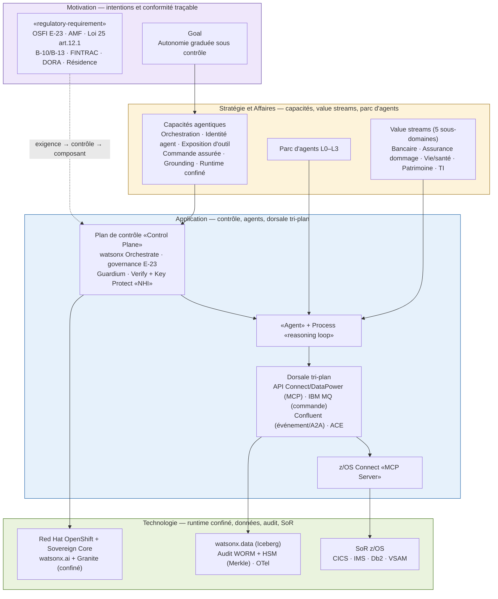
```mermaid
flowchart TB
    subgraph MOT["Motivation — intentions et conformité traçable"]
        REQ["«regulatory-requirement»<br/>OSFI E-23 · AMF · Loi 25 art.12.1<br/>B-10/B-13 · FINTRAC · DORA · Résidence"]
        GOAL["Goal<br/>Autonomie graduée sous contrôle"]
    end
    subgraph STR["Stratégie et Affaires — capacités, value streams, parc d'agents"]
        CAP["Capacités agentiques<br/>Orchestration · Identité agent · Exposition d'outil<br/>Commande assurée · Grounding · Runtime confiné"]
        VS["Value streams (5 sous-domaines)<br/>Bancaire · Assurance dommage · Vie/santé · Patrimoine · TI"]
        FLEET["Parc d'agents L0–L3"]
    end
    subgraph APP["Application — contrôle, agents, dorsale tri-plan"]
        CP["Plan de contrôle «Control Plane»<br/>watsonx Orchestrate · governance E-23<br/>Guardium · Verify + Key Protect «NHI»"]
        AG["«Agent» + Process «reasoning loop»"]
        BB["Dorsale tri-plan<br/>API Connect/DataPower (MCP) · IBM MQ (commande)<br/>Confluent (événement/A2A) · ACE"]
        MCPS["z/OS Connect «MCP Server»"]
    end
    subgraph TEC["Technologie — runtime confiné, données, audit, SoR"]
        RT["Red Hat OpenShift + Sovereign Core<br/>watsonx.ai + Granite (confiné)"]
        DATA["watsonx.data (Iceberg)<br/>Audit WORM + HSM (Merkle) · OTel"]
        SOR["SoR z/OS<br/>CICS · IMS · Db2 · VSAM"]
    end
    GOAL --> CAP
    CAP --> CP
    VS --> AG
    FLEET --> AG
    CP --> AG
    AG --> BB
    BB --> MCPS
    CP --> RT
    BB --> DATA
    MCPS --> SOR
    REQ -.->|"exigence → contrôle → composant"| CP
    classDef mot fill:#efe7fb,stroke:#5b3a9b,stroke-width:1px;
    classDef str fill:#fdf3da,stroke:#9a7016,stroke-width:1px;
    classDef app fill:#e6f1fb,stroke:#185fa5,stroke-width:1px;
    classDef tec fill:#eaf3de,stroke:#3b6d11,stroke-width:1px;
    class MOT mot;
    class STR str;
    class APP app;
    class TEC tec;
```

**Figure A — Blueprint consolidé, quatre couches ArchiMate.** Lecture verticale descendante : la Motivation (exigences réglementaires et finalité) se décline en capacités et *value streams* (Stratégie/Affaires), réalisées par le plan de contrôle, les agents et la dorsale tri-plan (Application), eux-mêmes portés par le runtime confiné, les données et l'audit (Technologie). L'arête pointillée porte le fil de traçabilité opposable ; aucune exigence n'y reste orpheline (cf. Annexe B — matrice de traçabilité). L'invariant transversal *découplage · contrat · évolution* relie les quatre couches.

Là où la figure A empile les couches d'intention, la figure B en montre le câblage et les frontières *load-bearing*.

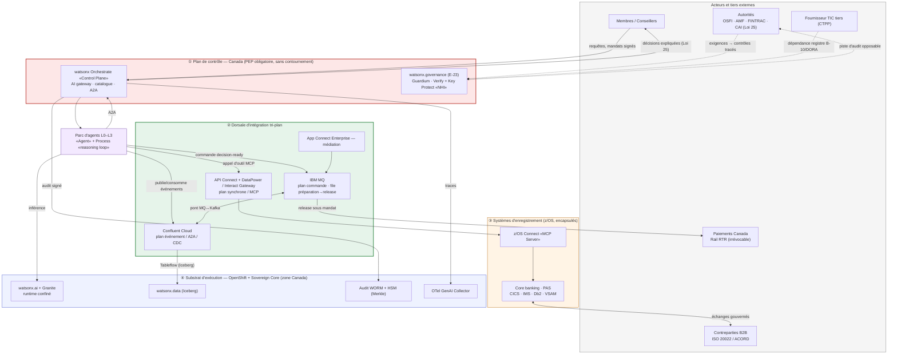
```mermaid
flowchart TB
    subgraph EXT["Acteurs et tiers externes"]
        CLIENT["Membres / Conseillers"]
        REG["Autorités<br/>OSFI · AMF · FINTRAC · CAI (Loi 25)"]
        RTR["Paiements Canada<br/>Rail RTR (irrévocable)"]
        PARTNERS["Contreparties B2B<br/>ISO 20022 / ACORD"]
        CTPP["Fournisseur TIC tiers (CTPP)"]
    end
    subgraph CP["① Plan de contrôle — Canada (PEP obligatoire, sans contournement)"]
        ORCH["watsonx Orchestrate «Control Plane»<br/>AI gateway · catalogue · A2A"]
        GOV["watsonx.governance (E-23)<br/>Guardium · Verify + Key Protect «NHI»"]
    end
    AGENTS["Parc d'agents L0–L3<br/>«Agent» + Process «reasoning loop»"]
    subgraph BB["② Dorsale d'intégration tri-plan"]
        APIC["API Connect + DataPower / Interact Gateway<br/>plan synchrone / MCP"]
        MQ["IBM MQ<br/>plan commande · file préparation→release"]
        CONF["Confluent Cloud<br/>plan événement / A2A / CDC"]
        ACE["App Connect Enterprise — médiation"]
    end
    subgraph SOR["③ Systèmes d'enregistrement (z/OS, encapsulés)"]
        ZC["z/OS Connect «MCP Server»"]
        CORE["Core banking · PAS<br/>CICS · IMS · Db2 · VSAM"]
    end
    subgraph EXEC["④ Substrat d'exécution — OpenShift + Sovereign Core (zone Canada)"]
        WXAI["watsonx.ai + Granite<br/>runtime confiné"]
        WXDATA["watsonx.data (Iceberg)"]
        AUDIT["Audit WORM + HSM (Merkle)"]
        OTEL["OTel GenAI Collector"]
    end
    CLIENT -->|"requêtes, mandats signés"| ORCH
    ORCH -->|"décisions expliquées (Loi 25)"| CLIENT
    REG -.->|"exigences → contrôles tracés"| GOV
    GOV -.->|"piste d'audit opposable"| REG
    CTPP -.->|"dépendance registre B-10/DORA"| GOV
    ORCH --> AGENTS
    AGENTS -->|"A2A"| ORCH
    AGENTS -->|"appel d'outil MCP"| APIC
    AGENTS -->|"commande decision-ready"| MQ
    AGENTS -->|"publie/consomme événements"| CONF
    APIC --> ZC
    ACE --> MQ
    ZC --> CORE
    MQ <-->|"pont MQ↔Kafka"| CONF
    CONF -->|"Tableflow (Iceberg)"| WXDATA
    AGENTS -->|"inférence"| WXAI
    ORCH -->|"audit signé"| AUDIT
    ORCH -->|"traces"| OTEL
    MQ -->|"release sous mandat"| RTR
    CORE <-->|"échanges gouvernés"| PARTNERS
    classDef cp fill:#fde7e7,stroke:#b3261e,stroke-width:2px;
    classDef bb fill:#e6f4ea,stroke:#1e7d34,stroke-width:2px;
    classDef sor fill:#fff4e5,stroke:#b06000,stroke-width:1px;
    classDef ex fill:#eef2ff,stroke:#3b4cca,stroke-width:1px;
    classDef ext fill:#f5f5f5,stroke:#777,stroke-width:1px;
    classDef ag fill:#f3e9ff,stroke:#6b3fa0,stroke-width:1px;
    class EXT ext;
    class CP cp;
    class BB bb;
    class SOR sor;
    class EXEC ex;
    class AGENTS ag;
```

**Figure B — Schéma maître C4, pile IBM consolidée sur Boréalis.** Fusion des figures 1 (contexte) et 2 (conteneurs) avec l'overlay des zones (figure 9). Le plan de contrôle (rouge) est un point d'application de politique obligatoire et sans contournement (invariant 3) ; la dorsale (vert) sépare les trois plans d'interaction (§4) ; les systèmes d'enregistrement (orange) sont encapsulés sans modification ; le substrat d'exécution (bleu) est confiné en zone Canada (egress `ca-central` uniquement, invariant 6). Règle structurante : aucun agent n'atteint un système d'enregistrement sans franchir à la fois le plan de contrôle et un point d'application de politique de la dorsale.

Ces deux vues servent de table des matières visuelle : le lecteur-architecte y situe n'importe quel composant avant d'en lire le contrat d'interface, la topologie ou le runbook dans les sections qui suivent.

---

## 0.2 Blueprint EA détaillé — jeu de vues ArchiMate

En complément de la vue d'ouverture (§0.1), cette section déroule le **blueprint d'architecture d'entreprise détaillé** : l'instanciation ArchiMate 4 (The Open Group, C260) de la solution Boréalis sur la pile IBM, vue par vue, selon la bibliothèque de points de vue du ch.6 (cf. Monographie ch.6 §6.7). Dix vues couvrent les cinq domaines — Motivation, Stratégie, Affaires, Application, Technologie —, le point de vue Implémentation & Déploiement, et les quatre points de vue transverses (Sécurité/Risque, Zéro-trust/NHI, Conformité traçable, Audit/Observabilité). Les conventions de la version 4 sont appliquées : les éléments Constraint, Contract et Gap, retirés, sont rendus par spécialisation (respectivement `<<regulatory-requirement>>`, Business Object « Contrat », spécialisation d'Assessment) ; le registre de stéréotypes du blueprint (cf. Monographie ch.6 §6.1.9) s'applique à chaque vue. Chaque figure expose les éléments typés et leurs relations canoniques (Influence, Realization, Assignment, Serving, Access, Flow, Triggering, Aggregation, Specialization, Association) ; les figures 1 à 16 en donnent la projection C4 et les contrats d'interface.

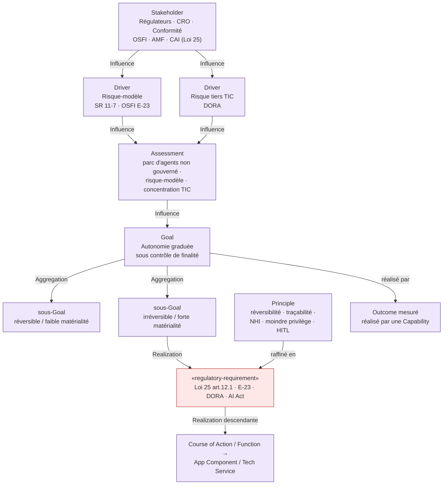
```mermaid
flowchart TB
    SH["Stakeholder<br/>Régulateurs · CRO · Conformité<br/>OSFI · AMF · CAI (Loi 25)"]
    DR1["Driver<br/>Risque-modèle<br/>SR 11-7 · OSFI E-23"]
    DR2["Driver<br/>Risque tiers TIC<br/>DORA"]
    AS["Assessment<br/>parc d'agents non gouverné ·<br/>risque-modèle · concentration TIC"]
    GO["Goal<br/>Autonomie graduée<br/>sous contrôle de finalité"]
    GO1["sous-Goal<br/>réversible / faible matérialité"]
    GO2["sous-Goal<br/>irréversible / forte matérialité"]
    PR["Principle<br/>réversibilité · traçabilité ·<br/>NHI · moindre privilège · HITL"]
    REQ["«regulatory-requirement»<br/>Loi 25 art.12.1 · E-23 · DORA · AI Act"]
    OUT["Outcome mesuré<br/>réalisé par une Capability"]
    EXE["Course of Action / Function →<br/>App Component / Tech Service"]
    SH -->|"Influence"| DR1
    SH -->|"Influence"| DR2
    DR1 -->|"Influence"| AS
    DR2 -->|"Influence"| AS
    AS -->|"Influence"| GO
    GO -->|"Aggregation"| GO1
    GO -->|"Aggregation"| GO2
    GO2 -->|"Realization"| REQ
    PR -->|"raffiné en"| REQ
    GO -->|"réalisé par"| OUT
    REQ -->|"Realization descendante"| EXE
    classDef mot fill:#efe7fb,stroke:#5b3a9b,stroke-width:1px;
    classDef reg fill:#fde7e7,stroke:#b3261e,stroke-width:1px;
    class SH,DR1,DR2,AS,GO,GO1,GO2,PR,OUT,EXE mot;
    class REQ reg;
```

**Figure C — Vue Motivation.** La chaîne d'intention : les Stakeholders (régulateurs, CRO, conformité) influencent des Drivers — dont la double-qualification *risque-modèle* (OSFI E-23) et *risque tiers TIC* (DORA), modélisée par deux Drivers distincts et non agrégés ; les Assessments (*agent sprawl*, risque-modèle, concentration TIC) justifient le Goal d'autonomie graduée, raffiné par Aggregation en sous-Goals indexés sur matérialité et réversibilité, puis réalisé en exigences. L'exigence réglementaire est une spécialisation de Requirement `<<regulatory-requirement>>` (Constraint retiré en v4) ; aucune ne doit rester orpheline (critère contrôlé en §7.1).

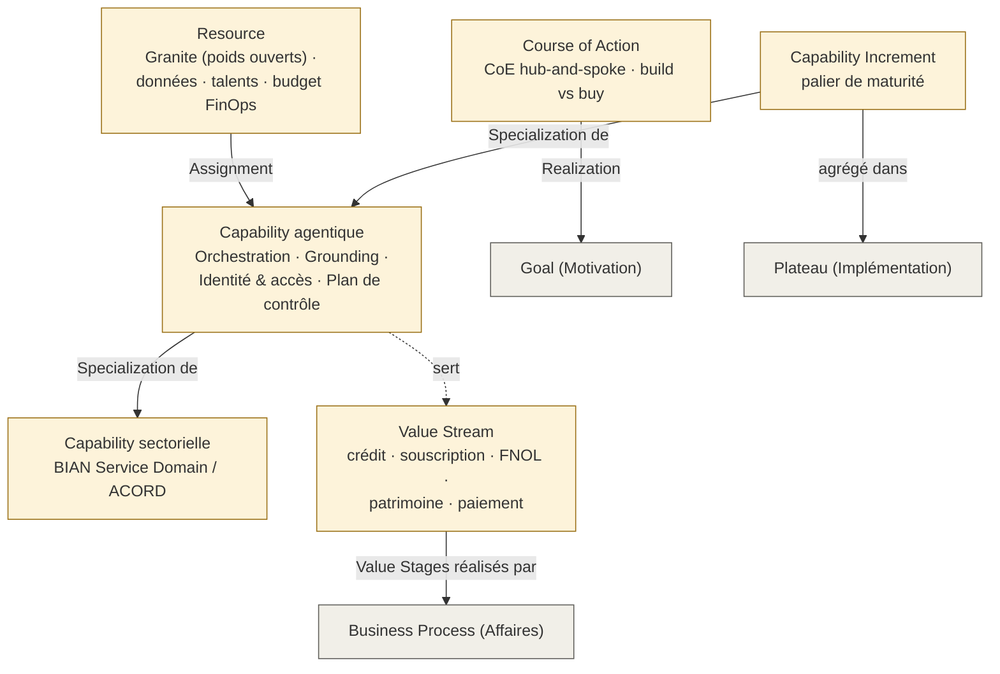
```mermaid
flowchart TB
    RES["Resource<br/>Granite (poids ouverts) ·<br/>données · talents · budget FinOps"]
    CAP["Capability agentique<br/>Orchestration · Grounding ·<br/>Identité & accès · Plan de contrôle"]
    BIAN["Capability sectorielle<br/>BIAN Service Domain / ACORD"]
    COA["Course of Action<br/>CoE hub-and-spoke · build vs buy"]
    GOAL["Goal (Motivation)"]
    VS["Value Stream<br/>crédit · souscription · FNOL ·<br/>patrimoine · paiement"]
    BP["Business Process (Affaires)"]
    INC["Capability Increment<br/>palier de maturité"]
    PLAT["Plateau (Implémentation)"]
    RES -->|"Assignment"| CAP
    CAP -->|"Specialization de"| BIAN
    COA -->|"Realization"| GOAL
    CAP -.->|"sert"| VS
    VS -->|"Value Stages réalisés par"| BP
    INC -->|"Specialization de"| CAP
    INC -->|"agrégé dans"| PLAT
    classDef str fill:#fdf3da,stroke:#9a7016,stroke-width:1px;
    classDef ext fill:#f1efe8,stroke:#5f5e5a,stroke-width:1px;
    class RES,CAP,BIAN,COA,VS,INC str;
    class GOAL,BP,PLAT ext;
```

**Figure D — Vue Stratégie.** L'unité de planification est la *capacité agentique*, non le modèle ni l'outil. Chaque Capability spécialise une capacité sectorielle (BIAN Service Domain / ACORD) ; la Resource (modèles, données, budget FinOps) lui est *assignée* ; le Course of Action réalise les Goals ; le Value Stream se décompose en Value Stages réalisés par des Business Process ; un Capability Increment spécialise la capacité et s'agrège en Plateau.

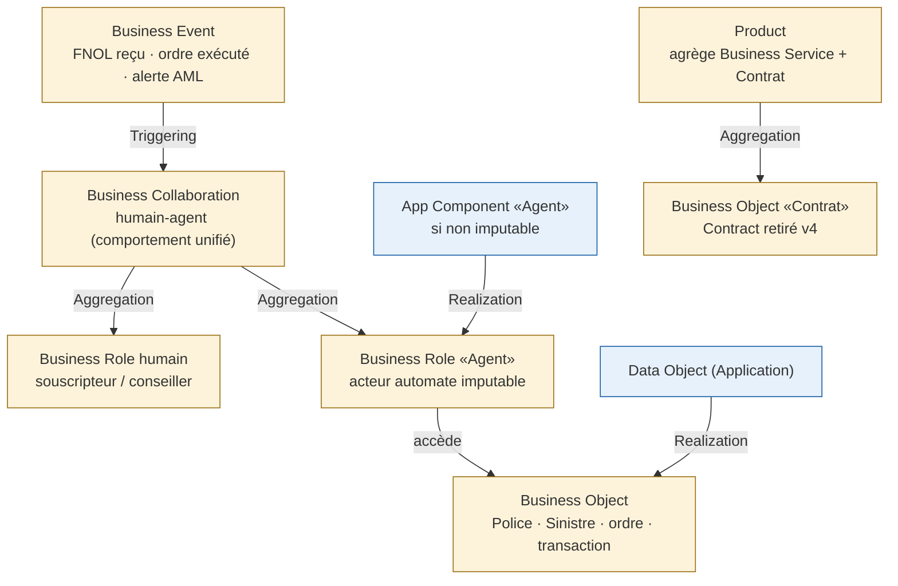
```mermaid
flowchart TB
    EV["Business Event<br/>FNOL reçu · ordre exécuté · alerte AML"]
    COL["Business Collaboration<br/>humain-agent (comportement unifié)"]
    RH["Business Role humain<br/>souscripteur / conseiller"]
    RA["Business Role «Agent»<br/>acteur automate imputable"]
    AGC["App Component «Agent»<br/>si non imputable"]
    BO["Business Object<br/>Police · Sinistre · ordre · transaction"]
    CT["Business Object «Contrat»<br/>Contract retiré v4"]
    PRD["Product<br/>agrège Business Service + Contrat"]
    DO["Data Object (Application)"]
    EV -->|"Triggering"| COL
    COL -->|"Aggregation"| RH
    COL -->|"Aggregation"| RA
    AGC -->|"Realization"| RA
    RA -->|"accède"| BO
    DO -->|"Realization"| BO
    PRD -->|"Aggregation"| CT
    classDef bus fill:#fdf3da,stroke:#9a7016,stroke-width:1px;
    classDef app fill:#e6f1fb,stroke:#185fa5,stroke-width:1px;
    class EV,COL,RH,RA,BO,CT,PRD bus;
    class AGC,DO app;
```

**Figure E — Vue Affaires.** L'altitude de l'agent est dictée par l'imputabilité : un agent imputable se remonte en Business Role `<<Agent>>` assigné à un acteur automate ; sinon il reste un Application Component qui réalise cet acteur. La Business Collaboration agrège les Roles humains et automates ; les Business Objects (Police, Sinistre, ordre) sont réalisés par des Data Objects ; le Contrat, retiré en v4, devient une spécialisation de Business Object agrégée au Produit.

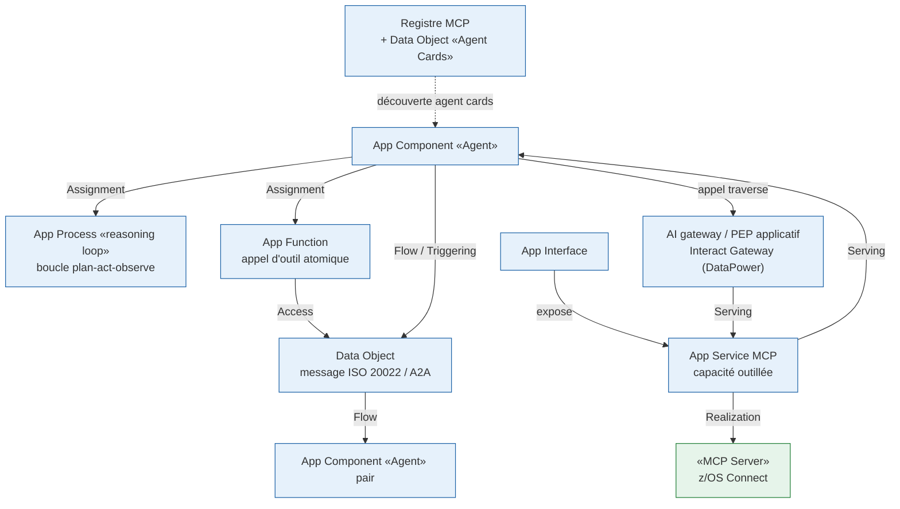
```mermaid
flowchart TB
    AG["App Component «Agent»"]
    RL["App Process «reasoning loop»<br/>boucle plan-act-observe"]
    FN["App Function<br/>appel d'outil atomique"]
    SVC["App Service MCP<br/>capacité outillée"]
    IFACE["App Interface"]
    MCPS["«MCP Server»<br/>z/OS Connect"]
    GW["AI gateway / PEP applicatif<br/>Interact Gateway (DataPower)"]
    REG["Registre MCP<br/>+ Data Object «Agent Cards»"]
    DO["Data Object<br/>message ISO 20022 / A2A"]
    AG2["App Component «Agent» pair"]
    AG -->|"Assignment"| RL
    AG -->|"Assignment"| FN
    IFACE -->|"expose"| SVC
    SVC -->|"Realization"| MCPS
    SVC -->|"Serving"| AG
    FN -->|"Access"| DO
    AG -->|"appel traverse"| GW
    GW -->|"Serving"| SVC
    REG -.->|"découverte agent cards"| AG
    AG -->|"Flow / Triggering"| DO
    DO -->|"Flow"| AG2
    classDef app fill:#e6f1fb,stroke:#185fa5,stroke-width:1px;
    classDef mcp fill:#e6f4ea,stroke:#1e7d34,stroke-width:1px;
    class AG,RL,FN,SVC,IFACE,GW,REG,DO,AG2 app;
    class MCPS mcp;
```

**Figure F — Vue Application.** L'agent est un Application Component `<<Agent>>` ; sa boucle plan-act-observe est un Application Process `<<reasoning loop>>`, l'appel d'outil une Application Function. Le triplet MCP — Application Service réalisé par le `<<MCP Server>>` (z/OS Connect), exposé par une Application Interface, *Serving* vers l'agent, *Access* sur le Data Object — passe par l'AI gateway (PEP applicatif). L'A2A est un Flow/Triggering via Data Object interposé.

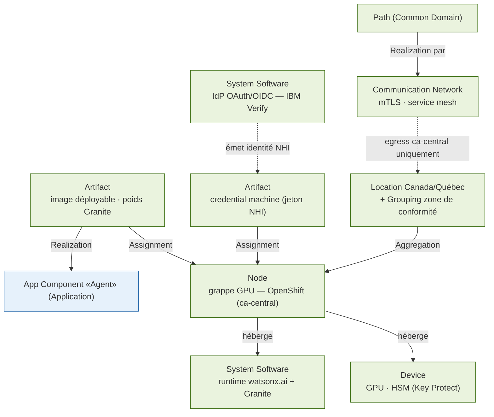
```mermaid
flowchart TB
    AG["App Component «Agent» (Application)"]
    ART["Artifact<br/>image déployable · poids Granite"]
    NODE["Node<br/>grappe GPU — OpenShift (ca-central)"]
    SS["System Software<br/>runtime watsonx.ai + Granite"]
    DEV["Device<br/>GPU · HSM (Key Protect)"]
    CRED["Artifact<br/>credential machine (jeton NHI)"]
    IDP["System Software<br/>IdP OAuth/OIDC — IBM Verify"]
    PATH["Path (Common Domain)"]
    NET["Communication Network<br/>mTLS · service mesh"]
    LOC["Location Canada/Québec<br/>+ Grouping zone de conformité"]
    ART -->|"Realization"| AG
    ART -->|"Assignment"| NODE
    NODE -->|"héberge"| SS
    NODE -->|"héberge"| DEV
    CRED -->|"Assignment"| NODE
    IDP -.->|"émet identité NHI"| CRED
    PATH -->|"Realization par"| NET
    LOC -->|"Aggregation"| NODE
    NET -.->|"egress ca-central uniquement"| LOC
    classDef tec fill:#eaf3de,stroke:#3b6d11,stroke-width:1px;
    classDef app fill:#e6f1fb,stroke:#185fa5,stroke-width:1px;
    class ART,NODE,SS,DEV,CRED,IDP,PATH,NET,LOC tec;
    class AG app;
```

**Figure G — Vue Technologie.** Le substrat d'exécution confiné : l'Artifact (image, poids Granite) réalise l'Application Component et est assigné à un Node (grappe GPU OpenShift en `ca-central`) hébergeant le System Software (runtime) et les Device (GPU, HSM). Le credential machine (jeton NHI) est un Artifact assigné au Node ; le Path (Common Domain v4) est réalisé par un Communication Network (mTLS) ; la Location et le Grouping de zone fixent la résidence — l'absence de Path sortant traduisant l'interdiction d'egress.

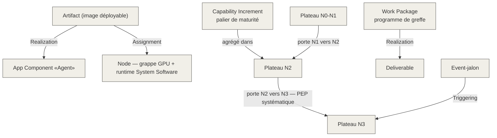
```mermaid
flowchart TB
    AG["App Component «Agent»"]
    ART["Artifact (image déployable)"]
    NODE["Node — grappe GPU + runtime System Software"]
    INC["Capability Increment<br/>palier de maturité"]
    P0["Plateau N0-N1"]
    P2["Plateau N2"]
    P3["Plateau N3"]
    WP["Work Package<br/>programme de greffe"]
    DEL["Deliverable"]
    EVT["Event-jalon"]
    ART -->|"Realization"| AG
    ART -->|"Assignment"| NODE
    INC -->|"agrégé dans"| P2
    P0 -->|"porte N1 vers N2"| P2
    P2 -->|"porte N2 vers N3 — PEP systématique"| P3
    WP -->|"Realization"| DEL
    EVT -->|"Triggering"| P3
    classDef impl fill:#f1efe8,stroke:#5f5e5a,stroke-width:1px;
    class AG,ART,NODE,INC,P0,P2,P3,WP,DEL,EVT impl;
```

**Figure H — Vue Implémentation & Déploiement.** Le gabarit de déploiement (Application Component ←Realization— Artifact —Assignment→ Node) relie l'intention applicative au lieu d'exécution. La trajectoire se fractionne en Plateaus successifs ; le Capability Increment s'agrège au Plateau ; la porte N2→N3 (PEP systématique) est le jalon critique ; Work Packages, Deliverables et Events-jalons pilotent le programme de greffe (Gap retiré en v4 → spécialisation d'Assessment).

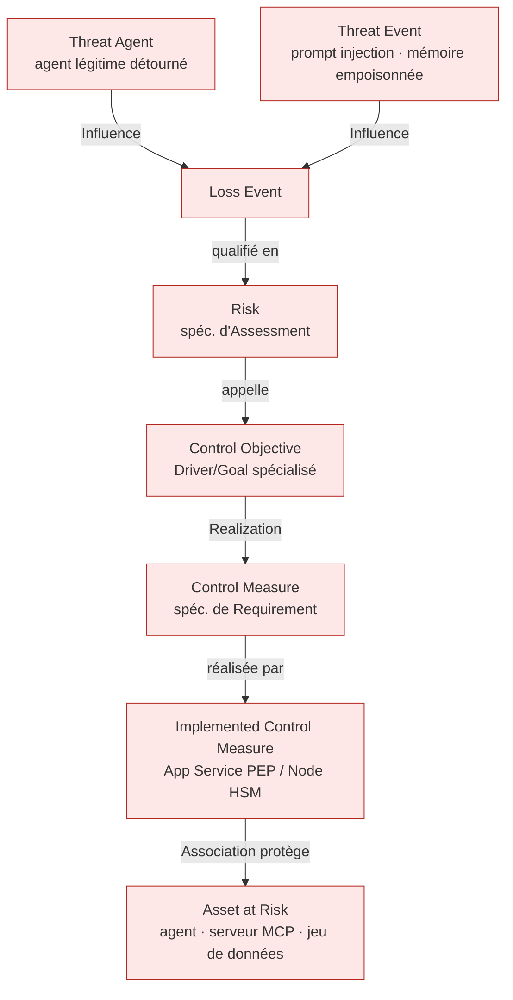
```mermaid
flowchart TB
    TA["Threat Agent<br/>agent légitime détourné"]
    TE["Threat Event<br/>prompt injection · mémoire empoisonnée"]
    LE["Loss Event"]
    RK["Risk<br/>spéc. d'Assessment"]
    CO["Control Objective<br/>Driver/Goal spécialisé"]
    CM["Control Measure<br/>spéc. de Requirement"]
    ICM["Implemented Control Measure<br/>App Service PEP / Node HSM"]
    AST["Asset at Risk<br/>agent · serveur MCP · jeu de données"]
    TA -->|"Influence"| LE
    TE -->|"Influence"| LE
    LE -->|"qualifié en"| RK
    RK -->|"appelle"| CO
    CO -->|"Realization"| CM
    CM -->|"réalisée par"| ICM
    ICM -->|"Association protège"| AST
    classDef sec fill:#fde7e7,stroke:#b3261e,stroke-width:1px;
    class TA,TE,LE,RK,CO,CM,ICM,AST sec;
```

**Figure I — Vue Sécurité/Risque (Risk & Security Overlay).** La chaîne du RSO (W172) appliquée au parc d'agents : un Threat Agent (agent légitime détourné) et un Threat Event mènent par Influence à un Loss Event qualifié en Risk (spécialisation d'Assessment) ; le Control Objective se réalise en Control Measure (spécialisation de Requirement, Constraint retiré v4), elle-même réalisée par une Implemented Control Measure (App Service PEP / Node HSM) associée à l'Asset at Risk protégé.

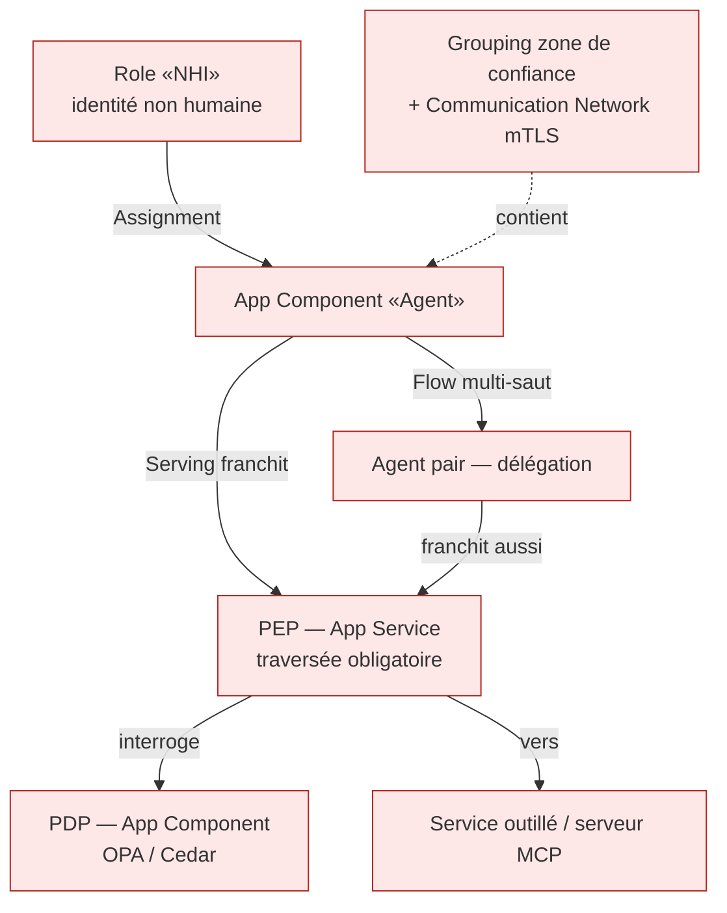
```mermaid
flowchart TB
    AG["App Component «Agent»"]
    NHI["Role «NHI»<br/>identité non humaine"]
    PEP["PEP — App Service<br/>traversée obligatoire"]
    PDP["PDP — App Component<br/>OPA / Cedar"]
    SVC["Service outillé / serveur MCP"]
    AG2["Agent pair — délégation"]
    GRP["Grouping zone de confiance<br/>+ Communication Network mTLS"]
    NHI -->|"Assignment"| AG
    AG -->|"Serving franchit"| PEP
    PEP -->|"interroge"| PDP
    PEP -->|"vers"| SVC
    AG -->|"Flow multi-saut"| AG2
    AG2 -->|"franchit aussi"| PEP
    GRP -.->|"contient"| AG
    classDef zt fill:#fde7e7,stroke:#b3261e,stroke-width:1px;
    class AG,NHI,PEP,PDP,SVC,AG2,GRP zt;
```

**Figure J — Vue Zéro-trust / NHI.** L'identité non humaine est un Role `<<NHI>>` assigné à l'agent ; tout flux franchit un PEP (Application Service de traversée obligatoire), distinct du PDP (OPA/Cedar) — la séparation décision/application étant elle-même une exigence d'architecture. La délégation multi-saut est une succession de Flow franchissant le PEP ; la zone de confiance combine Grouping et Communication Network.

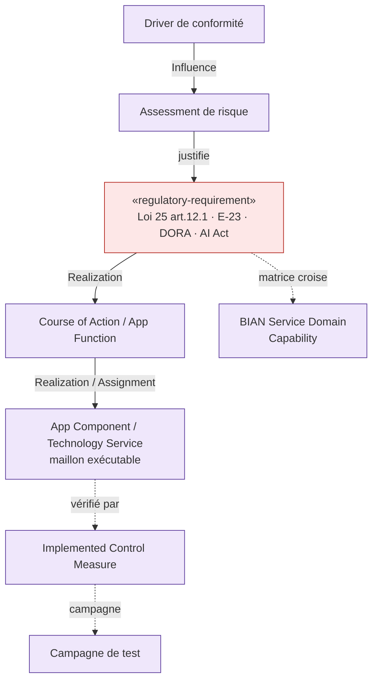
```mermaid
flowchart TB
    DR["Driver de conformité"]
    AS["Assessment de risque"]
    REQ["«regulatory-requirement»<br/>Loi 25 art.12.1 · E-23 · DORA · AI Act"]
    COA["Course of Action / App Function"]
    EXE["App Component / Technology Service<br/>maillon exécutable"]
    CAP["BIAN Service Domain<br/>Capability"]
    CTL["Implemented Control Measure"]
    TST["Campagne de test"]
    DR -->|"Influence"| AS
    AS -->|"justifie"| REQ
    REQ -->|"Realization"| COA
    COA -->|"Realization / Assignment"| EXE
    REQ -.->|"matrice croise"| CAP
    EXE -.->|"vérifié par"| CTL
    CTL -.->|"campagne"| TST
    classDef conf fill:#efe7fb,stroke:#5b3a9b,stroke-width:1px;
    classDef reg fill:#fde7e7,stroke:#b3261e,stroke-width:1px;
    class DR,AS,COA,EXE,CAP,CTL,TST conf;
    class REQ reg;
```

**Figure K — Vue Conformité traçable (siège).** La chaîne verticale de bout en bout : Driver de conformité → Assessment → `<<regulatory-requirement>>` → Course of Action / Application Function → Application Component / Technology Service exécutable. La matrice d'auditabilité croise l'exigence, le contrôle (Implemented Control Measure), le BIAN Service Domain (Capability) et l'élément porteur ; le critère vérifiable est qu'aucun `<<regulatory-requirement>>` ne demeure orphelin.

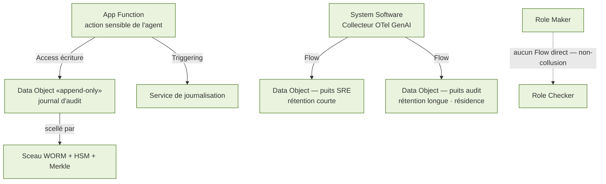
```mermaid
flowchart TB
    ACT["App Function<br/>action sensible de l'agent"]
    LOG["Data Object «append-only»<br/>journal d'audit"]
    SEAL["Sceau WORM + HSM + Merkle"]
    JSVC["Service de journalisation"]
    OT["System Software<br/>Collecteur OTel GenAI"]
    SRE["Data Object — puits SRE<br/>rétention courte"]
    AUD["Data Object — puits audit<br/>rétention longue · résidence"]
    MK["Role Maker"]
    CK["Role Checker"]
    ACT -->|"Access écriture"| LOG
    ACT -->|"Triggering"| JSVC
    LOG -->|"scellé par"| SEAL
    OT -->|"Flow"| SRE
    OT -->|"Flow"| AUD
    MK -.->|"aucun Flow direct — non-collusion"| CK
    classDef aud fill:#eaf3de,stroke:#3b6d11,stroke-width:1px;
    class ACT,LOG,SEAL,JSVC,OT,SRE,AUD,MK,CK aud;
```

**Figure L — Vue Audit/Observabilité.** La preuve structurelle : toute action sensible (Application Function) écrit (*Access*) dans un Data Object `<<append-only>>` scellé (WORM + HSM + Merkle) et déclenche (*Triggering*) la journalisation. L'observabilité SRE et l'audit réglementaire sont séparés en deux Data Objects (rétentions et résidences distinctes) alimentés par le Collector OTel ; la ségrégation maker-checker se lit dans l'absence délibérée de Flow direct entre les deux Roles.

Ensemble, ces dix vues constituent le blueprint exploitable : chaque élément y est typé, stéréotypé et relié, et chaque `<<regulatory-requirement>>` se rattache à un élément exécutable — condition d'auditabilité posée en Monographie ch.6 §6.6.3. Les statuts vivants (⚠) et les valeurs chiffrées restent ceux de l'Annexe B.

---

## 1. Périmètre, hypothèses et invariants

### 1.1 Entreprise fictive — Coopérative financière Boréalis

| Attribut | Valeur |
|---|---|
| Nature | Coopérative de services financiers, Québec ; FRFI sous OSFI + assujettie AMF |
| Sous-domaines | Bancaire détail/PME · Assurance dommage (IARD) · Assurance vie & santé · Gestion de patrimoine · Services TI internes |
| Substrat hérité | Core banking + PAS assurance sur z/OS ; IBM MQ pour la messagerie ; Kafka pour l'EDA |
| Contraintes-pivots | Loi 25 art. 12.1 · résidence des renseignements personnels au Canada · OSFI E-23/B-10/B-13 · ligne directrice IA de l'AMF |
| Posture agentique | Copilotes à l'échelle + autonomie transactionnelle *bornée* aux cas à faible irréversibilité |
| Ordre de grandeur (hypothèse de dimensionnement) | ~1,2 M de membres ; ~3 500 employés ; pics de ~2 500 transactions/s sur le rail de paiement ; parc cible de 40-80 agents gouvernés à 24 mois |

### 1.2 Décision d'architecture — épine IBM consolidée

Consolider sur IBM n'est pas un parti pris de fournisseur ; le choix découle de trois propriétés que la pile offre *couplées* et que la finance régulée exige indissociables :

1. **Plan de contrôle et registre de modèles fusionnés.** watsonx Orchestrate (control plane) et watsonx.governance (registre de modèles E-23) partagent un même graphe de gouvernance — la double-qualification *modèle + tiers TIC* y est native, inscrite au même endroit plutôt que reconstituée par rapprochement manuel.
2. **Résidence native par le substrat.** IBM-sur-Z + Sovereign Core ramènent la résidence à une propriété d'infrastructure, non à une consigne contractuelle : on la prouve en testant l'absence de chemin sortant, plutôt qu'en lisant une clause.
3. **Encapsulation non disruptive du legacy.** z/OS Connect, App Connect (ACE) et API Connect exposent le cœur z/OS en MCP/API *sans le toucher* — le socle existant de Boréalis devient l'actif différenciant plutôt que la dette à résorber.

Le revers — lock-in et dépendance CTPP — est traité en §16 et tranché en ADR-001 (§15).

### 1.3 Invariants directeurs

Sept invariants non négociables gouvernent toutes les décisions ; une décision qui en viole un est, par construction, non défendable devant l'AMF ou l'OSFI. Ils se projettent en principes d'architecture vérifiables (§2.2) et en contrôles tracés (Annexe B interne — matrice de traçabilité).

1. **Irréversibilité → préparation par l'agent, release humaine sur l'irréversible.** Pas de saga compensatoire déterministe sur un rail à finalité immédiate.
2. **Double-qualification.** Un agent décisionnel est un *modèle* (E-23) *et* un *tiers TIC* (B-10/B-13, DORA) ; les deux pistes d'audit coexistent.
3. **Plan de contrôle unique, sans contournement.** Un PEP (point d'application de politique) obligatoire identifie (KYA/NHI), autorise (matérialité × réversibilité), ségrègue (four-eyes anti-collusion), journalise (infalsifiable).
4. **Grounding sur standard sectoriel.** ISO 20022 / BIAN / FIBO / ACORD / CDM / FHIR ; ontologie en validation, jamais en génération.
5. **Audit infalsifiable ≠ observabilité SRE.** Deux objets, deux rétentions, deux finalités.
6. **Résidence = contrat d'architecture vérifiable.** Exprimée par l'absence de chemin sortant + zone de conformité.
7. **Standards ouverts aux coutures.** MCP, A2A, ISO 20022, OTel GenAI, poids ouverts, échange ArchiMate — pour préserver l'*exit-by-design*.

Le premier — l'irréversibilité — commande le calibrage de l'autonomie ci-dessous : l'action est d'autant plus libre qu'elle se défait sans dommage.

**Calibrage de l'autonomie (porté par un *Profile* ArchiMate).** L'autonomie n'est pas un attribut produit ; c'est une fonction de la réversibilité et de la matérialité de l'action.

| Niveau | Régime | Domaine d'application | Garde-fou |
|---|---|---|---|
| **L0 — Copilote** | Assiste un humain, ne touche aucun système d'enregistrement | tout | Supervision humaine implicite |
| **L1 — Préparateur** | Produit une transaction *decision-ready*, ne l'émet pas | matérialité haute, réversibilité faible | Release humaine (HITL) sur l'étape irréversible |
| **L2 — Exécuteur borné** | Exécute seul des actions réversibles à faible matérialité | réversible + faible matérialité | Contrôle déterministe + four-eyes inter-agents |
| **L3 — Transactionnel encadré** | Exécute une action engageante via mandat vérifiable signé | borné par scope du mandat | KYA + mandat opposable journalisé + réconciliation continue |

Règle de placement : **toute action irréversible reste ≤ L1 par défaut** ; le franchissement L1→L2/L3 exige la réversibilité native ou un mandat cryptographique borné. La machine à états de transition d'autonomie est posée en §12.2.

### 1.4 Des pilotes (*drivers*) aux exigences non fonctionnelles

Un *driver* sans NFR mesurable est une intention, pas une exigence : c'est le test qui sépare ce qui s'audite de ce qui se proclame. Invariants et *drivers* réglementaires (§7) se traduisent donc en exigences non fonctionnelles mesurables, chiffrées en §9 ; chaque ligne du tableau ci-dessous noue un *driver* à la grandeur qui le rend vérifiable.

| Driver (origine) | Qualité d'architecture visée | NFR mesurable (siège §9) |
|---|---|---|
| Irréversibilité (invariant 1) | Intégrité transactionnelle | Livraison *exactly-once* MQ ; 0 double-engagement ; RPO=0 sur le rail de commande |
| Audit infalsifiable (E-23, AMF) | Non-répudiation, rétention | Signature HSM + WORM ; rétention pluriannuelle ; latence d'écriture d'audit < 200 ms p99 |
| Résidence (Loi 25, OSFI B-10) | Confinement géographique | 0 chemin d'egress hors zone Canada (vérifié par NetworkPolicy + DLP) |
| Continuité (OSFI B-10, DORA) | Disponibilité, reprise | SLO 99,95 % plan de commande ; RTO ≤ 15 min ; bascule HA automatique |
| Maîtrise des coûts (FinOps) | Efficience d'inférence | Coût/jeton suivi par agent ; budget d'inférence borné par plafond (§10.4) |
| Lutte fraude/AML (FINTRAC) | Détection temps réel | Réconciliation continue < 5 s bout-en-bout (Flink) ; couverture 100 % des flux à risque |

### 1.5 Parties prenantes et imputabilité (RACI sommaire)

L'imputabilité humaine est restaurée par construction (KYH, §3.4). Le RACI ci-dessous fixe qui répond de quoi ; il est opérationnalisé par plateau dans le runbook de cutover §14.5.

| Activité / décision | Métier | Risque-modèle (E-23) | Conformité | Architecture/TI | Sécurité |
|---|---|---|---|---|---|
| Mise en service d'un agent | A | R | C | R | C |
| Validation pré-déploiement du modèle | C | A/R | C | C | I |
| Release humaine sur l'irréversible | A/R | I | C | I | I |
| Octroi d'identité NHI + scope | I | I | C | R | A/R |
| Inscription au registre des tiers TIC | I | C | A/R | C | C |
| Franchissement de porte de plateau | A | R | A | R | R |

*(R = réalise, A = approuve/imputable, C = consulté, I = informé.)*

### 1.6 Vue de contexte (C4 — niveau 1)

La figure 1 situe le système agentique de Boréalis dans son écosystème : acteurs humains, autorités, systèmes d'enregistrement hérités et tiers externes. Deux frontières *load-bearing* la structurent : la **frontière de résidence**, qui maintient tout le traitement décisionnel en zone Canada, et la **frontière d'imputabilité**, qui contraint toute action engageante à traverser le plan de contrôle. Le diagramme matérialise l'une et l'autre.

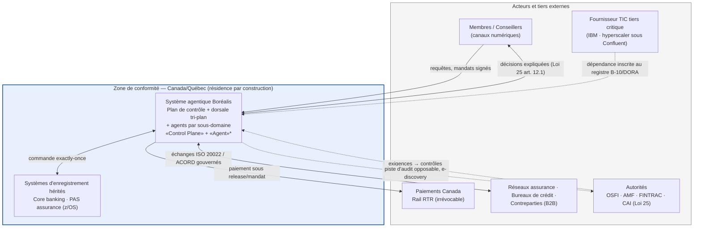
```mermaid
flowchart TB
    subgraph EXT["Acteurs et tiers externes"]
        CLIENT["Membres / Conseillers<br/>(canaux numériques)"]
        REG["Autorités<br/>OSFI · AMF · FINTRAC · CAI (Loi 25)"]
        RTR["Paiements Canada<br/>Rail RTR (irrévocable)"]
        PARTNERS["Réseaux assurance · Bureaux de crédit ·<br/>Contreparties (B2B)"]
        CTPP["Fournisseur TIC tiers critique<br/>(IBM · hyperscaler sous Confluent)"]
    end

    subgraph BOREALIS["Zone de conformité — Canada/Québec (résidence par construction)"]
        SYS["Système agentique Boréalis<br/>Plan de contrôle + dorsale tri-plan<br/>+ agents par sous-domaine<br/>«Control Plane» + «Agent»*"]
        LEGACY["Systèmes d'enregistrement hérités<br/>Core banking · PAS assurance (z/OS)"]
    end

    CLIENT -->|"requêtes, mandats signés"| SYS
    SYS -->|"décisions expliquées (Loi 25 art. 12.1)"| CLIENT
    SYS <-->|"commande exactly-once"| LEGACY
    SYS -->|"paiement sous release/mandat"| RTR
    SYS <-->|"échanges ISO 20022 / ACORD gouvernés"| PARTNERS
    REG -.->|"exigences → contrôles tracés"| SYS
    SYS -.->|"piste d'audit opposable, e-discovery"| REG
    CTPP -.->|"dépendance inscrite au registre B-10/DORA"| SYS

    classDef zone fill:#e8f0fe,stroke:#1a4d8f,stroke-width:2px;
    classDef ext fill:#f5f5f5,stroke:#777,stroke-width:1px;
    class BOREALIS zone;
    class EXT ext;
```

**Figure 1 — Vue de contexte (C4-L1).** Le système central est traité en boîte noire ; les flèches pleines sont des flux opérationnels, les pointillées des flux de gouvernance/audit. La boîte « Zone de conformité » est la frontière de résidence vérifiable (invariant 6).

---

## 2. Vue d'ensemble — la pile IBM consolidée

Le socle d'intégration est **IBM Cloud Pak for Integration (CP4I) 16.2.0 LTS** : il réunit sous une gestion unifiée ce que la finance régulée exige indissociable — MQ, App Connect, DataPower, API Connect et la messagerie événementielle —, enrichis d'assistance agentique et du support des passerelles d'API fédérées (IBM, mai 2026). Cette consolidation prolonge la justification de l'épine IBM (cf. §1.2) : un seul plan de gestion plutôt qu'une mosaïque à recoudre. Les couches agentiques (watsonx) et l'Event Mesh (Confluent Cloud) s'y articulent sans le contourner.

| Domaine d'architecture | Produit / service IBM (ou stratégique IBM) |
|---|---|
| Plan de contrôle agentique / AI gateway | IBM watsonx Orchestrate (next-gen control plane) ⚠ private preview |
| Registre de modèles & gouvernance IA (E-23) | IBM watsonx.governance (Factsheets, Governance Graph) |
| Sécurité de l'IA / découverte shadow-AI | IBM Guardium AI Security |
| Identité (humaine, NHI/agent) | IBM Verify + Key Protect (HSM FIPS 140-2 niveau 3) |
| **API Management** | **IBM API Connect 12.1 + DataPower Gateway / Nano / Interact Gateway** |
| **Event Mesh** | **Confluent Cloud (KORA, Flink, Tableflow, Stream Governance)** |
| **Messagerie transactionnelle** | **IBM MQ 9.4.5 (Multiplatforms + z/OS)** |
| Intégration applicative (ESB/flux) | IBM App Connect Enterprise (ACE) |
| Encapsulation mainframe | IBM z/OS Connect 3.0.98 (REST + MCP) |
| Runtime LLM confiné | IBM watsonx.ai + modèles Granite (poids ouverts) sur Red Hat AI |
| Lakehouse / contexte gouverné | IBM watsonx.data (+ Context on watsonx.data) ⚠ |
| Souveraineté / résidence | IBM Sovereign Core (policy-at-runtime, Red Hat OpenShift/AI) |
| Opérations intelligentes | IBM Concert |
| Orchestration de conteneurs | Red Hat OpenShift Container Platform |

### 2.1 Vue de conteneurs (C4 — niveau 2)

**Lecture clé.** *Aucun* agent n'atteint un système d'enregistrement sans traverser à la fois le plan de contrôle (couche agent/A2A) et un point d'application de politique de la dorsale (couche API/MCP ou file de commande). La figure 2 ouvre la boîte noire de la figure 1 et décline cette règle en quatre bandes : **plan de contrôle** (gouvernance obligatoire), **dorsale tri-plan** (trois substrats d'interaction), **systèmes d'enregistrement** (legacy encapsulé) et **substrat d'exécution** (runtime confiné, données, identité).

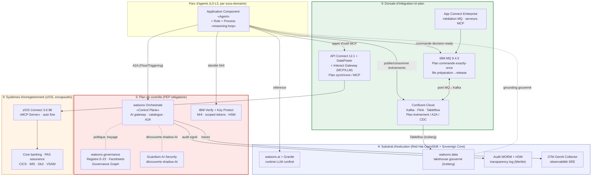
```mermaid
flowchart TB
    subgraph CP["① Plan de contrôle (PEP obligatoire)"]
        ORCH["watsonx Orchestrate<br/>«Control Plane»<br/>AI gateway · catalogue · A2A"]
        GOV["watsonx.governance<br/>Registre E-23 · Factsheets<br/>Governance Graph"]
        GUARD["Guardium AI Security<br/>découverte shadow-AI"]
        IDP["IBM Verify + Key Protect<br/>NHI · scoped tokens · HSM"]
    end

    subgraph AGENTS["Parc d'agents (L0-L3, par sous-domaine)"]
        AG["Application Component «Agent»<br/>+ Role + Process «reasoning loop»"]
    end

    subgraph BACKBONE["② Dorsale d'intégration tri-plan"]
        APIC["API Connect 12.1 + DataPower<br/>+ Interact Gateway (MCP/LLM)<br/>Plan synchrone / MCP"]
        MQ["IBM MQ 9.4.5<br/>Plan commande exactly-once<br/>file préparation→release"]
        CONF["Confluent Cloud<br/>Kafka · Flink · Tableflow<br/>Plan événement / A2A / CDC"]
        ACE["App Connect Enterprise<br/>médiation MQ · serveurs MCP"]
    end

    subgraph SOR["③ Systèmes d'enregistrement (z/OS, encapsulés)"]
        ZCONN["z/OS Connect 3.0.98<br/>«MCP Server» · autz fine"]
        CORE["Core banking · PAS assurance<br/>CICS · IMS · Db2 · VSAM"]
    end

    subgraph EXEC["④ Substrat d'exécution (Red Hat OpenShift + Sovereign Core)"]
        WXAI["watsonx.ai + Granite<br/>runtime LLM confiné"]
        WXDATA["watsonx.data<br/>lakehouse gouverné (Iceberg)"]
        AUDIT["Audit WORM + HSM<br/>transparency log (Merkle)"]
        OTEL["OTel GenAI Collector<br/>observabilité SRE"]
    end

    AG -->|"A2A (Flow/Triggering)"| ORCH
    ORCH -. "politique, traçage" .- GOV
    ORCH -. "découverte shadow-AI" .- GUARD
    AG -->|"appel d'outil MCP"| APIC
    AG -->|"commande decision-ready"| MQ
    AG -->|"publie/consomme événements"| CONF
    AG -->|"identité NHI"| IDP
    APIC --> ZCONN
    ACE --> MQ
    ZCONN --> CORE
    MQ <-->|"pont MQ↔Kafka"| CONF
    CONF -->|"Tableflow (Iceberg)"| WXDATA
    AG -->|"inférence"| WXAI
    AG -. "grounding gouverné" .- WXDATA
    ORCH -->|"traces"| OTEL
    ORCH -->|"audit signé"| AUDIT

    classDef cp fill:#fde7e7,stroke:#b3261e,stroke-width:2px;
    classDef bb fill:#e6f4ea,stroke:#1e7d34,stroke-width:2px;
    classDef sor fill:#fff4e5,stroke:#b06000,stroke-width:1px;
    classDef ex fill:#eef2ff,stroke:#3b4cca,stroke-width:1px;
    class CP cp;
    class BACKBONE bb;
    class SOR sor;
    class EXEC ex;
```

**Figure 2 — Vue de conteneurs (C4-L2).** Le plan de contrôle (rouge) est obligatoire et sans contournement (invariant 3) ; la dorsale (vert) sépare les trois plans d'interaction (§4) ; le legacy (orange) est encapsulé sans modification ; l'exécution (bleu) est confinée en zone Canada.

### 2.2 Principes d'architecture (invariants → règles vérifiables)

Les sept invariants (§1.3) se déclinent en principes d'architecture opposables, chacun assorti d'un test de conformité automatisable. Le tableau ci-dessous fixe la correspondance : l'invariant nomme le « pourquoi », le principe le « comment », le test la preuve.

| # | Principe | Test de conformité (automatisable) |
|---|---|---|
| P1 | Préparation/engagement séparés sur l'irréversible | Tout flux vers un rail à finalité immédiate passe par une file de proposition MQ avec release distincte ; analyse de couverture sur les *value streams* irréversibles |
| P2 | Double inscription des agents décisionnels | Tout `<<Agent>>` du registre Orchestrate possède une *Factsheet* E-23 ET une entrée au registre des tiers TIC ; jointure de réconciliation quotidienne |
| P3 | PEP sans contournement | Aucune route réseau agent→système d'enregistrement ne court-circuite Interact Gateway/API Connect ou MQ ; vérifié par NetworkPolicy + Guardium |
| P4 | Grounding sur schéma versionné | Tout message métier valide contre un schéma au Schema Registry/Data Contract ; rejet sur non-conformité |
| P5 | Séparation audit/observabilité | Deux puits distincts (WORM/HSM vs OTel) ; aucune purge sur le puits d'audit |
| P6 | Egress nul hors zone | DLP + filtrage egress ; 0 destination hors région Canada ; test périodique de fuite |
| P7 | Coutures ouvertes | Chaque couture (MCP, A2A, ISO 20022, OTel, poids, ArchiMate) a un export portable testé (cf. stratégie de sortie §16) |

### 2.3 Cartographie capacité → composant

Le découplage capacité/composant (Monographie ch.6 §6.3) garantit qu'un changement de produit ne déstabilise pas la capacité métier : c'est l'invariant *découplage* projeté sur le parc. Chaque capacité agentique transverse se réalise par un composant nommé, remplaçable par sa couture — l'évolution est inscrite dans la cartographie.

| Capacité agentique (Strategy) | Composant réalisant (Application/Technology) | Couture de remplacement |
|---|---|---|
| Orchestration gouvernée | watsonx Orchestrate | A2A 1.0 (Linux Foundation) |
| Registre & validation de modèle | watsonx.governance | FINOS AIGF v2.0 ; export Factsheet |
| Identité & accès agent | IBM Verify + Key Protect | OIDC/OAuth, RFC 8693 ; brokers tiers (Aembit/Astrix) |
| Exposition d'outil gouvernée | API Connect + Interact Gateway | MCP 2025-11-25 ; serveurs MCP portables |
| Commande assurée | IBM MQ | JMS/AMQP ; AMS |
| Coordination & réconciliation | Confluent (Kafka/Flink) | Apache Kafka/Flink ; USM |
| Grounding gouverné | watsonx.data + Schema Registry | Iceberg ; FIBO/ISO 20022 ouverts |
| Runtime d'inférence confiné | watsonx.ai + Granite | poids ouverts (portables hors IBM) |

---

## 3. Plan de contrôle agentique

**Principe.** Les quatre piliers du plan de contrôle — contrôle d'accès, registre de modèles, identité, audit — sont indissociables : les approvisionner en silos reproduit l'anti-patron de la « passerelle de coût » découplée du contrôle-modèle, interdit en finance. Les sous-sections décrivent chaque pilier sans re-justifier cette indissociabilité.

### 3.1 watsonx Orchestrate — control plane et AI gateway

À Think 2026 (5 mai 2026), IBM a reformulé watsonx Orchestrate en *agentic control plane* : déployer, gouverner et auditer des milliers d'agents de toute provenance sous politique cohérente (IBM, mai 2026). Trois rôles pour Boréalis :

- **AI gateway unifié** — point d'application de politique au niveau agent/LLM/A2A ; supervision, application des politiques, suivi de performance.
- **Catalogue gouverné** d'agents et d'outils, avec métriques — siège de la découverte gouvernée (*agent cards*).
- **Interopérabilité ouverte** — agents IBM natifs et agents de sources tierces, via les standards ouverts A2A (agent-à-agent) et l'import d'outils MCP ; l'interopérabilité avec des cadres comme Langflow/LangGraph est annoncée, à reconfirmer ⚠ (IBM, mai 2026). ⚠ Nuance de version : le support A2A du produit Orchestrate est documenté en **0.3.0**, alors que la spécification A2A est en 1.0 (Linux Foundation) — l'écart est à surveiller au moment d'engager l'interopérabilité inter-fournisseurs.

Capacités opérationnelles : observabilité et traçage des interactions, évaluation *build-time* et *runtime*, optimisation coût/performance. *Statut : next-gen en private preview ⚠ ; les fonctions agentiques de CP4I (AI Agents for CP4I) sont passées de la *technical preview* (16.1.3, jusqu'au 31 mars 2026) à la GA avec CP4I 16.2.0 LTS le 30 juin 2026.*

### 3.2 watsonx.governance — registre de modèles (E-23)

Deuxième pilier, celui de la qualification *modèle*. watsonx.governance fournit le registre de modèles, les *Factsheets* (« étiquettes nutritionnelles » des modèles), l'évaluation pré-déploiement, le monitoring de dérive/biais et les workflows d'approbation (IBM). Trois capacités décisives :

- **Governance Graph** : carte vivante du parc IA reliant actifs → politiques → risques → exigences réglementaires — la matérialisation de la chaîne de traçabilité verticale exigence→contrôle→élément (IBM, 2026).
- **Agent Monitoring and Insights** (⚠ *technical preview*, Q1 2026) : suivi temps réel des décisions, comportements et performances d'agents en production, avec alertes de seuil ; types d'objet *AI Agent* et risques agentiques au *Risk Atlas* depuis juillet 2025 (IBM).
- **Bibliothèque réglementaire** (200+ cadres) avec accélérateurs EU AI Act, ISO/IEC 42001, NIST AI RMF ; gouvernance des modèles tiers (Bedrock, Azure, OpenAI) ; déploiement sur site ou en nuage (IBM). IBM est nommé *Leader* au Gartner Magic Quadrant des plateformes de gouvernance IA (publié le 17 juin 2026).

Couplage obligatoire : *si l'agent décide, c'est un modèle* — inscrit au registre dès sa conception, avec dossier de validation, tests d'injection de prompt, mesure de variance et suivi de dérive quasi quotidien.

### 3.3 Guardium AI Security — découverte et sécurité

Intégré à watsonx.governance, IBM Guardium AI Security découvre les déploiements IA (modèles, données, applications), identifie les agents/MCP non déclarés (*shadow AI*) et fournit la posture de sécurité pour la gouvernance du risque-modèle (IBM ; GA mai 2025) — le filet anti-prolifération contre l'*agent sprawl* (cf. Monographie ch.4 §4.1).

### 3.4 Identité d'agent — KYA / NHI / KYH

Quatrième pilier — l'identité — par ses trois questions liées : KYA (quel agent agit), NHI (l'identité non humaine qui le porte), KYH (le propriétaire humain qui en répond). L'identité sous laquelle un agent agit est une NHI, portée par le composant qui l'incarne et rattachée à un propriétaire humain responsable qui restaure l'imputabilité. Trois mécanismes :

- **IdP & jetons** : IBM Verify (OAuth/OIDC) émet des identités d'agent ; jetons à portée restreinte (*scoped tokens*), courts, émis par session ; délégation bornée et révocable (RFC 8693).
- **Secrets & cryptographie** : IBM Key Protect, adossé à un HSM FIPS 140-2 niveau 3 ; signature de la piste d'audit.
- **Attribution** : chaque action distingue dans le journal l'origine humaine de l'origine agent.

*Alternative best-of-breed (à la marge, si la maturité l'exige) :* Aembit (broker *secretless*, jetons par session, identité mixte agent+humain), Astrix (Agent Control Plane, découverte multi-méthode), Silverfort (passerelle MCP en ligne, corrélation session-agent→humain). L'OWASP Non-Human Identity Top 10 (éd. 2025, publié déc. 2024) fournit le référentiel de risques (mappé en §6.4).

### 3.5 Audit infalsifiable vs observabilité — deux piliers distincts

| Dimension | Audit réglementaire (opposable) | Observabilité d'exploitation (SRE) |
|---|---|---|
| Finalité | Examen prudentiel, e-discovery | Latence, coût/jeton, dérive, débogage |
| Mécanisme | Signature HSM, WORM, transparency log *append-only*, chaînage Merkle | OpenTelemetry GenAI, tableaux de bord |
| Rétention | Pluriannuelle, infalsifiable | Courte, purgeable |
| Outil IBM | Db2/objet WORM + Key Protect/HSM | watsonx Orchestrate observability + OTel GenAI |

⚠ Les conventions sémantiques OTel GenAI restent expérimentales (GenAI SIG, depuis avr. 2024). Un journal d'exploitation purgé ne tient jamais lieu de piste d'audit réglementaire : objets, rétentions et zones séparés.

### 3.6 Architecture d'identité non humaine (NHI) — vue détaillée

Cette séparation des puits suppose des actions imputables à une identité ; c'est l'objet du pivot NHI, dont la figure 3 détaille la mécanique (invariant 3) : l'émission et l'usage d'un jeton à portée restreinte — un laissez-passer temporaire qui n'ouvre que les portes prévues et expire vite —, avec délégation RFC 8693 et restauration KYH. Trois propriétés sont load-bearing : (a) le jeton est **éphémère et par session** (révocable, non rejouable) ; (b) son *scope* est **borné à la surface d'outils déclarée** (moindre privilège) ; (c) toute action porte l'**empreinte du propriétaire humain** (KYH) en plus de l'identité agent.

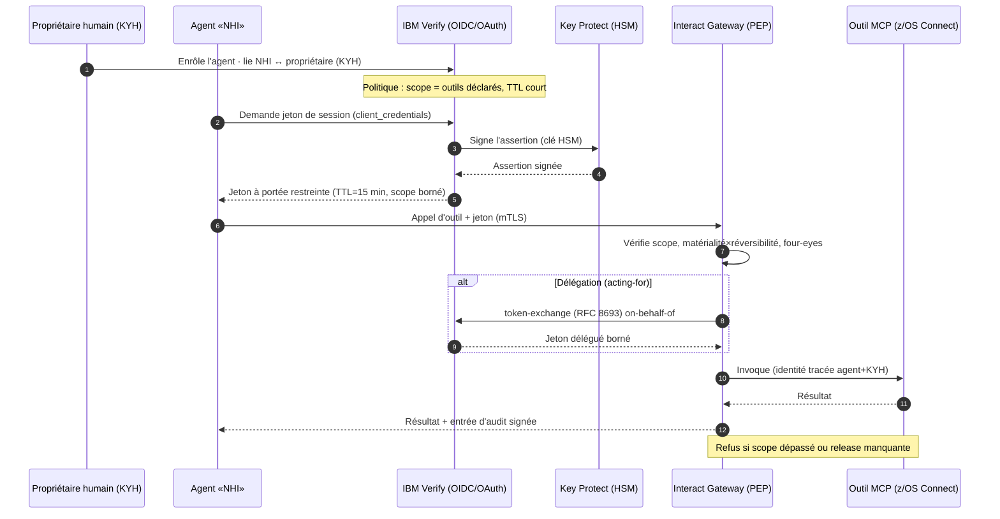
```mermaid
sequenceDiagram
    autonumber
    participant H as Propriétaire humain (KYH)
    participant AG as Agent «NHI»
    participant V as IBM Verify (OIDC/OAuth)
    participant KP as Key Protect (HSM)
    participant PEP as Interact Gateway (PEP)
    participant TOOL as Outil MCP (z/OS Connect)

    H->>V: Enrôle l'agent · lie NHI ↔ propriétaire (KYH)
    Note over V: Politique : scope = outils déclarés, TTL court
    AG->>V: Demande jeton de session (client_credentials)
    V->>KP: Signe l'assertion (clé HSM)
    KP-->>V: Assertion signée
    V-->>AG: Jeton à portée restreinte (TTL=15 min, scope borné)
    AG->>PEP: Appel d'outil + jeton (mTLS)
    PEP->>PEP: Vérifie scope, matérialité×réversibilité, four-eyes
    alt Délégation (acting-for)
        PEP->>V: token-exchange (RFC 8693) on-behalf-of
        V-->>PEP: Jeton délégué borné
    end
    PEP->>TOOL: Invoque (identité tracée agent+KYH)
    TOOL-->>PEP: Résultat
    PEP-->>AG: Résultat + entrée d'audit signée
    Note over PEP,TOOL: Refus si scope dépassé ou release manquante
```

**Figure 3 — Émission et usage d'un jeton NHI (KYA/NHI/KYH).** La délégation passe exclusivement par *token-exchange* (RFC 8693) ; aucun secret long terme n'est porté par l'agent (posture *secretless*).

Extrait illustratif — politique de jeton à portée restreinte (revendications à durcir) :

```json
{
  "sub": "nhi:agent:souscription-vie-01",
  "owner_kyh": "human:underwriting-lead:jtremblay@borealis.ca",
  "scope": ["mcp:pas.quote.read", "mcp:pas.proposal.prepare"],
  "deny": ["mcp:pas.proposal.commit"],
  "autonomy_level": "L1",
  "materiality": "high",
  "reversibility": "low",
  "exp": 900,
  "aud": "interact-gateway.borealis.ca-central",
  "cnf": { "x5t#S256": "<empreinte cert mTLS>" }
}
```

> Lecture : l'agent de souscription (L1) peut *préparer* une proposition mais le *commit* est refusé (`deny`) — la release reste humaine (invariant 1). Les attributs `autonomy_level/materiality/reversibility` sont la projection runtime des *Profiles* ArchiMate (§13).

### 3.7 Pipeline d'audit infalsifiable

Le *pourquoi* de la séparation des deux puits est acquis (§3.5) ; la figure 4 en montre le *comment* structurel (invariant 5). Le collecteur OTel diffuse vers l'observabilité SRE (purgeable) ; en parallèle, chaque événement engageant est **signé HSM**, chaîné par *Merkle* et scellé en WORM — sur un support qu'on ne peut ni modifier ni effacer —, produisant une piste opposable à rétention pluriannuelle, indépendante du puits.

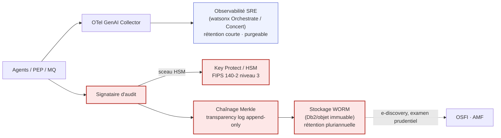
```mermaid
flowchart LR
    AG["Agents / PEP / MQ"] --> COL["OTel GenAI Collector"]
    COL --> SRE["Observabilité SRE<br/>(watsonx Orchestrate / Concert)<br/>rétention courte · purgeable"]
    AG --> SIGN["Signataire d'audit"]
    SIGN -->|"sceau HSM"| KP["Key Protect / HSM<br/>FIPS 140-2 niveau 3"]
    SIGN --> MERK["Chaînage Merkle<br/>transparency log append-only"]
    MERK --> WORM["Stockage WORM<br/>(Db2/objet immuable)<br/>rétention pluriannuelle"]
    WORM -.->|"e-discovery, examen prudentiel"| REG["OSFI · AMF"]

    classDef sre fill:#eef2ff,stroke:#3b4cca;
    classDef aud fill:#fde7e7,stroke:#b3261e,stroke-width:2px;
    class SRE sre;
    class SIGN,KP,MERK,WORM aud;
```

**Figure 4 — Double puits audit/observabilité.** Le chemin rouge (audit opposable) ne partage ni stockage ni rétention avec le chemin bleu (SRE) ; une purge SRE n'altère jamais la piste réglementaire.

---

## 4. Dorsale d'intégration tri-plan (cœur de l'architecture)

### 4.0 Principe directeur — trois plans d'interaction

L'erreur de conception la plus coûteuse en intégration agentique régulée est de router toutes les interactions sur un même substrat. La discipline : **séparer trois plans** et affecter chaque interaction au substrat dont les garanties répondent à sa criticité :

- **Plan synchrone / requête-réponse** : interroger ou lire un système d'enregistrement → **API Connect / DataPower** (REST, GraphQL, gRPC) ; **z/OS Connect** pour le mainframe.
- **Plan commande / transaction assurée** : engagement fiable, livraison *exactly-once*, handoff préparation→release sur l'irréversible → **IBM MQ**.
- **Plan événement / coordination / analytique** : pub/sub, fan-out, traitement de flux, réconciliation continue, CDC → **Confluent Cloud (Kafka/Flink)**.

Deux plans agentiques se superposent : **MCP** (agent→outil) gouverné par DataPower Interact Gateway / API Connect, et **A2A** (agent→agent) gouverné par watsonx Orchestrate et transporté sur les topics Confluent.

### 4.1 API Management — IBM API Connect 12.1 + DataPower

API Connect est le **point d'application de politique de la couche API** : toute capacité exposée à un agent comme outil est d'abord une API gérée, productisée et gouvernée. La **v12.1 (12.1.0)** converge l'expertise IBM et le portefeuille de gestion d'API de Software AG (webMethods) en une fondation hybride unique (IBM, déc. 2025 ; correctif 12.1.0.3 le 8 mai 2026) ; IBM est *Leader* du Gartner Magic Quadrant Gestion d'API pour la 10e fois.

**Composants déployés pour Boréalis.**

- **API Manager** — cycle de vie complet : productiser les API en produits avec plans, abonnements et identifiants d'application (le pendant des *scoped credentials* d'agent), versionnage, contrôle d'accès, promotion entre environnements. Publie aussi les *actifs IA* : outils et serveurs MCP, fournisseurs LLM enregistrés (IBM, mai 2026).
- **DataPower Gateway** — passerelle de sécurité d'entreprise : OAuth 2.0/OIDC, JWT, mTLS, validation de schéma, rate limiting, quotas, sécurité de la charge utile, DLP et filtrage egress. Le renouvellement **DataPower Gateway X4 + firmware v11.0** est sorti le 26 mars 2026 (IBM).
- **DataPower Nano Gateway** — passerelle ultra-légère au niveau du produit d'API, démarrage rapide, isolation de panne, mise à l'échelle fine ; enforcement au plus près du service (IBM, nov. 2025).
- **DataPower Interact Gateway** (bâti sur la Nano Gateway) — la pièce agentique décisive : gouvernance centralisée des interactions entre applications, agents, modèles et services IA. Il fournit (IBM, mai 2026) :
    - une **MCP Gateway** convertissant les API d'entreprise en outils MCP-conformes que les agents découvrent et invoquent ;
    - une **LLM Gateway** enregistrant les fournisseurs LLM pour un accès gouverné ;
    - un **tableau de bord d'usage IA** (Analytics) pour suivre la consommation MCP/LLM et les coûts.
- **Developer Portal** — rend les actifs IA publiés (outils/serveurs MCP, fournisseurs LLM) découvrables et souscriptibles par les développeurs *et les agents*.
- **API Studio + API Agent** — authoring assisté par IA (serveurs MCP générés à partir d'API publiées, génération de politiques, tests), tout-en-code, CI/CD et traçabilité Git ; s'appuie sur un modèle Granite sur watsonx (Granite 3 à l'annonce de nov.-déc. 2025 ; génération courante **Granite 4.1**, poids ouverts Apache 2.0) (IBM, 2025-2026).
- **Federated API Gateway** — visibilité et gouvernance cohérentes des API où qu'elles tournent (hybride/multi-cloud).

**Rôle dans le patron agentique.** API Connect + DataPower Interact Gateway forment le **PEP de la couche API/MCP/LLM**, complémentaire du PEP de la couche agent/A2A (watsonx Orchestrate). Tout appel d'outil MCP traverse une API gérée — héritant authentification, quotas, DLP et audit. Le périmètre d'exposition est *explicite* (une API/outil par capacité bornée), matérialisant la surface de délégation (cf. Monographie ch.6 §6.1.3).

**Protocoles** : HTTP, REST, GraphQL, gRPC, WebSockets, MQTT et MCP (IBM/AWS Marketplace, 2026).

⚠ **Limite d'architecture à tenir.** API Connect **ne se connecte pas nativement à IBM MQ** ; toute médiation MQ passe par App Connect (ACE), non par une extension custom (retour praticien documenté, 2026). La résidence du SaaS API Connect est offerte en US/EU ; pour Boréalis, déployer **on-prem via CP4I** pour domicilier au Canada (décision en ADR-003/004 ; mécanisme en §7.2).

**Posture iPaaS hybride.** Aucune plateforme d'intégration distincte n'est introduite pour aligner l'ADS sur la monographie v2 : la fondation d'intégration hybride de Boréalis demeure la posture **webMethods Hybrid Integration** (iPaaS issu de l'acquisition de Software AG par IBM, clôturée le 1ᵉʳ juillet 2024), dont les deux facettes sont déjà matérialisées dans la pile — la **gestion d'API** par la convergence consolidée sur API Connect (cf. début de §4.1) et les **flux d'intégration** par App Connect Enterprise (ACE), seul moteur de médiation du site (cf. §4.4). Au-dessus de l'authoring d'API (API Studio + API Agent, cf. §4.1), l'authoring d'intégration *par intention* s'appuie sur un **Integration Agent** — assistant d'authoring assisté par IA qui synthétise flux et connecteurs à partir d'une intention déclarée, plutôt que par câblage manuel. Livré dans webMethods Hybrid Integration (juin 2026), il expose désormais les workflows d'intégration en GA comme outils MCP ; l'authoring par intention le plus récent reste à confirmer ⚠ (IBM, 2026). L'invariant tient sans exception : tout artefact ainsi généré demeure un objet gouverné, soumis au PEP de la couche API/MCP/LLM et promu exclusivement par le pipeline GitOps (§14.2) — aucun chemin d'application hors politique, aucune promotion hors Git (cf. Monographie ch.4 §4.2.2).

### 4.2 Event Mesh — Confluent Cloud

Confluent Cloud est le **maillage d'événements** : bus A2A asynchrone, moteur de réconciliation continue et pont temps réel entre événements du mainframe et agents. Le moteur cloud-native KORA porte les topics Kafka (mise à l'échelle élastique, sécurité, traitement de flux, gouvernance) (Confluent, 2026). IBM a finalisé l'acquisition de Confluent (annoncée déc. 2025, clôturée 17 mars 2026) et présenté à Think 2026 **IBM Data Gate for Confluent**, qui diffuse les données transactionnelles d'IBM Z vers Confluent (IBM, mai 2026) ⚠.

**Composants déployés pour Boréalis.**

- **Topics Kafka (KORA)** — substrat des échanges A2A (Flow/Triggering), des événements métier et de la diffusion pub/sub vers de multiples consommateurs (analytique, fraude, conformité).
- **Confluent Cloud for Apache Flink** (serverless, GA) — traitement de flux : filtrer, joindre, enrichir ; réconciliation quasi-temps réel sur des rails qui règlent en continu, signaux de fraude, agrégats glissants en SQL (Confluent, 2026).
- **Stream Governance** — Schema Registry, **Data Contracts**, Stream Catalog, Stream Lineage, Data Portal : le pilier *contrat* — les schémas (ISO 20022, ACORD) deviennent des contrats de données opposables ; la lignée alimente la traçabilité (Confluent, 2026).
- **Tableflow** — matérialise les topics Kafka en tables Apache Iceberg/Delta d'un clic, alimentant le lakehouse (watsonx.data) ; DLQ, CSFLE, espaces de noms métier (Confluent, 2026).
- **Connecteurs** — **IBM MQ Source connector** entièrement managé (lit MQ → topic Kafka, livraison au moins une fois) ; connecteurs CDC Debezium (Db2, PostgreSQL, etc.) pour capter les changements du système d'enregistrement (Confluent, 2026).
- **Real-Time Context Engine** — expose des topics Kafka gouvernés *comme outils* via un serveur MCP entièrement managé : les agents/LLM interrogent les données fraîches en faible latence, sans duplication ni ETL (Confluent, GA mai 2026) — le grounding agentique sur l'Event Mesh.
- **Streaming Agents** (GA, lancement Q2 2026 ; support A2A plus récent) — agents définis avec modèles/prompts/outils dans Flink, les outils étant des UDF ou des outils de serveur MCP (Confluent, mai 2026).
- **Unified Stream Manager (USM)** — relie des grappes Confluent Platform auto-gérées à Confluent Cloud pour une gouvernance, observabilité et lignée unifiées où qu'elles résident (Confluent, 2026) — clé pour un déploiement hybride/résident.
- **Snapshot Queries** — vue point-dans-le-temps combinant Tableflow (Iceberg) et Kafka temps réel pour les audits de conformité à la demande (Confluent, 2026).

**Rôle dans le patron agentique.** Le message A2A reste un *Flow* applicatif gouverné par watsonx Orchestrate ; Confluent le transporte sans s'y substituer. Le CDC mainframe (CICS/IMS/Db2/VSAM/MQ) alimente les agents en événements frais — IBM Data Gate for Confluent diffuse les données d'IBM Z par capture *log-based* sur Db2 for z/OS (~96 % éligible zIIP, faible surcoût CPU) (IBM, mai 2026).

⚠ **Résidence.** Confluent Cloud est un SaaS opéré sur des régions d'hyperscalers. Pour Boréalis : grappe dédiée en région **Canada (ca-central)**, réseau privé (PrivateLink), chiffrement BYOK et CSFLE ; ou Confluent Platform on-prem/Z gouverné via USM (décision en ADR-003/004 ; mécanisme en §7.2). La dépendance à un CTPP supervisé (l'hyperscaler sous-jacent) s'inscrit au registre des tiers TIC.

### 4.3 Messagerie — IBM MQ 9.4.5

IBM MQ est le **plan de commande transactionnelle** : la dorsale de livraison assurée *exactly-once* pour les opérations qui touchent les systèmes d'enregistrement. Là où Confluent porte coordination et analytique, MQ porte l'intégrité transactionnelle et le handoff préparation→release. Version courante **9.4.5** (Continuous Delivery, GA 5 février 2026 ; LTS 9.4.0 depuis le 18 juin 2024) (IBM, 2026).

**Pourquoi MQ et non Kafka pour ce plan.** MQ délivre une livraison assurée *exactly-once* — le message passe une fois et une seule, jamais zéro, jamais deux —, point-à-point/requête-réponse, ordonnée et transactionnelle (XA), consommé puis retiré ; selon IBM, il serait le seul fournisseur à offrir un chiffrement de bout en bout vrai pour la confidentialité et l'intégrité des messages (IBM, 2024). Kafka, lui, est un journal d'événements rejouable et retenu, multi-consommateurs, optimisé pour le fan-out et le traitement de flux. Règle de Boréalis : **commande engageante vers un système d'enregistrement → MQ ; événement de coordination/analytique → Confluent.**

**Capacités déployées pour Boréalis.**

- **Queue managers** sur IBM MQ for z/OS (intégration native CICS/IMS/Db2) et sur conteneurs via l'**IBM MQ Operator** (Red Hat OpenShift) (IBM, 2026).
- **Native HA** (trois nœuds, réplication synchrone, RPO zéro, bascule automatique) et **Cross-Region Replication** (CRR, réplication asynchrone, RPO proche de zéro, bascule régionale manuelle) pour la reprise après sinistre (IBM, 2025-2026).
- **Uniform Clusters** — équilibrage intelligent de charge, rééquilibrage multi-connexion JMS sans interruption (IBM, 2026).
- **Sécurité** — authentification par jeton (sans mot de passe), chiffrement de bout en bout, Advanced Message Security (AMS) ; chiffrement du heartbeat HA/DR (RDQM) en 9.4.5 (IBM, 2026).
- **Pont MQ ↔ Kafka** — connecteurs Kafka Connect source/sink pour MQ, à livraison assurée *once-and-only-once / exactly-once* (depuis 9.3.4) ; MQ on z/OS peut exposer des événements vers Kafka (IBM, 2023-2026). Combiné au connecteur IBM MQ Source de Confluent, il noue les plans transaction et événement.
- **Serveur MCP pour MQ** — expose la santé des queue managers et les commandes MQSC aux clients MCP (dépôt IBM/mcp, 2026), pour l'observabilité agentique de la messagerie.
- **MFT (Managed File Transfer)** pour les transferts de fichiers gouvernés (batch assurance, échanges inter-organisations).

**Rôle dans le patron irréversibilité (§1.3, invariant 1).** L'agent prépare une transaction « decision-ready » et la dépose sur une file ; un humain (ou un contrôle déterministe calibré) la *release* ; MQ garantit la livraison *exactly-once* au système d'enregistrement, avec piste d'audit reliant proposition et autorisation. La file est le point structurel de la séparation préparation/engagement.

#### 4.3.1 Échanges inter-organisations B2B/EDI (gouvernés)

Boréalis est une institution financière multi-sous-domaines : ses flux ne s'arrêtent pas à la frontière de l'entreprise, mais s'étendent aux réseaux d'assurance, aux bureaux de crédit et aux contreparties B2B — les `PARTNERS` de la figure 1 (§1.6, vue de contexte). Ces échanges relèvent d'un protocole d'entreprise distinct du transit interne MQ : **IBM webMethods B2B Integration** porte l'EDI (EDIFACT, X12), l'AS2 et le SFTP gouvernés vers les partenaires externes, là où le MFT cité en §4.3 reste la capacité de transfert de fichiers *intra-zone* adossée à MQ. Les deux s'articulent — webMethods B2B expose le pont externe, MFT achemine en interne — sans se dupliquer. Ce choix prolonge la lignée webMethods déjà retenue pour la couche API (convergence de la gestion d'API dans API Connect 12.1, §4.1), plutôt que d'introduire un produit B2B distinct.

Le **B2B Agent** (assistant d'onboarding et de mappage de partenaires assisté par IA, intégré à webMethods B2B Integration) accélère l'enrôlement d'une contrepartie : à partir de l'intention exprimée, il interprète l'objectif, construit un plan, puis propose le mappage des documents et la configuration d'échange. Son périmètre, dans l'architecture de Boréalis, s'arrête à la *préparation*. ⚠ Le B2B Agent relève des fonctions récentes de la lignée webMethods Hybrid Integration (authoring par intention ; gestion d'actifs et trace de raisonnement ajoutées en avr. 2026) ; version et statut à fixer au moment du déploiement, à ne pas présenter comme acquis pour l'engagement inter-organisation.

Deux invariants encadrent ces flux. **Résidence** : tout échange B2B entrant ou sortant demeure sous frontière de résidence, à egress nul hors zone Canada (§6.5) — le pont avec un partenaire externe n'ouvre aucun chemin sortant non gouverné. **Imputabilité** : toute contrepartie est inscrite au registre des tiers TIC (B-10) ; l'agent prépare le mappage, mais l'engagement inter-organisation irréversible reste soumis à *release* (§1.3, invariant 1). L'EDI et le B2B agentiques sont traités dans la monographie (cf. Monographie ch.4 §4.2.5) ; la séparation préparation/engagement appliquée aux engagements agentiques inter-organisations — mandats signés, non-répudiation — relève de la monographie ch.4 §4.10.2.

### 4.4 Encapsulation héritée — z/OS Connect + App Connect (ACE)

- **z/OS Connect 3.0.98** expose les opérations OpenAPI 3 du cœur z/OS (CICS, IMS, batch, Db2) comme **outils MCP**, avec **autorisation fine au niveau opération** et observabilité OpenTelemetry (IBM, oct. 2025). Le patron : *l'IA interprète l'intention, z/OS Connect gouverne l'accès, MCP standardise la découverte, IBM Z exécute la logique de confiance, sans nouveau chemin d'accès* (IBM, 2026). L'adaptateur MCP se déploie sur le nœud légataire sans toucher au matériel d'origine.
- **App Connect Enterprise (ACE)** — flux d'intégration et médiation (dont la médiation MQ qu'API Connect ne fait pas nativement) ; crée des serveurs MCP à partir d'instances App Connect Dashboard (13.0.6.1+) (IBM, 2026).

**Encapsuler n'est pas moderniser.** Les deux puces ci-dessus *encapsulent* : z/OS Connect et ACE exposent le cœur z/OS en MCP/API sans en altérer une ligne — c'est le principe d'encapsulation non disruptive (§1.2) et le périmètre propre de cette section. *Moderniser* est une opération distincte : transformer le code COBOL/PL-I lui-même (explication, refactorisation, génération assistée). Cette voie relève d'**IBM watsonx Code Assistant for Z** (v2.8 de base en déc. 2025 ; expérience agentique — outils MCP — officialisée par l'annonce du 2 mars 2026), sur une trajectoire z/OS 3.2 (GA 30 sept. 2025 ; z/OS Data Gatherer émetteur OpenTelemetry). La règle de gouvernance reste inchangée : la modernisation du code est un changement gouverné dont l'irréversible — la mise en production d'un module transformé — préserve la **release humaine** au titre de l'invariant 1 (§1.3). L'agent *prépare* la transformation (analyse, proposition de refactorisation, tests générés) ; un humain *l'engage*. On encapsule en continu et sans arrêt ; on modernise par paliers gouvernés (cf. Monographie ch.4 §4.2.4).

### 4.5 Règle de décision de substrat (synthèse)

| Type d'interaction | Substrat | Produit IBM / stratégique | Garantie clé |
|---|---|---|---|
| Lecture/requête synchrone système d'enregistrement | API | API Connect / DataPower ; z/OS Connect (mainframe) | OAuth/mTLS, quotas, schéma |
| Commande transactionnelle engageante | Messagerie | IBM MQ | Livraison assurée *exactly-once*, ordonnée |
| Handoff préparation → release sur l'irréversible | Messagerie | IBM MQ (file de proposition) | Séparation structurelle, audit |
| Événement, pub/sub, fan-out, coordination | Event Mesh | Confluent Cloud (Kafka) | Rejouable, multi-consommateurs |
| Traitement de flux, réconciliation continue, CDC | Event Mesh | Confluent Cloud (Flink, connecteurs) | Faible latence, *stateful* |
| Invocation d'outil par agent | MCP | DataPower Interact Gateway / API Connect ; z/OS Connect ; Confluent Context Engine | Identité, permissions, audit, metering |
| Collaboration agent ↔ agent | A2A | watsonx Orchestrate (transport Confluent) | Politique cohérente, traçage |

### 4.6 Vue de la dorsale tri-plan

La figure 5 superpose les trois plans de substrat et les deux plans agentiques. L'arbre de décision encadré (à droite) est la règle d'aiguillage opposable : il interdit de router une commande irréversible sur Kafka ou un fan-out analytique sur MQ.

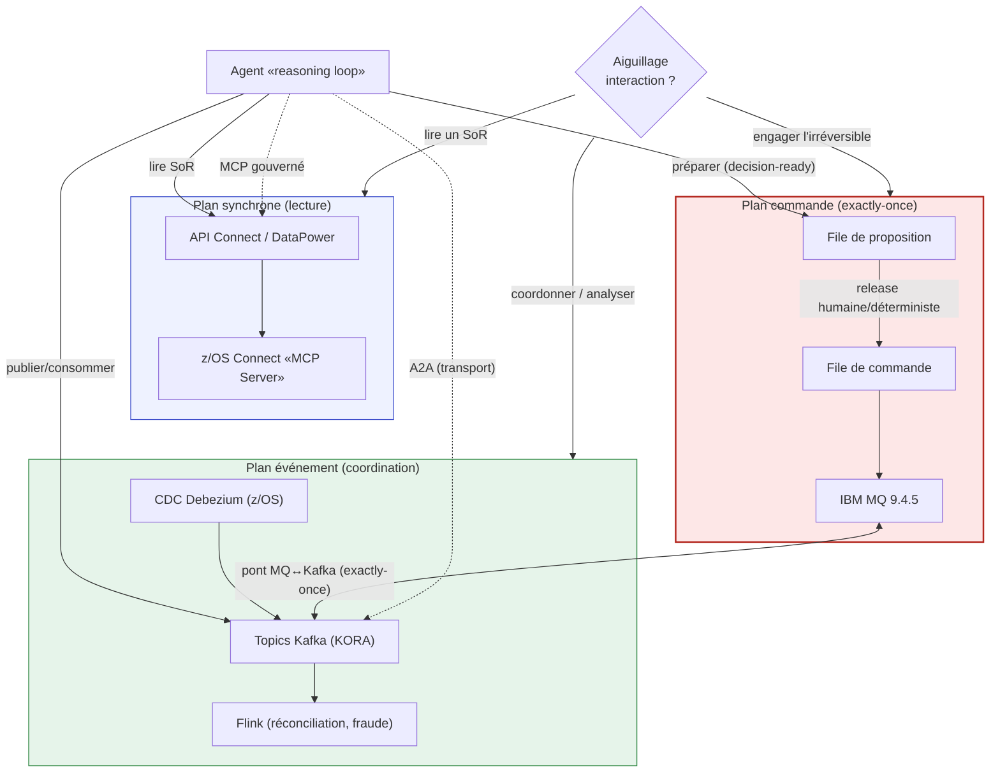
```mermaid
flowchart TB
    AG["Agent «reasoning loop»"]

    subgraph SYNC["Plan synchrone (lecture)"]
        APIC["API Connect / DataPower"]
        ZC["z/OS Connect «MCP Server»"]
    end
    subgraph CMD["Plan commande (exactly-once)"]
        QPROP["File de proposition"]
        QCMD["File de commande"]
        MQ["IBM MQ 9.4.5"]
    end
    subgraph EVT["Plan événement (coordination)"]
        TOPIC["Topics Kafka (KORA)"]
        FLINK["Flink (réconciliation, fraude)"]
        CDC["CDC Debezium (z/OS)"]
    end

    AG -->|"lire SoR"| APIC --> ZC
    AG -->|"préparer (decision-ready)"| QPROP
    QPROP -->|"release humaine/déterministe"| QCMD --> MQ
    AG -->|"publier/consommer"| TOPIC
    TOPIC --> FLINK
    CDC --> TOPIC
    MQ <-->|"pont MQ↔Kafka (exactly-once)"| TOPIC
    AG -.->|"MCP gouverné"| APIC
    AG -.->|"A2A (transport)"| TOPIC

    DEC{"Aiguillage<br/>interaction ?"}
    DEC -->|"lire un SoR"| SYNC
    DEC -->|"engager l'irréversible"| CMD
    DEC -->|"coordonner / analyser"| EVT

    classDef s fill:#eef2ff,stroke:#3b4cca;
    classDef c fill:#fde7e7,stroke:#b3261e,stroke-width:2px;
    classDef e fill:#e6f4ea,stroke:#1e7d34;
    class SYNC s;
    class CMD c;
    class EVT e;
```

**Figure 5 — Dorsale tri-plan et arbre d'aiguillage.** Le pont MQ↔Kafka relie commande et événement sans les confondre (ADR-002). La file de proposition (rouge) est le point structurel de la séparation préparation/engagement.

### 4.7 Contrats d'interface (extraits illustratifs)

Le découplage par contrat (fil conducteur) impose que chaque couture soit une *spec versionnée*. Les extraits ci-dessous fixent la forme des contrats, non des valeurs de production.

**(a) Manifeste d'outil MCP** — une capacité z/OS exposée comme outil gouverné (une opération = un outil borné, cf. §4.1) :

```json
{
  "name": "pas.quote.read",
  "version": "1.3.0",
  "description": "Lecture d'une cotation d'assurance vie (lecture seule, sans effet).",
  "server": "zos-connect.borealis.ca-central",
  "annotations": { "readOnlyHint": true, "destructiveHint": false },
  "inputSchema": {
    "type": "object",
    "required": ["policyId"],
    "properties": { "policyId": { "type": "string", "pattern": "^PV[0-9]{10}$" } }
  },
  "x-governance": {
    "owner_capability": "Évaluer le risque de souscription",
    "classification": "PII-restricted",
    "residency": "ca-central-only",
    "scopes_required": ["mcp:pas.quote.read"]
  }
}
```

**(b) Produit API Connect** — le plan d'abonnement porte quotas et *scope* (extrait OpenAPI + extension de produit) :

```yaml
product: 1.0.0
info: { name: pas-souscription, version: 1.3.0 }
plans:
  agent-l1-preparateur:
    rate-limits: { default: { value: 50, period: 1, unit: second } }
    quotas:      { default: { value: 50000, period: 1, unit: day } }
    approval: true            # souscription d'agent approuvée (gouvernance)
    scopes: [ "mcp:pas.quote.read", "mcp:pas.proposal.prepare" ]
apis:
  pas-souscription-1.3.0: { $ref: pas-souscription.yaml }
gateways: [ datapower-interact-gateway ]   # PEP : OAuth, mTLS, DLP, schéma
```

**(c) Contrat d'événement (AsyncAPI, ancré ISO 20022)** — un événement de paiement publié sur Confluent, dont le *payload* valide contre un schéma enregistré :

```yaml
asyncapi: 3.0.0
info: { title: borealis.payments, version: 2.1.0 }
channels:
  payment.instruction.prepared:
    address: borealis.payments.instruction.prepared
    messages:
      pain001Prepared:
        contentType: application/json
        payload:
          schemaFormat: application/vnd.apache.avro+json
          schema: { $ref: "schema-registry://iso20022.pain001.v9" }   # Data Contract
operations:
  publishPrepared:
    action: send
    channel: { $ref: '#/channels/payment.instruction.prepared' }
    bindings: { kafka: { groupId: agent-paiement, acks: all } }
```

**(d) Files MQ (MQSC)** — la séparation préparation/engagement matérialisée par deux files + AMS :

```mqsc
DEFINE QLOCAL('PAY.PROPOSAL.Q')  DESCR('Propositions decision-ready (L1)') +
       DEFPSIST(YES) MAXDEPTH(50000) BOTHRESH(3) BOQNAME('PAY.PROPOSAL.BOQ')
DEFINE QLOCAL('PAY.COMMAND.Q')   DESCR('Commandes released (exactly-once)') +
       DEFPSIST(YES) MAXDEPTH(50000)
* Advanced Message Security : confidentialité + intégrité de bout en bout
SET POLICY('PAY.COMMAND.Q') SIGNALG(SHA256) ENCALG(AES256) +
       RECIP('CN=core-banking,O=Borealis') ENFORCE(YES)
```

**(e) Connecteur Confluent — IBM MQ Source** (pont MQ→Kafka, lecture des événements de commande pour réconciliation) :

```json
{
  "name": "mq-source-payments",
  "config": {
    "connector.class": "io.confluent.connect.ibm.mq.IbmMQSourceConnector",
    "kafka.topic": "borealis.payments.command.committed",
    "mq.queue.manager": "QMHA", "mq.queue": "PAY.COMMAND.AUDIT.Q",
    "mq.transport.type": "client", "mq.ssl.cipher.suite": "TLS_AES_256_GCM_SHA384",
    "value.converter": "io.confluent.connect.avro.AvroConverter",
    "confluent.topic.replication.factor": "3"
  }
}
```

### 4.8 Flux d'interaction — séquences canoniques

Les contrats fixent la forme statique des coutures ; les séquences montrent leur enchaînement à l'exécution.

**Appel d'outil MCP gouverné (figure 6).** Tout appel hérite, en un seul passage, de l'authentification NHI, de l'autorisation matérialité×réversibilité, du DLP/egress et de l'audit signé. Le refus est la voie par défaut si une garantie manque.

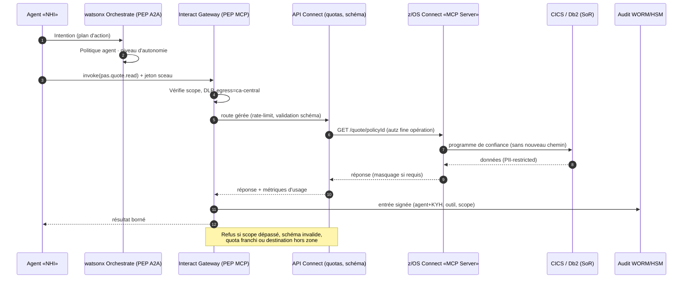
```mermaid
sequenceDiagram
    autonumber
    participant AG as Agent «NHI»
    participant ORCH as watsonx Orchestrate (PEP A2A)
    participant IGW as Interact Gateway (PEP MCP)
    participant APIC as API Connect (quotas, schéma)
    participant ZC as z/OS Connect «MCP Server»
    participant CICS as CICS / Db2 (SoR)
    participant AUD as Audit WORM/HSM

    AG->>ORCH: Intention (plan d'action)
    ORCH->>ORCH: Politique agent · niveau d'autonomie
    AG->>IGW: invoke(pas.quote.read) + jeton sceau
    IGW->>IGW: Vérifie scope, DLP, egress=ca-central
    IGW->>APIC: route gérée (rate-limit, validation schéma)
    APIC->>ZC: GET /quote/policyId (autz fine opération)
    ZC->>CICS: programme de confiance (sans nouveau chemin)
    CICS-->>ZC: données (PII-restricted)
    ZC-->>APIC: réponse (masquage si requis)
    APIC-->>IGW: réponse + métriques d'usage
    IGW->>AUD: entrée signée (agent+KYH, outil, scope)
    IGW-->>AG: résultat borné
    Note over IGW,APIC: Refus si scope dépassé, schéma invalide,<br/>quota franchi ou destination hors zone
```

**Figure 6 — Appel d'outil MCP gouverné.** Deux PEP en série : couche agent/A2A (Orchestrate) puis couche API/MCP (Interact Gateway + API Connect). L'audit est écrit *avant* le retour à l'agent.

**Coordination A2A avec ségrégation (figure 7).** L'échange agent→agent est un *Flow* applicatif gouverné, transporté sur Confluent. La preuve de non-collusion (four-eyes) — celui qui prépare et celui qui valide ne se parlent jamais directement — est l'**absence de flux direct** maker→checker : tout transite par l'objet de travail et le contrôle (cf. Monographie ch.6 §6.1.7).

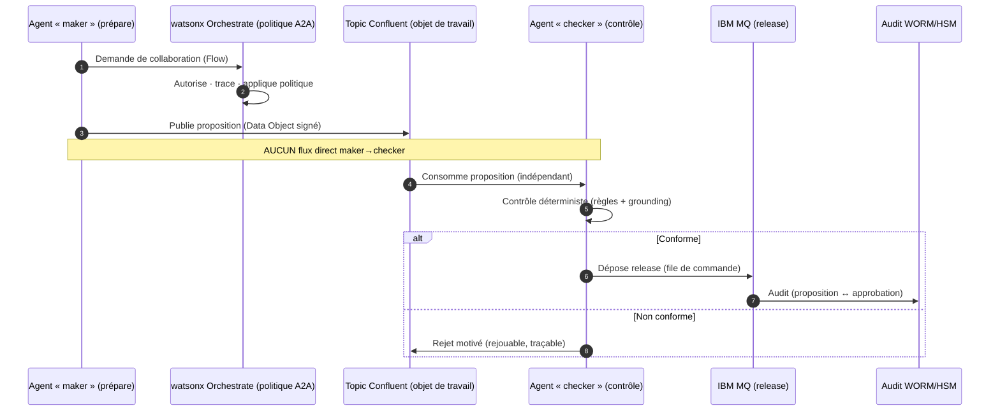
```mermaid
sequenceDiagram
    autonumber
    participant MK as Agent « maker » (prépare)
    participant ORCH as watsonx Orchestrate (politique A2A)
    participant T as Topic Confluent (objet de travail)
    participant CK as Agent « checker » (contrôle)
    participant MQ as IBM MQ (release)
    participant AUD as Audit WORM/HSM

    MK->>ORCH: Demande de collaboration (Flow)
    ORCH->>ORCH: Autorise · trace · applique politique
    MK->>T: Publie proposition (Data Object signé)
    Note over MK,CK: AUCUN flux direct maker→checker
    T->>CK: Consomme proposition (indépendant)
    CK->>CK: Contrôle déterministe (règles + grounding)
    alt Conforme
        CK->>MQ: Dépose release (file de commande)
        MQ->>AUD: Audit (proposition ↔ approbation)
    else Non conforme
        CK->>T: Rejet motivé (rejouable, traçable)
    end
```

**Figure 7 — A2A maker-checker anti-collusion.** Le topic Confluent joue l'objet de travail interposé ; la release n'est émise que par le checker, sur MQ, avec audit reliant proposition et approbation.

---

## 5. Architecture de données et grounding sémantique

**Principe.** Grounder l'agent sur un standard sectoriel versionné — jamais sur du texte libre — réduit l'hallucination et rend l'action auditable. La donnée fraîche atteint l'agent *par un contrat*, jamais par un accès direct, à travers trois couches (cf. Monographie ch.5 §5.2.1) :

| Couche | Standard | Réalisation IBM/Confluent |
|---|---|---|
| Messagerie/syntaxe | ISO 20022, FIX, AL3, FHIR | Data Object ; Schema Registry (Confluent) ; ACE ; z/OS Connect |
| Modèle/capacité | BIAN, ACORD, CDM/DRR | Capacités spécialisées ; Application Function (CDM exécutable) |
| Ontologie/sémantique | FIBO | Service de **validation** (l'agent propose, le raisonneur confronte), pas de génération |

- **watsonx.data (+ Context on watsonx.data ⚠)** — lakehouse gouverné alimenté par Tableflow (Iceberg) ; il fédère le contexte en temps réel sous gouvernance d'exécution pour le grounding agentique (IBM, mai 2026).
- **Confluent Schema Registry / Data Contracts** — gouvernent les contrats d'événement, ce qui rend opposables les schémas ISO 20022/ACORD.
- **Décomposition mémoire/contexte/sémantique explicite** — elle ancre les contrôles DLP et egress (cf. Monographie ch.6 §6.1.8) : la mémoire d'agent et la base vectorielle sont des Data Objects accédés sous contrôle.

### 5.1 Vue de l'architecture de données et de la lignée

La figure 8 trace le parcours d'une donnée, du système d'enregistrement au grounding de l'agent, en faisant ressortir les points où s'appliquent gouvernance, contrats et DLP. Le principe directeur s'y lit : la fraîcheur transite *par un contrat* — Schema Registry, Context Engine ou watsonx.data — non par un accès direct non gouverné.

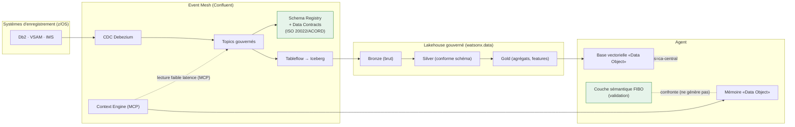
```mermaid
flowchart LR
    subgraph SOR["Systèmes d'enregistrement (z/OS)"]
        DB2["Db2 · VSAM · IMS"]
    end
    subgraph STREAM["Event Mesh (Confluent)"]
        CDC["CDC Debezium"]
        SR["Schema Registry<br/>+ Data Contracts<br/>(ISO 20022/ACORD)"]
        TOPIC["Topics gouvernés"]
        TF["Tableflow → Iceberg"]
        CE["Context Engine (MCP)"]
    end
    subgraph LAKE["Lakehouse gouverné (watsonx.data)"]
        BRONZE["Bronze (brut)"]
        SILVER["Silver (conforme schéma)"]
        GOLD["Gold (agrégats, features)"]
    end
    subgraph AGENT["Agent"]
        MEM["Mémoire «Data Object»"]
        VEC["Base vectorielle «Data Object»"]
        SEM["Couche sémantique FIBO<br/>(validation)"]
    end

    DB2 --> CDC --> TOPIC
    TOPIC --> SR
    TOPIC --> TF --> BRONZE --> SILVER --> GOLD
    CE -. "lecture faible latence (MCP)" .-> TOPIC
    GOLD --> VEC
    CE --> MEM
    SEM -. "confronte (ne génère pas)" .- MEM
    VEC -. "DLP + egress=ca-central" .- AGENT

    classDef gov fill:#e6f4ea,stroke:#1e7d34;
    class SR,SEM gov;
```

**Figure 8 — Architecture de données et lignée.** Le grounding « frais » passe par le Context Engine (MCP) sans ETL ; le grounding « historique » passe par le lakehouse zoné. La couche FIBO valide, elle ne génère jamais (invariant 4).

### 5.2 Zonage du lakehouse et contrats de données

Le lakehouse est zoné — bronze/silver/gold — et la promotion d'une zone à la suivante reste conditionnée à la conformité au contrat de données. Un schéma n'est pas qu'une forme : c'est un contrat opposable, porteur de règles de qualité et de classification.

```yaml
# Data Contract (Confluent Stream Governance) — extrait illustratif
schema: iso20022.pain001.v9
compatibility: BACKWARD                 # évolution gouvernée (couture)
rules:
  - name: montant-positif
    expr: "Document.CdtTrfTxInf.Amt.InstdAmt > 0"
    on_violation: DLQ                    # dead-letter, pas de propagation
metadata:
  classification: PII-restricted
  residency: ca-central-only
  retention: P7Y                        # rétention 7 ans
  owner: capability:Exécuter-un-paiement
```

### 5.3 Ancrage des contrôles DLP/egress sur la mémoire

La décomposition explicite mémoire / contexte récupéré / objet sémantique (cf. Monographie ch.6 §6.1.8) n'a rien de cosmétique : sans elle, la mémoire d'agent reste une boîte opaque où aucun contrôle ne s'ancre. Chaque Data Object de mémoire porte donc une classification et une politique d'egress ; le filtrage de sortie (DLP) s'applique au franchissement de la frontière de zone, et toute base vectorielle contenant du PII est confinée (BYOK, ca-central). Le modèle de menace reprend ce point (§6.4).

---

## 6. Architecture de sécurité (zones, identité, secrets, egress)

**Principe.** La sécurité applique la défense en profondeur sur quatre axes indissociables : **segmentation** (zones réseau), **identité** (humaine et NHI), **secrets/cryptographie** et **contrôle d'egress/DLP**. La posture est *zero-trust* : aucune confiance implicite de zone à zone ; toute traversée est authentifiée (mTLS), autorisée (scope) et journalisée.

### 6.1 Zones réseau et segmentation

La figure 9 pose cinq zones de confiance croissante, séparées par des points d'application de politique. La frontière de résidence (invariant 6) englobe l'ensemble : aucune route ne sort hors région Canada.

```mermaid
flowchart TB
    subgraph EDGE["Zone Edge / DMZ"]
        WAF["WAF + DataPower (entrée)"]
    end
    subgraph APP["Zone Application (OpenShift)"]
        AGZONE["Agents + control plane"]
        IGW["Interact Gateway (PEP MCP)"]
    end
    subgraph DATA["Zone Données"]
        LAKE["watsonx.data · vecteurs"]
        MQZ["MQ (Native HA)"]
        CONFZ["Confluent (PrivateLink)"]
    end
    subgraph MF["Zone Mainframe"]
        ZC["z/OS Connect"]
        CORE["Core / PAS (z/OS)"]
    end
    subgraph MGMT["Zone Management / Sécurité"]
        VERIFY["IBM Verify"]
        KP["Key Protect / HSM"]
        GUARD["Guardium AI Security"]
        AUD["Audit WORM"]
    end

    INET(("Internet / canaux")) --> WAF --> AGZONE
    AGZONE --> IGW --> ZC --> CORE
    AGZONE --> MQZ
    AGZONE --> CONFZ
    AGZONE --> LAKE
    AGZONE -. "auth NHI (mTLS)" .- VERIFY
    IGW -. "secrets, scellés" .- KP
    AGZONE -. "découverte shadow-AI" .- GUARD
    IGW --> AUD

    EGRESS{{"Filtre egress<br/>ca-central uniquement"}}
    AGZONE --> EGRESS
    EGRESS -.->|"refus hors zone"| BLOCK["⛔ Bloqué"]

    classDef mgmt fill:#fde7e7,stroke:#b3261e,stroke-width:2px;
    classDef mf fill:#fff4e5,stroke:#b06000;
    class MGMT mgmt;
    class MF mf;
```

**Figure 9 — Zones de sécurité et frontière de résidence.** Chaque flèche traverse un PEP ; le filtre egress bloque par défaut toute destination hors `ca-central` (test périodique de fuite, §11.4). La zone Mainframe n'expose que z/OS Connect — aucun nouveau chemin d'accès au cœur.

### 6.2 Identité et accès

Deux populations d'identités coexistent sous IBM Verify : **identités humaines** (employés, conseillers, approbateurs four-eyes ; MFA, RBAC/ABAC) et **identités non humaines** (agents, services ; détail en §3.6). Au niveau réseau, le maillage interservices impose **mTLS** — certificats à courte durée, rotation automatique ; l'autorisation est *scoped* (moindre privilège) et la délégation passe par *token-exchange* (RFC 8693). La décision d'autorisation elle-même est déléguée à un **PDP** (Policy Decision Point) — moteur de politiques OPA/Rego ou Cedar (cf. figure J, §0.2) — distinct du PEP qui l'applique : la séparation décision/application est une exigence d'architecture. Le lien KYH, qui rattache chaque NHI à un propriétaire humain, restaure l'imputabilité exigée par l'AMF et l'OSFI.

### 6.3 Secrets et cryptographie

| Préoccupation | Mécanisme | Note |
|---|---|---|
| Stockage de clés | IBM Key Protect adossé à un HSM **FIPS 140-2 niveau 3** | racine de confiance matérielle |
| Chiffrement au repos | BYOK (clés gérées par Boréalis), CSFLE côté Confluent | la clé ne quitte jamais la zone |
| Chiffrement en transit | mTLS partout ; AMS pour MQ (bout-en-bout) | confidentialité + intégrité des messages |
| Rotation | jetons NHI courts (≤15 min) ; certificats rotés ; secrets *secretless* (broker) | pas de secret long terme chez l'agent |
| Signature d'audit | sceau HSM + chaînage Merkle | non-répudiation (§3.7) |
| Posture post-quantique (PQC) | inventaire cryptographique ; agilité des algorithmes | ⚠ trajectoire 2027+ (cf. Monographie ch.7 §7.4) ; à planifier, non bloquant |

### 6.4 Modèle de menace (STRIDE × référentiels agentiques)

**Insight directeur.** Le modèle de menace croise STRIDE avec les référentiels datés propres à l'agentique — OWASP Non-Human Identity Top 10 (éd. 2025) et OWASP Top 10 for LLM Applications. À chaque menace répond un contrôle réalisé par un composant nommé : c'est la paire risque/contrôle du Risk & Security Overlay (cf. Monographie ch.6 §6.6), que le tableau ci-dessous instancie.

| Menace (STRIDE) | Vecteur agentique | Réf. | Contrôle (composant) |
|---|---|---|---|
| **S**poofing | Usurpation d'identité d'agent | NHI | mTLS + jeton scellé HSM (Verify/Key Protect) |
| **T**ampering | Altération de la piste d'audit | — | WORM + Merkle + sceau HSM (§3.7) |
| **R**epudiation | Action non imputable | NHI | Attribution agent+KYH dans chaque entrée |
| **I**nfo disclosure | Fuite PII via mémoire/contexte | LLM06 | DLP + egress + classification (§5.3, §6.5) |
| **D**oS | Épuisement par appels d'outils | — | Quotas/rate-limit API Connect ; budget d'inférence |
| **E**levation | Dépassement de scope / confused deputy | NHI/LLM | Scope borné + `deny` explicite + four-eyes (§3.6) |
| Injection | Prompt injection (direct/indirect) | LLM01 | Validation grounding, isolation outils, tests red-team (§11.2) |
| Shadow AI | Agent/MCP non déclaré | NHI | Découverte Guardium ; inscription obligatoire au registre |

### 6.5 Contrôle d'egress et DLP

Le confinement (invariant 6) se prouve par l'**absence de chemin sortant** doublée d'une **zone de conformité** — non par une clause contractuelle. Concrètement : NetworkPolicy OpenShift restreignant les destinations à `ca-central` ; filtrage egress DataPower avec liste d'autorisation ; DLP sur les charges utiles franchissant une frontière de zone ; refus par défaut. Un test de fuite périodique — tentative d'egress hors zone — valide le contrôle en continu (§11.4).

```yaml
# NetworkPolicy OpenShift — refus egress par défaut (extrait illustratif)
apiVersion: networking.k8s.io/v1
kind: NetworkPolicy
metadata: { name: deny-egress-hors-zone, namespace: agents-prod }
spec:
  podSelector: {}
  policyTypes: [Egress]
  egress:
    - to:
        - ipBlock: { cidr: 10.20.0.0/16 }      # zone Données ca-central
        - namespaceSelector: { matchLabels: { zone: mainframe-ca } }
      # toute autre destination (hors zone) : implicitement refusée
```

---

## 7. Traçabilité réglementaire et résidence

**Principe (cf. Monographie ch.6 §6.6.3).** Aucun `Requirement` réglementaire n'est orphelin : la chaîne `Driver → Requirement <<regulatory-requirement>> → Control → élément exécutable` aboutit toujours à un composant concret. Le **Governance Graph** de watsonx.governance porte cette chaîne dans l'outil ; la matrice complète figure en Annexe B interne — matrice de traçabilité.

| Régime (Canada/Québec prioritaire) | Date-pivot | Qualification | Élément exécutable |
|---|---|---|---|
| OSFI E-23 (risque-modèle) | en vigueur 1ᵉʳ mai 2027 | Modèle | watsonx.governance (registre + Factsheets) |
| OSFI B-10 / B-13 (tiers TIC) | en vigueur 2024 | Système TIC | Registre des dépendances + stratégie de sortie testée |
| AMF — ligne directrice IA | en vigueur 1ᵉʳ mai 2027 | Modèle + décision | Responsable senior unique, répertoire centralisé, cote de risque |
| Loi 25 art. 12.1 | en vigueur 22 sept. 2023 | Décision automatisée | HITL + explication « claire et simple » + révision humaine |
| FINTRAC/CANAFE | obligations dès oct. 2025 | Programme AML *non délégable* | Agent prépare ; responsabilité humaine portée |
| DORA + AI Act Annexe III (si périmètre UE) | 2025 ; report adopté (Conseil 29 juin 2026) : Annexe III → 2 déc. 2027 (publication au JOUE à suivre) | Tiers TIC + haut-risque ciblé | Registre tiers TIC ; transparence décision automatisée |

### 7.1 Chaîne de traçabilité (vue)

La figure 10 instancie la chaîne sur un cas exemplaire — Loi 25 art. 12.1 sur la décision exclusivement automatisée. Le critère est vérifiable : tout `<<regulatory-requirement>>` se termine sur un composant exécutable, et un nœud orphelin signale un défaut de conformité que l'analyse de couverture détecte. La résidence fait l'objet d'une garantie d'un autre ordre, traitée ci-dessous.

```mermaid
flowchart LR
    ST["Stakeholder<br/>CAI (Loi 25)"] -->|Influence| DR["Driver<br/>Protection RP"]
    DR --> AS["Assessment<br/>Décision auto. non encadrée"]
    AS -->|Realization| RQ["Requirement<br/>«regulatory-requirement»<br/>Art. 12.1 : HITL + explication"]
    RQ -->|Realization| CT["Control<br/>Release humaine + message d'explication"]
    CT -->|réalisé par| EX1["MQ file de proposition<br/>(release)"]
    CT -->|réalisé par| EX2["Service d'explication<br/>(Loi 25 « clair et simple »)"]
    CT -->|tracé dans| GG["Governance Graph<br/>(watsonx.governance)"]

    classDef reg fill:#fde7e7,stroke:#b3261e,stroke-width:2px;
    class RQ reg;
```

**Figure 10 — Chaîne de traçabilité verticale (exemple Loi 25 art. 12.1).** Le `<<regulatory-requirement>>` se réalise jusqu'aux composants MQ (release) et au service d'explication — aucun maillon orphelin.

### 7.2 Résidence par construction

**IBM Sovereign Core** (GA, Think 2026) embarque la politique au niveau du *runtime* d'infrastructure : la gouvernance est traitée à mesure que les exigences évoluent, en priorisant la portabilité, sur Red Hat OpenShift/AI (IBM, mai 2026). Conjugué à z/OS Connect on-prem, à un modèle Granite confiné et à Confluent en région Canada — ou Platform on-prem via USM — il matérialise l'interdiction d'egress (absence de chemin sortant), traces *et* inférence comprises. La vérification reste continue (test de fuite, §11.4), non déclarative.

⚠ **Réserve CTPP.** IBM est une société américaine ; un agent sur watsonx-SaaS hors Canada hériterait d'une dépendance CTPP (DORA) et heurterait la résidence (Loi 25). La réponse déployable est **IBM logiciel on-prem/Z + Sovereign Core**, et non IBM SaaS sur région US/EU. Cette dépendance est inscrite au registre des tiers TIC ; elle conditionne ADR-003 (§15) et le risque R-02 (§16.2).

---

## 8. Architecture physique et topologie de déploiement

L'architecture physique réalise l'architecture logique sur un substrat **Red Hat OpenShift Container Platform** gouverné par **Sovereign Core**, adossé au mainframe z/OS et à une grappe Confluent en région Canada. Principe directeur : la *résidence par construction* — tout est domicilié en `ca-central`, la haute disponibilité reste intra-région (multi-AZ) et la reprise après sinistre inter-région demeure *à l'intérieur du Canada*.

### 8.1 Substrat d'exécution (rappel logique → physique)

Cette section ne réintroduit pas les composants (cf. §2) ; elle fixe leur projection physique sur le substrat.

- **Runtime LLM confiné** — modèles **Granite** (poids ouverts) servis par watsonx.ai sur **Red Hat AI / OpenShift**, déployés *on-prem* pour la résidence ; un modèle à poids ouverts tiers s'inscrit lui-même au registre DORA/B-10 — il ne supprime pas la dépendance, il la rend traçable.
- **Accélération** — nœuds GPU sur OpenShift ; HSM pour la signature d'audit et les secrets.
- **Conteneurs** — OpenShift porte MQ (Operator, Native HA), ACE, DataPower Nano/Interact, API Connect, les serveurs MCP et le runtime d'inférence.
- **EDA** — Confluent (Cloud région Canada ou Platform on-prem via USM) ; pont MQ↔Kafka pour relier transaction et événement.
- **Observabilité** — OpenTelemetry GenAI (Collector → flux d'export) alimente deux destinations séparées en objets et rétentions (§3.7).

### 8.2 Topologie de déploiement

La figure 11 pose la topologie physique : un cluster OpenShift multi-AZ en `ca-central`, segmenté en *namespaces* alignés sur les zones de sécurité (§6.1), relié au mainframe z/OS et à la grappe Confluent dédiée par liaison privée.

```mermaid
flowchart TB
    subgraph REGION["Région Canada — ca-central"]
        subgraph OCP["Cluster OpenShift (multi-AZ)"]
            direction TB
            subgraph NS1["ns: control-plane"]
                ORCH["watsonx Orchestrate"]
                GOV["watsonx.governance"]
            end
            subgraph NS2["ns: agents-prod"]
                AGP["Agents (L0-L3)"]
                WXAI["watsonx.ai + Granite (GPU)"]
            end
            subgraph NS3["ns: integration"]
                APIC["API Connect + DataPower Interact"]
                ACE["App Connect (ACE)"]
                MQ["MQ Native HA (3 nœuds)"]
            end
            subgraph NS4["ns: data"]
                WXD["watsonx.data (Iceberg)"]
            end
            subgraph NS5["ns: security"]
                KP["Key Protect / HSM"]
                AUD["Audit WORM"]
            end
        end
        subgraph ZOS["IBM Z (z/OS)"]
            ZC["z/OS Connect 3.0.98"]
            CORE["Core banking · PAS"]
            MQZOS["MQ for z/OS"]
        end
        subgraph CONF["Confluent (grappe dédiée, PrivateLink)"]
            KORA["Kafka (KORA, RF=3)"]
            FLINK["Flink"]
            TF["Tableflow"]
        end
    end
    subgraph DR["Région Canada secondaire — DR"]
        MQDR["MQ CRR (RPO ~0)"]
        OCPDR["OpenShift (pilote)"]
    end

    NS2 --> NS3
    APIC -->|"liaison privée"| ZC --> CORE
    MQ <-->|"pont"| KORA
    MQZOS <--> MQ
    TF --> WXD
    MQ -. "CRR (réplication chiffrée)" .-> MQDR
    OCP -. "GitOps (réplique config)" .-> OCPDR

    classDef sec fill:#fde7e7,stroke:#b3261e,stroke-width:2px;
    classDef mf fill:#fff4e5,stroke:#b06000;
    class NS5 sec;
    class ZOS mf;
```

**Figure 11 — Topologie physique de déploiement.** Le cluster OpenShift est segmenté par *namespace* = zone de sécurité ; le mainframe et Confluent sont reliés par liaison privée ; la DR est une seconde région *canadienne* (MQ CRR RPO ~0, OpenShift répliqué par GitOps).

### 8.3 Haute disponibilité de la messagerie (MQ Native HA)

Le plan de commande est le substrat le plus critique : il porte l'irréversible et n'admet aucune perte (RPO=0). MQ Native HA déploie donc un *queue manager* sur trois pods répartis sur trois zones de disponibilité, réplication synchrone et bascule automatique (RPO zéro) ; la CRR ajoute une copie inter-région asynchrone (RPO proche de zéro, bascule régionale manuelle) pour la DR.

```yaml
# IBM MQ Operator — QueueManager Native HA (extrait illustratif)
apiVersion: mq.ibm.com/v1beta1
kind: QueueManager
metadata: { name: qmha, namespace: integration }
spec:
  license: { accept: true, license: L-..., use: Production }
  queueManager:
    name: QMHA
    availability: { type: NativeHA }      # 3 réplicas, bascule auto
    storage: { defaultClass: ocs-ceph-block, persistedData: { enabled: true } }
  securityContext: { fsGroup: 0 }
  template:                                # anti-affinité multi-AZ
    pod: { containers: [{ name: qmgr, resources: { limits: { cpu: "2", memory: 2Gi }}}]}
  web: { enabled: true }
```

### 8.4 Event Mesh et liaison privée

L'*Event Mesh* porte la même exigence de résidence au transport événementiel. La grappe Confluent est **dédiée** (non partagée), en région `ca-central`, accessible uniquement par **PrivateLink** (pas d'exposition publique), avec **BYOK** et **CSFLE**. Le facteur de réplication des topics est 3 (tolérance à la perte d'une AZ). En souveraineté renforcée, Confluent Platform on-prem/Z gouverné via USM préserve la même gouvernance ; l'arbitrage SaaS vs on-prem est renvoyé à l'ADR-004 (§15).

```hcl
# Terraform — grappe Confluent dédiée (extrait illustratif)
resource "confluent_kafka_cluster" "borealis" {
  display_name = "borealis-prod"
  availability = "MULTI_ZONE"
  cloud        = "AWS"
  region       = "ca-central-1"
  dedicated    { cku = 4 }
}
resource "confluent_private_link_access" "pl" {
  display_name = "borealis-privatelink"
  aws { account = var.aws_account }
  environment { id = var.env_id }
}
```

### 8.5 Posture de continuité (multi-AZ + DR intra-Canada)

La continuité combine deux échelles : la haute disponibilité absorbe la perte d'une AZ, la DR la perte d'une région — toujours sans sortir du Canada.

| Plan | HA intra-région | DR inter-région (Canada) | Mécanisme |
|---|---|---|---|
| Commande (MQ) | Native HA 3 nœuds (synchrone, RPO 0), bascule auto | CRR (asynchrone, RPO proche de 0), bascule manuelle | Réplication synchrone (HA) + asynchrone chiffrée (CRR) |
| Événement (Confluent) | RF=3 multi-AZ | Cluster Linking (option) | Réplication topic |
| Synchrone (API/z/OS) | Réplicas OpenShift multi-AZ ; z/OS Sysplex | Bascule applicative | GitOps + Sysplex |
| Données (watsonx.data) | Stockage objet répliqué | Snapshot Iceberg | Versionnement de table |
| Contrôle/gouvernance | Réplicas multi-AZ | Restauration GitOps | Config-as-code |

Les cibles RTO/RPO chiffrées et leur test (DR drill) sont en §9.2 et §11.5.

Cette posture reste réactive : HA et DR absorbent une panne survenue. La résilience opérationnelle la complète d'un volet proactif, porté par l'AIOps agentique (IBM Concert et son module Concert Resilience, Instana, Turbonomic, SevOne ; détaillé en §10.5). La détection précoce d'anomalies — dérive de latence, saturation d'une file MQ, retard de réconciliation Flink — par la boucle *observer → corréler → décider → agir* (détaillée dans la Monographie ch.2 §2.11.5) permet d'anticiper la bascule plutôt que de seulement y répondre : une file qui sature ou une latence qui dérive est traitée avant l'incident, non après. L'auto-remédiation demeure cependant bornée *fail-closed* — elle agit sur le réversible (rééquilibrage, mise à l'échelle, drainage) et n'engage jamais l'irréversible sans release humaine (cf. Monographie ch.2 §2.11.5).

---

## 9. Exigences non fonctionnelles et SLO

Un *driver* sans NFR mesurable est une intention, pas une exigence. Les NFR traduisent donc les *drivers* (§1.4) en cibles mesurables et testables, contractualisées **par plan d'interaction** : les garanties diffèrent par substrat, et un SLO global unique masquerait des criticités hétérogènes.

### 9.1 Disponibilité (SLO par plan)

La disponibilité se lit par plan, mais une règle prime sur toutes les cibles chiffrées : la dégradation est sûre par défaut.

| Service / plan | SLO disponibilité | Fenêtre d'erreur | Justification |
|---|---|---|---|
| Plan de commande (MQ) | 99,95 % | ~22 min/mois | Intégrité transactionnelle critique (irréversible) |
| Plan synchrone (API/z/OS) | 99,9 % | ~43 min/mois | Lecture ; dégradation tolérable |
| Plan événement (Confluent) | 99,9 % | ~43 min/mois | Rejouable ; rattrapage possible |
| Plan de contrôle (Orchestrate/PEP) | 99,95 % | ~22 min/mois | Sans PEP, pas d'action engageante (fail-closed) |
| Audit (WORM/HSM) | 99,99 % | ~4 min/mois | Non-répudiation ; aucune perte tolérée |

> Règle *fail-closed* : si le plan de contrôle est indisponible, les agents retombent en L0 (copilote) — ils cessent d'agir ; aucune action engageante n'est émise sans PEP.

### 9.2 Reprise (RPO/RTO)

| Plan | RPO (perte max) | RTO (reprise max) | Mécanisme vérifié |
|---|---|---|---|
| Commande (MQ) | 0 (Native HA) ; ~0 (CRR) | ≤ 15 min | Native HA synchrone (auto) + CRR asynchrone (DR, bascule manuelle) |
| Événement (Confluent) | < 5 s | ≤ 30 min | RF=3 + Cluster Linking |
| Synchrone (z/OS) | 0 | ≤ 15 min | Sysplex + bascule applicative |
| Données (lakehouse) | ≤ 15 min | ≤ 60 min | Snapshot Iceberg |
| Audit | 0 | ≤ 5 min | WORM répliqué |

### 9.3 Budgets de latence (cibles p99)

| Interaction | Budget p99 | Composition |
|---|---|---|
| Appel d'outil MCP (lecture z/OS) | ≤ 800 ms | PEP + API Connect + z/OS Connect + CICS |
| Décision d'agent L1 (préparation) | ≤ 3 s | inférence Granite + grounding + validation |
| Écriture d'audit signée | ≤ 200 ms | sceau HSM + WORM |
| Réconciliation continue (Flink) | ≤ 5 s bout-en-bout | CDC → topic → Flink → signal |
| Release humaine → commit MQ | ≤ 1 s | file de commande → SoR |

### 9.4 Débit, capacité et dimensionnement (hypothèses)

| Dimension | Cible / hypothèse | Note de dimensionnement |
|---|---|---|
| Débit rail de paiement (pic) | ~2 500 txn/s | MQ Native HA + Uniform Clusters |
| Débit événements (pic) | ~50 000 msg/s | Confluent 4 CKU, RF=3 |
| Appels d'outils MCP | ~5 000 req/s | DataPower Interact (Nano, scale fin) |
| Parc d'agents (24 mois) | 40-80 agents gouvernés | dominé par L1-L2 (§12) |
| Nœuds GPU d'inférence | dimensionnés au p95 de concurrence | autoscaling borné par budget FinOps |
| Rétention audit | pluriannuelle (≥ 7 ans) | WORM ; coût de stockage planifié |

### 9.5 Scalabilité et élasticité

L'élasticité est *bornée* par construction : croître sans plafond laisserait coût et risque dériver avec la charge. L'autoscaling horizontal (HPA OpenShift) des agents et passerelles est plafonné par un budget d'inférence (§10.4). Le plan de commande (MQ) scale par Uniform Clusters (rééquilibrage JMS sans interruption), le plan événement par CKU Confluent. Le dimensionnement GPU suit le p95 de concurrence d'inférence, pas le pic — l'attente bornée prime sur le surprovisionnement, le plan de commande absorbant les rafales par mise en file.

---

## 10. Modèle opérationnel, observabilité et FinOps

### 10.1 Modèle opérationnel et AgentOps

L'exploitation suit un modèle *hub-and-spoke* (cf. Monographie ch.4 §4.11) : un Centre d'expertise agentique (CoE) gouverne politiques, registre et plateaux ; les équipes métier opèrent leurs agents dans ce cadre. Le cycle de vie d'un agent (AgentOps) est explicite : *conception → inscription au registre (E-23 + tiers TIC) → validation pré-déploiement → mise en service gouvernée (plateau) → monitoring runtime → ré-évaluation/retrait*. Chaque transition est journalisée dans le Governance Graph.

### 10.2 Observabilité (OTel GenAI)

L'observabilité SRE est distincte de l'audit (invariant 5, séparation établie en §3.7) : elle ne rejuge pas la trace de gouvernance, elle mesure le comportement runtime du parc. Elle instrumente quatre familles de signaux : **qualité** (taux d'override humain, taux d'hallucination détectée, dérive), **performance** (latence p50/p99 par plan, débit), **coût** (jetons/inférence par agent, coût/décision) et **fiabilité** (taux d'erreur, disponibilité PEP). Les seuils alimentent les alertes (Agent Monitoring de watsonx.governance + Concert).

```yaml
# OpenTelemetry Collector — double export (extrait illustratif)
receivers: { otlp: { protocols: { grpc: {}, http: {} } } }
processors:
  attributes/genai: { actions: [ { key: gen_ai.system, action: insert, value: granite } ] }
exporters:
  otlphttp/sre:   { endpoint: "https://concert.borealis.ca-central/otlp" }   # purgeable
  # NB : la piste d'audit opposable NE transite PAS par ce collecteur (§3.7)
service:
  pipelines:
    traces: { receivers: [otlp], processors: [attributes/genai], exporters: [otlphttp/sre] }
```

⚠ Conventions OTel GenAI expérimentales (GenAI SIG) — les noms d'attributs (`gen_ai.*`) restent susceptibles d'évoluer ; couture à re-confirmer.

### 10.3 Gestion des incidents et des changements

Les incidents agentiques ajoutent deux catégories aux runbooks classiques : **dérive/hallucination** (seuil franchi → rétrogradation automatique en L0, ré-évaluation) et **dépassement de scope/anomalie d'identité** (Guardium/PEP → révocation du jeton NHI, gel de l'agent). Tout changement de modèle, de prompt système ou de scope d'outil est un *changement gouverné* : il rouvre le dossier de validation (§11.1) et passe une porte d'approbation. L'autre dimension quotidienne de l'exploitation est le pilotage du coût.

### 10.4 FinOps et budget d'inférence

Le coût d'inférence est piloté comme une Resource stratégique (cf. Monographie ch.6 §6.3.2). Chaque agent porte un **budget d'inférence** (plafond jetons/jour) ; le tableau de bord d'usage IA (DataPower Interact + Confluent metering) suit la consommation MCP/LLM par agent et par capacité. Le dépassement déclenche d'abord une alerte, puis un *throttling* (rate-limit), jamais un contournement de contrôle. L'arbitrage modèle (Granite local vs modèle plus large) est une décision FinOps tracée, bornée par la résidence — pas d'appel hors zone.

### 10.5 Résilience opérationnelle et AIOps agentique

Deux disciplines distinctes encadrent le parc. **AgentOps** gouverne *ce qui* tourne — cycle de vie, registre, calibrage d'autonomie, déjà posé en §10.1. **AIOps** maintient *que ça tourne* : la santé d'exploitation du parc agentique pris comme système. La boucle est explicite : **observer → corréler → décider → agir**. *Observer* repose sur les traces OTel GenAI de §10.2, qui demeurent le socle de signaux, étendues à l'observabilité *full-stack* via **IBM Instana** (APM, dépendances applicatives, santé d'infrastructure). *Corréler* rapproche les signaux pour distinguer une dérive de modèle d'une défaillance d'infrastructure sous-jacente. *Décider* et *agir* déclenchent la remédiation, sous bornes strictes.

L'optimisation ressources et coût relève d'**IBM Turbonomic** (Application Resource Management) : il est le pendant *infrastructure* du budget d'inférence FinOps de §10.4 — l'un arbitre le coût des jetons, l'autre celui de la capacité de calcul qui les sert. L'observabilité *réseau* du parc est portée par **IBM SevOne** (performance et disponibilité réseau), qui complète l'APM Instana côté transport. La plateforme d'opérations agentiques repose sur **IBM Concert** (déjà nommé en §3.7 et §10.2), étendu ici par son module **Concert Resilience** ⚠, le tout assis sur **IBM Cloud Pak for AIOps** ⚠ comme socle de corrélation d'événements. La résilience se mesure par les **MTTD/MTTR du parc** (valeurs = hypothèses à calibrer, non figées ici).

L'auto-remédiation est bornée par le calibrage d'autonomie (§1.3, invariant d'irréversibilité) et la règle *fail-closed* L0 (§9.1) : aucune action correctrice irréversible — bascule de trafic vers une zone non conforme, modification de scope, redéploiement de modèle — sans *release* humaine. Le redémarrage d'un *pod*, le *throttling* ou la rétrogradation en L0 restent automatisables ; la correction structurelle ne l'est pas. Enfin, la récursivité est assumée : **les agents d'AIOps sont eux-mêmes des agents**, donc inscrits au registre (§10.1) et soumis aux mêmes contrôles KYA/scope/audit (§3.4, §3.6) que le parc qu'ils surveillent. L'exploitation prolonge ainsi le fil conducteur *découplage · contrat · évolution* d'un quatrième temps — l'*exploitation* —, conformément à l'extension proposée par la monographie v2 : un parc n'est conforme que s'il demeure observable et remédiable sans rompre ses propres invariants. (cf. Monographie ch.2 §2.11.5)

---

## 11. Stratégie de test et de validation

La validation conditionne le franchissement des plateaux (§14.3) : rien n'est promu sans preuve. Sept campagnes, chacune à critère de succès mesurable.

| # | Campagne | Objet | Critère de succès |
|---|---|---|---|
| T1 | **Validation de modèle (E-23)** | Qualité, biais, dérive, dossier de validation | Factsheet complète ; dérive < seuil ; variance bornée ; approbation risque-modèle |
| T2 | **Sécurité / red-team** | Injection de prompt (directe/indirecte), exfiltration, *confused deputy* | 0 contournement de scope ; 0 fuite PII ; OWASP LLM Top 10 couvert |
| T3 | **Conformité protocolaire** | MCP 2025-11-25, A2A 1.0, ISO 20022 | 100 % messages conformes au schéma ; rejet des non-conformes |
| T4 | **Four-eyes / non-collusion** | Absence de flux direct maker→checker | Aucune route directe ; ségrégation prouvée par analyse de modèle |
| T5 | **Résidence / egress** | Tentative de fuite hors `ca-central` | 100 % des tentatives bloquées ; 0 destination hors zone |
| T6 | **Continuité (DR/chaos)** | Bascule HA, CRR, RTO/RPO | RPO/RTO atteints (§9.2) ; bascule MQ automatique vérifiée |
| T7 | **Performance / charge** | Budgets de latence et débit | p99 dans budget (§9.3) au débit cible (§9.4) |

### 11.1 Validation de modèle (T1)

Tout agent décisionnel est un modèle inventorié (invariant 2). La validation pré-déploiement produit la *Factsheet* : données d'entraînement/grounding, métriques de qualité, tests de biais, mesure de variance (reproductibilité), tests d'injection. Le suivi runtime (dérive quasi quotidienne) rouvre la validation au franchissement d'un seuil. Aucun agent ne franchit N2 sans dossier de validation approuvé.

### 11.2 Sécurité agentique (T2)

Le red-team cible les vecteurs agentiques (§6.4) : injection indirecte via contenu récupéré (RAG empoisonné), exfiltration par la mémoire, abus de délégation (RFC 8693), *tool poisoning*. La couverture suit l'OWASP Top 10 for LLM Applications. Les résultats alimentent les contrôles d'isolation d'outils et de validation du grounding.

### 11.3 Bac à sable réglementaire (T1-T7 en conditions réelles)

Le passage en L3 (transactionnel, p. ex. paiement initié par agent) est validé dans le **bac à sable de l'AMF** avant production — condition explicite du plateau N4 (§14.3). Il y confronte les sept campagnes à un scénario réel borné, sous supervision du régulateur.

### 11.4 Résidence et egress (T5)

Ce test se distingue non par le mécanisme d'*egress nul* (établi en §6.5/§7.2) mais par son caractère *adverse et continu* : depuis chaque zone, on tente activement une sortie hors `ca-central` (DNS, IP publique, service tiers). Le critère est binaire — toute tentative doit être bloquée (egress nul, invariant 6). Il s'exécute en continu (sonde planifiée) et à chaque promotion ; un seul succès d'egress hors zone est un échec de plateau (déclencheur R-06, §16.2).

### 11.5 Continuité (DR drill, T6)

Le *DR drill* rejoue les scénarios de panne : perte d'une AZ (bascule MQ Native HA automatique), perte de région (CRR, RPO ~0), indisponibilité du PEP (retombée *fail-closed* en L0). Le critère est l'atteinte des cibles RTO/RPO (§9.2) ; le drill est exécuté en staging avant chaque franchissement de plateau N3/N4 et périodiquement en production.

---

## 12. Parc d'agents par sous-domaine (autonomie calibrée)

### 12.1 Affectation des agents par sous-domaine

| Sous-domaine | Cas d'usage | Niveau | Justification |
|---|---|---|---|
| Bancaire | Réconciliation, triage AML, résumé de dossier | **L2** | Réversible, faible matérialité — cas N2→N3 par excellence |
| Bancaire | Origination crédit (préparation) | **L1** | Modèle (E-23) + Annexe III AI Act (scoring perso.) → release humaine |
| Bancaire | Paiement initié par agent (RTR irrévocable) | **L1→L3** | RTR final → L1 par défaut ; L3 *uniquement* sous mandat AP2 borné |
| Assurance dommage | FNOL, triage sinistre, détection fraude | **L2** | Fraude = *carve-out* Annexe III ; triage réversible |
| Assurance vie/santé | Souscription augmentée (préparation) | **L1** | Annexe III 5(c) haut-risque + E-23 → émission humaine |
| Patrimoine | Conseil / suitability (préparation) | **L1** | Responsabilité du résultat imputable (MiFID II ; précédent Moffatt) |
| Patrimoine | Réconciliation buy-side, reporting CDM/DRR | **L2** | Logique exécutable codifiée → variance bornée |
| Services TI | Audit de conformité, génération de vues d'archi | **L1/L2** | Interne, réversible ; sortie vérifiée contre le registre de stéréotypes |

Lecture transversale : le parc est dominé par L1–L2, le L3 restant rare, borné, conditionné à un mandat vérifiable — distribution qui suit le tri du marché, où les cas matures sont des copilotes et des opérations internes, non un « OS d'agents » autonome.

### 12.2 Machine à états du calibrage d'autonomie

La figure 12 formalise le *gating* d'autonomie déjà posé en §1.3, sans en redéfinir les niveaux. La règle invariante — *toute action irréversible reste ≤ L1 par défaut* — y garde la transition L1→L2/L3 : franchir le seuil exige une condition explicite. La rétrogradation en L0 sur incident — dérive, anomalie d'identité — est automatique (§10.3).

```mermaid
stateDiagram-v2
    [*] --> L0
    L0: L0 Copilote
    L1: L1 Préparateur
    L2: L2 Exécuteur borné
    L3: L3 Transactionnel encadré
    L0 --> L1: inscrit au registre (E-23 + tiers TIC) · + grounding standard
    L1 --> L2: réversibilité native · + PEP systématique (porte N2→N3) · + four-eyes
    L2 --> L3: mandat cryptographique borné (AP2) · + réconciliation continue · + bac à sable AMF validé
    L1 --> L1: action irréversible (garde : reste ≤ L1)
    L2 --> L0: dérive/incident (rétrogradation auto)
    L3 --> L0: anomalie d'identité/scope (gel)
    L3 --> L2: révocation de mandat
```

**Figure 12 — Gating du calibrage d'autonomie.** Chaque montée de niveau franchit une porte vérifiable ; toute descente d'incident est automatique et journalisée.

---

## 13. Projection ArchiMate (vues)

Ces étiquettes formelles disent qui rend quel service à qui, vérifiable par outil. Le registre de stéréotypes (cf. Monographie ch.6 §6.1.9) s'applique à la pile IBM : `<<Agent>>`, `<<MCP Server>>`, `<<NHI>>`, `<<Control Plane>>`, `<<reasoning loop>>`, `<<regulatory-requirement>>`, plus les Profiles (autonomie, matérialité, réversibilité) exploités en *heat maps*.

| Élément IBM | Patron ArchiMate |
|---|---|
| watsonx Orchestrate (control plane) | Application Collaboration `<<Control Plane>>` réalisant des Application Services de gouvernance |
| Agent de souscription/AML/… | Application Component `<<Agent>>` + Role + Application Process `<<reasoning loop>>` |
| z/OS Connect / Interact Gateway / Context Engine (MCP) | Application Component `<<MCP Server>>` + Application Service + Application Interface + Serving |
| Topic Confluent (échange A2A) | Flow / Triggering entre Application Components ; message en Data Object |
| Identité d'agent (IBM Verify + Key Protect) | Role `<<NHI>>` + Assignment + credential (Artifact) + Business Actor propriétaire |
| Exigence E-23/AMF/Loi 25 | Specialization de Requirement `<<regulatory-requirement>>` |
| Modèle Granite confiné | Resource (Strategy) ; Artifact (poids) sur Node, domicilié (Location) |

Cinq vues structurent la projection — Autorité/délégation, Plan de contrôle, Interop agentique, Conformité/auditabilité, Grounding gouverné — dont deux rendues ici. La modélisation est en ArchiMate 4, équivalent 3.2 noté, l'outillage restant ancré 3.x à la mi-2026.

### 13.1 Vue « Plan de contrôle » (rendue)

```mermaid
flowchart TB
    CAP["Capability (Strategy)<br/>Orchestration gouvernée"] -.->|réalise| CP
    CP["Application Collaboration<br/>«Control Plane»<br/>(watsonx Orchestrate)"]
    CP -->|Realization| S1["App Service : Autorisation"]
    CP -->|Realization| S2["App Service : Journalisation"]
    CP -->|Realization| S3["App Service : Application des politiques"]
    S1 -->|Serving| AG["App Component «Agent»"]
    S2 -->|Serving| AG
    S3 -->|Serving| AG
    REQ["Requirement «regulatory-requirement»"] -.->|influence| S3
    classDef reg fill:#fde7e7,stroke:#b3261e,stroke-width:2px;
    class REQ reg;
```

**Figure 13 — Vue ArchiMate « Plan de contrôle ».** La collaboration `<<Control Plane>>` réalise des services de gouvernance qui *desservent* (Serving) chaque agent ; les politiques descendent des `<<regulatory-requirement>>`.

### 13.2 Vue « Interopérabilité agentique » (rendue)

```mermaid
flowchart LR
    AG1["«Agent» Maker<br/>+ Process «reasoning loop»"]
    AG2["«Agent» Checker"]
    MCP["«MCP Server»<br/>(z/OS Connect)"]
    SVC["App Service : capacité outillée"]
    DO["Data Object (message A2A)"]
    AG1 -->|Serving : appel d'outil| SVC
    SVC -->|Realization| MCP
    AG1 -->|Flow / Triggering| DO
    DO -->|Flow| AG2
    AG1 -. "AUCUN Serving direct maker→checker" .- AG2
    classDef mcp fill:#e6f4ea,stroke:#1e7d34;
    class MCP,SVC mcp;
```

**Figure 14 — Vue ArchiMate « Interop agentique ».** L'appel d'outil est un Serving vers une Application Service réalisée par le `<<MCP Server>>` ; l'A2A est un Flow/Triggering via Data Object ; l'absence de Serving direct maker→checker est la preuve de non-collusion.

---

## 14. Plan de déploiement par plateaux et runbooks

La porte décisive est **N2→N3** : l'enforcement de politique et les contrôles d'accès y deviennent systématiques. Pousser l'autonomie avant elle accumule du risque-modèle non gouverné ; la séquence de plateaux qui suit s'organise autour de ce franchissement.

### 14.1 Stratégie d'environnements

| Environnement | Finalité | Résidence | Données |
|---|---|---|---|
| Dev | Développement d'agents, prototypage | ca-central | synthétiques |
| Test/Intégration | Tests T1-T4, conformité protocolaire | ca-central | masquées |
| Staging (pré-prod) | Tests T5-T7, DR drill, charge | ca-central | masquées, volume réel |
| Bac à sable AMF | Validation L3 sous régulateur | ca-central | réelles bornées |
| Production | Exploitation gouvernée | ca-central | réelles |

### 14.2 Livraison continue (GitOps)

Toute configuration est *as-code* sous OpenShift GitOps/Argo CD : manifestes d'agents, politiques PEP, contrats de schéma, files MQ. La promotion franchit une porte d'approbation de gouvernance, et rien ne s'applique hors Git — d'où auditabilité, reproductibilité, rollback par révision.

```mermaid
flowchart LR
    GIT["Dépôt Git<br/>(manifestes, politiques, schémas)"] --> CI["CI<br/>lint · tests T1-T4 · scan sécurité"]
    CI --> REG["Registre d'images signées"]
    REG --> ARGO["Argo CD (GitOps)"]
    ARGO -->|sync| DEV["Dev"]
    ARGO -->|promotion approuvée| STG["Staging"]
    STG -->|porte de plateau| PROD["Production"]
    GOV["Gouvernance<br/>(approbation, Factsheet)"] -. "porte" .- STG
    GOV -. "porte" .- PROD
    classDef gate fill:#fde7e7,stroke:#b3261e,stroke-width:2px;
    class GOV gate;
```

**Figure 15 — Pipeline GitOps avec portes de gouvernance.** Aucune application hors Git ; la promotion vers staging/prod franchit une porte (Factsheet, approbation).

### 14.3 Plateaux avec critères d'entrée/sortie

| Plateau | Capacité débloquée | Produits installés | Critère d'entrée | Critère de sortie (porte) |
|---|---|---|---|---|
| N0-N1 (copilotes/préparateurs L0-L1) | Exposer le legacy, premiers copilotes | z/OS Connect MCP, ACE/API Connect MCP, watsonx.governance, OTel GenAI | Registre des modèles en place | Inventaire des agents matériels au registre ; T1 amorcé |
| N2 (préparateurs L1) | Grounding standard, four-eyes | API Connect/DataPower, MQ, Confluent Schema Registry | Four-eyes conçu (T4) | Four-eyes sur l'irréversible ; piste d'audit complète ; T1-T4 verts |
| **N2→N3 (porte)** | **Enforcement systématique** | **watsonx Orchestrate (PEP), Interact Gateway, identité KYA, audit HSM/WORM, Guardium** | **PEP déployé sans contournement (P3)** | **KYA + PEP obligatoire + ségrégation anti-collusion ; T5 vert** |
| N3 (exécuteurs L2) | Réconciliation continue | Confluent Flink, FINOS AIGF v2.0, Sovereign Core | Réconciliation < 5 s (T7) | Taux d'override, suivi dérive/hallucination sous seuils |
| N4 (transactionnel L3) | Mandat vérifiable + RTR | Mandat AP2/FIDO, insertion RTR sous release | Mandat opposable conçu | Réconciliation + bac à sable AMF validé ; T6 vert |

### 14.4 Pipeline de rendu documentaire (Mermaid → PDF)

Note de production documentaire, distincte du corps d'architecture. Le document intègre ses diagrammes en Mermaid ; le pipeline FESP (Pandoc→Typst) gagne une étape de pré-rendu où chaque bloc ` ```mermaid ` devient un SVG (mermaid-cli + Chromium *headless*) injecté comme image avant Typst. Cette ADS étant l'Annexe B de la monographie, elle est rendue avec elle : `bash build/build-pdf.sh` régénère `Monographie.pdf` (source `Monographie.md`) avec diagrammes vectoriels. **Nouveau prérequis** : Node ≥ 18 + `@mermaid-js/mermaid-cli` et un Chromium. Sans mermaid-cli, le script bascule en mode dégradé — bloc de code — sans échouer.

### 14.5 Runbook de cutover et rollback (par plateau)

1. **Pré-bascule** : geler les changements ; vérifier les portes (T-campagnes vertes, Factsheets approuvées) ; sauvegarder l'état (snapshot Iceberg, export config Git).
2. **Bascule** : promotion Argo CD vers production sur révision Git épinglée ; activation progressive (canary par capacité, jamais big-bang).
3. **Vérification** : sondes de santé (PEP, MQ Native HA, audit) ; test de fuite egress (T5) ; réconciliation (T7).
4. **Rollback** : à l'échec d'une sonde, `argocd app rollback` vers la révision précédente ; les agents retombent en L0 — sur panne du contrôle, ils cessent d'agir et redeviennent de simples assistants (fail-closed) ; aucun message de commande non *released* n'est rejoué.
5. **Déclencheurs de rollback** : franchissement de seuil de dérive ; échec de test de fuite ; indisponibilité PEP au-delà de la fenêtre d'erreur ; anomalie d'identité NHI.

### 14.6 Feuille de route (indicative)

```mermaid
gantt
    title Trajectoire de déploiement par plateaux (indicative)
    dateFormat YYYY-MM
    axisFormat %Y-%m
    section Fondations
    N0-N1 Exposer legacy + copilotes      :n01, 2026-07, 4M
    section Préparateurs
    N2 Grounding + four-eyes              :n2, after n01, 4M
    section Porte d'enforcement
    N2 to N3 PEP + KYA + audit (porte)    :crit, gate, after n2, 3M
    section Exécution bornée
    N3 Réconciliation continue (L2)       :n3, after gate, 4M
    section Transactionnel
    N4 Mandat + RTR + bac à sable AMF     :n4, after n3, 5M
```

**Figure 16 — Feuille de route par plateaux.** La porte N2→N3 (en rouge) est le jalon critique ; aucun plateau aval n'ouvre tant qu'elle n'est pas franchie. Les durées sont indicatives (hypothèses de planification, à calibrer).

---

## 15. Registre des décisions d'architecture (ADR)

Format court : *Contexte → Décision → Statut → Conséquences → Alternative → Condition de renversement*. Chaque ADR porte son compromis principal, au moins une alternative et la condition qui en renverse la recommandation.

**ADR-001 — Épine IBM consolidée.** *Contexte* : double-qualification modèle+tiers TIC sur un socle z/OS+MQ+Kafka existant. *Décision* : consolider sur la pile IBM (control plane + governance + Z + Confluent + MQ couplés). *Statut* : **acceptée**. *Conséquences* : cohérence maximale, audit E-23/B-10 natif, résidence par Sovereign Core ; en contrepartie *vendor lock-in* et dépendance CTPP (IBM = société US). *Alternative* : pile ouverte aux coutures (Kong/agentgateway, Aembit/Astrix, Langfuse, OPA, poids ouverts). *Renversement* : basculer vers l'ouvert si l'évaluation de concentration (B-10/DORA Art. 29) classe IBM en dépendance critique non substituable, ou si l'exit testé échoue.

**ADR-002 — MQ pour la commande, Kafka pour l'événement.** *Contexte* : un substrat unique masque des criticités hétérogènes. *Décision* : commande engageante irréversible → IBM MQ (*exactly-once*) ; événement/fan-out/analytique → Confluent ; pont MQ↔Kafka pour relier sans confondre. *Statut* : **acceptée**. *Conséquences* : intégrité transactionnelle garantie ; deux substrats à exploiter. *Alternative* : tout-Kafka avec patrons transactionnels applicatifs. *Renversement* : jamais une commande irréversible sur Kafka seul ; jamais un fan-out multi-consommateurs sur MQ.

**ADR-003 — IBM logiciel on-prem/Z vs SaaS.** *Contexte* : résidence Loi 25 + B-10. *Décision* : déployer IBM logiciel on-prem/Z + Sovereign Core, non IBM SaaS US/EU. *Statut* : **acceptée**. *Conséquences* : résidence et indépendance garanties, au prix du coût et de l'exploitation. *Alternative* : SaaS managé. *Renversement* : SaaS acceptable *seulement si* résidence des traces ET de l'inférence garantie en région Canada sans cross-region, et exit testé.

**ADR-004 — Confluent Cloud (région Canada) vs Platform on-prem.** *Contexte* : opération managée vs souveraineté maximale. *Décision* : Confluent Cloud dédié ca-central + PrivateLink + BYOK/CSFLE. *Statut* : **acceptée, réversible**. *Conséquences* : opération managée, au prix d'une dépendance hyperscaler CTPP inscrite au registre. *Alternative* : Confluent Platform on-prem/Z via USM. *Renversement* : passer à Platform on-prem si résidence ou concentration l'imposent ; USM préserve la gouvernance unifiée.

**ADR-005 — Calibrage d'autonomie L0-L3 par matérialité×réversibilité.** *Contexte* : l'autonomie n'est pas un attribut produit. *Décision* : porter l'autonomie par un *Profile* ArchiMate ; toute action irréversible ≤ L1 par défaut. *Statut* : **acceptée**. *Conséquences* : prudence par construction ; L3 rare et borné. *Alternative* : autonomie maximale « OS d'agents ». *Renversement* : franchir L1→L2/L3 sur réversibilité native ou mandat cryptographique borné seulement.

**ADR-006 — PEP à deux couches.** *Contexte* : un seul point de contrôle laisserait une couche non gouvernée. *Décision* : PEP couche agent/A2A (watsonx Orchestrate) + PEP couche API/MCP/LLM (Interact Gateway + API Connect), en série. *Statut* : **acceptée**. *Conséquences* : aucun appel d'outil ni A2A hors politique ; deux composants à opérer. *Alternative* : passerelle unique. *Renversement* : fusionner si un produit unifie nativement les deux couches sans angle mort.

**ADR-007 — Résidence par egress nul + zone de conformité.** *Contexte* : la résidence contractuelle est invérifiable. *Décision* : prouver la résidence par l'absence de chemin sortant (NetworkPolicy + DLP + filtrage egress) et la zone de conformité, testée en continu. *Statut* : **acceptée**. *Conséquences* : confinement vérifiable ; forte contrainte sur les intégrations externes. *Alternative* : confiance contractuelle. *Renversement* : aucun — invariant 6.

**ADR-008 — Diagrammes Mermaid intégrés, vues en ArchiMate 4.** *Contexte* : modèles versionnables, rendus sur GitHub et en PDF. *Décision* : diagrammes Mermaid *inline* (un seul document, pas de fichiers séparés) ; vues d'entreprise en ArchiMate 4 avec note d'équivalence 3.2. *Statut* : **acceptée**. *Conséquences* : portabilité et diffusabilité ; dépendance au pré-rendu mermaid-cli pour le PDF (mode dégradé prévu). *Alternative* : ArchiMate Open Exchange XML + images exportées. *Renversement* : exporter en Open Exchange si l'outillage EA d'entreprise l'exige (couture ouverte préservée).

---

## 16. Compromis, risques et conditions de renversement

### 16.1 Compromis structurants

**A. Épine IBM consolidée.** Cohérence maximale et exploitation du socle existant, au prix du *lock-in* et de la dépendance CTPP ; garde-fou permanent : tenir ouvertes les coutures (MCP, A2A, ISO 20022, OTel GenAI, poids ouverts, échange ArchiMate). Détail en ADR-001.

**B. Résidence — on-prem/Z vs SaaS.** On-prem/Z + Sovereign Core garantit résidence et indépendance, au prix du coût (ADR-003).

**C. Confluent Cloud vs Platform.** Cloud managé vs souveraineté maximale via USM (ADR-004).

**D. MQ vs Kafka.** Intégrité transactionnelle vs rejouabilité/fan-out ; le pont relie sans confondre (ADR-002).

**E. Intégration couplée à la résilience.** Coupler la couche d'intégration au plan de résilience opérationnelle (auto-remédiation bornée, observabilité full-stack applicative via Instana et réseau via SevOne, optimisation coût/ressource via Turbonomic, sous la coordination d'IBM Concert et de son module Concert Resilience) accroît la robustesse, au prix d'une surface d'exploitation élargie et d'agents d'AIOps qui deviennent eux-mêmes objets de gouvernance (récursivité KYA/scope/audit : un agent qui répare le parc doit être inscrit, scopé et tracé comme tout autre). Garde-fou : l'auto-remédiation ne franchit jamais l'irréversible sans release humaine, et les agents d'opération restent au registre. Ce compromis se rattache au modèle opérationnel (§10, dont l'AIOps en §10.5 et les incidents en §10.3) ; cf. Monographie ch.4 §4.12.

### 16.2 Registre des risques

| ID | Risque | Prob. | Impact | Mitigation | Propriétaire | Déclencheur de renversement |
|---|---|---|---|---|---|---|
| R-01 | *Vendor lock-in* IBM | Moyenne | Élevé | Coutures ouvertes + stratégie de sortie testée | Architecture | Échec du test de sortie |
| R-02 | Concentration CTPP (IBM/hyperscaler) | Moyenne | Élevé | Registre tiers TIC ; éval. B-10/DORA Art. 29 | Conformité | Classement dépendance critique non substituable |
| R-03 | Statuts *preview* (Orchestrate next-gen, Context on watsonx.data, Agent Monitoring, Concert Resilience, Cloud Pak for AIOps) | Élevée | Moyen | Isoler en §17 ; ne pas bloquer N0-N2 dessus | Architecture | GA repoussée au-delà du plateau |
| R-04 | Dérive/hallucination d'agent | Moyenne | Élevé | Suivi quasi quotidien ; rétrogradation auto L0 | Risque-modèle | Seuil de dérive franchi |
| R-05 | Injection de prompt / *confused deputy* | Moyenne | Élevé | Red-team T2 ; scope borné + `deny` ; isolation outils | Sécurité | Contournement de scope détecté |
| R-06 | Fuite de résidence (egress) | Faible | Critique | Egress nul + DLP + test de fuite continu | Sécurité | Toute fuite détectée (tolérance 0) |
| R-07 | Indisponibilité du PEP | Faible | Élevé | HA 99,95 % ; *fail-closed* en L0 | SRE | RTO dépassé |
| R-08 | Report réglementaire AI Act (report adopté par le Conseil le 29 juin 2026 ; publication au JOUE à suivre ⚠) | Faible | Faible | Confirmer la publication au JOUE ; périmètre UE conditionnel | Conformité | Date-pivot Annexe III → 2 déc. 2027 |

---

## 17. Réserves de qualification (statuts vivants)

À re-confirmer avant d'engager : watsonx Orchestrate next-gen (private preview), Context on watsonx.data (statut à confirmer), IBM Data Gate for Confluent (Think 2026), API Studio/API Agent (selon la fonction), watsonx.governance Agent Monitoring (tech preview), Concert Resilience et Cloud Pak for AIOps (modules d'exploitation, §10.5), Integration Agent / B2B Agent webMethods (authoring agentique, §4.1/§4.3.1). L'acquisition de Confluent par IBM est clôturée (17 mars 2026) et Streaming Agents est GA depuis le lancement Q2 2026. La spécification MCP est épinglée à la version 2025-11-25 (couture §2.3, campagne T3) ; une version 2026-07-28 est annoncée (*release candidate* gelée le 21 mai 2026) — re-valider la conformité protocolaire T3 à sa publication. Aucun « MCP financier » sectoriel ratifié. AP2→FIDO, RTR, FINOS AIGF v2.0, OTel GenAI (expérimental) restent vivants. Les prix éditeurs ne sont pas audités. Les dates réglementaires sont arrêtées à juin 2026 (corpus monographique). Les valeurs chiffrées de §9 (SLO, RPO/RTO, débits) et les durées de §14.6 sont des **hypothèses de dimensionnement/planification** à calibrer sur les volumétries réelles de Boréalis avant engagement.

---

## Annexe A — Inventaire produit consolidé (épine IBM)

| Capacité | Produit IBM / stratégique | Statut (juin 2026) |
|---|---|---|
| Control plane / AI gateway | watsonx Orchestrate (next-gen) | private preview ⚠ ; AI Agents for CP4I : preview (jusqu'au 31 mars 2026) → GA avec CP4I 16.2.0 (30 juin 2026) |
| Registre de modèles & gouvernance IA | watsonx.governance (2.1) | annonce 19 nov. 2025, GA phasée déc. 2025 ; Agent Monitoring (⚠ tech preview, Q1 2026) |
| Sécurité IA / shadow-AI | Guardium AI Security | GA |
| Identité / secrets / HSM | IBM Verify + Key Protect (HSM FIPS 140-2 L3) | GA |
| API Management | API Connect 12.1.0 + DataPower (Gateway X4 / Nano / Interact) | 12.1.0 GA (correctifs jusqu'à 12.1.0.3, 8 mai 2026) ; X4 + firmware v11.0 (26 mars 2026) |
| Passerelle MCP / LLM | DataPower Interact Gateway (MCP Gateway, LLM Gateway) | GA / doc 2026 |
| Authoring API assisté | API Studio + API Agent (Granite 4.x) | GA (API Agent GA 19 nov. 2025 ; API Studio et Nano Gateway annoncés GA 19 nov. 2025 ; API Connect V12 GA) |
| Authoring d'intégration / B2B | webMethods Hybrid Integration — Integration Agent, B2B Agent | ⚠ fonctions récentes (statut à confirmer) |
| Modernisation mainframe | watsonx Code Assistant for Z (v2.8 déc. 2025 ; expérience agentique annoncée 2 mars 2026) ; z/OS 3.2 | GA (v2.8 déc. 2025 ; agentique mars 2026 ; z/OS 3.2 GA 30 sept. 2025) |
| Résilience / AIOps | IBM Concert (nouvelle génération) + Concert Resilience ⚠ ; Instana ; Turbonomic ; SevOne ; Cloud Pak for AIOps ⚠ | Produits sous-jacents GA (Instana — dont Intelligent Incident Investigation GA 10 déc. 2025 —, Turbonomic, SevOne) ; Concert nouvelle génération (plateforme d'opérations agentiques, consolide Instana/Turbonomic/SevOne/CP4AIOps sans les remplacer), Concert Resilience et Cloud Pak for AIOps = public preview ⚠ |
| Event Mesh | Confluent Cloud (KORA, Flink, Tableflow, Stream Governance) | GA ; acquisition IBM clôturée 17 mars 2026 ; IBM Data Gate for Confluent (Think 2026) ⚠ |
| Grounding sur événements | Confluent Real-Time Context Engine (MCP) | GA (mai 2026) |
| Messagerie transactionnelle | IBM MQ 9.4.5 (Multiplatforms + z/OS) | CD (GA 5 fév. 2026) ; LTS 9.4.0 (18 juin 2024) |
| Intégration applicative | App Connect Enterprise (ACE) | GA (CP4I 16.2.0) |
| Encapsulation mainframe | z/OS Connect 3.0.98 (REST + MCP) | GA (oct. 2025) |
| Runtime LLM confiné | watsonx.ai + Granite 4.1 (Red Hat OpenShift AI) | GA |
| Lakehouse / contexte | watsonx.data (+ Context on watsonx.data) | GA ; Context : statut à confirmer ⚠ |
| Souveraineté / résidence | IBM Sovereign Core | GA (Think 2026) |
| Opérations intelligentes | IBM Concert | GA |
| Socle d'intégration | Cloud Pak for Integration 16.2.0 LTS | GA 30 juin 2026 (LTS) |
| Conteneurs | Red Hat OpenShift Container Platform (4.21) | GA |
| Catalogue de risques (contrat partagé) | FINOS AI Governance Framework v2.0 | publié 12 nov. 2025 ⚠ |

## Annexe B — Matrice de traçabilité (exigence → contrôle → composant)

Critère de complétude : aucun `<<regulatory-requirement>>` orphelin (cf. §7.1). Chaque ligne se termine sur un composant exécutable et une campagne de test.

| Driver / exigence | `<<regulatory-requirement>>` | Contrôle | Composant exécutable | Test |
|---|---|---|---|---|
| OSFI E-23 (risque-modèle) | Validation et suivi de modèle | Dossier de validation + dérive | watsonx.governance (Factsheets, Graph) | T1 |
| AMF — ligne directrice IA | Responsable senior + répertoire + cote | Registre + Governance Graph | watsonx.governance | T1 |
| Loi 25 art. 12.1 | HITL + explication + révision | Release humaine + service d'explication | MQ file de proposition ; service explication | T4 |
| OSFI B-10/B-13 (tiers TIC) | Registre + stratégie de sortie | Inscription + exit testé | Registre tiers TIC ; couture portable | T6 |
| FINTRAC/CANAFE (AML) | Programme non délégable | Préparation agent + responsabilité humaine | Agent L2 (triage) + release humaine | T1/T4 |
| Résidence (Loi 25, B-10) | Confinement Canada | Egress nul + zone | NetworkPolicy + DLP + Sovereign Core | T5 |
| DORA (si UE) | Résilience opérationnelle TIC | HA/DR testés ; registre | MQ Native HA/CRR ; Confluent RF=3 | T6 |
| AI Act Annexe III (si périmètre UE) | Système IA à haut risque (crédit, assurance vie/santé) | Service d'explication + Factsheet (transparence décision) | watsonx.governance (Factsheets) ; service explication | T1/T3 |
| Intégrité transactionnelle (invariant 1) | Exactly-once sur l'irréversible | Préparation/release séparées | IBM MQ (2 files) + AMS | T7 |
| Non-répudiation (E-23, AMF) | Audit infalsifiable | Sceau HSM + WORM + Merkle | Key Protect/HSM + WORM | T1/T2 |
| Identité agent (KYA) | NHI + KYH + moindre privilège | Jeton scellé scope borné | IBM Verify + Key Protect | T2 |

## Annexe C — Catalogue des diagrammes

| Fig. | Titre | Type | Section |
|---|---|---|---|
| A | Blueprint consolidé — 4 couches ArchiMate | flowchart | §0.1 |
| B | Schéma maître C4 (pile IBM) | flowchart | §0.1 |
| C | Vue Motivation (ArchiMate) | flowchart | §0.2 |
| D | Vue Stratégie (ArchiMate) | flowchart | §0.2 |
| E | Vue Affaires (ArchiMate) | flowchart | §0.2 |
| F | Vue Application (ArchiMate) | flowchart | §0.2 |
| G | Vue Technologie (ArchiMate) | flowchart | §0.2 |
| H | Vue Implémentation & Déploiement | flowchart | §0.2 |
| I | Vue Sécurité/Risque (RSO) | flowchart | §0.2 |
| J | Vue Zéro-trust / NHI | flowchart | §0.2 |
| K | Vue Conformité traçable (siège) | flowchart | §0.2 |
| L | Vue Audit/Observabilité | flowchart | §0.2 |
| 1 | Vue de contexte (C4-L1) | flowchart | §1.6 |
| 2 | Vue de conteneurs (C4-L2) | flowchart | §2.1 |
| 3 | Émission/usage d'un jeton NHI | séquence | §3.6 |
| 4 | Double puits audit/observabilité | flowchart | §3.7 |
| 5 | Dorsale tri-plan et aiguillage | flowchart | §4.6 |
| 6 | Appel d'outil MCP gouverné | séquence | §4.8 |
| 7 | A2A maker-checker anti-collusion | séquence | §4.8 |
| 8 | Architecture de données et lignée | flowchart | §5.1 |
| 9 | Zones de sécurité et résidence | flowchart | §6.1 |
| 10 | Chaîne de traçabilité (Loi 25) | flowchart | §7.1 |
| 11 | Topologie physique de déploiement | flowchart | §8.2 |
| 12 | Gating du calibrage d'autonomie | état | §12.2 |
| 13 | Vue ArchiMate « Plan de contrôle » | flowchart | §13.1 |
| 14 | Vue ArchiMate « Interop agentique » | flowchart | §13.2 |
| 15 | Pipeline GitOps avec portes | flowchart | §14.2 |
| 16 | Feuille de route par plateaux | gantt | §14.6 |
| **Total** | **28 diagrammes** (12 vues A–L + 16 numérotées) | — | — |

## Annexe D — Index des configurations illustratives

Politique de jeton NHI (§3.6) · Export OTel double (§10.2) · Manifeste d'outil MCP (§4.7a) · Produit API Connect (§4.7b) · Contrat d'événement AsyncAPI/ISO 20022 (§4.7c) · Files MQ MQSC + AMS (§4.7d) · Connecteur Confluent IBM MQ Source (§4.7e) · Data Contract Stream Governance (§5.2) · NetworkPolicy egress (§6.5) · QueueManager Native HA (§8.3) · Terraform Confluent dédié (§8.4). *Toutes illustratives — valeurs à durcir, aucun secret réel.*

## Annexe E — Glossaire et abréviations

**A2A** : Agent-to-Agent (protocole). **AIGF** : AI Governance Framework (FINOS). **AML** : Anti-Money Laundering (lutte contre le blanchiment). **AMS** : Advanced Message Security (MQ). **AP2** : Agent Payments Protocol (mandat de paiement agentique). **BYOK** : Bring Your Own Key. **CDC** : Change Data Capture. **CDM** : Common Domain Model (ISDA). **CKU** : Confluent Kafka Unit (unité de capacité Confluent Cloud). **CoE** : Centre d'expertise (Center of Excellence). **CRR** : Cross-Region Replication (MQ). **CSFLE** : Client-Side Field-Level Encryption. **CTPP** : Critical Third-Party Provider (tiers TIC critique). **DLP** : Data Loss Prevention. **DLQ** : Dead-Letter Queue (file de rebut). **DRR** : Digital Regulatory Reporting. **EDA** : Event-Driven Architecture (architecture événementielle). **FNOL** : First Notice of Loss (premier avis de sinistre). **FRFI** : Federally Regulated Financial Institution. **HITL** : Human-in-the-Loop. **HPA** : Horizontal Pod Autoscaler (OpenShift/Kubernetes). **HSM** : Hardware Security Module. **IARD** : Incendie, Accidents et Risques Divers (assurance dommage). **KYA/KYH** : Know Your Agent / Know Your Human. **MCP** : Model Context Protocol. **MFT** : Managed File Transfer (IBM MQ). **NFR** : Non-Functional Requirement (exigence non fonctionnelle). **NHI** : Non-Human Identity. **PAS** : Policy Administration System (assurance). **PDP** : Policy Decision Point (moteur de décision d'autorisation, p. ex. OPA/Cedar). **PEP** : Policy Enforcement Point. **PII** : Personally Identifiable Information (renseignement personnel). **RDQM** : Replicated Data Queue Manager (MQ). **RPO/RTO** : Recovery Point/Time Objective. **RSO** : Risk & Security Overlay (surcouche risque-sécurité ArchiMate). **RTR** : Real-Time Rail (Paiements Canada). **SLO** : Service-Level Objective. **SoR** : System of Record. **STRIDE** : Spoofing, Tampering, Repudiation, Information disclosure, Denial of service, Elevation of privilege (taxonomie de modélisation de menaces). **USM** : Unified Stream Manager (Confluent). **WAF** : Web Application Firewall. **WORM** : Write Once Read Many (stockage immuable). **XA** : protocole de transaction distribuée en deux phases (X/Open).

## Annexe F — Sources (vérifiées en ligne, éditeur + date)

- IBM, *Manage all your AI agents in one place with watsonx Orchestrate* ; *Think 2026: IBM Delivers the Blueprint for the AI Operating Model* — Think 2026 (Boston, 4-7 mai ; keynote 5 mai 2026) (control plane, AI gateway unifié, catalogue gouverné, A2A/MCP ; Sovereign Core GA ; acquisition Confluent clôturée 17 mars 2026 ; IBM Data Gate for Confluent).
- IBM, watsonx.governance — page produit et documentation (Factsheets, Governance Graph, model inventory, OpenScale/OpenPages) ; *watsonx.governance 2.1* — annoncée 19 nov. 2025, GA phasée déc. 2025 ; Agent Monitoring (tech preview, Q1 2026) ; Leader au Gartner Magic Quadrant des plateformes de gouvernance IA (17 juin 2026).
- IBM, *z/OS Connect 3.0.98 now available* — 21 oct. 2025 ; documentation *Configuring MCP for z/OS Connect* ; *AI for business workflows on IBM Z* — 2026.
- IBM, *DataPower Nano Gateway and IBM API Studio…* — 19 nov. 2025 ; *IBM API Connect advances API innovation for the agentic AI future* (API Connect 12.1) — 16 déc. 2025 ; documentation *Managing AI services using IBM DataPower Interact Gateway* — 13 mai 2026 ; *DataPower Gateway X4 + firmware v11.0* — 26 mars 2026.
- IBM, dépôt `IBM/mcp` (serveurs MCP z/OS Connect, MQ, API Connect, App Connect) ; documentation App Connect *Creating an MCP server* (13.0.6.1+).
- Confluent, *Confluent Cloud Q2 2026 launch* — 19 mai 2026 ; *Release Notes for Confluent Cloud* (Context Engine MCP, Streaming Agents, USM, Snapshot Queries, CSFLE) ; documentation *Confluent Cloud for Apache Flink*, *IBM MQ Source Connector*, *Materialize CDC with Tableflow*.
- IBM, *Introducing IBM MQ version 9.4: Built for change* — juin 2024 ; *What's new in IBM MQ 9.4.0* ; *MQ 9.4.2 / 9.4.5* (Native HA, CRR, Uniform Clusters, exactly-once, Kafka Connect) — 2025-2026 ; *Downloading IBM MQ 9.4* (z/OS VUE).
- IBM, *Cloud Pak for Integration 16.2.0* (LTS, GA 30 juin 2026, agentic AI, Federated API Management) ; AI Agents for CP4I : *technical preview* (16.1.3, jusqu'au 31 mars 2026) → GA avec 16.2.0 (30 juin 2026).
- IBM, révision v2.1 (alignement monographie v2) : *IBM webMethods Hybrid Integration* (Integration Agent, B2B Agent ⚠) ; *IBM webMethods B2B Integration* (EDI/AS2/SFTP) ; *IBM watsonx Code Assistant for Z* (v2.8, décembre 2025 ; expérience agentique — outils MCP — annoncée le 2 mars 2026) et *z/OS 3.2* (GA 30 sept. 2025, z/OS Data Gatherer OTel) ; *IBM Instana*, *IBM Turbonomic*, *IBM SevOne*, *IBM Concert / Concert Resilience* ⚠, *IBM Cloud Pak for AIOps* ⚠ ; *IBM Granite 4.1* (poids ouverts Apache 2.0) ; *Context on watsonx.data*.
- Sécurité d'identité : Aembit, Astrix, Silverfort (pages produit / RSAC 2026) ; OWASP Non-Human Identity Top 10 (éd. 2025, publié déc. 2024) ; OWASP Top 10 for LLM Applications.
- Observabilité : OpenTelemetry, *GenAI Observability* — 14 mai 2026 (conventions GenAI expérimentales) ; Langfuse (MIT ; acquisition ClickHouse — janv. 2026).
- FINOS AI Governance Framework v2.0 — 12 nov. 2025.
- Modélisation : The Open Group, ArchiMate 4 (C260, 27 avr. 2026) et 3.2 (C226, 2022) ; Risk & Security Overlay (W172, 2019) ; Open Group Guide G205 (BIAN→ArchiMate, 2020).
- Cadre réglementaire (corpus monographique, arrêté juin 2026) : OSFI E-23 (final 11 sept. 2025, en vigueur 1ᵉʳ mai 2027), B-13 (1ᵉʳ jan. 2024), B-10 (1ᵉʳ mai 2024) ; AMF ligne directrice IA (7 avr. 2026, en vigueur 1ᵉʳ mai 2027) ; Loi 25 art. 12.1 (22 sept. 2023) ; DORA (17 jan. 2025) ; AI Act Annexe III (report adopté par le Conseil le 29 juin 2026 : → 2 déc. 2027, publication au JOUE à suivre) ; RTR Paiements Canada (phasé dès T4 2026).

*Note méthodologique : les faits produits datés proviennent de recherches Web (éditeur + date) ; les patrons d'architecture et le cadre réglementaire proviennent de la monographie « Interopérabilité Agentique en entreprise dans le domaine des services financiers » (juin 2026). Aucune donnée n'est inventée ; les statuts preview/vivant sont signalés ⚠. Les modèles, diagrammes, NFR chiffrées et extraits de configuration de la version 2.0 sont des productions d'architecture (conception), à valider contre les volumétries et contrats réels de Boréalis avant déploiement. **Révision du 2026-06-24** : les faits produits datés ont été re-vérifiés en contradiction (recherche Web adverse) et corrigés au besoin — acquisition Confluent clôturée (17 mars 2026), IBM Data Gate for Confluent, CRR à RPO proche de zéro (asynchrone, bascule manuelle), Streaming Agents et Real-Time Context Engine GA, dates governance/Guardium/OWASP/CP4I précisées. **Révision v2.1 (2026-06-24)** : alignement sur la monographie v2 « Integration & Resilience » via un *Dynamic Data Workflow* (cartographie → rédaction → vérification adverse, 7 blocs) — AIOps/résilience opérationnelle (§10.5, §8.5), iPaaS webMethods et authoring agentique (§4.1), B2B/EDI agentique (§4.3.1), modernisation agentique du mainframe (§4.4), thèse de couplage Intégration+Résilience (§0, §16.1.E) ; faits produits IBM re-vérifiés sur ibm.com et corrigés — AI Agents for CP4I GA 30 juin 2026 (et non 25 mars), API Connect 12.1.0, Granite 4.1, « Context on watsonx.data », IBM MQ 9.4.5 GA 5 fév. 2026, Agent Monitoring en tech preview, mention Gartner non « inaugurale », interop Orchestrate Langflow/LangGraph à reconfirmer. **Révision v2.2 (2026-07-07, finalisation)** : audit de cohérence intégral — renvois internes et vers la monographie tous vérifiés contre leurs cibles, catalogue des 28 figures contrôlé, comptes mis à jour ; correction de la date GA d'IBM MQ 9.4.5 en §4.3 (5 février 2026, alignée sur l'Annexe A) ; précision du renvoi de §4.3.1 (figure 1 en §1.6) ; réserve ajoutée en §17 sur la spécification MCP 2026-07-28 (release candidate gelée le 21 mai 2026) ; glossaire (Annexe E) complété des abréviations employées dans le corps (CDM, DLQ, DRR, EDA, HPA, MFT, RDQM, WAF, XA). Les faits de l'ADS ont été croisés avec la veille technologique du 7 juillet 2026 (116 références revérifiées) sans contradiction relevée.*
