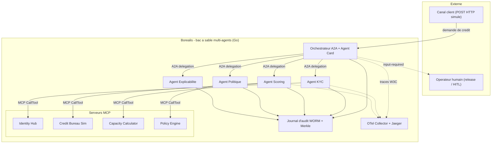
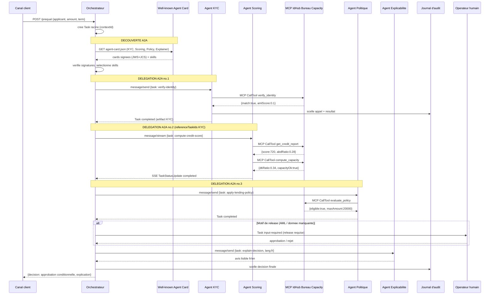
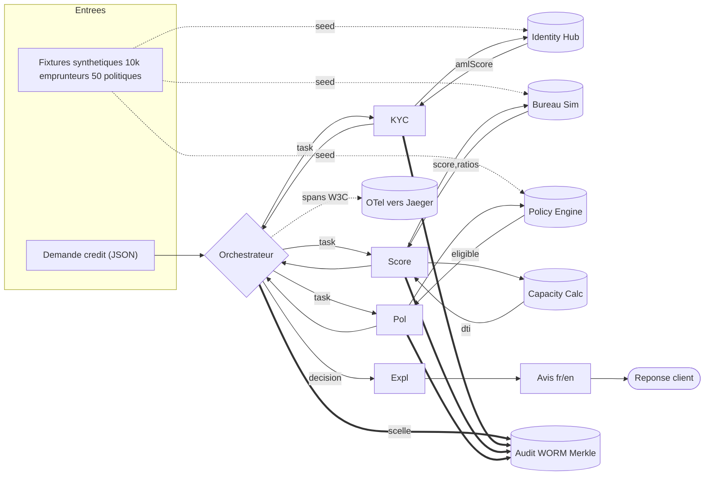
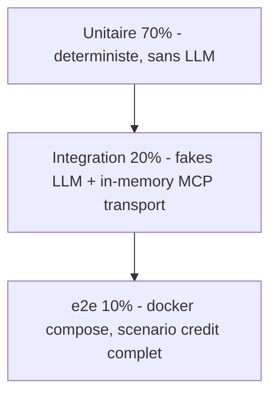
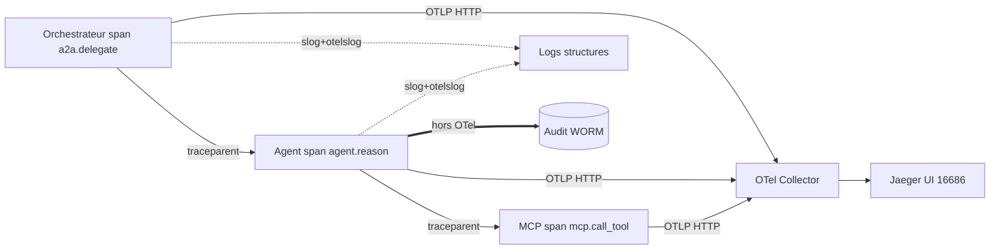

# PRD — Borealis : Implémentation de référence exécutable de l'interopérabilité agentique MCP + A2A

| | |
|---|---|
| **Titre** | Borealis — Bac à sable multi-agents (MCP + A2A) pour la pré-qualification de crédit |
| **Sous-titre** | Implémentation de référence open-source matérialisant l'Annexe B de la monographie *InteroperabiliteAgentique* |
| **Auteur / Commanditaire** | André-Guy Bruneau, M.Sc. informatique — architecte, services financiers coopératifs |
| **Version** | 1.0 |
| **Date** | 2026-07-04 |
| **Statut** | Version finale pour revue par les personae |
| **Langue** | Français (Québec), interface bilingue fr/en |
| **Licence pressentie** | Apache 2.0 (code), CC BY 4.0 (documentation et jeux de données fictifs) |

> **Avertissement de fiction.** « Coopérative financière Boréalis » est une entité **entièrement fictive**. Toutes les données (emprunteurs, cotes, historiques) sont **synthétiques**. Borealis n'est **pas** un système de production, n'est relié à aucun système réel, et ne doit jamais l'être. Aucune donnée personnelle réelle ne transite par ce dépôt.

---

## Table des matières

0. [En-tête](#0-en-tête) *(ci-dessus)*
1. [Résumé exécutif / Vision](#1-résumé-exécutif--vision)
2. [Contexte et énoncé du problème](#2-contexte-et-énoncé-du-problème)
3. [Buts et non-buts](#3-buts-et-non-buts)
4. [Personae et parties prenantes](#4-personae-et-parties-prenantes)
5. [Cas d'usage métier : pré-qualification de crédit](#5-cas-dusage-métier--pré-qualification-de-crédit)
6. [Architecture cible](#6-architecture-cible)
7. [Choix technologiques et justification](#7-choix-technologiques-et-justification)
8. [Exigences fonctionnelles (MoSCoW)](#8-exigences-fonctionnelles-moscow)
9. [Contrats et modèle de données](#9-contrats-et-modèle-de-données)
10. [Exigences non-fonctionnelles (NFR)](#10-exigences-non-fonctionnelles-nfr)
11. [Sécurité, identité et conformité](#11-sécurité-identité-et-conformité)
12. [Stratégie de test et qualité](#12-stratégie-de-test-et-qualité)
13. [Observabilité](#13-observabilité)
14. [Arborescence du dépôt et conventions](#14-arborescence-du-dépôt-et-conventions)
15. [Feuille de route et jalons](#15-feuille-de-route-et-jalons)
16. [Critères d'acceptation globaux / Definition of Done](#16-critères-dacceptation-globaux--definition-of-done)
17. [Métriques de succès / KPIs](#17-métriques-de-succès--kpis)
18. [Risques et mitigations](#18-risques-et-mitigations)
19. [Décisions d'architecture initiales (ADR seeds)](#19-décisions-darchitecture-initiales-adr-seeds)
20. [Dépendances et hypothèses](#20-dépendances-et-hypothèses)
21. [Évolution future / alignement prospectif 2027-2032](#21-évolution-future--alignement-prospectif-2027-2032)
22. [Glossaire et références](#22-glossaire-et-références)

---

## 1. Résumé exécutif / Vision

**En une phrase.** Borealis transforme le plan directeur écrit de l'Annexe B de la monographie *InteroperabiliteAgentique* en un **démonstrateur Go qui tourne** : cinq agents spécialisés se découvrent par **Agent Card (A2A)**, se délèguent des tâches, et consomment outils et données par **serveurs MCP**, sur un cas d'usage unique et concret — la **pré-qualification d'une demande de prêt personnel**.

**Le pitch.** La monographie a démontré, sur 566 pages, *comment* l'interopérabilité agentique devrait fonctionner en services financiers d'entreprise : découplage par contrat, isolation, évolution non-disruptive. Ce qu'il manque, c'est la preuve exécutable — l'écart entre « la théorie écrite » et « le code qui tourne ». En 2026, les SDK Go officiels sont matures (`github.com/modelcontextprotocol/go-sdk` v1.6.1, protocole A2A v1.0 GA sous Linux Foundation, `a2a-go`, ADK Go), ce qui rend cette preuve **réalisable à faible coût**. Borealis comble l'écart au niveau de rigueur d'ingénierie de **FibGo** (clean architecture, plancher de couverture 80 %+, tests golden immuables, ADR documentées, détection de course, gate local sans CI distante).

**La thèse à incarner.** Chaque agent est un **C**ontrat (Agent Card signée, découvrable), **I**solé (aucun état partagé, communication par tâche typée), qui **É**volue (ajout de compétences sans casser les consommateurs, découverte dynamique de nouveaux pairs). Borealis rend cette thèse *tangible* : on peut arrêter un agent, en substituer un autre au contrat compatible, et le workflow continue.

**Ce que ce n'est pas.** Pas un système de production. Pas de vraies données. Pas d'entraînement de modèle. Pas la pile IBM complète de l'Annexe B (watsonx Orchestrate, DataPower, MQ z/OS, Confluent managé) — ces éléments sont **remplacés par des équivalents locaux minimaux** ou explicitement **hors-scope**. Le module d'identité complet (NHI, HSM matériel, WORM matériel) est un **candidat #2** distinct ; Borealis en pose seulement les **coutures**.

**Résultat attendu.** Un dépôt clonable où `docker compose up` démarre l'orchestrateur, 4 agents et 4 serveurs MCP ; où `make e2e` exécute le scénario de crédit de bout en bout de façon déterministe ; et où un lecteur de la monographie retrouve, ligne à ligne, les concepts du chapitre 6 (ArchiMate) et de l'Annexe B (invariants 1, 3, 6).

---

## 2. Contexte et énoncé du problème

### 2.1 L'écart théorie → code

La monographie *InteroperabiliteAgentique* (7 chapitres, 566 pages) couvre l'état de l'art de l'interopérabilité agentique en services financiers : les protocoles **MCP** (agent↔outil), **A2A** (agent↔agent) et **ANP** ; la modélisation **ArchiMate** (chapitre 6) ; une pile d'entreprise IBM (watsonx Orchestrate, API Connect, Confluent, MQ, z/OS Connect) ; et un horizon prospectif 2027-2032 (chapitre 7). L'**Annexe B** (~20 000 mots, 28 diagrammes Mermaid) décrit une **architecture de solution appliquée** pour une coopérative financière fictive, « Boréalis ».

Cette Annexe B est un **blueprint** — riche, cohérent, mais **non exécutable**. Un architecte qui la lit ne peut pas *lancer* le système, *casser* un contrat pour voir ce qui échoue, ni *mesurer* la latence d'une délégation A2A. La valeur pédagogique et la crédibilité de la thèse plafonnent tant qu'il n'existe pas d'artefact qui **tourne**.

### 2.2 Pourquoi maintenant

Trois maturités convergent au T2/T3 2026 et rendent la démonstration réalisable **sans sur-ingénierie** :

| Brique | État mi-2026 | Conséquence pour Borealis |
|---|---|---|
| **SDK MCP Go officiel** | `github.com/modelcontextprotocol/go-sdk` — v1.0.0 (mi-2025, gel d'API et garantie de compatibilité), v1.6.1 (mi-2026), maintenu conjointement avec Google, support complet de la spec. Licence MIT (code legacy) + Apache 2.0 (nouvelles contributions). | Serveurs et clients MCP en Go idiomatique ; schémas JSON **inférés** des struct tags via `AddTool[In, Out]` (jamais construits à la main). Pas de SDK maison. |
| **A2A + `a2a-go`** | Protocole gouverné par la **Linux Foundation** (avril 2025), **v1.0 GA (avril 2026)**, 150+ organisations en production (Google, Microsoft, AWS, Salesforce, IBM…), Agent Cards signées (JWS + JCS). SDK Go `a2a-go` (Apache 2.0). | Découverte par `/.well-known/agent-card.json`, délégation par JSON-RPC 2.0 sur HTTP, cycle de vie de Task à 8 états. |
| **ADK Go (optionnel)** | `google/adk-go`, Apache 2.0, intégration native A2A + MCP (`mcptoolset`). API v2 encore jeune. | Utilisable pour une boucle d'agent si nécessaire, mais **derrière une interface** — Borealis n'en dépend pas structurellement (voir §7). |

### 2.3 Le problème en une formulation vérifiable

> *Il n'existe aujourd'hui aucun artefact open-source, exécutable, en Go, au calibre d'ingénierie de FibGo, qui démontre concrètement — sur un cas d'usage financier — le triptyque MCP + A2A + Agent Card et la thèse « découplage, contrat, évolution » de l'Annexe B.*

**Critère de résolution.** Un tiers clone le dépôt, exécute `docker compose up` puis `make e2e`, observe le scénario de crédit se dérouler de bout en bout avec traces distribuées corrélées, et peut arrêter/substituer un agent pour vérifier le découplage — le tout en moins de 15 minutes de mise en route.

---

## 3. Buts et non-buts

### 3.1 Objectifs mesurables (buts)

| ID | Objectif | Critère vérifiable |
|---|---|---|
| **G-1** | Démontrer la **découverte A2A par Agent Card**. | L'orchestrateur découvre ≥ 4 agents pairs via `GET /.well-known/agent-card.json`, sans registre central codé en dur ; test d'intégration vert. |
| **G-2** | Démontrer la **délégation A2A** avec cycle de vie de Task. | Une demande de crédit traverse ≥ 3 délégations chaînées (`referenceTaskIds`) ; les états de Task observés couvrent au moins `submitted → working → completed` et un chemin `input-required`. |
| **G-3** | Démontrer l'**accès aux outils/données par MCP**. | ≥ 3 serveurs MCP exposent des outils appelés via le SDK officiel ; schémas d'E/S validés automatiquement. |
| **G-4** | Incarner la thèse **découplage / contrat / évolution**. | On substitue un agent (ex. Scoring v1 → v2 au contrat compatible) sans modifier l'orchestrateur ; le e2e reste vert. |
| **G-5** | Fournir l'**explicabilité** de la décision de crédit (illustrative Loi 25 art. 12.1). | Chaque décision produit un texte lisible fr/en listant critères, seuils et motif ; couverture 100 % des décisions. |
| **G-6** | Atteindre le **calibre d'ingénierie FibGo**. | Couverture ≥ 80 %, `go test -race` vert, `golangci-lint` vert, `govulncheck` vert, tests golden immuables, ADR à jour, gate local (`scripts/check.{sh,ps1}`). |
| **G-7** | Fournir un **journal d'audit** distinct de l'observabilité. | Journal append-only horodaté et haché (chaîne Merkle), séparé des logs SRE ; test vérifiant l'immuabilité et la chaîne de hachage. |
| **G-8** | Rester **déterministe et reproductible**. | LLM derrière une interface avec fake déterministe ; `make e2e` produit un résultat identique à chaque exécution ; build Docker reproductible (double build, SHA256 identiques). |

### 3.2 Non-buts (hors-scope explicite)

| ID | Hors-scope | Raison / renvoi |
|---|---|---|
| **NG-1** | Système de production de la coopérative réelle. | Démonstrateur uniquement. Confidentialité. |
| **NG-2** | Vraies données personnelles / financières. | 100 % synthétique. Loi 25 / éthique. |
| **NG-3** | Entraînement ou fine-tuning de modèle. | Le scoring utilise soit un fake déterministe, soit un LLM réel **appelé** derrière une interface — jamais entraîné ici. |
| **NG-4** | Module d'identité complet (NHI JIT réel, HSM matériel, WORM matériel, OAuth2 token-exchange multi-hop atténué RFC 8693 complet). | **Candidat #2.** Borealis pose les **coutures** (`securitySchemes`, journal WORM logiciel, PEP minimal) sans les industrialiser. |
| **NG-5** | Pile IBM d'entreprise (watsonx Orchestrate/governance, DataPower, MQ z/OS, API Connect, Confluent managé). | Remplacée par équivalents locaux minimaux (fichiers, HTTP, file en mémoire — pas de Kafka sauf démonstration multi-instance strictement requise). |
| **NG-6** | Haute disponibilité réelle, failover multi-zone, résilience DORA opérationnelle, Kubernetes. | Illustré par des timeouts/retries/circuit-breaker en code ; **pas** de cluster HA. |
| **NG-7** | Conformité réglementaire *réelle* (E-23, AMF, DORA, FINTRAC). | Conformité **illustrative** : les contrôles montrent le *pattern*, ils ne certifient rien. |
| **NG-8** | Passage à l'échelle 40-80 agents (« Ponytail » de l'Annexe B). | Borealis démontre le **pattern réutilisable** sur 5 agents. L'échelle est un travail ultérieur. |
| **NG-9** | Cryptographie post-quantique opérationnelle (ML-DSA/ML-KEM). | **Placeholder** de crypto-agilité seulement (suite d'algorithmes encodée dans le contrat). Migration réelle = 2027+. |

> **Principe directeur (simplicité délibérée).** À chaque exigence, la question posée est : *un pair expérimenté jugerait-il ceci surdimensionné pour un démonstrateur ?* Si oui, on marque le raccourci d'un commentaire `// ponytail:` nommant le plafond et le chemin de montée, et on reste minimal.

---

## 4. Personae et parties prenantes

| Persona | Description | Ce qu'il attend de Borealis | Critère de satisfaction |
|---|---|---|---|
| **Aline — Architecte d'entreprise** (proxy de l'auteur) | Conçoit l'interopérabilité agentique, écrit ArchiMate. | Retrouver les concepts de la monographie dans du code exécutable ; valider la thèse. | Peut mapper chaque composant Go à un élément ArchiMate / une section de l'Annexe B (§6.6). |
| **David — Développeur évaluateur MCP/A2A** | Doit implémenter MCP/A2A dans son organisation ; cherche un exemple de référence Go. | Des patterns copiables : serveur MCP, client A2A, Agent Card, tests. | Peut extraire un serveur MCP et un handler A2A fonctionnels en < 1 h. |
| **Carmen — Auditrice / Conformité** | Vérifie explicabilité, audit, séparation des tâches. | Journal d'audit infalsifiable, explication lisible, maker-checker structurel. | Peut rejouer le journal d'audit d'une décision et lire l'explication fr/en correspondante. |
| **Marc — Lecteur de la monographie** | A lu l'Annexe B ; veut voir « comment ça tourne ». | Un pont clair blueprint → code ; README qui cite les sections. | Lance le e2e et suit le diagramme de séquence §5 dans les traces réelles. |
| **Priya — Future contributrice** | Veut étendre Borealis (nouvel agent, nouveau protocole). | Arborescence lisible, ADR, conventions, gate local. | Ajoute un agent au contrat compatible ; `scripts/check` reste vert. |

**Autres parties prenantes.** Communauté open-source (validation tierce des specs MCP/A2A), comités de standards (Borealis comme cas de test de convergence — voir §21), formateurs (support pédagogique).

---

## 5. Cas d'usage métier : pré-qualification de crédit

### 5.1 Récit de bout en bout

> **Alix**, cliente de la coopérative fictive Boréalis, soumet une **demande de prêt personnel** de 15 000 $ via un canal (simulé par un `POST` HTTP à l'orchestrateur). Le système doit rendre une **pré-évaluation** : approbation conditionnelle, refus, ou demande d'information complémentaire — **jamais un octroi ferme irréversible** (celui-ci reste sous mandat humain, invariant 1 de l'Annexe B).

1. **Réception.** L'**Orchestrateur** reçoit la demande, crée une **Task A2A racine** (`contextId` groupant le dossier).
2. **Découverte.** Il lit les **Agent Cards** des pairs disponibles (`/.well-known/agent-card.json`), vérifie leurs signatures (JWS + JCS), et choisit les compétences pertinentes (`skills`).
3. **KYC (vérification identité).** Délégation A2A à l'**Agent KYC**, qui appelle le serveur MCP **Identity Hub** (vérification NAS/SIN synthétique, correspondance, listes OFAC/PEP simulées).
4. **Scoring (solvabilité).** Délégation à l'**Agent Scoring**, qui consomme le MCP **Credit Bureau Sim** (cote synthétique, ratios ABD/ATD) et le MCP **Capacity Calculator** (calcul de versement PMT, ratio charges/revenu). Le raisonnement passe par un LLM **derrière une interface** (fake déterministe en test).
5. **Politique.** Délégation à l'**Agent Politique**, qui appelle le MCP **Policy Engine** (tables d'octroi par segment : âge, ratios max, plafonds).
6. **Décision + explicabilité.** L'orchestrateur agrège ; l'**Agent Explicabilité** produit l'avis lisible fr/en (approbation conditionnelle / refus motivé).
7. **Human-in-the-loop.** Si un motif l'exige (ex. AML élevé, données manquantes), la Task passe à `input-required` / `auth-required` : release humaine requise avant tout pas irréversible.
8. **Audit.** Chaque appel d'outil, chaque décision, chaque donnée traitée est scellé dans le **journal d'audit WORM** (haché, chaîné Merkle), distinct des traces SRE.

### 5.2 User stories (format « En tant que… »)

| ID | User story | Priorité |
|---|---|---|
| US-1 | En tant qu'**orchestrateur**, je veux **découvrir les agents pairs par Agent Card**, afin de router les tâches sans registre codé en dur. | Must |
| US-2 | En tant qu'**Agent KYC**, je veux **appeler l'outil MCP Identity Hub**, afin de vérifier l'identité synthétique de la demandeuse. | Must |
| US-3 | En tant qu'**Agent Scoring**, je veux **consommer Credit Bureau Sim + Capacity Calculator par MCP**, afin de calculer un score de solvabilité. | Must |
| US-4 | En tant qu'**orchestrateur**, je veux **chaîner les délégations par `referenceTaskIds`**, afin de composer un workflow multi-agents traçable. | Must |
| US-5 | En tant qu'**Agent Explicabilité**, je veux **produire un avis lisible fr/en**, afin de satisfaire le droit à l'explication (illustratif Loi 25 art. 12.1). | Must |
| US-6 | En tant qu'**auditrice**, je veux **un journal d'audit infalsifiable et rejouable**, afin de reconstituer toute décision. | Must |
| US-7 | En tant qu'**opérateur humain**, je veux **une release sur l'irréversible** (état `input-required`), afin qu'aucune action ferme ne parte sans validation. | Must |
| US-8 | En tant que **développeur**, je veux **suivre le workflow en streaming (SSE)**, afin d'observer l'avancement en temps réel. | Should |
| US-9 | En tant qu'**architecte**, je veux **substituer un agent au contrat compatible**, afin de prouver le découplage. | Should |
| US-10 | En tant qu'**opérateur**, je veux **une notification push webhook** en fin de tâche longue, afin de ne pas sonder. | Could |
| US-11 | En tant qu'**utilisateur**, je veux **choisir la langue de l'avis (fr/en)**, afin d'être servi dans ma langue. | Should |
| US-12 | En tant que **système**, je veux **ne jamais réaliser d'octroi ferme irréversible**, afin de respecter l'invariant 1. | Won't (dans ce périmètre) |

---

## 6. Architecture cible

### 6.1 Inventaire des agents (A2A)

| Agent | Rôle | Niveau d'autonomie | `skills` (Agent Card) | Consomme (MCP) |
|---|---|---|---|---|
| **Orchestrateur** (`cmd/borealis-orchestrator`) | Chef d'orchestre : reçoit la demande, découvre, délègue, agrège, gère la release. | L1 (préparateur) | `orchestrate-prequal` | — (délègue en A2A) |
| **Agent KYC** (`cmd/agent-kyc`) | Vérification identité synthétique, listes PEP/OFAC simulées. | L1 | `verify-identity` | Identity Hub |
| **Agent Scoring** (`cmd/agent-scoring`) | Évaluation de solvabilité (score, ratios). | L1 | `compute-credit-score` | Credit Bureau Sim, Capacity Calculator |
| **Agent Politique** (`cmd/agent-policy`) | Application des règles d'octroi par segment. | L1 | `apply-lending-policy` | Policy Engine |
| **Agent Explicabilité** (`cmd/agent-explainer`) | Génération de l'avis lisible fr/en. | L0 (assistant) | `explain-decision` | — (règles + prose) |

> **Simplicité.** 5 agents suffisent à démontrer découverte + délégation + chaînage + substitution. `// ponytail: 5 agents = pattern; montée à N agents = ajout de cmd/agent-*, aucun changement d'orchestrateur.`

### 6.2 Inventaire des serveurs MCP et outils

| Serveur MCP | Outils exposés (`AddTool`) | Entrée (schéma inféré) | Sortie |
|---|---|---|---|
| **Identity Hub** (`cmd/mcp-identity`) | `verify_identity`, `check_watchlists` | `{applicantId, sin, name}` | `{match: bool, watchlistHit: bool, amlScore: float}` |
| **Credit Bureau Sim** (`cmd/mcp-bureau`) | `get_credit_report` | `{applicantId}` | `{score int, abdRatio, atdRatio, defaults int}` |
| **Capacity Calculator** (`cmd/mcp-capacity`) | `compute_capacity` | `{income, debts, requestedAmount, termMonths}` | `{monthlyPayment, dtiRatio, capacityOk bool}` |
| **Policy Engine** (`cmd/mcp-policy`) | `evaluate_policy` | `{segment, age, abdRatio, atdRatio, amount}` | `{eligible bool, maxAmount, reasons []}` |

> Chaque serveur expose un contrat de service : E/S en JSON-Schema (inféré), SLO de latence (~100-500 ms p99), énum d'erreurs (`InvalidInput`, `ServiceUnavailable`, `Unauthorized`, `NotFound`). Au moins un serveur expose aussi **une ressource** (FR-12) et **un prompt** (FR-13) MCP.

### 6.3 Diagramme de contexte / composants (C4 niveau 1-2)



### 6.4 Diagramme de séquence — scénario de crédit (découverte → délégation → MCP → réponse)



### 6.5 Diagramme de flux de données



### 6.6 Mapping ArchiMate / C4 / couches de la monographie

| Élément Borealis | C4 | ArchiMate (ch.6) | Annexe B |
|---|---|---|---|
| Agent (Orchestrateur, KYC…) | Container | Application Component | Agents spécialisés, invariant 1 (autonomie graduée) |
| Boucle de raisonnement | Component | Application Process | « reasoning loop » |
| Serveur MCP | Container | Application Component + Application Service | Serveurs d'outils (dorsale tri-plan) |
| Outil MCP | Component | Application Service | Contrat de service (input/output/SLO) |
| Agent Card | Artefact | Contract / Application Interface | Carte signée, découverte |
| Délégation A2A | Flux | Flow relationship (typé) | Orchestration agent↔agent |
| Journal d'audit WORM | Container | Data Object (immuable) | §3.5-3.7, audit ≠ observabilité |
| PEP minimal | Component | Application Service (contrôle) | Invariant 3 (PEP obligatoire) |
| Release humaine | Interaction | Business Interaction | Invariant 1 (release sur l'irréversible) |

---

## 7. Choix technologiques et justification

### 7.1 Tableau de décision

| Domaine | Choix | Alternatives écartées | Justification |
|---|---|---|---|
| **Langage** | Go 1.22+ | Python, Java, TypeScript | Concurrence idiomatique, binaire unique, `slog` stdlib, SDK MCP/A2A officiels en Go, aligne le calibre FibGo. |
| **MCP** | `github.com/modelcontextprotocol/go-sdk` v1.6.x | `mark3labs/mcp-go`, `metoro/mcp-golang` | SDK **officiel**, gel d'API depuis v1.0.0, schémas inférés (`google/jsonschema-go`), maintenu avec Google. `mark3labs` a influencé le design mais a une API divergente et n'est plus la référence. |
| **A2A** | `a2a-go` (a2aproject / a2aserver) | HTTP inter-agents maison, gRPC direct | Contrat découplé, Agent Cards signées, cycle de vie de Task normalisé, écosystème 150+ orgs sous Linux Foundation. Un HTTP maison réinvente le protocole. |
| **ADK Go** | **Optionnel, derrière interface** | Dépendance structurelle à ADK | ADK Go intègre A2A+MCP mais est jeune (~8.4k étoiles, risque de *breaking changes* v2.x). Borealis l'isole derrière `internal/agent.Reasoner` → substituable. |
| **Transport MCP** | `stdio` (dév/test) → `StreamableHTTP` (multi-client) | HTTP+SSE legacy (déprécié mars 2025) | `stdio` = zéro infra pour tests unitaires ; Streamable HTTP = standard courant depuis mars 2025 pour le multi-client A2A. SSE legacy exclu. |
| **Transport A2A** | JSON-RPC 2.0 / HTTP + **SSE** (streaming) | Polling seul, webhooks d'abord | JSON-RPC simple pour le happy path ; SSE (`text/event-stream`) pour le streaming temps réel (US-8). Webhooks push = `Could` (US-10). |
| **LLM** | **Interface `Reasoner`** : fake déterministe (défaut) + adaptateur LLM réel optionnel | LLM réel obligatoire | Déterminisme des tests (G-8). Le fake retourne des réponses préconfigurées par scénario (`approved`, `denied`, `escalate`). |
| **Orchestration locale** | `docker compose` | Kubernetes, k3d | Repro locale, zéro cluster. K8s = hors-scope (NG-6). |
| **Observabilité** | OpenTelemetry (OTLP HTTP) + Jaeger + `otelslog` | Logs bruts, Datadog | Traces distribuées W3C à travers A2A/MCP ; corrélation par `task id`. Gratuit, local. |
| **Logs** | `slog` (stdlib) + pont `otelslog` | `zap`, `logrus` | Stdlib, `trace_id`/`span_id` injectés. Pas de dépendance de logging. |
| **File d'attente release** | File en mémoire (défaut) ; Kafka local seulement si démontré nécessaire | Confluent managé, MQ z/OS | Simplicité. La sémantique « exactly-once » de MQ est **simulée** par idempotence + dédup. `// ponytail: file mémoire; Kafka local si démo multi-instance requise.` |
| **Crypto Agent Card** | `crypto/ecdsa` + `crypto/rsa` (JWS RS256 + canonicalisation JCS) stdlib | Bibliothèque JOSE tierce | Signature/vérification JWS suffisante en stdlib. Post-quantique = placeholder (NG-9). |
| **Audit WORM** | Fichier append-only + `crypto/sha256` (chaîne Merkle) | HSM matériel, Db2 immuable | Démontre le *pattern* WORM en pur Go. HSM réel = candidat #2 (NG-4). |

### 7.2 Interface d'isolation du LLM (exemple Go)

```go
// internal/agent/reasoner.go
package agent

import "context"

// Reasoner isole toute inférence LLM derrière un contrat étroit.
// Le fake déterministe (tests) et l'adaptateur LLM réel l'implémentent tous deux.
type Reasoner interface {
    // Decide prend un contexte de dossier et retourne une décision structurée.
    Decide(ctx context.Context, in DecisionInput) (DecisionOutput, error)
}

// ponytail: interface à une méthode; on l'élargit seulement si un 2e usage réel apparaît.
```

### 7.3 Note sur l'authentification inter-agents (état mi-2026)

Le côté **client** OAuth du SDK MCP Go n'est pas entièrement stabilisé mi-2026 (les primitives **serveur** existent via les packages `auth`/`oauthex`). Conséquence de conception : la couture d'auth A2A de Borealis s'appuie sur un **jeton porteur (bearer JWT) via un IdP mock local** plutôt que sur un flux OAuth complet côté client. `// ponytail: bearer + IdP mock; OAuth client complet et token-exchange RFC 8693 = candidat #2 quand le SDK stabilise le côté client.`

---

## 8. Exigences fonctionnelles (MoSCoW)

Chaque exigence porte un ID `FR-xx`, une priorité MoSCoW et un **critère d'acceptation vérifiable**.

### 8.1 Découverte & Agent Card

| ID | Priorité | Exigence | Critère d'acceptation |
|---|---|---|---|
| **FR-01** | Must | Chaque agent publie une Agent Card à `/.well-known/agent-card.json` (5 champs obligatoires : `name`, `description`, `version`, `url`, `skills`). | `GET` sans auth retourne un JSON valide contre le schéma A2A ; test de contrat vert. |
| **FR-02** | Must | L'orchestrateur découvre les pairs via leur card et sélectionne les `skills` requis (aucun endpoint codé en dur autre que les URL de base configurées). | Test : retirer un agent de la config → l'orchestrateur ne le route plus, sans modif de code. |
| **FR-03** | Should | Les Agent Cards sont **signées (JWS + JCS)** et vérifiées avant routage. | Card à signature invalide → rejet + entrée d'audit ; test négatif vert. |
| **FR-04** | Could | Les cards déclarent `capabilities.streaming` et `pushNotifications`. | L'orchestrateur choisit le mode de transport selon la capability annoncée. |

### 8.2 Délégation A2A & cycle de vie de Task

| ID | Priorité | Exigence | Critère d'acceptation |
|---|---|---|---|
| **FR-05** | Must | L'orchestrateur délègue par `message/send` (JSON-RPC 2.0) et suit le cycle de vie de Task. | États observés couvrent `submitted → working → completed` ; test d'intégration vert. |
| **FR-06** | Must | Les tâches se chaînent par `referenceTaskIds` (contextId partagé). | Le dossier KYC est référencé par la tâche Scoring ; assertion sur les IDs chaînés. |
| **FR-07** | Must | Gestion des états terminaux (`completed`, `failed`, `canceled`, `rejected`) irréversibles. | Un `failed` ne peut pas transiter vers `completed` ; test de machine à états. |
| **FR-08** | Should | Streaming SSE (`message/stream`) pour les tâches longues. | Le client reçoit ≥ 2 `TaskStatusUpdateEvent` en `text/event-stream` ; test SSE vert. |
| **FR-09** | Could | Notification push webhook (`PushNotificationConfig`) en fin de tâche. | Le webhook reçoit un `POST` signé ; vérification token + timestamp (anti-rejeu). |

### 8.3 Outils, ressources et prompts MCP

| ID | Priorité | Exigence | Critère d'acceptation |
|---|---|---|---|
| **FR-10** | Must | Chaque serveur MCP expose ses outils via `AddTool[In, Out]` (schémas inférés des struct tags). | `session.CallTool` retourne un résultat validé ; schéma d'entrée rejette un input invalide (JSON-RPC -32602). |
| **FR-11** | Must | Les agents appellent les outils MCP via le SDK officiel (client `NewClient` + `Connect`). | Test d'intégration : chaque agent appelle ≥ 1 outil et consomme le résultat. |
| **FR-12** | Should | Exposer ≥ 1 **ressource** MCP (ex. `credit:///application/{id}/assessment`) via `AddResourceTemplate`. | `ReadResource` retourne l'évaluation ; `ResourceNotFoundError` sur URI inconnue. |
| **FR-13** | Should | Exposer ≥ 1 **prompt** MCP (ex. gabarit d'avis d'explicabilité) via `AddPrompt`. | `GetPrompt` retourne un `GetPromptResult` avec messages ; test vert. |
| **FR-14** | Must | Notification de progression pour les évaluations longues (`NotifyProgress`). | Le token de progression déclenche ≥ 1 `ProgressNotification` ; assertion. |

### 8.4 Erreurs, compensation, HITL

| ID | Priorité | Exigence | Critère d'acceptation |
|---|---|---|---|
| **FR-15** | Must | Distinguer erreurs protocole (JSON-RPC -32602) des erreurs métier (`isError: true` dans `CallToolResult`). | Deux tests : outil inconnu → -32602 ; entrée métier invalide → `isError`. Aucun `panic`. |
| **FR-16** | Must | **Human-in-the-loop** : sur motif de release, la Task passe `input-required` et attend l'approbation. | Scénario AML élevé → `input-required` ; sans approbation, aucune suite ; test vert. |
| **FR-17** | Should | Timeouts + retries avec backoff exponentiel + circuit-breaker sur appels MCP/A2A. | Serveur MCP indisponible → retry borné puis échec propre ; test d'injection de panne. |
| **FR-18** | Should | Idempotence des délégations (même `contextId` + mêmes params rejoués = pas de double effet). | Rejeu identique → un seul effet ; entrée d'audit signale le doublon. |

### 8.5 Audit & explicabilité

| ID | Priorité | Exigence | Critère d'acceptation |
|---|---|---|---|
| **FR-19** | Must | Journal d'audit **append-only**, horodaté, haché en chaîne (Merkle), distinct des logs SRE. | Toute tentative de réécriture rompt la chaîne ; test de vérification Merkle vert. |
| **FR-20** | Must | Chaque entrée d'audit trace : identité agent (KYA), identité demandeur (KYC), timestamp, action, résultat, version de modèle/contrat. | Assertion sur la présence des 6 champs par entrée. |
| **FR-21** | Must | **Explicabilité** : chaque décision produit un avis lisible fr/en (critères, seuils, motif). | Couverture 100 % des décisions ; latence < 500 ms ; snapshot golden fr et en. |
| **FR-22** | Should | Explication **hybride** : règles codées + importance de features + 1-2 phrases de contexte (jamais gabarit LLM seul). | Sur refus `score<300`, l'avis contient un motif codé déterministe ; test golden. |
| **FR-23** | Could | Export du journal d'audit dans un format rejouable (JSONL) pour l'auditrice. | `make audit-export` produit un JSONL ; rejeu reconstitue la décision. |

### 8.6 Séparation des tâches (maker-checker)

| ID | Priorité | Exigence | Critère d'acceptation |
|---|---|---|---|
| **FR-24** | Should | Aucun flux direct entre l'agent qui prépare (maker) et celui qui approuve (checker) ; passage par l'orchestrateur/journal. | Test topologique : le préparateur ne peut appeler directement l'approbateur. |
| **FR-25** | Won't | Octroi ferme irréversible automatisé. | **Explicitement absent.** Le système s'arrête à la pré-évaluation ; toute action ferme = release humaine hors-scope. |

---

## 9. Contrats et modèle de données

### 9.1 Agent Card — exemple (Agent Scoring)

```json
{
  "name": "borealis-agent-scoring",
  "description": "Évalue la solvabilité d'une demande de prêt personnel (score, ratios, capacité).",
  "version": "1.0.0",
  "url": "http://agent-scoring:8003/a2a",
  "provider": { "organization": "Coopérative financière Boréalis (fictive)", "url": "https://example.invalid/borealis" },
  "capabilities": { "streaming": true, "pushNotifications": false, "extendedAgentCard": false },
  "defaultInputModes": ["application/json"],
  "defaultOutputModes": ["application/json"],
  "skills": [
    {
      "id": "compute-credit-score",
      "name": "Évaluation de solvabilité",
      "description": "Calcule un score de crédit et les ratios à partir de données bureau + capacité.",
      "tags": ["credit", "scoring", "prequalification"],
      "examples": [
        { "input": "{\"applicantId\":\"A123\",\"income\":72000,\"amount\":15000,\"termMonths\":48}",
          "output": "{\"score\":720,\"tier\":\"bon\",\"dtiRatio\":0.34,\"capacityOk\":true}" }
      ]
    }
  ],
  "securitySchemes": {
    "bearerAuth": { "type": "http", "scheme": "bearer", "bearerFormat": "JWT" }
  },
  "security": [ { "bearerAuth": [] } ],
  "signatures": [ { "protected": "…", "signature": "…" } ]
}
```

> Schémas de sécurité A2A supportés par la spec : `apiKey`, `http` (bearer), `oauth2`, `openIdConnect`, `mtls`. Borealis implémente `bearerAuth` (JWT) comme cas minimal ; les autres restent déclaratifs.

### 9.2 Schéma d'outil MCP — exemple Go (schéma inféré)

```go
// cmd/mcp-capacity/main.go
package main

import (
    "context"
    "math"

    "github.com/modelcontextprotocol/go-sdk/mcp"
)

type CapacityIn struct {
    Income          float64 `json:"income" jsonschema:"revenu annuel brut de la demandeuse"`
    Debts           float64 `json:"debts" jsonschema:"total des autres dettes mensuelles"`
    RequestedAmount float64 `json:"requestedAmount" jsonschema:"montant demandé"`
    TermMonths      int     `json:"termMonths" jsonschema:"durée du prêt en mois"`
}

type CapacityOut struct {
    MonthlyPayment float64 `json:"monthlyPayment"`
    DTIRatio       float64 `json:"dtiRatio"`
    CapacityOk     bool    `json:"capacityOk"`
}

// Signature ToolHandlerFor[In, Out] : args In déjà déballés et validés par le SDK.
func computeCapacity(ctx context.Context, req *mcp.CallToolRequest, in CapacityIn) (*mcp.CallToolResult, CapacityOut, error) {
    // ponytail: PMT standard, pas d'amortissement fiscal — démonstrateur.
    r := 0.09 / 12.0
    n := float64(in.TermMonths)
    pmt := in.RequestedAmount * r / (1 - math.Pow(1+r, -n))
    dti := (pmt + in.Debts) / (in.Income / 12.0)
    return nil, CapacityOut{
        MonthlyPayment: round2(pmt),
        DTIRatio:       round2(dti),
        CapacityOk:     dti <= 0.40,
    }, nil
}

func round2(x float64) float64 { return math.Round(x*100) / 100 }

func main() {
    s := mcp.NewServer(&mcp.Implementation{Name: "capacity-calculator", Version: "v1.0.0"}, nil)
    mcp.AddTool(s, &mcp.Tool{Name: "compute_capacity", Description: "calcule le versement et le ratio DTI"}, computeCapacity)
    _ = s.Run(context.Background(), &mcp.StdioTransport{})
}
```

### 9.3 Structure de la Task A2A et des artefacts (illustratif)

```json
{
  "id": "task-7f3a…",
  "contextId": "ctx-alix-15000",
  "state": "completed",
  "referenceTaskIds": ["task-kyc-1a2b…"],
  "messages": [
    { "role": "user", "content": [{ "type": "text", "text": "évaluer solvabilité A123" }] },
    { "role": "agent", "content": [{ "type": "text", "text": "score calculé" }] }
  ],
  "artifacts": [
    { "name": "credit-score", "mimeType": "application/json",
      "data": { "score": 720, "tier": "bon", "dtiRatio": 0.34, "capacityOk": true } }
  ],
  "timestamp": "2026-07-04T14:22:11Z"
}
```

### 9.4 Format du journal d'audit (JSONL, une entrée)

```json
{
  "seq": 42,
  "ts": "2026-07-04T14:22:11.331Z",
  "kya": "nhi:agent:scoring@borealis",
  "kyc": "applicant:A123",
  "action": "mcp.CallTool:compute_capacity",
  "input_hash": "sha256:9af1…",
  "result": "capacityOk=true dti=0.34",
  "model_version": "reasoner-fake:v1 | policy-contract:1.0.0",
  "prev_hash": "sha256:be22…",
  "entry_hash": "sha256:41cd…"
}
```

> `entry_hash = sha256(seq || ts || kya || kyc || action || input_hash || result || prev_hash)`. La chaîne de `prev_hash` forme la liste chaînée Merkle vérifiable de bout en bout.

### 9.5 Jeux de données fictifs (seeding)

| Fichier | Contenu | Volume |
|---|---|---|
| `test/fixtures/borrowers.json` | Emprunteurs synthétiques `{id, prénom, nom, sin(fictif), revenu, dettes, cote, defaults}` | 10 000 |
| `test/fixtures/policies.csv` | Tables d'octroi `{segment, âge_min, âge_max, abd_max, atd_max, plafond}` | 50 |
| `test/fixtures/history.jsonl` | Historiques de crédit synthétiques | ~100 000 (Git LFS si > 100 Mo) |
| `test/golden/decision_matrix.json` | Matrice décision attendue par cas de test (immuable) | ~30 cas |

> **Réalisme.** Fictif mais crédible : plages de scores et ratios plausibles pour une coopérative canadienne, avec cas riches (refus AML, refus scoring, approbation conditionnelle, données manquantes). Le générateur est **seedé et déterministe** ; aucun PII réel. `// ponytail: générateur seedé déterministe; aucun PII réel.`

---

## 10. Exigences non-fonctionnelles (NFR)

| ID | Domaine | Cible / SLO | Critère vérifiable |
|---|---|---|---|
| **NFR-01** | Latence (boucle agent) | P99 boucle complète < 2 s (nominal, fake LLM) | Benchmark `make bench` ; régression > 5 % = blocage. |
| **NFR-02** | Latence (MCP) | P95 appel outil < 500 ms | Métrique OTel `inference_latency` ; assertion sur histogramme. |
| **NFR-03** | Audit | Écriture audit < 200 ms P99 ; ≥ 1000 écritures/s | Micro-benchmark du logger WORM. |
| **NFR-04** | Résilience | Détection panne MCP/A2A < 30 s ; retries bornés | Test d'injection de panne ; circuit-breaker s'ouvre. |
| **NFR-05** | Idempotence | Rejeu identique → aucun double effet | Test FR-18. |
| **NFR-06** | Sécurité réseau | 0 egress hors zone (illustratif Loi 25 — résidence des données) | `docker compose` sans réseau externe ; test que les agents ne joignent que les hôtes déclarés. |
| **NFR-07** | Observabilité | Trace ininterrompue à travers A2A + MCP | Un `trace_id` unique corrèle toutes les spans d'un dossier dans Jaeger. |
| **NFR-08** | Portabilité | Build et exécution Linux/macOS/Windows ; binaire unique | `make build` sur 3 OS ; images Docker `linux/amd64` + `arm64`. |
| **NFR-09** | Reproductibilité | Build Docker reproductible (SHA256 identiques) | `deploy/scripts/docker-build-verify.sh` : 2 builds → SHA256 égaux (base épinglée, `SOURCE_DATE_EPOCH`). |
| **NFR-10** | Testabilité / déterminisme | e2e déterministe (fake LLM, golden immuables) | `make e2e` × 3 → sorties identiques. |
| **NFR-11** | Couverture | ≥ 80 % global ; unitaire ≥ 95 % ; intégration 60-70 % | `make coverage` échoue sous 80 %. |
| **NFR-12** | i18n | Avis d'explicabilité fr/en complet | Golden fr et en ; sélection par `lang`. |
| **NFR-13** | Licence | Apache 2.0 (code), CC BY 4.0 (docs/données) | Fichiers `LICENSE` + en-têtes ; `go-licenses` vert. |
| **NFR-14** | Sécurité dépendances | 0 vulnérabilité connue haute/critique | `govulncheck` vert dans le gate. |

---

## 11. Sécurité, identité et conformité

### 11.1 Couture d'identité d'agent (posture minimale, coutures pour candidat #2)

- **Agent Card `securitySchemes`.** Chaque agent déclare un schéma (`bearerAuth` JWT au minimum ; `oauth2`, `mtls` déclaratifs). Borealis implémente le **cas simple** : jeton porteur signé, injecté par le transport `a2a-go`.
- **Bearer JWT via IdP mock (Should).** L'orchestrateur obtient un jeton court auprès d'un IdP **simulé local**, l'injecte dans l'appel A2A. Le flux OAuth2 client-credentials complet est reporté car le **côté client OAuth du SDK MCP n'est pas stabilisé mi-2026** (voir §7.3). `// ponytail: IdP mock + bearer en dev; OAuth client-credentials + RFC 8693 token-exchange multi-hop = candidat #2.`
- **Moindre privilège.** Chaque agent ne déclare que les `skills` et scopes strictement requis ; l'orchestrateur consomme les scopes depuis la card, jamais en dur.
- **Secrets.** Aucune clé longue durée dans les agents. Clés de signature de card dans `.env` local (dev) — **jamais** de secret réel. Posture *secretless* réelle (JIT, HSM) = candidat #2 (NG-4).
- **Journal d'audit.** WORM logiciel (§9.4), maker-checker structurel (FR-24).
- **Human-in-the-loop.** Release sur l'irréversible (FR-16, invariant 1).

### 11.2 Ce qui est reporté au candidat #2 (identité complète)

| Élément | Statut Borealis | Candidat #2 |
|---|---|---|
| NHI composite (modèle + instance + owner KYH) | Champs présents dans l'audit | Émission JIT réelle via IdP + HSM |
| PEP non-contournable unique | PEP minimal en code (garde avant appel outil) | Gateway de contrôle (type DataPower/Verify) |
| WORM + HSM matériel + rétention pluriannuelle | Fichier append-only + `sha256` | HSM FIPS 140-2 L3, WORM matériel |
| OAuth2 multi-hop atténué (RFC 8693) | Premier hop simple (bearer) | Atténuation transitive A→B→C |
| Post-quantique (ML-DSA/ML-KEM) | Placeholder crypto-agilité | Dual-crypto opérationnel |

### 11.3 Modèle de menace (STRIDE minimal)

| Menace (STRIDE) | Scénario Borealis | Contrôle démontré |
|---|---|---|
| **Spoofing** | Card malveillante substituée à un agent légitime | Vérification signature JWS+JCS avant routage (FR-03) |
| **Tampering** | Réécriture d'une entrée d'audit | Chaîne Merkle rompue → détection (FR-19) |
| **Repudiation** | Agent nie une action | Attribution KYA + KYC dans chaque entrée (FR-20) |
| **Information disclosure** | Fuite de données hors zone | 0 egress hors hôtes déclarés (NFR-06) |
| **Denial of service** | Serveur MCP saturé/lent | Timeout + circuit-breaker (FR-17) |
| **Elevation of privilege** | Orchestrateur compromis émet une requête falsifiée | Bearer JWT + détection de rejeu dans l'audit (même KYA+params → alerte) |

> `// ponytail: STRIDE illustratif sur le périmètre démonstrateur; red-team autonome = travail ultérieur (§21 tendance 5).`

### 11.4 Conformité **illustrative** (démontre le pattern, ne certifie rien)

| Cadre | Illustration dans Borealis | Contrôle exécutable |
|---|---|---|
| **Loi 25 art. 12.1** (droit à l'explication) | Avis lisible fr/en, motif du refus | FR-21, FR-22 ; latence < 500 ms, couverture 100 % |
| **AMF** (transparence IA, non-discrimination) | Détecteur de biais build-time (divergence Gini par groupe) | Rapport CSV ; alerte si écart > 15 % |
| **OSFI E-23** (gouvernance des modèles) | Champ `model_version` dans l'audit ; « factsheet » minimale du reasoner | Entrée d'audit + fiche modèle |
| **FINTRAC** (AML) | `amlScore` du MCP Identity Hub ; refus si > 0.7, escalade HITL si > 0.8 | FR-16 ; test scénario AML |
| **OSFI B-10 / DORA** (tiers TIC) | Chaque serveur MCP = « tiers » avec contrat (SLO, énum d'erreurs) | Registre YAML des serveurs ; ADR-DORA |

> **Rappel.** Ces contrôles sont **pédagogiques**. Borealis montre *où* et *comment* brancher la conformité, pas une conformité opposable.

---

## 12. Stratégie de test et qualité

### 12.1 Pyramide de tests (miroir FibGo)



| Niveau | % cible | Outillage | Détermination |
|---|---|---|---|
| Unitaire | ~70 % | `go test`, `mcp.NewInMemoryTransports()` | Aucun appel LLM ; pur. |
| Intégration | ~20 % | Fakes LLM (`internal/testfakes/reasoner_stub.go`), serveurs MCP réels en mémoire | Réponses préconfigurées par scénario. |
| e2e | ~10 % | `docker compose`, orchestration complète | Fake LLM + golden. |

### 12.2 Tests de contrat

- **Agent Card.** `pkg/a2a` : `AgentCard.Validate()` ; test rejette une card mal formée ou à signature invalide (FR-01, FR-03).
- **Outil MCP.** `pkg/mcpcontract` : le schéma d'entrée rejette un input invalide (JSON-RPC -32602) ; le schéma est bien formé.
- **Propagation de trace.** Test vérifiant que les en-têtes `traceparent` sont injectés dans les appels A2A et MCP (`otelhttp.NewTransport()`) — une couture manquante casse la chaîne (§13).

### 12.3 Golden tests immuables

- `test/golden/trace-approved.json`, `decision_matrix.json`, avis fr/en.
- **Immuables** : toute modification exige un ADR justificatif (comme `fibonacci_golden.json` de FibGo).

### 12.4 Scénarios e2e (1 test Go par scénario, fixtures isolées)

| Scénario | Attendu |
|---|---|
| Happy path (KYC + Score + Politique + Approbation conditionnelle) | Décision positive, avis fr/en, audit scellé. |
| Refus AML (NAS synthétique en liste OFAC) | `amlScore` élevé → refus + escalade HITL. |
| Timeout modèle (Scoring > seuil) | Fallback propre, circuit-breaker, échec sans panic. |
| Signaux conflictuels (KYC ok, score < 300, politique conditionnelle) | Refus motivé, explication cohérente. |
| Échec Explicabilité (agent down) | Escalade HITL, aucune décision silencieuse. |

### 12.5 Gate de qualité (chiffré)

| Cible `make` | Contrôle | Blocage si |
|---|---|---|
| `make lint` | `golangci-lint` (vet, errcheck, staticcheck, contextcheck) | Toute alerte. |
| `make race` | `go test -race -short` | Course détectée. |
| `make vuln` | `govulncheck` | Vulnérabilité haute/critique. |
| `make coverage` | Couverture ≥ 80 % | Sous le plancher. |
| `make bench` | `benchstat` avant/après | Régression perf > 5 %. |
| `scripts/check.{sh,ps1}` | Gate agrégé **local** (pas de CI distante) | N'importe lequel ci-dessus rouge. |

> Note perf : `go test -race` ajoute ~20 % de surcoût CPU/mémoire ; le gate local exécute `-race -short` pour garder la boucle rapide ; la suite `-race` complète peut tourner en mode nightly local.

---

## 13. Observabilité

- **Tracing distribué.** OpenTelemetry (OTLP HTTP) ; propagateur **W3C TraceContext** (`traceparent`/`tracestate`) injecté dans **tous** les appels A2A et MCP. Une seule couture manquante casse la chaîne → **test de contrat** vérifie l'injection d'en-têtes (`otelhttp.NewTransport()`).
- **Corrélation.** Un `trace_id` par dossier (`contextId`) ; `task id` propagé en attribut de span. Dans Jaeger, une requête = une trace continue à travers orchestrateur → agents → serveurs MCP.
- **Logs structurés.** `slog` + pont `otelslog` : chaque enregistrement porte `trace_id`, `span_id`, `agent_id`, `task_id`.
- **Spans nommés (convention).** `a2a.delegate/{skill}`, `mcp.call_tool/{tool}`, `agent.reason`, `audit.seal`, `hitl.await_release`.
- **Séparation audit / SRE.** OTel/Jaeger = **observabilité purgeable** (courte rétention). Journal WORM = **audit réglementaire** (immuable). Purger l'un ne touche jamais l'autre (§9.4, FR-19).
- **Métriques.** Prometheus optionnel : `inference_latency_p99`, `audit_write_latency`, `delegation_count`, `hitl_pending`.



---

## 14. Arborescence du dépôt et conventions

```text
borealis/
├── cmd/                              # Points d'entrée (un binaire par service)
│   ├── borealis-orchestrator/        # Orchestrateur A2A (découverte, délégation, release)
│   ├── agent-kyc/                    # Agent KYC (A2A serveur + client MCP)
│   ├── agent-scoring/                # Agent Scoring
│   ├── agent-policy/                 # Agent Politique
│   ├── agent-explainer/              # Agent Explicabilité
│   ├── mcp-identity/                 # Serveur MCP Identity Hub
│   ├── mcp-bureau/                   # Serveur MCP Credit Bureau Sim
│   ├── mcp-capacity/                 # Serveur MCP Capacity Calculator
│   └── mcp-policy/                   # Serveur MCP Policy Engine
├── internal/                         # Logique privée
│   ├── agent/                        # Base commune d'agent : reasoning loop, Reasoner iface, état L0/L1
│   ├── a2aserver/                    # Helpers A2A (handler, Agent Card, cycle de vie Task)
│   ├── mcpserver/                    # Helpers MCP (enregistrement outils, ressources, prompts)
│   ├── audit/                        # Logger WORM append-only + chaîne Merkle (sha256)
│   ├── observability/                # Bootstrap slog + OTel + otelslog
│   ├── creditdomain/                 # Modèle métier (Applicant, Decision, ratios) — sans I/O
│   ├── conformance/                  # Explicabilité fr/en, détecteur de biais, factsheet E-23
│   ├── hitl/                         # File de release + attente input-required
│   └── testfakes/                    # reasoner_stub.go (fake LLM déterministe), stubs A2A
├── pkg/                              # Contrats publics sérialisables
│   ├── a2a/                          # AgentCard + Validate(), types de Task
│   └── mcpcontract/                  # ToolSchema + validation
├── api/                              # Schémas JSON exportés (agent-card, tool I/O)
├── deploy/
│   ├── docker-compose.yml            # orchestrateur + agents + MCP + otel-collector + jaeger
│   ├── Dockerfile.multi              # multi-stage, base épinglée, SOURCE_DATE_EPOCH
│   └── scripts/docker-build-verify.sh
├── docs/
│   ├── adr/                          # 0001-*.md … (append-only, versionné)
│   ├── ARCHITECTURE.md               # C4 + mapping ArchiMate / Annexe B
│   └── REPRODUCIBILITY.md
├── test/
│   ├── e2e/                          # 1 test Go par scénario
│   ├── fixtures/                     # borrowers.json, policies.csv, history.jsonl
│   └── golden/                       # decision_matrix.json, avis fr/en, trace-approved.json
├── scripts/check.sh                  # Gate local (Unix)
├── scripts/check.ps1                 # Gate local (Windows) — l'auteur est sur Windows 11
├── Makefile                          # build, test, race, vuln, coverage, bench, lint, e2e, docker-*
├── .golangci.yml                     # Lint strict (+ linters custom conformité si faisable)
├── go.mod / go.sum                   # Dépendances épinglées
├── CLAUDE.md                         # Guide pour agents de code (aligné directives globales)
└── README.md                         # Démarrage + pont vers la monographie / Annexe B
```

**Conventions.**
- **Commits** conventionnels, **message en français**.
- **Clean architecture** : `internal/creditdomain` sans I/O ; les serveurs (`cmd/`) branchent l'infra.
- **ADR** : un par décision significative (`docs/adr/NNNN-titre.md`), format Status | Context | Decision | Rationale | Consequences | References. Superseded → lien vers le remplaçant, jamais supprimé.
- **Zéro CI distante** : rigueur **locale** via `scripts/check.{sh,ps1}` (comme FibGo).

---

## 15. Feuille de route et jalons

**Approche incrémentale : *walking skeleton* d'abord.** On fait tourner un chemin de bout en bout minimal (1 agent, 1 outil MCP) avant d'ajouter la richesse.

| Jalon | Fenêtre | Livrables | Critères vérifiables |
|---|---|---|---|
| **M0 — Walking skeleton** | Fondations | Orchestrateur + 1 agent + 1 serveur MCP (stdio) ; boucle L0 ; `slog`+OTel branchés ; ADR-0001..0003. | `go test` vert ; 1 appel MCP réel de bout en bout ; trace visible dans Jaeger ; couverture ≥ 60 %. |
| **M1 — MCP production-grade** | +2 sem | 4 serveurs MCP (schémas inférés, ressources, prompts, `NotifyProgress`) ; découverte par registre local ; circuit-breaker. | Chaque outil validé par test de contrat ; P95 MCP < 500 ms ; couverture ≥ 80 %. |
| **M2 — A2A + délégation** | +2 sem | 5 agents ; Agent Cards signées + découverte ; délégation chaînée (`referenceTaskIds`) ; streaming SSE ; NHI placeholder dans l'audit. | Découverte de ≥ 4 pairs ; scénario happy path e2e vert ; états de Task couverts ; couverture ≥ 85 %. |
| **M3 — Gouvernance & audit** | +2 sem | Journal WORM + Merkle ; PEP minimal ; HITL (`input-required`) ; explicabilité fr/en ; détecteur de biais ; conformité illustrative ; STRIDE. | Vérification Merkle vert ; couverture 100 % des décisions expliquées ; scénario AML → HITL vert ; maker-checker testé. |
| **M4 — Robustesse & repro** | +2 sem | Timeouts/retries/idempotence ; build Docker reproductible ; `docker compose` complet ; `govulncheck` ; substitution d'agent. | `docker compose up` + `make e2e` < 15 min ; double build SHA256 identiques ; substitution Scoring v1→v2 sans casse ; gate local vert. |
| **M5 — Finition & doc** | +2 sem | README pont-monographie ; tous les 5 scénarios e2e ; 8 ADR ; placeholder post-quantique ; audit final style FibGo. | Les 5 scénarios verts ; `scripts/check` vert ; ADR complets ; 0 orphelin (matrice de traçabilité). |

> **Contrainte d'équipe.** ≤ 3 personnes, 12 mois calendaires max (M0→M5). Dépendances explicites en §20.

---

## 16. Critères d'acceptation globaux / Definition of Done

**DoD par exigence (10 items) :**

1. Exigence mappée à une user story + test d'acceptation écrit.
2. `go test -v -race -cover` passe **localement**.
3. Couverture ajoutée ≥ 80 %.
4. Golden test actualisé (immuable sans ADR).
5. Benchmark avant/après si perf-sensible (régression > 5 % = blocage).
6. ADR rédigée si décision technique (pourquoi + alternatives).
7. Doc utilisateur/opérateur mise à jour.
8. Piste d'audit réglementaire présente pour l'action.
9. Renvois à la monographie / Annexe B validés.
10. Commit conventionnel, **message en français**.

**DoD du projet :**

- [ ] `docker compose up` démarre tout ; `make e2e` déroule le scénario de crédit de bout en bout, de façon déterministe.
- [ ] Découverte A2A par Agent Card (≥ 4 pairs) **sans** registre codé en dur.
- [ ] ≥ 3 délégations A2A chaînées ; états de Task couverts ; ≥ 1 chemin `input-required`.
- [ ] ≥ 3 serveurs MCP avec outils validés ; ≥ 1 ressource + ≥ 1 prompt.
- [ ] Substitution d'un agent au contrat compatible → e2e reste vert (thèse démontrée).
- [ ] Explicabilité fr/en, couverture 100 %, < 500 ms.
- [ ] Journal WORM vérifiable (Merkle) distinct des logs SRE.
- [ ] Trace OTel ininterrompue A2A + MCP corrélée par `task id`.
- [ ] Gate local vert : lint, race, vuln, couverture ≥ 80 %, bench sans régression.
- [ ] Build Docker reproductible (SHA256 identiques).
- [ ] 8 ADR rédigées ; README pont-monographie ; matrice de traçabilité sans orphelin.

---

## 17. Métriques de succès / KPIs

| Catégorie | KPI | Cible |
|---|---|---|
| **Technique** | Couverture de test | ≥ 80 % global, ≥ 95 % unitaire |
| Technique | Course détectée (`-race`) | 0 |
| Technique | Vulnérabilités hautes/critiques | 0 |
| Technique | Déterminisme e2e (3 exécutions) | 100 % identiques |
| Technique | Repro Docker (2 builds) | SHA256 identiques |
| Technique | Latence boucle P99 | < 2 s (fake LLM) |
| **Démonstration** | Temps de mise en route (clone → e2e vert) | < 15 min |
| Démonstration | Substitution d'agent sans casse | vérifiée |
| Démonstration | Trace corrélée bout-en-bout dans Jaeger | 1 trace / dossier |
| **Pédagogique** | Concepts de l'Annexe B retrouvables dans le code | ≥ 90 % (matrice §6.6) |
| Pédagogique | ADR documentées | ≥ 8 |
| Pédagogique | Serveur MCP + handler A2A extractibles par un tiers | < 1 h |

---

## 18. Risques et mitigations

| Risque | Prob. | Impact | Mitigation |
|---|---|---|---|
| **Non-déterminisme LLM** casse les tests | Élevée | Élevé | LLM derrière `Reasoner` ; fake déterministe par défaut ; golden immuables. LLM réel = adaptateur optionnel hors gate. |
| **Dérive des specs de protocole** (SDK jeunes, `a2a-go`/ADK v2.x) | Moyenne | Moyen | Épingler les versions ; abstraction protocole (l'orchestrateur ne code jamais « MCP »/« A2A » en dur) ; surveiller releases ; ADR-0001. |
| **Déprécations MCP** (Roots/Sampling dépréciés au protocole 2026-07-28, fenêtre 12 mois ; HTTP+SSE legacy) | Moyenne | Faible | Borealis n'utilise **ni** Roots **ni** Sampling ; transport `stdio`/`StreamableHTTP` uniquement. Retrait planifié après T3 2027 si jamais introduits. |
| **OAuth client MCP non stabilisé mi-2026** | Moyenne | Moyen | Couture d'auth via bearer JWT + IdP mock (§7.3, §11.1) ; OAuth complet = candidat #2 quand le SDK stabilise le côté client. |
| **Sur-ingénierie** (dériver vers la pile IBM complète) | Moyenne | Moyen | Non-buts explicites (§3.2) ; principe `ponytail` ; substituts locaux minimaux ; revue « surdimensionné ? ». |
| **Latence de composition** (5 délégations en série ≈ 2.5 s) | Moyenne | Moyen | Paralléliser KYC ‖ Scoring quand indépendants ; circuit-breaker > 5 s ; NFR-01 mesuré. |
| **Signature JWS / gestion de clés** en Go | Faible | Moyen | `crypto/ecdsa`+`crypto/rsa` stdlib ; clés dev en `.env` ; rotation/HSM = candidat #2. |
| **Streaming SSE** : fuite de ressources sur tâche longue | Faible | Moyen | `context` timeout ; graceful shutdown ; test d'annulation. |
| **Sécurité** (orchestrateur compromis → requête falsifiée) | Faible | Élevé | NHI service-account (mock) + signing JWT + détection de rejeu dans l'audit (même KYA+params → alerte). |
| **Multi-hop delegation** non standardisé (RFC 8693 partiel ; OpenID AARP/COAZ encore draft mi-2026) | Moyenne | Faible (périmètre) | Premier hop seulement ; atténuation transitive explicitement hors-scope (candidat #2). |
| **Taille de payload** MCP (documents crédit volumineux ; limites Streamable HTTP non documentées) | Faible | Faible | Fixtures compactes ; pas de PDF embarqué ; test avec payload réaliste borné. |
| **Réalisme des données fictives** contesté | Faible | Faible | Générateur seedé, plages plausibles, cas riches (§9.5). |
| **Drift prospectif** (horizon 2027-2032 daté trop vite) | Moyenne | Faible | Étiquetage Programmé/Projeté/Spéculatif (§21) ; relecture des chartes standards à chaque jalon. |

---

## 19. Décisions d'architecture initiales (ADR seeds)

| ADR | Décision pressentie | Statut |
|---|---|---|
| **ADR-0001** | Abstraction protocole : la couche d'orchestration n'encode jamais « MCP » ni « A2A » en dur (anticipe la convergence ISO 23894-2). | Proposé |
| **ADR-0002** | LLM derrière l'interface `Reasoner` ; fake déterministe par défaut ; adaptateur LLM réel optionnel hors du gate. | Proposé |
| **ADR-0003** | Observabilité (OTel/Jaeger, purgeable) **séparée** de l'audit (WORM/Merkle, immuable) au niveau stockage. | Proposé |
| **ADR-0004** | Transport MCP : `stdio` en dév/test, `StreamableHTTP` en multi-client ; SSE legacy exclu. | Proposé |
| **ADR-0005** | A2A via `a2a-go` plutôt que HTTP inter-agents maison (contrat, cartes signées, écosystème). | Proposé |
| **ADR-0006** | Crypto-agilité couplée au contrat : la suite d'algorithmes est encodée dans le contrat, pas codée en dur (chemin post-quantique 2027+). | Proposé |
| **ADR-0007** | Stratégie de test : golden datasets immuables + fakes LLM ; pas de régression data-driven ; oracle indépendant (style FibGo). | Proposé |
| **ADR-0008** | Module d'identité (NHI/HSM/WORM matériel/OAuth multi-hop) reporté au candidat #2 ; Borealis pose seulement les coutures. | Proposé |

---

## 20. Dépendances et hypothèses

**Dépendances techniques (épinglées).**

| Dépendance | Version cible | Rôle |
|---|---|---|
| Go | 1.22+ | Langage, `slog`, SDK OTel stable |
| `github.com/modelcontextprotocol/go-sdk` | v1.6.x | MCP client/serveur |
| `a2a-go` (a2aproject / a2aserver) | v1.x | A2A handler/client |
| `google/adk-go` | v2.x | **Optionnel**, derrière `Reasoner` |
| `go.opentelemetry.io/otel` + `otelslog` | courant 2026 | Tracing + logs |
| `otel/opentelemetry-collector` | 0.101.x | Collecteur OTLP |
| Jaeger | courant | Visualisation traces |
| Docker + Compose | courant | Orchestration locale |
| `golangci-lint` | 2026.x | Lint |
| `govulncheck` | courant | Vulnérabilités |

**Hypothèses.**

1. Les SDK MCP/A2A restent stables sur l'horizon du projet (gel d'API MCP confirmé depuis v1.0.0 ; A2A v1.0 GA avril 2026).
2. Un LLM réel n'est **pas** requis pour la démonstration (fake suffit) ; s'il est branché, c'est via API, sans entraînement.
3. L'équipe (≤ 3) travaille en local, sans CI distante (rigueur par gate local).
4. L'environnement de dev couvre Linux/macOS/Windows (l'auteur est sur Windows 11 → `scripts/check.ps1` maintenu).
5. Aucune donnée réelle n'entre jamais dans le dépôt.
6. Le côté client OAuth du SDK MCP peut rester instable ; la couture d'auth n'en dépend pas (bearer JWT via IdP mock).

---

## 21. Évolution future / alignement prospectif 2027-2032

Borealis est conçu pour **ne pas être obsolète en 2032** : il doit servir de cas de test de référence pour valider les specs convergentes. Chaque tendance est étiquetée **Programmé** (fait daté), **Projeté** (spec 2027-2028), **Spéculatif** (pari 2028-2032).

| # | Tendance | Programmé (2026) | Projeté (2027-28) | Spéculatif (2028-32) | Implication Borealis |
|---|---|---|---|---|---|
| 1 | **Convergence MCP ↔ A2A** | Agentic AI Foundation (Linux Foundation), W3C WG / ISO SC 42 | ISO 23894-2 (~2028-Q2) | Marché régional du risque protocolaire | **ADR-0001** : abstraction protocole → migration sans ré-ingénierie. |
| 2 | **Passeport d'agent (VC + post-quantique)** | NIST PQ finalisé (FIPS 203/204) ; W3C VC v2 | VC + OpenID4VP (2027-Q3) | Multi-issuer infalsifiable (2029) | **ADR-0006** : crypto-agilité, placeholder dual-crypto en M5. |
| 3 | **Marchés P2P d'agents** | Agentic AI Foundation spec (2027) ; AP2 (avril 2026) | Pricing dynamique, agent store (2027-Q2/Q3) | Marché décentralisé (2028-29) | Agent Card **décentralisable** (pas décentralisée), prix encodables dans le contrat. |
| 4 | **Interop sémantique BIAN/FIBO/ISO 20022** | FIBO RDF (2027) | ISO 20022 + RDF (2027-28) | Reasoners agents (2028-29) | Contrats MCP/A2A exprimables en BIAN/ISO 20022 (sémantique légère, pas OWL). |
| 5 | **Agentic SOC** | OWASP NHI Top 10 v2 (2027-Q1), NIST AI RMF | Red-team autonome vs défense (2027-28) | Adaptation temps réel (2028-29) | Modèle de menace STRIDE (§11.3) + PEP dès M2-M3. |
| 6 | **Certification inter-fournisseurs (FIDOS2 / ISO 23894-3)** | FIDOS2 launch (2027-Q3), NIST CAISI | Bancs ISO 23894-3 (2028) | Assurance d'agents (2028-29) | Golden tests **certification-ready** dès M1. |

**Ponts vers les autres candidats.**
- **Candidat #2 — Identité complète.** Borealis pose les coutures (NHI dans l'audit, PEP minimal, `securitySchemes`, placeholder PQ). Le #2 industrialise : IdP réel, HSM, WORM matériel, OAuth multi-hop atténué.
- **Candidat #3 — Passage à l'échelle / sémantique.** Contrats BIAN/ISO 20022, registre d'agents décentralisable, marché P2P.

**Calendrier de convergence.** M0-M1 lancés **avant** la finalisation d'ISO 23894-2 (contrats ouverts = sûr) ; M2-M3 alignés sur la ratification VC + FIDOS2 2027 (migration gracieuse, aucune casse) ; post-quantique opérationnel **seulement** 2028+.

---

## 22. Glossaire et références

### 22.1 Glossaire

| Terme | Définition |
|---|---|
| **A2A** | Agent-to-Agent Protocol (Linux Foundation) — orchestration agent↔agent, JSON-RPC 2.0/HTTP, cartes signées. |
| **ADK Go** | Agent Development Kit de Google en Go — intègre A2A + MCP. |
| **ADR** | Architecture Decision Record — décision architecturale versionnée. |
| **Agent Card** | Manifeste JSON d'un agent (`/.well-known/agent-card.json`) : nom, description, version, url, skills, capabilities, securitySchemes, signatures (JWS+JCS). |
| **AP2** | Agent Payments Protocol (avril 2026) — transactions sécurisées entre agents. |
| **BIAN / FIBO** | Ontologies bancaires (Banking Industry Architecture Network / Financial Industry Business Ontology). |
| **DoD** | Definition of Done. |
| **HITL** | Human-in-the-Loop — release/validation humaine. |
| **HSM** | Hardware Security Module. |
| **ISO 20022** | Standard de messages financiers structurés. |
| **JCS** | JSON Canonicalization Scheme (RFC 8785) — base de la signature déterministe d'une Agent Card. |
| **JWS** | JSON Web Signature — signature de la carte. |
| **KYA / KYC / KYH** | Know Your Agent / Customer / Human — attribution d'identité. |
| **MCP** | Model Context Protocol — agent↔outil/données, gouverné via l'Agentic AI Foundation (Linux Foundation). |
| **NHI** | Non-Human Identity — identité d'agent composite (modèle + instance + owner). |
| **PEP** | Policy Enforcement Point — point de contrôle non-contournable. |
| **PMT / DTI / ABD / ATD** | Versement / Debt-to-Income / ratio d'amortissement de la dette / ratio total. |
| **Reasoner** | Interface Go isolant l'inférence LLM (fake déterministe / LLM réel). |
| **Task (A2A)** | Unité de travail A2A à 8 états (`submitted`, `working`, `input-required`, `completed`, `canceled`, `failed`, `rejected`, `auth-required`). |
| **VC** | Verifiable Credential (W3C). |
| **WORM** | Write-Once-Read-Many — stockage append-only immuable. |

### 22.2 Références

**Monographie et portfolio de l'auteur**
- *InteroperabiliteAgentique* (monographie, 566 p., 7 ch.), chapitre 6 (ArchiMate), chapitre 7 (prospectif), **Annexe B — « Coopérative financière Boréalis »** (invariants 1, 3, 6 ; §3.4-3.7 audit/NHI ; §4 dorsale tri-plan).
- *FibGo* — étalon d'ingénierie (clean architecture, couverture ≥ 80 %, golden immuables, ADR 0001-0009, gate local sans CI distante).

**MCP — SDK Go officiel**
- https://github.com/modelcontextprotocol/go-sdk
- https://github.com/modelcontextprotocol/go-sdk/releases/tag/v1.0.0
- https://pkg.go.dev/github.com/modelcontextprotocol/go-sdk/mcp (`#Server`, `#Tool`, `#AddTool`)
- https://github.com/modelcontextprotocol/go-sdk/tree/main/examples
- https://modelcontextprotocol.io/specification/2025-06-18/server/tools
- https://modelcontextprotocol.io/specification/2025-11-25
- https://blog.modelcontextprotocol.io/posts/2026-07-28-release-candidate/
- https://go.sdk.modelcontextprotocol.io/quick_start/
- https://startdebugging.net/2026/07/mcp-stdio-vs-http-vs-sse-transport-which-to-choose/
- https://github.com/mark3labs/mcp-go (alternative historique, écartée)

**A2A — protocole et SDK Go**
- https://a2a-protocol.org/latest/specification/
- https://agent2agent.info/docs/concepts/agentcard/
- https://agent2agent.info/docs/concepts/task/
- https://a2a-protocol.org/latest/topics/life-of-a-task/
- https://a2a-protocol.org/latest/topics/streaming-and-async/
- https://stacka2a.dev/blog/a2a-agent-card-json-schema
- https://github.com/a2aproject/a2a-go , https://github.com/a2aserver/a2a-go
- https://www.linuxfoundation.org/press/a2a-protocol-surpasses-150-organizations-lands-in-major-cloud-platforms-and-sees-enterprise-production-use-in-first-year
- https://www.hpcwire.com/aiwire/2026/04/09/linux-foundation-a2a-protocol-marks-one-year-with-broad-enterprise-and-cloud-adoption/

**ADK Go**
- https://github.com/google/adk-go , https://adk.dev/ , https://pkg.go.dev/google.golang.org/adk
- https://adk.dev/tools-custom/mcp-tools/
- https://codelabs.developers.google.com/codelabs/currency-agent

**MCP + A2A (interopérabilité)**
- https://dev.to/pockit_tools/mcp-vs-a2a-the-complete-guide-to-ai-agent-protocols-in-2026-30li
- https://zylos.ai/research/2026-03-26-agent-interoperability-protocols-mcp-a2a-acp-convergence/

**Identité, sécurité, gouvernance**
- OWASP Non-Human Identities Top 10 (2024-2025)
- NIST AI RMF 1.0 ; NIST SP 800-207 (zero-trust) ; NIST IR 8547 (post-quantique) ; FIPS 203 (ML-KEM), FIPS 204 (ML-DSA)
- OAuth 2.0 Token Exchange (RFC 8693) ; JSON Canonicalization Scheme (RFC 8785)
- OpenID Foundation — Identity for Agents / AARP/COAZ (drafts 2026)

**Conformité (illustrative)**
- Loi 25 (Québec), art. 12.1 — droit à l'explication
- OSFI Ligne directrice E-23 (gouvernance de l'IA, 2024) ; B-10 / B-13 (tiers)
- AMF — Ligne directrice sur les risques liés à l'IA (2024)
- DORA (UE 2022/2554) ; FINTRAC — conformité AML/CFT

**Ingénierie Go multi-services / observabilité / tests**
- https://earthly.dev/blog/golang-monorepo/ , https://jamescun.com/posts/golang-monorepo-structure/
- https://pkg.go.dev/go.opentelemetry.io/otel/propagation
- https://uptrace.dev/opentelemetry/context-propagation , https://uptrace.dev/guides/opentelemetry-slog
- https://virtuslab.com/blog/ai/testing-evaluating-agentic-systems
- https://callsphere.ai/blog/unit-testing-ai-agents-mocking-llm-calls-deterministic-tests
- https://oneuptime.com/blog/post/2026-02-08-how-to-build-reproducible-docker-images-with-locked-dependencies/view , https://go.dev/rebuild
- https://martinfowler.com/bliki/ArchitectureDecisionRecord.html
- https://docs.aws.amazon.com/prescriptive-guidance/latest/architectural-decision-records/adr-process.html

---

*Fin du PRD v1.0. Prochaine étape : revue par les personae (§4), puis rédaction des ADR-0001 à ADR-0008 et démarrage du walking skeleton (M0).*
